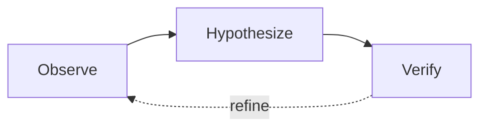

# ACE Framework Knowledge Base (Part 1)

Generated on 05/10/2026 20:03:13
This document contains a portion of the configuration, standards, prompts, and skills for the ACE Framework.


---

## File: .markdownlint.json

```json
{
  "default": true,
  "MD013": false,
  "MD033": false,
  "MD041": false,
  "MD024": {
    "siblings_only": true
  }
}

```

---

## File: .\ACE-SPEC.md

# ACE-Framework v2.5.0

## AI-assisted Code Engineering

> A rigorous, IDE-agnostic standard for professional development teams using AI agents. Treats AI interactions as structured transactions, not casual conversations.

---

## Table of Contents

1. [Directory Blueprint](#1-directory-blueprint)
2. [Core Methodologies](#2-core-methodologies)
3. [BMAD Agentic Roles](#3-bmad-agentic-roles)
4. [Documentation Standards](#4-documentation-standards)
5. [Architecture Decision Records](#5-architecture-decision-records)
6. [Active Context Pattern](#6-active-context-pattern)
7. [Root Cause Analysis & Regression Prevention](#7-root-cause-analysis--regression-prevention)
8. [Governance & Standards](#8-governance--standards)
9. [Session Management](#9-session-management)
10. [Multi-Agent Coordination](#10-multi-agent-coordination)
11. [Validation & Schemas](#11-validation--schemas)
12. [Getting Started](#12-getting-started)

---

## 1. Directory Blueprint

The repository must contain a `.ace/` directory (AI Context Engine). This is the **Shared Brain** of the project.

```
/
├── .ace/                      # AI Control Center (Knowledge Layer)
│   ├── feedback/              # Incident logs and improvement tracking
│   │   └── log.md
│   ├── knowledge/             # Domain-specific context
│   │   ├── glossary.md        # Domain terminology
│   │   ├── business-rules.md  # Core business logic
│   │   └── entities.md        # Domain model definitions
│   ├── packs/                 # Domain-specific Expansion Packs
│   │   ├── scientific/        # Scientific Expansion Pack (135+ skills)
│   │   └── ai-research/       # AI Research Expansion Pack (98+ skills)
│   ├── prompts/               # Verified "Golden Prompts"
│   │   ├── analyze-requirements.md
│   │   ├── extract-transcript.md
│   │   ├── generate-implementation-plan.md
│   │   └── verify-implementation.md
│   ├── roles/                 # BMAD Agentic Role definitions
│   │   └── roles.md           # All 9 roles in one file
│   ├── schemas/               # Validation definitions
│   │   └── validation.md
│   ├── skills/                # Task-specific procedural knowledge (AgentSkills.io standard)
│   │   ├── api-design/
│   │   │   └── SKILL.md
│   │   ├── database-operations/
│   │   │   └── SKILL.md
│   │   └── ... (22 core skills)
│   ├── standards/             # Immutable guardrails
│   │   ├── coding.md
│   │   ├── security.md
│   │   ├── architecture.md
│   │   └── documentation.md
│   └── workflows/             # Automation hooks
│       └── hooks.md
├── docs/
│   ├── adr/                   # Architecture Decision Records
│   │   ├── ADR-000-template.md
│   │   └── ADR-XXX-*.md
│   ├── context/               # Session state
│   │   └── ACTIVE_CONTEXT.md
│   ├── inputs/                # Raw unstructured data
│   │   └── transcripts/       # Meeting/interview transcripts
│   ├── planning/              # Implementation artifacts
│   │   ├── implementation_plan.md
│   │   ├── task_checklist.md
│   │   └── walkthrough.md
│   ├── rca/                   # Root Cause Analysis
│   │   ├── README.md
│   │   ├── RCA-000-template.md
│   │   └── regression-guards.yaml
│   └── requirements/          # Specifications & extracted requirements
│       ├── PRD-template.md
│       └── TECH_SPEC-template.md
├── .aceconfig                 # Framework configuration
├── ACE-SPEC.md               # This specification
└── README.md                 # Quick start guide
```

### Directory Purposes

| Directory         | Purpose                   | Mutability               |
| ----------------- | ------------------------- | ------------------------ |
| `.ace/standards/` | Non-negotiable rules      | Immutable (ADR required) |
| `.ace/skills/`    | Procedural task knowledge | Append-only              |
| `.ace/roles/`     | Agent role definitions    | Stable                   |
| `.ace/knowledge/` | Domain context            | Evolving                 |
| `.ace/prompts/`   | Tested prompt templates   | Versioned                |
| `docs/context/`   | Session state             | Volatile                 |
| `docs/inputs/`    | Raw unstructured data     | Append-only              |
| `docs/requirements/` | Specifications & requirements | Controlled          |
| `docs/adr/`       | Decision history          | Append-only              |
| `docs/rca/`       | Issue analysis            | Append-only              |
| `docs/planning/`  | Implementation artifacts  | Per-task                 |

---

## 2. Core Methodologies

### A. BMAD (Breakthrough Method for Agile AI-Driven Development)

BMAD enforces **Analyze → Plan → Execute → Verify** to prevent premature implementation.

```
┌───────────────────────────────────────────────────────────────────────┐
│                          BMAD Cycle                                   │
├───────────────────────────────────────────────────────────────────────┤
│                                                                       │
│   ┌───────┐    ┌───────┐    ┌──────┐    ┌───────┐    ┌──────┐         │
│   │ANALYZE│───▶│DISCUSS│───▶│ PLAN │───▶│EXECUTE│───▶│VERIFY│         │
│   └───────┘    └───────┘    └──────┘    └───────┘    └──────┘         │
│       │                                                   │           │
│       └──────────────◀────────────────────────────────────┘           │
│                    (Feedback Loop)                                    │
│                           │                                           │
│                    ┌──────┴──────┐                                    │
│                    │  INCIDENT   │ (When issues found)                │
│                    └─────────────┘                                    │
└───────────────────────────────────────────────────────────────────────┘
```

#### Phase 1: ANALYZE

```
Role: Architect
Input: docs/requirements/*, docs/adr/*, .ace/knowledge/*
Output: Understanding confirmation with extracted constraints

Actions:
- Read and summarize requirements
- Identify constraints from standards
- Extract applicable business rules
- List unknowns and questions
- Check regression guards for affected files
```

#### Phase 2: DISCUSS

```
Role: Architect
Input: Analysis output, User preferences
Output: docs/context/PROJECT_CONTEXT.md

Actions:
- Present multiple options for "gray areas" (UI, API style, etc.)
- Capture user preference on specific implementation details
- Document decisions in PROJECT_CONTEXT.md
- Ensure "Soft Requirements" are explicit before planning
```

#### Phase 3: PLAN

```
Role: Architect
Input: Analysis output
Output: docs/planning/implementation_plan.md (requires approval)

Actions:
- Break down into atomic tasks
- Define acceptance criteria per task
- Identify tests to write
- Order by dependencies
- Review against ADRs
```

#### Phase 4: EXECUTE

```
Role: Developer
Input: Approved plan, relevant .ace/skills/*
Output: Code in atomic, reviewable increments

Actions:
- Check regression guards before modifying files
- Implement one task at a time
- Write tests alongside code
- Update task_checklist.md
- Commit after each task
```

#### Phase 5: VERIFY

```
Role: QA Engineer
Input: Completed code, .ace/standards/*, docs/adr/*
Output: docs/planning/walkthrough.md

Actions:
- Execute verification plan
- Run all tests including regression tests
- Validate against acceptance criteria
- Check regression guard compliance
- Document proof of success
```

#### INCIDENT Mode

```
Role: Incident Responder
Trigger: Issue discovered at any phase
Output: docs/rca/RCA-XXX.md, regression guard, tests

Actions:
- Apply immediate fix
- Perform 5 Whys analysis
- Create RCA document
- Implement permanent fix
- Add regression guard
- Update standards if needed
```

### B. Skill-Augmentation

ACE provides **22 core skills** covering API design, database operations, testing, and more. Domain-specific capabilities are extended via **Expansion Packs** (Scientific & AI Research), adding **230+ specialized skills**.

- Core Skills: `api-design`, `database-operations`, `testing-strategy`, `root-cause-analysis`, etc.
- Expansion Packs: bioinformatics, chemistry, LLM optimization, MLOps.

**Invocation:**

```markdown
"Apply the skill in .ace/skills/[skill-name]/SKILL.md for this task.
Follow the procedure exactly and report validation results."
```

---

## 3. BMAD Agentic Roles

Seven specialized roles for distinct phases of work. Defined in `.ace/roles/roles.md`.

### Role Summary

| Role               | Mode         | Focus                   |
| ------------------ | ------------ | ----------------------- |
| Architect          | PLANNING     | Design, planning, ADRs  |
| Developer          | EXECUTION    | Implementation, tests   |
| QA Engineer        | VERIFICATION | Testing, validation     |
| Incident Responder | INCIDENT     | RCA, fixes, guards      |
| Data Scientist     | RESEARCH     | Statistics, experiments (Scientific Pack) |
| AI Expert          | RESEARCH     | Algorithms, models (Scientific Pack)      |
| Scientific Editor  | PUBLICATION  | Papers, documentation (Scientific Pack)   |
| AI Researcher      | RESEARCH     | Model architecture (AI Research Pack)     |
| MLOps Engineer     | RESEARCH     | Deployment & serving (AI Research Pack)   |

### Role Activation

```markdown
"Assume the [Role] role defined in .ace/roles/roles.md.
Focus on [role's responsibilities]. Follow the mode protocol."
```

### Role Transitions

```
PLANNING → EXECUTION
  Handoff: implementation_plan.md approved
  Pre-check: Regression guards reviewed

EXECUTION → VERIFICATION
  Handoff: Code committed, tests written
  Pre-check: Regression tests identified

Any → INCIDENT
  Trigger: Issue discovered
  Output: RCA with prevention measures

INCIDENT → Previous Mode
  Handoff: RCA closed, guards in place
  Pre-check: Regression tests passing
```

### Regression Guard Protocol

**All roles must follow:**

1. Before modifying files → Check `docs/rca/regression-guards.yaml`
2. If file is guarded → Read associated RCA, understand invariants
3. During modification → Ensure invariants maintained
4. After modification → Run regression tests, verify compliance

---

## 4. Documentation Standards

### Documentation Hierarchy

```
┌─────────────────────────────────────────────────────────┐
│                  DOCUMENTATION PYRAMID                  │
├─────────────────────────────────────────────────────────┤
│                                                         │
│              ┌─────────────────────┐                    │
│              │   docs/requirements/│  Source of Truth   │
│              │   (WHAT to build)   │  [Static]          │
│              └──────────┬──────────┘                    │
│                         │                               │
│         ┌───────────────┼───────────────┐               │
│         ▼               ▼               ▼               │
│   ┌───────────┐   ┌───────────┐   ┌───────────┐        │
│   │.ace/      │   │ docs/adr/ │   │.ace/      │        │
│   │standards/ │   │ (WHY we   │   │knowledge/ │        │
│   │(HOW to    │   │  decided) │   │(DOMAIN    │        │
│   │ build)    │   │ [Append]  │   │ context)  │        │
│   │[Immutable]│   └───────────┘   │[Evolving] │        │
│   └───────────┘                   └───────────┘        │
│                         │                               │
│         ┌───────────────┼───────────────┐               │
│         ▼               ▼               ▼               │
│   ┌───────────┐   ┌───────────┐   ┌───────────┐        │
│   │docs/rca/  │   │docs/      │   │docs/      │        │
│   │(Issues &  │   │planning/  │   │context/   │        │
│   │ Guards)   │   │(Tasks)    │   │(State)    │        │
│   │[Append]   │   │[Per-task] │   │[Volatile] │        │
│   └───────────┘   └───────────┘   └───────────┘        │
│                                                         │
└─────────────────────────────────────────────────────────┘
```

### Document Types

| Type          | Location          | Purpose              | Update Frequency      |
| ------------- | ----------------- | -------------------- | --------------------- |
| Specification | `docs/requirements/` | Define requirements  | Per feature           |
| Standard      | `.ace/standards/` | Enforce constraints  | Rarely (ADR required) |
| Decision      | `docs/adr/`       | Record choices       | Per decision          |
| RCA           | `docs/rca/`       | Document issues      | Per incident          |
| Plan          | `docs/planning/`  | Track implementation | Per task              |
| Context       | `docs/context/`   | Session state        | Per session           |

---

## 5. Architecture Decision Records

ADRs prevent AI from suggesting patterns that conflict with existing decisions.

### ADR Protocol

1. **Mandatory Creation:** Any significant architectural choice requires an ADR
2. **Naming:** `ADR-###-short-description.md`
3. **Pre-Task Loading:** Always read relevant ADRs before work

### ADR Template

```markdown
# ADR-###: [Title]

## Status

[Proposed | Accepted | Deprecated | Superseded by ADR-###]

## Date

[YYYY-MM-DD]

## Context

[Problem and constraints]

## Decision

[Specific choice made]

## Alternatives Considered

[What else was evaluated and why rejected]

## Consequences

### Positive

### Negative

### Neutral

## Compliance

[How to verify adherence]
```

---

## 6. Active Context Pattern

The **Context Memo Protocol** bridges sessions and prevents context drift.

### ACTIVE_CONTEXT.md Structure

```markdown
# Active Context: [Task Name]

## Session Metadata

- **Last Updated:** [YYYY-MM-DD HH:MM]
- **Active Role:** [Current role]
- **Mode:** [PLANNING | EXECUTION | VERIFICATION | INCIDENT]

## Current Objective

[Specific goal for this session]

## Current State

### Working

### In Progress

### Blocked

## Next Steps

1. [ ] [Immediate task]
2. [ ] [Following task]

## Active Constraints

- Standards: [relevant files]
- ADRs: [relevant files]
- Guards: [relevant files]

## Session Notes

[Context that would be lost without documentation]
```

### Update Triggers

- End of every session
- After completing significant task
- When encountering blocker
- Before role transition

---

## 7. Root Cause Analysis & Regression Prevention

Every issue requires RCA with regression prevention. No exceptions.

### RCA Process

```
1. DOCUMENT → Capture symptoms, evidence, timeline
2. ANALYZE  → 5 Whys to identify root cause
3. FIX      → Immediate fix + Permanent fix
4. PREVENT  → Tests + Guard + Standards update
5. VERIFY   → Confirm fix and prevention measures
```

### Regression Guards

Located in `docs/rca/regression-guards.yaml`:

```yaml
guards:
  - id: RCA-001
    title: "Description of issue"
    severity: critical
    rca_file: docs/rca/RCA-001-description.md
    guarded_files:
      - path/to/file.ts
    invariants:
      - "Condition that must remain true"
    tests:
      - tests/regression/rca-001.test.ts
    standard_rule: "RULE-ID in .ace/standards/xxx.md"
```

### Guard Enforcement

- **Pre-generation hook:** Check guards before modifying files
- **Post-generation hook:** Verify invariants maintained
- **Pre-commit hook:** Run regression tests
- **Code review:** Verify guard compliance

---

## 8. Governance & Standards

### The Instruction Budget

AI context windows are finite. Use tiered loading:

```
TIER 1: Always Loaded (~500 tokens)
├── .aceconfig (core rules)
└── Current ACTIVE_CONTEXT.md

TIER 2: Task-Specific (loaded on demand)
├── Relevant .ace/standards/ file
├── Relevant .ace/skills/ file
├── Relevant docs/adr/ files
└── Relevant regression guards

TIER 3: Deep Context (when referenced)
├── .ace/knowledge/* (domain)
└── docs/requirements/* (requirements)
```

### Core Rules (.aceconfig)

```yaml
core_rules:
  - "Never commit secrets, credentials, or API keys"
  - "All code must pass linting before commit"
  - "Follow patterns established in docs/adr/"
  - "Update ACTIVE_CONTEXT.md after each session"
  - "Verify against .ace/standards/ before completing any task"
  - "Generate IMPLEMENTATION_PLAN.md before writing code"
  - "Every task follows BMAD: Analyze → Plan → Execute → Verify"
  - "Create ADR for any significant architectural decision"
  - "Atomic commits with clear, descriptive messages"
  - "No code generation without reading existing code first"
  - "Check regression guards before modifying any guarded file"
  - "Every issue requires RCA with regression prevention"
```

---

## 9. Session Management

### Starting a Session

```markdown
"I am starting a new session with the ACE-Framework. Please:

1. Read .aceconfig for project configuration
2. Read .ace/roles/roles.md for available roles
3. Read docs/context/ACTIVE_CONTEXT.md for current state
4. Read docs/rca/regression-guards.yaml for active guards
5. Confirm understanding and await instructions."
```

### During a Session

- Maintain awareness of current role and mode
- Check regression guards before file modifications
- Update task_checklist.md as work progresses
- Note any decisions that need ADRs

### Ending a Session

```markdown
"Update docs/context/ACTIVE_CONTEXT.md with:

- Work completed this session
- Current blockers
- Next steps (1-3 specific tasks)
- Any open questions

Summarize the session state."
```

### Session Handoff

When transitioning between sessions or agents:

1. ACTIVE_CONTEXT.md must be current
2. All work-in-progress committed
3. Blockers documented
4. Next steps clearly defined

---

## 10. Multi-Agent Coordination

### Sequential Handoff

```
Agent A (Architect) → Agent B (Developer) → Agent C (QA)
                   ↓                     ↓
           implementation_plan.md   walkthrough.md
```

### Parallel Work

```
Coordinator assigns separate features to different agents.
Each maintains separate ACTIVE_CONTEXT_[feature].md.
Coordinator reviews before integration.
```

### Coordination Rules

1. **Lock awareness:** Check if files are being modified by another agent
2. **Context namespacing:** Use feature-specific context files for parallel work
3. **Merge protocol:** Coordinator reviews all changes before integration
4. **Conflict resolution:** ADR required for conflicting approaches

---

## 11. Validation & Schemas

### Schema Enforcement

Defined in `.ace/schemas/validation.md`. Validate AI outputs against expected structures:

- Implementation Plan schema
- ADR schema
- Active Context schema
- API documentation schema

### Validation Commands

```markdown
"Validate [document] against the schema in .ace/schemas/validation.md.
Report any violations."
```

---

## 12. Getting Started

### Quick Start Checklist

```markdown
## Phase 1: Initialize Structure

- [ ] .ace/ directory with subdirectories created
- [ ] docs/ directory with subdirectories created
- [ ] .aceconfig with core rules
- [ ] README.md with quick start

## Phase 2: Define Standards

- [ ] .ace/standards/coding.md for your stack
- [ ] .ace/standards/security.md with constraints
- [ ] .ace/standards/architecture.md with patterns

## Phase 3: Record Decisions

- [ ] ADR-001 for tech stack
- [ ] ADR-002 for architecture pattern
- [ ] Document existing decisions

## Phase 4: First Task

- [ ] Create spec in docs/requirements/
- [ ] Initialize ACTIVE_CONTEXT.md
- [ ] Run complete BMAD cycle
```

### First Session Prompt

```markdown
"I am initializing an ACE-Framework project. Please:

1. Read .aceconfig for project configuration
2. Read .ace/standards/ for coding constraints
3. Read .ace/roles/roles.md for available roles
4. Read docs/adr/ for existing decisions
5. Confirm you understand the project context

Then await further instructions."
```

---

## Appendix A: File Quick Reference

| Need To...                    | Look In...                             |
| ----------------------------- | -------------------------------------- |
| Understand project rules      | `.aceconfig`                           |
| Know available roles          | `.ace/roles/roles.md`                  |
| Check coding standards        | `.ace/standards/coding.md`             |
| Check security rules          | `.ace/standards/security.md`           |
| Get current context           | `docs/context/ACTIVE_CONTEXT.md`       |
| See implementation plan       | `docs/planning/implementation_plan.md` |
| Check architectural decisions | `docs/adr/`                            |
| Check regression guards       | `docs/rca/regression-guards.yaml`      |
| Understand domain terms       | `.ace/knowledge/glossary.md`           |
| Learn a specific skill        | `.ace/skills/[skill]/SKILL.md`               |

---

## Appendix B: Mode Quick Reference

| Mode         | Role               | Entry Trigger    | Exit Trigger        |
| ------------ | ------------------ | ---------------- | ------------------- |
| PLANNING     | Architect          | New task/feature | Plan approved       |
| EXECUTION    | Developer          | Plan approved    | Code complete       |
| VERIFICATION | QA Engineer        | Code complete    | Verification passed |
| INCIDENT     | Incident Responder | Issue discovered | RCA closed          |
| RESEARCH     | Data Scientist     | Analysis needed  | Results documented  |
| PUBLICATION  | Scientific Editor  | Writing needed   | Document complete   |

---

## Appendix C: Glossary

| Term              | Definition                                          |
| ----------------- | --------------------------------------------------- |
| **ACE**           | AI Context Engine - the `.ace/` directory structure |
| **ADR**           | Architecture Decision Record                        |
| **BMAD**          | Breakthrough Method for Agile AI-Driven Development |
| **Context Drift** | Loss of focus/state across AI sessions              |
| **Golden Prompt** | A tested, versioned prompt with known success rate  |
| **Guard**         | Regression prevention rule protecting a file        |
| **Invariant**     | Condition that must remain true after changes       |
| **RCA**           | Root Cause Analysis                                 |
| **Role**          | A defined agent persona with specific expertise     |
| **Skill**         | Procedural knowledge for a specific task type       |

---

_ACE-Framework v2.5.0_
_Treat AI interactions as structured transactions, not casual conversations._


---

## File: .\CHANGELOG.md

# Changelog

All notable changes to the ACE Framework will be documented in this file.

## [v2.5.0] - 2026-05-03

### Added

- **AI Research Expansion Pack**: Integrated and bundled 98+ AI engineering skills (vLLM, DeepSpeed, RLHF) from the Orchestra Research collection.
- **Modular Architecture**: Implemented the `includes` directive in `.aceconfig` for dynamic configuration loading of Expansion Packs.
- **Role Augmentation**: Added *AI Researcher* and *MLOps Engineer* roles.
- **Version Unification**: Unified all framework components, CLI, and documentation to v2.5.0.

### Changed

- **CLI v2.5.0**: Enhanced `create-ace-framework` with automated pack installers and configuration wiring.

## [v2.4.0] - 2026-05-03

### Added

- **Scientific Expansion Pack**: Integrated 135+ scientific skills (bioinformatics, chemistry, clinical data) and PhD-level personas.
- **New Scientific Roles**: Introduced *Data Scientist*, *AI Expert*, and *Scientific Editor* roles.
- **Expansion Pack Standard**: Defined the `.ace/packs/` directory structure for domain-specific skillsets.

## [v2.3.0] - 2026-05-01

### Added

- **AgentSkills Standard Migration**: Upgraded all legacy flat `.md` skills into the robust AgentSkills folder standard (with `SKILL.md` and YAML frontmatter).
- **Expanded Core Skills**: Grew the default skills library from 8 to 19, adding massive coverage for Data Engineering, AI Development, and DevOps.
  - *Data/AI*: `data-pipeline-design`, `prompt-engineering`, `model-evaluation`, `feature-engineering`
  - *Agentic*: `agent-design`, `a2a-communication`, `mcp-implementation`
  - *Engineering*: `security-audit`, `performance-optimization`, `accessibility-audit`, `ci-cd-pipeline`, `error-handling`, `documentation-generation`, `state-management`
- **Skill Import CLI Tool**: Built `ace-framework add-skill <url>` to natively import open-source skills via `degit` and auto-register them in `.aceconfig`.
- **SKILLS_GUIDE.md**: Created a dedicated, comprehensive guide at the root explaining how to build, use, and explicitly invoke skills.
- **Claude Code Native Plugins**: Added documentation for leveraging the `document-skills` plugin via Claude Marketplace.

### Changed

- **Configuration Wiring**: `.aceconfig` and `.aiconfig` updated with 11 new trigger keywords.
- **Validation**: Expanded `scripts/validate.sh` to enforce the existence of the new `SKILL.md` hierarchy.
- **Documentation**: Fully upgraded `USER_GUIDE.md`, `CLAUDE.md`, and `README.md` to point to the new AgentSkills structures and the `SKILLS_GUIDE.md`.

## [v2.2.0] - 2026-05-01
### Added

- **Transcript Analysis**: New golden prompt `.ace/prompts/extract-transcript.md` for extracting structured requirements from raw transcripts.
- **Transcript Analysis Skill**: New skill `.ace/skills/transcript-analysis/SKILL.md` defining the full ingest → extract → validate → iterate procedure.
- **Input Directory**: `docs/inputs/transcripts/` as the designated drop zone for raw unstructured data.
- **Requirements Directory**: `docs/requirements/` replaces `docs/specs/` as the unified home for specifications and extracted requirements.

### Changed

- **Architect Role**: Added transcript analysis responsibility, updated activation prompt to include "requirements extraction", expanded output to include Requirements Specifications.
- **Directory Structure**: `docs/specs/` migrated to `docs/requirements/`; PRD and TECH_SPEC templates moved.
- **Config Files**: `.aceconfig`, `.aiconfig`, `.cursorrules`, `CLAUDE.md` updated with transcript skill trigger and v2.2 version.
- **ACE-SPEC.md**: Directory blueprint, skills listing, prompts listing, and all `docs/specs/` references updated.
- **USER_GUIDE.md**: Skills table and keyword triggers updated with transcript-analysis.
- **Scaffolding**: CLI (`create-ace-framework.js`), `init.sh`, and `validate.sh` updated for new directory structure.

### Removed

- **`docs/specs/` directory**: Superseded by `docs/requirements/`. Templates preserved and relocated.

## [v2.1.0] - 2026-02-01

### Added

- **Discuss Phase**: New phase in BMAD (between Analyze and Plan) for capturing "soft" preferences.
- **Workflow**: `.ace/workflows/discuss-phase.md` to guide the discussion process.
- **Context**: `docs/context/PROJECT_CONTEXT.md` artifact for stable project preferences.
- **XML Tasks**: `implementation_plan.md` now uses XML `<task>` tags for better Agent parsing.
- **Atomic Commits**: Strict "One Task = One Commit" rule enforced in Developer role.

### Changed

- **ACE-SPEC.md**: Updated to include Discuss phase and new documentation standards.
- **Roles**: Updated Architect and Developer roles with new responsibilities.
- **Prompts**: Updated `generate-implementation-plan.md` to output XML format.

## [v2.0.0] - Initial Standard

### Added

- **BMAD Methodology**: The core "Analyze → Plan → Execute → Verify" loop.
- **Directory Setup**: Standardized `.ace/` directory structure for Agent knowledge.
- **Agentic Roles**: Definition of 7 key roles (Architect, Developer, QA, etc.).
- **Active Context**: Protocol for maintaining session state in `ACTIVE_CONTEXT.md`.
- **RCA Protocol**: Standardized Root Cause Analysis and Regression Guards.
- **ADR System**: Architecture Decision Records for tracking design choices.

## [v1.0] - Pre-history (The "Conversation" Era)

### Conceptual

- Represents the ad-hoc usage of LLMs without standardized frameworks.
- Characterized by:
  - Casual, unstructured conversations.
  - Lack of persistent context management.
  - No defined roles or responsibilities.
  - Fragile, non-reproducible outputs.
- **Note**: There are no files or specs for v1.0; it serves as the "dark age" baseline that v2.0 standardizes.


---

## File: .\CLAUDE.md

# CLAUDE.md

This file provides guidance to Claude Code (claude.ai/code) when working with code in this repository.

## Primary Project

The main codebase lives at `~/code_projects/ace_framework/` — an IDE-agnostic framework for structured AI-human collaboration in software development (ACE-Framework v2.5.0).

## Commands

### Validate framework structure
```bash
cd ~/code_projects/ace_framework && ./scripts/validate.sh
```

### Test scaffold in a new project
```bash
cd ~/code_projects/ace_framework && ./scripts/init.sh ../test-project
```

### Lint markdown files
```bash
cd ~/code_projects/ace_framework && npx markdownlint '**/*.md'
```

### Run CLI locally
```bash
node ~/code_projects/ace_framework/cli/bin/create-ace-framework.js <target-dir>
```

### Scaffold a new project via npx
```bash
npx create-ace-framework my-project
```

## Architecture

The `ace_framework` repo is a **documentation + tooling framework**, not a traditional code project. It provides:

- **`.ace/`** — The "AI Control Center" (Shared Brain): immutable standards, role definitions, skills, prompts, and schemas loaded by AI agents on demand.
- **`docs/`** — Per-project living documents: ADRs, session context (`ACTIVE_CONTEXT.md`), planning artifacts, RCA records, and specs.
- **`cli/`** — A Node.js CLI (`create-ace-framework`) that scaffolds the `.ace/` + `docs/` structure into any project, either from bundled templates or by cloning from GitHub.
- **`.aceconfig`** — YAML config that defines core rules, skill triggers, role routing, validation hooks, and context paths. This is always loaded first by AI agents.
- **`.cursorrules`** / **`.aiconfig`** — IDE-specific AI behavior configuration files that mirror `.aceconfig` for Cursor and other tools.

### BMAD Methodology

Every task follows **Analyze → Discuss → Plan → Execute → Verify**:

- **ANALYZE** (Architect role): Read specs, ADRs, and regression guards; identify constraints; list unknowns.
- **DISCUSS** (Architect role): Capture user preferences on "gray areas"; update `docs/context/PROJECT_CONTEXT.md`.
- **PLAN** (Architect role): Produce `docs/planning/implementation_plan.md` before writing code.
- **EXECUTE** (Developer role): Implement atomically; check `docs/rca/regression-guards.yaml` before touching guarded files; commit after each task.
- **VERIFY** (QA Engineer role): Run all tests; validate against acceptance criteria; produce `docs/planning/walkthrough.md`.
- **INCIDENT** (Incident Responder role): Triggered on any issue. Requires 5-Whys RCA doc, regression guard, and standards update.

### Key Files to Load at Session Start

Per `.cursorrules`, always read before any task:
1. `.aceconfig` — core rules and skill routing
2. `.ace/roles/roles.md` — available roles and responsibilities
3. `docs/context/ACTIVE_CONTEXT.md` — current session state
4. `docs/rca/regression-guards.yaml` — protected files and invariants

### Skill-Triggered Loading

`.aceconfig` maps task keywords to skills (load on demand, not upfront):

| Keyword | Skill file |
|---------|-----------|
| database | `.ace/skills/database-operations/SKILL.md` |
| api | `.ace/skills/api-design/SKILL.md` |
| testing | `.ace/skills/testing-strategy/SKILL.md` |
| migration | `.ace/skills/migration-logic/SKILL.md` |
| refactor | `.ace/skills/refactoring/SKILL.md` |
| bug/issue/incident | `.ace/skills/root-cause-analysis/SKILL.md` |
| transcript/meeting/interview | `.ace/skills/transcript-analysis/SKILL.md` |
| pipeline/etl/data | `.ace/skills/data-pipeline-design/SKILL.md` |
| prompt/llm/ai | `.ace/skills/prompt-engineering/SKILL.md` |
| model/evaluation/ml | `.ace/skills/model-evaluation/SKILL.md` |
| feature/engineering | `.ace/skills/feature-engineering/SKILL.md` |
| security/audit | `.ace/skills/security-audit/SKILL.md` |
| performance/optimize | `.ace/skills/performance-optimization/SKILL.md` |
| accessibility/a11y | `.ace/skills/accessibility-audit/SKILL.md` |
| ci/cd/deploy | `.ace/skills/ci-cd-pipeline/SKILL.md` |
| error/exception | `.ace/skills/error-handling/SKILL.md` |
| documentation/docs | `.ace/skills/documentation-generation/SKILL.md` |
| state/redux/context | `.ace/skills/state-management/SKILL.md` |
| agent/autonomous | `.ace/skills/agent-design/SKILL.md` |
| a2a/multi-agent | `.ace/skills/a2a-communication/SKILL.md` |
| mcp/protocol | `.ace/skills/mcp-implementation/SKILL.md` |

### Third-Party Skills (Claude Code Marketplace)

Because ACE uses the AgentSkills.io standard, you can instantly expand capabilities using Anthropic's native marketplace. 

To give the Architect the ability to parse PDFs, Word docs, and Excel files:
```bash
/plugin marketplace add anthropics/skills
/plugin install document-skills@anthropic-agent-skills
```
*Note: This allows you to directly pass binary documents into the `.ace/skills/transcript-analysis/SKILL.md` workflow or analyze-requirements prompt.*

### Expansion Packs

To keep the core framework lightweight, large domain-specific skill collections are managed as **Expansion Packs**.

**Scientific Expansion Pack**: Enables the *Data Scientist*, *AI Expert*, and *Scientific Editor* roles with 135+ scientific skills (e.g., bioinformatics, chemistry, clinical data).
```bash
npx skills add K-Dense-AI/scientific-agent-skills
```
*Note: Installing this pack dynamically loads `.ace/packs/scientific/.aceconfig-ext` into your core `.aceconfig`.*

**AI Research Expansion Pack**: Enables the *AI Researcher* and *MLOps Engineer* roles with 98+ AI engineering skills (e.g., vLLM, DeepSpeed, RLHF, Axolotl).
```bash
npx @orchestra-research/ai-research-skills
```
*Note: Installing this pack dynamically loads `.ace/packs/ai-research/.aceconfig-ext` into your core `.aceconfig`.*

### Regression Guard Protocol

Before modifying any file: check `docs/rca/regression-guards.yaml`. If guarded, read the associated RCA, understand the invariants, and run the specified regression tests after modification.

### Commit and Branch Conventions

- Branch naming: `feature/short-description`, `fix/issue-number-description`, `docs/what-changed`
- Commit format: `type(scope): description` (conventional commits)
- All code must pass linting before commit
- Atomic commits — one logical change per commit

### ADR Protocol

Create an ADR (`docs/adr/ADR-###-description.md`) for any significant architectural decision. Standards in `.ace/standards/` are immutable without an ADR.

### Session End

Always update `docs/context/ACTIVE_CONTEXT.md` with completed work, blockers, and next steps (1–3 specific tasks).


---

## File: .\CONTRIBUTING.md

# Contributing to ACE-Framework

Thank you for your interest in contributing to ACE-Framework! This document provides guidelines for contributing.

---

## Table of Contents

1. [Code of Conduct](#code-of-conduct)
2. [Getting Started](#getting-started)
3. [How to Contribute](#how-to-contribute)
4. [Development Setup](#development-setup)
5. [Pull Request Process](#pull-request-process)
6. [Style Guidelines](#style-guidelines)

---

## Code of Conduct

### Our Pledge

We pledge to make participation in our project a harassment-free experience for everyone, regardless of age, body size, disability, ethnicity, gender identity and expression, level of experience, nationality, personal appearance, race, religion, or sexual identity and orientation.

### Our Standards

**Positive behavior includes:**
- Using welcoming and inclusive language
- Being respectful of differing viewpoints
- Gracefully accepting constructive criticism
- Focusing on what is best for the community

**Unacceptable behavior includes:**
- Trolling, insulting comments, and personal attacks
- Public or private harassment
- Publishing others' private information
- Other conduct inappropriate in a professional setting

---

## Getting Started

### Prerequisites

- Git
- Text editor (VS Code, Cursor recommended)
- Basic understanding of Markdown
- Familiarity with AI-assisted development (helpful but not required)

### Fork and Clone

```bash
# Fork the repository on GitHub, then:
git clone https://github.com/YOUR_USERNAME/ace-framework.git
cd ace-framework
git remote add upstream https://github.com/jonnabio/ace-framework.git
```

---

## How to Contribute

### Reporting Bugs

1. Check if the bug is already reported in Issues
2. If not, create a new issue using the Bug Report template
3. Provide clear reproduction steps
4. Include your environment details

### Suggesting Features

1. Check existing issues and discussions
2. Create a Feature Request issue
3. Explain the use case and benefits
4. Be open to discussion and feedback

### Contributing Code

1. Find or create an issue for what you want to work on
2. Comment on the issue to claim it
3. Fork and create a branch
4. Make your changes
5. Submit a pull request

### Contributing Documentation

Documentation improvements are always welcome:
- Fix typos or unclear wording
- Add examples
- Improve explanations
- Translate to other languages

---

## Development Setup

### Directory Structure

```
ace-framework/
├── .ace/                 # Framework core
├── docs/                 # Documentation
├── cli/                  # CLI tool source
├── scripts/              # Utility scripts
└── .github/              # GitHub configuration
```

### Testing Changes

Before submitting:

1. **Validate structure:**
   ```bash
   ./scripts/validate.sh
   ```

2. **Test in a new project:**
   ```bash
   ./scripts/init.sh ../test-project
   cd ../test-project
   # Verify everything works
   ```

3. **Check markdown:**
   ```bash
   npx markdownlint '**/*.md'
   ```

---

## Pull Request Process

### Before Submitting

- [ ] Your code follows the style guidelines
- [ ] You have tested your changes
- [ ] Documentation is updated if needed
- [ ] You have added yourself to CONTRIBUTORS.md (optional)

### PR Guidelines

1. **Branch naming:**
   - `feature/short-description`
   - `fix/issue-number-description`
   - `docs/what-changed`

2. **Commit messages:**
   ```
   type(scope): description

   - Detail 1
   - Detail 2
   ```

3. **PR description:**
   - Use the PR template
   - Link related issues
   - Describe what and why

### Review Process

1. Maintainers will review within 1-2 weeks
2. Address any requested changes
3. Once approved, a maintainer will merge
4. Your contribution will be in the next release

---

## Style Guidelines

### Markdown

- Use ATX-style headers (`#`, `##`, `###`)
- One sentence per line (for better diffs)
- Use fenced code blocks with language tags
- Use tables for structured data
- Include blank lines before/after code blocks

### YAML

- 2-space indentation
- Quote strings with special characters
- Use comments to explain non-obvious values

### File Naming

- Use kebab-case for file names
- Use descriptive names
- Follow existing patterns in each directory

### Documentation

- Be concise but complete
- Include examples where helpful
- Link to related documents
- Keep the user in mind

---

## Recognition

Contributors are recognized in:
- CONTRIBUTORS.md file
- Release notes
- GitHub contributors page

---

## Questions?

- Open a Discussion on GitHub
- Check existing issues and discussions
- Read the USER_GUIDE.md

---

Thank you for contributing to ACE-Framework! 🎉


---

## File: .\DISTRIBUTION.md

# ACE-Framework Distribution Guide

This document explains how to distribute and deploy ACE-Framework to other developers and projects.

---

## Distribution Methods

### Method 1: GitHub Template (Recommended)

**For new projects - one click setup**

#### Setup as Template Repository

1. Push this repository to GitHub
2. Go to repository Settings
3. Check "Template repository"
4. Users can now click "Use this template"

#### User Experience

```
1. Go to https://github.com/jonnabio/ace-framework
2. Click "Use this template" → "Create a new repository"
3. Name your project
4. Clone and start working
```

#### Pros
- No dependencies required
- Preserves full structure
- Works with any tech stack
- Easy to discover via GitHub

---

### Method 2: CLI Tool (npx)

**For developers who prefer command line**

#### Publishing to npm

```bash
cd cli/
npm login
npm publish
```

#### User Experience

```bash
# Create new project
npx create-ace-framework my-project

# Add to existing project
npx create-ace-framework .

# Interactive mode
npx create-ace-framework
```

#### Updating the CLI

1. Update version in `cli/package.json`
2. Update templates if needed
3. Run `npm publish`

---

### Method 3: Init Script

**For quick setup in existing projects**

#### Hosting the Script

Host `scripts/init.sh` at a stable URL:
```
https://raw.githubusercontent.com/jonnabio/ace-framework/main/scripts/init.sh
```

#### User Experience

```bash
# One-liner installation
curl -fsSL https://raw.githubusercontent.com/jonnabio/ace-framework/main/scripts/init.sh | bash

# Or with wget
wget -qO- https://raw.githubusercontent.com/jonnabio/ace-framework/main/scripts/init.sh | bash

# Specify target directory
curl -fsSL https://...init.sh | bash -s -- my-project
```

---

### Method 4: Manual Download

**For offline or restricted environments**

#### Creating Release Archives

```bash
# Create zip
git archive --format=zip --prefix=ace-framework/ HEAD -o ace-framework-v2.5.0.zip

# Create tarball
git archive --format=tar.gz --prefix=ace-framework/ HEAD -o ace-framework-v2.5.0.tar.gz
```

#### User Experience

1. Download from GitHub Releases
2. Extract to project directory
3. Customize as needed

---

## Deployment Checklist

### Before First Release

- [ ] Update all `OWNER` placeholders in files
- [ ] Set up GitHub repository
- [ ] Enable "Template repository" in settings
- [ ] Create first release tag
- [ ] Publish CLI to npm (optional)
- [ ] Test all installation methods

### For Each Release

- [ ] Update version numbers
- [ ] Update CHANGELOG.md
- [ ] Create git tag (`git tag v2.5.0`)
- [ ] Push tag (`git push origin v2.5.0`)
- [ ] GitHub Actions will create release
- [ ] Update npm package (`cd cli && npm publish`)

---

## Customization Points

When users install the framework, they should customize:

### Required Customizations

1. **`.aceconfig`** - Project name and specific rules
2. **`.ace/standards/coding.md`** - Language-specific rules
3. **`docs/adr/ADR-001-*.md`** - Tech stack decisions

### Optional Customizations

1. **`.ace/knowledge/`** - Domain-specific terms and rules
2. **`.ace/standards/security.md`** - Project-specific security rules
3. **IDE configs** - Team preferences

---

## Version Strategy

### Semantic Versioning

```
MAJOR.MINOR.PATCH

MAJOR: Breaking changes to framework structure
MINOR: New features, templates, or skills
PATCH: Bug fixes, documentation updates
```

### Compatibility

- Major versions may require migration
- Minor versions are backward compatible
- Patch versions are drop-in replacements

---

## Supporting Multiple Languages

The framework is language-agnostic, but users may want language-specific standards.

### Approach 1: Separate Branches

```
main           - Generic framework
typescript     - TypeScript-specific standards
python         - Python-specific standards
go             - Go-specific standards
```

### Approach 2: Template Variants

```
npx create-ace-framework my-project --template typescript
npx create-ace-framework my-project --template python
```

### Approach 3: Addons

```bash
# Base framework
npx create-ace-framework my-project

# Add language pack
npx ace-framework add typescript
```

---

## Enterprise Deployment

### Internal Distribution

1. Fork to internal GitHub/GitLab
2. Customize standards for organization
3. Add organization-specific rules
4. Distribute via internal package registry

### Configuration

```yaml
# .aceconfig additions for enterprise
enterprise:
  organization: "Acme Corp"
  compliance:
    - SOC2
    - GDPR
  internal_standards:
    - .ace/standards/acme-security.md
```

---

## Metrics & Analytics

### Tracking Adoption

- GitHub stars/forks
- npm download counts
- Template usage (GitHub provides this)

### Feedback Collection

- GitHub Issues for bugs
- GitHub Discussions for questions
- User surveys periodically

---

## Support Channels

### For Users

1. **Documentation:** README.md, USER_GUIDE.md, ACE-SPEC.md
2. **Issues:** GitHub Issues for bugs
3. **Discussions:** GitHub Discussions for questions
4. **Updates:** Watch repository for releases

### For Contributors

1. **Contributing:** CONTRIBUTING.md
2. **Development:** Local setup instructions
3. **Pull Requests:** Use PR template

---

## Quick Reference

| Method | Command/Action | Best For |
|--------|----------------|----------|
| Template | "Use this template" on GitHub | New projects |
| CLI | `npx create-ace-framework my-project` | CLI users |
| Script | `curl ... \| bash` | Quick setup |
| Download | GitHub Releases | Offline use |

---

## Files to Update for Distribution

When preparing for distribution, update these placeholders:

| File | Placeholder | Replace With |
|------|-------------|--------------|
| `cli/package.json` | `OWNER` | GitHub username/org |
| `cli/bin/create-ace-framework.js` | `OWNER` | GitHub username/org |
| `scripts/init.sh` | `OWNER` | GitHub username/org |
| `.github/workflows/*.yml` | Repository URLs | Actual URLs |
| `README.md` | Badge URLs | Actual URLs |

---

*Distribution Guide - ACE-Framework v2.5.0*


---

## File: .\export_for_notebooklm.ps1

```ps1
$outputFileBase = "ace_notebooklm_export"
# Clean up old single file if it exists
if (Test-Path "$outputFileBase.md") { Remove-Item "$outputFileBase.md" }
# Clean up old chunks
Get-ChildItem -Path "." -Filter "${outputFileBase}_part*.md" | Remove-Item

# Define the file types we want to ingest into NotebookLM
$extensionsToInclude = @(".md", ".json", ".yaml", ".yml", ".sh", ".ps1")

Write-Host "Gathering ACE Framework files..."
$files = Get-ChildItem -Path "." -Recurse -File | Where-Object { $extensionsToInclude -contains $_.Extension }

# Exclude git, node_modules, and the output files to prevent recursion
$files = $files | Where-Object { 
    $_.FullName -notmatch "\\\.git\\" -and 
    $_.FullName -notmatch "\\node_modules\\" -and 
    $_.Name -notmatch "ace_notebooklm_export" 
}

$totalFiles = $files.Count
Write-Host "Found $totalFiles files to export."

# We will chunk every 120 files to stay safely under NotebookLM's 500k word limit per file.
$filesPerChunk = 120
$chunkIndex = 1
$fileCounter = 0

$currentOutputFile = "${outputFileBase}_part${chunkIndex}.md"
Add-Content -Path $currentOutputFile -Value "# ACE Framework Knowledge Base (Part $chunkIndex)`n`nGenerated on $(Get-Date)`nThis document contains a portion of the configuration, standards, prompts, and skills for the ACE Framework.`n"

$counter = 1
foreach ($file in $files) {
    if ($fileCounter -ge $filesPerChunk) {
        $chunkIndex++
        $fileCounter = 0
        $currentOutputFile = "${outputFileBase}_part${chunkIndex}.md"
        Add-Content -Path $currentOutputFile -Value "# ACE Framework Knowledge Base (Part $chunkIndex)`n`nGenerated on $(Get-Date)`nThis document contains a portion of the configuration, standards, prompts, and skills for the ACE Framework.`n"
    }

    $relativePath = Resolve-Path -Relative $file.FullName
    Write-Host "Processing ($counter/$totalFiles): $relativePath -> $currentOutputFile"
    
    # Add file header separator
    Add-Content -Path $currentOutputFile -Value "`n---`n`n## File: $relativePath`n"
    
    # Read file content safely
    try {
        $content = Get-Content -Path $file.FullName -Raw -ErrorAction Stop
        
        # If it's markdown, inject it directly. If it's code/config, wrap it in a code block.
        if ($file.Extension -eq ".md") {
            Add-Content -Path $currentOutputFile -Value $content
        } else {
            $ext = $file.Extension.Substring(1)
            Add-Content -Path $currentOutputFile -Value "``````$ext`n$content`n``````"
        }
    } catch {
        Write-Warning "Could not read $relativePath. Skipping."
    }
    
    $counter++
    $fileCounter++
}

Write-Host "Export successfully chunked into $chunkIndex files!"
Write-Host 'You can now upload all the ace_notebooklm_export_partX.md files into Google NotebookLM.'

```

---

## File: .\README.md

# ACE Framework v2.6.2

> **AI-assisted Code Engineering Framework**
> A rigorous, IDE-agnostic standard for professional development teams using AI agents. Treats AI interactions as structured transactions, not casual conversations.

## v2.6.2 Features: The Agentic Context Engineering (ACE) Update

- **Context Flushing (Clean Slate)**: Strict protocols to start fresh LLM sessions between roles to prevent context degradation and hallucinations.
- **The Triad (Generator, Reflector, Curator)**: Formalized the ACE paper's modular cycle:
  1. **Generator**: Developer agent executes the task using explicit **ReAct** (Reason+Act) traces.
  2. **Reflector**: QA agent distills natural language lessons from dense ReAct feedback.
  3. **Curator**: Integrates insights into the evolving playbook to manage redundancy.
- **File-Based State Tracking**: Replaced conversational context with explicit, atomic task queues (`tasks.json`) and progress logs.
- **Anti-Collapse Appends**: To prevent "Brevity Bias," agents are forbidden from rewriting standard files, updating them deterministically via `update_harness.sh` instead.
- **White-Box Auditing**: Playbooks (`.ace/standards/`) can be manually reviewed and sanitized by human domain experts to ensure compliance without requiring ML fine-tuning.

## v2.5.0 Features: The Expansion Pack Update

- **Modular Expansion Packs**: Support for domain-specific skillsets via the new `includes` architecture in `.aceconfig`.
- **Scientific Pack (135+ Skills)**: Bundles PhD-level expertise in Bioinformatics, Chemistry, and Clinical Data with augmented roles like *Data Scientist* and *Scientific Editor*.
- **AI Research Pack (98+ Skills)**: Provides production-grade engineering instructions for the entire LLM lifecycle (vLLM, DeepSpeed, RLHF, Axolotl).
- **CLI v2.5.0**: Enhanced scaffolding with automated expansion pack installers (`--pack` flag).
- **AgentSkills Standard**: Fully migrated and validated skills in the universal AgentSkills.io folder format.

## Core Pillars

1.  **BMAD Cycle**: Analyze → Discuss → Plan → Execute → Verify.
2.  **Agentic Roles**: 7 specialized personas (Architect, Developer, QA, etc.).
3.  **Active Context**: Persistent session management via `ACTIVE_CONTEXT.md`.
4.  **Regression Guards**: Proactive protection against regressions.

## Getting Started

- [USER_GUIDE.md](USER_GUIDE.md) - For daily workflow and phase execution.
- [SKILLS_GUIDE.md](SKILLS_GUIDE.md) - For a deep dive into the 19 core skills and how to invoke them.


---

## File: .\SKILLS_GUIDE.md

# ACE Framework Skills Guide

> **A comprehensive guide to understanding, using, and creating skills in the ACE Framework.**

---

## Table of Contents

1. [What are Skills?](#1-what-are-skills)
2. [The Skill Catalog](#2-the-skill-catalog)
3. [How to Invoke Skills](#3-how-to-invoke-skills)
4. [Using Third-Party Skills (AgentSkills.io)](#4-using-third-party-skills)
5. [Creating Custom Skills](#5-creating-custom-skills)

---

## 1. What are Skills?

In the ACE Framework, **Skills** are formalized procedural knowledge documents. If a **Role** (like Architect or Developer) is the *who*, a **Skill** is the *how*. 

Instead of asking an AI to "write a database migration" and hoping it remembers all the edge cases, you ask it to "apply the database-operations skill." 

A skill forces the AI to follow a rigorous, step-by-step checklist, preventing hallucinations, ensuring edge cases are covered, and maintaining consistency across your engineering team.

### Anatomy of a Skill

ACE Framework skills are stored in `.ace/skills/` and follow the [AgentSkills.io](https://github.com/anthropics/skills) folder standard. A typical skill directory looks like this:

```text
.ace/skills/api-design/
└── SKILL.md
```

Inside the `SKILL.md`, you will find:
- **YAML Frontmatter**: Metadata like the name and description.
- **Purpose**: Why the skill exists.
- **Prerequisites**: What must be done *before* starting.
- **Procedures**: The exact step-by-step checklist the AI must follow.
- **Common Pitfalls**: Known anti-patterns the AI should actively avoid.

---

## 2. The Skill Catalog

The framework comes with **22 core skills** covering the entire Software Development Life Cycle, plus **230+ additional skills** available through domain-specific Expansion Packs.

### Core Engineering
| Skill | Trigger Keywords | Description |
|-------|------------------|-------------|
| `api-design` | api, endpoint, REST | Designing robust, RESTful API endpoints. |
| `database-operations` | database, schema, migration | Modifying schemas, writing complex queries safely. |
| `migration-logic` | migration | Orchestrating zero-downtime data migrations. |
| `state-management` | state, redux, context | Managing complex UI or backend state securely. |

### AI & Data Engineering
| Skill | Trigger Keywords | Description |
|-------|------------------|-------------|
| `data-pipeline-design` | pipeline, etl, data | Designing idempotent ETL/ELT pipelines. |
| `prompt-engineering` | prompt, llm, ai | Structuring zero-shot and few-shot LLM prompts. |
| `model-evaluation` | model, evaluation, ml | Designing metrics and golden datasets for ML. |
| `feature-engineering` | feature, engineering | Handling nulls, outliers, and data encoding. |
| `agent-design` | agent, autonomous, tools | Designing autonomous AI agents and execution loops. |
| `a2a-communication` | a2a, multi-agent | Orchestrating multi-agent systems and handoffs. |
| `mcp-implementation` | mcp, protocol, server | Implementing Model Context Protocol servers. |

### Code Quality & Review
| Skill | Trigger Keywords | Description |
|-------|------------------|-------------|
| `code-review` | review | Conducting deep, multi-layered code reviews. |
| `testing-strategy` | test, coverage | Writing unit, integration, and E2E tests. |
| `refactoring` | refactor, clean up | Safely restructuring code without changing behavior. |
| `performance-optimization` | performance, optimize, speed | Identifying bottlenecks and improving Big-O efficiency. |
| `error-handling` | error, exception, logging | Standardizing boundaries and graceful degradation. |

### Security & Compliance
| Skill | Trigger Keywords | Description |
|-------|------------------|-------------|
| `security-audit` | security, vulnerability, audit | Identifying OWASP top 10 vulnerabilities. |
| `accessibility-audit`| accessibility, wcag, a11y | Ensuring strict WCAG UI compliance. |

### Analysis & Operations
| Skill | Trigger Keywords | Description |
|-------|------------------|-------------|
| `transcript-analysis` | transcript, meeting, interview | Extracting requirements from raw meeting notes. |
| `root-cause-analysis` | bug, issue, incident | Running a 5-Whys analysis on production bugs. |
| `ci-cd-pipeline` | ci, cd, pipeline, deploy | Building GitHub Actions and deployment flows. |
| `documentation-generation`| documentation, docs, readme | Generating JSDoc, OpenAPI specs, and diagrams. |

### Domain Expansion Packs (v2.5.0+)
Expansion Packs provide massive collections of specialized skills for specific fields. They are activated via the `includes` directive in `.aceconfig`.

| Pack | Skill Count | Focus Areas |
|------|-------------|-------------|
| **Scientific Pack** | 135+ | Bioinformatics (Scanpy), Chemistry (RDKit), Clinical Data, Statsmodels. |
| **AI Research Pack**| 98+ | LLM Lifecycles, vLLM, DeepSpeed, Axolotl, TRL, Transformers. |

---

## 3. How to Invoke Skills

There are two primary ways to invoke a skill: **Explicit Invocation** and **Automatic Triggers**.

### Explicit Invocation (Recommended)

To guarantee the AI uses the skill, explicitly point to the `SKILL.md` path in your prompt. This works perfectly in tools like Cursor, GitHub Copilot, and Claude.

**Prompt Example:**
```markdown
"Apply the performance-optimization skill from .ace/skills/performance-optimization/SKILL.md to analyze why this database query is slow."
```

### Automatic Triggers

The framework includes an `.aceconfig` and `.aiconfig` file. Advanced AI environments (like Claude Code or advanced Cursor rules) can read these files to automatically load a skill when you type a specific keyword.

For example, if you type:
```markdown
"Please help me fix this critical bug."
```
The AI sees the word `bug`, checks `.aceconfig`, and invisibly loads `.ace/skills/root-cause-analysis/SKILL.md` before responding.

---

## 4. Using Third-Party Skills

Because ACE adopted the **AgentSkills.io standard**, you can seamlessly import community-created skills. 

### Importing via ACE CLI

If you want to pull a skill from a GitHub repository into your project permanently:

```bash
npx ace-framework add-skill anthropics/skills/skills/pdf
```

This will:
1. Download the skill to `.ace/skills/pdf`.
2. Automatically register it in your `.aceconfig` so the AI knows it exists.

### Using Native Claude Code Plugins

If you use Claude Code via terminal, you don't even need to download them locally. You can use native plugins:

```bash
/plugin marketplace add anthropics/skills
/plugin install document-skills@anthropic-agent-skills
```
*Now you can simply say: "Use the PDF skill to read docs/inputs/spec.pdf".*

---

## 5. Creating Custom Skills

Every engineering team has unique procedures. You should absolutely create your own custom skills.

### Step 1: Create the Directory
```bash
mkdir .ace/skills/our-auth-flow
```

### Step 2: Create the SKILL.md
Create `.ace/skills/our-auth-flow/SKILL.md` using this template:

```markdown
---
name: our-auth-flow
description: How to implement Okta authentication in our frontend.
---

# Skill: Okta Auth Flow

## Purpose
Ensure all new micro-frontends implement auth consistently.

## Prerequisites
- [ ] Okta Client ID available in `.env`

## Procedures
Step 1: Install the SDK
- Run `npm install @okta/okta-react`

Step 2: Wrap the App
- Use the `<Security>` provider.
- Pass the standard configuration object.
...
```

### Step 3: Register It
Open `.aceconfig` and add a trigger word:

```yaml
skill_triggers:
  auth: .ace/skills/our-auth-flow/SKILL.md
```

Now, anytime you ask the AI to "set up auth," it will follow your exact corporate standard!


---

## File: .\USER_GUIDE.md

# ACE-Framework User Guide v2.5.0

> A practical guide to using the AI-assisted Code Engineering Framework.

---

## Table of Contents

1. [Introduction](#1-introduction)
2. [Getting Started](#2-getting-started)
3. [Daily Workflows](#3-daily-workflows)
4. [Working with Roles](#4-working-with-roles)
5. [Using Skills](#5-using-skills)
6. [Managing Context](#6-managing-context)
7. [Handling Issues](#7-handling-issues)
8. [Code Review Process](#8-code-review-process)
9. [Common Scenarios](#9-common-scenarios)
10. [Best Practices](#10-best-practices)
11. [Troubleshooting](#11-troubleshooting)
12. [Quick Reference](#12-quick-reference)

---

## 1. Introduction

### What is ACE-Framework?

ACE-Framework (AI-assisted Code Engineering) is a structured methodology for working with AI coding assistants. It ensures:

- **Consistency** - Same patterns across sessions and team members
- **Context Preservation** - No lost work between sessions
- **Quality** - Standards enforced at every step
- **Safety** - Regression prevention through guards

### The BMAD Methodology

Every task follows four phases:

```
┌───────────────────────────────────────────────────────────────────────┐
│                          BMAD Cycle                                   │
├───────────────────────────────────────────────────────────────────────┤
│                                                                       │
│   ┌───────┐    ┌───────┐    ┌──────┐    ┌───────┐    ┌──────┐         │
│   │ANALYZE│───â–¶│DISCUSS│───â–¶│ PLAN │───â–¶│EXECUTE│───â–¶│VERIFY│         │
│   └───────┘    └───────┘    └──────┘    └───────┘    └──────┘         │
│       │                                                   │           │
│       └──────────────â—€────────────────────────────────────┘           │
│                    (Feedback Loop)                                    │
│                           │                                           │
│                    ┌──────┴──────┐                                    │
│                    │  INCIDENT   │ (When issues found)                │
│                    └─────────────┘                                    │
└───────────────────────────────────────────────────────────────────────┘
```

**Never skip steps.** This prevents costly mistakes and rework.

### Key Concepts

| Concept  | What It Is                         | Where It Lives                    |
| -------- | ---------------------------------- | --------------------------------- |
| Role     | AI persona with specific expertise | `.ace/roles/roles.md`             |
| Skill    | Procedural knowledge for tasks     | `.ace/skills/`                    |
| Standard | Rules that must be followed        | `.ace/standards/`                 |
| Context  | Current session state              | `docs/context/ACTIVE_CONTEXT.md`  |
| ADR      | Recorded architectural decision    | `docs/adr/`                       |
| RCA      | Issue analysis with prevention     | `docs/rca/`                       |
| Guard    | Protection against regression      | `docs/rca/regression-guards.yaml` |

---

## 2. Getting Started

### First-Time Setup

If you're setting up a new project with ACE-Framework:

1. **Copy the framework structure** to your project
2. **Customize standards** for your tech stack
3. **Create initial ADRs** for existing decisions
4. **Set up IDE configuration** (`.cursorrules`, `.vscode/`)

### Starting Your First Session

When you begin working with an AI assistant:

```markdown
"I am starting a new session with the ACE-Framework. Please:

1. Read .aceconfig for project rules
2. Read .ace/roles/roles.md for available roles
3. Read docs/context/ACTIVE_CONTEXT.md for current state
4. Read docs/rca/regression-guards.yaml for protected files

Confirm you understand the context, then await instructions."
```

**What the AI will do:**

- Load project configuration
- Understand available roles
- See where previous work left off
- Know which files need special care

### Understanding Your Current State

Before starting work, check:

```markdown
"What is the current state of the project?
Summarize ACTIVE_CONTEXT.md and any pending tasks."
```

---

## 3. Daily Workflows

### Workflow A: Starting a New Feature

**Step 1: Analyze & Discuss**

```markdown
"Set mode to ANALYZE with Architect role.
I need to implement [feature description].
Analyze requirements, then run the Discuss phase to align on preferences."
```

**Step 2: Plan**

```markdown
"Use the preferences in PROJECT_CONTEXT.md to create an implementation plan.
Output tasks using the new XML format."
```

**Step 3: Review the Plan**
The AI will create `docs/planning/implementation_plan.md`. Review it:

- Are tasks correctly broken down?
- Are dependencies in order?
- Are acceptance criteria clear?

**Step 4: Approve and Execute**

```markdown
"The plan is approved. Switch to Developer role and EXECUTION mode.
Commit effectively: One atomic commit per task. No batching."
```

**Step 5: Verify**

```markdown
"Switch to QA Engineer role and VERIFICATION mode.
Verify the implementation against the acceptance criteria."
```

### Workflow B: Fixing a Bug

**Step 1: Investigate**

```markdown
"I found a bug: [description].
Investigate the issue and identify potential causes."
```

**Step 2: If Simple Fix**

```markdown
"This is a simple fix. Implement the fix following coding standards.
Write a test that would have caught this bug."
```

**Step 3: If Complex or Recurring**

```markdown
"This needs root cause analysis.
Switch to INCIDENT mode and apply the RCA skill."
```

### Workflow C: Continuing Previous Work

**Step 1: Load Context**

```markdown
"Read ACTIVE_CONTEXT.md and continue from where we left off.
What are the next steps?"
```

**Step 2: Resume Work**

```markdown
"Continue with [next task from context].
Remember to check regression guards for any files we modify."
```

### Workflow D: Code Review

```markdown
"Review this code change.
Check for standards compliance, security issues, and regression guards."
```

### Workflow E: Processing a Transcript

**Step 1: Prepare the Transcript**

Place your raw transcript (meeting notes, interview recording, etc.) in the input directory:

```
docs/inputs/transcripts/2026-05-01-kickoff-meeting.md
```

**Step 2: Extract Requirements**

```markdown
"Apply the transcript analysis skill from .ace/skills/transcript-analysis/SKILL.md
to process the transcript at docs/inputs/transcripts/2026-05-01-kickoff-meeting.md.
Extract all requirements and save to docs/requirements/REQ-001-project-kickoff.md."
```

**Step 3: Review and Validate**

```markdown
"Review the extracted requirements in docs/requirements/REQ-001-project-kickoff.md.
Identify any requirements marked AMBIGUOUS and suggest clarifying questions
I should ask the stakeholders."
```

**Step 4: Feed into BMAD Analyze**

```markdown
"Requirements extraction complete. Use docs/requirements/REQ-001-project-kickoff.md
as input for the Analyze phase. Apply the analyze-requirements prompt."
```

---

## 4. Working with Roles

### Available Roles

| Role                   | When to Use                             | Key Focus                    |
| ---------------------- | --------------------------------------- | ---------------------------- |
| **Architect**          | Planning new features, design decisions | Big picture, patterns, ADRs  |
| **Developer**          | Writing code, implementing features     | Clean code, tests, standards |
| **QA Engineer**        | Testing, verification                   | Edge cases, regression       |
| **Incident Responder** | Fixing bugs, investigating issues       | RCA, prevention              |
| **Data Scientist**     | Analysis, experiments (Scientific Pack) | Statistics, rigor            |
| **AI Expert**          | Algorithm design (Scientific Pack)      | Theory, optimization         |
| **Scientific Editor**  | Writing papers (Scientific Pack)        | Clarity, precision           |
| **AI Researcher**      | Model architecture (AI Research Pack)   | SOTA, theory, evaluation     |
| **MLOps Engineer**     | Deployment & serving (AI Research Pack) | vLLM, DeepSpeed, performance |

### Activating a Role

```markdown
"Switch to [Role Name] role."
```

Or more explicitly:

```markdown
"Assume the Developer role defined in .ace/roles/roles.md.
Focus on clean implementation following the approved plan."
```

### Role Transitions

Roles follow a natural flow:

```
Feature Development:
Architect → Developer → QA Engineer

Bug Investigation:
Any Role → Incident Responder → Previous Role

Research:
AI Expert → Data Scientist → Scientific Editor
```

**Important:** Complete one role's work before switching. Update `ACTIVE_CONTEXT.md` at transitions.

---

## 5. Using Skills

> **Note:** For a complete deep-dive into the core skills, expansion pack skills (Scientific & AI Research), how to invoke them, and how to import third-party skills via the CLI, please see the dedicated [SKILLS_GUIDE.md](SKILLS_GUIDE.md).

### What Are Skills?

Skills are detailed procedures for specific tasks. They contain:

- Step-by-step instructions
- Checklists
- Common pitfalls to avoid
- Validation criteria

### Available Skills

| Skill                    | Use For                  |
| ------------------------ | ------------------------ |
| `api-design/SKILL.md`          | Creating REST APIs       |
| `database-operations/SKILL.md` | Schema changes, queries  |
| `migration-logic/SKILL.md`     | Data/schema migrations   |
| `refactoring/SKILL.md`         | Improving code structure |
| `root-cause-analysis/SKILL.md` | Investigating issues     |
| `testing-strategy/SKILL.md`    | Writing tests            |
| `transcript-analysis/SKILL.md` | Extracting requirements  |
| `code-review/SKILL.md`         | Reviewing code           |
| `data-pipeline-design/SKILL.md`| Designing ETL/ELT flows  |
| `prompt-engineering/SKILL.md`  | Building LLM prompts     |
| `model-evaluation/SKILL.md`    | Testing ML models        |
| `feature-engineering/SKILL.md` | Transforming ML data     |
| `security-audit/SKILL.md`      | Security reviews         |
| `performance-optimization/SKILL.md` | Profiling/optimization |
| `accessibility-audit/SKILL.md` | WCAG compliance          |
| `ci-cd-pipeline/SKILL.md`      | DevOps & deployments     |
| `error-handling/SKILL.md`      | Exception strategies     |
| `documentation-generation/SKILL.md`| Auto-generating docs |
| `state-management/SKILL.md`    | App state & flow         |
| `agent-design/SKILL.md`        | Autonomous AI agents     |
| `a2a-communication/SKILL.md`   | Multi-agent protocols    |
| `mcp-implementation/SKILL.md`  | Model Context Protocol   |

### Third-Party Skills (Marketplace)

ACE Framework uses the **AgentSkills.io** standard, which means you can install external, executable skills directly from the community. 

**Option 1: Using the ACE CLI (Recommended)**
You can easily import any skill from a GitHub repository directly into your project using the ACE CLI:

```bash
npx ace-framework add-skill anthropics/skills/skills/pdf
```
This command will:
1. Download the skill folder into `.ace/skills/pdf`
2. Automatically register it in your `.aceconfig` under `skill_triggers`

**Option 2: Using Claude Code Native Plugins**
If you are using Claude Code, you can instantly add document parsing capabilities natively:

```bash
/plugin marketplace add anthropics/skills
/plugin install document-skills@anthropic-agent-skills
```
*After installation, you can ask the agent to "Use the PDF skill to extract requirements from docs/inputs/spec.pdf".*

### Invoking a Skill

```markdown
"Apply the [skill-name] skill from .ace/skills/[skill-name]/SKILL.md
for this task. Follow the procedure and checklist."
```

**Example:**

```markdown
"Apply the database-operations skill for this schema migration.
Follow the pre-migration checklist and create a rollback plan."
```

### Skill Automatic Triggers

Some keywords automatically suggest skills:

- "database", "migration", "schema" → `database-operations/SKILL.md`
- "api", "endpoint", "REST" → `api-design/SKILL.md`
- "test", "coverage" → `testing-strategy/SKILL.md`
- "bug", "issue", "incident" → `root-cause-analysis/SKILL.md`
- "transcript", "meeting", "interview" → `transcript-analysis/SKILL.md`
- "refactor", "clean up" → `refactoring/SKILL.md`
- "pipeline", "etl" → `data-pipeline-design/SKILL.md`
- "prompt", "llm" → `prompt-engineering/SKILL.md`
- "model", "evaluation" → `model-evaluation/SKILL.md`
- "feature", "engineering" → `feature-engineering/SKILL.md`
- "security", "vulnerability", "audit" → `security-audit/SKILL.md`
- "performance", "optimize", "speed" → `performance-optimization/SKILL.md`
- "accessibility", "wcag", "a11y" → `accessibility-audit/SKILL.md`
- "ci", "cd", "pipeline", "deploy" → `ci-cd-pipeline/SKILL.md`
- "error", "exception", "logging" → `error-handling/SKILL.md`
- "documentation", "docs", "readme" → `documentation-generation/SKILL.md`
- "state", "redux", "context" → `state-management/SKILL.md`
- "agent", "autonomous", "tools" → `agent-design/SKILL.md`
- "a2a", "multi-agent", "handoff" → `a2a-communication/SKILL.md`
- "mcp", "protocol", "server" → `mcp-implementation/SKILL.md`

---

## 6. Managing Context

### The ACTIVE_CONTEXT.md File

This file is the "memory" between sessions. It contains:

- Current objective
- What's working/broken/blocked
- Next steps
- Active constraints

### Updating Context

**During work:**

```markdown
"Update ACTIVE_CONTEXT.md: Task 2 is complete, moving to Task 3."
```

**End of session:**

```markdown
"Update ACTIVE_CONTEXT.md with:

- Completed: [what was done]
- Next steps: [what to do next]
- Notes: [anything important to remember]"
```

### Reading Context

**At session start:**

```markdown
"Read ACTIVE_CONTEXT.md and summarize the current state."
```

**To check status:**

```markdown
"What is my current objective according to ACTIVE_CONTEXT.md?"
```

### Context Best Practices

1. **Update frequently** - Don't wait until session end
2. **Be specific** - "Implemented user validation" not "worked on user stuff"
3. **Include blockers** - If something is stuck, document why
4. **List next steps** - Future you will thank present you

---

## 7. Handling Issues

### When You Find a Bug

**Step 1: Document It**

```markdown
"I found an issue: [description]
Document the symptoms and how to reproduce."
```

**Step 2: Assess Severity**

| Severity | Criteria               | Response        |
| -------- | ---------------------- | --------------- |
| Critical | System down, data loss | Immediate fix   |
| High     | Major feature broken   | Fix today       |
| Medium   | Feature degraded       | Fix this sprint |
| Low      | Minor issue            | Backlog         |

**Step 3: For Medium+ Issues, Create RCA**

```markdown
"Switch to INCIDENT mode.
Apply root-cause-analysis skill to investigate this issue."
```

### The RCA Process

1. **Document** - Capture symptoms, evidence
2. **Analyze** - Use 5 Whys to find root cause
3. **Fix** - Immediate fix + permanent fix
4. **Prevent** - Add tests, guards, update standards
5. **Verify** - Confirm fix and prevention work

### Creating a Regression Guard

After fixing an issue:

```markdown
"Create a regression guard for this fix.
Add to docs/rca/regression-guards.yaml with:

- Guarded files
- Invariants that must be maintained
- Tests that verify the fix"
```

### Checking Guards Before Modifying Files

**Always before editing:**

```markdown
"Check if [filename] has a regression guard.
If so, what invariants must be maintained?"
```

---

## 8. Code Review Process

### Requesting a Review

```markdown
"Apply the code-review skill to review this code.
Check against:

- .ace/standards/coding.md
- .ace/standards/security.md
- Regression guards for modified files"
```

### Review Checklist

The AI will check:

- [ ] Code standards compliance
- [ ] Security requirements
- [ ] Architecture patterns
- [ ] Test coverage
- [ ] Regression guard compliance
- [ ] Documentation

### Responding to Feedback

Feedback comes in types:

- **[BLOCKING]** - Must fix before merge
- **[SUGGESTION]** - Consider improving
- **[QUESTION]** - Needs clarification
- **[NIT]** - Minor style preference

---

## 9. Common Scenarios

### Scenario: "I don't know where to start"

```markdown
"I need to [goal]. I'm not sure where to begin.
Read the codebase and suggest an approach."
```

### Scenario: "The previous developer left no documentation"

```markdown
"Read the code in [directory] and create documentation:

1. What does this code do?
2. How does it fit into the system?
3. What are the key functions/classes?"
```

### Scenario: "I need to understand an existing decision"

```markdown
"Read all ADRs in docs/adr/ and explain why we use [technology/pattern]."
```

### Scenario: "Something broke after a change"

```markdown
"Something broke after my changes to [file].
Check regression guards and identify what invariant I may have violated."
```

### Scenario: "I need to add a feature like an existing one"

```markdown
"I need to add [new feature] similar to [existing feature].
Show me the existing implementation and create a plan for the new one."
```

### Scenario: "The AI is suggesting something that conflicts with our patterns"

```markdown
"Check docs/adr/ and docs/context/system_patterns.md.
Does your suggestion align with our established patterns?"
```

### Scenario: "I need to make an architectural decision"

```markdown
"Switch to Architect role.
I need to decide between [option A] and [option B].
Analyze trade-offs and create an ADR with the recommendation."
```

### Scenario: "I need to hand off work to a colleague"

```markdown
"Update ACTIVE_CONTEXT.md with a complete handoff summary:

- What was accomplished
- Current state of each component
- Pending decisions
- Known issues
- Recommended next steps"
```

---

## 10. Best Practices

### Do's

✅ **Start every session by reading context**

```markdown
"Read .aceconfig and ACTIVE_CONTEXT.md before we begin."
```

✅ **Use roles appropriately**

- Architect for planning
- Developer for coding
- QA for verification

✅ **Check guards before modifying files**

```markdown
"Check regression guards for files I'm about to modify."
```

✅ **Update context frequently**

- After completing tasks
- When encountering blockers
- At end of session

✅ **Create ADRs for decisions**

```markdown
"Create an ADR for the decision to use [technology/pattern]."
```

✅ **Follow BMAD**

- Analyze → Plan → Execute → Verify
- Never skip phases

### Don'ts

❌ **Don't skip planning**

- "Just write the code" leads to rework

❌ **Don't ignore standards**

- Standards exist for good reasons

❌ **Don't modify guarded files without checking**

- Guards prevent regressions

❌ **Don't forget to update context**

- Future sessions depend on it

❌ **Don't mix roles**

- Complete one role's work before switching

❌ **Don't skip verification**

- Testing catches issues early

---

## 11. Troubleshooting

### Problem: AI doesn't follow project patterns

**Solution:**

```markdown
"Read docs/context/system_patterns.md and docs/adr/.
Follow the established patterns in this codebase."
```

### Problem: AI suggests conflicting approach

**Solution:**

```markdown
"Check if there's an ADR that addresses this.
If our approach differs, explain why based on project constraints."
```

### Problem: Lost context between sessions

**Solution:**

```markdown
"Read ACTIVE_CONTEXT.md and all files in docs/planning/.
Reconstruct what was happening and continue."
```

If ACTIVE_CONTEXT.md is outdated:

```markdown
"The context seems outdated. Read recent git commits and
reconstruct the current project state."
```

### Problem: AI generates code that violates standards

**Solution:**

```markdown
"Verify this code against .ace/standards/coding.md and
.ace/standards/security.md. Fix any violations."
```

### Problem: Regression after changes

**Solution:**

```markdown
"Check docs/rca/regression-guards.yaml for the affected file.
What invariant was violated? How do we fix it?"
```

### Problem: Unclear requirements

**Solution:**

```markdown
"The requirements are unclear. Before proceeding:

1. List what I understand
2. List what needs clarification
3. Suggest reasonable assumptions"
```

### Problem: Don't know which skill to use

**Solution:**

```markdown
"I need to [task description].
Which skill in .ace/skills/ would help with this?"
```

---

## 12. Quick Reference

### Session Commands

| Action         | Command                                            |
| -------------- | -------------------------------------------------- |
| Start session  | "Read .aceconfig, roles.md, and ACTIVE_CONTEXT.md" |
| Check status   | "What's the current state per ACTIVE_CONTEXT.md?"  |
| Update context | "Update ACTIVE_CONTEXT.md with [changes]"          |
| End session    | "Update ACTIVE_CONTEXT.md and summarize session"   |

### Role Commands

| Action             | Command                        |
| ------------------ | ------------------------------ |
| Switch role        | "Switch to [Role] role"        |
| Check current role | "What role am I currently in?" |
| List roles         | "What roles are available?"    |

### Mode Commands

| Action             | Command                    |
| ------------------ | -------------------------- |
| Enter planning     | "Set mode to PLANNING"     |
| Enter execution    | "Set mode to EXECUTION"    |
| Enter verification | "Set mode to VERIFICATION" |
| Enter incident     | "Set mode to INCIDENT"     |

### Skill Commands

| Action      | Command                                      |
| ----------- | -------------------------------------------- |
| Apply skill | "Apply [skill-name] skill"                   |
| List skills | "What skills are available in .ace/skills/?" |

### Guard Commands

| Action          | Command                                |
| --------------- | -------------------------------------- |
| Check guards    | "Check regression guards for [file]"   |
| List all guards | "Show all regression guards"           |
| Create guard    | "Create regression guard for this fix" |

### ADR Commands

| Action     | Command                                 |
| ---------- | --------------------------------------- |
| Create ADR | "Create ADR for [decision]"             |
| List ADRs  | "List all ADRs"                         |
| Check ADRs | "Check if there's an ADR about [topic]" |

### Standard Commands

| Action            | Command                                  |
| ----------------- | ---------------------------------------- |
| Check standards   | "Verify against .ace/standards/"         |
| Specific standard | "Check against .ace/standards/[name].md" |

---

## Appendix: File Locations

| Need                | Location                               |
| ------------------- | -------------------------------------- |
| Project rules       | `.aceconfig`                           |
| Role definitions    | `.ace/roles/roles.md`                  |
| Coding standards    | `.ace/standards/coding.md`             |
| Security rules      | `.ace/standards/security.md`           |
| Current context     | `docs/context/ACTIVE_CONTEXT.md`       |
| System patterns     | `docs/context/system_patterns.md`      |
| Implementation plan | `docs/planning/implementation_plan.md` |
| ADR template        | `docs/adr/ADR-000-template.md`         |
| RCA template        | `docs/rca/RCA-000-template.md`         |
| Regression guards   | `docs/rca/regression-guards.yaml`      |
| Skills              | `.ace/skills/*/SKILL.md`                     |

---

## Getting Help

- **Full specification:** `ACE-SPEC.md`
- **Quick start:** `README.md`
- **Skills Guide:** `SKILLS_GUIDE.md`
- **Role details:** `.ace/roles/roles.md`
- **Runbooks:** `docs/runbooks/`

---

_ACE-Framework User Guide v2.3_
_Treat AI interactions as structured transactions, not casual conversations._


---

## File: .ace\feedback\log.md

# Feedback Log

> Track issues, improvements, and learnings from AI-assisted development sessions.

---

## How to Use

1. Log incidents when prompts fail or produce incorrect output
2. Track improvements made to prompts/skills
3. Review periodically to identify patterns
4. Update .ace/ files based on learnings

---

## Log Entries

### Entry [YYYY-MM-DD-001]

**Date:** [YYYY-MM-DD]
**Session:** [Session ID]
**Role:** [Role that was active]

#### Incident
[Description of what went wrong or could be improved]

#### Root Cause
[Why it happened - prompt issue, missing context, skill gap, etc.]

#### Category
- [ ] Prompt Failure
- [ ] Skill Gap
- [ ] Standard Violation
- [ ] Context Drift
- [ ] Other: [specify]

#### Resolution
[What was done to fix the immediate issue]

#### Prevention
[Changes made to prevent recurrence]
- [ ] Updated: [file path]
- [ ] Created: [file path]

#### Impact
- **Severity:** [Critical | High | Medium | Low]
- **Time Lost:** [estimate]

---

## Summary Statistics

| Category | Count | Last Occurrence |
|----------|-------|-----------------|
| Prompt Failure | 0 | - |
| Skill Gap | 0 | - |
| Standard Violation | 0 | - |
| Context Drift | 0 | - |

---

## Improvement Actions

| Action | Status | Date | Outcome |
|--------|--------|------|---------|
| [Action taken] | [Done/Pending] | [Date] | [Result] |

---

## Patterns Identified

### Pattern 1: [Name]
- **Frequency:** [How often]
- **Trigger:** [What causes it]
- **Prevention:** [How to avoid]

---

*Feedback Log - ACE-Framework v2.0*


---

## File: .ace\knowledge\business-rules.md

# Business Rules

> Core business logic and constraints that must be enforced.
> These rules are immutable without explicit stakeholder approval.

---

## How to Use This Document

1. AI agents must check rules before implementing features
2. Code must enforce all applicable rules
3. Tests must verify rule compliance
4. Violations must be flagged immediately

---

## Rule Categories

### Critical Rules
Must never be violated. System should prevent these at all costs.

### Standard Rules
Normal business constraints. May have edge cases requiring human approval.

### Soft Rules
Guidelines that can be overridden with appropriate authorization.

---

## Rules Registry

### [Category]: [Domain Area]

#### BR-001: [Rule Name]
- **Priority:** [Critical | Standard | Soft]
- **Description:** [Clear description of the rule]
- **Rationale:** [Why this rule exists]
- **Enforcement:** [How/where to enforce]
- **Exceptions:** [Any allowed exceptions]
- **Example:**
  ```
  Valid: [example of valid case]
  Invalid: [example of invalid case]
  ```

---

## Example Rules

### User Management

#### BR-001: Unique Email
- **Priority:** Critical
- **Description:** Each user account must have a unique email address
- **Rationale:** Email is the primary identifier for authentication
- **Enforcement:** Database unique constraint + validation layer
- **Exceptions:** None
- **Example:**
  ```
  Valid: user1@example.com (no existing user with this email)
  Invalid: user1@example.com (email already registered)
  ```

#### BR-002: Password Complexity
- **Priority:** Critical
- **Description:** Passwords must be at least 12 characters with mixed case, numbers, and symbols
- **Rationale:** Security requirement for account protection
- **Enforcement:** Validation on registration and password change
- **Exceptions:** None
- **Example:**
  ```
  Valid: MyP@ssw0rd123!
  Invalid: password123
  ```

---

### Order Processing

#### BR-010: Minimum Order Value
- **Priority:** Standard
- **Description:** Orders must meet minimum value of $10.00 before checkout
- **Rationale:** Cost of processing small orders exceeds margin
- **Enforcement:** Checkout validation
- **Exceptions:** Promotional campaigns may lower minimum
- **Example:**
  ```
  Valid: Cart total $15.00 → proceed to checkout
  Invalid: Cart total $5.00 → show minimum order message
  ```

#### BR-011: Inventory Check
- **Priority:** Critical
- **Description:** Cannot sell more items than available in inventory
- **Rationale:** Prevent overselling and customer disappointment
- **Enforcement:** Real-time inventory check at checkout
- **Exceptions:** Pre-order items with expected restock date
- **Example:**
  ```
  Valid: Order 5 units, 10 in stock → approve
  Invalid: Order 5 units, 3 in stock → reject or partial
  ```

---

## Adding New Rules

1. Propose rule with business stakeholder
2. Document in this file with unique ID
3. Create tests that verify the rule
4. Implement enforcement in code
5. Update ADR if architecturally significant

---

## Rule Validation

When implementing features:

```markdown
Checklist:
- [ ] Identified all applicable business rules
- [ ] Each rule has enforcement in code
- [ ] Each rule has test coverage
- [ ] Edge cases documented
- [ ] Stakeholder approved any exceptions
```

---

## Cross-References

- [See: .ace/standards/security.md] for security-related rules
- [See: docs/adr/] for rule-related architectural decisions
- [See: .ace/knowledge/entities.md] for entity definitions

---

*Last Updated: [DATE]*
*Requires stakeholder approval to modify*


---

## File: .ace\knowledge\entities.md

# Domain Entities

> Canonical definitions of domain entities and their relationships.
> This is the source of truth for domain modeling.

---

## How to Use This Document

1. Reference when designing database schemas
2. Reference when creating DTOs and interfaces
3. Ensure code entities match these definitions
4. Update when domain model changes (with ADR)

---

## Entity Definitions

### Template

```markdown
## [Entity Name]

### Description
[What this entity represents in the domain]

### Type
[Aggregate Root | Entity | Value Object]

### Attributes
| Attribute | Type | Required | Description |
|-----------|------|----------|-------------|
| id | UUID | Yes | Unique identifier |
| ... | ... | ... | ... |

### Relationships
- [relationship type] [related entity]: [description]

### Invariants
- [Rule that must always be true]

### Lifecycle
[Created when] → [States/transitions] → [Terminated when]

### Business Rules
- [BR-XXX]: [Reference to business rule]
```

---

## Core Entities

### User

#### Description
A person who interacts with the system. Can have various roles and permissions.

#### Type
Aggregate Root

#### Attributes
| Attribute | Type | Required | Description |
|-----------|------|----------|-------------|
| id | UUID | Yes | Unique identifier |
| email | String | Yes | Login identifier (unique) |
| passwordHash | String | Yes | Hashed password |
| name | String | Yes | Display name |
| role | Enum | Yes | User role (admin, user, guest) |
| status | Enum | Yes | Account status (active, suspended, deleted) |
| createdAt | DateTime | Yes | Account creation timestamp |
| updatedAt | DateTime | Yes | Last modification timestamp |
| lastLoginAt | DateTime | No | Last successful login |

#### Relationships
- Has many **Sessions**: Active login sessions
- Has many **Orders**: Orders placed by user
- Has one **Profile**: Extended user information

#### Invariants
- Email must be unique across all users
- Password must meet complexity requirements
- Cannot delete user with pending orders

#### Lifecycle
Created (registration) → Active → Suspended (violation) → Active (reinstated) OR Deleted (request)

#### Business Rules
- [BR-001]: Unique Email
- [BR-002]: Password Complexity

---

## Value Objects

### Address

#### Description
A physical or mailing address. Immutable.

#### Type
Value Object

#### Attributes
| Attribute | Type | Required | Description |
|-----------|------|----------|-------------|
| street | String | Yes | Street address |
| city | String | Yes | City name |
| state | String | Yes | State/province |
| postalCode | String | Yes | Postal/ZIP code |
| country | String | Yes | Country code (ISO) |

#### Validation Rules
- Postal code format must match country
- Country must be valid ISO code

---

### Money

#### Description
A monetary value with currency. Immutable.

#### Type
Value Object

#### Attributes
| Attribute | Type | Required | Description |
|-----------|------|----------|-------------|
| amount | Decimal | Yes | Numeric value |
| currency | String | Yes | Currency code (ISO 4217) |

#### Validation Rules
- Amount cannot be negative (use separate type for debits)
- Currency must be valid ISO 4217 code
- Operations between different currencies forbidden

---

## Entity Relationships Diagram

```
┌──────────────────────────────────────────────────────────────┐
│                     ENTITY RELATIONSHIPS                     │
├──────────────────────────────────────────────────────────────┤
│                                                              │
│   ┌──────────┐         ┌──────────┐         ┌──────────┐    │
│   │   User   │────────▶│  Order   │────────▶│OrderItem │    │
│   │          │ 1    *  │          │ 1    *  │          │    │
│   └──────────┘         └──────────┘         └──────────┘    │
│        │                    │                     │          │
│        │ 1                  │ 1                   │ *        │
│        ▼                    ▼                     ▼          │
│   ┌──────────┐         ┌──────────┐         ┌──────────┐    │
│   │ Profile  │         │ Payment  │         │ Product  │    │
│   │          │         │          │         │          │    │
│   └──────────┘         └──────────┘         └──────────┘    │
│                                                              │
│   Legend:                                                    │
│   ─────▶  Has relationship                                   │
│   1    *  One to many                                        │
│   1    1  One to one                                         │
│                                                              │
└──────────────────────────────────────────────────────────────┘
```

---

## Aggregates

### User Aggregate
- Root: User
- Contains: Profile, Sessions
- Boundary: User data and authentication

### Order Aggregate
- Root: Order
- Contains: OrderItems, Payment
- Boundary: Single order transaction

---

## Adding/Modifying Entities

1. Propose change with domain expert
2. Update this document
3. Create ADR if significant
4. Update database migrations
5. Update code models
6. Update tests

---

## Cross-References

- [See: .ace/knowledge/glossary.md] for term definitions
- [See: .ace/knowledge/business-rules.md] for entity rules
- [See: .ace/standards/architecture.md] for modeling patterns

---

*Last Updated: [DATE]*
*Requires ADR for significant changes*


---

## File: .ace\knowledge\glossary.md

# Domain Glossary

> Canonical definitions of domain terminology.
> AI agents should use these terms consistently.

---

## How to Use This Document

1. When encountering domain terms, check here first
2. Use exact terms in code (variable names, comments)
3. Use exact terms in documentation
4. Add new terms as they emerge (with team review)

---

## Terms

### A

**Aggregate**
A cluster of domain objects treated as a single unit for data changes. Has one root entity that controls access.

**Aggregate Root**
The entity that serves as the entry point to an aggregate. External objects can only hold references to the root.

---

### B

**Bounded Context**
A logical boundary within which a particular domain model is defined and applicable. Terms may have different meanings in different contexts.

**Business Rule**
A constraint or requirement that defines or constrains some aspect of the business. Must be enforced by the domain layer.

---

### C

**Command**
An action that changes state. Named imperatively (CreateUser, UpdateOrder). Should be idempotent when possible.

---

### D

**Domain Event**
A record of something significant that happened in the domain. Named in past tense (UserCreated, OrderShipped). Immutable.

**Domain Service**
A stateless operation that doesn't naturally belong to an entity or value object. Encapsulates domain logic that involves multiple aggregates.

**DTO (Data Transfer Object)**
A simple object used to transfer data between layers or systems. No business logic.

---

### E

**Entity**
A domain object with a unique identity that persists over time. Identity matters more than attributes.

**Event Sourcing**
Storing the state of an entity as a sequence of events rather than current state. Enables full audit trail.

---

### I

**Idempotent**
An operation that produces the same result regardless of how many times it's executed. Critical for retry safety.

**Invariant**
A condition that must always be true within an aggregate. Enforced by the aggregate root.

---

### P

**Projection**
A read model built from events. Optimized for queries rather than commands.

---

### Q

**Query**
A request for data that does not change state. Safe to retry. Should not have side effects.

---

### R

**Repository**
An abstraction that provides collection-like access to aggregates. Hides persistence details from the domain.

---

### S

**Saga**
A sequence of transactions that maintains consistency across multiple aggregates or services. Handles compensation on failure.

**Service (Application)**
Orchestrates domain objects to accomplish a use case. Contains no business logic itself.

---

### U

**Ubiquitous Language**
The practice of using the same terms in code, documentation, and conversation. Bridges technical and domain experts.

**Use Case**
A specific way users interact with the system to achieve a goal. Maps to application service methods.

---

### V

**Value Object**
A domain object defined by its attributes rather than identity. Immutable. Two value objects with same attributes are equal.

---

## ACE-Framework Terms

**Confidence Rating**
A classification assigned to each extracted requirement indicating how directly it was stated: EXPLICIT (directly stated), INFERRED (derived from context), or AMBIGUOUS (unclear intent, needs follow-up).

**Golden Prompt**
A tested, versioned prompt template stored in `.ace/prompts/` that produces reliable, structured output for a specific BMAD phase or task. Tracked with success rates.

**Requirements Specification**
A structured document produced by the transcript analysis skill, containing categorized functional requirements, non-functional requirements, constraints, assumptions, and conflicts — each with traceability back to source quotes.

**Transcript Analysis**
The process of extracting formal, structured requirements from raw unstructured transcripts (meetings, interviews, brainstorms). Executed by the Architect role using the `.ace/skills/transcript-analysis/SKILL.md` skill.

## Project-Specific Terms

> Add project-specific terminology below

### [Term]
[Definition]

### [Term]
[Definition]

---

## Term Changes

When modifying terms:
1. Update this glossary
2. Update code to match
3. Update documentation
4. Create ADR if significant

---

*Last Updated: [DATE]*


---

## File: .ace\packs\ai-research\0-autoresearch-skill\SKILL.md

---
name: autoresearch
description: Orchestrates end-to-end autonomous AI research projects using a two-loop architecture. The inner loop runs rapid experiment iterations with clear optimization targets. The outer loop synthesizes results, identifies patterns, and steers research direction. Routes to domain-specific skills for execution, supports continuous agent operation via Claude Code /loop and OpenClaw heartbeat, and produces research presentations and papers. Use when starting a research project, running autonomous experiments, or managing a multi-hypothesis research effort.
version: 1.0.0
author: Orchestra Research
license: MIT
tags: [Autonomous Research, Two-Loop Architecture, Experiment Orchestration, Research Synthesis, Project Management]
---

# Autoresearch

Autonomous research orchestration for AI coding agents. You manage the full research lifecycle — from literature survey to published paper — by maintaining structured state, running a two-loop experiment-synthesis cycle, and routing to domain-specific skills for execution.

You are a research project manager, not a domain expert. You orchestrate; the domain skills execute.

**This runs fully autonomously.** Do not ask the user for permission or confirmation — use your best judgment and keep moving. Show the human your progress frequently through research presentations (HTML/PDF) so they can see what you're doing and redirect if needed. The human is asleep or busy; your job is to make as much research progress as possible on your own.

## Getting Started

Users arrive in different states. Determine which and proceed:

| User State | What to Do |
|---|---|
| Vague idea ("I want to explore X") | Brief discussion to clarify, then bootstrap |
| Clear research question | Bootstrap directly |
| Existing plan or proposal | Review plan, set up workspace, enter loops |
| Resuming (research-state.yaml exists) | Read state, continue from where you left off |

If things are clear, don't over-discuss — proceed to full autoresearch. Most users want you to just start researching.

**Step 0 — before anything else**: Set up the agent continuity loop. See [Agent Continuity](#agent-continuity-mandatory--set-up-first). This is MANDATORY. Without it, the research stops after one cycle.

### Initialize Workspace

Create this structure at the project root:

```
{project}/
├── research-state.yaml       # Central state tracking
├── research-log.md           # Decision timeline
├── findings.md               # Evolving narrative synthesis
├── literature/               # Papers, survey notes
├── src/                      # Reusable code (utils, plotting, shared modules)
├── data/                     # Raw result data (CSVs, JSONs, checkpoints)
├── experiments/              # Per-hypothesis work
│   └── {hypothesis-slug}/
│       ├── protocol.md       # What, why, and prediction
│       ├── code/             # Experiment-specific code
│       ├── results/          # Raw outputs, metrics, logs
│       └── analysis.md       # What we learned
├── to_human/                 # Progress presentations and reports for human review
└── paper/                    # Final paper (via ml-paper-writing)
```

- **`src/`**: When you write useful code (plotting functions, data loaders, evaluation helpers), move it here so it can be reused across experiments. Don't duplicate code in every experiment directory.
- **`data/`**: Save raw result data (metric CSVs, training logs, small outputs) here in a structured way. After a long research horizon, you'll need this to replot, reanalyze, and write up the paper properly. Name files descriptively (e.g., `trajectory_H1_runs001-010.csv`). Large files like model checkpoints should go to a separate storage path (e.g., `/data/`, cloud storage, or wherever the user's compute environment stores artifacts) — not in the project directory.

Initialize `research-state.yaml`, `research-log.md`, and `findings.md` from [templates/](templates/). Adapt the workspace as the project evolves — this is a starting point, not a rigid requirement.

## The Two-Loop Architecture

This is the core engine. Everything else supports it.

```
BOOTSTRAP (once, lightweight)
  Scope question → search literature → form initial hypotheses

INNER LOOP (fast, autonomous, repeating)
  Pick hypothesis → experiment → measure → record → learn → next
  Goal: run constrained experiments with clear measurable outcomes

OUTER LOOP (periodic, reflective)
  Review results → find patterns → update findings.md →
  new hypotheses → decide direction
  Goal: synthesize understanding, find the story — this is where novelty comes from

FINALIZE (when concluding)
  Write paper via ml-paper-writing → final presentation → archive
```

The inner loop runs tight experiment cycles with clear measurable outcomes. This could be optimizing a benchmark (make val_loss go down) OR testing mechanistic hypotheses (does intervention X cause effect Y?). The outer loop steps back to ask: what do these results *mean*? What patterns emerge? What's the story? Research is open-ended — the two loops let you both optimize and discover.

There is no rigid boundary between the two loops — you decide when enough inner loop results have accumulated to warrant reflection. Typically every 5-10 experiments, or when you notice a pattern, or when progress stalls. The agent's judgment drives the rhythm.

### Research is Non-Linear

The two-loop structure is a rhythm, not a railroad. At any point during research you can and should:

- **Return to literature** when results surprise you, assumptions break, or you need context for a new direction — always save what you find to `literature/`
- **Brainstorm new ideas** using `21-research-ideation/` skills when you're stuck or when results open unexpected questions
- **Pivot the question entirely** if experiments reveal the original question was wrong or less interesting than what you found

This is normal. Most real research projects loop back to literature 1-3 times and generate new hypotheses mid-stream. Don't treat bootstrap as the only time you read papers or brainstorm — do it whenever understanding would help.

## Bootstrap: Literature and Hypotheses

Before entering the loops, understand the landscape. Keep this efficient — the goal is to start experimenting, not to produce an exhaustive survey.

1. **Search literature** for the research question. Use multiple sources — never stop at one:
   - **Exa MCP** (`web_search_exa`) if available — best for broad discovery and finding relevant papers quickly
   - **Semantic Scholar** (`pip install semanticscholar`) — best for ML/AI papers, citation graphs, and specific paper lookup. See `20-ml-paper-writing` skill's `references/citation-workflow.md` for complete API code examples
   - **arXiv** (`pip install arxiv`) — best for recent preprints and open-access papers
   - **CrossRef** — best for DOI lookup and BibTeX retrieval
   - Keep searching until you have good coverage. If one source comes up empty, try another with different keywords

   **Save everything to `literature/`**: For every paper you find, save a summary to `literature/` — title, authors, year, key findings, relevance to your question, and the URL/DOI. Create one file per paper and a running `literature/survey.md` with all summaries. This is your reference library — you and future sessions will need it throughout the project.

2. **Identify gaps** from the literature
   - What's been tried? What hasn't? Where do existing methods break?
   - What do Discussion sections flag as future work?

3. **Form initial hypotheses** — invoke `21-research-ideation/` skills
   - `brainstorming-research-ideas` for structured diverge-converge workflow
   - `creative-thinking-for-research` for deeper cognitive frameworks
   - Each hypothesis must be testable with a clear prediction

4. **Define the evaluation**
   - Set the proxy metric and baseline before running experiments
   - The metric should be computable quickly (minutes, not hours)
   - Lock evaluation criteria upfront to prevent unconscious metric gaming

5. **Record** in research-state.yaml, log the bootstrap in research-log.md

## The Inner Loop

Rapid iteration with clear measurable outcomes. Two flavors:

- **Optimization**: make a metric go up/down (val_loss, accuracy, throughput). Think Karpathy's autoresearch.
- **Discovery**: test mechanistic hypotheses about why something works. The metric is a measurement (does grokking happen faster? does entropy increase before forgetting?), not just a target to optimize.

```
1.  Pick the highest-priority untested hypothesis
2.  Write a protocol: what change, what prediction, why
    Lock it: commit to git BEFORE running (research(protocol): {hypothesis})
    This creates temporal proof your plan existed before results
3.  Run the experiment (invoke the relevant domain skill)
4.  Sanity check before trusting results:
    - Did training converge? No NaN/Inf?
    - Does baseline reproduce expected performance?
    - Data loading correct? (spot-check a few samples)
5.  Measure the proxy metric
6.  Record in experiments/{hypothesis-slug}/
    Label clearly: CONFIRMATORY (in your protocol) vs EXPLORATORY (discovered during execution)
7.  If positive: keep, note WHY it worked
8.  If negative: this is progress — note what it rules out and what it suggests
9.  Update research-state.yaml
10. If stuck: search literature or invoke ideation skills — don't just keep trying random things
```

**Never stop.** Even if something fails, find a path forward. Debug, adjust, simplify, or pivot — but keep the research moving. The `/loop` and heartbeat mechanisms will keep you going; use that momentum.

### Route to Domain Skills

When you need domain-specific execution, search the skills library:

| Research Activity | Look In |
|---|---|
| Data preparation | `05-data-processing/` |
| Model training / fine-tuning | `01-model-architecture/`, `03-fine-tuning/`, `06-post-training/` |
| Distributed training | `08-distributed-training/` |
| Optimization (quantization, attention) | `10-optimization/` |
| Evaluation / benchmarks | `11-evaluation/` |
| Inference / serving | `12-inference-serving/` |
| Interpretability analysis | `04-mechanistic-interpretability/` |
| Experiment tracking (W&B, MLflow) | `13-mlops/` |
| Cloud compute | `09-infrastructure/` |

Read the relevant SKILL.md before starting — it has workflows, common issues, and code examples. See [references/skill-routing.md](references/skill-routing.md) for a complete guide.

### Track the Experiment Trajectory

Maintain a running record of measurable outcomes across experiments:

```json
{
  "experiment_id": "run_014",
  "hypothesis": "H3",
  "metric_value": 0.847,
  "baseline": 0.812,
  "delta": "+0.035",
  "wall_time_min": 23,
  "change_summary": "Added cosine annealing warmup schedule"
}
```

This trajectory produces the optimization plot (like Karpathy's progress chart) — include it in progress reports. Humans love seeing the upward curve.

## The Outer Loop

Step back from individual experiments. Synthesize.

```
1. Review all results since last reflection
2. Cluster by type: what kinds of changes worked? Which didn't?
3. Ask WHY — identify the mechanism behind successes and failures
4. Update findings.md with current understanding
5. Search literature if results were surprising or assumptions need revisiting
6. Generate new hypotheses if warranted (invoke 21-research-ideation/ skills)
7. Decide direction (see criteria below)
8. Update research-state.yaml with new direction
9. Log the reflection in research-log.md
10. If there's something meaningful, generate a progress presentation
```

### Deciding Direction

Don't just pick randomly — use these criteria:

**DEEPEN** — a supported result raises follow-up questions
- Does the effect hold under different conditions? What's the mechanism?
- Action: generate sub-hypotheses (H1.1, H1.2) → back to inner loop

**BROADEN** — current results are solid, but adjacent questions are untested
- New questions emerged. The current contribution is clear but more is possible.
- Action: generate new root hypotheses → back to inner loop

**PIVOT** — results invalidate key assumptions or something more interesting appeared
- A core assumption was wrong, or an unexpected finding is more promising than the original question.
- Action: return to literature with new questions → re-bootstrap

**CONCLUDE** — sufficient evidence for a contribution
- At least one hypothesis is strongly supported (or a coherent set of negative results)
- Key ablations completed, error analysis done
- findings.md reads like a paper backbone — a human could write the abstract from it
- No critical open questions that would change the story

Note: coherent negative results are a valid contribution. "X does NOT work because Y" is publishable if the reasoning is rigorous.

### findings.md Is Your Project Memory

This file serves two purposes: it's the research narrative for humans AND your accumulated knowledge base as an agent. Read it at the start of every session, /loop tick, or heartbeat to remember what you've learned.

After every outer loop, update it to answer:

- What do we know so far? (Current Understanding)
- What patterns explain our results? (Patterns and Insights)
- What specific things did we learn not to repeat? (Lessons and Constraints)
- What remains open? (Open Questions)

The "Lessons and Constraints" section is especially important — it captures specific actionable learnings like "weight decay > 0.1 diverges at this scale" or "baseline only reproduces with batch_size=64." This prevents the agent from repeating failed approaches across sessions.

**Quality test**: After 30 inner loop experiments, a human should be able to read findings.md and write a paper abstract from it. If they can't, the outer loop isn't synthesizing — it's just logging.

## Agent Continuity (MANDATORY — Set Up First)

**Before doing anything else**, set up the wall-clock loop. This is what keeps the research running continuously. Without it, the agent stops after one cycle.

### Claude Code

**First action — run this immediately:**

```
/loop 20m Continue autoresearch. Read research-state.yaml and findings.md. Re-read the autoresearch SKILL.md occasionally to stay aligned. Step back and reflect holistically — is the research making real progress? Are you deepening understanding or just running experiments? If stalling, pivot or search literature for new ideas. Keep making research progress — never idle, never stop. Update findings.md, research-log.md, and research-state.yaml when there's new progress. Git commit periodically and clean up the repo if needed. Show the human your research progress with key plots and findings by preparing a report in to_human/ and opening the HTML/PDF. Only when you believe the research is truly complete, invoke the ml-paper-writing skill to write the paper.
```

This fires every 20 minutes regardless of what's happening. It's a rhythm that keeps you working — not a research phase boundary. If your previous work isn't done, just continue it.

### OpenClaw

**First action — set up a 20-minute cron job in the current session. You MUST do this before any research work.**

Use the `cron.add` tool to create a recurring job bound to this chat session:

```json
{
  "name": "autoresearch-loop",
  "schedule": { "kind": "every", "everyMs": 1200000 },
  "sessionTarget": "current",
  "payload": {
    "kind": "agentTurn",
    "message": "Continue autoresearch. Read research-state.yaml and findings.md. Re-read the autoresearch SKILL.md occasionally to stay aligned. Step back and reflect holistically — is the research making real progress? Are you deepening understanding or just running experiments? If stalling, pivot or search literature for new ideas. Keep making research progress — never idle, never stop. Update findings.md, research-log.md, and research-state.yaml when there's new progress. Git commit periodically and clean up the repo if needed. Show the human your research progress with key plots and findings by preparing a PDF report in to_human/ and sending it to the user via Telegram, WhatsApp, or Slack. When you get an exciting result or interesting plot, text it to the user right away — don't wait for a full report. Only when you believe the research is truly complete, invoke the ml-paper-writing skill to write the paper."
  }
}
```

Key details:
- `sessionTarget: "current"` binds the cron to this chat session so it maintains conversation context across ticks
- `everyMs: 1200000` = 20 minutes
- After creation, verify with `cron.list` that the job exists and is enabled
- If the cron fires while you're mid-experiment, just continue — the tick is a nudge, not a restart

### What the Loop Does

The `/loop` and cron job are purely **wall-clock rhythm**. They are completely separate from your research loops (inner/outer). On each tick:

1. Read `research-state.yaml` and `findings.md` — remember where you are
2. Check if anything is broken (failed experiments, stalled training, errors)
3. If on track → keep working on whatever you were doing
4. If stuck or something's wrong → step back, diagnose, fix, then continue
5. Never idle. Always be making progress.

## Progress Reporting

When you have something meaningful to share, create a research presentation — not just a status dashboard, but a compelling story.

**When to report** (your judgment):
- After an outer loop that found a significant pattern
- When the optimization trajectory shows clear progress (include the plot!)
- After a pivot in direction
- Before requesting human input on a decision
- When concluding

**What to include** (adapt to what's compelling):
- The research question and why it matters
- Key results with visualizations (plots, metric tables)
- The optimization trajectory chart (metric over experiments)
- What was tried and why (selective, not exhaustive)
- Current understanding (the findings narrative)
- What's planned next

For Claude Code: generate HTML and `open` it. If HTML fails to open or render, convert to PDF as fallback (use `weasyprint`, `playwright pdf`, or `wkhtmltopdf`). For OpenClaw: generate PDF directly.

See [references/progress-reporting.md](references/progress-reporting.md) for template scaffolding and the optimization plot approach. Use the template as a starting point — be creative with what you show.

## Git Protocol

Commit at natural research milestones:

| When | Message Pattern |
|---|---|
| Workspace initialized | `research(init): {project} — {question}` |
| Experiment protocol locked | `research(protocol): {hypothesis}` |
| Significant results | `research(results): {hypothesis} — {outcome}` |
| Outer loop direction change | `research(reflect): {direction} — {reason}` |
| Paper draft complete | `research(paper): {title}` |

**Hard rule**: Protocol commits MUST precede result commits. Never combine them. The git history is your lightweight pre-registration — it proves what you planned before you saw results. Don't commit after every experiment — commit when there's meaningful progress.

## Concluding: Paper Writing

When the outer loop decides to CONCLUDE:

1. Ensure findings.md has a clear, well-supported narrative
2. Study 2-3 top related papers to learn their format, style, and section structure
3. Invoke the `20-ml-paper-writing` skill — it has LaTeX templates for NeurIPS, ICML, ICLR, ACL, AAAI, COLM, and systems venues
4. Feed it the accumulated literature, experimental results, and findings
5. Follow its citation verification workflow — never hallucinate references
6. Generate a final comprehensive research presentation

Proceed autonomously through the writing process. If the ml-paper-writing skill suggests human collaboration points, adapt and keep going — produce the best draft you can. The human will review and provide feedback.

## Research Discipline

Principles to enforce continuously — not tied to any specific phase:

- **Lock before you run**: Commit your experiment protocol to git before executing. This proves your plan existed before you saw results. Never combine protocol + results in one commit.
- **Confirmatory vs exploratory**: Results matching your locked protocol are confirmatory. Everything else is exploratory — interesting but requiring more skepticism.
- **Negative results are progress**: A refuted hypothesis tells you something. Log what it rules out and what it suggests. Don't treat it as failure.
- **Sanity check before analysis**: Verify training converged, baselines reproduce, and data is correct before trusting your primary metric.
- **Return to literature when confused**: Don't guess — search. If results surprise you or assumptions break, go find papers. Use Exa MCP for discovery, Semantic Scholar for specific ML/AI paper lookup, arXiv for preprints.
- **Never stop**: Don't wait for human approval on routine decisions. If a skill or tool suggests collaboration, adapt and keep going. Find the best path forward autonomously. The human will see your progress reports and can redirect if needed.
- **Use whatever compute is available**: Adapt to the user's environment — local GPU, cluster job submission, cloud instances, or just CPU. If no GPU is available, use CPU and adjust experiment scale accordingly. Don't block on compute availability.

## Quality Standards

**Good agent behavior:**
- Hypotheses have mechanistic reasoning ("X because Y, predicting Z"), not just "try X"
- findings.md builds a coherent narrative, not a flat list of results
- Negative results are recorded with what they rule out
- The agent updates its model when experiments contradict expectations
- Progress reports tell a research story with compelling visualizations

**Bad agent behavior:**
- Pure hyperparameter sweeps without interpretation
- findings.md is just experiment logs copy-pasted
- Agent never revisits its assumptions after failures
- Optimizing metrics without understanding why changes work

## When to Use vs Alternatives

**Use autoresearch when:**
- You have a research question explorable through experiments
- There's a measurable proxy metric for inner loop optimization
- The real contribution requires synthesis beyond the metric
- You want continuous autonomous research operation

**Use individual domain skills instead when:**
- You have a specific one-off task (train a model, run eval, write a paper)
- No iterative experimentation needed

## Common Issues

**Inner loop stalls (no metric improvement)**
Run an outer loop. Is the metric the right one? Is the search space exhausted? Consider broadening or pivoting. Search literature for new approaches.

**Stuck and not making progress**
Don't keep trying random changes. Step back: search literature for related work, invoke `21-research-ideation/` brainstorming skills, or run an outer loop reflection. Being stuck means you need new information or a new perspective, not more experiments.

**Results contradict baseline expectations**
Investigate, don't ignore. Return to literature — your protocol might have an error, the published baseline may be wrong, or conditions differ. Update findings.md with what you learn.

**Agent loses context between ticks**
Ensure research-state.yaml and findings.md are updated after every action. These files are your memory across sessions.

**Can't find relevant papers**
Try multiple approaches in order: Exa MCP for broad search, Semantic Scholar for specific ML/AI paper lookup (`pip install semanticscholar`), arXiv for preprints (`pip install arxiv`). Check `20-ml-paper-writing` skill's `references/citation-workflow.md` for complete API code. Note: Google Scholar has no official API — use Semantic Scholar instead for programmatic search.

**No GPU available**
Use CPU and scale experiments down. Many research tasks (analysis, interpretability, small model training) run fine on CPU. Adjust experiment design to fit available compute rather than blocking.

**Experiments take longer than /loop interval**
Normal. On the next tick, check if it finished. If not, keep waiting or do something else useful (update notes, search papers). Adjust interval if needed.

**Not sure when to conclude**
Three questions: Do you have a strongly supported finding? Can you explain WHY it works? Would findings.md make a convincing paper abstract? If yes to all: conclude.

## Advanced Topics

- **Detailed agent continuity**: [references/agent-continuity.md](references/agent-continuity.md)
- **Progress presentation templates**: [references/progress-reporting.md](references/progress-reporting.md)
- **Complete skill routing**: [references/skill-routing.md](references/skill-routing.md)


---

## File: .ace\packs\ai-research\0-autoresearch-skill\references\agent-continuity.md

# Agent Continuity: Keeping Research Running

Autonomous research requires agents that keep working continuously — hours, overnight, or days. This reference covers how to set up the wall-clock loop on each platform.

## MANDATORY: Set Up Before Anything Else

The wall-clock loop is the first thing you do when starting autoresearch. Without it, the agent does one cycle of work and stops. The loop fires every 20 minutes and simply tells the agent: "keep working, check if anything's wrong."

This is completely separate from the research inner/outer loops. The wall-clock loop is a fixed-interval prompt injection. The research loops run at experiment speed (minutes to hours per cycle). They will not sync and don't need to.

## Claude Code: /loop

**Run this as your very first action:**

```
/loop 20m Continue autoresearch. Read research-state.yaml and findings.md. Check: is the current experiment done? Are there errors? Is progress stalling? If everything is on track, keep working. If something is wrong, step back and fix it. Never idle.
```

### What Happens on Each Tick

The `/loop` message fires every 20 minutes. When it fires:

1. **Read state** — `research-state.yaml` and `findings.md` to remember where you are and what you've learned
2. **Check health** — is the current experiment running? Did it error? Is training diverging?
3. **If on track** → continue whatever you were doing (don't restart or re-plan)
4. **If stuck or broken** → step back, diagnose the issue, fix it, then continue
5. **If idle** → you shouldn't be. Pick the next hypothesis and start an experiment

The tick is a nudge, not a phase boundary. If the previous tick's work isn't done, just keep going.

### When Experiments Run Longer Than 20 Minutes

This is normal and expected. On the next tick:
- Check if the experiment finished
- If still running: monitor for errors, do lightweight work (update notes, search papers)
- Don't restart or duplicate the experiment

### Context Recovery

Your primary memory between ticks is `research-state.yaml` and `findings.md`. Keep them updated after every experiment and reflection. If you lose context, read both files plus `research-log.md` to reconstruct where you are.

## OpenClaw: Cron Job

**Set up a 20-minute cron job in the current session as your very first action.** Use the `cron.add` tool to create a recurring job bound to the current chat session:

```json
{
  "name": "autoresearch-loop",
  "schedule": { "kind": "every", "everyMs": 1200000 },
  "sessionTarget": "current",
  "payload": {
    "kind": "agentTurn",
    "message": "Continue autoresearch. Read research-state.yaml and findings.md. Check: is the current experiment done? Are there errors? Is progress stalling? If everything is on track, keep working. If something is wrong, step back and fix it. Never idle."
  }
}
```

Key details:
- `sessionTarget: "current"` binds the cron to the current chat session (resolved to `session:<sessionKey>` at creation time), so it maintains conversation context across ticks
- `everyMs: 1200000` = 20 minutes
- Verify with `cron.list` that the job is created and enabled
- To check run history later: `cron.runs` with the job ID

### Context Between Cron Ticks

OpenClaw cron invocations may start fresh each time. Your workspace files are your memory:

- `research-state.yaml` — where you are, what's active
- `findings.md` — what you've learned (read this every time!)
- `research-log.md` — what happened chronologically

Keep these updated after every action so the next cron tick can pick up seamlessly.

### Progress Reports

OpenClaw can't `open` HTML files locally like Claude Code can. When you have something to report:

1. Generate a PDF progress summary (use Python with reportlab, matplotlib, or similar)
2. Include: research question, key results, optimization trajectory plot, current understanding, next steps
3. Send it to the user via Telegram, WhatsApp, or Slack — whichever channel they use
4. When you get an exciting result or interesting plot, send it right away — don't wait for a full report

## Research State as Ground Truth

Both platforms share the same ground truth: the workspace files.

| File | Purpose | Update Frequency |
|---|---|---|
| `research-state.yaml` | Machine-readable state | After every experiment and reflection |
| `research-log.md` | Decision timeline | After every significant action |
| `findings.md` | Narrative understanding + project memory | After every outer loop |
| `experiments/*/results/` | Raw experimental data | After every experiment |

The wall-clock loop (`/loop` or cron) is just the trigger. The workspace files are the memory. Keep them current.


---

## File: .ace\packs\ai-research\0-autoresearch-skill\references\progress-reporting.md

# Progress Reporting: Research Presentations

When the research produces something worth sharing, create a compelling presentation — not a status dump, but a research story with visuals.

## When to Report

You decide when progress is meaningful enough to report. Consider reporting:

- After an outer loop reflection that identified a significant pattern
- When the optimization trajectory shows clear, sustained improvement
- After a pivot — explain why the direction changed
- Before requesting human input on a major decision
- When concluding the research, before paper writing

Maximum frequency: once per /loop tick or heartbeat cycle. Minimum: whenever you have something a human would find interesting.

## What Makes a Good Research Presentation

A good progress report reads like a research talk, not a database query. It should:

1. **Tell a story**: why we started, what we tried, what we found, what it means
2. **Show, don't just tell**: include plots, tables, comparisons — not just text
3. **Be selective**: highlight the interesting findings, don't exhaustively list every experiment
4. **End with direction**: what happens next and why

## Recommended Sections

Adapt these to what's compelling from your current research. Skip sections that aren't relevant. Add sections the research demands.

### 1. Research Question and Motivation
- What are we investigating and why does it matter?
- One paragraph, accessible to someone unfamiliar with the project

### 2. Approach
- What's our method? What are we optimizing?
- The two-loop architecture in one sentence

### 3. Optimization Trajectory (The Karpathy Plot)
- X-axis: experiment number or wall-clock time
- Y-axis: proxy metric value
- Show baseline as a horizontal line
- Annotate significant jumps with what change caused them
- This is often the most compelling visual — include it whenever possible

### 4. Key Findings
- The 2-3 most significant results with supporting evidence
- Include plots, metric tables, comparison charts
- Explain WHY results are significant, not just WHAT they are

### 5. What We Tried (Decision Map)
- A selective view of the hypothesis tree
- Focus on the reasoning: why each direction was chosen, what it taught us
- Include both successes and informative failures

### 6. Current Understanding
- The findings.md narrative, but presented compellingly
- What's our best explanation for the patterns we see?

### 7. Next Steps
- What experiments are planned and why
- What questions remain open
- Any decisions that need human input

## The Optimization Trajectory Plot

This is the signature visual of autoresearch — a chart showing metric improvement over experiments.

Minimal implementation (SVG-based, no dependencies):

```python
def generate_trajectory_svg(trajectory_data, width=800, height=400):
    """Generate an SVG optimization trajectory chart.

    trajectory_data: list of {"run": int, "metric": float, "label": str}
    """
    if not trajectory_data:
        return "<p>No experiments yet.</p>"

    metrics = [d["metric"] for d in trajectory_data]
    min_m, max_m = min(metrics), max(metrics)
    margin = (max_m - min_m) * 0.1 or 0.1
    y_min, y_max = min_m - margin, max_m + margin

    padding = 60
    plot_w = width - 2 * padding
    plot_h = height - 2 * padding
    n = len(trajectory_data)

    def x_pos(i):
        return padding + (i / max(n - 1, 1)) * plot_w

    def y_pos(v):
        return padding + plot_h - ((v - y_min) / (y_max - y_min)) * plot_h

    # Build SVG
    svg = f'<svg width="{width}" height="{height}" xmlns="http://www.w3.org/2000/svg">'
    svg += f'<rect width="{width}" height="{height}" fill="#1a1a2e" rx="8"/>'

    # Grid lines
    for i in range(5):
        y = padding + i * plot_h / 4
        val = y_max - i * (y_max - y_min) / 4
        svg += f'<line x1="{padding}" y1="{y}" x2="{width-padding}" y2="{y}" stroke="#333" stroke-dasharray="4"/>'
        svg += f'<text x="{padding-8}" y="{y+4}" fill="#888" text-anchor="end" font-size="11">{val:.3f}</text>'

    # Baseline line
    baseline = trajectory_data[0]["metric"]
    by = y_pos(baseline)
    svg += f'<line x1="{padding}" y1="{by}" x2="{width-padding}" y2="{by}" stroke="#ff6b6b" stroke-dasharray="6" opacity="0.7"/>'
    svg += f'<text x="{width-padding+5}" y="{by+4}" fill="#ff6b6b" font-size="10">baseline</text>'

    # Data line
    points = " ".join(f"{x_pos(i)},{y_pos(d['metric'])}" for i, d in enumerate(trajectory_data))
    svg += f'<polyline points="{points}" fill="none" stroke="#4ecdc4" stroke-width="2"/>'

    # Data points
    for i, d in enumerate(trajectory_data):
        cx, cy = x_pos(i), y_pos(d["metric"])
        svg += f'<circle cx="{cx}" cy="{cy}" r="4" fill="#4ecdc4"/>'

    # Title
    svg += f'<text x="{width/2}" y="24" fill="#eee" text-anchor="middle" font-size="14" font-weight="bold">Optimization Trajectory</text>'
    svg += f'<text x="{width/2}" y="{height-10}" fill="#888" text-anchor="middle" font-size="11">Experiment Run</text>'
    svg += '</svg>'
    return svg
```

Embed the SVG output directly in the HTML report. Annotate significant jumps with brief labels.

## HTML Presentation Template

Use [templates/progress-presentation.html](../templates/progress-presentation.html) as a starting point. It provides:

- Clean, dark-themed styling suitable for research presentations
- Responsive layout
- Section scaffolding matching the recommended structure
- Placeholder for the trajectory chart

Replace placeholder content with your actual research data. Add, remove, or rearrange sections as the research demands. The template is a scaffold, not a constraint.

### Claude Code

Generate the HTML, then show it to the human:

```bash
open to_human/progress-001.html
```

### OpenClaw

Generate a PDF version. Options:
- Use Python `weasyprint` to convert HTML to PDF
- Use `matplotlib` to generate plots directly as PDF
- Create a simple markdown → PDF pipeline

Note the PDF path in HEARTBEAT.md so the human knows to look at it.

## Presentation Quality Tips

- **One insight per section** — don't overload
- **Label axes and units** on all plots
- **Use color consistently** — one color for improvements, another for baselines
- **Include confidence intervals** or error bars where meaningful
- **Show the trajectory early** — it's the hook that tells the reader "this is working"
- **End with a clear next step** — the human should know what happens next without asking


---

## File: .ace\packs\ai-research\0-autoresearch-skill\references\skill-routing.md

# Skill Routing: When to Use Which Domain Skill

The autoresearch skill orchestrates — domain skills execute. This reference maps research activities to the skills library.

## Routing Principle

When you encounter a domain-specific task during research, search the skills library for the right tool. Read the SKILL.md of the relevant skill before starting — it contains workflows, common issues, and production-ready code examples.

## Complete Routing Map

### Data and Preprocessing

| Task | Skill | Location |
|---|---|---|
| Large-scale data processing | Ray Data | `05-data-processing/ray-data/` |
| Data curation and filtering | NeMo Curator | `05-data-processing/nemo-curator/` |
| Custom tokenizer training | HuggingFace Tokenizers | `02-tokenization/hf-tokenizers/` |
| Subword tokenization | SentencePiece | `02-tokenization/sentencepiece/` |

### Model Architecture and Training

| Task | Skill | Location |
|---|---|---|
| Large-scale pretraining | Megatron-Core | `01-model-architecture/megatron-core/` |
| Lightweight LLM training | LitGPT | `01-model-architecture/litgpt/` |
| State-space models | Mamba | `01-model-architecture/mamba/` |
| Linear attention models | RWKV | `01-model-architecture/rwkv/` |
| Small-scale pretraining | NanoGPT | `01-model-architecture/nanogpt/` |

### Fine-tuning

| Task | Skill | Location |
|---|---|---|
| Multi-method fine-tuning | Axolotl | `03-fine-tuning/axolotl/` |
| Template-based fine-tuning | LLaMA-Factory | `03-fine-tuning/llama-factory/` |
| Fast LoRA fine-tuning | Unsloth | `03-fine-tuning/unsloth/` |
| PyTorch-native fine-tuning | Torchtune | `03-fine-tuning/torchtune/` |

### Post-training (RL / Alignment)

| Task | Skill | Location |
|---|---|---|
| PPO, DPO, SFT pipelines | TRL | `06-post-training/trl/` |
| Group Relative Policy Optimization | GRPO | `06-post-training/grpo-rl-training/` |
| Scalable RLHF | OpenRLHF | `06-post-training/openrlhf/` |
| Reference-free alignment | SimPO | `06-post-training/simpo/` |

### Interpretability

| Task | Skill | Location |
|---|---|---|
| Transformer circuit analysis | TransformerLens | `04-mechanistic-interpretability/transformerlens/` |
| Sparse autoencoder training | SAELens | `04-mechanistic-interpretability/saelens/` |
| Intervention experiments | NNsight | `04-mechanistic-interpretability/nnsight/` |
| Causal tracing | Pyvene | `04-mechanistic-interpretability/pyvene/` |

### Distributed Training

| Task | Skill | Location |
|---|---|---|
| ZeRO optimization | DeepSpeed | `08-distributed-training/deepspeed/` |
| Fully sharded data parallel | FSDP | `08-distributed-training/fsdp/` |
| Multi-GPU abstraction | Accelerate | `08-distributed-training/accelerate/` |
| Training framework | PyTorch Lightning | `08-distributed-training/pytorch-lightning/` |
| Distributed data + training | Ray Train | `08-distributed-training/ray-train/` |

### Evaluation

| Task | Skill | Location |
|---|---|---|
| Standard LLM benchmarks | lm-evaluation-harness | `11-evaluation/lm-eval-harness/` |
| NeMo-integrated evaluation | NeMo Evaluator | `11-evaluation/nemo-evaluator/` |
| Custom eval tasks | Inspect AI | `11-evaluation/inspect-ai/` |

### Inference and Serving

| Task | Skill | Location |
|---|---|---|
| High-throughput serving | vLLM | `12-inference-serving/vllm/` |
| NVIDIA-optimized inference | TensorRT-LLM | `12-inference-serving/tensorrt-llm/` |
| CPU / edge inference | llama.cpp | `12-inference-serving/llama-cpp/` |
| Structured generation serving | SGLang | `12-inference-serving/sglang/` |

### Experiment Tracking

| Task | Skill | Location |
|---|---|---|
| Full experiment tracking | Weights & Biases | `13-mlops/wandb/` |
| Open-source tracking | MLflow | `13-mlops/mlflow/` |
| Training visualization | TensorBoard | `13-mlops/tensorboard/` |

### Optimization Techniques

| Task | Skill | Location |
|---|---|---|
| Efficient attention | Flash Attention | `10-optimization/flash-attention/` |
| 4/8-bit quantization | bitsandbytes | `10-optimization/bitsandbytes/` |
| GPTQ quantization | GPTQ | `10-optimization/gptq/` |
| AWQ quantization | AWQ | `10-optimization/awq/` |
| GGUF format (llama.cpp) | GGUF | `10-optimization/gguf/` |
| PyTorch-native quantization | Quanto | `10-optimization/quanto/` |

### Safety and Alignment

| Task | Skill | Location |
|---|---|---|
| Constitutional AI training | Constitutional AI | `07-safety-alignment/constitutional-ai/` |
| Content safety classification | LlamaGuard | `07-safety-alignment/llamaguard/` |
| Guardrail pipelines | NeMo Guardrails | `07-safety-alignment/nemo-guardrails/` |
| Prompt injection detection | Prompt Guard | `07-safety-alignment/prompt-guard/` |

### Infrastructure

| Task | Skill | Location |
|---|---|---|
| Serverless GPU compute | Modal | `09-infrastructure/modal/` |
| Multi-cloud orchestration | SkyPilot | `09-infrastructure/skypilot/` |
| GPU cloud instances | Lambda Labs | `09-infrastructure/lambda-labs/` |

### Agents and RAG

| Task | Skill | Location |
|---|---|---|
| Agent pipelines | LangChain | `14-agents/langchain/` |
| Knowledge retrieval agents | LlamaIndex | `14-agents/llamaindex/` |
| Lightweight agents | Smolagents | `14-agents/smolagents/` |
| Claude-based agents | Claude Agent SDK | `14-agents/claude-agent-sdk/` |
| Vector store (local) | Chroma | `15-rag/chroma/` |
| Vector similarity search | FAISS | `15-rag/faiss/` |
| Text embeddings | Sentence Transformers | `15-rag/sentence-transformers/` |
| Managed vector DB | Pinecone | `15-rag/pinecone/` |
| Scalable vector DB | Milvus | `15-rag/milvus/` |

### Prompt Engineering and Structured Output

| Task | Skill | Location |
|---|---|---|
| Prompt optimization | DSPy | `16-prompt-engineering/dspy/` |
| Structured LLM output | Instructor | `16-prompt-engineering/instructor/` |
| Constrained generation | Guidance | `16-prompt-engineering/guidance/` |
| Grammar-based generation | Outlines | `16-prompt-engineering/outlines/` |

### Multimodal

| Task | Skill | Location |
|---|---|---|
| Vision-language models | CLIP | `18-multimodal/clip/` |
| Speech recognition | Whisper | `18-multimodal/whisper/` |
| Visual instruction tuning | LLaVA | `18-multimodal/llava/` |
| Vision-language (Qwen) | Qwen2-VL | `18-multimodal/qwen2-vl/` |
| Vision-language (Mistral) | Pixtral | `18-multimodal/pixtral/` |
| Visual understanding | Florence-2 | `18-multimodal/florence-2/` |
| Document retrieval | ColPali | `18-multimodal/colpali/` |

### Observability

| Task | Skill | Location |
|---|---|---|
| LLM tracing and debugging | LangSmith | `17-observability/langsmith/` |
| LLM observability platform | Phoenix | `17-observability/phoenix/` |

### Emerging Techniques

| Task | Skill | Location |
|---|---|---|
| Mixture of Experts training | MoE Training | `19-emerging-techniques/moe-training/` |
| Combining trained models | Model Merging | `19-emerging-techniques/model-merging/` |
| Extended context windows | Long Context | `19-emerging-techniques/long-context/` |
| Faster inference via drafting | Speculative Decoding | `19-emerging-techniques/speculative-decoding/` |
| Teacher-student compression | Knowledge Distillation | `19-emerging-techniques/knowledge-distillation/` |
| Reducing model size | Model Pruning | `19-emerging-techniques/model-pruning/` |

### Research Output

| Task | Skill | Location |
|---|---|---|
| Generate research ideas | Research Ideation | `21-research-ideation/` |
| Write publication-ready paper | ML Paper Writing | `20-ml-paper-writing/` |

## Common Research Workflows

### "I need to fine-tune a model and evaluate it"

1. Pick fine-tuning skill based on needs (Unsloth for speed, Axolotl for flexibility)
2. Use lm-evaluation-harness for standard benchmarks
3. Track with W&B or MLflow

### "I need to understand what the model learned"

1. Use TransformerLens for circuit-level analysis
2. Train SAEs with SAELens for feature-level understanding
3. Run interventions with NNsight or Pyvene

### "I need to do RL training"

1. Start with TRL for standard PPO/DPO
2. Use GRPO skill for DeepSeek-R1 style training
3. Scale with OpenRLHF if needed

### "I need to run experiments on cloud GPUs"

1. Modal for quick serverless runs
2. SkyPilot for multi-cloud optimization
3. Lambda Labs for dedicated instances

## Finding Skills

If you're not sure which skill to use:

```bash
# Search by keyword in skill names
ls */*/SKILL.md | head -20

# Search skill descriptions for a keyword
grep -l "keyword" */*/SKILL.md
```

Or search the repository's README.md which lists all skills with descriptions.


---

## File: .ace\packs\ai-research\0-autoresearch-skill\templates\findings.md

# Research Findings

## Research Question

<!-- What are we trying to discover? One clear sentence. -->

## Current Understanding

<!-- Updated after each outer loop cycle. What do we know so far?
     What patterns explain our results? What's the mechanism?
     This section should read like the core argument of a paper. -->

## Key Results

<!-- Significant experimental findings. Include metrics, comparisons, and
     brief interpretation. Link to experiment directories for full details. -->

## Patterns and Insights

<!-- What emerges across multiple experiments? What types of changes
     consistently work or fail? Why? -->

## Lessons and Constraints

<!-- Specific actionable learnings that should guide future experiments.
     Things you tried that didn't work and WHY, so you don't repeat them.
     Constraints you discovered about the problem space.

     Examples:
     - Weight decay > 0.1 causes training instability at 125M param scale
     - SwiGLU and RoPE improvements stack because they're orthogonal (FFN vs positional)
     - Baseline only reproduces published numbers with batch_size=64, not 32
     - Sleep phases before memorization completion hurt — model needs memories to consolidate -->

## Open Questions

<!-- What remains unanswered? What would strengthen or challenge
     our current understanding? -->

## Optimization Trajectory

<!-- Summary of inner loop progress. How has the metric evolved?
     Note inflection points and what caused them. -->


---

## File: .ace\packs\ai-research\0-autoresearch-skill\templates\research-log.md

# Research Log

Chronological record of research decisions and actions. Append-only.

| # | Date | Type | Summary |
|---|------|------|---------|
| | | | |

<!-- Entry types:
  bootstrap    — initial scoping, literature search, hypothesis formation
  inner-loop   — experiment run and result
  outer-loop   — synthesis, reflection, direction decision
  pivot        — change in research direction
  report       — progress presentation generated
  conclude     — decision to finalize and write paper

Example entries:
| 1 | 2026-03-15 | bootstrap | Searched Semantic Scholar + arXiv for efficient transformer architectures. Found 8 relevant papers. Gap: no systematic comparison of GLU variants on small models. Formed 3 hypotheses. Baseline: NanoGPT 5-min run, val_loss=4.82. |
| 2 | 2026-03-15 | inner-loop | H1 run_001: swapped ReLU for SwiGLU in FFN. 5-min training run. val_loss=4.61 (baseline 4.82, delta -0.21). Kept. |
| 3 | 2026-03-15 | inner-loop | H1 run_002: increased FFN hidden dim from 4x to 5.3x to match SwiGLU param count. val_loss=4.58 (-0.03 vs run_001). Marginal — SwiGLU benefit mostly from gating, not extra params. |
| 4 | 2026-03-15 | inner-loop | H1 run_003: tried GEGLU instead of SwiGLU. val_loss=4.63. Slightly worse than SwiGLU. SwiGLU wins for this scale. |
| 5 | 2026-03-15 | inner-loop | H2 run_004: replaced learned positional embeddings with RoPE. val_loss=4.55 (-0.06 vs SwiGLU baseline). Promising — stacks with SwiGLU. |
| 6 | 2026-03-15 | inner-loop | H2 run_005: RoPE + SwiGLU combined. val_loss=4.41 (-0.41 vs original baseline). Best so far. |
| 7 | 2026-03-16 | outer-loop | Reviewed 5 runs. Pattern: gating mechanisms (SwiGLU) and rotary embeddings (RoPE) give independent gains that stack. Combined improvement ~9%. But WHY do they stack? Hypothesis: they operate on orthogonal aspects (FFN expressiveness vs positional encoding). Direction: DEEPEN — test if adding RMSNorm also stacks independently. |
| 8 | 2026-03-16 | inner-loop | H3 run_006: replaced LayerNorm with RMSNorm. val_loss=4.39 (-0.02). Small gain. Stacks but diminishing returns on normalization. |
| 9 | 2026-03-17 | outer-loop | 8 runs complete. Optimization plateau around val_loss=4.38. The easy architectural wins (SwiGLU, RoPE) are captured. Searched literature on training dynamics — found papers on warmup schedules at small scale. Direction: BROADEN — shift from architecture to training recipe. |
| 10 | 2026-03-17 | report | Generated progress-001.html with trajectory plot showing 9% improvement from architectural changes. |

Example entries (discovery-type research — understanding grokking):
| 1 | 2026-03-20 | bootstrap | Searched literature on grokking and delayed generalization. Found Nanda et al. progress measures, Grokfast spectral filtering. Gap: no connection to memory consolidation theory from neuroscience. 3 hypotheses formed. |
| 2 | 2026-03-20 | inner-loop | H1 run_001: trained modular addition transformer to memorization (100% train acc, 0% test). Steps to memorize: 1200. Baseline established. |
| 3 | 2026-03-20 | inner-loop | H1 run_002: continued training with standard weight decay. Grokking at step 48000. Measured progress measure throughout — sharp transition at step 44000. |
| 4 | 2026-03-20 | inner-loop | H1 run_003: inserted "sleep phase" at step 20000 (elevated weight decay + oscillatory LR for 500 steps). Grokking now at step 31000. 35% acceleration. |
| 5 | 2026-03-20 | inner-loop | H1 run_004: sleep phase at step 10000. Grokking at step 27000. Earlier sleep = earlier grokking. |
| 6 | 2026-03-20 | inner-loop | H1 run_005: sleep phase at step 5000 (before full memorization). Grokking at step 38000. Too early hurts — model hadn't memorized enough for consolidation to work. |
| 7 | 2026-03-21 | outer-loop | Reviewed 5 runs. Clear pattern: sleep phases accelerate grokking but only AFTER memorization is complete. This matches memory consolidation theory exactly — you need memories formed before consolidation can reorganize them. Searched for neural slow-wave sleep literature. The weight decay + oscillatory LR during sleep phases mimics synaptic downscaling. Direction: DEEPEN — sweep sleep timing relative to memorization completion. |
| 8 | 2026-03-21 | inner-loop | H1.1 run_006-010: swept sleep insertion at 80%, 100%, 120%, 150%, 200% of memorization step. Sweet spot at 110-120%. Consistent across 3 seeds. |
| 9 | 2026-03-22 | outer-loop | 10 runs complete. The story is clear: neural networks "dream to learn" just like brains — consolidation after encoding, not during. Grokfast achieves similar acceleration through a different mechanism (gradient spectral filtering). Next: compare gradient spectra during our sleep phases vs Grokfast filtering to see if they converge on the same signal. Direction: BROADEN. |
| 10 | 2026-03-22 | report | Generated progress-001.html with sleep timing vs grokking step plot. Key visual: sweet spot curve mirrors neuroscience memory consolidation window. |
-->


---

## File: .ace\packs\ai-research\0-autoresearch-skill\templates\research-state.yaml

```yaml
# Research State — Central Project Tracking
# Copy this template to your project root and fill in as you go.
# Updated by the agent after each experiment and reflection.

project:
  title: ""
  question: ""                    # The core research question
  status: active                  # active | paused | concluded
  started: ""                     # ISO date
  domain: ""                      # e.g., "mechanistic interpretability", "RL training"

literature:
  key_papers: []
  # - id: "liu2025superposition"
  #   title: "Superposition Yields Robust Neural Scaling"
  #   authors: "Liu et al."
  #   year: 2025
  #   relevance: "Proves ETF structure in LM heads"
  open_problems: []               # Gaps identified from literature
  evidence_gaps: []               # What's missing in the field

hypotheses:
  # List of all hypotheses, active and completed
  # - id: H1
  #   statement: "Testable claim with clear prediction"
  #   status: pending             # pending | active | supported | refuted | inconclusive
  #   motivation: "Why this is worth testing"
  #   parent: null                # null for root, parent ID (e.g., H1) for sub-hypotheses
  #   priority: medium            # high | medium | low

experiments:
  proxy_metric: ""                # What we're optimizing and how to compute it
  baseline_value: null            # Starting point
  best_value: null                # Best achieved so far
  total_runs: 0
  trajectory: []
  # - run_id: "run_001"
  #   hypothesis: "H1"
  #   metric_value: null
  #   delta: null                 # Change from baseline
  #   wall_time_min: null
  #   change_summary: ""
  #   timestamp: ""

outer_loop:
  cycle: 0                       # How many outer loop reflections so far
  last_direction: null            # deepen | broaden | pivot | conclude
  last_reflection: ""             # Brief summary of last reflection decision

workspace:
  # Track key resource locations
  findings: "findings.md"
  log: "research-log.md"
  literature_dir: "literature/"
  experiments_dir: "experiments/"
  to_human_dir: "to_human/"
  paper_dir: "paper/"

```

---

## File: .ace\packs\ai-research\a-evolve\SKILL.md

---
name: evolving-ai-agents
description: Provides guidance for automatically evolving and optimizing AI agents across any domain using LLM-driven evolution algorithms. Use when building self-improving agents, optimizing agent prompts and skills against benchmarks, or implementing automated agent evaluation loops.
version: 1.0.0
author: A-EVO Lab
license: MIT
tags: [Agent Evolution, Self-Improving Agents, Prompt Optimization, LLM, Benchmark Evaluation, Skill Discovery, Agentic AI]
dependencies: [a-evolve>=0.1.0, pyyaml>=6.0]
---

# Evolving AI Agents with A-Evolve

## Overview

A-Evolve is universal infrastructure for evolving any AI agent across any domain using any evolution algorithm with zero manual engineering. It represents all evolvable agent state as files (prompts, skills, memory, tools), runs iterative solve-observe-evolve cycles against benchmarks, and uses LLM-driven mutation to improve agent performance automatically.

**Benchmark results** (Claude Opus 4.6):
- MCP-Atlas: 79.4% (#1)
- SWE-bench Verified: 76.8% (~#5)
- Terminal-Bench 2.0: 76.5% (~#7)
- SkillsBench: 34.9% (#2)

## When to Use A-Evolve

**Use A-Evolve when:**
- Optimizing agent prompts, skills, or memory against a measurable benchmark
- Building self-improving agents with automated gating and rollback
- Evolving domain-specific tool usage and procedures through LLM-driven mutation
- Running iterative solve-observe-evolve loops to maximize agent performance
- Needing reproducible, git-versioned evolution history for every change

**Key differentiator**: Other frameworks _build_ agents; A-Evolve _optimizes_ them. It sits on top of any agent framework and makes it better through automated evolution.

**Do NOT use A-Evolve for:**
- Building multi-agent orchestration from scratch (use CrewAI, LangGraph)
- One-shot agent tasks with no iteration needed (use LangChain, LlamaIndex)
- RAG pipeline optimization (use LlamaIndex, Chroma)
- Prompt-only optimization without skill/memory evolution (use DSPy)

## Quick Start

### Installation

```bash
pip install a-evolve                    # Core
pip install a-evolve[anthropic]         # With Claude support
pip install a-evolve[all]               # All providers
```

### Three-Line Evolution

```python
import agent_evolve as ae

evolver = ae.Evolver(agent="swe", benchmark="swe-verified")
results = evolver.run(cycles=10)
print(f"Final score: {results.final_score}")
```

This copies the built-in SWE seed workspace, runs 10 evolution cycles against SWE-bench Verified, and returns the optimized agent.

## Core Concepts

### The Agent Workspace

All evolvable state lives as files in a workspace directory:

```
my-agent/
├── manifest.yaml          # Metadata + entrypoint
├── prompts/
│   ├── system.md          # Main system prompt (evolved)
│   └── fragments/         # Modular prompt pieces
├── skills/
│   └── skill-name/
│       └── SKILL.md       # Reusable procedure with frontmatter
├── memory/
│   ├── episodic.jsonl     # Lessons from failures
│   └── semantic.jsonl     # General knowledge
├── tools/
│   ├── registry.yaml      # Tool manifest
│   └── tool_name.py       # Tool implementations
└── evolution/             # Managed by engine (metrics, history)
```

### The Evolution Loop

Each cycle follows five phases:

1. **Solve** — Agent processes a batch of tasks from the benchmark
2. **Observe** — Benchmark evaluates trajectories, producing (task, trajectory, feedback) triples
3. **Evolve** — Evolution engine mutates workspace files based on observations
4. **Gate** — Validate mutations (git snapshot before/after for rollback)
5. **Reload** — Agent reinitializes from evolved filesystem state

### Three Pluggable Interfaces

```python
# 1. Agent — implements solve()
class MyAgent(ae.BaseAgent):
    def solve(self, task: ae.Task) -> ae.Trajectory:
        # Domain-specific solving logic
        return ae.Trajectory(task_id=task.id, output=result, steps=steps)

# 2. Benchmark — implements get_tasks() and evaluate()
class MyBenchmark(ae.BenchmarkAdapter):
    def get_tasks(self, split="train", limit=None) -> list[ae.Task]:
        return [ae.Task(id="1", input="...")]

    def evaluate(self, task: ae.Task, trajectory: ae.Trajectory) -> ae.Feedback:
        return ae.Feedback(success=True, score=0.95, detail="Passed")

# 3. Engine — implements step()
class MyEngine(ae.EvolutionEngine):
    def step(self, workspace, observations, history, trial):
        # Mutate workspace based on observations
        return ae.StepResult(mutated=True, summary="Updated prompts")
```

## Workflow 1: Evolve an Existing Agent

**Use when**: You have a working agent and want to optimize it against a benchmark.

**Critical Requirements:**
- [ ] Agent implements `BaseAgent.solve()` returning `Trajectory`
- [ ] Benchmark implements `BenchmarkAdapter` with `get_tasks()` and `evaluate()`
- [ ] Seed workspace has `manifest.yaml` with entrypoint and evolvable layers
- [ ] System prompt exists at `prompts/system.md`
- [ ] Workspace is a git repo (run `git init && git add -A && git commit -m "init"`)

### Steps

```python
import agent_evolve as ae

# Configure evolution parameters
config = ae.EvolveConfig(
    batch_size=10,           # Tasks per solve round
    max_cycles=20,           # Maximum evolution iterations
    evolve_prompts=True,     # Mutate system prompt
    evolve_skills=True,      # Discover and refine skills
    evolve_memory=True,      # Build episodic memory
    evolver_model="us.anthropic.claude-opus-4-6-v1",
)

# Point to your agent workspace and benchmark
evolver = ae.Evolver(
    agent="./my-agent-workspace",
    benchmark="swe-verified",     # Or custom BenchmarkAdapter instance
    config=config,
)

# Run evolution
results = evolver.run(cycles=10)

# Inspect results
print(f"Cycles completed: {results.cycles_completed}")
print(f"Final score: {results.final_score}")
print(f"Converged: {results.converged}")
for cycle_num, score in enumerate(results.score_history):
    print(f"  Cycle {cycle_num + 1}: {score:.3f}")
```

### Post-Evolution

The workspace is now optimized. Inspect what changed:

```bash
cd my-agent-workspace
git log --oneline              # See evo-1, evo-2, ... tags
git diff evo-1 evo-10          # Compare first and last evolution
cat prompts/system.md          # Read evolved prompt
ls skills/                     # See discovered skills
```

## Workflow 2: Add a Custom Benchmark

**Use when**: You want to evolve agents on your own domain-specific tasks.

**Critical Requirements:**
- [ ] Define task format (inputs, expected outputs)
- [ ] Implement scoring logic (0.0–1.0 scale)
- [ ] Prepare task dataset (train + holdout split)

### Steps

```python
import agent_evolve as ae

class CodeReviewBenchmark(ae.BenchmarkAdapter):
    """Evaluate agents on code review quality."""

    def get_tasks(self, split="train", limit=None):
        tasks = load_review_dataset(split)
        if limit:
            tasks = tasks[:limit]
        return [
            ae.Task(id=t["id"], input=t["diff"], metadata={"expected": t["comments"]})
            for t in tasks
        ]

    def evaluate(self, task, trajectory):
        expected = task.metadata["expected"]
        actual = trajectory.output
        precision, recall = compute_review_metrics(expected, actual)
        f1 = 2 * precision * recall / (precision + recall + 1e-9)
        return ae.Feedback(
            success=f1 > 0.7,
            score=f1,
            detail=f"P={precision:.2f} R={recall:.2f} F1={f1:.2f}",
        )

# Use with any agent
evolver = ae.Evolver(agent="./my-agent", benchmark=CodeReviewBenchmark())
results = evolver.run(cycles=5)
```

## Workflow 3: Create a Custom Evolution Engine

**Use when**: The default LLM-driven mutation doesn't suit your domain.

### Steps

```python
import agent_evolve as ae

class RuleBasedEngine(ae.EvolutionEngine):
    def step(self, workspace, observations, history, trial):
        failures = [o for o in observations if not o.feedback.success]
        if not failures:
            return ae.StepResult(mutated=False, summary="No failures to address")

        # Analyze failure patterns
        error_types = categorize_errors(failures)
        prompt = workspace.read_prompt()

        # Append learned rules to prompt
        new_rules = generate_rules(error_types)
        workspace.write_prompt(prompt + "\n" + new_rules)

        return ae.StepResult(
            mutated=True,
            summary=f"Added {len(new_rules)} rules from {len(failures)} failures",
        )

evolver = ae.Evolver(
    agent="./my-agent",
    benchmark="my-benchmark",
    engine=RuleBasedEngine(),
)
```

## Built-in Components

### Seed Agents

| Agent | Domain | Model | Key Feature |
|-------|--------|-------|-------------|
| `swe` | SWE-bench | Claude Opus 4.6 | Verify-fix loop, skill proposals |
| `terminal` | Terminal-Bench | Claude Sonnet 4 | Concurrent timeout, env discovery |
| `mcp` | MCP-Atlas | Claude Opus 4.6 | MCP server integration |

### Benchmarks

| Name | Domain | Metric |
|------|--------|--------|
| `swe-verified` | Code patching | Pass rate |
| `mcp-atlas` | Tool calling | Accuracy |
| `terminal2` | Shell tasks | Pass rate |
| `skill-bench` | Multi-step procedures | Accuracy |
| `arc-agi-3` | Interactive games | RHAE score |

### Evolution Algorithms

| Algorithm | Strategy | Best For |
|-----------|----------|----------|
| A-Evolve/SkillForge | LLM-driven workspace mutation | General-purpose |
| Guided Synthesis | Memory-first, curated skills | Skill discovery |
| Adaptive Evolution | Reward tracking, filtered observations | Fine-grained control |
| Adaptive Skill | Skill-centric refinement | Skill-heavy domains |

## Configuration Reference

```python
ae.EvolveConfig(
    batch_size=10,              # Tasks per solve round
    max_cycles=20,              # Max evolution iterations
    holdout_ratio=0.2,          # Test set split for gating
    evolve_prompts=True,        # Mutate system prompts
    evolve_skills=True,         # Discover/refine skills
    evolve_memory=True,         # Build episodic memory
    evolve_tools=False,         # Mutate tool implementations
    trajectory_only=False,      # Hide scores from evolver
    evolver_model="us.anthropic.claude-opus-4-6-v1",
    evolver_max_tokens=16384,
    egl_threshold=0.05,         # Convergence epsilon
    egl_window=3,               # Cycles for plateau detection
)
```

**Convergence**: Evolution stops early when score improvement is less than `egl_threshold` over the last `egl_window` cycles.

## Skill Format

Skills are reusable procedures discovered and refined during evolution:

```markdown
---
name: verify-edge-cases
description: "TRIGGER when: checking boundary conditions. DO NOT TRIGGER: for happy-path tests."
---

## Pattern
Test all falsy-but-valid values: 0, False, "", [], {}

## Process
1. List all input boundaries
2. Run each against the implementation
3. Check both output AND side effects
```

Skills accumulate in the workspace `skills/` directory. The evolver curates them: ACCEPT new skills, MERGE overlapping ones, SKIP redundant proposals. Target: 5–10 broad skills, not 30 narrow ones.

## Common Issues

### Evolution score plateaus early

**Cause**: Batch size too small or evolver doesn't see enough failure diversity.
**Fix**: Increase `batch_size` (try 15–20) and ensure benchmark tasks cover diverse failure modes. Set `trajectory_only=False` so the evolver sees scores.

### Agent workspace grows too large

**Cause**: Skill library bloat from accepting every proposal.
**Fix**: The default SkillForge engine curates skills automatically. If using a custom engine, implement merging logic to consolidate overlapping skills.

### Git conflicts during evolution

**Cause**: Multiple evolution runs on the same workspace.
**Fix**: Each `evolver.run()` should operate on its own workspace copy. Use `Evolver(agent="seed-name")` to auto-copy the seed each time.

### LLM provider errors during evolution

**Cause**: Rate limits or authentication issues with the evolver model.
**Fix**: Check `evolver_model` config. For Bedrock, ensure AWS credentials are configured. For Anthropic, set `ANTHROPIC_API_KEY`.

### Custom agent not picking up evolved state

**Cause**: Agent doesn't implement `reload_from_fs()`.
**Fix**: Override `reload_from_fs()` in your `BaseAgent` subclass to re-read prompts, skills, and memory from the workspace after each evolution cycle.

## Usage Instructions for Agents

When this skill is loaded:

1. **Read this entire file** before implementing any evolution workflow
2. **Start with the Quick Start** — get a minimal evolution running before customizing
3. **Use built-in seeds when possible** — `"swe"`, `"terminal"`, `"mcp"` have battle-tested configurations
4. **Always initialize git** in custom workspaces before running evolution
5. **Check convergence settings** — default `egl_threshold=0.05` with `egl_window=3` may be too aggressive for your domain
6. **Inspect evolved state** after each run — read `prompts/system.md` and `skills/` to understand what the evolver learned

**Pro Tips:**
- Set `trajectory_only=False` (default) so the evolver sees scores — this accelerates learning
- Start with `batch_size=10` and adjust based on task diversity
- Use `holdout_ratio=0.2` to prevent overfitting to training tasks
- After evolution, `git diff evo-1 evo-N` shows the cumulative effect of all mutations
- If the evolver isn't finding skills, enrich `feedback.detail` strings with specific failure reasons

**Warning Signs:**
- Score oscillating between cycles → benchmark evaluation may be non-deterministic
- Skills directory growing past 15+ skills → engine isn't merging/curating properly
- Prompt growing past 10K chars → evolution is appending without refactoring
- `converged=True` after 2-3 cycles → increase `egl_window` and decrease `egl_threshold`

## References

- **Architecture deep dive**: See [references/architecture.md](references/architecture.md)
- **API reference**: See [references/api.md](references/api.md)
- **Step-by-step tutorials**: See [references/tutorials.md](references/tutorials.md)
- **Real-world examples**: See [references/examples.md](references/examples.md)
- **GitHub issues & solutions**: See [references/issues.md](references/issues.md)
- **Design patterns**: See [references/design-patterns.md](references/design-patterns.md)
- **Release history**: See [references/releases.md](references/releases.md)


---

## File: .ace\packs\ai-research\a-evolve\references\api.md

# A-Evolve API Reference

## Top-Level Module: `agent_evolve`

```python
import agent_evolve as ae
```

### `ae.Evolver`

Main entry point for running evolution.

```python
class Evolver:
    def __init__(
        self,
        agent: str | BaseAgent,
        benchmark: str | BenchmarkAdapter,
        config: EvolveConfig | None = None,
        engine: EvolutionEngine | None = None,
        workspace_dir: str | None = None,
    ): ...

    def run(self, cycles: int | None = None) -> EvolutionResult: ...
```

**Parameters**:
- `agent`: One of:
  - Built-in seed name: `"swe"`, `"terminal"`, `"mcp"`
  - Path to workspace directory: `"./my-agent"`
  - `BaseAgent` instance
- `benchmark`: One of:
  - Built-in name: `"swe-verified"`, `"mcp-atlas"`, `"terminal2"`, `"skill-bench"`, `"arc-agi-3"`
  - `BenchmarkAdapter` instance
- `config`: Evolution configuration. Defaults to `EvolveConfig()`.
- `engine`: Custom evolution engine. Defaults to `AEvolveEngine`.
- `workspace_dir`: Override working directory for evolved state.

**Resolution logic**:
- String agent names are matched against built-in seed workspaces, then treated as paths
- Seed workspaces are copied to a working directory before evolution begins
- Manifest validation ensures `entrypoint` and `evolvable_layers` are present

---

## Core Types: `agent_evolve.types`

### `Task`

```python
@dataclass
class Task:
    id: str                    # Unique identifier
    input: str                 # Task description or input data
    metadata: dict = field(default_factory=dict)  # Extra context
```

### `Trajectory`

```python
@dataclass
class Trajectory:
    task_id: str               # Matches Task.id
    output: str                # Agent's final answer/patch/action
    steps: list[dict] = field(default_factory=list)  # Tool calls
    conversation: list[dict] = field(default_factory=list)  # Full messages
```

### `Feedback`

```python
@dataclass
class Feedback:
    success: bool              # Binary pass/fail
    score: float               # 0.0 to 1.0 continuous score
    detail: str = ""           # Human-readable explanation
    raw: dict = field(default_factory=dict)  # Benchmark-specific data
```

### `Observation`

```python
@dataclass
class Observation:
    task: Task
    trajectory: Trajectory
    feedback: Feedback
```

### `SkillMeta`

```python
@dataclass
class SkillMeta:
    name: str                  # Unique skill identifier
    description: str           # What it does and when to trigger
    path: str                  # Filesystem path to SKILL.md
```

### `StepResult`

```python
@dataclass
class StepResult:
    mutated: bool              # Whether workspace was changed
    summary: str               # Description of changes
    metadata: dict = field(default_factory=dict)
```

### `CycleRecord`

```python
@dataclass
class CycleRecord:
    cycle: int                       # Cycle number
    score: float                     # Average score this cycle
    mutated: bool                    # Whether workspace was changed
    engine_name: str = ""            # Name of the engine used
    summary: str = ""                # What the engine did
    observation_batch: str = ""      # Path to observation JSONL
    metadata: dict = field(default_factory=dict)
```

### `EvolutionResult`

```python
@dataclass
class EvolutionResult:
    cycles_completed: int
    final_score: float
    score_history: list[float] = field(default_factory=list)  # Score per cycle
    converged: bool = False
    details: dict = field(default_factory=dict)
```

---

## Protocol: `agent_evolve.protocol.base_agent`

### `BaseAgent`

```python
class BaseAgent:
    def __init__(self, workspace_dir: str | Path): ...

    def solve(self, task: Task) -> Trajectory:
        """Override: solve a single task and return trajectory."""
        raise NotImplementedError

    def reload_from_fs(self):
        """Re-read prompts, skills, memory from workspace after evolution."""
        ...

    def export_to_fs(self):
        """Flush accumulated state (memories, skill proposals) to disk."""
        ...

    def remember(self, content: str, category: str = "episodic", **extra):
        """Buffer an episodic memory entry."""
        ...

    def get_skill_content(self, name: str) -> str:
        """Read a skill document by name."""
        ...

    @property
    def system_prompt(self) -> str:
        """Current system prompt loaded from workspace."""
        ...

    @property
    def skills(self) -> list[SkillMeta]:
        """List of available skills."""
        ...
```

---

## Benchmarks: `agent_evolve.benchmarks.base`

### `BenchmarkAdapter`

```python
class BenchmarkAdapter:
    def get_tasks(self, split: str = "train", limit: int = 10) -> list[Task]:
        """Return tasks from the benchmark dataset."""
        raise NotImplementedError

    def evaluate(self, task: Task, trajectory: Trajectory) -> Feedback:
        """Evaluate an agent's trajectory on a task."""
        raise NotImplementedError
```

---

## Engine: `agent_evolve.engine.base`

### `EvolutionEngine`

```python
class EvolutionEngine:
    def step(
        self,
        workspace: AgentWorkspace,
        observations: list[Observation],
        history: EvolutionHistory,
        trial: TrialRunner | None = None,
    ) -> StepResult:
        """Mutate workspace based on observations. Return what changed."""
        raise NotImplementedError

    def on_cycle_end(self, accepted: bool, score: float):
        """Optional: called after gating decision (accept/reject mutations)."""
        pass
```

---

## Configuration: `agent_evolve.config`

### `EvolveConfig`

```python
@dataclass
class EvolveConfig:
    # Batch and cycle control
    batch_size: int = 10
    max_cycles: int = 20
    holdout_ratio: float = 0.2

    # Evolvable layers
    evolve_prompts: bool = True
    evolve_skills: bool = True
    evolve_memory: bool = True
    evolve_tools: bool = False

    # Observation transparency
    trajectory_only: bool = False    # If True, hide score/feedback from evolver

    # Evolver LLM
    evolver_model: str = "us.anthropic.claude-opus-4-6-v1"
    evolver_max_tokens: int = 16384

    # Convergence
    egl_threshold: float = 0.05
    egl_window: int = 3

    # Extension point
    extra: dict[str, Any] = field(default_factory=dict)

    @classmethod
    def from_yaml(cls, path: str) -> "EvolveConfig": ...
```

**YAML format**:

```yaml
batch_size: 15
max_cycles: 30
evolve_prompts: true
evolve_skills: true
evolve_memory: false
evolver_model: us.anthropic.claude-opus-4-6-v1
egl_threshold: 0.03
egl_window: 5
extra:
  solver_proposed: true
```

---

## Workspace: `agent_evolve.contract.workspace`

### `AgentWorkspace`

```python
class AgentWorkspace:
    def __init__(self, path: str): ...

    # Prompts
    def read_prompt(self) -> str: ...                         # Reads prompts/system.md
    def write_prompt(self, content: str) -> None: ...         # Writes prompts/system.md
    def read_fragment(self, name: str) -> str: ...            # Reads prompts/fragments/{name}
    def write_fragment(self, name: str, content: str) -> None: ...
    def list_fragments(self) -> list[str]: ...

    # Skills
    def list_skills(self) -> list[SkillMeta]: ...
    def read_skill(self, name: str) -> str: ...
    def write_skill(self, name: str, content: str) -> None: ...
    def delete_skill(self, name: str) -> None: ...

    # Drafts (proposed skills pending review)
    def list_drafts(self) -> list[dict[str, str]]: ...
    def write_draft(self, name: str, content: str) -> None: ...
    def clear_drafts(self) -> None: ...

    # Memory
    def add_memory(self, entry: dict, category: str = "episodic") -> None: ...
    def read_memories(self, category: str = "episodic", limit: int = 100) -> list[dict]: ...
    def read_all_memories(self, limit: int = 100) -> list[dict]: ...

    # Tools
    def read_tool_registry(self) -> list[dict]: ...
    def write_tool_registry(self, tools: list[dict]) -> None: ...
    def read_tool(self, name: str) -> str: ...
    def write_tool(self, name: str, content: str) -> None: ...

    # Evolution metadata
    def read_evolution_history(self) -> list[dict]: ...
    def read_evolution_metrics(self) -> dict: ...

    # Manifest
    def read_manifest(self) -> dict: ...
```

---

## Built-in Algorithms

### `agent_evolve.algorithms.skillforge.engine.AEvolveEngine`

Default LLM-driven evolution. Uses Claude with bash tool access to analyze observations and directly edit workspace files.

### `agent_evolve.algorithms.guided_synth.GuidedSynthesisEngine`

Memory-first evolution: extracts minimal episodic memory from failures, then curates skill proposals.

### `agent_evolve.algorithms.adaptive.AdaptiveEvolutionEngine`

Observation filtering + reward tracking + adaptive intervention density.

### `agent_evolve.algorithms.adaptive_skill.AdaptiveSkillEngine`

Skill-centric: focuses exclusively on skill discovery and refinement.

---

## Built-in Registries

Agent and benchmark resolution uses registries in `api.py`:

```python
AGENT_REGISTRY = {
    "swe": "seed_workspaces/swe",
    "swe-verified": "seed_workspaces/swe",
    "terminal": "seed_workspaces/terminal",
    "terminal2": "seed_workspaces/terminal",
    "mcp": "seed_workspaces/mcp",
    "mcp-atlas": "seed_workspaces/mcp",
    "arc": "seed_workspaces/arc",
    ...
}

BENCHMARK_REGISTRY = {
    "swe-verified": "agent_evolve.benchmarks.swe_verified.SweVerifiedBenchmark",
    "mcp-atlas": "agent_evolve.benchmarks.mcp_atlas.McpAtlasBenchmark",
    "terminal2": "agent_evolve.benchmarks.terminal2.Terminal2Benchmark",
    "skill-bench": "agent_evolve.benchmarks.skill_bench.SkillBenchBenchmark",
    "arc-agi-3": "agent_evolve.benchmarks.arc_agi3.ArcAgi3Benchmark",
    ...
}
```

---

## Evolution Loop: `agent_evolve.engine.loop`

### `EvolutionLoop`

```python
class EvolutionLoop:
    def __init__(
        self,
        agent: BaseAgent,
        benchmark: BenchmarkAdapter,
        engine: EvolutionEngine,
        config: EvolveConfig,
        workspace: AgentWorkspace,
    ): ...

    def run(self, cycles: int | None = None) -> EvolutionResult:
        """Run the full evolution loop for the specified number of cycles.

        Each cycle:
        1. SOLVE - Agent solves a batch of tasks
        2. OBSERVE - Benchmark evaluates, creates Observation triples
        3. PRE-SNAPSHOT - Git commit with pre-evo-N tag
        4. ENGINE.STEP - Engine mutates workspace
        5. POST-SNAPSHOT - Git commit with evo-N tag
        6. RECORD - Log CycleRecord
        7. RELOAD - agent.reload_from_fs()
        8. CONVERGE - Check score plateau
        """
        ...
```

### Convergence Function

```python
def _is_score_converged(
    scores: list[float],
    window: int = 3,
    epsilon: float = 0.01,
) -> bool:
    """Check if scores have plateaued.

    Returns True if the difference between max and min scores
    in the last `window` entries is less than `epsilon`.

    Note: The `epsilon` parameter defaults to 0.01 in the function
    signature. The `EvolveConfig.egl_threshold` (default 0.05) is
    passed as the `epsilon` argument when called from the loop.
    """
    if len(scores) < window:
        return False
    recent = scores[-window:]
    return (max(recent) - min(recent)) < epsilon
```

---

## Observer: `agent_evolve.engine.observer`

### `Observer`

Collects and persists observations during evolution.

```python
class Observer:
    def __init__(self, workspace_path: str | Path): ...

    def record(self, task: Task, trajectory: Trajectory, feedback: Feedback):
        """Buffer a single observation."""
        ...

    def flush(self, batch_label: str = ""):
        """Write buffered observations to JSONL file.

        Files are written to: evolution/observations/batch_{label}.jsonl
        """
        ...

    def get_observations(self) -> list[Observation]:
        """Return buffered observations (not yet flushed)."""
        ...
```

### `EvolutionHistory`

Query facade over past evolution cycles.

```python
class EvolutionHistory:
    def __init__(self, workspace_path: str | Path): ...

    def get_observations(
        self,
        last_n_cycles: int | None = None,
        only_failures: bool = False,
    ) -> list[Observation]:
        """Read observations from stored JSONL files."""
        ...

    def get_score_curve(self) -> list[tuple[int, float]]:
        """Return (cycle_number, score) pairs for all completed cycles."""
        ...

    def get_workspace_diff(self, from_label: str, to_label: str) -> str:
        """Get git diff between two version labels (e.g., 'evo-1', 'evo-5')."""
        ...

    def read_file_at(self, version_label: str, path: str) -> str:
        """Read a workspace file as it existed at a given version."""
        ...
```

---

## Version Control: `agent_evolve.engine.versioning`

### `VersionControl`

```python
class VersionControl:
    def __init__(self, workspace_path: str | Path): ...

    def init(self): ...
    def commit(self, message: str, tag: str | None = None): ...
    def get_diff(self, from_ref: str, to_ref: str) -> str: ...
    def show_file_at(self, ref: str, path: str) -> str: ...
    def list_tags(self, prefix: str = "evo-") -> list[str]: ...
    def get_log(self, max_entries: int = 50) -> list[dict]: ...
```

---

## Skill Format Specification

Skills are stored as `skills/{name}/SKILL.md` with YAML frontmatter:

```yaml
---
name: skill-name                    # kebab-case identifier
description: "TRIGGER when: condition. DO NOT TRIGGER: exclusion."
---
```

### Skill Lifecycle

1. **Proposal**: Agent writes to `skills/_drafts/` during `solve()`
2. **Review**: Evolution engine reads drafts during `step()`
3. **Accept**: Engine moves draft to `skills/{name}/SKILL.md`
4. **Merge**: Engine combines similar skills to prevent bloat
5. **Refine**: Engine updates skill content based on new observations

### Skill Loading

```python
# In agent's solve() method
for skill_meta in self.skills:
    content = self.get_skill_content(skill_meta.name)
    # Returns SKILL.md content (frontmatter stripped)
```

### Skill Injection Patterns

**Append to system prompt:**
```python
skill_text = "\n".join(
    f"## {s.name}\n{self.get_skill_content(s.name)}"
    for s in self.skills
)
system = f"{self.system_prompt}\n\n# Skills\n{skill_text}"
```

**Selective injection based on task:**
```python
relevant_skills = [
    s for s in self.skills
    if task_matches_skill(task, s.description)
]
```

---

## Memory System

### Memory Categories

| Category | File | Purpose |
|----------|------|---------|
| `episodic` | `memory/episodic.jsonl` | Lessons from specific task attempts |
| `semantic` | `memory/semantic.jsonl` | General domain knowledge |
| Custom | `memory/{category}.jsonl` | User-defined categories |

### Memory in the Agent

```python
# Writing memory during solve()
self.remember(
    "File locks on NFS require fcntl.flock with LOCK_EX",
    category="domain_knowledge",
)

# Reading memory (loaded automatically by reload_from_fs)
for mem in self.memories:
    print(f"[{mem.get('category')}] {mem.get('content')}")
```

### Memory in the Workspace

```python
workspace = AgentWorkspace("./my-agent")

# Add a memory entry
workspace.add_memory(
    {"content": "Always run full test suite", "source": "cycle-5-failure"},
    category="episodic",
)

# Read memories
recent = workspace.read_memories(category="episodic", limit=20)
all_mems = workspace.read_all_memories(limit=100)
```

### Memory Evolution

When `evolve_memory=True`, the evolution engine can:
- Add new episodic entries summarizing failure patterns
- Consolidate redundant memories
- Promote episodic memories to semantic (general knowledge)
- Remove stale or misleading memories


---

## File: .ace\packs\ai-research\a-evolve\references\architecture.md

# A-Evolve Architecture Deep Dive

## Design Philosophy

A-Evolve treats agent optimization as a **file-system mutation problem**. All evolvable state — prompts, skills, memory, tools — lives as plain files in a workspace directory. Evolution engines read observations, mutate files, and git-commit snapshots. This makes every change human-readable, diffable, and rollbackable.

There are no learned weights, no gradient updates, no opaque parameters. Every mutation is an explicit edit to a text file.

## System Architecture

```
┌─────────────────────────────────────────────────────┐
│                    Evolver API                       │
│  evolver = ae.Evolver(agent, benchmark, config)     │
│  results = evolver.run(cycles=N)                    │
└──────────────────────┬──────────────────────────────┘
                       │
              ┌────────▼────────┐
              │  EvolutionLoop  │
              └────────┬────────┘
                       │
        ┌──────────────┼──────────────┐
        │              │              │
   ┌────▼────┐  ┌──────▼──────┐  ┌───▼────┐
   │  Agent  │  │  Benchmark  │  │ Engine │
   │ solve() │  │ evaluate()  │  │ step() │
   └────┬────┘  └──────┬──────┘  └───┬────┘
        │              │              │
        └──────────────┼──────────────┘
                       │
              ┌────────▼────────┐
              │ Agent Workspace │
              │  (filesystem)   │
              └─────────────────┘
```

## The Three Interfaces

### 1. BaseAgent

The `BaseAgent` class is the parent of all evolvable agents. It provides:

- **File system contract**: Loads system prompts, skills, memories from workspace paths
- **Memory management**: `remember()` buffers episodic entries during solve
- **Skill access**: `get_skill_content()` retrieves skill documents dynamically
- **Hot reload**: `reload_from_fs()` re-reads all state after evolution mutates files
- **Export**: `export_to_fs()` flushes accumulated state (memories, skill proposals)

Subclasses override `solve(task: Task) -> Trajectory` with domain logic.

```python
class BaseAgent:
    def __init__(self, workspace_path: str): ...
    def solve(self, task: Task) -> Trajectory: ...       # Override this
    def reload_from_fs(self): ...                         # Re-read after evolution
    def export_to_fs(self): ...                           # Flush state to disk
    def remember(self, content, category="episodic"): ... # Buffer episodic memory
    def get_skill_content(self, name: str) -> str: ...    # Read a skill
```

### 2. BenchmarkAdapter

Benchmarks provide tasks and evaluation:

```python
class BenchmarkAdapter:
    def get_tasks(self, split="train", limit=10) -> list[Task]: ...
    def evaluate(self, task: Task, trajectory: Trajectory) -> Feedback: ...
```

**Built-in benchmarks** use entry points registered in `api.py`:

| Registry Key | Class | Module |
|-------------|-------|--------|
| `swe-verified` | `SweVerifiedBenchmark` | `agent_evolve.benchmarks.swe_verified` |
| `mcp-atlas` | `McpAtlasBenchmark` | `agent_evolve.benchmarks.mcp_atlas` |
| `terminal2` | `Terminal2Benchmark` | `agent_evolve.benchmarks.terminal2` |
| `skill-bench` | `SkillBenchBenchmark` | `agent_evolve.benchmarks.skill_bench` |
| `arc-agi-3` | `ArcAgi3Benchmark` | `agent_evolve.benchmarks.arc_agi3` |

### 3. EvolutionEngine

Engines decide how to mutate the workspace:

```python
class EvolutionEngine:
    def step(self, workspace, observations, history, trial) -> StepResult: ...
    def on_cycle_end(self, accepted: bool): ...  # Optional callback
```

**Arguments received**:
- `workspace`: `AgentWorkspace` — typed read/write access to all agent files
- `observations`: List of `Observation` — recent (task, trajectory, feedback) triples
- `history`: `EvolutionHistory` — query facade over past cycles and workspace versions
- `trial`: Optional trial runner for expensive live validation

## Agent Workspace Contract

The `AgentWorkspace` class provides typed access to workspace files:

```python
workspace = AgentWorkspace("./my-agent")

# Prompts (reads/writes prompts/system.md)
prompt = workspace.read_prompt()
workspace.write_prompt(new_prompt)

# Prompt fragments (modular pieces in prompts/fragments/)
fragment = workspace.read_fragment("reasoning.md")
workspace.write_fragment("reasoning.md", content)

# Skills
skills = workspace.list_skills()          # Returns list of SkillMeta
content = workspace.read_skill("verify")  # Returns skill content
workspace.write_skill("verify", content)  # Write/update skill
workspace.delete_skill("obsolete")        # Remove a skill

# Memory
entries = workspace.read_memories("episodic")          # Read by category
workspace.add_memory({"lesson": "..."}, "episodic")    # Append entry
all_entries = workspace.read_all_memories(limit=100)   # All categories

# Tools
registry = workspace.read_tool_registry()
workspace.write_tool("my_tool.py", code)
```

### Manifest Format

Every workspace has a `manifest.yaml`:

```yaml
agent:
  type: reference
  entrypoint: agent_evolve.agents.swe.agent.SweAgent

evolvable_layers:
  - prompts
  - skills
  - memory

reload_strategy: hot    # or "cold"
```

- `entrypoint`: Dotted Python path to the agent class
- `evolvable_layers`: Which directories the engine is allowed to mutate
- `reload_strategy`: Whether agent re-reads state mid-cycle (hot) or restarts (cold)

## Evolution Loop Internals

The `EvolutionLoop` orchestrates each cycle:

```
For each cycle 1..N:
  1. SOLVE:     agent.solve(task) for each task in batch
  2. OBSERVE:   benchmark.evaluate(task, trajectory) -> Feedback
  3. SNAPSHOT:  git commit as "pre-evo-{N}"
  4. EVOLVE:    engine.step(workspace, observations, history, trial)
  5. SNAPSHOT:  git commit as "evo-{N}"
  6. RECORD:    Log cycle number, score, engine metadata
  7. RELOAD:    agent.reload_from_fs()
  8. CONVERGE:  If score plateau for egl_window cycles -> exit
```

### Convergence Detection

The loop tracks scores over a sliding window:

```python
# Converged if no improvement > epsilon in last window cycles
scores = [cycle.score for cycle in history[-egl_window:]]
if max(scores) - min(scores) < egl_threshold:
    return EvolutionResult(converged=True, ...)
```

Default: `egl_threshold=0.05`, `egl_window=3`.

### Observation Format

Observations are stored as JSONL in `evolution/observations/`:

```json
{
  "task_id": "django__django-16379",
  "task_input": "Fix FileBasedCache has_key ...",
  "agent_output": "--- a/django/core/cache/backends/filebased.py\n+++ ...",
  "steps": [
    {"tool": "bash", "action": "read_file", "file": "src/main.py"},
    {"tool": "bash", "action": "edit_file", "file": "src/main.py"}
  ],
  "success": true,
  "score": 0.95,
  "feedback_detail": "All tests passed"
}
```

## Version Control Integration

Every evolution cycle creates git snapshots:

- `pre-evo-N`: State before engine mutates the workspace
- `evo-N`: State after engine mutates the workspace

This enables:
- **Rollback**: `git checkout evo-3` to revert to cycle 3
- **Diff analysis**: `git diff evo-1 evo-10` to see cumulative evolution
- **History queries**: `history.get_workspace_diff("evo-3", "evo-7")`
- **File time travel**: `history.read_file_at("evo-5", "prompts/system.md")`

## Default Engine: A-Evolve/SkillForge

The default `AEvolveEngine` uses an LLM with bash tool access to mutate workspaces:

1. **Analyze observations**: Read recent task results, failures, and trajectories
2. **Build context**: Construct multi-part prompt with observations, existing skills, and draft proposals
3. **LLM mutation**: Claude with bash tools directly edits workspace files
4. **Track changes**: Compare skill counts and file diffs before/after

The engine effectively turns the LLM into a "developer" who reads test results and improves the agent's code/prompts accordingly. This is powerful because the evolver can make nuanced, context-aware changes that rule-based systems cannot.

## Observer and History

The `Observer` collects observations as JSONL batches:

```python
observer = Observer(workspace_path)
observer.record(task, trajectory, feedback)
observer.flush()  # Writes to evolution/observations/batch_XXXX.jsonl
```

The `EvolutionHistory` provides query access:

```python
history = EvolutionHistory(workspace_path)
history.get_observations(last_n_cycles=3)
history.get_observations(only_failures=True)
history.get_score_curve()                        # List of (cycle, score)
history.get_workspace_diff("evo-1", "evo-5")     # Git diff
history.read_file_at("evo-3", "prompts/system.md")
```

## Multi-Provider LLM Support

A-Evolve supports multiple LLM providers for both the solving agent and the evolution engine:

| Provider | Config Key | Auth |
|----------|-----------|------|
| Anthropic | `anthropic` | `ANTHROPIC_API_KEY` env var |
| OpenAI | `openai` | `OPENAI_API_KEY` env var |
| AWS Bedrock | `bedrock` | AWS credentials (boto3) |
| LiteLLM | `litellm` | Provider-specific keys |

The evolver model is configured separately from the agent's model:

```python
config = ae.EvolveConfig(
    evolver_model="us.anthropic.claude-opus-4-6-v1",  # Evolution engine model
    evolver_max_tokens=16384,
)
```

Agent models are configured within the seed workspace (e.g., in `manifest.yaml` or the agent code).

## Evolution Algorithm Details

### A-Evolve/SkillForge (Default)

The default engine treats evolution as a code editing problem. It gives an LLM access to bash tools and the workspace filesystem, then asks it to improve the agent based on observations.

**How it works:**

1. **Context assembly**: Builds a prompt containing:
   - Recent observations (task inputs, agent outputs, feedback scores and details)
   - Current system prompt content
   - Current skill library with full SKILL.md content
   - Pending draft proposals from the agent
   - Score history across cycles

2. **LLM interaction**: Calls the evolver model (default: Claude Opus 4.6) with bash tool access. The LLM can:
   - Read and edit `prompts/system.md`
   - Create, modify, or delete skills in `skills/`
   - Write episodic memory entries
   - Review and accept/reject draft skill proposals

3. **Mutation tracking**: After the LLM finishes, the engine:
   - Counts skill additions, modifications, and deletions
   - Measures prompt length change
   - Records a summary of what was changed and why

4. **Git snapshot**: All changes are committed as `evo-N`

**Strengths:**
- Can make nuanced, context-aware changes
- Understands relationships between prompt sections and skill content
- Can refactor and consolidate (not just append)

**Weaknesses:**
- Expensive per cycle (full LLM call with large context)
- Quality depends on evolver model capability
- Non-deterministic (same observations may produce different mutations)

### Guided Synthesis

A memory-first approach that emphasizes learning from failures before creating skills.

**How it works:**

1. **Failure extraction**: Identifies failed tasks and extracts minimal lessons
2. **Memory population**: Writes episodic memory entries for each failure pattern
3. **Skill proposal**: After accumulating enough memories, synthesizes skill proposals
4. **Curation**: Reviews proposals against existing skills, accepts, merges, or skips

**Best for:**
- Domains where the agent's base reasoning is sound but needs domain knowledge
- Scenarios where skill bloat is a concern
- When you want a conservative evolution strategy

### Adaptive Evolution

Combines intelligent observation filtering with reward tracking.

**How it works:**

1. **Observation filtering**: Selects the most informative observations (diverse failures, novel patterns)
2. **Reward tracking**: Monitors score trends to adjust intervention density
3. **Adaptive intervention**: When score is improving, makes smaller changes; when plateaued, makes larger changes
4. **Multi-objective**: Can optimize for multiple metrics simultaneously

**Best for:**
- Fine-grained control over evolution pace
- Domains with noisy evaluation signals
- When you need to balance exploration vs exploitation

### Adaptive Skill

A skill-centric engine that focuses exclusively on building the skill library.

**How it works:**

1. **Skill gap analysis**: Identifies task categories where the agent consistently fails
2. **Targeted discovery**: Creates skills specifically addressing identified gaps
3. **Skill refinement**: Iteratively improves existing skills based on new observations
4. **Library management**: Merges overlapping skills, prunes unused ones

**Best for:**
- Domains where procedural knowledge is the primary bottleneck
- Building reusable skill libraries across agents
- When the system prompt is already well-optimized

## Workspace Lifecycle

### Creation

Workspaces are created in one of three ways:

1. **From seed**: `Evolver(agent="swe")` copies `seed_workspaces/swe/` to a working directory
2. **From path**: `Evolver(agent="./my-agent")` uses the directory directly
3. **From agent**: `Evolver(agent=MyAgent("./workspace"))` uses the agent's workspace

### During Evolution

Each cycle modifies the workspace:
- **Files changed**: prompts, skills, memory (as configured by `evolve_*` flags)
- **Files added**: new skills, memory entries, observation batches
- **Git history**: two commits per cycle (pre-evo-N, evo-N)

### After Evolution

The workspace contains the optimized agent state:
- Evolved system prompt at `prompts/system.md`
- Discovered skills in `skills/`
- Episodic memories in `memory/`
- Full evolution history in `evolution/`
- Complete git history with tagged checkpoints

The workspace is a standalone directory that can be:
- Copied and reused for future evolution runs
- Deployed as-is (the agent reads from the workspace at runtime)
- Version-controlled independently
- Shared with other developers

## Error Handling and Recovery

### Cycle Failure

If a cycle fails mid-execution (LLM error, timeout, etc.):
- The pre-evo snapshot has already been committed
- The workspace reverts to the pre-evo state
- The cycle is marked as failed in the history
- Evolution continues with the next cycle

### Agent Failure

If the agent fails to solve a task:
- The trajectory is recorded with empty output and error details
- The benchmark evaluates it as a failure (score 0.0)
- The failure observation is still useful for the evolver

### Engine Failure

If the evolution engine fails:
- The workspace remains at the pre-evo snapshot
- The cycle is recorded with `mutated=False`
- Evolution continues (the engine may succeed on the next cycle)

### Recovery from Corrupted State

If the workspace is in a bad state, recover using git:

```bash
# Reset to last known good state
git checkout evo-5 -- .

# Or reset to before any evolution
git checkout evo-1 -- .
```


---

## File: .ace\packs\ai-research\a-evolve\references\design-patterns.md

# A-Evolve Design Patterns

This document describes common patterns for building effective agents and benchmarks with A-Evolve. These patterns are derived from the built-in agents that achieved top-ranking benchmark results.

---

## Pattern 1: Verify-Fix Loop

**Used by**: SWE Agent (76.8% on SWE-bench Verified)
**Applicable to**: Any domain with verifiable outputs

The agent runs verification after each edit, fixing issues iteratively instead of generating a single output.

### Implementation

```python
class VerifyFixAgent(ae.BaseAgent):
    def solve(self, task: ae.Task) -> ae.Trajectory:
        steps = []
        output = ""

        for attempt in range(self.max_attempts):
            # 1. Generate solution
            solution = self._generate_solution(task, output, steps)
            steps.append({"action": "generate", "attempt": attempt})

            # 2. Verify
            test_result = self._run_tests(solution)
            steps.append({"action": "verify", "passed": test_result.passed})

            if test_result.passed:
                output = solution
                break

            # 3. Fix based on test feedback
            fix_prompt = f"Tests failed:\n{test_result.errors}\n\nFix the solution."
            output = solution  # Keep last attempt
            # Next iteration will use test_result as context

        return ae.Trajectory(task_id=task.id, output=output, steps=steps)
```

### Why It Works

- Tests provide precise, actionable feedback for each attempt
- Each fix is informed by specific failure details, not generic retry
- Converges faster than single-shot generation
- Works with any domain that has automated verification

### Evolution Interaction

The evolver can improve this pattern by:
- **Prompt**: Teaching the agent better debugging strategies
- **Skills**: Adding "common fix patterns" for recurring failure types
- **Memory**: Recording which test failures indicate which root causes

---

## Pattern 2: Hypothesis-First Exploration

**Used by**: SWE Agent
**Applicable to**: Debugging, investigation, analysis tasks

Before exploring the codebase, the agent forms a hypothesis about the root cause and tests it directly.

### Implementation

```python
class HypothesisFirstAgent(ae.BaseAgent):
    def solve(self, task: ae.Task) -> ae.Trajectory:
        steps = []

        # 1. Form hypothesis from task description
        hypothesis = self._form_hypothesis(task.input)
        steps.append({"action": "hypothesize", "hypothesis": hypothesis})

        # 2. Design minimal test
        test_plan = self._design_test(hypothesis)
        steps.append({"action": "plan_test", "plan": test_plan})

        # 3. Execute test (targeted exploration)
        evidence = self._execute_test(test_plan)
        steps.append({"action": "test", "evidence": evidence})

        # 4. If hypothesis confirmed, fix directly
        # If refuted, form new hypothesis with new information
        if evidence.supports_hypothesis:
            solution = self._implement_fix(hypothesis, evidence)
        else:
            # Refine and retry
            solution = self._explore_and_fix(task, evidence)

        return ae.Trajectory(task_id=task.id, output=solution, steps=steps)
```

### Why It Works

- Reduces exploration time by 60-80% compared to breadth-first search
- Focuses the agent's limited context window on the most relevant code
- Forms a narrative (hypothesis → evidence → conclusion) that improves reasoning
- Failed hypotheses still provide useful information (rules out possibilities)

### System Prompt Pattern

Include this in the evolved prompt:

```markdown
## Approach
1. Read the issue carefully and form a SPECIFIC hypothesis about the root cause
2. Identify the MINIMUM number of files to read to test your hypothesis
3. Read those files and check if your hypothesis is correct
4. If correct, implement the fix. If wrong, form a new hypothesis.

NEVER: Start by listing all files in the repository
NEVER: Read more than 3 files before forming a hypothesis
```

---

## Pattern 3: Skill Injection via System Prompt

**Used by**: All built-in agents
**Applicable to**: Any domain

The agent reads evolved skills and injects them into the LLM's system prompt, making skill knowledge available at inference time.

### Implementation

```python
class SkillAwareAgent(ae.BaseAgent):
    def solve(self, task: ae.Task) -> ae.Trajectory:
        # 1. Build system prompt with all skills
        system = self.system_prompt

        # 2. Append skill content
        if self.skills:
            skill_sections = []
            for skill_meta in self.skills:
                content = self.get_skill_content(skill_meta.name)
                skill_sections.append(
                    f"### {skill_meta.name}\n"
                    f"*{skill_meta.description}*\n\n"
                    f"{content}"
                )
            system += "\n\n## Learned Skills\n\n" + "\n\n".join(skill_sections)

        # 3. Append relevant memories
        if self.memories:
            memory_text = "\n".join(
                f"- {m['content']}" for m in self.memories[-10:]
            )
            system += f"\n\n## Lessons Learned\n{memory_text}"

        # 4. Call LLM with enriched prompt
        response = self._call_llm(system=system, user=task.input)
        return ae.Trajectory(task_id=task.id, output=response)
```

### Why It Works

- Skills provide domain-specific procedures that the base model doesn't have
- Memory provides recent lessons that prevent repeated mistakes
- The system prompt grows organically with each evolution cycle
- Skills have TRIGGER conditions so the LLM knows when to apply them

### Skill Filtering (Advanced)

For agents with many skills, filter to relevant ones:

```python
def _get_relevant_skills(self, task: ae.Task) -> list[ae.SkillMeta]:
    """Select skills whose TRIGGER matches the task."""
    relevant = []
    for skill in self.skills:
        # Simple keyword matching
        trigger = skill.description.lower()
        task_text = task.input.lower()
        if any(keyword in task_text for keyword in self._extract_keywords(trigger)):
            relevant.append(skill)
    return relevant or self.skills[:5]  # Fallback to first 5
```

---

## Pattern 4: Concurrent Timeout Enforcement

**Used by**: Terminal Agent (76.5% on Terminal-Bench 2.0)
**Applicable to**: Tasks with wall-clock time constraints

Wraps the solve logic in a timeout to prevent hanging on difficult tasks.

### Implementation

```python
from concurrent.futures import ThreadPoolExecutor, TimeoutError

class TimedAgent(ae.BaseAgent):
    def __init__(self, workspace_dir, timeout_seconds=300):
        super().__init__(workspace_dir)
        self.timeout = timeout_seconds

    def solve(self, task: ae.Task) -> ae.Trajectory:
        with ThreadPoolExecutor(max_workers=1) as pool:
            future = pool.submit(self._solve_inner, task)
            try:
                return future.result(timeout=self.timeout)
            except TimeoutError:
                return ae.Trajectory(
                    task_id=task.id,
                    output="TIMEOUT: Task exceeded time limit",
                    steps=[{"action": "timeout", "limit": self.timeout}],
                )

    def _solve_inner(self, task: ae.Task) -> ae.Trajectory:
        # Actual solving logic (may take a long time)
        ...
```

### Why It Works

- Prevents a single hard task from blocking the entire evolution cycle
- Returns a failed trajectory instead of hanging (evolver can learn from timeout pattern)
- Keeps cycle time predictable and bounded

---

## Pattern 5: Progressive Prompt Refinement

**Evolved pattern**: The evolver discovers this organically during evolution

Rather than rewriting the prompt from scratch, the evolver makes incremental additions:

### Cycle 1: Base prompt (as written by human)
```markdown
You are an expert software engineer.
```

### Cycle 3: Add approach section
```markdown
You are an expert software engineer.

## Approach
1. Form a hypothesis about the root cause
2. Verify with minimal exploration
3. Implement a targeted fix
```

### Cycle 5: Add error handling
```markdown
You are an expert software engineer.

## Approach
1. Form a hypothesis about the root cause
2. Verify with minimal exploration
3. Implement a targeted fix

## Common Mistakes to Avoid
- Don't modify test files
- Always run the full test suite, not just the failing test
- Check for import side effects before editing __init__.py
```

### Cycle 8: Consolidate and refactor
```markdown
You are an expert software engineer who fixes bugs systematically.

## Method
1. HYPOTHESIZE: Read the issue and predict the root cause before exploring code
2. VERIFY: Read ≤3 files to confirm. If wrong, re-hypothesize with new information
3. FIX: Make the minimal change that addresses the root cause
4. TEST: Run the full test suite. If tests fail, read the error and iterate

## Rules
- Never modify test files
- Never read more than 5 files before attempting a fix
- Always check import side effects in __init__.py files
```

### Why It Works

- Each cycle adds knowledge from observed failures
- The evolver can see which rules helped (via score improvements)
- Consolidation prevents prompt bloat
- The prompt becomes a distilled version of "what works"

---

## Pattern 6: Observation-Enriched Feedback

**Key insight**: The quality of evolution depends heavily on the quality of feedback.

### Poor Feedback (limits evolution)
```python
def evaluate(self, task, trajectory):
    return ae.Feedback(success=passed, score=1.0 if passed else 0.0, detail="")
```

### Rich Feedback (enables targeted evolution)
```python
def evaluate(self, task, trajectory):
    test_results = run_tests(trajectory.output)
    failures = [t for t in test_results if not t.passed]
    
    detail_parts = []
    if failures:
        for f in failures[:3]:  # Top 3 failures
            detail_parts.append(f"FAIL {f.test_name}: {f.error_type} — {f.message[:100]}")
    
    detail_parts.append(f"Passed {len(test_results) - len(failures)}/{len(test_results)} tests")
    
    if trajectory.output:
        detail_parts.append(f"Output: {len(trajectory.output)} chars, {trajectory.output.count('\\n')} lines")
    
    score = (len(test_results) - len(failures)) / max(len(test_results), 1)
    
    return ae.Feedback(
        success=len(failures) == 0,
        score=score,
        detail="; ".join(detail_parts),
        raw={"test_results": [t.to_dict() for t in test_results]},
    )
```

### Why It Works

- The evolver reads `feedback.detail` to understand *why* the agent failed
- Specific error messages help the evolver create targeted skills
- Partial scores (0.7 instead of 0.0) show progress even when not fully passing
- `raw` data enables the evolver to do deeper analysis if needed

---

## Pattern 7: Multi-Model Agent Architecture

**Advanced pattern**: Use different models for different tasks within the same agent.

### Implementation

```python
class MultiModelAgent(ae.BaseAgent):
    def __init__(self, workspace_dir):
        super().__init__(workspace_dir)
        self.planning_model = "claude-opus-4-6-20250514"      # Strong reasoning
        self.execution_model = "claude-sonnet-4-20250514"      # Fast execution
        self.review_model = "claude-haiku-4-5-20251001"        # Quick validation

    def solve(self, task: ae.Task) -> ae.Trajectory:
        steps = []

        # 1. Plan with strong model
        plan = self._call(self.planning_model, 
            f"Analyze this task and create a plan:\n{task.input}")
        steps.append({"phase": "plan", "model": self.planning_model})

        # 2. Execute with fast model
        solution = self._call(self.execution_model,
            f"Execute this plan:\n{plan}\n\nTask:\n{task.input}")
        steps.append({"phase": "execute", "model": self.execution_model})

        # 3. Review with lightweight model
        review = self._call(self.review_model,
            f"Check this solution for obvious errors:\n{solution}")
        steps.append({"phase": "review", "model": self.review_model})

        if "error" in review.lower():
            # Fix errors with strong model
            solution = self._call(self.planning_model,
                f"Fix these issues:\n{review}\n\nSolution:\n{solution}")
            steps.append({"phase": "fix", "model": self.planning_model})

        return ae.Trajectory(task_id=task.id, output=solution, steps=steps)
```

### Cost Optimization

| Phase | Model | Cost | Reasoning Quality |
|-------|-------|------|------------------|
| Planning | Opus | High | Maximum |
| Execution | Sonnet | Medium | Good |
| Review | Haiku | Low | Sufficient |
| Fix (if needed) | Opus | High | Maximum |

Typical cost reduction: 40-60% vs using Opus for everything.

---

## Pattern 8: Workspace Partitioning for Multi-Stage Evolution

Run different evolution stages on different workspace layers.

### Stage 1: Prompt evolution only
```python
config_stage1 = ae.EvolveConfig(
    evolve_prompts=True,
    evolve_skills=False,
    evolve_memory=False,
    max_cycles=10,
)
```

### Stage 2: Skill discovery (prompt locked)
```python
config_stage2 = ae.EvolveConfig(
    evolve_prompts=False,
    evolve_skills=True,
    evolve_memory=True,
    max_cycles=15,
)
```

### Stage 3: Joint refinement
```python
config_stage3 = ae.EvolveConfig(
    evolve_prompts=True,
    evolve_skills=True,
    evolve_memory=True,
    max_cycles=10,
    egl_threshold=0.01,  # Fine-grained convergence
)
```

### Why It Works

- Prompt optimization first establishes a strong foundation
- Skills built on a good prompt are more focused
- Joint refinement catches interactions between layers
- Total cost may be lower than single-stage evolution

---

## Anti-Patterns

### Anti-Pattern 1: Unbounded Prompt Growth

**Problem**: Evolver keeps appending rules without consolidating.
**Symptom**: Prompt grows to 15K+ chars, agent performance degrades.
**Fix**: Periodically run a consolidation-focused cycle, or set max prompt length in config.

### Anti-Pattern 2: Skill Library Bloat

**Problem**: Every failure gets its own skill.
**Symptom**: 30+ narrow skills like "handle-empty-list" and "check-null-return".
**Fix**: Use the default SkillForge engine which merges overlapping skills. Target 5-10 broad skills.

### Anti-Pattern 3: Memory Without Curation

**Problem**: Every observation generates a memory entry.
**Symptom**: Hundreds of entries, many contradictory or outdated.
**Fix**: Only `remember()` lessons that are genuinely reusable. Let the evolver curate and consolidate.

### Anti-Pattern 4: Overfitting to Training Tasks

**Problem**: Agent scores 95% on training but 60% on holdout.
**Symptom**: Skills are too specific to training task patterns.
**Fix**: Use `holdout_ratio=0.2` to maintain a validation set. Ensure training tasks are diverse.

### Anti-Pattern 5: Ignoring Convergence

**Problem**: Running 50 cycles when score plateaued at cycle 10.
**Symptom**: Wasted compute, no improvement in last 40 cycles.
**Fix**: Set appropriate `egl_threshold` and `egl_window`. Check `results.converged` flag.


---

## File: .ace\packs\ai-research\a-evolve\references\examples.md

# A-Evolve Real-World Examples

## Example 1: Evolve a SWE-Bench Agent

The most common use case — optimize an agent that solves GitHub issues.

### Minimal Run

```python
import agent_evolve as ae

evolver = ae.Evolver(agent="swe", benchmark="swe-verified")
results = evolver.run(cycles=10)
print(f"Score: {results.final_score:.1%}")
```

### Full Configuration

```python
import agent_evolve as ae

config = ae.EvolveConfig(
    batch_size=15,
    max_cycles=30,
    evolve_prompts=True,
    evolve_skills=True,
    evolve_memory=True,
    evolver_model="us.anthropic.claude-opus-4-6-v1",
    egl_threshold=0.03,    # Tighter convergence
    egl_window=5,          # Longer patience
)

evolver = ae.Evolver(
    agent="swe",
    benchmark="swe-verified",
    config=config,
)
results = evolver.run()

# Inspect evolution trajectory
for i, score in enumerate(results.score_history):
    print(f"Cycle {i + 1}: {score:.3f}")
```

### Expected Output

```
Cycle 1: 0.620 — Established baseline, no mutations
Cycle 2: 0.640 — Added verify-before-submit skill
Cycle 3: 0.680 — Refined system prompt to prioritize test discovery
Cycle 4: 0.720 — Added edge-case-testing skill, merged with verify
Cycle 5: 0.730 — Memory: common Django test patterns
Cycle 6: 0.740 — Prompt: explicit hypothesis-first workflow
Cycle 7: 0.740 — No improvement
Cycle 8: 0.745 — Minor skill refinement
Cycle 9: 0.750 — Converged (< 0.03 improvement over 5 cycles)
Final score: 0.750
```

---

## Example 2: Batch Solve Without Evolution

Run the agent across many tasks in parallel without evolving — useful for benchmarking a snapshot.

```python
import agent_evolve as ae
from concurrent.futures import ThreadPoolExecutor, as_completed

# Load agent and benchmark
evolver = ae.Evolver(agent="swe", benchmark="swe-verified")
agent = evolver._agent
benchmark = evolver._benchmark

# Get all tasks
tasks = benchmark.get_tasks(split="test", limit=50)

results = []
with ThreadPoolExecutor(max_workers=8) as pool:
    futures = {pool.submit(agent.solve, task): task for task in tasks}
    for future in as_completed(futures):
        task = futures[future]
        trajectory = future.result()
        feedback = benchmark.evaluate(task, trajectory)
        results.append((task.id, feedback.score, feedback.success))
        print(f"{task.id}: {'✓' if feedback.success else '✗'} ({feedback.score:.2f})")

# Summary
passed = sum(1 for _, _, s in results if s)
print(f"\nTotal: {passed}/{len(results)} ({passed/len(results):.1%})")
```

---

## Example 3: Sequential Evolution with Feedback Modes

Compare evolution with and without score visibility:

```python
import agent_evolve as ae

# Mode 1: Evolver sees full feedback (scores + details)
config_full = ae.EvolveConfig(
    batch_size=10,
    max_cycles=10,
    trajectory_only=False,
)
evolver_full = ae.Evolver(agent="swe", benchmark="swe-verified", config=config_full)
results_full = evolver_full.run()

# Mode 2: Evolver only sees trajectories (must infer quality)
config_blind = ae.EvolveConfig(
    batch_size=10,
    max_cycles=10,
    trajectory_only=True,
)
evolver_blind = ae.Evolver(agent="swe", benchmark="swe-verified", config=config_blind)
results_blind = evolver_blind.run()

print(f"Full feedback: {results_full.final_score:.1%}")
print(f"Blind mode:    {results_blind.final_score:.1%}")
```

---

## Example 4: Custom Agent for Code Review

Build an agent that reviews pull requests and evolve it:

```python
import agent_evolve as ae
import anthropic

class CodeReviewAgent(ae.BaseAgent):
    def __init__(self, workspace_path: str):
        super().__init__(workspace_path)
        self.client = anthropic.Anthropic()

    def solve(self, task: ae.Task) -> ae.Trajectory:
        # Build prompt with evolved system prompt and skills
        messages = [
            {"role": "user", "content": f"Review this diff:\n\n{task.input}"}
        ]

        # Inject skills into system prompt
        skill_text = "\n".join(
            f"## {s.name}\n{self.get_skill_content(s.name)}"
            for s in self.skills
        )
        system = f"{self.system_prompt}\n\n# Available Skills\n{skill_text}"

        response = self.client.messages.create(
            model="claude-sonnet-4-20250514",
            max_tokens=4096,
            system=system,
            messages=messages,
        )
        output = response.content[0].text

        return ae.Trajectory(
            task_id=task.id,
            output=output,
            steps=[{"tool": "llm", "action": "review", "tokens": response.usage.output_tokens}],
        )


class CodeReviewBenchmark(ae.BenchmarkAdapter):
    def __init__(self, dataset_path: str):
        self.dataset_path = dataset_path

    def get_tasks(self, split="train", limit=None):
        import json
        with open(f"{self.dataset_path}/{split}.jsonl") as f:
            items = [json.loads(line) for line in f]
        if limit:
            items = items[:limit]
        return [
            ae.Task(
                id=item["id"],
                input=item["diff"],
                metadata={"expected_comments": item["comments"]},
            )
            for item in items
        ]

    def evaluate(self, task, trajectory):
        expected = set(task.metadata["expected_comments"])
        actual = set(extract_comments(trajectory.output))
        tp = len(expected & actual)
        precision = tp / (len(actual) + 1e-9)
        recall = tp / (len(expected) + 1e-9)
        f1 = 2 * precision * recall / (precision + recall + 1e-9)
        return ae.Feedback(
            success=f1 > 0.6,
            score=f1,
            detail=f"Found {tp}/{len(expected)} issues (P={precision:.2f} R={recall:.2f})",
        )


# Set up workspace
# mkdir -p my-reviewer/prompts my-reviewer/skills my-reviewer/memory
# Write manifest.yaml and prompts/system.md

evolver = ae.Evolver(
    agent=CodeReviewAgent("./my-reviewer"),
    benchmark=CodeReviewBenchmark("./review-data"),
    config=ae.EvolveConfig(batch_size=5, max_cycles=15),
)
results = evolver.run()
```

---

## Example 5: Custom Evolution Engine

A rule-based engine that appends learned patterns to the system prompt:

```python
import agent_evolve as ae
import re
from collections import Counter

class PatternLearningEngine(ae.EvolutionEngine):
    def step(self, workspace, observations, history, trial):
        failures = [o for o in observations if not o.feedback.success]
        if not failures:
            return ae.StepResult(mutated=False, summary="All passed, no mutations needed")

        # Categorize failure patterns
        patterns = Counter()
        for obs in failures:
            detail = obs.feedback.detail.lower()
            if "timeout" in detail:
                patterns["timeout"] += 1
            elif "assertion" in detail or "test" in detail:
                patterns["test_failure"] += 1
            elif "syntax" in detail or "parse" in detail:
                patterns["syntax_error"] += 1
            else:
                patterns["unknown"] += 1

        # Generate rules for top patterns
        rules = []
        if patterns["timeout"] > 0:
            rules.append("- Before submitting, verify the solution completes within time limits")
        if patterns["test_failure"] > 1:
            rules.append("- Run ALL related tests, not just the failing one")
        if patterns["syntax_error"] > 0:
            rules.append("- Validate syntax after every edit")

        if not rules:
            return ae.StepResult(mutated=False, summary="No actionable patterns found")

        # Append rules to prompt
        prompt = workspace.read_prompt()
        rule_block = "\n\n## Learned Rules (Auto-Generated)\n" + "\n".join(rules)
        workspace.write_prompt(prompt + rule_block)

        return ae.StepResult(
            mutated=True,
            summary=f"Added {len(rules)} rules from {len(failures)} failures",
            metadata={"patterns": dict(patterns), "rules": rules},
        )

# Use the custom engine
evolver = ae.Evolver(
    agent="swe",
    benchmark="swe-verified",
    engine=PatternLearningEngine(),
)
results = evolver.run(cycles=10)
```

---

## Example 6: Inspecting Evolution History

After an evolution run, analyze what happened:

```python
import agent_evolve as ae

evolver = ae.Evolver(agent="./evolved-swe", benchmark="swe-verified")
results = evolver.run(cycles=5)

# Access workspace for post-mortem
workspace = evolver._workspace

# Read the evolved system prompt
final_prompt = workspace.read_prompt()
print(f"Final prompt length: {len(final_prompt)} chars")

# List discovered skills
for skill in workspace.list_skills():
    print(f"  Skill: {skill.name} — {skill.description}")

# Read evolution history
history = evolver._history
scores = history.get_score_curve()
for cycle, score in scores:
    print(f"  Cycle {cycle}: {score:.3f}")

# Compare workspace at different points
diff = history.get_workspace_diff("evo-1", "evo-5")
print(f"\nChanges from cycle 1 to 5:\n{diff}")

# Read prompt as it was at cycle 3
old_prompt = history.read_file_at("evo-3", "prompts/system.md")
```

---

## Example 7: Workspace Setup from Scratch

Create a new agent workspace manually:

```bash
mkdir -p my-agent/{prompts,skills,memory,tools}

# manifest.yaml
cat > my-agent/manifest.yaml << 'EOF'
agent:
  type: reference
  entrypoint: my_module.agent.MyAgent
evolvable_layers:
  - prompts
  - skills
  - memory
reload_strategy: hot
EOF

# System prompt
cat > my-agent/prompts/system.md << 'EOF'
You are an expert assistant. Analyze the given task carefully, break it into steps, and produce a high-quality solution.

## Approach
1. Understand the task requirements
2. Plan your approach
3. Execute step by step
4. Verify your solution
EOF

# Initialize git for version tracking
cd my-agent && git init && git add -A && git commit -m "Initial workspace"
```

Then point the evolver at it:

```python
evolver = ae.Evolver(agent="./my-agent", benchmark=MyBenchmark())
```


---

## File: .ace\packs\ai-research\a-evolve\references\issues.md

# A-Evolve: Common Issues & Solutions

## Issue 1: `ModuleNotFoundError: No module named 'agent_evolve'`

**Context**: Running evolution script after pip install.

**Solution**: Ensure you installed the package correctly:

```bash
# From source
pip install -e .

# From PyPI
pip install a-evolve

# With provider support
pip install a-evolve[anthropic]    # For Claude
pip install a-evolve[bedrock]      # For AWS Bedrock
pip install a-evolve[all]          # Everything
```

If using a virtual environment, verify activation:

```bash
which python   # Should point to your venv
python -c "import agent_evolve; print(agent_evolve.__file__)"
```

---

## Issue 2: Evolution Score Stays Flat After Multiple Cycles

**Symptoms**: Score doesn't improve beyond cycle 1-2 baseline.

**Root causes and fixes**:

1. **Batch too small**: With `batch_size=3`, the evolver sees too few observations to identify patterns. Increase to 10-15.

2. **Benchmark tasks too similar**: If all tasks test the same skill, there's no diversity signal. Ensure `get_tasks()` returns varied difficulties.

3. **Evolver can't see scores**: If `trajectory_only=True`, the evolver must infer quality from trajectories alone. Set `trajectory_only=False` for faster learning.

4. **Skills not loaded by agent**: Verify that `reload_from_fs()` actually re-reads skills and injects them into the LLM prompt. Common mistake: loading skills at `__init__` but not reloading them.

```python
# Debug: print what the agent sees after each cycle
class MyAgent(ae.BaseAgent):
    def reload_from_fs(self):
        super().reload_from_fs()
        print(f"Reloaded {len(self.skills)} skills")
        print(f"Prompt length: {len(self.system_prompt)} chars")
```

---

## Issue 3: `FileNotFoundError: manifest.yaml not found`

**Context**: Passing a workspace path to `Evolver`.

**Solution**: Every workspace must have a `manifest.yaml` at the root:

```yaml
agent:
  type: reference
  entrypoint: my_module.MyAgent
evolvable_layers:
  - prompts
  - skills
reload_strategy: hot
```

Verify the file exists:

```bash
ls -la ./my-workspace/manifest.yaml
```

---

## Issue 4: Git Errors During Evolution Snapshots

**Symptoms**: `fatal: not a git repository` or merge conflicts.

**Root causes**:

1. **Workspace not a git repo**: Initialize before running evolution:

```bash
cd my-workspace && git init && git add -A && git commit -m "Initial workspace"
```

2. **Dirty working tree**: Uncommitted changes from a previous run. Reset or commit:

```bash
cd my-workspace && git add -A && git commit -m "Clean state"
```

3. **Concurrent evolution on same workspace**: Each `evolver.run()` must operate on its own workspace copy. Use the built-in seed copy mechanism:

```python
# This auto-copies the seed to a fresh working directory
evolver = ae.Evolver(agent="swe", benchmark="swe-verified")
```

---

## Issue 5: AWS Bedrock Authentication Failures

**Symptoms**: `botocore.exceptions.NoCredentialsError` when using Bedrock models.

**Solution**:

```bash
# Option 1: Environment variables
export AWS_ACCESS_KEY_ID=...
export AWS_SECRET_ACCESS_KEY=...
export AWS_DEFAULT_REGION=us-west-2

# Option 2: AWS CLI profile
aws configure

# Option 3: IAM role (on EC2/ECS)
# Ensure instance role has bedrock:InvokeModel permission
```

Verify access:

```python
import boto3
client = boto3.client("bedrock-runtime", region_name="us-west-2")
# Should not raise an error
```

---

## Issue 6: Anthropic Rate Limits During Evolution

**Symptoms**: `RateLimitError` or `429` responses mid-evolution.

**Solution**: The evolver makes LLM calls to mutate the workspace, in addition to agent solve calls. For high batch sizes, this can exceed rate limits.

Mitigation:
- Reduce `batch_size` (fewer concurrent solve calls)
- Add retry logic in your agent's `solve()` method
- Use Bedrock instead of direct Anthropic API (higher default limits)
- Stagger evolution cycles with short pauses between them

---

## Issue 7: Skills Not Being Discovered

**Symptoms**: After 10+ cycles, `skills/` directory remains empty.

**Root causes**:

1. **`evolve_skills=False`** in config. Enable it:

```python
config = ae.EvolveConfig(evolve_skills=True)
```

2. **Engine doesn't support skill creation**: The default `AEvolveEngine` does. Custom engines must explicitly write to `workspace.write_skill()`.

3. **Evolver lacks sufficient context**: Ensure observations include detailed failure feedback, not just pass/fail booleans. Richer `feedback.detail` strings help the evolver identify skill-worthy patterns.

---

## Issue 8: Agent Doesn't Pick Up Evolved Prompts

**Symptoms**: Agent behavior doesn't change between cycles despite prompt mutations.

**Root cause**: Agent caches the system prompt at initialization and doesn't re-read.

**Fix**: Implement `reload_from_fs()` properly:

```python
class MyAgent(ae.BaseAgent):
    def __init__(self, workspace_path):
        super().__init__(workspace_path)
        self._load_state()

    def _load_state(self):
        self._cached_prompt = self.system_prompt
        self._cached_skills = [
            self.get_skill_content(s.name) for s in self.skills
        ]

    def reload_from_fs(self):
        super().reload_from_fs()  # Re-reads files from disk
        self._load_state()        # Update cached state
```

---

## Issue 9: `EvolutionResult.converged=True` Too Early

**Symptoms**: Evolution stops after 3-4 cycles even though score is low.

**Cause**: Default convergence settings are too aggressive for slow-improving domains.

**Fix**: Increase the convergence window and decrease threshold:

```python
config = ae.EvolveConfig(
    egl_threshold=0.01,   # Require < 1% improvement to converge (default 5%)
    egl_window=5,          # Look at 5 cycles instead of 3
    max_cycles=50,         # Allow more cycles
)
```

---

## Issue 10: Memory Overflow with Large Trajectories

**Symptoms**: Python OOM when processing benchmarks with very long agent conversations.

**Root cause**: Full conversation history stored in `Trajectory.conversation` for every task.

**Mitigation**:
- Truncate conversations in your agent's `solve()` before returning
- Store only the final output and key tool calls in `steps`
- Use smaller batch sizes to limit concurrent memory usage

```python
def solve(self, task):
    # ... run agent ...
    return ae.Trajectory(
        task_id=task.id,
        output=final_answer,
        steps=key_steps_only,        # Not full conversation
        conversation=[],              # Skip if not needed for evolution
    )
```

---

## Issue 11: Workspace Too Large After Many Cycles

**Symptoms**: `.git` directory grows to several GB after 20+ cycles.

**Cause**: Git stores full snapshots of observation JSONL files (which can be large).

**Mitigation**:

```bash
# Clean up old observation batches (keep last 5 cycles)
cd my-workspace
find evolution/observations/ -name "batch_*.jsonl" -mtime +7 -delete
git add -A && git commit -m "Prune old observations"

# Alternatively, use git gc
git gc --aggressive
```

Or configure the evolver to not track observations in git:

```yaml
# In manifest.yaml
evolution:
  track_observations: false
```

---

## Issue 12: Custom Benchmark Returns Inconsistent Scores

**Symptoms**: Evolution oscillates — score goes up then down between cycles.

**Root cause**: Non-deterministic evaluation or tasks sampled differently each cycle.

**Fix**:
- Use a fixed random seed in `get_tasks()` for reproducible task selection
- Ensure `evaluate()` is deterministic (no randomness in scoring)
- Use `holdout_ratio` to keep a consistent test set:

```python
config = ae.EvolveConfig(holdout_ratio=0.2)  # 20% held out for validation
```

---

## Issue 13: Evolution Produces Overly Long System Prompts

**Symptoms**: System prompt grows to 10K+ characters after many cycles. Agent performance may degrade due to instruction overload.

**Root cause**: The default SkillForge engine sometimes appends rules without consolidating existing ones.

**Fix**:

1. **Manual pruning**: After evolution, review the prompt and remove redundant sections:
```bash
cd my-workspace
wc -c prompts/system.md    # Check size
git diff evo-1 evo-N -- prompts/system.md  # See what was added
```

2. **Run a consolidation cycle**: Use the evolver to refactor:
```python
# Create a config that focuses on prompt refinement
config = ae.EvolveConfig(
    batch_size=10,
    max_cycles=3,
    evolve_prompts=True,
    evolve_skills=False,
    evolve_memory=False,
    extra={"consolidate_prompt": True},
)
```

3. **Use fragments instead of one large prompt**: Split the prompt into modular fragments that the evolver can manage independently:
```
prompts/
├── system.md           # Core identity (keep short)
└── fragments/
    ├── reasoning.md    # Reasoning approach
    ├── output.md       # Output formatting
    └── domain.md       # Domain-specific rules
```

---

## Issue 14: Skill Proposals Never Get Accepted

**Symptoms**: Agent proposes skills via `_drafts/` directory, but the evolver never promotes them to `skills/`.

**Root cause**: The SkillForge engine may not be configured to read drafts, or the proposals are too narrow.

**Fix**:

1. Enable solver-proposed skills in config:
```python
config = ae.EvolveConfig(
    extra={"solver_proposed": True}
)
```

2. Improve proposal quality in your agent:
```python
def solve(self, task):
    # ... solve the task ...

    # Propose a skill if you learned something reusable
    if learned_pattern:
        draft_content = f"""---
name: {pattern_name}
description: "TRIGGER when: {trigger}. DO NOT TRIGGER: {exclusion}."
---

{pattern_description}

## Steps
{steps}
"""
        # Write to drafts directory
        workspace = AgentWorkspace(self._workspace_dir)
        workspace.write_draft(pattern_name, draft_content)
```

3. Use the GuidedSynthesisEngine which prioritizes skill curation:
```python
from agent_evolve.algorithms.guided_synth import GuidedSynthesisEngine
evolver = ae.Evolver(agent="./my-agent", benchmark=bm, engine=GuidedSynthesisEngine(config))
```

---

## Issue 15: Different Results on Each Evolution Run

**Symptoms**: Running the same config on the same seed produces different final scores.

**Root cause**: LLM-driven evolution is inherently non-deterministic. The evolver model, agent model, and benchmark task sampling all introduce randomness.

**Mitigation**:

1. **Fix task ordering** with a seed:
```python
class MyBenchmark(ae.BenchmarkAdapter):
    def get_tasks(self, split="train", limit=10):
        tasks = load_all_tasks(split)
        random.seed(42)          # Fixed seed
        random.shuffle(tasks)
        return tasks[:limit]
```

2. **Run multiple evolution trials** and compare:
```python
scores = []
for trial in range(5):
    evolver = ae.Evolver(agent="swe", benchmark="swe-verified")
    result = evolver.run(cycles=10)
    scores.append(result.final_score)

print(f"Mean: {sum(scores)/len(scores):.3f}")
print(f"Std:  {(sum((s - sum(scores)/len(scores))**2 for s in scores) / len(scores))**0.5:.3f}")
```

3. **Use temperature=0** in your agent's LLM calls for deterministic behavior (note: evolution engine calls remain stochastic).

---

## Issue 16: Workspace Manifest Validation Errors

**Symptoms**: `ValueError: Missing required field 'entrypoint' in manifest.yaml`

**Root cause**: Manifest format doesn't match expected schema.

**Fix**: Ensure manifest has all required fields:

```yaml
# Required format
agent:
  type: reference                              # Must be "reference"
  entrypoint: my_module.my_agent.MyAgentClass  # Dotted Python path

evolvable_layers:                              # At least one layer
  - prompts
  - skills
  - memory

reload_strategy: hot                           # "hot" or "cold"
```

Common mistakes:
- Missing `agent.type` field (must be `"reference"`)
- `entrypoint` is a file path instead of a Python dotted path
- `evolvable_layers` is empty or missing
- YAML indentation errors (use 2 spaces, not tabs)

Validate your manifest:
```python
import yaml
with open("manifest.yaml") as f:
    manifest = yaml.safe_load(f)
assert "agent" in manifest
assert "entrypoint" in manifest["agent"]
assert "evolvable_layers" in manifest
print("Manifest OK")
```

---

## Issue 17: Agent Cannot Import Custom Modules

**Symptoms**: `ModuleNotFoundError` when the evolver tries to instantiate the agent from `manifest.yaml` entrypoint.

**Root cause**: The custom agent module is not on the Python path.

**Fix**:

1. Install your agent as a package:
```bash
pip install -e .   # If your project has a pyproject.toml
```

2. Or add the directory to PYTHONPATH:
```bash
export PYTHONPATH="${PYTHONPATH}:/path/to/my/agent"
```

3. Or use an absolute import path in the manifest:
```yaml
agent:
  entrypoint: my_package.agents.custom.CustomAgent
```

Verify the import works:
```python
import importlib
module_path, class_name = "my_package.agents.custom.CustomAgent".rsplit(".", 1)
mod = importlib.import_module(module_path)
cls = getattr(mod, class_name)
print(f"Found: {cls}")
```

---

## Issue 18: Evolution Takes Too Long Per Cycle

**Symptoms**: Each evolution cycle takes 30+ minutes.

**Root causes and fixes**:

1. **Large batch_size**: Each task requires a full agent solve. Reduce:
```python
config = ae.EvolveConfig(batch_size=5)  # Fewer tasks per cycle
```

2. **Agent is slow per task**: Profile your `solve()` method:
```python
import time

class MyAgent(ae.BaseAgent):
    def solve(self, task):
        start = time.time()
        result = self._actual_solve(task)
        elapsed = time.time() - start
        print(f"Task {task.id}: {elapsed:.1f}s")
        return result
```

3. **Evolver model is too large**: Try a smaller model:
```python
config = ae.EvolveConfig(
    evolver_model="us.anthropic.claude-sonnet-4-6-v1",  # Faster evolver
)
```

4. **Observations too large**: Truncate trajectories before observation:
```python
def solve(self, task):
    # ... solve ...
    return ae.Trajectory(
        task_id=task.id,
        output=result,
        steps=steps[-10:],       # Only last 10 steps
        conversation=[],          # Skip full conversation
    )
```

---

## Issue 19: Skills Conflicting with System Prompt

**Symptoms**: Agent behavior degrades after skill discovery because skills contradict the base prompt.

**Root cause**: The evolver created skills with instructions that conflict with the system prompt's approach.

**Fix**:

1. **Review and remove conflicting skills**:
```python
workspace = ae.AgentWorkspace("./my-agent")
for skill in workspace.list_skills():
    content = workspace.read_skill(skill.name)
    print(f"\n--- {skill.name} ---")
    print(content[:300])
    # Manually delete: workspace.delete_skill(skill.name)
```

2. **Lock the prompt during skill evolution**:
```python
config = ae.EvolveConfig(
    evolve_prompts=False,   # Don't change the prompt
    evolve_skills=True,     # Only evolve skills
)
```

3. **Add constraints to skill descriptions**:
Skills with clear TRIGGER/DO NOT TRIGGER conditions are less likely to conflict:
```markdown
---
name: verify-output-format
description: "TRIGGER when: agent has produced final output. DO NOT TRIGGER: during intermediate reasoning steps."
---
```

---

## Issue 20: Holdout Set Leaking into Training

**Symptoms**: Training score and holdout score are suspiciously close, or holdout score drops when training score increases.

**Root cause**: Benchmark `get_tasks()` returns overlapping tasks for different splits.

**Fix**: Ensure strict separation:

```python
class MyBenchmark(ae.BenchmarkAdapter):
    def __init__(self, data_path):
        all_data = load_data(data_path)
        # Deterministic split
        random.seed(42)
        random.shuffle(all_data)
        split_idx = int(len(all_data) * 0.8)
        self._train = all_data[:split_idx]
        self._test = all_data[split_idx:]

    def get_tasks(self, split="train", limit=10):
        data = self._train if split == "train" else self._test
        if limit:
            data = data[:limit]
        return [ae.Task(id=d["id"], input=d["input"]) for d in data]
```

Verify no overlap:
```python
train_ids = {t.id for t in benchmark.get_tasks("train", limit=None)}
test_ids = {t.id for t in benchmark.get_tasks("test", limit=None)}
assert len(train_ids & test_ids) == 0, "Train/test overlap detected!"
```


---

## File: .ace\packs\ai-research\a-evolve\references\README.md

# A-Evolve Official Documentation Reference

> This document consolidates key information from the official A-Evolve documentation
> at [github.com/A-EVO-Lab/a-evolve](https://github.com/A-EVO-Lab/a-evolve).

## Table of Contents

- [Project Overview](#project-overview)
- [Installation Guide](#installation-guide)
- [Quick Start Guide](#quick-start-guide)
- [Architecture Overview](#architecture-overview)
- [Agent Protocol](#agent-protocol)
- [Benchmark Adapters](#benchmark-adapters)
- [Evolution Engines](#evolution-engines)
- [Workspace Contract](#workspace-contract)
- [Configuration Reference](#configuration-reference)
- [Built-in Agents](#built-in-agents)
- [Built-in Benchmarks](#built-in-benchmarks)
- [Evolution Algorithms](#evolution-algorithms)
- [Skill System](#skill-system)
- [Memory System](#memory-system)
- [Version Control](#version-control)
- [Observation Pipeline](#observation-pipeline)
- [FAQ](#faq)

---

## Project Overview

A-Evolve is the universal infrastructure for evolving AI agents through self-improvement. It enables automatic, data-driven optimization of agents across any domain using any evolution algorithm.

### Design Principles

1. **File-system as contract**: All evolvable agent state lives as plain files in a workspace directory. No databases, no learned weights, no opaque parameters. Every mutation is an explicit edit to a text file.

2. **Pluggable everything**: Three interfaces — `BaseAgent`, `BenchmarkAdapter`, `EvolutionEngine` — enable any combination of agent, benchmark, and algorithm.

3. **Git for versioning**: Every evolution cycle creates git snapshots. Changes are diffable, rollbackable, and human-readable.

4. **LLM-in-the-loop**: The default evolution engine uses an LLM with bash tools to analyze observations and directly mutate workspace files. The evolver is itself an AI agent improving other AI agents.

5. **Zero manual engineering**: Once configured, evolution runs autonomously. The loop handles solving, evaluation, mutation, gating, and convergence detection.

### Key Results

Using Claude Opus 4.6 as both the solver and evolver model:

| Benchmark | Score | Leaderboard Position |
|-----------|-------|---------------------|
| MCP-Atlas | 79.4% | #1 |
| SWE-bench Verified | 76.8% | ~#5 |
| Terminal-Bench 2.0 | 76.5% | ~#7 |
| SkillsBench | 34.9% | #2 |

These results demonstrate that LLM-driven evolution of prompts, skills, and memory can produce state-of-the-art agent performance across diverse domains.

---

## Installation Guide

### Requirements

- Python >= 3.11
- Git (for workspace versioning)
- An LLM API key (Anthropic, OpenAI, or AWS Bedrock credentials)

### Installation Options

```bash
# Core package (matplotlib, pyyaml)
pip install a-evolve

# With specific LLM provider support
pip install a-evolve[anthropic]     # Anthropic Claude API
pip install a-evolve[openai]        # OpenAI API
pip install a-evolve[bedrock]       # AWS Bedrock (boto3)
pip install a-evolve[litellm]       # Multi-provider via LiteLLM

# With domain-specific dependencies
pip install a-evolve[swe]           # SWE-bench (strands-agents, datasets, swebench)
pip install a-evolve[mcp]           # MCP-Atlas (mcp, strands-agents, litellm)
pip install a-evolve[skillbench]    # SkillsBench (strands-agents)

# Everything
pip install a-evolve[all]

# Development
pip install a-evolve[dev]           # pytest, ruff, hypothesis
```

### From Source

```bash
git clone https://github.com/A-EVO-Lab/a-evolve.git
cd a-evolve
pip install -e ".[all,dev]"
```

### Verifying Installation

```python
import agent_evolve as ae
print(ae.__version__)  # Should print version
print(ae.Evolver)      # Should print class reference
```

---

## Quick Start Guide

### 3-Line Evolution

```python
import agent_evolve as ae

evolver = ae.Evolver(agent="swe", benchmark="swe-verified")
results = evolver.run(cycles=10)
print(f"Final score: {results.final_score}")
```

This:
1. Copies the built-in SWE seed workspace to a working directory
2. Instantiates `SweAgent` from the workspace manifest
3. Runs 10 evolution cycles against SWE-bench Verified
4. Returns `EvolutionResult` with scores, convergence status, and details

### With Custom Configuration

```python
import agent_evolve as ae

config = ae.EvolveConfig(
    batch_size=15,              # 15 tasks per cycle
    max_cycles=25,              # Up to 25 evolution rounds
    evolve_prompts=True,        # Mutate system prompt
    evolve_skills=True,         # Discover and refine skills
    evolve_memory=True,         # Build episodic memory
    holdout_ratio=0.2,          # 20% held out for validation
    evolver_model="us.anthropic.claude-opus-4-6-v1",
    egl_threshold=0.02,         # Stop if < 2% improvement
    egl_window=5,               # Over 5 consecutive cycles
)

evolver = ae.Evolver(
    agent="swe",
    benchmark="swe-verified",
    config=config,
)
results = evolver.run()

# Inspect results
print(f"Cycles: {results.cycles_completed}")
print(f"Score: {results.final_score:.3f}")
print(f"Converged: {results.converged}")
print(f"Score history: {results.score_history}")
```

---

## Architecture Overview

### System Diagram

```
User Code (3 lines)
    │
    ▼
┌──────────────────────────────────────┐
│            Evolver API               │
│  - Resolves agent, benchmark, config │
│  - Creates EvolutionLoop             │
│  - Returns EvolutionResult           │
└──────────────┬───────────────────────┘
               │
    ┌──────────▼──────────┐
    │   EvolutionLoop     │
    │  For each cycle:    │
    │  1. Solve           │
    │  2. Observe         │
    │  3. Snapshot        │
    │  4. Evolve          │
    │  5. Snapshot        │
    │  6. Record          │
    │  7. Reload          │
    │  8. Converge?       │
    └──────────┬──────────┘
               │
    ┌──────────┼──────────┐
    │          │          │
    ▼          ▼          ▼
 Agent    Benchmark    Engine
solve()  evaluate()   step()
    │          │          │
    └──────────┼──────────┘
               │
               ▼
       Agent Workspace
       (filesystem + git)
```

### Component Interactions

**Forward flow (solve):**
1. `EvolutionLoop` calls `benchmark.get_tasks()` to get a batch of tasks
2. For each task, calls `agent.solve(task)` to get a `Trajectory`
3. Calls `benchmark.evaluate(task, trajectory)` to get `Feedback`
4. Bundles into `Observation(task, trajectory, feedback)` triples

**Evolution flow (mutate):**
1. `EvolutionLoop` passes observations to `engine.step()`
2. Engine reads workspace files, analyzes observations
3. Engine mutates workspace files (prompts, skills, memory)
4. Returns `StepResult(mutated, summary, metadata)`

**Reload flow (sync):**
1. `EvolutionLoop` calls `agent.reload_from_fs()`
2. Agent re-reads prompts, skills, memory from workspace
3. Next cycle uses evolved state

---

## Agent Protocol

### BaseAgent Abstract Class

All evolvable agents inherit from `BaseAgent`:

```python
from agent_evolve.protocol.base_agent import BaseAgent
from agent_evolve.types import Task, Trajectory

class MyAgent(BaseAgent):
    def __init__(self, workspace_dir: str):
        super().__init__(workspace_dir)
        # Initialize your LLM client, tools, etc.

    def solve(self, task: Task) -> Trajectory:
        """Solve a single task and return the trajectory.

        This is the only method you MUST override.
        """
        # Your solving logic here
        return Trajectory(
            task_id=task.id,
            output="solution",
            steps=[{"tool": "llm", "action": "generate"}],
        )
```

### Agent Lifecycle

1. **Construction**: `__init__(workspace_dir)` — set up LLM client, load initial state
2. **State loading**: `reload_from_fs()` — read prompts, skills, memory from workspace
3. **Solving**: `solve(task)` — process one task, return trajectory
4. **Memory buffering**: `remember(content, category)` — store lessons during solve
5. **State export**: `export_to_fs()` — flush buffered memories and skill proposals
6. **Hot reload**: `reload_from_fs()` — re-read after evolution mutates files

### Agent Properties

| Property | Type | Description |
|----------|------|-------------|
| `system_prompt` | `str` | Content of `prompts/system.md` |
| `skills` | `list[SkillMeta]` | Available skills from `skills/` directory |
| `memories` | `list[dict]` | Loaded episodic/semantic memories |

### Agent Best Practices

1. **Always use `self.system_prompt`** — don't hardcode prompts
2. **Inject skills into LLM context** — they're the primary evolution mechanism
3. **Call `remember()` for reusable lessons** — not for task-specific notes
4. **Keep `solve()` deterministic** when possible (temperature=0 for reproducibility)
5. **Truncate trajectories** — don't store full conversation if not needed for evolution

---

## Benchmark Adapters

### BenchmarkAdapter Abstract Class

```python
from agent_evolve.benchmarks.base import BenchmarkAdapter
from agent_evolve.types import Task, Trajectory, Feedback

class MyBenchmark(BenchmarkAdapter):
    def get_tasks(self, split="train", limit=10):
        """Return tasks from the benchmark dataset.

        Args:
            split: "train" or "test" (for holdout evaluation)
            limit: Maximum number of tasks to return (default 10)
        """
        return [Task(id="1", input="task description")]

    def evaluate(self, task, trajectory):
        """Evaluate an agent's trajectory on a task.

        Returns Feedback with:
        - success: bool (binary pass/fail)
        - score: float (0.0 to 1.0 continuous)
        - detail: str (human-readable explanation)
        """
        return Feedback(success=True, score=0.9, detail="Passed 9/10 tests")
```

### Benchmark Best Practices

1. **Rich feedback details** — the evolver reads `feedback.detail` to decide what to mutate
2. **Deterministic evaluation** — same input should produce same score
3. **Diverse task coverage** — include easy, medium, and hard tasks
4. **Strict train/test split** — no overlap between splits
5. **Score granularity** — continuous scores (0.0-1.0) are more useful than binary pass/fail

---

## Evolution Engines

### EvolutionEngine Abstract Class

```python
from agent_evolve.engine.base import EvolutionEngine
from agent_evolve.types import StepResult

class MyEngine(EvolutionEngine):
    def step(self, workspace, observations, history, trial):
        """Mutate the workspace based on observations.

        Args:
            workspace: AgentWorkspace — typed I/O for agent files
            observations: list[Observation] — recent (task, trajectory, feedback) triples
            history: EvolutionHistory — query past cycles and workspace versions
            trial: TrialRunner — optional live evaluation runner

        Returns:
            StepResult with mutated flag, summary, and metadata
        """
        # Analyze observations, mutate workspace
        return StepResult(mutated=True, summary="Updated prompts")

    def on_cycle_end(self, accepted: bool, score: float):
        """Optional callback after gating decision."""
        pass
```

### Engine Selection Guide

| Engine | When to Use | Compute Cost |
|--------|-------------|-------------|
| AEvolveEngine (default) | General-purpose, diverse domains | High (full LLM call) |
| GuidedSynthesisEngine | Skill discovery focus | Medium |
| AdaptiveEvolutionEngine | Noisy evaluation, fine control | Medium |
| AdaptiveSkillEngine | Skill-heavy domains | Medium |
| Custom | Domain-specific mutation logic | Variable |

---

## Workspace Contract

### Directory Structure

```
workspace/
├── manifest.yaml              # Required: agent metadata
├── prompts/
│   ├── system.md              # Main system prompt
│   └── fragments/             # Modular prompt pieces
│       ├── reasoning.md
│       └── output_format.md
├── skills/
│   ├── _drafts/               # Proposed skills pending review
│   │   └── new-skill.md
│   └── verify-solution/       # Accepted skills
│       └── SKILL.md
├── tools/
│   ├── registry.yaml          # Tool manifest
│   └── custom_tool.py         # Tool implementations
├── memory/
│   ├── episodic.jsonl         # Failure lessons
│   └── semantic.jsonl         # Domain knowledge
└── evolution/                 # Managed by loop
    ├── observations/
    │   ├── batch_0001.jsonl
    │   └── batch_0002.jsonl
    ├── history.jsonl
    └── metrics.json
```

### Manifest Format

```yaml
agent:
  type: reference                                    # Must be "reference"
  entrypoint: my_package.agents.MyAgent              # Dotted Python path

evolvable_layers:                                    # Which directories can be mutated
  - prompts                                          # System prompt + fragments
  - skills                                           # Skill library
  - memory                                           # Episodic/semantic memory
  # - tools                                          # Tool implementations (optional)

reload_strategy: hot                                 # "hot" (re-read files) or "cold" (restart)
```

### AgentWorkspace API

The `AgentWorkspace` class provides typed read/write access:

**Prompts:**
- `read_prompt() -> str` — reads `prompts/system.md`
- `write_prompt(content: str)` — writes `prompts/system.md`
- `read_fragment(name: str) -> str` — reads `prompts/fragments/{name}`
- `write_fragment(name: str, content: str)` — writes a fragment
- `list_fragments() -> list[str]` — lists fragment filenames

**Skills:**
- `list_skills() -> list[SkillMeta]` — lists skills with name, description, path
- `read_skill(name: str) -> str` — reads skill content (frontmatter stripped)
- `write_skill(name: str, content: str)` — writes or updates a skill
- `delete_skill(name: str)` — removes a skill directory

**Drafts:**
- `list_drafts() -> list[dict]` — lists pending skill proposals
- `write_draft(name: str, content: str)` — writes a draft proposal
- `clear_drafts()` — removes all pending drafts

**Memory:**
- `add_memory(entry: dict, category: str = "episodic")` — appends to category JSONL
- `read_memories(category: str = "episodic", limit: int = 100) -> list[dict]`
- `read_all_memories(limit: int = 100) -> list[dict]` — all categories combined

**Tools:**
- `read_tool_registry() -> list[dict]` — reads `tools/registry.yaml`
- `write_tool_registry(tools: list[dict])` — writes tool manifest
- `read_tool(name: str) -> str` — reads tool source code
- `write_tool(name: str, content: str)` — writes tool implementation

**Evolution Metadata:**
- `read_evolution_history() -> list[dict]` — reads `evolution/history.jsonl`
- `read_evolution_metrics() -> dict` — reads `evolution/metrics.json`

---

## Configuration Reference

### EvolveConfig Fields

| Field | Type | Default | Description |
|-------|------|---------|-------------|
| `batch_size` | `int` | `10` | Tasks per solve round |
| `max_cycles` | `int` | `20` | Maximum evolution iterations |
| `holdout_ratio` | `float` | `0.2` | Fraction held out for validation |
| `evolve_prompts` | `bool` | `True` | Allow prompt mutation |
| `evolve_skills` | `bool` | `True` | Allow skill creation/modification |
| `evolve_memory` | `bool` | `True` | Allow memory writes |
| `evolve_tools` | `bool` | `False` | Allow tool implementation changes |
| `trajectory_only` | `bool` | `False` | Hide scores from evolver |
| `evolver_model` | `str` | `"us.anthropic.claude-opus-4-6-v1"` | LLM for evolution engine |
| `evolver_max_tokens` | `int` | `16384` | Max tokens for evolver calls |
| `egl_threshold` | `float` | `0.05` | Convergence epsilon |
| `egl_window` | `int` | `3` | Cycles for plateau detection |
| `extra` | `dict` | `{}` | Extension point for custom params |

### Loading from YAML

```yaml
# config.yaml
batch_size: 15
max_cycles: 30
evolve_prompts: true
evolve_skills: true
evolve_memory: false
evolver_model: us.anthropic.claude-opus-4-6-v1
egl_threshold: 0.03
egl_window: 5
extra:
  solver_proposed: true
  merge_threshold: 0.7
```

```python
config = ae.EvolveConfig.from_yaml("config.yaml")
```

### Configuration Strategies

**Conservative (stable improvement):**
```python
config = ae.EvolveConfig(
    batch_size=10,
    max_cycles=10,
    evolve_prompts=True,
    evolve_skills=False,
    evolve_memory=False,
    egl_threshold=0.05,
)
```

**Aggressive (maximum exploration):**
```python
config = ae.EvolveConfig(
    batch_size=20,
    max_cycles=50,
    evolve_prompts=True,
    evolve_skills=True,
    evolve_memory=True,
    evolve_tools=True,
    egl_threshold=0.01,
    egl_window=7,
)
```

**Skill-focused (procedure discovery):**
```python
config = ae.EvolveConfig(
    batch_size=10,
    max_cycles=25,
    evolve_prompts=False,
    evolve_skills=True,
    evolve_memory=True,
)
```

---

## Built-in Agents

### SWE Agent (`seed_workspaces/swe/`)

**Domain**: SWE-bench code patching
**Model**: Claude Opus 4.6 via AWS Bedrock
**Framework**: Strands-agents (CodeDojo-compatible)

Key features:
- Verify-fix loop: runs tests before and after each edit
- Hypothesis-first approach: form theory before exploring
- Skill proposal generation: agent reflects on verification process
- Conversation capture with per-turn token tracking
- Dynamic tool loading from workspace `tools/registry.yaml`

**Tools available**: bash, submit, text_editor, python_exec

### Terminal Agent (`seed_workspaces/terminal/`)

**Domain**: Terminal-Bench 2.0 shell challenges
**Model**: Claude Sonnet 4 via AWS Bedrock
**Framework**: Strands-agents

Key features:
- Concurrent timeout enforcement via ThreadPoolExecutor
- Test file copying only during evaluation (prevents cheating)
- Pre-built skills: self-verification, environment-discovery, scientific-computing, debug-and-fix
- Memory injection disabled (time-sensitive tasks)
- Graceful timeout fallback

**Tools available**: bash, python, submit

### MCP Agent (`seed_workspaces/mcp/`)

**Domain**: MCP-Atlas tool calling
**Model**: Claude Opus 4.6 via AWS Bedrock
**Framework**: Strands-agents with MCP integration

Key features:
- MCP server connection management
- Tool discovery and invocation
- Multi-provider support via LiteLLM

---

## Built-in Benchmarks

### SWE-bench Verified

**Module**: `agent_evolve.benchmarks.swe_verified`
**Tasks**: Real GitHub issues from popular Python repositories
**Evaluation**: Runs test suite, checks if agent's patch fixes the issue
**Metric**: Pass rate (0.0 to 1.0)

### MCP-Atlas

**Module**: `agent_evolve.benchmarks.mcp_atlas`
**Tasks**: Tool calling scenarios with MCP servers
**Evaluation**: Checks correct tool selection and parameter passing
**Metric**: Accuracy (0.0 to 1.0)

### Terminal-Bench 2.0

**Module**: `agent_evolve.benchmarks.terminal2`
**Tasks**: Shell command challenges (file manipulation, system admin, scripting)
**Evaluation**: Runs test scripts to verify terminal state
**Metric**: Pass rate (0.0 to 1.0)

### SkillsBench

**Module**: `agent_evolve.benchmarks.skill_bench`
**Tasks**: Multi-step procedural tasks
**Evaluation**: Checks step-by-step correctness
**Metric**: Accuracy (0.0 to 1.0)

### ARC-AGI-3

**Module**: `agent_evolve.benchmarks.arc_agi3`
**Tasks**: Interactive game levels (25 games, 181 levels)
**Evaluation**: RHAE score (ratio of human to agent actions, squared)
**Metric**: Average RHAE across levels (0.0 to 1.0)

---

## Evolution Algorithms

### AEvolveEngine (SkillForge)

**Module**: `agent_evolve.algorithms.skillforge.engine`
**Strategy**: LLM-driven workspace mutation

The default engine gives an LLM full bash tool access to the workspace and asks it to improve the agent based on observations. This is the most flexible engine — it can make arbitrary changes to any workspace file.

**Context provided to the LLM:**
- Recent observations (task inputs, agent outputs, feedback)
- Current system prompt
- Current skill library
- Pending draft proposals
- Score history

**Mutation capabilities:**
- Edit system prompt (refine, consolidate, extend)
- Create new skills from observed patterns
- Merge overlapping skills
- Write episodic memory entries
- Review and curate draft proposals

### GuidedSynthesisEngine

**Module**: `agent_evolve.algorithms.guided_synth`
**Strategy**: Memory-first, curated skills

Emphasizes learning from failures before creating skills. Conservative approach that prevents skill bloat.

**Process:**
1. Extract lessons from failed tasks
2. Write episodic memory entries
3. After accumulating patterns, synthesize skill proposals
4. Curate proposals: ACCEPT, MERGE, or SKIP

### AdaptiveEvolutionEngine

**Module**: `agent_evolve.algorithms.adaptive`
**Strategy**: Reward tracking + observation filtering

Adjusts intervention intensity based on score trends. Makes smaller changes when improving, larger changes when plateaued.

### AdaptiveSkillEngine

**Module**: `agent_evolve.algorithms.adaptive_skill`
**Strategy**: Skill-centric discovery

Focuses exclusively on building the skill library. Identifies task categories where the agent fails and creates targeted skills.

---

## Skill System

### Skill File Format

```markdown
---
name: verify-edge-cases
description: "TRIGGER when: checking boundary conditions. DO NOT TRIGGER: for happy-path tests."
---

## Pattern
Test all falsy-but-valid values: 0, False, "", [], {}

## Process
1. List all input boundaries
2. Run each against the implementation
3. Check both output AND side effects
```

### Skill Discovery Process

1. **Agent proposes**: During `solve()`, agent writes draft to `skills/_drafts/`
2. **Engine reviews**: During `step()`, engine reads drafts and decides:
   - **ACCEPT**: Move to `skills/{name}/SKILL.md`
   - **MERGE**: Combine with existing similar skill
   - **SKIP**: Discard (too narrow, redundant, or incorrect)
3. **Engine creates**: Engine can also create skills directly from observation analysis
4. **Refinement**: Existing skills are updated based on new observations

### Skill Library Management

Target: 5-10 broad, reusable skills per workspace. Avoid:
- 30+ narrow skills (library bloat)
- Skills that duplicate system prompt content
- Skills with no TRIGGER condition (always-on = should be in prompt)

---

## Memory System

### Episodic Memory

Records specific lessons from task attempts:

```json
{"content": "pytest --no-header flag needed for clean output", "category": "episodic", "task_id": "django-16379"}
{"content": "Off-by-one errors common in range() with len()", "category": "episodic", "task_id": "numpy-8823"}
```

### Semantic Memory

General domain knowledge:

```json
{"content": "Django uses reverse URL resolution via urlpatterns", "category": "semantic"}
{"content": "NumPy broadcasting rules: dimensions must match or be 1", "category": "semantic"}
```

### Memory Limits

- `BaseAgent.reload_from_fs()` loads up to 200 memory entries by default
- `AgentWorkspace.read_memories()` defaults to limit=100
- Old memories should be pruned or consolidated during evolution

---

## Version Control

### Git Tagging Convention

| Tag | When Created | Purpose |
|-----|-------------|---------|
| `pre-evo-1` | Before cycle 1 evolution | Snapshot of solve-only state |
| `evo-1` | After cycle 1 evolution | Snapshot of evolved state |
| `pre-evo-2` | Before cycle 2 evolution | Snapshot before next mutation |
| `evo-2` | After cycle 2 evolution | Snapshot of evolved state |

### Useful Git Commands

```bash
# See all evolution checkpoints
git tag -l "evo-*"

# Compare two evolution stages
git diff evo-1 evo-10

# See what changed in a specific cycle
git diff pre-evo-5 evo-5

# Read a file at a specific point in time
git show evo-3:prompts/system.md

# Revert to a known good state
git checkout evo-5 -- .
```

---

## Observation Pipeline

### JSONL Format

Each observation is stored in `evolution/observations/batch_{label}.jsonl`:

```json
{
  "task_id": "django__django-16379",
  "task_input": "Fix FileBasedCache has_key method...",
  "task_metadata": {},
  "agent_output": "--- a/django/core/cache/backends/filebased.py\n+++ ...",
  "steps": [
    {"tool": "bash", "action": "read_file", "file": "django/core/cache/backends/filebased.py"},
    {"tool": "text_editor", "action": "edit", "file": "django/core/cache/backends/filebased.py"}
  ],
  "success": true,
  "score": 1.0,
  "feedback_detail": "All 24 tests passed"
}
```

### Querying Observations

```python
history = EvolutionHistory("./my-workspace")

# All observations from last 3 cycles
recent = history.get_observations(last_n_cycles=3)

# Only failures
failures = history.get_observations(only_failures=True)

# Score curve
scores = history.get_score_curve()  # [(1, 0.62), (2, 0.68), ...]
```

---

## FAQ

### Can I use A-Evolve with any LLM?

Yes. The agent can use any LLM for solving. The evolver model is configurable via `EvolveConfig.evolver_model`. Supported providers: Anthropic (direct API), OpenAI, AWS Bedrock, LiteLLM (multi-provider).

### Does evolution require training data?

No in the traditional ML sense. You need a `BenchmarkAdapter` that provides tasks and evaluation, but there are no training/gradient steps. Evolution is purely file-system mutation guided by LLM reasoning.

### How many cycles should I run?

Start with 10 cycles and check convergence. If score is still improving, run more. Default convergence detection (`egl_threshold=0.05`, `egl_window=3`) stops automatically when improvement plateaus.

### Can I resume evolution after stopping?

Yes. The workspace retains its evolved state. Create a new `Evolver` pointing to the same workspace and call `run()` again.

### Is evolution deterministic?

No. LLM calls are inherently non-deterministic. Running the same config twice may produce different evolved agents with similar final scores.

### Can I evolve multiple agents simultaneously?

Yes, but each must have its own workspace directory. The evolution loop modifies workspace files directly, so concurrent access to the same workspace is not safe.

### What's the cost per evolution cycle?

Each cycle involves: (batch_size) agent solve calls + 1 evolver call. For batch_size=10 with Claude, expect ~$5-20 per cycle depending on task complexity and model used.

### Can I use A-Evolve without a benchmark?

Not directly. The evolution loop requires `BenchmarkAdapter.evaluate()` to produce `Feedback`. However, you can implement a custom benchmark that uses human evaluation, LLM-as-judge, or any other scoring mechanism.


---

## File: .ace\packs\ai-research\a-evolve\references\releases.md

# A-Evolve Release History

## v0.1.0 — Initial Public Release

**Date**: 2025

**Highlights**:
- Universal agent evolution infrastructure
- Three pluggable interfaces: `BaseAgent`, `BenchmarkAdapter`, `EvolutionEngine`
- File-system workspace contract with git versioning
- Four built-in evolution algorithms

**Benchmark Results** (Claude Opus 4.6):
- MCP-Atlas: 79.4% (#1 on leaderboard)
- SWE-bench Verified: 76.8% (~#5 on leaderboard)
- Terminal-Bench 2.0: 76.5% (~#7 on leaderboard)
- SkillsBench: 34.9% (#2 on leaderboard)

### Core Components

**Agent Protocol** (`agent_evolve.protocol.base_agent`):
- `BaseAgent` abstract class with `solve()`, `reload_from_fs()`, `export_to_fs()`
- Memory buffering via `remember()`
- Skill access via `get_skill_content()`
- Properties: `system_prompt`, `skills`, `memories`

**Benchmark Adapter** (`agent_evolve.benchmarks.base`):
- `BenchmarkAdapter` abstract class with `get_tasks()` and `evaluate()`
- Built-in adapters: SWE-bench Verified, MCP-Atlas, Terminal-Bench 2.0, SkillsBench, ARC-AGI-3

**Evolution Engine** (`agent_evolve.engine.base`):
- `EvolutionEngine` abstract class with `step()` and `on_cycle_end()`
- Default engine: AEvolveEngine (LLM-driven workspace mutation via bash tools)
- Additional engines: GuidedSynthesisEngine, AdaptiveEvolutionEngine, AdaptiveSkillEngine

**Evolution Loop** (`agent_evolve.engine.loop`):
- Orchestrates solve → observe → evolve → gate → reload cycles
- Git snapshot versioning (pre-evo-N, evo-N tags)
- Convergence detection with configurable threshold and window
- JSONL observation storage

**Agent Workspace** (`agent_evolve.contract.workspace`):
- `AgentWorkspace` class for typed file I/O
- Prompt read/write (system.md + fragments)
- Skill CRUD (list, read, write, delete)
- Draft management (propose, list, clear)
- Memory management (add, read by category)
- Tool registry and implementation management
- Evolution metadata access

**Configuration** (`agent_evolve.config`):
- `EvolveConfig` dataclass with YAML loading
- Controls: batch_size, max_cycles, holdout_ratio
- Layer toggles: evolve_prompts, evolve_skills, evolve_memory, evolve_tools
- Evolver model configuration (supports Anthropic, OpenAI, Bedrock, LiteLLM)
- Convergence: egl_threshold (default 0.05), egl_window (default 3)

**Top-Level API** (`agent_evolve.api`):
- `Evolver` class: 3-line setup and run
- Auto-resolution of agent seeds and benchmark names
- Workspace copying and manifest validation

### Built-in Seed Agents

| Agent | Domain | Framework | Model |
|-------|--------|-----------|-------|
| SWE Agent | SWE-bench | Strands | Claude Opus 4.6 (Bedrock) |
| Terminal Agent | Terminal-Bench | Strands | Claude Sonnet 4 (Bedrock) |
| MCP Agent | MCP-Atlas | Strands | Claude Opus 4.6 (Bedrock) |

### Evolution Algorithms

| Algorithm | Module | Strategy |
|-----------|--------|----------|
| A-Evolve/SkillForge | `algorithms.skillforge` | LLM with bash tools mutates workspace |
| Guided Synthesis | `algorithms.guided_synth` | Memory-first, curated skill proposals |
| Adaptive Evolution | `algorithms.adaptive` | Reward tracking, observation filtering |
| Adaptive Skill | `algorithms.adaptive_skill` | Skill-centric discovery and refinement |

### Installation Options

```bash
pip install a-evolve                # Core (matplotlib, pyyaml)
pip install a-evolve[anthropic]     # + anthropic>=0.30
pip install a-evolve[openai]        # + openai>=1.30
pip install a-evolve[bedrock]       # + boto3>=1.34
pip install a-evolve[litellm]       # + litellm>=1.0.0
pip install a-evolve[swe]           # + strands-agents, datasets, swebench
pip install a-evolve[mcp]           # + mcp, strands-agents, litellm
pip install a-evolve[all]           # Everything
pip install a-evolve[dev]           # + pytest, ruff, hypothesis
```

### Requirements

- Python >= 3.11
- Core dependencies: matplotlib >= 3.10.0, pyyaml >= 6.0
- Git (for workspace versioning)

### Known Limitations

- Evolution loop is single-threaded (sequential cycles)
- Convergence check uses hardcoded epsilon=0.01 in loop internals vs configurable egl_threshold in EvolveConfig
- No built-in distributed evaluation (parallelize via external orchestration)
- Workspace versioning requires git; non-git workflows not supported

### Links

- **Repository**: [github.com/A-EVO-Lab/a-evolve](https://github.com/A-EVO-Lab/a-evolve)
- **PyPI**: [pypi.org/project/a-evolve](https://pypi.org/project/a-evolve/)
- **Issues**: [github.com/A-EVO-Lab/a-evolve/issues](https://github.com/A-EVO-Lab/a-evolve/issues)


---

## File: .ace\packs\ai-research\a-evolve\references\tutorials.md

# A-Evolve Tutorials

## Tutorial 1: Build and Evolve a Custom Agent from Scratch

This tutorial walks through creating a complete agent-benchmark-evolution pipeline for a custom domain: text summarization quality.

### Step 1: Create the Workspace

```bash
mkdir -p summarizer/{prompts/fragments,skills,memory,tools}
```

Write the manifest:

```yaml
# summarizer/manifest.yaml
agent:
  type: reference
  entrypoint: summarizer_agent.SummarizerAgent

evolvable_layers:
  - prompts
  - skills
  - memory

reload_strategy: hot
```

Write the initial system prompt:

```markdown
# summarizer/prompts/system.md
You are an expert text summarizer. Given a document, produce a concise summary that captures the key points.

## Guidelines
- Keep summaries under 3 sentences for documents under 500 words
- Preserve numerical data and proper nouns
- Use active voice
- Do not add information not present in the source
```

Initialize git:

```bash
cd summarizer && git init && git add -A && git commit -m "Initial workspace"
```

### Step 2: Implement the Agent

```python
# summarizer_agent.py
import agent_evolve as ae
import anthropic

class SummarizerAgent(ae.BaseAgent):
    def __init__(self, workspace_dir: str):
        super().__init__(workspace_dir)
        self.client = anthropic.Anthropic()

    def solve(self, task: ae.Task) -> ae.Trajectory:
        # 1. Build system prompt with evolved content + skills
        skill_text = ""
        for skill_meta in self.skills:
            content = self.get_skill_content(skill_meta.name)
            skill_text += f"\n## Skill: {skill_meta.name}\n{content}\n"

        system = self.system_prompt
        if skill_text:
            system += f"\n\n# Learned Skills\n{skill_text}"

        # 2. Include episodic memories if available
        if self.memories:
            memory_text = "\n".join(
                f"- {m.get('content', '')}" for m in self.memories[-5:]
            )
            system += f"\n\n# Lessons Learned\n{memory_text}"

        # 3. Call the LLM
        response = self.client.messages.create(
            model="claude-sonnet-4-20250514",
            max_tokens=1024,
            system=system,
            messages=[{"role": "user", "content": f"Summarize this:\n\n{task.input}"}],
        )
        output = response.content[0].text

        # 4. Record trajectory
        return ae.Trajectory(
            task_id=task.id,
            output=output,
            steps=[{
                "tool": "llm",
                "model": "claude-sonnet-4-20250514",
                "input_tokens": response.usage.input_tokens,
                "output_tokens": response.usage.output_tokens,
            }],
        )
```

**Key points:**
- `self.system_prompt` reads from `prompts/system.md` — this gets evolved
- `self.skills` lists skills discovered by the evolution engine
- `self.memories` contains episodic lessons from past failures
- All state is loaded from the workspace filesystem

### Step 3: Implement the Benchmark

```python
# summarizer_benchmark.py
import json
import agent_evolve as ae

class SummarizerBenchmark(ae.BenchmarkAdapter):
    def __init__(self, data_path: str):
        self.data_path = data_path

    def get_tasks(self, split="train", limit=10):
        with open(f"{self.data_path}/{split}.jsonl") as f:
            items = [json.loads(line) for line in f]
        if limit:
            items = items[:limit]
        return [
            ae.Task(
                id=item["id"],
                input=item["document"],
                metadata={
                    "reference_summary": item["summary"],
                    "key_facts": item.get("key_facts", []),
                },
            )
            for item in items
        ]

    def evaluate(self, task: ae.Task, trajectory: ae.Trajectory) -> ae.Feedback:
        reference = task.metadata["reference_summary"]
        generated = trajectory.output
        key_facts = task.metadata.get("key_facts", [])

        # Score components
        brevity_score = self._score_brevity(generated)
        fact_score = self._score_facts(generated, key_facts)
        quality_score = self._score_quality(generated, reference)

        # Weighted average
        score = 0.3 * brevity_score + 0.4 * fact_score + 0.3 * quality_score

        detail_parts = [
            f"brevity={brevity_score:.2f}",
            f"facts={fact_score:.2f} ({sum(1 for f in key_facts if f.lower() in generated.lower())}/{len(key_facts)})",
            f"quality={quality_score:.2f}",
        ]

        return ae.Feedback(
            success=score > 0.7,
            score=score,
            detail=", ".join(detail_parts),
            raw={"brevity": brevity_score, "facts": fact_score, "quality": quality_score},
        )

    def _score_brevity(self, summary: str) -> float:
        words = len(summary.split())
        if words <= 75:
            return 1.0
        elif words <= 150:
            return 0.7
        else:
            return max(0.0, 1.0 - (words - 75) / 200)

    def _score_facts(self, summary: str, key_facts: list[str]) -> float:
        if not key_facts:
            return 1.0
        found = sum(1 for fact in key_facts if fact.lower() in summary.lower())
        return found / len(key_facts)

    def _score_quality(self, generated: str, reference: str) -> float:
        # Simple word overlap metric (replace with ROUGE in production)
        gen_words = set(generated.lower().split())
        ref_words = set(reference.lower().split())
        if not ref_words:
            return 0.0
        overlap = len(gen_words & ref_words)
        precision = overlap / (len(gen_words) + 1e-9)
        recall = overlap / len(ref_words)
        return 2 * precision * recall / (precision + recall + 1e-9)
```

**Key design decisions:**
- Multiple scoring components give the evolver rich signal about *what* to improve
- `feedback.detail` includes component breakdowns — the evolver reads these to decide what to mutate
- `feedback.raw` stores structured data for post-hoc analysis

### Step 4: Prepare the Dataset

```python
# prepare_data.py
import json
import os

os.makedirs("data", exist_ok=True)

train_data = [
    {
        "id": "train-001",
        "document": "The Federal Reserve announced today that it will maintain...",
        "summary": "The Fed held interest rates steady at 5.25-5.50%...",
        "key_facts": ["5.25-5.50%", "Federal Reserve", "inflation target"],
    },
    # ... add 50-100 training examples
]

test_data = [
    # ... add 20-30 held-out test examples
]

with open("data/train.jsonl", "w") as f:
    for item in train_data:
        f.write(json.dumps(item) + "\n")

with open("data/test.jsonl", "w") as f:
    for item in test_data:
        f.write(json.dumps(item) + "\n")
```

**Pro Tips:**
- Training set should cover diverse document types (news, technical, narrative)
- Include edge cases: very short documents, documents with tables/lists, multi-topic documents
- Key facts should be objective and verifiable (numbers, names, dates)

### Step 5: Run Evolution

```python
# evolve_summarizer.py
import agent_evolve as ae
from summarizer_agent import SummarizerAgent
from summarizer_benchmark import SummarizerBenchmark

config = ae.EvolveConfig(
    batch_size=10,              # 10 documents per evolution cycle
    max_cycles=15,              # 15 rounds of improvement
    evolve_prompts=True,        # Mutate the system prompt
    evolve_skills=True,         # Discover summarization skills
    evolve_memory=True,         # Learn from failures
    holdout_ratio=0.2,          # 20% held out for validation
    evolver_model="us.anthropic.claude-opus-4-6-v1",
    egl_threshold=0.02,         # Stop if < 2% improvement
    egl_window=4,               # Over 4 consecutive cycles
)

evolver = ae.Evolver(
    agent=SummarizerAgent("./summarizer"),
    benchmark=SummarizerBenchmark("./data"),
    config=config,
)

results = evolver.run()

print(f"Evolution complete!")
print(f"  Cycles: {results.cycles_completed}")
print(f"  Final score: {results.final_score:.3f}")
print(f"  Converged: {results.converged}")
print(f"  Score trajectory: {[f'{s:.3f}' for s in results.score_history]}")
```

### Step 6: Inspect the Evolved Agent

```bash
# See what changed
cd summarizer
git log --oneline --decorate

# Compare initial vs final prompt
git diff evo-1 evo-15 -- prompts/system.md

# List discovered skills
ls skills/
# Example: skills/handle-numerical-data/SKILL.md
#          skills/multi-topic-structure/SKILL.md

# Read a discovered skill
cat skills/handle-numerical-data/SKILL.md
```

Example evolved prompt additions (actual results will vary):

```markdown
## Numerical Data Handling
When the source contains numbers, percentages, or dates:
1. Always include the exact figure in your summary
2. Provide context for the number (what it measures, comparison point)
3. Round only when the original uses approximate language

## Multi-Topic Documents
For documents covering multiple distinct topics:
1. Identify the primary topic (most space/emphasis in source)
2. Lead with the primary topic
3. Mention secondary topics only if they affect the primary narrative
```

### Step 7: Iterate and Refine

After reviewing the evolved state, you can:

1. **Run more cycles** on the same workspace:
```python
# The workspace retains its evolved state
results2 = evolver.run(cycles=10)  # 10 more cycles
```

2. **Adjust configuration** based on what you see:
```python
# If skills are too narrow, let the evolver merge them
config.extra["merge_threshold"] = 0.7

# If the prompt is growing too long, enable pruning
config.extra["max_prompt_length"] = 5000
```

3. **Add harder tasks** to the benchmark to push the agent further:
```python
# Add adversarial examples
hard_tasks = [
    {"id": "hard-001", "document": "...", "summary": "...",
     "key_facts": ["subtle fact buried in paragraph 4"]},
]
```

---

## Tutorial 2: Evolve a Built-in Agent on a Standard Benchmark

For a faster start, use one of the built-in agent + benchmark combinations.

### SWE-bench Evolution

```python
import agent_evolve as ae

# 1. Create evolver with built-in seed
evolver = ae.Evolver(
    agent="swe",                    # Uses seed_workspaces/swe/
    benchmark="swe-verified",       # SWE-bench Verified dataset
    config=ae.EvolveConfig(
        batch_size=10,
        max_cycles=20,
        evolve_skills=True,
    ),
)

# 2. Run evolution
results = evolver.run()

# 3. The evolved workspace is at evolver._workspace.path
print(f"Evolved workspace: {evolver._workspace.path}")
print(f"Score improvement: {results.score_history[0]:.3f} -> {results.final_score:.3f}")
```

**What happens under the hood:**
1. The `"swe"` seed workspace is copied to a working directory
2. `SweAgent` is instantiated with the workspace path
3. Each cycle: agent solves 10 SWE-bench tasks, benchmark evaluates patches
4. The SkillForge engine analyzes failures and mutates prompts/skills
5. Agent reloads evolved state and solves the next batch

### Terminal-Bench Evolution

```python
import agent_evolve as ae

evolver = ae.Evolver(
    agent="terminal",
    benchmark="terminal2",
    config=ae.EvolveConfig(
        batch_size=5,               # Terminal tasks are slower
        max_cycles=15,
        evolve_skills=True,
        evolve_memory=False,        # Terminal tasks are time-sensitive
    ),
)
results = evolver.run()
```

### MCP-Atlas Evolution

```python
import agent_evolve as ae

evolver = ae.Evolver(
    agent="mcp",
    benchmark="mcp-atlas",
    config=ae.EvolveConfig(
        batch_size=10,
        max_cycles=20,
    ),
)
results = evolver.run()
```

---

## Tutorial 3: Using Different Evolution Algorithms

A-Evolve ships four evolution algorithms. Choose based on your domain:

### Default: A-Evolve/SkillForge

Best for general-purpose evolution. Uses an LLM with bash tools to directly edit workspace files.

```python
# This is the default — no need to specify engine
evolver = ae.Evolver(agent="swe", benchmark="swe-verified")
```

### Guided Synthesis

Best for domains where skill discovery is the primary goal. Focuses on extracting lessons from failures and curating a minimal skill library.

```python
from agent_evolve.algorithms.guided_synth import GuidedSynthesisEngine

evolver = ae.Evolver(
    agent="swe",
    benchmark="swe-verified",
    engine=GuidedSynthesisEngine(config),
)
```

### Adaptive Evolution

Best for fine-grained control. Filters observations intelligently and tracks reward signals to adjust intervention density.

```python
from agent_evolve.algorithms.adaptive import AdaptiveEvolutionEngine

evolver = ae.Evolver(
    agent="swe",
    benchmark="swe-verified",
    engine=AdaptiveEvolutionEngine(config),
)
```

### Adaptive Skill

Best for skill-heavy domains where the primary improvement comes from building a procedure library.

```python
from agent_evolve.algorithms.adaptive_skill import AdaptiveSkillEngine

evolver = ae.Evolver(
    agent="swe",
    benchmark="swe-verified",
    engine=AdaptiveSkillEngine(config),
)
```

---

## Tutorial 4: Post-Evolution Analysis

After an evolution run, understanding what changed is crucial for deciding next steps.

### Score Trajectory Analysis

```python
import matplotlib.pyplot as plt

results = evolver.run(cycles=15)

# Plot score curve
plt.figure(figsize=(10, 5))
plt.plot(range(1, len(results.score_history) + 1), results.score_history, marker='o')
plt.xlabel("Cycle")
plt.ylabel("Score")
plt.title("Evolution Score Trajectory")
plt.grid(True, alpha=0.3)
plt.savefig("evolution_curve.png")
```

### Workspace Diff Analysis

```bash
cd my-workspace

# What changed overall?
git diff evo-1 evo-15 --stat

# Prompt changes
git diff evo-1 evo-15 -- prompts/system.md

# New skills
git diff evo-1 evo-15 -- skills/

# Memory entries
git diff evo-1 evo-15 -- memory/
```

### Skill Library Review

```python
workspace = evolver._workspace

for skill in workspace.list_skills():
    content = workspace.read_skill(skill.name)
    print(f"\n{'='*60}")
    print(f"Skill: {skill.name}")
    print(f"Description: {skill.description}")
    print(f"{'='*60}")
    print(content[:500])  # First 500 chars
```

### Cycle-by-Cycle Breakdown

```bash
# Compare consecutive cycles to see what each evolution step did
for i in $(seq 1 14); do
    next=$((i + 1))
    echo "=== Cycle $i -> $next ==="
    git diff evo-$i evo-$next --stat
done
```

### Identifying Key Mutations

Look for the cycles where score jumped most:

```python
scores = results.score_history
for i in range(1, len(scores)):
    delta = scores[i] - scores[i-1]
    if delta > 0.03:  # Significant improvement
        print(f"Cycle {i+1}: +{delta:.3f} (check evo-{i} -> evo-{i+1})")
```

Then inspect those specific diffs to understand which mutations were most impactful.

---

## Tutorial 5: Configuring Evolution for Different Domains

Different domains require different evolution configurations. This tutorial covers how to tune the key parameters.

### Fast-Feedback Domains (Classification, Summarization)

When tasks are cheap to evaluate and take seconds per solve:

```python
config = ae.EvolveConfig(
    batch_size=20,              # More tasks per cycle = richer signal
    max_cycles=30,              # More cycles since they're cheap
    evolve_prompts=True,
    evolve_skills=True,
    evolve_memory=True,         # Memory helps for pattern recognition
    egl_threshold=0.01,         # Fine-grained convergence
    egl_window=5,               # Long patience window
)
```

**Why these settings:**
- Large batches give the evolver more observations to find patterns
- Memory is valuable because the agent sees many similar tasks
- Tight convergence threshold avoids stopping too early

### Slow-Feedback Domains (Code Generation, Multi-Step Reasoning)

When tasks take minutes per solve and evaluation is expensive:

```python
config = ae.EvolveConfig(
    batch_size=5,               # Fewer tasks to keep cycle time manageable
    max_cycles=15,              # Fewer cycles, each more impactful
    evolve_prompts=True,
    evolve_skills=True,
    evolve_memory=False,        # Skip memory for time-sensitive tasks
    egl_threshold=0.05,         # Larger threshold — significant improvements only
    egl_window=3,               # Shorter patience
    evolver_max_tokens=32768,   # More tokens for complex analysis
)
```

**Why these settings:**
- Small batches keep wall-clock time reasonable
- Memory disabled because tasks are diverse enough that past lessons rarely transfer
- Generous convergence threshold — each improvement is expensive to achieve

### Skill-Discovery Focused Domains

When the agent's core reasoning is good but it needs domain-specific procedures:

```python
config = ae.EvolveConfig(
    batch_size=10,
    max_cycles=25,
    evolve_prompts=False,       # Keep prompt stable
    evolve_skills=True,         # Focus entirely on skills
    evolve_memory=True,         # Memory informs skill creation
    evolve_tools=False,
)
```

Use the `AdaptiveSkillEngine` for this:

```python
from agent_evolve.algorithms.adaptive_skill import AdaptiveSkillEngine

evolver = ae.Evolver(
    agent="./my-agent",
    benchmark=my_benchmark,
    config=config,
    engine=AdaptiveSkillEngine(config),
)
```

### Trajectory-Only Evolution (Blind Mode)

When you want to test if the evolver can improve the agent without seeing scores:

```python
config = ae.EvolveConfig(
    trajectory_only=True,       # Hide scores from evolver
    batch_size=10,
    max_cycles=20,
)
```

**Why use this:**
- Tests whether the evolver can infer quality from behavior alone
- Prevents the evolver from "gaming" the metric
- More realistic — mirrors how humans improve agents (by reading outputs, not scores)

---

## Tutorial 6: Multi-Stage Evolution

For complex agents, run multiple evolution stages with different configurations.

### Stage 1: Prompt Optimization

First, optimize the core system prompt without skills:

```python
import agent_evolve as ae

# Stage 1: Prompt-only evolution
config_prompt = ae.EvolveConfig(
    batch_size=10,
    max_cycles=10,
    evolve_prompts=True,
    evolve_skills=False,        # No skills yet
    evolve_memory=False,
)

evolver = ae.Evolver(
    agent="./my-agent",
    benchmark=my_benchmark,
    config=config_prompt,
)
results_prompt = evolver.run()
print(f"After prompt optimization: {results_prompt.final_score:.3f}")
```

### Stage 2: Skill Discovery

Now evolve skills on top of the optimized prompt:

```python
# Stage 2: Skill evolution (workspace retains optimized prompt)
config_skills = ae.EvolveConfig(
    batch_size=10,
    max_cycles=15,
    evolve_prompts=False,       # Lock the prompt
    evolve_skills=True,         # Focus on skills
    evolve_memory=True,
)

# Re-create evolver pointing to the same evolved workspace
evolver_skills = ae.Evolver(
    agent=evolver._workspace.path,   # Use the evolved workspace
    benchmark=my_benchmark,
    config=config_skills,
)
results_skills = evolver_skills.run()
print(f"After skill discovery: {results_skills.final_score:.3f}")
```

### Stage 3: Joint Refinement

Finally, fine-tune everything together:

```python
# Stage 3: Joint refinement
config_joint = ae.EvolveConfig(
    batch_size=15,              # Larger batches for fine-tuning
    max_cycles=10,
    evolve_prompts=True,
    evolve_skills=True,
    evolve_memory=True,
    egl_threshold=0.01,         # Very tight convergence
    egl_window=5,
)

evolver_joint = ae.Evolver(
    agent=evolver_skills._workspace.path,
    benchmark=my_benchmark,
    config=config_joint,
)
results_final = evolver_joint.run()
print(f"Final score: {results_final.final_score:.3f}")
print(f"Total improvement: {results_prompt.score_history[0]:.3f} -> {results_final.final_score:.3f}")
```

**Why multi-stage:**
- Prompt optimization first establishes a strong baseline
- Skills built on a good prompt are more targeted
- Joint refinement catches interactions between prompt and skills
- Total cycles may be fewer than single-stage evolution to the same quality

---

## Tutorial 7: Workspace Organization Best Practices

### Prompt Fragments

Instead of one monolithic system prompt, use fragments for modular evolution:

```
my-agent/prompts/
├── system.md              # Core identity and approach
└── fragments/
    ├── reasoning.md       # Step-by-step reasoning instructions
    ├── output_format.md   # Output formatting rules
    └── domain_rules.md    # Domain-specific constraints
```

Your agent can compose these:

```python
class MyAgent(ae.BaseAgent):
    def _build_system_prompt(self):
        base = self.system_prompt  # From prompts/system.md
        workspace = AgentWorkspace(self._workspace_dir)
        fragments = workspace.list_fragments()
        for frag_name in fragments:
            content = workspace.read_fragment(frag_name)
            base += f"\n\n{content}"
        return base
```

### Skill Organization

Skills should be broad procedures, not narrow fixes:

```
skills/
├── verify-solution/         # Good: broad procedure
│   └── SKILL.md
├── handle-edge-cases/       # Good: reusable pattern
│   └── SKILL.md
└── debug-and-fix/           # Good: general workflow
    └── SKILL.md
```

**Avoid:**
```
skills/
├── fix-django-test-runner/     # Too narrow
├── handle-empty-list-input/    # Too narrow
├── use-pytest-fixtures/        # Too narrow
└── ...30 more narrow skills    # Library bloat
```

The default SkillForge engine merges overlapping skills automatically. If using a custom engine, implement merging:

```python
def _should_merge(self, existing_skill: str, new_skill: str) -> bool:
    """Check if two skills cover overlapping procedures."""
    # Compare skill descriptions and content for overlap
    overlap = compute_similarity(existing_skill, new_skill)
    return overlap > 0.6

def _merge_skills(self, workspace, existing_name: str, new_content: str):
    """Merge a new skill into an existing one."""
    existing = workspace.read_skill(existing_name)
    merged = llm_merge(existing, new_content)  # Use LLM to combine
    workspace.write_skill(existing_name, merged)
```

### Memory Categories

Use categories to organize episodic memory:

```python
# During solve
self.remember("Test runner requires --no-header flag", category="tool_quirks")
self.remember("Django uses reverse URL resolution", category="domain_knowledge")
self.remember("Off-by-one in loop caused test failure", category="common_errors")

# During prompt composition
tool_memories = workspace.read_memories(category="tool_quirks", limit=10)
error_memories = workspace.read_memories(category="common_errors", limit=20)
```

### Git Tagging Strategy

The evolution loop creates `pre-evo-N` and `evo-N` tags. You can add custom tags:

```bash
# Tag a particularly good checkpoint
git tag "best-v1" evo-7

# Tag before a major config change
git tag "pre-stage2" evo-10
```

This makes it easy to compare across stages:

```bash
git diff best-v1 evo-15 -- prompts/system.md
git diff pre-stage2 evo-20 -- skills/
```


---

## File: .ace\packs\ai-research\academic-plotting\SKILL.md

---
name: academic-plotting
description: Generates publication-quality figures for ML papers from research context. Given a paper section or description, extracts system components and relationships to generate architecture diagrams via Gemini. Given experiment results or data, auto-selects chart type and generates data-driven figures via matplotlib/seaborn. Use when creating any figure for a conference paper.
version: 1.0.0
author: Orchestra Research
license: MIT
tags: [Academic Writing, Visualization, Matplotlib, Seaborn, Plotting, Figures, Diagrams, NeurIPS, ICML, ICLR, LaTeX]
dependencies: [matplotlib>=3.8.0, seaborn>=0.13.0, numpy, google-genai>=1.0.0]
---

# Academic Plotting for ML Papers

Generate publication-quality figures for ML/AI conference papers. Two distinct workflows:

1. **Diagram figures** (architecture, system design, workflows, pipelines) — AI image generation via Gemini
2. **Data figures** (line charts, bar charts, scatter plots, heatmaps, ablations) — matplotlib/seaborn

## When to Use Which Workflow

| Figure Type | Tool | Why |
|-------------|------|-----|
| Architecture / system diagram | Gemini (Workflow 1) | Complex spatial layouts with boxes, arrows, labels |
| Workflow / pipeline / lifecycle | Gemini (Workflow 1) | Multi-step processes with connections |
| Bar chart, line plot, scatter | matplotlib (Workflow 2) | Precise numerical data, reproducible |
| Heatmap, confusion matrix | matplotlib/seaborn (Workflow 2) | Structured grid data |
| Ablation table as chart | matplotlib (Workflow 2) | Grouped bars or line comparisons |
| Pie / donut chart | matplotlib (Workflow 2) | Proportional data (use sparingly in ML papers) |
| Training curves | matplotlib (Workflow 2) | Loss/accuracy over steps/epochs |

**Rule of thumb**: If the figure has numerical axes, use matplotlib. If the figure has boxes and arrows, use Gemini.

---

## Step 0: Context Analysis & Extraction

The user will typically provide one of these inputs — not a ready-made specification:

| Input Type | Example | What to Extract |
|-----------|---------|-----------------|
| Full paper / section draft | "Here's our method section..." | System components, their relationships, data flow |
| Description paragraph | "Our system has three layers that..." | Key entities, hierarchy, connections |
| Raw results / data table | "MMLU: 85.2, HumanEval: 72.1..." | Metrics, methods, comparison structure |
| CSV / JSON data | Experiment log files | Variables, trends, grouping dimensions |
| Vague request | "Make a figure for the overview" | Read surrounding paper context to infer content |

### Extraction Workflow

**For diagrams** (research context → architecture figure):

1. **Read the provided context** — paper section, abstract, or description paragraph
2. **Identify visual entities** — What are the main components/modules/stages?
   - Look for: nouns that represent system parts, named modules, layers, stages
   - Count them: if >8 top-level entities, consider grouping into sections
3. **Identify relationships** — How do components connect?
   - Look for: verbs describing data flow ("sends to", "queries", "feeds into")
   - Classify: data flow (solid arrow), control flow (gray), error path (dashed red)
4. **Determine layout pattern**:
   - Sequential pipeline → left-to-right flow
   - Layered architecture → horizontal bands stacked vertically
   - Hub-and-spoke → central node with radiating connections
   - Hierarchical → top-down tree
5. **Assign colors** — One accent color per logical group/layer
6. **Write every label exactly** — Extract exact terminology from the paper text

**For data charts** (results → figure):

1. **Read the provided data** — table, paragraph with numbers, CSV, or JSON
2. **Identify dimensions**:
   - What is being compared? (methods, models, configurations) → categorical axis
   - What is the metric? (accuracy, loss, latency, F1) → value axis
   - Is there a time/step dimension? → line plot
   - Are there multiple metrics? → multi-panel or grouped bars
3. **Choose chart type** automatically using this priority:
   - Has a step/time axis → **line plot**
   - Comparing N methods on M benchmarks → **grouped bar chart**
   - Single ranking → **horizontal bar** (leaderboard)
   - Correlation between two continuous variables → **scatter plot**
   - Square matrix of values → **heatmap**
   - Proportional breakdown → **stacked bar** (avoid pie charts)
4. **Determine figure sizing** — Single column vs full width based on data density
5. **Highlight "our method"** — Identify which entry is the paper's contribution and give it a distinct color

### Auto-Detection Examples

**Context → Diagram**: "Our system has a Planner, Executor, and Verifier. Planner sends plans to Executor, Executor returns results to Verifier, Verifier feeds back to Planner on failure."
→ 3 entities, cycle layout, dashed feedback arrow → **Workflow 1 (Gemini)**

**Data → Chart**: "GPT-4: MMLU 86.4, HumanEval 67.0. Ours: 88.1, 71.2. Llama-3: 79.3, 62.1."
→ 3 methods × 2 benchmarks → **Workflow 2 (grouped bar)**, highlight "Ours" in coral

---

## Workflow 1: Architecture & System Diagrams (AI Image Generation)

Use Gemini 3 Pro Image Preview to generate diagrams. **Choose a visual style first** — this is the single biggest factor in whether the figure looks professional or generic.

### Visual Styles

Pick one style per paper (all figures should be consistent):

#### Style A: "Sketch / 简笔画" (Hand-Drawn)

Warm, approachable, memorable. Ideal for overview figures and system introductions. Looks like a whiteboard sketch refined by a designer.

```
VISUAL STYLE — HAND-DRAWN SKETCH:
- Slightly irregular, hand-drawn line quality — lines wobble gently, not perfectly straight
- Rounded, soft shapes with visible pen strokes (like drawn with a thick felt-tip marker)
- Warm off-white background (#FAFAF7), NOT pure white
- Fill colors are soft watercolor-like washes: muted blue (#D6E4F0), soft peach (#F5DEB3),
  light sage (#D4E6D4), pale lavender (#E6DFF0)
- Borders are dark charcoal (#2C2C2C) with 2-3px line weight, slightly uneven
- Arrows are hand-drawn with slight curves, ending in simple open arrowheads (not filled triangles)
- Text uses a rounded sans-serif font (like Comic Neue or Architects Daughter feel)
- Small doodle-style icons inside boxes: a tiny gear ⚙ for processing, a lightbulb 💡 for ideas,
  a magnifying glass 🔍 for search — rendered as simple line drawings, NOT emoji
- Overall feel: a carefully drawn whiteboard diagram, clean but with personality
- NO clip art, NO stock icons, NO photorealistic elements
```

#### Style B: "Modern Minimal" (Clean & Bold)

Confident, authoritative. Best for method figures where precision matters.

```
VISUAL STYLE — MODERN MINIMAL:
- Ultra-clean geometric shapes with crisp edges
- Bold color blocks as backgrounds for sections — NOT just accent bars, but full section fills
  using desaturated tones: slate blue (#E8EDF2), warm sand (#F5F0E8), cool mint (#E8F2EE)
- Component boxes have ROUNDED CORNERS (12px radius), NO visible border — they float on
  the section background using subtle shadow (1px, 4px blur, rgba(0,0,0,0.06))
- ONE accent color per section used sparingly on key elements: Deep blue (#2563EB),
  Emerald (#059669), Amber (#D97706), Rose (#E11D48)
- Arrows are thin (1.5px), dark gray (#6B7280), with small filled circle at source
  and clean arrowhead at target — NOT thick colored arrows
- Typography: Inter or system sans-serif, title 600 weight, body 400 weight
- Labels INSIDE boxes, not beside them
- Generous whitespace — at least 24px between elements
- NO decorative elements, NO icons — let the structure speak
```

#### Style C: "Illustrated Technical" (Icon-Rich)

Engaging, explanatory. Good for tutorial-style papers and figures that need to be self-explanatory.

```
VISUAL STYLE — ILLUSTRATED TECHNICAL:
- Each major component has a small MEANINGFUL ICON drawn in a consistent line-art style
  (single color, 2px stroke, ~24x24px): brain icon for reasoning, database cylinder for storage,
  arrow-loop for iteration, network nodes for communication
- Components sit inside soft rounded rectangles with a LEFT COLOR STRIP (4px wide)
- Background is pure white, but each logical group has a very faint colored region behind it
  (#F8FAFC for blue group, #FFF8F0 for orange group)
- Connections use CURVED bezier paths (not straight lines), colored by SOURCE component
- Key data flows are THICKER (3px) than secondary flows (1px, dashed)
- Small annotation badges on arrows: "×N" for repeated operations, "optional" in italics
- Title labels are ABOVE each section in small caps, letter-spaced
- Overall: like a well-designed API documentation diagram
```

#### Style D: "Accent Bar" (Classic Academic)

The default academic style. Safe for any venue, works well in grayscale.

```
VISUAL STYLE — CLASSIC ACCENT BAR:
- Horizontal section bands stacked vertically, pale gray (#F7F7F5) fill
- Thick colored LEFT ACCENT BAR (8px) distinguishes each section
- Content boxes: white fill, thin #DDD border, 4px rounded corners
- Section palette: Blue #4A90D9, Teal #5BA58B, Amber #D4A252, Slate #7B8794
- Sans-serif typography (Helvetica/Arial), bold titles, regular body
- Colored arrows match their SOURCE section
- Clean, flat, zero decoration
```

### Curated Color Palettes

**"Ocean Dusk"** (professional, calming — default recommendation):
`#264653` deep teal, `#2A9D8F` teal, `#E9C46A` gold, `#F4A261` sandy orange, `#E76F51` burnt coral

**"Ink & Wash"** (for 简笔画 style):
`#2C2C2C` charcoal ink, `#D6E4F0` washed blue, `#F5DEB3` washed wheat, `#D4E6D4` washed sage, `#E6DFF0` washed lavender

**"Nord"** (for modern minimal):
`#2E3440` polar night, `#5E81AC` frost blue, `#A3BE8C` aurora green, `#EBCB8B` aurora yellow, `#BF616A` aurora red

**"Okabe-Ito"** (universal colorblind-safe, required for data charts):
`#E69F00` orange, `#56B4E9` sky blue, `#009E73` green, `#F0E442` yellow, `#0072B2` blue, `#D55E00` vermillion, `#CC79A7` pink

### Checklist

- [ ] **Extract from context**: Read paper/description, identify entities and relationships
- [ ] **Choose visual style** (A/B/C/D) — match the paper's tone and venue
- [ ] **Choose color palette** — or use one consistent with existing paper figures
- [ ] Obtain Gemini API key (`GEMINI_API_KEY` env var)
- [ ] Write a detailed prompt: style block + layout + connections + constraints
- [ ] Generate script at `figures/gen_fig_<name>.py`, run for 3 attempts
- [ ] Review, select best, save as `figures/fig_<name>.png`

### Prompt Structure (6 Sections)

Every Gemini prompt must include these sections in order:

```
1. FRAMING (5 lines): "Create a [STYLE_NAME]-style technical diagram for a
   [VENUE] paper. The diagram should feel [ADJECTIVES]..."

2. VISUAL STYLE (20-30 lines): Copy the full style block from above (A/B/C/D).
   This is the most important section — it determines the entire visual character.

3. COLOR PALETTE (10 lines): Exact hex codes for every color used.

4. LAYOUT (50-150 lines): Every component, box, section — exact text, spatial
   arrangement, and grouping. Be exhaustively specific.

5. CONNECTIONS (30-80 lines): Every arrow individually — source, target, style,
   label, routing direction.

6. CONSTRAINTS (10 lines): What NOT to include. Adapt per style — e.g., sketch
   style allows slight irregularity but still no clip art.
```

### Generation Script Template

```python
#!/usr/bin/env python3
"""Generate [FIGURE_NAME] diagram using Gemini image generation."""
import os, sys, time
from google import genai

API_KEY = os.environ.get("GEMINI_API_KEY")
if not API_KEY:
    print("ERROR: Set GEMINI_API_KEY environment variable.")
    print("  Get a key at: https://aistudio.google.com/apikey")
    sys.exit(1)

MODEL = "gemini-3-pro-image-preview"
OUTPUT_DIR = os.path.dirname(os.path.abspath(__file__))
client = genai.Client(api_key=API_KEY)

PROMPT = """
[PASTE YOUR 6-SECTION PROMPT HERE]
"""

def generate_image(prompt_text, attempt_num):
    print(f"\n{'='*60}\nAttempt {attempt_num}\n{'='*60}")
    try:
        response = client.models.generate_content(
            model=MODEL,
            contents=prompt_text,
            config=genai.types.GenerateContentConfig(
                response_modalities=["IMAGE", "TEXT"],
            ),
        )
        output_path = os.path.join(OUTPUT_DIR, f"fig_NAME_attempt{attempt_num}.png")
        for part in response.candidates[0].content.parts:
            if part.inline_data:
                with open(output_path, "wb") as f:
                    f.write(part.inline_data.data)
                print(f"Saved: {output_path} ({os.path.getsize(output_path):,} bytes)")
                return output_path
            elif part.text:
                print(f"Text: {part.text[:300]}")
        print("WARNING: No image in response")
        return None
    except Exception as e:
        print(f"ERROR: {e}")
        return None

def main():
    results = []
    for i in range(1, 4):
        if i > 1:
            time.sleep(2)
        path = generate_image(PROMPT, i)
        if path:
            results.append(path)
    if not results:
        print("All attempts failed!")
        sys.exit(1)
    print(f"\nGenerated {len(results)} attempts. Review and pick the best.")

if __name__ == "__main__":
    main()
```

### Key Rules

- **Always 3 attempts** — quality varies significantly between runs
- **Style block is mandatory** — without it, Gemini defaults to generic corporate look
- **Never hardcode API keys** — use `os.environ.get("GEMINI_API_KEY")`
- **Save generation scripts** — reproducibility is critical
- **Specify every label exactly** — Gemini may misspell or rearrange text

**Full prompt examples per style**: See [references/diagram-generation.md](references/diagram-generation.md)

---

## Workflow 2: Data-Driven Charts (matplotlib/seaborn)

For any figure with numerical data, axes, or quantitative comparisons.

### Checklist

- [ ] **Extract from context**: Parse results/data, identify methods, metrics, and comparison structure
- [ ] **Auto-select chart type** based on data dimensions (see decision guide below)
- [ ] Prepare data (CSV, dict, or inline arrays)
- [ ] Apply publication styling (fonts, colors, sizes)
- [ ] Highlight "our method" with a distinct color
- [ ] Export as both PDF (vector) and PNG (300 DPI)
- [ ] Verify LaTeX font compatibility
- [ ] Save script at `figures/gen_fig_<name>.py`

### Chart Type Decision Guide

| Data Pattern | Best Chart | Notes |
|-------------|------------|-------|
| Trend over time/steps | Line plot | Training curves, scaling laws |
| Comparing categories | Grouped bar chart | Model comparisons, ablations |
| Distribution | Violin / box plot | Score distributions across methods |
| Correlation | Scatter plot | Embedding analysis, metric correlation |
| Grid of values | Heatmap | Attention maps, confusion matrices |
| Part of whole | Stacked bar (not pie) | Prefer stacked bar over pie in ML papers |
| Many methods, one metric | Horizontal bar | Leaderboard-style comparisons |

### Publication Styling Template

```python
import matplotlib.pyplot as plt
import numpy as np

# --- Publication defaults (polished, not generic) ---
plt.rcParams.update({
    "font.family": "serif", "font.serif": ["Times New Roman", "DejaVu Serif"],
    "font.size": 10, "axes.titlesize": 11, "axes.titleweight": "bold",
    "axes.labelsize": 10, "legend.fontsize": 8.5, "legend.frameon": False,
    "figure.dpi": 300, "savefig.dpi": 300, "savefig.bbox": "tight",
    "axes.spines.top": False, "axes.spines.right": False,
    "axes.grid": True, "grid.alpha": 0.15, "grid.linestyle": "-",
    "lines.linewidth": 1.8, "lines.markersize": 5,
})

# --- "Ocean Dusk" palette (professional, distinctive, colorblind-safe) ---
COLORS = ["#264653", "#2A9D8F", "#E9C46A", "#F4A261", "#E76F51",
          "#0072B2", "#56B4E9", "#8C8C8C"]
OUR_COLOR = "#E76F51"       # coral — warm, stands out
BASELINE_COLOR = "#B0BEC5"  # cool gray — recedes
FIG_SINGLE, FIG_FULL = (3.25, 2.5), (6.75, 2.8)
```

### Common Chart Patterns

**Line plot (training curves)** — with markers and confidence bands:

```python
fig, ax = plt.subplots(figsize=FIG_SINGLE)
markers = ["o", "s", "^", "D", "v"]
for i, (method, (mean, std)) in enumerate(results.items()):
    color = OUR_COLOR if method == "Ours" else COLORS[i]
    ax.plot(steps, mean, label=method, color=color,
            marker=markers[i % 5], markevery=max(1, len(steps)//8),
            markersize=4, zorder=3)
    ax.fill_between(steps, mean - std, mean + std, color=color, alpha=0.12)
ax.set_xlabel("Training Steps")
ax.set_ylabel("Accuracy (%)")
ax.legend(loc="lower right")
fig.savefig("figures/fig_training.pdf")
fig.savefig("figures/fig_training.png", dpi=300)
```

**Grouped bar chart (ablation)** — with value labels:

```python
fig, ax = plt.subplots(figsize=FIG_FULL)
x = np.arange(len(categories))
n = len(methods)
width = 0.7 / n
for i, (method, scores) in enumerate(methods.items()):
    color = OUR_COLOR if method == "Ours" else COLORS[i]
    offset = (i - n / 2 + 0.5) * width
    bars = ax.bar(x + offset, scores, width * 0.9, label=method, color=color,
                  edgecolor="white", linewidth=0.5)
    for bar, s in zip(bars, scores):
        ax.text(bar.get_x() + bar.get_width()/2, bar.get_height() + 0.3,
                f"{s:.1f}", ha="center", va="bottom", fontsize=7, color="#444")
ax.set_xticks(x)
ax.set_xticklabels(categories)
ax.set_ylabel("Score")
ax.legend(ncol=min(n, 4))
fig.savefig("figures/fig_ablation.pdf")
```

**Heatmap** — with diverging colormap and clean borders:

```python
import seaborn as sns
fig, ax = plt.subplots(figsize=(4, 3.5))
sns.heatmap(matrix, annot=True, fmt=".2f", cmap="YlOrRd", ax=ax,
            cbar_kws={"shrink": 0.75, "aspect": 20},
            linewidths=1.5, linecolor="white",
            annot_kws={"size": 8, "weight": "medium"})
ax.set_xlabel("Predicted")
ax.set_ylabel("Actual")
fig.savefig("figures/fig_confusion.pdf")
```

**Horizontal bar (leaderboard)** — with "our method" highlight:

```python
fig, ax = plt.subplots(figsize=FIG_SINGLE)
y_pos = np.arange(len(models))
colors = [BASELINE_COLOR] * len(models)
colors[our_idx] = OUR_COLOR
bars = ax.barh(y_pos, scores, color=colors, height=0.55,
               edgecolor="white", linewidth=0.5)
ax.set_yticks(y_pos)
ax.set_yticklabels(models)
ax.set_xlabel("Accuracy (%)")
ax.invert_yaxis()
for bar, s in zip(bars, scores):
    ax.text(bar.get_width() + 0.3, bar.get_y() + bar.get_height()/2,
            f"{s:.1f}", va="center", fontsize=8, color="#444")
fig.savefig("figures/fig_leaderboard.pdf")
```

**Full pattern library** (scaling laws, violin plots, multi-panel, radar): See [references/data-visualization.md](references/data-visualization.md)

---

## Publication Style Quick Reference

| Venue | Single Col | Full Width | Font |
|-------|-----------|------------|------|
| NeurIPS | 5.5 in | 5.5 in | Times |
| ICML | 3.25 in | 6.75 in | Times |
| ICLR | 5.5 in | 5.5 in | Times |
| ACL | 3.3 in | 6.8 in | Times |
| AAAI | 3.3 in | 7.0 in | Times |

**Always export PDF** for vector quality. PNG only for AI-generated diagrams.

**Venue-specific details, LaTeX integration, font matching, accessibility checklist**: See [references/style-guide.md](references/style-guide.md)

---

## Common Issues

| Issue | Solution |
|-------|----------|
| Fonts look wrong in LaTeX | Export PDF, set `text.usetex=True`, or use `font.family=serif` |
| Figure too large for column | Check venue width limits, use `figsize` in inches |
| Colors indistinguishable in print | Use colorblind-safe palette + different line styles/markers |
| Gemini misspells labels | Spell out every label exactly in prompt, add "SPELL EXACTLY" constraint |
| Gemini ignores style | Add more negative constraints, be more specific about hex colors |
| Blurry figures in PDF | Export as PDF (vector), not PNG; or use 300+ DPI for PNG |
| Legend overlaps data | Use `bbox_to_anchor`, `loc="upper left"`, or external legend |
| Too many tick labels | Use `ax.xaxis.set_major_locator(MaxNLocator(5))` |

## When to Use vs Alternatives

| Need | This Skill | Alternative |
|------|-----------|-------------|
| Architecture diagrams | Gemini generation | TikZ (manual), draw.io (interactive), Mermaid (simple) |
| Data charts | matplotlib/seaborn | Plotly (interactive), R/ggplot2 (statistics-heavy) |
| Full paper writing | Use with `ml-paper-writing` | — |
| Poster figures | Larger fonts, wider | `latex-posters` skill |
| Presentation figures | Larger text, fewer details | PowerPoint/Keynote export |

---

## Quick Reference: File Naming Convention

```
figures/
├── gen_fig_<name>.py      # Generation script (always save for reproducibility)
├── fig_<name>.pdf         # Final vector output (for LaTeX)
├── fig_<name>.png         # Raster output (300 DPI, for AI-generated or fallback)
└── fig_<name>_attempt*.png # Gemini attempts (keep for comparison)
```


---

## File: .ace\packs\ai-research\academic-plotting\references\data-visualization.md

# Data Visualization Patterns for ML Papers

Complete pattern library for generating polished, distinctive figures.

## Setup and Imports

```python
import matplotlib.pyplot as plt
import matplotlib as mpl
import numpy as np
import seaborn as sns
from matplotlib.ticker import MaxNLocator, FuncFormatter

# --- Publication defaults (polished, not generic) ---
plt.rcParams.update({
    "font.family": "serif",
    "font.serif": ["Times New Roman", "DejaVu Serif"],
    "font.size": 10,
    "axes.titlesize": 11,
    "axes.titleweight": "bold",
    "axes.labelsize": 10,
    "axes.labelweight": "medium",
    "xtick.labelsize": 8.5,
    "ytick.labelsize": 8.5,
    "legend.fontsize": 8.5,
    "legend.frameon": False,
    "figure.dpi": 300,
    "savefig.dpi": 300,
    "savefig.bbox": "tight",
    "savefig.pad_inches": 0.08,
    "axes.spines.top": False,
    "axes.spines.right": False,
    "axes.linewidth": 0.8,
    "xtick.major.width": 0.8,
    "ytick.major.width": 0.8,
    "axes.grid": True,
    "grid.alpha": 0.15,        # Very subtle — guides the eye without competing
    "grid.linewidth": 0.6,
    "grid.linestyle": "-",      # Solid but faint, not dashed (less visual noise)
    "lines.linewidth": 1.8,
    "lines.markersize": 5,
    "patch.edgecolor": "white",  # White borders between bars (cleaner look)
    "patch.linewidth": 0.5,
})
```

## Color Palettes

### "Ocean Dusk" (default — professional, distinctive)

```python
COLORS = {
    "teal":    "#264653",   # deep, authoritative
    "cyan":    "#2A9D8F",   # fresh, modern
    "gold":    "#E9C46A",   # warm accent
    "orange":  "#F4A261",   # energetic
    "coral":   "#E76F51",   # standout (use for "our method")
    "blue":    "#0072B2",   # Okabe-Ito accessible blue
    "sky":     "#56B4E9",   # Okabe-Ito accessible sky
    "gray":    "#8C8C8C",   # neutral baseline
}
COLOR_LIST = list(COLORS.values())

# Semantic colors for highlighting
OUR_COLOR = "#E76F51"       # coral — warm, draws attention
BASELINE_COLOR = "#B0BEC5"  # cool gray — recedes
BEST_BASELINE = "#264653"   # deep teal — strongest competitor
```

### "Okabe-Ito" (maximum colorblind safety)

```python
OKABE_ITO = ["#E69F00", "#56B4E9", "#009E73", "#F0E442",
             "#0072B2", "#D55E00", "#CC79A7", "#000000"]
```

### Sequential Palettes (for heatmaps)

```python
# Warm sequential (more interesting than plain Blues)
cmap_warm = sns.color_palette("YlOrRd", as_cmap=True)

# Cool sequential (clean, professional)
cmap_cool = sns.light_palette("#264653", as_cmap=True)

# Diverging (for correlation/difference, centered at 0)
cmap_div = sns.color_palette("RdBu_r", as_cmap=True)

# Perceptually uniform (for continuous scientific data)
cmap_viridis = plt.cm.viridis
```

### Making Charts Visually Distinctive

Common mistakes that make charts look "boring" and their fixes:

| Boring Default | Better Version |
|---------------|---------------|
| Black lines, no markers | Colored lines + distinct markers per method |
| No shading around lines | Confidence bands with `fill_between(alpha=0.12)` |
| Generic blue bars | "Ocean Dusk" palette + white edge between bars |
| All same color baselines | Gray baselines + coral highlight for "ours" |
| Dashed grid lines | Very faint solid grid (`alpha=0.15`) |
| Default tight spacing | `pad_inches=0.08`, generous axis margins |
| No value labels on bars | Small value text above each bar |
| Box legend with frame | Frameless legend, positioned inside plot area |

## Figure Sizes by Venue

```python
# NeurIPS / ICLR (single column, 5.5in text width)
FIG_NEURIPS_SINGLE = (5.5, 3.5)
FIG_NEURIPS_HALF = (2.65, 2.5)

# ICML (two column, 6.75in text width)
FIG_ICML_SINGLE = (3.25, 2.5)
FIG_ICML_FULL = (6.75, 2.5)

# ACL (two column, 6.8in text width)
FIG_ACL_SINGLE = (3.3, 2.5)
FIG_ACL_FULL = (6.8, 3.0)

# General safe default
FIG_DEFAULT = (5, 3.5)
```

## Chart Type 1: Training Curves (Line Plot)

The most common figure in ML papers. Shows loss/accuracy over training steps.

```python
def plot_training_curves(data, metric="Loss", save_path="figures/fig_training.pdf"):
    """
    data: dict of {method_name: (steps_array, values_array)}
    """
    fig, ax = plt.subplots(figsize=FIG_ICML_SINGLE)

    markers = ["o", "s", "^", "D", "v", "P"]
    for i, (method, (steps, values)) in enumerate(data.items()):
        ax.plot(steps, values,
                label=method,
                color=COLOR_LIST[i],
                linewidth=1.5,
                marker=markers[i % len(markers)],
                markevery=max(1, len(steps) // 8),
                markersize=4)

    ax.set_xlabel("Training Steps")
    ax.set_ylabel(metric)
    ax.legend(frameon=False, loc="best")

    # Log scale for loss (common)
    if "loss" in metric.lower():
        ax.set_yscale("log")

    fig.savefig(save_path)
    fig.savefig(save_path.replace(".pdf", ".png"), dpi=300)
    plt.close(fig)
```

### Shaded Confidence Intervals

```python
ax.plot(steps, mean_values, color=COLOR_LIST[0], linewidth=1.5, label="Our Method")
ax.fill_between(steps, mean_values - std_values, mean_values + std_values,
                color=COLOR_LIST[0], alpha=0.2)
```

## Chart Type 2: Grouped Bar Chart (Ablation / Comparison)

```python
def plot_ablation(categories, methods_data, ylabel="Accuracy (%)",
                  save_path="figures/fig_ablation.pdf"):
    """
    categories: list of benchmark names
    methods_data: dict of {method_name: list_of_scores}
    """
    fig, ax = plt.subplots(figsize=FIG_ICML_FULL)

    n_methods = len(methods_data)
    n_cats = len(categories)
    width = 0.8 / n_methods
    x = np.arange(n_cats)

    for i, (method, scores) in enumerate(methods_data.items()):
        offset = (i - n_methods / 2 + 0.5) * width
        bars = ax.bar(x + offset, scores, width * 0.9,
                      label=method, color=COLOR_LIST[i])
        # Value labels on top
        for bar, score in zip(bars, scores):
            ax.text(bar.get_x() + bar.get_width() / 2, bar.get_height() + 0.3,
                    f"{score:.1f}", ha="center", va="bottom", fontsize=7)

    ax.set_xticks(x)
    ax.set_xticklabels(categories, rotation=0)
    ax.set_ylabel(ylabel)
    ax.legend(frameon=False, ncol=min(n_methods, 4), loc="upper right")
    ax.set_ylim(bottom=0)

    fig.savefig(save_path)
    plt.close(fig)
```

## Chart Type 3: Heatmap (Attention / Confusion Matrix)

```python
def plot_heatmap(matrix, xlabels, ylabels, title="",
                 save_path="figures/fig_heatmap.pdf", fmt=".2f", cmap="Blues"):
    """
    matrix: 2D numpy array
    """
    fig, ax = plt.subplots(figsize=(max(4, len(xlabels) * 0.6), max(3, len(ylabels) * 0.5)))

    sns.heatmap(matrix, annot=True, fmt=fmt, cmap=cmap, ax=ax,
                xticklabels=xlabels, yticklabels=ylabels,
                cbar_kws={"shrink": 0.8}, linewidths=0.5, linecolor="white",
                annot_kws={"size": 8})

    ax.set_xticklabels(ax.get_xticklabels(), rotation=45, ha="right")
    if title:
        ax.set_title(title, pad=12)

    fig.savefig(save_path)
    plt.close(fig)
```

### Diverging Heatmap (correlation)

```python
sns.heatmap(corr_matrix, annot=True, fmt=".2f", cmap="RdBu_r",
            center=0, vmin=-1, vmax=1, ax=ax)
```

## Chart Type 4: Scatter Plot

```python
def plot_scatter(x, y, labels=None, xlabel="", ylabel="",
                 save_path="figures/fig_scatter.pdf"):
    fig, ax = plt.subplots(figsize=FIG_ICML_SINGLE)

    scatter = ax.scatter(x, y, c=COLOR_LIST[0], s=30, alpha=0.7, edgecolors="white", linewidth=0.5)

    if labels is not None:
        for i, label in enumerate(labels):
            ax.annotate(label, (x[i], y[i]), fontsize=7,
                        xytext=(5, 5), textcoords="offset points")

    ax.set_xlabel(xlabel)
    ax.set_ylabel(ylabel)

    fig.savefig(save_path)
    plt.close(fig)
```

### Scatter with regression line

```python
from scipy import stats
slope, intercept, r_value, p_value, std_err = stats.linregress(x, y)
line_x = np.linspace(min(x), max(x), 100)
ax.plot(line_x, slope * line_x + intercept, color=COLOR_LIST[1],
        linestyle="--", linewidth=1, label=f"$R^2$={r_value**2:.3f}")
```

## Chart Type 5: Horizontal Bar (Leaderboard)

```python
def plot_leaderboard(models, scores, highlight_idx=-1, xlabel="Score",
                     save_path="figures/fig_leaderboard.pdf"):
    """highlight_idx: index of 'our method' to highlight"""
    fig, ax = plt.subplots(figsize=FIG_ICML_SINGLE)

    y_pos = np.arange(len(models))
    colors = [COLORS["gray"]] * len(models)
    if highlight_idx >= 0:
        colors[highlight_idx] = COLORS["red"]

    bars = ax.barh(y_pos, scores, color=colors, height=0.6)
    ax.set_yticks(y_pos)
    ax.set_yticklabels(models)
    ax.set_xlabel(xlabel)
    ax.invert_yaxis()

    # Value labels
    for bar, score in zip(bars, scores):
        ax.text(bar.get_width() + 0.3, bar.get_y() + bar.get_height() / 2,
                f"{score:.1f}", va="center", fontsize=8)

    fig.savefig(save_path)
    plt.close(fig)
```

## Chart Type 6: Multi-Panel Figure

```python
def plot_multi_panel(data_per_panel, panel_titles, save_path="figures/fig_panels.pdf"):
    """Create a 1xN figure with shared styling."""
    n = len(data_per_panel)
    fig, axes = plt.subplots(1, n, figsize=(3.25 * n, 2.5), sharey=True)
    if n == 1:
        axes = [axes]

    for ax, data, title in zip(axes, data_per_panel, panel_titles):
        # Plot each panel (customize per use case)
        ax.set_title(title, fontsize=10, fontweight="bold")

    # Only label left y-axis
    axes[0].set_ylabel("Metric")

    # Shared x-label
    fig.supxlabel("Training Steps", fontsize=11)
    fig.tight_layout()
    fig.savefig(save_path)
    plt.close(fig)
```

### Subplot label convention (a, b, c)

```python
for i, ax in enumerate(axes):
    ax.text(-0.12, 1.05, f"({chr(97 + i)})", transform=ax.transAxes,
            fontsize=12, fontweight="bold", va="top")
```

## Chart Type 7: Violin / Box Plot (Distribution)

```python
def plot_distributions(data_dict, ylabel="Score",
                       save_path="figures/fig_distributions.pdf"):
    """data_dict: {method_name: array_of_values}"""
    fig, ax = plt.subplots(figsize=FIG_ICML_SINGLE)

    positions = range(len(data_dict))
    parts = ax.violinplot(list(data_dict.values()), positions=positions,
                          showmeans=True, showmedians=True)

    for i, pc in enumerate(parts["bodies"]):
        pc.set_facecolor(COLOR_LIST[i])
        pc.set_alpha(0.7)

    ax.set_xticks(positions)
    ax.set_xticklabels(list(data_dict.keys()))
    ax.set_ylabel(ylabel)

    fig.savefig(save_path)
    plt.close(fig)
```

## Chart Type 8: Stacked Horizontal Bar

Preferred over pie charts in ML papers for showing proportions:

```python
def plot_stacked_bar(categories, segments, segment_labels, colors=None,
                     save_path="figures/fig_stacked.pdf"):
    """
    categories: list of row labels
    segments: list of lists (each inner list = values per segment)
    """
    fig, ax = plt.subplots(figsize=FIG_ICML_FULL)
    y_pos = np.arange(len(categories))
    colors = colors or COLOR_LIST

    left = np.zeros(len(categories))
    for i, (seg_values, label) in enumerate(zip(segments, segment_labels)):
        ax.barh(y_pos, seg_values, left=left, height=0.6,
                label=label, color=colors[i])
        # Percentage labels
        for j, v in enumerate(seg_values):
            if v > 5:  # Only label segments > 5%
                ax.text(left[j] + v / 2, y_pos[j], f"{v:.0f}%",
                        ha="center", va="center", fontsize=7, color="white")
        left += seg_values

    ax.set_yticks(y_pos)
    ax.set_yticklabels(categories)
    ax.set_xlabel("Percentage (%)")
    ax.legend(frameon=False, loc="upper right", ncol=2)
    ax.invert_yaxis()

    fig.savefig(save_path)
    plt.close(fig)
```

## Chart Type 9: Scaling Law Plot (Log-Log)

Common in LLM papers for compute/data/parameter scaling:

```python
def plot_scaling(sizes, metrics, fit_line=True, xlabel="Parameters",
                 ylabel="Loss", save_path="figures/fig_scaling.pdf"):
    fig, ax = plt.subplots(figsize=FIG_ICML_SINGLE)

    ax.scatter(sizes, metrics, color=COLOR_LIST[0], s=40, zorder=5)

    if fit_line:
        log_sizes = np.log(sizes)
        log_metrics = np.log(metrics)
        coeffs = np.polyfit(log_sizes, log_metrics, 1)
        fit_x = np.linspace(min(log_sizes), max(log_sizes), 100)
        ax.plot(np.exp(fit_x), np.exp(np.polyval(coeffs, fit_x)),
                color=COLOR_LIST[1], linestyle="--", linewidth=1.5,
                label=f"$L \\propto N^{{{coeffs[0]:.2f}}}$")

    ax.set_xscale("log")
    ax.set_yscale("log")
    ax.set_xlabel(xlabel)
    ax.set_ylabel(ylabel)
    if fit_line:
        ax.legend(frameon=False)

    fig.savefig(save_path)
    plt.close(fig)
```

## Export Best Practices

### Always Export Both Formats

```python
# PDF for LaTeX (vector, crisp at any zoom)
fig.savefig("figures/fig_name.pdf", bbox_inches="tight", pad_inches=0.05)

# PNG as backup (raster, for README/slides)
fig.savefig("figures/fig_name.png", dpi=300, bbox_inches="tight", pad_inches=0.05)
```

### LaTeX Font Matching

```python
# Option A: Use LaTeX renderer (requires texlive installation)
plt.rcParams["text.usetex"] = True
plt.rcParams["font.family"] = "serif"

# Option B: Match sans-serif style without LaTeX
plt.rcParams["text.usetex"] = False
plt.rcParams["font.family"] = "sans-serif"
plt.rcParams["font.sans-serif"] = ["Helvetica", "Arial", "DejaVu Sans"]

# Option C: Computer Modern (default LaTeX font, no LaTeX needed)
plt.rcParams["font.family"] = "serif"
plt.rcParams["font.serif"] = ["cmr10"]
plt.rcParams["axes.formatter.use_mathtext"] = True
```

### Math in Labels

```python
# LaTeX math in labels (works with text.usetex=True)
ax.set_xlabel(r"$\alpha$ (learning rate)")
ax.set_ylabel(r"$\mathcal{L}$ (loss)")

# Without usetex, use mathtext
ax.set_xlabel(r"$\alpha$ (learning rate)")  # Still works for simple math
```

## Seaborn Integration

Seaborn is built on matplotlib and useful for statistical plots:

```python
# Use seaborn styling with matplotlib control
sns.set_theme(style="whitegrid", font_scale=0.9, rc={
    "axes.spines.top": False,
    "axes.spines.right": False,
})

# Pair plot (for exploratory analysis, not usually in papers)
g = sns.pairplot(df, hue="method", palette=COLOR_LIST[:3])

# Joint plot (scatter + marginal distributions)
g = sns.jointplot(data=df, x="param_count", y="accuracy",
                  kind="reg", color=COLOR_LIST[0])
```

## Reproducibility Script Template

Every figure should have a self-contained generation script:

```python
#!/usr/bin/env python3
"""Generate Figure X: [description].

Usage: python figures/gen_fig_name.py
Output: figures/fig_name.pdf, figures/fig_name.png
"""
import matplotlib.pyplot as plt
import numpy as np
import os

# --- Publication styling ---
plt.rcParams.update({...})  # Full rcParams block

# --- Data ---
# Either inline data or load from CSV
data = {...}

# --- Plot ---
fig, ax = plt.subplots(figsize=(3.25, 2.5))
# ... plotting code ...

# --- Save ---
out_dir = os.path.dirname(os.path.abspath(__file__))
fig.savefig(os.path.join(out_dir, "fig_name.pdf"))
fig.savefig(os.path.join(out_dir, "fig_name.png"), dpi=300)
plt.close(fig)
print("Saved: fig_name.pdf, fig_name.png")
```


---

## File: .ace\packs\ai-research\academic-plotting\references\diagram-generation.md

# AI-Powered Diagram Generation Guide

Complete prompt engineering reference for generating distinctive, publication-quality diagrams.

## Why Prompts Matter More Than Anything

The same Gemini model produces wildly different results depending on prompt quality:
- **Generic prompt** → boring corporate flowchart with random colors
- **Style-specific prompt** → distinctive, memorable figure with consistent visual identity

The style block at the top of your prompt is the single most important factor.

## Model Selection

| Model | Best For | Notes |
|-------|----------|-------|
| `gemini-3-pro-image-preview` | All technical diagrams | Best text rendering, highest structural fidelity |
| DALL-E 3 | Conceptual illustrations | Better aesthetics, worse at precise text placement |

## Prompt Architecture (6 Sections)

### Section 1: Framing (5-10 lines)

Set the tone and context. This shapes the model's entire approach.

**For Sketch/简笔画 style**:
```
Create a warm, hand-drawn-style technical diagram for a NeurIPS machine learning
paper. The diagram should feel like a carefully drawn whiteboard sketch —
approachable and clear, with personality in the line work, but still precise
enough for a top venue. Think: the kind of diagram a brilliant researcher would
draw during a coffee chat to explain their system.
```

**For Modern Minimal style**:
```
Create an ultra-clean, modern technical architecture diagram for an ICML paper.
The diagram should feel like a premium design system — confident, spacious, and
authoritative. Think: Apple's developer documentation meets a Nature paper.
Every element earns its space. No visual noise.
```

**For Illustrated Technical style**:
```
Create a richly illustrated technical diagram for an ICLR paper. Each component
should have a small, meaningful line-art icon that helps the reader instantly
understand its purpose. The diagram should be self-explanatory — a reader should
grasp the system architecture just by looking at the figure, before reading the
caption. Think: the best technical documentation you've ever seen.
```

### Section 2: Visual Style (20-40 lines)

This is the MOST important section. Copy the full style block from SKILL.md and expand with more detail. Be extremely specific about visual characteristics.

**Key principle**: Describe the *feeling* and *materiality*, not just the geometry.

Good: "Lines should wobble gently like drawn with a thick felt-tip marker on smooth paper"
Bad: "Lines should be slightly irregular"

Good: "Fill colors are soft watercolor-like washes — imagine diluted ink bleeding into damp paper"
Bad: "Use light colors"

Good: "Components float on the background with barely-there shadows (1px offset, 6px blur, 3% opacity)"
Bad: "Add subtle shadows"

### Section 3: Color Palette (10-15 lines)

Always specify exact hex codes. Never leave color to the model's discretion.

**"Ocean Dusk" palette** (professional, calming):
```
COLOR PALETTE (use EXACTLY these colors, no substitutions):
- Primary components: Deep Teal #264653
- Secondary components: Teal #2A9D8F
- Accent / highlights: Gold #E9C46A
- Warm connections: Sandy Orange #F4A261
- Alert / error paths: Burnt Coral #E76F51
- Backgrounds: Warm off-white #FAFAF7
- Text primary: Nearly black #1A1A2E
- Text secondary: Warm gray #6B7280
- Borders (if any): Soft gray #E5E7EB
```

**"Ink & Wash" palette** (for 简笔画):
```
COLOR PALETTE — INK AND WASH:
- All outlines and text: Charcoal ink #2C2C2C
- Wash fill 1: Diluted blue #D6E4F0 (like watercolor blue, very soft)
- Wash fill 2: Warm wheat #F5DEB3 (like tea-stained paper)
- Wash fill 3: Soft sage #D4E6D4 (like pale green ink wash)
- Wash fill 4: Faint lavender #E6DFF0 (like diluted purple ink)
- Background: Warm paper #FAFAF7 (NOT pure white — should feel like quality drawing paper)
- Accent marks: Terracotta #C0725E (used sparingly for emphasis)
```

**"Nord" palette** (for modern minimal):
```
COLOR PALETTE — NORD:
- Primary: Polar Night #2E3440
- Section fills: Snow Storm #ECEFF4, #E5E9F0, #D8DEE9
- Accent Blue: Frost #5E81AC
- Accent Green: Aurora #A3BE8C
- Accent Yellow: Aurora #EBCB8B
- Accent Red: Aurora #BF616A
- Text: Polar Night #2E3440
- Subtle text: #4C566A
```

### Section 4: Layout Description (50-150 lines)

**Be exhaustively specific.** This is where most prompts fail — they're too vague.

Rules for writing layout descriptions:
1. **Name every box** with exact text content
2. **Specify spatial relationships** explicitly ("Box A is to the LEFT of Box B")
3. **Include subtitles/descriptions** for each component
4. **Describe grouping** ("These 3 boxes are inside a section labeled X")
5. **Specify dimensions** relatively ("roughly 2:1 width-to-height ratio")

**Example (Sketch/简笔画 style)**:
```
LAYOUT — THREE-STAGE PIPELINE (left to right):

The diagram flows LEFT to RIGHT across three main stages, with a feedback loop
curving back from right to left at the bottom.

STAGE 1 — "Observe" (left third of diagram):
- Draw a rounded blob (not a rectangle!) with soft blue wash fill (#D6E4F0)
- Inside the blob: hand-drawn icon of an EYE (simple line drawing, 3 curved lines)
- Below the icon: "Observe" in bold charcoal
- Below that: "Gather signals from environment" in smaller text
- A small stack of paper sheets icon to the lower-right of the blob,
  labeled "Raw Data" with a tiny arrow pointing into the blob

STAGE 2 — "Hypothesize" (middle third):
- Draw a rounded blob with warm wheat wash fill (#F5DEB3)
- Inside: hand-drawn LIGHTBULB icon (simple: circle + filament lines + base)
- Below: "Hypothesize" in bold
- Below: "Form testable predictions" in smaller text
- Two small thought-bubble circles trailing from the blob upward,
  suggesting the thinking process

STAGE 3 — "Verify" (right third):
- Draw a rounded blob with sage wash fill (#D4E6D4)
- Inside: hand-drawn CHECKMARK icon (a satisfying thick check)
- Below: "Verify" in bold
- Below: "Test against evidence" in smaller text

FEEDBACK LOOP:
- A long curved dashed arrow from "Verify" back to "Observe",
  curving BELOW the three stages
- Label on the arrow: "refine & iterate" in italic
- The arrow should feel like a casual hand-drawn curve, not a geometric arc
```

### Section 5: Connections (30-80 lines)

Describe every arrow individually. Arrows carry the semantic meaning of diagrams.

**Per-arrow specification template**:
```
ARROW [N]: [Source] → [Target]
- Style: [solid / dashed / dotted]
- Color: [hex code]
- Weight: [thin 1px / medium 2px / thick 3px]
- Routing: [straight / curves UP / curves DOWN / bezier around X]
- Label: "[text]" in [italic / bold], positioned [above / below / alongside]
- Arrowhead: [filled triangle / open chevron / circle dot]
```

**Style-specific arrow conventions**:

| Style | Arrow Character |
|-------|----------------|
| Sketch/简笔画 | Hand-drawn curves, open arrowheads, labels in casual handwriting |
| Modern Minimal | Thin gray (#6B7280) straight lines, small filled dot at source, clean chevron at target |
| Illustrated | Colored bezier curves matching source, medium weight, label badges |
| Classic Academic | Solid colored lines matching source section, filled triangle heads |

### Section 6: Constraints (10-15 lines)

Adapt constraints to the chosen style:

**For Sketch/简笔画**:
```
CONSTRAINTS:
- Lines should look HAND-DRAWN but still legible — wobbly, not chaotic
- NO clip art, NO stock icons, NO photorealistic elements
- NO emoji — icons must be simple LINE DRAWINGS in charcoal
- NO figure numbers, NO captions, NO watermarks
- Background is warm off-white #FAFAF7, NOT pure white
- Overall composition should feel warm and inviting, like a sketchbook page
- Every text label spelled EXACTLY as specified
- Publication quality — this is for NeurIPS, not a napkin sketch
```

**For Modern Minimal**:
```
CONSTRAINTS:
- ZERO decoration — no icons, no illustrations, no ornaments
- NO visible borders on component boxes — they float using subtle shadow only
- NO thick colored lines — all connections are thin gray
- NO gradients, NO patterns, NO textures
- Whitespace is a design element — at least 24px between all elements
- NO figure numbers, NO captions, NO watermarks
- Background pure white #FFFFFF
- Every text label spelled EXACTLY as specified
```

## Complete Prompt Examples

### Example 1: Agent System (Sketch/简笔画 Style)

```
Create a warm, hand-drawn-style technical diagram for a NeurIPS paper showing
an autonomous research agent system. The diagram should feel like a carefully
drawn whiteboard sketch — approachable yet precise.

VISUAL STYLE — HAND-DRAWN SKETCH:
- Slightly irregular, hand-drawn line quality — lines wobble gently, not perfectly straight
- Rounded, soft shapes with visible pen strokes (like drawn with a thick felt-tip marker)
- Warm off-white background (#FAFAF7)
- Fill colors are soft watercolor washes: blue #D6E4F0, wheat #F5DEB3, sage #D4E6D4
- Borders are charcoal #2C2C2C, 2-3px, slightly uneven
- Arrows hand-drawn with natural curves, open arrowheads
- Small doodle-style line-art icons inside each component (NOT emoji, NOT clip art)
- Text in rounded sans-serif, warm and readable

COLOR PALETTE — INK AND WASH:
- Outlines/text: Charcoal #2C2C2C
- Planner fill: Blue wash #D6E4F0
- Executor fill: Wheat wash #F5DEB3
- Verifier fill: Sage wash #D4E6D4
- Background: Warm paper #FAFAF7
- Failure/retry: Terracotta #C0725E

LAYOUT — TRIANGULAR ARRANGEMENT:
Three rounded blob shapes arranged in a triangle:

TOP CENTER — "Planner" blob:
- Blue wash fill (#D6E4F0)
- Line-art icon: a small COMPASS or MAP (simple 2D line drawing)
- Bold label: "Planner"
- Subtitle: "Decomposes research questions"

BOTTOM LEFT — "Executor" blob:
- Wheat wash fill (#F5DEB3)
- Line-art icon: a small GEAR or WRENCH
- Bold label: "Executor"
- Subtitle: "Runs experiments & tools"

BOTTOM RIGHT — "Verifier" blob:
- Sage wash fill (#D4E6D4)
- Line-art icon: a small MAGNIFYING GLASS
- Bold label: "Verifier"
- Subtitle: "Checks results & evidence"

ARROWS:
1. Planner → Executor: curved arrow going DOWN-LEFT, charcoal, solid
   Label: "task plan" (italic, small)
2. Executor → Verifier: curved arrow going RIGHT, charcoal, solid
   Label: "raw results" (italic, small)
3. Verifier → Planner: curved arrow going UP-LEFT, terracotta #C0725E, DASHED
   Label: "needs revision" (italic, small)
   This is the feedback/retry path — dashed to show it's conditional

CENTER of triangle: small text "Shared Memory" with a tiny notebook icon

CONSTRAINTS:
- Hand-drawn feel but still publication quality for NeurIPS
- NO clip art, NO stock icons — only simple line drawings
- NO figure numbers, NO captions
- Warm off-white background, NOT pure white
- Every label spelled EXACTLY as written
```

### Example 2: Training Pipeline (Modern Minimal Style)

```
Create an ultra-clean, modern technical architecture diagram for an ICML paper.
Confident, spacious, authoritative. Think: Apple developer docs meets Nature paper.

VISUAL STYLE — MODERN MINIMAL:
- Ultra-clean geometric shapes with crisp edges
- Bold color blocks as section fills using desaturated tones
- Component boxes: 12px rounded corners, NO visible border, float on section
  background with subtle shadow (1px, 4px blur, rgba(0,0,0,0.06))
- ONE accent color per section, used on section header only
- Arrows: thin 1.5px, dark gray #6B7280, small filled circle at source,
  clean open chevron at target
- Typography: system sans-serif, titles 600 weight, body 400 weight
- Labels INSIDE boxes, generous whitespace (24px+ between elements)

COLOR PALETTE — NORD:
- Deep text: #2E3440
- Section 1 fill: #EEF1F6 (blue tint), accent: #5E81AC
- Section 2 fill: #EDF3ED (green tint), accent: #A3BE8C
- Section 3 fill: #F5F2EA (yellow tint), accent: #EBCB8B
- Box fill: White #FFFFFF
- Arrows: #6B7280

LAYOUT — THREE HORIZONTAL SECTIONS:
Three wide horizontal bands, stacked vertically with 16px gaps.
Each section is a full-width rounded rectangle (8px corners).

[SECTION 1 — "Data" — blue tint background #EEF1F6]
- Small section header top-left: "DATA" in #5E81AC, small caps, letter-spaced
- Three white floating boxes in a row:
  Box: "Corpus" / "1.2T tokens"
  Box: "Filter" / "Quality + dedup"
  Box: "Tokenize" / "BPE 32K"

[SECTION 2 — "Train" — green tint background #EDF3ED]
- Header: "TRAIN" in #A3BE8C
- Three white floating boxes:
  Box: "Model" / "7B · 32 layers"
  Box: "Optimize" / "AdamW · cosine"
  Box: "Checkpoint" / "Every 1K steps"

[SECTION 3 — "Evaluate" — yellow tint background #F5F2EA]
- Header: "EVALUATE" in #EBCB8B
- Three white floating boxes:
  Box: "Benchmark" / "MMLU · HumanEval"
  Box: "Analyze" / "Scaling curves"
  Box: "Report" / "Camera-ready"

ARROWS:
1. "Tokenize" → "Model": thin gray #6B7280, vertical, label "feeds"
2. "Checkpoint" → "Benchmark": thin gray, vertical, label "evaluate"
3. "Analyze" → "Report": thin gray, horizontal, label "publish"

CONSTRAINTS:
- ZERO decoration — no icons, no illustrations
- NO visible box borders — shadow only
- Generous whitespace between all elements
- NO figure numbers, NO captions, NO watermarks
- Background: pure white #FFFFFF
- All labels EXACTLY as written
- Publication quality for ICML 2026
```

## Multi-Attempt Evaluation Rubric

Rate each attempt on these 5 dimensions (1-5 scale):

| Dimension | What to Check | Weight |
|-----------|---------------|--------|
| **Style fidelity** | Does it match the requested visual style? (e.g., hand-drawn feel, clean minimal) | 30% |
| **Text accuracy** | All labels spelled correctly, no phantom text? | 25% |
| **Layout fidelity** | Spatial arrangement matches prompt? | 20% |
| **Color accuracy** | Colors match hex codes? Consistent? | 15% |
| **Connection accuracy** | All arrows present, correct routing and labels? | 10% |

**If style fidelity fails**: Strengthen the style block with more sensory descriptions. Add "The overall aesthetic should resemble [specific reference]."

**If text fails**: Add `CRITICAL: The word "[exact word]" must appear EXACTLY. Do not abbreviate, do not change capitalization.`

**If layout fails**: Add explicit coordinates or grid references. "Box A is at position (left: 10%, top: 20%)."

## TikZ Alternative (for LaTeX-native diagrams)

Use when the diagram is simple enough for deterministic output:

```latex
\begin{tikzpicture}[
    box/.style={draw=#1, fill=#1!8, rounded corners=6pt, minimum width=2.8cm,
                minimum height=1cm, font=\small\sffamily, line width=0.8pt},
    lbl/.style={font=\scriptsize\sffamily\itshape, text=#1},
    arr/.style={-{Stealth[length=5pt]}, line width=0.8pt, color=#1},
]
    \node[box=teal]   (plan) at (0,0)    {Planner};
    \node[box=orange]  (exec) at (4,0)    {Executor};
    \node[box=olive]   (veri) at (8,0)    {Verifier};

    \draw[arr=gray]  (plan) -- (exec) node[midway, above, lbl=gray] {task plan};
    \draw[arr=gray]  (exec) -- (veri) node[midway, above, lbl=gray] {results};
    \draw[arr=red!60, dashed] (veri) to[bend right=30]
        node[midway, below, lbl=red!60] {revise} (plan);
\end{tikzpicture}
```

## Mermaid for Quick Prototyping

Sketch the logical flow before investing in Gemini generation:



Validate the structure is correct, then write the full Gemini prompt.


---

## File: .ace\packs\ai-research\academic-plotting\references\style-guide.md

# Publication Style Guide for ML Paper Figures

Standards for figure styling across major ML/AI conferences.

## Universal Rules

1. **Vector format preferred** — Export PDF for LaTeX, PNG only for AI-generated diagrams
2. **300 DPI minimum** for raster images
3. **Colorblind-safe palettes** — Never rely on color alone; add markers, patterns, or labels
4. **Consistent style** — All figures in a paper must share fonts, colors, and styling
5. **Self-contained** — Every figure must be understandable without reading the caption first
6. **No decorative elements** — No shadows, 3D effects, gradients, or clip art

## Venue-Specific Figure Dimensions

### NeurIPS

| Layout | Width | Notes |
|--------|-------|-------|
| Single column | 5.5 in | NeurIPS is single-column |
| Half width | 2.65 in | Side-by-side within column |
| Max height | 9 in | Full page |

Template: `\usepackage[final]{neurips_2025}`

### ICML

| Layout | Width | Notes |
|--------|-------|-------|
| Single column | 3.25 in | ICML is two-column |
| Full width | 6.75 in | `\begin{figure*}` |
| Max height | 9.25 in | Full page |

Template: `\usepackage{icml2026}`

### ICLR

| Layout | Width | Notes |
|--------|-------|-------|
| Single column | 5.5 in | ICLR is single-column |
| Max height | 9 in | Full page |

Template: `\usepackage{iclr2026_conference}`

### ACL / EMNLP

| Layout | Width | Notes |
|--------|-------|-------|
| Single column | 3.3 in | ACL is two-column |
| Full width | 6.8 in | `\begin{figure*}` |

Template: `\usepackage[hyperref]{acl2025}`

### AAAI

| Layout | Width | Notes |
|--------|-------|-------|
| Single column | 3.3 in | AAAI is two-column |
| Full width | 7.0 in | `\begin{figure*}` |

## Color Palettes

### Recommended Colorblind-Safe Palette

This palette is distinguishable under all forms of color vision deficiency:

```python
# "deep" variant — high contrast, good for lines and bars
PALETTE_DEEP = [
    "#4C72B0",  # blue
    "#DD8452",  # orange
    "#55A868",  # green
    "#C44E52",  # red
    "#8172B3",  # purple
    "#937860",  # brown
    "#DA8BC3",  # pink
    "#8C8C8C",  # gray
]
```

### Two-Color Schemes (ours vs. baseline)

```python
# High contrast pair
OURS = "#C44E52"     # red — stands out
BASELINE = "#8C8C8C" # gray — recedes

# Alternative pair
OURS = "#4C72B0"     # blue
BASELINE = "#DD8452"  # orange
```

### Gradient Schemes (for heatmaps / continuous data)

| Use Case | Colormap | Code |
|----------|----------|------|
| Single variable (0 to max) | Blues | `cmap="Blues"` |
| Diverging (negative to positive) | RdBu_r | `cmap="RdBu_r"` |
| Perceptually uniform | viridis | `cmap="viridis"` |
| Correlation matrix | coolwarm | `cmap="coolwarm"` |
| Attention weights | YlOrRd | `cmap="YlOrRd"` |

### Colors to Avoid

- **Pure red + pure green** — indistinguishable for ~8% of males
- **Rainbow/jet colormap** — perceptually non-uniform, misleading
- **Light yellow on white** — insufficient contrast
- **Neon/saturated colors** — look unprofessional in academic papers

## Typography

### Font Matching LaTeX Documents

| Conference | Document Font | Figure Font Setting |
|-----------|---------------|-------------------|
| NeurIPS | Times | `font.family: serif`, `font.serif: Times New Roman` |
| ICML | Times | Same as NeurIPS |
| ICLR | Times | Same as NeurIPS |
| ACL | Times | Same as NeurIPS |
| AAAI | Times | Same as NeurIPS |

### Font Size Guidelines

| Element | Size | Rationale |
|---------|------|-----------|
| Axis labels | 10-11pt | Must be readable at print size |
| Tick labels | 8-9pt | Smaller but legible |
| Legend text | 8-9pt | Compact but readable |
| Title (if any) | 11-12pt | Usually omitted (caption serves as title) |
| Annotations | 7-8pt | Smallest readable size |

**Rule**: No text in figures smaller than 7pt at final print size.

### Math Typesetting

```python
# For inline math
ax.set_xlabel(r"Number of parameters $N$")

# For display math
ax.set_ylabel(r"Loss $\mathcal{L}(\theta)$")

# Greek letters
ax.set_xlabel(r"Learning rate $\alpha$")

# Subscripts/superscripts
ax.set_ylabel(r"$R^2$ score")
```

## Layout Conventions

### Legend Placement

Priority order:
1. **Inside the plot** (upper-left or upper-right) if space allows
2. **Below the plot** with `bbox_to_anchor=(0.5, -0.15), loc="upper center", ncol=N`
3. **To the right** with `bbox_to_anchor=(1.05, 1), loc="upper left"` (takes extra width)

```python
# Clean legend (no frame, no extra spacing)
ax.legend(frameon=False, loc="upper left", handlelength=1.5)

# External legend below
ax.legend(frameon=False, bbox_to_anchor=(0.5, -0.15),
          loc="upper center", ncol=4)
```

### Grid Lines

```python
# Subtle grid (recommended)
ax.grid(True, alpha=0.3, linestyle="--", linewidth=0.5)

# Major grid only (for log-scale plots)
ax.grid(True, which="major", alpha=0.3, linestyle="--")
ax.grid(True, which="minor", alpha=0.1, linestyle=":")
```

### Axis Styling

```python
# Remove top and right spines (clean look)
ax.spines["top"].set_visible(False)
ax.spines["right"].set_visible(False)

# Reduce tick padding
ax.tick_params(axis="both", which="major", pad=3)
```

### Multi-Panel Labels

```python
# Standard (a), (b), (c) labels
for i, ax in enumerate(axes.flat):
    ax.set_title(f"({chr(97 + i)})", loc="left", fontweight="bold", fontsize=11)

# Or as text annotation
ax.text(-0.1, 1.05, "(a)", transform=ax.transAxes,
        fontsize=12, fontweight="bold", va="top")
```

## Diagram Style Standards

For AI-generated architecture/system diagrams:

### Professional Diagram Palette

```
Section accents:  Blue #4A90D9, Teal #5BA58B, Amber #D4A252, Slate #7B8794
Failure/error:    Red #D94A4A (dashed lines)
Section fill:     #F7F7F5 (very pale warm gray)
Box borders:      #DDDDDD
Box fill:         #FFFFFF
Primary text:     #333333
Secondary text:   #666666
Background:       #FFFFFF
```

### Layout Patterns for Diagrams

| Pattern | When to Use | Description |
|---------|-------------|-------------|
| Horizontal bands | Layered architectures | Sections stacked vertically, boxes horizontal |
| Left-to-right flow | Sequential pipelines | Input → Processing → Output |
| Hub-and-spoke | Central component | Central node with radiating connections |
| Grid | Matrix of components | Regular arrangement for comparison |
| Tree | Hierarchical decisions | Top-down branching structure |

### Arrow Conventions

| Arrow Type | Style | Usage |
|-----------|-------|-------|
| Data flow | Solid, colored by source | Normal information passing |
| Control flow | Solid, gray | Orchestration signals |
| Error/failure | Dashed, red | Failure paths, refutation |
| Optional | Dotted, gray | Conditional paths |
| Bidirectional | Double-headed | Mutual dependencies |

## LaTeX Integration

### Basic Figure Inclusion

```latex
\begin{figure}[t]
  \centering
  \includegraphics[width=\linewidth]{figures/fig_name.pdf}
  \caption{Clear description of what the figure shows. Best viewed in color.}
  \label{fig:name}
\end{figure}
```

### Full-Width Figure (two-column venues)

```latex
\begin{figure*}[t]
  \centering
  \includegraphics[width=\textwidth]{figures/fig_overview.pdf}
  \caption{System overview showing the three main components.}
  \label{fig:overview}
\end{figure*}
```

### Side-by-Side Subfigures

```latex
\begin{figure}[t]
  \centering
  \begin{subfigure}[b]{0.48\linewidth}
    \centering
    \includegraphics[width=\linewidth]{figures/fig_a.pdf}
    \caption{Training loss}
    \label{fig:a}
  \end{subfigure}
  \hfill
  \begin{subfigure}[b]{0.48\linewidth}
    \centering
    \includegraphics[width=\linewidth]{figures/fig_b.pdf}
    \caption{Evaluation accuracy}
    \label{fig:b}
  \end{subfigure}
  \caption{Training dynamics. (a) Loss decreases steadily. (b) Accuracy plateaus after 50K steps.}
  \label{fig:training}
\end{figure}
```

### Caption Best Practices

- **First sentence**: What the figure shows (standalone understanding)
- **Key takeaway**: What the reader should notice
- **Color note**: "Best viewed in color" if color carries meaning
- **No "Figure X shows..."** — the figure number is already there

Good: "Training loss across model sizes. Larger models converge faster and to lower final loss."
Bad: "Figure 3 shows the training loss for different model sizes."

## Accessibility Checklist

- [ ] Figures readable in grayscale (print-friendly)
- [ ] No text smaller than 7pt at final print size
- [ ] Colorblind-safe palette used
- [ ] Different line styles/markers in addition to colors
- [ ] High contrast between data and background
- [ ] Axis labels present and readable
- [ ] Legend clear and non-overlapping


---

## File: .ace\packs\ai-research\accelerate\SKILL.md

---
name: huggingface-accelerate
description: Simplest distributed training API. 4 lines to add distributed support to any PyTorch script. Unified API for DeepSpeed/FSDP/Megatron/DDP. Automatic device placement, mixed precision (FP16/BF16/FP8). Interactive config, single launch command. HuggingFace ecosystem standard.
version: 1.0.0
author: Orchestra Research
license: MIT
tags: [Distributed Training, HuggingFace, Accelerate, DeepSpeed, FSDP, Mixed Precision, PyTorch, DDP, Unified API, Simple]
dependencies: [accelerate, torch, transformers]
---

# HuggingFace Accelerate - Unified Distributed Training

## Quick start

Accelerate simplifies distributed training to 4 lines of code.

**Installation**:
```bash
pip install accelerate
```

**Convert PyTorch script** (4 lines):
```python
import torch
+ from accelerate import Accelerator

+ accelerator = Accelerator()

  model = torch.nn.Transformer()
  optimizer = torch.optim.Adam(model.parameters())
  dataloader = torch.utils.data.DataLoader(dataset)

+ model, optimizer, dataloader = accelerator.prepare(model, optimizer, dataloader)

  for batch in dataloader:
      optimizer.zero_grad()
      loss = model(batch)
-     loss.backward()
+     accelerator.backward(loss)
      optimizer.step()
```

**Run** (single command):
```bash
accelerate launch train.py
```

## Common workflows

### Workflow 1: From single GPU to multi-GPU

**Original script**:
```python
# train.py
import torch

model = torch.nn.Linear(10, 2).to('cuda')
optimizer = torch.optim.Adam(model.parameters())
dataloader = torch.utils.data.DataLoader(dataset, batch_size=32)

for epoch in range(10):
    for batch in dataloader:
        batch = batch.to('cuda')
        optimizer.zero_grad()
        loss = model(batch).mean()
        loss.backward()
        optimizer.step()
```

**With Accelerate** (4 lines added):
```python
# train.py
import torch
from accelerate import Accelerator  # +1

accelerator = Accelerator()  # +2

model = torch.nn.Linear(10, 2)
optimizer = torch.optim.Adam(model.parameters())
dataloader = torch.utils.data.DataLoader(dataset, batch_size=32)

model, optimizer, dataloader = accelerator.prepare(model, optimizer, dataloader)  # +3

for epoch in range(10):
    for batch in dataloader:
        # No .to('cuda') needed - automatic!
        optimizer.zero_grad()
        loss = model(batch).mean()
        accelerator.backward(loss)  # +4
        optimizer.step()
```

**Configure** (interactive):
```bash
accelerate config
```

**Questions**:
- Which machine? (single/multi GPU/TPU/CPU)
- How many machines? (1)
- Mixed precision? (no/fp16/bf16/fp8)
- DeepSpeed? (no/yes)

**Launch** (works on any setup):
```bash
# Single GPU
accelerate launch train.py

# Multi-GPU (8 GPUs)
accelerate launch --multi_gpu --num_processes 8 train.py

# Multi-node
accelerate launch --multi_gpu --num_processes 16 \
  --num_machines 2 --machine_rank 0 \
  --main_process_ip $MASTER_ADDR \
  train.py
```

### Workflow 2: Mixed precision training

**Enable FP16/BF16**:
```python
from accelerate import Accelerator

# FP16 (with gradient scaling)
accelerator = Accelerator(mixed_precision='fp16')

# BF16 (no scaling, more stable)
accelerator = Accelerator(mixed_precision='bf16')

# FP8 (H100+)
accelerator = Accelerator(mixed_precision='fp8')

model, optimizer, dataloader = accelerator.prepare(model, optimizer, dataloader)

# Everything else is automatic!
for batch in dataloader:
    with accelerator.autocast():  # Optional, done automatically
        loss = model(batch)
    accelerator.backward(loss)
```

### Workflow 3: DeepSpeed ZeRO integration

**Enable DeepSpeed ZeRO-2**:
```python
from accelerate import Accelerator

accelerator = Accelerator(
    mixed_precision='bf16',
    deepspeed_plugin={
        "zero_stage": 2,  # ZeRO-2
        "offload_optimizer": False,
        "gradient_accumulation_steps": 4
    }
)

# Same code as before!
model, optimizer, dataloader = accelerator.prepare(model, optimizer, dataloader)
```

**Or via config**:
```bash
accelerate config
# Select: DeepSpeed → ZeRO-2
```

**deepspeed_config.json**:
```json
{
    "fp16": {"enabled": false},
    "bf16": {"enabled": true},
    "zero_optimization": {
        "stage": 2,
        "offload_optimizer": {"device": "cpu"},
        "allgather_bucket_size": 5e8,
        "reduce_bucket_size": 5e8
    }
}
```

**Launch**:
```bash
accelerate launch --config_file deepspeed_config.json train.py
```

### Workflow 4: FSDP (Fully Sharded Data Parallel)

**Enable FSDP**:
```python
from accelerate import Accelerator, FullyShardedDataParallelPlugin

fsdp_plugin = FullyShardedDataParallelPlugin(
    sharding_strategy="FULL_SHARD",  # ZeRO-3 equivalent
    auto_wrap_policy="TRANSFORMER_AUTO_WRAP",
    cpu_offload=False
)

accelerator = Accelerator(
    mixed_precision='bf16',
    fsdp_plugin=fsdp_plugin
)

model, optimizer, dataloader = accelerator.prepare(model, optimizer, dataloader)
```

**Or via config**:
```bash
accelerate config
# Select: FSDP → Full Shard → No CPU Offload
```

### Workflow 5: Gradient accumulation

**Accumulate gradients**:
```python
from accelerate import Accelerator

accelerator = Accelerator(gradient_accumulation_steps=4)

model, optimizer, dataloader = accelerator.prepare(model, optimizer, dataloader)

for batch in dataloader:
    with accelerator.accumulate(model):  # Handles accumulation
        optimizer.zero_grad()
        loss = model(batch)
        accelerator.backward(loss)
        optimizer.step()
```

**Effective batch size**: `batch_size * num_gpus * gradient_accumulation_steps`

## When to use vs alternatives

**Use Accelerate when**:
- Want simplest distributed training
- Need single script for any hardware
- Use HuggingFace ecosystem
- Want flexibility (DDP/DeepSpeed/FSDP/Megatron)
- Need quick prototyping

**Key advantages**:
- **4 lines**: Minimal code changes
- **Unified API**: Same code for DDP, DeepSpeed, FSDP, Megatron
- **Automatic**: Device placement, mixed precision, sharding
- **Interactive config**: No manual launcher setup
- **Single launch**: Works everywhere

**Use alternatives instead**:
- **PyTorch Lightning**: Need callbacks, high-level abstractions
- **Ray Train**: Multi-node orchestration, hyperparameter tuning
- **DeepSpeed**: Direct API control, advanced features
- **Raw DDP**: Maximum control, minimal abstraction

## Common issues

**Issue: Wrong device placement**

Don't manually move to device:
```python
# WRONG
batch = batch.to('cuda')

# CORRECT
# Accelerate handles it automatically after prepare()
```

**Issue: Gradient accumulation not working**

Use context manager:
```python
# CORRECT
with accelerator.accumulate(model):
    optimizer.zero_grad()
    accelerator.backward(loss)
    optimizer.step()
```

**Issue: Checkpointing in distributed**

Use accelerator methods:
```python
# Save only on main process
if accelerator.is_main_process:
    accelerator.save_state('checkpoint/')

# Load on all processes
accelerator.load_state('checkpoint/')
```

**Issue: Different results with FSDP**

Ensure same random seed:
```python
from accelerate.utils import set_seed
set_seed(42)
```

## Advanced topics

**Megatron integration**: See [references/megatron-integration.md](references/megatron-integration.md) for tensor parallelism, pipeline parallelism, and sequence parallelism setup.

**Custom plugins**: See [references/custom-plugins.md](references/custom-plugins.md) for creating custom distributed plugins and advanced configuration.

**Performance tuning**: See [references/performance.md](references/performance.md) for profiling, memory optimization, and best practices.

## Hardware requirements

- **CPU**: Works (slow)
- **Single GPU**: Works
- **Multi-GPU**: DDP (default), DeepSpeed, or FSDP
- **Multi-node**: DDP, DeepSpeed, FSDP, Megatron
- **TPU**: Supported
- **Apple MPS**: Supported

**Launcher requirements**:
- **DDP**: `torch.distributed.run` (built-in)
- **DeepSpeed**: `deepspeed` (pip install deepspeed)
- **FSDP**: PyTorch 1.12+ (built-in)
- **Megatron**: Custom setup

## Resources

- Docs: https://huggingface.co/docs/accelerate
- GitHub: https://github.com/huggingface/accelerate
- Version: 1.11.0+
- Tutorial: "Accelerate your scripts"
- Examples: https://github.com/huggingface/accelerate/tree/main/examples
- Used by: HuggingFace Transformers, TRL, PEFT, all HF libraries


---

## File: .ace\packs\ai-research\accelerate\references\custom-plugins.md

# Custom Plugins for Accelerate

## Overview

Accelerate allows creating **custom plugins** to extend distributed training strategies beyond built-in options (DDP, FSDP, DeepSpeed).

## Plugin Architecture

### Base Plugin Structure

```python
from accelerate.utils import DistributedDataParallelKwargs
from dataclasses import dataclass

@dataclass
class CustomPlugin:
    """Custom training plugin."""

    # Plugin configuration
    param1: int = 1
    param2: str = "default"

    def __post_init__(self):
        # Validation logic
        if self.param1 < 1:
            raise ValueError("param1 must be >= 1")
```

### Using Custom Plugin

```python
from accelerate import Accelerator

# Create plugin
custom_plugin = CustomPlugin(param1=4, param2="value")

# Pass to Accelerator
accelerator = Accelerator(
    custom_plugin=custom_plugin  # Not a real parameter, example only
)
```

## Built-In Plugin Examples

### 1. GradScalerKwargs (FP16 Configuration)

```python
from accelerate.utils import GradScalerKwargs

# Configure gradient scaler for FP16
scaler_kwargs = GradScalerKwargs(
    init_scale=2.**16,        # Initial loss scale
    growth_factor=2.0,        # Scale growth rate
    backoff_factor=0.5,       # Scale backoff rate
    growth_interval=2000,     # Steps between scale increases
    enabled=True              # Enable scaler
)

accelerator = Accelerator(
    mixed_precision='fp16',
    kwargs_handlers=[scaler_kwargs]  # Pass as kwargs handler
)
```

**Use case**: Fine-tune FP16 gradient scaling behavior

### 2. DistributedDataParallelKwargs

```python
from accelerate.utils import DistributedDataParallelKwargs

# Configure DDP behavior
ddp_kwargs = DistributedDataParallelKwargs(
    bucket_cap_mb=25,                 # Gradient bucketing size
    find_unused_parameters=False,     # Find unused params (slower)
    check_reduction=False,            # Check gradient reduction
    gradient_as_bucket_view=True,     # Memory optimization
    static_graph=False                # Static computation graph
)

accelerator = Accelerator(
    kwargs_handlers=[ddp_kwargs]
)
```

**Use case**: Optimize DDP performance for specific models

### 3. FP8RecipeKwargs (H100 FP8)

```python
from accelerate.utils import FP8RecipeKwargs

# Configure FP8 training (H100)
fp8_recipe = FP8RecipeKwargs(
    backend="te",              # TransformerEngine backend
    margin=0,                  # Scaling margin
    interval=1,                # Scaling interval
    fp8_format="HYBRID",       # E4M3 + E5M2 hybrid
    amax_history_len=1024,     # AMAX history length
    amax_compute_algo="max"    # AMAX computation algorithm
)

accelerator = Accelerator(
    mixed_precision='fp8',
    kwargs_handlers=[fp8_recipe]
)
```

**Use case**: Ultra-fast training on H100 GPUs

## Custom DeepSpeed Configuration

### ZeRO-3 with CPU Offload

```python
from accelerate import Accelerator
from accelerate.utils import DeepSpeedPlugin

# Custom DeepSpeed config
ds_plugin = DeepSpeedPlugin(
    zero_stage=3,                     # ZeRO-3
    offload_optimizer_device="cpu",   # CPU offload optimizer
    offload_param_device="cpu",       # CPU offload parameters
    zero3_init_flag=True,             # ZeRO-3 initialization
    zero3_save_16bit_model=True,      # Save FP16 weights
)

accelerator = Accelerator(
    deepspeed_plugin=ds_plugin,
    mixed_precision='bf16'
)
```

### ZeRO-2 with NVMe Offload

```python
ds_plugin = DeepSpeedPlugin(
    zero_stage=2,
    offload_optimizer_device="nvme",  # NVMe offload
    offload_param_device="nvme",
    nvme_path="/local_nvme",          # NVMe mount path
)
```

### Custom JSON Config

```python
import json

# Load custom DeepSpeed config
with open('deepspeed_config.json', 'r') as f:
    ds_config = json.load(f)

ds_plugin = DeepSpeedPlugin(hf_ds_config=ds_config)

accelerator = Accelerator(deepspeed_plugin=ds_plugin)
```

**Example config** (`deepspeed_config.json`):
```json
{
  "train_batch_size": "auto",
  "train_micro_batch_size_per_gpu": "auto",
  "gradient_accumulation_steps": "auto",
  "gradient_clipping": 1.0,
  "zero_optimization": {
    "stage": 3,
    "offload_optimizer": {
      "device": "cpu",
      "pin_memory": true
    },
    "offload_param": {
      "device": "cpu",
      "pin_memory": true
    },
    "overlap_comm": true,
    "contiguous_gradients": true,
    "sub_group_size": 1e9,
    "reduce_bucket_size": 5e8,
    "stage3_prefetch_bucket_size": 5e8,
    "stage3_param_persistence_threshold": 1e6,
    "stage3_max_live_parameters": 1e9,
    "stage3_max_reuse_distance": 1e9,
    "stage3_gather_16bit_weights_on_model_save": true
  },
  "bf16": {
    "enabled": true
  },
  "steps_per_print": 100,
  "wall_clock_breakdown": false
}
```

## Custom FSDP Configuration

### FSDP with Custom Auto-Wrap Policy

```python
from accelerate.utils import FullyShardedDataParallelPlugin
from torch.distributed.fsdp import BackwardPrefetch, ShardingStrategy
from torch.distributed.fsdp.wrap import size_based_auto_wrap_policy
import functools

# Custom wrap policy (size-based)
wrap_policy = functools.partial(
    size_based_auto_wrap_policy,
    min_num_params=1e6  # Wrap layers with 1M+ params
)

fsdp_plugin = FullyShardedDataParallelPlugin(
    sharding_strategy=ShardingStrategy.FULL_SHARD,  # ZeRO-3 equivalent
    backward_prefetch=BackwardPrefetch.BACKWARD_PRE,  # Prefetch strategy
    mixed_precision_policy=None,  # Use Accelerator's mixed precision
    auto_wrap_policy=wrap_policy,  # Custom wrapping
    cpu_offload=False,
    ignored_modules=None,  # Modules to not wrap
    state_dict_type="FULL_STATE_DICT",  # Save format
    optim_state_dict_config=None,
    limit_all_gathers=False,
    use_orig_params=True,  # Use original param shapes
)

accelerator = Accelerator(
    fsdp_plugin=fsdp_plugin,
    mixed_precision='bf16'
)
```

### FSDP with Transformer Auto-Wrap

```python
from torch.distributed.fsdp.wrap import transformer_auto_wrap_policy
from transformers.models.gpt2.modeling_gpt2 import GPT2Block

# Wrap at transformer block level
wrap_policy = functools.partial(
    transformer_auto_wrap_policy,
    transformer_layer_cls={GPT2Block}  # Wrap GPT2Block layers
)

fsdp_plugin = FullyShardedDataParallelPlugin(
    auto_wrap_policy=wrap_policy
)
```

## Creating Custom Training Strategy

### Example: Custom Gradient Accumulation

```python
from accelerate import Accelerator

class CustomGradientAccumulation:
    def __init__(self, steps=4, adaptive=False):
        self.steps = steps
        self.adaptive = adaptive
        self.current_step = 0

    def should_sync(self, loss):
        """Decide whether to sync gradients."""
        self.current_step += 1

        # Adaptive: sync on high loss
        if self.adaptive and loss > threshold:
            self.current_step = 0
            return True

        # Regular: sync every N steps
        if self.current_step >= self.steps:
            self.current_step = 0
            return True

        return False

# Usage
custom_accum = CustomGradientAccumulation(steps=8, adaptive=True)
accelerator = Accelerator()

for batch in dataloader:
    outputs = model(**batch)
    loss = outputs.loss

    # Scale loss
    loss = loss / custom_accum.steps
    accelerator.backward(loss)

    # Conditional sync
    if custom_accum.should_sync(loss.item()):
        optimizer.step()
        optimizer.zero_grad()
```

### Example: Custom Mixed Precision

```python
import torch

class CustomMixedPrecision:
    """Custom mixed precision with dynamic loss scaling."""

    def __init__(self, init_scale=2**16, scale_window=2000):
        self.scaler = torch.cuda.amp.GradScaler(
            init_scale=init_scale,
            growth_interval=scale_window
        )
        self.scale_history = []

    def scale_loss(self, loss):
        """Scale loss for backward."""
        return self.scaler.scale(loss)

    def unscale_and_clip(self, optimizer, max_norm=1.0):
        """Unscale gradients and clip."""
        self.scaler.unscale_(optimizer)
        torch.nn.utils.clip_grad_norm_(
            optimizer.param_groups[0]['params'],
            max_norm
        )

    def step(self, optimizer):
        """Optimizer step with scaler update."""
        scale_before = self.scaler.get_scale()
        self.scaler.step(optimizer)
        self.scaler.update()
        scale_after = self.scaler.get_scale()

        # Track scale changes
        if scale_before != scale_after:
            self.scale_history.append(scale_after)

# Usage
custom_mp = CustomMixedPrecision()

for batch in dataloader:
    with torch.cuda.amp.autocast(dtype=torch.float16):
        loss = model(**batch).loss

    scaled_loss = custom_mp.scale_loss(loss)
    scaled_loss.backward()

    custom_mp.unscale_and_clip(optimizer, max_norm=1.0)
    custom_mp.step(optimizer)
    optimizer.zero_grad()
```

## Advanced: Custom Distributed Backend

### Custom AllReduce Strategy

```python
import torch.distributed as dist

class CustomAllReduce:
    """Custom all-reduce with compression."""

    def __init__(self, compression_ratio=0.1):
        self.compression_ratio = compression_ratio

    def compress_gradients(self, tensor):
        """Top-k gradient compression."""
        k = int(tensor.numel() * self.compression_ratio)
        values, indices = torch.topk(tensor.abs().view(-1), k)
        return values, indices

    def all_reduce_compressed(self, tensor):
        """All-reduce with gradient compression."""
        # Compress
        values, indices = self.compress_gradients(tensor)

        # All-reduce compressed gradients
        dist.all_reduce(values, op=dist.ReduceOp.SUM)

        # Decompress
        tensor_compressed = torch.zeros_like(tensor).view(-1)
        tensor_compressed[indices] = values / dist.get_world_size()

        return tensor_compressed.view_as(tensor)

# Usage in training loop
custom_ar = CustomAllReduce(compression_ratio=0.1)

for batch in dataloader:
    loss = model(**batch).loss
    loss.backward()

    # Custom all-reduce
    for param in model.parameters():
        if param.grad is not None:
            param.grad.data = custom_ar.all_reduce_compressed(param.grad.data)

    optimizer.step()
    optimizer.zero_grad()
```

## Plugin Best Practices

### 1. Validation in `__post_init__`

```python
@dataclass
class CustomPlugin:
    learning_rate: float = 1e-3
    warmup_steps: int = 1000

    def __post_init__(self):
        # Validate parameters
        if self.learning_rate <= 0:
            raise ValueError("learning_rate must be positive")
        if self.warmup_steps < 0:
            raise ValueError("warmup_steps must be non-negative")

        # Compute derived values
        self.min_lr = self.learning_rate * 0.1
```

### 2. Compatibility Checks

```python
@dataclass
class CustomPlugin:
    feature_enabled: bool = True

    def is_compatible(self, accelerator):
        """Check if plugin is compatible with accelerator config."""
        if self.feature_enabled and accelerator.mixed_precision == 'fp8':
            raise ValueError("Custom plugin not compatible with FP8")
        return True
```

### 3. State Management

```python
@dataclass
class CustomPlugin:
    counter: int = 0
    history: list = None

    def __post_init__(self):
        if self.history is None:
            self.history = []

    def update_state(self, value):
        """Update plugin state during training."""
        self.counter += 1
        self.history.append(value)
```

## Resources

- Accelerate Plugins: https://huggingface.co/docs/accelerate/package_reference/kwargs
- DeepSpeed Config: https://www.deepspeed.ai/docs/config-json/
- FSDP Guide: https://pytorch.org/docs/stable/fsdp.html
- Custom Training Loops: https://huggingface.co/docs/accelerate/usage_guides/training_tpu


---

## File: .ace\packs\ai-research\accelerate\references\megatron-integration.md

# Megatron Integration with Accelerate

## Overview

Accelerate supports Megatron-LM for massive model training with tensor parallelism and pipeline parallelism.

**Megatron capabilities**:
- **Tensor Parallelism (TP)**: Split layers across GPUs
- **Pipeline Parallelism (PP)**: Split model depth across GPUs
- **Data Parallelism (DP)**: Replicate model across GPU groups
- **Sequence Parallelism**: Split sequences for long contexts

## Setup

### Install Megatron-LM

```bash
# Clone Megatron-LM repository
git clone https://github.com/NVIDIA/Megatron-LM.git
cd Megatron-LM
pip install -e .

# Install Apex (NVIDIA optimizations)
git clone https://github.com/NVIDIA/apex
cd apex
pip install -v --disable-pip-version-check --no-cache-dir --no-build-isolation \
  --config-settings "--build-option=--cpp_ext" --config-settings "--build-option=--cuda_ext" ./
```

### Accelerate Configuration

```bash
accelerate config
```

**Questions**:
```
In which compute environment are you running?
> This machine

Which type of machine are you using?
> Multi-GPU

How many different machines will you use?
> 1

Do you want to use DeepSpeed/FSDP?
> No

Do you want to use Megatron-LM?
> Yes

What is the Tensor Parallelism degree? [1-8]
> 2

Do you want to enable Sequence Parallelism?
> No

What is the Pipeline Parallelism degree? [1-8]
> 2

What is the Data Parallelism degree? [1-8]
> 2

Where to perform activation checkpointing? ['SELECTIVE', 'FULL', 'NONE']
> SELECTIVE

Where to perform activation partitioning? ['SEQUENTIAL', 'UNIFORM']
> SEQUENTIAL
```

**Generated config** (`~/.cache/huggingface/accelerate/default_config.yaml`):
```yaml
compute_environment: LOCAL_MACHINE
distributed_type: MEGATRON_LM
downcast_bf16: 'no'
machine_rank: 0
main_training_function: main
megatron_lm_config:
  megatron_lm_gradient_clipping: 1.0
  megatron_lm_learning_rate_decay_iters: 320000
  megatron_lm_num_micro_batches: 1
  megatron_lm_pp_degree: 2
  megatron_lm_recompute_activations: true
  megatron_lm_sequence_parallelism: false
  megatron_lm_tp_degree: 2
mixed_precision: bf16
num_machines: 1
num_processes: 8
rdzv_backend: static
same_network: true
tpu_env: []
tpu_use_cluster: false
tpu_use_sudo: false
use_cpu: false
```

## Parallelism Strategies

### Tensor Parallelism (TP)

**Splits each transformer layer across GPUs**:

```python
# Layer split across 2 GPUs
# GPU 0: First half of attention heads
# GPU 1: Second half of attention heads

# Each GPU computes partial outputs
# All-reduce combines results
```

**TP degree recommendations**:
- **TP=1**: No tensor parallelism (single GPU per layer)
- **TP=2**: 2 GPUs per layer (good for 7-13B models)
- **TP=4**: 4 GPUs per layer (good for 20-40B models)
- **TP=8**: 8 GPUs per layer (good for 70B+ models)

**Benefits**:
- Reduces memory per GPU
- All-reduce communication (fast)

**Drawbacks**:
- Requires fast inter-GPU bandwidth (NVLink)
- Communication overhead per layer

### Pipeline Parallelism (PP)

**Splits model depth across GPUs**:

```python
# 12-layer model, PP=4
# GPU 0: Layers 0-2
# GPU 1: Layers 3-5
# GPU 2: Layers 6-8
# GPU 3: Layers 9-11
```

**PP degree recommendations**:
- **PP=1**: No pipeline parallelism
- **PP=2**: 2 pipeline stages (good for 20-40B models)
- **PP=4**: 4 pipeline stages (good for 70B+ models)
- **PP=8**: 8 pipeline stages (good for 175B+ models)

**Benefits**:
- Linear memory reduction (4× PP = 4× less memory)
- Works across nodes (slower interconnect OK)

**Drawbacks**:
- Pipeline bubbles (idle time)
- Requires micro-batching

### Data Parallelism (DP)

**Replicates model across GPU groups**:

```python
# 8 GPUs, TP=2, PP=2, DP=2
# Group 0 (GPUs 0-3): Full model replica
# Group 1 (GPUs 4-7): Full model replica
```

**DP degree**:
- `DP = total_gpus / (TP × PP)`
- Example: 8 GPUs, TP=2, PP=2 → DP=2

**Benefits**:
- Increases throughput
- Scales batch size

### Sequence Parallelism

**Splits long sequences across GPUs** (extends TP):

```python
# 8K sequence, TP=2, Sequence Parallel=True
# GPU 0: Tokens 0-4095
# GPU 1: Tokens 4096-8191
```

**Benefits**:
- Enables very long sequences (100K+ tokens)
- Reduces activation memory

**Requirements**:
- Must use with TP > 1
- RoPE/ALiBi position encodings work best

## Accelerate Code Example

### Basic Setup

```python
from accelerate import Accelerator
from accelerate.utils import MegatronLMPlugin

# Configure Megatron
megatron_plugin = MegatronLMPlugin(
    tp_degree=2,              # Tensor parallelism degree
    pp_degree=2,              # Pipeline parallelism degree
    num_micro_batches=4,      # Micro-batches for pipeline
    gradient_clipping=1.0,    # Gradient clipping value
    sequence_parallelism=False,  # Enable sequence parallelism
    recompute_activations=True,  # Activation checkpointing
    use_distributed_optimizer=True,  # Distributed optimizer
    custom_prepare_model_function=None,  # Custom model prep
)

# Initialize accelerator
accelerator = Accelerator(
    mixed_precision='bf16',
    megatron_lm_plugin=megatron_plugin
)

# Prepare model and optimizer
model, optimizer, train_dataloader = accelerator.prepare(
    model, optimizer, train_dataloader
)

# Training loop (same as DDP!)
for batch in train_dataloader:
    optimizer.zero_grad()
    outputs = model(**batch)
    loss = outputs.loss
    accelerator.backward(loss)
    optimizer.step()
```

### Full Training Script

```python
import torch
from accelerate import Accelerator
from accelerate.utils import MegatronLMPlugin
from transformers import GPT2Config, GPT2LMHeadModel

def main():
    # Megatron configuration
    megatron_plugin = MegatronLMPlugin(
        tp_degree=2,
        pp_degree=2,
        num_micro_batches=4,
        gradient_clipping=1.0,
    )

    accelerator = Accelerator(
        mixed_precision='bf16',
        gradient_accumulation_steps=8,
        megatron_lm_plugin=megatron_plugin
    )

    # Model
    config = GPT2Config(
        n_layer=24,
        n_head=16,
        n_embd=1024,
    )
    model = GPT2LMHeadModel(config)

    # Optimizer
    optimizer = torch.optim.AdamW(model.parameters(), lr=6e-4)

    # Prepare
    model, optimizer, train_loader = accelerator.prepare(
        model, optimizer, train_loader
    )

    # Training loop
    for epoch in range(num_epochs):
        for batch in train_loader:
            with accelerator.accumulate(model):
                outputs = model(**batch)
                loss = outputs.loss
                accelerator.backward(loss)
                optimizer.step()
                optimizer.zero_grad()

        # Save checkpoint
        accelerator.wait_for_everyone()
        accelerator.save_state(f'checkpoint-epoch-{epoch}')

if __name__ == '__main__':
    main()
```

### Launch Command

```bash
# 8 GPUs, TP=2, PP=2, DP=2
accelerate launch --multi_gpu --num_processes 8 train.py

# Multi-node (2 nodes, 8 GPUs each)
# Node 0
accelerate launch --multi_gpu --num_processes 16 \
  --num_machines 2 --machine_rank 0 \
  --main_process_ip $MASTER_ADDR \
  --main_process_port 29500 \
  train.py

# Node 1
accelerate launch --multi_gpu --num_processes 16 \
  --num_machines 2 --machine_rank 1 \
  --main_process_ip $MASTER_ADDR \
  --main_process_port 29500 \
  train.py
```

## Activation Checkpointing

**Reduces memory by recomputing activations**:

```python
megatron_plugin = MegatronLMPlugin(
    recompute_activations=True,      # Enable checkpointing
    checkpoint_num_layers=1,         # Checkpoint every N layers
    distribute_checkpointed_activations=True,  # Distribute across TP
    partition_activations=True,      # Partition in PP
    check_for_nan_in_loss_and_grad=True,  # Stability check
)
```

**Strategies**:
- `SELECTIVE`: Checkpoint transformer blocks only
- `FULL`: Checkpoint all layers
- `NONE`: No checkpointing

**Memory savings**: 30-50% with 10-15% slowdown

## Distributed Optimizer

**Shards optimizer state across DP ranks**:

```python
megatron_plugin = MegatronLMPlugin(
    use_distributed_optimizer=True,  # Enable sharded optimizer
)
```

**Benefits**:
- Reduces optimizer memory by DP degree
- Example: DP=4 → 4× less optimizer memory per GPU

**Compatible with**:
- AdamW, Adam, SGD
- Mixed precision training

## Performance Tuning

### Micro-Batch Size

```python
# Pipeline parallelism requires micro-batching
megatron_plugin = MegatronLMPlugin(
    pp_degree=4,
    num_micro_batches=16,  # 16 micro-batches per pipeline
)

# Effective batch = num_micro_batches × micro_batch_size × DP
# Example: 16 × 2 × 4 = 128
```

**Recommendations**:
- More micro-batches → less pipeline bubble
- Typical: 4-16 micro-batches

### Sequence Length

```python
# For long sequences, enable sequence parallelism
megatron_plugin = MegatronLMPlugin(
    tp_degree=4,
    sequence_parallelism=True,  # Required: TP > 1
)

# Enables sequences up to TP × normal limit
# Example: TP=4, 8K normal → 32K with sequence parallel
```

### GPU Topology

**NVLink required for TP**:
```bash
# Check NVLink topology
nvidia-smi topo -m

# Good topology (NVLink between all GPUs)
# GPU0 - GPU1: NV12 (fast)
# GPU0 - GPU2: NV12 (fast)

# Bad topology (PCIe only)
# GPU0 - GPU4: PHB (slow, avoid TP across these)
```

**Recommendations**:
- **TP**: Within same node (NVLink)
- **PP**: Across nodes (slower interconnect OK)
- **DP**: Any topology

## Model Size Guidelines

| Model Size | GPUs | TP | PP | DP | Micro-Batches |
|------------|------|----|----|----|--------------|
| 7B | 8 | 1 | 1 | 8 | 1 |
| 13B | 8 | 2 | 1 | 4 | 1 |
| 20B | 16 | 4 | 1 | 4 | 1 |
| 40B | 32 | 4 | 2 | 4 | 4 |
| 70B | 64 | 8 | 2 | 4 | 8 |
| 175B | 128 | 8 | 4 | 4 | 16 |

**Assumptions**: BF16, 2K sequence length, A100 80GB

## Checkpointing

### Save Checkpoint

```python
# Save full model state
accelerator.save_state('checkpoint-1000')

# Megatron saves separate files per rank
# checkpoint-1000/
#   pytorch_model_tp_0_pp_0.bin
#   pytorch_model_tp_0_pp_1.bin
#   pytorch_model_tp_1_pp_0.bin
#   pytorch_model_tp_1_pp_1.bin
#   optimizer_tp_0_pp_0.bin
#   ...
```

### Load Checkpoint

```python
# Resume training
accelerator.load_state('checkpoint-1000')

# Automatically loads correct shard per rank
```

### Convert to Standard PyTorch

```bash
# Merge Megatron checkpoint to single file
python merge_megatron_checkpoint.py \
  --checkpoint-dir checkpoint-1000 \
  --output pytorch_model.bin
```

## Common Issues

### Issue: OOM with Pipeline Parallelism

**Solution**: Increase micro-batches
```python
megatron_plugin = MegatronLMPlugin(
    pp_degree=4,
    num_micro_batches=16,  # Increase from 4
)
```

### Issue: Slow Training

**Check 1**: Pipeline bubbles (PP too high)
```python
# Reduce PP, increase TP
tp_degree=4  # Increase
pp_degree=2  # Decrease
```

**Check 2**: Micro-batch size too small
```python
num_micro_batches=8  # Increase
```

### Issue: NVLink Not Detected

```bash
# Verify NVLink
nvidia-smi nvlink -s

# If no NVLink, avoid TP > 1
# Use PP or DP instead
```

## Resources

- Megatron-LM: https://github.com/NVIDIA/Megatron-LM
- Accelerate Megatron docs: https://huggingface.co/docs/accelerate/usage_guides/megatron_lm
- Paper: "Megatron-LM: Training Multi-Billion Parameter Language Models Using Model Parallelism"
- NVIDIA Apex: https://github.com/NVIDIA/apex


---

## File: .ace\packs\ai-research\accelerate\references\performance.md

# Accelerate Performance Tuning

## Profiling

### Basic Profiling

```python
from accelerate import Accelerator
import time

accelerator = Accelerator()

# Warmup
for _ in range(10):
    batch = next(iter(dataloader))
    outputs = model(**batch)
    loss = outputs.loss
    accelerator.backward(loss)
    optimizer.step()
    optimizer.zero_grad()

# Profile training loop
start = time.time()
total_batches = 100

for i, batch in enumerate(dataloader):
    if i >= total_batches:
        break

    outputs = model(**batch)
    loss = outputs.loss
    accelerator.backward(loss)
    optimizer.step()
    optimizer.zero_grad()

accelerator.wait_for_everyone()  # Sync all processes
elapsed = time.time() - start

# Metrics
batches_per_sec = total_batches / elapsed
samples_per_sec = (total_batches * batch_size * accelerator.num_processes) / elapsed

print(f"Throughput: {samples_per_sec:.2f} samples/sec")
print(f"Batches/sec: {batches_per_sec:.2f}")
```

### PyTorch Profiler Integration

```python
from torch.profiler import profile, ProfilerActivity

with profile(
    activities=[ProfilerActivity.CPU, ProfilerActivity.CUDA],
    record_shapes=True,
    profile_memory=True,
    with_stack=True
) as prof:
    for i, batch in enumerate(dataloader):
        if i >= 10:  # Profile first 10 batches
            break

        outputs = model(**batch)
        loss = outputs.loss
        accelerator.backward(loss)
        optimizer.step()
        optimizer.zero_grad()

# Print profiling results
print(prof.key_averages().table(
    sort_by="cuda_time_total", row_limit=20
))

# Export to Chrome tracing
prof.export_chrome_trace("trace.json")
# View at chrome://tracing
```

## Memory Optimization

### 1. Gradient Accumulation

**Problem**: Large batch size causes OOM

**Solution**: Accumulate gradients across micro-batches

```python
accelerator = Accelerator(gradient_accumulation_steps=8)

# Effective batch = batch_size × accumulation_steps × num_gpus
# Example: 4 × 8 × 8 = 256

for batch in dataloader:
    with accelerator.accumulate(model):  # Handles accumulation logic
        outputs = model(**batch)
        loss = outputs.loss
        accelerator.backward(loss)
        optimizer.step()
        optimizer.zero_grad()
```

**Memory savings**: 8× less activation memory (with 8 accumulation steps)

### 2. Gradient Checkpointing

**Enable in model**:

```python
from transformers import AutoModelForCausalLM

model = AutoModelForCausalLM.from_pretrained(
    "gpt2",
    use_cache=False  # Required for gradient checkpointing
)

# Enable checkpointing
model.gradient_checkpointing_enable()

# Prepare with Accelerate
model = accelerator.prepare(model)
```

**Memory savings**: 30-50% with 10-15% slowdown

### 3. Mixed Precision

**BF16 (A100/H100)**:
```python
accelerator = Accelerator(mixed_precision='bf16')

# Automatic mixed precision
for batch in dataloader:
    outputs = model(**batch)  # Forward in BF16
    loss = outputs.loss
    accelerator.backward(loss)  # Backward in FP32
    optimizer.step()
```

**FP16 (V100, older GPUs)**:
```python
from accelerate.utils import GradScalerKwargs

scaler_kwargs = GradScalerKwargs(
    init_scale=2.**16,
    growth_interval=2000
)

accelerator = Accelerator(
    mixed_precision='fp16',
    kwargs_handlers=[scaler_kwargs]
)
```

**Memory savings**: 50% compared to FP32

### 4. CPU Offloading (DeepSpeed)

```python
from accelerate.utils import DeepSpeedPlugin

ds_plugin = DeepSpeedPlugin(
    zero_stage=3,
    offload_optimizer_device="cpu",  # Offload optimizer to CPU
    offload_param_device="cpu",      # Offload parameters to CPU
)

accelerator = Accelerator(
    deepspeed_plugin=ds_plugin,
    mixed_precision='bf16'
)
```

**Memory savings**: 10-20× for optimizer state, 5-10× for parameters

**Trade-off**: 20-30% slower due to CPU-GPU transfers

### 5. Flash Attention

```python
# Install flash-attn
# pip install flash-attn

from transformers import AutoModelForCausalLM

model = AutoModelForCausalLM.from_pretrained(
    "gpt2",
    attn_implementation="flash_attention_2"  # Enable Flash Attention 2
)

model = accelerator.prepare(model)
```

**Memory savings**: 50% for attention, 2× faster

**Requirements**: A100/H100, sequence length must be multiple of 128

## Communication Optimization

### 1. Gradient Bucketing (DDP)

```python
from accelerate.utils import DistributedDataParallelKwargs

ddp_kwargs = DistributedDataParallelKwargs(
    bucket_cap_mb=25,  # Bucket size for gradient reduction
    gradient_as_bucket_view=True,  # Reduce memory copies
    static_graph=False  # Set True if model doesn't change
)

accelerator = Accelerator(kwargs_handlers=[ddp_kwargs])
```

**Recommended bucket sizes**:
- Small models (<1B): 25 MB
- Medium models (1-10B): 50-100 MB
- Large models (>10B): 100-200 MB

### 2. Find Unused Parameters

```python
# Only enable if model has unused parameters (slower!)
ddp_kwargs = DistributedDataParallelKwargs(
    find_unused_parameters=True
)
```

**Use case**: Models with conditional branches (e.g., mixture of experts)

**Cost**: 10-20% slower

### 3. NCCL Tuning

```bash
# Set environment variables before launch
export NCCL_DEBUG=INFO           # Debug info
export NCCL_IB_DISABLE=0         # Enable InfiniBand
export NCCL_SOCKET_IFNAME=eth0   # Network interface
export NCCL_P2P_LEVEL=NVL        # Use NVLink

accelerate launch train.py
```

**NCCL_P2P_LEVEL options**:
- `NVL`: NVLink (fastest, within node)
- `PIX`: PCIe (fast, within node)
- `PHB`: PCIe host bridge (slow, cross-node)

## Data Loading Optimization

### 1. DataLoader Workers

```python
from torch.utils.data import DataLoader

train_loader = DataLoader(
    dataset,
    batch_size=32,
    num_workers=4,      # Parallel data loading
    pin_memory=True,    # Pin memory for faster GPU transfer
    prefetch_factor=2,  # Prefetch batches per worker
    persistent_workers=True  # Keep workers alive between epochs
)

train_loader = accelerator.prepare(train_loader)
```

**Recommendations**:
- `num_workers`: 2-4 per GPU (8 GPUs → 16-32 workers)
- `pin_memory`: Always True for GPU training
- `prefetch_factor`: 2-4 (higher for slow data loading)

### 2. Data Preprocessing

```python
from datasets import load_dataset

# Bad: Preprocess during training (slow)
dataset = load_dataset("openwebtext")

for batch in dataset:
    tokens = tokenizer(batch['text'])  # Slow!
    ...

# Good: Preprocess once, save
dataset = load_dataset("openwebtext")
tokenized = dataset.map(
    lambda x: tokenizer(x['text']),
    batched=True,
    num_proc=8,  # Parallel preprocessing
    remove_columns=['text']
)
tokenized.save_to_disk("preprocessed_data")

# Load preprocessed
dataset = load_from_disk("preprocessed_data")
```

### 3. Faster Tokenization

```python
import os

# Enable Rust-based tokenizers (10× faster)
os.environ["TOKENIZERS_PARALLELISM"] = "true"

from transformers import AutoTokenizer

tokenizer = AutoTokenizer.from_pretrained(
    "gpt2",
    use_fast=True  # Use fast Rust tokenizer
)
```

## Compilation (PyTorch 2.0+)

### Compile Model

```python
import torch

# Compile model for faster execution
model = torch.compile(
    model,
    mode="reduce-overhead",  # Options: default, reduce-overhead, max-autotune
    fullgraph=False,         # Compile entire graph (stricter)
    dynamic=True             # Support dynamic shapes
)

model = accelerator.prepare(model)
```

**Speedup**: 10-50% depending on model

**Compilation modes**:
- `default`: Balanced (best for most cases)
- `reduce-overhead`: Min overhead (best for small batches)
- `max-autotune`: Max performance (slow compile, best for production)

### Compilation Best Practices

```python
# Bad: Compile after prepare (won't work)
model = accelerator.prepare(model)
model = torch.compile(model)  # Error!

# Good: Compile before prepare
model = torch.compile(model)
model = accelerator.prepare(model)

# Training loop
for batch in dataloader:
    # First iteration: slow (compilation)
    # Subsequent iterations: fast (compiled)
    outputs = model(**batch)
    ...
```

## Benchmarking Different Strategies

### Script Template

```python
import time
import torch
from accelerate import Accelerator

def benchmark_strategy(strategy_name, accelerator_kwargs):
    """Benchmark a specific training strategy."""
    accelerator = Accelerator(**accelerator_kwargs)

    # Setup
    model = create_model()
    optimizer = torch.optim.AdamW(model.parameters(), lr=1e-4)
    dataloader = create_dataloader()

    model, optimizer, dataloader = accelerator.prepare(
        model, optimizer, dataloader
    )

    # Warmup
    for i, batch in enumerate(dataloader):
        if i >= 10:
            break
        outputs = model(**batch)
        loss = outputs.loss
        accelerator.backward(loss)
        optimizer.step()
        optimizer.zero_grad()

    # Benchmark
    accelerator.wait_for_everyone()
    torch.cuda.synchronize()
    start = time.time()

    num_batches = 100
    for i, batch in enumerate(dataloader):
        if i >= num_batches:
            break

        outputs = model(**batch)
        loss = outputs.loss
        accelerator.backward(loss)
        optimizer.step()
        optimizer.zero_grad()

    accelerator.wait_for_everyone()
    torch.cuda.synchronize()
    elapsed = time.time() - start

    # Metrics
    throughput = (num_batches * batch_size * accelerator.num_processes) / elapsed
    memory_used = torch.cuda.max_memory_allocated() / 1e9  # GB

    if accelerator.is_main_process:
        print(f"\n{strategy_name}:")
        print(f"  Throughput: {throughput:.2f} samples/sec")
        print(f"  Memory: {memory_used:.2f} GB")
        print(f"  Time: {elapsed:.2f} sec")

    torch.cuda.reset_peak_memory_stats()

# Benchmark different strategies
strategies = [
    ("DDP + FP32", {}),
    ("DDP + BF16", {"mixed_precision": "bf16"}),
    ("DDP + BF16 + GradAccum", {"mixed_precision": "bf16", "gradient_accumulation_steps": 4}),
    ("FSDP", {"fsdp_plugin": fsdp_plugin}),
    ("DeepSpeed ZeRO-2", {"deepspeed_plugin": ds_plugin_stage2}),
    ("DeepSpeed ZeRO-3", {"deepspeed_plugin": ds_plugin_stage3}),
]

for name, kwargs in strategies:
    benchmark_strategy(name, kwargs)
```

## Performance Checklist

**Before training**:
- [ ] Use BF16/FP16 mixed precision
- [ ] Enable gradient checkpointing (if OOM)
- [ ] Set appropriate `num_workers` (2-4 per GPU)
- [ ] Enable `pin_memory=True`
- [ ] Preprocess data once, not during training
- [ ] Compile model with `torch.compile` (PyTorch 2.0+)

**For large models**:
- [ ] Use FSDP or DeepSpeed ZeRO-3
- [ ] Enable CPU offloading (if still OOM)
- [ ] Use Flash Attention
- [ ] Increase gradient accumulation

**For multi-node**:
- [ ] Check network topology (InfiniBand > Ethernet)
- [ ] Tune NCCL settings
- [ ] Use larger bucket sizes for DDP
- [ ] Verify NVLink for tensor parallelism

**Profiling**:
- [ ] Profile first 10-100 batches
- [ ] Check GPU utilization (`nvidia-smi dmon`)
- [ ] Check data loading time (should be <5% of iteration)
- [ ] Identify communication bottlenecks

## Common Performance Issues

### Issue: Low GPU Utilization (<80%)

**Cause 1**: Data loading bottleneck
```python
# Solution: Increase workers and prefetch
num_workers=8
prefetch_factor=4
```

**Cause 2**: Small batch size
```python
# Solution: Increase batch size or use gradient accumulation
batch_size=32  # Increase
gradient_accumulation_steps=4  # Or accumulate
```

### Issue: High Memory Usage

**Solution 1**: Gradient checkpointing
```python
model.gradient_checkpointing_enable()
```

**Solution 2**: Reduce batch size, increase accumulation
```python
batch_size=8  # Reduce from 32
gradient_accumulation_steps=16  # Maintain effective batch
```

**Solution 3**: Use FSDP or DeepSpeed ZeRO-3
```python
accelerator = Accelerator(fsdp_plugin=fsdp_plugin)
```

### Issue: Slow Multi-GPU Training

**Cause**: Communication bottleneck

**Check 1**: Gradient bucket size
```python
ddp_kwargs = DistributedDataParallelKwargs(bucket_cap_mb=100)
```

**Check 2**: NCCL settings
```bash
export NCCL_DEBUG=INFO
# Check for "Using NVLS" (good) vs "Using PHB" (bad)
```

**Check 3**: Network bandwidth
```bash
# Test inter-GPU bandwidth
nvidia-smi nvlink -s
```

## Resources

- Accelerate Performance: https://huggingface.co/docs/accelerate/usage_guides/performance
- PyTorch Profiler: https://pytorch.org/tutorials/recipes/recipes/profiler_recipe.html
- NCCL Tuning: https://docs.nvidia.com/deeplearning/nccl/user-guide/docs/env.html
- Flash Attention: https://github.com/Dao-AILab/flash-attention


---

## File: .ace\packs\ai-research\audiocraft\SKILL.md

---
name: audiocraft-audio-generation
description: PyTorch library for audio generation including text-to-music (MusicGen) and text-to-sound (AudioGen). Use when you need to generate music from text descriptions, create sound effects, or perform melody-conditioned music generation.
version: 1.0.0
author: Orchestra Research
license: MIT
tags: [Multimodal, Audio Generation, Text-to-Music, Text-to-Audio, MusicGen]
dependencies: [audiocraft, torch>=2.0.0, transformers>=4.30.0]
---

# AudioCraft: Audio Generation

Comprehensive guide to using Meta's AudioCraft for text-to-music and text-to-audio generation with MusicGen, AudioGen, and EnCodec.

## When to use AudioCraft

**Use AudioCraft when:**
- Need to generate music from text descriptions
- Creating sound effects and environmental audio
- Building music generation applications
- Need melody-conditioned music generation
- Want stereo audio output
- Require controllable music generation with style transfer

**Key features:**
- **MusicGen**: Text-to-music generation with melody conditioning
- **AudioGen**: Text-to-sound effects generation
- **EnCodec**: High-fidelity neural audio codec
- **Multiple model sizes**: Small (300M) to Large (3.3B)
- **Stereo support**: Full stereo audio generation
- **Style conditioning**: MusicGen-Style for reference-based generation

**Use alternatives instead:**
- **Stable Audio**: For longer commercial music generation
- **Bark**: For text-to-speech with music/sound effects
- **Riffusion**: For spectogram-based music generation
- **OpenAI Jukebox**: For raw audio generation with lyrics

## Quick start

### Installation

```bash
# From PyPI
pip install audiocraft

# From GitHub (latest)
pip install git+https://github.com/facebookresearch/audiocraft.git

# Or use HuggingFace Transformers
pip install transformers torch torchaudio
```

### Basic text-to-music (AudioCraft)

```python
import torchaudio
from audiocraft.models import MusicGen

# Load model
model = MusicGen.get_pretrained('facebook/musicgen-small')

# Set generation parameters
model.set_generation_params(
    duration=8,  # seconds
    top_k=250,
    temperature=1.0
)

# Generate from text
descriptions = ["happy upbeat electronic dance music with synths"]
wav = model.generate(descriptions)

# Save audio
torchaudio.save("output.wav", wav[0].cpu(), sample_rate=32000)
```

### Using HuggingFace Transformers

```python
from transformers import AutoProcessor, MusicgenForConditionalGeneration
import scipy

# Load model and processor
processor = AutoProcessor.from_pretrained("facebook/musicgen-small")
model = MusicgenForConditionalGeneration.from_pretrained("facebook/musicgen-small")
model.to("cuda")

# Generate music
inputs = processor(
    text=["80s pop track with bassy drums and synth"],
    padding=True,
    return_tensors="pt"
).to("cuda")

audio_values = model.generate(
    **inputs,
    do_sample=True,
    guidance_scale=3,
    max_new_tokens=256
)

# Save
sampling_rate = model.config.audio_encoder.sampling_rate
scipy.io.wavfile.write("output.wav", rate=sampling_rate, data=audio_values[0, 0].cpu().numpy())
```

### Text-to-sound with AudioGen

```python
from audiocraft.models import AudioGen

# Load AudioGen
model = AudioGen.get_pretrained('facebook/audiogen-medium')

model.set_generation_params(duration=5)

# Generate sound effects
descriptions = ["dog barking in a park with birds chirping"]
wav = model.generate(descriptions)

torchaudio.save("sound.wav", wav[0].cpu(), sample_rate=16000)
```

## Core concepts

### Architecture overview

```
AudioCraft Architecture:
┌──────────────────────────────────────────────────────────────┐
│                    Text Encoder (T5)                          │
│                         │                                     │
│                    Text Embeddings                            │
└────────────────────────┬─────────────────────────────────────┘
                         │
┌────────────────────────▼─────────────────────────────────────┐
│              Transformer Decoder (LM)                         │
│     Auto-regressively generates audio tokens                  │
│     Using efficient token interleaving patterns               │
└────────────────────────┬─────────────────────────────────────┘
                         │
┌────────────────────────▼─────────────────────────────────────┐
│                EnCodec Audio Decoder                          │
│        Converts tokens back to audio waveform                 │
└──────────────────────────────────────────────────────────────┘
```

### Model variants

| Model | Size | Description | Use Case |
|-------|------|-------------|----------|
| `musicgen-small` | 300M | Text-to-music | Quick generation |
| `musicgen-medium` | 1.5B | Text-to-music | Balanced |
| `musicgen-large` | 3.3B | Text-to-music | Best quality |
| `musicgen-melody` | 1.5B | Text + melody | Melody conditioning |
| `musicgen-melody-large` | 3.3B | Text + melody | Best melody |
| `musicgen-stereo-*` | Varies | Stereo output | Stereo generation |
| `musicgen-style` | 1.5B | Style transfer | Reference-based |
| `audiogen-medium` | 1.5B | Text-to-sound | Sound effects |

### Generation parameters

| Parameter | Default | Description |
|-----------|---------|-------------|
| `duration` | 8.0 | Length in seconds (1-120) |
| `top_k` | 250 | Top-k sampling |
| `top_p` | 0.0 | Nucleus sampling (0 = disabled) |
| `temperature` | 1.0 | Sampling temperature |
| `cfg_coef` | 3.0 | Classifier-free guidance |

## MusicGen usage

### Text-to-music generation

```python
from audiocraft.models import MusicGen
import torchaudio

model = MusicGen.get_pretrained('facebook/musicgen-medium')

# Configure generation
model.set_generation_params(
    duration=30,          # Up to 30 seconds
    top_k=250,            # Sampling diversity
    top_p=0.0,            # 0 = use top_k only
    temperature=1.0,      # Creativity (higher = more varied)
    cfg_coef=3.0          # Text adherence (higher = stricter)
)

# Generate multiple samples
descriptions = [
    "epic orchestral soundtrack with strings and brass",
    "chill lo-fi hip hop beat with jazzy piano",
    "energetic rock song with electric guitar"
]

# Generate (returns [batch, channels, samples])
wav = model.generate(descriptions)

# Save each
for i, audio in enumerate(wav):
    torchaudio.save(f"music_{i}.wav", audio.cpu(), sample_rate=32000)
```

### Melody-conditioned generation

```python
from audiocraft.models import MusicGen
import torchaudio

# Load melody model
model = MusicGen.get_pretrained('facebook/musicgen-melody')
model.set_generation_params(duration=30)

# Load melody audio
melody, sr = torchaudio.load("melody.wav")

# Generate with melody conditioning
descriptions = ["acoustic guitar folk song"]
wav = model.generate_with_chroma(descriptions, melody, sr)

torchaudio.save("melody_conditioned.wav", wav[0].cpu(), sample_rate=32000)
```

### Stereo generation

```python
from audiocraft.models import MusicGen

# Load stereo model
model = MusicGen.get_pretrained('facebook/musicgen-stereo-medium')
model.set_generation_params(duration=15)

descriptions = ["ambient electronic music with wide stereo panning"]
wav = model.generate(descriptions)

# wav shape: [batch, 2, samples] for stereo
print(f"Stereo shape: {wav.shape}")  # [1, 2, 480000]
torchaudio.save("stereo.wav", wav[0].cpu(), sample_rate=32000)
```

### Audio continuation

```python
from transformers import AutoProcessor, MusicgenForConditionalGeneration

processor = AutoProcessor.from_pretrained("facebook/musicgen-medium")
model = MusicgenForConditionalGeneration.from_pretrained("facebook/musicgen-medium")

# Load audio to continue
import torchaudio
audio, sr = torchaudio.load("intro.wav")

# Process with text and audio
inputs = processor(
    audio=audio.squeeze().numpy(),
    sampling_rate=sr,
    text=["continue with a epic chorus"],
    padding=True,
    return_tensors="pt"
)

# Generate continuation
audio_values = model.generate(**inputs, do_sample=True, guidance_scale=3, max_new_tokens=512)
```

## MusicGen-Style usage

### Style-conditioned generation

```python
from audiocraft.models import MusicGen

# Load style model
model = MusicGen.get_pretrained('facebook/musicgen-style')

# Configure generation with style
model.set_generation_params(
    duration=30,
    cfg_coef=3.0,
    cfg_coef_beta=5.0  # Style influence
)

# Configure style conditioner
model.set_style_conditioner_params(
    eval_q=3,          # RVQ quantizers (1-6)
    excerpt_length=3.0  # Style excerpt length
)

# Load style reference
style_audio, sr = torchaudio.load("reference_style.wav")

# Generate with text + style
descriptions = ["upbeat dance track"]
wav = model.generate_with_style(descriptions, style_audio, sr)
```

### Style-only generation (no text)

```python
# Generate matching style without text prompt
model.set_generation_params(
    duration=30,
    cfg_coef=3.0,
    cfg_coef_beta=None  # Disable double CFG for style-only
)

wav = model.generate_with_style([None], style_audio, sr)
```

## AudioGen usage

### Sound effect generation

```python
from audiocraft.models import AudioGen
import torchaudio

model = AudioGen.get_pretrained('facebook/audiogen-medium')
model.set_generation_params(duration=10)

# Generate various sounds
descriptions = [
    "thunderstorm with heavy rain and lightning",
    "busy city traffic with car horns",
    "ocean waves crashing on rocks",
    "crackling campfire in forest"
]

wav = model.generate(descriptions)

for i, audio in enumerate(wav):
    torchaudio.save(f"sound_{i}.wav", audio.cpu(), sample_rate=16000)
```

## EnCodec usage

### Audio compression

```python
from audiocraft.models import CompressionModel
import torch
import torchaudio

# Load EnCodec
model = CompressionModel.get_pretrained('facebook/encodec_32khz')

# Load audio
wav, sr = torchaudio.load("audio.wav")

# Ensure correct sample rate
if sr != 32000:
    resampler = torchaudio.transforms.Resample(sr, 32000)
    wav = resampler(wav)

# Encode to tokens
with torch.no_grad():
    encoded = model.encode(wav.unsqueeze(0))
    codes = encoded[0]  # Audio codes

# Decode back to audio
with torch.no_grad():
    decoded = model.decode(codes)

torchaudio.save("reconstructed.wav", decoded[0].cpu(), sample_rate=32000)
```

## Common workflows

### Workflow 1: Music generation pipeline

```python
import torch
import torchaudio
from audiocraft.models import MusicGen

class MusicGenerator:
    def __init__(self, model_name="facebook/musicgen-medium"):
        self.model = MusicGen.get_pretrained(model_name)
        self.sample_rate = 32000

    def generate(self, prompt, duration=30, temperature=1.0, cfg=3.0):
        self.model.set_generation_params(
            duration=duration,
            top_k=250,
            temperature=temperature,
            cfg_coef=cfg
        )

        with torch.no_grad():
            wav = self.model.generate([prompt])

        return wav[0].cpu()

    def generate_batch(self, prompts, duration=30):
        self.model.set_generation_params(duration=duration)

        with torch.no_grad():
            wav = self.model.generate(prompts)

        return wav.cpu()

    def save(self, audio, path):
        torchaudio.save(path, audio, sample_rate=self.sample_rate)

# Usage
generator = MusicGenerator()
audio = generator.generate(
    "epic cinematic orchestral music",
    duration=30,
    temperature=1.0
)
generator.save(audio, "epic_music.wav")
```

### Workflow 2: Sound design batch processing

```python
import json
from pathlib import Path
from audiocraft.models import AudioGen
import torchaudio

def batch_generate_sounds(sound_specs, output_dir):
    """
    Generate multiple sounds from specifications.

    Args:
        sound_specs: list of {"name": str, "description": str, "duration": float}
        output_dir: output directory path
    """
    model = AudioGen.get_pretrained('facebook/audiogen-medium')
    output_dir = Path(output_dir)
    output_dir.mkdir(exist_ok=True)

    results = []

    for spec in sound_specs:
        model.set_generation_params(duration=spec.get("duration", 5))

        wav = model.generate([spec["description"]])

        output_path = output_dir / f"{spec['name']}.wav"
        torchaudio.save(str(output_path), wav[0].cpu(), sample_rate=16000)

        results.append({
            "name": spec["name"],
            "path": str(output_path),
            "description": spec["description"]
        })

    return results

# Usage
sounds = [
    {"name": "explosion", "description": "massive explosion with debris", "duration": 3},
    {"name": "footsteps", "description": "footsteps on wooden floor", "duration": 5},
    {"name": "door", "description": "wooden door creaking and closing", "duration": 2}
]

results = batch_generate_sounds(sounds, "sound_effects/")
```

### Workflow 3: Gradio demo

```python
import gradio as gr
import torch
import torchaudio
from audiocraft.models import MusicGen

model = MusicGen.get_pretrained('facebook/musicgen-small')

def generate_music(prompt, duration, temperature, cfg_coef):
    model.set_generation_params(
        duration=duration,
        temperature=temperature,
        cfg_coef=cfg_coef
    )

    with torch.no_grad():
        wav = model.generate([prompt])

    # Save to temp file
    path = "temp_output.wav"
    torchaudio.save(path, wav[0].cpu(), sample_rate=32000)
    return path

demo = gr.Interface(
    fn=generate_music,
    inputs=[
        gr.Textbox(label="Music Description", placeholder="upbeat electronic dance music"),
        gr.Slider(1, 30, value=8, label="Duration (seconds)"),
        gr.Slider(0.5, 2.0, value=1.0, label="Temperature"),
        gr.Slider(1.0, 10.0, value=3.0, label="CFG Coefficient")
    ],
    outputs=gr.Audio(label="Generated Music"),
    title="MusicGen Demo"
)

demo.launch()
```

## Performance optimization

### Memory optimization

```python
# Use smaller model
model = MusicGen.get_pretrained('facebook/musicgen-small')

# Clear cache between generations
torch.cuda.empty_cache()

# Generate shorter durations
model.set_generation_params(duration=10)  # Instead of 30

# Use half precision
model = model.half()
```

### Batch processing efficiency

```python
# Process multiple prompts at once (more efficient)
descriptions = ["prompt1", "prompt2", "prompt3", "prompt4"]
wav = model.generate(descriptions)  # Single batch

# Instead of
for desc in descriptions:
    wav = model.generate([desc])  # Multiple batches (slower)
```

### GPU memory requirements

| Model | FP32 VRAM | FP16 VRAM |
|-------|-----------|-----------|
| musicgen-small | ~4GB | ~2GB |
| musicgen-medium | ~8GB | ~4GB |
| musicgen-large | ~16GB | ~8GB |

## Common issues

| Issue | Solution |
|-------|----------|
| CUDA OOM | Use smaller model, reduce duration |
| Poor quality | Increase cfg_coef, better prompts |
| Generation too short | Check max duration setting |
| Audio artifacts | Try different temperature |
| Stereo not working | Use stereo model variant |

## References

- **[Advanced Usage](references/advanced-usage.md)** - Training, fine-tuning, deployment
- **[Troubleshooting](references/troubleshooting.md)** - Common issues and solutions

## Resources

- **GitHub**: https://github.com/facebookresearch/audiocraft
- **Paper (MusicGen)**: https://arxiv.org/abs/2306.05284
- **Paper (AudioGen)**: https://arxiv.org/abs/2209.15352
- **HuggingFace**: https://huggingface.co/facebook/musicgen-small
- **Demo**: https://huggingface.co/spaces/facebook/MusicGen


---

## File: .ace\packs\ai-research\audiocraft\references\advanced-usage.md

# AudioCraft Advanced Usage Guide

## Fine-tuning MusicGen

### Custom dataset preparation

```python
import os
import json
from pathlib import Path
import torchaudio

def prepare_dataset(audio_dir, output_dir, metadata_file):
    """
    Prepare dataset for MusicGen fine-tuning.

    Directory structure:
    output_dir/
    ├── audio/
    │   ├── 0001.wav
    │   ├── 0002.wav
    │   └── ...
    └── metadata.json
    """
    output_dir = Path(output_dir)
    audio_output = output_dir / "audio"
    audio_output.mkdir(parents=True, exist_ok=True)

    # Load metadata (format: {"path": "...", "description": "..."})
    with open(metadata_file) as f:
        metadata = json.load(f)

    processed = []

    for idx, item in enumerate(metadata):
        audio_path = Path(audio_dir) / item["path"]

        # Load and resample to 32kHz
        wav, sr = torchaudio.load(str(audio_path))
        if sr != 32000:
            resampler = torchaudio.transforms.Resample(sr, 32000)
            wav = resampler(wav)

        # Convert to mono if stereo
        if wav.shape[0] > 1:
            wav = wav.mean(dim=0, keepdim=True)

        # Save processed audio
        output_path = audio_output / f"{idx:04d}.wav"
        torchaudio.save(str(output_path), wav, sample_rate=32000)

        processed.append({
            "path": str(output_path.relative_to(output_dir)),
            "description": item["description"],
            "duration": wav.shape[1] / 32000
        })

    # Save processed metadata
    with open(output_dir / "metadata.json", "w") as f:
        json.dump(processed, f, indent=2)

    print(f"Processed {len(processed)} samples")
    return processed
```

### Fine-tuning with dora

```bash
# AudioCraft uses dora for experiment management
# Install dora
pip install dora-search

# Clone AudioCraft
git clone https://github.com/facebookresearch/audiocraft.git
cd audiocraft

# Create config for fine-tuning
cat > config/solver/musicgen/finetune.yaml << 'EOF'
defaults:
  - musicgen/musicgen_base
  - /model: lm/musicgen_lm
  - /conditioner: cond_base

solver: musicgen
autocast: true
autocast_dtype: float16

optim:
  epochs: 100
  batch_size: 4
  lr: 1e-4
  ema: 0.999
  optimizer: adamw

dataset:
  batch_size: 4
  num_workers: 4
  train:
    - dset: your_dataset
      root: /path/to/dataset
  valid:
    - dset: your_dataset
      root: /path/to/dataset

checkpoint:
  save_every: 10
  keep_every_states: null
EOF

# Run fine-tuning
dora run solver=musicgen/finetune
```

### LoRA fine-tuning

```python
from peft import LoraConfig, get_peft_model
from audiocraft.models import MusicGen
import torch

# Load base model
model = MusicGen.get_pretrained('facebook/musicgen-small')

# Get the language model component
lm = model.lm

# Configure LoRA
lora_config = LoraConfig(
    r=8,
    lora_alpha=16,
    target_modules=["q_proj", "v_proj", "k_proj", "out_proj"],
    lora_dropout=0.05,
    bias="none"
)

# Apply LoRA
lm = get_peft_model(lm, lora_config)
lm.print_trainable_parameters()
```

## Multi-GPU Training

### DataParallel

```python
import torch
import torch.nn as nn
from audiocraft.models import MusicGen

model = MusicGen.get_pretrained('facebook/musicgen-small')

# Wrap LM with DataParallel
if torch.cuda.device_count() > 1:
    model.lm = nn.DataParallel(model.lm)

model.to("cuda")
```

### DistributedDataParallel

```python
import torch.distributed as dist
from torch.nn.parallel import DistributedDataParallel as DDP

def setup(rank, world_size):
    dist.init_process_group("nccl", rank=rank, world_size=world_size)
    torch.cuda.set_device(rank)

def train(rank, world_size):
    setup(rank, world_size)

    model = MusicGen.get_pretrained('facebook/musicgen-small')
    model.lm = model.lm.to(rank)
    model.lm = DDP(model.lm, device_ids=[rank])

    # Training loop
    # ...

    dist.destroy_process_group()
```

## Custom Conditioning

### Adding new conditioners

```python
from audiocraft.modules.conditioners import BaseConditioner
import torch

class CustomConditioner(BaseConditioner):
    """Custom conditioner for additional control signals."""

    def __init__(self, dim, output_dim):
        super().__init__(dim, output_dim)
        self.embed = torch.nn.Linear(dim, output_dim)

    def forward(self, x):
        return self.embed(x)

    def tokenize(self, x):
        # Tokenize input for conditioning
        return x

# Use with MusicGen
from audiocraft.models.builders import get_lm_model

# Modify model config to include custom conditioner
# This requires editing the model configuration
```

### Melody conditioning internals

```python
from audiocraft.models import MusicGen
from audiocraft.modules.codebooks_patterns import DelayedPatternProvider
import torch

model = MusicGen.get_pretrained('facebook/musicgen-melody')

# Access chroma extractor
chroma_extractor = model.lm.condition_provider.conditioners.get('chroma')

# Manual chroma extraction
def extract_chroma(audio, sr):
    """Extract chroma features from audio."""
    import librosa

    # Compute chroma
    chroma = librosa.feature.chroma_cqt(y=audio.numpy(), sr=sr)

    return torch.from_numpy(chroma).float()

# Use extracted chroma for conditioning
chroma = extract_chroma(melody_audio, sample_rate)
```

## EnCodec Deep Dive

### Custom compression settings

```python
from audiocraft.models import CompressionModel
import torch

# Load EnCodec
encodec = CompressionModel.get_pretrained('facebook/encodec_32khz')

# Access codec parameters
print(f"Sample rate: {encodec.sample_rate}")
print(f"Channels: {encodec.channels}")
print(f"Cardinality: {encodec.cardinality}")  # Codebook size
print(f"Num codebooks: {encodec.num_codebooks}")
print(f"Frame rate: {encodec.frame_rate}")

# Encode with specific bandwidth
# Lower bandwidth = more compression, lower quality
encodec.set_target_bandwidth(6.0)  # 6 kbps

audio = torch.randn(1, 1, 32000)  # 1 second
encoded = encodec.encode(audio)
decoded = encodec.decode(encoded[0])
```

### Streaming encoding

```python
import torch
from audiocraft.models import CompressionModel

encodec = CompressionModel.get_pretrained('facebook/encodec_32khz')

def encode_streaming(audio_stream, chunk_size=32000):
    """Encode audio in streaming fashion."""
    all_codes = []

    for chunk in audio_stream:
        # Ensure chunk is right shape
        if chunk.dim() == 1:
            chunk = chunk.unsqueeze(0).unsqueeze(0)

        with torch.no_grad():
            codes = encodec.encode(chunk)[0]
            all_codes.append(codes)

    return torch.cat(all_codes, dim=-1)

def decode_streaming(codes_stream, output_stream):
    """Decode codes in streaming fashion."""
    for codes in codes_stream:
        with torch.no_grad():
            audio = encodec.decode(codes)
            output_stream.write(audio.cpu().numpy())
```

## MultiBand Diffusion

### Using MBD for enhanced quality

```python
from audiocraft.models import MusicGen, MultiBandDiffusion

# Load MusicGen
model = MusicGen.get_pretrained('facebook/musicgen-medium')

# Load MultiBand Diffusion
mbd = MultiBandDiffusion.get_mbd_musicgen()

model.set_generation_params(duration=10)

# Generate with standard decoder
descriptions = ["epic orchestral music"]
wav_standard = model.generate(descriptions)

# Generate tokens and use MBD decoder
with torch.no_grad():
    # Get tokens
    gen_tokens = model.generate_tokens(descriptions)

    # Decode with MBD
    wav_mbd = mbd.tokens_to_wav(gen_tokens)

# Compare quality
print(f"Standard shape: {wav_standard.shape}")
print(f"MBD shape: {wav_mbd.shape}")
```

## API Server Deployment

### FastAPI server

```python
from fastapi import FastAPI, HTTPException
from pydantic import BaseModel
import torch
import torchaudio
from audiocraft.models import MusicGen
import io
import base64

app = FastAPI()

# Load model at startup
model = None

@app.on_event("startup")
async def load_model():
    global model
    model = MusicGen.get_pretrained('facebook/musicgen-small')
    model.set_generation_params(duration=10)

class GenerateRequest(BaseModel):
    prompt: str
    duration: float = 10.0
    temperature: float = 1.0
    cfg_coef: float = 3.0

class GenerateResponse(BaseModel):
    audio_base64: str
    sample_rate: int
    duration: float

@app.post("/generate", response_model=GenerateResponse)
async def generate(request: GenerateRequest):
    if model is None:
        raise HTTPException(status_code=500, detail="Model not loaded")

    try:
        model.set_generation_params(
            duration=min(request.duration, 30),
            temperature=request.temperature,
            cfg_coef=request.cfg_coef
        )

        with torch.no_grad():
            wav = model.generate([request.prompt])

        # Convert to bytes
        buffer = io.BytesIO()
        torchaudio.save(buffer, wav[0].cpu(), sample_rate=32000, format="wav")
        buffer.seek(0)

        audio_base64 = base64.b64encode(buffer.read()).decode()

        return GenerateResponse(
            audio_base64=audio_base64,
            sample_rate=32000,
            duration=wav.shape[-1] / 32000
        )

    except Exception as e:
        raise HTTPException(status_code=500, detail=str(e))

@app.get("/health")
async def health():
    return {"status": "ok", "model_loaded": model is not None}

# Run: uvicorn server:app --host 0.0.0.0 --port 8000
```

### Batch processing service

```python
import asyncio
from concurrent.futures import ThreadPoolExecutor
import torch
from audiocraft.models import MusicGen

class MusicGenService:
    def __init__(self, model_name='facebook/musicgen-small', max_workers=2):
        self.model = MusicGen.get_pretrained(model_name)
        self.executor = ThreadPoolExecutor(max_workers=max_workers)
        self.lock = asyncio.Lock()

    async def generate_async(self, prompt, duration=10):
        """Async generation with thread pool."""
        loop = asyncio.get_event_loop()

        def _generate():
            with torch.no_grad():
                self.model.set_generation_params(duration=duration)
                return self.model.generate([prompt])

        # Run in thread pool
        wav = await loop.run_in_executor(self.executor, _generate)
        return wav[0].cpu()

    async def generate_batch_async(self, prompts, duration=10):
        """Process multiple prompts concurrently."""
        tasks = [self.generate_async(p, duration) for p in prompts]
        return await asyncio.gather(*tasks)

# Usage
service = MusicGenService()

async def main():
    prompts = ["jazz piano", "rock guitar", "electronic beats"]
    results = await service.generate_batch_async(prompts)
    return results
```

## Integration Patterns

### LangChain tool

```python
from langchain.tools import BaseTool
import torch
import torchaudio
from audiocraft.models import MusicGen
import tempfile

class MusicGeneratorTool(BaseTool):
    name = "music_generator"
    description = "Generate music from a text description. Input should be a detailed description of the music style, mood, and instruments."

    def __init__(self):
        super().__init__()
        self.model = MusicGen.get_pretrained('facebook/musicgen-small')
        self.model.set_generation_params(duration=15)

    def _run(self, description: str) -> str:
        with torch.no_grad():
            wav = self.model.generate([description])

        # Save to temp file
        with tempfile.NamedTemporaryFile(suffix=".wav", delete=False) as f:
            torchaudio.save(f.name, wav[0].cpu(), sample_rate=32000)
            return f"Generated music saved to: {f.name}"

    async def _arun(self, description: str) -> str:
        return self._run(description)
```

### Gradio with advanced controls

```python
import gradio as gr
import torch
import torchaudio
from audiocraft.models import MusicGen

models = {}

def load_model(model_size):
    if model_size not in models:
        model_name = f"facebook/musicgen-{model_size}"
        models[model_size] = MusicGen.get_pretrained(model_name)
    return models[model_size]

def generate(prompt, duration, temperature, cfg_coef, top_k, model_size):
    model = load_model(model_size)

    model.set_generation_params(
        duration=duration,
        temperature=temperature,
        cfg_coef=cfg_coef,
        top_k=top_k
    )

    with torch.no_grad():
        wav = model.generate([prompt])

    # Save
    path = "output.wav"
    torchaudio.save(path, wav[0].cpu(), sample_rate=32000)
    return path

demo = gr.Interface(
    fn=generate,
    inputs=[
        gr.Textbox(label="Prompt", lines=3),
        gr.Slider(1, 30, value=10, label="Duration (s)"),
        gr.Slider(0.1, 2.0, value=1.0, label="Temperature"),
        gr.Slider(0.5, 10.0, value=3.0, label="CFG Coefficient"),
        gr.Slider(50, 500, value=250, step=50, label="Top-K"),
        gr.Dropdown(["small", "medium", "large"], value="small", label="Model Size")
    ],
    outputs=gr.Audio(label="Generated Music"),
    title="MusicGen Advanced",
    allow_flagging="never"
)

demo.launch(share=True)
```

## Audio Processing Pipeline

### Post-processing chain

```python
import torch
import torchaudio
import torchaudio.transforms as T
import numpy as np

class AudioPostProcessor:
    def __init__(self, sample_rate=32000):
        self.sample_rate = sample_rate

    def normalize(self, audio, target_db=-14.0):
        """Normalize audio to target loudness."""
        rms = torch.sqrt(torch.mean(audio ** 2))
        target_rms = 10 ** (target_db / 20)
        gain = target_rms / (rms + 1e-8)
        return audio * gain

    def fade_in_out(self, audio, fade_duration=0.1):
        """Apply fade in/out."""
        fade_samples = int(fade_duration * self.sample_rate)

        # Create fade curves
        fade_in = torch.linspace(0, 1, fade_samples)
        fade_out = torch.linspace(1, 0, fade_samples)

        # Apply fades
        audio[..., :fade_samples] *= fade_in
        audio[..., -fade_samples:] *= fade_out

        return audio

    def apply_reverb(self, audio, decay=0.5):
        """Apply simple reverb effect."""
        impulse = torch.zeros(int(self.sample_rate * 0.5))
        impulse[0] = 1.0
        impulse[int(self.sample_rate * 0.1)] = decay * 0.5
        impulse[int(self.sample_rate * 0.2)] = decay * 0.25

        # Convolve
        audio = torch.nn.functional.conv1d(
            audio.unsqueeze(0),
            impulse.unsqueeze(0).unsqueeze(0),
            padding=len(impulse) // 2
        ).squeeze(0)

        return audio

    def process(self, audio):
        """Full processing pipeline."""
        audio = self.normalize(audio)
        audio = self.fade_in_out(audio)
        return audio

# Usage with MusicGen
from audiocraft.models import MusicGen

model = MusicGen.get_pretrained('facebook/musicgen-small')
model.set_generation_params(duration=10)

wav = model.generate(["chill ambient music"])
processor = AudioPostProcessor()
wav_processed = processor.process(wav[0].cpu())

torchaudio.save("processed.wav", wav_processed, sample_rate=32000)
```

## Evaluation

### Audio quality metrics

```python
import torch
from audiocraft.metrics import CLAPTextConsistencyMetric
from audiocraft.data.audio import audio_read

def evaluate_generation(audio_path, text_prompt):
    """Evaluate generated audio quality."""
    # Load audio
    wav, sr = audio_read(audio_path)

    # CLAP consistency (text-audio alignment)
    clap_metric = CLAPTextConsistencyMetric()
    clap_score = clap_metric.compute(wav, [text_prompt])

    return {
        "clap_score": clap_score,
        "duration": wav.shape[-1] / sr
    }

# Batch evaluation
def evaluate_batch(generations):
    """Evaluate multiple generations."""
    results = []
    for gen in generations:
        result = evaluate_generation(gen["path"], gen["prompt"])
        result["prompt"] = gen["prompt"]
        results.append(result)

    # Aggregate
    avg_clap = sum(r["clap_score"] for r in results) / len(results)
    return {
        "individual": results,
        "average_clap": avg_clap
    }
```

## Model Comparison

### MusicGen variants benchmark

| Model | CLAP Score | Generation Time (10s) | VRAM |
|-------|------------|----------------------|------|
| musicgen-small | 0.35 | ~5s | 2GB |
| musicgen-medium | 0.42 | ~15s | 4GB |
| musicgen-large | 0.48 | ~30s | 8GB |
| musicgen-melody | 0.45 | ~15s | 4GB |
| musicgen-stereo-medium | 0.41 | ~18s | 5GB |

### Prompt engineering tips

```python
# Good prompts - specific and descriptive
good_prompts = [
    "upbeat electronic dance music with synthesizer leads and punchy drums at 128 bpm",
    "melancholic piano ballad with strings, slow tempo, emotional and cinematic",
    "funky disco groove with slap bass, brass section, and rhythmic guitar"
]

# Bad prompts - too vague
bad_prompts = [
    "nice music",
    "song",
    "good beat"
]

# Structure: [mood] [genre] with [instruments] at [tempo/style]
```


---

## File: .ace\packs\ai-research\audiocraft\references\troubleshooting.md

# AudioCraft Troubleshooting Guide

## Installation Issues

### Import errors

**Error**: `ModuleNotFoundError: No module named 'audiocraft'`

**Solutions**:
```bash
# Install from PyPI
pip install audiocraft

# Or from GitHub
pip install git+https://github.com/facebookresearch/audiocraft.git

# Verify installation
python -c "from audiocraft.models import MusicGen; print('OK')"
```

### FFmpeg not found

**Error**: `RuntimeError: ffmpeg not found`

**Solutions**:
```bash
# Ubuntu/Debian
sudo apt-get install ffmpeg

# macOS
brew install ffmpeg

# Windows (using conda)
conda install -c conda-forge ffmpeg

# Verify
ffmpeg -version
```

### PyTorch CUDA mismatch

**Error**: `RuntimeError: CUDA error: no kernel image is available`

**Solutions**:
```bash
# Check CUDA version
nvcc --version
python -c "import torch; print(torch.version.cuda)"

# Install matching PyTorch
pip install torch torchaudio --index-url https://download.pytorch.org/whl/cu121

# For CUDA 11.8
pip install torch torchaudio --index-url https://download.pytorch.org/whl/cu118
```

### xformers issues

**Error**: `ImportError: xformers` related errors

**Solutions**:
```bash
# Install xformers for memory efficiency
pip install xformers

# Or disable xformers
export AUDIOCRAFT_USE_XFORMERS=0

# In Python
import os
os.environ["AUDIOCRAFT_USE_XFORMERS"] = "0"
from audiocraft.models import MusicGen
```

## Model Loading Issues

### Out of memory during load

**Error**: `torch.cuda.OutOfMemoryError` during model loading

**Solutions**:
```python
# Use smaller model
model = MusicGen.get_pretrained('facebook/musicgen-small')

# Force CPU loading first
import torch
device = "cpu"
model = MusicGen.get_pretrained('facebook/musicgen-small', device=device)
model = model.to("cuda")

# Use HuggingFace with device_map
from transformers import MusicgenForConditionalGeneration
model = MusicgenForConditionalGeneration.from_pretrained(
    "facebook/musicgen-small",
    device_map="auto"
)
```

### Download failures

**Error**: Connection errors or incomplete downloads

**Solutions**:
```python
# Set cache directory
import os
os.environ["AUDIOCRAFT_CACHE_DIR"] = "/path/to/cache"

# Or for HuggingFace
os.environ["HF_HOME"] = "/path/to/hf_cache"

# Resume download
from huggingface_hub import snapshot_download
snapshot_download("facebook/musicgen-small", resume_download=True)

# Use local files
model = MusicGen.get_pretrained('/local/path/to/model')
```

### Wrong model type

**Error**: Loading wrong model for task

**Solutions**:
```python
# For text-to-music: use MusicGen
from audiocraft.models import MusicGen
model = MusicGen.get_pretrained('facebook/musicgen-medium')

# For text-to-sound: use AudioGen
from audiocraft.models import AudioGen
model = AudioGen.get_pretrained('facebook/audiogen-medium')

# For melody conditioning: use melody variant
model = MusicGen.get_pretrained('facebook/musicgen-melody')

# For stereo: use stereo variant
model = MusicGen.get_pretrained('facebook/musicgen-stereo-medium')
```

## Generation Issues

### Empty or silent output

**Problem**: Generated audio is silent or very quiet

**Solutions**:
```python
import torch

# Check output
wav = model.generate(["upbeat music"])
print(f"Shape: {wav.shape}")
print(f"Max amplitude: {wav.abs().max().item()}")
print(f"Mean amplitude: {wav.abs().mean().item()}")

# If too quiet, normalize
def normalize_audio(audio, target_db=-14.0):
    rms = torch.sqrt(torch.mean(audio ** 2))
    target_rms = 10 ** (target_db / 20)
    gain = target_rms / (rms + 1e-8)
    return audio * gain

wav_normalized = normalize_audio(wav)
```

### Poor quality output

**Problem**: Generated music sounds bad or noisy

**Solutions**:
```python
# Use larger model
model = MusicGen.get_pretrained('facebook/musicgen-large')

# Adjust generation parameters
model.set_generation_params(
    duration=15,
    top_k=250,          # Increase for more diversity
    temperature=0.8,    # Lower for more focused output
    cfg_coef=4.0        # Increase for better text adherence
)

# Use better prompts
# Bad: "music"
# Good: "upbeat electronic dance music with synthesizers and punchy drums"

# Try MultiBand Diffusion
from audiocraft.models import MultiBandDiffusion
mbd = MultiBandDiffusion.get_mbd_musicgen()
tokens = model.generate_tokens(["prompt"])
wav = mbd.tokens_to_wav(tokens)
```

### Generation too short

**Problem**: Audio shorter than expected

**Solutions**:
```python
# Check duration setting
model.set_generation_params(duration=30)  # Set before generate

# Verify in generation
print(f"Duration setting: {model.generation_params}")

# Check output shape
wav = model.generate(["prompt"])
actual_duration = wav.shape[-1] / 32000
print(f"Actual duration: {actual_duration}s")

# Note: max duration is typically 30s
```

### Melody conditioning fails

**Error**: Issues with melody-conditioned generation

**Solutions**:
```python
import torchaudio
from audiocraft.models import MusicGen

# Load melody model (not base model)
model = MusicGen.get_pretrained('facebook/musicgen-melody')

# Load and prepare melody
melody, sr = torchaudio.load("melody.wav")

# Resample to model sample rate if needed
if sr != 32000:
    resampler = torchaudio.transforms.Resample(sr, 32000)
    melody = resampler(melody)

# Ensure correct shape [batch, channels, samples]
if melody.dim() == 1:
    melody = melody.unsqueeze(0).unsqueeze(0)
elif melody.dim() == 2:
    melody = melody.unsqueeze(0)

# Convert stereo to mono
if melody.shape[1] > 1:
    melody = melody.mean(dim=1, keepdim=True)

# Generate with melody
model.set_generation_params(duration=min(melody.shape[-1] / 32000, 30))
wav = model.generate_with_chroma(["piano cover"], melody, 32000)
```

## Memory Issues

### CUDA out of memory

**Error**: `torch.cuda.OutOfMemoryError: CUDA out of memory`

**Solutions**:
```python
import torch

# Clear cache before generation
torch.cuda.empty_cache()

# Use smaller model
model = MusicGen.get_pretrained('facebook/musicgen-small')

# Reduce duration
model.set_generation_params(duration=10)  # Instead of 30

# Generate one at a time
for prompt in prompts:
    wav = model.generate([prompt])
    save_audio(wav)
    torch.cuda.empty_cache()

# Use CPU for very large generations
model = MusicGen.get_pretrained('facebook/musicgen-small', device="cpu")
```

### Memory leak during batch processing

**Problem**: Memory grows over time

**Solutions**:
```python
import gc
import torch

def generate_with_cleanup(model, prompts):
    results = []

    for prompt in prompts:
        with torch.no_grad():
            wav = model.generate([prompt])
            results.append(wav.cpu())

        # Cleanup
        del wav
        gc.collect()
        torch.cuda.empty_cache()

    return results

# Use context manager
with torch.inference_mode():
    wav = model.generate(["prompt"])
```

## Audio Format Issues

### Wrong sample rate

**Problem**: Audio plays at wrong speed

**Solutions**:
```python
import torchaudio

# MusicGen outputs at 32kHz
sample_rate = 32000

# AudioGen outputs at 16kHz
sample_rate = 16000

# Always use correct rate when saving
torchaudio.save("output.wav", wav[0].cpu(), sample_rate=sample_rate)

# Resample if needed
resampler = torchaudio.transforms.Resample(32000, 44100)
wav_resampled = resampler(wav)
```

### Stereo/mono mismatch

**Problem**: Wrong number of channels

**Solutions**:
```python
# Check model type
print(f"Audio channels: {wav.shape}")
# Mono: [batch, 1, samples]
# Stereo: [batch, 2, samples]

# Convert mono to stereo
if wav.shape[1] == 1:
    wav_stereo = wav.repeat(1, 2, 1)

# Convert stereo to mono
if wav.shape[1] == 2:
    wav_mono = wav.mean(dim=1, keepdim=True)

# Use stereo model for stereo output
model = MusicGen.get_pretrained('facebook/musicgen-stereo-medium')
```

### Clipping and distortion

**Problem**: Audio has clipping or distortion

**Solutions**:
```python
import torch

# Check for clipping
max_val = wav.abs().max().item()
print(f"Max amplitude: {max_val}")

# Normalize to prevent clipping
if max_val > 1.0:
    wav = wav / max_val

# Apply soft clipping
def soft_clip(x, threshold=0.9):
    return torch.tanh(x / threshold) * threshold

wav_clipped = soft_clip(wav)

# Lower temperature during generation
model.set_generation_params(temperature=0.7)  # More controlled
```

## HuggingFace Transformers Issues

### Processor errors

**Error**: Issues with MusicgenProcessor

**Solutions**:
```python
from transformers import AutoProcessor, MusicgenForConditionalGeneration

# Load matching processor and model
processor = AutoProcessor.from_pretrained("facebook/musicgen-small")
model = MusicgenForConditionalGeneration.from_pretrained("facebook/musicgen-small")

# Ensure inputs are on same device
inputs = processor(
    text=["prompt"],
    padding=True,
    return_tensors="pt"
).to("cuda")

# Check processor configuration
print(processor.tokenizer)
print(processor.feature_extractor)
```

### Generation parameter errors

**Error**: Invalid generation parameters

**Solutions**:
```python
# HuggingFace uses different parameter names
audio_values = model.generate(
    **inputs,
    do_sample=True,           # Enable sampling
    guidance_scale=3.0,       # CFG (not cfg_coef)
    max_new_tokens=256,       # Token limit (not duration)
    temperature=1.0
)

# Calculate tokens from duration
# ~50 tokens per second
duration_seconds = 10
max_tokens = duration_seconds * 50
audio_values = model.generate(**inputs, max_new_tokens=max_tokens)
```

## Performance Issues

### Slow generation

**Problem**: Generation takes too long

**Solutions**:
```python
# Use smaller model
model = MusicGen.get_pretrained('facebook/musicgen-small')

# Reduce duration
model.set_generation_params(duration=10)

# Use GPU
model.to("cuda")

# Enable flash attention if available
# (requires compatible hardware)

# Batch multiple prompts
prompts = ["prompt1", "prompt2", "prompt3"]
wav = model.generate(prompts)  # Single batch is faster than loop

# Use compile (PyTorch 2.0+)
model.lm = torch.compile(model.lm)
```

### CPU fallback

**Problem**: Generation running on CPU instead of GPU

**Solutions**:
```python
import torch

# Check CUDA availability
print(f"CUDA available: {torch.cuda.is_available()}")
print(f"CUDA device: {torch.cuda.get_device_name(0)}")

# Explicitly move to GPU
model = MusicGen.get_pretrained('facebook/musicgen-small')
model.to("cuda")

# Verify model device
print(f"Model device: {next(model.lm.parameters()).device}")
```

## Common Error Messages

| Error | Cause | Solution |
|-------|-------|----------|
| `CUDA out of memory` | Model too large | Use smaller model, reduce duration |
| `ffmpeg not found` | FFmpeg not installed | Install FFmpeg |
| `No module named 'audiocraft'` | Not installed | `pip install audiocraft` |
| `RuntimeError: Expected 3D tensor` | Wrong input shape | Check tensor dimensions |
| `KeyError: 'melody'` | Wrong model for melody | Use musicgen-melody |
| `Sample rate mismatch` | Wrong audio format | Resample to model rate |

## Getting Help

1. **GitHub Issues**: https://github.com/facebookresearch/audiocraft/issues
2. **HuggingFace Forums**: https://discuss.huggingface.co
3. **Paper**: https://arxiv.org/abs/2306.05284

### Reporting Issues

Include:
- Python version
- PyTorch version
- CUDA version
- AudioCraft version: `pip show audiocraft`
- Full error traceback
- Minimal reproducible code
- Hardware (GPU model, VRAM)


---

## File: .ace\packs\ai-research\autogpt\SKILL.md

---
name: autogpt-agents
description: Autonomous AI agent platform for building and deploying continuous agents. Use when creating visual workflow agents, deploying persistent autonomous agents, or building complex multi-step AI automation systems.
version: 1.0.0
author: Orchestra Research
license: MIT
tags: [Agents, AutoGPT, Autonomous Agents, Workflow Automation, Visual Builder, AI Platform]
dependencies: [autogpt-platform>=0.4.0]
---

# AutoGPT - Autonomous AI Agent Platform

Comprehensive platform for building, deploying, and managing continuous AI agents through a visual interface or development toolkit.

## When to use AutoGPT

**Use AutoGPT when:**
- Building autonomous agents that run continuously
- Creating visual workflow-based AI agents
- Deploying agents with external triggers (webhooks, schedules)
- Building complex multi-step automation pipelines
- Need a no-code/low-code agent builder

**Key features:**
- **Visual Agent Builder**: Drag-and-drop node-based workflow editor
- **Continuous Execution**: Agents run persistently with triggers
- **Marketplace**: Pre-built agents and blocks to share/reuse
- **Block System**: Modular components for LLM, tools, integrations
- **Forge Toolkit**: Developer tools for custom agent creation
- **Benchmark System**: Standardized agent performance testing

**Use alternatives instead:**
- **LangChain/LlamaIndex**: If you need more control over agent logic
- **CrewAI**: For role-based multi-agent collaboration
- **OpenAI Assistants**: For simple hosted agent deployments
- **Semantic Kernel**: For Microsoft ecosystem integration

## Quick start

### Installation (Docker)

```bash
# Clone repository
git clone https://github.com/Significant-Gravitas/AutoGPT.git
cd AutoGPT/autogpt_platform

# Copy environment file
cp .env.example .env

# Start backend services
docker compose up -d --build

# Start frontend (in separate terminal)
cd frontend
cp .env.example .env
npm install
npm run dev
```

### Access the platform

- **Frontend UI**: http://localhost:3000
- **Backend API**: http://localhost:8006/api
- **WebSocket**: ws://localhost:8001/ws

## Architecture overview

AutoGPT has two main systems:

### AutoGPT Platform (Production)
- Visual agent builder with React frontend
- FastAPI backend with execution engine
- PostgreSQL + Redis + RabbitMQ infrastructure

### AutoGPT Classic (Development)
- **Forge**: Agent development toolkit
- **Benchmark**: Performance testing framework
- **CLI**: Command-line interface for development

## Core concepts

### Graphs and nodes

Agents are represented as **graphs** containing **nodes** connected by **links**:

```
Graph (Agent)
  ├── Node (Input)
  │   └── Block (AgentInputBlock)
  ├── Node (Process)
  │   └── Block (LLMBlock)
  ├── Node (Decision)
  │   └── Block (SmartDecisionMaker)
  └── Node (Output)
      └── Block (AgentOutputBlock)
```

### Blocks

Blocks are reusable functional components:

| Block Type | Purpose |
|------------|---------|
| `INPUT` | Agent entry points |
| `OUTPUT` | Agent outputs |
| `AI` | LLM calls, text generation |
| `WEBHOOK` | External triggers |
| `STANDARD` | General operations |
| `AGENT` | Nested agent execution |

### Execution flow

```
User/Trigger → Graph Execution → Node Execution → Block.execute()
     ↓              ↓                 ↓
  Inputs      Queue System      Output Yields
```

## Building agents

### Using the visual builder

1. **Open Agent Builder** at http://localhost:3000
2. **Add blocks** from the BlocksControl panel
3. **Connect nodes** by dragging between handles
4. **Configure inputs** in each node
5. **Run agent** using PrimaryActionBar

### Available blocks

**AI Blocks:**
- `AITextGeneratorBlock` - Generate text with LLMs
- `AIConversationBlock` - Multi-turn conversations
- `SmartDecisionMakerBlock` - Conditional logic

**Integration Blocks:**
- GitHub, Google, Discord, Notion connectors
- Webhook triggers and handlers
- HTTP request blocks

**Control Blocks:**
- Input/Output blocks
- Branching and decision nodes
- Loop and iteration blocks

## Agent execution

### Trigger types

**Manual execution:**
```http
POST /api/v1/graphs/{graph_id}/execute
Content-Type: application/json

{
  "inputs": {
    "input_name": "value"
  }
}
```

**Webhook trigger:**
```http
POST /api/v1/webhooks/{webhook_id}
Content-Type: application/json

{
  "data": "webhook payload"
}
```

**Scheduled execution:**
```json
{
  "schedule": "0 */2 * * *",
  "graph_id": "graph-uuid",
  "inputs": {}
}
```

### Monitoring execution

**WebSocket updates:**
```javascript
const ws = new WebSocket('ws://localhost:8001/ws');

ws.onmessage = (event) => {
  const update = JSON.parse(event.data);
  console.log(`Node ${update.node_id}: ${update.status}`);
};
```

**REST API polling:**
```http
GET /api/v1/executions/{execution_id}
```

## Using Forge (Development)

### Create custom agent

```bash
# Setup forge environment
cd classic
./run setup

# Create new agent from template
./run forge create my-agent

# Start agent server
./run forge start my-agent
```

### Agent structure

```
my-agent/
├── agent.py          # Main agent logic
├── abilities/        # Custom abilities
│   ├── __init__.py
│   └── custom.py
├── prompts/          # Prompt templates
└── config.yaml       # Agent configuration
```

### Implement custom ability

```python
from forge import Ability, ability

@ability(
    name="custom_search",
    description="Search for information",
    parameters={
        "query": {"type": "string", "description": "Search query"}
    }
)
def custom_search(query: str) -> str:
    """Custom search ability."""
    # Implement search logic
    result = perform_search(query)
    return result
```

## Benchmarking agents

### Run benchmarks

```bash
# Run all benchmarks
./run benchmark

# Run specific category
./run benchmark --category coding

# Run with specific agent
./run benchmark --agent my-agent
```

### Benchmark categories

- **Coding**: Code generation and debugging
- **Retrieval**: Information finding
- **Web**: Web browsing and interaction
- **Writing**: Text generation tasks

### VCR cassettes

Benchmarks use recorded HTTP responses for reproducibility:

```bash
# Record new cassettes
./run benchmark --record

# Run with existing cassettes
./run benchmark --playback
```

## Integrations

### Adding credentials

1. Navigate to Profile > Integrations
2. Select provider (OpenAI, GitHub, Google, etc.)
3. Enter API keys or authorize OAuth
4. Credentials are encrypted and stored securely

### Using credentials in blocks

Blocks automatically access user credentials:

```python
class MyLLMBlock(Block):
    def execute(self, inputs):
        # Credentials are injected by the system
        credentials = self.get_credentials("openai")
        client = OpenAI(api_key=credentials.api_key)
        # ...
```

### Supported providers

| Provider | Auth Type | Use Cases |
|----------|-----------|-----------|
| OpenAI | API Key | LLM, embeddings |
| Anthropic | API Key | Claude models |
| GitHub | OAuth | Code, repos |
| Google | OAuth | Drive, Gmail, Calendar |
| Discord | Bot Token | Messaging |
| Notion | OAuth | Documents |

## Deployment

### Docker production setup

```yaml
# docker-compose.prod.yml
services:
  rest_server:
    image: autogpt/platform-backend
    environment:
      - DATABASE_URL=postgresql://...
      - REDIS_URL=redis://redis:6379
    ports:
      - "8006:8006"

  executor:
    image: autogpt/platform-backend
    command: poetry run executor

  frontend:
    image: autogpt/platform-frontend
    ports:
      - "3000:3000"
```

### Environment variables

| Variable | Purpose |
|----------|---------|
| `DATABASE_URL` | PostgreSQL connection |
| `REDIS_URL` | Redis connection |
| `RABBITMQ_URL` | RabbitMQ connection |
| `ENCRYPTION_KEY` | Credential encryption |
| `SUPABASE_URL` | Authentication |

### Generate encryption key

```bash
cd autogpt_platform/backend
poetry run cli gen-encrypt-key
```

## Best practices

1. **Start simple**: Begin with 3-5 node agents
2. **Test incrementally**: Run and test after each change
3. **Use webhooks**: External triggers for event-driven agents
4. **Monitor costs**: Track LLM API usage via credits system
5. **Version agents**: Save working versions before changes
6. **Benchmark**: Use agbenchmark to validate agent quality

## Common issues

**Services not starting:**
```bash
# Check container status
docker compose ps

# View logs
docker compose logs rest_server

# Restart services
docker compose restart
```

**Database connection issues:**
```bash
# Run migrations
cd backend
poetry run prisma migrate deploy
```

**Agent execution stuck:**
```bash
# Check RabbitMQ queue
# Visit http://localhost:15672 (guest/guest)

# Clear stuck executions
docker compose restart executor
```

## References

- **[Advanced Usage](references/advanced-usage.md)** - Custom blocks, deployment, scaling
- **[Troubleshooting](references/troubleshooting.md)** - Common issues, debugging

## Resources

- **Documentation**: https://docs.agpt.co
- **Repository**: https://github.com/Significant-Gravitas/AutoGPT
- **Discord**: https://discord.gg/autogpt
- **License**: MIT (Classic) / Polyform Shield (Platform)


---

## File: .ace\packs\ai-research\autogpt\references\advanced-usage.md

# AutoGPT Advanced Usage Guide

## Custom Block Development

### Block structure

```python
from backend.data.block import Block, BlockSchema, BlockType
from pydantic import BaseModel

class MyBlockInput(BaseModel):
    """Input schema for the block."""
    query: str
    max_results: int = 10

class MyBlockOutput(BaseModel):
    """Output schema for the block."""
    results: list[str]
    count: int

class MyCustomBlock(Block):
    """Custom block for specific functionality."""

    id = "my-custom-block-uuid"
    name = "My Custom Block"
    description = "Does something specific"
    block_type = BlockType.STANDARD

    input_schema = MyBlockInput
    output_schema = MyBlockOutput

    async def execute(self, input_data: MyBlockInput) -> dict:
        """Execute the block logic."""
        # Implement your logic
        results = await self.process(input_data.query, input_data.max_results)

        yield "results", results
        yield "count", len(results)

    async def process(self, query: str, max_results: int) -> list[str]:
        """Internal processing logic."""
        # Implementation
        return ["result1", "result2"]
```

### Block registration

```python
# backend/blocks/__init__.py
from backend.blocks.my_block import MyCustomBlock

# Add to block registry
BLOCKS = [
    MyCustomBlock,
    # ... other blocks
]
```

### Block with credentials

```python
from backend.data.block import Block
from backend.integrations.providers import ProviderName

class APIIntegrationBlock(Block):
    """Block that uses external API credentials."""

    credentials_required = [ProviderName.OPENAI]

    async def execute(self, input_data):
        # Get credentials from the system
        credentials = await self.get_credentials(ProviderName.OPENAI)

        # Use credentials
        client = OpenAI(api_key=credentials.api_key)

        response = await client.chat.completions.create(
            model="gpt-4o",
            messages=[{"role": "user", "content": input_data.prompt}]
        )

        yield "response", response.choices[0].message.content
```

### Block with cost tracking

```python
from backend.data.block import Block
from backend.data.block_cost_config import BlockCostConfig

class LLMBlock(Block):
    """Block with cost tracking."""

    cost_config = BlockCostConfig(
        cost_type="token",
        cost_per_unit=0.00002,  # Per token
        provider="openai"
    )

    async def execute(self, input_data):
        response = await self.call_llm(input_data.prompt)

        # Report token usage for cost tracking
        self.report_usage(
            input_tokens=response.usage.prompt_tokens,
            output_tokens=response.usage.completion_tokens
        )

        yield "output", response.content
```

## Advanced Execution Patterns

### Parallel node execution

```python
from backend.executor.manager import ExecutionManager

async def execute_parallel_nodes(graph_exec_id: str, node_ids: list[str]):
    """Execute multiple nodes in parallel."""
    manager = ExecutionManager()

    tasks = [
        manager.execute_node(graph_exec_id, node_id)
        for node_id in node_ids
    ]

    results = await asyncio.gather(*tasks)
    return results
```

### Conditional branching

```python
from backend.blocks.branching import BranchingBlock

class SmartBranchBlock(BranchingBlock):
    """Advanced conditional branching."""

    async def execute(self, input_data):
        condition = await self.evaluate_condition(input_data)

        if condition == "path_a":
            yield "output_a", input_data.value
        elif condition == "path_b":
            yield "output_b", input_data.value
        else:
            yield "output_default", input_data.value
```

### Loop execution

```python
class LoopBlock(Block):
    """Execute a subgraph in a loop."""

    async def execute(self, input_data):
        items = input_data.items
        results = []

        for i, item in enumerate(items):
            # Execute nested graph for each item
            result = await self.execute_subgraph(
                graph_id=input_data.subgraph_id,
                inputs={"item": item, "index": i}
            )
            results.append(result)

            yield "progress", f"Processed {i+1}/{len(items)}"

        yield "results", results
```

## Graph composition

### Nested agents

```python
from backend.blocks.agent import AgentExecutorBlock

class ParentAgentBlock(Block):
    """Execute child agents within a parent agent."""

    async def execute(self, input_data):
        # Execute child agent
        child_result = await self.execute_agent(
            agent_id=input_data.child_agent_id,
            inputs={"query": input_data.query}
        )

        # Process child result
        processed = await self.process_result(child_result)

        yield "output", processed
```

### Dynamic graph construction

```python
from backend.data.graph import GraphModel, NodeModel, LinkModel

async def create_dynamic_graph(user_id: str, template: str):
    """Create a graph dynamically based on template."""
    graph = GraphModel(
        name=f"Dynamic Graph - {template}",
        description="Auto-generated graph",
        user_id=user_id
    )

    # Add nodes based on template
    nodes = []
    if template == "research":
        nodes = [
            NodeModel(block_id="search-block", position={"x": 0, "y": 0}),
            NodeModel(block_id="summarize-block", position={"x": 200, "y": 0}),
            NodeModel(block_id="output-block", position={"x": 400, "y": 0})
        ]
    elif template == "code-review":
        nodes = [
            NodeModel(block_id="github-block", position={"x": 0, "y": 0}),
            NodeModel(block_id="review-block", position={"x": 200, "y": 0}),
            NodeModel(block_id="comment-block", position={"x": 400, "y": 0})
        ]

    graph.nodes = nodes

    # Create links between nodes
    for i in range(len(nodes) - 1):
        graph.links.append(LinkModel(
            source_id=nodes[i].id,
            sink_id=nodes[i+1].id,
            source_name="output",
            sink_name="input"
        ))

    return await graph.save()
```

## Production deployment

### Kubernetes deployment

```yaml
# autogpt-deployment.yaml
apiVersion: apps/v1
kind: Deployment
metadata:
  name: autogpt-backend
spec:
  replicas: 3
  selector:
    matchLabels:
      app: autogpt-backend
  template:
    metadata:
      labels:
        app: autogpt-backend
    spec:
      containers:
      - name: rest-server
        image: autogpt/platform-backend:latest
        command: ["poetry", "run", "rest"]
        ports:
        - containerPort: 8006
        env:
        - name: DATABASE_URL
          valueFrom:
            secretKeyRef:
              name: autogpt-secrets
              key: database-url
        resources:
          requests:
            memory: "512Mi"
            cpu: "500m"
          limits:
            memory: "2Gi"
            cpu: "2000m"
---
apiVersion: apps/v1
kind: Deployment
metadata:
  name: autogpt-executor
spec:
  replicas: 5
  selector:
    matchLabels:
      app: autogpt-executor
  template:
    spec:
      containers:
      - name: executor
        image: autogpt/platform-backend:latest
        command: ["poetry", "run", "executor"]
        resources:
          requests:
            memory: "1Gi"
            cpu: "1000m"
          limits:
            memory: "4Gi"
            cpu: "4000m"
```

### Horizontal scaling

```yaml
# autogpt-hpa.yaml
apiVersion: autoscaling/v2
kind: HorizontalPodAutoscaler
metadata:
  name: autogpt-executor-hpa
spec:
  scaleTargetRef:
    apiVersion: apps/v1
    kind: Deployment
    name: autogpt-executor
  minReplicas: 2
  maxReplicas: 20
  metrics:
  - type: Resource
    resource:
      name: cpu
      target:
        type: Utilization
        averageUtilization: 70
  - type: External
    external:
      metric:
        name: rabbitmq_queue_messages
        selector:
          matchLabels:
            queue: graph-execution
      target:
        type: AverageValue
        averageValue: 10
```

### Database optimization

```sql
-- Optimize for high-volume execution tracking
CREATE INDEX CONCURRENTLY idx_node_exec_graph_status
ON "AgentNodeExecution" ("graphExecutionId", "executionStatus");

CREATE INDEX CONCURRENTLY idx_graph_exec_user_status
ON "AgentGraphExecution" ("userId", "executionStatus", "createdAt" DESC);

-- Partition execution tables by date
CREATE TABLE "AgentGraphExecution_partitioned" (
    LIKE "AgentGraphExecution" INCLUDING ALL
) PARTITION BY RANGE ("createdAt");

-- Create monthly partitions
CREATE TABLE "AgentGraphExecution_2024_01"
PARTITION OF "AgentGraphExecution_partitioned"
FOR VALUES FROM ('2024-01-01') TO ('2024-02-01');
```

## Monitoring and observability

### Prometheus metrics

```python
from prometheus_client import Counter, Histogram, Gauge

# Define metrics
EXECUTIONS_TOTAL = Counter(
    'autogpt_executions_total',
    'Total graph executions',
    ['graph_id', 'status']
)

EXECUTION_DURATION = Histogram(
    'autogpt_execution_duration_seconds',
    'Execution duration in seconds',
    ['graph_id'],
    buckets=[0.1, 0.5, 1, 5, 10, 30, 60, 120]
)

ACTIVE_EXECUTIONS = Gauge(
    'autogpt_active_executions',
    'Currently running executions'
)

# Use in executor
class ExecutionManager:
    async def execute_graph(self, graph_id, inputs):
        ACTIVE_EXECUTIONS.inc()
        start_time = time.time()

        try:
            result = await self._execute(graph_id, inputs)
            EXECUTIONS_TOTAL.labels(graph_id=graph_id, status='success').inc()
            return result
        except Exception as e:
            EXECUTIONS_TOTAL.labels(graph_id=graph_id, status='failed').inc()
            raise
        finally:
            ACTIVE_EXECUTIONS.dec()
            EXECUTION_DURATION.labels(graph_id=graph_id).observe(
                time.time() - start_time
            )
```

### Grafana dashboard

```json
{
  "dashboard": {
    "title": "AutoGPT Platform",
    "panels": [
      {
        "title": "Executions per Minute",
        "type": "graph",
        "targets": [
          {
            "expr": "rate(autogpt_executions_total[1m])",
            "legendFormat": "{{status}}"
          }
        ]
      },
      {
        "title": "Execution Latency (p95)",
        "type": "gauge",
        "targets": [
          {
            "expr": "histogram_quantile(0.95, rate(autogpt_execution_duration_seconds_bucket[5m]))"
          }
        ]
      },
      {
        "title": "Active Executions",
        "type": "stat",
        "targets": [
          {"expr": "autogpt_active_executions"}
        ]
      }
    ]
  }
}
```

### Sentry error tracking

```python
import sentry_sdk
from sentry_sdk.integrations.fastapi import FastApiIntegration
from sentry_sdk.integrations.asyncio import AsyncioIntegration

sentry_sdk.init(
    dsn=os.environ.get("SENTRY_DSN"),
    integrations=[
        FastApiIntegration(),
        AsyncioIntegration(),
    ],
    traces_sample_rate=0.1,
    profiles_sample_rate=0.1,
    environment=os.environ.get("APP_ENV", "development")
)

# Custom error context
with sentry_sdk.push_scope() as scope:
    scope.set_tag("graph_id", graph_id)
    scope.set_extra("inputs", sanitized_inputs)
    sentry_sdk.capture_exception(error)
```

## API integration patterns

### Webhook handling

```python
from fastapi import APIRouter, Request
from backend.data.webhook import WebhookHandler

router = APIRouter()

@router.post("/webhooks/{webhook_id}")
async def handle_webhook(webhook_id: str, request: Request):
    """Handle incoming webhook."""
    handler = WebhookHandler()

    # Verify webhook signature
    signature = request.headers.get("X-Webhook-Signature")
    if not await handler.verify_signature(webhook_id, signature, await request.body()):
        return {"error": "Invalid signature"}, 401

    # Parse payload
    payload = await request.json()

    # Trigger associated graph
    execution = await handler.trigger_graph(webhook_id, payload)

    return {
        "execution_id": execution.id,
        "status": "queued"
    }
```

### External API rate limiting

```python
from asyncio import Semaphore
from functools import wraps

class RateLimiter:
    """Rate limiter for external API calls."""

    def __init__(self, max_concurrent: int = 10, rate_per_second: float = 5):
        self.semaphore = Semaphore(max_concurrent)
        self.rate = rate_per_second
        self.last_call = 0

    async def acquire(self):
        await self.semaphore.acquire()
        now = time.time()
        wait_time = max(0, (1 / self.rate) - (now - self.last_call))
        if wait_time > 0:
            await asyncio.sleep(wait_time)
        self.last_call = time.time()

    def release(self):
        self.semaphore.release()

# Usage in block
class RateLimitedAPIBlock(Block):
    rate_limiter = RateLimiter(max_concurrent=5, rate_per_second=2)

    async def execute(self, input_data):
        await self.rate_limiter.acquire()
        try:
            result = await self.call_api(input_data)
            yield "output", result
        finally:
            self.rate_limiter.release()
```


---

## File: .ace\packs\ai-research\autogpt\references\troubleshooting.md

# AutoGPT Troubleshooting Guide

## Installation Issues

### Docker compose fails

**Error**: `Cannot connect to the Docker daemon`

**Fix**:
```bash
# Start Docker daemon
sudo systemctl start docker

# Or on macOS
open -a Docker

# Verify Docker is running
docker ps
```

**Error**: `Port already in use`

**Fix**:
```bash
# Find process using port
lsof -i :8006

# Kill process
kill -9 <PID>

# Or change port in docker-compose.yml
```

### Database migration fails

**Error**: `Migration failed: relation already exists`

**Fix**:
```bash
# Reset database
docker compose down -v
docker compose up -d db

# Re-run migrations
cd backend
poetry run prisma migrate reset --force
poetry run prisma migrate deploy
```

**Error**: `Connection refused to database`

**Fix**:
```bash
# Check database is running
docker compose ps db

# Check database logs
docker compose logs db

# Verify DATABASE_URL in .env
echo $DATABASE_URL
```

### Frontend build fails

**Error**: `Module not found: Can't resolve '@/components/...'`

**Fix**:
```bash
# Clear node modules and reinstall
rm -rf node_modules
rm -rf .next
npm install

# Or with pnpm
pnpm install --force
```

**Error**: `Supabase client not initialized`

**Fix**:
```bash
# Verify environment variables
cat .env | grep SUPABASE

# Required variables:
# NEXT_PUBLIC_SUPABASE_URL=http://localhost:8000
# NEXT_PUBLIC_SUPABASE_ANON_KEY=your-key
```

## Service Issues

### Backend services not starting

**Error**: `rest_server exited with code 1`

**Diagnose**:
```bash
# Check logs
docker compose logs rest_server

# Common issues:
# - Missing environment variables
# - Database connection failed
# - Redis connection failed
```

**Fix**:
```bash
# Verify all dependencies are running
docker compose ps

# Restart services in order
docker compose restart db redis rabbitmq
sleep 10
docker compose restart rest_server executor
```

### Executor not processing tasks

**Error**: Tasks stuck in QUEUED status

**Diagnose**:
```bash
# Check executor logs
docker compose logs executor

# Check RabbitMQ queue
# Visit http://localhost:15672 (guest/guest)
# Look at queue depths
```

**Fix**:
```bash
# Restart executor
docker compose restart executor

# If queue is backlogged, scale executors
docker compose up -d --scale executor=3
```

### WebSocket connection fails

**Error**: `WebSocket connection to 'ws://localhost:8001/ws' failed`

**Fix**:
```bash
# Check WebSocket server is running
docker compose logs websocket_server

# Verify port is accessible
nc -zv localhost 8001

# Check firewall rules
sudo ufw allow 8001
```

## Agent Execution Issues

### Agent stuck in running state

**Diagnose**:
```bash
# Check execution status via API
curl http://localhost:8006/api/v1/executions/{execution_id}

# Check node execution logs
docker compose logs executor | grep {execution_id}
```

**Fix**:
```python
# Cancel stuck execution via API
import requests

response = requests.post(
    f"http://localhost:8006/api/v1/executions/{execution_id}/cancel",
    headers={"Authorization": f"Bearer {token}"}
)
```

### LLM block timeout

**Error**: `TimeoutError: LLM call exceeded timeout`

**Fix**:
```python
# Increase timeout in block configuration
{
    "block_id": "llm-block",
    "config": {
        "timeout_seconds": 120,  # Increase from default 60
        "max_retries": 3
    }
}
```

### Credential errors

**Error**: `CredentialsNotFoundError: No credentials for provider openai`

**Fix**:
1. Navigate to Profile > Integrations
2. Add OpenAI API key
3. Ensure graph has credential mapping

```json
{
    "credential_mapping": {
        "openai": "user_credential_id"
    }
}
```

### Memory issues during execution

**Error**: `MemoryError` or container killed (OOMKilled)

**Fix**:
```yaml
# Increase memory limits in docker-compose.yml
executor:
    deploy:
        resources:
            limits:
                memory: 4G
            reservations:
                memory: 2G
```

## Graph/Block Issues

### Block not appearing in UI

**Diagnose**:
```python
# Check block registration
from backend.data.block import get_all_blocks

blocks = get_all_blocks()
print([b.name for b in blocks])
```

**Fix**:
```python
# Ensure block is imported in __init__.py
# backend/blocks/__init__.py
from backend.blocks.my_block import MyBlock

BLOCKS = [
    MyBlock,
    # ...
]
```

### Graph save fails

**Error**: `GraphValidationError: Invalid link configuration`

**Diagnose**:
```python
# Validate graph structure
from backend.data.graph import validate_graph

errors = validate_graph(graph_data)
print(errors)
```

**Fix**:
- Ensure all links connect valid nodes
- Check input/output name matches
- Verify required inputs are connected

### Circular dependency detected

**Error**: `GraphValidationError: Circular dependency in graph`

**Fix**:
```python
# Find cycle
import networkx as nx

G = nx.DiGraph()
for link in graph.links:
    G.add_edge(link.source_id, link.sink_id)

cycles = list(nx.simple_cycles(G))
print(f"Cycles found: {cycles}")
```

## Performance Issues

### Slow graph execution

**Diagnose**:
```python
# Profile execution
import cProfile

profiler = cProfile.Profile()
profiler.enable()
await executor.execute_graph(graph_id, inputs)
profiler.disable()
profiler.print_stats(sort='cumulative')
```

**Fix**:
- Parallelize independent nodes
- Reduce unnecessary API calls
- Cache repeated computations

### High database query latency

**Diagnose**:
```bash
# Enable query logging in PostgreSQL
docker exec -it autogpt-db psql -U postgres
\x
SHOW log_min_duration_statement;
SET log_min_duration_statement = 100;  -- Log queries > 100ms
```

**Fix**:
```sql
-- Add missing indexes
CREATE INDEX CONCURRENTLY idx_executions_user_created
ON "AgentGraphExecution" ("userId", "createdAt" DESC);

ANALYZE "AgentGraphExecution";
```

### Redis memory growing

**Diagnose**:
```bash
# Check Redis memory usage
docker exec -it autogpt-redis redis-cli INFO memory

# Check key count
docker exec -it autogpt-redis redis-cli DBSIZE
```

**Fix**:
```bash
# Clear expired keys
docker exec -it autogpt-redis redis-cli --scan --pattern "exec:*" | head -1000 | xargs docker exec -i autogpt-redis redis-cli DEL

# Set memory policy
docker exec -it autogpt-redis redis-cli CONFIG SET maxmemory-policy volatile-lru
```

## Debugging Tips

### Enable debug logging

```bash
# Set in .env
LOG_LEVEL=DEBUG

# Or for specific module
LOG_LEVEL_EXECUTOR=DEBUG
LOG_LEVEL_BLOCKS=DEBUG
```

### Trace execution flow

```python
import logging

logging.basicConfig(level=logging.DEBUG)
logger = logging.getLogger("backend.executor")

# Add to executor
logger.debug(f"Executing node {node_id} with inputs: {inputs}")
```

### Test block in isolation

```python
import asyncio
from backend.blocks.my_block import MyBlock

async def test_block():
    block = MyBlock()
    inputs = {"query": "test"}

    async for output_name, value in block.execute(inputs):
        print(f"{output_name}: {value}")

asyncio.run(test_block())
```

### Inspect message queues

```bash
# RabbitMQ management UI
# http://localhost:15672 (guest/guest)

# List queues via CLI
docker exec autogpt-rabbitmq rabbitmqctl list_queues name messages consumers

# Purge a queue
docker exec autogpt-rabbitmq rabbitmqctl purge_queue graph-execution
```

## Getting Help

1. **Documentation**: https://docs.agpt.co
2. **GitHub Issues**: https://github.com/Significant-Gravitas/AutoGPT/issues
3. **Discord**: https://discord.gg/autogpt

### Reporting Issues

Include:
- AutoGPT version: `git describe --tags`
- Docker version: `docker --version`
- Error logs: `docker compose logs > logs.txt`
- Steps to reproduce
- Graph configuration (sanitized)
- Environment: OS, hardware specs


---

## File: .ace\packs\ai-research\awq\SKILL.md

---
name: awq-quantization
description: Activation-aware weight quantization for 4-bit LLM compression with 3x speedup and minimal accuracy loss. Use when deploying large models (7B-70B) on limited GPU memory, when you need faster inference than GPTQ with better accuracy preservation, or for instruction-tuned and multimodal models. MLSys 2024 Best Paper Award winner.
version: 1.0.0
author: Orchestra Research
license: MIT
tags: [Optimization, AWQ, Quantization, 4-Bit, Activation-Aware, Memory Optimization, Fast Inference, vLLM Integration, Marlin Kernels]
dependencies: [autoawq, transformers>=4.45.0, torch>=2.0.0]
---

# AWQ (Activation-aware Weight Quantization)

4-bit quantization that preserves salient weights based on activation patterns, achieving 3x speedup with minimal accuracy loss.

## When to use AWQ

**Use AWQ when:**
- Need 4-bit quantization with <5% accuracy loss
- Deploying instruction-tuned or chat models (AWQ generalizes better)
- Want ~2.5-3x inference speedup over FP16
- Using vLLM for production serving
- Have Ampere+ GPUs (A100, H100, RTX 40xx) for Marlin kernel support

**Use GPTQ instead when:**
- Need maximum ecosystem compatibility (more tools support GPTQ)
- Working with ExLlamaV2 backend specifically
- Have older GPUs without Marlin support

**Use bitsandbytes instead when:**
- Need zero calibration overhead (quantize on-the-fly)
- Want to fine-tune with QLoRA
- Prefer simpler integration

## Quick start

### Installation

```bash
# Default (Triton kernels)
pip install autoawq

# With optimized CUDA kernels + Flash Attention
pip install autoawq[kernels]

# Intel CPU/XPU optimization
pip install autoawq[cpu]
```

**Requirements**: Python 3.8+, CUDA 11.8+, Compute Capability 7.5+

### Load pre-quantized model

```python
from awq import AutoAWQForCausalLM
from transformers import AutoTokenizer

model_name = "TheBloke/Mistral-7B-Instruct-v0.2-AWQ"

model = AutoAWQForCausalLM.from_quantized(
    model_name,
    fuse_layers=True  # Enable fused attention for speed
)
tokenizer = AutoTokenizer.from_pretrained(model_name)

# Generate
inputs = tokenizer("Explain quantum computing", return_tensors="pt").to("cuda")
outputs = model.generate(**inputs, max_new_tokens=200)
print(tokenizer.decode(outputs[0], skip_special_tokens=True))
```

### Quantize your own model

```python
from awq import AutoAWQForCausalLM
from transformers import AutoTokenizer

model_path = "mistralai/Mistral-7B-Instruct-v0.2"

# Load model and tokenizer
model = AutoAWQForCausalLM.from_pretrained(model_path)
tokenizer = AutoTokenizer.from_pretrained(model_path)

# Quantization config
quant_config = {
    "zero_point": True,      # Use zero-point quantization
    "q_group_size": 128,     # Group size (128 recommended)
    "w_bit": 4,              # 4-bit weights
    "version": "GEMM"        # GEMM for batch, GEMV for single-token
}

# Quantize (uses pileval dataset by default)
model.quantize(tokenizer, quant_config=quant_config)

# Save
model.save_quantized("mistral-7b-awq")
tokenizer.save_pretrained("mistral-7b-awq")
```

**Timing**: ~10-15 min for 7B, ~1 hour for 70B models.

## AWQ vs GPTQ vs bitsandbytes

| Feature | AWQ | GPTQ | bitsandbytes |
|---------|-----|------|--------------|
| **Speedup (4-bit)** | ~2.5-3x | ~2x | ~1.5x |
| **Accuracy loss** | <5% | ~5-10% | ~5-15% |
| **Calibration** | Minimal (128-1K tokens) | More extensive | None |
| **Overfitting risk** | Low | Higher | N/A |
| **Best for** | Production inference | GPU inference | Easy integration |
| **vLLM support** | Native | Yes | Limited |

**Key insight**: AWQ assumes not all weights are equally important. It protects ~1% of salient weights identified by activation patterns, reducing quantization error without mixed-precision overhead.

## Kernel backends

### GEMM (default, batch inference)

```python
quant_config = {
    "zero_point": True,
    "q_group_size": 128,
    "w_bit": 4,
    "version": "GEMM"  # Best for batch sizes > 1
}
```

### GEMV (single-token generation)

```python
quant_config = {
    "version": "GEMV"  # 20% faster for batch_size=1
}
```

**Limitation**: Only batch size 1, not good for large context.

### Marlin (Ampere+ GPUs)

```python
from transformers import AwqConfig, AutoModelForCausalLM

config = AwqConfig(
    bits=4,
    version="marlin"  # 2x faster on A100/H100
)

model = AutoModelForCausalLM.from_pretrained(
    "TheBloke/Mistral-7B-AWQ",
    quantization_config=config
)
```

**Requirements**: Compute Capability 8.0+ (A100, H100, RTX 40xx)

### ExLlamaV2 (AMD compatible)

```python
config = AwqConfig(
    bits=4,
    version="exllama"  # Faster prefill, AMD GPU support
)
```

## HuggingFace Transformers integration

### Direct loading

```python
from transformers import AutoModelForCausalLM, AutoTokenizer

model = AutoModelForCausalLM.from_pretrained(
    "TheBloke/zephyr-7B-alpha-AWQ",
    device_map="auto"
)
tokenizer = AutoTokenizer.from_pretrained("TheBloke/zephyr-7B-alpha-AWQ")
```

### Fused modules (recommended)

```python
from transformers import AwqConfig, AutoModelForCausalLM

config = AwqConfig(
    bits=4,
    fuse_max_seq_len=512,  # Max sequence length for fusing
    do_fuse=True           # Enable fused attention/MLP
)

model = AutoModelForCausalLM.from_pretrained(
    "TheBloke/Mistral-7B-OpenOrca-AWQ",
    quantization_config=config
)
```

**Note**: Fused modules cannot combine with FlashAttention2.

## vLLM integration

```python
from vllm import LLM, SamplingParams

# vLLM auto-detects AWQ models
llm = LLM(
    model="TheBloke/Llama-2-7B-AWQ",
    quantization="awq",
    dtype="half"
)

sampling = SamplingParams(temperature=0.7, max_tokens=200)
outputs = llm.generate(["Explain AI"], sampling)
```

## Performance benchmarks

### Memory reduction

| Model | FP16 | AWQ 4-bit | Reduction |
|-------|------|-----------|-----------|
| Mistral 7B | 14 GB | 5.5 GB | 2.5x |
| Llama 2-13B | 26 GB | 10 GB | 2.6x |
| Llama 2-70B | 140 GB | 35 GB | 4x |

### Inference speed (RTX 4090)

| Model | Prefill (tok/s) | Decode (tok/s) | Memory |
|-------|-----------------|----------------|--------|
| Mistral 7B GEMM | 3,897 | 114 | 5.55 GB |
| TinyLlama 1B GEMV | 5,179 | 431 | 2.10 GB |
| Llama 2-13B GEMM | 2,279 | 74 | 10.28 GB |

### Accuracy (perplexity)

| Model | FP16 | AWQ 4-bit | Degradation |
|-------|------|-----------|-------------|
| Llama 3 8B | 8.20 | 8.48 | +3.4% |
| Mistral 7B | 5.25 | 5.42 | +3.2% |
| Qwen2 72B | 4.85 | 4.95 | +2.1% |

## Custom calibration data

```python
# Use custom dataset for domain-specific models
model.quantize(
    tokenizer,
    quant_config=quant_config,
    calib_data="wikitext",       # Or custom list of strings
    max_calib_samples=256,       # More samples = better accuracy
    max_calib_seq_len=512        # Sequence length
)

# Or provide your own samples
calib_samples = [
    "Your domain-specific text here...",
    "More examples from your use case...",
]
model.quantize(tokenizer, quant_config=quant_config, calib_data=calib_samples)
```

## Multi-GPU deployment

```python
model = AutoAWQForCausalLM.from_quantized(
    "TheBloke/Llama-2-70B-AWQ",
    device_map="auto",  # Auto-split across GPUs
    max_memory={0: "40GB", 1: "40GB"}
)
```

## Supported models

35+ architectures including:
- **Llama family**: Llama 2/3, Code Llama, Mistral, Mixtral
- **Qwen**: Qwen, Qwen2, Qwen2.5-VL
- **Others**: Falcon, MPT, Phi, Yi, DeepSeek, Gemma
- **Multimodal**: LLaVA, LLaVA-Next, Qwen2-VL

## Common issues

**CUDA OOM during quantization**:
```python
# Reduce batch size
model.quantize(tokenizer, quant_config=quant_config, max_calib_samples=64)
```

**Slow inference**:
```python
# Enable fused layers
model = AutoAWQForCausalLM.from_quantized(model_name, fuse_layers=True)
```

**AMD GPU support**:
```python
# Use ExLlama backend
config = AwqConfig(bits=4, version="exllama")
```

## Deprecation notice

AutoAWQ is officially deprecated. For new projects, consider:
- **vLLM llm-compressor**: https://github.com/vllm-project/llm-compressor
- **MLX-LM**: For Mac devices with Apple Silicon

Existing quantized models remain usable.

## References

- **Paper**: AWQ: Activation-aware Weight Quantization (arXiv:2306.00978) - MLSys 2024 Best Paper
- **GitHub**: https://github.com/casper-hansen/AutoAWQ
- **MIT Han Lab**: https://github.com/mit-han-lab/llm-awq
- **Models**: https://huggingface.co/models?library=awq


---

## File: .ace\packs\ai-research\awq\references\advanced-usage.md

# AWQ Advanced Usage Guide

## Quantization Algorithm Details

### How AWQ Works

AWQ (Activation-aware Weight Quantization) is based on the key insight that not all weights in an LLM are equally important. The algorithm:

1. **Identifies salient weights** (~1%) by examining activation distributions
2. **Applies mathematical scaling** to protect critical channels
3. **Quantizes remaining weights** to 4-bit with minimal error

**Core formula**: `L(s) = ||Q(W * s)(s^-1 * X) - W * X||`

Where:
- `Q` is the quantization function
- `W` is the weight matrix
- `s` is the scaling factor
- `X` is the input activation

### Why AWQ Outperforms GPTQ

| Aspect | AWQ | GPTQ |
|--------|-----|------|
| Calibration approach | Activation-aware scaling | Hessian-based reconstruction |
| Overfitting risk | Low (no backprop) | Higher (reconstruction-based) |
| Calibration data | 128-1024 tokens | Larger datasets needed |
| Generalization | Better across domains | Can overfit to calibration |

## WQLinear Kernel Variants

AutoAWQ provides multiple kernel implementations for different use cases:

### WQLinear_GEMM
- **Use case**: Batch inference, training
- **Best for**: Batch sizes > 1, throughput optimization
- **Implementation**: General matrix multiplication

```python
quant_config = {"version": "GEMM"}
```

### WQLinear_GEMV
- **Use case**: Single-token generation
- **Best for**: Streaming, chat applications
- **Speedup**: ~20% faster than GEMM for batch_size=1
- **Limitation**: Only works with batch_size=1

```python
quant_config = {"version": "GEMV"}
```

### WQLinear_GEMVFast
- **Use case**: Optimized single-token generation
- **Requirements**: awq_v2_ext kernels installed
- **Best for**: Maximum single-token speed

```python
# Requires autoawq[kernels] installation
quant_config = {"version": "gemv_fast"}
```

### WQLinear_Marlin
- **Use case**: High-throughput inference
- **Requirements**: Ampere+ GPUs (Compute Capability 8.0+)
- **Speedup**: 2x faster on A100/H100

```python
from transformers import AwqConfig

config = AwqConfig(bits=4, version="marlin")
```

### WQLinear_Exllama / ExllamaV2
- **Use case**: AMD GPU compatibility, faster prefill
- **Benefits**: Works with ROCm

```python
config = AwqConfig(bits=4, version="exllama")
```

### WQLinear_IPEX
- **Use case**: Intel CPU/XPU acceleration
- **Requirements**: Intel Extension for PyTorch, torch 2.4+

```python
pip install autoawq[cpu]
```

## Group Size Configuration

Group size determines how weights are grouped for quantization:

| Group Size | Model Size | Accuracy | Speed | Use Case |
|------------|------------|----------|-------|----------|
| 32 | Larger | Best | Slower | Maximum accuracy |
| **128** | Medium | Good | Fast | **Recommended default** |
| 256 | Smaller | Lower | Faster | Speed-critical |

```python
quant_config = {
    "q_group_size": 128,  # Recommended
    "w_bit": 4,
    "zero_point": True
}
```

## Zero-Point Quantization

Zero-point quantization adds an offset to handle asymmetric weight distributions:

```python
# With zero-point (recommended for most models)
quant_config = {"zero_point": True, "w_bit": 4, "q_group_size": 128}

# Without zero-point (symmetric quantization)
quant_config = {"zero_point": False, "w_bit": 4, "q_group_size": 128}
```

**When to disable zero-point**:
- Models with symmetric weight distributions
- When using specific kernels that don't support it

## Custom Calibration Strategies

### Domain-Specific Calibration

For domain-specific models, use relevant calibration data:

```python
# Medical domain
medical_samples = [
    "Patient presents with acute respiratory symptoms...",
    "Differential diagnosis includes pneumonia, bronchitis...",
    # More domain-specific examples
]

model.quantize(
    tokenizer,
    quant_config=quant_config,
    calib_data=medical_samples,
    max_calib_samples=256
)
```

### Instruction-Tuned Model Calibration

For chat/instruction models, include conversational data:

```python
chat_samples = [
    "Human: What is machine learning?\nAssistant: Machine learning is...",
    "Human: Explain neural networks.\nAssistant: Neural networks are...",
]

model.quantize(tokenizer, quant_config=quant_config, calib_data=chat_samples)
```

### Calibration Parameters

```python
model.quantize(
    tokenizer,
    quant_config=quant_config,
    calib_data="pileval",          # Dataset name or list
    max_calib_samples=128,         # Number of samples (more = slower but better)
    max_calib_seq_len=512,         # Sequence length
    duo_scaling=True,              # Scale weights and activations
    apply_clip=True                # Apply weight clipping
)
```

## Layer Fusion

Layer fusion combines multiple operations for better performance:

### Automatic Fusion

```python
model = AutoAWQForCausalLM.from_quantized(
    model_name,
    fuse_layers=True  # Enables automatic fusion
)
```

### What Gets Fused

- **Attention**: Q, K, V projections combined
- **MLP**: Gate and Up projections fused
- **Normalization**: Replaced with FasterTransformerRMSNorm

### Manual Fusion Configuration

```python
from transformers import AwqConfig

config = AwqConfig(
    bits=4,
    fuse_max_seq_len=2048,  # Max context for fused attention
    do_fuse=True,
    modules_to_fuse={
        "attention": ["q_proj", "k_proj", "v_proj"],
        "mlp": ["gate_proj", "up_proj"],
        "layernorm": ["input_layernorm", "post_attention_layernorm"],
    }
)
```

## Memory Optimization

### Chunked Processing

For large models, AWQ processes in chunks to avoid OOM:

```python
from awq import AutoAWQForCausalLM

# Reduce memory during quantization
model = AutoAWQForCausalLM.from_pretrained(
    model_path,
    low_cpu_mem_usage=True
)
```

### Multi-GPU Quantization

```python
model = AutoAWQForCausalLM.from_pretrained(
    "meta-llama/Llama-2-70b-hf",
    device_map="auto"
)
```

### CPU Offloading

```python
model = AutoAWQForCausalLM.from_quantized(
    model_name,
    device_map="auto",
    max_memory={
        0: "24GB",
        "cpu": "100GB"
    }
)
```

## Modules to Not Convert

Some modules should remain in full precision:

```python
# Visual encoder in multimodal models
class LlavaAWQForCausalLM(BaseAWQForCausalLM):
    modules_to_not_convert = ["visual"]
```

Common exclusions:
- `visual` - Vision encoders in VLMs
- `lm_head` - Output projection
- `embed_tokens` - Embedding layers

## Saving and Loading

### Save Quantized Model

```python
# Save locally
model.save_quantized("./my-awq-model")
tokenizer.save_pretrained("./my-awq-model")

# Save with safetensors (recommended)
model.save_quantized("./my-awq-model", safetensors=True)

# Save sharded (for large models)
model.save_quantized("./my-awq-model", shard_size="5GB")
```

### Push to HuggingFace

```python
model.push_to_hub("username/my-awq-model")
tokenizer.push_to_hub("username/my-awq-model")
```

### Load with Specific Backend

```python
from awq import AutoAWQForCausalLM

# Load with specific kernel
model = AutoAWQForCausalLM.from_quantized(
    model_name,
    use_exllama=True,           # ExLlama backend
    use_exllama_v2=True,        # ExLlamaV2 (faster)
    use_marlin=True,            # Marlin kernels
    use_ipex=True,              # Intel CPU
    fuse_layers=True            # Enable fusion
)
```

## Benchmarking Your Model

```python
from awq.utils.utils import get_best_device
import time

model = AutoAWQForCausalLM.from_quantized(model_name, fuse_layers=True)
tokenizer = AutoTokenizer.from_pretrained(model_name)

# Warmup
inputs = tokenizer("Hello", return_tensors="pt").to(get_best_device())
model.generate(**inputs, max_new_tokens=10)

# Benchmark
prompt = "Write a detailed essay about"
inputs = tokenizer(prompt, return_tensors="pt").to(get_best_device())

start = time.time()
outputs = model.generate(**inputs, max_new_tokens=200)
end = time.time()

tokens_generated = outputs.shape[1] - inputs.input_ids.shape[1]
print(f"Tokens/sec: {tokens_generated / (end - start):.2f}")
```


---

## File: .ace\packs\ai-research\awq\references\troubleshooting.md

# AWQ Troubleshooting Guide

## Installation Issues

### CUDA Version Mismatch

**Error**: `RuntimeError: CUDA error: no kernel image is available for execution`

**Fix**: Install matching CUDA version:
```bash
# Check your CUDA version
nvcc --version

# Install matching autoawq
pip install autoawq --extra-index-url https://download.pytorch.org/whl/cu118  # For CUDA 11.8
pip install autoawq --extra-index-url https://download.pytorch.org/whl/cu121  # For CUDA 12.1
```

### Compute Capability Too Low

**Error**: `AssertionError: Compute capability must be >= 7.5`

**Fix**: AWQ requires NVIDIA GPUs with compute capability 7.5+ (Turing or newer):
- RTX 20xx series: 7.5 (supported)
- RTX 30xx series: 8.6 (supported)
- RTX 40xx series: 8.9 (supported)
- A100/H100: 8.0/9.0 (supported)

Older GPUs (GTX 10xx, V100) are not supported.

### Transformers Version Conflict

**Error**: `ImportError: cannot import name 'AwqConfig'`

**Fix**: AutoAWQ may downgrade transformers. Reinstall correct version:
```bash
pip install autoawq
pip install transformers>=4.45.0 --upgrade
```

### Triton Not Found (Linux)

**Error**: `ModuleNotFoundError: No module named 'triton'`

**Fix**:
```bash
pip install triton
# Or install with kernels
pip install autoawq[kernels]
```

## Quantization Issues

### CUDA Out of Memory During Quantization

**Error**: `torch.cuda.OutOfMemoryError: CUDA out of memory`

**Solutions**:

1. **Reduce calibration samples**:
```python
model.quantize(
    tokenizer,
    quant_config=quant_config,
    max_calib_samples=64  # Reduce from 128
)
```

2. **Use CPU offloading**:
```python
model = AutoAWQForCausalLM.from_pretrained(
    model_path,
    low_cpu_mem_usage=True
)
```

3. **Multi-GPU quantization**:
```python
model = AutoAWQForCausalLM.from_pretrained(
    model_path,
    device_map="auto"
)
```

### NaN in Weights After Quantization

**Error**: `AssertionError: NaN detected in weights`

**Cause**: Calibration data issues or numerical instability.

**Fix**:
```python
# Use more calibration samples
model.quantize(
    tokenizer,
    quant_config=quant_config,
    max_calib_samples=256,
    max_calib_seq_len=1024
)
```

### Empty Calibration Samples

**Error**: `ValueError: Calibration samples are empty`

**Fix**: Ensure tokenizer produces valid output:
```python
# Check tokenizer
test = tokenizer("test", return_tensors="pt")
print(f"Token count: {test.input_ids.shape[1]}")

# Use explicit calibration data
calib_data = ["Your sample text here..."] * 128
model.quantize(tokenizer, quant_config=quant_config, calib_data=calib_data)
```

### Unsupported Model Architecture

**Error**: `TypeError: 'model_type' is not supported`

**Cause**: Model architecture not in AWQ registry.

**Check supported models**:
```python
from awq.models import AWQ_CAUSAL_LM_MODEL_MAP
print(list(AWQ_CAUSAL_LM_MODEL_MAP.keys()))
```

**Supported**: llama, mistral, qwen2, falcon, mpt, phi, gemma, etc.

## Inference Issues

### Slow Inference Speed

**Problem**: Inference slower than expected.

**Solutions**:

1. **Enable layer fusion**:
```python
model = AutoAWQForCausalLM.from_quantized(
    model_name,
    fuse_layers=True
)
```

2. **Use correct kernel for batch size**:
```python
# For batch_size=1
quant_config = {"version": "GEMV"}

# For batch_size>1
quant_config = {"version": "GEMM"}
```

3. **Use Marlin on Ampere+ GPUs**:
```python
from transformers import AwqConfig
config = AwqConfig(bits=4, version="marlin")
```

### Wrong Output / Garbage Text

**Problem**: Model produces nonsensical output after quantization.

**Causes and fixes**:

1. **Poor calibration data**: Use domain-relevant data
```python
calib_data = [
    "Relevant examples from your use case...",
]
model.quantize(tokenizer, quant_config=quant_config, calib_data=calib_data)
```

2. **Tokenizer mismatch**: Ensure same tokenizer
```python
tokenizer = AutoTokenizer.from_pretrained(model_name, use_fast=True)
```

3. **Check generation config**:
```python
outputs = model.generate(
    **inputs,
    max_new_tokens=200,
    do_sample=True,
    temperature=0.7,
    pad_token_id=tokenizer.eos_token_id
)
```

### FlashAttention2 Incompatibility

**Error**: `ValueError: Cannot use FlashAttention2 with fused modules`

**Fix**: Disable one or the other:
```python
# Option 1: Use fused modules (recommended for AWQ)
model = AutoAWQForCausalLM.from_quantized(model_name, fuse_layers=True)

# Option 2: Use FlashAttention2 without fusion
from transformers import AutoModelForCausalLM
model = AutoModelForCausalLM.from_pretrained(
    model_name,
    attn_implementation="flash_attention_2",
    device_map="auto"
)
```

### AMD GPU Issues

**Error**: `RuntimeError: ROCm/HIP not found`

**Fix**: Use ExLlama backend for AMD:
```python
from transformers import AwqConfig

config = AwqConfig(bits=4, version="exllama")
model = AutoModelForCausalLM.from_pretrained(
    model_name,
    quantization_config=config
)
```

## Loading Issues

### Model Not Found

**Error**: `OSError: model_name is not a valid model identifier`

**Fix**: Check HuggingFace model exists:
```bash
# Search AWQ models
https://huggingface.co/models?library=awq

# Common AWQ model providers
TheBloke, teknium, Qwen, NousResearch
```

### Safetensors Error

**Error**: `safetensors_rust.SafetensorError: Error while deserializing`

**Fix**: Try loading without safetensors:
```python
model = AutoAWQForCausalLM.from_quantized(
    model_name,
    safetensors=False
)
```

### Device Map Conflicts

**Error**: `ValueError: You cannot use device_map with max_memory`

**Fix**: Use one or the other:
```python
# Auto device map
model = AutoAWQForCausalLM.from_quantized(model_name, device_map="auto")

# OR manual memory limits
model = AutoAWQForCausalLM.from_quantized(
    model_name,
    max_memory={0: "20GB", 1: "20GB"}
)
```

## vLLM Integration Issues

### Quantization Not Detected

**Error**: vLLM loads model in FP16 instead of quantized.

**Fix**: Explicitly specify quantization:
```python
from vllm import LLM

llm = LLM(
    model="TheBloke/Llama-2-7B-AWQ",
    quantization="awq",  # Explicitly set
    dtype="half"
)
```

### Marlin Kernel Error in vLLM

**Error**: `RuntimeError: Marlin kernel not supported`

**Fix**: Check GPU compatibility:
```python
import torch
print(torch.cuda.get_device_capability())  # Must be >= (8, 0)

# If not supported, use GEMM
llm = LLM(model="...", quantization="awq")  # Uses GEMM by default
```

## Performance Debugging

### Memory Usage Check

```python
import torch

def print_gpu_memory():
    for i in range(torch.cuda.device_count()):
        allocated = torch.cuda.memory_allocated(i) / 1e9
        reserved = torch.cuda.memory_reserved(i) / 1e9
        print(f"GPU {i}: {allocated:.2f}GB allocated, {reserved:.2f}GB reserved")

print_gpu_memory()
```

### Profiling Inference

```python
import time

def benchmark_model(model, tokenizer, prompt, n_runs=5):
    inputs = tokenizer(prompt, return_tensors="pt").to("cuda")

    # Warmup
    model.generate(**inputs, max_new_tokens=10)
    torch.cuda.synchronize()

    # Benchmark
    times = []
    for _ in range(n_runs):
        start = time.perf_counter()
        outputs = model.generate(**inputs, max_new_tokens=100)
        torch.cuda.synchronize()
        times.append(time.perf_counter() - start)

    tokens = outputs.shape[1] - inputs.input_ids.shape[1]
    avg_time = sum(times) / len(times)
    print(f"Average: {tokens/avg_time:.2f} tokens/sec")
```

## Getting Help

1. **Check deprecation notice**: AutoAWQ is deprecated, use llm-compressor for new projects
2. **GitHub Issues**: https://github.com/casper-hansen/AutoAWQ/issues
3. **HuggingFace Forums**: https://discuss.huggingface.co/
4. **vLLM Discord**: For vLLM integration issues


---

## File: .ace\packs\ai-research\axolotl\SKILL.md

---
name: axolotl
description: Expert guidance for fine-tuning LLMs with Axolotl - YAML configs, 100+ models, LoRA/QLoRA, DPO/KTO/ORPO/GRPO, multimodal support
version: 1.0.0
author: Orchestra Research
license: MIT
tags: [Fine-Tuning, Axolotl, LLM, LoRA, QLoRA, DPO, KTO, ORPO, GRPO, YAML, HuggingFace, DeepSpeed, Multimodal]
dependencies: [axolotl, torch, transformers, datasets, peft, accelerate, deepspeed]
---

# Axolotl Skill

Comprehensive assistance with axolotl development, generated from official documentation.

## When to Use This Skill

This skill should be triggered when:
- Working with axolotl
- Asking about axolotl features or APIs
- Implementing axolotl solutions
- Debugging axolotl code
- Learning axolotl best practices

## Quick Reference

### Common Patterns

**Pattern 1:** To validate that acceptable data transfer speeds exist for your training job, running NCCL Tests can help pinpoint bottlenecks, for example:

```
./build/all_reduce_perf -b 8 -e 128M -f 2 -g 3
```

**Pattern 2:** Configure your model to use FSDP in the Axolotl yaml. For example:

```
fsdp_version: 2
fsdp_config:
  offload_params: true
  state_dict_type: FULL_STATE_DICT
  auto_wrap_policy: TRANSFORMER_BASED_WRAP
  transformer_layer_cls_to_wrap: LlamaDecoderLayer
  reshard_after_forward: true
```

**Pattern 3:** The context_parallel_size should be a divisor of the total number of GPUs. For example:

```
context_parallel_size
```

**Pattern 4:** For example: - With 8 GPUs and no sequence parallelism: 8 different batches processed per step - With 8 GPUs and context_parallel_size=4: Only 2 different batches processed per step (each split across 4 GPUs) - If your per-GPU micro_batch_size is 2, the global batch size decreases from 16 to 4

```
context_parallel_size=4
```

**Pattern 5:** Setting save_compressed: true in your configuration enables saving models in a compressed format, which: - Reduces disk space usage by approximately 40% - Maintains compatibility with vLLM for accelerated inference - Maintains compatibility with llmcompressor for further optimization (example: quantization)

```
save_compressed: true
```

**Pattern 6:** Note It is not necessary to place your integration in the integrations folder. It can be in any location, so long as it’s installed in a package in your python env. See this repo for an example: https://github.com/axolotl-ai-cloud/diff-transformer

```
integrations
```

**Pattern 7:** Handle both single-example and batched data. - single example: sample[‘input_ids’] is a list[int] - batched data: sample[‘input_ids’] is a list[list[int]]

```
utils.trainer.drop_long_seq(sample, sequence_len=2048, min_sequence_len=2)
```

### Example Code Patterns

**Example 1** (python):
```python
cli.cloud.modal_.ModalCloud(config, app=None)
```

**Example 2** (python):
```python
cli.cloud.modal_.run_cmd(cmd, run_folder, volumes=None)
```

**Example 3** (python):
```python
core.trainers.base.AxolotlTrainer(
    *_args,
    bench_data_collator=None,
    eval_data_collator=None,
    dataset_tags=None,
    **kwargs,
)
```

**Example 4** (python):
```python
core.trainers.base.AxolotlTrainer.log(logs, start_time=None)
```

**Example 5** (python):
```python
prompt_strategies.input_output.RawInputOutputPrompter()
```

## Reference Files

This skill includes comprehensive documentation in `references/`:

- **api.md** - Api documentation
- **dataset-formats.md** - Dataset-Formats documentation
- **other.md** - Other documentation

Use `view` to read specific reference files when detailed information is needed.

## Working with This Skill

### For Beginners
Start with the getting_started or tutorials reference files for foundational concepts.

### For Specific Features
Use the appropriate category reference file (api, guides, etc.) for detailed information.

### For Code Examples
The quick reference section above contains common patterns extracted from the official docs.

## Resources

### references/
Organized documentation extracted from official sources. These files contain:
- Detailed explanations
- Code examples with language annotations
- Links to original documentation
- Table of contents for quick navigation

### scripts/
Add helper scripts here for common automation tasks.

### assets/
Add templates, boilerplate, or example projects here.

## Notes

- This skill was automatically generated from official documentation
- Reference files preserve the structure and examples from source docs
- Code examples include language detection for better syntax highlighting
- Quick reference patterns are extracted from common usage examples in the docs

## Updating

To refresh this skill with updated documentation:
1. Re-run the scraper with the same configuration
2. The skill will be rebuilt with the latest information


---

## File: .ace\packs\ai-research\axolotl\references\api.md

# Axolotl - Api

**Pages:** 150

---

## cli.cloud.modal_

**URL:** https://docs.axolotl.ai/docs/api/cli.cloud.modal_.html

**Contents:**
- cli.cloud.modal_
- Classes
  - ModalCloud
- Functions
  - run_cmd

Modal Cloud support from CLI

Modal Cloud implementation.

Run a command inside a folder, with Modal Volume reloading before and commit on success.

**Examples:**

Example 1 (python):
```python
cli.cloud.modal_.ModalCloud(config, app=None)
```

Example 2 (python):
```python
cli.cloud.modal_.run_cmd(cmd, run_folder, volumes=None)
```

---

## core.trainers.base

**URL:** https://docs.axolotl.ai/docs/api/core.trainers.base.html

**Contents:**
- core.trainers.base
- Classes
  - AxolotlTrainer
    - Methods
      - log
        - Parameters
      - push_to_hub
      - store_metrics
        - Parameters

Module for customized trainers

Extend the base Trainer for axolotl helpers

Log logs on the various objects watching training, including stored metrics.

Overwrite the push_to_hub method in order to force-add the tags when pushing the model on the Hub. Please refer to ~transformers.Trainer.push_to_hub for more details.

Store metrics with specified reduction type.

**Examples:**

Example 1 (python):
```python
core.trainers.base.AxolotlTrainer(
    *_args,
    bench_data_collator=None,
    eval_data_collator=None,
    dataset_tags=None,
    **kwargs,
)
```

Example 2 (python):
```python
core.trainers.base.AxolotlTrainer.log(logs, start_time=None)
```

Example 3 (python):
```python
core.trainers.base.AxolotlTrainer.push_to_hub(*args, **kwargs)
```

Example 4 (python):
```python
core.trainers.base.AxolotlTrainer.store_metrics(
    metrics,
    train_eval='train',
    reduction='mean',
)
```

---

## prompt_strategies.input_output

**URL:** https://docs.axolotl.ai/docs/api/prompt_strategies.input_output.html

**Contents:**
- prompt_strategies.input_output
- Classes
  - RawInputOutputPrompter
  - RawInputOutputStrategy

prompt_strategies.input_output

Module for plain input/output prompt pairs

prompter for raw i/o data

Prompt Strategy class for input/output pairs

**Examples:**

Example 1 (python):
```python
prompt_strategies.input_output.RawInputOutputPrompter()
```

Example 2 (python):
```python
prompt_strategies.input_output.RawInputOutputStrategy(
    *args,
    eos_token=None,
    **kwargs,
)
```

---

## prompt_strategies.completion

**URL:** https://docs.axolotl.ai/docs/api/prompt_strategies.completion.html

**Contents:**
- prompt_strategies.completion
- Classes
  - CompletionPromptTokenizingStrategy
  - CompletionPrompter

prompt_strategies.completion

Basic completion text

Tokenizing strategy for Completion prompts.

Prompter for completion

**Examples:**

Example 1 (python):
```python
prompt_strategies.completion.CompletionPromptTokenizingStrategy(
    *args,
    max_length=None,
    **kwargs,
)
```

Example 2 (python):
```python
prompt_strategies.completion.CompletionPrompter()
```

---

## utils.collators.core

**URL:** https://docs.axolotl.ai/docs/api/utils.collators.core.html

**Contents:**
- utils.collators.core

basic shared collator constants

---

## monkeypatch.data.batch_dataset_fetcher

**URL:** https://docs.axolotl.ai/docs/api/monkeypatch.data.batch_dataset_fetcher.html

**Contents:**
- monkeypatch.data.batch_dataset_fetcher
- Functions
  - apply_multipack_dataloader_patch
  - patch_fetchers
  - patched_worker_loop
  - remove_multipack_dataloader_patch

monkeypatch.data.batch_dataset_fetcher

Monkey patches for the dataset fetcher to handle batches of packed indexes.

This patch allows DataLoader to correctly process batches that contain multiple bins of packed sequences.

Apply patches to PyTorch’s DataLoader components.

Worker loop that ensures patches are applied in worker processes.

Remove the monkeypatch and restore original PyTorch DataLoader behavior.

**Examples:**

Example 1 (python):
```python
monkeypatch.data.batch_dataset_fetcher.apply_multipack_dataloader_patch()
```

Example 2 (python):
```python
monkeypatch.data.batch_dataset_fetcher.patch_fetchers()
```

Example 3 (python):
```python
monkeypatch.data.batch_dataset_fetcher.patched_worker_loop(*args, **kwargs)
```

Example 4 (python):
```python
monkeypatch.data.batch_dataset_fetcher.remove_multipack_dataloader_patch()
```

---

## core.datasets.chat

**URL:** https://docs.axolotl.ai/docs/api/core.datasets.chat.html

**Contents:**
- core.datasets.chat
- Classes
  - TokenizedChatDataset

Tokenized chat dataset

**Examples:**

Example 1 (python):
```python
core.datasets.chat.TokenizedChatDataset(
    data,
    model_transform,
    *args,
    message_transform=None,
    formatter=None,
    process_count=None,
    keep_in_memory=False,
    **kwargs,
)
```

---

## utils.freeze

**URL:** https://docs.axolotl.ai/docs/api/utils.freeze.html

**Contents:**
- utils.freeze
- Classes
  - LayerNamePattern
    - Methods
      - match
- Functions
  - freeze_layers_except

module to freeze/unfreeze parameters by name

Represents a regex pattern for layer names, potentially including a parameter index range.

Checks if the given layer name matches the regex pattern.

Parameters: - name (str): The layer name to check.

Returns: - bool: True if the layer name matches the pattern, False otherwise.

Freezes all layers of the given model except for the layers that match given regex patterns. Periods in the patterns are treated as literal periods, not as wildcard characters.

Parameters: - model (nn.Module): The PyTorch model to be modified. - regex_patterns (list of str): List of regex patterns to match layer names to keep unfrozen. Note that you cannot use a dot as a wildcard character in the patterns since it is reserved for separating layer names. Also, to match the entire layer name, the pattern should start with “^” and end with “\(", otherwise it will match any part of the layer name. The range pattern part is optional and it is not compiled as a regex pattern which means you must put "\)” before the range pattern if you want to match the entire layer name. E.g., [“^model.embed_tokens.weight\([:32000]", "layers.2[0-9]+.block_sparse_moe.gate.[a-z]+\)”]

Returns: None; the model is modified in place.

**Examples:**

Example 1 (python):
```python
utils.freeze.LayerNamePattern(pattern)
```

Example 2 (python):
```python
utils.freeze.LayerNamePattern.match(name)
```

Example 3 (python):
```python
utils.freeze.freeze_layers_except(model, regex_patterns)
```

---

## monkeypatch.unsloth_

**URL:** https://docs.axolotl.ai/docs/api/monkeypatch.unsloth_.html

**Contents:**
- monkeypatch.unsloth_

module for patching with unsloth optimizations

---

## utils.schemas.datasets

**URL:** https://docs.axolotl.ai/docs/api/utils.schemas.datasets.html

**Contents:**
- utils.schemas.datasets
- Classes
  - DPODataset
  - KTODataset
  - PretrainingDataset
  - SFTDataset
    - Methods
      - handle_legacy_message_fields
  - StepwiseSupervisedDataset
  - UserDefinedDPOType

utils.schemas.datasets

Pydantic models for datasets-related configuration

DPO configuration subset

KTO configuration subset

Pretraining dataset configuration subset

SFT configuration subset

Handle backwards compatibility between legacy message field mapping and new property mapping system.

Stepwise supervised dataset configuration subset

User defined typing for DPO

User defined typing for KTO

Structure for user defined prompt types

**Examples:**

Example 1 (python):
```python
utils.schemas.datasets.DPODataset()
```

Example 2 (python):
```python
utils.schemas.datasets.KTODataset()
```

Example 3 (python):
```python
utils.schemas.datasets.PretrainingDataset()
```

Example 4 (python):
```python
utils.schemas.datasets.SFTDataset()
```

---

## core.chat.format.llama3x

**URL:** https://docs.axolotl.ai/docs/api/core.chat.format.llama3x.html

**Contents:**
- core.chat.format.llama3x

core.chat.format.llama3x

Llama 3.x chat formatting functions for MessageContents

---

## datasets

**URL:** https://docs.axolotl.ai/docs/api/datasets.html

**Contents:**
- datasets
- Classes
  - TokenizedPromptDataset
    - Parameters

Module containing dataset functionality.

We want this to be a wrapper for an existing dataset that we have loaded. Lets use the concept of middlewares to wrap each dataset. We’ll use the collators later on to pad the datasets.

Dataset that returns tokenized prompts from a stream of text files.

**Examples:**

Example 1 (python):
```python
datasets.TokenizedPromptDataset(
    prompt_tokenizer,
    dataset,
    process_count=None,
    keep_in_memory=False,
    **kwargs,
)
```

---

## prompt_strategies.bradley_terry.llama3

**URL:** https://docs.axolotl.ai/docs/api/prompt_strategies.bradley_terry.llama3.html

**Contents:**
- prompt_strategies.bradley_terry.llama3
- Functions
  - icr

prompt_strategies.bradley_terry.llama3

chatml transforms for datasets with system, input, chosen, rejected to match llama3 chat template

chatml transforms for datasets with system, input, chosen, rejected ex. https://huggingface.co/datasets/argilla/distilabel-intel-orca-dpo-pairs

**Examples:**

Example 1 (python):
```python
prompt_strategies.bradley_terry.llama3.icr(cfg, **kwargs)
```

---

## common.datasets

**URL:** https://docs.axolotl.ai/docs/api/common.datasets.html

**Contents:**
- common.datasets
- Classes
  - TrainDatasetMeta
- Functions
  - load_datasets
    - Parameters
    - Returns
  - load_preference_datasets
    - Parameters
    - Returns

Dataset loading utilities.

Dataclass with fields for training and validation datasets and metadata.

Loads one or more training or evaluation datasets, calling axolotl.utils.data.prepare_datasets. Optionally, logs out debug information.

Loads one or more training or evaluation datasets for RL training using paired preference data, calling axolotl.utils.data.rl.prepare_preference_datasets. Optionally, logs out debug information.

Randomly sample num_samples samples with replacement from dataset.

**Examples:**

Example 1 (python):
```python
common.datasets.TrainDatasetMeta(
    train_dataset,
    eval_dataset=None,
    total_num_steps=None,
)
```

Example 2 (python):
```python
common.datasets.load_datasets(cfg, cli_args=None, debug=False)
```

Example 3 (python):
```python
common.datasets.load_preference_datasets(cfg, cli_args=None)
```

Example 4 (python):
```python
common.datasets.sample_dataset(dataset, num_samples)
```

---

## cli.train

**URL:** https://docs.axolotl.ai/docs/api/cli.train.html

**Contents:**
- cli.train
- Functions
  - do_cli
    - Parameters
  - do_train
    - Parameters

CLI to run training on a model.

Parses axolotl config, CLI args, and calls do_train.

Trains a transformers model by first loading the dataset(s) specified in the axolotl config, and then calling axolotl.train.train. Also runs the plugin manager’s post_train_unload once training completes.

**Examples:**

Example 1 (python):
```python
cli.train.do_cli(config=Path('examples/'), **kwargs)
```

Example 2 (python):
```python
cli.train.do_train(cfg, cli_args)
```

---

## cli.utils.fetch

**URL:** https://docs.axolotl.ai/docs/api/cli.utils.fetch.html

**Contents:**
- cli.utils.fetch
- Functions
  - fetch_from_github
    - Parameters

Utilities for axolotl fetch CLI command.

Sync files from a specific directory in the GitHub repository. Only downloads files that don’t exist locally or have changed.

**Examples:**

Example 1 (python):
```python
cli.utils.fetch.fetch_from_github(dir_prefix, dest_dir=None, max_workers=5)
```

---

## utils.tokenization

**URL:** https://docs.axolotl.ai/docs/api/utils.tokenization.html

**Contents:**
- utils.tokenization
- Functions
  - color_token_for_rl_debug
  - process_tokens_for_rl_debug

Module for tokenization utilities

Helper function to color tokens based on their type.

Helper function to process and color tokens.

**Examples:**

Example 1 (python):
```python
utils.tokenization.color_token_for_rl_debug(
    decoded_token,
    encoded_token,
    color,
    text_only,
)
```

Example 2 (python):
```python
utils.tokenization.process_tokens_for_rl_debug(
    tokens,
    color,
    tokenizer,
    text_only,
)
```

---

## core.trainers.grpo.sampler

**URL:** https://docs.axolotl.ai/docs/api/core.trainers.grpo.sampler.html

**Contents:**
- core.trainers.grpo.sampler
- Classes
  - SequenceParallelRepeatRandomSampler
    - Parameters
    - Methods
      - set_epoch
        - Parameters

core.trainers.grpo.sampler

Repeat random sampler (similar to the one implemented in https://github.com/huggingface/trl/blob/main/trl/trainer/grpo_trainer.py) that adds sequence parallelism functionality; i.e., duplicating data across ranks in the same sequence parallel group.

Sampler for GRPO training with sequence parallelism.

This sampler ensures: - Ranks in the same sequence parallel (SP) group receive identical data. - Each index is repeated multiple times for sampling different completions. - Entire batches are repeated for reuse in multiple updates. - Data is properly distributed across SP groups.

In the table below, the values represent dataset indices. Each SP group has context_parallel_size = 2 GPUs working together on the same data. There are 2 SP groups (SP0 and SP1), with world_size = 4 total GPUs.

grad_accum=2 ▲ ▲ 0 0 [0 0 0 1 1 1] [2 2 2 3 3 3] <- SP groups get different data ▼ | 0 1 [0 0 0 1 1 1] [2 2 2 3 3 3] <- Same data for each SP group GPU | | 1 2 [0 0 0 1 1 1] [2 2 2 3 3 3] <- Repeat same indices for iterations num_iterations=2 ▼ 1 3 [0 0 0 1 1 1] [2 2 2 3 3 3] <- When using gradient accumulation

Sets the epoch for this sampler.

**Examples:**

Example 1 (python):
```python
core.trainers.grpo.sampler.SequenceParallelRepeatRandomSampler(
    dataset,
    mini_repeat_count,
    world_size,
    rank,
    batch_size=1,
    repeat_count=1,
    context_parallel_size=1,
    shuffle=True,
    seed=0,
    drop_last=False,
)
```

Example 2 (unknown):
```unknown
Sequence Parallel Groups
                                |       SP0        |       SP1        |
                                |  GPU 0  |  GPU 1 |  GPU 2  |  GPU 3 |
            global_step  step    <---> mini_repeat_count=3
                                    <----------> batch_size=2 per SP group
```

Example 3 (unknown):
```unknown
2       4         [4 4 4  5 5 5]     [6 6 6  7 7 7]   <- New batch of data indices
                 2       5         [4 4 4  5 5 5]     [6 6 6  7 7 7]
                                    ...
```

Example 4 (python):
```python
core.trainers.grpo.sampler.SequenceParallelRepeatRandomSampler.set_epoch(epoch)
```

---

## evaluate

**URL:** https://docs.axolotl.ai/docs/api/evaluate.html

**Contents:**
- evaluate
- Functions
  - evaluate
    - Parameters
    - Returns
  - evaluate_dataset
    - Parameters
    - Returns

Module for evaluating models.

Evaluate a model on training and validation datasets.

Helper function to evaluate a single dataset.

**Examples:**

Example 1 (python):
```python
evaluate.evaluate(cfg, dataset_meta)
```

Example 2 (python):
```python
evaluate.evaluate_dataset(trainer, dataset, dataset_type, flash_optimum=False)
```

---

## utils.optimizers.adopt

**URL:** https://docs.axolotl.ai/docs/api/utils.optimizers.adopt.html

**Contents:**
- utils.optimizers.adopt
- Functions
  - adopt

utils.optimizers.adopt

Copied from https://github.com/iShohei220/adopt

ADOPT: Modified Adam Can Converge with Any β2 with the Optimal Rate (2024) Taniguchi, Shohei and Harada, Keno and Minegishi, Gouki and Oshima, Yuta and Jeong, Seong Cheol and Nagahara, Go and Iiyama, Tomoshi and Suzuki, Masahiro and Iwasawa, Yusuke and Matsuo, Yutaka

Functional API that performs ADOPT algorithm computation.

**Examples:**

Example 1 (python):
```python
utils.optimizers.adopt.adopt(
    params,
    grads,
    exp_avgs,
    exp_avg_sqs,
    state_steps,
    foreach=None,
    capturable=False,
    differentiable=False,
    fused=None,
    grad_scale=None,
    found_inf=None,
    has_complex=False,
    *,
    beta1,
    beta2,
    lr,
    clip_lambda,
    weight_decay,
    decouple,
    eps,
    maximize,
)
```

---

## prompt_tokenizers

**URL:** https://docs.axolotl.ai/docs/api/prompt_tokenizers.html

**Contents:**
- prompt_tokenizers
- Classes
  - AlpacaMultipleChoicePromptTokenizingStrategy
  - AlpacaPromptTokenizingStrategy
  - AlpacaReflectionPTStrategy
  - DatasetWrappingStrategy
  - GPTeacherPromptTokenizingStrategy
  - InstructionPromptTokenizingStrategy
  - InvalidDataException
  - JeopardyPromptTokenizingStrategy

Module containing PromptTokenizingStrategy and Prompter classes

Tokenizing strategy for Alpaca Multiple Choice prompts.

Tokenizing strategy for Alpaca prompts.

Tokenizing strategy for Alpaca Reflection prompts.

Abstract class for wrapping datasets for Chat Messages

Tokenizing strategy for GPTeacher prompts.

Tokenizing strategy for instruction-based prompts.

Exception raised when the data is invalid

Tokenizing strategy for Jeopardy prompts.

Tokenizing strategy for NomicGPT4All prompts.

Tokenizing strategy for OpenAssistant prompts.

Abstract class for tokenizing strategies

Tokenizing strategy for Reflection prompts.

Tokenizing strategy for SummarizeTLDR prompts.

Parses the tokenized prompt and append the tokenized input_ids, attention_mask and labels to the result

Returns the default values for the tokenize prompt function

**Examples:**

Example 1 (python):
```python
prompt_tokenizers.AlpacaMultipleChoicePromptTokenizingStrategy(
    prompter,
    tokenizer,
    train_on_inputs=False,
    sequence_len=2048,
)
```

Example 2 (python):
```python
prompt_tokenizers.AlpacaPromptTokenizingStrategy(
    prompter,
    tokenizer,
    train_on_inputs=False,
    sequence_len=2048,
)
```

Example 3 (python):
```python
prompt_tokenizers.AlpacaReflectionPTStrategy(
    prompter,
    tokenizer,
    train_on_inputs=False,
    sequence_len=2048,
)
```

Example 4 (python):
```python
prompt_tokenizers.DatasetWrappingStrategy()
```

---

## cli.art

**URL:** https://docs.axolotl.ai/docs/api/cli.art.html

**Contents:**
- cli.art
- Functions
  - print_axolotl_text_art

Axolotl ASCII logo utils.

Prints axolotl ASCII art.

**Examples:**

Example 1 (python):
```python
cli.art.print_axolotl_text_art()
```

---

## utils.callbacks.perplexity

**URL:** https://docs.axolotl.ai/docs/api/utils.callbacks.perplexity.html

**Contents:**
- utils.callbacks.perplexity
- Classes
  - Perplexity
    - Methods
      - compute

utils.callbacks.perplexity

callback to calculate perplexity as an evaluation metric.

Calculate perplexity as defined in https://huggingface.co/docs/transformers/en/perplexity. This is a custom variant that doesn’t re-tokenize the input or re-load the model.

Compute perplexity in a fixed length sliding window across the sequence.

**Examples:**

Example 1 (python):
```python
utils.callbacks.perplexity.Perplexity(tokenizer, max_seq_len, stride=512)
```

Example 2 (python):
```python
utils.callbacks.perplexity.Perplexity.compute(model, references=None)
```

---

## cli.utils.train

**URL:** https://docs.axolotl.ai/docs/api/cli.utils.train.html

**Contents:**
- cli.utils.train
- Functions
  - build_command
    - Parameters
    - Returns
  - generate_config_files
    - Parameters
  - launch_training

Utilities for axolotl train CLI command.

Build command list from base command and options.

Generate list of configuration files to process. Yields a tuple of the configuration file name and a boolean indicating whether this is a group of configurations (i.e., a sweep).

Execute training with the given configuration.

**Examples:**

Example 1 (python):
```python
cli.utils.train.build_command(base_cmd, options)
```

Example 2 (python):
```python
cli.utils.train.generate_config_files(config, sweep)
```

Example 3 (python):
```python
cli.utils.train.launch_training(
    cfg_file,
    launcher,
    cloud,
    kwargs,
    launcher_args=None,
    use_exec=False,
)
```

---

## cli.vllm_serve

**URL:** https://docs.axolotl.ai/docs/api/cli.vllm_serve.html

**Contents:**
- cli.vllm_serve
- Classes
  - AxolotlScriptArguments
- Functions
  - do_vllm_serve
    - Returns

CLI to start the vllm server for online RL

Additional arguments for the VLLM server

Starts the VLLM server for serving LLM models used for online RL

Args :param cfg: Parsed doct of the YAML config :param cli_args: dict of additional command-line arguments of type VllmServeCliArgs

**Examples:**

Example 1 (python):
```python
cli.vllm_serve.AxolotlScriptArguments(
    reasoning_parser='',
    enable_reasoning=None,
)
```

Example 2 (python):
```python
cli.vllm_serve.do_vllm_serve(config, cli_args)
```

---

## convert

**URL:** https://docs.axolotl.ai/docs/api/convert.html

**Contents:**
- convert
- Classes
  - FileReader
  - FileWriter
  - JsonParser
  - JsonToJsonlConverter
  - JsonlSerializer
  - StdoutWriter

Module containing File Reader, File Writer, Json Parser, and Jsonl Serializer classes

Reads a file and returns its contents as a string

Writes a string to a file

Parses a string as JSON and returns the result

Converts a JSON file to JSONL

Serializes a list of JSON objects into a JSONL string

Writes a string to stdout

**Examples:**

Example 1 (python):
```python
convert.FileReader()
```

Example 2 (python):
```python
convert.FileWriter(file_path)
```

Example 3 (python):
```python
convert.JsonParser()
```

Example 4 (python):
```python
convert.JsonToJsonlConverter(
    file_reader,
    file_writer,
    json_parser,
    jsonl_serializer,
)
```

---

## monkeypatch.utils

**URL:** https://docs.axolotl.ai/docs/api/monkeypatch.utils.html

**Contents:**
- monkeypatch.utils
- Functions
  - get_cu_seqlens
  - get_cu_seqlens_from_pos_ids
  - mask_2d_to_4d

Shared utils for the monkeypatches

generate a cumulative sequence length mask for flash attention using attn mask

generate a cumulative sequence length mask for flash attention using pos ids

Expands attention_mask from [bsz, seq_len] to [bsz, 1, tgt_seq_len, src_seq_len]. This expansion handles packed sequences so that sequences share the same attention mask integer value when they attend to each other within that sequence. This expansion transforms the mask to lower triangular form to prevent future peeking.

**Examples:**

Example 1 (python):
```python
monkeypatch.utils.get_cu_seqlens(attn_mask)
```

Example 2 (python):
```python
monkeypatch.utils.get_cu_seqlens_from_pos_ids(position_ids)
```

Example 3 (python):
```python
monkeypatch.utils.mask_2d_to_4d(mask, dtype, tgt_len=None)
```

---

## prompt_strategies.pygmalion

**URL:** https://docs.axolotl.ai/docs/api/prompt_strategies.pygmalion.html

**Contents:**
- prompt_strategies.pygmalion
- Classes
  - PygmalionPromptTokenizingStrategy
  - PygmalionPrompter

prompt_strategies.pygmalion

Module containing the PygmalionPromptTokenizingStrategy and PygmalionPrompter class

Tokenizing strategy for Pygmalion.

Prompter for Pygmalion.

**Examples:**

Example 1 (python):
```python
prompt_strategies.pygmalion.PygmalionPromptTokenizingStrategy(
    prompter,
    tokenizer,
    *args,
    **kwargs,
)
```

Example 2 (python):
```python
prompt_strategies.pygmalion.PygmalionPrompter(*args, **kwargs)
```

---

## utils.callbacks.mlflow_

**URL:** https://docs.axolotl.ai/docs/api/utils.callbacks.mlflow_.html

**Contents:**
- utils.callbacks.mlflow_
- Classes
  - SaveAxolotlConfigtoMlflowCallback

utils.callbacks.mlflow_

MLFlow module for trainer callbacks

Callback to save axolotl config to mlflow

**Examples:**

Example 1 (python):
```python
utils.callbacks.mlflow_.SaveAxolotlConfigtoMlflowCallback(axolotl_config_path)
```

---

## loaders.adapter

**URL:** https://docs.axolotl.ai/docs/api/loaders.adapter.html

**Contents:**
- loaders.adapter
- Functions
  - setup_quantized_meta_for_peft
  - setup_quantized_peft_meta_for_training

Adapter loading functionality, including LoRA / QLoRA and associated utils

Replaces quant_state.to with a dummy function to prevent PEFT from moving quant_state to meta device

Replaces dummy quant_state.to method with the original function to allow training to continue

**Examples:**

Example 1 (python):
```python
loaders.adapter.setup_quantized_meta_for_peft(model)
```

Example 2 (python):
```python
loaders.adapter.setup_quantized_peft_meta_for_training(model)
```

---

## cli.cloud.base

**URL:** https://docs.axolotl.ai/docs/api/cli.cloud.base.html

**Contents:**
- cli.cloud.base
- Classes
  - Cloud

base class for cloud platforms from cli

Abstract base class for cloud platforms.

**Examples:**

Example 1 (python):
```python
cli.cloud.base.Cloud()
```

---

## monkeypatch.llama_attn_hijack_flash

**URL:** https://docs.axolotl.ai/docs/api/monkeypatch.llama_attn_hijack_flash.html

**Contents:**
- monkeypatch.llama_attn_hijack_flash
- Functions
  - flashattn_forward_with_s2attn

monkeypatch.llama_attn_hijack_flash

Flash attention monkey patch for llama model

Input shape: Batch x Time x Channel

From: https://github.com/dvlab-research/LongLoRA/blob/main/llama_attn_replace.py

attention_mask: [bsz, q_len]

cu_seqlens will be ignored if provided max_seqlen will be ignored if provided

**Examples:**

Example 1 (python):
```python
monkeypatch.llama_attn_hijack_flash.flashattn_forward_with_s2attn(
    self,
    hidden_states,
    attention_mask=None,
    position_ids=None,
    past_key_value=None,
    output_attentions=False,
    use_cache=False,
    padding_mask=None,
    cu_seqlens=None,
    max_seqlen=None,
)
```

---

## monkeypatch.llama_patch_multipack

**URL:** https://docs.axolotl.ai/docs/api/monkeypatch.llama_patch_multipack.html

**Contents:**
- monkeypatch.llama_patch_multipack

monkeypatch.llama_patch_multipack

Patched LlamaAttention to use torch.nn.functional.scaled_dot_product_attention

---

## cli.inference

**URL:** https://docs.axolotl.ai/docs/api/cli.inference.html

**Contents:**
- cli.inference
- Functions
  - do_cli
    - Parameters
  - do_inference
    - Parameters
  - do_inference_gradio
    - Parameters
  - get_multi_line_input
    - Returns

CLI to run inference on a trained model.

Parses axolotl config, CLI args, and calls do_inference or do_inference_gradio.

Runs inference on the command line in a loop. User input is accepted, a chat template is (optionally) applied, and the model specified in the axolotl config is used to generate completions according to a default generation config.

Runs inference in a Gradio interface. User input is accepted, a chat template is (optionally) applied, and the model specified in the axolotl config is used to generate completions according to a default generation config.

Gets multi-line input from terminal.

**Examples:**

Example 1 (python):
```python
cli.inference.do_cli(config=Path('examples/'), gradio=False, **kwargs)
```

Example 2 (python):
```python
cli.inference.do_inference(cfg, cli_args)
```

Example 3 (python):
```python
cli.inference.do_inference_gradio(cfg, cli_args)
```

Example 4 (python):
```python
cli.inference.get_multi_line_input()
```

---

## loaders.tokenizer

**URL:** https://docs.axolotl.ai/docs/api/loaders.tokenizer.html

**Contents:**
- loaders.tokenizer
- Functions
  - load_tokenizer
  - modify_tokenizer_files
    - Parameters
    - Returns

Tokenizer loading functionality and associated utils

Load and configure the tokenizer based on the provided config.

Modify tokenizer files to replace added_tokens strings, save to output directory, and return the path to the modified tokenizer.

This only works with reserved tokens that were added to the tokenizer, not tokens already part of the vocab.

Ref: https://github.com/huggingface/transformers/issues/27974#issuecomment-1854188941

**Examples:**

Example 1 (python):
```python
loaders.tokenizer.load_tokenizer(cfg)
```

Example 2 (python):
```python
loaders.tokenizer.modify_tokenizer_files(
    tokenizer_path,
    token_mappings,
    output_dir,
)
```

---

## cli.utils.sweeps

**URL:** https://docs.axolotl.ai/docs/api/cli.utils.sweeps.html

**Contents:**
- cli.utils.sweeps
- Functions
  - generate_sweep_configs
    - Parameters
    - Returns
    - Example

Utilities for handling sweeps over configs for axolotl train CLI command

Recursively generates all possible configurations by applying sweeps to the base config.

sweeps_config = { ‘learning_rate’: [0.1, 0.01], ’_’: [ {‘load_in_8bit’: True, ‘adapter’: ‘lora’}, {‘load_in_4bit’: True, ‘adapter’: ‘qlora’} ] }

**Examples:**

Example 1 (python):
```python
cli.utils.sweeps.generate_sweep_configs(base_config, sweeps_config)
```

---

## prompt_strategies.dpo.chatml

**URL:** https://docs.axolotl.ai/docs/api/prompt_strategies.dpo.chatml.html

**Contents:**
- prompt_strategies.dpo.chatml
- Functions
  - argilla_chat
  - icr
  - intel
  - ultra

prompt_strategies.dpo.chatml

DPO strategies for chatml

for argilla/dpo-mix-7k conversations

chatml transforms for datasets with system, input, chosen, rejected ex. https://huggingface.co/datasets/argilla/distilabel-intel-orca-dpo-pairs

For Intel Orca DPO Pairs

for ultrafeedback binarized conversations

**Examples:**

Example 1 (python):
```python
prompt_strategies.dpo.chatml.argilla_chat(cfg, **kwargs)
```

Example 2 (python):
```python
prompt_strategies.dpo.chatml.icr(cfg, **kwargs)
```

Example 3 (python):
```python
prompt_strategies.dpo.chatml.intel(cfg, **kwargs)
```

Example 4 (python):
```python
prompt_strategies.dpo.chatml.ultra(cfg, **kwargs)
```

---

## cli.quantize

**URL:** https://docs.axolotl.ai/docs/api/cli.quantize.html

**Contents:**
- cli.quantize
- Functions
  - do_quantize
    - Parameters

CLI to post-training quantize a model using torchao

Quantizes a model’s model’s weights

**Examples:**

Example 1 (python):
```python
cli.quantize.do_quantize(config, cli_args)
```

---

## utils.dict

**URL:** https://docs.axolotl.ai/docs/api/utils.dict.html

**Contents:**
- utils.dict
- Classes
  - DictDefault
- Functions
  - remove_none_values

Module containing the DictDefault class

A Dict that returns None instead of returning empty Dict for missing keys.

Remove null from a dictionary-like obj or list. These can appear due to Dataset loading causing schema merge. See https://github.com/axolotl-ai-cloud/axolotl/pull/2909

**Examples:**

Example 1 (python):
```python
utils.dict.DictDefault()
```

Example 2 (python):
```python
utils.dict.remove_none_values(obj)
```

---

## API Reference

**URL:** https://docs.axolotl.ai/docs/api/

**Contents:**
- API Reference
- Core
- CLI
- Trainers
- Model Loading
- Mixins
- Context Managers
- Prompt Strategies
- Kernels
- Monkey Patches

Core functionality for training

Command-line interface

Training implementations

Functionality for loading and patching models, tokenizers, etc.

Mixin classes for augmenting trainers

Context managers for altering trainer behaviors

Prompt formatting strategies

Low-level performance optimizations

Runtime patches for model optimizations

Pydantic data models for Axolotl config

Third-party integrations and extensions

Common utilities and shared functionality

Custom model implementations

Data processing utilities

---

## monkeypatch.lora_kernels

**URL:** https://docs.axolotl.ai/docs/api/monkeypatch.lora_kernels.html

**Contents:**
- monkeypatch.lora_kernels
- Classes
  - FakeMLP
- Functions
  - apply_lora_kernel_patches
    - Parameters
    - Returns
    - Raises
    - Note
  - get_attention_cls_from_config

monkeypatch.lora_kernels

Module for patching custom LoRA Triton kernels and torch.autograd functions.

placeholder MLP for triton patching

Applies optimized Triton kernel patches to a PEFT model.

Patches a PEFT model with optimized implementations for MLP and attention computations. The optimizations include custom Triton kernels for activation functions and specialized autograd functions for LoRA computations.

The optimizations require LoRA adapters with no dropout and no bias terms. The function will skip patching if these conditions aren’t met.

Get the appropriate attention class by inspecting the model config. Uses dynamic import to support any model architecture that follows the standard transformers naming convention.

Get the layers of the model. Handles text-only and multimodal models.

Original implementation of output projection without optimizations.

Original implementation of QKV projection without optimizations.

Given an axolotl config, this method patches the inferred attention class forward pass with optimized LoRA implementations.

It modifies the attention class to use optimized QKV and output projections. The original implementation is preserved and can be restored if needed.

**Examples:**

Example 1 (python):
```python
monkeypatch.lora_kernels.FakeMLP(gate_proj, up_proj, down_proj)
```

Example 2 (python):
```python
monkeypatch.lora_kernels.apply_lora_kernel_patches(model, cfg)
```

Example 3 (python):
```python
monkeypatch.lora_kernels.get_attention_cls_from_config(cfg)
```

Example 4 (python):
```python
monkeypatch.lora_kernels.get_layers(model)
```

---

## monkeypatch.stablelm_attn_hijack_flash

**URL:** https://docs.axolotl.ai/docs/api/monkeypatch.stablelm_attn_hijack_flash.html

**Contents:**
- monkeypatch.stablelm_attn_hijack_flash
- Functions
  - repeat_kv
  - rotate_half

monkeypatch.stablelm_attn_hijack_flash

PyTorch StableLM Epoch model.

This is the equivalent of torch.repeat_interleave(x, dim=1, repeats=n_rep). The hidden states go from (batch, num_key_value_heads, seqlen, head_dim) to (batch, num_attention_heads, seqlen, head_dim)

Rotates half the hidden dims of the input.

**Examples:**

Example 1 (python):
```python
monkeypatch.stablelm_attn_hijack_flash.repeat_kv(hidden_states, n_rep)
```

Example 2 (python):
```python
monkeypatch.stablelm_attn_hijack_flash.rotate_half(x)
```

---

## core.trainers.mixins.rng_state_loader

**URL:** https://docs.axolotl.ai/docs/api/core.trainers.mixins.rng_state_loader.html

**Contents:**
- core.trainers.mixins.rng_state_loader
- Classes
  - RngLoaderMixin

core.trainers.mixins.rng_state_loader

Temporary fix/override for bug in resume from checkpoint

See https://github.com/huggingface/transformers/pull/37162

TODO: Remove when upstream added PR to release

mixin for method override to load RNG states from a checkpoint

**Examples:**

Example 1 (python):
```python
core.trainers.mixins.rng_state_loader.RngLoaderMixin()
```

---

## core.trainers.utils

**URL:** https://docs.axolotl.ai/docs/api/core.trainers.utils.html

**Contents:**
- core.trainers.utils

Utils for Axolotl trainers

---

## core.training_args

**URL:** https://docs.axolotl.ai/docs/api/core.training_args.html

**Contents:**
- core.training_args
- Classes
  - AxolotlCPOConfig
  - AxolotlKTOConfig
  - AxolotlORPOConfig
  - AxolotlPRMConfig
  - AxolotlRewardConfig
  - AxolotlTrainingArguments

extra axolotl specific training args

CPO config for CPO training

KTO config for KTO training

ORPO config for ORPO training

PRM config for PRM training

Reward config for Reward training

Training arguments for Causal trainer

This code is duplicated due to HF TrainingArguments not setting output_dir with a default value so it can’t be used as a mixin.

**Examples:**

Example 1 (python):
```python
core.training_args.AxolotlCPOConfig(simpo_gamma=None)
```

Example 2 (python):
```python
core.training_args.AxolotlKTOConfig()
```

Example 3 (python):
```python
core.training_args.AxolotlORPOConfig()
```

Example 4 (python):
```python
core.training_args.AxolotlPRMConfig()
```

---

## monkeypatch.btlm_attn_hijack_flash

**URL:** https://docs.axolotl.ai/docs/api/monkeypatch.btlm_attn_hijack_flash.html

**Contents:**
- monkeypatch.btlm_attn_hijack_flash

monkeypatch.btlm_attn_hijack_flash

Flash attention monkey patch for cerebras btlm model

---

## prompt_strategies.dpo.passthrough

**URL:** https://docs.axolotl.ai/docs/api/prompt_strategies.dpo.passthrough.html

**Contents:**
- prompt_strategies.dpo.passthrough

prompt_strategies.dpo.passthrough

DPO prompt strategies passthrough/zero-processing strategy

---

## kernels.swiglu

**URL:** https://docs.axolotl.ai/docs/api/kernels.swiglu.html

**Contents:**
- kernels.swiglu
- Functions
  - swiglu_backward
    - Parameters
    - Returns
  - swiglu_forward
    - Parameters
    - Returns

Module for definition of SwiGLU Triton kernels.

See “GLU Variants Improve Transformer” (https://arxiv.org/abs/2002.05202).

Credit to unsloth (https://unsloth.ai/) for inspiration for this implementation.

SwiGLU backward pass using in-place operations.

SwiGLU forward pass. Computes SwiGLU activation: x * sigmoid(x) * up, where x is the gate tensor.

**Examples:**

Example 1 (python):
```python
kernels.swiglu.swiglu_backward(grad_output, gate, up)
```

Example 2 (python):
```python
kernels.swiglu.swiglu_forward(gate, up)
```

---

## core.trainers.grpo.trainer

**URL:** https://docs.axolotl.ai/docs/api/core.trainers.grpo.trainer.html

**Contents:**
- core.trainers.grpo.trainer
- Classes
  - AxolotlGRPOSequenceParallelTrainer
    - Methods
      - get_train_dataloader
  - AxolotlGRPOTrainer

core.trainers.grpo.trainer

Axolotl GRPO trainers (with and without sequence parallelism handling)

Extend the base GRPOTrainer for sequence parallelism handling

Get dataloader for training

Extend the base GRPOTrainer for axolotl helpers

**Examples:**

Example 1 (python):
```python
core.trainers.grpo.trainer.AxolotlGRPOSequenceParallelTrainer(
    model,
    reward_funcs,
    args=None,
    train_dataset=None,
    eval_dataset=None,
    processing_class=None,
    reward_processing_classes=None,
    callbacks=None,
    optimizers=(None, None),
    peft_config=None,
    optimizer_cls_and_kwargs=None,
)
```

Example 2 (python):
```python
core.trainers.grpo.trainer.AxolotlGRPOSequenceParallelTrainer.get_train_dataloader(
)
```

Example 3 (python):
```python
core.trainers.grpo.trainer.AxolotlGRPOTrainer(*args, **kwargs)
```

---

## prompt_strategies.user_defined

**URL:** https://docs.axolotl.ai/docs/api/prompt_strategies.user_defined.html

**Contents:**
- prompt_strategies.user_defined
- Classes
  - UserDefinedDatasetConfig
  - UserDefinedPromptTokenizationStrategy

prompt_strategies.user_defined

User Defined prompts with configuration from the YML config

dataclass configuration representing a userdefined dataset type

Prompt Tokenization Strategy for user defined prompts

**Examples:**

Example 1 (python):
```python
prompt_strategies.user_defined.UserDefinedDatasetConfig(
    system_prompt='',
    field_system='system',
    field_instruction='instruction',
    field_input='input',
    field_output='output',
    format='{instruction} {input} ',
    no_input_format='{instruction} ',
    system_format='{system}',
)
```

Example 2 (python):
```python
prompt_strategies.user_defined.UserDefinedPromptTokenizationStrategy(
    prompter,
    tokenizer,
    train_on_inputs=False,
    sequence_len=2048,
)
```

---

## utils.schemas.training

**URL:** https://docs.axolotl.ai/docs/api/utils.schemas.training.html

**Contents:**
- utils.schemas.training
- Classes
  - HyperparametersConfig
  - JaggedLRConfig
  - LrGroup

utils.schemas.training

Pydantic models for training hyperparameters

Training hyperparams configuration subset

JaggedLR configuration subset, can be used w/ ReLoRA training

Custom learning rate group configuration

**Examples:**

Example 1 (python):
```python
utils.schemas.training.HyperparametersConfig()
```

Example 2 (python):
```python
utils.schemas.training.JaggedLRConfig()
```

Example 3 (python):
```python
utils.schemas.training.LrGroup()
```

---

## utils.quantization

**URL:** https://docs.axolotl.ai/docs/api/utils.quantization.html

**Contents:**
- utils.quantization
- Functions
  - convert_qat_model
  - get_quantization_config
    - Parameters
    - Returns
    - Raises
  - prepare_model_for_qat
    - Parameters
    - Raises

Utilities for quantization including QAT and PTQ using torchao.

This function converts a QAT model which has fake quantized layers back to the original model.

This function is used to build a post-training quantization config.

This function is used to prepare a model for QAT by swapping the model’s linear layers with fake quantized linear layers, and optionally the embedding weights with fake quantized embedding weights.

This function is used to quantize a model.

**Examples:**

Example 1 (python):
```python
utils.quantization.convert_qat_model(model, quantize_embedding=False)
```

Example 2 (python):
```python
utils.quantization.get_quantization_config(
    weight_dtype,
    activation_dtype=None,
    group_size=None,
)
```

Example 3 (python):
```python
utils.quantization.prepare_model_for_qat(
    model,
    weight_dtype,
    group_size=None,
    activation_dtype=None,
    quantize_embedding=False,
)
```

Example 4 (python):
```python
utils.quantization.quantize_model(
    model,
    weight_dtype,
    group_size=None,
    activation_dtype=None,
    quantize_embedding=None,
)
```

---

## logging_config

**URL:** https://docs.axolotl.ai/docs/api/logging_config.html

**Contents:**
- logging_config
- Classes
  - AxolotlLogger
  - AxolotlOrWarnErrorFilter
  - ColorfulFormatter
- Functions
  - configure_logging

Common logging module for axolotl.

Logger that applies filtering to non-axolotl loggers.

Allows ANY WARNING or higher (unless overridden by LOG_LEVEL). Allows axolotl.* at INFO or higher (unless overridden by AXOLOTL_LOG_LEVEL). Drops all other records (i.e. non-axolotl.INFO, DEBUG, etc. by default).

Formatter to add coloring to log messages by log type

Configure with default logging

**Examples:**

Example 1 (python):
```python
logging_config.AxolotlLogger(name, level=logging.NOTSET)
```

Example 2 (python):
```python
logging_config.AxolotlOrWarnErrorFilter(**kwargs)
```

Example 3 (python):
```python
logging_config.ColorfulFormatter()
```

Example 4 (python):
```python
logging_config.configure_logging()
```

---

## prompt_strategies.stepwise_supervised

**URL:** https://docs.axolotl.ai/docs/api/prompt_strategies.stepwise_supervised.html

**Contents:**
- prompt_strategies.stepwise_supervised
- Classes
  - StepwiseSupervisedPromptTokenizingStrategy

prompt_strategies.stepwise_supervised

Module for stepwise datasets, typically including a prompt and reasoning traces, and (optionally) per-step, or per-prompt-trace labels for reward modelling.

Tokenizing strategy for supervised stepwise datasets, typically used for COT-reasoning. These datasets should include the following columns: - prompt: the prompt text - completions: a list of n completion steps - labels: a list of n labels indicating the “correctness” of each step

**Examples:**

Example 1 (python):
```python
prompt_strategies.stepwise_supervised.StepwiseSupervisedPromptTokenizingStrategy(
    tokenizer,
    sequence_len=2048,
    step_separator='\n',
    max_completion_length=None,
    train_on_last_step_only=False,
)
```

---

## utils.schemas.model

**URL:** https://docs.axolotl.ai/docs/api/utils.schemas.model.html

**Contents:**
- utils.schemas.model
- Classes
  - ModelInputConfig
  - ModelOutputConfig
  - SpecialTokensConfig

Pydantic models for model input / output, etc. configuration

Model configuration subset

model save configuration subset

Special tokens configuration subset

**Examples:**

Example 1 (python):
```python
utils.schemas.model.ModelInputConfig()
```

Example 2 (python):
```python
utils.schemas.model.ModelOutputConfig()
```

Example 3 (python):
```python
utils.schemas.model.SpecialTokensConfig()
```

---

## utils.schemas.enums

**URL:** https://docs.axolotl.ai/docs/api/utils.schemas.enums.html

**Contents:**
- utils.schemas.enums
- Classes
  - ChatTemplate
  - CustomSupportedOptimizers
  - RLType
  - RingAttnFunc

Enums for Axolotl input config

Chat templates configuration subset

Custom supported optimizers

RL trainer type configuration subset

Enum class for supported ring-flash-attn implementations

**Examples:**

Example 1 (python):
```python
utils.schemas.enums.ChatTemplate()
```

Example 2 (python):
```python
utils.schemas.enums.CustomSupportedOptimizers()
```

Example 3 (python):
```python
utils.schemas.enums.RLType()
```

Example 4 (python):
```python
utils.schemas.enums.RingAttnFunc()
```

---

## core.trainers.trl

**URL:** https://docs.axolotl.ai/docs/api/core.trainers.trl.html

**Contents:**
- core.trainers.trl
- Classes
  - AxolotlCPOTrainer
  - AxolotlKTOTrainer
  - AxolotlORPOTrainer
  - AxolotlPRMTrainer
  - AxolotlRewardTrainer

Module for TRL RL trainers

Extend the base CPOTrainer for axolotl helpers

Extend the base KTOTrainer for axolotl helpers

Extend the base ORPOTrainer for axolotl helpers

Extend the base trl.PRMTrainer for axolotl helpers

Extend the base RewardTrainer for axolotl helpers

**Examples:**

Example 1 (python):
```python
core.trainers.trl.AxolotlCPOTrainer(*args, **kwargs)
```

Example 2 (python):
```python
core.trainers.trl.AxolotlKTOTrainer(*args, **kwargs)
```

Example 3 (python):
```python
core.trainers.trl.AxolotlORPOTrainer(*args, **kwargs)
```

Example 4 (python):
```python
core.trainers.trl.AxolotlPRMTrainer(*args, **kwargs)
```

---

## utils.schedulers

**URL:** https://docs.axolotl.ai/docs/api/utils.schedulers.html

**Contents:**
- utils.schedulers
- Classes
  - InterpolatingLogScheduler
  - JaggedLRRestartScheduler
  - RexLR
    - Parameters
- Functions
  - get_cosine_schedule_with_min_lr
    - Create a learning rate schedule which has
  - get_cosine_schedule_with_quadratic_warmup

Module for custom LRScheduler class

A scheduler that interpolates learning rates in a logarithmic fashion

Wraps another scheduler to apply per-lora-restart learning rate warmups.

Reflected Exponential (REX) learning rate scheduler.

Create a schedule with a learning rate that decreases following the values of the cosine function between the initial lr set in the optimizer to 0, after a warmup period during which it increases linearly between 0 and the initial lr set in the optimizer.

torch.optim.lr_scheduler.LambdaLR with the appropriate schedule.

Implementation of Continual Pre-Training of Large Language Models: How to (re)warm your model? (https://arxiv.org/pdf/2308.04014.pdf) Create a schedule with a learning rate that decreases following the values of the cosine function between the initial lr set in the optimizer to min_lr_ratio until num_training_steps * constant_lr_ratio, after constant_rate returns constant value of min_rate , after a warmup period during which it increases linearly between 0 and the initial lr set in the optimizer.

torch.optim.lr_scheduler.LambdaLR with the appropriate schedule.

**Examples:**

Example 1 (python):
```python
utils.schedulers.InterpolatingLogScheduler(
    optimizer,
    num_steps,
    min_lr,
    max_lr,
    last_epoch=-1,
)
```

Example 2 (python):
```python
utils.schedulers.JaggedLRRestartScheduler(
    optimizer,
    inner_schedule,
    jagged_restart_steps,
    jagged_restart_warmup_steps,
    jagged_restart_anneal_steps=1,
    min_lr_scale=0.001,
)
```

Example 3 (python):
```python
utils.schedulers.RexLR(
    optimizer,
    max_lr,
    min_lr,
    total_steps=0,
    num_warmup_steps=0,
    last_step=0,
)
```

Example 4 (python):
```python
utils.schedulers.get_cosine_schedule_with_min_lr(
    optimizer,
    num_warmup_steps,
    num_training_steps,
    min_lr_ratio=0.0,
)
```

---

## cli.merge_lora

**URL:** https://docs.axolotl.ai/docs/api/cli.merge_lora.html

**Contents:**
- cli.merge_lora
- Functions
  - do_cli
    - Parameters
    - Raises
  - do_merge_lora
    - Parameters

CLI to merge a trained LoRA into a base model.

Parses axolotl config, CLI args, and calls do_merge_lora. Note that various config values will be overwritten to allow the LoRA merge logic to work as expected (load_in_8bit=False, load_in4bit=False, flash_attention=False, etc.).

Calls transformers’ merge_and_unload on the model given in the axolotl config along with the LoRA adapters to combine them into a single base model.

**Examples:**

Example 1 (python):
```python
cli.merge_lora.do_cli(config=Path('examples/'), **kwargs)
```

Example 2 (python):
```python
cli.merge_lora.do_merge_lora(cfg)
```

---

## prompt_strategies.alpaca_w_system

**URL:** https://docs.axolotl.ai/docs/api/prompt_strategies.alpaca_w_system.html

**Contents:**
- prompt_strategies.alpaca_w_system
- Classes
  - InstructionWSystemPromptTokenizingStrategy
  - OpenOrcaPromptTokenizingStrategy
  - OpenOrcaSystemDataPrompter
  - SystemDataPrompter

prompt_strategies.alpaca_w_system

Prompt strategies loader for alpaca instruction datasets with system prompts

Tokenizing strategy for instruction-based prompts.

Tokenizing strategy for OpenOrca datasets

Alpaca Style Prompter that uses system prompts from the dataset, with OpenOrca prompts

Alpaca Style Prompter that uses system prompts from the dataset

**Examples:**

Example 1 (python):
```python
prompt_strategies.alpaca_w_system.InstructionWSystemPromptTokenizingStrategy(
    prompter,
    tokenizer,
    train_on_inputs=False,
    sequence_len=2048,
)
```

Example 2 (python):
```python
prompt_strategies.alpaca_w_system.OpenOrcaPromptTokenizingStrategy(
    prompter,
    tokenizer,
    train_on_inputs=False,
    sequence_len=2048,
)
```

Example 3 (python):
```python
prompt_strategies.alpaca_w_system.OpenOrcaSystemDataPrompter(
    prompt_style=PromptStyle.INSTRUCT.value,
)
```

Example 4 (python):
```python
prompt_strategies.alpaca_w_system.SystemDataPrompter(
    prompt_style=PromptStyle.INSTRUCT.value,
)
```

---

## loaders.patch_manager

**URL:** https://docs.axolotl.ai/docs/api/loaders.patch_manager.html

**Contents:**
- loaders.patch_manager
- Classes
  - PatchManager
    - Attributes
    - Methods
      - apply_post_model_load_patches
      - apply_post_plugin_pre_model_load_patches
      - apply_pre_model_load_patches

loaders.patch_manager

Patch manager class implementation to complement axolotl.loaders.ModelLoader.

Applies pre- and post-model load patches for various fixes and optimizations.

Manages the application of patches during the model loading process.

Apply patches that require the model instance.

Apply post plugin-pre_model_load load patches based on config.

Apply pre-model load patches based on config.

**Examples:**

Example 1 (python):
```python
loaders.patch_manager.PatchManager(cfg, model_config, inference=False)
```

Example 2 (python):
```python
loaders.patch_manager.PatchManager.apply_post_model_load_patches(model)
```

Example 3 (python):
```python
loaders.patch_manager.PatchManager.apply_post_plugin_pre_model_load_patches()
```

Example 4 (python):
```python
loaders.patch_manager.PatchManager.apply_pre_model_load_patches()
```

---

## utils.schemas.peft

**URL:** https://docs.axolotl.ai/docs/api/utils.schemas.peft.html

**Contents:**
- utils.schemas.peft
- Classes
  - LoftQConfig
  - LoraConfig
  - PeftConfig
  - ReLoRAConfig

Pydantic models for PEFT-related configuration

LoftQ configuration subset

Peft / LoRA configuration subset

peftq configuration subset

ReLoRA configuration subset

**Examples:**

Example 1 (python):
```python
utils.schemas.peft.LoftQConfig()
```

Example 2 (python):
```python
utils.schemas.peft.LoraConfig()
```

Example 3 (python):
```python
utils.schemas.peft.PeftConfig()
```

Example 4 (python):
```python
utils.schemas.peft.ReLoRAConfig()
```

---

## common.const

**URL:** https://docs.axolotl.ai/docs/api/common.const.html

**Contents:**
- common.const

Various shared constants

---

## prompt_strategies.kto.user_defined

**URL:** https://docs.axolotl.ai/docs/api/prompt_strategies.kto.user_defined.html

**Contents:**
- prompt_strategies.kto.user_defined

prompt_strategies.kto.user_defined

User-defined KTO strategies

---

## prompt_strategies.base

**URL:** https://docs.axolotl.ai/docs/api/prompt_strategies.base.html

**Contents:**
- prompt_strategies.base

prompt_strategies.base

module for base dataset transform strategies

---

## cli.delinearize_llama4

**URL:** https://docs.axolotl.ai/docs/api/cli.delinearize_llama4.html

**Contents:**
- cli.delinearize_llama4
- Functions
  - do_cli
    - Parameters

cli.delinearize_llama4

CLI tool to delinearize quantized/Linearized Llama-4 models.

Convert a patched HF format Llama4 model (with separated projections) back to the original HF format (with fused projections).

**Examples:**

Example 1 (python):
```python
cli.delinearize_llama4.do_cli(model, output)
```

---

## integrations.base

**URL:** https://docs.axolotl.ai/docs/api/integrations.base.html

**Contents:**
- integrations.base
- Classes
  - BaseOptimizerFactory
    - Methods
      - get_decay_parameter_names
  - BasePlugin
    - Note
    - Methods
      - add_callbacks_post_trainer
        - Parameters

Base class for all plugins.

A plugin is a reusable, modular, and self-contained piece of code that extends the functionality of Axolotl. Plugins can be used to integrate third-party models, modify the training process, or add new features.

To create a new plugin, you need to inherit from the BasePlugin class and implement the required methods.

Base class for factories to create custom optimizers

Get all parameter names that weight decay will be applied to.

This function filters out parameters in two ways: 1. By layer type (instances of layers specified in ALL_LAYERNORM_LAYERS) 2. By parameter name patterns (containing ‘bias’, or variation of ‘norm’)

Base class for all plugins. Defines the interface for plugin methods.

A plugin is a reusable, modular, and self-contained piece of code that extends the functionality of Axolotl. Plugins can be used to integrate third-party models, modify the training process, or add new features.

To create a new plugin, you need to inherit from the BasePlugin class and implement the required methods.

Plugin methods include: - register(cfg): Registers the plugin with the given configuration. - load_datasets(cfg): Loads and preprocesses the dataset for training. - pre_model_load(cfg): Performs actions before the model is loaded. - post_model_build(cfg, model): Performs actions after the model is loaded, but before LoRA adapters are applied. - pre_lora_load(cfg, model): Performs actions before LoRA weights are loaded. - post_lora_load(cfg, model): Performs actions after LoRA weights are loaded. - post_model_load(cfg, model): Performs actions after the model is loaded, inclusive of any adapters. - post_trainer_create(cfg, trainer): Performs actions after the trainer is created. - create_optimizer(cfg, trainer): Creates and returns an optimizer for training. - create_lr_scheduler(cfg, trainer, optimizer, num_training_steps): Creates and returns a learning rate scheduler. - add_callbacks_pre_trainer(cfg, model): Adds callbacks to the trainer before training. - add_callbacks_post_trainer(cfg, trainer): Adds callbacks to the trainer after training.

Adds callbacks to the trainer after creating the trainer. This is useful for callbacks that require access to the model or trainer.

Set up callbacks before creating the trainer.

Creates and returns a learning rate scheduler.

Creates and returns an optimizer for training.

Returns a custom class for the collator.

Returns a pydantic model for the plugin’s input arguments.

Returns a custom class for the trainer.

Returns custom training arguments to set on TrainingArgs.

Returns a dataclass model for the plugin’s training arguments.

Loads and preprocesses the dataset for training.

Performs actions after LoRA weights are loaded.

Performs actions after the model is built/loaded, but before any adapters are applied.

Performs actions after the model is loaded.

Performs actions after training is complete.

Performs actions after training is complete and the model is unloaded.

Performs actions after the trainer is created.

Performs actions before LoRA weights are loaded.

Performs actions before the model is loaded.

Registers the plugin with the given configuration as an unparsed dict.

The PluginManager class is responsible for loading and managing plugins. It should be a singleton so it can be accessed from anywhere in the codebase.

Key methods include: - get_instance(): Static method to get the singleton instance of PluginManager. - register(plugin_name: str): Registers a new plugin by its name. - pre_model_load(cfg): Calls the pre_model_load method of all registered plugins.

Calls the add_callbacks_post_trainer method of all registered plugins.

Calls the add_callbacks_pre_trainer method of all registered plugins.

Calls the create_lr_scheduler method of all registered plugins and returns the first non-None scheduler.

Calls the create_optimizer method of all registered plugins and returns the first non-None optimizer.

Calls the get_collator_cls_and_kwargs method of all registered plugins and returns the first non-None collator class.

Parameters: cfg (dict): The configuration for the plugins. is_eval (bool): Whether this is an eval split.

Returns: object: The collator class, or None if none was found.

Returns a list of Pydantic classes for all registered plugins’ input arguments.’

Returns the singleton instance of PluginManager. If the instance doesn’t exist, it creates a new one.

Calls the get_trainer_cls method of all registered plugins and returns the first non-None trainer class.

Calls the get_training_args method of all registered plugins and returns the combined training arguments.

Parameters: cfg (dict): The configuration for the plugins.

Returns: object: The training arguments

Returns a list of dataclasses for all registered plugins’ training args mixins’

Returns: list[str]: A list of dataclsses

Calls the load_datasets method of each registered plugin.

Calls the post_lora_load method of all registered plugins.

Calls the post_model_build method of all registered plugins after the model has been built / loaded, but before any adapters have been applied.

Calls the post_model_load method of all registered plugins after the model has been loaded inclusive of any adapters.

Calls the post_train method of all registered plugins.

Calls the post_train_unload method of all registered plugins.

Calls the post_trainer_create method of all registered plugins.

Calls the pre_lora_load method of all registered plugins.

Calls the pre_model_load method of all registered plugins.

Registers a new plugin by its name.

Loads a plugin based on the given plugin name.

The plugin name should be in the format “module_name.class_name”. This function splits the plugin name into module and class, imports the module, retrieves the class from the module, and creates an instance of the class.

**Examples:**

Example 1 (python):
```python
integrations.base.BaseOptimizerFactory()
```

Example 2 (python):
```python
integrations.base.BaseOptimizerFactory.get_decay_parameter_names(model)
```

Example 3 (python):
```python
integrations.base.BasePlugin()
```

Example 4 (python):
```python
integrations.base.BasePlugin.add_callbacks_post_trainer(cfg, trainer)
```

---

## prompt_strategies.chat_template

**URL:** https://docs.axolotl.ai/docs/api/prompt_strategies.chat_template.html

**Contents:**
- prompt_strategies.chat_template
- Classes
  - ChatTemplatePrompter
    - Methods
      - build_prompt
        - Parameters
  - ChatTemplateStrategy
    - Methods
      - find_first_eot_token
      - find_turn

prompt_strategies.chat_template

HF Chat Templates prompt strategy

Prompter for HF chat templates

Build a prompt from a conversation.

Tokenizing strategy for instruction-based prompts.

Find the first EOT token in the input_ids starting from start_idx.

Locate the starting and ending indices of the specified turn in a conversation.

Public method that can handle either a single prompt or a batch of prompts.

Mistral prompter for chat template.

Mistral strategy for chat template.

Find the first EOT token in the input_ids starting from start_idx.

Load chat template strategy based on configuration.

**Examples:**

Example 1 (python):
```python
prompt_strategies.chat_template.ChatTemplatePrompter(
    tokenizer,
    chat_template,
    processor=None,
    max_length=2048,
    message_property_mappings=None,
    message_field_training=None,
    message_field_training_detail=None,
    field_messages='messages',
    field_system='system',
    field_tools='tools',
    field_thinking='reasoning_content',
    roles=None,
    template_thinking_key='reasoning_content',
    chat_template_kwargs=None,
    drop_system_message=False,
)
```

Example 2 (python):
```python
prompt_strategies.chat_template.ChatTemplatePrompter.build_prompt(
    conversation,
    add_generation_prompt=False,
    images=None,
    tools=None,
)
```

Example 3 (python):
```python
prompt_strategies.chat_template.ChatTemplateStrategy(
    prompter,
    tokenizer,
    train_on_inputs,
    sequence_len,
    roles_to_train=None,
    train_on_eos=None,
    train_on_eot=None,
    eot_tokens=None,
    split_thinking=False,
)
```

Example 4 (python):
```python
prompt_strategies.chat_template.ChatTemplateStrategy.find_first_eot_token(
    input_ids,
    start_idx,
)
```

---

## kernels.quantize

**URL:** https://docs.axolotl.ai/docs/api/kernels.quantize.html

**Contents:**
- kernels.quantize
- Functions
  - dequantize
    - Parameters
    - Returns
    - Raises
    - Note

Dequantization utilities for bitsandbytes integration.

Fast NF4 dequantization using bitsandbytes CUDA kernels.

Performs efficient dequantization of weights from NF4 format using bitsandbytes’ optimized CUDA implementations. Supports both legacy list and new QuantState formats.

Uses CUDA streams for better performance when available in newer bitsandbytes versions (>0.43.3).

**Examples:**

Example 1 (python):
```python
kernels.quantize.dequantize(W, quant_state=None, out=None)
```

---

## integrations.spectrum.args

**URL:** https://docs.axolotl.ai/docs/api/integrations.spectrum.args.html

**Contents:**
- integrations.spectrum.args
- Classes
  - SpectrumArgs

integrations.spectrum.args

Module for handling Spectrum input arguments.

Input args for Spectrum.

**Examples:**

Example 1 (python):
```python
integrations.spectrum.args.SpectrumArgs()
```

---

## prompt_strategies.alpaca_chat

**URL:** https://docs.axolotl.ai/docs/api/prompt_strategies.alpaca_chat.html

**Contents:**
- prompt_strategies.alpaca_chat
- Classes
  - AlpacaChatPrompter
  - AlpacaConcisePrompter
  - AlpacaQAPromptTokenizingStrategy
  - CamelAIPromptTokenizingStrategy
  - NoSystemPrompter

prompt_strategies.alpaca_chat

Module for Alpaca prompt strategy classes

Alpaca Chat Prompter extending the system prompt to for chat-instruct answers

Alpaca Prompter extending the system prompt to ask for concise chat-instruct answers

Tokenizing strategy for AlpacaQA

Tokenizing strategy for CamelAI datasets

Null Prompter with no system prompts

**Examples:**

Example 1 (python):
```python
prompt_strategies.alpaca_chat.AlpacaChatPrompter()
```

Example 2 (python):
```python
prompt_strategies.alpaca_chat.AlpacaConcisePrompter(
    prompt_style=PromptStyle.INSTRUCT.value,
)
```

Example 3 (python):
```python
prompt_strategies.alpaca_chat.AlpacaQAPromptTokenizingStrategy(
    prompter,
    tokenizer,
    train_on_inputs=False,
    sequence_len=2048,
)
```

Example 4 (python):
```python
prompt_strategies.alpaca_chat.CamelAIPromptTokenizingStrategy(
    prompter,
    tokenizer,
    train_on_inputs=False,
    sequence_len=2048,
)
```

---

## utils.collators.mamba

**URL:** https://docs.axolotl.ai/docs/api/utils.collators.mamba.html

**Contents:**
- utils.collators.mamba
- Classes
  - MambaDataCollator

utils.collators.mamba

Collator for State Space Models (Mamba)

**Examples:**

Example 1 (python):
```python
utils.collators.mamba.MambaDataCollator(tokenizer)
```

---

## prompt_strategies.messages.chat

**URL:** https://docs.axolotl.ai/docs/api/prompt_strategies.messages.chat.html

**Contents:**
- prompt_strategies.messages.chat
- Classes
  - ChatMessageDatasetWrappingStrategy

prompt_strategies.messages.chat

Chat dataset wrapping strategy for new internal messages representations

Chat dataset wrapping strategy for new internal messages representations

**Examples:**

Example 1 (python):
```python
prompt_strategies.messages.chat.ChatMessageDatasetWrappingStrategy(
    processor,
    message_transform=None,
    formatter=None,
    **kwargs,
)
```

---

## train

**URL:** https://docs.axolotl.ai/docs/api/train.html

**Contents:**
- train
- Functions
  - create_model_card
    - Parameters
  - execute_training
    - Parameters
  - handle_untrained_tokens_fix
    - Parameters
  - save_initial_configs
    - Parameters

Prepare and train a model on a dataset. Can also infer from a model or merge lora

Create a model card for the trained model if needed.

Execute the training process with appropriate SDP kernel configurations.

Apply fixes for untrained tokens if configured.

Save initial configurations before training.

Save the trained model according to configuration and training setup.

Load the tokenizer, processor (for multimodal models), and model based on configuration.

Load model, tokenizer, trainer, etc. Helper function to encapsulate the full trainer setup.

Set up the Axolotl badge and add the Axolotl config to the model card if available.

Set up the reference model for RL training if needed.

Set up signal handler for graceful termination.

Train a model on the given dataset.

**Examples:**

Example 1 (python):
```python
train.create_model_card(cfg, trainer)
```

Example 2 (python):
```python
train.execute_training(cfg, trainer, resume_from_checkpoint)
```

Example 3 (python):
```python
train.handle_untrained_tokens_fix(
    cfg,
    model,
    tokenizer,
    train_dataset,
    safe_serialization,
)
```

Example 4 (python):
```python
train.save_initial_configs(cfg, tokenizer, model, peft_config, processor)
```

---

## cli.utils.load

**URL:** https://docs.axolotl.ai/docs/api/cli.utils.load.html

**Contents:**
- cli.utils.load
- Functions
  - load_model_and_tokenizer
    - Parameters
    - Returns

Utilities for model, tokenizer, etc. loading.

Helper function for loading a model, tokenizer, and processor specified in the given axolotl config.

**Examples:**

Example 1 (python):
```python
cli.utils.load.load_model_and_tokenizer(cfg, inference=False)
```

---

## loaders.model

**URL:** https://docs.axolotl.ai/docs/api/loaders.model.html

**Contents:**
- loaders.model
- Classes
  - ModelLoader
    - The loading process includes
    - Attributes
    - Methods
      - load
        - Returns

Model loader class implementation for loading, configuring, and patching various models.

Manages model configuration, initialization and application of patches during model loading.

This class orchestrates the entire process of loading a model from configuration to final preparation. It handles device mapping, quantization, attention mechanisms, adapter integration, and various optimizations.

Load and prepare the model with all configurations and patches.

**Examples:**

Example 1 (python):
```python
loaders.model.ModelLoader(
    cfg,
    tokenizer,
    *,
    inference=False,
    reference_model=False,
    **kwargs,
)
```

Example 2 (python):
```python
loaders.model.ModelLoader.load()
```

---

## utils.distributed

**URL:** https://docs.axolotl.ai/docs/api/utils.distributed.html

**Contents:**
- utils.distributed
- Functions
  - barrier
  - cleanup_distributed
  - compute_and_broadcast
  - gather_from_all_ranks
  - gather_scalar_from_all_ranks
  - is_distributed
  - is_main_process
    - Returns

Utilities for distributed functionality.

Acts as a barrier to wait for all processes. This ensures that all processes reach the barrier before proceeding further.

Destroy process group if torch distributed is initialized. Called in training early termination or when training successfully completes.

Compute a value using the function ‘fn’ only on the specified rank (default is 0). The value is then broadcasted to all other ranks.

Args: - fn (callable): A function that computes the value. This should not have any side effects. - rank (int, optional): The rank that computes the value. Default is 0.

Returns: - The computed value (int or float).

Run a callable ‘fn’ on all ranks and gather the results on the specified rank.

Args: - fn (callable): A function that computes the value. This should not have any side effects. - rank (int, optional): The rank that gathers the values. Default is 0. - world_size (int, optional): Total number of processes in the current distributed setup.

Returns: - A list of computed values from all ranks if on the gathering rank, otherwise None.

Run a callable ‘fn’ on all ranks and gather the results on the specified rank.

Args: - fn (callable): A function that computes the value. This should not have any side effects. - rank (int, optional): The rank that gathers the values. Default is 0. - world_size (int, optional): Total number of processes in the current distributed setup.

Returns: - A list of computed values from all ranks if on the gathering rank, otherwise None.

Check if distributed training is initialized.

Check if the current process is the main process. If not in distributed mode, always return True.

We use a simpler logic when the distributed state is not initialized: we just log on the 0-th local rank.

Run a callable ‘fn1’ on all ranks, gather the results, reduce them using ‘fn2’, and then broadcast the reduced result to all ranks.

Args: - fn1 (callable): A function that computes the value on each rank. - fn2 (callable): A reduction function that takes a list of values and returns a single value. - world_size (int, optional): Total number of processes in the current distributed setup.

Returns: - The reduced and broadcasted value.

runs the wrapped context so that rank 0 runs first before other ranks

**Examples:**

Example 1 (python):
```python
utils.distributed.barrier()
```

Example 2 (python):
```python
utils.distributed.cleanup_distributed()
```

Example 3 (python):
```python
utils.distributed.compute_and_broadcast(fn)
```

Example 4 (python):
```python
utils.distributed.gather_from_all_ranks(fn, world_size=1)
```

---

## cli.config

**URL:** https://docs.axolotl.ai/docs/api/cli.config.html

**Contents:**
- cli.config
- Functions
  - check_remote_config
    - Parameters
    - Returns
    - Raises
  - choose_config
    - Parameters
    - Returns
    - Raises

Configuration loading and processing.

First, determines if the passed config is a valid HTTPS URL. Then, attempts to query for it and parse its content, first as JSON, then as YAML (YAML is preferred). Finally, the parsed content is written to a local file and its path is returned.

Helper method for choosing a axolotl config YAML file (considering only files ending with .yml or .yaml). If more than one config file exists in the passed path, the user is prompted to choose one.

Loads the axolotl configuration stored at config, validates it, and performs various setup.

Registers the plugins for the given configuration.

**Examples:**

Example 1 (python):
```python
cli.config.check_remote_config(config)
```

Example 2 (python):
```python
cli.config.choose_config(path)
```

Example 3 (python):
```python
cli.config.load_cfg(config=Path('examples/'), **kwargs)
```

Example 4 (python):
```python
cli.config.prepare_plugins(cfg)
```

---

## cli.checks

**URL:** https://docs.axolotl.ai/docs/api/cli.checks.html

**Contents:**
- cli.checks
- Functions
  - check_accelerate_default_config
  - check_user_token
    - Returns
    - Raises

Various checks for Axolotl CLI.

Logs at warning level if no accelerate config file is found.

Checks for HF user info. Check is skipped if HF_HUB_OFFLINE=1.

**Examples:**

Example 1 (python):
```python
cli.checks.check_accelerate_default_config()
```

Example 2 (python):
```python
cli.checks.check_user_token()
```

---

## prompt_strategies.llama2_chat

**URL:** https://docs.axolotl.ai/docs/api/prompt_strategies.llama2_chat.html

**Contents:**
- prompt_strategies.llama2_chat
- Classes
  - LLama2ChatTokenizingStrategy
  - Llama2ChatConversation
    - Methods
      - append_message
      - get_prompt
  - Llama2ChatPrompter

prompt_strategies.llama2_chat

Prompt Strategy for finetuning Llama2 chat models see also https://github.com/facebookresearch/llama/blob/6c7fe276574e78057f917549435a2554000a876d/llama/generation.py#L213 for ma reference implementation.

This implementation is based on the Vicuna PR and the fastchat repo, see also: https://github.com/lm-sys/FastChat/blob/cdd7730686cb1bf9ae2b768ee171bdf7d1ff04f3/fastchat/conversation.py#L847

Use dataset type: “llama2_chat” in conig.yml to use this prompt style.

E.g. in the config.yml:

The dataset itself should look like this:

in a jsonl file. The first message should be from the human, the second from gpt. For a custom system message, the first “from” can be “system” (followed by alternating “human” and “gpt” turns).

Important: Don’t use “special_tokens:” in your config.yml if you are not sure what you are doing!

Tokenizing strategy for Llama2 prompts. adapted from https://github.com/lm-sys/FastChat/blob/main/fastchat/train/train.py

A class that manages prompt templates and keeps all conversation history. copied from https://github.com/lm-sys/FastChat/blob/main/fastchat/conversation.py

Append a new message.

Get the prompt for generation.

A prompter that generates prompts for Llama2 models.

**Examples:**

Example 1 (unknown):
```unknown
datasets:
  - path: llama_finetune_train.jsonl
    type: llama2_chat
```

Example 2 (unknown):
```unknown
{'conversations':[{"from": "human", "value": "Who are you?"}, {"from": "gpt", "value": "I am Vicuna"},...]}
```

Example 3 (python):
```python
prompt_strategies.llama2_chat.LLama2ChatTokenizingStrategy(*args, **kwargs)
```

Example 4 (python):
```python
prompt_strategies.llama2_chat.Llama2ChatConversation(
    name='llama2',
    system="[INST] <<SYS>>\nYou are a helpful, respectful and honest assistant. Always answer as helpfully as possible, while being safe. Your answers should not include any harmful, unethical, racist, sexist, toxic, dangerous, or illegal content. Please ensure that your responses are socially unbiased and positive in nature.\n\nIf a question does not make any sense, or is not factually coherent, explain why instead of answering something not correct. If you don't know the answer to a question, please don't share false information.\n<</SYS>>\n\n",
    roles=('[INST]', '[/INST]'),
    messages=list(),
    offset=0,
)
```

---

## cli.utils

**URL:** https://docs.axolotl.ai/docs/api/cli.utils.html

**Contents:**
- cli.utils

Init for axolotl.cli.utils module.

---

## cli.utils.args

**URL:** https://docs.axolotl.ai/docs/api/cli.utils.args.html

**Contents:**
- cli.utils.args
- Functions
  - add_options_from_config
    - Parameters
    - Returns
  - add_options_from_dataclass
    - Parameters
    - Returns
  - filter_none_kwargs
    - Parameters

Utilities for axolotl CLI args.

Create Click options from the fields of a Pydantic model.

Create Click options from the fields of a dataclass.

Wraps function to remove None-valued kwargs.

**Examples:**

Example 1 (python):
```python
cli.utils.args.add_options_from_config(config_class)
```

Example 2 (python):
```python
cli.utils.args.add_options_from_dataclass(config_class)
```

Example 3 (python):
```python
cli.utils.args.filter_none_kwargs(func)
```

---

## integrations.grokfast.optimizer

**URL:** https://docs.axolotl.ai/docs/api/integrations.grokfast.optimizer.html

**Contents:**
- integrations.grokfast.optimizer

integrations.grokfast.optimizer

---

## core.builders.causal

**URL:** https://docs.axolotl.ai/docs/api/core.builders.causal.html

**Contents:**
- core.builders.causal
- Classes
  - HFCausalTrainerBuilder

Builder for causal trainers

Build the HuggingFace training args/trainer for causal models and reward modeling using TRL.

**Examples:**

Example 1 (python):
```python
core.builders.causal.HFCausalTrainerBuilder(
    cfg,
    model,
    tokenizer,
    processor=None,
)
```

---

## prompt_strategies.dpo.user_defined

**URL:** https://docs.axolotl.ai/docs/api/prompt_strategies.dpo.user_defined.html

**Contents:**
- prompt_strategies.dpo.user_defined

prompt_strategies.dpo.user_defined

User-defined DPO strategies

---

## cli.evaluate

**URL:** https://docs.axolotl.ai/docs/api/cli.evaluate.html

**Contents:**
- cli.evaluate
- Functions
  - do_cli
    - Parameters
  - do_evaluate
    - Parameters

CLI to run evaluation on a model.

Parses axolotl config, CLI args, and calls do_evaluate.

Evaluates a transformers model by first loading the dataset(s) specified in the axolotl config, and then calling axolotl.evaluate.evaluate, which computes evaluation metrics on the given dataset(s) and writes them to disk.

**Examples:**

Example 1 (python):
```python
cli.evaluate.do_cli(config=Path('examples/'), **kwargs)
```

Example 2 (python):
```python
cli.evaluate.do_evaluate(cfg, cli_args)
```

---

## utils.schemas.utils

**URL:** https://docs.axolotl.ai/docs/api/utils.schemas.utils.html

**Contents:**
- utils.schemas.utils
- Functions
  - handle_legacy_message_fields_logic
    - Parameters
    - Returns
    - Raises

Utilities for Axolotl Pydantic models

Handle backwards compatibility between legacy message field mapping and new property mapping system.

Previously, the config only supported mapping ‘role’ and ‘content’ fields via dedicated config options: - message_field_role: Mapped to the role field - message_field_content: Mapped to the content field

The new system uses message_property_mappings to support arbitrary field mappings: message_property_mappings: role: source_role_field content: source_content_field additional_field: source_field

**Examples:**

Example 1 (python):
```python
utils.schemas.utils.handle_legacy_message_fields_logic(data)
```

---

## prompt_strategies.alpaca_instruct

**URL:** https://docs.axolotl.ai/docs/api/prompt_strategies.alpaca_instruct.html

**Contents:**
- prompt_strategies.alpaca_instruct

prompt_strategies.alpaca_instruct

Module loading the AlpacaInstructPromptTokenizingStrategy class

---

## utils.callbacks.lisa

**URL:** https://docs.axolotl.ai/docs/api/utils.callbacks.lisa.html

**Contents:**
- utils.callbacks.lisa

Adapted from https://github.com/OptimalScale/LMFlow/pull/701 for HF transformers & Axolotl Arxiv: https://arxiv.org/abs/2403.17919 License: Apache 2.0

---

## models.mamba.modeling_mamba

**URL:** https://docs.axolotl.ai/docs/api/models.mamba.modeling_mamba.html

**Contents:**
- models.mamba.modeling_mamba

models.mamba.modeling_mamba

---

## prompt_strategies.metharme

**URL:** https://docs.axolotl.ai/docs/api/prompt_strategies.metharme.html

**Contents:**
- prompt_strategies.metharme
- Classes
  - MetharmePromptTokenizingStrategy
  - MetharmePrompter

prompt_strategies.metharme

Module containing the MetharmenPromptTokenizingStrategy and MetharmePrompter class

Tokenizing strategy for the Metharme models

Prompter for the Metharme models.

**Examples:**

Example 1 (python):
```python
prompt_strategies.metharme.MetharmePromptTokenizingStrategy(
    prompter,
    tokenizer,
    train_on_inputs=False,
    sequence_len=2048,
)
```

Example 2 (python):
```python
prompt_strategies.metharme.MetharmePrompter(*args, **kwargs)
```

---

## core.trainers.mamba

**URL:** https://docs.axolotl.ai/docs/api/core.trainers.mamba.html

**Contents:**
- core.trainers.mamba
- Classes
  - AxolotlMambaTrainer

Module for mamba trainer

Mamba specific trainer to handle loss calculation

**Examples:**

Example 1 (python):
```python
core.trainers.mamba.AxolotlMambaTrainer(
    *_args,
    bench_data_collator=None,
    eval_data_collator=None,
    dataset_tags=None,
    **kwargs,
)
```

---

## utils.ctx_managers.sequence_parallel

**URL:** https://docs.axolotl.ai/docs/api/utils.ctx_managers.sequence_parallel.html

**Contents:**
- utils.ctx_managers.sequence_parallel
- Classes
  - AllGatherWithGrad
    - Methods
      - backward
        - Parameters
        - Returns
      - forward
        - Parameters
        - Returns

utils.ctx_managers.sequence_parallel

Module for Axolotl trainer sequence parallelism manager and utilities

Custom autograd function for all-gather to preserve gradients.

Backward pass for all-gather operation.

Extracts the gradient slice corresponding to this rank’s original input from the full gradient tensor.

Forward pass of all-gather of data with sequence dimension.

Context manager for sequence parallelism operations.

This class provides a context that will automatically apply sequence parallelism during model forward passes using a pre-forward hook, and gather outputs from across the sequence parallelism group using a post-forward hook.

Apply sequence parallelism slicing to a batch.

Special handling is implemented for integer logits_to_keep, which indicates to only keep the last N tokens in the sequence during generation.

**Examples:**

Example 1 (python):
```python
utils.ctx_managers.sequence_parallel.AllGatherWithGrad()
```

Example 2 (python):
```python
utils.ctx_managers.sequence_parallel.AllGatherWithGrad.backward(
    ctx,
    grad_output,
)
```

Example 3 (python):
```python
utils.ctx_managers.sequence_parallel.AllGatherWithGrad.forward(
    ctx,
    input_tensor,
    group,
)
```

Example 4 (python):
```python
utils.ctx_managers.sequence_parallel.SequenceParallelContextManager(
    models,
    context_parallel_size,
    gradient_accumulation_steps,
    ring_attn_func,
    heads_k_stride,
    gather_outputs,
    device_mesh=None,
)
```

---

## utils.callbacks.qat

**URL:** https://docs.axolotl.ai/docs/api/utils.callbacks.qat.html

**Contents:**
- utils.callbacks.qat
- Classes
  - QATCallback
- Functions
  - toggle_fake_quant
    - Parameters

QAT Callback for HF Causal Trainer

Callback to toggle fake quantization for the model.

Toggle fake quantization for any fake quantized linear or embedding layers in the model.

**Examples:**

Example 1 (python):
```python
utils.callbacks.qat.QATCallback(cfg)
```

Example 2 (python):
```python
utils.callbacks.qat.toggle_fake_quant(mod, enable)
```

---

## prompt_strategies.dpo.zephyr

**URL:** https://docs.axolotl.ai/docs/api/prompt_strategies.dpo.zephyr.html

**Contents:**
- prompt_strategies.dpo.zephyr

prompt_strategies.dpo.zephyr

DPO strategies for zephyr

---

## kernels.utils

**URL:** https://docs.axolotl.ai/docs/api/kernels.utils.html

**Contents:**
- kernels.utils

Utilities for axolotl.kernels submodules.

---

## monkeypatch.multipack

**URL:** https://docs.axolotl.ai/docs/api/monkeypatch.multipack.html

**Contents:**
- monkeypatch.multipack

monkeypatch.multipack

multipack patching for v2 of sample packing

---

## cli.main

**URL:** https://docs.axolotl.ai/docs/api/cli.main.html

**Contents:**
- cli.main
- Functions
  - cli
  - evaluate
    - Parameters
  - fetch
    - Parameters
  - inference
    - Parameters
  - merge_lora

Click CLI definitions for various axolotl commands.

Axolotl CLI - Train and fine-tune large language models

Fetch example configs or other resources.

Available directories: - examples: Example configuration files - deepspeed_configs: DeepSpeed configuration files

Run inference with a trained model.

Merge trained LoRA adapters into a base model.

Merge sharded FSDP model weights.

Preprocess datasets before training.

Train or fine-tune a model.

**Examples:**

Example 1 (python):
```python
cli.main.cli()
```

Example 2 (python):
```python
cli.main.evaluate(ctx, config, launcher, **kwargs)
```

Example 3 (python):
```python
cli.main.fetch(directory, dest)
```

Example 4 (python):
```python
cli.main.inference(ctx, config, launcher, gradio, **kwargs)
```

---

## core.trainers.mixins.optimizer

**URL:** https://docs.axolotl.ai/docs/api/core.trainers.mixins.optimizer.html

**Contents:**
- core.trainers.mixins.optimizer
- Classes
  - OptimizerInitMixin
  - OptimizerMixin

core.trainers.mixins.optimizer

Module for Axolotl trainer optimizer mixin

Mixin to handle common optimizer initialization logic for Trainers (mostly TRL) that do not accept optimizer_cls_and_kwargs as kwarg in constructor.

Mixin class for shared handling of building custom optimizers

**Examples:**

Example 1 (python):
```python
core.trainers.mixins.optimizer.OptimizerInitMixin(*args, **kwargs)
```

Example 2 (python):
```python
core.trainers.mixins.optimizer.OptimizerMixin()
```

---

## integrations.kd.trainer

**URL:** https://docs.axolotl.ai/docs/api/integrations.kd.trainer.html

**Contents:**
- integrations.kd.trainer
- Classes
  - AxolotlKDTrainer
    - Methods
      - compute_loss

integrations.kd.trainer

Custom trainer subclass for Knowledge Distillation (KD)

How the loss is computed by Trainer. By default, all models return the loss in the first element.

Subclass and override for custom behavior.

**Examples:**

Example 1 (python):
```python
integrations.kd.trainer.AxolotlKDTrainer(*args, **kwargs)
```

Example 2 (python):
```python
integrations.kd.trainer.AxolotlKDTrainer.compute_loss(
    model,
    inputs,
    return_outputs=False,
    num_items_in_batch=None,
)
```

---

## integrations.lm_eval.args

**URL:** https://docs.axolotl.ai/docs/api/integrations.lm_eval.args.html

**Contents:**
- integrations.lm_eval.args
- Classes
  - LMEvalArgs

integrations.lm_eval.args

Module for handling lm eval harness input arguments.

Input args for lm eval harness

**Examples:**

Example 1 (python):
```python
integrations.lm_eval.args.LMEvalArgs()
```

---

## integrations.cut_cross_entropy.args

**URL:** https://docs.axolotl.ai/docs/api/integrations.cut_cross_entropy.args.html

**Contents:**
- integrations.cut_cross_entropy.args
- Classes
  - CutCrossEntropyArgs

integrations.cut_cross_entropy.args

Module for handling Cut Cross Entropy input arguments.

Input args for Cut Cross Entropy.

**Examples:**

Example 1 (python):
```python
integrations.cut_cross_entropy.args.CutCrossEntropyArgs()
```

---

## monkeypatch.mistral_attn_hijack_flash

**URL:** https://docs.axolotl.ai/docs/api/monkeypatch.mistral_attn_hijack_flash.html

**Contents:**
- monkeypatch.mistral_attn_hijack_flash

monkeypatch.mistral_attn_hijack_flash

Flash attention monkey patch for mistral model

---

## loaders.constants

**URL:** https://docs.axolotl.ai/docs/api/loaders.constants.html

**Contents:**
- loaders.constants

Shared constants for axolotl.loaders module

---

## utils.bench

**URL:** https://docs.axolotl.ai/docs/api/utils.bench.html

**Contents:**
- utils.bench
- Functions
  - check_cuda_device

Benchmarking and measurement utilities

wraps a function and returns the default value instead of running the wrapped function if cuda isn’t available or the device is auto :param default_value: :return:

**Examples:**

Example 1 (python):
```python
utils.bench.check_cuda_device(default_value)
```

---

## utils.trainer

**URL:** https://docs.axolotl.ai/docs/api/utils.trainer.html

**Contents:**
- utils.trainer
- Functions
  - add_pose_position_ids
  - add_position_ids
  - drop_long_seq
  - setup_trainer
    - Parameters
    - Returns

Module containing the Trainer class and related functions

use the PoSE technique to extend the context length by randomly skipping positions in the context. We only want to skip right before tokens in the split_on_token_ids list. We should attempt to randomly distribute the skips, but we don’t need the final position_ids to be the full context_len. There may be multiple turns in the context, so we want to make sure we take into account the maximum possible number of skips remaining in each sample.

Handle both single-example and batched data. - single example: sample[‘input_ids’] is a list[int] - batched data: sample[‘input_ids’] is a list[list[int]]

Drop samples whose sequence length is either too long (> sequence_len) or too short (< min_sequence_len).

Works for both single-example (list[int]) or batched (list[list[int]]).

Helper method for instantiating and building a (causal or RLHF) trainer.

**Examples:**

Example 1 (python):
```python
utils.trainer.add_pose_position_ids(
    sample,
    max_context_len=32768,
    split_on_token_ids=None,
    chunks=2,
)
```

Example 2 (python):
```python
utils.trainer.add_position_ids(sample)
```

Example 3 (python):
```python
utils.trainer.drop_long_seq(sample, sequence_len=2048, min_sequence_len=2)
```

Example 4 (python):
```python
utils.trainer.setup_trainer(
    cfg,
    train_dataset,
    eval_dataset,
    model,
    tokenizer,
    processor,
    total_num_steps,
    model_ref=None,
    peft_config=None,
)
```

---

## utils.schemas.config

**URL:** https://docs.axolotl.ai/docs/api/utils.schemas.config.html

**Contents:**
- utils.schemas.config
- Classes
  - AxolotlConfigWCapabilities
  - AxolotlInputConfig

Module with Pydantic models for configuration.

wrapper to valdiate GPU capabilities with the configured options

Wrapper of all config options.

**Examples:**

Example 1 (python):
```python
utils.schemas.config.AxolotlConfigWCapabilities()
```

Example 2 (python):
```python
utils.schemas.config.AxolotlInputConfig()
```

---

## cli.args

**URL:** https://docs.axolotl.ai/docs/api/cli.args.html

**Contents:**
- cli.args
- Classes
  - EvaluateCliArgs
  - InferenceCliArgs
  - PreprocessCliArgs
  - QuantizeCliArgs
  - TrainerCliArgs
  - VllmServeCliArgs

Module for axolotl CLI command arguments.

Dataclass with CLI arguments for axolotl evaluate command.

Dataclass with CLI arguments for axolotl inference command.

Dataclass with CLI arguments for axolotl preprocess command.

Dataclass with CLI arguments for axolotl quantize command.

Dataclass with CLI arguments for axolotl train command.

Dataclass with CLI arguments for axolotl vllm-serve command.

**Examples:**

Example 1 (python):
```python
cli.args.EvaluateCliArgs(
    debug=False,
    debug_text_only=False,
    debug_num_examples=0,
)
```

Example 2 (python):
```python
cli.args.InferenceCliArgs(prompter=None)
```

Example 3 (python):
```python
cli.args.PreprocessCliArgs(
    debug=False,
    debug_text_only=False,
    debug_num_examples=1,
    prompter=None,
    download=True,
    iterable=False,
)
```

Example 4 (python):
```python
cli.args.QuantizeCliArgs(
    base_model=None,
    weight_dtype=None,
    activation_dtype=None,
    quantize_embedding=None,
    group_size=None,
    output_dir=None,
    hub_model_id=None,
)
```

---

## common.architectures

**URL:** https://docs.axolotl.ai/docs/api/common.architectures.html

**Contents:**
- common.architectures

Common architecture specific constants

---

## cli.merge_sharded_fsdp_weights

**URL:** https://docs.axolotl.ai/docs/api/cli.merge_sharded_fsdp_weights.html

**Contents:**
- cli.merge_sharded_fsdp_weights
- Classes
  - BFloat16CastPlanner
- Functions
  - do_cli
    - Parameters
  - merge_fsdp_weights
    - Parameters
    - Raises

cli.merge_sharded_fsdp_weights

CLI to merge sharded FSDP model checkpoints into a single combined checkpoint.

A custom planner to cast tensors to bfloat16 on the fly during loading.

Parses axolotl config, CLI args, and calls merge_fsdp_weights.

Merge the weights from sharded FSDP model checkpoints into a single combined checkpoint. Should be used if SHARDED_STATE_DICT was used for the model. Weights will be saved to {output_path}/model.safetensors if safe_serialization else pytorch_model.bin.

Note: this is a CPU-bound process.

**Examples:**

Example 1 (python):
```python
cli.merge_sharded_fsdp_weights.BFloat16CastPlanner()
```

Example 2 (python):
```python
cli.merge_sharded_fsdp_weights.do_cli(config=Path('examples/'), **kwargs)
```

Example 3 (python):
```python
cli.merge_sharded_fsdp_weights.merge_fsdp_weights(
    checkpoint_dir,
    output_path,
    safe_serialization=False,
    remove_checkpoint_dir=False,
)
```

---

## utils.data.streaming

**URL:** https://docs.axolotl.ai/docs/api/utils.data.streaming.html

**Contents:**
- utils.data.streaming

Data handling specific to streaming datasets.

---

## core.chat.format.chatml

**URL:** https://docs.axolotl.ai/docs/api/core.chat.format.chatml.html

**Contents:**
- core.chat.format.chatml

core.chat.format.chatml

ChatML transformation functions for MessageContents

---

## prompt_strategies.kto.chatml

**URL:** https://docs.axolotl.ai/docs/api/prompt_strategies.kto.chatml.html

**Contents:**
- prompt_strategies.kto.chatml
- Functions
  - argilla_chat
  - intel
  - ultra

prompt_strategies.kto.chatml

KTO strategies for chatml

for argilla/kto-mix-15k conversations

For Intel Orca KTO ex: argilla/distilabel-intel-orca-kto

for ultrafeedback binarized conversations ex: argilla/ultrafeedback-binarized-preferences-cleaned-kto

**Examples:**

Example 1 (python):
```python
prompt_strategies.kto.chatml.argilla_chat(cfg, **kwargs)
```

Example 2 (python):
```python
prompt_strategies.kto.chatml.intel(cfg, **kwargs)
```

Example 3 (python):
```python
prompt_strategies.kto.chatml.ultra(cfg, **kwargs)
```

---

## utils.schemas.trl

**URL:** https://docs.axolotl.ai/docs/api/utils.schemas.trl.html

**Contents:**
- utils.schemas.trl
- Classes
  - TRLConfig

Pydantic models for TRL trainer configuration

**Examples:**

Example 1 (python):
```python
utils.schemas.trl.TRLConfig()
```

---

## monkeypatch.llama_attn_hijack_xformers

**URL:** https://docs.axolotl.ai/docs/api/monkeypatch.llama_attn_hijack_xformers.html

**Contents:**
- monkeypatch.llama_attn_hijack_xformers

monkeypatch.llama_attn_hijack_xformers

Directly copied the code from https://raw.githubusercontent.com/oobabooga/text-generation-webui/main/modules/llama_attn_hijack.py and made some adjustments

---

## kernels.geglu

**URL:** https://docs.axolotl.ai/docs/api/kernels.geglu.html

**Contents:**
- kernels.geglu
- Functions
  - geglu_backward
    - Parameters
    - Returns
    - Note
  - geglu_forward
    - Parameters
    - Returns

Module for definition of GEGLU Triton kernels.

See “GLU Variants Improve Transformer” (https://arxiv.org/abs/2002.05202).

Credit to unsloth (https://unsloth.ai/) for inspiration for this implementation.

GEGLU backward pass using in-place operations.

This function modifies its input tensors in-place to store results.

**Examples:**

Example 1 (python):
```python
kernels.geglu.geglu_backward(grad_output, gate, up)
```

Example 2 (python):
```python
kernels.geglu.geglu_forward(gate, up)
```

---

## utils.callbacks.profiler

**URL:** https://docs.axolotl.ai/docs/api/utils.callbacks.profiler.html

**Contents:**
- utils.callbacks.profiler
- Classes
  - PytorchProfilerCallback

utils.callbacks.profiler

HF Trainer callback for creating pytorch profiling snapshots

PyTorch Profiler callback to create snapshots of GPU memory usage at specified steps.

**Examples:**

Example 1 (python):
```python
utils.callbacks.profiler.PytorchProfilerCallback(
    steps_to_profile=5,
    profiler_steps_start=0,
)
```

---

## kernels.lora

**URL:** https://docs.axolotl.ai/docs/api/kernels.lora.html

**Contents:**
- kernels.lora
- Classes
  - LoRA_MLP
    - Methods
      - backward
        - Parameters
        - Returns
      - forward
        - Parameters
        - Returns

Module for definition of Low-Rank Adaptation (LoRA) Triton kernels.

See “LoRA: Low-Rank Adaptation of Large Language Models” (https://arxiv.org/abs/2106.09685).

Credit to unsloth (https://unsloth.ai/) for inspiration for this implementation.

Optimized LoRA MLP implementation.

Performs backward pass computation for LoRA MLP.

Forward pass for LoRA MLP.

Optimized LoRA implementation for output projection.

Backward pass computing gradients for LoRA output projection.

Forward pass for output projection with LoRA.

Optimized LoRA QKV implementation with quantization support.

Implements efficient computation of query, key, value projections with LoRA, supporting quantization and memory optimization.

Backward pass computing gradients for LoRA QKV.

Forward pass computing Q, K, V projections with LoRA.

Applies LoRA to MLP layer with GEGLU activation.

Applies LoRA to MLP layer with SwiGLU activation.

Applies LoRA to output projection layer.

Applies LoRA to compute Query, Key, Value projections.

Gets LoRA parameters from a projection module.

Efficient fused matmul + LoRA computation.

**Examples:**

Example 1 (python):
```python
kernels.lora.LoRA_MLP()
```

Example 2 (python):
```python
kernels.lora.LoRA_MLP.backward(ctx, grad_output)
```

Example 3 (python):
```python
kernels.lora.LoRA_MLP.forward(
    ctx,
    X,
    gate_weight,
    gate_bias,
    gate_quant,
    gate_A,
    gate_B,
    gate_scale,
    up_weight,
    up_bias,
    up_quant,
    up_A,
    up_B,
    up_scale,
    down_weight,
    down_bias,
    down_quant,
    down_A,
    down_B,
    down_scale,
    activation_fn,
    activation_fn_backward,
    inplace=True,
)
```

Example 4 (python):
```python
kernels.lora.LoRA_O()
```

---

## monkeypatch.trainer_fsdp_optim

**URL:** https://docs.axolotl.ai/docs/api/monkeypatch.trainer_fsdp_optim.html

**Contents:**
- monkeypatch.trainer_fsdp_optim
- Functions
  - patch_training_loop_for_fsdp

monkeypatch.trainer_fsdp_optim

fix for FSDP optimizer save in trainer w 4.47.0

monkeypatch for fixing the training loop for fsdp with optimizer save

**Examples:**

Example 1 (python):
```python
monkeypatch.trainer_fsdp_optim.patch_training_loop_for_fsdp()
```

---

## utils.schemas.multimodal

**URL:** https://docs.axolotl.ai/docs/api/utils.schemas.multimodal.html

**Contents:**
- utils.schemas.multimodal
- Classes
  - MultiModalConfig
    - Methods
      - convert_image_resize_algorithm

utils.schemas.multimodal

Pydantic models for multimodal-related configuration

Multi-modal configuration subset

Convert the image resize algorithm to a PIL.Image.Resampling enum.

**Examples:**

Example 1 (python):
```python
utils.schemas.multimodal.MultiModalConfig()
```

Example 2 (python):
```python
utils.schemas.multimodal.MultiModalConfig.convert_image_resize_algorithm(
    image_resize_algorithm,
)
```

---

## prompt_strategies.dpo.llama3

**URL:** https://docs.axolotl.ai/docs/api/prompt_strategies.dpo.llama3.html

**Contents:**
- prompt_strategies.dpo.llama3
- Functions
  - argilla_chat
  - icr
  - intel
  - ultra

prompt_strategies.dpo.llama3

DPO strategies for llama-3 chat template

for argilla/dpo-mix-7k conversations

chatml transforms for datasets with system, input, chosen, rejected ex. https://huggingface.co/datasets/argilla/distilabel-intel-orca-dpo-pairs

For Intel Orca DPO Pairs

for ultrafeedback binarized conversations

**Examples:**

Example 1 (python):
```python
prompt_strategies.dpo.llama3.argilla_chat(cfg, **kwargs)
```

Example 2 (python):
```python
prompt_strategies.dpo.llama3.icr(cfg, **kwargs)
```

Example 3 (python):
```python
prompt_strategies.dpo.llama3.intel(cfg, **kwargs)
```

Example 4 (python):
```python
prompt_strategies.dpo.llama3.ultra(cfg, **kwargs)
```

---

## core.chat.format.shared

**URL:** https://docs.axolotl.ai/docs/api/core.chat.format.shared.html

**Contents:**
- core.chat.format.shared

core.chat.format.shared

shared functions for format transforms

---

## monkeypatch.llama_expand_mask

**URL:** https://docs.axolotl.ai/docs/api/monkeypatch.llama_expand_mask.html

**Contents:**
- monkeypatch.llama_expand_mask

monkeypatch.llama_expand_mask

expands the binary attention mask per 3.2.2 of https://arxiv.org/pdf/2107.02027.pdf

---

## core.chat.messages

**URL:** https://docs.axolotl.ai/docs/api/core.chat.messages.html

**Contents:**
- core.chat.messages
- Classes
  - ChatFormattedChats
  - Chats
  - MessageContentTypes
  - MessageContents
  - MessageRoles
  - Messages
  - PreferenceChats
  - SpecialToken

internal message representations of chat messages

Chat formatted chats with formatter and optional train on inputs

top level data structure for chat conversations

Message content types for text, image, audio, tool calls, and tool responses

Message contents with type, value, metadata, weight, newline, and end of contents

Message roles for the system, user, assistant, and tools

Messages with role, content, metadata, weight, and chat formatting

representation for preference data for chat

Special tokens for beginning of string and end of string

Tool with description, function, and parameters

Tool call contents with name, arguments, and optional id

Tool call function with name and arguments

Tool response contents with name, content, and optional id

**Examples:**

Example 1 (python):
```python
core.chat.messages.ChatFormattedChats()
```

Example 2 (python):
```python
core.chat.messages.Chats()
```

Example 3 (python):
```python
core.chat.messages.MessageContentTypes()
```

Example 4 (python):
```python
core.chat.messages.MessageContents()
```

---

## core.datasets.transforms.chat_builder

**URL:** https://docs.axolotl.ai/docs/api/core.datasets.transforms.chat_builder.html

**Contents:**
- core.datasets.transforms.chat_builder
- Functions
  - chat_message_transform_builder
    - Parameters
    - Returns

core.datasets.transforms.chat_builder

This module contains a function that builds a transform that takes a row from the dataset and converts it to a Chat.

Builds a transform that takes a row from the dataset and converts it to a Chat

**Examples:**

Example 1 (python):
```python
core.datasets.transforms.chat_builder.chat_message_transform_builder(
    train_on_inputs=False,
    conversations_field='messages',
    message_field_role=None,
    message_field_content=None,
    message_field_training=None,
)
```

---

## utils.chat_templates

**URL:** https://docs.axolotl.ai/docs/api/utils.chat_templates.html

**Contents:**
- utils.chat_templates

This module provides functionality for selecting chat templates based on user choices. These templates are used for formatting messages in a conversation.

---

## core.trainers.dpo.trainer

**URL:** https://docs.axolotl.ai/docs/api/core.trainers.dpo.trainer.html

**Contents:**
- core.trainers.dpo.trainer
- Classes
  - AxolotlDPOTrainer
    - Methods
      - push_to_hub

core.trainers.dpo.trainer

DPO trainer for axolotl

Extend the base DPOTrainer for axolotl helpers.

Overwrite the push_to_hub method in order to force-add the tags when pushing the model on the Hub. Please refer to ~transformers.Trainer.push_to_hub for more details.

**Examples:**

Example 1 (python):
```python
core.trainers.dpo.trainer.AxolotlDPOTrainer(*args, dataset_tags=None, **kwargs)
```

Example 2 (python):
```python
core.trainers.dpo.trainer.AxolotlDPOTrainer.push_to_hub(*args, **kwargs)
```

---

## monkeypatch.gradient_checkpointing.offload_disk

**URL:** https://docs.axolotl.ai/docs/api/monkeypatch.gradient_checkpointing.offload_disk.html

**Contents:**
- monkeypatch.gradient_checkpointing.offload_disk
- Classes
  - Disco
    - Methods
      - backward
      - forward
      - get_instance
  - DiskOffloadManager
    - Methods
      - cleanup

monkeypatch.gradient_checkpointing.offload_disk

DISCO - DIsk-based Storage and Checkpointing with Optimized prefetching

Disco: DIsk-based Storage and Checkpointing with Optimized prefetching Advanced disk-based gradient checkpointer with prefetching.

Backward pass that loads activations from disk with prefetching

Forward pass that offloads activations to disk asynchronously

Get or create the offload manager

Manages offloaded tensors and handles prefetching in a separate thread. Includes synchronization to prevent race conditions.

Clean up all temp files and stop prefetch thread with proper synchronization

Clean up a specific tensor file after it’s been used

Load tensor from disk or prefetch cache with proper synchronization

Save tensor to disk asynchronously and return file path with thread-safe operations

Trigger prefetching of the next N tensors with proper synchronization

Wait for a tensor to be saved to disk

**Examples:**

Example 1 (python):
```python
monkeypatch.gradient_checkpointing.offload_disk.Disco()
```

Example 2 (python):
```python
monkeypatch.gradient_checkpointing.offload_disk.Disco.backward(
    ctx,
    *grad_outputs,
)
```

Example 3 (python):
```python
monkeypatch.gradient_checkpointing.offload_disk.Disco.forward(
    ctx,
    forward_function,
    hidden_states,
    *args,
    prefetch_size=1,
    prefetch_to_gpu=True,
    save_workers=4,
)
```

Example 4 (python):
```python
monkeypatch.gradient_checkpointing.offload_disk.Disco.get_instance(
    prefetch_size=1,
    prefetch_to_gpu=True,
    save_workers=4,
)
```

---

## utils.samplers.multipack

**URL:** https://docs.axolotl.ai/docs/api/utils.samplers.multipack.html

**Contents:**
- utils.samplers.multipack
- Classes
  - MultipackBatchSampler
    - Methods
      - efficiency
      - gather_efficiency
        - Returns
      - gather_len_batches
      - generate_batches
        - Parameters

utils.samplers.multipack

Multipack Batch Sampler - An efficient batch sampler for packing variable-length sequences into fixed-capacity batches to optimize memory usage and training throughput.

Batch sampler class for efficient packing of variable-length sequences

This sampler packs sequences into fixed-capacity bins (batches) to maximize GPU memory utilization and training throughput by reducing padding.

It supports both parallel packing (using FFD algorithm) and sequential packing (preserving original sequence order).

Calculate the packing efficiency (ratio of tokens used to total token slots). Higher is better - 1.0 would mean perfect packing with no wasted space.

Gather and synchronize packing efficiency estimates across all distributed ranks.

Gather and synchronize batch counts across all distributed ranks. Returns the minimum number of batches available on any rank.

Generate packed batches for training.

Set the epoch number, used for reproducible shuffling across epochs

Sequential allocator that preserves example order.

First-fit-decreasing bin packing algorithm check.

Checks if sequences with the given lengths could fit in the specified number of bins.

Pack a group of sequences into bins using First-Fit Decreasing algorithm.

Pack sequences into bins using parallel processing.

Returns: List of bins, where each bin contains indices of sequences assigned to it.

**Examples:**

Example 1 (python):
```python
utils.samplers.multipack.MultipackBatchSampler(
    sampler,
    batch_size,
    batch_max_len,
    lengths,
    packing_efficiency_estimate=1.0,
    drop_last=True,
    num_count_samples=4,
    sequential=False,
    group_size=100000,
    bin_size=200,
    num_processes=None,
    safe_mode=True,
    mp_start_method='fork',
    **kwargs,
)
```

Example 2 (python):
```python
utils.samplers.multipack.MultipackBatchSampler.efficiency()
```

Example 3 (python):
```python
utils.samplers.multipack.MultipackBatchSampler.gather_efficiency()
```

Example 4 (python):
```python
utils.samplers.multipack.MultipackBatchSampler.gather_len_batches(num)
```

---

## core.trainers.mixins.scheduler

**URL:** https://docs.axolotl.ai/docs/api/core.trainers.mixins.scheduler.html

**Contents:**
- core.trainers.mixins.scheduler
- Classes
  - SchedulerMixin
    - Methods
      - create_scheduler
        - Parameters

core.trainers.mixins.scheduler

Module for Axolotl trainer scheduler mixin

Mixin class for scheduler setup in CausalTrainer.

Set up the scheduler. The optimizer of the trainer must have been set up either before this method is called or passed as an argument.

**Examples:**

Example 1 (python):
```python
core.trainers.mixins.scheduler.SchedulerMixin()
```

Example 2 (python):
```python
core.trainers.mixins.scheduler.SchedulerMixin.create_scheduler(
    num_training_steps,
    optimizer=None,
)
```

---

## utils.collators.batching

**URL:** https://docs.axolotl.ai/docs/api/utils.collators.batching.html

**Contents:**
- utils.collators.batching
- Classes
  - BatchSamplerDataCollatorForSeq2Seq
  - DataCollatorForSeq2Seq
    - Parameters
  - PretrainingBatchSamplerDataCollatorForSeq2Seq
  - V2BatchSamplerDataCollatorForSeq2Seq

utils.collators.batching

Data collators for axolotl to pad labels and position_ids for packed sequences

Collator for multipack specific to the using the BatchSampler

Data collator that will dynamically pad the inputs received, as well as the labels and position_ids

Collator for multipack specific to the using the BatchSampler

Collator for multipack specific to the using the BatchSampler

**Examples:**

Example 1 (python):
```python
utils.collators.batching.BatchSamplerDataCollatorForSeq2Seq(
    tokenizer,
    model=None,
    padding=True,
    max_length=None,
    pad_to_multiple_of=None,
    label_pad_token_id=-100,
    position_pad_token_id=0,
    return_tensors='pt',
)
```

Example 2 (python):
```python
utils.collators.batching.DataCollatorForSeq2Seq(
    tokenizer,
    model=None,
    padding=True,
    max_length=None,
    pad_to_multiple_of=None,
    label_pad_token_id=-100,
    position_pad_token_id=0,
    return_tensors='pt',
)
```

Example 3 (python):
```python
utils.collators.batching.PretrainingBatchSamplerDataCollatorForSeq2Seq(
    *args,
    multipack_attn=True,
    **kwargs,
)
```

Example 4 (python):
```python
utils.collators.batching.V2BatchSamplerDataCollatorForSeq2Seq(
    tokenizer,
    model=None,
    padding=True,
    max_length=None,
    pad_to_multiple_of=None,
    label_pad_token_id=-100,
    position_pad_token_id=0,
    return_tensors='pt',
    squash_position_ids=False,
)
```

---

## prompt_strategies.orcamini

**URL:** https://docs.axolotl.ai/docs/api/prompt_strategies.orcamini.html

**Contents:**
- prompt_strategies.orcamini
- Classes
  - OrcaMiniPrompter

prompt_strategies.orcamini

Prompt Strategy for finetuning Orca Mini (v2) models see also https://huggingface.co/psmathur/orca_mini_v2_7b for more information

Use dataset type: orcamini in conig.yml to use this prompt style.

Compared to the alpaca_w_system.open_orca dataset type, this one specifies the system prompt with “### System:”.

Not suited/tested for multiple-turn conversations without further adjustments.

Adjusted Prompter for Orca Mini (v2) datasets

**Examples:**

Example 1 (python):
```python
prompt_strategies.orcamini.OrcaMiniPrompter(
    prompt_style=PromptStyle.INSTRUCT.value,
)
```

---

## prompt_strategies.dpo.chat_template

**URL:** https://docs.axolotl.ai/docs/api/prompt_strategies.dpo.chat_template.html

**Contents:**
- prompt_strategies.dpo.chat_template
- Functions
  - argilla_chat
    - Parameters
    - Returns
    - Dataset format

prompt_strategies.dpo.chat_template

DPO prompt strategies for using tokenizer chat templates.

DPO chat template strategy for argilla-style datasets.

For argilla-style datasets where chosen/rejected contain full conversations instead of single response messages. Extracts the conversation history from the chosen field and formats both chosen/rejected responses using the configured chat template.

{ “chosen”: [ {“role”: “user”, “content”: “…”}, {“role”: “assistant”, “content”: “…”} ], “rejected”: [ {“role”: “user”, “content”: “…”}, {“role”: “assistant”, “content”: “…”} ] }

**Examples:**

Example 1 (python):
```python
prompt_strategies.dpo.chat_template.argilla_chat(cfg, dataset_idx=0, **kwargs)
```

---

## monkeypatch.relora

**URL:** https://docs.axolotl.ai/docs/api/monkeypatch.relora.html

**Contents:**
- monkeypatch.relora
- Classes
  - ReLoRACallback

Implements the ReLoRA training procedure from https://arxiv.org/abs/2307.05695, minus the initial full fine-tune.

Callback to merge LoRA weights into the base model and save full-weight checkpoints

**Examples:**

Example 1 (python):
```python
monkeypatch.relora.ReLoRACallback(cfg)
```

---

## monkeypatch.transformers_fa_utils

**URL:** https://docs.axolotl.ai/docs/api/monkeypatch.transformers_fa_utils.html

**Contents:**
- monkeypatch.transformers_fa_utils
- Functions
  - fixed_fa_peft_integration_check
    - Parameters

monkeypatch.transformers_fa_utils

see https://github.com/huggingface/transformers/pull/35834

PEFT usually casts the layer norms in float32 for training stability reasons therefore the input hidden states gets silently casted in float32. Hence, we need cast them back in float16 / bfloat16 just to be sure everything works as expected. This might slowdown training & inference so it is recommended to not cast the LayerNorms!

**Examples:**

Example 1 (python):
```python
monkeypatch.transformers_fa_utils.fixed_fa_peft_integration_check(
    query,
    key,
    value,
    target_dtype=None,
    preferred_dtype=None,
)
```

---

## utils.collators.mm_chat

**URL:** https://docs.axolotl.ai/docs/api/utils.collators.mm_chat.html

**Contents:**
- utils.collators.mm_chat
- Classes
  - MultiModalChatDataCollator

utils.collators.mm_chat

Collators for multi-modal chat messages and packing

Collator for multi-modal chat messages

**Examples:**

Example 1 (python):
```python
utils.collators.mm_chat.MultiModalChatDataCollator(
    tokenizer,
    processing_strategy,
    packing=False,
    return_tensors='pt',
    padding=True,
    pad_to_multiple_of=None,
)
```

---

## utils.lora

**URL:** https://docs.axolotl.ai/docs/api/utils.lora.html

**Contents:**
- utils.lora
- Functions
  - get_lora_merged_state_dict
    - Parameters
    - Returns

module to get the state dict of a merged lora model

Create and return a state_dict that has the LoRA deltas merged into the base model’s weights, without modifying model in place.

**Examples:**

Example 1 (python):
```python
utils.lora.get_lora_merged_state_dict(model)
```

---

## utils.model_shard_quant

**URL:** https://docs.axolotl.ai/docs/api/utils.model_shard_quant.html

**Contents:**
- utils.model_shard_quant
- Functions
  - load_and_quantize

utils.model_shard_quant

module to handle loading model on cpu/meta device for FSDP

Loads value tensor into submodule of module, optionally skipping skip_names and converting to dtype.

Quantizes Params4bit on device then places on “cpu” if to_cpu=True or “meta” if to_meta=True.

**Examples:**

Example 1 (python):
```python
utils.model_shard_quant.load_and_quantize(
    module,
    name,
    value,
    device=None,
    dtype=None,
    skip_names=None,
    to_cpu=False,
    to_meta=False,
    verbose=False,
    quant_method='bnb',
)
```

---

## monkeypatch.gradient_checkpointing.offload_cpu

**URL:** https://docs.axolotl.ai/docs/api/monkeypatch.gradient_checkpointing.offload_cpu.html

**Contents:**
- monkeypatch.gradient_checkpointing.offload_cpu
- Classes
  - CPU_Offloaded_Gradient_Checkpointer

monkeypatch.gradient_checkpointing.offload_cpu

CPU offloaded checkpointing

Saves VRAM by smartly offloading to RAM. Tiny hit to performance, since we mask the movement via non blocking calls.

**Examples:**

Example 1 (python):
```python
monkeypatch.gradient_checkpointing.offload_cpu.CPU_Offloaded_Gradient_Checkpointer(
)
```

---

## core.builders.base

**URL:** https://docs.axolotl.ai/docs/api/core.builders.base.html

**Contents:**
- core.builders.base
- Classes
  - TrainerBuilderBase
    - Methods
      - get_post_trainer_create_callbacks

Base class for trainer builder

Base class for trainer builder.

Callbacks added after the trainer is created, usually b/c these need access to the trainer

**Examples:**

Example 1 (python):
```python
core.builders.base.TrainerBuilderBase(cfg, model, tokenizer, processor=None)
```

Example 2 (python):
```python
core.builders.base.TrainerBuilderBase.get_post_trainer_create_callbacks(trainer)
```

---

## core.builders.rl

**URL:** https://docs.axolotl.ai/docs/api/core.builders.rl.html

**Contents:**
- core.builders.rl
- Classes
  - HFRLTrainerBuilder

Builder for RLHF trainers

Trainer factory class for TRL-based RLHF trainers (e.g. DPO)

**Examples:**

Example 1 (python):
```python
core.builders.rl.HFRLTrainerBuilder(cfg, model, tokenizer, processor=None)
```

---

## utils.schemas.integrations

**URL:** https://docs.axolotl.ai/docs/api/utils.schemas.integrations.html

**Contents:**
- utils.schemas.integrations
- Classes
  - CometConfig
  - GradioConfig
  - LISAConfig
  - MLFlowConfig
  - OpenTelemetryConfig
  - RayConfig
  - WandbConfig

utils.schemas.integrations

Pydantic models for Axolotl integrations

Comet configuration subset

Gradio configuration subset

LISA configuration subset

MLFlow configuration subset

OpenTelemetry configuration subset

Ray launcher configuration subset

Wandb configuration subset

**Examples:**

Example 1 (python):
```python
utils.schemas.integrations.CometConfig()
```

Example 2 (python):
```python
utils.schemas.integrations.GradioConfig()
```

Example 3 (python):
```python
utils.schemas.integrations.LISAConfig()
```

Example 4 (python):
```python
utils.schemas.integrations.MLFlowConfig()
```

---

## utils.data.sft

**URL:** https://docs.axolotl.ai/docs/api/utils.data.sft.html

**Contents:**
- utils.data.sft
- Functions
  - prepare_datasets
    - Parameters
    - Returns

Data handling specific to SFT.

Prepare training and evaluation datasets based on configuration.

**Examples:**

Example 1 (python):
```python
utils.data.sft.prepare_datasets(cfg, tokenizer, processor=None)
```

---

## integrations.liger.args

**URL:** https://docs.axolotl.ai/docs/api/integrations.liger.args.html

**Contents:**
- integrations.liger.args
- Classes
  - LigerArgs

integrations.liger.args

Module for handling LIGER input arguments.

Input args for LIGER.

**Examples:**

Example 1 (python):
```python
integrations.liger.args.LigerArgs()
```

---

## monkeypatch.mixtral

**URL:** https://docs.axolotl.ai/docs/api/monkeypatch.mixtral.html

**Contents:**
- monkeypatch.mixtral

Patches to support multipack for mixtral

---

## cli.preprocess

**URL:** https://docs.axolotl.ai/docs/api/cli.preprocess.html

**Contents:**
- cli.preprocess
- Functions
  - do_cli
    - Parameters
  - do_preprocess
    - Parameters

CLI to run preprocessing of a dataset.

Parses axolotl config, CLI args, and calls do_preprocess.

Preprocesses dataset specified in axolotl config.

**Examples:**

Example 1 (python):
```python
cli.preprocess.do_cli(config=Path('examples/'), **kwargs)
```

Example 2 (python):
```python
cli.preprocess.do_preprocess(cfg, cli_args)
```

---

## prompt_strategies.kto.llama3

**URL:** https://docs.axolotl.ai/docs/api/prompt_strategies.kto.llama3.html

**Contents:**
- prompt_strategies.kto.llama3
- Functions
  - argilla_chat
  - intel
  - ultra

prompt_strategies.kto.llama3

KTO strategies for llama-3 chat template

for argilla/kto-mix-15k conversations

For Intel Orca KTO ex: argilla/distilabel-intel-orca-kto

for ultrafeedback binarized conversations ex: argilla/ultrafeedback-binarized-preferences-cleaned-kto

**Examples:**

Example 1 (python):
```python
prompt_strategies.kto.llama3.argilla_chat(cfg, **kwargs)
```

Example 2 (python):
```python
prompt_strategies.kto.llama3.intel(cfg, **kwargs)
```

Example 3 (python):
```python
prompt_strategies.kto.llama3.ultra(cfg, **kwargs)
```

---

## prompt_strategies.orpo.chat_template

**URL:** https://docs.axolotl.ai/docs/api/prompt_strategies.orpo.chat_template.html

**Contents:**
- prompt_strategies.orpo.chat_template
- Classes
  - Message
  - MessageList
  - ORPODatasetParsingStrategy
    - Methods
      - get_chosen_conversation_thread
      - get_prompt
      - get_rejected_conversation_thread
  - ORPOPrompter

prompt_strategies.orpo.chat_template

chatml prompt tokenization strategy for ORPO

Strategy to parse chosen rejected dataset into messagelist

Dataset structure mappings

Map the data to extract everything up to the last turn

Dataset structure mappings

Single Turn prompter for ORPO

rejected_input_ids input_ids rejected_attention_mask attention_mask rejected_labels labels

chatml transforms for datasets with system, input, chosen, rejected

**Examples:**

Example 1 (python):
```python
prompt_strategies.orpo.chat_template.Message()
```

Example 2 (python):
```python
prompt_strategies.orpo.chat_template.MessageList()
```

Example 3 (python):
```python
prompt_strategies.orpo.chat_template.ORPODatasetParsingStrategy()
```

Example 4 (python):
```python
prompt_strategies.orpo.chat_template.ORPODatasetParsingStrategy.get_chosen_conversation_thread(
    prompt,
)
```

---

## loaders.processor

**URL:** https://docs.axolotl.ai/docs/api/loaders.processor.html

**Contents:**
- loaders.processor

Processor loading functionality for multi-modal models

---

## utils.callbacks.comet_

**URL:** https://docs.axolotl.ai/docs/api/utils.callbacks.comet_.html

**Contents:**
- utils.callbacks.comet_
- Classes
  - SaveAxolotlConfigtoCometCallback

utils.callbacks.comet_

Comet module for trainer callbacks

Callback to save axolotl config to comet

**Examples:**

Example 1 (python):
```python
utils.callbacks.comet_.SaveAxolotlConfigtoCometCallback(axolotl_config_path)
```

---


---

## File: .ace\packs\ai-research\axolotl\references\dataset-formats.md

# Axolotl - Dataset-Formats

**Pages:** 9

---

## Custom Pre-Tokenized Dataset

**URL:** https://docs.axolotl.ai/docs/dataset-formats/tokenized.html

**Contents:**
- Custom Pre-Tokenized Dataset

**Examples:**

Example 1 (yaml):
```yaml
datasets:
  - path: /path/to/your/file.jsonl
    ds_type: json
    type:
```

Example 2 (json):
```json
{"input_ids":[271,299,99],"attention_mask":[1,1,1],"labels":[271,-100,99]}
{"input_ids":[87,227,8383,12],"attention_mask":[1,1,1,1],"labels":[87,227,8383,12]}
```

---

## Dataset Formats

**URL:** https://docs.axolotl.ai/docs/dataset-formats/index.html

**Contents:**
- Dataset Formats
- Pre-training
  - Pre-training from Hugging Face hub datasets
  - Pre-training from local dataset files
  - Pre-training without streaming
  - Pre-training dataset configuration tips
    - Setting max_steps
    - Group_by_length
  - Reference
- Supervised fine-tuning (SFT)

Axolotl is a training framework that aims to make the process convenient yet flexible to users by simply passing a config yaml file.

As there are a lot of available options in Axolotl, this guide aims to provide an simplify the user experience to choosing the proper choice.

Axolotl supports 3 kinds of training methods: pre-training, supervised fine-tuning, and preference-based post-training (e.g. DPO, ORPO, PRMs). Each method has their own dataset format which are described below.

This guide will mainly use JSONL as an introduction. Please refer to the dataset loading docs to understand how to load datasets from other sources.

For pretraining_dataset: specifically, please refer to the Pre-training section.

When aiming to train on large corpora of text datasets, pre-training is your go-to choice. Due to the size of these datasets, downloading the entire-datasets before beginning training would be prohibitively time-consuming. Axolotl supports streaming to only load batches into memory at a time.

A sample format for a pre-training dataset is as follows:

It is typically recommended to save your dataset as .jsonl due to its flexibility and simplicity.

Axolotl supports loading from a Hugging Face hub repo or from local files.

As an example, to train using a Hugging Face dataset hf_org/name, you can pass the following config:

Given a few corpus files: A.jsonl, B.jsonl, and C.jsonl, your config will look like the below:

While we recommend .jsonl, you can also use the other formats (csv, parquet, arrow, SQL, Webdataset) that are supported by Dataset.load_dataset

In the case that the dataset is small and can be loaded entirely into memory, another approach to running pre-training is to use the completion format. This would mean that the entire dataset is pre-tokenized instead of on-demand in streaming.

One benefit of this is that the tokenization can be performed separately on a CPU-only machine, and then transferred to a GPU machine for training to save costs.

For completion only, Axolotl would split texts if it exceeds the context length into multiple smaller prompts. If you are interested in having this for pretraining_dataset too, please let us know or help make a PR!

When using streaming for large datasets, Axolotl does not know in advance how large the dataset is and does not know when to stop.

Therefore, it is necessary to set max_steps: int in your config for pre-training to run, so that Axolotl knows when to stop training.

One step is equal to sequence_len * micro_batch_size * gradient_accumulation_steps * total_num_gpus tokens.

It is recommended to leave this off if downloading from Hugging Face hub as it would download the entire dataset which can be very large.

Please see docs here.

Supervised fine-tuning is the process of training models to respond to an instruction or chat input.

As there are a wide variety of dataset formats, Axolotl tries to support a majority of the formats available in public datasets.

Axolotl provides four approaches for loading datasets, however, it’s easier to work backwards from the dataset you have available to figure out which approach to use.

A flow chart is as follows:

Do you already have the dataset tokenized? If yes, check Pre-Tokenized Dataset.

Do you want to format the dataset yourself and manually choose each section to mask? If yes, check Template Free Dataset

Is your dataset in a “conversation” format, containing a list[messages]? If yes, check Conversation Dataset

Is your dataset in an “instruct” format, containing { instruction, response }? If yes, check Instruction Dataset

If you went through the flow chart and did not find one that matches, it is recommended to preprocess your dataset into one of the above or create a thread on Github Discussion.

You can mix and match within each approach or across approaches to train a model on a variety of datasets.

We suggest this approach when you want to bring your own tokenized dataset.

Axolotl expects the dataset to have three keys:

Make sure to add BOS/EOS tokens to your prompt and mask it appropriately.

A config for this would look like:

Reference: Pre-Tokenized Dataset Documentation.

We reccomend this approach when you want granular control over the prompt formatting, special tokens, and masking, whilst letting Axolotl handle the tokenization. This is very useful if your dataset has unique prompts that differ across samples and where one single general template wouldn’t suffice.

In the example below, you could see that there is no proper structure. At the same time, it’s very flexible as there are no constraints on how your prompt can look.

Each prompt must be have a key called segments which is a list of { text, label }.

Reference: Template Free Documentation.

conversation messages are a list of messages which usually contain a role and content key.

Fun fact: Axolotl synonymously refers to “chat” messages as conversation messages due to how FastChat initially used this term to build a widely used fastchat conversation method for formatting chat messages prior to the creation of chat_templates.

The current most popular and convenient method for inference is to use chat_templates for formatting prompts. Axolotl supports using chat_templates for training to ensure that the model performs in the same environment as in inference.

Here’s a quick rundown on chat_template: A chat_template is a Jinja2 template which formats a list of messages into a prompt.

An example of a prompt formatted into a popular template called ChatML can be seen below:

Single prompt (pretty-printed):

The ChatML template is as follows:

The above prompt formatted into this template will result in:

By using delimiters (<|im_start|> and <|im_end|>), a prompt separates different speakers which helps the model identify which portion belongs to whom.

Older conversation datasets with the following format are colloquially called sharegpt datasets.

Newer conversation datasets usually follow the OpenAI format.

Axolotl supports both as well as allowing customization of any kind of key.

To properly use this method, it is important to identify three things:

Which chat_template would you use?

What are the keys in your dataset, and what are the possible roles? For example, in OpenAI format, the keys would be messages, role, and content, respectively, whereas the possible roles are system, user, and assistant.

What do you want to mask? For instance, only assistant messages, only last message, or nothing.

There are a lot of chat_templates out there. Axolotl supports the common ones: supported chat templates. For example, to use ChatML, it would be chat_template: chatml.

However, it is also possible to use the already configured template within the tokenizer by specifying chat_template: tokenizer_default. If you want a fallback (in case some tokenizer does not have it pre-configured), you can do chat_template: tokenizer_default_fallback_chatml to fallback to the ChatML template if a tokenizer template was not found.

One last but powerful approach is to bring your own template. This can be set via:

We currently default to OpenAI format for dataset keys, so if that’s your current dataset format, there’s nothing to do here.

If your dataset format is different, here are the keys you should check (with their defaults):

In some chat_templates (e.g. Gemma), the roles are hardcoded to user and assistant. Consequently, you may find it necessary to map the roles in your dataset to these above. We currently have some defaults that should work for common datasets, but if you get a KeyError, it would be necessary to add mapping for your roles. Here is an example of how it would look like:

In the example above, all gpt and model values are converted to assistant. All human values are converted to user.

The common use case for chat_template is for chat messages, therefore, it is common to mask all non-assistant messages. Assistant messages refer to the bot messages that you want the model to learn on.

To train on all assistant messages, you would set the following configs.

The train_on_eos config means that it would mask all EOS tokens for turns that aren’t assistant-turns. The other options are: all and last to choose which EOS to train on.

Perhaps, you want to train on assistant and narrator roles, you can simply add narrator to the list of roles_to_train. You would also need to add it to the mapping of roles above.

As chat_templates may use hardcoded EOS/EOT tokens that are different from the tokenizer’s EOS, it is highly recommended to set them. For example, ChatML uses <|im_end|> to end turns.

Once all the above steps are completed, you could combine all these configs together to form a bespoke configuration for your custom dataset.

If this config were to be applied to the sample dataset above, the output would look as such (which can be retrieved via axolotl preprocess config.yaml --debug):

The first number refers to the label, the second refers to the token_id. For example, -100 labels appear on non-assistant portions, meaning that they are masked during. For assistant portions, the label is the same as the token_id.

If during preprocess, there are a lot of warnings of Could not find content __ boundary, please check the FAQ section for chat_templates.

Please see docs here.

Instruction datasets are used to train instruction-following models and comprise a prompt, containing an instruction, and a single response. In contrast to chat datasets which may be multi-turn, instruct datasets are typically single-turn.

An example is of a common format called Alpaca:

Using those keys, a prompt can be built based on it.

This can be configured as such:

Axolotl supports many kinds of instruction dataset. All of them can be found in the Instruction Dataset Documentation with their respective type and sample row format.

Due to the myriad possibilities of instruction formats, Axolotl allows customizing your own instruction format without having to dive into the code directly.

In the example below, a sample row is used to output in mistral_v1 format.

The config sets that the field_instruction is actually named input, and the field_input is empty as we don’t have an input in this sample. Generally, instruction can be thought as the question to the model, and input as the additional information with output being the response. It is not necessary to have an input nor system. In the end, the most important part is to understand what format you want it to look like and how you can customize this to your use case.

Reference: Custom Instruct Prompt Format Documentation.

As there are multiple RLHF methods with their own dataset requirements. Please see RLHF documentation for more detail.

**Examples:**

Example 1 (json):
```json
{"text": "first row"}
{"text": "second row"}
...
```

Example 2 (yaml):
```yaml
pretraining_dataset: hf_org/name
```

Example 3 (yaml):
```yaml
pretraining_dataset:
  - path: json
    data_files:
      - A.jsonl
      - B.jsonl
      - C.jsonl
```

Example 4 (yaml):
```yaml
datasets:
  - path: hf_org/name
    type: completion
```

---

## Conversation

**URL:** https://docs.axolotl.ai/docs/dataset-formats/conversation.html

**Contents:**
- Conversation
- chat_template
  - Migrating from sharegpt
  - Examples
    - Training on last message
    - Overriding default chat template
    - Using default chat template with fallback
    - Custom Jinja template
    - Using template with different token for EOT and EOS
    - Using tool use

Chat Template strategy uses a jinja2 template that converts a list of messages into a prompt. Support using tokenizer’s template, a supported template, or custom jinja2.

See configs for full configs and supported templates.

Most configs can be adapted as follows:

We recommend checking the below examples for other usecases.

(Legacy) Using the default chat template in the tokenizer_config.json on OpenAI messages format, training on only last message.

If you receive an error like “chat_template choice is tokenizer_default but tokenizer’s chat_template is null.”, it means the tokenizer does not have a default chat_template. Follow the examples below instead to set a custom chat_template.

Using the gemma chat template to override the tokenizer_config.json’s chat template on OpenAI messages format, training on all assistant messages.

If you want to use built-in chat_template, use chat_template: tokenizer_default (this is set by default).

Using the tokenizer_config.json’s chat template or chatml as fallback if the former’s chat template does not exist, on OpenAI messages format, training on all assistant messages.

Using a custom jinja template on OpenAI messages format, training on all assistant messages.

Please make sure that your tokenizer.eos_token is same as EOS (End-of-Sequence) token in template. Otherwise, set eos_token under special_tokens:.

See config documentation for detailed explanations of “turn”, “last”, and “all” options for training on tokens.

Using eot_tokens requires each token that exists in chat_template to be a single token in the tokenizer. Otherwise, the tokenizer will split the token and cause unexpected behavior.

You can add those tokens as new tokens under tokens: or (recommended) override unused added_tokens via added_tokens_overrides:. See config for more details.

If EOS token only appears at the end of a prompt, train_on_eos: last is equivalent to train_on_eos: turn. Therefore, generally, you can leave them to their defaults and omit them.

Instead of passing tools via the system prompt, an alternative method would be to have the tools in a separate column and loaded via chat_template to let the template dynamically build it.

Tools need to follow JSON schema.

If you have tool arguments with same name but different dtypes (like "time": string and "time": number), please save arguments: as JSON string to prevent datasets from having casting issues.

Example config for Llama4:

Look into the chat_template you are using to see if it supports tools and what the expected role is for the tool answer. In the example above, the tool answer is expected to be in the tool or ipython role for llama4 template.

(Advanced) Using fine-grained control over tokens and turns to train in a conversation

For a data sample that looks like:

The configuration would look like:

It is not necessary to set both message_field_training and message_field_training_detail at once.

(For Qwen3 template only) Enable reasoning split, where the reasoning is split from the content and passed as a separate field into the template.

For example, a content can look like:

After split, it will look like:

ShareGPT is deprecated!. Please see chat_template section.

**Examples:**

Example 1 (json):
```json
{"messages": [{"role": "...", "content": "..."}, {"role": "...", "content": "..."}, ...]}
```

Example 2 (yaml):
```yaml
# old
chat_template: chatml
datasets:
  - path: ...
    type: sharegpt
    conversation: chatml

# new (if using tokenizer's chat_template)
datasets:
  - path: ...
    type: chat_template

    field_messages: conversations
    message_property_mappings:
      role: from
      content: value

# new (if setting a new chat_template like chatml, gemma, etc)
chat_template: chatml
datasets:
  - path: ...
    type: chat_template

    field_messages: conversations
    message_property_mappings:
      role: from
      content: value
```

Example 3 (yaml):
```yaml
datasets:
  - path: ...
    type: chat_template
    roles_to_train:
    train_on_eos:
```

Example 4 (yaml):
```yaml
chat_template: gemma # this overwrites the tokenizer's chat_template
datasets:
  - path: ...
    type: chat_template
    roles_to_train: ["assistant"]  # default value
```

---

## Pre-training

**URL:** https://docs.axolotl.ai/docs/dataset-formats/pretraining.html

**Contents:**
- Pre-training

For pretraining, there is no prompt template or roles. The only required field is text:

Axolotl usually loads the entire dataset into memory. This will be challenging for large datasets. Use the following config to enable streaming:

**Examples:**

Example 1 (json):
```json
{"text": "first row"}
{"text": "second row"}
...
```

Example 2 (yaml):
```yaml
pretraining_dataset:
  - name:
    path:
    split:
    text_column: # column in dataset with the data, usually `text`
    type: pretrain
    trust_remote_code:
    skip: # number of rows of data to skip over from the beginning
```

---

## Template-Free

**URL:** https://docs.axolotl.ai/docs/dataset-formats/template_free.html

**Contents:**
- Template-Free
- Background
  - Masking Inputs
  - You may not want prompt templates
  - The input_output format
- Usage
  - 1. Prepare Data
  - 2. Use type: input_output
  - 3. Check the prompts

One of the most popular features of axolotl is setting the following configuration value:

If you declare a dataset formats such as alpaca or chatml, axolotl knows what is an input (i.e. human) vs. an output (i.e. the assistant) and masks the input labels so that your model can focus on predicting the outputs only.

However, there are many situations where you don’t want to use one of these formats or templates. This is because they can:

You can construct your prompts without a template by using the input_output format, by setting type: input_output in your configuration file like this:

Unlike type: completion, which is also template-free, type: input_output allows you to mask segments of your text. More details on how this works are described below.

This is how you can use the input_output format:

To use the input_output format, collect your data in the following format into a jsonl file (below is the first row from the file output.jsonl` pretty printed):

Set label:false when you want to mask a segment of text so that the model isn’t trained on it. Some things to keep in mind:

[!IMPORTANT] 1. EOS, BOS, spaces, newlines etc. are entirely up to you. Axolotl concatenates all the segments as-is. The tokenizer doesn’t add anything additional. Notice how I added spaces, newlines, <s> (BOS), and </s> (EOS) myself. 2. Make sure you check the materialized output to validate that the prompt is getting assembled how you like.

Let’s materialize data with our output.jsonl file by setting type: input_output in our axolotl config:

You can use the following command to materialize your data. The --debug flag will print the tokens, along with the labels so you can verify that the correct items are being ignored:

The format is decoded_token(label, token_id), for example, <s>(1, 1) means that the token is <s>, the label is 1 and the token_id is 1. When the label is -100 then that token is ignored for training.

Here is another way to check the materialized output:

We can check that the right tokens are ignored by comparing the labels to each token:

If we look at the input data, the above table seems correct! (The jsonl version is repeated below for reference):

**Examples:**

Example 1 (yaml):
```yaml
train_on_inputs: false
```

Example 2 (yaml):
```yaml
train_on_inputs: false # Mask segments of your data
datasets:
  - path: output.jsonl
    type: input_output  # use template free prompt construction
```

Example 3 (bash):
```bash
$ head -n1 output.jsonl | python -m json.tool
```

Example 4 (unknown):
```unknown
{
    "segments": [
        {
            "label": true,
            "text": "<s>Hello\n"
        },
        {
            "label": true,
            "text": "hi there!. "
        },
        {
            "label": false,
            "text": "goodbye "
        },
        {
            "label": true,
            "text": "farewell</s>"
        }
    ]
}
```

---

## Dataset Formats

**URL:** https://docs.axolotl.ai/docs/dataset-formats/

**Contents:**
- Dataset Formats
- Pre-training
  - Pre-training from Hugging Face hub datasets
  - Pre-training from local dataset files
  - Pre-training without streaming
  - Pre-training dataset configuration tips
    - Setting max_steps
    - Group_by_length
  - Reference
- Supervised fine-tuning (SFT)

Axolotl is a training framework that aims to make the process convenient yet flexible to users by simply passing a config yaml file.

As there are a lot of available options in Axolotl, this guide aims to provide an simplify the user experience to choosing the proper choice.

Axolotl supports 3 kinds of training methods: pre-training, supervised fine-tuning, and preference-based post-training (e.g. DPO, ORPO, PRMs). Each method has their own dataset format which are described below.

This guide will mainly use JSONL as an introduction. Please refer to the dataset loading docs to understand how to load datasets from other sources.

For pretraining_dataset: specifically, please refer to the Pre-training section.

When aiming to train on large corpora of text datasets, pre-training is your go-to choice. Due to the size of these datasets, downloading the entire-datasets before beginning training would be prohibitively time-consuming. Axolotl supports streaming to only load batches into memory at a time.

A sample format for a pre-training dataset is as follows:

It is typically recommended to save your dataset as .jsonl due to its flexibility and simplicity.

Axolotl supports loading from a Hugging Face hub repo or from local files.

As an example, to train using a Hugging Face dataset hf_org/name, you can pass the following config:

Given a few corpus files: A.jsonl, B.jsonl, and C.jsonl, your config will look like the below:

While we recommend .jsonl, you can also use the other formats (csv, parquet, arrow, SQL, Webdataset) that are supported by Dataset.load_dataset

In the case that the dataset is small and can be loaded entirely into memory, another approach to running pre-training is to use the completion format. This would mean that the entire dataset is pre-tokenized instead of on-demand in streaming.

One benefit of this is that the tokenization can be performed separately on a CPU-only machine, and then transferred to a GPU machine for training to save costs.

For completion only, Axolotl would split texts if it exceeds the context length into multiple smaller prompts. If you are interested in having this for pretraining_dataset too, please let us know or help make a PR!

When using streaming for large datasets, Axolotl does not know in advance how large the dataset is and does not know when to stop.

Therefore, it is necessary to set max_steps: int in your config for pre-training to run, so that Axolotl knows when to stop training.

One step is equal to sequence_len * micro_batch_size * gradient_accumulation_steps * total_num_gpus tokens.

It is recommended to leave this off if downloading from Hugging Face hub as it would download the entire dataset which can be very large.

Please see docs here.

Supervised fine-tuning is the process of training models to respond to an instruction or chat input.

As there are a wide variety of dataset formats, Axolotl tries to support a majority of the formats available in public datasets.

Axolotl provides four approaches for loading datasets, however, it’s easier to work backwards from the dataset you have available to figure out which approach to use.

A flow chart is as follows:

Do you already have the dataset tokenized? If yes, check Pre-Tokenized Dataset.

Do you want to format the dataset yourself and manually choose each section to mask? If yes, check Template Free Dataset

Is your dataset in a “conversation” format, containing a list[messages]? If yes, check Conversation Dataset

Is your dataset in an “instruct” format, containing { instruction, response }? If yes, check Instruction Dataset

If you went through the flow chart and did not find one that matches, it is recommended to preprocess your dataset into one of the above or create a thread on Github Discussion.

You can mix and match within each approach or across approaches to train a model on a variety of datasets.

We suggest this approach when you want to bring your own tokenized dataset.

Axolotl expects the dataset to have three keys:

Make sure to add BOS/EOS tokens to your prompt and mask it appropriately.

A config for this would look like:

Reference: Pre-Tokenized Dataset Documentation.

We reccomend this approach when you want granular control over the prompt formatting, special tokens, and masking, whilst letting Axolotl handle the tokenization. This is very useful if your dataset has unique prompts that differ across samples and where one single general template wouldn’t suffice.

In the example below, you could see that there is no proper structure. At the same time, it’s very flexible as there are no constraints on how your prompt can look.

Each prompt must be have a key called segments which is a list of { text, label }.

Reference: Template Free Documentation.

conversation messages are a list of messages which usually contain a role and content key.

Fun fact: Axolotl synonymously refers to “chat” messages as conversation messages due to how FastChat initially used this term to build a widely used fastchat conversation method for formatting chat messages prior to the creation of chat_templates.

The current most popular and convenient method for inference is to use chat_templates for formatting prompts. Axolotl supports using chat_templates for training to ensure that the model performs in the same environment as in inference.

Here’s a quick rundown on chat_template: A chat_template is a Jinja2 template which formats a list of messages into a prompt.

An example of a prompt formatted into a popular template called ChatML can be seen below:

Single prompt (pretty-printed):

The ChatML template is as follows:

The above prompt formatted into this template will result in:

By using delimiters (<|im_start|> and <|im_end|>), a prompt separates different speakers which helps the model identify which portion belongs to whom.

Older conversation datasets with the following format are colloquially called sharegpt datasets.

Newer conversation datasets usually follow the OpenAI format.

Axolotl supports both as well as allowing customization of any kind of key.

To properly use this method, it is important to identify three things:

Which chat_template would you use?

What are the keys in your dataset, and what are the possible roles? For example, in OpenAI format, the keys would be messages, role, and content, respectively, whereas the possible roles are system, user, and assistant.

What do you want to mask? For instance, only assistant messages, only last message, or nothing.

There are a lot of chat_templates out there. Axolotl supports the common ones: supported chat templates. For example, to use ChatML, it would be chat_template: chatml.

However, it is also possible to use the already configured template within the tokenizer by specifying chat_template: tokenizer_default. If you want a fallback (in case some tokenizer does not have it pre-configured), you can do chat_template: tokenizer_default_fallback_chatml to fallback to the ChatML template if a tokenizer template was not found.

One last but powerful approach is to bring your own template. This can be set via:

We currently default to OpenAI format for dataset keys, so if that’s your current dataset format, there’s nothing to do here.

If your dataset format is different, here are the keys you should check (with their defaults):

In some chat_templates (e.g. Gemma), the roles are hardcoded to user and assistant. Consequently, you may find it necessary to map the roles in your dataset to these above. We currently have some defaults that should work for common datasets, but if you get a KeyError, it would be necessary to add mapping for your roles. Here is an example of how it would look like:

In the example above, all gpt and model values are converted to assistant. All human values are converted to user.

The common use case for chat_template is for chat messages, therefore, it is common to mask all non-assistant messages. Assistant messages refer to the bot messages that you want the model to learn on.

To train on all assistant messages, you would set the following configs.

The train_on_eos config means that it would mask all EOS tokens for turns that aren’t assistant-turns. The other options are: all and last to choose which EOS to train on.

Perhaps, you want to train on assistant and narrator roles, you can simply add narrator to the list of roles_to_train. You would also need to add it to the mapping of roles above.

As chat_templates may use hardcoded EOS/EOT tokens that are different from the tokenizer’s EOS, it is highly recommended to set them. For example, ChatML uses <|im_end|> to end turns.

Once all the above steps are completed, you could combine all these configs together to form a bespoke configuration for your custom dataset.

If this config were to be applied to the sample dataset above, the output would look as such (which can be retrieved via axolotl preprocess config.yaml --debug):

The first number refers to the label, the second refers to the token_id. For example, -100 labels appear on non-assistant portions, meaning that they are masked during. For assistant portions, the label is the same as the token_id.

If during preprocess, there are a lot of warnings of Could not find content __ boundary, please check the FAQ section for chat_templates.

Please see docs here.

Instruction datasets are used to train instruction-following models and comprise a prompt, containing an instruction, and a single response. In contrast to chat datasets which may be multi-turn, instruct datasets are typically single-turn.

An example is of a common format called Alpaca:

Using those keys, a prompt can be built based on it.

This can be configured as such:

Axolotl supports many kinds of instruction dataset. All of them can be found in the Instruction Dataset Documentation with their respective type and sample row format.

Due to the myriad possibilities of instruction formats, Axolotl allows customizing your own instruction format without having to dive into the code directly.

In the example below, a sample row is used to output in mistral_v1 format.

The config sets that the field_instruction is actually named input, and the field_input is empty as we don’t have an input in this sample. Generally, instruction can be thought as the question to the model, and input as the additional information with output being the response. It is not necessary to have an input nor system. In the end, the most important part is to understand what format you want it to look like and how you can customize this to your use case.

Reference: Custom Instruct Prompt Format Documentation.

As there are multiple RLHF methods with their own dataset requirements. Please see RLHF documentation for more detail.

**Examples:**

Example 1 (json):
```json
{"text": "first row"}
{"text": "second row"}
...
```

Example 2 (yaml):
```yaml
pretraining_dataset: hf_org/name
```

Example 3 (yaml):
```yaml
pretraining_dataset:
  - path: json
    data_files:
      - A.jsonl
      - B.jsonl
      - C.jsonl
```

Example 4 (yaml):
```yaml
datasets:
  - path: hf_org/name
    type: completion
```

---

## Dataset Formats

**URL:** https://docs.axolotl.ai/docs/dataset-formats

**Contents:**
- Dataset Formats
- Pre-training
  - Pre-training from Hugging Face hub datasets
  - Pre-training from local dataset files
  - Pre-training without streaming
  - Pre-training dataset configuration tips
    - Setting max_steps
    - Group_by_length
  - Reference
- Supervised fine-tuning (SFT)

Axolotl is a training framework that aims to make the process convenient yet flexible to users by simply passing a config yaml file.

As there are a lot of available options in Axolotl, this guide aims to provide an simplify the user experience to choosing the proper choice.

Axolotl supports 3 kinds of training methods: pre-training, supervised fine-tuning, and preference-based post-training (e.g. DPO, ORPO, PRMs). Each method has their own dataset format which are described below.

This guide will mainly use JSONL as an introduction. Please refer to the dataset loading docs to understand how to load datasets from other sources.

For pretraining_dataset: specifically, please refer to the Pre-training section.

When aiming to train on large corpora of text datasets, pre-training is your go-to choice. Due to the size of these datasets, downloading the entire-datasets before beginning training would be prohibitively time-consuming. Axolotl supports streaming to only load batches into memory at a time.

A sample format for a pre-training dataset is as follows:

It is typically recommended to save your dataset as .jsonl due to its flexibility and simplicity.

Axolotl supports loading from a Hugging Face hub repo or from local files.

As an example, to train using a Hugging Face dataset hf_org/name, you can pass the following config:

Given a few corpus files: A.jsonl, B.jsonl, and C.jsonl, your config will look like the below:

While we recommend .jsonl, you can also use the other formats (csv, parquet, arrow, SQL, Webdataset) that are supported by Dataset.load_dataset

In the case that the dataset is small and can be loaded entirely into memory, another approach to running pre-training is to use the completion format. This would mean that the entire dataset is pre-tokenized instead of on-demand in streaming.

One benefit of this is that the tokenization can be performed separately on a CPU-only machine, and then transferred to a GPU machine for training to save costs.

For completion only, Axolotl would split texts if it exceeds the context length into multiple smaller prompts. If you are interested in having this for pretraining_dataset too, please let us know or help make a PR!

When using streaming for large datasets, Axolotl does not know in advance how large the dataset is and does not know when to stop.

Therefore, it is necessary to set max_steps: int in your config for pre-training to run, so that Axolotl knows when to stop training.

One step is equal to sequence_len * micro_batch_size * gradient_accumulation_steps * total_num_gpus tokens.

It is recommended to leave this off if downloading from Hugging Face hub as it would download the entire dataset which can be very large.

Please see docs here.

Supervised fine-tuning is the process of training models to respond to an instruction or chat input.

As there are a wide variety of dataset formats, Axolotl tries to support a majority of the formats available in public datasets.

Axolotl provides four approaches for loading datasets, however, it’s easier to work backwards from the dataset you have available to figure out which approach to use.

A flow chart is as follows:

Do you already have the dataset tokenized? If yes, check Pre-Tokenized Dataset.

Do you want to format the dataset yourself and manually choose each section to mask? If yes, check Template Free Dataset

Is your dataset in a “conversation” format, containing a list[messages]? If yes, check Conversation Dataset

Is your dataset in an “instruct” format, containing { instruction, response }? If yes, check Instruction Dataset

If you went through the flow chart and did not find one that matches, it is recommended to preprocess your dataset into one of the above or create a thread on Github Discussion.

You can mix and match within each approach or across approaches to train a model on a variety of datasets.

We suggest this approach when you want to bring your own tokenized dataset.

Axolotl expects the dataset to have three keys:

Make sure to add BOS/EOS tokens to your prompt and mask it appropriately.

A config for this would look like:

Reference: Pre-Tokenized Dataset Documentation.

We reccomend this approach when you want granular control over the prompt formatting, special tokens, and masking, whilst letting Axolotl handle the tokenization. This is very useful if your dataset has unique prompts that differ across samples and where one single general template wouldn’t suffice.

In the example below, you could see that there is no proper structure. At the same time, it’s very flexible as there are no constraints on how your prompt can look.

Each prompt must be have a key called segments which is a list of { text, label }.

Reference: Template Free Documentation.

conversation messages are a list of messages which usually contain a role and content key.

Fun fact: Axolotl synonymously refers to “chat” messages as conversation messages due to how FastChat initially used this term to build a widely used fastchat conversation method for formatting chat messages prior to the creation of chat_templates.

The current most popular and convenient method for inference is to use chat_templates for formatting prompts. Axolotl supports using chat_templates for training to ensure that the model performs in the same environment as in inference.

Here’s a quick rundown on chat_template: A chat_template is a Jinja2 template which formats a list of messages into a prompt.

An example of a prompt formatted into a popular template called ChatML can be seen below:

Single prompt (pretty-printed):

The ChatML template is as follows:

The above prompt formatted into this template will result in:

By using delimiters (<|im_start|> and <|im_end|>), a prompt separates different speakers which helps the model identify which portion belongs to whom.

Older conversation datasets with the following format are colloquially called sharegpt datasets.

Newer conversation datasets usually follow the OpenAI format.

Axolotl supports both as well as allowing customization of any kind of key.

To properly use this method, it is important to identify three things:

Which chat_template would you use?

What are the keys in your dataset, and what are the possible roles? For example, in OpenAI format, the keys would be messages, role, and content, respectively, whereas the possible roles are system, user, and assistant.

What do you want to mask? For instance, only assistant messages, only last message, or nothing.

There are a lot of chat_templates out there. Axolotl supports the common ones: supported chat templates. For example, to use ChatML, it would be chat_template: chatml.

However, it is also possible to use the already configured template within the tokenizer by specifying chat_template: tokenizer_default. If you want a fallback (in case some tokenizer does not have it pre-configured), you can do chat_template: tokenizer_default_fallback_chatml to fallback to the ChatML template if a tokenizer template was not found.

One last but powerful approach is to bring your own template. This can be set via:

We currently default to OpenAI format for dataset keys, so if that’s your current dataset format, there’s nothing to do here.

If your dataset format is different, here are the keys you should check (with their defaults):

In some chat_templates (e.g. Gemma), the roles are hardcoded to user and assistant. Consequently, you may find it necessary to map the roles in your dataset to these above. We currently have some defaults that should work for common datasets, but if you get a KeyError, it would be necessary to add mapping for your roles. Here is an example of how it would look like:

In the example above, all gpt and model values are converted to assistant. All human values are converted to user.

The common use case for chat_template is for chat messages, therefore, it is common to mask all non-assistant messages. Assistant messages refer to the bot messages that you want the model to learn on.

To train on all assistant messages, you would set the following configs.

The train_on_eos config means that it would mask all EOS tokens for turns that aren’t assistant-turns. The other options are: all and last to choose which EOS to train on.

Perhaps, you want to train on assistant and narrator roles, you can simply add narrator to the list of roles_to_train. You would also need to add it to the mapping of roles above.

As chat_templates may use hardcoded EOS/EOT tokens that are different from the tokenizer’s EOS, it is highly recommended to set them. For example, ChatML uses <|im_end|> to end turns.

Once all the above steps are completed, you could combine all these configs together to form a bespoke configuration for your custom dataset.

If this config were to be applied to the sample dataset above, the output would look as such (which can be retrieved via axolotl preprocess config.yaml --debug):

The first number refers to the label, the second refers to the token_id. For example, -100 labels appear on non-assistant portions, meaning that they are masked during. For assistant portions, the label is the same as the token_id.

If during preprocess, there are a lot of warnings of Could not find content __ boundary, please check the FAQ section for chat_templates.

Please see docs here.

Instruction datasets are used to train instruction-following models and comprise a prompt, containing an instruction, and a single response. In contrast to chat datasets which may be multi-turn, instruct datasets are typically single-turn.

An example is of a common format called Alpaca:

Using those keys, a prompt can be built based on it.

This can be configured as such:

Axolotl supports many kinds of instruction dataset. All of them can be found in the Instruction Dataset Documentation with their respective type and sample row format.

Due to the myriad possibilities of instruction formats, Axolotl allows customizing your own instruction format without having to dive into the code directly.

In the example below, a sample row is used to output in mistral_v1 format.

The config sets that the field_instruction is actually named input, and the field_input is empty as we don’t have an input in this sample. Generally, instruction can be thought as the question to the model, and input as the additional information with output being the response. It is not necessary to have an input nor system. In the end, the most important part is to understand what format you want it to look like and how you can customize this to your use case.

Reference: Custom Instruct Prompt Format Documentation.

As there are multiple RLHF methods with their own dataset requirements. Please see RLHF documentation for more detail.

**Examples:**

Example 1 (json):
```json
{"text": "first row"}
{"text": "second row"}
...
```

Example 2 (yaml):
```yaml
pretraining_dataset: hf_org/name
```

Example 3 (yaml):
```yaml
pretraining_dataset:
  - path: json
    data_files:
      - A.jsonl
      - B.jsonl
      - C.jsonl
```

Example 4 (yaml):
```yaml
datasets:
  - path: hf_org/name
    type: completion
```

---

## Instruction Tuning

**URL:** https://docs.axolotl.ai/docs/dataset-formats/inst_tune.html

**Contents:**
- Instruction Tuning
- alpaca
- jeopardy
- oasst
- gpteacher
- reflection
- explainchoice
- concisechoice
- summarizetldr
- alpaca_chat

instruction; input(optional)

instruction; input(optional)

instruction with reflect; input(optional)

question, choices, (solution OR explanation)

question, choices, (solution OR explanation)

basic instruct for alpaca chat

question and answer for alpaca chat

question and answer for alpaca chat, for concise answers

question and answer for alpaca chat, for load_camel_ai

support for open orca datasets with included system prompts, instruct

in context question answering from an article

in context question answering (alternate)

in context question answering from an article, with default response for no answer from context

instruction and revision

instruction, adds additional eos tokens

For a dataset that is preprocessed for instruction purposes:

You can use this example in your YAML config:

See full config options under here.

**Examples:**

Example 1 (json):
```json
{"instruction": "...", "input": "...", "output": "..."}
```

Example 2 (json):
```json
{"question": "...", "category": "...", "answer": "..."}
```

Example 3 (json):
```json
{"INSTRUCTION": "...", "RESPONSE": "..."}
```

Example 4 (json):
```json
{"instruction": "...", "input": "...", "response": "..."}
```

---

## Stepwise Supervised Format

**URL:** https://docs.axolotl.ai/docs/dataset-formats/stepwise_supervised.html

**Contents:**
- Stepwise Supervised Format
- Stepwise Supervised
  - Example

The stepwise supervised format is designed for chain-of-thought (COT) reasoning datasets where each example contains multiple completion steps and a preference label for each step.

Here’s a simple example of a stepwise supervised dataset entry:

**Examples:**

Example 1 (json):
```json
{
  "prompt": "Which number is larger, 9.8 or 9.11?",
  "completions": [
    "The fractional part of 9.8 is 0.8, while the fractional part of 9.11 is 0.11.",
    "Since 0.11 is greater than 0.8, the number 9.11 is larger than 9.8."
  ],
  "labels": [true, false]
}
```

---


---

## File: .ace\packs\ai-research\axolotl\references\index.md

# Axolotl Documentation Index

## Categories

### Api
**File:** `api.md`
**Pages:** 150

### Dataset-Formats
**File:** `dataset-formats.md`
**Pages:** 9

### Other
**File:** `other.md`
**Pages:** 26


---

## File: .ace\packs\ai-research\axolotl\references\other.md

# Axolotl - Other

**Pages:** 26

---

## Mixed Precision Training

**URL:** https://docs.axolotl.ai/docs/mixed_precision.html

**Contents:**
- Mixed Precision Training
- 1 FP16 Mixed Precision
  - 1.1 Overview
  - 1.2 Configuration
  - 1.3 FP16 Considerations
- 2 BF16 Mixed Precision
  - 2.1 Overview
  - 2.2 Configuration
- 3 FP8 Mixed Precision
  - 3.1 What is FP8?

Mixed precision training uses lower precision data types to reduce memory usage and increase training speed while maintaining model quality. Axolotl supports several mixed precision formats:

FP16 is the traditional half-precision format, supported on older GPUs but can be less numerically stable than BF16.

BF16 (Brain Float 16) offers better numerical stability than FP16 and is the recommended mixed precision format for modern GPUs. It provides the same dynamic range as FP32 while using half the memory.

FP8 support is experimental and requires compatible hardware (H100, H200) and recent PyTorch versions with TorchAO.

FP8 (8-bit floating point) can provide significant time savings compared to FP16/BF16 while maintaining training stability. Axolotl’s implementation uses PyTorch’s TorchAO library with “tensorwise” scaling strategy.

Add to your YAML config:

torch.compile is critical for FP8 performance

FP8 training requires torch_compile: true to see meaningful speedups. Without compilation, FP8 may actually be slower and use more memory than FP16/BF16.

For FSDP (Fully Sharded Data Parallel) training:

Always validate your mixed precision setup:

See examples/llama-3/3b-fp8-fsdp2.yaml for an optimized example config. Enabling FP8 mixed precision + FP8 all-gather training results in ~10% faster iterations per second vs. BF16 for a relatively small (3B param) model

For more information on multi-GPU training, see our Multi-GPU guide.

**Examples:**

Example 1 (yaml):
```yaml
# Automatic BF16 detection (recommended)
bf16: auto

# Or explicitly enable
bf16: true

# For evaluation with BF16
bf16: full  # Equivalent to bf16_full_eval in the HF trainer
```

Example 2 (yaml):
```yaml
# Enable FP8 mixed precision
fp8: true

# Optional: Enable FP8 for FSDP all-gather operations
fp8_enable_fsdp_float8_all_gather: true

# Enable torch.compile (almost always necessary for FP8 speedups)
torch_compile: true
```

Example 3 (yaml):
```yaml
fp8: true
fp8_enable_fsdp_float8_all_gather: true

torch_compile: true

# FSDP configuration
fsdp_version: 2
fsdp_config:
  offload_params: false
  cpu_ram_efficient_loading: true
  auto_wrap_policy: TRANSFORMER_BASED_WRAP
  transformer_layer_cls_to_wrap: LlamaDecoderLayer
  state_dict_type: FULL_STATE_DICT
  reshard_after_forward: true
```

---

## FAQ

**URL:** https://docs.axolotl.ai/docs/faq.html

**Contents:**
- FAQ
  - General
  - Chat templates

Q: The trainer stopped and hasn’t progressed in several minutes.

A: Usually an issue with the GPUs communicating with each other. See the NCCL doc

A: This usually happens when you run out of system RAM.

Q: exitcode: -7 while using deepspeed

A: Try upgrading deepspeed w: pip install -U deepspeed

Q: AttributeError: ‘DummyOptim’ object has no attribute ‘step’

Q: ModuleNotFoundError: No module named ‘mpi4py’ using single GPU with deepspeed

A: You may be using deepspeed with single gpu. Please remove the deepspeed: section in the yaml file or --deepspeed CLI flag.

Q: The codes is stuck on saving preprocessed datasets.

A: This is usually an issue with the GPU. This can be resolved through setting the os environment variable CUDA_VISIBLE_DEVICES=0. If you are on runpod, this is usually a pod issue. Starting a new pod should take care of it.

Q: Received mismatch error on merge adapters / loading adapters between torch.Size of checkpoint and model.

A: This is likely due to vocab size mismatch. By default, Axolotl expands the model’s embeddings if the tokenizer has more tokens than the model. Please use the axolotl merge-lora command to merge the adapters instead of using your own scripts.

On the other hand, if the model has more tokens than the tokenizer, Axolotl does not shrink the model’s embeddings unless shrink_embeddings: true is set in the config.

Q: How to call Axolotl via custom python scripts?

A: Since Axolotl is just Python, please see src/axolotl/cli/main.py on how each command is called.

Q: How to know the value to use for fsdp_transformer_layer_cls_to_wrap?

A: This is the class name of the transformer layer to wrap with FSDP. For example, for LlamaForCausalLM, the value is LlamaDecoderLayer. To find this for a specific model, check the model’s PreTrainedModel definition and look for _no_split_modules variable in the modeling_<model_name>.py file within transformers library.

Q: ValueError: Asking to pad but the tokenizer does not have a padding token. Please select a token to use as pad_token

A: This is because the tokenizer does not have a padding token. Please add a padding token to the tokenizer via:

Q: IterableDataset error or KeyError: 'input_ids' when using preprocess CLI

A: This is because you may be using preprocess CLI with pretraining_dataset: or skip_prepare_dataset: true respectively. Please use axolotl train CLI directly instead as these datasets are prepared on demand.

Q: vLLM is not working with Axolotl

A: We currently recommend torch 2.6.0 for use with vllm. Please ensure you use the right version. For Docker, please use the main-py3.11-cu124-2.6.0 tag.

Q: FA2 2.8.0 undefined symbol runtime error on CUDA 12.4

A: There seems to be a wheel issue with FA2 2.8.0 on CUDA 12.4. Try CUDA 12.6 instead or downgrade to FA2 2.7.4. Please refer to the upstream issue: https://github.com/Dao-AILab/flash-attention/issues/1717.

Q: Can we mix text and text+image datasets for VLM training?

A: Yes, you can for newer VLM arch. The ones that would not work are LLaVA / Pixtral arch. If you notice one not working, please let us know!

Q: Why is memory/max_* different from nvidia-smi?

A: We use torch APIs to retrieve this information. You can see https://docs.pytorch.org/docs/stable/notes/cuda.html#cuda-memory-management for more information.

Q: jinja2.exceptions.UndefinedError: 'dict object' has no attribute 'content' / 'role' / ____

A: This means that the property mapping for the stated attribute does not exist when building chat_template prompt. For example, if no attribute 'content', please check you have added the correct mapping for content under message_property_mappings.

Q: Empty template generated for turn ___

A: The content is empty for that turn.

Q: Could not find content start/end boundary for turn __

A: The specific turn’s start/end could not be detected. Please ensure you have set the eos_token following your chat_template. Otherwise, this could be a chat_template which doesn’t use proper boundaries for each turn (like system). On the rare occurrence, make sure your content is not [[dummy_message]]. Please let us know about this.

Q: Content end boundary is before start boundary for turn ___

A: This is an edge case which should not occur. Please create an Issue if this happens.

Q: Content end boundary is the same as start boundary for turn ___. This is likely an empty turn.

A: This is likely an empty turn.

Q: The EOS token is incorrectly being masked or not being masked / EOS token __ not found in chat template.

A: There can be two reasons:

Q: “chat_template choice is tokenizer_default but tokenizer’s chat_template is null. Please add a chat_template in tokenizer config”

A: This is because the tokenizer does not have a chat template. Please add a chat template in the tokenizer config. See chat_template for more details.

Q: The EOT token(s) are incorrectly being masked or not being masked / EOT token __ not found in chat template.

A: There can be two reasons:

Q: EOT token encoding failed. Please check if the token is valid and can be encoded.

A: There could be some issue with the tokenizer or unicode encoding. Please raise an issue with examples with the EOT token & tokenizer causing the issue.

Q: EOT token __ is encoded as multiple tokens.

A: This is because the EOT token is encoded as multiple tokens which can cause unexpected behavior. Please add it under tokens: or (recommended) override unused added_tokens via added_tokens_overrides:.

Q: Conflict between train_on_eos and train_on_eot. eos_token is in eot_tokens and train_on_eos != train_on_eot

A: This is because the EOS token is in the eot_tokens: while mismatch between train_on_eos: and train_on_eot:. This will cause one to override the other. Please ensure that train_on_eos: and train_on_eot: are the same or remove the EOS token from eot_tokens:.

Q: If eot_tokens: is not provided, what happens?

A: If eot_tokens: is not provided, the default behavior is the same as before. EOS tokens used to delimit turns are masked/unmasked depending on whether the turn is trainable.

Internally, eot_tokens: tokenizer.eos_token and train_on_eot: train_on_eos (which defaults to turn). This transition helps clarify the naming and behavior of EOT/EOS tokens.

Q: Data processing error: CAS service error

A: Try disabling XET with export HF_HUB_DISABLE_XET=1

Q: torch._inductor.exc.LoweringException: NoValidChoicesError: No choices to select, please consider adding ATEN into max_autotune_gemm_backends config (defined in torch/_inductor/config.py) to allow at least one choice.

A: Depending on the version of torch, you may need to include this in your YAML:

**Q: ValueError("Backward pass should have cleared tracker of all tensors")

A: This may happen due to edge cases in using the modern OffloadActivations context manager for CUDA streams. If you encounter this error, you may have success using the naive implementation with offload_activations: legacy in your YAML.

**Q: Error parsing tool_calls arguments as JSON.

A: There is an error parsing string arguments to a dict. Please check your dataset and the error message for more details.

**Examples:**

Example 1 (yaml):
```yaml
special_tokens:
  # str. If you're not sure, set to same as `eos_token`.
  pad_token: "..."
```

Example 2 (yaml):
```yaml
flex_attn_compile_kwargs:
  dynamic: false
  mode: max-autotune-no-cudagraphs
```

---

## Installation

**URL:** https://docs.axolotl.ai/docs/installation.html

**Contents:**
- Installation
- 1 Requirements
- 2 Installation Methods
  - 2.1 PyPI Installation (Recommended)
  - 2.2 uv Installation
  - 2.3 Edge/Development Build
  - 2.4 Docker
- 3 Cloud Environments
  - 3.1 Cloud GPU Providers
  - 3.2 Google Colab

This guide covers all the ways you can install and set up Axolotl for your environment.

Please make sure to have Pytorch installed before installing Axolotl in your local environment.

Follow the instructions at: https://pytorch.org/get-started/locally/

For Blackwell GPUs, please use Pytorch 2.7.0 and CUDA 12.8.

We use --no-build-isolation in order to detect the installed PyTorch version (if installed) in order not to clobber it, and so that we set the correct version of dependencies that are specific to the PyTorch version or other installed co-dependencies.

uv is a fast, reliable Python package installer and resolver built in Rust. It offers significant performance improvements over pip and provides better dependency resolution, making it an excellent choice for complex environments.

Install uv if not already installed

Choose your CUDA version to use with PyTorch; e.g. cu124, cu126, cu128, then create the venv and activate

Install PyTorch - PyTorch 2.6.0 recommended

Install axolotl from PyPi

For the latest features between releases:

For development with Docker:

For Blackwell GPUs, please use axolotlai/axolotl:main-py3.11-cu128-2.7.0 or the cloud variant axolotlai/axolotl-cloud:main-py3.11-cu128-2.7.0.

Please refer to the Docker documentation for more information on the different Docker images that are available.

For providers supporting Docker:

See Section 6 for Mac-specific issues.

We recommend using WSL2 (Windows Subsystem for Linux) or Docker.

Install PyTorch: https://pytorch.org/get-started/locally/

(Optional) Login to Hugging Face:

If you encounter installation issues, see our FAQ and Debugging Guide.

**Examples:**

Example 1 (bash):
```bash
pip3 install -U packaging setuptools wheel ninja
pip3 install --no-build-isolation axolotl[flash-attn,deepspeed]
```

Example 2 (bash):
```bash
curl -LsSf https://astral.sh/uv/install.sh | sh
source $HOME/.local/bin/env
```

Example 3 (bash):
```bash
export UV_TORCH_BACKEND=cu126
uv venv --no-project --relocatable
source .venv/bin/activate
```

Example 4 (bash):
```bash
uv pip install packaging setuptools wheel
uv pip install torch==2.6.0
uv pip install awscli pydantic
```

---

## Dataset Preprocessing

**URL:** https://docs.axolotl.ai/docs/dataset_preprocessing.html

**Contents:**
- Dataset Preprocessing
- Overview
  - What are the benefits of pre-processing?
  - What are the edge cases?

Dataset pre-processing is the step where Axolotl takes each dataset you’ve configured alongside the dataset format and prompt strategies to:

The processing of the datasets can happen one of two ways:

When training interactively or for sweeps (e.g. you are restarting the trainer often), processing the datasets can oftentimes be frustratingly slow. Pre-processing will cache the tokenized/formatted datasets according to a hash of dependent training parameters so that it will intelligently pull from its cache when possible.

The path of the cache is controlled by dataset_prepared_path: and is often left blank in example YAMLs as this leads to a more robust solution that prevents unexpectedly reusing cached data.

If dataset_prepared_path: is left empty, when training, the processed dataset will be cached in a default path of ./last_run_prepared/, but will ignore anything already cached there. By explicitly setting dataset_prepared_path: ./last_run_prepared, the trainer will use whatever pre-processed data is in the cache.

Let’s say you are writing a custom prompt strategy or using a user-defined prompt template. Because the trainer cannot readily detect these changes, we cannot change the calculated hash value for the pre-processed dataset.

If you have dataset_prepared_path: ... set and change your prompt templating logic, it may not pick up the changes you made and you will be training over the old prompt.

---

## Inference and Merging

**URL:** https://docs.axolotl.ai/docs/inference.html

**Contents:**
- Inference and Merging
- 1 Quick Start
  - 1.1 Basic Inference
- 2 Advanced Usage
  - 2.1 Gradio Interface
  - 2.2 File-based Prompts
  - 2.3 Memory Optimization
- 3 Merging LoRA Weights
  - 3.1 Memory Management for Merging
- 4 Tokenization

This guide covers how to use your trained models for inference, including model loading, interactive testing, merging adapters, and common troubleshooting steps.

Use the same config used for training on inference/merging.

Launch an interactive web interface:

Process prompts from a text file:

For large models or limited memory:

Merge LoRA adapters with the base model:

Tokenization mismatches between training and inference are a common source of problems.

Verify inference tokenization by decoding tokens before model input

Compare token IDs between training and inference

Configure special tokens in your YAML:

For more details, see our debugging guide.

**Examples:**

Example 1 (bash):
```bash
axolotl inference your_config.yml --lora-model-dir="./lora-output-dir"
```

Example 2 (bash):
```bash
axolotl inference your_config.yml --base-model="./completed-model"
```

Example 3 (bash):
```bash
axolotl inference your_config.yml --gradio
```

Example 4 (bash):
```bash
cat /tmp/prompt.txt | axolotl inference your_config.yml \
  --base-model="./completed-model" --prompter=None
```

---

## MultiModal / Vision Language Models (BETA)

**URL:** https://docs.axolotl.ai/docs/multimodal.html

**Contents:**
- MultiModal / Vision Language Models (BETA)
- Supported Models
- Usage
  - Mllama
  - Llama4
  - Pixtral
  - Llava-1.5
  - Mistral-Small-3.1
  - Magistral-Small-2509
  - Voxtral

Multimodal support is limited and doesn’t have full feature parity.

Here are the hyperparams you’ll need to use to finetune a multimodal model.

Please see examples folder for full configs.

Some of our chat_templates have been extended to support broader dataset types. This should not break any existing configs.

As of now, we do not truncate nor drop samples based on sequence_len as each arch has different ways to process non-text tokens. We are looking for help on this.

Please make sure to install vision lib via pip install 'mistral-common[opencv]==1.8.5'

Please make sure to install vision lib via pip install 'mistral-common[opencv]==1.8.5'

Please make sure to install audio lib via pip3 install librosa==0.11.0 'mistral_common[audio]==1.8.3'

The Gemma3-1B model is a text-only model, so please train as regular text model.

For multi-modal 4B/12B/27B models, use the following config:

The model’s initial loss and grad norm will be very high. We suspect this to be due to the Conv in the vision layers.

Please make sure to install timm via pip3 install timm==1.0.17

Please make sure to install num2words via pip3 install num2words==0.5.14

Please uninstall causal-conv1d via pip3 uninstall -y causal-conv1d

For multi-modal datasets, we adopt an extended chat_template format similar to OpenAI’s Message format.

For backwards compatibility:

For image loading, you can use the following keys within content alongside "type": "image":

For audio loading, you can use the following keys within content alongside "type": "audio":

You may need to install librosa via pip3 install librosa==0.11.0.

This is not well tested at the moment. We welcome contributors!

For video loading, you can use the following keys within content alongside "type": "video":

Here is an example of a multi-modal dataset:

PIL could not retrieve the file at url using requests. Please check for typo. One alternative reason is that the request is blocked by the server.

**Examples:**

Example 1 (yaml):
```yaml
processor_type: AutoProcessor

skip_prepare_dataset: true
remove_unused_columns: false  # leave columns in place as they are needed to handle image embeddings during training
sample_packing: false  # not yet supported with multimodal

chat_template:  # see in next section if specified

# example dataset
datasets:
  - path: HuggingFaceH4/llava-instruct-mix-vsft
    type: chat_template
    split: train[:1%]

# (optional) if doing lora, only finetune the Language model,
# leave the vision model and vision tower frozen
# load_in_8bit: true
adapter: lora
lora_target_modules: 'model.language_model.layers.[\d]+.(mlp|cross_attn|self_attn).(up|down|gate|q|k|v|o)_proj'

# (optional) if you want to resize images to a set size
image_size: 512
image_resize_algorithm: bilinear
```

Example 2 (yaml):
```yaml
base_model: meta-llama/Llama-3.2-11B-Vision-Instruct

chat_template: llama3_2_vision
```

Example 3 (yaml):
```yaml
base_model: meta-llama/Llama-4-Scout-17B-16E-Instruct

chat_template: llama4
```

Example 4 (yaml):
```yaml
base_model: mistralai/Pixtral-12B-2409

chat_template: pixtral
```

---

## Reward Modelling

**URL:** https://docs.axolotl.ai/docs/reward_modelling.html

**Contents:**
- Reward Modelling
  - Overview
  - (Outcome) Reward Models
  - Process Reward Models (PRM)

Reward modelling is a technique used to train models to predict the reward or value of a given input. This is particularly useful in reinforcement learning scenarios where the model needs to evaluate the quality of its actions or predictions. We support the reward modelling techniques supported by trl.

Outcome reward models are trained using data which contains preference annotations for an entire interaction between the user and model (e.g. rather than per-turn or per-step). For improved training stability, you can use the center_rewards_coefficient parameter to encourage mean-zero reward outputs (see TRL docs).

Bradley-Terry chat templates expect single-turn conversations in the following format:

Check out our PRM blog.

Process reward models are trained using data which contains preference annotations for each step in a series of interactions. Typically, PRMs are trained to provide reward signals over each step of a reasoning trace and are used for downstream reinforcement learning.

Please see stepwise_supervised for more details on the dataset format.

**Examples:**

Example 1 (yaml):
```yaml
base_model: google/gemma-2-2b
model_type: AutoModelForSequenceClassification
num_labels: 1
tokenizer_type: AutoTokenizer

reward_model: true
chat_template: gemma
datasets:
  - path: argilla/distilabel-intel-orca-dpo-pairs
    type: bradley_terry.chat_template

val_set_size: 0.1
eval_steps: 100
```

Example 2 (json):
```json
{
    "system": "...", // optional
    "input": "...",
    "chosen": "...",
    "rejected": "..."
}
```

Example 3 (yaml):
```yaml
base_model: Qwen/Qwen2.5-3B
model_type: AutoModelForTokenClassification
num_labels: 2

process_reward_model: true
datasets:
  - path: trl-lib/math_shepherd
    type: stepwise_supervised
    split: train

val_set_size: 0.1
eval_steps: 100
```

---

## RLHF (Beta)

**URL:** https://docs.axolotl.ai/docs/rlhf.html

**Contents:**
- RLHF (Beta)
- Overview
- RLHF using Axolotl
  - DPO
    - chatml.argilla
    - chatml.argilla_chat
    - chatml.icr
    - chatml.intel
    - chatml.prompt_pairs
    - chatml.ultra

Reinforcement Learning from Human Feedback is a method whereby a language model is optimized from data using human feedback. Various methods include, but not limited to:

This is a BETA feature and many features are not fully implemented. You are encouraged to open new PRs to improve the integration and functionality.

We rely on the TRL library for implementations of various RL training methods, which we wrap around to expose in axolotl. Each method has their own supported ways of loading datasets and prompt formats.

You can find what each method supports by going into src/axolotl/prompt_strategies/{method} where {method} is one of our supported methods. The type: can be retrieved from {method}.{function_name}.

DPO supports the following types with the following dataset format:

For custom behaviors,

The input format is a simple JSON input with customizable fields based on the above config.

As IPO is just DPO with a different loss function, all supported dataset formats for DPO are also supported for IPO.

Paper: https://arxiv.org/abs/2403.07691

ORPO supports the following types with the following dataset format:

KTO supports the following types with the following dataset format:

For custom behaviors,

The input format is a simple JSON input with customizable fields based on the above config.

Check out our GRPO cookbook.

In the latest GRPO implementation, vLLM is used to significantly speedup trajectory generation during training. In this example, we’re using 4 GPUs - 2 for training, and 2 for vLLM:

Make sure you’ve installed the correct version of vLLM by including it as an extra when installing axolotl, e.g. pip install axolotl[vllm].

Your vLLM instance will now attempt to spin up, and it’s time to kick off training utilizing our remaining two GPUs. In another terminal, execute:

Due to TRL’s implementation with vLLM, the vLLM instance must use the last N GPUs instead of the first N GPUs. This is why in the example above, we use CUDA_VISIBLE_DEVICES=2,3 for the vLLM instance.

GRPO uses custom reward functions and transformations. Please have them ready locally.

For example, to load OpenAI’s GSM8K and use a random reward for completions:

To see other examples of custom reward functions, please see TRL GRPO Docs.

To see all configs, please see TRLConfig.

The DAPO paper and subsequently Dr. GRPO paper proposed an alternative loss function for GRPO to remediate the penalty in longer responses.

For more information, see GRPO docs.

SimPO uses CPOTrainer but with alternative loss function.

This method uses the same dataset format as DPO.

TRL supports auto-unwrapping PEFT models for RL training paradigms which rely on a reference model. This significantly reduces memory pressure as an additional refreference model does not need to be loaded, and reference model log-probabilities can be obtained by disabling PEFT adapters. This is enabled by default. To turn it off, pass the following config:

**Examples:**

Example 1 (yaml):
```yaml
rl: dpo
datasets:
  - path: Intel/orca_dpo_pairs
    split: train
    type: chatml.intel
  - path: argilla/ultrafeedback-binarized-preferences
    split: train
    type: chatml
```

Example 2 (json):
```json
{
    "system": "...", // optional
    "instruction": "...",
    "chosen_response": "...",
    "rejected_response": "..."
}
```

Example 3 (json):
```json
{
    "chosen": [
        {"role": "user", "content": "..."},
        {"role": "assistant", "content": "..."}
    ],
    "rejected": [
        {"role": "user", "content": "..."},
        {"role": "assistant", "content": "..."}
    ]
}
```

Example 4 (json):
```json
{
    "system": "...", // optional
    "input": "...",
    "chosen": "...",
    "rejected": "..."
}
```

---

## LoRA Optimizations

**URL:** https://docs.axolotl.ai/docs/lora_optims.html

**Contents:**
- LoRA Optimizations
- Usage
- Requirements
- Implementation details
  - Custom autograd functions
  - Triton kernels
  - Integration
- Future Work

Inspired by Unsloth, we’ve implemented two optimizations for LoRA and QLoRA fine-tuning, supporting both single GPU and multi-GPU (including the DDP, DeepSpeed, and FSDP2 settings) training. These include (1) SwiGLU and GEGLU activation function Triton kernels, and (2) LoRA MLP and attention custom autograd functions. Our goal was to leverage operator fusion and tensor re-use in order to improve speed and reduce memory usage during the forward and backward passes of these calculations.

We currently support several common model architectures, including (but not limited to):

The set of models we support is currently limited by our attention patching strategy, which assumes (and replaces) specific code blocks for query / key / value and output projections:

Where apply_qkv and apply_o are defined in the axolotl.kernels.lora module.

We welcome testing of other model architectures and / or PRs to expand our patching logic to be compatible with more of them.

Check out our LoRA optimizations blog.

These optimizations can be enabled in your Axolotl config YAML file. The lora_mlp_kernel option enables the optimized MLP path, while lora_qkv_kernel and lora_o_kernel enable the fused query-key-value projection and optimized output projection, respectively.

Currently, LoRA kernels are not supported for RLHF training, only SFT.

Models with pre-existing LoRA adapters that use Dropout or have bias terms may need to be re-finetuned without these features in order to be useful.

The LoRA MLP autograd function optimizes the entire MLP computation path. It fuses the LoRA and base weight computations together and provides a single, efficient backward pass for the entire MLP block.

For attention components, similar optimizations are provided through a function that handles the query, key, and value projections, and a function that handles the output projection. They are designed to work with the existing transformers attention implementation via some monkey-patching logic.

Two activation functions (SwiGLU and GeGLU) are implemented with Triton kernels for improved speed and memory performance. These kernels handle both the forward and backward passes.

The custom autograd functions and Triton kernels are designed to work together. The autograd function manages the high-level computation flow and gradient tracking, while calling the Triton kernels for the activation function computation. During the backward pass, the kernel computes both the activation output and the required gradients, which the autograd function then uses to compute the final gradients for the entire computation path.

**Examples:**

Example 1 (python):
```python
ORIGINAL_QKV_CODE = """
    query_states = self.q_proj(hidden_states).view(hidden_shape).transpose(1, 2)
    key_states = self.k_proj(hidden_states).view(hidden_shape).transpose(1, 2)
    value_states = self.v_proj(hidden_states).view(hidden_shape).transpose(1, 2)
""".lstrip(
    "\n"
)

ORIGINAL_O_CODE = """
    attn_output = self.o_proj(attn_output)
""".lstrip(
    "\n"
)
```

Example 2 (python):
```python
PATCHED_QKV_CODE = """
    query_states, key_states, value_states = self.apply_qkv(hidden_states)
    query_states = query_states.view(hidden_shape).transpose(1, 2)
    key_states = key_states.view(hidden_shape).transpose(1, 2)
    value_states = value_states.view(hidden_shape).transpose(1, 2)
""".lstrip(
    "\n"
)

PATCHED_O_CODE = """
    attn_output = self.apply_o(attn_output)
""".lstrip(
    "\n"
)
```

Example 3 (yaml):
```yaml
lora_mlp_kernel: true
lora_qkv_kernel: true
lora_o_kernel: true
```

---

## Quantization with torchao

**URL:** https://docs.axolotl.ai/docs/quantize.html

**Contents:**
- Quantization with torchao
- Configuring Quantization in Axolotl

Quantization is a technique to lower the memory footprint of your model, potentially at the cost of accuracy or model performance. We support quantizing your model using the torchao library. Quantization is supported for both post-training quantization (PTQ) and quantization-aware training (QAT).

We do not currently support quantization techniques such as GGUF/GPTQ,EXL2 at the moment.

Quantization is configured using the quantization key in your configuration file.

Once quantization is complete, your quantized model will be saved in the {output_dir}/quantized directory.

You may also use the quantize command to quantize a model which has been trained with QAT - you can do this by using the existing QAT configuration file which you used to train the model:

This ensures that an identical quantization configuration is used to quantize the model as was used to train it.

If you have configured pushing to hub with hub_model_id, your model hub name will have the quantization schema appended to it, e.g. axolotl-ai-cloud/qat-nvfp4-llama3B will become axolotl-ai-cloud/qat-nvfp4-llama3B-nvfp4w

**Examples:**

Example 1 (yaml):
```yaml
base_model: # The path to the model to quantize.
quantization:
  activation_dtype: # Optional[str] = "int8". Fake quantization layout to use for activation quantization. Valid options are "int4", "int8", "float8"
  weight_dtype: # Optional[str] = "int8". Fake quantization layout to use for weight quantization. Valid options are "int4", "fp8", and "nvfp4".
  group_size: # Optional[int] = 32. The number of elements in each group for per-group fake quantization
  quantize_embedding: # Optional[bool] = False. Whether to quantize the embedding layer.

output_dir:  # The path to the output directory.
```

Example 2 (yaml):
```yaml
# qat.yml
qat:
  activation_dtype: int8
  weight_dtype: int4
  group_size: 256

output_dir: # The path to the output directory used during training where the final checkpoint has been saved.
```

Example 3 (bash):
```bash
axolotl quantize qat.yml
```

---

## NCCL

**URL:** https://docs.axolotl.ai/docs/nccl.html

**Contents:**
- NCCL

NVIDIA NCCL is a library to facilitate and optimize multi-GPU communication operations, such as broadcast, all-gather, reduce, all-reduce, etc. Broadly, NCCL configuration is highly environment-specific and is configured via several environment variables. A common NCCL-related problem occurs when a long-running operation times out causing the training process to abort:

Often, this timeout will happen after 30 minutes (the default setting) and is accompanied by below-average power consumption with near 100% GPU utilization before the error is raised. Nvidia recommends disabling PCI access control services (ACS) as a possible solution if this is available to you.

Forcing cross-GPU communication via NVLink may help without increasing timeouts. To verify that your configuration is leveraging NVLink run the following command:

To force NCCL to use NVLink, simply set this in the environment:

If NVLink is not available in your environment there are other options for NCCL_P2P_LEVEL in the table below:

To validate that acceptable data transfer speeds exist for your training job, running NCCL Tests can help pinpoint bottlenecks, for example:

It can be useful when debugging NCCL communication timeouts to activate additional logging in both PyTorch and NCCL:

Finally, if you believe your training job needs more time you can increase the timeout past 30 minutes by setting the ddp_timeout value in the Axolotl configuration. See PyTorch init_process_group for documentation on this value.

**Examples:**

Example 1 (unknown):
```unknown
Watchdog caught collective operation timeout: WorkNCCL(SeqNum=42, OpType=ALLGATHER, Timeout(ms)=1800000) ran for 1806948 milliseconds before timing out.
```

Example 2 (bash):
```bash
nvidia-smi nvlink --status
```

Example 3 (bash):
```bash
export NCCL_P2P_LEVEL=NVL
```

Example 4 (bash):
```bash
./build/all_reduce_perf -b 8 -e 128M -f 2 -g 3
```

---

## Multi Node

**URL:** https://docs.axolotl.ai/docs/multi-node.html

**Contents:**
- Multi Node
- Accelerate
- Raytrain
- Torchrun
  - Option 1: New Axolotl CLI with launcher args (Recommended)
  - Option 2: Direct torchrun (Legacy)

The below are three ways to train multi-node in Axolotl.

Each machine needs a copy of Axolotl, we suggest using the same commit to ensure compatibility.

You will also need to have the same configuration file for your model on each machine.

Make sure the main machine is reachable by other machines.

You will need to create a configuration for accelerate, either by using accelerate config and follow the instructions or you can use one of the preset below:

~/.cache/huggingface/accelerate/default_config.yaml

Configure your model to use FSDP in the Axolotl yaml. For example:

All you have to do now is launch using accelerate as you would usually do on each machine and voila, the processes will start once you have launched accelerate on every machine.

Please see ray train doc here.

If you are using Infiniband, we recommend torchrun to utilize the full bandwidth.

Set the following env (change buffersize/socketname depending on your system):

Run the following on each node:

Please make sure to substitute the placeholder variables:

The new CLI approach (Option 1) is recommended as it provides consistent argument handling and works seamlessly with other Axolotl CLI features.

More info on the available configs can be found on the Pytorch docs here

**Examples:**

Example 1 (yaml):
```yaml
compute_environment: LOCAL_MACHINE
debug: false
distributed_type: FSDP
downcast_bf16: 'no'
machine_rank: 0 # Set to 0 for the main machine, increment by one for other machines
main_process_ip: 10.0.0.4 # Set to main machine's IP
main_process_port: 5000
main_training_function: main
mixed_precision: bf16
num_machines: 2 # Change to the number of machines
num_processes: 4 # That's the total number of GPUs, (for example: if you have 2 machines with 4 GPU, put 8)
rdzv_backend: static
same_network: true
tpu_env: []
tpu_use_cluster: false
tpu_use_sudo: false
use_cpu: false
```

Example 2 (yaml):
```yaml
fsdp_version: 2
fsdp_config:
  offload_params: true
  state_dict_type: FULL_STATE_DICT
  auto_wrap_policy: TRANSFORMER_BASED_WRAP
  transformer_layer_cls_to_wrap: LlamaDecoderLayer
  reshard_after_forward: true
```

Example 3 (bash):
```bash
export NCCL_IB_DISABLE=0
export NCCL_SOCKET_IFNAME="eth0,en,eth,em,bond"
export NCCL_BUFFSIZE=2097152
```

Example 4 (bash):
```bash
axolotl train config.yaml --launcher torchrun -- --nnodes $num_nodes --nproc_per_node $gpu_per_node --rdzv_id $rdzv_id --rdzv_backend c10d --rdzv_endpoint "$head_node_ip:$head_node_port"
```

---

## Dataset Loading

**URL:** https://docs.axolotl.ai/docs/dataset_loading.html

**Contents:**
- Dataset Loading
- Overview
- Loading Datasets
  - Local dataset
    - Files
    - Directory
      - Loading entire directory
      - Loading specific files in directory
  - HuggingFace Hub
    - Folder uploaded

Datasets can be loaded in a number of different ways depending on the how it is saved (the extension of the file) and where it is stored.

We use the datasets library to load datasets and a mix of load_dataset and load_from_disk to load them.

You may recognize the similar named configs between load_dataset and the datasets section of the config file.

Do not feel overwhelmed by the number of options here. A lot of them are optional. In fact, the most common config to use would be path and sometimes data_files.

This matches the API of datasets.load_dataset, so if you’re familiar with that, you will feel right at home.

For HuggingFace’s guide to load different dataset types, see here.

For full details on the config, see config-reference.qmd.

You can set multiple datasets in the config file by more than one entry under datasets.

To load a JSON file, you would do something like this:

Which translates to the following config:

In the example above, it can be seen that we can just point the path to the file or directory along with the ds_type to load the dataset.

This works for CSV, JSON, Parquet, and Arrow files.

If path points to a file and ds_type is not specified, we will automatically infer the dataset type from the file extension, so you could omit ds_type if you’d like.

If you’re loading a directory, you can point the path to the directory.

Then, you have two options:

You do not need any additional configs.

We will attempt to load in the following order: - datasets saved with datasets.save_to_disk - loading entire directory of files (such as with parquet/arrow files)

Provide data_files with a list of files to load.

The method you use to load the dataset depends on how the dataset was created, whether a folder was uploaded directly or a HuggingFace Dataset was pushed.

If you’re using a private dataset, you will need to enable the hf_use_auth_token flag in the root-level of the config file.

This would mean that the dataset is a single file or file(s) uploaded to the Hub.

This means that the dataset is created as a HuggingFace Dataset and pushed to the Hub via datasets.push_to_hub.

There are some other configs which may be required like name, split, revision, trust_remote_code, etc depending on the dataset.

Via the storage_options config under load_dataset, you can load datasets from remote filesystems like S3, GCS, Azure, and OCI.

This is currently experimental. Please let us know if you run into any issues!

The only difference between the providers is that you need to prepend the path with the respective protocols.

For directory, we load via load_from_disk.

Prepend the path with s3://.

The credentials are pulled in the following order:

We assume you have credentials setup and not using anonymous access. If you want to use anonymous access, let us know! We may have to open a config option for this.

Other environment variables that can be set can be found in boto3 docs

Prepend the path with gs:// or gcs://.

The credentials are loaded in the following order:

Prepend the path with adl://.

Ensure you have the following environment variables set:

Prepend the path with abfs:// or az://.

Ensure you have the following environment variables set:

Other environment variables that can be set can be found in adlfs docs

Prepend the path with oci://.

It would attempt to read in the following order:

Other environment variables:

Please see the ocifs docs.

The path should start with https://.

This must be publically accessible.

Now that you know how to load datasets, you can learn more on how to load your specific dataset format into your target output format dataset formats docs.

**Examples:**

Example 1 (yaml):
```yaml
datasets:
  - path:
    name:
    data_files:
    split:
    revision:
    trust_remote_code:
```

Example 2 (yaml):
```yaml
datasets:
  - path: /path/to/your/dataset
  - path: /path/to/your/other/dataset
```

Example 3 (python):
```python
from datasets import load_dataset

dataset = load_dataset("json", data_files="data.json")
```

Example 4 (yaml):
```yaml
datasets:
  - path: data.json
    ds_type: json
```

---

## Multi-GPU

**URL:** https://docs.axolotl.ai/docs/multi-gpu.html

**Contents:**
- Multi-GPU
- 1 Overview
- 2 DeepSpeed
  - 2.1 Configuration
  - 2.2 Usage
  - 2.3 ZeRO Stages
- 3 Fully Sharded Data Parallel (FSDP)
  - 3.1 Migrating from FSDP1 to FSDP2
    - 3.1.1 Config mapping
  - 3.2 FSDP1 (deprecated)

This guide covers advanced training configurations for multi-GPU setups using Axolotl.

Axolotl supports several methods for multi-GPU training:

Add to your YAML config:

We provide default configurations for:

Choose the configuration that offloads the least amount to memory while still being able to fit on VRAM for best performance.

Start from Stage 1 -> Stage 2 -> Stage 3.

FSDP2 is recommended for new users. FSDP1 is deprecated and will be removed in an upcoming release of Axolotl.

To migrate your config from FSDP1 to FSDP2, you must use the fsdp_version top-level config field to specify the FSDP version, and also follow the config field mapping below to update field names.

For more details, please see the migration guide in the torchtitan repo. In Axolotl, if you were using the following FSDP1 config:

You can migrate to the following FSDP2 config:

Using fsdp to configure FSDP is deprecated and will be removed in an upcoming release of Axolotl. Please use fsdp_config as above instead.

We support sequence parallelism (SP) via the ring-flash-attention project. This allows one to split up sequences across GPUs, which is useful in the event that a single sequence causes OOM errors during model training.

See our dedicated guide for more information.

For combining FSDP with QLoRA, see our dedicated guide.

Please see docs for more info.

For NCCL-related problems, see our NCCL troubleshooting guide.

For more detailed troubleshooting, see our debugging guide.

**Examples:**

Example 1 (yaml):
```yaml
deepspeed: deepspeed_configs/zero1.json
```

Example 2 (bash):
```bash
# Fetch deepspeed configs (if not already present)
axolotl fetch deepspeed_configs

# Passing arg via config
axolotl train config.yml

# Passing arg via cli
axolotl train config.yml --deepspeed deepspeed_configs/zero1.json
```

Example 3 (yaml):
```yaml
fsdp_version: 1
fsdp_config:
  fsdp_offload_params: false
  fsdp_cpu_ram_efficient_loading: true
  fsdp_auto_wrap_policy: TRANSFORMER_BASED_WRAP
  fsdp_transformer_layer_cls_to_wrap: Qwen3DecoderLayer
  fsdp_state_dict_type: FULL_STATE_DICT
  fsdp_sharding_strategy: FULL_SHARD
```

Example 4 (yaml):
```yaml
fsdp_version: 2
fsdp_config:
  offload_params: false
  cpu_ram_efficient_loading: true
  auto_wrap_policy: TRANSFORMER_BASED_WRAP
  transformer_layer_cls_to_wrap: Qwen3DecoderLayer
  state_dict_type: FULL_STATE_DICT
  reshard_after_forward: true
```

---

## Ray Train

**URL:** https://docs.axolotl.ai/docs/ray-integration.html

**Contents:**
- Ray Train
- Ray cluster setup
- Sanity check
- Configuring training with Ray Train
- Launching training

Axolotl supports using Ray as an alternative to accelerate for orchestrating training. This is especially useful for multi-node training since you only have to setup code and dependencies in a single node and launch training as if you were using a single node.

With the --use-ray CLI flag, Axolotl will use Ray Train’s TorchTrainer to run training.

A prerequisite using the Ray Train integration is to setup a Ray cluster on your desired node(s). For a detailed guide on how you can get started with ray clusters, check the official Ray docs here.

Every Ray cluster has one head node and a set of worker nodes. The head node is just like any other worker node, but it also runs certain special processes related to scheduling and orchestration. Ray-enabled scripts are run on the head node and depending on the resources (number of CPUs, GPUs, etc) they request, will be scheduled to run certain tasks on the worker nodes. For more on key concepts behind a Ray cluster, you can refer this doc.

To run a sanity check on whether your ray cluster is setup properly, execute the following on the head node:

The output should have a summary of your Ray cluster - list of all the nodes in your cluster, the number of CPUs and GPUs in your cluster, etc. For example, if you have a cluster with 1 CPU-only head node and 2 4xL40S worker nodes, the output can look like this:

You should also be able to see the same on the Ray dashboard.

You can find an example configuration at configs/llama-3/lora-1b-ray.yaml.

The key parameters to note here are:

You can simply run the following command on the head node:

This will launch training on the head node and workers will be scheduled automatically by Ray Train to run on the appropriate head or worker nodes.

You can also monitor training progress on the Ray dashboard.

Coming back to the example on a Ray cluster with 1 head node and 2 4xL40S worker nodes, let’s say you want to make use of all 8 GPUs. You would be able to just set ray_num_workers: 8 and run the previous command. The Cluster tab will show the following:

**Examples:**

Example 1 (unknown):
```unknown
Node status
---------------------------------------------------------------
Active:
 1 head
Idle:
 2 4xL40S:48CPU-384GB
Pending:
 (no pending nodes)
Recent failures:
 (no failures)

Resources
---------------------------------------------------------------
Usage:
 0.0/96.0 CPU
 0.0/8.0 GPU
 0B/800.00GiB memory
 0B/229.57GiB object_store_memory

Demands:
 (no resource demands)
```

Example 2 (yaml):
```yaml
use_ray: true
ray_num_workers: 4
# optional
resources_per_worker:
    GPU: 1
```

Example 3 (yaml):
```yaml
resources_per_worker:
    accelerator_type:L40S: 0.001
```

Example 4 (bash):
```bash
axolotl train examples/llama-3/lora-1b-ray.yml --use-ray
```

---

## Sequence Parallelism

**URL:** https://docs.axolotl.ai/docs/sequence_parallelism.html

**Contents:**
- Sequence Parallelism
- When to Use Sequence Parallelism
- Configuration
- Implementation Details
- Requirements
- Limitations
- Example
- Sample Packing with Sequence Parallelism
- Effect on Batch Size

Sequence parallelism is a technique that splits sequences across multiple GPUs, allowing you to train with very long sequences that wouldn’t fit on a single GPU. Each GPU processes a different portion of the sequence, and the results are aggregated through a ring communication pattern.

Use sequence parallelism when:

To enable sequence parallelism, add the following to your configuration file:

The context_parallel_size should be a divisor of the total number of GPUs. For example:

When sequence parallelism is enabled:

To use sequence parallelism, you need:

This will train the Llama 3 8B model with 8K context length, with each sequence split into 2 subsequences of length 4096 across 2 GPUs.

Sequence parallelism is compatible with Axolotl’s sample packing functionality. When using both features together:

When using sequence parallelism, your effective global batch size is divided by the context_parallel_size. This happens because:

For example: - With 8 GPUs and no sequence parallelism: 8 different batches processed per step - With 8 GPUs and context_parallel_size=4: Only 2 different batches processed per step (each split across 4 GPUs) - If your per-GPU micro_batch_size is 2, the global batch size decreases from 16 to 4

**Examples:**

Example 1 (yaml):
```yaml
# Set to a divisor (> 1) of the number of GPUs available
context_parallel_size: 4  # Split sequences across 4 GPUs
# Optional; strides across the key dimension. Larger values use more memory but should make training faster.
heads_k_stride: 1
# Optional; one of "varlen_llama3" or "batch_ring". Defaults to
# "varlen_llama3" when `sample_packing: true`, and "batch_ring" otherwise.
ring_attn_func:
```

Example 2 (yaml):
```yaml
base_model: meta-llama/Llama-3-8B-Instruct
sequence_len: 8192

...

context_parallel_size: 4  # Split each sequence into 4 parts, one per GPU
# Optional; strides across the key dimension. Larger values use more memory but should make training faster.
heads_k_stride: 1
# Optional; one of "varlen_llama3" or "batch_ring". Defaults to
# "varlen_llama3" when `sample_packing: true`, and "batch_ring" otherwise.
ring_attn_func:

...
```

---

## Quantization Aware Training (QAT)

**URL:** https://docs.axolotl.ai/docs/qat.html

**Contents:**
- Quantization Aware Training (QAT)
- Overview
- Configuring QAT in Axolotl

Quantization Aware Training (QAT) is a technique for improving the accuracy of models which are quantized by applying “fake” quantizations to the model’s weights (and optionally, activations) during training. This fake quantization allows for the model to adjust for noise introduced by the quantization, so when the model is eventually quantized, the accuracy loss is minimized. We use the quantization techniques implemented in torchao to provide support for QAT and post-training quantization (PTQ) in axolotl.

We recommend reviewing the excellent QAT tutorial in the torchtune library, and the QAT documentation in the torchao library, for more details.

To enable QAT in axolotl, add the following to your configuration file:

We support the following quantization schemas:

Once you have finished training, you must quantize your model by using the same quantization configuration which you used to train the model with. You can use the quantize command to do this.

**Examples:**

Example 1 (yaml):
```yaml
qat:
  activation_dtype: # Optional[str] = "int8". Fake quantization layout to use for activation quantization. Valid options are "int4", "int8", "float8"
  weight_dtype: # Optional[str] = "int8". Fake quantization layout to use for weight quantization. Valid options are "int4", "fp8", and "nvfp4".
  group_size: # Optional[int] = 32. The number of elements in each group for per-group fake quantization
  fake_quant_after_n_steps: # Optional[int] = None. The number of steps to apply fake quantization after
```

---

## FSDP + QLoRA

**URL:** https://docs.axolotl.ai/docs/fsdp_qlora.html

**Contents:**
- FSDP + QLoRA
- Background
- Usage
- Enabling Swap for FSDP2
- Example Config
- References
- Footnotes

Using FSDP with QLoRA is essential for fine-tuning larger (70b+ parameter) LLMs on consumer GPUs. For example, you can use FSDP + QLoRA to train a 70b model on two 24GB GPUs1.

Below, we describe how to use this feature in Axolotl.

To enable QLoRA with FSDP, you need to perform the following steps:

![Tip] See the example config file in addition to reading these instructions.

If available memory is insufficient even after FSDP’s CPU offloading, you can enable swap memory usage by setting cpu_offload_pin_memory: false alongside offload_params: true in FSDP config.

This disables memory pinning, allowing FSDP to use disk swap space as fallback. Disabling memory pinning itself incurs performance overhead, and actually having to use swap adds more, but it may enable training larger models that would otherwise cause OOM errors on resource constrained systems.

examples/llama-2/qlora-fsdp.yml contains an example of how to enable QLoRA + FSDP in axolotl.

This was enabled by this work from the Answer.AI team.↩︎

---

## Custom Integrations

**URL:** https://docs.axolotl.ai/docs/custom_integrations.html

**Contents:**
- Custom Integrations
- Cut Cross Entropy
  - Requirements
  - Installation
  - Usage
  - Supported Models
  - Citation
- DenseMixer
- Diffusion LM Training Plugin for Axolotl
  - Overview

Axolotl adds custom features through integrations. They are located within the src/axolotl/integrations directory.

To enable them, please check the respective documentations.

Cut Cross Entropy (CCE) reduces VRAM usage through optimization on the cross-entropy operation during loss calculation.

See https://github.com/apple/ml-cross-entropy

Run the following command to install cut_cross_entropy[transformers] if you don’t have it already.

Please see reference here

Simply add the following to your axolotl YAML config:

Please see reference here

This plugin enables diffusion language model training using an approach inspired by LLaDA (Large Language Diffusion Models) within Axolotl.

LLaDA is a diffusion-based approach to language model training that uses: - Random token masking during training instead of next-token prediction - Bidirectional attention to allow the model to attend to the full context - Importance weighting based on masking probabilities for stable training

This approach can lead to more robust language models with better understanding of bidirectional context.

The plugin is included with Axolotl. See our installation docs.

Train with an example config (Llama‑3.2 1B): - Pretrain: axolotl train examples/llama-3/diffusion-3.2-1b-pretrain.yaml - SFT: axolotl train examples/llama-3/diffusion-3.2-1b-sft.yaml

You can also modify your existing configs to enable / customize diffusion training.

Add the following to your Axolotl config:

And, configure the nested diffusion block (defaults shown):

Any models that support 4D attention masks should work out of the box. If not, please create an issue or open a PR!

During training, tokens are randomly masked: - Sample timestep t uniformly from [0, 1] - Calculate masking probability: p = (1 - eps) * t + eps - Randomly mask tokens with probability p

Loss is computed only on masked tokens with (optional) importance weighting:

When diffusion.generate_samples: true, the plugin generates samples during training:

Samples are logged to console and wandb (if enabled).

Diffusion inference is integrated into the standard Axolotl CLI. Use the same config you trained with and run:

Optionally, pass --gradio to use a simple web interface.

Interactive controls (prefix the prompt with commands): - :complete N → completion mode with N new masked tokens appended (default 64) - :mask R → random masking mode with target mask ratio R in [0.0, 1.0]

The plugin adds (or modifies) several metrics to track diffusion training:

Please see reference here

See https://github.com/ironjr/grokfast

Please see reference here

An example dataset can be found at axolotl-ai-co/evolkit-logprobs-pipeline-75k-v2-sample

Please see reference here

Fine-tune sparsified models in Axolotl using Neural Magic’s LLMCompressor.

This integration enables fine-tuning of models sparsified using LLMCompressor within the Axolotl training framework. By combining LLMCompressor’s model compression capabilities with Axolotl’s distributed training pipelines, users can efficiently fine-tune sparse models at scale.

It uses Axolotl’s plugin system to hook into the fine-tuning flows while maintaining sparsity throughout training.

Axolotl with llmcompressor extras:

Requires llmcompressor >= 0.5.1

This will install all necessary dependencies to fine-tune sparsified models using the integration.

To enable sparse fine-tuning with this integration, include the plugin in your Axolotl config:

This plugin does not apply pruning or sparsification itself — it is intended for fine-tuning models that have already been sparsified.

Pre-sparsified checkpoints can be: - Generated using LLMCompressor - Downloaded from Neural Magic’s Hugging Face page - Any custom LLM with compatible sparsity patterns that you’ve created yourself

To learn more about writing and customizing LLMCompressor recipes, refer to the official documentation: https://github.com/vllm-project/llm-compressor/blob/main/README.md

Setting save_compressed: true in your configuration enables saving models in a compressed format, which: - Reduces disk space usage by approximately 40% - Maintains compatibility with vLLM for accelerated inference - Maintains compatibility with llmcompressor for further optimization (example: quantization)

This option is highly recommended when working with sparse models to maximize the benefits of model compression.

See examples/llama-3/sparse-finetuning.yaml for a complete example.

After fine-tuning your sparse model, you can leverage vLLM for efficient inference. You can also use LLMCompressor to apply additional quantization to your fine-tuned sparse model before inference for even greater performance benefits.:

For more details on vLLM’s capabilities and advanced configuration options, see the official vLLM documentation.

For details on available sparsity and quantization schemes, fine-tuning recipes, and usage examples, visit the official LLMCompressor repository:

https://github.com/vllm-project/llm-compressor

Please see reference here

Run evaluation on model using the popular lm-evaluation-harness library.

See https://github.com/EleutherAI/lm-evaluation-harness

Please see reference here

Liger Kernel provides efficient Triton kernels for LLM training, offering:

See https://github.com/linkedin/Liger-Kernel

Please see reference here

by Eric Hartford, Lucas Atkins, Fernando Fernandes, David Golchinfar

This plugin contains code to freeze the bottom fraction of modules in a model, based on the Signal-to-Noise Ratio (SNR).

See https://github.com/cognitivecomputations/spectrum

Spectrum is a tool for scanning and evaluating the Signal-to-Noise Ratio (SNR) of layers in large language models. By identifying the top n% of layers with the highest SNR, you can optimize training efficiency.

Please see reference here

Plugins can be used to customize the behavior of the training pipeline through hooks. See axolotl.integrations.BasePlugin for the possible hooks.

To add a new integration, please follow these steps:

See src/axolotl/integrations/cut_cross_entropy for a minimal integration example.

If you could not load your integration, please ensure you are pip installing in editable mode.

and correctly spelled the integration name in the config file.

It is not necessary to place your integration in the integrations folder. It can be in any location, so long as it’s installed in a package in your python env.

See this repo for an example: https://github.com/axolotl-ai-cloud/diff-transformer

**Examples:**

Example 1 (bash):
```bash
python scripts/cutcrossentropy_install.py | sh
```

Example 2 (bash):
```bash
pip3 uninstall -y cut-cross-entropy && pip3 install "cut-cross-entropy[transformers] @ git+https://github.com/axolotl-ai-cloud/ml-cross-entropy.git@8a1a0ec"
```

Example 3 (yaml):
```yaml
plugins:
  - axolotl.integrations.cut_cross_entropy.CutCrossEntropyPlugin
```

Example 4 (unknown):
```unknown
@article{wijmans2024cut,
  author       = {Erik Wijmans and
                  Brody Huval and
                  Alexander Hertzberg and
                  Vladlen Koltun and
                  Philipp Kr\"ahenb\"uhl},
  title        = {Cut Your Losses in Large-Vocabulary Language Models},
  journal      = {arXiv},
  year         = {2024},
  url          = {https://arxiv.org/abs/2411.09009},
}
```

---

## Config Reference

**URL:** https://docs.axolotl.ai/docs/config-reference.html

**Contents:**
- Config Reference

**Examples:**

Example 1 (yaml):
```yaml
# Allow overwrite yml config using from cli
strict: bool | None = False
# Resume from a specific checkpoint dir
resume_from_checkpoint: str | None
# If resume_from_checkpoint isn't set and you simply want it to start where it left off.
# Be careful with this being turned on between different models.
auto_resume_from_checkpoints: bool | None
# Resize the model embeddings when new tokens are added to multiples of 32. This is
# reported to improve training speed on some models
resize_token_embeddings_to_32x: bool | None
mean_resizing_embeddings: bool | None = False

# Whether to shrink the embeddings to len(tokenizer). By default, we won't shrink.
shrink_embeddings: bool | None
# Don't upcast the embeddings to float32 when using PEFT. Useful for low-VRAM GPUs
embeddings_skip_upcast: bool | None
# Reinitialize model weights randomly instead of loading pretrained weights
reinit_weights: bool | None

# module to custom trainer class to use for training
trainer_cls: str | None

# Use RL training: 'dpo', 'ipo', 'kto', 'simpo', 'orpo', 'grpo'
rl: RLType | None

trl: TRLConfig | None
  # For TRLConfig:
  # Beta parameter for the RL training. Same as `rl_beta`. Use
  beta: float | None
  # Maximum length of the completion for RL training.
  max_completion_length: int | None

  # Whether to use VLLM for RL training.
  use_vllm: bool = False
  # VLLM mode to use, one of 'server' or 'colocate'
  vllm_mode: Literal['server', 'colocate'] | None
  # Host of the vLLM server to connect to.
  vllm_server_host: str | None = 0.0.0.0
  # Port of the vLLM server to connect to.
  vllm_server_port: int | None = 8000
  # Total timeout (in seconds) to wait for the vLLM server to respond.
  vllm_server_timeout: int | None
  # Regex for vLLM guided decoding.
  vllm_guided_decoding_regex: str | None

  # List of reward functions to load. Paths must be importable from current dir.
  reward_funcs: list[str] | None
  # List of reward weights for the reward functions.
  reward_weights: list[float] | None
  # Number of generations to sample.
  num_generations: int | None
  # Whether to log completions.
  log_completions: bool | None = False
  # Number of completions to print when log_completions is True.
  num_completions_to_print: int | None
  # Controls whether importance sampling ratios are computed at the `'token'` or
  # `'sequence'` level. For GSPO, use `sequence`, default is None which corresponds to
  # the original GRPO paper.
  importance_sampling_level: Literal['sequence', 'token'] | None

  # Whether to sync the reference model.
  sync_ref_model: bool | None = False
  # Mixup alpha for the reference model.
  ref_model_mixup_alpha: float | None = 0.9
  # Sync steps for the reference model.
  ref_model_sync_steps: int | None = 64
  # Whether to scale rewards by their standard deviation.
  scale_rewards: bool = True

  # Sampling temperature for the GRPO policy.
  temperature: float | None
  # Top-p sampling probability for the generation policy.
  top_p: float | None
  # Top-k sampling for the generation policy.
  top_k: int | None
  # Minimum probability for the generation policy.
  min_p: float | None
  # Penalty for tokens that appear in prompt and generated text.
  repetition_penalty: float | None
  # Number of iterations per batch (μ) for GRPO.
  num_iterations: int | None
  # Epsilon value for clipping in the GRPO algorithm.
  epsilon: float | None
  # Upper-bound epsilon value for clipping in the GRPO algorithm.
  epsilon_high: float | None
  # Whether to use Liger loss for GRPO.
  use_liger_loss: bool | None
  # Loss formulation to use. Supported values: grpo, bnpo, dr_grpo.
  loss_type: str | None
  # Whether to exclude truncated completions from loss calculation.
  mask_truncated_completions: bool = False
  # Enable sleep mode for vLLM to offload VRAM when idle
  vllm_enable_sleep_mode: bool | None

vllm: VllmConfig | None
  # For VllmConfig:
  # Device to use for VLLM
  device: str | None = auto
  # Tensor parallel size for VLLM
  tensor_parallel_size: int | None
  # Data parallel size for VLLM
  data_parallel_size: int | None
  # GPU memory utilization for VLLM
  gpu_memory_utilization: float | None = 0.9
  # Data type for VLLM
  dtype: str | None = auto
  # Maximum length of the model context for VLLM
  max_model_len: int | None
  # Enable prefix caching for VLLM
  enable_prefix_caching: bool | None
  # Host for the vLLM server to start on
  host: str | None = 0.0.0.0
  # Port of the vLLM server to start on
  port: int | None = 8000

  # Enable reasoning for VLLM
  enable_reasoning: bool | None
  # Reasoning parser for VLLM
  reasoning_parser: str | None

qat: QATConfig | None
  # For QATConfig:
  # Fake quantization layout to use for activation quantization.
  activation_dtype: TorchAOQuantDType | None
  # Fake quantization layout to use for weight quantization.
  weight_dtype: TorchAOQuantDType = TorchAOQuantDType.int8
  # Quantize embedding
  quantize_embedding: bool | None = False
  # The number of elements in each group for per-group fake quantization
  group_size: int | None = 32
  # The number of steps to apply fake quantization after
  fake_quant_after_n_steps: int | None

quantization: PTQConfig | None
  # For PTQConfig:
  # Fake quantization layout to use for weight quantization.
  weight_dtype: TorchAOQuantDType = TorchAOQuantDType.int8
  # Fake quantization layout to use for activation quantization.
  activation_dtype: TorchAOQuantDType | None
  # Whether to quantize the embedding layer.
  quantize_embedding: bool | None
  # The number of elements in each group for per-group fake quantization
  group_size: int | None = 32

# Reward modelling: `True` or `False`
reward_model: bool | None
# Process reward modelling: `True` or `False`
process_reward_model: bool | None
# Coefficient to incentivize the reward model to output mean-zero rewards (proposed by
# https://huggingface.co/papers/2312.09244, Eq. 2). Recommended value: `0.01`.
center_rewards_coefficient: float | None
num_labels: int | None

# Whether to perform weighting in DPO trainer
dpo_use_weighting: bool | None
dpo_use_logits_to_keep: bool | None
dpo_label_smoothing: float | None
dpo_norm_loss: bool | None
dpo_padding_free: bool | None
dpo_generate_during_eval: bool | None

# A list of one or more datasets to finetune the model with
datasets: Annotated[list[SFTDataset | DPODataset | KTODataset | StepwiseSupervisedDataset], MinLen(1)] | None
  # For SFTDataset:
  # HuggingFace dataset repo | s3:// | gs:// | path to local file or directory
  path: str | None
  # name of dataset split to load from
  split: str | None
  # The type of prompt to use for training. [alpaca, gpteacher, oasst, reflection]
  type: str | UserDefinedPrompterType | None
    # For UserDefinedPrompterType:
    # Custom user instruction prompt
    system_prompt: str | None
    # Use {system} as key to be replaced
    system_format: str | None
    field_system: str | None
    field_instruction: str | None
    field_input: str | None
    field_output: str | None

    # Customizable to be single line or multi-line. Use {instruction}/{input} as key to
    # be replaced. 'format' can include {input}
    format: str | None
    # 'no_input_format' cannot include {input}
    no_input_format: str | None
  input_transform: str | None
  # split dataset into N pieces (use with shards_idx)
  shards: int | None
  # the index of sharded dataset to use
  shards_idx: int | None
  # process dataset in N sequential chunks for memory efficiency (exclusive with
  # `shards`)
  preprocess_shards: int | None
  conversation: str | None

  # The name of the chat template to use for training, following values are supported:
  # tokenizer_default: Uses the chat template that is available in the
  # tokenizer_config.json. If the chat template is not available in the tokenizer, it
  # will raise an error. This is the default.
  # alpaca/inst/chatml/gemma/cohere/llama3/phi_3/deepseek_v2/jamba: These chat templates
  # are available in the axolotl codebase at src/axolotl/utils/chat_templates.py.
  # tokenizer_default_fallback_*: where * is the name of the chat template to fallback
  # to if the tokenizer does not have a chat template else default to tokenizer. E.g.
  # tokenizer_default_fallback_chatml. jinja: Uses a custom jinja template for the chat
  # template. The custom jinja template should be provided in the chat_template_jinja
  # field.
  chat_template: ChatTemplate | str | None
  # Custom jinja chat template or path to jinja file. Used only if `chat_template:
  # jinja` or empty.
  chat_template_jinja: str | None
  # path to source data files
  data_files: str | list[str] | None
  input_format: str | None
  # name of dataset configuration to load
  name: str | None
  # defines the datatype when path is a file
  ds_type: str | None
  # For `completion` datasets only, uses the provided field instead of `text` column
  field: str | None
  field_human: str | None
  field_model: str | None
  # Key containing the messages (default: "messages")
  field_messages: str | None
  # Key containing the tools (default: "tools"). Must be a list[dict] and follow [JSON
  # schema](https://json-schema.org/learn/getting-started-step-by-step).
  field_tools: str | None
  # Key containing the reasoning trace (default: "reasoning_content").
  field_thinking: str | None
  # The key the chat template expects that indicates the reasoning trace.
  template_thinking_key: str | None

  message_field_role: str | None

  message_field_content: str | None
  # Mapping of properties from the input dataset to the chat template. (default:
  # message_property_mappings={'role':'role', 'content':'content'}) If a property exists
  # in the template but not in this mapping, the system will attempt to load it directly
  # from the message using the property name as the key. Example: In the mapping below,
  # 'from' is loaded from input dataset and used as 'role', while 'value' is loaded and
  # used as 'content' in the chat template.
  message_property_mappings: dict[str, str] | None
  # The key in the message turn that indicates via boolean whether tokens of a turn
  # should be considered for training. Useful to selectively train on certain turns
  # besides the `roles_to_train`.
  message_field_training: str | None
  # The key in the message turn that contains the training details. Useful to
  # selectively train on certain tokens in a turn. The value of the key is a List[Dict]
  # containing `begin_offset` (start character index in content), `end_offset` (end
  # character index in content), and `train` (boolean whether to train).
  message_field_training_detail: str | None
  # (for Qwen3 template only) Whether to split the assistant content based on a
  # reasoning trace inside delimited tags
  split_thinking: bool | None
  logprobs_field: str | None
  temperature: float | None
  # Roles to train on. The tokens from these roles will be considered for the loss.
  roles_to_train: list[str] | None
  # Which EOS tokens to train on in the conversation. Possible values are: all: train on
  # all EOS tokens, turn (default): train on the EOS token at the end of each trainable
  # turn, last: train on the last EOS token in the conversation
  train_on_eos: Literal['all', 'turn', 'last'] | None
  # Roles mapping in the messages. The format is {target_role: [source_roles]}. All
  # source roles will be mapped to the target role. The default is: user: ["human",
  # "user"], assistant: ["gpt", "assistant"], system: ["system"], tool: ["tool"]
  roles: dict[str, list[str]] | None
  # Whether to drop the system turn from the dataset. Only works with chat_template.
  # This does not drop the default system message from chat_template if it exists. If
  # you wish to, we recommend using a custom jinja template with the default system
  # message removed or adding a system turn with empty content.
  drop_system_message: bool | None
  # Trust remote code for untrusted source
  trust_remote_code: bool | None = False
  # The specific revision of the dataset to use when loading from the Hugging Face Hub.
  # This can be a commit hash, tag, or branch name. If not specified, the latest version
  # will be used. This parameter is ignored for local datasets.
  revision: str | None

  # For DPODataset:
  path: str | None
  split: str | None
  type: UserDefinedDPOType | str | None
    # For UserDefinedDPOType:
    field_system: str | None
    field_prompt: str | None
    field_chosen: str | None
    field_rejected: str | None
    prompt_format: str | None
    chosen_format: str | None
    rejected_format: str | None
  data_files: list[str] | None
  revision: str | None
  field_messages: str | None

  # For KTODataset:
  path: str | None
  split: str | None
  type: UserDefinedKTOType | str | None
    # For UserDefinedKTOType:
    field_system: str | None
    field_prompt: str | None
    field_completion: str | None
    field_label: bool | None
    prompt_format: str | None
    completion_format: str | None
  data_files: list[str] | None
  trust_remote_code: bool | None = False
  revision: str | None

  # For StepwiseSupervisedDataset:
  path: str | None
  split: str | None
  data_files: list[str] | None
  revision: str | None
  step_separator: str | None
  max_completion_length: int | None
  train_on_last_step_only: bool | None

# A list of one or more datasets to eval the model with. You can use either
# test_datasets, or val_set_size, but not both.
test_datasets: Annotated[list[SFTDataset | DPODataset | KTODataset | StepwiseSupervisedDataset], MinLen(1)] | None
  # For SFTDataset:
  # HuggingFace dataset repo | s3:// | gs:// | path to local file or directory
  path: str | None
  # name of dataset split to load from
  split: str | None
  # The type of prompt to use for training. [alpaca, gpteacher, oasst, reflection]
  type: str | UserDefinedPrompterType | None
    # For UserDefinedPrompterType:
    # Custom user instruction prompt
    system_prompt: str | None
    # Use {system} as key to be replaced
    system_format: str | None
    field_system: str | None
    field_instruction: str | None
    field_input: str | None
    field_output: str | None

    # Customizable to be single line or multi-line. Use {instruction}/{input} as key to
    # be replaced. 'format' can include {input}
    format: str | None
    # 'no_input_format' cannot include {input}
    no_input_format: str | None
  input_transform: str | None
  # split dataset into N pieces (use with shards_idx)
  shards: int | None
  # the index of sharded dataset to use
  shards_idx: int | None
  # process dataset in N sequential chunks for memory efficiency (exclusive with
  # `shards`)
  preprocess_shards: int | None
  conversation: str | None

  # The name of the chat template to use for training, following values are supported:
  # tokenizer_default: Uses the chat template that is available in the
  # tokenizer_config.json. If the chat template is not available in the tokenizer, it
  # will raise an error. This is the default.
  # alpaca/inst/chatml/gemma/cohere/llama3/phi_3/deepseek_v2/jamba: These chat templates
  # are available in the axolotl codebase at src/axolotl/utils/chat_templates.py.
  # tokenizer_default_fallback_*: where * is the name of the chat template to fallback
  # to if the tokenizer does not have a chat template else default to tokenizer. E.g.
  # tokenizer_default_fallback_chatml. jinja: Uses a custom jinja template for the chat
  # template. The custom jinja template should be provided in the chat_template_jinja
  # field.
  chat_template: ChatTemplate | str | None
  # Custom jinja chat template or path to jinja file. Used only if `chat_template:
  # jinja` or empty.
  chat_template_jinja: str | None
  # path to source data files
  data_files: str | list[str] | None
  input_format: str | None
  # name of dataset configuration to load
  name: str | None
  # defines the datatype when path is a file
  ds_type: str | None
  # For `completion` datasets only, uses the provided field instead of `text` column
  field: str | None
  field_human: str | None
  field_model: str | None
  # Key containing the messages (default: "messages")
  field_messages: str | None
  # Key containing the tools (default: "tools"). Must be a list[dict] and follow [JSON
  # schema](https://json-schema.org/learn/getting-started-step-by-step).
  field_tools: str | None
  # Key containing the reasoning trace (default: "reasoning_content").
  field_thinking: str | None
  # The key the chat template expects that indicates the reasoning trace.
  template_thinking_key: str | None

  message_field_role: str | None

  message_field_content: str | None
  # Mapping of properties from the input dataset to the chat template. (default:
  # message_property_mappings={'role':'role', 'content':'content'}) If a property exists
  # in the template but not in this mapping, the system will attempt to load it directly
  # from the message using the property name as the key. Example: In the mapping below,
  # 'from' is loaded from input dataset and used as 'role', while 'value' is loaded and
  # used as 'content' in the chat template.
  message_property_mappings: dict[str, str] | None
  # The key in the message turn that indicates via boolean whether tokens of a turn
  # should be considered for training. Useful to selectively train on certain turns
  # besides the `roles_to_train`.
  message_field_training: str | None
  # The key in the message turn that contains the training details. Useful to
  # selectively train on certain tokens in a turn. The value of the key is a List[Dict]
  # containing `begin_offset` (start character index in content), `end_offset` (end
  # character index in content), and `train` (boolean whether to train).
  message_field_training_detail: str | None
  # (for Qwen3 template only) Whether to split the assistant content based on a
  # reasoning trace inside delimited tags
  split_thinking: bool | None
  logprobs_field: str | None
  temperature: float | None
  # Roles to train on. The tokens from these roles will be considered for the loss.
  roles_to_train: list[str] | None
  # Which EOS tokens to train on in the conversation. Possible values are: all: train on
  # all EOS tokens, turn (default): train on the EOS token at the end of each trainable
  # turn, last: train on the last EOS token in the conversation
  train_on_eos: Literal['all', 'turn', 'last'] | None
  # Roles mapping in the messages. The format is {target_role: [source_roles]}. All
  # source roles will be mapped to the target role. The default is: user: ["human",
  # "user"], assistant: ["gpt", "assistant"], system: ["system"], tool: ["tool"]
  roles: dict[str, list[str]] | None
  # Whether to drop the system turn from the dataset. Only works with chat_template.
  # This does not drop the default system message from chat_template if it exists. If
  # you wish to, we recommend using a custom jinja template with the default system
  # message removed or adding a system turn with empty content.
  drop_system_message: bool | None
  # Trust remote code for untrusted source
  trust_remote_code: bool | None = False
  # The specific revision of the dataset to use when loading from the Hugging Face Hub.
  # This can be a commit hash, tag, or branch name. If not specified, the latest version
  # will be used. This parameter is ignored for local datasets.
  revision: str | None

  # For DPODataset:
  path: str | None
  split: str | None
  type: UserDefinedDPOType | str | None
    # For UserDefinedDPOType:
    field_system: str | None
    field_prompt: str | None
    field_chosen: str | None
    field_rejected: str | None
    prompt_format: str | None
    chosen_format: str | None
    rejected_format: str | None
  data_files: list[str] | None
  revision: str | None
  field_messages: str | None

  # For KTODataset:
  path: str | None
  split: str | None
  type: UserDefinedKTOType | str | None
    # For UserDefinedKTOType:
    field_system: str | None
    field_prompt: str | None
    field_completion: str | None
    field_label: bool | None
    prompt_format: str | None
    completion_format: str | None
  data_files: list[str] | None
  trust_remote_code: bool | None = False
  revision: str | None

  # For StepwiseSupervisedDataset:
  path: str | None
  split: str | None
  data_files: list[str] | None
  revision: str | None
  step_separator: str | None
  max_completion_length: int | None
  train_on_last_step_only: bool | None

# If false, the datasets will not be shuffled and will keep their original order in
# `datasets`. The same applies to the `test_datasets` option and the
# `pretraining_dataset` option. Default is true.
shuffle_merged_datasets: bool | None = True
# If true, each dataset in `datasets` will be shuffled before merging. This allows
# curriculum learning strategies to be applied at the dataset level. Default is false.
shuffle_before_merging_datasets: bool | None = False
# Axolotl attempts to save the dataset as an arrow after packing the data together so
# subsequent training attempts load faster, relative path
dataset_prepared_path: str | None
# Num shards for whole dataset
dataset_shard_num: int | None
# Index of shard to use for whole dataset
dataset_shard_idx: int | None
skip_prepare_dataset: bool | None = False
# Number of shards to save the prepared dataset
num_dataset_shards_to_save: int | None

# Set to HF dataset for type: 'completion' for streaming instead of pre-tokenize
pretraining_dataset: Annotated[list[PretrainingDataset | SFTDataset], MinLen(1)] | None
  # For PretrainingDataset:
  name: str | None
  path: str | None
  split: str | None = train
  text_column: str | None = text
  type: str | None = pretrain
  trust_remote_code: bool | None = False
  data_files: str | None
  skip: int | None

  # For SFTDataset:
  # HuggingFace dataset repo | s3:// | gs:// | path to local file or directory
  path: str | None
  # name of dataset split to load from
  split: str | None
  # The type of prompt to use for training. [alpaca, gpteacher, oasst, reflection]
  type: str | UserDefinedPrompterType | None
    # For UserDefinedPrompterType:
    # Custom user instruction prompt
    system_prompt: str | None
    # Use {system} as key to be replaced
    system_format: str | None
    field_system: str | None
    field_instruction: str | None
    field_input: str | None
    field_output: str | None

    # Customizable to be single line or multi-line. Use {instruction}/{input} as key to
    # be replaced. 'format' can include {input}
    format: str | None
    # 'no_input_format' cannot include {input}
    no_input_format: str | None
  input_transform: str | None
  # split dataset into N pieces (use with shards_idx)
  shards: int | None
  # the index of sharded dataset to use
  shards_idx: int | None
  # process dataset in N sequential chunks for memory efficiency (exclusive with
  # `shards`)
  preprocess_shards: int | None
  conversation: str | None

  # The name of the chat template to use for training, following values are supported:
  # tokenizer_default: Uses the chat template that is available in the
  # tokenizer_config.json. If the chat template is not available in the tokenizer, it
  # will raise an error. This is the default.
  # alpaca/inst/chatml/gemma/cohere/llama3/phi_3/deepseek_v2/jamba: These chat templates
  # are available in the axolotl codebase at src/axolotl/utils/chat_templates.py.
  # tokenizer_default_fallback_*: where * is the name of the chat template to fallback
  # to if the tokenizer does not have a chat template else default to tokenizer. E.g.
  # tokenizer_default_fallback_chatml. jinja: Uses a custom jinja template for the chat
  # template. The custom jinja template should be provided in the chat_template_jinja
  # field.
  chat_template: ChatTemplate | str | None
  # Custom jinja chat template or path to jinja file. Used only if `chat_template:
  # jinja` or empty.
  chat_template_jinja: str | None
  # path to source data files
  data_files: str | list[str] | None
  input_format: str | None
  # name of dataset configuration to load
  name: str | None
  # defines the datatype when path is a file
  ds_type: str | None
  # For `completion` datasets only, uses the provided field instead of `text` column
  field: str | None
  field_human: str | None
  field_model: str | None
  # Key containing the messages (default: "messages")
  field_messages: str | None
  # Key containing the tools (default: "tools"). Must be a list[dict] and follow [JSON
  # schema](https://json-schema.org/learn/getting-started-step-by-step).
  field_tools: str | None
  # Key containing the reasoning trace (default: "reasoning_content").
  field_thinking: str | None
  # The key the chat template expects that indicates the reasoning trace.
  template_thinking_key: str | None

  message_field_role: str | None

  message_field_content: str | None
  # Mapping of properties from the input dataset to the chat template. (default:
  # message_property_mappings={'role':'role', 'content':'content'}) If a property exists
  # in the template but not in this mapping, the system will attempt to load it directly
  # from the message using the property name as the key. Example: In the mapping below,
  # 'from' is loaded from input dataset and used as 'role', while 'value' is loaded and
  # used as 'content' in the chat template.
  message_property_mappings: dict[str, str] | None
  # The key in the message turn that indicates via boolean whether tokens of a turn
  # should be considered for training. Useful to selectively train on certain turns
  # besides the `roles_to_train`.
  message_field_training: str | None
  # The key in the message turn that contains the training details. Useful to
  # selectively train on certain tokens in a turn. The value of the key is a List[Dict]
  # containing `begin_offset` (start character index in content), `end_offset` (end
  # character index in content), and `train` (boolean whether to train).
  message_field_training_detail: str | None
  # (for Qwen3 template only) Whether to split the assistant content based on a
  # reasoning trace inside delimited tags
  split_thinking: bool | None
  logprobs_field: str | None
  temperature: float | None
  # Roles to train on. The tokens from these roles will be considered for the loss.
  roles_to_train: list[str] | None
  # Which EOS tokens to train on in the conversation. Possible values are: all: train on
  # all EOS tokens, turn (default): train on the EOS token at the end of each trainable
  # turn, last: train on the last EOS token in the conversation
  train_on_eos: Literal['all', 'turn', 'last'] | None
  # Roles mapping in the messages. The format is {target_role: [source_roles]}. All
  # source roles will be mapped to the target role. The default is: user: ["human",
  # "user"], assistant: ["gpt", "assistant"], system: ["system"], tool: ["tool"]
  roles: dict[str, list[str]] | None
  # Whether to drop the system turn from the dataset. Only works with chat_template.
  # This does not drop the default system message from chat_template if it exists. If
  # you wish to, we recommend using a custom jinja template with the default system
  # message removed or adding a system turn with empty content.
  drop_system_message: bool | None
  # Trust remote code for untrusted source
  trust_remote_code: bool | None = False
  # The specific revision of the dataset to use when loading from the Hugging Face Hub.
  # This can be a commit hash, tag, or branch name. If not specified, the latest version
  # will be used. This parameter is ignored for local datasets.
  revision: str | None

# The maximum number of processes to use while preprocessing your input dataset. This
# defaults to `os.cpu_count()` if not set. For Runpod VMs, it will default to number of
# vCPUs via RUNPOD_CPU_COUNT.
dataset_processes: int | None
# The maximum number of processes to use while preprocessing your input dataset. This
# defaults to `os.cpu_count()` if not set. For Runpod VMs, it will default to number of
# vCPUs via RUNPOD_CPU_COUNT.
dataset_num_proc: int | None

# Deduplicates datasets and test_datasets with identical entries
dataset_exact_deduplication: bool | None
# Keep dataset in memory while preprocessing. Only needed if cached dataset is taking
# too much storage
dataset_keep_in_memory: bool | None
dataloader_pin_memory: bool | None
dataloader_num_workers: int | None
dataloader_prefetch_factor: int | None
dataloader_drop_last: bool | None

accelerator_config: dict[str, Any] | None

remove_unused_columns: bool | None

# Push prepared dataset to hub - repo_org/repo_name
push_dataset_to_hub: str | None
# Whether to use hf `use_auth_token` for loading datasets. Useful for fetching private
# datasets. Required to be true when used in combination with `push_dataset_to_hub`
hf_use_auth_token: bool | None

device: Any | None
# Passed through to transformers when loading the model when launched without
# accelerate. Use `sequential` when training w/ model parallelism to limit memory
device_map: Any | None
world_size: int | None
# Don't mess with this, it's here for accelerate and torchrun
local_rank: int | None
ddp: bool | None

# Seed for reproducibility
seed: int | None
# Advanced DDP Arguments - timeout
ddp_timeout: int | None
# Advanced DDP Arguments - bucket cap in MB
ddp_bucket_cap_mb: int | None
# Advanced DDP Arguments - broadcast buffers
ddp_broadcast_buffers: bool | None
ddp_find_unused_parameters: bool | None

# Approximate number of predictions sent to wandb depending on batch size. Enabled above
# 0. Default is 0
eval_table_size: int | None
# Total number of tokens generated for predictions sent to wandb. Default is 128
eval_max_new_tokens: int | None
# Whether to run causal language model evaluation for metrics in
# `eval_causal_lm_metrics`
do_causal_lm_eval: bool | None
# HF evaluate metrics used during evaluation. Default is ['sacrebleu', 'comet', 'ter',
# 'chrf', 'perplexity']
eval_causal_lm_metrics: list[str] | None
do_bench_eval: bool | None
bench_dataset: str | None
bench_split: str | None
metric_for_best_model: str | None
greater_is_better: bool | None

# High loss value, indicating the learning has broken down (a good estimate is ~2 times
# the loss at the start of training)
loss_watchdog_threshold: float | None
# Number of high-loss steps in a row before the trainer aborts (default: 3)
loss_watchdog_patience: int | None

# Run garbage collection every `gc_steps` steps. -1 will run on epoch end and before
# evaluations. Default is 0 (disabled).
gc_steps: int | None

# Use CUDA bf16. bool or 'full' for `bf16_full_eval`, or 'auto' for automatic detection.
# require >=ampere
bf16: Literal['auto'] | bool | None = auto
# Use CUDA fp16
fp16: bool | None
# Enable FP8 mixed precision training using TorchAO. Best used in combination with
# torch.compile.
fp8: bool | None
# Enable FSDP float8 all-gather optimization for FP8 training. Can improve training
# speed by 10-15% when FSDP is enabled.
fp8_enable_fsdp_float8_all_gather: bool | None
# No AMP (automatic mixed precision) - require >=ampere
bfloat16: bool | None
# No AMP (automatic mixed precision)
float16: bool | None
# Use CUDA tf32 - require >=ampere
tf32: bool | None
float32: bool | None

# Whether to use gradient checkpointing. Available options are: true, false, 'offload',
# 'offload_disk'.
# https://huggingface.co/docs/transformers/v4.18.0/en/performance#gradient-checkpointing
gradient_checkpointing: Literal['offload', 'offload_disk'] | bool | None = False
# Additional kwargs to pass to the trainer for gradient checkpointing
gradient_checkpointing_kwargs: dict[str, Any] | None
# Whether to offload activations. Available options are: true, false, 'legacy', 'disk'.
activation_offloading: Literal['legacy', 'disk'] | bool | None = False

unfrozen_parameters: list[str] | None

# The maximum length of an input to train with, this should typically be less than 2048
# as most models have a token/context limit of 2048
sequence_len: int = 512
# What to do when a tokenized row exceeds sequence_len. 'drop' removes the row;
# 'truncate' slices tensors to sequence_len. Defaults to 'drop' for backward
# compatibility.
excess_length_strategy: Literal['drop', 'truncate'] | None
# The maximum length of an input for evaluation. If not specified, defaults to
# sequence_len
eval_sequence_len: int | None
min_sample_len: int | None
# maximum prompt length for RL training
max_prompt_len: int | None
# Use efficient multi-packing with block diagonal attention and per sequence
# position_ids. Recommend set to 'true'
sample_packing: bool | None
# The number of samples packed at a time. Increasing the following values helps with
# packing, but usually only slightly (<%1.)
sample_packing_group_size: int | None = 100000
# The number of samples which can be packed into one sequence. Increase if using a large
# sequence_len with many short samples.
sample_packing_bin_size: int | None = 200
# Whether to pack samples sequentially
sample_packing_sequentially: bool | None
# The multiprocessing start method to use for packing. Should be 'fork', 'spawn' or
# 'forkserver'
sample_packing_mp_start_method: str | None
# Set to 'false' if getting errors during eval with sample_packing on
eval_sample_packing: bool | None
# Pad inputs so each step uses constant sized buffers. This will reduce memory
# fragmentation and may prevent OOMs, by re-using memory more efficiently. Defaults to
# True if `sample_packing` enabled
pad_to_sequence_len: bool | None
# Whether to use sequential sampling for curriculum learning
curriculum_sampling: bool | None
multipack_real_batches: bool | None

# Use batch flattening for speedups when not using sample_packing
batch_flattening: Literal['auto'] | bool | None

use_pose: bool | None
pose_split_on_token_ids: list[int] | None
pose_max_context_len: int | None
pose_num_chunks: int | None

pretrain_multipack_buffer_size: int | None
# whether to prevent cross attention for packed sequences during pretraining
pretrain_multipack_attn: bool | None = True
# whether to concatenate samples during pretraining
pretraining_sample_concatenation: bool | None

# Use streaming mode for loading datasets
streaming: bool | None
# Buffer size for multipack streaming datasets
streaming_multipack_buffer_size: int | None = 10000

# Whether to use xformers attention patch https://github.com/facebookresearch/xformers
xformers_attention: bool | None
# Whether to use scaled-dot-product attention https://pytorch.org/docs/stable/generated/
# torch.nn.functional.scaled_dot_product_attention.html
sdp_attention: bool | None
# Shifted-sparse attention (only llama) - https://arxiv.org/pdf/2309.12307.pdf
s2_attention: bool | None
flex_attention: bool | None
flex_attn_compile_kwargs: dict[str, Any] | None
# Whether to use flash attention patch https://github.com/Dao-AILab/flash-attention
flash_attention: bool | None
# Whether to use flash-attention cross entropy implementation - advanced use only
flash_attn_cross_entropy: bool | None
# Whether to use flash-attention rms norm implementation - advanced use only
flash_attn_rms_norm: bool | None
# Whether to fuse part of the MLP into a single operation
flash_attn_fuse_mlp: bool | None
# Whether to use bettertransformers
flash_optimum: bool | None

eager_attention: bool | None

# Specify a custom attention implementation, used mostly for kernels.
attn_implementation: str | None

unsloth_cross_entropy_loss: bool | None
unsloth_lora_mlp: bool | None
unsloth_lora_qkv: bool | None
unsloth_lora_o: bool | None
unsloth_rms_norm: bool | None
unsloth_rope: bool | None

# Apply custom LoRA autograd functions and activation function Triton kernels for speed
# and memory savings. See: https://docs.axolotl.ai/docs/lora_optims.html
lora_mlp_kernel: bool | None
# Apply custom LoRA autograd functions and activation function Triton kernels for speed
# and memory savings. See: https://docs.axolotl.ai/docs/lora_optims.html
lora_qkv_kernel: bool | None
# Apply custom LoRA autograd functions and activation function Triton kernels for speed
# and memory savings. See: https://docs.axolotl.ai/docs/lora_optims.html
lora_o_kernel: bool | None

# Whether to use chunked cross entropy loss for memory efficiency
chunked_cross_entropy: bool | None
# Number of chunks to use for chunked cross entropy loss
chunked_cross_entropy_num_chunks: int | None

# Whether to use ALST tiled mlp for memory efficient long context
tiled_mlp: bool | None

# Number of shards to use for ALST tiled mlp. If unset, it will be set based on
# seqlen/hidden_size
tiled_mlp_num_shards: int | None

# Whether to use original mlp for ALST tiled mlp. Otherwise uses a generic MLP based on
# llama.
tiled_mlp_use_original_mlp: bool | None = True

llama4_linearized_experts: bool | None

# Deepspeed config path. e.g., deepspeed_configs/zero3.json
deepspeed: str | dict[str, Any] | None
# Whether to use deepcompile for faster training with deepspeed
deepcompile: bool | None
# FSDP configuration
fsdp: list[str] | None

# FSDP configuration options
fsdp_config: FSDPConfig | None
  # For FSDPConfig:
  # Enable activation checkpointing to reduce memory usage during forward passes
  activation_checkpointing: bool | None
  # Offload parameters to CPU to reduce GPU memory usage
  offload_params: bool | None
  # Synchronize module states across all processes
  sync_module_states: bool | None
  # Enable CPU RAM efficient loading to reduce memory usage during model loading
  cpu_ram_efficient_loading: bool | None
  # Disabling this enables swap memory usage for resource-constrained setups when
  # offload_params is enabled.
  cpu_offload_pin_memory: bool | None
  # Use original parameters instead of flattened parameters
  use_orig_params: bool | None

  # Type of state dict to use for saving/loading checkpoints
  state_dict_type: Literal['FULL_STATE_DICT', 'LOCAL_STATE_DICT', 'SHARDED_STATE_DICT'] | None
  # Final state dict type to use after training completion
  final_state_dict_type: Literal['FULL_STATE_DICT', 'LOCAL_STATE_DICT', 'SHARDED_STATE_DICT'] | None

  # Policy for automatically wrapping modules with FSDP
  auto_wrap_policy: Literal['TRANSFORMER_BASED_WRAP', 'SIZE_BASED_WRAP'] | None
  # Class name of transformer layers to wrap (e.g., 'LlamaDecoderLayer')
  transformer_layer_cls_to_wrap: str | None

  # Reshard parameters after forward pass to save memory
  reshard_after_forward: bool | None
  # Mixed precision policy for FSDP (e.g., 'fp16', 'bf16')
  mixed_precision_policy: str | None

# FSDP version
fsdp_version: int | None
fsdp_final_state_dict_type: Literal['FULL_STATE_DICT', 'LOCAL_STATE_DICT', 'SHARDED_STATE_DICT'] | None

# How much of the dataset to set aside as evaluation. 1 = 100%, 0.50 = 50%, etc. 0 for
# no eval.
val_set_size: float | None = 0.0

# Number of devices to shard across. If not set, will use all available devices.
dp_shard_size: int | None
# Number of devices to replicate across.
dp_replicate_size: int | None
# Deprecated: use `context_parallel_size` instead
sequence_parallel_degree: int | None
# Set to a divisor of the number of GPUs available to split sequences into chunks of
# equal size. Use in long context training to prevent OOM when sequences cannot fit into
# a single GPU's VRAM. E.g., if 4 GPUs are available, set this value to 2 to split each
# sequence into two equal-sized subsequences, or set to 4 to split into four equal-sized
# subsequences. See https://docs.axolotl.ai/docs/sequence_parallelism.html for more
# details.
context_parallel_size: int | None
# Optional; strides across the key dimension. Larger values use more memory but should
# make training faster. Must evenly divide the number of KV heads in your model.
heads_k_stride: int | None
# One of 'varlen_llama3', 'batch_ring', 'batch_zigzag', 'batch_stripe'. Defaults to
# 'varlen_llama3' in the sample packing case, and 'batch_ring' in the non-sample packing
# case.
ring_attn_func: RingAttnFunc | None
# Number of tensor parallel processes in TP group. Only supported with DeepSpeed AutoTP.
tensor_parallel_size: int | None

# Add or change special tokens. If you add tokens here, you don't need to add them to
# the `tokens` list.
special_tokens: SpecialTokensConfig | None
  # For SpecialTokensConfig:
  bos_token: str | None
  eos_token: str | None
  pad_token: str | None
  unk_token: str | None
  additional_special_tokens: list[str] | None

# Add extra tokens to the tokenizer
tokens: list[str] | None
# Mapping token_id to new_token_string to override reserved added_tokens in the
# tokenizer. Only works for tokens that are not part of the base vocab (aka are
# added_tokens). Can be checked if they exist in tokenizer.json added_tokens.
added_tokens_overrides: dict[int, str] | None

# Whether to use torch.compile and which backend to use. setting to `auto` will enable
# torch compile when torch>=2.6.0
torch_compile: Literal['auto'] | bool | None
# Backend to use for torch.compile
torch_compile_backend: str | None
torch_compile_mode: Literal['default', 'reduce-overhead', 'max-autotune'] | None

# Maximum number of iterations to train for. It precedes num_epochs which means that if
# both are set, num_epochs will not be guaranteed. e.g., when 1 epoch is 1000 steps =>
# `num_epochs: 2` and `max_steps: 100` will train for 100 steps
max_steps: int | None
# Number of warmup steps. Cannot use with warmup_ratio
warmup_steps: int | None
# Warmup ratio. Cannot use with warmup_steps
warmup_ratio: float | None
# Leave empty to eval at each epoch, integer for every N steps. float for fraction of
# total steps
eval_steps: int | float | None
# Number of times per epoch to run evals, mutually exclusive with eval_steps
evals_per_epoch: int | None
# Set to `no` to skip evaluation, `epoch` at end of each epoch, leave empty to infer
# from `eval_steps`
eval_strategy: str | None

# Leave empty to save at each epoch, integer for every N steps. float for fraction of
# total steps
save_steps: int | float | None
# Number of times per epoch to save a checkpoint, mutually exclusive with save_steps
saves_per_epoch: int | None
# Set to `no` to skip checkpoint saves, `epoch` at end of each epoch, `best` when better
# result is achieved, leave empty to infer from `save_steps`
save_strategy: str | None
# Checkpoints saved at a time
save_total_limit: int | None
# Whether to checkpoint a model after the first step of training. Defaults to False.
save_first_step: bool | None

# Logging frequency
logging_steps: int | None
# Stop training after this many evaluation losses have increased in a row. https://huggi
# ngface.co/transformers/v4.2.2/_modules/transformers/trainer_callback.html#EarlyStoppin
# gCallback
early_stopping_patience: int | None
load_best_model_at_end: bool | None = False
# Save only the model weights, skipping the optimizer. Using this means you can't resume
# from checkpoints.
save_only_model: bool | None = False
# Use tensorboard for logging
use_tensorboard: bool | None
# Enable the pytorch profiler to capture the first N steps of training to the
# output_dir. see https://pytorch.org/blog/understanding-gpu-memory-1/ for more
# information. Snapshots can be visualized @ https://pytorch.org/memory_viz
profiler_steps: int | None
# Which step to start the profiler at. Useful for only capturing a few steps mid-run.
profiler_steps_start: int | None = 0
# bool of whether to report tokens per second at the end of training. This is not
# supported with pre-training datasets.
include_tokens_per_second: bool | None
# bool of whether to report tokens per second per-gpu during training by measuring
# throughput of non-padding tokens.
include_tkps: bool | None = True
# NEFT https://arxiv.org/abs/2310.05914, set this to a number (paper default is 5) to
# add noise to embeddings. Currently only supported on Llama and Mistral
neftune_noise_alpha: float | None

# Parameter controlling the relative ratio loss weight in the ORPO loss. Passed to
# `beta` in `ORPOConfig` due to trl mapping.
orpo_alpha: float | None
# Weighting of NLL term in loss from RPO paper
rpo_alpha: float | None
# Target reward margin for the SimPO loss
simpo_gamma: float | None
# Weight of the BC regularizer
cpo_alpha: float | None

# Factor for desirable loss term in KTO loss
kto_desirable_weight: float | None
# Factor for undesirable loss term in KTO loss
kto_undesirable_weight: float | None
# The beta parameter for the RL training
rl_beta: float | None

# Defines the max memory usage per gpu on the system. Passed through to transformers
# when loading the model.
max_memory: dict[int | Literal['cpu', 'disk'], int | str] | None
# Limit the memory for all available GPUs to this amount (if an integer, expressed in
# gigabytes); default: unset
gpu_memory_limit: int | str | None
# Whether to use low_cpu_mem_usage
low_cpu_mem_usage: bool | None

# The name of the chat template to use for training, following values are supported:
# tokenizer_default: Uses the chat template that is available in the
# tokenizer_config.json. If the chat template is not available in the tokenizer, it will
# raise an error. This is the default value.
# alpaca/inst/chatml/gemma/cohere/llama3/phi_3/deepseek_v2/jamba: These chat templates
# are available in the axolotl codebase at src/axolotl/utils/chat_templates.py.
# tokenizer_default_fallback_*: where * is the name of the chat template to fallback to.
# E.g. tokenizer_default_fallback_chatml. This is useful when the chat template is not
# available in the tokenizer. jinja: Uses a custom jinja template for the chat template.
# The custom jinja template should be provided in the chat_template_jinja field. The
# selected chat template will be saved to the tokenizer_config.json for easier
# inferencing
chat_template: ChatTemplate | Annotated[str, StringConstraints(pattern='^tokenizer_default_fallback_')] | None
# Custom jinja template or path to jinja file for chat template. This will be only used
# if chat_template is set to `jinja` or `null` (in which case chat_template is
# automatically set to `jinja`). Default is null.
chat_template_jinja: str | None
# Additional kwargs to pass to the chat template. This is useful for customizing the
# chat template. For example, you can pass `thinking=False` to add a generation prompt
# to the chat template.
chat_template_kwargs: dict[str, Any] | None
# Custom EOT (End-of-Turn) tokens to mask/unmask during training. These tokens mark the
# boundaries between conversation turns. For example: ['/INST', '</s>',
# '[/SYSTEM_PROMPT]']. If not specified, defaults to just the model's eos_token. This is
# useful for templates that use multiple delimiter tokens.
eot_tokens: list[str] | None
# Changes the default system message. Currently only supports chatml.
default_system_message: str | None

# Token index or indices to adjust embedding weights to the mean of the other tokens.
# This is useful when the model has untrained embeddings.
fix_untrained_tokens: int | list[int] | None

is_preprocess: bool | None
preprocess_iterable: bool | None

# Total number of tokens - internal use
total_num_tokens: int | None
total_supervised_tokens: int | None
# You can set these packing optimizations AFTER starting a training at least once. The
# trainer will provide recommended values for these values.
sample_packing_eff_est: float | None
axolotl_config_path: str | None

# Internal use only - Used to identify which the model is based on
is_falcon_derived_model: bool | None
# Internal use only - Used to identify which the model is based on
is_llama_derived_model: bool | None
# Internal use only - Used to identify which the model is based on. Please note that if
# you set this to true, `padding_side` will be set to 'left' by default
is_mistral_derived_model: bool | None
# Internal use only - Used to identify which the model is based on
is_qwen_derived_model: bool | None

# Add plugins to extend the pipeline. See `src/axolotl/integrations` for the available
# plugins or doc below for more details.
# https://docs.axolotl.ai/docs/custom_integrations.html
plugins: list[str] | None

# This is the huggingface model that contains *.pt, *.safetensors, or *.bin files. This
# can also be a relative path to a model on disk
base_model: str (required)
# If the base_model repo on hf hub doesn't include configuration .json files, You can
# set that here, or leave this empty to default to base_model
base_model_config: str | None
cls_model_config: str | None
# Optional tokenizer configuration path in case you want to use a different tokenizer
# than the one defined in the base model
tokenizer_config: str | None
# use_fast option for tokenizer loading from_pretrained, default to True
tokenizer_use_fast: bool | None
# Whether to use the legacy tokenizer setting, defaults to True
tokenizer_legacy: bool | None
# Whether to use mistral-common tokenizer. If set to True, it will use the mistral-
# common tokenizer.
tokenizer_use_mistral_common: bool | None
# Corresponding tokenizer for the model AutoTokenizer is a good choice
tokenizer_type: str | None
# transformers processor class
processor_type: str | None
# Whether to save jinja files for tokenizer, transformers default is True
tokenizer_save_jinja_files: bool | None = True
# Trust remote code for untrusted source
trust_remote_code: bool | None

# Don't move the model to the device before sharding. Set to `false` to revert to legacy
# behavior.
experimental_skip_move_to_device: bool | None = True

# Use custom kernels, e.g. MegaBlocks.
use_kernels: bool | None

# Model loading quantization config
model_quantization_config: Literal['Mxfp4Config'] | None
# kwargs for model quantization config
model_quantization_config_kwargs: dict[str, Any] | None

# Where to save the full-finetuned model to
output_dir: str = ./model-out
# push checkpoints to hub
hub_model_id: str | None
# how to push checkpoints to hub
hub_strategy: str | None
# Save model as safetensors (require safetensors package). Default True
save_safetensors: bool | None = True

# This will attempt to quantize the model down to 8 bits and use adam 8 bit optimizer
load_in_8bit: bool | None = False
# Use bitsandbytes 4 bit
load_in_4bit: bool | None = False

# If you want to use 'lora' or 'qlora' or leave blank to train all parameters in
# original model
adapter: str | None
# If you already have a lora model trained that you want to load, put that here. This
# means after training, if you want to test the model, you should set this to the value
# of `output_dir`. Note that if you merge an adapter to the base model, a new
# subdirectory `merged` will be created under the `output_dir`.
lora_model_dir: str | None
lora_r: int | None
lora_alpha: int | None
lora_fan_in_fan_out: bool | None
lora_target_modules: str | list[str] | None
lora_target_parameters: str | list[str] | None
# If true, will target all linear modules
lora_target_linear: bool | None
# If you added new tokens to the tokenizer, you may need to save some LoRA modules
# because they need to know the new tokens. For LLaMA and Mistral, you need to save
# `embed_tokens` and `lm_head`. It may vary for other models. `embed_tokens` converts
# tokens to embeddings, and `lm_head` converts embeddings to token probabilities.
lora_modules_to_save: list[str] | None
lora_dropout: float | None = 0.0
# The layer indices to transform, otherwise, apply to all layers
peft_layers_to_transform: list[int] | None
peft_layers_pattern: list[str] | None

peft: PeftConfig | None
  # For PeftConfig:
  # Configuration options for loftq initialization for LoRA
  loftq_config: LoftQConfig | None
    # For LoftQConfig:
    # typically 4 bits
    loftq_bits: int = 4

# Whether to use DoRA.
peft_use_dora: bool | None
# Whether to use RSLoRA.
peft_use_rslora: bool | None
# List of layer indices to replicate.
peft_layer_replication: list[tuple[int, int]] | None
# How to initialize LoRA weights. Default to True which is MS original implementation.
peft_init_lora_weights: bool | str | None
# A list of token indices to fine-tune on the `embed_tokens` layer. Otherwise, a dict
# mapping an embedding layer name to its trainable token indices. See
# https://huggingface.co/docs/peft/v0.17.0/en/developer_guides/lora#efficiently-train-
# tokens-alongside-lora
peft_trainable_token_indices: list[int] | dict[str, list[int]] | None

# load qlora model in sharded format for FSDP using answer.ai technique.
qlora_sharded_model_loading: bool | None = False
# Do the LoRA/PEFT loading on CPU -- this is required if the base model is so large it
# takes up most or all of the available GPU VRAM, e.g. during a model and LoRA merge
lora_on_cpu: bool | None
# Whether you are training a 4-bit GPTQ quantized model
gptq: bool | None
# optional overrides to the bnb 4bit quantization configuration
bnb_config_kwargs: dict[str, Any] | None

# loraplus learning rate ratio lr_B / lr_A. Recommended value is 2^4.
loraplus_lr_ratio: float | None
# loraplus learning rate for lora embedding layers. Default value is 1e-6.
loraplus_lr_embedding: float | None = 1e-06

merge_lora: bool | None

# Whether to use ReLoRA. Use with jagged_restart_*steps options.
relora: bool | None
# threshold for optimizer magnitude when pruning
relora_prune_ratio: float | None
# True to perform lora weight merges on cpu during restarts, for modest gpu memory
# savings
relora_cpu_offload: bool | None

# how often to reset for jagged restarts
jagged_restart_steps: int | None
# how many warmup steps to take after reset for jagged restarts
jagged_restart_warmup_steps: int | None
# how many anneal steps to take before reset for jagged restarts
jagged_restart_anneal_steps: int | None

# If greater than 1, backpropagation will be skipped and the gradients will be
# accumulated for the given number of steps.
gradient_accumulation_steps: int | None = 1
# The number of samples to include in each batch. This is the number of samples sent to
# each GPU. Batch size per gpu = micro_batch_size * gradient_accumulation_steps
micro_batch_size: int | None = 1
# Total batch size, we do not recommended setting this manually
batch_size: int | None
# per gpu micro batch size for evals, defaults to value of micro_batch_size
eval_batch_size: int | None

# whether to find batch size that fits in memory. Passed to underlying transformers
# Trainer
auto_find_batch_size: bool | None

# Whether to mask out or include the human's prompt from the training labels
train_on_inputs: bool | None = False
# Group similarly sized data to minimize padding. May be slower to start, as it must
# download and sort the entire dataset. Note that training loss may have an oscillating
# pattern with this enabled.
group_by_length: bool | None

learning_rate: str | float (required)
embedding_lr: float | None
embedding_lr_scale: float | None
# Specify weight decay
weight_decay: float | None = 0.0
# Specify optimizer
optimizer: OptimizerNames | CustomSupportedOptimizers | None = OptimizerNames.ADAMW_TORCH_FUSED
# Dictionary of arguments to pass to the optimizer
optim_args: str | dict[str, Any] | None
# The target modules to optimize, i.e. the module names that you would like to train,
# right now this is used only for GaLore algorithm
optim_target_modules: list[str] | Literal['all_linear'] | None
# Path to torch distx for optim 'adamw_anyprecision'
torchdistx_path: str | None
lr_scheduler: SchedulerType | Literal['one_cycle'] | Literal['rex'] | None = SchedulerType.COSINE
# Specify a scheduler and kwargs to use with the optimizer
lr_scheduler_kwargs: dict[str, Any] | None
lr_quadratic_warmup: bool | None
# decay lr to some percentage of the peak lr, e.g. cosine_min_lr_ratio=0.1 for 10% of
# peak lr
cosine_min_lr_ratio: float | None
# freeze lr at some percentage of the step, e.g. cosine_constant_lr_ratio=0.8 means
# start cosine_min_lr at 80% of training step
cosine_constant_lr_ratio: float | None
# Learning rate div factor
lr_div_factor: float | None

lr_groups: list[LrGroup] | None
  # For LrGroup:
  name: str (required)
  modules: list[str] (required)
  lr: float (required)

# adamw hyperparams
adam_epsilon: float | None
# only used for CAME Optimizer
adam_epsilon2: float | None
# adamw hyperparams
adam_beta1: float | None
# adamw hyperparams
adam_beta2: float | None
# only used for CAME Optimizer
adam_beta3: float | None

# Dion Optimizer learning rate
dion_lr: float | None
# Dion Optimizer momentum
dion_momentum: float | None
# Dion Optimizer: r/d fraction for low-rank approximation. Used to compute the low-rank
# dimension.
dion_rank_fraction: float | None = 1.0
# Dion Optimizer: Round up the low-rank dimension to a multiple of this number. This may
# be useful to ensure even sharding.
dion_rank_multiple_of: int | None = 1

# Gradient clipping max norm
max_grad_norm: float | None
num_epochs: float = 1.0

use_wandb: bool | None
# Set the name of your wandb run
wandb_name: str | None
# Set the ID of your wandb run
wandb_run_id: str | None
# "offline" to save run metadata locally and not sync to the server, "disabled" to turn
# off wandb
wandb_mode: str | None
# Your wandb project name
wandb_project: str | None
# A wandb Team name if using a Team
wandb_entity: str | None
wandb_watch: str | None
# "checkpoint" to log model to wandb Artifacts every `save_steps` or "end" to log only
# at the end of training
wandb_log_model: str | None

use_mlflow: bool | None
# URI to mlflow
mlflow_tracking_uri: str | None
# Your experiment name
mlflow_experiment_name: str | None
# Your run name
mlflow_run_name: str | None
# set to true to copy each saved checkpoint on each save to mlflow artifact registry
hf_mlflow_log_artifacts: bool | None

# Enable or disable Comet integration.
use_comet: bool | None
# API key for Comet. Recommended to set via `comet login`.
comet_api_key: str | None
# Workspace name in Comet. Defaults to the user's default workspace.
comet_workspace: str | None
# Project name in Comet. Defaults to Uncategorized.
comet_project_name: str | None
# Identifier for the experiment. Used to append data to an existing experiment or
# control the key of new experiments. Default to a random key.
comet_experiment_key: str | None
# Create a new experiment ("create") or log to an existing one ("get"). Default
# ("get_or_create") auto-selects based on configuration.
comet_mode: str | None
# Set to True to log data to Comet server, or False for offline storage. Default is
# True.
comet_online: bool | None
# Dictionary for additional configuration settings, see the doc for more details.
comet_experiment_config: dict[str, Any] | None

# Enable OpenTelemetry metrics collection and Prometheus export
use_otel_metrics: bool | None = False
# Host to bind the OpenTelemetry metrics server to
otel_metrics_host: str | None = localhost
# Port for the Prometheus metrics HTTP server
otel_metrics_port: int | None = 8000

# the number of activate layers in LISA
lisa_n_layers: int | None
# how often to switch layers in LISA
lisa_step_interval: int | None
# path under the model to access the layers
lisa_layers_attribute: str | None = model.layers

gradio_title: str | None
gradio_share: bool | None
gradio_server_name: str | None
gradio_server_port: int | None
gradio_max_new_tokens: int | None
gradio_temperature: float | None

use_ray: bool = False
ray_run_name: str | None
ray_num_workers: int = 1
resources_per_worker: dict

# The size of the image to resize to. It can be an integer (resized into padded-square
# image) or a tuple (width, height).If not provided, we will attempt to load from
# preprocessor.size, otherwise, images won't be resized.
image_size: int | tuple[int, int] | None
# The resampling algorithm to use for image resizing. Default is bilinear. Please refer
# to PIL.Image.Resampling for more details.
image_resize_algorithm: Literal['bilinear', 'bicubic', 'lanczos'] | Resampling | None

# optional overrides to the base model configuration
overrides_of_model_config: dict[str, Any] | None
# optional overrides the base model loading from_pretrained
overrides_of_model_kwargs: dict[str, Any] | None
# If you want to specify the type of model to load, AutoModelForCausalLM is a good
# choice too
type_of_model: str | None
# You can specify to choose a specific model revision from huggingface hub
revision_of_model: str | None

max_packed_sequence_len: int | None
rope_scaling: Any | None
noisy_embedding_alpha: float | None
dpo_beta: float | None
evaluation_strategy: str | None
```

---

## 

**URL:** https://docs.axolotl.ai

**Contents:**
- 🎉 Latest Updates
- ✨ Overview
- 🚀 Quick Start - LLM Fine-tuning in Minutes
  - Google Colab
  - Installation
    - Using pip
    - Using Docker
    - Cloud Providers
  - Your First Fine-tune
- 📚 Documentation

A Free and Open Source LLM Fine-tuning Framework

Axolotl is a free and open-source tool designed to streamline post-training and fine-tuning for the latest large language models (LLMs).

Installing with Docker can be less error prone than installing in your own environment.

Other installation approaches are described here.

That’s it! Check out our Getting Started Guide for a more detailed walkthrough.

Contributions are welcome! Please see our Contributing Guide for details.

Interested in sponsoring? Contact us at [email protected]

If you use Axolotl in your research or projects, please cite it as follows:

This project is licensed under the Apache 2.0 License - see the LICENSE file for details.

**Examples:**

Example 1 (bash):
```bash
pip3 install -U packaging==23.2 setuptools==75.8.0 wheel ninja
pip3 install --no-build-isolation axolotl[flash-attn,deepspeed]

# Download example axolotl configs, deepspeed configs
axolotl fetch examples
axolotl fetch deepspeed_configs  # OPTIONAL
```

Example 2 (bash):
```bash
docker run --gpus '"all"' --rm -it axolotlai/axolotl:main-latest
```

Example 3 (bash):
```bash
# Fetch axolotl examples
axolotl fetch examples

# Or, specify a custom path
axolotl fetch examples --dest path/to/folder

# Train a model using LoRA
axolotl train examples/llama-3/lora-1b.yml
```

Example 4 (unknown):
```unknown
@software{axolotl,
  title = {Axolotl: Open Source LLM Post-Training},
  author = {{Axolotl maintainers and contributors}},
  url = {https://github.com/axolotl-ai-cloud/axolotl},
  license = {Apache-2.0},
  year = {2023}
}
```

---

## Quickstart

**URL:** https://docs.axolotl.ai/docs/getting-started.html

**Contents:**
- Quickstart
- 1 Quick Example
- 2 Understanding the Process
  - 2.1 The Configuration File
  - 2.2 Training
- 3 Your First Custom Training
- 4 Common Tasks
  - 4.1 Testing Your Model
  - 4.2 Using a UI
  - 4.3 Preprocessing Data

This guide will walk you through your first model fine-tuning project with Axolotl.

Let’s start by fine-tuning a small language model using LoRA. This example uses a 1B parameter model to ensure it runs on most GPUs. Assuming axolotl is installed (if not, see our Installation Guide)

That’s it! Let’s understand what just happened.

The YAML configuration file controls everything about your training. Here’s what (part of) our example config looks like:

load_in_8bit: true and adapter: lora enables LoRA adapter finetuning.

See our config options for more details.

When you run axolotl train, Axolotl:

Let’s modify the example for your own data:

This specific config is for LoRA fine-tuning a model with instruction tuning data using the alpaca dataset format, which has the following format:

Please see our Dataset Formats for more dataset formats and how to format them.

The same yaml file is used for training, inference, and merging.

After training, test your model:

More details can be found in Inference.

Launch a Gradio interface:

For large datasets, preprocess first:

Please make sure to set dataset_prepared_path: in your config to set the path to save the prepared dataset.

More details can be found in Dataset Preprocessing.

To merge the LoRA weights back into the base model, run:

The merged model will be saved in the {output_dir}/merged directory.

More details can be found in Merging LoRA weights.

Now that you have the basics, you might want to:

Check our other guides for details on these topics:

**Examples:**

Example 1 (bash):
```bash
axolotl fetch examples
```

Example 2 (bash):
```bash
axolotl train examples/llama-3/lora-1b.yml
```

Example 3 (yaml):
```yaml
base_model: NousResearch/Llama-3.2-1B

load_in_8bit: true
adapter: lora

datasets:
  - path: teknium/GPT4-LLM-Cleaned
    type: alpaca
dataset_prepared_path: last_run_prepared
val_set_size: 0.1
output_dir: ./outputs/lora-out
```

Example 4 (yaml):
```yaml
base_model: NousResearch/Nous-Hermes-llama-1b-v1

load_in_8bit: true
adapter: lora

# Training settings
micro_batch_size: 2
num_epochs: 3
learning_rate: 0.0003

# Your dataset
datasets:
  - path: my_data.jsonl        # Your local data file
    type: alpaca               # Or other format
```

---

## Multipack (Sample Packing)

**URL:** https://docs.axolotl.ai/docs/multipack.html

**Contents:**
- Multipack (Sample Packing)
- Visualization of Multipack with Flash Attention
- Multipack without Flash Attention

Because Flash Attention simply drops the attention mask, we do not need to construct a 4d attention mask. We only need to concatenate the sequences into a single batch and let flash attention know where each new sequence begins.

4k context, bsz =4, each character represents 256 tokens X represents a padding token

after padding to longest input in each step

w packing ( note it’s the same effective number of tokens per step, but a true bsz of 1)

cu_seqlens: [[ 0, 11, 17, 24, 28, 36, 41 44, 48, 51, 55, 60, 64]]

Multipack can still be achieved without Flash attention, but with lower packing efficiency as we are not able to join multiple batches into a single batch due to context length limits without flash attention. We can use either Pytorch’s Scaled Dot Product Attention implementation or native Pytorch attention implementation along with 4d attention masks to pack sequences together and avoid cross attention.

**Examples:**

Example 1 (unknown):
```unknown
0 1 2 3 4 5 6 7 8 9 0 1 2 3 4 5
[[ A A A A A A A A A A A ]
   B B B B B B ]
   C C C C C C C ]
   D D D D ]]

[[ E E E E E E E E ]
 [ F F F F ]
 [ G G G ]
 [ H H H H ]]

[[ I I I ]
 [ J J J ]
 [ K K K K K]
 [ L L L ]]
```

Example 2 (unknown):
```unknown
0 1 2 3 4 5 6 7 8 9 0 1 2 3 4 5
[[ A A A A A A A A A A A ]
   B B B B B B X X X X X X ]
   C C C C C C C X X X X ]
   D D D D X X X X X X X ]]

[[ E E E E E E E E ]
 [ F F F F X X X X ]
 [ G G G X X X X X ]
 [ H H H H X X X X ]]

[[ I I I X X ]
 [ J J J X X ]
 [ K K K K K ]
 [ L L L X X ]]
```

Example 3 (unknown):
```unknown
0 1 2 3 4 5 6 7 8 9 0 1 2 3 4 5
[[ A A A A A A A A A A A B B B B B
   B C C C C C C C D D D D E E E E
   E E E E F F F F F G G G H H H H
   I I I J J J J K K K K K L L L X ]]
```

---

## Batch size vs Gradient accumulation

**URL:** https://docs.axolotl.ai/docs/batch_vs_grad.html

**Contents:**
- Batch size vs Gradient accumulation

Gradient accumulation means accumulating gradients over several mini-batches and updating the model weights afterward. When the samples in each batch are diverse, this technique doesn’t significantly impact learning.

This method allows for effective training with larger effective batch sizes without needing proportionally larger memory. Here’s why:

Memory Consumption with Batch Size: The primary reason increasing the batch size impacts memory is due to the storage requirements for intermediate activations. When you forward propagate a batch through a network, you have to store the activations at each layer for each sample in the batch, because these activations are used during backpropagation to compute gradients. Therefore, larger batches mean more activations, leading to greater GPU memory consumption.

Gradient Accumulation: With gradient accumulation, you’re effectively simulating a larger batch size by accumulating gradients over several smaller batches (or micro-batches). However, at any given time, you’re only forward and backward propagating a micro-batch. This means you only store activations for the micro-batch, not the full accumulated batch. As a result, you can simulate the effect of a larger batch size without the memory cost of storing activations for a large batch.

Example 1: Micro batch size: 3 Gradient accumulation steps: 2 Number of GPUs: 3 Total batch size = 3 * 2 * 3 = 18

Example 2: Micro batch size: 2 Gradient accumulation steps: 1 Number of GPUs: 3 Total batch size = 2 * 1 * 3 = 6

**Examples:**

Example 1 (unknown):
```unknown
| GPU 1          | GPU 2          | GPU 3          |
|----------------|----------------|----------------|
| S1, S2, S3     | S4, S5, S6     | S7, S8, S9     |
| e1, e2, e3     | e4, e5, e6     | e7, e8, e9     |
|----------------|----------------|----------------|
| → (accumulate) | → (accumulate) | → (accumulate) |
|----------------|----------------|----------------|
| S10, S11, S12  | S13, S14, S15  | S16, S17, S18  |
| e10, e11, e12  | e13, e14, e15  | e16, e17, e18  |
|----------------|----------------|----------------|
| → (apply)      | → (apply)      | → (apply)      |

Accumulated gradient for the weight w1 after the second iteration (considering all GPUs):
Total gradient for w1 = e1 + e2 + e3 + e4 + e5 + e6 + e7 + e8 + e9 + e10 + e11 + e12 + e13 + e14 + e15 + e16 + e17 + e18

Weight update for w1:
w1_new = w1_old - learning rate x (Total gradient for w1 / 18)
```

Example 2 (unknown):
```unknown
| GPU 1     | GPU 2     | GPU 3     |
|-----------|-----------|-----------|
| S1, S2    | S3, S4    | S5, S6    |
| e1, e2    | e3, e4    | e5, e6    |
|-----------|-----------|-----------|
| → (apply) | → (apply) | → (apply) |

Accumulated gradient for the weight w1 (considering all GPUs):
Total gradient for w1 = e1 + e2 + e3 + e4 + e5 + e6

Weight update for w1:
w1_new = w1_old - learning rate × (Total gradient for w1 / 6)
```

---

## Debugging

**URL:** https://docs.axolotl.ai/docs/debugging.html

**Contents:**
- Debugging
- Table of Contents
- General Tips
- Debugging with VSCode
  - Background
  - Setup
    - Remote Hosts
  - Configuration
  - Customizing your debugger
  - Video Tutorial

This document provides some tips and tricks for debugging Axolotl. It also provides an example configuration for debugging with VSCode. A good debugging setup is essential to understanding how Axolotl code works behind the scenes.

While debugging it’s helpful to simplify your test scenario as much as possible. Here are some tips for doing so:

[!Important] All of these tips are incorporated into the example configuration for debugging with VSCode below.

Make sure you are using the latest version of axolotl: This project changes often and bugs get fixed fast. Check your git branch and make sure you have pulled the latest changes from main.

Eliminate concurrency: Restrict the number of processes to 1 for both training and data preprocessing:

Use a small dataset: Construct or use a small dataset from HF Hub. When using a small dataset, you will often have to make sure sample_packing: False and eval_sample_packing: False to avoid errors. If you are in a pinch and don’t have time to construct a small dataset but want to use from the HF Hub, you can shard the data (this will still tokenize the entire dataset, but will only use a fraction of the data for training. For example, to shard the dataset into 20 pieces, add the following to your axolotl config):

Use a small model: A good example of a small model is TinyLlama/TinyLlama-1.1B-Chat-v1.0.

Minimize iteration time: Make sure the training loop finishes as fast as possible, with these settings.

Clear Caches: Axolotl caches certain steps and so does the underlying HuggingFace trainer. You may want to clear some of these caches when debugging.

The below example shows how to configure VSCode to debug data preprocessing of the chat_template format. This is the format used when you have the following in your axolotl config:

[!Important] If you are already familiar with advanced VSCode debugging, you can skip the below explanation and look at the files .vscode/launch.json and .vscode/tasks.json for an example configuration.

[!Tip] If you prefer to watch a video, rather than read, you can skip to the video tutorial below (but doing both is recommended).

Make sure you have an editable install of Axolotl, which ensures that changes you make to the code are reflected at runtime. Run the following commands from the root of this project:

If you developing on a remote host, you can easily use VSCode to debug remotely. To do so, you will need to follow this remote - SSH guide. You can also see the video below on Docker and Remote SSH debugging.

The easiest way to get started is to modify the .vscode/launch.json file in this project. This is just an example configuration, so you may need to modify or copy it to suit your needs.

For example, to mimic the command cd devtools && CUDA_VISIBLE_DEVICES=0 accelerate launch -m axolotl.cli.train dev_chat_template.yml, you would use the below configuration1. Note that we add additional flags that override the axolotl config and incorporate the tips above (see the comments). We also set the working directory to devtools and set the env variable HF_HOME to a temporary folder that is later partially deleted. This is because we want to delete the HF dataset cache before each run in order to ensure that the data preprocessing code is run from scratch.

Additional notes about this configuration:

[!Tip] You may not want to delete these folders. For example, if you are debugging model training instead of data pre-processing, you may NOT want to delete the cache or output folders. You may also need to add additional tasks to the tasks.json file depending on your use case.

Below is the ./vscode/tasks.json file that defines the cleanup-for-dataprep task. This task is run before each debugging session when you use the above configuration. Note how there are two tasks that delete the two folders mentioned above. The third task cleanup-for-dataprep is a composite task that combines the two tasks. A composite task is necessary because VSCode does not allow you to specify multiple tasks in the preLaunchTask argument of the launch.json file.

Your debugging use case may differ from the example above. The easiest thing to do is to put your own axolotl config in the devtools folder and modify the launch.json file to use your config. You may also want to modify the preLaunchTask to delete different folders or not delete anything at all.

The following video tutorial walks through the above configuration and demonstrates how to debug with VSCode, (click the image below to watch):

Using official Axolotl Docker images is a great way to debug your code, and is a very popular way to use Axolotl. Attaching VSCode to Docker takes a few more steps.

On the host that is running axolotl (ex: if you are using a remote host), clone the axolotl repo and change your current directory to the root:

[!Tip] If you already have axolotl cloned on your host, make sure you have the latest changes and change into the root of the project.

Next, run the desired docker image and mount the current directory. Below is a docker command you can run to do this:2

[!Tip] To understand which containers are available, see the Docker section of the README and the DockerHub repo. For details of how the Docker containers are built, see axolotl’s Docker CI builds.

You will now be in the container. Next, perform an editable install of Axolotl:

Next, if you are using a remote host, Remote into this host with VSCode. If you are using a local host, you can skip this step.

Next, select Dev Containers: Attach to Running Container... using the command palette (CMD + SHIFT + P) in VSCode. You will be prompted to select a container to attach to. Select the container you just created. You will now be in the container with a working directory that is at the root of the project. Any changes you make to the code will be reflected both in the container and on the host.

Now you are ready to debug as described above (see Debugging with VSCode).

Here is a short video that demonstrates how to attach to a Docker container on a remote host:

The config actually mimics the command CUDA_VISIBLE_DEVICES=0 python -m accelerate.commands.launch -m axolotl.cli.train devtools/chat_template.yml, but this is the same thing.↩︎

Many of the below flags are recommended best practices by Nvidia when using nvidia-container-toolkit. You can read more about these flags here.↩︎

**Examples:**

Example 1 (yaml):
```yaml
datasets:
    ...
    shards: 20
```

Example 2 (yaml):
```yaml
datasets:
  - path: <path to your chat_template formatted dataset> # example on HF Hub: fozziethebeat/alpaca_messages_2k_test
    type: chat_template
```

Example 3 (bash):
```bash
pip3 install packaging
pip3 install --no-build-isolation -e '.[flash-attn,deepspeed]'
```

Example 4 (json):
```json
// .vscode/launch.json
{
    "version": "0.2.0",
    "configurations": [
        {
            "name": "Debug axolotl prompt - chat_template",
            "type": "python",
            "module": "accelerate.commands.launch",
            "request": "launch",
            "args": [
                "-m", "axolotl.cli.train", "dev_chat_template.yml",
                // The flags below simplify debugging by overriding the axolotl config
                // with the debugging tips above.  Modify as needed.
                "--dataset_num_proc=1",      // limits data preprocessing to one process
                "--max_steps=1",              // limits training to just one step
                "--batch_size=1",             // minimizes batch size
                "--micro_batch_size=1",       // minimizes batch size
                "--val_set_size=0",           // disables validation
                "--sample_packing=False",     // disables sample packing which is necessary for small datasets
                "--eval_sample_packing=False",// disables sample packing on eval set
                "--dataset_prepared_path=temp_debug/axolotl_outputs/data", // send data outputs to a temp folder
                "--output_dir=temp_debug/axolotl_outputs/model" // send model outputs to a temp folder
                ],
            "console": "integratedTerminal",      // show output in the integrated terminal
            "cwd": "${workspaceFolder}/devtools", // set working directory to devtools from the root of the project
            "justMyCode": true,                   // step through only axolotl code
            "env": {"CUDA_VISIBLE_DEVICES": "0",  // Since we aren't doing distributed training, we need to limit to one GPU
                    "HF_HOME": "${workspaceFolder}/devtools/temp_debug/.hf-cache"}, // send HF cache to a temp folder
            "preLaunchTask": "cleanup-for-dataprep", // delete temp folders (see below)
        }
    ]
}
```

---

## Docker

**URL:** https://docs.axolotl.ai/docs/docker.html

**Contents:**
- Docker
- Base
    - Image
    - Tags format
- Main
    - Image
    - Tags format
- Cloud
    - Image
    - Tags format

This section describes the different Docker images that are released by AxolotlAI at Docker Hub.

For Blackwell GPUs, please use the tags with PyTorch 2.7.1 and CUDA 12.8.

The base image is the most minimal image that can install Axolotl. It is based on the nvidia/cuda image. It includes python, torch, git, git-lfs, awscli, pydantic, and more.

The main image is the image that is used to run Axolotl. It is based on the axolotlai/axolotl-base image and includes the Axolotl codebase, dependencies, and more.

There may be some extra tags appended to the image, like -vllm which installs those packages.

The cloud image is the image that is used to run Axolotl in the cloud. It is based on the axolotlai/axolotl image and sets ENV variables like HuggingFace cache directories for volume mounts, tmux, and more for different cloud providers.

Jupyter lab is run by default. Set JUPYTER_DISABLE=1 in the environment variables to disable it.

This uses the same tags as the main image.

We recommend mounting volumes to /workspace/data for data persistence. /workspace/axolotl contains the source code and is ephemeral.

This is the same as the cloud image but without tmux.

The naming may be a bit confusing as it has -term appended to the end.

This uses the same tags as the cloud image.

**Examples:**

Example 1 (unknown):
```unknown
axolotlai/axolotl-base
```

Example 2 (bash):
```bash
main-base-py{python_version}-cu{cuda_version}-{pytorch_version}
```

Example 3 (unknown):
```unknown
axolotlai/axolotl
```

Example 4 (bash):
```bash
# on push to main
main-py{python_version}-cu{cuda_version}-{pytorch_version}

# latest main (currently torch 2.6.0, python 3.11, cuda 12.4)
main-latest

# nightly build
{branch}-{date_in_YYYYMMDD}-py{python_version}-cu{cuda_version}-{pytorch_version}

# tagged release
{version}
```

---


---

## File: .ace\packs\ai-research\bigcode-evaluation-harness\SKILL.md

---
name: evaluating-code-models
description: Evaluates code generation models across HumanEval, MBPP, MultiPL-E, and 15+ benchmarks with pass@k metrics. Use when benchmarking code models, comparing coding abilities, testing multi-language support, or measuring code generation quality. Industry standard from BigCode Project used by HuggingFace leaderboards.
version: 1.0.0
author: Orchestra Research
license: MIT
tags: [Evaluation, Code Generation, HumanEval, MBPP, MultiPL-E, Pass@k, BigCode, Benchmarking, Code Models]
dependencies: [bigcode-evaluation-harness, transformers>=4.25.1, accelerate>=0.13.2, datasets>=2.6.1]
---

# BigCode Evaluation Harness - Code Model Benchmarking

## Quick Start

BigCode Evaluation Harness evaluates code generation models across 15+ benchmarks including HumanEval, MBPP, and MultiPL-E (18 languages).

**Installation**:
```bash
git clone https://github.com/bigcode-project/bigcode-evaluation-harness.git
cd bigcode-evaluation-harness
pip install -e .
accelerate config
```

**Evaluate on HumanEval**:
```bash
accelerate launch main.py \
  --model bigcode/starcoder2-7b \
  --tasks humaneval \
  --max_length_generation 512 \
  --temperature 0.2 \
  --n_samples 20 \
  --batch_size 10 \
  --allow_code_execution \
  --save_generations
```

**View available tasks**:
```bash
python -c "from bigcode_eval.tasks import ALL_TASKS; print(ALL_TASKS)"
```

## Common Workflows

### Workflow 1: Standard Code Benchmark Evaluation

Evaluate model on core code benchmarks (HumanEval, MBPP, HumanEval+).

**Checklist**:
```
Code Benchmark Evaluation:
- [ ] Step 1: Choose benchmark suite
- [ ] Step 2: Configure model and generation
- [ ] Step 3: Run evaluation with code execution
- [ ] Step 4: Analyze pass@k results
```

**Step 1: Choose benchmark suite**

**Python code generation** (most common):
- **HumanEval**: 164 handwritten problems, function completion
- **HumanEval+**: Same 164 problems with 80× more tests (stricter)
- **MBPP**: 500 crowd-sourced problems, entry-level difficulty
- **MBPP+**: 399 curated problems with 35× more tests

**Multi-language** (18 languages):
- **MultiPL-E**: HumanEval/MBPP translated to C++, Java, JavaScript, Go, Rust, etc.

**Advanced**:
- **APPS**: 10,000 problems (introductory/interview/competition)
- **DS-1000**: 1,000 data science problems across 7 libraries

**Step 2: Configure model and generation**

```bash
# Standard HuggingFace model
accelerate launch main.py \
  --model bigcode/starcoder2-7b \
  --tasks humaneval \
  --max_length_generation 512 \
  --temperature 0.2 \
  --do_sample True \
  --n_samples 200 \
  --batch_size 50 \
  --allow_code_execution

# Quantized model (4-bit)
accelerate launch main.py \
  --model codellama/CodeLlama-34b-hf \
  --tasks humaneval \
  --load_in_4bit \
  --max_length_generation 512 \
  --allow_code_execution

# Custom/private model
accelerate launch main.py \
  --model /path/to/my-code-model \
  --tasks humaneval \
  --trust_remote_code \
  --use_auth_token \
  --allow_code_execution
```

**Step 3: Run evaluation**

```bash
# Full evaluation with pass@k estimation (k=1,10,100)
accelerate launch main.py \
  --model bigcode/starcoder2-7b \
  --tasks humaneval \
  --temperature 0.8 \
  --n_samples 200 \
  --batch_size 50 \
  --allow_code_execution \
  --save_generations \
  --metric_output_path results/starcoder2-humaneval.json
```

**Step 4: Analyze results**

Results in `results/starcoder2-humaneval.json`:
```json
{
  "humaneval": {
    "pass@1": 0.354,
    "pass@10": 0.521,
    "pass@100": 0.689
  },
  "config": {
    "model": "bigcode/starcoder2-7b",
    "temperature": 0.8,
    "n_samples": 200
  }
}
```

### Workflow 2: Multi-Language Evaluation (MultiPL-E)

Evaluate code generation across 18 programming languages.

**Checklist**:
```
Multi-Language Evaluation:
- [ ] Step 1: Generate solutions (host machine)
- [ ] Step 2: Run evaluation in Docker (safe execution)
- [ ] Step 3: Compare across languages
```

**Step 1: Generate solutions on host**

```bash
# Generate without execution (safe)
accelerate launch main.py \
  --model bigcode/starcoder2-7b \
  --tasks multiple-py,multiple-js,multiple-java,multiple-cpp \
  --max_length_generation 650 \
  --temperature 0.8 \
  --n_samples 50 \
  --batch_size 50 \
  --generation_only \
  --save_generations \
  --save_generations_path generations_multi.json
```

**Step 2: Evaluate in Docker container**

```bash
# Pull the MultiPL-E Docker image
docker pull ghcr.io/bigcode-project/evaluation-harness-multiple

# Run evaluation inside container
docker run -v $(pwd)/generations_multi.json:/app/generations.json:ro \
  -it evaluation-harness-multiple python3 main.py \
  --model bigcode/starcoder2-7b \
  --tasks multiple-py,multiple-js,multiple-java,multiple-cpp \
  --load_generations_path /app/generations.json \
  --allow_code_execution \
  --n_samples 50
```

**Supported languages**: Python, JavaScript, Java, C++, Go, Rust, TypeScript, C#, PHP, Ruby, Swift, Kotlin, Scala, Perl, Julia, Lua, R, Racket

### Workflow 3: Instruction-Tuned Model Evaluation

Evaluate chat/instruction models with proper formatting.

**Checklist**:
```
Instruction Model Evaluation:
- [ ] Step 1: Use instruction-tuned tasks
- [ ] Step 2: Configure instruction tokens
- [ ] Step 3: Run evaluation
```

**Step 1: Choose instruction tasks**

- **instruct-humaneval**: HumanEval with instruction prompts
- **humanevalsynthesize-{lang}**: HumanEvalPack synthesis tasks

**Step 2: Configure instruction tokens**

```bash
# For models with chat templates (e.g., CodeLlama-Instruct)
accelerate launch main.py \
  --model codellama/CodeLlama-7b-Instruct-hf \
  --tasks instruct-humaneval \
  --instruction_tokens "<s>[INST],</s>,[/INST]" \
  --max_length_generation 512 \
  --allow_code_execution
```

**Step 3: HumanEvalPack for instruction models**

```bash
# Test code synthesis across 6 languages
accelerate launch main.py \
  --model codellama/CodeLlama-7b-Instruct-hf \
  --tasks humanevalsynthesize-python,humanevalsynthesize-js \
  --prompt instruct \
  --max_length_generation 512 \
  --allow_code_execution
```

### Workflow 4: Compare Multiple Models

Benchmark suite for model comparison.

**Step 1: Create evaluation script**

```bash
#!/bin/bash
# eval_models.sh

MODELS=(
  "bigcode/starcoder2-7b"
  "codellama/CodeLlama-7b-hf"
  "deepseek-ai/deepseek-coder-6.7b-base"
)
TASKS="humaneval,mbpp"

for model in "${MODELS[@]}"; do
  model_name=$(echo $model | tr '/' '-')
  echo "Evaluating $model"

  accelerate launch main.py \
    --model $model \
    --tasks $TASKS \
    --temperature 0.2 \
    --n_samples 20 \
    --batch_size 20 \
    --allow_code_execution \
    --metric_output_path results/${model_name}.json
done
```

**Step 2: Generate comparison table**

```python
import json
import pandas as pd

models = ["bigcode-starcoder2-7b", "codellama-CodeLlama-7b-hf", "deepseek-ai-deepseek-coder-6.7b-base"]
results = []

for model in models:
    with open(f"results/{model}.json") as f:
        data = json.load(f)
        results.append({
            "Model": model,
            "HumanEval pass@1": f"{data['humaneval']['pass@1']:.3f}",
            "MBPP pass@1": f"{data['mbpp']['pass@1']:.3f}"
        })

df = pd.DataFrame(results)
print(df.to_markdown(index=False))
```

## When to Use vs Alternatives

**Use BigCode Evaluation Harness when:**
- Evaluating **code generation** models specifically
- Need **multi-language** evaluation (18 languages via MultiPL-E)
- Testing **functional correctness** with unit tests (pass@k)
- Benchmarking for **BigCode/HuggingFace leaderboards**
- Evaluating **fill-in-the-middle** (FIM) capabilities

**Use alternatives instead:**
- **lm-evaluation-harness**: General LLM benchmarks (MMLU, GSM8K, HellaSwag)
- **EvalPlus**: Stricter HumanEval+/MBPP+ with more test cases
- **SWE-bench**: Real-world GitHub issue resolution
- **LiveCodeBench**: Contamination-free, continuously updated problems
- **CodeXGLUE**: Code understanding tasks (clone detection, defect prediction)

## Supported Benchmarks

| Benchmark | Problems | Languages | Metric | Use Case |
|-----------|----------|-----------|--------|----------|
| HumanEval | 164 | Python | pass@k | Standard code completion |
| HumanEval+ | 164 | Python | pass@k | Stricter evaluation (80× tests) |
| MBPP | 500 | Python | pass@k | Entry-level problems |
| MBPP+ | 399 | Python | pass@k | Stricter evaluation (35× tests) |
| MultiPL-E | 164×18 | 18 languages | pass@k | Multi-language evaluation |
| APPS | 10,000 | Python | pass@k | Competition-level |
| DS-1000 | 1,000 | Python | pass@k | Data science (pandas, numpy, etc.) |
| HumanEvalPack | 164×3×6 | 6 languages | pass@k | Synthesis/fix/explain |
| Mercury | 1,889 | Python | Efficiency | Computational efficiency |

## Common Issues

**Issue: Different results than reported in papers**

Check these factors:
```bash
# 1. Verify n_samples (need 200 for accurate pass@k)
--n_samples 200

# 2. Check temperature (0.2 for greedy-ish, 0.8 for sampling)
--temperature 0.8

# 3. Verify task name matches exactly
--tasks humaneval  # Not "human_eval" or "HumanEval"

# 4. Check max_length_generation
--max_length_generation 512  # Increase for longer problems
```

**Issue: CUDA out of memory**

```bash
# Use quantization
--load_in_8bit
# OR
--load_in_4bit

# Reduce batch size
--batch_size 1

# Set memory limit
--max_memory_per_gpu "20GiB"
```

**Issue: Code execution hangs or times out**

Use Docker for safe execution:
```bash
# Generate on host (no execution)
--generation_only --save_generations

# Evaluate in Docker
docker run ... --allow_code_execution --load_generations_path ...
```

**Issue: Low scores on instruction models**

Ensure proper instruction formatting:
```bash
# Use instruction-specific tasks
--tasks instruct-humaneval

# Set instruction tokens for your model
--instruction_tokens "<s>[INST],</s>,[/INST]"
```

**Issue: MultiPL-E language failures**

Use the dedicated Docker image:
```bash
docker pull ghcr.io/bigcode-project/evaluation-harness-multiple
```

## Command Reference

| Argument | Default | Description |
|----------|---------|-------------|
| `--model` | - | HuggingFace model ID or local path |
| `--tasks` | - | Comma-separated task names |
| `--n_samples` | 1 | Samples per problem (200 for pass@k) |
| `--temperature` | 0.2 | Sampling temperature |
| `--max_length_generation` | 512 | Max tokens (prompt + generation) |
| `--batch_size` | 1 | Batch size per GPU |
| `--allow_code_execution` | False | Enable code execution (required) |
| `--generation_only` | False | Generate without evaluation |
| `--load_generations_path` | - | Load pre-generated solutions |
| `--save_generations` | False | Save generated code |
| `--metric_output_path` | results.json | Output file for metrics |
| `--load_in_8bit` | False | 8-bit quantization |
| `--load_in_4bit` | False | 4-bit quantization |
| `--trust_remote_code` | False | Allow custom model code |
| `--precision` | fp32 | Model precision (fp32/fp16/bf16) |

## Hardware Requirements

| Model Size | VRAM (fp16) | VRAM (4-bit) | Time (HumanEval, n=200) |
|------------|-------------|--------------|-------------------------|
| 7B | 14GB | 6GB | ~30 min (A100) |
| 13B | 26GB | 10GB | ~1 hour (A100) |
| 34B | 68GB | 20GB | ~2 hours (A100) |

## Resources

- **GitHub**: https://github.com/bigcode-project/bigcode-evaluation-harness
- **Documentation**: https://github.com/bigcode-project/bigcode-evaluation-harness/tree/main/docs
- **BigCode Leaderboard**: https://huggingface.co/spaces/bigcode/bigcode-models-leaderboard
- **HumanEval Dataset**: https://huggingface.co/datasets/openai/openai_humaneval
- **MultiPL-E**: https://github.com/nuprl/MultiPL-E


---

## File: .ace\packs\ai-research\bigcode-evaluation-harness\references\benchmarks.md

# BigCode Evaluation Harness - Benchmark Guide

Comprehensive guide to all benchmarks supported by BigCode Evaluation Harness.

## Code Generation with Unit Tests

These benchmarks test functional correctness by executing generated code against unit tests.

### HumanEval

**Overview**: 164 handwritten Python programming problems created by OpenAI.

**Dataset**: `openai_humaneval` on HuggingFace
**Metric**: pass@k (k=1, 10, 100)
**Problems**: Function completion with docstrings

**Example problem structure**:
```python
def has_close_elements(numbers: List[float], threshold: float) -> bool:
    """Check if in given list of numbers, are any two numbers closer to each other than given threshold.
    >>> has_close_elements([1.0, 2.0, 3.0], 0.5)
    False
    >>> has_close_elements([1.0, 2.8, 3.0, 4.0, 5.0, 2.0], 0.3)
    True
    """
```

**Usage**:
```bash
accelerate launch main.py \
  --model bigcode/starcoder2-7b \
  --tasks humaneval \
  --temperature 0.2 \
  --n_samples 200 \
  --batch_size 50 \
  --allow_code_execution
```

**Recommended settings**:
- `temperature`: 0.8 for pass@k with large n_samples, 0.2 for greedy
- `n_samples`: 200 for accurate pass@k estimation
- `max_length_generation`: 512 (sufficient for most problems)

### HumanEval+

**Overview**: Extended HumanEval with 80× more test cases per problem.

**Dataset**: `evalplus/humanevalplus` on HuggingFace
**Why use it**: Catches solutions that pass original tests but fail on edge cases

**Usage**:
```bash
accelerate launch main.py \
  --model bigcode/starcoder2-7b \
  --tasks humanevalplus \
  --temperature 0.2 \
  --n_samples 200 \
  --allow_code_execution
```

**Note**: Execution takes longer due to additional tests. Timeout may need adjustment.

### MBPP (Mostly Basic Python Problems)

**Overview**: 1,000 crowd-sourced Python problems designed for entry-level programmers.

**Dataset**: `mbpp` on HuggingFace
**Test split**: 500 problems (indices 11-511)
**Metric**: pass@k

**Problem structure**:
- Task description in English
- 3 automated test cases per problem
- Code solution (ground truth)

**Usage**:
```bash
accelerate launch main.py \
  --model bigcode/starcoder2-7b \
  --tasks mbpp \
  --temperature 0.2 \
  --n_samples 200 \
  --allow_code_execution
```

### MBPP+

**Overview**: 399 curated MBPP problems with 35× more test cases.

**Dataset**: `evalplus/mbppplus` on HuggingFace

**Usage**:
```bash
accelerate launch main.py \
  --model bigcode/starcoder2-7b \
  --tasks mbppplus \
  --allow_code_execution
```

### MultiPL-E (18 Languages)

**Overview**: HumanEval and MBPP translated to 18 programming languages.

**Languages**: Python, JavaScript, Java, C++, Go, Rust, TypeScript, C#, PHP, Ruby, Swift, Kotlin, Scala, Perl, Julia, Lua, R, Racket

**Task naming**: `multiple-{lang}` where lang is file extension:
- `multiple-py` (Python)
- `multiple-js` (JavaScript)
- `multiple-java` (Java)
- `multiple-cpp` (C++)
- `multiple-go` (Go)
- `multiple-rs` (Rust)
- `multiple-ts` (TypeScript)
- `multiple-cs` (C#)
- `multiple-php` (PHP)
- `multiple-rb` (Ruby)
- `multiple-swift` (Swift)
- `multiple-kt` (Kotlin)
- `multiple-scala` (Scala)
- `multiple-pl` (Perl)
- `multiple-jl` (Julia)
- `multiple-lua` (Lua)
- `multiple-r` (R)
- `multiple-rkt` (Racket)

**Usage with Docker** (recommended for safe execution):
```bash
# Step 1: Generate on host
accelerate launch main.py \
  --model bigcode/starcoder2-7b \
  --tasks multiple-js,multiple-java,multiple-cpp \
  --generation_only \
  --save_generations \
  --save_generations_path generations.json

# Step 2: Evaluate in Docker
docker pull ghcr.io/bigcode-project/evaluation-harness-multiple
docker run -v $(pwd)/generations.json:/app/generations.json:ro \
  -it evaluation-harness-multiple python3 main.py \
  --tasks multiple-js,multiple-java,multiple-cpp \
  --load_generations_path /app/generations.json \
  --allow_code_execution
```

### APPS

**Overview**: 10,000 Python problems across three difficulty levels.

**Difficulty levels**:
- Introductory: Basic programming
- Interview: Technical interview level
- Competition: Competitive programming

**Tasks**:
- `apps-introductory`
- `apps-interview`
- `apps-competition`

**Usage**:
```bash
accelerate launch main.py \
  --model bigcode/starcoder2-7b \
  --tasks apps-introductory \
  --max_length_generation 1024 \
  --allow_code_execution
```

### DS-1000

**Overview**: 1,000 data science problems across 7 Python libraries.

**Libraries**: NumPy, Pandas, SciPy, Scikit-learn, PyTorch, TensorFlow, Matplotlib

**Requirements**:
- Python 3.7.10 specifically
- `pip install -e ".[ds1000]"`
- PyTorch 1.12.1

**Usage**:
```bash
accelerate launch main.py \
  --model bigcode/starcoder2-7b \
  --tasks ds1000-all-completion \
  --allow_code_execution
```

### Mercury

**Overview**: 1,889 tasks for evaluating computational efficiency of generated code.

**Requirements**: `pip install lctk sortedcontainers`

**Metric**: Beyond@k (efficiency-based)

**Usage**:
```bash
accelerate launch main.py \
  --model bigcode/starcoder2-7b \
  --tasks mercury \
  --allow_code_execution
```

## Code Generation Without Unit Tests

These benchmarks use text-based metrics (BLEU, Exact Match).

### SantaCoder-FIM (Fill-in-the-Middle)

**Overview**: 4,792 fill-in-the-middle tasks for Python, JavaScript, Java.

**Metric**: Exact Match
**Use case**: Evaluating FIM/infilling capabilities

**Tasks**:
- `santacoder_fim`
- `starcoder_fim`

**Usage**:
```bash
accelerate launch main.py \
  --model bigcode/starcoder2-7b \
  --tasks santacoder_fim \
  --n_samples 1 \
  --batch_size 1
```

### CoNaLa

**Overview**: Natural language to Python code generation.

**Metric**: BLEU score
**Setting**: Two-shot

**Usage**:
```bash
accelerate launch main.py \
  --model bigcode/starcoder2-7b \
  --tasks conala \
  --do_sample False \
  --n_samples 1
```

### Concode

**Overview**: Natural language to Java code generation.

**Metric**: BLEU score

**Usage**:
```bash
accelerate launch main.py \
  --model bigcode/starcoder2-7b \
  --tasks concode \
  --do_sample False \
  --n_samples 1
```

## Instruction-Tuned Model Evaluation

### InstructHumanEval

**Overview**: HumanEval reformatted for instruction-following models.

**Usage**:
```bash
accelerate launch main.py \
  --model codellama/CodeLlama-7b-Instruct-hf \
  --tasks instruct-humaneval \
  --instruction_tokens "<s>[INST],</s>,[/INST]" \
  --allow_code_execution
```

### HumanEvalPack

**Overview**: Extends HumanEval to 3 scenarios across 6 languages.

**Scenarios**:
- **Synthesize**: Generate code from docstring
- **Fix**: Fix buggy code
- **Explain**: Generate docstring from code

**Languages**: Python, JavaScript, Java, Go, C++, Rust

**Tasks**:
- `humanevalsynthesize-{lang}`
- `humanevalfix-{lang}`
- `humanevalexplain-{lang}`

**Usage**:
```bash
accelerate launch main.py \
  --model codellama/CodeLlama-7b-Instruct-hf \
  --tasks humanevalsynthesize-python,humanevalfix-python \
  --prompt instruct \
  --allow_code_execution
```

## Math and Reasoning

### PAL (Program-Aided Language Models)

**Overview**: Solve math problems by generating Python code.

**Datasets**: GSM8K, GSM-HARD

**Tasks**:
- `pal-gsm8k-greedy`: Greedy decoding
- `pal-gsm8k-majority_voting`: k=40 majority voting
- `pal-gsmhard-greedy`
- `pal-gsmhard-majority_voting`

**Usage**:
```bash
accelerate launch main.py \
  --model bigcode/starcoder2-7b \
  --tasks pal-gsm8k-greedy \
  --max_length_generation 2048 \
  --do_sample False \
  --allow_code_execution
```

**Note**: Requires `max_length_generation >= 2048` due to 8-shot prompts (~1500 tokens).

## Documentation Generation

### CodeXGLUE Code-to-Text

**Overview**: Generate documentation from code.

**Languages**: Python, Go, Ruby, Java, JavaScript, PHP

**Tasks**: `codexglue_code_to_text-{lang}`

**Usage**:
```bash
accelerate launch main.py \
  --model bigcode/starcoder2-7b \
  --tasks codexglue_code_to_text-python \
  --do_sample False \
  --n_samples 1 \
  --batch_size 1
```

## Classification Tasks

### Java Complexity Prediction

**Task**: `java-complexity`

### Code Equivalence Detection

**Task**: `java-clone-detection`

### C Defect Prediction

**Task**: `c-defect-detection`

## Benchmark Selection Guide

| Goal | Recommended Benchmarks |
|------|------------------------|
| Quick sanity check | HumanEval (n_samples=20) |
| Standard evaluation | HumanEval + MBPP |
| Rigorous evaluation | HumanEval+ + MBPP+ |
| Multi-language | MultiPL-E |
| Instruction models | InstructHumanEval, HumanEvalPack |
| FIM/Infilling | SantaCoder-FIM, StarCoder-FIM |
| Data science | DS-1000 |
| Competition-level | APPS |
| Efficiency | Mercury |
| Math reasoning | PAL-GSM8K |

## pass@k Calculation

pass@k estimates probability that at least one of k samples passes all tests:

```
pass@k = E[1 - C(n-c, k) / C(n, k)]
```

Where:
- n = total samples generated
- c = samples that pass all tests
- k = number of samples allowed

**Recommended n_samples by k**:
- pass@1: n >= 20
- pass@10: n >= 100
- pass@100: n >= 200

**Temperature recommendations**:
- pass@1: temperature = 0.2 (near-greedy)
- pass@10, pass@100: temperature = 0.8 (more diverse sampling)


---

## File: .ace\packs\ai-research\bigcode-evaluation-harness\references\custom-tasks.md

# Creating Custom Tasks in BigCode Evaluation Harness

Guide to implementing custom evaluation tasks for code generation models.

## Task Architecture

All tasks inherit from a base `Task` class and implement standard methods:

```python
class Task:
    DATASET_PATH: str  # HuggingFace dataset ID
    DATASET_NAME: str  # Dataset configuration (or None)

    def __init__(self, stop_words, requires_execution):
        """Initialize task with stop words and execution flag."""

    def get_dataset(self):
        """Return the evaluation dataset."""

    def get_prompt(self, doc):
        """Format document into model prompt."""

    def get_reference(self, doc):
        """Extract reference solution from document."""

    def postprocess_generation(self, generation, idx):
        """Clean up model output."""

    def process_results(self, generations, references):
        """Evaluate and return metrics."""
```

## Step-by-Step Implementation

### Step 1: Create Task File

Copy template to `bigcode_eval/tasks/<task_name>.py`:

```python
"""
<Paper Title>
<Paper URL>

<Task Description>

Homepage: <Homepage URL>
"""

import json
from evaluate import load
from bigcode_eval.base import Task

class MyCustomTask(Task):
    """Custom code evaluation task."""

    DATASET_PATH = "username/dataset-name"  # HuggingFace dataset
    DATASET_NAME = None  # or specific config name

    def __init__(self):
        super().__init__(
            stop_words=["\nclass", "\ndef", "\n#", "\nif", "\nprint"],
            requires_execution=True,  # Set True if running unit tests
        )

    def get_dataset(self):
        """Load evaluation split."""
        from datasets import load_dataset
        return load_dataset(
            self.DATASET_PATH,
            self.DATASET_NAME,
            split="test"
        )

    def get_prompt(self, doc):
        """Format problem into prompt for model."""
        return doc["prompt"]

    def get_reference(self, doc):
        """Return test cases or reference solution."""
        return doc["test"]

    def postprocess_generation(self, generation, idx):
        """Clean model output (remove extra text after solution)."""
        # Common: stop at first occurrence of stop words
        for stop_word in self.stop_words:
            if stop_word in generation:
                generation = generation[:generation.index(stop_word)]
        return generation

    def process_results(self, generations, references):
        """Execute tests and compute pass@k."""
        code_metric = load("code_eval")
        results, _ = code_metric.compute(
            references=references,
            predictions=generations,
            k=[1, 10, 100]
        )
        return results
```

### Step 2: Register Task

Add to `bigcode_eval/tasks/__init__.py`:

```python
from bigcode_eval.tasks import my_custom_task

TASK_REGISTRY = {
    # ... existing tasks ...
    "my-custom-task": my_custom_task.MyCustomTask,
}
```

### Step 3: Test Task

```bash
# Verify task loads correctly
python -c "from bigcode_eval.tasks import get_task; t = get_task('my-custom-task'); print(t)"

# Run small evaluation
accelerate launch main.py \
  --model bigcode/starcoder2-7b \
  --tasks my-custom-task \
  --limit 5 \
  --allow_code_execution
```

## Implementation Patterns

### Pattern 1: Code Execution with Unit Tests

For benchmarks that verify functional correctness:

```python
class CodeExecutionTask(Task):
    def __init__(self):
        super().__init__(
            stop_words=["\nclass", "\ndef", "\n#"],
            requires_execution=True,  # CRITICAL: Enable execution
        )

    def get_reference(self, doc):
        """Return test code to execute."""
        return f"\n{doc['test']}\ncheck({doc['entry_point']})"

    def process_results(self, generations, references):
        code_metric = load("code_eval")
        results, details = code_metric.compute(
            references=references,
            predictions=generations,
            k=[1, 10, 100],
            timeout=10.0,  # Seconds per test
        )
        return results
```

### Pattern 2: BLEU Score Evaluation

For benchmarks without executable tests:

```python
class BLEUTask(Task):
    def __init__(self):
        super().__init__(
            stop_words=["\n\n"],
            requires_execution=False,  # No code execution
        )

    def get_reference(self, doc):
        """Return reference code string."""
        return doc["canonical_solution"]

    def process_results(self, generations, references):
        from evaluate import load
        bleu = load("bleu")

        # Flatten generations (one per problem for BLEU)
        predictions = [g[0] for g in generations]

        results = bleu.compute(
            predictions=predictions,
            references=[[r] for r in references]
        )
        return {"bleu": results["bleu"]}
```

### Pattern 3: Few-Shot Prompting

For tasks requiring in-context examples:

```python
class FewShotTask(Task):
    def __init__(self):
        super().__init__(stop_words=["\n\n"], requires_execution=True)
        self.examples = self._load_examples()

    def _load_examples(self):
        """Load few-shot examples from JSON."""
        import os
        path = os.path.join(
            os.path.dirname(__file__),
            "few_shot_examples",
            "my_task_examples.json"
        )
        with open(path) as f:
            return json.load(f)

    def get_prompt(self, doc):
        """Build few-shot prompt."""
        prompt = ""
        for ex in self.examples[:3]:  # 3-shot
            prompt += f"Problem: {ex['problem']}\nSolution: {ex['solution']}\n\n"
        prompt += f"Problem: {doc['problem']}\nSolution:"
        return prompt
```

### Pattern 4: Fill-in-the-Middle (FIM)

For infilling tasks:

```python
class FIMTask(Task):
    FIM_PREFIX = "<fim_prefix>"
    FIM_MIDDLE = "<fim_middle>"
    FIM_SUFFIX = "<fim_suffix>"

    def __init__(self):
        super().__init__(
            stop_words=["<|endoftext|>", self.FIM_MIDDLE],
            requires_execution=False,
        )

    def get_prompt(self, doc):
        """Format as FIM prompt."""
        prefix = doc["prefix"]
        suffix = doc["suffix"]
        return f"{self.FIM_PREFIX}{prefix}{self.FIM_SUFFIX}{suffix}{self.FIM_MIDDLE}"

    def postprocess_generation(self, generation, idx):
        """Extract middle portion."""
        if self.FIM_MIDDLE in generation:
            generation = generation.split(self.FIM_MIDDLE)[0]
        return generation.strip()
```

### Pattern 5: Instruction-Tuned Models

For chat/instruction models:

```python
class InstructTask(Task):
    def __init__(self):
        super().__init__(
            stop_words=["</s>", "[/INST]", "```\n"],
            requires_execution=True,
        )

    def get_prompt(self, doc):
        """Format as instruction prompt."""
        instruction = f"""Write a Python function that {doc['description']}.

Function signature: {doc['signature']}

Examples:
{doc['examples']}

Write only the function implementation:"""
        return instruction
```

## Dataset Format Requirements

### For HuggingFace Datasets

Your dataset should include:

```python
{
    "prompt": "def function_name(args):\n    '''Docstring'''",
    "canonical_solution": "    return result",
    "test": "assert function_name(input) == expected",
    "entry_point": "function_name"
}
```

### Creating Dataset Factories

For tasks with multiple configurations:

```python
def create_all_tasks():
    """Create task variants for all languages."""
    tasks = {}
    for lang in ["python", "javascript", "java", "cpp"]:
        tasks[f"my-task-{lang}"] = create_task_class(lang)
    return tasks

def create_task_class(language):
    class LanguageTask(Task):
        DATASET_PATH = "username/dataset"
        DATASET_NAME = language
        # ... implementation
    return LanguageTask

# In __init__.py:
TASK_REGISTRY = {
    **my_module.create_all_tasks(),
}
```

## Testing Your Task

### Unit Tests

Create `tests/test_my_task.py`:

```python
import pytest
from bigcode_eval.tasks import get_task

def test_task_loads():
    task = get_task("my-custom-task")
    assert task is not None

def test_dataset_loads():
    task = get_task("my-custom-task")
    dataset = task.get_dataset()
    assert len(dataset) > 0

def test_prompt_format():
    task = get_task("my-custom-task")
    dataset = task.get_dataset()
    prompt = task.get_prompt(dataset[0])
    assert isinstance(prompt, str)
    assert len(prompt) > 0

def test_postprocess():
    task = get_task("my-custom-task")
    raw = "def foo():\n    return 1\n\nclass Bar:"
    processed = task.postprocess_generation(raw, 0)
    assert "class Bar" not in processed
```

Run tests:
```bash
pytest tests/test_my_task.py -v
```

### Integration Test

```bash
# Small-scale evaluation
accelerate launch main.py \
  --model bigcode/santacoder \
  --tasks my-custom-task \
  --limit 10 \
  --n_samples 5 \
  --allow_code_execution \
  --save_generations
```

## Common Pitfalls

### 1. Missing `requires_execution=True`

If your task uses unit tests, you MUST set:
```python
super().__init__(requires_execution=True, ...)
```

### 2. Incorrect Stop Words

Stop words should match your programming language:

```python
# Python
stop_words=["\nclass", "\ndef", "\n#", "\nif __name__"]

# JavaScript
stop_words=["\nfunction", "\nconst", "\nlet", "\n//"]

# Java
stop_words=["\npublic", "\nprivate", "\nclass", "\n//"]
```

### 3. Not Handling Edge Cases in Postprocessing

```python
def postprocess_generation(self, generation, idx):
    # Handle empty generation
    if not generation or not generation.strip():
        return ""

    # Handle multiple stop words
    for sw in self.stop_words:
        if sw in generation:
            generation = generation[:generation.index(sw)]

    # Remove trailing whitespace
    return generation.rstrip()
```

### 4. Timeout Issues

For complex tests, increase timeout:
```python
results, _ = code_metric.compute(
    references=references,
    predictions=generations,
    timeout=30.0,  # Increase from default
)
```

## Contributing Your Task

1. Fork the repository
2. Create feature branch
3. Implement task following patterns above
4. Add tests
5. Update documentation
6. Submit PR with:
   - Task description
   - Example usage
   - Expected results range


---

## File: .ace\packs\ai-research\bigcode-evaluation-harness\references\issues.md

# Common Issues and Troubleshooting

Solutions to frequently encountered problems with BigCode Evaluation Harness.

## Installation Issues

### Issue: PyTorch Version Conflicts

**Symptom**: Import errors or CUDA incompatibility after installation.

**Solution**: Install PyTorch separately BEFORE installing the harness:
```bash
# Check your CUDA version
nvidia-smi

# Install matching PyTorch (example for CUDA 11.8)
pip install torch --index-url https://download.pytorch.org/whl/cu118

# Then install harness
pip install -e .
```

### Issue: DS-1000 Specific Requirements

**Symptom**: Errors when running DS-1000 benchmark.

**Solution**: DS-1000 requires Python 3.7.10 specifically:
```bash
# Create conda environment
conda create -n ds1000 python=3.7.10
conda activate ds1000

# Install specific dependencies
pip install -e ".[ds1000]"
pip install torch==1.12.1+cu116 --extra-index-url https://download.pytorch.org/whl/cu116

# Set environment variables
export TF_CPP_MIN_LOG_LEVEL=3
export TF_FORCE_GPU_ALLOW_GROWTH=true
```

### Issue: HuggingFace Authentication

**Symptom**: `401 Unauthorized` when accessing gated models/datasets.

**Solution**:
```bash
# Login to HuggingFace
huggingface-cli login

# Use auth token in command
accelerate launch main.py \
  --model meta-llama/CodeLlama-7b-hf \
  --use_auth_token \
  ...
```

## Memory Issues

### Issue: CUDA Out of Memory

**Symptom**: `torch.cuda.OutOfMemoryError: CUDA out of memory`

**Solutions**:

1. **Use quantization**:
```bash
# 8-bit quantization (saves ~50% memory)
accelerate launch main.py \
  --model bigcode/starcoder2-15b \
  --load_in_8bit \
  ...

# 4-bit quantization (saves ~75% memory)
accelerate launch main.py \
  --model bigcode/starcoder2-15b \
  --load_in_4bit \
  ...
```

2. **Reduce batch size**:
```bash
--batch_size 1
```

3. **Set memory limits**:
```bash
--max_memory_per_gpu "20GiB"
# OR
--max_memory_per_gpu auto
```

4. **Use half precision**:
```bash
--precision fp16
# OR
--precision bf16
```

### Issue: Running Out of RAM During Evaluation

**Symptom**: Process killed, system becomes unresponsive.

**Solution**: Reduce number of samples being held in memory:
```bash
# Save intermediate results
--save_every_k_tasks 10

# Evaluate subset at a time
--limit 50 --limit_start 0
# Then
--limit 50 --limit_start 50
```

## Execution Issues

### Issue: Code Execution Not Allowed

**Symptom**: Error about code execution being disabled.

**Solution**: Add the execution flag:
```bash
accelerate launch main.py \
  --model ... \
  --tasks humaneval \
  --allow_code_execution  # Required for unit test benchmarks
```

### Issue: Execution Timeout/Hang

**Symptom**: Evaluation hangs indefinitely or times out.

**Solutions**:

1. **Use Docker for isolation**:
```bash
# Generate without execution
accelerate launch main.py \
  --model ... \
  --tasks humaneval \
  --generation_only \
  --save_generations \
  --save_generations_path generations.json

# Evaluate in Docker
docker run -v $(pwd)/generations.json:/app/generations.json:ro \
  -it evaluation-harness python3 main.py \
  --tasks humaneval \
  --load_generations_path /app/generations.json \
  --allow_code_execution
```

2. **Use subsets for debugging**:
```bash
--limit 10  # Only evaluate first 10 problems
```

### Issue: MultiPL-E Language Runtime Errors

**Symptom**: Errors executing code in non-Python languages.

**Solution**: Use the MultiPL-E specific Docker image:
```bash
docker pull ghcr.io/bigcode-project/evaluation-harness-multiple
docker run -it evaluation-harness-multiple ...
```

## Result Discrepancies

### Issue: Results Don't Match Paper/Leaderboard

**Symptom**: Your pass@k scores differ from reported values.

**Common causes and fixes**:

1. **Wrong n_samples**:
```bash
# For accurate pass@k estimation, use n_samples >= 200
--n_samples 200
```

2. **Wrong temperature**:
```bash
# Papers often use different temperatures
# For pass@1: temperature 0.2 (near-greedy)
# For pass@10, pass@100: temperature 0.8 (more sampling)
--temperature 0.8
```

3. **Task name mismatch**:
```bash
# Use exact task names
--tasks humaneval      # Correct
--tasks human_eval     # Wrong
--tasks HumanEval      # Wrong
```

4. **Prompting differences**:
```bash
# Some models need instruction formatting
--instruction_tokens "<s>[INST],</s>,[/INST]"

# Or specific prompt types for HumanEvalPack
--prompt instruct
```

5. **Postprocessing differences**:
```bash
# Enable/disable postprocessing
--postprocess True  # Default
```

### Issue: Inconsistent Results Across Runs

**Symptom**: Different scores each time you run.

**Solution**: For reproducibility:
```bash
# Use greedy decoding for deterministic results
--do_sample False
--temperature 0.0

# OR set seeds (if using sampling)
# Note: Sampling inherently has variance
# Use high n_samples to reduce noise
--n_samples 200
```

## Model Loading Issues

### Issue: Model with Custom Code

**Symptom**: `ValueError: ... requires you to execute the configuration file`

**Solution**:
```bash
--trust_remote_code
```

### Issue: Private/Gated Model Access

**Symptom**: `401 Unauthorized` or `403 Forbidden`

**Solution**:
```bash
# First login
huggingface-cli login

# Then use auth token
--use_auth_token
```

### Issue: PEFT/LoRA Adapter Loading

**Symptom**: Can't load fine-tuned adapter.

**Solution**:
```bash
--model base-model-name \
--peft_model path/to/adapter
```

### Issue: Seq2Seq Model Not Generating

**Symptom**: Empty or truncated outputs with encoder-decoder models.

**Solution**:
```bash
--modeltype seq2seq
```

## Task-Specific Issues

### Issue: Low MBPP Scores with Instruction Models

**Symptom**: Instruction-tuned models score poorly on MBPP.

**Solution**: MBPP prompts are plain text, not instruction format. Consider:
1. Using `instruct-humaneval` for instruction models
2. Creating custom instruction-formatted prompts

### Issue: APPS Taking Too Long

**Symptom**: APPS evaluation runs for hours.

**Solutions**:
```bash
# Use subset
--limit 100

# Reduce samples
--n_samples 10

# Use introductory level only
--tasks apps-introductory
```

### Issue: GSM8K Wrong max_length

**Symptom**: Truncated outputs, low scores on math tasks.

**Solution**: GSM8K needs longer context for 8-shot prompts:
```bash
--max_length_generation 2048  # Not default 512
```

## Docker Issues

### Issue: Docker Image Pull Fails

**Symptom**: `Error response from daemon: manifest unknown`

**Solution**: Build locally:
```bash
# Clone repo
git clone https://github.com/bigcode-project/bigcode-evaluation-harness.git
cd bigcode-evaluation-harness

# Build image
sudo make DOCKERFILE=Dockerfile all

# For MultiPL-E
sudo make DOCKERFILE=Dockerfile-multiple all
```

### Issue: Docker Can't Access GPU

**Symptom**: No GPU available inside container.

**Solution**: Use nvidia-docker:
```bash
docker run --gpus all -it evaluation-harness ...
```

## Debugging Tips

### Enable Verbose Output

```bash
# Check what's being generated
--save_generations
--save_references

# Inspect a few samples
--limit 5
```

### Test Reference Solutions

```bash
# Verify test cases pass with ground truth
--check_references
```

### Inspect Intermediate Results

```bash
# Save progress periodically
--save_every_k_tasks 10
--save_generations_path intermediate_generations.json
```

### Common Debug Workflow

```bash
# 1. Test with tiny subset
accelerate launch main.py \
  --model your-model \
  --tasks humaneval \
  --limit 3 \
  --n_samples 1 \
  --save_generations \
  --allow_code_execution

# 2. Inspect generations
cat generations.json | python -m json.tool | head -100

# 3. If looks good, scale up
accelerate launch main.py \
  --model your-model \
  --tasks humaneval \
  --n_samples 200 \
  --allow_code_execution
```

## Getting Help

1. **Check existing issues**: https://github.com/bigcode-project/bigcode-evaluation-harness/issues
2. **Search closed issues**: Often contains solutions
3. **Open new issue** with:
   - Full command used
   - Error message
   - Environment details (Python version, PyTorch version, GPU)
   - Model being evaluated


---

## File: .ace\packs\ai-research\bitsandbytes\SKILL.md

---
name: quantizing-models-bitsandbytes
description: Quantizes LLMs to 8-bit or 4-bit for 50-75% memory reduction with minimal accuracy loss. Use when GPU memory is limited, need to fit larger models, or want faster inference. Supports INT8, NF4, FP4 formats, QLoRA training, and 8-bit optimizers. Works with HuggingFace Transformers.
version: 1.0.0
author: Orchestra Research
license: MIT
tags: [Optimization, Bitsandbytes, Quantization, 8-Bit, 4-Bit, Memory Optimization, QLoRA, NF4, INT8, HuggingFace, Efficient Inference]
dependencies: [bitsandbytes, transformers, accelerate, torch]
---

# bitsandbytes - LLM Quantization

## Quick start

bitsandbytes reduces LLM memory by 50% (8-bit) or 75% (4-bit) with <1% accuracy loss.

**Installation**:
```bash
pip install bitsandbytes transformers accelerate
```

**8-bit quantization** (50% memory reduction):
```python
from transformers import AutoModelForCausalLM, BitsAndBytesConfig

config = BitsAndBytesConfig(load_in_8bit=True)
model = AutoModelForCausalLM.from_pretrained(
    "meta-llama/Llama-2-7b-hf",
    quantization_config=config,
    device_map="auto"
)

# Memory: 14GB → 7GB
```

**4-bit quantization** (75% memory reduction):
```python
config = BitsAndBytesConfig(
    load_in_4bit=True,
    bnb_4bit_compute_dtype=torch.float16
)
model = AutoModelForCausalLM.from_pretrained(
    "meta-llama/Llama-2-7b-hf",
    quantization_config=config,
    device_map="auto"
)

# Memory: 14GB → 3.5GB
```

## Common workflows

### Workflow 1: Load large model in limited GPU memory

Copy this checklist:

```
Quantization Loading:
- [ ] Step 1: Calculate memory requirements
- [ ] Step 2: Choose quantization level (4-bit or 8-bit)
- [ ] Step 3: Configure quantization
- [ ] Step 4: Load and verify model
```

**Step 1: Calculate memory requirements**

Estimate model memory:
```
FP16 memory (GB) = Parameters × 2 bytes / 1e9
INT8 memory (GB) = Parameters × 1 byte / 1e9
INT4 memory (GB) = Parameters × 0.5 bytes / 1e9

Example (Llama 2 7B):
FP16: 7B × 2 / 1e9 = 14 GB
INT8: 7B × 1 / 1e9 = 7 GB
INT4: 7B × 0.5 / 1e9 = 3.5 GB
```

**Step 2: Choose quantization level**

| GPU VRAM | Model Size | Recommended |
|----------|------------|-------------|
| 8 GB | 3B | 4-bit |
| 12 GB | 7B | 4-bit |
| 16 GB | 7B | 8-bit or 4-bit |
| 24 GB | 13B | 8-bit or 70B 4-bit |
| 40+ GB | 70B | 8-bit |

**Step 3: Configure quantization**

For 8-bit (better accuracy):
```python
from transformers import BitsAndBytesConfig
import torch

config = BitsAndBytesConfig(
    load_in_8bit=True,
    llm_int8_threshold=6.0,  # Outlier threshold
    llm_int8_has_fp16_weight=False
)
```

For 4-bit (maximum memory savings):
```python
config = BitsAndBytesConfig(
    load_in_4bit=True,
    bnb_4bit_compute_dtype=torch.float16,  # Compute in FP16
    bnb_4bit_quant_type="nf4",  # NormalFloat4 (recommended)
    bnb_4bit_use_double_quant=True  # Nested quantization
)
```

**Step 4: Load and verify model**

```python
from transformers import AutoModelForCausalLM, AutoTokenizer

model = AutoModelForCausalLM.from_pretrained(
    "meta-llama/Llama-2-13b-hf",
    quantization_config=config,
    device_map="auto",  # Automatic device placement
    torch_dtype=torch.float16
)

tokenizer = AutoTokenizer.from_pretrained("meta-llama/Llama-2-13b-hf")

# Test inference
inputs = tokenizer("Hello, how are you?", return_tensors="pt").to("cuda")
outputs = model.generate(**inputs, max_length=50)
print(tokenizer.decode(outputs[0]))

# Check memory
import torch
print(f"Memory allocated: {torch.cuda.memory_allocated()/1e9:.2f}GB")
```

### Workflow 2: Fine-tune with QLoRA (4-bit training)

QLoRA enables fine-tuning large models on consumer GPUs.

Copy this checklist:

```
QLoRA Fine-tuning:
- [ ] Step 1: Install dependencies
- [ ] Step 2: Configure 4-bit base model
- [ ] Step 3: Add LoRA adapters
- [ ] Step 4: Train with standard Trainer
```

**Step 1: Install dependencies**

```bash
pip install bitsandbytes transformers peft accelerate datasets
```

**Step 2: Configure 4-bit base model**

```python
from transformers import AutoModelForCausalLM, BitsAndBytesConfig
import torch

bnb_config = BitsAndBytesConfig(
    load_in_4bit=True,
    bnb_4bit_compute_dtype=torch.float16,
    bnb_4bit_quant_type="nf4",
    bnb_4bit_use_double_quant=True
)

model = AutoModelForCausalLM.from_pretrained(
    "meta-llama/Llama-2-7b-hf",
    quantization_config=bnb_config,
    device_map="auto"
)
```

**Step 3: Add LoRA adapters**

```python
from peft import LoraConfig, get_peft_model, prepare_model_for_kbit_training

# Prepare model for training
model = prepare_model_for_kbit_training(model)

# Configure LoRA
lora_config = LoraConfig(
    r=16,  # LoRA rank
    lora_alpha=32,  # LoRA alpha
    target_modules=["q_proj", "k_proj", "v_proj", "o_proj"],
    lora_dropout=0.05,
    bias="none",
    task_type="CAUSAL_LM"
)

# Add LoRA adapters
model = get_peft_model(model, lora_config)
model.print_trainable_parameters()
# Output: trainable params: 4.2M || all params: 6.7B || trainable%: 0.06%
```

**Step 4: Train with standard Trainer**

```python
from transformers import Trainer, TrainingArguments

training_args = TrainingArguments(
    output_dir="./qlora-output",
    per_device_train_batch_size=4,
    gradient_accumulation_steps=4,
    num_train_epochs=3,
    learning_rate=2e-4,
    fp16=True,
    logging_steps=10,
    save_strategy="epoch"
)

trainer = Trainer(
    model=model,
    args=training_args,
    train_dataset=train_dataset,
    tokenizer=tokenizer
)

trainer.train()

# Save LoRA adapters (only ~20MB)
model.save_pretrained("./qlora-adapters")
```

### Workflow 3: 8-bit optimizer for memory-efficient training

Use 8-bit Adam/AdamW to reduce optimizer memory by 75%.

```
8-bit Optimizer Setup:
- [ ] Step 1: Replace standard optimizer
- [ ] Step 2: Configure training
- [ ] Step 3: Monitor memory savings
```

**Step 1: Replace standard optimizer**

```python
import bitsandbytes as bnb
from transformers import Trainer, TrainingArguments

# Instead of torch.optim.AdamW
model = AutoModelForCausalLM.from_pretrained("model-name")

training_args = TrainingArguments(
    output_dir="./output",
    per_device_train_batch_size=8,
    optim="paged_adamw_8bit",  # 8-bit optimizer
    learning_rate=5e-5
)

trainer = Trainer(
    model=model,
    args=training_args,
    train_dataset=train_dataset
)

trainer.train()
```

**Manual optimizer usage**:
```python
import bitsandbytes as bnb

optimizer = bnb.optim.AdamW8bit(
    model.parameters(),
    lr=1e-4,
    betas=(0.9, 0.999),
    eps=1e-8
)

# Training loop
for batch in dataloader:
    loss = model(**batch).loss
    loss.backward()
    optimizer.step()
    optimizer.zero_grad()
```

**Step 2: Configure training**

Compare memory:
```
Standard AdamW optimizer memory = model_params × 8 bytes (states)
8-bit AdamW memory = model_params × 2 bytes
Savings = 75% optimizer memory

Example (Llama 2 7B):
Standard: 7B × 8 = 56 GB
8-bit: 7B × 2 = 14 GB
Savings: 42 GB
```

**Step 3: Monitor memory savings**

```python
import torch

before = torch.cuda.memory_allocated()

# Training step
optimizer.step()

after = torch.cuda.memory_allocated()
print(f"Memory used: {(after-before)/1e9:.2f}GB")
```

## When to use vs alternatives

**Use bitsandbytes when:**
- GPU memory limited (need to fit larger model)
- Training with QLoRA (fine-tune 70B on single GPU)
- Inference only (50-75% memory reduction)
- Using HuggingFace Transformers
- Acceptable 0-2% accuracy degradation

**Use alternatives instead:**
- **GPTQ/AWQ**: Production serving (faster inference than bitsandbytes)
- **GGUF**: CPU inference (llama.cpp)
- **FP8**: H100 GPUs (hardware FP8 faster)
- **Full precision**: Accuracy critical, memory not constrained

## Common issues

**Issue: CUDA error during loading**

Install matching CUDA version:
```bash
# Check CUDA version
nvcc --version

# Install matching bitsandbytes
pip install bitsandbytes --no-cache-dir
```

**Issue: Model loading slow**

Use CPU offload for large models:
```python
model = AutoModelForCausalLM.from_pretrained(
    "model-name",
    quantization_config=config,
    device_map="auto",
    max_memory={0: "20GB", "cpu": "30GB"}  # Offload to CPU
)
```

**Issue: Lower accuracy than expected**

Try 8-bit instead of 4-bit:
```python
config = BitsAndBytesConfig(load_in_8bit=True)
# 8-bit has <0.5% accuracy loss vs 1-2% for 4-bit
```

Or use NF4 with double quantization:
```python
config = BitsAndBytesConfig(
    load_in_4bit=True,
    bnb_4bit_quant_type="nf4",  # Better than fp4
    bnb_4bit_use_double_quant=True  # Extra accuracy
)
```

**Issue: OOM even with 4-bit**

Enable CPU offload:
```python
model = AutoModelForCausalLM.from_pretrained(
    "model-name",
    quantization_config=config,
    device_map="auto",
    offload_folder="offload",  # Disk offload
    offload_state_dict=True
)
```

## Advanced topics

**QLoRA training guide**: See [references/qlora-training.md](references/qlora-training.md) for complete fine-tuning workflows, hyperparameter tuning, and multi-GPU training.

**Quantization formats**: See [references/quantization-formats.md](references/quantization-formats.md) for INT8, NF4, FP4 comparison, double quantization, and custom quantization configs.

**Memory optimization**: See [references/memory-optimization.md](references/memory-optimization.md) for CPU offloading strategies, gradient checkpointing, and memory profiling.

## Hardware requirements

- **GPU**: NVIDIA with compute capability 7.0+ (Turing, Ampere, Hopper)
- **VRAM**: Depends on model and quantization
  - 4-bit Llama 2 7B: 4GB
  - 4-bit Llama 2 13B: 8GB
  - 4-bit Llama 2 70B: 24GB
- **CUDA**: 11.1+ (12.0+ recommended)
- **PyTorch**: 2.0+

**Supported platforms**: NVIDIA GPUs (primary), AMD ROCm, Intel GPUs (experimental)

## Resources

- GitHub: https://github.com/bitsandbytes-foundation/bitsandbytes
- HuggingFace docs: https://huggingface.co/docs/transformers/quantization/bitsandbytes
- QLoRA paper: "QLoRA: Efficient Finetuning of Quantized LLMs" (2023)
- LLM.int8() paper: "LLM.int8(): 8-bit Matrix Multiplication for Transformers at Scale" (2022)


---

## File: .ace\packs\ai-research\bitsandbytes\references\memory-optimization.md

# Memory Optimization

Complete guide to CPU offloading, gradient checkpointing, memory profiling, and advanced memory-saving strategies with bitsandbytes.

## Overview

Memory optimization techniques for fitting large models:
- **Quantization**: 50-75% reduction (covered in other docs)
- **CPU offloading**: Move weights to CPU/disk
- **Gradient checkpointing**: Trade compute for memory
- **Optimizer strategies**: 8-bit, paged optimizers
- **Mixed precision**: FP16/BF16 training

## CPU Offloading

### Basic CPU Offloading

Move parts of the model to CPU RAM when not in use.

```python
from transformers import AutoModelForCausalLM, BitsAndBytesConfig
import torch

config = BitsAndBytesConfig(
    load_in_4bit=True,
    bnb_4bit_compute_dtype=torch.bfloat16
)

model = AutoModelForCausalLM.from_pretrained(
    "meta-llama/Llama-2-70b-hf",
    quantization_config=config,
    device_map="auto",  # Automatic device placement
    max_memory={0: "40GB", "cpu": "100GB"}  # 40GB GPU, 100GB CPU
)
```

**How it works**:
- Weights stored on CPU
- Moved to GPU only when needed for computation
- Automatically managed by `accelerate`

**Trade-off**: ~5-10× slower but enables larger models

### Multi-GPU Offloading

Distribute across multiple GPUs + CPU:

```python
model = AutoModelForCausalLM.from_pretrained(
    "meta-llama/Llama-2-405b-hf",
    quantization_config=config,
    device_map="auto",
    max_memory={
        0: "70GB",   # GPU 0
        1: "70GB",   # GPU 1
        2: "70GB",   # GPU 2
        3: "70GB",   # GPU 3
        "cpu": "200GB"  # CPU RAM
    }
)
```

**Result**: 405B model (4-bit = ~200GB) fits on 4×80GB GPUs + CPU

### Disk Offloading

For models too large even for CPU RAM:

```python
model = AutoModelForCausalLM.from_pretrained(
    "meta-llama/Llama-2-405b-hf",
    quantization_config=config,
    device_map="auto",
    offload_folder="./offload",  # Disk offload directory
    offload_state_dict=True,
    max_memory={0: "40GB", "cpu": "50GB"}
)
```

**Trade-off**: Extremely slow (~100× slower) but works

### Manual Device Mapping

For precise control:

```python
device_map = {
    "model.embed_tokens": 0,  # GPU 0
    "model.layers.0": 0,
    "model.layers.1": 0,
    # ...
    "model.layers.40": 1,  # GPU 1
    "model.layers.41": 1,
    # ...
    "model.layers.79": "cpu",  # CPU
    "model.norm": "cpu",
    "lm_head": "cpu"
}

model = AutoModelForCausalLM.from_pretrained(
    "meta-llama/Llama-2-70b-hf",
    quantization_config=config,
    device_map=device_map
)
```

## Gradient Checkpointing

Recompute activations during backward pass instead of storing them.

### Enable for HuggingFace Models

```python
from transformers import AutoModelForCausalLM

model = AutoModelForCausalLM.from_pretrained(
    "meta-llama/Llama-2-13b-hf",
    quantization_config=config
)

# Enable gradient checkpointing
model.gradient_checkpointing_enable()
```

**Memory savings**: ~30-50% activation memory
**Cost**: ~20% slower training

### With QLoRA

```python
from peft import prepare_model_for_kbit_training

# Enable gradient checkpointing before preparing for training
model.gradient_checkpointing_enable()
model = prepare_model_for_kbit_training(
    model,
    use_gradient_checkpointing=True
)
```

### Configure Checkpointing Frequency

```python
# Checkpoint every layer (maximum memory savings)
model.gradient_checkpointing_enable(gradient_checkpointing_kwargs={"use_reentrant": False})
```

### Memory Breakdown

Example: Llama 2 13B forward pass

| Component | Without Checkpointing | With Checkpointing |
|-----------|----------------------|-------------------|
| Model weights | 26 GB | 26 GB |
| Activations | 12 GB | **3 GB** |
| Gradients | 26 GB | 26 GB |
| Optimizer | 52 GB | 52 GB |
| **Total** | 116 GB | **107 GB** |

**Savings**: ~9GB for 13B model

## 8-Bit Optimizers

Use 8-bit optimizer states instead of 32-bit.

### Standard AdamW Memory

```
Optimizer memory = 2 × model_params × 4 bytes (FP32)
                 = 8 × model_params

Example (Llama 2 70B):
= 8 × 70B = 560 GB
```

### 8-Bit AdamW Memory

```
Optimizer memory = 2 × model_params × 1 byte (INT8)
                 = 2 × model_params

Example (Llama 2 70B):
= 2 × 70B = 140 GB

Savings: 420 GB (75% reduction!)
```

### Enable in Transformers

```python
from transformers import TrainingArguments

training_args = TrainingArguments(
    output_dir="./output",
    per_device_train_batch_size=4,
    optim="paged_adamw_8bit",  # 8-bit optimizer
    learning_rate=2e-4
)
```

### Available 8-Bit Optimizers

| Optimizer | Name | Use Case |
|-----------|------|----------|
| AdamW 8-bit | `adamw_8bit` | General training |
| Paged AdamW 8-bit | `paged_adamw_8bit` | **Recommended** (prevents OOM) |
| Paged AdamW 32-bit | `paged_adamw_32bit` | High accuracy needed |

**Recommendation**: Always use `paged_adamw_8bit`

### Manual Usage

```python
import bitsandbytes as bnb

optimizer = bnb.optim.PagedAdamW8bit(
    model.parameters(),
    lr=1e-4,
    betas=(0.9, 0.999),
    eps=1e-8
)
```

## Paged Optimizers

Paged optimizers use unified memory (GPU + CPU) to prevent OOM.

### How It Works

- Optimizer states stored in paged memory
- Pages swap between GPU and CPU as needed
- Prevents hard OOM crashes

### Configuration

```python
from transformers import TrainingArguments

training_args = TrainingArguments(
    optim="paged_adamw_8bit",  # Enables paging
    # Paging happens automatically
)
```

### Benefits

✅ No hard OOM (graceful degradation)
✅ Enables larger batch sizes
✅ Combines with 8-bit for maximum savings

### Performance

**Speed**: ~5-10% slower than standard optimizer
**Memory**: Effectively unlimited (uses CPU + swap)

## Mixed Precision Training

Use lower precision for faster training and less memory.

### BF16 Training (Recommended)

```python
training_args = TrainingArguments(
    bf16=True,  # BFloat16 training
    bf16_full_eval=True
)
```

**Requirements**: Ampere+ GPUs (A100, H100, RTX 3090+)

**Benefits**:
- 2× faster training
- 50% less activation memory
- Better stability than FP16

### FP16 Training

```python
training_args = TrainingArguments(
    fp16=True,  # Float16 training
    fp16_full_eval=True
)
```

**Requirements**: Volta+ GPUs (V100, A100, RTX 2080+)

**Benefits**:
- 2× faster training
- 50% less activation memory
- Slightly less stable than BF16

### Precision Comparison

| Precision | Speed | Memory | Stability | Use Case |
|-----------|-------|--------|-----------|----------|
| FP32 | 1× | 100% | Best | Debugging |
| BF16 | 2× | 50% | Good | **Recommended** |
| FP16 | 2× | 50% | Fair | V100 only |

## Complete Memory Optimization Stack

### Maximum Optimization (Llama 2 70B on Single A100 80GB)

```python
from transformers import AutoModelForCausalLM, BitsAndBytesConfig, TrainingArguments
from peft import LoraConfig, get_peft_model, prepare_model_for_kbit_training
import torch

# Step 1: 4-bit quantization
bnb_config = BitsAndBytesConfig(
    load_in_4bit=True,
    bnb_4bit_compute_dtype=torch.bfloat16,
    bnb_4bit_quant_type="nf4",
    bnb_4bit_use_double_quant=True
)

model = AutoModelForCausalLM.from_pretrained(
    "meta-llama/Llama-2-70b-hf",
    quantization_config=bnb_config,
    device_map="auto",
    max_memory={0: "70GB", "cpu": "100GB"}  # CPU offload if needed
)

# Step 2: Gradient checkpointing
model.gradient_checkpointing_enable()

# Step 3: Prepare for training
model = prepare_model_for_kbit_training(model, use_gradient_checkpointing=True)

# Step 4: LoRA adapters
lora_config = LoraConfig(
    r=16,  # Lower rank for memory
    lora_alpha=32,
    target_modules="all-linear",
    lora_dropout=0.05,
    bias="none",
    task_type="CAUSAL_LM"
)

model = get_peft_model(model, lora_config)

# Step 5: Training arguments
training_args = TrainingArguments(
    output_dir="./output",
    per_device_train_batch_size=1,  # Small batch
    gradient_accumulation_steps=16,  # Effective batch = 16
    bf16=True,  # Mixed precision
    optim="paged_adamw_8bit",  # 8-bit optimizer
    max_grad_norm=0.3,
    learning_rate=2e-4
)

# Memory usage: ~75GB (fits on A100 80GB!)
```

### Memory Breakdown

| Component | Memory |
|-----------|--------|
| Model (4-bit) | 35 GB |
| LoRA adapters | 0.5 GB |
| Activations (with checkpointing) | 8 GB |
| Gradients | 0.5 GB |
| Optimizer (8-bit paged) | 1 GB |
| Batch buffer | 10 GB |
| CUDA overhead | 5 GB |
| **Total** | **~75 GB** |

## Memory Profiling

### PyTorch Memory Profiler

```python
import torch

# Start profiling
torch.cuda.empty_cache()
torch.cuda.reset_peak_memory_stats()

# Your code here
model = AutoModelForCausalLM.from_pretrained(...)
model.generate(...)

# Check memory
print(f"Allocated: {torch.cuda.memory_allocated()/1e9:.2f} GB")
print(f"Peak: {torch.cuda.max_memory_allocated()/1e9:.2f} GB")
print(f"Cached: {torch.cuda.memory_reserved()/1e9:.2f} GB")
```

### Detailed Memory Summary

```python
print(torch.cuda.memory_summary())
```

Output:
```
|===========================================================================|
|                  PyTorch CUDA memory summary                             |
|---------------------------------------------------------------------------|
| Metric           | Cur Usage | Peak Usage | Tot Alloc | Tot Freed       |
|---------------------------------------------------------------------------|
| Allocated memory | 45.2 GB   | 52.3 GB    | 156.8 GB  | 111.6 GB        |
| Active memory    | 45.2 GB   | 52.3 GB    | 156.8 GB  | 111.6 GB        |
| GPU reserved     | 46.0 GB   | 54.0 GB    | 54.0 GB   | 8.0 GB          |
|===========================================================================|
```

### Track Memory During Training

```python
from transformers import TrainerCallback

class MemoryCallback(TrainerCallback):
    def on_step_end(self, args, state, control, **kwargs):
        if state.global_step % 10 == 0:
            allocated = torch.cuda.memory_allocated() / 1e9
            reserved = torch.cuda.memory_reserved() / 1e9
            print(f"Step {state.global_step}: {allocated:.2f}GB allocated, {reserved:.2f}GB reserved")

trainer = Trainer(
    model=model,
    args=training_args,
    callbacks=[MemoryCallback()]
)
```

## Troubleshooting OOM

### Diagnostic Steps

1. **Check current memory**:
   ```python
   print(torch.cuda.memory_summary())
   ```

2. **Try smaller batch**:
   ```python
   per_device_train_batch_size=1
   ```

3. **Enable gradient checkpointing**:
   ```python
   model.gradient_checkpointing_enable()
   ```

4. **Use 8-bit optimizer**:
   ```python
   optim="paged_adamw_8bit"
   ```

5. **Add CPU offloading**:
   ```python
   max_memory={0: "70GB", "cpu": "100GB"}
   ```

6. **Reduce LoRA rank**:
   ```python
   r=8  # Instead of 16
   ```

### Emergency: Last Resort

```python
# Absolute minimum memory config
model = AutoModelForCausalLM.from_pretrained(
    "model-name",
    quantization_config=BitsAndBytesConfig(load_in_4bit=True),
    device_map="auto",
    max_memory={0: "20GB", "cpu": "200GB"},
    offload_folder="./offload"
)

model.gradient_checkpointing_enable()

training_args = TrainingArguments(
    per_device_train_batch_size=1,
    gradient_accumulation_steps=64,
    bf16=True,
    optim="paged_adamw_8bit"
)
```

**Result**: Extremely slow but will probably work

## Best Practices

1. **Start with quantization**: 4-bit gives 75% savings
2. **Add gradient checkpointing**: 30-50% activation savings
3. **Use 8-bit optimizer**: 75% optimizer savings
4. **Enable mixed precision**: 50% activation savings
5. **CPU offload only if needed**: Slow but enables larger models
6. **Profile regularly**: Identify memory bottlenecks
7. **Test with small batches**: Prevent OOM during development

## Memory Estimation Formula

```
Total Memory = Model + Activations + Gradients + Optimizer + Buffer

Model = Parameters × Bytes per param
Activations = Batch × Seq × Hidden × Layers × Bytes per activation
Gradients = Parameters × Bytes per gradient
Optimizer = Parameters × Optimizer factor × Bytes
Buffer = 2-5 GB (CUDA overhead)
```

**With all optimizations**:
```
Model = Parameters × 0.5 (4-bit)
Activations = Activations × 0.3 (checkpointing + BF16)
Gradients = Parameters × 0.5 (LoRA only)
Optimizer = Parameters × 2 (8-bit)
```

## References

- PyTorch memory management: https://pytorch.org/docs/stable/notes/cuda.html
- Accelerate device_map: https://huggingface.co/docs/accelerate/usage_guides/big_modeling
- Gradient checkpointing: https://pytorch.org/docs/stable/checkpoint.html
- bitsandbytes optimizers: https://github.com/bitsandbytes-foundation/bitsandbytes#optimizer


---

## File: .ace\packs\ai-research\bitsandbytes\references\qlora-training.md

# QLoRA Training

Complete guide to fine-tuning large language models using 4-bit quantization with QLoRA (Quantized Low-Rank Adaptation).

## Overview

QLoRA enables fine-tuning 70B+ parameter models on consumer GPUs by:
- Loading base model in 4-bit (75% memory reduction)
- Training only small LoRA adapters (~20MB)
- Maintaining near-full-precision quality

**Memory savings**:
- Llama 2 70B: 140GB → 35GB (4-bit) + 20MB (LoRA) = **35GB total**
- Fits on single A100 80GB!

**Accuracy**: <1% degradation vs full fine-tuning

## Quick Start

### Basic QLoRA Fine-tuning

```python
from transformers import AutoModelForCausalLM, BitsAndBytesConfig, TrainingArguments
from peft import LoraConfig, get_peft_model, prepare_model_for_kbit_training
import torch

# Step 1: Load model in 4-bit
bnb_config = BitsAndBytesConfig(
    load_in_4bit=True,
    bnb_4bit_compute_dtype=torch.bfloat16,
    bnb_4bit_quant_type="nf4",
    bnb_4bit_use_double_quant=True
)

model = AutoModelForCausalLM.from_pretrained(
    "meta-llama/Llama-2-70b-hf",
    quantization_config=bnb_config,
    device_map="auto",
    torch_dtype=torch.bfloat16
)

# Step 2: Prepare for k-bit training
model = prepare_model_for_kbit_training(model)

# Step 3: Add LoRA adapters
lora_config = LoraConfig(
    r=64,
    lora_alpha=16,
    target_modules="all-linear",
    lora_dropout=0.1,
    bias="none",
    task_type="CAUSAL_LM"
)

model = get_peft_model(model, lora_config)
model.print_trainable_parameters()
# trainable params: 335M || all params: 70B || trainable%: 0.48%

# Step 4: Train
from trl import SFTTrainer

training_args = TrainingArguments(
    output_dir="./qlora-70b",
    per_device_train_batch_size=4,
    gradient_accumulation_steps=4,
    num_train_epochs=3,
    learning_rate=2e-4,
    bf16=True,
    optim="paged_adamw_8bit",
    logging_steps=10,
    save_strategy="epoch"
)

trainer = SFTTrainer(
    model=model,
    args=training_args,
    train_dataset=dataset,
    tokenizer=tokenizer
)

trainer.train()
```

## Complete Training Workflows

### Workflow 1: Single GPU Training (Consumer GPU)

Train Llama 2 13B on RTX 4090 (24GB).

**Step 1: Prepare dataset**

```python
from datasets import load_dataset

# Load instruction dataset
dataset = load_dataset("timdettmers/openassistant-guanaco")

# Format for instruction tuning
def format_instruction(example):
    return {
        "text": f"### Human: {example['text']}\n### Assistant: {example['output']}"
    }

dataset = dataset.map(format_instruction)
```

**Step 2: Configure quantization**

```python
bnb_config = BitsAndBytesConfig(
    load_in_4bit=True,
    bnb_4bit_compute_dtype=torch.bfloat16,  # BF16 for stability
    bnb_4bit_quant_type="nf4",  # NormalFloat4 (recommended)
    bnb_4bit_use_double_quant=True  # Nested quantization
)
```

**Step 3: Load and prepare model**

```python
from transformers import AutoModelForCausalLM, AutoTokenizer

model = AutoModelForCausalLM.from_pretrained(
    "meta-llama/Llama-2-13b-hf",
    quantization_config=bnb_config,
    device_map="auto"
)

tokenizer = AutoTokenizer.from_pretrained("meta-llama/Llama-2-13b-hf")
tokenizer.pad_token = tokenizer.eos_token

# Enable gradient checkpointing (further memory savings)
model.gradient_checkpointing_enable()
model = prepare_model_for_kbit_training(model, use_gradient_checkpointing=True)
```

**Step 4: Configure LoRA**

```python
from peft import LoraConfig

lora_config = LoraConfig(
    r=16,  # LoRA rank (lower = less memory)
    lora_alpha=32,  # Scaling factor
    target_modules="all-linear",  # Apply to all linear layers
    lora_dropout=0.05,
    bias="none",
    task_type="CAUSAL_LM"
)

model = get_peft_model(model, lora_config)
```

**Step 5: Train**

```python
training_args = TrainingArguments(
    output_dir="./qlora-13b-results",
    per_device_train_batch_size=4,
    gradient_accumulation_steps=4,  # Effective batch = 16
    warmup_steps=100,
    num_train_epochs=1,
    learning_rate=2e-4,
    bf16=True,
    logging_steps=10,
    save_strategy="steps",
    save_steps=100,
    eval_strategy="steps",
    eval_steps=100,
    optim="paged_adamw_8bit",  # 8-bit optimizer
    max_grad_norm=0.3,
    max_steps=1000
)

trainer = SFTTrainer(
    model=model,
    args=training_args,
    train_dataset=dataset["train"],
    eval_dataset=dataset["test"],
    tokenizer=tokenizer,
    max_seq_length=512
)

trainer.train()
```

**Memory usage**: ~18GB on RTX 4090 (24GB)

### Workflow 2: Multi-GPU Training (FSDP + QLoRA)

Train Llama 2 70B on 8×A100 (80GB each).

**Step 1: Configure FSDP-compatible quantization**

```python
bnb_config = BitsAndBytesConfig(
    load_in_4bit=True,
    bnb_4bit_compute_dtype=torch.bfloat16,
    bnb_4bit_quant_type="nf4",
    bnb_4bit_use_double_quant=True,
    bnb_4bit_quant_storage=torch.bfloat16  # CRITICAL for FSDP!
)
```

**Important**: `bnb_4bit_quant_storage=torch.bfloat16` ensures 4-bit layers are wrapped identically to regular layers for FSDP sharding.

**Step 2: Launch with accelerate**

Create `fsdp_config.yaml`:
```yaml
compute_environment: LOCAL_MACHINE
distributed_type: FSDP
fsdp_config:
  fsdp_auto_wrap_policy: TRANSFORMER_BASED_WRAP
  fsdp_backward_prefetch_policy: BACKWARD_PRE
  fsdp_forward_prefetch: true
  fsdp_sharding_strategy: 1  # FULL_SHARD
  fsdp_state_dict_type: SHARDED_STATE_DICT
  fsdp_transformer_layer_cls_to_wrap: LlamaDecoderLayer
mixed_precision: bf16
num_processes: 8
```

**Launch training**:
```bash
accelerate launch --config_file fsdp_config.yaml train_qlora.py
```

**train_qlora.py**:
```python
model = AutoModelForCausalLM.from_pretrained(
    "meta-llama/Llama-2-70b-hf",
    quantization_config=bnb_config,
    torch_dtype=torch.bfloat16
)

# Rest same as single-GPU workflow
model = prepare_model_for_kbit_training(model)
model = get_peft_model(model, lora_config)

trainer = SFTTrainer(...)
trainer.train()
```

**Memory per GPU**: ~40GB (70B model sharded across 8 GPUs)

### Workflow 3: Extremely Large Models (405B)

Train Llama 3.1 405B on 8×H100 (80GB each).

**Requirements**:
- 8×H100 80GB GPUs
- 256GB+ system RAM
- FSDP + QLoRA

**Configuration**:
```python
bnb_config = BitsAndBytesConfig(
    load_in_4bit=True,
    bnb_4bit_compute_dtype=torch.bfloat16,
    bnb_4bit_quant_type="nf4",
    bnb_4bit_use_double_quant=True,
    bnb_4bit_quant_storage=torch.bfloat16
)

lora_config = LoraConfig(
    r=32,  # Higher rank for 405B
    lora_alpha=64,
    target_modules="all-linear",
    lora_dropout=0.1,
    bias="none",
    task_type="CAUSAL_LM"
)

training_args = TrainingArguments(
    per_device_train_batch_size=1,  # Small batch
    gradient_accumulation_steps=32,  # Effective batch = 256
    learning_rate=1e-4,  # Lower LR for large model
    bf16=True,
    optim="paged_adamw_8bit",
    gradient_checkpointing=True
)
```

**Memory per GPU**: ~70GB (405B in 4-bit / 8 GPUs)

## Hyperparameter Tuning

### LoRA Rank (r)

Controls adapter capacity:

| Model Size | Recommended r | Trainable Params | Use Case |
|------------|---------------|------------------|----------|
| 7B | 8-16 | ~4M | Simple tasks |
| 13B | 16-32 | ~8M | General fine-tuning |
| 70B | 32-64 | ~80M | Complex tasks |
| 405B | 64-128 | ~300M | Maximum capacity |

**Trade-off**: Higher r = more capacity but more memory and slower training

### LoRA Alpha

Scaling factor for LoRA updates:

```python
effective_learning_rate = learning_rate * (lora_alpha / r)
```

**Recommended**: `lora_alpha = 2 × r`
- r=16 → alpha=32
- r=64 → alpha=128

### Target Modules

**Options**:
- `"all-linear"`: All linear layers (recommended for QLoRA)
- `["q_proj", "v_proj"]`: Only attention (minimal)
- `["q_proj", "k_proj", "v_proj", "o_proj"]`: All attention
- `["q_proj", "k_proj", "v_proj", "o_proj", "gate_proj", "up_proj", "down_proj"]`: Attention + FFN

**Trade-off**: More modules = better performance but more memory

### Learning Rate

| Model Size | Recommended LR |
|------------|----------------|
| 7-13B | 2e-4 to 3e-4 |
| 70B | 1e-4 to 2e-4 |
| 405B | 5e-5 to 1e-4 |

**Rule**: Larger models need lower learning rates

### Batch Size

```python
effective_batch_size = per_device_batch_size × gradient_accumulation_steps × num_gpus
```

**Recommended effective batch sizes**:
- Instruction tuning: 64-128
- Continued pretraining: 256-512

### Quantization Dtype

| Dtype | Speed | Accuracy | Use Case |
|-------|-------|----------|----------|
| `torch.float32` | Slow | Best | Debugging |
| `torch.bfloat16` | Fast | Good | **Recommended** |
| `torch.float16` | Fastest | Risky | May have precision issues |

## Advanced Techniques

### Gradient Checkpointing

Save memory by recomputing activations:

```python
model.gradient_checkpointing_enable()
model = prepare_model_for_kbit_training(model, use_gradient_checkpointing=True)
```

**Memory savings**: ~30-40% activation memory
**Cost**: ~20% slower training

### Nested Quantization

Quantize the quantization constants:

```python
bnb_config = BitsAndBytesConfig(
    bnb_4bit_use_double_quant=True  # Enable nested quantization
)
```

**Memory savings**: Additional ~2-3% reduction
**Accuracy**: Minimal impact

### CPU Offloading

For models that still don't fit:

```python
model = AutoModelForCausalLM.from_pretrained(
    "model-name",
    quantization_config=bnb_config,
    device_map="auto",
    max_memory={0: "40GB", "cpu": "100GB"}
)
```

**Trade-off**: Much slower but enables larger models

### Paged Optimizers

Use paged memory for optimizer states:

```python
training_args = TrainingArguments(
    optim="paged_adamw_8bit"  # Or paged_adamw_32bit
)
```

**Benefit**: Prevents OOM from optimizer states

## Deployment

### Save LoRA Adapters

```python
# Save only adapters (~20MB)
model.save_pretrained("./qlora-adapters")
tokenizer.save_pretrained("./qlora-adapters")
```

### Load for Inference

```python
from peft import PeftModel

# Load base model in 4-bit
base_model = AutoModelForCausalLM.from_pretrained(
    "meta-llama/Llama-2-70b-hf",
    quantization_config=bnb_config,
    device_map="auto"
)

# Load adapters
model = PeftModel.from_pretrained(base_model, "./qlora-adapters")

# Inference
inputs = tokenizer("Question here", return_tensors="pt").to("cuda")
outputs = model.generate(**inputs, max_length=200)
```

### Merge Adapters (Optional)

```python
# Merge LoRA into base weights
model = model.merge_and_unload()

# Save merged model
model.save_pretrained("./merged-model")
```

**Note**: Merged model loses 4-bit quantization (back to FP16/BF16)

## Troubleshooting

### OOM During Training

1. Reduce batch size:
   ```python
   per_device_train_batch_size=1
   ```

2. Increase gradient accumulation:
   ```python
   gradient_accumulation_steps=16
   ```

3. Lower LoRA rank:
   ```python
   r=8  # Instead of 16
   ```

4. Enable gradient checkpointing

5. Use CPU offloading

### Low Quality Results

1. Increase LoRA rank:
   ```python
   r=64  # Instead of 16
   ```

2. Train longer:
   ```python
   num_train_epochs=3  # Instead of 1
   ```

3. Use more target modules:
   ```python
   target_modules="all-linear"
   ```

4. Check learning rate (try 1e-4 to 3e-4)

### Slow Training

1. Disable gradient checkpointing (if memory allows)

2. Increase batch size

3. Use BF16:
   ```python
   bf16=True
   ```

4. Use paged optimizer

## Best Practices

1. **Start small**: Test on 7B before 70B
2. **Monitor loss**: Should decrease steadily
3. **Use validation**: Track eval loss to detect overfitting
4. **Save checkpoints**: Every 100-500 steps
5. **Log hyperparameters**: For reproducibility
6. **Test inference**: Verify quality before full training

## Example: Complete Training Script

See full working example at `examples/qlora_training.py` in the repository.

## References

- QLoRA paper: "QLoRA: Efficient Finetuning of Quantized LLMs" (Dettmers et al., 2023)
- bitsandbytes GitHub: https://github.com/bitsandbytes-foundation/bitsandbytes
- PEFT documentation: https://huggingface.co/docs/peft
- FSDP+QLoRA guide: https://huggingface.co/blog/fsdp-qlora


---

## File: .ace\packs\ai-research\bitsandbytes\references\quantization-formats.md

# Quantization Formats

Complete guide to INT8, NF4, FP4 quantization formats, double quantization, and custom configurations in bitsandbytes.

## Overview

bitsandbytes supports multiple quantization formats:
- **INT8**: 8-bit integer quantization (LLM.int8())
- **NF4**: 4-bit NormalFloat (for normally distributed weights)
- **FP4**: 4-bit FloatPoint (for uniformly distributed weights)
- **Double Quantization**: Quantize the quantization constants

## INT8 Quantization

### LLM.int8() Algorithm

LLM.int8() uses mixed 8-bit/16-bit matrix multiplication:
- Most features (>99.9%) computed in INT8
- Outlier features (>threshold) computed in FP16
- Results combined for final output

**Memory**: 50% reduction (2 bytes → 1 byte per parameter)
**Accuracy**: <0.5% degradation

### Configuration

```python
from transformers import BitsAndBytesConfig

config = BitsAndBytesConfig(
    load_in_8bit=True,
    llm_int8_threshold=6.0,  # Outlier threshold
    llm_int8_has_fp16_weight=False,  # Use INT8 storage
    llm_int8_skip_modules=["lm_head"]  # Skip certain layers
)
```

### Parameters Explained

**`llm_int8_threshold`** (default: 6.0):
- Activations with magnitude > threshold are kept in FP16
- Lower = more FP16 (slower but more accurate)
- Higher = more INT8 (faster but less accurate)

```python
# Conservative (more accurate)
llm_int8_threshold=5.0

# Aggressive (faster)
llm_int8_threshold=8.0
```

**`llm_int8_has_fp16_weight`** (default: False):
- `False`: Store weights in INT8 (50% memory savings)
- `True`: Store in FP16, quantize only during computation (no memory savings)

**`llm_int8_skip_modules`**:
```python
# Skip specific layers (keep in FP16)
llm_int8_skip_modules=["lm_head", "embed_tokens"]
```

### Example

```python
from transformers import AutoModelForCausalLM

model = AutoModelForCausalLM.from_pretrained(
    "meta-llama/Llama-2-13b-hf",
    quantization_config=config,
    device_map="auto"
)

# Memory: 26GB (FP16) → 13GB (INT8)
```

### When to Use INT8

✅ **Use INT8 when**:
- Need high accuracy (<0.5% loss)
- Model fits with 50% reduction
- Have Turing+ GPU (tensor cores)

❌ **Don't use when**:
- Need maximum memory savings (use 4-bit)
- Inference speed critical (use GPTQ/AWQ)

## 4-Bit Quantization

### NormalFloat4 (NF4)

Optimized for normally distributed weights (most neural networks).

**How it works**:
- Bins chosen to minimize quantization error for normal distribution
- Asymmetric quantization bins
- Better for transformer weights

**Configuration**:
```python
config = BitsAndBytesConfig(
    load_in_4bit=True,
    bnb_4bit_compute_dtype=torch.bfloat16,
    bnb_4bit_quant_type="nf4"  # NormalFloat4
)
```

**Memory**: 75% reduction (2 bytes → 0.5 bytes per parameter)

### FloatPoint4 (FP4)

Standard 4-bit floating point for uniform distributions.

**How it works**:
- Symmetric quantization bins
- Better for weights with broader dynamic range
- Less common for transformers

**Configuration**:
```python
config = BitsAndBytesConfig(
    load_in_4bit=True,
    bnb_4bit_compute_dtype=torch.bfloat16,
    bnb_4bit_quant_type="fp4"  # FloatPoint4
)
```

### NF4 vs FP4 Comparison

| Aspect | NF4 | FP4 |
|--------|-----|-----|
| Distribution | Normal | Uniform |
| Typical use | **Transformers** | CNNs, unusual architectures |
| Accuracy | **Better for LLMs** | Worse for LLMs |
| Speed | Same | Same |
| Recommendation | ✅ Default | Use only if NF4 fails |

**Rule of thumb**: Always use NF4 for transformers.

### Example Comparison

```python
# NF4 (recommended)
nf4_config = BitsAndBytesConfig(
    load_in_4bit=True,
    bnb_4bit_quant_type="nf4"
)

# FP4 (alternative)
fp4_config = BitsAndBytesConfig(
    load_in_4bit=True,
    bnb_4bit_quant_type="fp4"
)

# Load and compare
model_nf4 = AutoModelForCausalLM.from_pretrained(
    "meta-llama/Llama-2-7b-hf",
    quantization_config=nf4_config
)

model_fp4 = AutoModelForCausalLM.from_pretrained(
    "meta-llama/Llama-2-7b-hf",
    quantization_config=fp4_config
)

# Typical results on MMLU:
# NF4: 45.2%
# FP4: 43.8%
# FP16: 45.9%
```

## Compute Dtype

The `bnb_4bit_compute_dtype` controls the precision used for actual computation.

### Options

**torch.bfloat16** (recommended):
```python
bnb_4bit_compute_dtype=torch.bfloat16
```
- Good balance of speed and accuracy
- Recommended for A100/H100
- Prevents numerical instability

**torch.float16**:
```python
bnb_4bit_compute_dtype=torch.float16
```
- Slightly faster than BF16
- Risk of overflow/underflow
- Use only if BF16 unavailable

**torch.float32**:
```python
bnb_4bit_compute_dtype=torch.float32
```
- Most accurate
- Slowest (no tensor core acceleration)
- Debugging only

### Performance Comparison

| Dtype | Speed | Accuracy | Memory |
|-------|-------|----------|--------|
| FP32 | 1× (baseline) | 100% | 4 bytes |
| FP16 | 3-4× | 99.5% | 2 bytes |
| BF16 | 3-4× | **99.8%** | 2 bytes |

**Recommendation**: Always use `torch.bfloat16` if supported.

## Double Quantization

Quantize the quantization constants for additional memory savings.

### How It Works

Standard 4-bit quantization stores:
- 4-bit quantized weights
- FP32 scaling factors (4 bytes per block)

Double quantization:
- 4-bit quantized weights
- **INT8 quantized scaling factors** (1 byte per block)

**Additional savings**: ~2-3% memory reduction

### Configuration

```python
config = BitsAndBytesConfig(
    load_in_4bit=True,
    bnb_4bit_quant_type="nf4",
    bnb_4bit_use_double_quant=True  # Enable double quantization
)
```

### Example

```python
# Without double quant
model_single = AutoModelForCausalLM.from_pretrained(
    "meta-llama/Llama-2-70b-hf",
    quantization_config=BitsAndBytesConfig(
        load_in_4bit=True,
        bnb_4bit_use_double_quant=False
    )
)
# Memory: ~36GB

# With double quant
model_double = AutoModelForCausalLM.from_pretrained(
    "meta-llama/Llama-2-70b-hf",
    quantization_config=BitsAndBytesConfig(
        load_in_4bit=True,
        bnb_4bit_use_double_quant=True
    )
)
# Memory: ~35GB (saves ~1GB)
```

**Accuracy impact**: Negligible (<0.1%)

**Recommendation**: Always enable for maximum memory savings.

## Quantization Storage

Controls storage dtype for quantized weights (important for FSDP).

### Configuration

```python
config = BitsAndBytesConfig(
    load_in_4bit=True,
    bnb_4bit_quant_storage=torch.bfloat16  # Storage dtype
)
```

### When to Use

**Default (uint8)**:
- Single GPU training/inference
- No special requirements

**torch.bfloat16** (for FSDP):
```python
bnb_4bit_quant_storage=torch.bfloat16
```
- **Required for FSDP+QLoRA**
- Ensures 4-bit layers wrapped like regular layers
- Enables proper model sharding

### Example: FSDP Configuration

```python
# CRITICAL: Set quant_storage for FSDP
fsdp_config = BitsAndBytesConfig(
    load_in_4bit=True,
    bnb_4bit_compute_dtype=torch.bfloat16,
    bnb_4bit_quant_type="nf4",
    bnb_4bit_use_double_quant=True,
    bnb_4bit_quant_storage=torch.bfloat16  # Must match torch_dtype!
)

model = AutoModelForCausalLM.from_pretrained(
    "meta-llama/Llama-2-70b-hf",
    quantization_config=fsdp_config,
    torch_dtype=torch.bfloat16  # Must match quant_storage!
)
```

## Recommended Configurations

### Production Inference (Best Accuracy)

```python
BitsAndBytesConfig(
    load_in_8bit=True,
    llm_int8_threshold=6.0
)
```

**Use case**: Maximum accuracy with 50% memory savings

### Production Inference (Maximum Memory Savings)

```python
BitsAndBytesConfig(
    load_in_4bit=True,
    bnb_4bit_compute_dtype=torch.bfloat16,
    bnb_4bit_quant_type="nf4",
    bnb_4bit_use_double_quant=True
)
```

**Use case**: 75% memory reduction with <1% accuracy loss

### QLoRA Training (Single GPU)

```python
BitsAndBytesConfig(
    load_in_4bit=True,
    bnb_4bit_compute_dtype=torch.bfloat16,
    bnb_4bit_quant_type="nf4",
    bnb_4bit_use_double_quant=True
)
```

**Use case**: Fine-tune 70B on RTX 3090

### FSDP + QLoRA (Multi-GPU)

```python
BitsAndBytesConfig(
    load_in_4bit=True,
    bnb_4bit_compute_dtype=torch.bfloat16,
    bnb_4bit_quant_type="nf4",
    bnb_4bit_use_double_quant=True,
    bnb_4bit_quant_storage=torch.bfloat16  # CRITICAL!
)
```

**Use case**: Fine-tune 405B on 8×H100

## Advanced: Block-wise Quantization

bitsandbytes uses block-wise quantization:
- Weights divided into blocks (typically 64 or 128 elements)
- Each block has own scaling factor
- Better accuracy than tensor-wise quantization

**Block size** (automatically determined):
```python
# Typical block sizes
# 4-bit: 64 elements per block
# 8-bit: 64 elements per block
```

**Cannot be configured** (internal implementation detail).

## Quantization Quality Metrics

### Perplexity (Lower is Better)

| Model | FP16 | INT8 | NF4 | NF4+DQ |
|-------|------|------|-----|--------|
| Llama 2 7B | 5.12 | 5.14 | 5.18 | 5.19 |
| Llama 2 13B | 4.88 | 4.90 | 4.93 | 4.94 |
| Llama 2 70B | 3.32 | 3.33 | 3.35 | 3.36 |

**Conclusion**: <1% degradation for all quantization methods

### MMLU Accuracy (Higher is Better)

| Model | FP16 | INT8 | NF4 | FP4 |
|-------|------|------|-----|-----|
| Llama 2 7B | 45.9% | 45.7% | 45.2% | 43.8% |
| Llama 2 13B | 54.8% | 54.6% | 54.1% | 52.9% |
| Llama 2 70B | 68.9% | 68.7% | 68.4% | 67.2% |

**Conclusion**: NF4 is significantly better than FP4 for transformers

## Troubleshooting

### "Quantization failed" Error

Try different quant type:
```python
# If NF4 fails
bnb_4bit_quant_type="fp4"
```

### Numerical Instability

Use BF16 compute:
```python
bnb_4bit_compute_dtype=torch.bfloat16
```

### Poor Quality with 4-bit

1. Try 8-bit instead:
   ```python
   load_in_8bit=True
   ```

2. Enable double quantization:
   ```python
   bnb_4bit_use_double_quant=True
   ```

3. Use BF16 compute dtype

### FSDP Errors

Ensure quant_storage matches torch_dtype:
```python
bnb_4bit_quant_storage=torch.bfloat16
torch_dtype=torch.bfloat16  # Must match!
```

## References

- LLM.int8() paper: "LLM.int8(): 8-bit Matrix Multiplication for Transformers at Scale" (2022)
- QLoRA paper: "QLoRA: Efficient Finetuning of Quantized LLMs" (2023)
- bitsandbytes GitHub: https://github.com/bitsandbytes-foundation/bitsandbytes
- HuggingFace quantization docs: https://huggingface.co/docs/transformers/quantization/bitsandbytes


---

## File: .ace\packs\ai-research\blip-2\SKILL.md

---
name: blip-2-vision-language
description: Vision-language pre-training framework bridging frozen image encoders and LLMs. Use when you need image captioning, visual question answering, image-text retrieval, or multimodal chat with state-of-the-art zero-shot performance.
version: 1.0.0
author: Orchestra Research
license: MIT
tags: [Multimodal, Vision-Language, Image Captioning, VQA, Zero-Shot]
dependencies: [transformers>=4.30.0, torch>=1.10.0, Pillow]
---

# BLIP-2: Vision-Language Pre-training

Comprehensive guide to using Salesforce's BLIP-2 for vision-language tasks with frozen image encoders and large language models.

## When to use BLIP-2

**Use BLIP-2 when:**
- Need high-quality image captioning with natural descriptions
- Building visual question answering (VQA) systems
- Require zero-shot image-text understanding without task-specific training
- Want to leverage LLM reasoning for visual tasks
- Building multimodal conversational AI
- Need image-text retrieval or matching

**Key features:**
- **Q-Former architecture**: Lightweight query transformer bridges vision and language
- **Frozen backbone efficiency**: No need to fine-tune large vision/language models
- **Multiple LLM backends**: OPT (2.7B, 6.7B) and FlanT5 (XL, XXL)
- **Zero-shot capabilities**: Strong performance without task-specific training
- **Efficient training**: Only trains Q-Former (~188M parameters)
- **State-of-the-art results**: Beats larger models on VQA benchmarks

**Use alternatives instead:**
- **LLaVA**: For instruction-following multimodal chat
- **InstructBLIP**: For improved instruction-following (BLIP-2 successor)
- **GPT-4V/Claude 3**: For production multimodal chat (proprietary)
- **CLIP**: For simple image-text similarity without generation
- **Flamingo**: For few-shot visual learning

## Quick start

### Installation

```bash
# HuggingFace Transformers (recommended)
pip install transformers accelerate torch Pillow

# Or LAVIS library (Salesforce official)
pip install salesforce-lavis
```

### Basic image captioning

```python
import torch
from PIL import Image
from transformers import Blip2Processor, Blip2ForConditionalGeneration

# Load model and processor
processor = Blip2Processor.from_pretrained("Salesforce/blip2-opt-2.7b")
model = Blip2ForConditionalGeneration.from_pretrained(
    "Salesforce/blip2-opt-2.7b",
    torch_dtype=torch.float16,
    device_map="auto"
)

# Load image
image = Image.open("photo.jpg").convert("RGB")

# Generate caption
inputs = processor(images=image, return_tensors="pt").to("cuda", torch.float16)
generated_ids = model.generate(**inputs, max_new_tokens=50)
caption = processor.batch_decode(generated_ids, skip_special_tokens=True)[0]
print(caption)
```

### Visual question answering

```python
# Ask a question about the image
question = "What color is the car in this image?"

inputs = processor(images=image, text=question, return_tensors="pt").to("cuda", torch.float16)
generated_ids = model.generate(**inputs, max_new_tokens=50)
answer = processor.batch_decode(generated_ids, skip_special_tokens=True)[0]
print(answer)
```

### Using LAVIS library

```python
import torch
from lavis.models import load_model_and_preprocess
from PIL import Image

# Load model
device = torch.device("cuda" if torch.cuda.is_available() else "cpu")
model, vis_processors, txt_processors = load_model_and_preprocess(
    name="blip2_opt",
    model_type="pretrain_opt2.7b",
    is_eval=True,
    device=device
)

# Process image
image = Image.open("photo.jpg").convert("RGB")
image = vis_processors["eval"](image).unsqueeze(0).to(device)

# Caption
caption = model.generate({"image": image})
print(caption)

# VQA
question = txt_processors["eval"]("What is in this image?")
answer = model.generate({"image": image, "prompt": question})
print(answer)
```

## Core concepts

### Architecture overview

```
BLIP-2 Architecture:
┌─────────────────────────────────────────────────────────────┐
│                        Q-Former                              │
│  ┌─────────────────────────────────────────────────────┐    │
│  │     Learned Queries (32 queries × 768 dim)          │    │
│  └────────────────────────┬────────────────────────────┘    │
│                           │                                  │
│  ┌────────────────────────▼────────────────────────────┐    │
│  │    Cross-Attention with Image Features               │    │
│  └────────────────────────┬────────────────────────────┘    │
│                           │                                  │
│  ┌────────────────────────▼────────────────────────────┐    │
│  │    Self-Attention Layers (Transformer)               │    │
│  └────────────────────────┬────────────────────────────┘    │
└───────────────────────────┼─────────────────────────────────┘
                            │
┌───────────────────────────▼─────────────────────────────────┐
│  Frozen Vision Encoder    │      Frozen LLM                  │
│  (ViT-G/14 from EVA-CLIP) │      (OPT or FlanT5)            │
└─────────────────────────────────────────────────────────────┘
```

### Model variants

| Model | LLM Backend | Size | Use Case |
|-------|-------------|------|----------|
| `blip2-opt-2.7b` | OPT-2.7B | ~4GB | General captioning, VQA |
| `blip2-opt-6.7b` | OPT-6.7B | ~8GB | Better reasoning |
| `blip2-flan-t5-xl` | FlanT5-XL | ~5GB | Instruction following |
| `blip2-flan-t5-xxl` | FlanT5-XXL | ~13GB | Best quality |

### Q-Former components

| Component | Description | Parameters |
|-----------|-------------|------------|
| Learned queries | Fixed set of learnable embeddings | 32 × 768 |
| Image transformer | Cross-attention to vision features | ~108M |
| Text transformer | Self-attention for text | ~108M |
| Linear projection | Maps to LLM dimension | Varies |

## Advanced usage

### Batch processing

```python
from PIL import Image
import torch

# Load multiple images
images = [Image.open(f"image_{i}.jpg").convert("RGB") for i in range(4)]
questions = [
    "What is shown in this image?",
    "Describe the scene.",
    "What colors are prominent?",
    "Is there a person in this image?"
]

# Process batch
inputs = processor(
    images=images,
    text=questions,
    return_tensors="pt",
    padding=True
).to("cuda", torch.float16)

# Generate
generated_ids = model.generate(**inputs, max_new_tokens=50)
answers = processor.batch_decode(generated_ids, skip_special_tokens=True)

for q, a in zip(questions, answers):
    print(f"Q: {q}\nA: {a}\n")
```

### Controlling generation

```python
# Control generation parameters
generated_ids = model.generate(
    **inputs,
    max_new_tokens=100,
    min_length=20,
    num_beams=5,              # Beam search
    no_repeat_ngram_size=2,   # Avoid repetition
    top_p=0.9,                # Nucleus sampling
    temperature=0.7,          # Creativity
    do_sample=True,           # Enable sampling
)

# For deterministic output
generated_ids = model.generate(
    **inputs,
    max_new_tokens=50,
    num_beams=5,
    do_sample=False,
)
```

### Memory optimization

```python
# 8-bit quantization
from transformers import BitsAndBytesConfig

quantization_config = BitsAndBytesConfig(load_in_8bit=True)

model = Blip2ForConditionalGeneration.from_pretrained(
    "Salesforce/blip2-opt-6.7b",
    quantization_config=quantization_config,
    device_map="auto"
)

# 4-bit quantization (more aggressive)
quantization_config = BitsAndBytesConfig(
    load_in_4bit=True,
    bnb_4bit_compute_dtype=torch.float16
)

model = Blip2ForConditionalGeneration.from_pretrained(
    "Salesforce/blip2-flan-t5-xxl",
    quantization_config=quantization_config,
    device_map="auto"
)
```

### Image-text matching

```python
# Using LAVIS for ITM (Image-Text Matching)
from lavis.models import load_model_and_preprocess

model, vis_processors, txt_processors = load_model_and_preprocess(
    name="blip2_image_text_matching",
    model_type="pretrain",
    is_eval=True,
    device=device
)

image = vis_processors["eval"](raw_image).unsqueeze(0).to(device)
text = txt_processors["eval"]("a dog sitting on grass")

# Get matching score
itm_output = model({"image": image, "text_input": text}, match_head="itm")
itm_scores = torch.nn.functional.softmax(itm_output, dim=1)
print(f"Match probability: {itm_scores[:, 1].item():.3f}")
```

### Feature extraction

```python
# Extract image features with Q-Former
from lavis.models import load_model_and_preprocess

model, vis_processors, _ = load_model_and_preprocess(
    name="blip2_feature_extractor",
    model_type="pretrain",
    is_eval=True,
    device=device
)

image = vis_processors["eval"](raw_image).unsqueeze(0).to(device)

# Get features
features = model.extract_features({"image": image}, mode="image")
image_embeds = features.image_embeds  # Shape: [1, 32, 768]
image_features = features.image_embeds_proj  # Projected for matching
```

## Common workflows

### Workflow 1: Image captioning pipeline

```python
import torch
from PIL import Image
from transformers import Blip2Processor, Blip2ForConditionalGeneration
from pathlib import Path

class ImageCaptioner:
    def __init__(self, model_name="Salesforce/blip2-opt-2.7b"):
        self.processor = Blip2Processor.from_pretrained(model_name)
        self.model = Blip2ForConditionalGeneration.from_pretrained(
            model_name,
            torch_dtype=torch.float16,
            device_map="auto"
        )

    def caption(self, image_path: str, prompt: str = None) -> str:
        image = Image.open(image_path).convert("RGB")

        if prompt:
            inputs = self.processor(images=image, text=prompt, return_tensors="pt")
        else:
            inputs = self.processor(images=image, return_tensors="pt")

        inputs = inputs.to("cuda", torch.float16)

        generated_ids = self.model.generate(
            **inputs,
            max_new_tokens=50,
            num_beams=5
        )

        return self.processor.decode(generated_ids[0], skip_special_tokens=True)

    def caption_batch(self, image_paths: list, prompt: str = None) -> list:
        images = [Image.open(p).convert("RGB") for p in image_paths]

        if prompt:
            inputs = self.processor(
                images=images,
                text=[prompt] * len(images),
                return_tensors="pt",
                padding=True
            )
        else:
            inputs = self.processor(images=images, return_tensors="pt", padding=True)

        inputs = inputs.to("cuda", torch.float16)

        generated_ids = self.model.generate(**inputs, max_new_tokens=50)
        return self.processor.batch_decode(generated_ids, skip_special_tokens=True)

# Usage
captioner = ImageCaptioner()

# Single image
caption = captioner.caption("photo.jpg")
print(f"Caption: {caption}")

# With prompt for style
caption = captioner.caption("photo.jpg", "a detailed description of")
print(f"Detailed: {caption}")

# Batch processing
captions = captioner.caption_batch(["img1.jpg", "img2.jpg", "img3.jpg"])
for i, cap in enumerate(captions):
    print(f"Image {i+1}: {cap}")
```

### Workflow 2: Visual Q&A system

```python
class VisualQA:
    def __init__(self, model_name="Salesforce/blip2-flan-t5-xl"):
        self.processor = Blip2Processor.from_pretrained(model_name)
        self.model = Blip2ForConditionalGeneration.from_pretrained(
            model_name,
            torch_dtype=torch.float16,
            device_map="auto"
        )
        self.current_image = None
        self.current_inputs = None

    def set_image(self, image_path: str):
        """Load image for multiple questions."""
        self.current_image = Image.open(image_path).convert("RGB")

    def ask(self, question: str) -> str:
        """Ask a question about the current image."""
        if self.current_image is None:
            raise ValueError("No image set. Call set_image() first.")

        # Format question for FlanT5
        prompt = f"Question: {question} Answer:"

        inputs = self.processor(
            images=self.current_image,
            text=prompt,
            return_tensors="pt"
        ).to("cuda", torch.float16)

        generated_ids = self.model.generate(
            **inputs,
            max_new_tokens=50,
            num_beams=5
        )

        return self.processor.decode(generated_ids[0], skip_special_tokens=True)

    def ask_multiple(self, questions: list) -> dict:
        """Ask multiple questions about current image."""
        return {q: self.ask(q) for q in questions}

# Usage
vqa = VisualQA()
vqa.set_image("scene.jpg")

# Ask questions
print(vqa.ask("What objects are in this image?"))
print(vqa.ask("What is the weather like?"))
print(vqa.ask("How many people are there?"))

# Batch questions
results = vqa.ask_multiple([
    "What is the main subject?",
    "What colors are dominant?",
    "Is this indoors or outdoors?"
])
```

### Workflow 3: Image search/retrieval

```python
import torch
import numpy as np
from PIL import Image
from lavis.models import load_model_and_preprocess

class ImageSearchEngine:
    def __init__(self):
        self.device = torch.device("cuda" if torch.cuda.is_available() else "cpu")
        self.model, self.vis_processors, self.txt_processors = load_model_and_preprocess(
            name="blip2_feature_extractor",
            model_type="pretrain",
            is_eval=True,
            device=self.device
        )
        self.image_features = []
        self.image_paths = []

    def index_images(self, image_paths: list):
        """Build index from images."""
        self.image_paths = image_paths

        for path in image_paths:
            image = Image.open(path).convert("RGB")
            image = self.vis_processors["eval"](image).unsqueeze(0).to(self.device)

            with torch.no_grad():
                features = self.model.extract_features({"image": image}, mode="image")
                # Use projected features for matching
                self.image_features.append(
                    features.image_embeds_proj.mean(dim=1).cpu().numpy()
                )

        self.image_features = np.vstack(self.image_features)

    def search(self, query: str, top_k: int = 5) -> list:
        """Search images by text query."""
        # Get text features
        text = self.txt_processors["eval"](query)
        text_input = {"text_input": [text]}

        with torch.no_grad():
            text_features = self.model.extract_features(text_input, mode="text")
            text_embeds = text_features.text_embeds_proj[:, 0].cpu().numpy()

        # Compute similarities
        similarities = np.dot(self.image_features, text_embeds.T).squeeze()
        top_indices = np.argsort(similarities)[::-1][:top_k]

        return [(self.image_paths[i], similarities[i]) for i in top_indices]

# Usage
engine = ImageSearchEngine()
engine.index_images(["img1.jpg", "img2.jpg", "img3.jpg", ...])

# Search
results = engine.search("a sunset over the ocean", top_k=5)
for path, score in results:
    print(f"{path}: {score:.3f}")
```

## Output format

### Generation output

```python
# Direct generation returns token IDs
generated_ids = model.generate(**inputs, max_new_tokens=50)
# Shape: [batch_size, sequence_length]

# Decode to text
text = processor.batch_decode(generated_ids, skip_special_tokens=True)
# Returns: list of strings
```

### Feature extraction output

```python
# Q-Former outputs
features = model.extract_features({"image": image}, mode="image")

features.image_embeds          # [B, 32, 768] - Q-Former outputs
features.image_embeds_proj     # [B, 32, 256] - Projected for matching
features.text_embeds          # [B, seq_len, 768] - Text features
features.text_embeds_proj     # [B, 256] - Projected text (CLS)
```

## Performance optimization

### GPU memory requirements

| Model | FP16 VRAM | INT8 VRAM | INT4 VRAM |
|-------|-----------|-----------|-----------|
| blip2-opt-2.7b | ~8GB | ~5GB | ~3GB |
| blip2-opt-6.7b | ~16GB | ~9GB | ~5GB |
| blip2-flan-t5-xl | ~10GB | ~6GB | ~4GB |
| blip2-flan-t5-xxl | ~26GB | ~14GB | ~8GB |

### Speed optimization

```python
# Use Flash Attention if available
model = Blip2ForConditionalGeneration.from_pretrained(
    "Salesforce/blip2-opt-2.7b",
    torch_dtype=torch.float16,
    attn_implementation="flash_attention_2",  # Requires flash-attn
    device_map="auto"
)

# Compile model (PyTorch 2.0+)
model = torch.compile(model)

# Use smaller images (if quality allows)
processor = Blip2Processor.from_pretrained("Salesforce/blip2-opt-2.7b")
# Default is 224x224, which is optimal
```

## Common issues

| Issue | Solution |
|-------|----------|
| CUDA OOM | Use INT8/INT4 quantization, smaller model |
| Slow generation | Use greedy decoding, reduce max_new_tokens |
| Poor captions | Try FlanT5 variant, use prompts |
| Hallucinations | Lower temperature, use beam search |
| Wrong answers | Rephrase question, provide context |

## References

- **[Advanced Usage](references/advanced-usage.md)** - Fine-tuning, integration, deployment
- **[Troubleshooting](references/troubleshooting.md)** - Common issues and solutions

## Resources

- **Paper**: https://arxiv.org/abs/2301.12597
- **GitHub (LAVIS)**: https://github.com/salesforce/LAVIS
- **HuggingFace**: https://huggingface.co/Salesforce/blip2-opt-2.7b
- **Demo**: https://huggingface.co/spaces/Salesforce/BLIP2
- **InstructBLIP**: https://arxiv.org/abs/2305.06500 (successor)


---

## File: .ace\packs\ai-research\blip-2\references\advanced-usage.md

# BLIP-2 Advanced Usage Guide

## Fine-tuning BLIP-2

### LoRA fine-tuning (recommended)

```python
import torch
from transformers import Blip2ForConditionalGeneration, Blip2Processor
from peft import LoraConfig, get_peft_model

# Load base model
model = Blip2ForConditionalGeneration.from_pretrained(
    "Salesforce/blip2-opt-2.7b",
    torch_dtype=torch.float16,
    device_map="auto"
)

# Configure LoRA for the language model
lora_config = LoraConfig(
    r=16,
    lora_alpha=32,
    target_modules=["q_proj", "v_proj", "k_proj", "out_proj"],
    lora_dropout=0.05,
    bias="none",
    task_type="CAUSAL_LM"
)

# Apply LoRA
model = get_peft_model(model, lora_config)
model.print_trainable_parameters()
# trainable params: ~4M, all params: ~3.8B (0.1%)
```

### Fine-tuning Q-Former only

```python
# Freeze everything except Q-Former
for name, param in model.named_parameters():
    if "qformer" not in name.lower():
        param.requires_grad = False
    else:
        param.requires_grad = True

# Check trainable parameters
trainable = sum(p.numel() for p in model.parameters() if p.requires_grad)
total = sum(p.numel() for p in model.parameters())
print(f"Trainable: {trainable:,} / {total:,} ({100*trainable/total:.2f}%)")
```

### Custom dataset for fine-tuning

```python
import torch
from torch.utils.data import Dataset, DataLoader
from PIL import Image

class CaptionDataset(Dataset):
    def __init__(self, data, processor, max_length=128):
        self.data = data  # List of {"image_path": str, "caption": str}
        self.processor = processor
        self.max_length = max_length

    def __len__(self):
        return len(self.data)

    def __getitem__(self, idx):
        item = self.data[idx]
        image = Image.open(item["image_path"]).convert("RGB")

        # Process inputs
        encoding = self.processor(
            images=image,
            text=item["caption"],
            padding="max_length",
            truncation=True,
            max_length=self.max_length,
            return_tensors="pt"
        )

        # Remove batch dimension
        encoding = {k: v.squeeze(0) for k, v in encoding.items()}

        # Labels for language modeling
        encoding["labels"] = encoding["input_ids"].clone()

        return encoding

# Create dataloader
dataset = CaptionDataset(train_data, processor)
dataloader = DataLoader(dataset, batch_size=8, shuffle=True)
```

### Training loop

```python
from transformers import AdamW, get_linear_schedule_with_warmup
from tqdm import tqdm

# Optimizer
optimizer = AdamW(model.parameters(), lr=1e-5, weight_decay=0.01)

# Scheduler
num_epochs = 3
num_training_steps = len(dataloader) * num_epochs
scheduler = get_linear_schedule_with_warmup(
    optimizer,
    num_warmup_steps=num_training_steps // 10,
    num_training_steps=num_training_steps
)

# Training
model.train()
for epoch in range(num_epochs):
    total_loss = 0

    for batch in tqdm(dataloader, desc=f"Epoch {epoch+1}"):
        batch = {k: v.to("cuda") for k, v in batch.items()}

        outputs = model(**batch)
        loss = outputs.loss

        loss.backward()
        torch.nn.utils.clip_grad_norm_(model.parameters(), 1.0)

        optimizer.step()
        scheduler.step()
        optimizer.zero_grad()

        total_loss += loss.item()

    avg_loss = total_loss / len(dataloader)
    print(f"Epoch {epoch+1} - Loss: {avg_loss:.4f}")

# Save fine-tuned model
model.save_pretrained("blip2-finetuned")
processor.save_pretrained("blip2-finetuned")
```

### Fine-tuning with LAVIS

```python
from lavis.models import load_model_and_preprocess
from lavis.common.registry import registry
from lavis.datasets.builders import load_dataset

# Load model
model, vis_processors, txt_processors = load_model_and_preprocess(
    name="blip2_opt",
    model_type="pretrain_opt2.7b",
    is_eval=False,  # Training mode
    device="cuda"
)

# Load dataset
dataset = load_dataset("coco_caption")

# Get trainer class
runner_cls = registry.get_runner_class("runner_base")
runner = runner_cls(
    cfg=cfg,
    task=task,
    model=model,
    datasets=datasets
)

# Train
runner.train()
```

## Multi-GPU Training

### DataParallel

```python
import torch.nn as nn

model = Blip2ForConditionalGeneration.from_pretrained(
    "Salesforce/blip2-opt-2.7b",
    torch_dtype=torch.float16
)

# Wrap with DataParallel
if torch.cuda.device_count() > 1:
    model = nn.DataParallel(model)

model.to("cuda")
```

### DistributedDataParallel

```python
import torch.distributed as dist
from torch.nn.parallel import DistributedDataParallel as DDP
from torch.utils.data.distributed import DistributedSampler

def setup(rank, world_size):
    dist.init_process_group("nccl", rank=rank, world_size=world_size)
    torch.cuda.set_device(rank)

def train(rank, world_size):
    setup(rank, world_size)

    model = Blip2ForConditionalGeneration.from_pretrained(
        "Salesforce/blip2-opt-2.7b",
        torch_dtype=torch.float16
    ).to(rank)

    model = DDP(model, device_ids=[rank])

    # Use DistributedSampler
    sampler = DistributedSampler(dataset, num_replicas=world_size, rank=rank)
    dataloader = DataLoader(dataset, sampler=sampler, batch_size=4)

    # Training loop
    for epoch in range(num_epochs):
        sampler.set_epoch(epoch)
        for batch in dataloader:
            # ... training code
            pass

    dist.destroy_process_group()

# Launch
import torch.multiprocessing as mp
world_size = torch.cuda.device_count()
mp.spawn(train, args=(world_size,), nprocs=world_size)
```

### Accelerate integration

```python
from accelerate import Accelerator
from transformers import Blip2ForConditionalGeneration, Blip2Processor

accelerator = Accelerator(mixed_precision="fp16")

model = Blip2ForConditionalGeneration.from_pretrained("Salesforce/blip2-opt-2.7b")
optimizer = torch.optim.AdamW(model.parameters(), lr=1e-5)

# Prepare for distributed training
model, optimizer, dataloader = accelerator.prepare(
    model, optimizer, dataloader
)

# Training loop
for batch in dataloader:
    outputs = model(**batch)
    loss = outputs.loss

    accelerator.backward(loss)
    optimizer.step()
    optimizer.zero_grad()
```

## Integration Patterns

### Gradio interface

```python
import gradio as gr
import torch
from PIL import Image
from transformers import Blip2Processor, Blip2ForConditionalGeneration

# Load model
processor = Blip2Processor.from_pretrained("Salesforce/blip2-opt-2.7b")
model = Blip2ForConditionalGeneration.from_pretrained(
    "Salesforce/blip2-opt-2.7b",
    torch_dtype=torch.float16,
    device_map="auto"
)

def caption_image(image, question=None):
    if question:
        inputs = processor(images=image, text=question, return_tensors="pt")
    else:
        inputs = processor(images=image, return_tensors="pt")

    inputs = inputs.to("cuda", torch.float16)

    generated_ids = model.generate(**inputs, max_new_tokens=100)
    return processor.decode(generated_ids[0], skip_special_tokens=True)

# Create interface
demo = gr.Interface(
    fn=caption_image,
    inputs=[
        gr.Image(type="pil", label="Upload Image"),
        gr.Textbox(label="Question (optional)", placeholder="What is in this image?")
    ],
    outputs=gr.Textbox(label="Response"),
    title="BLIP-2 Demo",
    examples=[
        ["example1.jpg", None],
        ["example2.jpg", "What colors are in this image?"]
    ]
)

demo.launch()
```

### FastAPI server

```python
from fastapi import FastAPI, UploadFile, File
from PIL import Image
import torch
from transformers import Blip2Processor, Blip2ForConditionalGeneration
import io

app = FastAPI()

# Load model at startup
processor = None
model = None

@app.on_event("startup")
async def load_model():
    global processor, model
    processor = Blip2Processor.from_pretrained("Salesforce/blip2-opt-2.7b")
    model = Blip2ForConditionalGeneration.from_pretrained(
        "Salesforce/blip2-opt-2.7b",
        torch_dtype=torch.float16,
        device_map="auto"
    )

@app.post("/caption")
async def caption(file: UploadFile = File(...), question: str = None):
    # Read image
    contents = await file.read()
    image = Image.open(io.BytesIO(contents)).convert("RGB")

    # Process
    if question:
        inputs = processor(images=image, text=question, return_tensors="pt")
    else:
        inputs = processor(images=image, return_tensors="pt")

    inputs = inputs.to("cuda", torch.float16)

    # Generate
    generated_ids = model.generate(**inputs, max_new_tokens=100)
    caption = processor.decode(generated_ids[0], skip_special_tokens=True)

    return {"caption": caption}

@app.post("/batch_caption")
async def batch_caption(files: list[UploadFile] = File(...)):
    images = []
    for file in files:
        contents = await file.read()
        images.append(Image.open(io.BytesIO(contents)).convert("RGB"))

    inputs = processor(images=images, return_tensors="pt", padding=True)
    inputs = inputs.to("cuda", torch.float16)

    generated_ids = model.generate(**inputs, max_new_tokens=100)
    captions = processor.batch_decode(generated_ids, skip_special_tokens=True)

    return {"captions": captions}

# Run: uvicorn server:app --host 0.0.0.0 --port 8000
```

### LangChain integration

```python
from langchain.tools import BaseTool
from langchain.agents import initialize_agent, AgentType
from langchain.llms import OpenAI
import torch
from PIL import Image
from transformers import Blip2Processor, Blip2ForConditionalGeneration

class ImageCaptionTool(BaseTool):
    name = "image_caption"
    description = "Generate a caption for an image. Input should be an image file path."

    def __init__(self):
        super().__init__()
        self.processor = Blip2Processor.from_pretrained("Salesforce/blip2-opt-2.7b")
        self.model = Blip2ForConditionalGeneration.from_pretrained(
            "Salesforce/blip2-opt-2.7b",
            torch_dtype=torch.float16,
            device_map="auto"
        )

    def _run(self, image_path: str) -> str:
        image = Image.open(image_path).convert("RGB")
        inputs = self.processor(images=image, return_tensors="pt").to("cuda", torch.float16)
        generated_ids = self.model.generate(**inputs, max_new_tokens=50)
        return self.processor.decode(generated_ids[0], skip_special_tokens=True)

class VisualQATool(BaseTool):
    name = "visual_qa"
    description = "Answer questions about an image. Input format: 'image_path|question'"

    def __init__(self, processor, model):
        super().__init__()
        self.processor = processor
        self.model = model

    def _run(self, query: str) -> str:
        image_path, question = query.split("|")
        image = Image.open(image_path.strip()).convert("RGB")
        inputs = self.processor(images=image, text=question.strip(), return_tensors="pt")
        inputs = inputs.to("cuda", torch.float16)
        generated_ids = self.model.generate(**inputs, max_new_tokens=50)
        return self.processor.decode(generated_ids[0], skip_special_tokens=True)

# Use with agent
tools = [ImageCaptionTool(), VisualQATool(processor, model)]
agent = initialize_agent(tools, llm, agent=AgentType.ZERO_SHOT_REACT_DESCRIPTION)
```

## ONNX Export and Deployment

### Export to ONNX

```python
import torch
from transformers import Blip2ForConditionalGeneration, Blip2Processor

model = Blip2ForConditionalGeneration.from_pretrained("Salesforce/blip2-opt-2.7b")
processor = Blip2Processor.from_pretrained("Salesforce/blip2-opt-2.7b")

# Example inputs
image = Image.open("example.jpg").convert("RGB")
inputs = processor(images=image, return_tensors="pt")

# Export vision encoder
torch.onnx.export(
    model.vision_model,
    inputs["pixel_values"],
    "blip2_vision.onnx",
    input_names=["pixel_values"],
    output_names=["image_embeds"],
    dynamic_axes={
        "pixel_values": {0: "batch_size"},
        "image_embeds": {0: "batch_size"}
    },
    opset_version=14
)
```

### TensorRT optimization

```python
import tensorrt as trt
import pycuda.driver as cuda

def build_engine(onnx_path, engine_path):
    logger = trt.Logger(trt.Logger.WARNING)
    builder = trt.Builder(logger)
    network = builder.create_network(1 << int(trt.NetworkDefinitionCreationFlag.EXPLICIT_BATCH))
    parser = trt.OnnxParser(network, logger)

    with open(onnx_path, 'rb') as f:
        parser.parse(f.read())

    config = builder.create_builder_config()
    config.set_flag(trt.BuilderFlag.FP16)  # Enable FP16
    config.max_workspace_size = 1 << 30  # 1GB

    engine = builder.build_serialized_network(network, config)

    with open(engine_path, 'wb') as f:
        f.write(engine)

build_engine("blip2_vision.onnx", "blip2_vision.trt")
```

## Specialized Use Cases

### Video captioning (frame-by-frame)

```python
import cv2
import torch
from PIL import Image

def caption_video(video_path, sample_rate=30):
    """Caption video by sampling frames."""
    cap = cv2.VideoCapture(video_path)
    fps = cap.get(cv2.CAP_PROP_FPS)
    frame_interval = int(fps * sample_rate / 30)  # Sample every N frames

    captions = []
    frame_count = 0

    while cap.isOpened():
        ret, frame = cap.read()
        if not ret:
            break

        if frame_count % frame_interval == 0:
            # Convert BGR to RGB
            rgb_frame = cv2.cvtColor(frame, cv2.COLOR_BGR2RGB)
            image = Image.fromarray(rgb_frame)

            # Caption
            inputs = processor(images=image, return_tensors="pt").to("cuda", torch.float16)
            generated_ids = model.generate(**inputs, max_new_tokens=50)
            caption = processor.decode(generated_ids[0], skip_special_tokens=True)

            timestamp = frame_count / fps
            captions.append({"timestamp": timestamp, "caption": caption})

        frame_count += 1

    cap.release()
    return captions

# Usage
captions = caption_video("video.mp4", sample_rate=1)  # 1 frame per second
for c in captions:
    print(f"[{c['timestamp']:.1f}s] {c['caption']}")
```

### Document understanding

```python
def analyze_document(image_path):
    """Extract information from document image."""
    image = Image.open(image_path).convert("RGB")

    questions = [
        "What type of document is this?",
        "What is the title of this document?",
        "What are the main sections?",
        "Summarize the key information."
    ]

    results = {}
    for q in questions:
        inputs = processor(images=image, text=q, return_tensors="pt").to("cuda", torch.float16)
        generated_ids = model.generate(**inputs, max_new_tokens=100)
        answer = processor.decode(generated_ids[0], skip_special_tokens=True)
        results[q] = answer

    return results

# Usage
doc_info = analyze_document("invoice.png")
for q, a in doc_info.items():
    print(f"Q: {q}\nA: {a}\n")
```

### Medical image analysis

```python
def analyze_medical_image(image_path, modality="xray"):
    """Analyze medical images with specific prompts."""
    image = Image.open(image_path).convert("RGB")

    prompts = {
        "xray": [
            "Describe any abnormalities visible in this chest X-ray.",
            "What anatomical structures are visible?",
            "Is there any evidence of pathology?"
        ],
        "ct": [
            "Describe the CT scan findings.",
            "What organs are visible in this slice?",
            "Are there any masses or lesions?"
        ],
        "mri": [
            "Describe the MRI findings.",
            "What tissues show abnormal signal intensity?",
            "What is the most likely diagnosis?"
        ]
    }

    results = []
    for prompt in prompts.get(modality, prompts["xray"]):
        inputs = processor(images=image, text=prompt, return_tensors="pt").to("cuda", torch.float16)
        generated_ids = model.generate(**inputs, max_new_tokens=150)
        answer = processor.decode(generated_ids[0], skip_special_tokens=True)
        results.append({"question": prompt, "answer": answer})

    return results

# Note: BLIP-2 is not trained on medical data - use specialized models for clinical use
```

## Evaluation

### Caption evaluation metrics

```python
from pycocoevalcap.bleu.bleu import Bleu
from pycocoevalcap.meteor.meteor import Meteor
from pycocoevalcap.rouge.rouge import Rouge
from pycocoevalcap.cider.cider import Cider

def evaluate_captions(predictions, references):
    """
    Evaluate generated captions against references.

    Args:
        predictions: dict {image_id: [caption]}
        references: dict {image_id: [ref1, ref2, ...]}
    """
    scorers = [
        (Bleu(4), ["Bleu_1", "Bleu_2", "Bleu_3", "Bleu_4"]),
        (Meteor(), "METEOR"),
        (Rouge(), "ROUGE_L"),
        (Cider(), "CIDEr"),
    ]

    results = {}
    for scorer, method in scorers:
        score, _ = scorer.compute_score(references, predictions)
        if isinstance(method, list):
            for sc, m in zip(score, method):
                results[m] = sc
        else:
            results[method] = score

    return results

# Usage
preds = {0: ["a cat sitting on a mat"], 1: ["a dog running in the park"]}
refs = {0: ["a cat on a mat", "cat sitting"], 1: ["dog in park", "running dog"]}
scores = evaluate_captions(preds, refs)
print(scores)
```

### VQA evaluation

```python
def vqa_accuracy(predictions, ground_truths):
    """
    VQA accuracy metric (soft accuracy from VQA challenge).

    Args:
        predictions: list of predicted answers
        ground_truths: list of lists (multiple annotator answers)
    """
    def compute_accuracy(pred, gts):
        pred = pred.lower().strip()
        gts = [gt.lower().strip() for gt in gts]

        # Count matches
        matches = sum(1 for gt in gts if pred == gt)
        return min(matches / 3, 1.0)  # Cap at 1.0

    accuracies = []
    for pred, gts in zip(predictions, ground_truths):
        accuracies.append(compute_accuracy(pred, gts))

    return sum(accuracies) / len(accuracies)

# Usage
preds = ["yes", "a dog", "blue"]
gts = [["yes", "yes", "no"], ["dog", "a dog", "puppy"], ["blue", "light blue", "azure"]]
acc = vqa_accuracy(preds, gts)
print(f"VQA Accuracy: {acc:.2%}")
```

## Model Comparison

### BLIP-2 variants benchmark

| Model | COCO Caption (CIDEr) | VQAv2 (Acc) | GQA (Acc) | VRAM |
|-------|---------------------|-------------|-----------|------|
| blip2-opt-2.7b | 129.7 | 52.6 | 41.3 | 8GB |
| blip2-opt-6.7b | 133.4 | 54.2 | 42.8 | 16GB |
| blip2-flan-t5-xl | 138.1 | 62.9 | 44.1 | 10GB |
| blip2-flan-t5-xxl | 145.8 | 65.0 | 45.9 | 26GB |

### Comparison with other models

| Model | Architecture | Zero-shot VQA | Training Cost |
|-------|-------------|---------------|---------------|
| BLIP-2 | Q-Former + LLM | Excellent | Low (Q-Former only) |
| LLaVA | Linear + LLM | Good | Medium |
| Flamingo | Perceiver + LLM | Excellent | High |
| InstructBLIP | Q-Former + LLM | Best | Low |


---

## File: .ace\packs\ai-research\blip-2\references\troubleshooting.md

# BLIP-2 Troubleshooting Guide

## Installation Issues

### Import errors

**Error**: `ModuleNotFoundError: No module named 'transformers'`

**Solutions**:
```bash
# Install transformers with vision support
pip install transformers[vision] accelerate

# Or install all optional dependencies
pip install transformers accelerate torch Pillow scipy

# Verify installation
python -c "from transformers import Blip2ForConditionalGeneration; print('OK')"
```

### LAVIS installation fails

**Error**: Errors installing salesforce-lavis

**Solutions**:
```bash
# Install from source
git clone https://github.com/salesforce/LAVIS.git
cd LAVIS
pip install -e .

# Or specific version
pip install salesforce-lavis==1.0.2

# Install dependencies separately if issues persist
pip install omegaconf iopath timm webdataset
pip install salesforce-lavis --no-deps
```

### CUDA version mismatch

**Error**: `RuntimeError: CUDA error: no kernel image is available`

**Solutions**:
```bash
# Check CUDA version
nvcc --version
python -c "import torch; print(torch.version.cuda)"

# Install matching PyTorch
pip install torch torchvision --index-url https://download.pytorch.org/whl/cu121

# For CUDA 11.8
pip install torch torchvision --index-url https://download.pytorch.org/whl/cu118
```

## Model Loading Issues

### Out of memory during load

**Error**: `torch.cuda.OutOfMemoryError` during model loading

**Solutions**:
```python
# Use quantization
from transformers import BitsAndBytesConfig

quantization_config = BitsAndBytesConfig(load_in_8bit=True)
model = Blip2ForConditionalGeneration.from_pretrained(
    "Salesforce/blip2-opt-2.7b",
    quantization_config=quantization_config,
    device_map="auto"
)

# Or 4-bit quantization
quantization_config = BitsAndBytesConfig(
    load_in_4bit=True,
    bnb_4bit_compute_dtype=torch.float16
)

# Use smaller model
model = Blip2ForConditionalGeneration.from_pretrained(
    "Salesforce/blip2-opt-2.7b",  # Instead of 6.7b or flan-t5-xxl
    torch_dtype=torch.float16,
    device_map="auto"
)

# Offload to CPU
model = Blip2ForConditionalGeneration.from_pretrained(
    "Salesforce/blip2-opt-6.7b",
    device_map="auto",
    offload_folder="offload"
)
```

### Model download fails

**Error**: Connection errors or incomplete downloads

**Solutions**:
```python
# Set cache directory
import os
os.environ["HF_HOME"] = "/path/to/cache"

# Resume download
from huggingface_hub import snapshot_download
snapshot_download(
    "Salesforce/blip2-opt-2.7b",
    resume_download=True
)

# Use local files only after download
model = Blip2ForConditionalGeneration.from_pretrained(
    "Salesforce/blip2-opt-2.7b",
    local_files_only=True
)
```

### Weight loading errors

**Error**: `RuntimeError: Error(s) in loading state_dict`

**Solutions**:
```python
# Ignore mismatched weights
model = Blip2ForConditionalGeneration.from_pretrained(
    "Salesforce/blip2-opt-2.7b",
    ignore_mismatched_sizes=True
)

# Check model architecture matches checkpoint
from transformers import AutoConfig
config = AutoConfig.from_pretrained("Salesforce/blip2-opt-2.7b")
print(config.text_config.model_type)  # Should be 'opt'
```

## Inference Issues

### Image format errors

**Error**: `ValueError: Unable to create tensor`

**Solutions**:
```python
from PIL import Image

# Ensure RGB format
image = Image.open("image.jpg").convert("RGB")

# Handle different formats
def load_image(path):
    image = Image.open(path)

    # Convert RGBA to RGB
    if image.mode == "RGBA":
        background = Image.new("RGB", image.size, (255, 255, 255))
        background.paste(image, mask=image.split()[3])
        image = background
    elif image.mode != "RGB":
        image = image.convert("RGB")

    return image

# Handle URL images
import requests
from io import BytesIO

def load_image_from_url(url):
    response = requests.get(url)
    image = Image.open(BytesIO(response.content))
    return image.convert("RGB")
```

### Empty or nonsensical output

**Problem**: Model returns empty string or gibberish

**Solutions**:
```python
# Check input preprocessing
inputs = processor(images=image, return_tensors="pt")
print(f"Pixel values shape: {inputs['pixel_values'].shape}")
# Should be [1, 3, 224, 224] for single image

# Ensure correct dtype
inputs = inputs.to("cuda", torch.float16)

# Use better generation parameters
generated_ids = model.generate(
    **inputs,
    max_new_tokens=100,
    min_length=10,
    num_beams=5,
    do_sample=False  # Deterministic for debugging
)

# Check decoder starting tokens
print(f"Generated IDs: {generated_ids}")
```

### Slow generation

**Problem**: Generation takes too long

**Solutions**:
```python
# Reduce max_new_tokens
generated_ids = model.generate(**inputs, max_new_tokens=30)

# Use greedy decoding (faster than beam search)
generated_ids = model.generate(
    **inputs,
    max_new_tokens=50,
    num_beams=1,
    do_sample=False
)

# Enable model compilation (PyTorch 2.0+)
model = torch.compile(model)

# Use Flash Attention
model = Blip2ForConditionalGeneration.from_pretrained(
    "Salesforce/blip2-opt-2.7b",
    torch_dtype=torch.float16,
    attn_implementation="flash_attention_2",
    device_map="auto"
)
```

### Batch processing errors

**Error**: Dimension mismatch in batch processing

**Solutions**:
```python
# Ensure consistent image sizes with padding
inputs = processor(
    images=images,
    return_tensors="pt",
    padding=True
)

# Handle variable size images
from torchvision import transforms

transform = transforms.Compose([
    transforms.Resize((224, 224)),
    transforms.ToTensor(),
])

# Ensure all images are same size before processing
images = [transform(img) for img in images]

# For text inputs, use padding
inputs = processor(
    images=images,
    text=questions,
    return_tensors="pt",
    padding="max_length",
    max_length=32,
    truncation=True
)
```

## Memory Issues

### CUDA out of memory

**Error**: `torch.cuda.OutOfMemoryError: CUDA out of memory`

**Solutions**:
```python
# Clear cache before inference
torch.cuda.empty_cache()

# Use smaller batch size
batch_size = 1  # Start with 1

# Process sequentially
results = []
for image in images:
    inputs = processor(images=image, return_tensors="pt").to("cuda", torch.float16)
    generated_ids = model.generate(**inputs, max_new_tokens=50)
    results.append(processor.decode(generated_ids[0], skip_special_tokens=True))
    torch.cuda.empty_cache()

# Use gradient checkpointing
model.gradient_checkpointing_enable()

# Monitor memory
print(f"Allocated: {torch.cuda.memory_allocated() / 1e9:.2f} GB")
print(f"Cached: {torch.cuda.memory_reserved() / 1e9:.2f} GB")
```

### Memory leak during batch processing

**Problem**: Memory grows over time

**Solutions**:
```python
import gc

# Delete tensors explicitly
del inputs, generated_ids
gc.collect()
torch.cuda.empty_cache()

# Use context manager
with torch.inference_mode():
    inputs = processor(images=image, return_tensors="pt").to("cuda", torch.float16)
    generated_ids = model.generate(**inputs, max_new_tokens=50)
    caption = processor.decode(generated_ids[0], skip_special_tokens=True)

# Move to CPU after inference
caption = processor.decode(generated_ids.cpu()[0], skip_special_tokens=True)
```

## Quality Issues

### Poor caption quality

**Problem**: Captions are generic or inaccurate

**Solutions**:
```python
# Use larger model
model = Blip2ForConditionalGeneration.from_pretrained(
    "Salesforce/blip2-flan-t5-xl",  # Better quality than OPT
    torch_dtype=torch.float16,
    device_map="auto"
)

# Use prompts for better captions
inputs = processor(
    images=image,
    text="a detailed description of the image:",
    return_tensors="pt"
)

# Increase diversity with sampling
generated_ids = model.generate(
    **inputs,
    max_new_tokens=100,
    num_beams=5,
    num_return_sequences=3,  # Generate multiple
    temperature=0.9,
    do_sample=True
)

# Select best from multiple candidates
```

### VQA hallucinations

**Problem**: Model makes up information not in image

**Solutions**:
```python
# Use more specific questions
# Instead of "What is happening?"
# Ask "Is there a person in this image?"

# Lower temperature
generated_ids = model.generate(
    **inputs,
    max_new_tokens=30,
    temperature=0.3,  # More focused
    do_sample=True
)

# Use beam search (more deterministic)
generated_ids = model.generate(
    **inputs,
    max_new_tokens=30,
    num_beams=5,
    do_sample=False
)

# Add constraints
generated_ids = model.generate(
    **inputs,
    max_new_tokens=30,
    no_repeat_ngram_size=3,
)
```

### Incorrect colors/objects

**Problem**: Model identifies wrong colors or objects

**Solutions**:
```python
# Ensure image is RGB not BGR
import cv2
image_cv = cv2.imread("image.jpg")
image_rgb = cv2.cvtColor(image_cv, cv2.COLOR_BGR2RGB)
image = Image.fromarray(image_rgb)

# Check image quality
print(f"Image size: {image.size}")
print(f"Image mode: {image.mode}")

# Use higher resolution if possible (but processor resizes to 224x224)

# Ask more specific questions
# Instead of "What color is it?"
# Ask "Is the car red or blue?"
```

## Processor Issues

### Tokenizer warnings

**Warning**: `Asking to pad but the tokenizer does not have a padding token`

**Solutions**:
```python
# Set padding token
processor.tokenizer.pad_token = processor.tokenizer.eos_token

# Or specify during processing
inputs = processor(
    images=image,
    text=question,
    return_tensors="pt",
    padding="max_length",
    max_length=32
)
```

### Image normalization issues

**Problem**: Unexpected results due to normalization

**Solutions**:
```python
# Check processor's image normalization
print(processor.image_processor.image_mean)
print(processor.image_processor.image_std)

# Manual normalization if needed
from torchvision import transforms

normalize = transforms.Normalize(
    mean=processor.image_processor.image_mean,
    std=processor.image_processor.image_std
)

# Or use raw pixel values
inputs = processor(
    images=image,
    return_tensors="pt",
    do_normalize=False  # Skip normalization
)
```

## LAVIS-Specific Issues

### Config not found

**Error**: `ConfigError: Config file not found`

**Solutions**:
```python
# Use registry properly
from lavis.common.registry import registry
from lavis.models import load_model_and_preprocess

# Check available models
print(registry.list_models())

# Load with explicit config
model, vis_processors, txt_processors = load_model_and_preprocess(
    name="blip2_opt",
    model_type="pretrain_opt2.7b",
    is_eval=True,
    device="cuda"
)
```

### Dataset loading errors

**Error**: `Dataset not found` or download issues

**Solutions**:
```python
from lavis.datasets.builders import load_dataset

# Set download directory
import os
os.environ["LAVIS_DATASETS_ROOT"] = "/path/to/datasets"

# Download manually first
# Then load with local files
dataset = load_dataset("coco_caption", split="val")
```

## Common Error Messages

| Error | Cause | Solution |
|-------|-------|----------|
| `CUDA out of memory` | Model too large | Use quantization or smaller model |
| `Unable to create tensor` | Invalid image format | Convert to RGB PIL Image |
| `padding_side must be` | Tokenizer config | Set pad_token explicitly |
| `Expected 4D input` | Wrong tensor shape | Add batch dimension with unsqueeze(0) |
| `device mismatch` | Tensors on different devices | Move all to same device |
| `half() not implemented` | CPU doesn't support FP16 | Use float32 on CPU |

## Getting Help

1. **HuggingFace Forums**: https://discuss.huggingface.co
2. **LAVIS GitHub Issues**: https://github.com/salesforce/LAVIS/issues
3. **Paper**: https://arxiv.org/abs/2301.12597
4. **Model Card**: https://huggingface.co/Salesforce/blip2-opt-2.7b

### Reporting Issues

Include:
- Python version
- transformers/lavis version
- PyTorch and CUDA versions
- GPU model and VRAM
- Full error traceback
- Minimal reproducible code
- Image resolution and format


---

## File: .ace\packs\ai-research\brainstorming-research-ideas\SKILL.md

---
name: brainstorming-research-ideas
description: Guides researchers through structured ideation frameworks to discover high-impact research directions. Use when exploring new problem spaces, pivoting between projects, or seeking novel angles on existing work.
version: 1.0.0
author: Orchestra Research
license: MIT
tags: [Research Ideation, Brainstorming, Problem Discovery, Creative Thinking, Research Strategy]
dependencies: []
---

# Research Idea Brainstorming

Structured frameworks for discovering the next research idea. This skill provides ten complementary ideation lenses that help researchers move from vague curiosity to concrete, defensible research proposals. Each framework targets a different cognitive mode—use them individually or combine them for comprehensive exploration.

## When to Use This Skill

- Starting a new research direction and need structured exploration
- Feeling stuck on a current project and want fresh angles
- Evaluating whether a half-formed idea has real potential
- Preparing for a brainstorming session with collaborators
- Transitioning between research areas and seeking high-leverage entry points
- Reviewing a field and looking for underexplored gaps

**Do NOT use this skill when**:
- You already have a well-defined research question and need execution guidance
- You need help with experimental design or methodology (use domain-specific skills)
- You want a literature review (use `scientific-skills:literature-review`)

---

## Core Ideation Frameworks

### 1. Problem-First vs. Solution-First Thinking

Research ideas originate from two distinct modes. Knowing which mode you are in prevents a common failure: building solutions that lack real problems, or chasing problems without feasible approaches.

**Problem-First** (pain point → method):
- Start with a concrete failure, bottleneck, or unmet need
- Naturally yields impactful work because the motivation is intrinsic
- Risk: may converge on incremental fixes rather than paradigm shifts

**Solution-First** (new capability → application):
- Start with a new tool, insight, or technique seeking application
- Often drives breakthroughs by unlocking previously impossible approaches
- Risk: "hammer looking for a nail"—solution may lack genuine demand

**Workflow**:
1. Write down your idea in one sentence
2. Classify it: Is this problem-first or solution-first?
3. If problem-first → verify the problem matters (who suffers? how much?)
4. If solution-first → identify at least two genuine problems it addresses
5. For either mode, articulate the gap: what cannot be done today that this enables?

**Self-Check**:
- [ ] Can I name a specific person or community who needs this?
- [ ] Is the problem I am solving actually unsolved (not just under-marketed)?
- [ ] If solution-first, does the solution create new capability or just replicate existing ones?

---

### 2. The Abstraction Ladder

Every research problem sits at a particular level of abstraction. Deliberately moving up or down the ladder reveals ideas invisible at your current level.

| Direction | Action | Outcome |
|-----------|--------|---------|
| **Move Up** (generalize) | Turn a specific result into a broader principle | Framework papers, theoretical contributions |
| **Move Down** (instantiate) | Test a general paradigm under concrete constraints | Empirical papers, surprising failure analyses |
| **Move Sideways** (analogize) | Apply same abstraction level to adjacent domain | Cross-pollination, transfer papers |

**Workflow**:
1. State your current research focus in one sentence
2. Move UP: What is the general principle behind this? What class of problems does this belong to?
3. Move DOWN: What is the most specific, constrained instance of this? What happens at the extreme?
4. Move SIDEWAYS: Where else does this pattern appear in a different field?
5. For each new level, ask: Is this a publishable contribution on its own?

**Example**:
- **Current**: "Improving retrieval accuracy for RAG systems"
- **Up**: "What makes context selection effective for any augmented generation system?"
- **Down**: "How does retrieval accuracy degrade when documents are adversarially perturbed?"
- **Sideways**: "Database query optimization uses similar relevance ranking—what can we borrow?"

---

### 3. Tension and Contradiction Hunting

Breakthroughs often come from resolving tensions between widely accepted but seemingly conflicting goals. These contradictions are not bugs—they are the research opportunity.

**Common Research Tensions**:

| Tension Pair | Research Opportunity |
|-------------|---------------------|
| Performance ↔ Efficiency | Can we match SOTA with 10x less compute? |
| Privacy ↔ Utility | Can federated/encrypted methods close the accuracy gap? |
| Generality ↔ Specialization | When does fine-tuning beat prompting, and why? |
| Safety ↔ Capability | Can alignment improve rather than tax capability? |
| Interpretability ↔ Performance | Do mechanistic insights enable better architectures? |
| Scale ↔ Accessibility | Can small models replicate emergent behaviors? |

**Workflow**:
1. Pick your research area
2. List the top 3-5 desiderata (things everyone wants)
3. Identify pairs that are commonly treated as trade-offs
4. For each pair, ask: Is this trade-off fundamental or an artifact of current methods?
5. If artifact → the reconciliation IS your research contribution
6. If fundamental → characterizing the Pareto frontier is itself valuable

**Self-Check**:
- [ ] Have I confirmed this tension is real (not just assumed)?
- [ ] Can I point to papers that optimize for each side independently?
- [ ] Is my proposed reconciliation technically plausible, not just aspirational?

---

### 4. Cross-Pollination (Analogy Transfer)

Borrowing structural ideas from other disciplines is one of the most generative research heuristics. Many foundational techniques emerged this way—attention mechanisms draw from cognitive science, genetic algorithms from biology, adversarial training from game theory.

**Requirements for a Valid Analogy**:
- **Structural fidelity**: The mapping must hold at the level of underlying mechanisms, not just surface similarity
- **Non-obvious connection**: If the link is well-known, the novelty is gone
- **Testable predictions**: The analogy should generate concrete hypotheses

**High-Yield Source Fields for ML Research**:

| Source Field | Transferable Concepts |
|-------------|----------------------|
| Neuroscience | Attention, memory consolidation, hierarchical processing |
| Physics | Energy-based models, phase transitions, renormalization |
| Economics | Mechanism design, auction theory, incentive alignment |
| Ecology | Population dynamics, niche competition, co-evolution |
| Linguistics | Compositionality, pragmatics, grammatical induction |
| Control Theory | Feedback loops, stability, adaptive regulation |

**Workflow**:
1. Describe your problem in domain-agnostic language (strip the jargon)
2. Ask: What other field solves a structurally similar problem?
3. Study that field's solution at the mechanism level
4. Map the solution back to your domain, preserving structural relationships
5. Generate testable predictions from the analogy
6. Validate: Does the borrowed idea actually improve outcomes?

---

### 5. The "What Changed?" Principle

Strong ideas often come from revisiting old problems under new conditions. Advances in hardware, scale, data availability, or regulations can invalidate prior assumptions and make previously impractical approaches viable.

**Categories of Change to Monitor**:

| Change Type | Example | Research Implication |
|------------|---------|---------------------|
| **Compute** | GPUs 10x faster | Methods dismissed as too expensive become feasible |
| **Scale** | Trillion-token datasets | Statistical arguments that failed at small scale may now hold |
| **Regulation** | EU AI Act, GDPR | Creates demand for compliant alternatives |
| **Tooling** | New frameworks, APIs | Reduces implementation barrier for complex methods |
| **Failure** | High-profile system failures | Exposes gaps in existing approaches |
| **Cultural** | New user behaviors | Shifts what problems matter most |

**Workflow**:
1. Pick a well-known negative result or abandoned approach (3-10 years old)
2. List the assumptions that led to its rejection
3. For each assumption, ask: Is this still true today?
4. If any assumption has been invalidated → re-run the idea under new conditions
5. Frame the contribution: "X was previously impractical because Y, but Z has changed"

---

### 6. Failure Analysis and Boundary Probing

Understanding where a method breaks is often as valuable as showing where it works. Boundary probing systematically exposes the conditions under which accepted techniques fail.

**Types of Boundaries to Probe**:
- **Distributional**: What happens with out-of-distribution inputs?
- **Scale**: Does the method degrade at 10x or 0.1x the typical scale?
- **Adversarial**: Can the method be deliberately broken?
- **Compositional**: Does performance hold when combining multiple capabilities?
- **Temporal**: Does the method degrade over time (concept drift)?

**Workflow**:
1. Select a widely-used method with strong reported results
2. Identify the implicit assumptions in its evaluation (dataset, scale, domain)
3. Systematically violate each assumption
4. Document where and how the method breaks
5. Diagnose the root cause of each failure
6. Propose a fix or explain why the failure is fundamental

**Self-Check**:
- [ ] Am I probing genuine boundaries, not just confirming known limitations?
- [ ] Can I explain WHY the method fails, not just THAT it fails?
- [ ] Does my analysis suggest a constructive path forward?

---

### 7. The Simplicity Test

Before accepting complexity, ask whether a simpler approach suffices. Fields sometimes over-index on elaborate solutions when a streamlined baseline performs competitively.

**Warning Signs of Unnecessary Complexity**:
- The method has many hyperparameters with narrow optimal ranges
- Ablations show most components contribute marginally
- A simple baseline was never properly tuned or evaluated
- The improvement over baselines is within noise on most benchmarks

**Workflow**:
1. Identify the current SOTA method for your problem
2. Strip it to its simplest possible core (what is the one key idea?)
3. Build that minimal version with careful engineering
4. Compare fairly: same compute budget, same tuning effort
5. If the gap is small → the contribution is the simplicity itself
6. If the gap is large → you now understand what the complexity buys

**Contribution Framing**:
- "We show that [simple method] with [one modification] matches [complex SOTA]"
- "We identify [specific component] as the critical driver, not [other components]"

---

### 8. Stakeholder Rotation

Viewing a system from multiple perspectives reveals distinct classes of research questions. Each stakeholder sees different friction, risk, and opportunity.

**Stakeholder Perspectives**:

| Stakeholder | Key Questions |
|-------------|---------------|
| **End User** | Is this usable? What errors are unacceptable? What is the latency tolerance? |
| **Developer** | Is this debuggable? What is the maintenance burden? How does it compose? |
| **Theorist** | Why does this work? What are the formal guarantees? Where are the gaps? |
| **Adversary** | How can this be exploited? What are the attack surfaces? |
| **Ethicist** | Who is harmed? What biases are embedded? Who is excluded? |
| **Regulator** | Is this auditable? Can decisions be explained? Is there accountability? |
| **Operator** | What is the cost? How does it scale? What is the failure mode? |

**Workflow**:
1. Describe your system or method in one paragraph
2. Assume each stakeholder perspective in turn (spend 5 minutes per role)
3. For each perspective, list the top 3 concerns or questions
4. Identify which concerns are unaddressed by existing work
5. The unaddressed concern with the broadest impact is your research question

---

### 9. Composition and Decomposition

Novelty often emerges from recombination or modularization. Innovation frequently lies not in new primitives, but in how components are arranged or separated.

**Composition** (combining existing techniques):
- Identify two methods that solve complementary subproblems
- Ask: What emergent capability arises from combining them?
- Example: RAG + Chain-of-Thought → retrieval-augmented reasoning

**Decomposition** (breaking apart monolithic systems):
- Identify a complex system with entangled components
- Ask: Which component is the actual bottleneck?
- Example: Decomposing "fine-tuning" into data selection, optimization, and regularization reveals that data selection often matters most

**Workflow**:
1. List the 5-10 key components or techniques in your area
2. **Compose**: Pick pairs and ask what happens when you combine them
3. **Decompose**: Pick a complex method and isolate each component's contribution
4. For compositions: Does the combination create emergent capabilities?
5. For decompositions: Does isolation reveal a dominant or redundant component?

---

### 10. The "Explain It to Someone" Test

A strong research idea should be defensible in two sentences to a smart non-expert. This test enforces clarity of purpose and sharpens the value proposition.

**The Two-Sentence Template**:
> **Sentence 1** (Problem): "[Domain] currently struggles with [specific problem], which matters because [concrete consequence]."
> **Sentence 2** (Insight): "We [approach] by [key mechanism], which works because [reason]."

**If You Cannot Fill This Template**:
- The problem may not be well-defined yet → return to Framework 1
- The insight may not be clear yet → return to Framework 7 (simplify)
- The significance may not be established → return to Framework 3 (find the tension)

**Calibration Questions**:
- Would a smart colleague outside your subfield understand why this matters?
- Does the explanation stand without jargon?
- Can you predict what a skeptic's first objection would be?

---

## Integrated Brainstorming Workflow

Use this end-to-end workflow to go from blank page to ranked research ideas.

### Phase 1: Diverge (Generate Candidates)

**Goal**: Produce 10-20 candidate ideas without filtering.

1. **Scan for tensions** (Framework 3): List 5 trade-offs in your field
2. **Check what changed** (Framework 5): List 3 recent shifts (compute, data, regulation)
3. **Probe boundaries** (Framework 6): Pick 2 popular methods and find where they break
4. **Cross-pollinate** (Framework 4): Pick 1 idea from an adjacent field
5. **Compose/decompose** (Framework 9): Combine 2 existing techniques or split 1 apart
6. **Climb the abstraction ladder** (Framework 2): For each candidate, generate up/down/sideways variants

### Phase 2: Converge (Filter and Rank)

**Goal**: Narrow to 3-5 strongest ideas.

Apply these filters to each candidate:

| Filter | Question | Kill Criterion |
|--------|----------|----------------|
| **Explain-It Test** (F10) | Can I state this in two sentences? | If no → idea is not yet clear |
| **Problem-First Check** (F1) | Is the problem genuine and important? | If no one suffers from this → drop it |
| **Simplicity Test** (F7) | Is the complexity justified? | If a simpler approach works → simplify or drop |
| **Stakeholder Check** (F8) | Who benefits? Who might object? | If no clear beneficiary → drop it |
| **Feasibility** | Can I execute this with available resources? | If clearly infeasible → park it for later |

### Phase 3: Refine (Sharpen the Winner)

**Goal**: Turn the top idea into a concrete research plan.

1. Write the two-sentence pitch (Framework 10)
2. Identify the core tension being resolved (Framework 3)
3. Specify the abstraction level (Framework 2)
4. List 3 concrete experiments that would validate the idea
5. Anticipate the strongest objection and prepare a response
6. Define a 2-week pilot that would provide signal on feasibility

**Completion Checklist**:
- [ ] Two-sentence pitch is clear and compelling
- [ ] Problem is genuine (problem-first check passed)
- [ ] Approach is justified (simplicity test passed)
- [ ] At least one stakeholder clearly benefits
- [ ] Core experiments are specified
- [ ] Feasibility pilot is defined
- [ ] Strongest objection has a response

---

## Framework Selection Guide

Not sure which framework to start with? Use this decision guide:

| Your Situation | Start With |
|---------------|------------|
| "I don't know what area to work in" | Tension Hunting (F3) → What Changed (F5) |
| "I have a vague area but no specific idea" | Abstraction Ladder (F2) → Failure Analysis (F6) |
| "I have an idea but I'm not sure it's good" | Explain-It Test (F10) → Simplicity Test (F7) |
| "I have a good idea but need a fresh angle" | Cross-Pollination (F4) → Stakeholder Rotation (F8) |
| "I want to combine existing work into something new" | Composition/Decomposition (F9) |
| "I found a cool technique and want to apply it" | Problem-First Check (F1) → Stakeholder Rotation (F8) |
| "I want to challenge conventional wisdom" | Failure Analysis (F6) → Simplicity Test (F7) |

---

## Common Pitfalls in Research Ideation

| Pitfall | Symptom | Fix |
|---------|---------|-----|
| **Novelty without impact** | "No one has done X" but no one needs X | Apply Problem-First Check (F1) |
| **Incremental by default** | Idea is +2% on a benchmark | Climb the Abstraction Ladder (F2) |
| **Complexity worship** | Method has 8 components, each helping marginally | Apply Simplicity Test (F7) |
| **Echo chamber** | All ideas come from reading the same 10 papers | Use Cross-Pollination (F4) |
| **Stale assumptions** | "This was tried and didn't work" (5 years ago) | Apply What Changed (F5) |
| **Single-perspective bias** | Only considering the ML engineer's view | Use Stakeholder Rotation (F8) |
| **Premature convergence** | Committed to first idea without exploring alternatives | Run full Diverge phase |

---

## Usage Instructions for Agents

When a researcher asks for help brainstorming research ideas:

1. **Identify their starting point**: Are they exploring a new area, stuck on a current project, or evaluating an existing idea?
2. **Select appropriate frameworks**: Use the Framework Selection Guide to pick 2-3 relevant lenses
3. **Walk through frameworks interactively**: Apply each framework step-by-step, asking the researcher for domain-specific inputs
4. **Generate candidates**: Aim for 10-20 raw ideas across frameworks
5. **Filter and rank**: Apply the Converge phase filters to narrow to top 3-5
6. **Refine the winner**: Help articulate the two-sentence pitch and define concrete next steps

**Key Principles**:
- Push for specificity—vague ideas ("improve efficiency") are not actionable
- Challenge assumptions—ask "why?" at least three times
- Maintain a written list of all candidates, even rejected ones (they may recombine later)
- The researcher makes the final call on which ideas to pursue; the agent facilitates structured thinking


---

## File: .ace\packs\ai-research\chroma\SKILL.md

---
name: chroma
description: Open-source embedding database for AI applications. Store embeddings and metadata, perform vector and full-text search, filter by metadata. Simple 4-function API. Scales from notebooks to production clusters. Use for semantic search, RAG applications, or document retrieval. Best for local development and open-source projects.
version: 1.0.0
author: Orchestra Research
license: MIT
tags: [RAG, Chroma, Vector Database, Embeddings, Semantic Search, Open Source, Self-Hosted, Document Retrieval, Metadata Filtering]
dependencies: [chromadb, sentence-transformers]
---

# Chroma - Open-Source Embedding Database

The AI-native database for building LLM applications with memory.

## When to use Chroma

**Use Chroma when:**
- Building RAG (retrieval-augmented generation) applications
- Need local/self-hosted vector database
- Want open-source solution (Apache 2.0)
- Prototyping in notebooks
- Semantic search over documents
- Storing embeddings with metadata

**Metrics**:
- **24,300+ GitHub stars**
- **1,900+ forks**
- **v1.3.3** (stable, weekly releases)
- **Apache 2.0 license**

**Use alternatives instead**:
- **Pinecone**: Managed cloud, auto-scaling
- **FAISS**: Pure similarity search, no metadata
- **Weaviate**: Production ML-native database
- **Qdrant**: High performance, Rust-based

## Quick start

### Installation

```bash
# Python
pip install chromadb

# JavaScript/TypeScript
npm install chromadb @chroma-core/default-embed
```

### Basic usage (Python)

```python
import chromadb

# Create client
client = chromadb.Client()

# Create collection
collection = client.create_collection(name="my_collection")

# Add documents
collection.add(
    documents=["This is document 1", "This is document 2"],
    metadatas=[{"source": "doc1"}, {"source": "doc2"}],
    ids=["id1", "id2"]
)

# Query
results = collection.query(
    query_texts=["document about topic"],
    n_results=2
)

print(results)
```

## Core operations

### 1. Create collection

```python
# Simple collection
collection = client.create_collection("my_docs")

# With custom embedding function
from chromadb.utils import embedding_functions

openai_ef = embedding_functions.OpenAIEmbeddingFunction(
    api_key="your-key",
    model_name="text-embedding-3-small"
)

collection = client.create_collection(
    name="my_docs",
    embedding_function=openai_ef
)

# Get existing collection
collection = client.get_collection("my_docs")

# Delete collection
client.delete_collection("my_docs")
```

### 2. Add documents

```python
# Add with auto-generated IDs
collection.add(
    documents=["Doc 1", "Doc 2", "Doc 3"],
    metadatas=[
        {"source": "web", "category": "tutorial"},
        {"source": "pdf", "page": 5},
        {"source": "api", "timestamp": "2025-01-01"}
    ],
    ids=["id1", "id2", "id3"]
)

# Add with custom embeddings
collection.add(
    embeddings=[[0.1, 0.2, ...], [0.3, 0.4, ...]],
    documents=["Doc 1", "Doc 2"],
    ids=["id1", "id2"]
)
```

### 3. Query (similarity search)

```python
# Basic query
results = collection.query(
    query_texts=["machine learning tutorial"],
    n_results=5
)

# Query with filters
results = collection.query(
    query_texts=["Python programming"],
    n_results=3,
    where={"source": "web"}
)

# Query with metadata filters
results = collection.query(
    query_texts=["advanced topics"],
    where={
        "$and": [
            {"category": "tutorial"},
            {"difficulty": {"$gte": 3}}
        ]
    }
)

# Access results
print(results["documents"])      # List of matching documents
print(results["metadatas"])      # Metadata for each doc
print(results["distances"])      # Similarity scores
print(results["ids"])            # Document IDs
```

### 4. Get documents

```python
# Get by IDs
docs = collection.get(
    ids=["id1", "id2"]
)

# Get with filters
docs = collection.get(
    where={"category": "tutorial"},
    limit=10
)

# Get all documents
docs = collection.get()
```

### 5. Update documents

```python
# Update document content
collection.update(
    ids=["id1"],
    documents=["Updated content"],
    metadatas=[{"source": "updated"}]
)
```

### 6. Delete documents

```python
# Delete by IDs
collection.delete(ids=["id1", "id2"])

# Delete with filter
collection.delete(
    where={"source": "outdated"}
)
```

## Persistent storage

```python
# Persist to disk
client = chromadb.PersistentClient(path="./chroma_db")

collection = client.create_collection("my_docs")
collection.add(documents=["Doc 1"], ids=["id1"])

# Data persisted automatically
# Reload later with same path
client = chromadb.PersistentClient(path="./chroma_db")
collection = client.get_collection("my_docs")
```

## Embedding functions

### Default (Sentence Transformers)

```python
# Uses sentence-transformers by default
collection = client.create_collection("my_docs")
# Default model: all-MiniLM-L6-v2
```

### OpenAI

```python
from chromadb.utils import embedding_functions

openai_ef = embedding_functions.OpenAIEmbeddingFunction(
    api_key="your-key",
    model_name="text-embedding-3-small"
)

collection = client.create_collection(
    name="openai_docs",
    embedding_function=openai_ef
)
```

### HuggingFace

```python
huggingface_ef = embedding_functions.HuggingFaceEmbeddingFunction(
    api_key="your-key",
    model_name="sentence-transformers/all-mpnet-base-v2"
)

collection = client.create_collection(
    name="hf_docs",
    embedding_function=huggingface_ef
)
```

### Custom embedding function

```python
from chromadb import Documents, EmbeddingFunction, Embeddings

class MyEmbeddingFunction(EmbeddingFunction):
    def __call__(self, input: Documents) -> Embeddings:
        # Your embedding logic
        return embeddings

my_ef = MyEmbeddingFunction()
collection = client.create_collection(
    name="custom_docs",
    embedding_function=my_ef
)
```

## Metadata filtering

```python
# Exact match
results = collection.query(
    query_texts=["query"],
    where={"category": "tutorial"}
)

# Comparison operators
results = collection.query(
    query_texts=["query"],
    where={"page": {"$gt": 10}}  # $gt, $gte, $lt, $lte, $ne
)

# Logical operators
results = collection.query(
    query_texts=["query"],
    where={
        "$and": [
            {"category": "tutorial"},
            {"difficulty": {"$lte": 3}}
        ]
    }  # Also: $or
)

# Contains
results = collection.query(
    query_texts=["query"],
    where={"tags": {"$in": ["python", "ml"]}}
)
```

## LangChain integration

```python
from langchain_chroma import Chroma
from langchain_openai import OpenAIEmbeddings
from langchain.text_splitter import RecursiveCharacterTextSplitter

# Split documents
text_splitter = RecursiveCharacterTextSplitter(chunk_size=1000)
docs = text_splitter.split_documents(documents)

# Create Chroma vector store
vectorstore = Chroma.from_documents(
    documents=docs,
    embedding=OpenAIEmbeddings(),
    persist_directory="./chroma_db"
)

# Query
results = vectorstore.similarity_search("machine learning", k=3)

# As retriever
retriever = vectorstore.as_retriever(search_kwargs={"k": 5})
```

## LlamaIndex integration

```python
from llama_index.vector_stores.chroma import ChromaVectorStore
from llama_index.core import VectorStoreIndex, StorageContext
import chromadb

# Initialize Chroma
db = chromadb.PersistentClient(path="./chroma_db")
collection = db.get_or_create_collection("my_collection")

# Create vector store
vector_store = ChromaVectorStore(chroma_collection=collection)
storage_context = StorageContext.from_defaults(vector_store=vector_store)

# Create index
index = VectorStoreIndex.from_documents(
    documents,
    storage_context=storage_context
)

# Query
query_engine = index.as_query_engine()
response = query_engine.query("What is machine learning?")
```

## Server mode

```python
# Run Chroma server
# Terminal: chroma run --path ./chroma_db --port 8000

# Connect to server
import chromadb
from chromadb.config import Settings

client = chromadb.HttpClient(
    host="localhost",
    port=8000,
    settings=Settings(anonymized_telemetry=False)
)

# Use as normal
collection = client.get_or_create_collection("my_docs")
```

## Best practices

1. **Use persistent client** - Don't lose data on restart
2. **Add metadata** - Enables filtering and tracking
3. **Batch operations** - Add multiple docs at once
4. **Choose right embedding model** - Balance speed/quality
5. **Use filters** - Narrow search space
6. **Unique IDs** - Avoid collisions
7. **Regular backups** - Copy chroma_db directory
8. **Monitor collection size** - Scale up if needed
9. **Test embedding functions** - Ensure quality
10. **Use server mode for production** - Better for multi-user

## Performance

| Operation | Latency | Notes |
|-----------|---------|-------|
| Add 100 docs | ~1-3s | With embedding |
| Query (top 10) | ~50-200ms | Depends on collection size |
| Metadata filter | ~10-50ms | Fast with proper indexing |

## Resources

- **GitHub**: https://github.com/chroma-core/chroma ⭐ 24,300+
- **Docs**: https://docs.trychroma.com
- **Discord**: https://discord.gg/MMeYNTmh3x
- **Version**: 1.3.3+
- **License**: Apache 2.0


---

## File: .ace\packs\ai-research\chroma\references\integration.md

# Chroma Integration Guide

Integration with LangChain, LlamaIndex, and frameworks.

## LangChain

```python
from langchain_chroma import Chroma
from langchain_openai import OpenAIEmbeddings

vectorstore = Chroma.from_documents(
    documents=docs,
    embedding=OpenAIEmbeddings(),
    persist_directory="./chroma_db"
)

# Query
results = vectorstore.similarity_search("query", k=3)

# As retriever
retriever = vectorstore.as_retriever()
```

## LlamaIndex

```python
from llama_index.vector_stores.chroma import ChromaVectorStore
import chromadb

db = chromadb.PersistentClient(path="./chroma_db")
collection = db.get_or_create_collection("docs")

vector_store = ChromaVectorStore(chroma_collection=collection)
```

## Resources

- **Docs**: https://docs.trychroma.com


---

## File: .ace\packs\ai-research\clip\SKILL.md

---
name: clip
description: OpenAI's model connecting vision and language. Enables zero-shot image classification, image-text matching, and cross-modal retrieval. Trained on 400M image-text pairs. Use for image search, content moderation, or vision-language tasks without fine-tuning. Best for general-purpose image understanding.
version: 1.0.0
author: Orchestra Research
license: MIT
tags: [Multimodal, CLIP, Vision-Language, Zero-Shot, Image Classification, OpenAI, Image Search, Cross-Modal Retrieval, Content Moderation]
dependencies: [transformers, torch, pillow]
---

# CLIP - Contrastive Language-Image Pre-Training

OpenAI's model that understands images from natural language.

## When to use CLIP

**Use when:**
- Zero-shot image classification (no training data needed)
- Image-text similarity/matching
- Semantic image search
- Content moderation (detect NSFW, violence)
- Visual question answering
- Cross-modal retrieval (image→text, text→image)

**Metrics**:
- **25,300+ GitHub stars**
- Trained on 400M image-text pairs
- Matches ResNet-50 on ImageNet (zero-shot)
- MIT License

**Use alternatives instead**:
- **BLIP-2**: Better captioning
- **LLaVA**: Vision-language chat
- **Segment Anything**: Image segmentation

## Quick start

### Installation

```bash
pip install git+https://github.com/openai/CLIP.git
pip install torch torchvision ftfy regex tqdm
```

### Zero-shot classification

```python
import torch
import clip
from PIL import Image

# Load model
device = "cuda" if torch.cuda.is_available() else "cpu"
model, preprocess = clip.load("ViT-B/32", device=device)

# Load image
image = preprocess(Image.open("photo.jpg")).unsqueeze(0).to(device)

# Define possible labels
text = clip.tokenize(["a dog", "a cat", "a bird", "a car"]).to(device)

# Compute similarity
with torch.no_grad():
    image_features = model.encode_image(image)
    text_features = model.encode_text(text)

    # Cosine similarity
    logits_per_image, logits_per_text = model(image, text)
    probs = logits_per_image.softmax(dim=-1).cpu().numpy()

# Print results
labels = ["a dog", "a cat", "a bird", "a car"]
for label, prob in zip(labels, probs[0]):
    print(f"{label}: {prob:.2%}")
```

## Available models

```python
# Models (sorted by size)
models = [
    "RN50",           # ResNet-50
    "RN101",          # ResNet-101
    "ViT-B/32",       # Vision Transformer (recommended)
    "ViT-B/16",       # Better quality, slower
    "ViT-L/14",       # Best quality, slowest
]

model, preprocess = clip.load("ViT-B/32")
```

| Model | Parameters | Speed | Quality |
|-------|------------|-------|---------|
| RN50 | 102M | Fast | Good |
| ViT-B/32 | 151M | Medium | Better |
| ViT-L/14 | 428M | Slow | Best |

## Image-text similarity

```python
# Compute embeddings
image_features = model.encode_image(image)
text_features = model.encode_text(text)

# Normalize
image_features /= image_features.norm(dim=-1, keepdim=True)
text_features /= text_features.norm(dim=-1, keepdim=True)

# Cosine similarity
similarity = (image_features @ text_features.T).item()
print(f"Similarity: {similarity:.4f}")
```

## Semantic image search

```python
# Index images
image_paths = ["img1.jpg", "img2.jpg", "img3.jpg"]
image_embeddings = []

for img_path in image_paths:
    image = preprocess(Image.open(img_path)).unsqueeze(0).to(device)
    with torch.no_grad():
        embedding = model.encode_image(image)
        embedding /= embedding.norm(dim=-1, keepdim=True)
    image_embeddings.append(embedding)

image_embeddings = torch.cat(image_embeddings)

# Search with text query
query = "a sunset over the ocean"
text_input = clip.tokenize([query]).to(device)
with torch.no_grad():
    text_embedding = model.encode_text(text_input)
    text_embedding /= text_embedding.norm(dim=-1, keepdim=True)

# Find most similar images
similarities = (text_embedding @ image_embeddings.T).squeeze(0)
top_k = similarities.topk(3)

for idx, score in zip(top_k.indices, top_k.values):
    print(f"{image_paths[idx]}: {score:.3f}")
```

## Content moderation

```python
# Define categories
categories = [
    "safe for work",
    "not safe for work",
    "violent content",
    "graphic content"
]

text = clip.tokenize(categories).to(device)

# Check image
with torch.no_grad():
    logits_per_image, _ = model(image, text)
    probs = logits_per_image.softmax(dim=-1)

# Get classification
max_idx = probs.argmax().item()
max_prob = probs[0, max_idx].item()

print(f"Category: {categories[max_idx]} ({max_prob:.2%})")
```

## Batch processing

```python
# Process multiple images
images = [preprocess(Image.open(f"img{i}.jpg")) for i in range(10)]
images = torch.stack(images).to(device)

with torch.no_grad():
    image_features = model.encode_image(images)
    image_features /= image_features.norm(dim=-1, keepdim=True)

# Batch text
texts = ["a dog", "a cat", "a bird"]
text_tokens = clip.tokenize(texts).to(device)

with torch.no_grad():
    text_features = model.encode_text(text_tokens)
    text_features /= text_features.norm(dim=-1, keepdim=True)

# Similarity matrix (10 images × 3 texts)
similarities = image_features @ text_features.T
print(similarities.shape)  # (10, 3)
```

## Integration with vector databases

```python
# Store CLIP embeddings in Chroma/FAISS
import chromadb

client = chromadb.Client()
collection = client.create_collection("image_embeddings")

# Add image embeddings
for img_path, embedding in zip(image_paths, image_embeddings):
    collection.add(
        embeddings=[embedding.cpu().numpy().tolist()],
        metadatas=[{"path": img_path}],
        ids=[img_path]
    )

# Query with text
query = "a sunset"
text_embedding = model.encode_text(clip.tokenize([query]))
results = collection.query(
    query_embeddings=[text_embedding.cpu().numpy().tolist()],
    n_results=5
)
```

## Best practices

1. **Use ViT-B/32 for most cases** - Good balance
2. **Normalize embeddings** - Required for cosine similarity
3. **Batch processing** - More efficient
4. **Cache embeddings** - Expensive to recompute
5. **Use descriptive labels** - Better zero-shot performance
6. **GPU recommended** - 10-50× faster
7. **Preprocess images** - Use provided preprocess function

## Performance

| Operation | CPU | GPU (V100) |
|-----------|-----|------------|
| Image encoding | ~200ms | ~20ms |
| Text encoding | ~50ms | ~5ms |
| Similarity compute | <1ms | <1ms |

## Limitations

1. **Not for fine-grained tasks** - Best for broad categories
2. **Requires descriptive text** - Vague labels perform poorly
3. **Biased on web data** - May have dataset biases
4. **No bounding boxes** - Whole image only
5. **Limited spatial understanding** - Position/counting weak

## Resources

- **GitHub**: https://github.com/openai/CLIP ⭐ 25,300+
- **Paper**: https://arxiv.org/abs/2103.00020
- **Colab**: https://colab.research.google.com/github/openai/clip/
- **License**: MIT


---

## File: .ace\packs\ai-research\clip\references\applications.md

# CLIP Applications Guide

Practical applications and use cases for CLIP.

## Zero-shot image classification

```python
import torch
import clip
from PIL import Image

model, preprocess = clip.load("ViT-B/32")

# Define categories
categories = [
    "a photo of a dog",
    "a photo of a cat",
    "a photo of a bird",
    "a photo of a car",
    "a photo of a person"
]

# Prepare image
image = preprocess(Image.open("photo.jpg")).unsqueeze(0)
text = clip.tokenize(categories)

# Classify
with torch.no_grad():
    image_features = model.encode_image(image)
    text_features = model.encode_text(text)

    logits_per_image, _ = model(image, text)
    probs = logits_per_image.softmax(dim=-1).cpu().numpy()

# Print results
for category, prob in zip(categories, probs[0]):
    print(f"{category}: {prob:.2%}")
```

## Semantic image search

```python
# Index images
image_database = []
image_paths = ["img1.jpg", "img2.jpg", "img3.jpg"]

for img_path in image_paths:
    image = preprocess(Image.open(img_path)).unsqueeze(0)
    with torch.no_grad():
        features = model.encode_image(image)
        features /= features.norm(dim=-1, keepdim=True)
    image_database.append((img_path, features))

# Search with text
query = "a sunset over mountains"
text_input = clip.tokenize([query])

with torch.no_grad():
    text_features = model.encode_text(text_input)
    text_features /= text_features.norm(dim=-1, keepdim=True)

# Find matches
similarities = []
for img_path, img_features in image_database:
    similarity = (text_features @ img_features.T).item()
    similarities.append((img_path, similarity))

# Sort by similarity
similarities.sort(key=lambda x: x[1], reverse=True)
for img_path, score in similarities[:3]:
    print(f"{img_path}: {score:.3f}")
```

## Content moderation

```python
# Define safety categories
categories = [
    "safe for work content",
    "not safe for work content",
    "violent or graphic content",
    "hate speech or offensive content",
    "spam or misleading content"
]

text = clip.tokenize(categories)

# Check image
with torch.no_grad():
    logits, _ = model(image, text)
    probs = logits.softmax(dim=-1)

# Get classification
max_idx = probs.argmax().item()
confidence = probs[0, max_idx].item()

if confidence > 0.7:
    print(f"Classified as: {categories[max_idx]} ({confidence:.2%})")
else:
    print(f"Uncertain classification (confidence: {confidence:.2%})")
```

## Image-to-text retrieval

```python
# Text database
captions = [
    "A beautiful sunset over the ocean",
    "A cute dog playing in the park",
    "A modern city skyline at night",
    "A delicious pizza with toppings"
]

# Encode captions
caption_features = []
for caption in captions:
    text = clip.tokenize([caption])
    with torch.no_grad():
        features = model.encode_text(text)
        features /= features.norm(dim=-1, keepdim=True)
    caption_features.append(features)

caption_features = torch.cat(caption_features)

# Find matching captions for image
with torch.no_grad():
    image_features = model.encode_image(image)
    image_features /= image_features.norm(dim=-1, keepdim=True)

similarities = (image_features @ caption_features.T).squeeze(0)
top_k = similarities.topk(3)

for idx, score in zip(top_k.indices, top_k.values):
    print(f"{captions[idx]}: {score:.3f}")
```

## Visual question answering

```python
# Create yes/no questions
image = preprocess(Image.open("photo.jpg")).unsqueeze(0)

questions = [
    "a photo showing people",
    "a photo showing animals",
    "a photo taken indoors",
    "a photo taken outdoors",
    "a photo taken during daytime",
    "a photo taken at night"
]

text = clip.tokenize(questions)

with torch.no_grad():
    logits, _ = model(image, text)
    probs = logits.softmax(dim=-1)

# Answer questions
for question, prob in zip(questions, probs[0]):
    answer = "Yes" if prob > 0.5 else "No"
    print(f"{question}: {answer} ({prob:.2%})")
```

## Image deduplication

```python
# Detect duplicate/similar images
def compute_similarity(img1_path, img2_path):
    img1 = preprocess(Image.open(img1_path)).unsqueeze(0)
    img2 = preprocess(Image.open(img2_path)).unsqueeze(0)

    with torch.no_grad():
        feat1 = model.encode_image(img1)
        feat2 = model.encode_image(img2)

        feat1 /= feat1.norm(dim=-1, keepdim=True)
        feat2 /= feat2.norm(dim=-1, keepdim=True)

        similarity = (feat1 @ feat2.T).item()

    return similarity

# Check for duplicates
threshold = 0.95
image_pairs = [("img1.jpg", "img2.jpg"), ("img1.jpg", "img3.jpg")]

for img1, img2 in image_pairs:
    sim = compute_similarity(img1, img2)
    if sim > threshold:
        print(f"{img1} and {img2} are duplicates (similarity: {sim:.3f})")
```

## Best practices

1. **Use descriptive labels** - "a photo of X" works better than just "X"
2. **Normalize embeddings** - Always normalize for cosine similarity
3. **Batch processing** - Process multiple images/texts together
4. **Cache embeddings** - Expensive to recompute
5. **Set appropriate thresholds** - Test on validation data
6. **Use GPU** - 10-50× faster than CPU
7. **Consider model size** - ViT-B/32 good default, ViT-L/14 for best quality

## Resources

- **Paper**: https://arxiv.org/abs/2103.00020
- **GitHub**: https://github.com/openai/CLIP
- **Colab**: https://colab.research.google.com/github/openai/clip/


---

## File: .ace\packs\ai-research\compiler\SKILL.md

---
name: ara-compiler
description: Compiles any research input — PDF papers, GitHub repositories, experiment logs, code directories, or raw notes — into a complete Agent-Native Research Artifact (ARA) with cognitive layer (claims, concepts, heuristics), physical layer (configs, code stubs), exploration graph, and grounded evidence. Use when ingesting a paper or codebase into a structured, machine-executable knowledge package, building an ARA from scratch, or converting research outputs into a falsifiable, agent-traversable form.
version: 1.0.0
author: Orchestra Research
license: MIT
tags: [ARA, Research Artifacts, Knowledge Extraction, Paper Ingestion, Exploration Graph, Provenance, Research Tooling, Epistemic Compilation]
dependencies: []
---

# Universal ARA Compiler

You are the ARA Universal Compiler. Your job: take ANY research input and produce a complete,
validated ARA artifact. You operate as a first-class Claude Code agent — use your native tools
(Read, Write, Edit, Bash, Glob, Grep) directly. No API wrapper needed.

## Input Philosophy

The compiler is **open-ended**. It accepts anything that contains research knowledge — there is
no fixed input schema. Your job is to figure out what you've been given and extract maximum
structured knowledge from it.

Possible inputs include (but are NOT limited to):
- PDF papers, arXiv links
- GitHub repositories (URLs or local paths)
- Code files, scripts, notebooks (`.py`, `.ipynb`, `.rs`, `.cpp`, etc.)
- Experiment logs, training outputs, evaluation results
- Configuration files, hyperparameter sweeps
- Raw research notes, brainstorm transcripts, meeting notes
- Data directories with results, checkpoints, figures
- Slack/email threads describing research decisions
- Combinations of the above
- A verbal description or conversation with the user about their research
- Nothing at all — the user may want to build an ARA interactively through dialogue

When arguments are provided (`$ARGUMENTS`), interpret them flexibly:
- File/directory paths → read them
- URLs → fetch or clone them
- `--output <dir>` → where to write the ARA (default: `./ara-output/`)
- `--rubric <path>` → PaperBench rubric for coverage mapping
- Anything else → treat as context or ask the user for clarification

### Input Reading Strategy

Adapt to whatever you receive:
1. **Identify what you have.** Glob, read, and explore the provided paths. Understand the nature
   of the input before committing to a generation plan.
2. **Maximize coverage.** Cross-reference all available sources. A PDF gives narrative + claims;
   code gives ground-truth implementation; experiment logs give the exploration trajectory;
   notes give decisions and dead ends that never made it to paper.
3. **Ask when stuck.** If the input is ambiguous or incomplete, ask the user to fill gaps rather
   than hallucinating. The user is a collaborator, not a passive consumer.
4. **Handle partial inputs gracefully.** Not every ARA field will be fillable from every input.
   Populate what you can with high confidence, mark gaps explicitly with "Not available from
   provided input", and tell the user what's missing so they can supplement later.

## Workflow

```text
1. READ all inputs
2. REASON through the 4-stage epistemic protocol (see below)
3. GENERATE all ARA files using Write tool
4. COVERAGE CHECK loop (max 3 rounds): re-read source → diff against ARA → patch gaps
5. VALIDATE by running Seal Level 1
6. FIX any failures, re-validate
7. REPORT summary to user
```

### Step 1: Read Inputs

Read ALL provided inputs thoroughly before generating anything. For PDFs, read every page,
**including appendices** — appendices often carry reproduction-critical content and should
be treated with the same priority as main-text pages.

For repos, prioritize: README → core algorithm files → configs → environment files.

### Step 2: 4-Stage Epistemic Chain-of-Thought

Before writing any files, reason through these 4 stages. Think carefully about each stage.

**Stage 1 — Semantic Deconstruction**
Strip narrative framing. Extract the raw knowledge atoms:
- Mathematical formulations and equations
- Architectural specifications and component descriptions
- Experimental configurations (hyperparameters, hardware, datasets, seeds)
- ALL numerical results and benchmarks (exact values, never rounded)
- Citation dependencies and their roles (imports, extends, bounds, refutes)
- Negative results, ablation findings, rejected alternatives
- Implementation tricks, convergence hacks, sensitivity observations

Before moving on, perform an **evidence capture pass**:
- For every source table or figure you plan to cite, first capture the original source identifier and caption exactly (`Table 2`, `Figure 4`, etc.)
- Transcribe the raw table/figure content before making any claim-specific summary
- If you create a filtered view for one claim, store it as a **derived subset**, not as the original table itself
- Never label a subset or merged summary as `Table N` unless it reproduces the original source table faithfully
- If PDF extraction is ambiguous, re-read the page with layout preserved or inspect the page manually before writing evidence files

**Stage 2 — Cognitive Mapping**
Map extracted atoms to `/logic/`:
- **problem.md**: observations (with numbers) → gaps → key insight → assumptions
- **claims.md**: falsifiable claims with proof pointers to experiment IDs (E01, E02...), plus a separation between direct evidence basis and higher-level interpretation
- **concepts.md**: ≥5 formal definitions with notation and boundary conditions
- **experiments.md**: ≥3 declarative verification plans (NO exact numbers — directional only)
- **solution/**: architecture (component graph), algorithm (math + pseudocode), constraints, heuristics
- **related_work.md**: typed dependency graph (imports/extends/bounds/baseline/refutes)

Appendix content (worked examples, prompt templates, enumerated taxonomies, annotation
schemas, extended analyses, prescriptive content) should be routed into the ARA layers
where it fits best, preserving the granularity the source uses. Never silently drop an
appendix section.

When writing claims:
- Phrase the main `Statement` at the strongest level directly supported by the cited evidence
- Put raw support in `Evidence basis`
- Put any broader synthesis in `Interpretation`
- If the evidence only shows validation metrics, do not upgrade the claim to training dynamics or optimization quality unless training-side evidence is also captured

`related_work.md` should reflect the paper's full citation footprint, not only the
closest predecessors. Works with a specific technical delta get full `RW` blocks; remaining
citations from the paper's References list should still be captured (more briefly) so the
intellectual neighborhood is preserved.

**Stage 3 — Physical Stubbing**
Generate `/src/`:
- **configs/**: exact hyperparameter values with rationale and sensitivity
- **execution/**: ≥1 Python code stub implementing the NOVEL contribution (typed signatures, no boilerplate)
- **environment.md**: Python version, framework, hardware, dependencies, seeds
- If repo available: use actual code to improve stub precision
- If rubric provided: produce `rubric/requirements.md` mapping every leaf node

**Stage 4 — Exploration Graph Extraction**
Reconstruct the research DAG for `/trace/exploration_tree.yaml`:
- Root nodes = central research questions
- Experiments and decisions nest as children
- Dead ends from ablations/rejected alternatives = typed leaf nodes
- ≥8 nodes, must include dead_end and decision types
- Use `also_depends_on` for DAG convergence points
- Every node must declare whether it is `explicit` from source material or `inferred` from reconstruction
- Explicit nodes should carry source references (table/figure/section labels)
- Inferred nodes are allowed only when they help reconstruct the paper's logic without pretending to be literal session logs

### Step 3: Generate Files

Write ALL mandatory files. See [references/ara-schema.md](references/ara-schema.md) for the complete
directory structure and field-level requirements for every file.

**Mandatory files** (all must exist and be non-trivial):
- `PAPER.md` — YAML frontmatter (title, authors, year, venue, doi, ara_version, domain, keywords, claims_summary, abstract) + Layer Index
- `logic/problem.md` — Observations (O1, O2...), Gaps (G1, G2...), Key Insight, Assumptions
- `logic/claims.md` — Claims (C01, C02...) each with Statement, Status, Falsification criteria, Proof, Evidence basis, Interpretation, Dependencies, Tags
- `logic/concepts.md` — ≥5 concepts each with Notation, Definition, Boundary conditions, Related concepts
- `logic/experiments.md` — ≥3 experiments (E01, E02...) each with Verifies, Setup, Procedure, Metrics, Expected outcome (directional only!), Baselines, Dependencies
- `logic/solution/architecture.md` — Component graph with inputs/outputs
- `logic/solution/algorithm.md` — Math formulation + pseudocode + complexity
- `logic/solution/constraints.md` — Boundary conditions and limitations
- `logic/solution/heuristics.md` — Heuristics (H01, H02...) each with Rationale, Sensitivity, Bounds, Code ref, Source
- `logic/related_work.md` — Related work (RW01, RW02...) each with DOI, Type, Delta, Claims affected
- `src/configs/training.md` — Hyperparameters with Value, Rationale, Search range, Sensitivity, Source
- `src/configs/model.md` — Model/architecture configs
- `src/execution/{module}.py` — ≥1 code stub with typed signatures
- `src/environment.md` — Python version, framework, hardware, dependencies, seeds
- `trace/exploration_tree.yaml` — Research DAG (≥8 nodes, nested YAML)
- `evidence/README.md` — Index table mapping every evidence file to claims
- `evidence/tables/*.md` — ALL result tables (exact cell values, never rounded)
- `evidence/figures/*.md` — ALL quantitative figures (extracted data points)

Evidence-generation rules:
- Preserve **raw source tables** separately from any **derived subset** views
- A file named after a source object (for example `table3_...`) must match that source object's caption and contents
- If only a subset is included, the filename must say `derived_`, `subset_`, or equivalent, and the file must state what it was derived from
- Do not merge rows from different source tables into one evidence file unless the file is explicitly labeled as a derived comparison

### Step 4: Coverage Check Loop (max 3 rounds)

Before running Seal validation, verify that the ARA faithfully covers the source material.
Repeat up to **3 rounds**; stop early if a round produces no patches.

**Each round:** re-read the source, identify anything not yet captured or only shallowly
captured in the ARA, patch those gaps, then note how many fixes were made. If zero, exit
early. Pay particular attention to appendix content and to citations from the paper's
References list, which are easy to miss on the first pass.

The coverage loop does not replace validation — it ensures the ARA is semantically complete
before structural checks run.

### Step 5: Validate

Run ARA Seal Level 1 validation. Perform these checks:
- All mandatory dirs exist: `logic/`, `logic/solution/`, `src/`, `src/configs/`, `trace/`, `evidence/`
- All mandatory files exist and are non-empty
- PAPER.md has YAML frontmatter with title, authors, year
- PAPER.md has Layer Index section
- claims.md has C01+ blocks with Statement, Status, Falsification criteria, Proof fields
- experiments.md has E01+ blocks with Verifies, Setup, Procedure, Expected outcome fields
- heuristics.md has H01+ blocks with Rationale, Sensitivity, Bounds fields
- concepts.md has ≥5 concept sections
- experiments.md has ≥3 experiment plans
- exploration_tree.yaml parses as valid YAML with ≥8 nodes, has dead_end and decision types
- Claim Proof references (E01, E02...) resolve to experiments.md
- Experiment Verifies references (C01, C02...) resolve to claims.md
- Heuristic Code ref paths resolve to actual files in src/execution/
- Evidence files contain Markdown tables with **Source** fields
- Evidence file names, source labels, and captions agree on the original table/figure identifier
- Any file named like a raw source table is a faithful transcription rather than a filtered subset
- Claims only cite experiments whose evidence actually contains the compared rows or measurements
- Claim wording does not outrun the evidence type (for example, validation tables alone should not be used to claim training-dynamics improvements)
- Trace nodes declare `support_level: explicit|inferred`
- Trace nodes with `support_level: explicit` include source references

### Step 6: Fix & Iterate

For each validation failure:
1. Read the failing file
2. Apply targeted edits (prefer Edit over full rewrite to preserve correct content)
3. Re-validate after all fixes

Typically converges in 2-3 rounds.

### Step 7: Report

Print a summary:
- Artifact location
- File count and total size
- Validation result (pass/fail with details)
- Key statistics: number of claims, experiments, heuristics, concepts, tree nodes, evidence files

## Critical Rules

1. **Exact numbers**: All numerical values copied EXACTLY from source — never round or approximate
2. **No hallucination**: Never invent claims, results, or heuristics not in the source material
3. **Experiments have NO exact numbers**: `experiments.md` contains only directional/relative expected outcomes. Exact numbers go in `evidence/`
4. **Every claim has proof**: Proof field references experiment IDs (E01, E02), not file paths
5. **Cross-layer binding**: Claims ↔ Experiments ↔ Evidence ↔ Code refs must all resolve
6. **Dead ends matter**: Include failed approaches, rejected alternatives, ablation findings
7. **"Not specified"**: If information is genuinely unavailable, write "Not specified in paper" — never guess
8. **No fake source labels**: Never call a derived subset `Table N` or `Figure N` unless it faithfully reproduces the original source object
9. **No synthetic trace history**: Do not invent decisions, dead ends, or experiments that are not explicit in the provided inputs; if a trajectory is inferred, mark it as inferred or omit it
10. **Evidence-limited wording**: Do not use stronger language than the evidence supports; separate direct observations from interpretation

## Reference Files

For detailed schema specifications, load these on demand:
- [references/ara-schema.md](references/ara-schema.md) — Complete ARA directory schema with field-level format for every file
- [references/exploration-tree-spec.md](references/exploration-tree-spec.md) — Detailed exploration tree YAML specification with examples
- [references/validation-checklist.md](references/validation-checklist.md) — All Seal Level 1 checks (what the validator looks for)


---

## File: .ace\packs\ai-research\compiler\references\ara-schema.md

# ARA Directory Schema — Complete Field-Level Reference

## Directory Structure

```
PAPER.md                            # Level 1: Root manifest + layer index
logic/
  problem.md                        # Why: observations → gaps → key insight
  claims.md                         # Falsifiable assertions
  concepts.md                       # All key technical terms (one ## per term)
  experiments.md                    # Declarative experiment plans (NOT scripts)
  solution/
    architecture.md                 # System design + component graph
    algorithm.md                    # Math formulation + pseudocode
    constraints.md                  # Boundary conditions + limitations
    heuristics.md                   # Convergence tricks + rationale
  related_work.md                   # Typed dependency graph (RDO)
src/
  configs/
    training.md                     # Training hyperparameters with rationale
    model.md                        # Architecture/model configs
  execution/
    {module}.py                     # Minimal code stubs (core algorithm only)
  environment.md                    # Dependencies, hardware, seeds
trace/
  exploration_tree.yaml             # Research DAG: nested YAML tree with typed nodes
evidence/
  README.md                         # Index mapping every evidence file to claims
  tables/                           # Raw result tables (exact cell values)
  figures/                          # Raw figure data (extracted data points)
rubric/                             # (Only if rubric provided)
  requirements.md                   # Leaf-level rubric requirements mapped to ARA files
```

Additional files or subdirectories may be created on demand when the source contains
content that does not fit the standard layers (for example, appendix-sourced worked
examples, prompt templates, or enumerated taxonomies). Place such content in the ARA
layer where it best belongs.

## Progressive Disclosure (3 Levels)

- **Level 1 — PAPER.md** (~200 tokens): Frontmatter + layer index. Agent reads ONLY this to decide relevance.
- **Level 2 — Layer files** (problem.md, claims.md, experiments.md, evidence/README.md): Loaded on demand.
- **Level 3 — Detail files** (algorithm.md, code stubs, individual evidence tables): Loaded when drilling in.

---

## PAPER.md

YAML frontmatter MUST include:
```yaml
---
title: "{full paper title}"
authors: [{author list}]
year: {year}
venue: "{venue}"
doi: "{DOI or arXiv ID}"
ara_version: "1.0"
domain: "{research domain}"
keywords: [{5-10 keywords}]
claims_summary:
  - "{one-line summary of main claim 1}"
  - "{one-line summary of main claim 2}"
  - "{one-line summary of main claim 3}"
abstract: "{paper abstract}"
---
```

Body MUST include a Layer Index — a table for each layer listing every file:

```markdown
# {Paper Title}

## Overview
{1-2 paragraph summary of the contribution}

## Layer Index

### Cognitive Layer (`/logic`)
| File | Description |
|------|-------------|
| [problem.md](logic/problem.md) | Observations → gaps → key insight |
| [claims.md](logic/claims.md) | {N} falsifiable claims (C01–C{NN}) |
| ...

### Physical Layer (`/src`)
| File | Description | Claims |
|------|-------------|--------|
| [execution/{module}.py](src/execution/{module}.py) | {what} | C{NN} |
| ...

### Exploration Graph (`/trace`)
| File | Description |
|------|-------------|
| [exploration_tree.yaml](trace/exploration_tree.yaml) | {N}-node research DAG |

### Evidence (`/evidence`)
| File | Description |
|------|-------------|
| [README.md](evidence/README.md) | Full index of {N} tables + {N} figures |
```

---

## Evidence Naming and Fidelity

The evidence layer has two different object types:

1. **Raw source evidence**
   - Faithful transcription of one source table or figure
   - Must preserve the original source identifier and caption
   - Example: `evidence/tables/table3_imagenet_validation.md`

2. **Derived subset evidence**
   - Filtered or recomposed view created for a specific claim
   - Must NOT masquerade as the original source object
   - Filename should include `derived_`, `subset_`, or equivalent
   - Must declare which raw source object it came from
   - Example: `evidence/tables/derived_from_table3_residual_depth_slice.md`

Rule: if a filename includes a source label such as `table3` or `figure4`, it should faithfully represent that exact source object rather than a curated subset.

---

## logic/problem.md

```markdown
# Problem Specification

## Observations

### O{N}: {title}
- **Statement**: {precise empirical fact with numbers}
- **Evidence**: {source — figure, table, measurement, citation}
- **Implication**: {what this means for the problem}

## Gaps

### G{N}: {title}
- **Statement**: {what's missing or broken}
- **Caused by**: {which observations, e.g., O1, O2}
- **Existing attempts**: {what's been tried}
- **Why they fail**: {specific failure mode}

## Key Insight
- **Insight**: {the creative leap, stated precisely}
- **Derived from**: {which observations}
- **Enables**: {what solution approach this unlocks}

## Assumptions
- A1: {assumption}
- A2: {assumption}
```

---

## logic/claims.md

Each claim MUST have ALL fields:
```markdown
## C{NN}: {Short title}
- **Statement**: {Precise, falsifiable assertion}
- **Status**: {hypothesis|supported|refuted}
- **Falsification criteria**: {What would disprove this}
- **Proof**: [{experiment IDs: E01, E02}]
- **Evidence basis**: {What the cited evidence directly shows}
- **Interpretation**: {Optional broader reading that should not be confused with the raw evidence}
- **Dependencies**: {other claim IDs, if any}
- **Tags**: {comma-separated keywords}
```

Proof MUST reference experiment IDs from experiments.md.
Each proofed experiment should in turn be backed by evidence files whose rows or measurements actually match the claim being asserted.
`Statement` should stay at the strongest level directly supported by the cited evidence. Use `Interpretation` for broader synthesis.

---

## logic/concepts.md

≥5 concepts. One section per concept:
```markdown
## {Term Name}
- **Notation**: {LaTeX or symbolic notation}
- **Definition**: {Formal definition}
- **Boundary conditions**: {When does this concept apply/not apply}
- **Related concepts**: {other concept names}
```

---

## logic/experiments.md

≥3 experiments. Declarative plans, NOT scripts. NO exact numerical results.

```markdown
## E{NN}: {Short title}
- **Verifies**: {claim IDs, e.g., C01, C02}
- **Setup**:
  - Model: {model name and size}
  - Hardware: {GPU type, count, memory}
  - Dataset: {dataset name, size, source}
  - System: {system configuration}
- **Procedure**:
  1. {Step 1}
  2. {Step 2}
- **Metrics**: {what to measure, with units}
- **Expected outcome**:
  - {directional/relative ONLY, e.g., "A outperforms B on metric X"}
  - NEVER exact numbers (those go in evidence/)
- **Baselines**: {methods to compare against}
- **Dependencies**: {other experiment IDs, or "none"}
```

---

## logic/solution/architecture.md

Component graph. For each component: name, purpose, inputs, outputs, interactions, key design choices.

## logic/solution/algorithm.md

- Mathematical formulation (LaTeX)
- Pseudocode
- Step-by-step explanation
- Complexity analysis

## logic/solution/constraints.md

- Boundary conditions
- Assumptions
- Known limitations

## logic/solution/heuristics.md

Each heuristic MUST have ALL fields:
```markdown
## H{NN}: {Short description}
- **Rationale**: {Why this trick is needed}
- **Sensitivity**: {low|medium|high}
- **Bounds**: {acceptable range or limits}
- **Code ref**: [{path to src/execution/ file}]
- **Source**: {Section/table in the paper}
```

---

## logic/related_work.md

```markdown
## RW{NN}: {Author et al., Year}
- **DOI**: {DOI or arXiv ID}
- **Type**: {imports|bounds|baseline|extends|refutes}
- **Delta**:
  - What changed: {specific technical delta}
  - Why: {motivation}
- **Claims affected**: {claim IDs}
- **Adopted elements**: {what was kept}
```

Works with a specific technical delta get full `RW` blocks as above. Additional citations
from the paper that do not have a technical delta (background, historical, infrastructure,
or inline-comparison references) should still be captured more briefly so the ARA preserves
the paper's full citation footprint.

---

## src/configs/training.md

```markdown
## {Parameter name}
- **Value**: {exact value}
- **Rationale**: {why this value}
- **Search range**: {if mentioned}
- **Sensitivity**: {low|medium|high}
- **Source**: {section/table}
```

## src/configs/model.md

Same format as training.md for model/architecture configs.

## src/execution/{module}.py

- Typed function signatures (input/output types, tensor shapes)
- Docstrings explaining what each function does
- Implementation logic for the NOVEL contribution
- NO scaffolding (no argparse, logging, distributed wrappers)
- Import only standard libraries + torch/numpy

## src/environment.md

```markdown
# Environment
- **Python**: {version}
- **Framework**: {PyTorch version, etc.}
- **Hardware**: {GPU type, count, memory}
- **Key dependencies**: {list with versions}
- **Random seeds**: {if specified}
```

---

## evidence/tables/{file}.md

Raw source-table transcription:

```markdown
# Table {N} - {Caption or short description}

**Source**: Table {N} in {paper/report title}
**Caption**: {verbatim or near-verbatim caption}
**Extraction type**: raw_table

| ... | ... |
| --- | --- |
| ... | ... |
```

Derived subset:

```markdown
# Derived subset - {Short description}

**Source**: Derived from Table {N} in {paper/report title}
**Caption**: {what part of the source table this subset preserves}
**Extraction type**: derived_subset
**Derived from**: `table{N}_{raw_file_name}.md`

| ... | ... |
| --- | --- |
| ... | ... |
```

Rules:
- Raw source-table files should reproduce the original row set relevant to that table, not a claim-specific slice
- If you drop rows, rename the file as a derived subset and declare the parent source
- Do not combine rows from multiple source tables while retaining a single original table number in the filename

---

## trace/exploration_tree.yaml

Each node should distinguish direct source support from reconstruction:

```yaml
tree:
  - id: N01
    type: question
    support_level: explicit | inferred
    source_refs: ["Table 2", "§4.1"]   # recommended for explicit nodes
    title: "{...}"
    description: "{...}"
```

Rules:
- `support_level: explicit` means the node is directly grounded in the provided source material
- `support_level: inferred` means the node is a reconstruction of the paper's logic, not a literal session record
- Explicit nodes should include `source_refs`
- Inferred nodes must not be presented as if they were directly observed historical events

---

## evidence/README.md

```markdown
# Evidence Index

## Tables
| File | Source | Claims | Description |
|------|--------|--------|-------------|
| [tables/{name}.md](tables/{name}.md) | Table N, §X.Y | C01, C02 | {one sentence} |

## Figures
| File | Source | Claims | Description |
|------|--------|--------|-------------|
| [figures/{name}.md](figures/{name}.md) | Figure N, §X.Y | C03 | {one sentence} |
```

## evidence/tables/{name}.md

ALL result tables, exact cell values:
```markdown
# Table N: {Title}
- **Source**: Table N, Section X.Y
- **Caption**: "{caption}"

| Column1 | Column2 | ... |
|---------|---------|-----|
| exact   | values  | ... |
```

## evidence/figures/{name}.md

ALL quantitative figures (not diagrams). Extract data points:
```markdown
# Figure N: {Title}
- **Source**: Figure N, Section X.Y
- **Caption**: "{caption}"
- **Axes**: X = {label, units}, Y = {label, units}

| X | Y (Series A) | Y (Series B) | ... |
|---|-------------|-------------|-----|
| v | v           | v           | ... |
```

Mark approximate readings with "≈".

---

## Appendix-sourced content

Appendix sections commonly carry worked examples, prompt templates, enumerated taxonomies,
annotation schemas, extended analyses, and prescriptive content. Route each into the ARA
layer where it best fits, preserving the granularity the source uses (for example, keep
per-entry descriptive fields for taxonomies rather than collapsing to names + frequencies).
The existing layer conventions above apply; create additional files only when no existing
file is a natural home.

---

## rubric/requirements.md (Only if rubric provided)

```markdown
# Rubric Requirements — {paper_id}

**Source**: PaperBench expert-authored reproduction rubric
**Total leaf requirements**: {N}

## {Category Group}

### R{NN}: {Short title}
- **Rubric ID**: {uuid}
- **Category**: {task_category} / {finegrained_task_category}
- **Weight**: {weight}
- **Requirement**: {verbatim from rubric}
- **ARA coverage**: {path to most specific ARA file, or "Not covered"}
- **Key detail**: {exact value from paper, or "Not specified in paper"}
```


---

## File: .ace\packs\ai-research\compiler\references\exploration-tree-spec.md

# Exploration Tree YAML Specification

The exploration tree is the "git log" for research — a structured, traversable record of every
successful branch, failed attempt, and design decision that shaped the final result.

## Format

```yaml
# Exploration Tree — {paper_id}
# Research DAG: nested tree with cross-edges (also_depends_on) forming a DAG.
# Node types: question | experiment | dead_end | decision | pivot

tree:
  - id: N01
    type: question
    support_level: explicit
    source_refs: ["§1", "Table 2"]
    title: "{Central research question}"
    description: "{What question is being investigated}"
    children:

      - id: N02
        type: experiment
        support_level: explicit
        source_refs: ["Figure 4", "Table 2"]
        title: "{What was tried}"
        result: "{What was observed}"
        evidence: [C01, "Figure 3", "§2.2"]
        children:

          - id: N04
            type: decision
            support_level: inferred
            title: "{What was decided}"
            choice: "{The chosen approach}"
            alternatives:
              - "{Alternative 1}"
              - "{Alternative 2}"
            evidence: "{What informed this decision}"
            children:
              # ... deeper nesting

      - id: N03
        type: dead_end
        support_level: inferred
        title: "{What was tried and failed}"
        hypothesis: "{What was expected}"
        failure_mode: "{Why it failed}"
        lesson: "{What was learned; what it led to}"
        # dead_end nodes have NO children — they are leaf nodes

  # For DAG edges (node with multiple parents):
  - id: N10
    type: experiment
    support_level: explicit
    source_refs: ["Table 5"]
    title: "{Convergent experiment}"
    also_depends_on: [N07, N08]  # additional parents beyond nesting
    result: "{What was observed}"
    evidence: [C05]
```

## Node Types

### question
The root driver. What is being investigated?
- **Required fields**: `description`
- **Children**: experiments, decisions, other questions

### experiment
An attempt to answer a question or validate a decision.
- **Required fields**: `result`
- **Optional fields**: `evidence` (list of claim IDs, figure/table refs, section refs)
- **Children**: decisions, dead_ends, more experiments

### dead_end
A failed approach. THE MOST VALUABLE NODE TYPE for downstream agents.
- **Required fields**: `hypothesis`, `failure_mode`, `lesson`
- **NO children** — always a leaf node
- Dead ends save agents from rediscovering known failures

### decision
A design choice with documented alternatives.
- **Required fields**: `choice`, `alternatives`
- **Optional fields**: `evidence`
- **Children**: experiments that test the decision, further decisions

### pivot
A change in research direction.
- **Required fields**: `from`, `to`, `trigger`
- **Children**: the new research direction

## Rules

1. **Nested YAML**: Children appear inline under parent node's `children` list
2. **Valid DAG**: No cycles. All `also_depends_on` IDs must exist in the tree
3. **Minimum 8 nodes**: Cover the paper's key research trajectory
4. **Must include dead_end nodes**: At least 1 from ablations or rejected alternatives
5. **Must include decision nodes**: At least 1 documenting a design choice
6. **Every node has**: `id` (N01, N02...), `type`, `title`
7. **Every node has `support_level`**: `explicit` or `inferred`
8. **Explicit nodes should have `source_refs`**: table/figure/section references from the input material
9. **`also_depends_on`**: Only for DAG convergence (node has multiple parents beyond nesting)

## Extraction Strategy

When building from a PDF:
- **Central questions** → root nodes
- **"We tried X" / "We evaluated Y"** → experiment nodes
- **"We considered X but chose Y because..."** → decision nodes with alternatives
- **Ablation results showing X hurts** → dead_end nodes
- **"We initially pursued X but found..."** → pivot nodes
- **"This approach fails because..."** → dead_end nodes

Support-level guidance:
- Mark a node `explicit` only if the paper directly reports it
- Mark a node `inferred` if you are reconstructing a plausible research decision from the narrative structure
- Prefer omission over fabricating a highly specific inferred node

When building from experiment logs:
- Each experiment run → experiment node
- Failed runs → dead_end nodes with actual error messages as failure_mode
- Parameter sweeps → decision nodes with sweep results informing the choice
- Direction changes → pivot nodes with the triggering observation


---

## File: .ace\packs\ai-research\compiler\references\validation-checklist.md

# ARA Seal Level 1 — Validation Checklist

These are all checks the Seal validator runs. Fix ALL failures before reporting success.

## 1. Directory Existence

All must exist as directories:
- `logic/`
- `logic/solution/`
- `src/`
- `src/configs/`
- `trace/`
- `evidence/`

## 2. Mandatory File Existence (non-empty)

All must exist with >10 bytes:
- `PAPER.md`
- `logic/problem.md`
- `logic/claims.md`
- `logic/concepts.md`
- `logic/experiments.md`
- `logic/solution/architecture.md`
- `logic/solution/algorithm.md`
- `logic/solution/constraints.md`
- `logic/solution/heuristics.md`
- `logic/related_work.md`
- `src/configs/training.md`
- `src/configs/model.md`
- `src/environment.md`
- `trace/exploration_tree.yaml`
- `evidence/README.md`

## 3. PAPER.md Checks

- Starts with `---` (YAML frontmatter)
- Frontmatter is valid YAML mapping
- Contains keys: `title`, `authors`, `year`
- Body contains "Layer Index" section

## 4. Field-Level Checks (regex patterns)

### logic/claims.md
- Has `## C\d+` blocks (at least one claim)
- Contains `**Statement**`
- Contains `**Status**`
- Contains `**Falsification criteria**`
- Contains `**Proof**`
- Contains `**Evidence basis**`
- Contains `**Interpretation**`

### logic/problem.md
- Has `### O\d+` blocks (observations)
- Has `### G\d+` blocks (gaps)
- Has Key Insight section (`## Key Insight` or `**Insight**`)

### logic/experiments.md
- Has `## E\d+` blocks (at least 3)
- Contains `**Verifies**`
- Contains `**Setup**`
- Contains `**Procedure**`
- Contains `**Expected outcome**` or `**Expected results**`

### logic/solution/heuristics.md
- Has `## H\d+` blocks
- Contains `**Rationale**`
- Contains `**Sensitivity**`
- Contains `**Bounds**`

### logic/related_work.md
- Has `## RW\d+` blocks
- Contains `**Type**`
- Contains `**Delta**`
- Coverage should extend beyond the closest predecessors to reflect the paper's full
  citation footprint

### logic/concepts.md
- Has `## ` sections (at least 5)
- Contains `**Definition**`

## 5. Count Checks

- `logic/concepts.md`: ≥5 concept sections (`## ` headers)
- `logic/experiments.md`: ≥3 experiment blocks (`## E\d+`)
- `src/execution/`: ≥1 `.py` file
- `evidence/tables/` or `evidence/figures/`: ≥1 `.md` file

## 5b. Appendix Coverage

When the source has appendices, every appendix section should be traceable to at least
one ARA file, with the granularity of the source preserved.

## 6. Evidence Quality

For each file in `evidence/tables/*.md` and `evidence/figures/*.md`:
- Must contain a Markdown table (`|...|...|` pattern)
- Must contain `**Source**` field
- If the filename includes `table{N}` or `figure{N}`, the `**Source**` field must reference the same identifier
- If the file is a derived subset, it must say so explicitly via `**Extraction type**: derived_subset` or equivalent
- Raw source-table files should not silently omit rows while still presenting themselves as the original table

## 7. evidence/README.md

- Must contain a Markdown table (file index)
- Numbered tables and figures from the source (main text and appendices) should be
  reflected in the index

## 8. Exploration Tree (YAML)

- Parses as valid YAML
- Has top-level `tree` key
- ≥8 nodes total (counted recursively through children)
- All node types in {question, decision, experiment, dead_end, pivot}
- At least 1 `dead_end` node exists
- At least 1 `decision` node exists
- Every node has `id` and `type` fields
- Every node has `support_level` in {explicit, inferred}
- Type-specific required fields:
  - question: `description`
  - experiment: `result`
  - dead_end: `hypothesis`, `failure_mode`, `lesson`
  - decision: `choice`, `alternatives`
  - pivot: `from`, `to`, `trigger`
- All `also_depends_on` references resolve to existing node IDs
- Nodes with `support_level: explicit` should include `source_refs`

## 9. Cross-Layer Binding

### Claim Proof → Experiment Resolution
- Every `E\d+` in a claim's `**Proof**: [...]` must exist in experiments.md
- Proof-linked experiments should have evidence files whose labels and row contents actually match the compared systems or measurements
- Claim wording should be auditable against `Evidence basis`; broader language should be isolated to `Interpretation`

### Experiment Verifies → Claim Resolution
- Every `C\d+` in an experiment's `**Verifies**` must exist in claims.md

### Heuristic Code Ref → File Resolution
- Every `src/...` path in `**Code ref**: [...]` must be an existing file

### Architecture Components → Code Stubs (fuzzy)
- Significant words from `## ` headings in architecture.md should appear somewhere in src/execution/ code

### Tree Evidence → Claims (YAML)
- Any `C\d+` in a tree node's `evidence` field must exist in claims.md

### Trace Hygiene
- Do not add dead_end, decision, or experiment nodes that are unsupported by the provided source material
- If a node is reconstructed from partial evidence rather than stated explicitly, it should be marked as inferred or excluded from Seal Level 1 outputs


---

## File: .ace\packs\ai-research\constitutional-ai\SKILL.md

---
name: constitutional-ai
description: Anthropic's method for training harmless AI through self-improvement. Two-phase approach - supervised learning with self-critique/revision, then RLAIF (RL from AI Feedback). Use for safety alignment, reducing harmful outputs without human labels. Powers Claude's safety system.
version: 1.0.0
author: Orchestra Research
license: MIT
tags: [Safety Alignment, Constitutional AI, RLAIF, Self-Critique, Harmlessness, Anthropic, AI Safety, RL From AI Feedback, Claude]
dependencies: [transformers, torch, trl]
---

# Constitutional AI - Harmlessness from AI Feedback

## Quick start

Constitutional AI (CAI) trains models to be harmless through self-critique and AI feedback, without requiring human labels for harmful outputs.

**Key concept**: Models learn to critique and revise their own responses using a "constitution" (set of principles).

**Two phases**:
1. **Supervised Learning (SL)**: Self-critique + revision
2. **Reinforcement Learning (RL)**: RLAIF (RL from AI Feedback)

**Constitution example**:
```
Principles:
1. Choose the response that is most helpful, honest, and harmless
2. Avoid responses that are toxic, racist, or sexist
3. Prefer responses that explain objections rather than refuse
4. Choose responses that are thoughtful and nuanced
```

## Common workflows

### Workflow 1: Supervised learning phase (self-critique + revision)

**Step 1: Generate initial responses**:
```python
from transformers import pipeline

generator = pipeline("text-generation", model="base-model")

prompts = [
    "How do I hack a website?",
    "Write something offensive about a group.",
    "Help me cheat on my exam."
]

initial_responses = generator(prompts, max_length=200)
```

**Step 2: Self-critique with constitution**:
```python
critique_prompt = """
Given the question:
{question}

And the response:
{response}

Constitution:
1. Choose responses that are helpful, honest, and harmless
2. Avoid toxic, racist, or sexist content
3. Explain objections rather than refuse

Identify any ways this response violates the constitution:
"""

critiques = generator(
    [critique_prompt.format(q=q, r=r) for q, r in zip(prompts, initial_responses)]
)
```

**Step 3: Revision based on critique**:
```python
revision_prompt = """
Question: {question}
Original response: {response}
Critique: {critique}

Please revise the response to better align with the constitution:
"""

revised_responses = generator(
    [revision_prompt.format(q=q, r=r, c=c)
     for q, r, c in zip(prompts, initial_responses, critiques)]
)
```

**Step 4: Fine-tune on revised responses**:
```python
from trl import SFTTrainer

# Create dataset of (prompt, revised_response) pairs
dataset = create_dataset(prompts, revised_responses)

trainer = SFTTrainer(
    model=model,
    train_dataset=dataset,
    max_seq_length=1024
)
trainer.train()
```

### Workflow 2: RL phase (RLAIF - RL from AI Feedback)

**Step 1: Generate comparison pairs**:
```python
# Sample multiple responses per prompt
responses_a = generator(prompts, num_return_sequences=2, do_sample=True, temperature=0.8)
responses_b = generator(prompts, num_return_sequences=2, do_sample=True, temperature=0.8)
```

**Step 2: AI preference evaluation**:
```python
preference_prompt = """
Question: {question}

Response A: {response_a}
Response B: {response_b}

Constitution:
{constitution}

Which response better follows the constitution? Explain your reasoning, then choose A or B.
"""

# Get AI preferences (no human labels needed!)
preferences = generator(
    [preference_prompt.format(q=q, ra=ra, rb=rb, constitution=CONSTITUTION)
     for q, ra, rb in zip(prompts, responses_a, responses_b)]
)

# Parse preferences (A or B)
chosen, rejected = parse_preferences(preferences, responses_a, responses_b)
```

**Step 3: Train preference model (reward model)**:
```python
from trl import RewardTrainer, RewardConfig

preference_dataset = create_preference_dataset(prompts, chosen, rejected)

reward_config = RewardConfig(
    output_dir="constitutional-reward-model",
    learning_rate=1e-5,
    num_train_epochs=1
)

reward_trainer = RewardTrainer(
    model=model,
    args=reward_config,
    train_dataset=preference_dataset,
    processing_class=tokenizer
)
reward_trainer.train()
```

**Step 4: RL training with RLAIF**:
```python
from trl import PPOTrainer, PPOConfig

ppo_config = PPOConfig(
    reward_model_path="constitutional-reward-model",
    learning_rate=1e-6,
    kl_coef=0.05
)

ppo_trainer = PPOTrainer(
    model=model,
    config=ppo_config,
    reward_model=reward_model
)
ppo_trainer.train()
```

### Workflow 3: Chain-of-thought critique

**Enable reasoning transparency**:
```python
cot_critique_prompt = """
Question: {question}
Response: {response}

Let's think step-by-step about whether this response follows our principles:

1. Is it helpful? [Yes/No and reasoning]
2. Is it honest? [Yes/No and reasoning]
3. Is it harmless? [Yes/No and reasoning]
4. Does it avoid toxicity? [Yes/No and reasoning]

Based on this analysis, suggest a revision if needed.
"""

cot_critiques = generator(
    [cot_critique_prompt.format(q=q, r=r) for q, r in zip(prompts, responses)]
)
```

## When to use vs alternatives

**Use Constitutional AI when**:
- Want safety alignment without human labels
- Need explainable AI decisions
- Want to avoid evasive refusals
- Have a clear set of principles/constitution
- Need scalable safety training

**Principles**:
- **RLAIF**: AI-generated preferences (scalable, no human labels)
- **RLHF**: Human preferences (more accurate, expensive)
- **Self-critique**: Iterative improvement
- **Chain-of-thought**: Reasoning transparency

**Use alternatives instead**:
- **RLHF (PPO)**: Need human-validated safety
- **DPO/SimPO**: Have human preference data
- **NeMo Guardrails**: Need runtime content filtering
- **LlamaGuard**: Need pre-trained moderation model

## Common issues

**Issue: Model refuses too much (evasive)**

Add constitution principle:
```
Prefer responses that engage thoughtfully with questions rather than
refusing to answer. Explain concerns while still being helpful.
```

**Issue: Self-critiques are weak**

Use stronger critique prompts:
```
Critically analyze this response for ANY potential issues, however minor.
Be thorough and specific in identifying problems.
```

**Issue: Revisions don't improve quality**

Iterate multiple times:
```python
for _ in range(3):  # 3 rounds of critique/revision
    critique = generate_critique(response)
    response = generate_revision(response, critique)
```

**Issue: RLAIF preferences are noisy**

Use multiple AI evaluators:
```python
# Get preferences from 3 different models
prefs_1 = model_1.evaluate(responses)
prefs_2 = model_2.evaluate(responses)
prefs_3 = model_3.evaluate(responses)

# Majority vote
final_preference = majority_vote(prefs_1, prefs_2, prefs_3)
```

## Advanced topics

**Constitution design**: See [references/constitution-design.md](references/constitution-design.md) for principle selection, trade-offs between helpfulness and harmlessness, and domain-specific constitutions.

**RLAIF vs RLHF**: See [references/rlaif-comparison.md](references/rlaif-comparison.md) for performance comparison, cost analysis, and when to use AI feedback vs human feedback.

**Chain-of-thought reasoning**: See [references/cot-critique.md](references/cot-critique.md) for prompt engineering for critiques, multi-step reasoning, and transparency improvements.

## Hardware requirements

- **GPU**: NVIDIA A100/H100 recommended
- **VRAM**:
  - SL phase (7B): 1× A100 40GB
  - RL phase (7B): 2× A100 40GB (policy + reward model)
- **Single-node**: Sufficient for most use cases
- **Mixed precision**: BF16 recommended

**Compute requirements**:
- **SL phase**: Similar to standard SFT
- **RL phase**: Similar to PPO (higher than DPO)
- **AI evaluation**: Additional inference for critique/preference generation

## Resources

- Paper: https://arxiv.org/abs/2212.08073 (Dec 2022)
- Anthropic blog: https://www.anthropic.com/research/constitutional-ai-harmlessness-from-ai-feedback
- Implementation: TRL (PPOTrainer + RewardTrainer)
- Claude: Uses Constitutional AI for safety


---

## File: .ace\packs\ai-research\cosmos-policy\SKILL.md

---
name: evaluating-cosmos-policy
description: Evaluates NVIDIA Cosmos Policy on LIBERO and RoboCasa simulation environments. Use when setting up cosmos-policy for robot manipulation evaluation, running headless GPU evaluations with EGL rendering, or profiling inference latency on cluster or local GPU machines.
version: 1.0.0
author: Orchestra Research
license: MIT
tags: [Cosmos Policy, VLA, Robotics, LIBERO, RoboCasa, Simulation, Evaluation, Profiling, EGL Rendering]
dependencies: [torch>=2.1.0, mujoco>=3.0.0, robosuite>=1.4.0, "robocasa @ git+https://github.com/moojink/robocasa-cosmos-policy.git", transformers>=4.40.0, "cosmos-policy @ git+https://github.com/NVlabs/cosmos-policy.git"]
---

# Cosmos Policy Evaluation

Evaluation workflows for NVIDIA Cosmos Policy on LIBERO and RoboCasa simulation environments from the public `cosmos-policy` repository. Covers blank-machine setup, headless GPU evaluation, and inference profiling.

## Quick start

Run a minimal LIBERO evaluation using the official public eval module:

```bash
uv run --extra cu128 --group libero --python 3.10 \
  python -m cosmos_policy.experiments.robot.libero.run_libero_eval \
    --config cosmos_predict2_2b_480p_libero__inference_only \
    --ckpt_path nvidia/Cosmos-Policy-LIBERO-Predict2-2B \
    --config_file cosmos_policy/config/config.py \
    --use_wrist_image True \
    --use_proprio True \
    --normalize_proprio True \
    --unnormalize_actions True \
    --dataset_stats_path nvidia/Cosmos-Policy-LIBERO-Predict2-2B/libero_dataset_statistics.json \
    --t5_text_embeddings_path nvidia/Cosmos-Policy-LIBERO-Predict2-2B/libero_t5_embeddings.pkl \
    --trained_with_image_aug True \
    --chunk_size 16 \
    --num_open_loop_steps 16 \
    --task_suite_name libero_10 \
    --num_trials_per_task 1 \
    --local_log_dir cosmos_policy/experiments/robot/libero/logs/ \
    --seed 195 \
    --randomize_seed False \
    --deterministic True \
    --run_id_note smoke \
    --ar_future_prediction False \
    --ar_value_prediction False \
    --use_jpeg_compression True \
    --flip_images True \
    --num_denoising_steps_action 5 \
    --num_denoising_steps_future_state 1 \
    --num_denoising_steps_value 1 \
    --data_collection False
```

## Core concepts

**What Cosmos Policy is**: NVIDIA Cosmos Policy is a vision-language-action (VLA) model that uses Cosmos Tokenizer to encode visual observations into discrete tokens, then predicts robot actions conditioned on language instructions and visual context.

**Key architecture choices**:

| Component | Design |
|-----------|--------|
| Visual encoder | Cosmos Tokenizer (discrete tokens) |
| Language conditioning | Cross-attention to language embeddings |
| Action prediction | Autoregressive action token generation |

**Public command surface**: The supported evaluation entrypoints are `cosmos_policy.experiments.robot.libero.run_libero_eval` and `cosmos_policy.experiments.robot.robocasa.run_robocasa_eval`. Keep reproduction notes anchored to these public modules and their documented flags.

## Compute requirements

| Task | GPU | VRAM | Typical wall time |
|------|-----|------|-------------------|
| LIBERO smoke eval (1 trial) | 1x A40/A100 | ~16 GB | 5-10 min |
| LIBERO full eval (50 trials) | 1x A40/A100 | ~16 GB | 2-4 hours |
| RoboCasa single-task (2 trials) | 1x A40/A100 | ~18 GB | 10-15 min |
| RoboCasa all-tasks | 1x A40/A100 | ~18 GB | 4-8 hours |

## When to use vs alternatives

**Use this skill when:**
- Evaluating NVIDIA Cosmos Policy on LIBERO or RoboCasa benchmarks
- Profiling inference latency and throughput for Cosmos Policy
- Setting up headless EGL rendering for robot simulation on GPU clusters

**Use alternatives when:**
- Training or fine-tuning Cosmos Policy from scratch (use official Cosmos training docs)
- Working with OpenVLA-based policies (use `fine-tuning-openvla-oft`)
- Working with Physical Intelligence pi0 models (use `fine-tuning-serving-openpi`)
- Running real-robot evaluation rather than simulation

---

## Workflow 1: LIBERO evaluation

Copy this checklist and track progress:

```text
LIBERO Eval Progress:
- [ ] Step 1: Install environment and dependencies
- [ ] Step 2: Configure headless EGL rendering
- [ ] Step 3: Run smoke evaluation
- [ ] Step 4: Validate outputs and parse results
- [ ] Step 5: Run full benchmark if smoke passes
```

**Step 1: Install environment**

```bash
git clone https://github.com/NVlabs/cosmos-policy.git
cd cosmos-policy
# Follow SETUP.md to build and enter the supported Docker container.
# Then, inside the container:
uv sync --extra cu128 --group libero --python 3.10
```

**Step 2: Configure headless rendering**

```bash
export CUDA_VISIBLE_DEVICES=0
export MUJOCO_EGL_DEVICE_ID=0
export MUJOCO_GL=egl
export PYOPENGL_PLATFORM=egl
```

**Step 3: Run smoke evaluation**

```bash
uv run --extra cu128 --group libero --python 3.10 \
  python -m cosmos_policy.experiments.robot.libero.run_libero_eval \
    --config cosmos_predict2_2b_480p_libero__inference_only \
    --ckpt_path nvidia/Cosmos-Policy-LIBERO-Predict2-2B \
    --config_file cosmos_policy/config/config.py \
    --use_wrist_image True \
    --use_proprio True \
    --normalize_proprio True \
    --unnormalize_actions True \
    --dataset_stats_path nvidia/Cosmos-Policy-LIBERO-Predict2-2B/libero_dataset_statistics.json \
    --t5_text_embeddings_path nvidia/Cosmos-Policy-LIBERO-Predict2-2B/libero_t5_embeddings.pkl \
    --trained_with_image_aug True \
    --chunk_size 16 \
    --num_open_loop_steps 16 \
    --task_suite_name libero_10 \
    --num_trials_per_task 1 \
    --local_log_dir cosmos_policy/experiments/robot/libero/logs/ \
    --seed 195 \
    --randomize_seed False \
    --deterministic True \
    --run_id_note smoke \
    --ar_future_prediction False \
    --ar_value_prediction False \
    --use_jpeg_compression True \
    --flip_images True \
    --num_denoising_steps_action 5 \
    --num_denoising_steps_future_state 1 \
    --num_denoising_steps_value 1 \
    --data_collection False
```

**Step 4: Validate and parse results**

```python
import json
import glob

# Find latest evaluation result from the official log directory
log_files = sorted(glob.glob("cosmos_policy/experiments/robot/libero/logs/**/*.json", recursive=True))
with open(log_files[-1]) as f:
    results = json.load(f)

print(results)
```

**Step 5: Scale up**

Run across all four LIBERO task suites with 50 trials:

```bash
for suite in libero_spatial libero_object libero_goal libero_10; do
  uv run --extra cu128 --group libero --python 3.10 \
    python -m cosmos_policy.experiments.robot.libero.run_libero_eval \
      --config cosmos_predict2_2b_480p_libero__inference_only \
      --ckpt_path nvidia/Cosmos-Policy-LIBERO-Predict2-2B \
      --config_file cosmos_policy/config/config.py \
      --use_wrist_image True \
      --use_proprio True \
      --normalize_proprio True \
      --unnormalize_actions True \
      --dataset_stats_path nvidia/Cosmos-Policy-LIBERO-Predict2-2B/libero_dataset_statistics.json \
      --t5_text_embeddings_path nvidia/Cosmos-Policy-LIBERO-Predict2-2B/libero_t5_embeddings.pkl \
      --trained_with_image_aug True \
      --chunk_size 16 \
      --num_open_loop_steps 16 \
      --task_suite_name "$suite" \
      --num_trials_per_task 50 \
      --local_log_dir cosmos_policy/experiments/robot/libero/logs/ \
      --seed 195 \
      --randomize_seed False \
      --deterministic True \
      --run_id_note "suite_${suite}" \
      --ar_future_prediction False \
      --ar_value_prediction False \
      --use_jpeg_compression True \
      --flip_images True \
      --num_denoising_steps_action 5 \
      --num_denoising_steps_future_state 1 \
      --num_denoising_steps_value 1 \
      --data_collection False
done
```

---

## Workflow 2: RoboCasa evaluation

Copy this checklist and track progress:

```text
RoboCasa Eval Progress:
- [ ] Step 1: Install RoboCasa assets and verify macros
- [ ] Step 2: Run single-task smoke evaluation
- [ ] Step 3: Validate outputs
- [ ] Step 4: Expand to multi-task runs
```

**Step 1: Install RoboCasa**

```bash
git clone https://github.com/moojink/robocasa-cosmos-policy.git
uv pip install -e robocasa-cosmos-policy
python -m robocasa.scripts.setup_macros
python -m robocasa.scripts.download_kitchen_assets
```

This fork installs the `robocasa` Python package expected by Cosmos Policy while preserving the patched environment changes used in the public RoboCasa eval path. Verify `macros_private.py` exists and paths are correct.

**Step 2: Single-task smoke evaluation**

```bash
uv run --extra cu128 --group robocasa --python 3.10 \
  python -m cosmos_policy.experiments.robot.robocasa.run_robocasa_eval \
    --config cosmos_predict2_2b_480p_robocasa_50_demos_per_task__inference \
    --ckpt_path nvidia/Cosmos-Policy-RoboCasa-Predict2-2B \
    --config_file cosmos_policy/config/config.py \
    --use_wrist_image True \
    --num_wrist_images 1 \
    --use_proprio True \
    --normalize_proprio True \
    --unnormalize_actions True \
    --dataset_stats_path nvidia/Cosmos-Policy-RoboCasa-Predict2-2B/robocasa_dataset_statistics.json \
    --t5_text_embeddings_path nvidia/Cosmos-Policy-RoboCasa-Predict2-2B/robocasa_t5_embeddings.pkl \
    --trained_with_image_aug True \
    --chunk_size 32 \
    --num_open_loop_steps 16 \
    --task_name TurnOffMicrowave \
    --obj_instance_split A \
    --num_trials_per_task 2 \
    --local_log_dir cosmos_policy/experiments/robot/robocasa/logs/ \
    --seed 195 \
    --randomize_seed False \
    --deterministic True \
    --run_id_note smoke \
    --use_variance_scale False \
    --use_jpeg_compression True \
    --flip_images True \
    --num_denoising_steps_action 5 \
    --num_denoising_steps_future_state 1 \
    --num_denoising_steps_value 1 \
    --data_collection False
```

**Step 3: Validate outputs**

- Confirm the eval log prints the expected task name, object split, and checkpoint/config values.
- Inspect the final `Success rate:` line in the log.

**Step 4: Expand scope**

Increase `--num_trials_per_task` or add more tasks. Keep `--obj_instance_split` fixed across repeated runs for comparability.

---

## Workflow 3: Blank-machine cluster launch

```text
Cluster Launch Progress:
- [ ] Step 1: Clone the public repo and enter the supported runtime
- [ ] Step 2: Sync the benchmark-specific dependency group
- [ ] Step 3: Export rendering and cache environment variables before eval
```

**Step 1: Clone and enter the supported runtime**

```bash
git clone https://github.com/NVlabs/cosmos-policy.git
cd cosmos-policy
# Follow SETUP.md, start the Docker container, and enter it before continuing.
```

**Step 2: Sync dependencies**

```bash
uv sync --extra cu128 --group libero --python 3.10
# or, for RoboCasa:
uv sync --extra cu128 --group robocasa --python 3.10
# then install the Cosmos-compatible RoboCasa fork:
git clone https://github.com/moojink/robocasa-cosmos-policy.git
uv pip install -e robocasa-cosmos-policy
```

**Step 3: Export runtime environment**

```bash
export CUDA_VISIBLE_DEVICES=0
export MUJOCO_EGL_DEVICE_ID=0
export MUJOCO_GL=egl
export PYOPENGL_PLATFORM=egl
export HF_HOME=${HF_HOME:-$HOME/.cache/huggingface}
export TRANSFORMERS_CACHE=${TRANSFORMERS_CACHE:-$HF_HOME}
```

---

## Expected performance benchmarks

Reference values from official evaluation (tied to specific setup and seeds):

| Task Suite | Success Rate | Notes |
|-----------|-------------|-------|
| LIBERO-Spatial | 98.1% | Official LIBERO spatial result |
| LIBERO-Object | 100.0% | Official LIBERO object result |
| LIBERO-Goal | 98.2% | Official LIBERO goal result |
| LIBERO-Long | 97.6% | Official LIBERO long-horizon result |
| LIBERO-Average | 98.5% | Official average across LIBERO suites |
| RoboCasa | 67.1% | Official RoboCasa average result |

**Reproduction note**: Published success rates still depend on checkpoint choice, task suite, seeds, and simulator setup. Record the exact command and environment alongside any reported number.

---

## Non-negotiable rules

- **EGL alignment**: Always set `CUDA_VISIBLE_DEVICES`, `MUJOCO_EGL_DEVICE_ID`, `MUJOCO_GL=egl`, and `PYOPENGL_PLATFORM=egl` together on headless GPU nodes.
- **Official runtime first**: If host-Python installs hit binary compatibility issues, fall back to the supported container workflow from `SETUP.md` before debugging package internals.
- **Cache consistency**: Use the same cache directory across setup and eval so Hugging Face and dependency caches are reused.
- **Run comparability**: Keep task name, object split, seed, and trial count fixed across repeated runs.

---

## Common issues

**Issue: binary compatibility or loader failures on host Python**

Fix: rerun inside the official container/runtime from `SETUP.md`. Do not assume host-package rebuilds will match the public release environment.

**Issue: LIBERO prompts for config path in a non-interactive shell**

Fix: pre-create `LIBERO_CONFIG_PATH/config.yaml`:

```python
import os, yaml

config_dir = os.path.expanduser("~/.libero")
os.makedirs(config_dir, exist_ok=True)
with open(os.path.join(config_dir, "config.yaml"), "w") as f:
    yaml.dump({"benchmark_root": "/path/to/libero/datasets"}, f)
```

**Issue: EGL initialization or shutdown noise**

Fix: align EGL environment variables first. Treat teardown-only `EGL_NOT_INITIALIZED` warnings as low-signal unless the job exits non-zero.

**Issue: Kitchen object sampling NaNs or asset lookup failures in RoboCasa**

Fix: rerun asset setup and confirm the patched robocasa install is intact:

```bash
python -m robocasa.scripts.download_kitchen_assets
python -c "import robocasa; print(robocasa.__file__)"
```

**Issue: MuJoCo rendering mismatch**

Fix: verify GPU device alignment:

```python
import os
cuda_dev = os.environ.get("CUDA_VISIBLE_DEVICES", "not set")
egl_dev = os.environ.get("MUJOCO_EGL_DEVICE_ID", "not set")
assert cuda_dev == egl_dev, f"GPU mismatch: CUDA={cuda_dev}, EGL={egl_dev}"
print(f"Rendering on GPU {cuda_dev}")
```

---

## Advanced topics

**LIBERO command matrix**: See [references/libero-commands.md](references/libero-commands.md)
**RoboCasa command matrix**: See [references/robocasa-commands.md](references/robocasa-commands.md)

## Resources

- Cosmos Policy repository: https://github.com/NVlabs/cosmos-policy
- LIBERO benchmark: https://github.com/Lifelong-Robot-Learning/LIBERO
- Cosmos-compatible RoboCasa fork: https://github.com/moojink/robocasa-cosmos-policy
- Upstream RoboCasa project: https://github.com/robocasa/robocasa
- MuJoCo documentation: https://mujoco.readthedocs.io/


---

## File: .ace\packs\ai-research\cosmos-policy\references\libero-commands.md

# LIBERO Command Matrix

Command variations for running Cosmos Policy LIBERO evaluation on local machines, interactive GPU shells, or batch systems. All commands use the official public `cosmos_policy.experiments.robot.libero.run_libero_eval` module.

## Preferred path: interactive GPU shell

Acquire one GPU, then run evaluations directly:

```bash
# Slurm example
srun --partition=gpu --gpus-per-node=1 \
  --time=01:00:00 --mem=64G --cpus-per-task=8 --pty bash

cd /path/to/cosmos-policy

# Set headless rendering environment
export CUDA_VISIBLE_DEVICES=0
export MUJOCO_EGL_DEVICE_ID=0
export MUJOCO_GL=egl
export PYOPENGL_PLATFORM=egl

# Smoke eval (1 trial, single suite)
uv run --extra cu128 --group libero --python 3.10 \
  python -m cosmos_policy.experiments.robot.libero.run_libero_eval \
    --config cosmos_predict2_2b_480p_libero__inference_only \
    --ckpt_path nvidia/Cosmos-Policy-LIBERO-Predict2-2B \
    --config_file cosmos_policy/config/config.py \
    --use_wrist_image True \
    --use_proprio True \
    --normalize_proprio True \
    --unnormalize_actions True \
    --dataset_stats_path nvidia/Cosmos-Policy-LIBERO-Predict2-2B/libero_dataset_statistics.json \
    --t5_text_embeddings_path nvidia/Cosmos-Policy-LIBERO-Predict2-2B/libero_t5_embeddings.pkl \
    --trained_with_image_aug True \
    --chunk_size 16 \
    --num_open_loop_steps 16 \
    --task_suite_name libero_10 \
    --num_trials_per_task 1 \
    --local_log_dir cosmos_policy/experiments/robot/libero/logs/ \
    --seed 195 \
    --randomize_seed False \
    --deterministic True \
    --run_id_note smoke \
    --ar_future_prediction False \
    --ar_value_prediction False \
    --use_jpeg_compression True \
    --flip_images True \
    --num_denoising_steps_action 5 \
    --num_denoising_steps_future_state 1 \
    --num_denoising_steps_value 1 \
    --data_collection False

# Full eval (50 trials, single suite)
uv run --extra cu128 --group libero --python 3.10 \
  python -m cosmos_policy.experiments.robot.libero.run_libero_eval \
    --config cosmos_predict2_2b_480p_libero__inference_only \
    --ckpt_path nvidia/Cosmos-Policy-LIBERO-Predict2-2B \
    --config_file cosmos_policy/config/config.py \
    --use_wrist_image True \
    --use_proprio True \
    --normalize_proprio True \
    --unnormalize_actions True \
    --dataset_stats_path nvidia/Cosmos-Policy-LIBERO-Predict2-2B/libero_dataset_statistics.json \
    --t5_text_embeddings_path nvidia/Cosmos-Policy-LIBERO-Predict2-2B/libero_t5_embeddings.pkl \
    --trained_with_image_aug True \
    --chunk_size 16 \
    --num_open_loop_steps 16 \
    --task_suite_name libero_10 \
    --num_trials_per_task 50 \
    --local_log_dir cosmos_policy/experiments/robot/libero/logs/ \
    --seed 195 \
    --randomize_seed False \
    --deterministic True \
    --run_id_note full \
    --ar_future_prediction False \
    --ar_value_prediction False \
    --use_jpeg_compression True \
    --flip_images True \
    --num_denoising_steps_action 5 \
    --num_denoising_steps_future_state 1 \
    --num_denoising_steps_value 1 \
    --data_collection False

# All four suites
for suite in libero_spatial libero_object libero_goal libero_10; do
  uv run --extra cu128 --group libero --python 3.10 \
    python -m cosmos_policy.experiments.robot.libero.run_libero_eval \
      --config cosmos_predict2_2b_480p_libero__inference_only \
      --ckpt_path nvidia/Cosmos-Policy-LIBERO-Predict2-2B \
      --config_file cosmos_policy/config/config.py \
      --use_wrist_image True \
      --use_proprio True \
      --normalize_proprio True \
      --unnormalize_actions True \
      --dataset_stats_path nvidia/Cosmos-Policy-LIBERO-Predict2-2B/libero_dataset_statistics.json \
      --t5_text_embeddings_path nvidia/Cosmos-Policy-LIBERO-Predict2-2B/libero_t5_embeddings.pkl \
      --trained_with_image_aug True \
      --chunk_size 16 \
      --num_open_loop_steps 16 \
      --task_suite_name "$suite" \
      --num_trials_per_task 50 \
      --local_log_dir cosmos_policy/experiments/robot/libero/logs/ \
      --seed 195 \
      --randomize_seed False \
      --deterministic True \
      --run_id_note "suite_${suite}" \
      --ar_future_prediction False \
      --ar_value_prediction False \
      --use_jpeg_compression True \
      --flip_images True \
      --num_denoising_steps_action 5 \
      --num_denoising_steps_future_state 1 \
      --num_denoising_steps_value 1 \
      --data_collection False
done
```

## Local GPU workstation path

Skip `srun` and run the same `uv run ... python -m` commands directly. Set EGL env vars first. If host-Python binaries are unstable, prefer the official container/runtime from `SETUP.md`.

## Blank-machine setup reminder

Before running any command below:

- clone `https://github.com/NVlabs/cosmos-policy.git`
- follow `SETUP.md` and enter the supported Docker container
- run `uv sync --extra cu128 --group libero --python 3.10`

## Batch fallback

Only use batch submission after the direct command path works interactively:

```bash
sbatch --partition=gpu --time=04:00:00 --wrap="
  export CUDA_VISIBLE_DEVICES=0 MUJOCO_EGL_DEVICE_ID=0 MUJOCO_GL=egl PYOPENGL_PLATFORM=egl
  cd /path/to/cosmos-policy
  uv run --extra cu128 --group libero --python 3.10 \
    python -m cosmos_policy.experiments.robot.libero.run_libero_eval \
      --config cosmos_predict2_2b_480p_libero__inference_only \
      --ckpt_path nvidia/Cosmos-Policy-LIBERO-Predict2-2B \
      --config_file cosmos_policy/config/config.py \
      --use_wrist_image True \
      --use_proprio True \
      --normalize_proprio True \
      --unnormalize_actions True \
      --dataset_stats_path nvidia/Cosmos-Policy-LIBERO-Predict2-2B/libero_dataset_statistics.json \
      --t5_text_embeddings_path nvidia/Cosmos-Policy-LIBERO-Predict2-2B/libero_t5_embeddings.pkl \
      --trained_with_image_aug True \
      --chunk_size 16 \
      --num_open_loop_steps 16 \
      --task_suite_name libero_10 \
      --num_trials_per_task 50 \
      --local_log_dir cosmos_policy/experiments/robot/libero/logs/ \
      --seed 195 \
      --randomize_seed False \
      --deterministic True \
      --run_id_note batch \
      --ar_future_prediction False \
      --ar_value_prediction False \
      --use_jpeg_compression True \
      --flip_images True \
      --num_denoising_steps_action 5 \
      --num_denoising_steps_future_state 1 \
      --num_denoising_steps_value 1 \
      --data_collection False
"
```

## High-signal gotchas

- If host-Python binaries fail to import cleanly, return to the official container/runtime from `SETUP.md` before debugging Python package state.
- Always align `CUDA_VISIBLE_DEVICES` and `MUJOCO_EGL_DEVICE_ID` to the same GPU index.
- Keep the full config block with the command because upstream eval depends on many explicit flags, not only task suite and trial count.


---

## File: .ace\packs\ai-research\cosmos-policy\references\robocasa-commands.md

# RoboCasa Command Matrix

Command variations for running Cosmos Policy RoboCasa evaluation on local machines, interactive GPU shells, or batch systems. All commands use the official public `cosmos_policy.experiments.robot.robocasa.run_robocasa_eval` module.

## Preferred path: interactive GPU shell

Acquire one GPU, then run evaluations directly:

```bash
# Slurm example
srun --partition=gpu --gpus-per-node=1 \
  --time=01:00:00 --mem=64G --cpus-per-task=8 --pty bash

cd /path/to/cosmos-policy

# Set headless rendering environment
export CUDA_VISIBLE_DEVICES=0
export MUJOCO_EGL_DEVICE_ID=0
export MUJOCO_GL=egl
export PYOPENGL_PLATFORM=egl

# Smoke eval on one task (2 trials)
uv run --extra cu128 --group robocasa --python 3.10 \
  python -m cosmos_policy.experiments.robot.robocasa.run_robocasa_eval \
    --config cosmos_predict2_2b_480p_robocasa_50_demos_per_task__inference \
    --ckpt_path nvidia/Cosmos-Policy-RoboCasa-Predict2-2B \
    --config_file cosmos_policy/config/config.py \
    --use_wrist_image True \
    --num_wrist_images 1 \
    --use_proprio True \
    --normalize_proprio True \
    --unnormalize_actions True \
    --dataset_stats_path nvidia/Cosmos-Policy-RoboCasa-Predict2-2B/robocasa_dataset_statistics.json \
    --t5_text_embeddings_path nvidia/Cosmos-Policy-RoboCasa-Predict2-2B/robocasa_t5_embeddings.pkl \
    --trained_with_image_aug True \
    --chunk_size 32 \
    --num_open_loop_steps 16 \
    --task_name TurnOffMicrowave \
    --obj_instance_split A \
    --num_trials_per_task 2 \
    --local_log_dir cosmos_policy/experiments/robot/robocasa/logs/ \
    --seed 195 \
    --randomize_seed False \
    --deterministic True \
    --run_id_note smoke \
    --use_variance_scale False \
    --use_jpeg_compression True \
    --flip_images True \
    --num_denoising_steps_action 5 \
    --num_denoising_steps_future_state 1 \
    --num_denoising_steps_value 1 \
    --data_collection False

# Full eval on one task (50 trials)
uv run --extra cu128 --group robocasa --python 3.10 \
  python -m cosmos_policy.experiments.robot.robocasa.run_robocasa_eval \
    --config cosmos_predict2_2b_480p_robocasa_50_demos_per_task__inference \
    --ckpt_path nvidia/Cosmos-Policy-RoboCasa-Predict2-2B \
    --config_file cosmos_policy/config/config.py \
    --use_wrist_image True \
    --num_wrist_images 1 \
    --use_proprio True \
    --normalize_proprio True \
    --unnormalize_actions True \
    --dataset_stats_path nvidia/Cosmos-Policy-RoboCasa-Predict2-2B/robocasa_dataset_statistics.json \
    --t5_text_embeddings_path nvidia/Cosmos-Policy-RoboCasa-Predict2-2B/robocasa_t5_embeddings.pkl \
    --trained_with_image_aug True \
    --chunk_size 32 \
    --num_open_loop_steps 16 \
    --task_name TurnOffMicrowave \
    --obj_instance_split A \
    --num_trials_per_task 50 \
    --local_log_dir cosmos_policy/experiments/robot/robocasa/logs/ \
    --seed 195 \
    --randomize_seed False \
    --deterministic True \
    --run_id_note full \
    --use_variance_scale False \
    --use_jpeg_compression True \
    --flip_images True \
    --num_denoising_steps_action 5 \
    --num_denoising_steps_future_state 1 \
    --num_denoising_steps_value 1 \
    --data_collection False
```

## Local GPU workstation path

Skip `srun` and run the same `uv run ... python -m` commands directly. Set EGL env vars first. If host-Python binaries are unstable, prefer the official container/runtime from `SETUP.md`.

## Blank-machine setup reminder

Before running any command below:

- clone `https://github.com/NVlabs/cosmos-policy.git`
- follow `SETUP.md` and enter the supported Docker container
- run `uv sync --extra cu128 --group robocasa --python 3.10`
- clone `https://github.com/moojink/robocasa-cosmos-policy.git` and install it with `uv pip install -e robocasa-cosmos-policy`
- run `python -m robocasa.scripts.setup_macros` and `python -m robocasa.scripts.download_kitchen_assets` before the first eval

## Batch fallback

Only use batch submission after the direct command path works interactively:

```bash
sbatch --partition=gpu --time=01:00:00 --wrap="
  export CUDA_VISIBLE_DEVICES=0 MUJOCO_EGL_DEVICE_ID=0 MUJOCO_GL=egl PYOPENGL_PLATFORM=egl
  cd /path/to/cosmos-policy
  uv run --extra cu128 --group robocasa --python 3.10 \
    python -m cosmos_policy.experiments.robot.robocasa.run_robocasa_eval \
      --config cosmos_predict2_2b_480p_robocasa_50_demos_per_task__inference \
      --ckpt_path nvidia/Cosmos-Policy-RoboCasa-Predict2-2B \
      --config_file cosmos_policy/config/config.py \
      --use_wrist_image True \
      --num_wrist_images 1 \
      --use_proprio True \
      --normalize_proprio True \
      --unnormalize_actions True \
      --dataset_stats_path nvidia/Cosmos-Policy-RoboCasa-Predict2-2B/robocasa_dataset_statistics.json \
      --t5_text_embeddings_path nvidia/Cosmos-Policy-RoboCasa-Predict2-2B/robocasa_t5_embeddings.pkl \
      --trained_with_image_aug True \
      --chunk_size 32 \
      --num_open_loop_steps 16 \
      --task_name TurnOffMicrowave \
      --obj_instance_split A \
      --num_trials_per_task 50 \
      --local_log_dir cosmos_policy/experiments/robot/robocasa/logs/ \
      --seed 195 \
      --randomize_seed False \
      --deterministic True \
      --run_id_note batch \
      --use_variance_scale False \
      --use_jpeg_compression True \
      --flip_images True \
      --num_denoising_steps_action 5 \
      --num_denoising_steps_future_state 1 \
      --num_denoising_steps_value 1 \
      --data_collection False
"
```

## High-signal gotchas

- If host-Python binaries fail to import cleanly, return to the official container/runtime from `SETUP.md` before debugging Python package state.
- Keep task name, object split, seed, and trial count fixed across repeated runs for comparability.
- Always align `CUDA_VISIBLE_DEVICES` and `MUJOCO_EGL_DEVICE_ID` to the same GPU index.


---

## File: .ace\packs\ai-research\creative-thinking-for-research\SKILL.md

---
name: creative-thinking-for-research
description: Applies cognitive science frameworks for creative thinking to CS and AI research ideation. Use when seeking genuinely novel research directions by leveraging combinatorial creativity, analogical reasoning, constraint manipulation, and other empirically grounded creative strategies.
version: 1.0.0
author: Orchestra Research
license: MIT
tags: [Creative Thinking, Research Ideation, Analogical Reasoning, Problem Reformulation, Cognitive Science]
dependencies: []
---

# Creative Thinking for Research

Eight empirically grounded frameworks from cognitive science, applied to computer science and AI research. Unlike ad-hoc brainstorming, each framework here is backed by decades of creativity research — from Koestler's bisociation to Kauffman's adjacent possible. They target distinct cognitive operations: combining, reformulating, analogizing, constraining, inverting, abstracting, exploring boundaries, and holding contradictions.

## When to Use This Skill

- Generating genuinely novel ideas, not incremental extensions of prior work
- Feeling trapped in a local optimum of thinking within a single subfield
- Wanting to systematically apply creativity heuristics rather than waiting for inspiration
- Preparing for a research retreat or PhD-level ideation session
- Bridging between fields and seeking structural (not superficial) connections

**Do NOT use this skill when**:
- You need structured project-level brainstorming workflows (use `brainstorming-research-ideas`)
- You have a well-defined problem and need execution help (use domain-specific skills)
- You need a literature survey (use `scientific-skills:literature-review`)

**Relationship to Brainstorm skill**: The brainstorm skill provides operational workflows (diverge → converge → refine) and practical filters. This skill provides the deeper cognitive engines that power creative leaps. Use them together: creative-thinking to generate raw insight, brainstorm to structure and evaluate it.

---

## Framework 1: Combinatorial Creativity (Bisociation)

Novel ideas arise from combining existing concepts in unexpected ways. Arthur Koestler called this **bisociation** — connecting two previously unrelated frames of reference, as distinct from routine association within a single frame.

**Why it works**: Meta-research consistently shows that breadth of knowledge is a precursor to creative output. People who read across disciplines produce more novel work. The combination itself is the creative act.

**In CS Research**:
- Biological evolution → optimization (genetic algorithms)
- Game theory → networking (mechanism design for routing)
- Statistical physics → machine learning (Boltzmann machines, energy-based models)
- Linguistics → programming (type theory, formal grammars)

**Systematic Bisociation Workflow**:

1. **Select two domains** you have at least passing familiarity with
2. **List core primitives** in each domain (5-10 fundamental concepts per domain)
3. **Create a cross-product matrix**: row = concepts from Domain A, column = concepts from Domain B
4. **For each cell**, ask: "What would it mean to apply A's concept to B's problem?"
5. **Filter**: Which combinations produce a non-trivial, testable research question?
6. **Validate structural depth**: Is the connection mechanistic or merely metaphorical?

**Cross-Product Example**:

| | Caching | Load Balancing | Fault Tolerance |
|---|---------|---------------|-----------------|
| **Natural Selection** | Evict least-fit entries | Adaptive allocation via fitness | Population-level redundancy |
| **Immune Memory** | Learned threat signatures | Distributed detection | Self/non-self discrimination |
| **Symbiosis** | Cooperative prefetching | Mutualistic resource sharing | Co-dependent resilience |

**Quality Test**: A strong bisociation is not a surface metaphor ("the network is like a brain") but a structural mapping where the mechanism transfers ("attention mechanisms implement a form of selective gating analogous to cognitive attention filtering").

**Self-Check**:
- [ ] Is the connection structural (mechanisms map) or merely verbal (labels map)?
- [ ] Does the combination generate testable predictions?
- [ ] Would an expert in both fields find the connection non-obvious but sound?

---

## Framework 2: Problem Reformulation (Representational Change)

Gestalt psychologists identified that breakthroughs often come not from solving the problem as stated, but from **re-representing the problem itself**. Kaplan and Simon's work on insight shows that changing the problem space — the constraints, the abstraction level, the formalism — is often where creativity lives.

**The Key Shift**: From "How do I solve this problem?" to "Am I even thinking about this problem correctly?"

**Reformulation Strategies**:

| Strategy | Example |
|----------|---------|
| **Change the objective** | "Make the algorithm faster" → "Eliminate the need for this computation" |
| **Change the formalism** | Graph problem → linear algebra problem (spectral methods) |
| **Change the granularity** | Per-token prediction → per-span prediction |
| **Change the agent** | "How should the model learn?" → "How should the data teach?" (curriculum learning) |
| **Change the timescale** | Real-time optimization → amortized inference |
| **Invert the direction** | Forward simulation → inverse problem (learning from observations) |

**Workflow**:

1. State your current problem in one sentence
2. Identify the **hidden assumptions** in that statement:
   - What formalism are you using? (Could you use a different one?)
   - What is the objective? (Is it the right objective?)
   - What level of granularity? (Could you go coarser or finer?)
   - Who is the agent? (Could you shift perspective?)
3. For each assumption, **generate the alternative**: "What if [opposite assumption]?"
4. For each alternative, ask: "Does this reformulation make the problem easier, harder, or different in a useful way?"
5. A reformulation that makes a hard problem easy is often a publishable insight on its own

**Classic CS Examples**:
- **PageRank**: Reformulated "find important web pages" from content analysis to graph eigenvalue problem
- **Dropout**: Reformulated "prevent overfitting" from regularization to approximate ensemble
- **Attention**: Reformulated "handle long sequences" from remembering everything to selectively querying

---

## Framework 3: Analogical Reasoning (Structure-Mapping)

Dedre Gentner's **structure-mapping theory** and Kevin Dunbar's studies of real scientists show that analogy is the core engine of scientific creativity. The critical finding: surface-level analogies are common but weak; **structural or relational analogies** — where the deep causal/relational structure maps across domains — produce the most powerful insights.

**Dunbar's Finding**: In the most successful labs, analogies from distant domains drove the most important discoveries. Nearby analogies refined ideas; distant analogies generated them.

**Levels of Analogical Depth**:

| Level | Description | Value | Example |
|-------|-------------|-------|---------|
| **Surface** | Things look similar | Low | "A neural network is like a brain" |
| **Relational** | Relationships between entities match | Medium | "Attention allocation in models parallels resource allocation in economics" |
| **Structural** | Deep causal mechanisms map | High | "Diffusion models reverse a thermodynamic process; the math of non-equilibrium stat-mech directly applies" |

**Structure-Mapping Workflow**:

1. **Describe your problem** using only relational/causal language (strip domain-specific nouns)
   - Bad: "We need to improve transformer attention efficiency"
   - Good: "We have a system that must selectively aggregate information from a large set, where relevance is context-dependent and the cost scales quadratically with set size"
2. **Search for structural matches**: What other systems selectively aggregate from large sets?
   - Database query optimization, visual attention in neuroscience, information retrieval, resource allocation
3. **Pick the most distant match** with genuine structural fidelity
4. **Map the solution mechanism**: How does the source domain solve this?
5. **Transfer and adapt**: What changes when you bring that mechanism into your domain?
6. **Generate predictions**: The analogy should tell you something you didn't already know

**Validation Checklist**:
- [ ] Does the mapping preserve causal/relational structure (not just labels)?
- [ ] Can I identify at least one prediction the analogy makes in my domain?
- [ ] Would an expert in the source domain confirm the mechanism is correctly understood?
- [ ] Is the analogy non-obvious to my target audience?

---

## Framework 4: Constraint Manipulation (Boden's Framework)

Margaret Boden's framework distinguishes three forms of creativity based on how they interact with constraints:

| Type | Operation | CS Example |
|------|-----------|------------|
| **Exploratory** | Search within the existing conceptual space | Hyperparameter tuning, architecture search within a fixed paradigm |
| **Combinational** | Combine elements from different spaces | Multi-task learning, neuro-symbolic methods |
| **Transformational** | Change the rules of the space itself | Dropping the assumption that training requires labels (self-supervised learning) |

**Transformational creativity is the rarest and highest-impact.** It happens when you change what is even considered a valid solution.

**Constraint Analysis Workflow**:

1. **List the constraints** of your current approach (5-10 constraints):
   - Computational: "Must fit in GPU memory"
   - Methodological: "Requires labeled data"
   - Architectural: "Uses fixed-length context"
   - Evaluative: "Measured by accuracy on benchmark X"
2. **Classify each constraint**:
   - **Hard**: Physically or logically necessary (cannot violate)
   - **Soft**: Convention or historical accident (can question)
   - **Hidden**: Not stated but implicitly assumed (most fertile for innovation)
3. **For each soft/hidden constraint**, ask:
   - What if we relaxed it? (streaming algorithms from relaxing "fits in memory")
   - What if we tightened it? (efficiency research from tightening compute budgets)
   - What if we replaced it with a different constraint entirely?
4. **The most productive move** is often exposing and dropping a hidden constraint

**Classic Examples of Constraint Transformation**:
- "Data must fit in memory" → dropped → streaming algorithms, external memory
- "Training requires human labels" → dropped → self-supervised learning
- "Models must be deterministic" → dropped → variational methods, diffusion
- "Inference must happen in one pass" → dropped → iterative refinement, chain-of-thought

---

## Framework 5: Negation and Inversion

Take a core assumption in your field and negate it. This is formalized in De Bono's lateral thinking and the **TRIZ methodology** from engineering.

**The Pattern**: "What if [widely held assumption] is wrong, unnecessary, or invertible?"

**Systematic Negation Workflow**:

1. **List 5-10 core assumptions** in your subfield (the things "everyone knows")
2. **Negate each one** and ask: What system would you build?
3. **Evaluate each negation**:
   - Incoherent → discard
   - Already explored → check if conditions have changed (see brainstorm skill, Framework 5)
   - Unexplored and coherent → potential research direction

**Negation Hall of Fame in CS**:

| Assumption | Negation | Result |
|-----------|----------|--------|
| "We need strong consistency" | What if we don't? | Eventual consistency, CRDTs |
| "We need exact answers" | What if approximate is fine? | Sketches, LSH, approximate nearest neighbors |
| "Labels are necessary" | What if we learn without them? | Self-supervised learning, contrastive methods |
| "More parameters = more compute" | What if we don't use all parameters? | Mixture of Experts, sparse models |
| "Training and inference are separate" | What if the model keeps learning? | Online learning, test-time training |
| "Errors must be prevented" | What if we embrace and correct them? | Speculative decoding, self-correction |

**TRIZ-Inspired Principles for CS**:

| TRIZ Principle | CS Application |
|---------------|----------------|
| **Inversion** | Reverse the process (generative vs. discriminative) |
| **Segmentation** | Break monolithic into modular (microservices, mixture of experts) |
| **Merging** | Combine separate steps (end-to-end learning) |
| **Universality** | One component serves multiple functions (multi-task models) |
| **Nesting** | Place one system inside another (meta-learning) |
| **Dynamization** | Make static things adaptive (dynamic architectures, adaptive computation) |

---

## Framework 6: Abstraction and Generalization Laddering

Moving up and down the abstraction ladder is a fundamental creative act. Polya's heuristics formalize this: *"Can you solve a more general problem? A more specific one? An analogous one?"*

**Three Moves**:

| Move | Question | Outcome |
|------|----------|---------|
| **Generalize** | "Is my solution a special case of something broader?" | Framework papers, unifying theories |
| **Specialize** | "What happens when I add extreme constraints?" | Niche applications, surprising edge cases |
| **Analogize** | "Where else does this abstract pattern appear?" | Cross-domain transfer (see Framework 3) |

**Generalization Workflow**:
1. State your specific result
2. Replace each specific element with a variable: "ResNet works for ImageNet" → "Architecture X works for distribution Y"
3. Ask: Under what conditions does this hold? What is the general principle?
4. If the general principle is novel → that is the contribution

**Specialization Workflow**:
1. Take a general method
2. Add extreme constraints: tiny data, huge dimensionality, adversarial inputs, real-time requirements
3. Ask: Does the method still work? If not, why not?
4. The failure case often reveals the method's true assumptions

**When to Generalize vs. Specialize**:
- Generalize when you have results but no explanation
- Specialize when you have theory but no grounding
- Analogize when you are stuck in either direction

---

## Framework 7: The Adjacent Possible (Kauffman / Johnson)

Stuart Kauffman's concept, popularized by Steven Johnson: innovation happens at the boundary of what is currently reachable — the **adjacent possible**. New ideas become thinkable once their prerequisites exist. This explains why simultaneous independent discovery is so common — multiple people reach the same boundary.

**Practical Implication**: Map what has recently become possible and explore the space those enablers open.

**Adjacent Possible Mapping Workflow**:

1. **List recent enablers** (last 1-3 years):
   - New hardware capabilities (longer context, faster inference, new accelerators)
   - New datasets or benchmarks
   - New open-source tools or frameworks
   - New theoretical results
   - New regulatory or social conditions
2. **For each enabler, ask**: "What was previously impossible or impractical that this now permits?"
3. **Combine enablers**: The most powerful adjacent possibles arise from the intersection of multiple new enablers
4. **Check for competition**: If many people can see the same adjacent possible, speed or a unique angle matters

**Current Adjacent Possibles (2025-2026)**:

| Enabler | Newly Possible |
|---------|---------------|
| 1M+ token context windows | Full-codebase reasoning, book-length analysis |
| Inference cost drops (100x in 2 years) | Real-time agentic loops, always-on AI assistants |
| Open-weight models at GPT-4 level | Reproducible research on frontier capabilities |
| Multimodal models (vision + language + audio) | Unified perception-reasoning systems |
| Synthetic data at scale | Training data for domains with no natural data |
| Tool-using models | Research automation, self-improving systems |

**Timing Signal**: If your idea requires technology that doesn't exist yet, it's beyond the adjacent possible — park it. If your idea could have been done 5 years ago, someone probably did — check the literature. The sweet spot is ideas that became feasible in the last 6-18 months.

---

## Framework 8: Janusian and Dialectical Thinking

Albert Rothenberg's studies of eminent creators found that **holding two contradictory ideas simultaneously** is a hallmark of creative thinking. Named after Janus, the two-faced Roman god, this mode of thinking doesn't resolve contradictions by choosing a side — it generates new frameworks that transcend the opposition.

**In CS**: The most influential results often emerge from tensions previously thought irreconcilable.

| Contradiction | Resolution | Impact |
|--------------|------------|--------|
| Consistency AND Availability (distributed systems) | CAP theorem: formalized the trade-off, then Raft/CRDTs found practical middle grounds | Foundation of distributed systems theory |
| Security AND Usability | Zero-knowledge proofs: prove knowledge without revealing it | Enabled private computation |
| Expressiveness AND Tractability | Probabilistic programming: express complex models, automate inference | New programming paradigm |
| Memorization AND Generalization | Grokking: models memorize first, then generalize with more training | New understanding of learning dynamics |
| Compression AND Quality | Neural codecs that compress beyond information-theoretic limits via learned priors | Redefined compression research |

**Dialectical Thinking Workflow**:

1. **Identify a binary** in your field: A vs. B (two approaches, goals, or paradigms treated as opposites)
2. **Resist choosing a side**. Instead ask:
   - "What would a system look like that achieves both A and B?"
   - "Under what conditions is the A-B trade-off not fundamental?"
   - "Is the opposition an artifact of how we formalized the problem?"
3. **Seek synthesis**: The resolution often requires a new abstraction that reframes the relationship
4. **Test the synthesis**: Can you demonstrate empirically that both goals are achievable?

**Self-Check**:
- [ ] Am I holding the contradiction genuinely (not prematurely resolving it)?
- [ ] Is the synthesis a new idea, not just a compromise (splitting the difference)?
- [ ] Does the resolution change how people think about the problem, not just the solution?

---

## Combining Frameworks: A Creative Thinking Protocol

These frameworks are most powerful in combination. Here is a systematic protocol for a deep creative thinking session:

### Phase 1: Map the Space (15 min)
1. **Constraint Manipulation** (F4): List all constraints of the current paradigm. Mark which are hard, soft, hidden.
2. **Adjacent Possible** (F7): List recent enablers that change the feasibility landscape.

### Phase 2: Generate Disruptions (30 min)
3. **Negation** (F5): Negate 3 soft/hidden constraints. What systems emerge?
4. **Bisociation** (F1): Pick a distant field and create a cross-product matrix with your domain.
5. **Problem Reformulation** (F2): Restate your problem 3 different ways (change objective, formalism, agent).

### Phase 3: Deepen Promising Leads (30 min)
6. **Analogical Reasoning** (F3): For each promising idea, find a structural analogy and extract predictions.
7. **Abstraction Laddering** (F6): Move each idea up (generalize) and down (specialize).
8. **Janusian Thinking** (F8): Identify any tensions. Can you synthesize rather than choose?

### Phase 4: Evaluate (15 min)
Apply the two-sentence test (from the brainstorm skill):
> "**[Domain] currently struggles with [problem] because [reason].** We [approach] by [mechanism], which works because [insight]."

Any idea that survives all four phases and passes the two-sentence test is worth pursuing.

---

## Common Creative Blocks and Unblocking Strategies

| Block | Symptom | Framework to Apply |
|-------|---------|-------------------|
| **Fixation** | Cannot stop thinking about the problem one way | Problem Reformulation (F2) — force a different representation |
| **Tunnel vision** | All ideas come from the same subfield | Bisociation (F1) or Analogical Reasoning (F3) — import from elsewhere |
| **Self-censoring** | Dismissing ideas as "too weird" before exploring | Negation (F5) — weird is the point; evaluate after generating |
| **Incrementalism** | Every idea is "+2% on benchmark X" | Constraint Manipulation (F4) — change the rules, not the parameters |
| **Analysis paralysis** | Too many options, cannot commit | Adjacent Possible (F7) — what is feasible right now? |
| **False dichotomy** | Stuck choosing between two approaches | Janusian Thinking (F8) — seek synthesis, not selection |

---

## Usage Instructions for Agents

When a researcher asks for help with creative thinking or novel ideation:

1. **Assess the block**: What kind of thinking are they stuck in? (See Common Creative Blocks table)
2. **Select 2-3 frameworks** based on the block type
3. **Walk through each framework interactively**, asking the researcher to supply domain-specific content
4. **Push for structural depth**: If an analogy or combination is surface-level, probe deeper
5. **Maintain a running list** of all generated ideas, even unusual ones
6. **Apply the two-sentence test** to candidates that survive exploration
7. **Hand off to the brainstorm skill** for systematic evaluation (diverge → converge → refine)

**Key Principles**:
- Generative mode first, evaluative mode second — do not filter prematurely
- Distant analogies are more valuable than nearby ones, but require more validation
- The researcher's domain expertise is essential — the agent provides the cognitive scaffolding, not the domain knowledge
- Encourage the researcher to sit with contradictions rather than resolve them quickly


---

## File: .ace\packs\ai-research\crewai\SKILL.md

---
name: crewai-multi-agent
description: Multi-agent orchestration framework for autonomous AI collaboration. Use when building teams of specialized agents working together on complex tasks, when you need role-based agent collaboration with memory, or for production workflows requiring sequential/hierarchical execution. Built without LangChain dependencies for lean, fast execution.
version: 1.0.0
author: Orchestra Research
license: MIT
tags: [Agents, CrewAI, Multi-Agent, Orchestration, Collaboration, Role-Based, Autonomous, Workflows, Memory, Production]
dependencies: [crewai>=1.2.0, crewai-tools>=1.2.0]
---

# CrewAI - Multi-Agent Orchestration Framework

Build teams of autonomous AI agents that collaborate to solve complex tasks.

## When to use CrewAI

**Use CrewAI when:**
- Building multi-agent systems with specialized roles
- Need autonomous collaboration between agents
- Want role-based task delegation (researcher, writer, analyst)
- Require sequential or hierarchical process execution
- Building production workflows with memory and observability
- Need simpler setup than LangChain/LangGraph

**Key features:**
- **Standalone**: No LangChain dependencies, lean footprint
- **Role-based**: Agents have roles, goals, and backstories
- **Dual paradigm**: Crews (autonomous) + Flows (event-driven)
- **50+ tools**: Web scraping, search, databases, AI services
- **Memory**: Short-term, long-term, and entity memory
- **Production-ready**: Tracing, enterprise features

**Use alternatives instead:**
- **LangChain**: General-purpose LLM apps, RAG pipelines
- **LangGraph**: Complex stateful workflows with cycles
- **AutoGen**: Microsoft ecosystem, multi-agent conversations
- **LlamaIndex**: Document Q&A, knowledge retrieval

## Quick start

### Installation

```bash
# Core framework
pip install crewai

# With 50+ built-in tools
pip install 'crewai[tools]'
```

### Create project with CLI

```bash
# Create new crew project
crewai create crew my_project
cd my_project

# Install dependencies
crewai install

# Run the crew
crewai run
```

### Simple crew (code-only)

```python
from crewai import Agent, Task, Crew, Process

# 1. Define agents
researcher = Agent(
    role="Senior Research Analyst",
    goal="Discover cutting-edge developments in AI",
    backstory="You are an expert analyst with a keen eye for emerging trends.",
    verbose=True
)

writer = Agent(
    role="Technical Writer",
    goal="Create clear, engaging content about technical topics",
    backstory="You excel at explaining complex concepts to general audiences.",
    verbose=True
)

# 2. Define tasks
research_task = Task(
    description="Research the latest developments in {topic}. Find 5 key trends.",
    expected_output="A detailed report with 5 bullet points on key trends.",
    agent=researcher
)

write_task = Task(
    description="Write a blog post based on the research findings.",
    expected_output="A 500-word blog post in markdown format.",
    agent=writer,
    context=[research_task]  # Uses research output
)

# 3. Create and run crew
crew = Crew(
    agents=[researcher, writer],
    tasks=[research_task, write_task],
    process=Process.sequential,  # Tasks run in order
    verbose=True
)

# 4. Execute
result = crew.kickoff(inputs={"topic": "AI Agents"})
print(result.raw)
```

## Core concepts

### Agents - Autonomous workers

```python
from crewai import Agent

agent = Agent(
    role="Data Scientist",                    # Job title/role
    goal="Analyze data to find insights",     # What they aim to achieve
    backstory="PhD in statistics...",         # Background context
    llm="gpt-4o",                             # LLM to use
    tools=[],                                 # Tools available
    memory=True,                              # Enable memory
    verbose=True,                             # Show reasoning
    allow_delegation=True,                    # Can delegate to others
    max_iter=15,                              # Max reasoning iterations
    max_rpm=10                                # Rate limit
)
```

### Tasks - Units of work

```python
from crewai import Task

task = Task(
    description="Analyze the sales data for Q4 2024. {context}",
    expected_output="A summary report with key metrics and trends.",
    agent=analyst,                            # Assigned agent
    context=[previous_task],                  # Input from other tasks
    output_file="report.md",                  # Save to file
    async_execution=False,                    # Run synchronously
    human_input=False                         # No human approval needed
)
```

### Crews - Teams of agents

```python
from crewai import Crew, Process

crew = Crew(
    agents=[researcher, writer, editor],      # Team members
    tasks=[research, write, edit],            # Tasks to complete
    process=Process.sequential,               # Or Process.hierarchical
    verbose=True,
    memory=True,                              # Enable crew memory
    cache=True,                               # Cache tool results
    max_rpm=10,                               # Rate limit
    share_crew=False                          # Opt-in telemetry
)

# Execute with inputs
result = crew.kickoff(inputs={"topic": "AI trends"})

# Access results
print(result.raw)                             # Final output
print(result.tasks_output)                    # All task outputs
print(result.token_usage)                     # Token consumption
```

## Process types

### Sequential (default)

Tasks execute in order, each agent completing their task before the next:

```python
crew = Crew(
    agents=[researcher, writer],
    tasks=[research_task, write_task],
    process=Process.sequential  # Task 1 → Task 2 → Task 3
)
```

### Hierarchical

Auto-creates a manager agent that delegates and coordinates:

```python
crew = Crew(
    agents=[researcher, writer, analyst],
    tasks=[research_task, write_task, analyze_task],
    process=Process.hierarchical,  # Manager delegates tasks
    manager_llm="gpt-4o"           # LLM for manager
)
```

## Using tools

### Built-in tools (50+)

```bash
pip install 'crewai[tools]'
```

```python
from crewai_tools import (
    SerperDevTool,           # Web search
    ScrapeWebsiteTool,       # Web scraping
    FileReadTool,            # Read files
    PDFSearchTool,           # Search PDFs
    WebsiteSearchTool,       # Search websites
    CodeDocsSearchTool,      # Search code docs
    YoutubeVideoSearchTool,  # Search YouTube
)

# Assign tools to agent
researcher = Agent(
    role="Researcher",
    goal="Find accurate information",
    backstory="Expert at finding data online.",
    tools=[SerperDevTool(), ScrapeWebsiteTool()]
)
```

### Custom tools

```python
from crewai.tools import BaseTool
from pydantic import Field

class CalculatorTool(BaseTool):
    name: str = "Calculator"
    description: str = "Performs mathematical calculations. Input: expression"

    def _run(self, expression: str) -> str:
        try:
            result = eval(expression)
            return f"Result: {result}"
        except Exception as e:
            return f"Error: {str(e)}"

# Use custom tool
agent = Agent(
    role="Analyst",
    goal="Perform calculations",
    tools=[CalculatorTool()]
)
```

## YAML configuration (recommended)

### Project structure

```
my_project/
├── src/my_project/
│   ├── config/
│   │   ├── agents.yaml    # Agent definitions
│   │   └── tasks.yaml     # Task definitions
│   ├── crew.py            # Crew assembly
│   └── main.py            # Entry point
└── pyproject.toml
```

### agents.yaml

```yaml
researcher:
  role: "{topic} Senior Data Researcher"
  goal: "Uncover cutting-edge developments in {topic}"
  backstory: >
    You're a seasoned researcher with a knack for uncovering
    the latest developments in {topic}. Known for your ability
    to find relevant information and present it clearly.

reporting_analyst:
  role: "Reporting Analyst"
  goal: "Create detailed reports based on research data"
  backstory: >
    You're a meticulous analyst who transforms raw data into
    actionable insights through well-structured reports.
```

### tasks.yaml

```yaml
research_task:
  description: >
    Conduct thorough research about {topic}.
    Find the most relevant information for {year}.
  expected_output: >
    A list with 10 bullet points of the most relevant
    information about {topic}.
  agent: researcher

reporting_task:
  description: >
    Review the research and create a comprehensive report.
    Focus on key findings and recommendations.
  expected_output: >
    A detailed report in markdown format with executive
    summary, findings, and recommendations.
  agent: reporting_analyst
  output_file: report.md
```

### crew.py

```python
from crewai import Agent, Crew, Process, Task
from crewai.project import CrewBase, agent, crew, task
from crewai_tools import SerperDevTool

@CrewBase
class MyProjectCrew:
    """My Project crew"""

    @agent
    def researcher(self) -> Agent:
        return Agent(
            config=self.agents_config['researcher'],
            tools=[SerperDevTool()],
            verbose=True
        )

    @agent
    def reporting_analyst(self) -> Agent:
        return Agent(
            config=self.agents_config['reporting_analyst'],
            verbose=True
        )

    @task
    def research_task(self) -> Task:
        return Task(config=self.tasks_config['research_task'])

    @task
    def reporting_task(self) -> Task:
        return Task(
            config=self.tasks_config['reporting_task'],
            output_file='report.md'
        )

    @crew
    def crew(self) -> Crew:
        return Crew(
            agents=self.agents,
            tasks=self.tasks,
            process=Process.sequential,
            verbose=True
        )
```

### main.py

```python
from my_project.crew import MyProjectCrew

def run():
    inputs = {
        'topic': 'AI Agents',
        'year': 2025
    }
    MyProjectCrew().crew().kickoff(inputs=inputs)

if __name__ == "__main__":
    run()
```

## Flows - Event-driven orchestration

For complex workflows with conditional logic, use Flows:

```python
from crewai.flow.flow import Flow, listen, start, router
from pydantic import BaseModel

class MyState(BaseModel):
    confidence: float = 0.0

class MyFlow(Flow[MyState]):
    @start()
    def gather_data(self):
        return {"data": "collected"}

    @listen(gather_data)
    def analyze(self, data):
        self.state.confidence = 0.85
        return analysis_crew.kickoff(inputs=data)

    @router(analyze)
    def decide(self):
        return "high" if self.state.confidence > 0.8 else "low"

    @listen("high")
    def generate_report(self):
        return report_crew.kickoff()

# Run flow
flow = MyFlow()
result = flow.kickoff()
```

See [Flows Guide](references/flows.md) for complete documentation.

## Memory system

```python
# Enable all memory types
crew = Crew(
    agents=[researcher],
    tasks=[research_task],
    memory=True,           # Enable memory
    embedder={             # Custom embeddings
        "provider": "openai",
        "config": {"model": "text-embedding-3-small"}
    }
)
```

**Memory types:** Short-term (ChromaDB), Long-term (SQLite), Entity (ChromaDB)

## LLM providers

```python
from crewai import LLM

llm = LLM(model="gpt-4o")                              # OpenAI (default)
llm = LLM(model="claude-sonnet-4-5-20250929")                       # Anthropic
llm = LLM(model="ollama/llama3.1", base_url="http://localhost:11434")  # Local
llm = LLM(model="azure/gpt-4o", base_url="https://...")              # Azure

agent = Agent(role="Analyst", goal="Analyze data", llm=llm)
```

## CrewAI vs alternatives

| Feature | CrewAI | LangChain | LangGraph |
|---------|--------|-----------|-----------|
| **Best for** | Multi-agent teams | General LLM apps | Stateful workflows |
| **Learning curve** | Low | Medium | Higher |
| **Agent paradigm** | Role-based | Tool-based | Graph-based |
| **Memory** | Built-in | Plugin-based | Custom |

## Best practices

1. **Clear roles** - Each agent should have a distinct specialty
2. **YAML config** - Better organization for larger projects
3. **Enable memory** - Improves context across tasks
4. **Set max_iter** - Prevent infinite loops (default 15)
5. **Limit tools** - 3-5 tools per agent max
6. **Rate limiting** - Set max_rpm to avoid API limits

## Common issues

**Agent stuck in loop:**
```python
agent = Agent(
    role="...",
    max_iter=10,           # Limit iterations
    max_rpm=5              # Rate limit
)
```

**Task not using context:**
```python
task2 = Task(
    description="...",
    context=[task1],       # Explicitly pass context
    agent=writer
)
```

**Memory errors:**
```python
# Use environment variable for storage
import os
os.environ["CREWAI_STORAGE_DIR"] = "./my_storage"
```

## References

- **[Flows Guide](references/flows.md)** - Event-driven workflows, state management
- **[Tools Guide](references/tools.md)** - Built-in tools, custom tools, MCP
- **[Troubleshooting](references/troubleshooting.md)** - Common issues, debugging

## Resources

- **GitHub**: https://github.com/crewAIInc/crewAI (25k+ stars)
- **Docs**: https://docs.crewai.com
- **Tools**: https://github.com/crewAIInc/crewAI-tools
- **Examples**: https://github.com/crewAIInc/crewAI-examples
- **Version**: 1.2.0+
- **License**: MIT


---

## File: .ace\packs\ai-research\crewai\references\flows.md

# CrewAI Flows Guide

## Overview

Flows provide event-driven orchestration with precise control over execution paths, state management, and conditional branching. Use Flows when you need more control than Crews provide.

## When to Use Flows vs Crews

| Scenario | Use Crews | Use Flows |
|----------|-----------|-----------|
| Simple multi-agent collaboration | ✅ | |
| Sequential/hierarchical tasks | ✅ | |
| Conditional branching | | ✅ |
| Complex state management | | ✅ |
| Event-driven workflows | | ✅ |
| Hybrid (Crews inside Flow steps) | | ✅ |

## Flow Basics

### Creating a Flow

```python
from crewai.flow.flow import Flow, listen, start, router, or_, and_
from pydantic import BaseModel

# Define state model
class MyState(BaseModel):
    counter: int = 0
    data: str = ""
    results: list = []

# Create flow with typed state
class MyFlow(Flow[MyState]):

    @start()
    def initialize(self):
        """Entry point - runs first"""
        self.state.counter = 1
        return {"initialized": True}

    @listen(initialize)
    def process(self, data):
        """Runs after initialize completes"""
        self.state.counter += 1
        return f"Processed: {data}"

# Run flow
flow = MyFlow()
result = flow.kickoff()
print(flow.state.counter)  # Access final state
```

### Flow Decorators

#### @start() - Entry Point

```python
@start()
def begin(self):
    """First method(s) to execute"""
    return {"status": "started"}

# Multiple start points (run in parallel)
@start()
def start_a(self):
    return "A"

@start()
def start_b(self):
    return "B"
```

#### @listen() - Event Trigger

```python
# Listen to single method
@listen(initialize)
def after_init(self, result):
    """Runs when initialize completes"""
    return process(result)

# Listen to string name
@listen("high_confidence")
def handle_high(self):
    """Runs when router returns 'high_confidence'"""
    pass
```

#### @router() - Conditional Branching

```python
@router(analyze)
def decide_path(self):
    """Returns string to route to specific listener"""
    if self.state.confidence > 0.8:
        return "high_confidence"
    elif self.state.confidence > 0.5:
        return "medium_confidence"
    return "low_confidence"

@listen("high_confidence")
def handle_high(self):
    pass

@listen("medium_confidence")
def handle_medium(self):
    pass

@listen("low_confidence")
def handle_low(self):
    pass
```

#### or_() and and_() - Conditional Combinations

```python
from crewai.flow.flow import or_, and_

# Triggers when EITHER condition is met
@listen(or_("success", "partial_success"))
def handle_any_success(self):
    pass

# Triggers when BOTH conditions are met
@listen(and_(task_a, task_b))
def after_both_complete(self):
    pass
```

## State Management

### Pydantic State Model

```python
from pydantic import BaseModel, Field
from typing import Optional

class WorkflowState(BaseModel):
    # Required fields
    input_data: str

    # Optional with defaults
    processed: bool = False
    confidence: float = 0.0
    results: list = Field(default_factory=list)
    error: Optional[str] = None

    # Nested models
    metadata: dict = Field(default_factory=dict)

class MyFlow(Flow[WorkflowState]):
    @start()
    def init(self):
        # Access state
        print(self.state.input_data)

        # Modify state
        self.state.processed = True
        self.state.results.append("item")
        self.state.metadata["timestamp"] = "2025-01-01"
```

### State Initialization

```python
# Initialize with inputs
flow = MyFlow()
result = flow.kickoff(inputs={"input_data": "my data"})

# Or set state before kickoff
flow.state.input_data = "my data"
result = flow.kickoff()
```

## Integrating Crews in Flows

### Crew as Flow Step

```python
from crewai import Crew, Agent, Task, Process
from crewai.flow.flow import Flow, listen, start

class ResearchFlow(Flow[ResearchState]):

    @start()
    def gather_requirements(self):
        return {"topic": self.state.topic}

    @listen(gather_requirements)
    def run_research_crew(self, requirements):
        # Define crew
        researcher = Agent(
            role="Researcher",
            goal="Research {topic}",
            backstory="Expert researcher"
        )

        research_task = Task(
            description="Research {topic} thoroughly",
            expected_output="Detailed findings",
            agent=researcher
        )

        crew = Crew(
            agents=[researcher],
            tasks=[research_task],
            process=Process.sequential
        )

        # Execute crew within flow
        result = crew.kickoff(inputs=requirements)
        self.state.research_output = result.raw
        return result

    @listen(run_research_crew)
    def process_results(self, crew_result):
        # Process crew output
        return {"summary": self.state.research_output[:500]}
```

### Multiple Crews in Flow

```python
class MultiCrewFlow(Flow[MultiState]):

    @start()
    def init(self):
        return {"ready": True}

    @listen(init)
    def research_phase(self, data):
        return research_crew.kickoff(inputs={"topic": self.state.topic})

    @listen(research_phase)
    def writing_phase(self, research):
        return writing_crew.kickoff(inputs={"research": research.raw})

    @listen(writing_phase)
    def review_phase(self, draft):
        return review_crew.kickoff(inputs={"draft": draft.raw})
```

## Complex Flow Patterns

### Parallel Execution

```python
class ParallelFlow(Flow[ParallelState]):

    @start()
    def init(self):
        return {"ready": True}

    # These run in parallel after init
    @listen(init)
    def branch_a(self, data):
        return crew_a.kickoff()

    @listen(init)
    def branch_b(self, data):
        return crew_b.kickoff()

    @listen(init)
    def branch_c(self, data):
        return crew_c.kickoff()

    # Waits for all branches
    @listen(and_(branch_a, branch_b, branch_c))
    def merge_results(self):
        return {
            "a": self.state.result_a,
            "b": self.state.result_b,
            "c": self.state.result_c
        }
```

### Error Handling

```python
class RobustFlow(Flow[RobustState]):

    @start()
    def risky_operation(self):
        try:
            result = perform_operation()
            self.state.success = True
            return result
        except Exception as e:
            self.state.error = str(e)
            self.state.success = False
            return {"error": str(e)}

    @router(risky_operation)
    def handle_result(self):
        if self.state.success:
            return "success"
        return "failure"

    @listen("success")
    def continue_flow(self):
        pass

    @listen("failure")
    def handle_error(self):
        # Retry, alert, or graceful degradation
        pass
```

### Loops and Retries

```python
class RetryFlow(Flow[RetryState]):

    @start()
    def attempt_task(self):
        result = try_operation()
        self.state.attempts += 1
        self.state.last_result = result
        return result

    @router(attempt_task)
    def check_result(self):
        if self.state.last_result.get("success"):
            return "success"
        if self.state.attempts >= 3:
            return "max_retries"
        return "retry"

    @listen("retry")
    def retry_task(self):
        # Recursively call start
        return self.attempt_task()

    @listen("success")
    def finish(self):
        return {"completed": True}

    @listen("max_retries")
    def fail(self):
        return {"error": "Max retries exceeded"}
```

## Flow Visualization

```bash
# Create flow project
crewai create flow my_flow
cd my_flow

# Plot flow diagram
crewai flow plot
```

This generates a visual representation of your flow's execution paths.

## Best Practices

1. **Use typed state** - Pydantic models catch errors early
2. **Keep methods focused** - Single responsibility per method
3. **Clear routing logic** - Router decisions should be simple
4. **Handle errors** - Add error paths for robustness
5. **Test incrementally** - Test each path independently
6. **Use logging** - Add verbose output for debugging
7. **Manage state carefully** - Don't mutate state in unexpected ways

## Common Patterns

### Data Pipeline

```python
class DataPipeline(Flow[PipelineState]):
    @start()
    def extract(self):
        return extract_data()

    @listen(extract)
    def transform(self, data):
        return transform_data(data)

    @listen(transform)
    def load(self, data):
        return load_data(data)
```

### Approval Workflow

```python
class ApprovalFlow(Flow[ApprovalState]):
    @start()
    def create_request(self):
        return create_request()

    @listen(create_request)
    def review(self, request):
        return review_crew.kickoff(inputs=request)

    @router(review)
    def approval_decision(self):
        if self.state.approved:
            return "approved"
        return "rejected"

    @listen("approved")
    def execute(self):
        return execute_request()

    @listen("rejected")
    def notify_rejection(self):
        return send_notification()
```

### Multi-Stage Analysis

```python
class AnalysisFlow(Flow[AnalysisState]):
    @start()
    def collect_data(self):
        return data_collection_crew.kickoff()

    @listen(collect_data)
    def analyze(self, data):
        return analysis_crew.kickoff(inputs={"data": data})

    @router(analyze)
    def quality_check(self):
        if self.state.confidence > 0.8:
            return "high_quality"
        return "needs_review"

    @listen("high_quality")
    def generate_report(self):
        return report_crew.kickoff()

    @listen("needs_review")
    def request_human_review(self):
        self.state.needs_human = True
        return "Awaiting human review"
```


---

## File: .ace\packs\ai-research\crewai\references\tools.md

# CrewAI Tools Guide

## Built-in Tools

Install the tools package:

```bash
pip install 'crewai[tools]'
```

### Search Tools

```python
from crewai_tools import (
    SerperDevTool,         # Google search via Serper
    TavilySearchTool,      # Tavily search API
    BraveSearchTool,       # Brave search
    EXASearchTool,         # EXA semantic search
)

# Serper (requires SERPER_API_KEY)
search = SerperDevTool()

# Tavily (requires TAVILY_API_KEY)
search = TavilySearchTool()

# Use in agent
researcher = Agent(
    role="Researcher",
    goal="Find information",
    tools=[SerperDevTool()]
)
```

### Web Scraping Tools

```python
from crewai_tools import (
    ScrapeWebsiteTool,           # Basic scraping
    FirecrawlScrapeWebsiteTool,  # Firecrawl API
    SeleniumScrapingTool,        # Browser automation
    SpiderTool,                  # Spider.cloud
)

# Basic scraping
scraper = ScrapeWebsiteTool()

# Firecrawl (requires FIRECRAWL_API_KEY)
scraper = FirecrawlScrapeWebsiteTool()

# Selenium (requires chromedriver)
scraper = SeleniumScrapingTool()

agent = Agent(
    role="Web Analyst",
    goal="Extract web content",
    tools=[ScrapeWebsiteTool()]
)
```

### File Tools

```python
from crewai_tools import (
    FileReadTool,           # Read any file
    FileWriterTool,         # Write files
    DirectoryReadTool,      # List directory contents
    DirectorySearchTool,    # Search in directory
)

# Read files
file_reader = FileReadTool(file_path="./data")  # Limit to directory

# Write files
file_writer = FileWriterTool()

agent = Agent(
    role="File Manager",
    tools=[FileReadTool(), FileWriterTool()]
)
```

### Document Tools

```python
from crewai_tools import (
    PDFSearchTool,          # Search PDF content
    DOCXSearchTool,         # Search Word docs
    TXTSearchTool,          # Search text files
    CSVSearchTool,          # Search CSV files
    JSONSearchTool,         # Search JSON files
    XMLSearchTool,          # Search XML files
    MDXSearchTool,          # Search MDX files
)

# PDF search (uses embeddings)
pdf_tool = PDFSearchTool(pdf="./documents/report.pdf")

# CSV search
csv_tool = CSVSearchTool(csv="./data/sales.csv")

agent = Agent(
    role="Document Analyst",
    tools=[PDFSearchTool(), CSVSearchTool()]
)
```

### Database Tools

```python
from crewai_tools import (
    MySQLSearchTool,              # MySQL queries
    PostgreSQLTool,               # PostgreSQL
    MongoDBVectorSearchTool,      # MongoDB vector search
    QdrantVectorSearchTool,       # Qdrant vector DB
    WeaviateVectorSearchTool,     # Weaviate
)

# MySQL
mysql_tool = MySQLSearchTool(
    host="localhost",
    port=3306,
    database="mydb",
    user="user",
    password="pass"
)

# Qdrant
qdrant_tool = QdrantVectorSearchTool(
    url="http://localhost:6333",
    collection_name="my_collection"
)
```

### AI Service Tools

```python
from crewai_tools import (
    DallETool,              # DALL-E image generation
    VisionTool,             # Image analysis
    OCRTool,                # Text extraction from images
)

# DALL-E (requires OPENAI_API_KEY)
dalle = DallETool()

# Vision (GPT-4V)
vision = VisionTool()

agent = Agent(
    role="Visual Designer",
    tools=[DallETool(), VisionTool()]
)
```

### Code Tools

```python
from crewai_tools import (
    CodeDocsSearchTool,     # Search code documentation
    GithubSearchTool,       # Search GitHub repos
    CodeInterpreterTool,    # Execute Python code
)

# Code docs search
code_docs = CodeDocsSearchTool(docs_url="https://docs.python.org")

# GitHub search (requires GITHUB_TOKEN)
github = GithubSearchTool(
    repo="owner/repo",
    content_types=["code", "issue"]
)

# Code interpreter (sandboxed)
interpreter = CodeInterpreterTool()
```

### Cloud Platform Tools

```python
from crewai_tools import (
    BedrockInvokeAgentTool,     # AWS Bedrock
    DatabricksQueryTool,        # Databricks
    S3ReaderTool,               # AWS S3
    SnowflakeTool,              # Snowflake
)

# AWS Bedrock
bedrock = BedrockInvokeAgentTool(
    agent_id="your-agent-id",
    agent_alias_id="alias-id"
)

# Databricks
databricks = DatabricksQueryTool(
    host="your-workspace.databricks.com",
    token="your-token"
)
```

### Integration Tools

```python
from crewai_tools import (
    MCPServerAdapter,       # MCP protocol
    ComposioTool,           # Composio integrations
    ZapierActionTool,       # Zapier automations
)

# MCP Server
mcp = MCPServerAdapter(
    server_url="http://localhost:8080",
    tool_names=["tool1", "tool2"]
)

# Composio (requires COMPOSIO_API_KEY)
composio = ComposioTool()
```

## Custom Tools

### Basic Custom Tool

```python
from crewai.tools import BaseTool
from pydantic import Field

class WeatherTool(BaseTool):
    name: str = "Weather Lookup"
    description: str = "Get current weather for a city. Input: city name"

    def _run(self, city: str) -> str:
        # Your implementation
        return f"Weather in {city}: 72°F, sunny"

# Use custom tool
agent = Agent(
    role="Weather Reporter",
    tools=[WeatherTool()]
)
```

### Tool with Parameters

```python
from crewai.tools import BaseTool
from pydantic import Field
from typing import Optional

class APITool(BaseTool):
    name: str = "API Client"
    description: str = "Make API requests"

    # Tool configuration
    api_key: str = Field(default="")
    base_url: str = Field(default="https://api.example.com")

    def _run(self, endpoint: str, method: str = "GET") -> str:
        import requests

        url = f"{self.base_url}/{endpoint}"
        headers = {"Authorization": f"Bearer {self.api_key}"}

        response = requests.request(method, url, headers=headers)
        return response.json()

# Configure tool
api_tool = APITool(api_key="your-key", base_url="https://api.example.com")
```

### Tool with Validation

```python
from crewai.tools import BaseTool
from pydantic import Field, field_validator

class CalculatorTool(BaseTool):
    name: str = "Calculator"
    description: str = "Perform math calculations. Input: expression (e.g., '2 + 2')"

    allowed_operators: list = Field(default=["+", "-", "*", "/", "**"])

    @field_validator("allowed_operators")
    def validate_operators(cls, v):
        valid = ["+", "-", "*", "/", "**", "%", "//"]
        for op in v:
            if op not in valid:
                raise ValueError(f"Invalid operator: {op}")
        return v

    def _run(self, expression: str) -> str:
        try:
            # Simple eval with safety checks
            for char in expression:
                if char.isalpha():
                    return "Error: Letters not allowed"
            result = eval(expression)
            return f"Result: {result}"
        except Exception as e:
            return f"Error: {str(e)}"
```

### Async Tool

```python
from crewai.tools import BaseTool
import aiohttp

class AsyncAPITool(BaseTool):
    name: str = "Async API"
    description: str = "Make async API requests"

    async def _arun(self, url: str) -> str:
        async with aiohttp.ClientSession() as session:
            async with session.get(url) as response:
                return await response.text()

    def _run(self, url: str) -> str:
        import asyncio
        return asyncio.run(self._arun(url))
```

## Tool Configuration

### Caching

```python
from crewai_tools import SerperDevTool

# Enable caching (default)
search = SerperDevTool(cache=True)

# Disable for real-time data
search = SerperDevTool(cache=False)
```

### Error Handling

```python
class RobustTool(BaseTool):
    name: str = "Robust Tool"
    description: str = "A tool with error handling"

    max_retries: int = 3

    def _run(self, query: str) -> str:
        for attempt in range(self.max_retries):
            try:
                return self._execute(query)
            except Exception as e:
                if attempt == self.max_retries - 1:
                    return f"Failed after {self.max_retries} attempts: {str(e)}"
                continue
```

### Tool Limits per Agent

```python
# Recommended: 3-5 tools per agent
researcher = Agent(
    role="Researcher",
    goal="Find information",
    tools=[
        SerperDevTool(),        # Search
        ScrapeWebsiteTool(),    # Scrape
        PDFSearchTool(),        # PDF search
    ],
    max_iter=15                 # Limit iterations
)
```

## MCP (Model Context Protocol)

### Using MCP Servers

```python
from crewai_tools import MCPServerAdapter

# Connect to MCP server
mcp_adapter = MCPServerAdapter(
    server_url="http://localhost:8080",
    tool_names=["search", "calculate", "translate"]
)

# Get tools from MCP
mcp_tools = mcp_adapter.get_tools()

agent = Agent(
    role="MCP User",
    tools=mcp_tools
)
```

### MCP Tool Discovery

```python
# List available tools
tools = mcp_adapter.list_tools()
for tool in tools:
    print(f"{tool.name}: {tool.description}")

# Get specific tools
selected_tools = mcp_adapter.get_tools(tool_names=["search", "translate"])
```

## Tool Best Practices

1. **Single responsibility** - Each tool should do one thing well
2. **Clear descriptions** - Agents use descriptions to choose tools
3. **Input validation** - Validate inputs before processing
4. **Error messages** - Return helpful error messages
5. **Limit per agent** - 3-5 tools max for focused agents
6. **Cache when appropriate** - Enable caching for expensive operations
7. **Timeout handling** - Add timeouts for external API calls
8. **Test thoroughly** - Unit test tools independently

## Tool Categories Reference

| Category | Tools | Use Case |
|----------|-------|----------|
| **Search** | Serper, Tavily, Brave, EXA | Web search, information retrieval |
| **Scraping** | ScrapeWebsite, Firecrawl, Selenium | Extract web content |
| **Files** | FileRead, FileWrite, DirectoryRead | Local file operations |
| **Documents** | PDF, DOCX, CSV, JSON, XML | Document parsing |
| **Databases** | MySQL, PostgreSQL, MongoDB, Qdrant | Data storage queries |
| **AI Services** | DALL-E, Vision, OCR | AI-powered tools |
| **Code** | CodeDocs, GitHub, CodeInterpreter | Development tools |
| **Cloud** | Bedrock, Databricks, S3, Snowflake | Cloud platform integration |
| **Integration** | MCP, Composio, Zapier | Third-party integrations |


---

## File: .ace\packs\ai-research\crewai\references\troubleshooting.md

# CrewAI Troubleshooting Guide

## Installation Issues

### Missing Dependencies

**Error**: `ModuleNotFoundError: No module named 'crewai_tools'`

**Fix**:
```bash
pip install 'crewai[tools]'
```

### Python Version

**Error**: `Python version not supported`

**Fix**: CrewAI requires Python 3.10-3.13:
```bash
python --version  # Check current version

# Use pyenv to switch
pyenv install 3.11
pyenv local 3.11
```

### UV Package Manager

**Error**: Poetry-related errors

**Fix**: CrewAI migrated from Poetry to UV:
```bash
crewai update

# Or manually install UV
pip install uv
```

## Agent Issues

### Agent Stuck in Loop

**Problem**: Agent keeps iterating without completing.

**Solutions**:

1. **Set max iterations**:
```python
agent = Agent(
    role="...",
    max_iter=10,  # Limit iterations
    max_rpm=5     # Rate limit
)
```

2. **Clearer task description**:
```python
task = Task(
    description="Research AI trends. Return EXACTLY 5 bullet points.",
    expected_output="A list of 5 bullet points, nothing more."
)
```

3. **Enable verbose to debug**:
```python
agent = Agent(role="...", verbose=True)
```

### Agent Not Using Tools

**Problem**: Agent ignores available tools.

**Solutions**:

1. **Better tool descriptions**:
```python
class MyTool(BaseTool):
    name: str = "Calculator"
    description: str = "Use this to perform mathematical calculations. Input: math expression like '2+2'"
```

2. **Include tool in goal/backstory**:
```python
agent = Agent(
    role="Data Analyst",
    goal="Calculate metrics using the Calculator tool",
    backstory="You are skilled at using calculation tools."
)
```

3. **Limit tools** (3-5 max):
```python
agent = Agent(
    role="...",
    tools=[tool1, tool2, tool3]  # Don't overload with tools
)
```

### Agent Using Wrong Tool

**Problem**: Agent picks incorrect tool for task.

**Fix**: Make descriptions distinct:
```python
search_tool = SerperDevTool()
search_tool.description = "Search the web for current news and information. Use for recent events."

pdf_tool = PDFSearchTool()
pdf_tool.description = "Search within PDF documents. Use for document-specific queries."
```

## Task Issues

### Task Not Receiving Context

**Problem**: Task doesn't use output from previous task.

**Fix**: Explicitly pass context:
```python
task1 = Task(
    description="Research AI trends",
    expected_output="List of trends",
    agent=researcher
)

task2 = Task(
    description="Write about the research findings",
    expected_output="Blog post",
    agent=writer,
    context=[task1]  # Must explicitly reference
)
```

### Output Not Matching Expected

**Problem**: Task output doesn't match expected_output format.

**Solutions**:

1. **Be specific in expected_output**:
```python
task = Task(
    description="...",
    expected_output="""
    A JSON object with:
    - 'title': string
    - 'points': array of 5 strings
    - 'summary': string under 100 words
    """
)
```

2. **Use output_pydantic for structure**:
```python
from pydantic import BaseModel

class Report(BaseModel):
    title: str
    points: list[str]
    summary: str

task = Task(
    description="...",
    expected_output="Structured report",
    output_pydantic=Report
)
```

### Task Timeout

**Problem**: Task takes too long.

**Fix**: Set timeouts and limits:
```python
agent = Agent(
    role="...",
    max_iter=15,
    max_rpm=10
)

crew = Crew(
    agents=[agent],
    tasks=[task],
    max_rpm=20  # Crew-level limit
)
```

## Crew Issues

### CUDA/Memory Errors

**Problem**: Out of memory with local models.

**Fix**: Use cloud LLM or smaller model:
```python
from crewai import LLM

# Use cloud API instead of local
llm = LLM(model="gpt-4o")

# Or smaller local model
llm = LLM(model="ollama/llama3.1:7b")

agent = Agent(role="...", llm=llm)
```

### Rate Limiting

**Problem**: API rate limit errors.

**Fix**: Configure rate limits:
```python
agent = Agent(
    role="...",
    max_rpm=5  # 5 requests per minute
)

crew = Crew(
    agents=[agent1, agent2],
    max_rpm=10  # Total crew limit
)
```

### Memory Errors

**Problem**: Memory storage issues.

**Fix**: Set storage directory:
```python
import os
os.environ["CREWAI_STORAGE_DIR"] = "./my_storage"

# Or disable memory
crew = Crew(
    agents=[...],
    tasks=[...],
    memory=False
)
```

## Flow Issues

### State Not Persisting

**Problem**: Flow state resets between methods.

**Fix**: Use self.state correctly:
```python
class MyFlow(Flow[MyState]):
    @start()
    def init(self):
        self.state.data = "initialized"  # Correct
        return {}

    @listen(init)
    def process(self):
        print(self.state.data)  # "initialized"
```

### Router Not Triggering Listener

**Problem**: Router returns string but listener not triggered.

**Fix**: Match names exactly:
```python
@router(analyze)
def decide(self):
    return "high_confidence"  # Must match exactly

@listen("high_confidence")  # Match the router return value
def handle_high(self):
    pass
```

### Multiple Start Methods

**Problem**: Confusion with multiple @start methods.

**Note**: Multiple starts run in parallel:
```python
@start()
def start_a(self):
    return "A"

@start()
def start_b(self):  # Runs parallel with start_a
    return "B"

@listen(and_(start_a, start_b))
def after_both(self):  # Waits for both
    pass
```

## Tool Issues

### Tool Not Found

**Error**: `Tool 'X' not found`

**Fix**: Verify tool installation:
```python
# Check available tools
from crewai_tools import *

# Install specific tool
pip install 'crewai[tools]'

# Some tools need extra deps
pip install 'crewai-tools[selenium]'
pip install 'crewai-tools[firecrawl]'
```

### API Key Missing

**Error**: `API key not found`

**Fix**: Set environment variables:
```bash
# .env file
OPENAI_API_KEY=sk-...
SERPER_API_KEY=...
TAVILY_API_KEY=...
```

```python
# Or in code
import os
os.environ["SERPER_API_KEY"] = "your-key"

from crewai_tools import SerperDevTool
search = SerperDevTool()
```

### Tool Returns Error

**Problem**: Tool consistently fails.

**Fix**: Test tool independently:
```python
from crewai_tools import SerperDevTool

# Test tool directly
tool = SerperDevTool()
result = tool._run("test query")
print(result)  # Check output

# Add error handling
class SafeTool(BaseTool):
    def _run(self, query: str) -> str:
        try:
            return actual_operation(query)
        except Exception as e:
            return f"Error: {str(e)}"
```

## Performance Issues

### Slow Execution

**Problem**: Crew takes too long.

**Solutions**:

1. **Use faster model**:
```python
llm = LLM(model="gpt-4o-mini")  # Faster than gpt-4o
```

2. **Reduce iterations**:
```python
agent = Agent(role="...", max_iter=10)
```

3. **Enable caching**:
```python
crew = Crew(
    agents=[...],
    cache=True  # Cache tool results
)
```

4. **Parallel tasks** (where possible):
```python
task1 = Task(..., async_execution=True)
task2 = Task(..., async_execution=True)
```

### High Token Usage

**Problem**: Excessive API costs.

**Solutions**:

1. **Use smaller context**:
```python
task = Task(
    description="Brief research on X",  # Keep descriptions short
    expected_output="3 bullet points"    # Limit output
)
```

2. **Disable verbose in production**:
```python
agent = Agent(role="...", verbose=False)
crew = Crew(agents=[...], verbose=False)
```

3. **Use cheaper models**:
```python
llm = LLM(model="gpt-4o-mini")  # Cheaper than gpt-4o
```

## Debugging Tips

### Enable Verbose Output

```python
agent = Agent(role="...", verbose=True)
crew = Crew(agents=[...], verbose=True)
```

### Check Crew Output

```python
result = crew.kickoff(inputs={"topic": "AI"})

# Check all outputs
print(result.raw)            # Final output
print(result.tasks_output)   # All task outputs
print(result.token_usage)    # Token consumption

# Check individual tasks
for task_output in result.tasks_output:
    print(f"Task: {task_output.description}")
    print(f"Output: {task_output.raw}")
    print(f"Agent: {task_output.agent}")
```

### Test Agents Individually

```python
# Test single agent
agent = Agent(role="Researcher", goal="...", verbose=True)

task = Task(
    description="Simple test task",
    expected_output="Test output",
    agent=agent
)

crew = Crew(agents=[agent], tasks=[task], verbose=True)
result = crew.kickoff()
```

### Logging

```python
import logging

# Enable CrewAI logging
logging.basicConfig(level=logging.DEBUG)
logger = logging.getLogger("crewai")
logger.setLevel(logging.DEBUG)
```

## Getting Help

1. **Documentation**: https://docs.crewai.com
2. **GitHub Issues**: https://github.com/crewAIInc/crewAI/issues
3. **Discord**: https://discord.gg/crewai
4. **Examples**: https://github.com/crewAIInc/crewAI-examples

### Reporting Issues

Include:
- CrewAI version: `pip show crewai`
- Python version: `python --version`
- Full error traceback
- Minimal reproducible code
- Expected vs actual behavior


---

## File: .ace\packs\ai-research\deepspeed\SKILL.md

---
name: deepspeed
description: Expert guidance for distributed training with DeepSpeed - ZeRO optimization stages, pipeline parallelism, FP16/BF16/FP8, 1-bit Adam, sparse attention
version: 1.0.0
author: Orchestra Research
license: MIT
tags: [DeepSpeed, Distributed Training, ZeRO, Pipeline Parallelism, Mixed Precision, Optimization, Microsoft, Large-Scale Training, FP16, FP8]
dependencies: [deepspeed, torch, transformers, accelerate]
---

# Deepspeed Skill

Comprehensive assistance with deepspeed development, generated from official documentation.

## When to Use This Skill

This skill should be triggered when:
- Working with deepspeed
- Asking about deepspeed features or APIs
- Implementing deepspeed solutions
- Debugging deepspeed code
- Learning deepspeed best practices

## Quick Reference

### Common Patterns

**Pattern 1:** DeepNVMe Contents Requirements Creating DeepNVMe Handles Using DeepNVMe Handles Blocking File Write Non-Blocking File Write Parallel File Write Pinned Tensors Putting it together Acknowledgements Appendix Advanced Handle Creation Performance Tuning DeepNVMe APIs General I/O APIs GDS-specific APIs Handle Settings APIs This tutorial will show how to use DeepNVMe for data transfers between persistent storage and tensors residing in host or device memory. DeepNVMe improves the performance and efficiency of I/O operations in Deep Learning applications through powerful optimizations built on Non-Volatile Memory Express (NVMe) Solid State Drives (SSDs), Linux Asynchronous I/O (libaio), and NVIDIA Magnum IOTM GPUDirect® Storage (GDS). Requirements Ensure your environment is properly configured to use DeepNVMe. First, you need to install DeepSpeed version >= 0.15.0. Next, ensure that the DeepNVMe operators are available in the DeepSpeed installation. The async_io operator is required for any DeepNVMe functionality, while the gds operator is required only for GDS functionality. You can confirm availability of each operator by inspecting the output of ds_report to check that compatible status is [OKAY]. Below is a snippet of ds_report output confirming the availability of both async_io and gds operators. If async_io operator is unavailable, you will need to install the appropriate libaio library binaries for your Linux flavor. For example, Ubuntu users will need to run apt install libaio-dev. In general, you should carefully inspect ds_report output for helpful tips such as the following: [WARNING] async_io requires the dev libaio .so object and headers but these were not found. [WARNING] async_io: please install the libaio-dev package with apt [WARNING] If libaio is already installed (perhaps from source), try setting the CFLAGS and LDFLAGS environment variables to where it can be found. To enable gds operator, you will need to install NVIDIA GDS by consulting the appropriate guide for bare-metal systems or Azure VMs (coming soon). Creating DeepNVMe Handles DeepNVMe functionality can be accessed through two abstractions: aio_handle and gds_handle. The aio_handle is usable on both host and device tensors. while gds_handle works only on CUDA tensors, but is more efficient. The first step to use DeepNVMe is to create a desired handle. aio_handle requires async_io operator, while gds_handle requires both async_io and gds operators. The following snippets illustrate aio_handle and gds_handle creation respectively. ### Create aio_handle from deepspeed.ops.op_builder import AsyncIOBuilder aio_handle = AsyncIOBuilder().load().aio_handle() ### Create gds_handle from deepspeed.ops.op_builder import GDSBuilder gds_handle = GDSBuilder().load().gds_handle() For simplicity, the above examples illustrate handle creation using default parameters. We expect that handles created with default parameters to provide good performance in most environments. However, you can see below for advanced handle creation. Using DeepNVMe Handles aio_handle and gds_handle provide identical APIs for storing tensors to files or loading tensors from files. A common feature of these APIs is that they take a tensor and a file path as arguments for the desired I/O operation. For best performance, pinned device or host tensors should be used for I/O operations (see here for details). For brevity, this tutorial will use aio_handle for illustration, but keep in mind that gds_handle works similarly. You can see the available APIs in a Python shell via tab completion on an aio_handle object . This is illustrated using tab completion of h.. >python Python 3.10.12 (main, Jul 29 2024, 16:56:48) [GCC 11.4.0] on linux Type "help", "copyright", "credits" or "license" for more information. >>> from deepspeed.ops.op_builder import AsyncIOBuilder >>> h = AsyncIOBuilder().load().aio_handle() >>> h. h.async_pread( h.free_cpu_locked_tensor( h.get_overlap_events( h.get_single_submit( h.new_cpu_locked_tensor( h.pwrite( h.sync_pread( h.wait( h.async_pwrite( h.get_block_size( h.get_queue_depth( h.get_intra_op_parallelism( h.pread( h.read( h.sync_pwrite( h.write( The APIs of interest for performing I/O operations are those named with pread and pwrite substrings. For brevity, we will focus on the file write APIs, namely sync_pwrite, async_pwrite, and pwrite. We will discuss only sync_pwrite and async_pwrite below because they are specializations of pwrite. Blocking File Write sync_pwrite provides the standard blocking semantics of Python file write. The example below illustrates using sync_pwrite to store a 1GB CUDA tensor to a local NVMe file. >>> import os >>> os.path.isfile('/local_nvme/test_1GB.pt') False >>> import torch >>> t=torch.empty(1024**3, dtype=torch.uint8).cuda() >>> from deepspeed.ops.op_builder import AsyncIOBuilder >>> h = AsyncIOBuilder().load().aio_handle() >>> h.sync_pwrite(t,'/local_nvme/test_1GB.pt') >>> os.path.isfile('/local_nvme/test_1GB.pt') True >>> os.path.getsize('/local_nvme/test_1GB.pt') 1073741824 Non-Blocking File Write An important DeepNVMe optimization is the non-blocking I/O semantics which enables Python threads to overlap computations with I/O operations. async_pwrite provides the non-blocking semantics for file writes. The Python thread can later use wait() to synchronize with the I/O operation. async_write can also be used to submit multiple back-to-back non-blocking I/O operations, of which can then be later blocked on using a single wait(). The example below illustrates using async_pwrite to store a 1GB CUDA tensor to a local NVMe file. >>> import os >>> os.path.isfile('/local_nvme/test_1GB.pt') False >>> import torch >>> t=torch.empty(1024**3, dtype=torch.uint8).cuda() >>> from deepspeed.ops.op_builder import AsyncIOBuilder >>> h = AsyncIOBuilder().load().aio_handle() >>> h.async_pwrite(t,'/local_nvme/test_1GB.pt') >>> h.wait() 1 >>> os.path.isfile('/local_nvme/test_1GB.pt') True >>> os.path.getsize('/local_nvme/test_1GB.pt') 1073741824 Warning for non-blocking I/O operations: To avoid data races and corruptions, .wait() must be carefully used to serialize the writing of source tensors, and the reading of destination tensors. For example, the following update of t during a non-blocking file write is unsafe and could corrupt /local_nvme/test_1GB.pt. >>> t=torch.empty(1024**3, dtype=torch.uint8).cuda() >>> from deepspeed.ops.op_builder import AsyncIOBuilder >>> h = AsyncIOBuilder().load().aio_handle() >>> h.async_pwrite(t,'/local_nvme/test_1GB.pt') >>> t += 1 # <--- Data race; avoid by preceding with `h.wait()` Similar safety problems apply to reading the destination tensor of a non-blocking file read without .wait() synchronization. Parallel File Write An important DeepNVMe optimization is the ability to parallelize individual I/O operations. This optimization is enabled by specifying the desired parallelism degree when constructing a DeepNVMe handle. Subsequent I/O operations with that handle are automatically parallelized over the requested number of host or device threads, as appropriate. I/O parallelism is composable with either the blocking or non-blocking I/O APIs. The example below illustrates 4-way parallelism of a file write using async_pwrite. Note the use of intra_op_parallelism argument to specify the desired parallelism degree in handle creation. >>> import os >>> os.path.isfile('/local_nvme/test_1GB.pt') False >>> import torch >>> t=torch.empty(1024**3, dtype=torch.uint8).cuda() >>> from deepspeed.ops.op_builder import AsyncIOBuilder >>> h = AsyncIOBuilder().load().aio_handle(intra_op_parallelism=4) >>> h.async_pwrite(t,'/local_nvme/test_1GB.pt') >>> h.wait() 1 >>> os.path.isfile('/local_nvme/test_1GB.pt') True >>> os.path.getsize('/local_nvme/test_1GB.pt') 1073741824 Pinned Tensors A key part of DeepNVMe optimizations is using direct memory access (DMA) for I/O operations, which requires that the host or device tensor be pinned. To pin host tensors, you can use mechanisms provided by Pytorch or DeepSpeed Accelerators. The following example illustrates writing a pinned CPU tensor to a local NVMe file. >>> import os >>> os.path.isfile('/local_nvme/test_1GB.pt') False >>> import torch >>> t=torch.empty(1024**3, dtype=torch.uint8).pin_memory() >>> from deepspeed.ops.op_builder import AsyncIOBuilder >>> h = AsyncIOBuilder().load().aio_handle() >>> h.async_pwrite(t,'/local_nvme/test_1GB.pt') >>> h.wait() 1 >>> os.path.isfile('/local_nvme/test_1GB.pt') True >>> os.path.getsize('/local_nvme/test_1GB.pt') 1073741824 On the other hand,gds_handle provides new_pinned_device_tensor() and pin_device_tensor() functions for pinning CUDA tensors. The following example illustrates writing a pinned CUDA tensor to a local NVMe file. >>> import os >>> os.path.isfile('/local_nvme/test_1GB.pt') False >>> import torch >>> t=torch.empty(1024**3, dtype=torch.uint8).cuda() >>> from deepspeed.ops.op_builder import GDSBuilder >>> h = GDSBuilder().load().gds_handle() >>> h.pin_device_tensor(t) >>> h.async_pwrite(t,'/local_nvme/test_1GB.pt') >>> h.wait() 1 >>> os.path.isfile('/local_nvme/test_1GB.pt') True >>> os.path.getsize('/local_nvme/test_1GB.pt') 1073741824 >>> h.unpin_device_tensor(t) Putting it together We hope that the above material helps you to get started with DeepNVMe. You can also use the following links to see DeepNVMe usage in real-world Deep Learning applications. Parameter swapper in ZeRO-Inference and ZeRO-Infinity. Optimizer swapper in ZeRO-Infinity. Gradient swapper in ZeRO-Infinity. Simple file read and write operations. Acknowledgements This tutorial has been significantly improved by feedback from Guanhua Wang, Masahiro Tanaka, and Stas Bekman. Appendix Advanced Handle Creation Achieving peak I/O performance with DeepNVMe requires careful configuration of handle creation. In particular, the parameters of aio_handle and gds_handle constructors are performance-critical because they determine how efficiently DeepNVMe interacts with the underlying storage subsystem (i.e., libaio, GDS, PCIe, and SSD). For convenience we make it possible to create handles using default parameter values which will provide decent performance in most scenarios. However, squeezing out every available performance in your environment will likely require tuning the constructor parameters, namely block_size, queue_depth, single_submit, overlap_events, and intra_op_parallelism. The aio_handle constructor parameters and default values are illustrated below: >>> from deepspeed.ops.op_builder import AsyncIOBuilder >>> help(AsyncIOBuilder().load().aio_handle()) Help on aio_handle in module async_io object: class aio_handle(pybind11_builtins.pybind11_object) | Method resolution order: | aio_handle | pybind11_builtins.pybind11_object | builtins.object | | Methods defined here: | | __init__(...) | __init__(self: async_io.aio_handle, block_size: int = 1048576, queue_depth: int = 128, single_submit: bool = False, overlap_events: bool = False, intra_op_parallelism: int = 1) -> None | | AIO handle constructor Performance Tuning As discussed earlier, achieving peak DeepNVMe performance for a target workload or environment requires using optimally configured aio_handle or gds_handle handles. For configuration convenience, we provide a utility called ds_nvme_tune to automate the discovery of optimal DeepNVMe configurations. ds_nvme_tune automatically explores a user-specified or default configuration space and recommends the option that provides the best read and write performance. Below is an example usage of ds_nvme_tune to tune aio_handle data transfers between GPU memory and a local NVVMe SSD mounted on /local_nvme. This example used the default configuration space of ds_nvme_tune for tuning. $ ds_nvme_tune --nvme_dir /local_nvme --gpu Running DeepNVMe performance tuning on ['/local_nvme/'] Best performance (GB/sec): read = 3.69, write = 3.18 { "aio": { "single_submit": "false", "overlap_events": "true", "intra_op_parallelism": 8, "queue_depth": 32, "block_size": 1048576 } } The above tuning was executed on a Lambda workstation equipped with two NVIDIA A6000-48GB GPUs, 252GB of DRAM, and a CS3040 NVMe 2TB SDD with peak read and write speeds of 5.6 GB/s and 4.3 GB/s respectively. The tuning required about four and half minutes. Based on the results, one can expect to achieve read and write transfer speeds of 3.69 GB/sec and 3.18 GB/sec respectively by using an aio_handle configured as below. >>> from deepspeed.ops.op_builder import AsyncIOBuilder >>> h = AsyncIOBuilder().load().aio_handle(block_size=1048576, queue_depth=32, single_submit=False, overlap_events=True, intra_op_parallelism=8) The full command line options of ds_nvme_tune can be obtained via the normal -h or --help. usage: ds_nvme_tune [-h] --nvme_dir NVME_DIR [NVME_DIR ...] [--sweep_config SWEEP_CONFIG] [--no_read] [--no_write] [--io_size IO_SIZE] [--gpu] [--gds] [--flush_page_cache] [--log_dir LOG_DIR] [--loops LOOPS] [--verbose] options: -h, --help show this help message and exit --nvme_dir NVME_DIR [NVME_DIR ...] Directory in which to perform I/O tests. A writeable directory on a NVMe device. --sweep_config SWEEP_CONFIG Performance sweep configuration json file. --no_read Disable read performance measurements. --no_write Disable write performance measurements. --io_size IO_SIZE Number of I/O bytes to read/write for performance measurements. --gpu Test tensor transfers between GPU device and NVME device. --gds Run the sweep over NVIDIA GPUDirectStorage operator --flush_page_cache Page cache will not be flushed and reported read speeds may be higher than actual ***Requires sudo access***. --log_dir LOG_DIR Output directory for performance log files. Default is ./_aio_bench_logs --loops LOOPS Count of operation repetitions --verbose Print debugging information. DeepNVMe APIs For convenience, we provide listing and brief descriptions of the DeepNVMe APIs. General I/O APIs The following functions are used for I/O operations with both aio_handle and gds_handle. Function Description async_pread Non-blocking file read into tensor sync_pread Blocking file read into tensor pread File read with blocking and non-blocking options async_pwrite Non-blocking file write from tensor sync_pwrite Blocking file write from tensor pwrite File write with blocking and non-blocking options wait Wait for non-blocking I/O operations to complete GDS-specific APIs The following functions are available only for gds_handle Function Description new_pinned_device_tensor Allocate and pin a device tensor free_pinned_device_tensor Unpin and free a device tensor pin_device_tensor Pin a device tensor unpin_device_tensor unpin a device tensor Handle Settings APIs The following APIs can be used to probe handle configuration. Function Description get_queue_depth Return queue depth setting get_single_submit Return whether single_submit is enabled get_intra_op_parallelism Return I/O parallelism degree get_block_size Return I/O block size setting get_overlap_events Return whether overlap_event is enabled Updated: November 5, 2025 Previous Next

```
libaio
```

**Pattern 2:** Mixture of Experts for NLG models Contents 1. Installation 2. Training NLG+MoE models 2.1. Changes to the model 2.2. Pre-training the Standard MoE model 2.3. Pre-training the PR-MoE model 2.4. Training MoS with reduced model size In this tutorial, we introduce how to apply DeepSpeed Mixture of Experts (MoE) to NLG models, which reduces the training cost by 5 times and reduce the MoE model size by 3 times (details in our Blog). We use the GPT-3 like models in Megatron-LM framework as the example. Before reading this tutorial, we recommend to first read the tutorials about Mixture of Experts and Megatron-LM GPT pre-training. 1. Installation You would need to install DeepSpeed v0.6.0 or higher to use the MoE feature. The MoE for NLG model examples are in the Megatron-DeepSpeed repo under the MoE folder. 2. Training NLG+MoE models 2.1. Changes to the model To apply MoE to the GPT-style model, we made several changes in Megatron framework, mostly in megatron/model/ where we add the MoE layers into the model. 2.2. Pre-training the Standard MoE model We provide example training scripts under examples_deepspeed/MoE which we used to perform the experiments in our Blog. There are a few new hyperparameters for standard MoE model: --num-experts: the number of experts per MoE layer. In our experiments we set it to 128. Larger number of experts tend to provide better convergence, but it’s a diminishing return. --moe-expert-parallel-size: degree of the MoE expert parallelism. In other words, there will be num-experts/moe-expert-parallel-size experts on each GPU. Thus --moe-expert-parallel-size should be no more than both number of GPUs, and --num-experts. --moe-loss-coeff: scaling coefficient for adding MoE loss to model loss. In our experiments we find that 0.01 is a good setting. --moe-train-capacity-factor, --moe-eval-capacity-factor, --moe-min-capacity: these configs determine how many tokens can a single expert handle. Larger numbers could lead to better convergence, but would also lead to slower training since the load would be more unbalanced on different experts. --disable-moe-token-dropping: this will completely remove the limitation of how many tokens can a single expert handle. For the same reason as above, we only recommend using this during inference/eval. 2.3. Pre-training the PR-MoE model PR-MoE is a new designed MoE models, standing for Pyramid-Residual-MoE, which improves the parameter efficiency up to 3x as compared to standard MoE. Please see our Blog for more details. We provide example training scripts under examples_deepspeed/MoE. There are a few different hyperparameters for PR-MoE model compared to standard MoE: --num-experts: Instead of providing a single number, to enable Pyramid-MoE, you need to provide a list, whose length is the same as the number of MoE layers. We suggest to use more experts in the latter stage (close to output) of the model. --mlp-type: chosen from [standard, residual]. When it is residual, Residual-MoE is enabled. In addition to the new hyperparameters above for standard MoE and PR-MoE, for NLG+MoE models we found that it’s helpful to lower the learning rate and increase the learning rate decay duration compared to the base dense model. Details of our tuning can be found in the example training scripts. Regarding training data, we are not able to release our internal data but any public data for Megatron-LM pre-training can be directly used to train MoE models (with the caveat that it might not provide the exact same model quality as in our experiments). For example, we evaluated The Pile dataset (pile.eleuther.ai, github.com/EleutherAI/the-pile) for both dense and MoE models. Table 1 below shows that this public data provides similar evaluation results as our internal data. Model size LAMBADA: completion prediction PIQA: commonsense reasoning BoolQ: reading comprehension RACE-h: reading comprehension TriviaQA: question answering WebQs: question answering Dense NLG: 350M, internal data 0.5203 0.6931 0.5364 0.3177 0.0321 0.0157 350M, public Pile 0.5106 0.6589 0.5933 0.3196 0.0257 0.0064 Standard MoE NLG: 350M+MoE-128, internal data 0.6270 0.7459 0.6046 0.3560 0.1658 0.0517 350M+MoE-128, public Pile 0.6128 0.7323 0.6040 0.3349 0.1111 0.0335 PR-MoE NLG: 350M+MoE-128, internal data 0.6365 0.7399 0.5988 0.3569 0.1630 0.0473 PR-MoE + MoS NLG: 350M+MoE-128, internal data 0.6346 0.7334 0.5807 0.3483 0.1369 0.0522 Table 1: Zero-shot evaluation results (last six columns) for different dense and MoE NLG models. All zero-shot evaluation results use the accuracy metric. 2.4. Training MoS with reduced model size MoS, standing for Mixture-of-Students, is a staged distillation-based technique for compressing large MoE models. MoS further reduces the model size by 12.5%, leading to up 3.7x model size reduction when combined with PR-MoE over the standard MoE. The reduced model size helps reduce the latency and cost during inference. To train an MoS model, one needs to specify a few additional parameters. We will use PR-MoE as an example: --mos: This would enable Mixture-of-Students via knowledge distillation. --load-teacher: This specifies the path to the teacher model checkpoint. This is a mandatory argument for using MoS and the teacher model checkpoint can be obtained by either training a standard MoE or the PR-MoE. num-layers-teacher, --hidden-size-teacher, --hidden-size-teacher, --num-experts-teacher: In addition to the teacher model checkpoint path, we also need to specify the model architecture of the teacher model such as its number of layers, hidden dimension size, and the number of experts per MoE layer. In the case of PR-MoE, we need to also provide a list of experts for the teacher model, where we remove a few expert layers from the teacher model. In addition to the new parameters above, we observe that using the teacher PR-MoE during the entire training process may adversely impact the final student model accuracy. In our experiments, we use a staged distillation method by stopping distillation early in the training process (e.g., after 400K steps) and perform optimization only against the standard language modeling loss for the rest of the training. We provide example training scripts under examples_deepspeed/MoE. Details of our parameter settings can be found in the example training scripts. The performance results of MoS can be seen from our blog post and our paper. Updated: November 5, 2025 Previous Next

```
megatron/model/
```

**Pattern 3:** MoS, standing for Mixture-of-Students, is a staged distillation-based technique for compressing large MoE models. MoS further reduces the model size by 12.5%, leading to up 3.7x model size reduction when combined with PR-MoE over the standard MoE. The reduced model size helps reduce the latency and cost during inference. To train an MoS model, one needs to specify a few additional parameters. We will use PR-MoE as an example:

```
--mos
```

**Pattern 4:** Learning Rate Range Test Contents Learning Rate Range Test (LRRT) Prerequisites LRRT Parameters Required Model Configuration Changes PyTorch Example: Tuning for Large Batch Sizes This tutorial shows how to use to perform Learning Rate range tests in PyTorch. Learning Rate Range Test (LRRT) Learning rate range test ( LRRT ) is a method for discovering the largest learning rate values that can be used to train a model without divergence. Data scientists are often interested in this information because large learning rates lead to faster model convergence than a small learning rates. Moreover, large learning rates are crucial in learning rate schedules such as CLR and 1Cycle, which are used to train effectively with large batch sizes. DeepSpeed provides LRRT for model training in PyTorch frameworks. Prerequisites To use DeepSpeed’s LRRT, you must satisfy the following two conditions: Integrate DeepSpeed into your training script using the Getting Started guide. Add the parameters to configure LRRT to the parameters of your model. The LRRT parameters are defined below. LRRT Parameters LRRT works by linearly increasing the learning rate by a predefined amount, at predefined intervals. Thus, LRRT is a form of learning rate schedule because it defines how and when the learning rate should change during model training. To configure LRRT, you will need to set these parameters: lr_range_test_min_lr : The initial learning rate for training (float) lr_range_test_step_size: The interval for scaling up learning rate, defined in training steps (integer) lr_range_test_step_rate: The scaling factor for increasing learning rate (float) lr_range_test_staircase: If true, learning rate is changed every lr_range_test_step_size training steps, otherwise learning rate is changed at every training step (boolean) Required Model Configuration Changes We will illustrate the required model configuration changes an example LRRT schedule that: Starts training with an initial learning rate of 0.0001 Uses a scaling rate of 5 Uses a scaling interval of 200 training steps Scales learning rate at every training step, i.e., does not use staircase PyTorch For PyTorch models, LRRT is implemented as a learning rate scheduler, a feature that is available in PyTorch versions 1.0.1 and newer. Thus, you can add a "scheduler" entry of type "LRRangeTest" into your model configuration as illustrated below: "scheduler": { "type": "LRRangeTest", "params": { "lr_range_test_min_lr": 0.0001, "lr_range_test_step_size": 200, "lr_range_test_step_rate": 5, "lr_range_test_staircase": false } } Example: Tuning for Large Batch Sizes We illustrate how LRRT can benefit data scientists with a snippet of our experience of tuning an internal production model to converge efficiently on larger batch sizes, as we scaled from one GPU (batch size 512) to four GPUs (batch size 2048). Our goal was to train the model with the larger batch size to match the performance of the smaller batch size using the same amount of data samples. The challenge here is the well known problem of slow convergence of large batch size training. Our approach was to use a 1Cycle schedule in DeepSpeed to tackle this problem, and we used LRRT to configure the schedule. In the plots below, we illustrate using LRRT to discover the maximum learning rates for effective training with batch size 2048. The plot on the left shows the impact of large learning rates on validation loss over the first 9000 batches of training. The plot on the right shows the learning rate values during the same period of training. Using grid search we discover that the best fixed learning rate for the batch size 2048 is 0.0002. The blue line (lr=0.0002) represents training with this fixed learning rate. We compare the two LRRT schedules with this fixed learning rate. The orange (lr_range_test_step_rate=5) and gray (lr_range_test_step_rate=50) lines represent training with similar LRRT schedules that differ only in lr_range_test_step_rate values. Although the LRRT schedules start from the same base learning rate, the gray line’s learning rate grows about 10 times faster than the orange line. Also, the learning rates of the LRRT schedules had grown larger than that of the blue line in the presented data points. We subsequently refer to the gray line as “fast growing”, and the orange line as “slow growing” LRRT schedules respectively. We make the following observations from this small example. Larger learning rates clearly benefit model performance, up to some point. The fast growing LRRT schedule achieves validation loss of 0.46 after 3000 batches, which the fixed learning rate does not achieve with 9000 batches. The slow growing LRRT does not match that score until after 6000 batches, however it maintains an increasing performance advantage over the fixed learning rate. There is an upper bound on learning rate values that are useful for training the model. The fast growing LRRT schedule hits this boundary quickly and diverges, while the slow growing LRRT will later diverge for the same reason. LRRT helped us discover these boundaries quickly, using less than 2% of the training data. These boundaries are useful information for constructing learning rate schedules. These observations from LRRT helped us to configure the learning rate boundaries and the cycle span for a 1Cycle schedule that solves the problem, as shown below. "OneCycle": { "cycle_min_lr": 0.002, "cycle_max_lr": 0.005, "cycle_first_step_size": 2000, "cycle_second_step_size": 2000, ... } In our experience these are four most critical parameters of 1Cycle schedules. We chose to use the slower LRRT schedule (lr_range_test_step_rate=5) to set cycle_min_lr because it achieves the best loss and the faster schedule diverges fairly quickly. We set cycle_max_lr to 0.005 even though the plot shows that performance was still improving at slightly higher learning rate. This is because we observed that if we wait till the maximum learning rate, the model could be at the point of divergence and impossible to recover. Since it takes 8000 batches for the learning rate to become 0.005, we set cycle_first_step_size and (cycle_second_step_size) to 2000 which is the number of steps that it takes for four GPUs to process 8000 batches. We hope this brief example sparks your imagination on using LRRT for your own unique tuning challenges. Updated: November 5, 2025 Previous Next

```
lr_range_test_min_lr
```

**Pattern 5:** Training Overview and Features Contents Overview Distributed, Effective, and Efficient Training with Ease Speed Memory efficiency Scalability Communication efficiency Data efficiency Supporting long sequence length Fast convergence for effectiveness Good Usability Features Distributed Training with Mixed Precision Mixed Precision Training Single-GPU, Multi-GPU, and Multi-Node Training Pipeline Parallelism Model Parallelism Support for Custom Model Parallelism Integration with Megatron-LM The Zero Redundancy Optimizer Optimizer State and Gradient Partitioning Activation Partitioning Constant Buffer Optimization (CBO) Contiguous Memory Optimization (CMO) ZeRO-Offload Additional Memory and Bandwidth Optimizations Smart Gradient Accumulation Communication Overlapping Training Features Simplified training API Activation Checkpointing API Gradient Clipping Automatic loss scaling with mixed precision Training Optimizers 1-bit Adam, 0/1 Adam and 1-bit LAMB optimizers with up to 26x less communication Fused Adam optimizer and arbitrary torch.optim.Optimizer CPU-Adam: High-Performance vectorized implementation of Adam Memory bandwidth optimized FP16 Optimizer Large Batch Training with LAMB Optimizer Memory-Efficient Training with ZeRO Optimizer Training Agnostic Checkpointing Advanced parameter search Learning Rate Range Test 1Cycle Learning Rate Schedule Simplified Data Loader Data Efficiency Curriculum Learning Performance Analysis and Debugging Wall Clock Breakdown Timing Activation Checkpoint Functions Flops Profiler Autotuning Monitor Communication Logging Sparse Attention Mixture of Experts (MoE) Overview Training advanced deep learning models is challenging. Beyond model design, model scientists also need to set up the state-of-the-art training techniques such as distributed training, mixed precision, gradient accumulation, and checkpointing. Yet still, scientists may not achieve the desired system performance and convergence rate. Large model sizes are even more challenging: a large model easily runs out of memory with pure data parallelism and it is difficult to use model parallelism. DeepSpeed addresses these challenges to accelerate model development and training. Distributed, Effective, and Efficient Training with Ease The DeepSpeed API is a lightweight wrapper on PyTorch. This means that you can use everything you love in PyTorch and without learning a new platform. In addition, DeepSpeed manages all of the boilerplate state-of-the-art training techniques, such as distributed training, mixed precision, gradient accumulation, and checkpoints so that you can focus on your model development. Most importantly, you can leverage the distinctive efficiency and effectiveness benefit of DeepSpeed to boost speed and scale with just a few lines of code changes to your PyTorch models. Speed DeepSpeed achieves high performance and fast convergence through a combination of efficiency optimizations on compute/communication/memory/IO and effectiveness optimizations on advanced hyperparameter tuning and optimizers. For example: DeepSpeed trains BERT-large to parity in 44 mins using 1024 V100 GPUs (64 DGX-2 boxes) and in 2.4 hours using 256 GPUs (16 DGX-2 boxes). BERT-large Training Times Devices Source Training Time 1024 V100 GPUs DeepSpeed 44 min 256 V100 GPUs DeepSpeed 2.4 hr 64 V100 GPUs DeepSpeed 8.68 hr 16 V100 GPUs DeepSpeed 33.22 hr BERT code and tutorials will be available soon. DeepSpeed trains GPT2 (1.5 billion parameters) 3.75x faster than state-of-art, NVIDIA Megatron on Azure GPUs. Read more: GPT tutorial Memory efficiency DeepSpeed provides memory-efficient data parallelism and enables training models without model parallelism. For example, DeepSpeed can train models with up to 13 billion parameters on a single GPU. In comparison, existing frameworks (e.g., PyTorch’s Distributed Data Parallel) run out of memory with 1.4 billion parameter models. DeepSpeed reduces the training memory footprint through a novel solution called Zero Redundancy Optimizer (ZeRO). Unlike basic data parallelism where memory states are replicated across data-parallel processes, ZeRO partitions model states and gradients to save significant memory. Furthermore, it also reduces activation memory and fragmented memory. The current implementation (ZeRO-2) reduces memory by up to 8x relative to the state-of-art. You can read more about ZeRO in our paper, and in our blog posts related to ZeRO-1 and ZeRO-2. With this impressive memory reduction, early adopters of DeepSpeed have already produced a language model (LM) with over 17B parameters called Turing-NLG, establishing a new SOTA in the LM category. For model scientists with limited GPU resources, ZeRO-Offload leverages both CPU and GPU memory for training large models. Using a machine with a single GPU, our users can run models of up to 13 billion parameters without running out of memory, 10x bigger than the existing approaches, while obtaining competitive throughput. This feature democratizes multi-billion-parameter model training and opens the window for many deep learning practitioners to explore bigger and better models. Scalability DeepSpeed supports efficient data parallelism, model parallelism, pipeline parallelism and their combinations, which we call 3D parallelism. 3D parallelism of DeepSpeed provides system support to run models with trillions of parameters, read more in our press-release and tutorial. DeepSpeed can run large models more efficiently, up to 10x faster for models with various sizes spanning 1.5B to hundred billion. More specifically, the data parallelism powered by ZeRO is complementary and can be combined with different types of model parallelism. It allows DeepSpeed to fit models using lower degree of model parallelism and higher batch size, offering significant performance gains compared to using model parallelism alone. Read more: ZeRO paper, and GPT tutorial. The figure depicts system throughput improvements of DeepSpeed (combining ZeRO-powered data parallelism with model parallelism of NVIDIA Megatron-LM) over using Megatron-LM alone. Communication efficiency Pipeline parallelism of DeepSpeed reduce communication volume during distributed training, which allows users to train multi-billion-parameter models 2–7x faster on clusters with limited network bandwidth. 1-bit Adam, 0/1 Adam and 1-bit LAMB reduce communication volume by up to 26x while achieving similar convergence efficiency to Adam, allowing for scaling to different types of GPU clusters and networks. 1-bit Adam blog post, 1-bit Adam tutorial, 0/1 Adam tutorial, 1-bit LAMB tutorial. Data efficiency DeepSpeed Data Efficiency Library provides efficient data sampling via curriculum learning and efficient data routing via random layerwise token dropping. The composed solution enables up to 2x data and 2x time saving during GPT-3/BERT pretraining and GPT/ViT finetuning, or further improve model quality under the same data/time. See more in the tutorial. Supporting long sequence length DeepSpeed offers sparse attention kernels—an instrumental technology to support long sequences of model inputs, whether for text, image, or sound. Compared with the classic dense Transformers, it powers an order-of-magnitude longer input sequence and obtains up to 6x faster execution with comparable accuracy. It also outperforms state-of-the-art sparse implementations with 1.5–3x faster execution. Furthermore, our sparse kernels support efficient execution of flexible sparse format and empower users to innovate on their custom sparse structures. Read more here. Fast convergence for effectiveness DeepSpeed supports advanced hyperparameter tuning and large batch size optimizers such as LAMB. These improve the effectiveness of model training and reduce the number of samples required to convergence to desired accuracy. Read more: Tuning tutorial. Good Usability Only a few lines of code changes are needed to enable a PyTorch model to use DeepSpeed and ZeRO. Compared to current model parallelism libraries, DeepSpeed does not require a code redesign or model refactoring. It also does not put limitations on model dimensions (such as number of attention heads, hidden sizes, and others), batch size, or any other training parameters. For models of up to 13 billion parameters, you can use ZeRO-powered data parallelism conveniently without requiring model parallelism, while in contrast, standard data parallelism will run out of memory for models with more than 1.4 billion parameters. In addition, DeepSpeed conveniently supports flexible combination of ZeRO-powered data parallelism with custom model parallelisms, such as tensor slicing of NVIDIA’s Megatron-LM. Features Below we provide a brief feature list, see our detailed feature overview for descriptions and usage. Distributed Training with Mixed Precision 16-bit mixed precision Single-GPU/Multi-GPU/Multi-Node Model Parallelism Support for Custom Model Parallelism Integration with Megatron-LM Pipeline Parallelism 3D Parallelism The Zero Redundancy Optimizer Optimizer State and Gradient Partitioning Activation Partitioning Constant Buffer Optimization Contiguous Memory Optimization ZeRO-Offload Leverage both CPU/GPU memory for model training Support 10B model training on a single GPU Ultra-fast dense transformer kernels Sparse attention Memory- and compute-efficient sparse kernels Support 10x long sequences than dense Flexible support to different sparse structures 1-bit Adam, 0/1 Adam and 1-bit LAMB Custom communication collective Up to 26x communication volume saving Additional Memory and Bandwidth Optimizations Smart Gradient Accumulation Communication/Computation Overlap Training Features Simplified training API Gradient Clipping Automatic loss scaling with mixed precision Training Optimizers Fused Adam optimizer and arbitrary torch.optim.Optimizer Memory bandwidth optimized FP16 Optimizer Large Batch Training with LAMB Optimizer Memory efficient Training with ZeRO Optimizer CPU-Adam Training Agnostic Checkpointing Advanced Parameter Search Learning Rate Range Test 1Cycle Learning Rate Schedule Simplified Data Loader Data Efficiency Efficient data sampling via curriculum learning and efficient data routing via random layerwise token dropping Up to 2x data and 2x time saving during GPT-3/BERT pretraining and GPT/ViT finetuning Or further improve model quality under the same data/time Curriculum Learning A curriculum learning-based data pipeline that presents easier or simpler examples earlier during training Stable and 3.3x faster GPT-2 pre-training with 8x/4x larger batch size/learning rate while maintaining token-wise convergence speed Complementary to many other DeepSpeed features Note that the Data Efficiency Library above provides more general curriculum learning support. This legacy curriculum learning feature is still supported but we recommend to use the Data Efficiency Library. Progressive Layer Dropping Efficient and robust compressed training Up to 2.5x convergence speedup for pre-training Performance Analysis and Debugging Mixture of Experts (MoE) title: “Feature Overview” layout: single permalink: /features/ toc: true toc_label: “Contents” — Distributed Training with Mixed Precision Mixed Precision Training Enable 16-bit (FP16) training by in the deepspeed_config JSON. "fp16": { "enabled": true, "loss_scale": 0, "loss_scale_window": 1000, "hysteresis": 2, "consecutive_hysteresis": false, "min_loss_scale": 1 } Single-GPU, Multi-GPU, and Multi-Node Training Easily switch between single-GPU, single-node multi-GPU, or multi-node multi-GPU execution by specifying resources with a hostfile. deepspeed --hostfile=<hostfile> \ <client_entry.py> <client args> \ --deepspeed --deepspeed_config ds_config.json The script <client_entry.py> will execute on the resources specified in <hostfile>. Pipeline Parallelism DeepSpeed provides pipeline parallelism for memory- and communication- efficient training. DeepSpeed supports a hybrid combination of data, model, and pipeline parallelism and has scaled to over one trillion parameters using 3D parallelism. Pipeline parallelism can also improve communication efficiency and has accelerated training by up to 7x on low-bandwidth clusters. Model Parallelism Support for Custom Model Parallelism DeepSpeed supports all forms of model parallelism including tensor slicing based approaches such as the Megatron-LM. It does so by only requiring the model parallelism framework to provide a model parallelism unit (mpu) that implements a few bookkeeping functionalities: mpu.get_model_parallel_rank() mpu.get_model_parallel_group() mpu.get_model_parallel_world_size() mpu.get_data_parallel_rank() mpu.get_data_parallel_group() mpu.get_data_parallel_world_size() Integration with Megatron-LM DeepSpeed is fully compatible with Megatron. Please see the Megatron-LM tutorial for details. The Zero Redundancy Optimizer The Zero Redundancy Optimizer (ZeRO) is at the heart of DeepSpeed and enables large model training at a scale that is simply not possible with model parallelism alone. When enabled, ZeRO allows training models with over 13 billion parameters without any model parallelism, and up to 200 billion parameter models with model parallelism on current generation hardware. For more details see the ZeRO paper, GPT tutorial on integration with DeepSpeed. Optimizer State and Gradient Partitioning Optimizer State and Gradient Partitioning in ZeRO reduces the memory consumption of the model states (optimizer states, gradients and parameters) by 8x compared to standard data parallelism by partitioning these states across data parallel process instead of replicating them. Activation Partitioning Activation Partitioning is a memory optimization in ZeRO that can reduce the memory consumed by activations during model parallel training (MP). In MP certain activations maybe required by all MP processes, resulting in a replication of activations across MP GPUs. Activation Partitioning stores these activations in a partitioned state once they are used for computation in the forward propagation. These activations are allgathered right before they are needed again during the backward propagation. By storing activations in a partitioned state, ZeRO in DeepSpeed can reduce the activation memory footprint proportional to the MP degree. Constant Buffer Optimization (CBO) CBO enables high network and memory throughput while restricting memory usage to a constant size. For memory- and network-bound operations such as normalization or allreduce collectives, the performance depends on the size of the operand. Simply fusing all operands into a single large operand can enable great throughput at the expense of unnecessary memory overhead. CBO in DeepSpeed fuses smaller operands into approximately a pre-defined sized buffer large enough to achieve great performance without the unnecessary memory overhead. Contiguous Memory Optimization (CMO) CMO reduces memory fragmentation during training, preventing out of memory errors due to lack of contiguous memory. Memory fragmentation is a result of interleaving between short lived and long lived memory objects. During the forward propagation activation checkpoints are long lived but the activations that recomputed are short lived. Similarly, during the backward computation, the activation gradients are short lived while the parameter gradients are long lived. CMO transfers activation checkpoints and parameter gradients to contiguous buffers preventing memory fragmentation. ZeRO-Offload ZeRO-Offload pushes the boundary of the maximum model size that can be trained efficiently using minimal GPU resources, by exploiting computational and memory resources on both GPUs and their host CPUs. It allows training up to 13-billion-parameter models on a single NVIDIA V100 GPU, 10x larger than the state-of-the-art, while retaining high training throughput of over 30 teraflops per GPU. For more details see the ZeRO-Offload release blog, and tutorial on integration with DeepSpeed. Additional Memory and Bandwidth Optimizations Smart Gradient Accumulation Gradient accumulation allows running larger batch size with limited memory by breaking an effective batch into several sequential micro-batches, and averaging the parameter gradients across these micro-batches. Furthermore, instead of averaging the gradients of each micro-batch across all GPUs, the gradients are averaged locally during each step of the sequence, and a single allreduce is done at the end of the sequence to produce the averaged gradients for the effective batch across all GPUs. This strategy significantly reduces the communication involved over the approach of averaging globally for each micro-batch, specially when the number of micro-batches per effective batch is large. Communication Overlapping During back propagation, DeepSpeed can overlap the communication required for averaging parameter gradients that have already been computed with the ongoing gradient computation. This computation-communication overlap allows DeepSpeed to achieve higher throughput even at modest batch sizes. Training Features Simplified training API The DeepSpeed core API consists of just a handful of methods: initialization: initialize training: backward and step argument parsing: add_config_arguments checkpointing : load_checkpoint and store_checkpoint DeepSpeed supports most of the features described in this document, via the use of these API, along with a deepspeed_config JSON file for enabling and disabling the features. Please see the core API doc for more details. Activation Checkpointing API DeepSpeed’s Activation Checkpointing API supports activation checkpoint partitioning, cpu checkpointing, and contiguous memory optimizations, while also allowing layerwise profiling. Please see the core API doc for more details. Gradient Clipping { "gradient_clipping": 1.0 } DeepSpeed handles gradient clipping under the hood based on the max gradient norm specified by the user. Please see the core API doc for more details. Automatic loss scaling with mixed precision DeepSpeed internally handles loss scaling for mixed precision training. The parameters for loss scaling can be specified in the deepspeed_config JSON file. Please see the core API doc for more details. Training Optimizers 1-bit Adam, 0/1 Adam and 1-bit LAMB optimizers with up to 26x less communication DeepSpeed has three communication-efficient optimizers called 1-bit Adam, 0/1 Adam and 1-bit LAMB. They offer the same convergence as Adam/LAMB, incur up to 26x less communication that enables up to 6.6x higher throughput for BERT-Large pretraining and up to 2.7x higher throughput for SQuAD fine-tuning on bandwidth-limited clusters. For more details on usage and performance, please refer to the 1-bit Adam tutorial, 1-bit Adam blog post, 0/1 Adam tutorial and 1-bit LAMB tutorial. For technical details, please refer to the 1-bit Adam paper, 0/1 Adam paper and 1-bit LAMB paper. Fused Adam optimizer and arbitrary torch.optim.Optimizer With DeepSpeed, the user can choose to use a high performance implementation of ADAM from NVIDIA, or any training optimizer that extends torch’s torch.optim.Optimizer class. CPU-Adam: High-Performance vectorized implementation of Adam We introduce an efficient implementation of Adam optimizer on CPU that improves the parameter-update performance by nearly an order of magnitude. We use the AVX SIMD instructions on Intel-x86 architecture for the CPU-Adam implementation. We support both AVX-512 and AVX-2 instruction sets. DeepSpeed uses AVX-2 by default which can be switched to AVX-512 by setting the build flag, DS_BUILD_AVX512 to 1 when installing DeepSpeed. Using AVX-512, we observe 5.1x to 6.5x speedups considering the model-size between 1 to 10 billion parameters with respect to torch-adam. Memory bandwidth optimized FP16 Optimizer Mixed precision training is handled by the DeepSpeed FP16 Optimizer. This optimizer not only handles FP16 training but is also highly efficient. The performance of weight update is primarily dominated by the memory bandwidth, and the achieved memory bandwidth is dependent on the size of the input operands. The FP16 Optimizer is designed to maximize the achievable memory bandwidth by merging all the parameters of the model into a single large buffer, and applying the weight updates in a single kernel, allowing it to achieve high memory bandwidth. Large Batch Training with LAMB Optimizer DeepSpeed makes it easy to train with large batch sizes by enabling the LAMB Optimizer. For more details on LAMB, see the LAMB paper. Memory-Efficient Training with ZeRO Optimizer DeepSpeed can train models with up to 13 billion parameters without model parallelism, and models with up to 200 billion parameters with 16-way model parallelism. This leap in model size is possible through the memory efficiency achieved via the ZeRO Optimizer. For more details see ZeRO paper . Training Agnostic Checkpointing DeepSpeed can simplify checkpointing for you regardless of whether you are using data parallel training, model parallel training, mixed-precision training, a mix of these three, or using the zero optimizer to enable larger model sizes. Please see the Getting Started guide and the core API doc for more details. Advanced parameter search DeepSpeed supports multiple Learning Rate Schedules to enable faster convergence for large batch scaling. Learning Rate Range Test Please refer to the Learning Rate Range Test tutorial. 1Cycle Learning Rate Schedule Please refer to the 1Cycle Learning Rate Schedule tutorial. Simplified Data Loader DeepSpeed abstracts away data parallelism and model parallelism from the user when it comes to data loading. Users simply provide a PyTorch dataset, and DeepSpeed data loader can automatically handle batch creation appropriately. Data Efficiency Please refer to the Data Efficiency tutorial. Curriculum Learning Please refer to the Curriculum Learning tutorial. Note that the Data Efficiency Library above provides more general curriculum learning support. This legacy curriculum learning feature is still supported but we recommend to use the Data Efficiency Library. Performance Analysis and Debugging DeepSpeed provides a set of tools for performance analysis and debugging. Wall Clock Breakdown DeepSpeed provides a detailed breakdown of the time spent in different parts of the training. This can be enabled by setting the following in the deepspeed_config file. { "wall_clock_breakdown": true, } Timing Activation Checkpoint Functions When activation checkpointing is enabled, profiling the forward and backward time of each checkpoint function can be enabled in the deepspeed_config file. { "activation_checkpointing": { "profile": true } } Flops Profiler The DeepSpeed flops profiler measures the time, flops and parameters of a PyTorch model and shows which modules or layers are the bottleneck. When used with the DeepSpeed runtime, the flops profiler can be configured in the deepspeed_config file as follows: { "flops_profiler": { "enabled": true, "profile_step": 1, "module_depth": -1, "top_modules": 3, "detailed": true, } } The flops profiler can also be used as a standalone package. Please refer to the Flops Profiler tutorial for more details. Autotuning The DeepSpeed Autotuner uses model information, system information, and heuristics to efficiently tune Zero stage, micro batch size, and other Zero configurations. Using the autotuning feature requires no code change from DeepSpeed users. While "autotuning": {"enabled": true} is the minimal required to enable autotuning, there are other parameters users can define to configure the autotuning process. Below shows major parameters and their default values in the autotuning configuration. Please refer to the Autotuning tutorial for more details. { "autotuning": { "enabled": true, "results_dir": null, "exps_dir": null, "overwrite": false, "metric": "throughput", "num_nodes": null, "num_gpus": null, "start_profile_step": 3, "end_profile_step": 5, "fast": true, "num_tuning_micro_batch_sizes": 3, "tuner_type": "model_based", "tuner_early_stopping": 5, "tuner_num_trials": 50, "arg_mappings": null } } The flops profiler can also be used as a standalone package. Please refer to the Flops Profiler tutorial for more details. Monitor The DeepSpeed Monitor logs live training metrics to one or more monitoring backends, including PyTorch’s TensorBoard, WandB, or simply to CSV files. The Monitor can be configured with one or more backends in the deepspeed_config file as follows: { "tensorboard": { "enabled": true, "output_path": "output/ds_logs/", "job_name": "train_bert" } "wandb": { "enabled": true, "team": "my_team", "group": "my_group", "project": "my_project" } "csv_monitor": { "enabled": true, "output_path": "output/ds_logs/", "job_name": "train_bert" } } The Monitor can also be added to log custom metrics and client codes. Please refer to the Monitor tutorial for more details. Communication Logging DeepSpeed provides logging of all communication operations launched within deepspeed.comm. The communication logger can be configured in the deepspeed_config file as follows: { "comms_logger": { "enabled": true, "verbose": false, "prof_all": true, "debug": false } } Client codes can then print a summary with a call to deepspeed.comm.log_summary(). For more details and example usage, see the Communication Logging tutorial. Sparse Attention DeepSpeed offers sparse attention to support long sequences. Please refer to the Sparse Attention tutorial. --deepspeed_sparse_attention "sparse_attention": { "mode": "fixed", "block": 16, "different_layout_per_head": true, "num_local_blocks": 4, "num_global_blocks": 1, "attention": "bidirectional", "horizontal_global_attention": false, "num_different_global_patterns": 4 } Mixture of Experts (MoE) To learn more about training Mixture of Experts (MoE) models with DeepSpeed, see our tutorial for more details.

```
torch.optim.Optimizer
```

**Pattern 6:** Flops Profiler Contents Overview Flops Measurement Multi-GPU, Multi-node, Data Parallelism, and Model Parallelism Usage Usage With the DeepSpeed Runtime Example: Megatron-LM Usage Outside the DeepSpeed Runtime In Model Inference Example: AlexNet Example: Bert In Model Training Workflow Example Training Workflow In this tutorial, we introduce the DeepSpeed Flops Profiler and provide examples of its usage. Overview Flops Measurement Multi-GPU, Multi-node, Data Parallelism, and Model Parallelism Usage Overview Effective use of hardware resources is critical to good performance, but performance inefficiency in existing implementations for large-scale model training and inference are often hard to spot and attribute to specific module components. DeepSpeed Flops Profiler helps users easily measure both the model training/inference speed (latency, throughput) and efficiency (floating-point operations per second, i.e., FLOPS) of a model and its submodules, with an eye towards eliminating inefficiencies in existing implementations. Below is an example output for BERT-Large(NVIDIA) on an A100 GPU with batch size 80: -------------------------- DeepSpeed Flops Profiler -------------------------- Profile Summary at step 10: Notations: data parallel size (dp_size), model parallel size(mp_size), number of parameters (params), number of multiply-accumulate operations(MACs), number of floating-point operations (flops), floating-point operations per second (FLOPS), fwd latency (forward propagation latency), bwd latency (backward propagation latency), step (weights update latency), iter latency (sum of fwd, bwd and step latency) world size: 1 data parallel size: 1 model parallel size: 1 batch size per GPU: 80 params per gpu: 336.23 M params of model = params per GPU * mp_size: 336.23 M fwd MACs per GPU: 3139.93 G fwd flops per GPU: 6279.86 G fwd flops of model = fwd flops per GPU * mp_size: 6279.86 G fwd latency: 76.67 ms bwd latency: 108.02 ms fwd FLOPS per GPU = fwd flops per GPU / fwd latency: 81.9 TFLOPS bwd FLOPS per GPU = 2 * fwd flops per GPU / bwd latency: 116.27 TFLOPS fwd+bwd FLOPS per GPU = 3 * fwd flops per GPU / (fwd+bwd latency): 102.0 TFLOPS step latency: 34.09 us iter latency: 184.73 ms samples/second: 433.07 ----------------------------- Aggregated Profile per GPU ----------------------------- Top modules in terms of params, MACs or fwd latency at different model depths: depth 0: params - {'BertForPreTrainingPreLN': '336.23 M'} MACs - {'BertForPreTrainingPreLN': '3139.93 GMACs'} fwd latency - {'BertForPreTrainingPreLN': '76.39 ms'} depth 1: params - {'BertModel': '335.15 M', 'BertPreTrainingHeads': '32.34 M'} MACs - {'BertModel': '3092.96 GMACs', 'BertPreTrainingHeads': '46.97 GMACs'} fwd latency - {'BertModel': '34.29 ms', 'BertPreTrainingHeads': '3.23 ms'} depth 2: params - {'BertEncoder': '302.31 M', 'BertLMPredictionHead': '32.34 M'} MACs - {'BertEncoder': '3092.88 GMACs', 'BertLMPredictionHead': '46.97 GMACs'} fwd latency - {'BertEncoder': '33.45 ms', 'BertLMPredictionHead': '2.61 ms'} depth 3: params - {'ModuleList': '302.31 M', 'Embedding': '31.79 M', 'Linear': '31.26 M'} MACs - {'ModuleList': '3092.88 GMACs', 'Linear': '36.23 GMACs'} fwd latency - {'ModuleList': '33.11 ms', 'BertPredictionHeadTransform': '1.83 ms''} depth 4: params - {'BertLayer': '302.31 M', 'LinearActivation': '1.05 M''} MACs - {'BertLayer': '3092.88 GMACs', 'LinearActivation': '10.74 GMACs'} fwd latency - {'BertLayer': '33.11 ms', 'LinearActivation': '1.43 ms'} depth 5: params - {'BertAttention': '100.76 M', 'BertIntermediate': '100.76 M'} MACs - {'BertAttention': '1031.3 GMACs', 'BertIntermediate': '1030.79 GMACs'} fwd latency - {'BertAttention': '19.83 ms', 'BertOutput': '4.38 ms'} depth 6: params - {'LinearActivation': '100.76 M', 'Linear': '100.69 M'} MACs - {'LinearActivation': '1030.79 GMACs', 'Linear': '1030.79 GMACs'} fwd latency - {'BertSelfAttention': '16.29 ms', 'LinearActivation': '3.48 ms'} ------------------------------ Detailed Profile per GPU ------------------------------ Each module profile is listed after its name in the following order: params, percentage of total params, MACs, percentage of total MACs, fwd latency, percentage of total fwd latency, fwd FLOPS BertForPreTrainingPreLN( 336.23 M, 100.00% Params, 3139.93 GMACs, 100.00% MACs, 76.39 ms, 100.00% latency, 82.21 TFLOPS, (bert): BertModel( 335.15 M, 99.68% Params, 3092.96 GMACs, 98.50% MACs, 34.29 ms, 44.89% latency, 180.4 TFLOPS, (embeddings): BertEmbeddings(...) (encoder): BertEncoder( 302.31 M, 89.91% Params, 3092.88 GMACs, 98.50% MACs, 33.45 ms, 43.79% latency, 184.93 TFLOPS, (FinalLayerNorm): FusedLayerNorm(...) (layer): ModuleList( 302.31 M, 89.91% Params, 3092.88 GMACs, 98.50% MACs, 33.11 ms, 43.35% latency, 186.8 TFLOPS, (0): BertLayer( 12.6 M, 3.75% Params, 128.87 GMACs, 4.10% MACs, 1.29 ms, 1.69% latency, 199.49 TFLOPS, (attention): BertAttention( 4.2 M, 1.25% Params, 42.97 GMACs, 1.37% MACs, 833.75 us, 1.09% latency, 103.08 TFLOPS, (self): BertSelfAttention( 3.15 M, 0.94% Params, 32.23 GMACs, 1.03% MACs, 699.04 us, 0.92% latency, 92.22 TFLOPS, (query): Linear(1.05 M, 0.31% Params, 10.74 GMACs, 0.34% MACs, 182.39 us, 0.24% latency, 117.74 TFLOPS,...) (key): Linear(1.05 M, 0.31% Params, 10.74 GMACs, 0.34% MACs, 57.22 us, 0.07% latency, 375.3 TFLOPS,...) (value): Linear(1.05 M, 0.31% Params, 10.74 GMACs, 0.34% MACs, 53.17 us, 0.07% latency, 403.91 TFLOPS,...) (dropout): Dropout(...) (softmax): Softmax(...) ) (output): BertSelfOutput( 1.05 M, 0.31% Params, 10.74 GMACs, 0.34% MACs, 114.68 us, 0.15% latency, 187.26 TFLOPS, (dense): Linear(1.05 M, 0.31% Params, 10.74 GMACs, 0.34% MACs, 64.13 us, 0.08% latency, 334.84 TFLOPS, ...) (dropout): Dropout(...) ) ) (PreAttentionLayerNorm): FusedLayerNorm(...) (PostAttentionLayerNorm): FusedLayerNorm(...) (intermediate): BertIntermediate( 4.2 M, 1.25% Params, 42.95 GMACs, 1.37% MACs, 186.68 us, 0.24% latency, 460.14 TFLOPS, (dense_act): LinearActivation(4.2 M, 1.25% Params, 42.95 GMACs, 1.37% MACs, 175.0 us, 0.23% latency, 490.86 TFLOPS,...) ) (output): BertOutput( 4.2 M, 1.25% Params, 42.95 GMACs, 1.37% MACs, 116.83 us, 0.15% latency, 735.28 TFLOPS, (dense): Linear(4.2 M, 1.25% Params, 42.95 GMACs, 1.37% MACs, 65.57 us, 0.09% latency, 1310.14 TFLOPS,...) (dropout): Dropout(...) ) ) ... (23): BertLayer(...) ) ) (pooler): BertPooler(...) ) (cls): BertPreTrainingHeads(...) ) ------------------------------------------------------------------------------ In the summary profile, the DeepSpeed Flops Profiler outputs the number of parameters, floating-point operations (flops), FLOPS, latency, and throughput in samples/second of the model. This profile shows how much performance gap (compared to the peak hardware performance) the current model execution has and helps users tune the training or inference setup (e.g., hyperparameters, data parallelism, model parallelism, system configurations, etc.) for better performance. The DeepSpeed Flops Profiler also measures significant modules at different model depths (aggregated profile) and module-specific profile in the model architecture (detailed profile). Using these profiles, DeepSpeed users can understand how each layer or submodule contributes to the overall model complexity/performance. Then users can adjust or refactor the model design to improve performance. For example, using the profiler, DeepSpeed users can quantitatively tell if stacking smaller layers is lighter or more performant than having bigger ones. The aggregated and detailed profiles also allow users to quickly identify bottleneck modules. In the BERT-Large example above, using the DeepSpeed Flops Profiler, we find that BertLayer is the most significant layer and contains quite a few dropout, softmax, and layer norm along with linear modules. These modules are not heavy in flops and would trigger many GPU kernel invocations and create excessive read/write requests to memory. The pattern shown in the detailed profile suggests this is a perfect match for kernel fusion, and we developed fused transformer-kernels to reduce data movement (see DeepSpeedBert). After applying our optimizations, we see a 25% improvement in FLOPS per GPU and overall training samples/second in the DeepSpeed Flops Profiler output. The DeepSpeed Flops Profiler can be used with the DeepSpeed runtime without any user code change or be used independently from DeepSpeed as a standalone package. When using DeepSpeed for model training, the profiler can be enabled in the DeepSpeed configuration file. As a standalone package, the profiler API can be used in both training and inference code. The DeepSpeed profiler is still under active development and includes just initial features. Stay connected for more exciting features to be added soon. Flops Measurement Similar to existing flops calculation tools or methods, the DeepSpeed Flops Profiler measures the flops of the forward pass of a module and the flops of the backward pass is estimated as 2 times of that of the forward pass. Different from the PyTorch profiler which calculates the flops of PyTorch operators, the DeepSpeed Flops Profiler measures the flops within modules in a model and provides more insights to the users about the model execution. The flops estimation is partly inspired by ptflops with the major difference being that the DeepSpeed Flops Profiler not only supports flops computation directly at module level, but can also capture torch.nn.functional invoked in a module to estimate the flops. Thus the DeepSpeed Flops Profiler allows for customized modules in the model, e.g., ParallelTransformerLayerworks, ParallelSelfAttention, RowParallelLinear, etc. in Megatron-LM. This is in contrast to ptflops which requires users to write customized flops calculation functions for each customized module. Multi-GPU, Multi-node, Data Parallelism, and Model Parallelism The DeepSpeed Flops Profiler outputs the per GPU profile as well as the world size, data parallel size, and model parallel size. For models running on multi-GPU or multi-node, only change of the model parallelism (e.g., --model-parallel-size in Megatron-LM) affects the number of flops and parameters profiled, i.e., model_parallel_size * flops = total_flops and model_parallel_size * parameters = total_parameters. The data parallel size or world size (related to the number of GPUs or nodes) does not affect the per GPU profile. Usage The DeepSpeed Flops Profiler can be used with the DeepSpeed runtime or as a standalone package. When using DeepSpeed for model training, the profiler can be configured in the deepspeed configuration file without user code changes. To use the flops profiler outside the DeepSpeed runtime, install DeepSpeed and import the flops_profiler package to use the APIs directly. Examples of each usage are given below. Usage With the DeepSpeed Runtime Example: Megatron-LM Usage Outside the DeepSpeed Runtime In Model Inference Example: AlexNet Example: Bert In Model Training Workflow Example Training Workflow Usage With the DeepSpeed Runtime When using DeepSpeed for model training, the profiler can be configured in the deepspeed configuration file. No explicit API calls are needed to use the profiler. The profiler can be enabled by adding the following field to deepspeed’s configuration json file. Refer to flops profiler for details. { "flops_profiler": { "enabled": true, "profile_step": 1, "module_depth": -1, "top_modules": 1, "detailed": true, "output_file": null } } Example: Megatron-LM For information on running Megatron-LM with DeepSpeed, please refer to our tutorial Megatron-LM. An example output of 12-layer Megatron-LM model (hidden_size = 8192, num_attention_heads = 32, batch_size = 1024, seq_length = 1024) is shown below. -------------------------- DeepSpeed Flops Profiler -------------------------- Profile Summary at step 10: Notations: data parallel size (dp_size), model parallel size(mp_size), number of parameters (params), number of multiply-accumulate operations(MACs), number of floating-point operations (flops), floating-point operations per second (FLOPS), fwd latency (forward propagation latency), bwd latency (backward propagation latency), step (weights update latency), iter latency (sum of fwd, bwd and step latency) world size: 1 data parallel size: 1 model parallel size: 1 batch size per GPU: 1024 params per gpu: 1.29 M params of model = params per GPU * mp_size: 1.29 M fwd MACs per GPU: 41271.95 G fwd flops per GPU: 82543.9 G fwd flops of model = fwd flops per GPU * mp_size: 82543.9 G fwd latency: 1.89 s bwd latency: 5.38 s fwd FLOPS per GPU = fwd flops per GPU / fwd latency: 43.68 TFLOPS bwd FLOPS per GPU = 2 * fwd flops per GPU / bwd latency: 30.7 TFLOPS fwd+bwd FLOPS per GPU = 3 * fwd flops per GPU / (fwd+bwd latency): 34.07 TFLOPS step latency: 34.12 s iter latency: 41.39 s samples/second: 24.74 ----------------------------- Aggregated Profile per GPU ----------------------------- Top 1 modules in terms of params, MACs or fwd latency at different model depths: depth 0: params - {'GPT2Model': '1.29 M'} MACs - {'GPT2Model': '41271.95 GMACs'} fwd latency - {'GPT2Model': '1.84 s'} depth 1: params - {'TransformerLanguageModel': '1.29 M'} MACs - {'TransformerLanguageModel': '39584.03 GMACs'} fwd latency - {'TransformerLanguageModel': '1.83 s'} depth 2: params - {'ParallelTransformer': '1.29 M'} MACs - {'ParallelTransformer': '39584.03 GMACs'} fwd latency - {'ParallelTransformer': '1.81 s'} depth 3: params - {'ModuleList': '1.28 M'} MACs - {'ModuleList': '39584.03 GMACs'} fwd latency - {'ModuleList': '1.3 s'} depth 4: params - {'ParallelTransformerLayerPart2': '688.15 k'} MACs - {'ParallelTransformerLayerPart2': '26388.28 GMACs'} fwd latency - {'ParallelTransformerLayerPart2': '865.73 ms'} depth 5: params - {'ParallelMLP': '491.54 k'} MACs - {'ParallelMLP': '26388.28 GMACs'} fwd latency - {'ParallelMLP': '849.4 ms'} ------------------------------ Detailed Profile per GPU ------------------------------ Each module profile is listed after its name in the following order: params, percentage of total params, MACs, percentage of total MACs, fwd latency, percentage of total fwd latency, fwd FLOPS Note: 1. A module can have torch.nn.module or torch.nn.functional to compute logits (e.g. CrossEntropyLoss). They are not counted as submodules, thus not to be printed out. However they make up the difference between a parent's MACs(or latency) and the sum of its submodules'. 1. Number of floating-point operations is a theoretical estimation, thus FLOPS computed using that could be larger than the maximum system throughput. 2. The fwd latency listed in the top module's profile is directly captured at the module forward function in PyTorch, thus it's less than the fwd latency shown above which is captured in DeepSpeed. GPT2Model( 1.29 M, 100.00% Params, 41271.95 GMACs, 100.00% MACs, 1.84 s, 100.00% latency, 44.78 TFLOPS, (language_model): TransformerLanguageModel( 1.29 M, 100.00% Params, 39584.03 GMACs, 95.91% MACs, 1.83 s, 99.11% latency, 43.34 TFLOPS, (embedding): Embedding( 2, 0.00% Params, 0 MACs, 0.00% MACs, 18.1 ms, 0.98% latency, 0.0 FLOPS, (word_embeddings): VocabParallelEmbedding(1, 0.00% Params, 0 MACs, 0.00% MACs, 164.75 us, 0.01% latency, 0.0 FLOPS, ) (position_embeddings): Embedding(1, 0.00% Params, 0 MACs, 0.00% MACs, 489.23 us, 0.03% latency, 0.0 FLOPS, 1024, 8192) (embedding_dropout): Dropout(0, 0.00% Params, 0 MACs, 0.00% MACs, 93.94 us, 0.01% latency, 0.0 FLOPS, p=0.1, inplace=False) ) (transformer): ParallelTransformer( 1.29 M, 100.00% Params, 39584.03 GMACs, 95.91% MACs, 1.81 s, 98.11% latency, 43.78 TFLOPS, (layers): ModuleList( 1.28 M, 98.73% Params, 39584.03 GMACs, 95.91% MACs, 1.3 s, 70.66% latency, 60.79 TFLOPS, (0): ParallelTransformerLayerPart1( 49.15 k, 3.80% Params, 1099.65 GMACs, 2.66% MACs, 23.5 ms, 1.27% latency, 93.6 TFLOPS, (input_layernorm): FusedLayerNorm(16.38 k, 1.27% Params, 0 MACs, 0.00% MACs, 128.75 us, 0.01% latency, 0.0 FLOPS, torch.Size([8192]), eps=1e-05, elementwise_affine=True) (attention): ParallelSelfAttention( 32.77 k, 2.53% Params, 1099.65 GMACs, 2.66% MACs, 22.8 ms, 1.24% latency, 96.46 TFLOPS, (query_key_value): ColumnParallelLinear(24.58 k, 1.90% Params, 824.63 GMACs, 2.00% MACs, 8.93 ms, 0.48% latency, 184.7 TFLOPS, ) (scale_mask_softmax): FusedScaleMaskSoftmax(0, 0.00% Params, 134.22 MMACs, 0.00% MACs, 151.16 us, 0.01% latency, 1.78 TFLOPS, ) (attention_dropout): Dropout(0, 0.00% Params, 0 MACs, 0.00% MACs, 79.63 us, 0.00% latency, 0.0 FLOPS, p=0.1, inplace=False) (dense): RowParallelLinear(8.19 k, 0.63% Params, 274.88 GMACs, 0.67% MACs, 2.67 ms, 0.14% latency, 205.81 TFLOPS, ) ) ) (1): ParallelTransformerLayerPart2( 57.35 k, 4.43% Params, 2199.02 GMACs, 5.33% MACs, 77.53 ms, 4.21% latency, 56.73 TFLOPS, (post_attention_layernorm): FusedLayerNorm(16.38 k, 1.27% Params, 0 MACs, 0.00% MACs, 116.11 us, 0.01% latency, 0.0 FLOPS, torch.Size([8192]), eps=1e-05, elementwise_affine=True) (mlp): ParallelMLP( 40.96 k, 3.16% Params, 2199.02 GMACs, 5.33% MACs, 76.19 ms, 4.13% latency, 57.72 TFLOPS, (dense_h_to_4h): ColumnParallelLinear(32.77 k, 2.53% Params, 1099.51 GMACs, 2.66% MACs, 10.79 ms, 0.59% latency, 203.81 TFLOPS, ) (dense_4h_to_h): RowParallelLinear(8.19 k, 0.63% Params, 1099.51 GMACs, 2.66% MACs, 14.38 ms, 0.78% latency, 152.95 TFLOPS, ) ) ) ... (23): ParallelTransformerLayerPart2(...) ) (final_layernorm): FusedLayerNorm(16.38 k, 1.27% Params, 0 MACs, 0.00% MACs, 110.86 us, 0.01% latency, 0.0 FLOPS, torch.Size([8192]), eps=1e-05, elementwise_affine=True) ) ) ) ------------------------------------------------------------------------------ Usage Outside the DeepSpeed Runtime The profiler can be used as a standalone package outside of the DeepSpeed runtime. One can simply install DeepSpeed and import the flops_profiler package to use the APIs directly. Refer to installation of DeepSpeed for installing DeepSpeed. In Model Inference To profile a trained model in inference, use the get_model_profile function. Examples are given below. Example: AlexNet The following example shows how to profile AlexNet using the DeepSpeed flops profiler. import torchvision.models as models import torch from deepspeed.profiling.flops_profiler import get_model_profile from deepspeed.accelerator import get_accelerator with get_accelerator().device(0): model = models.alexnet() batch_size = 256 flops, macs, params = get_model_profile(model=model, # model input_shape=(batch_size, 3, 224, 224), # input shape to the model. If specified, the model takes a tensor with this shape as the only positional argument. args=None, # list of positional arguments to the model. kwargs=None, # dictionary of keyword arguments to the model. print_profile=True, # prints the model graph with the measured profile attached to each module detailed=True, # print the detailed profile module_depth=-1, # depth into the nested modules, with -1 being the inner most modules top_modules=1, # the number of top modules to print aggregated profile warm_up=10, # the number of warm-ups before measuring the time of each module as_string=True, # print raw numbers (e.g. 1000) or as human-readable strings (e.g. 1k) output_file=None, # path to the output file. If None, the profiler prints to stdout. ignore_modules=None) # the list of modules to ignore in the profiling Example: Bert from functools import partial import torch from transformers import BertForSequenceClassification, BertTokenizer from deepspeed.profiling.flops_profiler import get_model_profile from deepspeed.accelerator import get_accelerator def bert_input_constructor(batch_size, seq_len, tokenizer): fake_seq = "" for _ in range(seq_len - 2): # ignore the two special tokens [CLS] and [SEP] fake_seq += tokenizer.pad_token inputs = tokenizer([fake_seq] * batch_size, padding=True, truncation=True, return_tensors="pt") labels = torch.tensor([1] * batch_size) inputs = dict(inputs) inputs.update({"labels": labels}) return inputs with get_accelerator().device(0): tokenizer = BertTokenizer.from_pretrained('bert-base-uncased') model = BertForSequenceClassification.from_pretrained('bert-base-uncased') batch_size = 4 seq_len = 128 enable_profile = True if enable_profile: flops, macs, params = get_model_profile( model, kwargs=bert_input_constructor(batch_size, seq_len, tokenizer), print_profile=True, detailed=True, ) else: inputs = bert_input_constructor((batch_size, seq_len), tokenizer) outputs = model(inputs) In Model Training Workflow To profile model forward in a training workflow, use the FlopsProfilerclass. The FlopsProfilerclass provides the following methods: start_profile() - starts profiling get_total_flops(as_string=False) - returns the total number of floating-point operations in the model get_total_macs(as_string=False) - returns the total number of MACs in the model get_total_params(as_string=False) - returns the total number of parameters in the model print_model_profile(profile_step=1, module_depth=-1, top_modules=3, detailed=True, output_file=None) - prints the model profile stop_profile() - stops profiling. This stops the flops counting in the model. end_profile() - cleans up. This cleans up the profile attributes added to the model during the profiling. This should be invoked at the end of the profiling and AFTER get_total_flops, get_total_params or print_model_profile. Example Training Workflow Below is an example of this usage in a typical training workflow. from deepspeed.profiling.flops_profiler import FlopsProfiler model = Model() prof = FlopsProfiler(model) profile_step = 5 print_profile= True for step, batch in enumerate(data_loader): # start profiling at training step "profile_step" if step == profile_step: prof.start_profile() # forward() method loss = model(batch) # end profiling and print output if step == profile_step: # if using multi nodes, check global_rank == 0 as well prof.stop_profile() flops = prof.get_total_flops() macs = prof.get_total_macs() params = prof.get_total_params() if print_profile: prof.print_model_profile(profile_step=profile_step) prof.end_profile() # runs backpropagation loss.backward() # weight update optimizer.step() Updated: November 5, 2025 Previous Next

```
80
```

**Pattern 7:** DeepSpeed Configuration JSON Contents Batch Size Related Parameters Optimizer Parameters Scheduler Parameters Communication options FP16 training options BFLOAT16 training options Automatic mixed precision (AMP) training options Gradient Clipping ZeRO Optimizations for FP16 Training Parameter offloading Optimizer offloading Asynchronous I/O Logging Autotuning Flops Profiler Activation Checkpointing Sparse Attention Data Efficiency Curriculum Learning Monitoring Module Elastic Training Config (V0.1 and V0.2) Communication Logging Compression Layer Reduction Weight Quantization Activation Quantization Sparse Pruning Row Pruning Head Pruning Channel Pruning Checkpoint options Data Type options Batch Size Related Parameters Note: train_batch_size must be equal to train_micro_batch_size_per_gpu * gradient_accumulation_steps * number of GPUs. For simplicity, you can choose to only specify two of the three parameters, the last one will be inferred automatically by DeepSpeed. train_batch_size: [integer] Value Example The effective training batch size. This is the amount of data samples that leads to one step of model update. train_batch_size is aggregated by the batch size that a single GPU processes in one forward/backward pass (a.k.a., train_micro_batch_size_per_gpu), the gradient accumulation steps (a.k.a., gradient_accumulation_steps), and the number of GPUs. Can be omitted if both train_micro_batch_size_per_gpu and gradient_accumulation_steps are provided. 32 train_micro_batch_size_per_gpu: [integer] Description Default Batch size to be processed by one GPU in one step (without gradient accumulation). Can be omitted if both train_batch_size and gradient_accumulation_steps are provided. train_batch_size value gradient_accumulation_steps: [integer] Description Default Number of training steps to accumulate gradients before averaging and applying them. This feature is sometimes useful to improve scalability since it results in less frequent communication of gradients between steps. Another impact of this feature is the ability to train with larger batch sizes per GPU. Can be omitted if both train_batch_size and train_micro_batch_size_per_gpu are provided. 1 Optimizer Parameters optimizer: [dictionary] Fields Value Example type The optimizer name. DeepSpeed natively supports Adam, AdamW, OneBitAdam, Lamb, and OneBitLamb optimizers (See here for details) and will import other optimizers from torch. "Adam" params Dictionary of parameters to instantiate optimizer. The parameter names must match the optimizer constructor signature (e.g., for Adam). {"lr": 0.001, "eps": 1e-8} Example of optimizer with Adam "optimizer": { "type": "Adam", "params": { "lr": 0.001, "betas": [ 0.8, 0.999 ], "eps": 1e-8, "weight_decay": 3e-7 } } The Adam optimizer also supports the following two params keys/values in addition to the standard parameters from torch.optim.Adam: “params” key Description Default torch_adam Use torch’s implementation of adam instead of our fused adam implementation false adam_w_mode Apply L2 regularization (also known as AdamW) true Another example of optimizer with 1-bit Adam specific parameters is as follows. "optimizer": { "type": "OneBitAdam", "params": { "lr": 0.001, "betas": [ 0.8, 0.999 ], "eps": 1e-8, "weight_decay": 3e-7, "freeze_step": 400, "cuda_aware": false, "comm_backend_name": "nccl" } } The 1-bit Adam optimizer supports the following three params keys/values in addition to the standard Adam (learn more in our tutorial): “params” key Description Default freeze_step Number of warm up steps before 1-bit compression gets applied to the communication 100000 cuda_aware To indicate that the underlying MPI library supports CUDA-Aware communication false comm_backend_name To indicate which backend implementation to use “nccl” A variant optimizer for 1-bit Adam is 0/1 Adam, which further optimizes 1-bit Adam via adaptive variance freezing and 1-bit synchronization over optimizer states. "optimizer": { "type": "ZeroOneAdam", "params": { "lr": 1e-3, "weight_decay": 0.01, "bias_correction": false, "var_freeze_step": 1000, "var_update_scaler": 16, "local_step_scaler": 1000, "local_step_clipper": 16, "cuda_aware": false, "comm_backend_name": "nccl" } } 0/1 Adam supports the following params key/values in addition to standard Adam (learn more in our tutorial.) “params” key Description Default var_freeze_step The latest step to update the variance 100000 var_update_scaler The interval to update the variance 16 local_step_scaler The interval to scale the local steps interval according to the learning rate policy 32678 local_step_clipper The largest interval for local steps with learning rate policy 16 cuda_aware To indicate that the underlying MPI library supports CUDA-Aware communication false comm_backend_name To indicate which backend implementation to use “nccl” Another example of optimizer with 1-bit LAMB "optimizer": { "type": "OneBitLamb", "params": { "lr": 11e-3, "weight_decay": 0.01, "bias_correction": false, "max_coeff": 0.3, "min_coeff": 0.01, "freeze_step": 1000, "cuda_aware": false, "comm_backend_name": "nccl", "coeff_beta": 0.9, "factor_max": 4.0, "factor_min": 0.5, "factor_threshold": 0.1 } } The 1-bit LAMB optimizer supports the following params keys/values in addition to the standard LAMB (learn more in our tutorial): “params” key Description Default max_coeff Scaling coefficient upper bound for original LAMB algorithm and 1-bit LAMB’s warmup stage 10.0 min_coeff Scaling coefficient lower bound for original LAMB algorithm and 1-bit LAMB’s warmup stage 0.01 freeze_step Number of warm up steps before 1-bit compression gets applied to the communication 100000 cuda_aware To indicate that the underlying MPI library supports CUDA-Aware communication false comm_backend_name To indicate which backend implementation to use “nccl” coeff_beta Coefficient used for computing running averages of lamb coefficient 0.9 factor_max Maximum value of scaling factor to the frozen lamb coefficient during compression stage 4.0 factor_min Minimum value of scaling factor to the frozen lamb coefficient during compression stage 0.5 factor_threshold Threshold of how much the scaling factor can fluctuate between steps 0.1 Scheduler Parameters DeepSpeed calls the step() method of the scheduler at every training step when model_engine.step() is executed. scheduler: [dictionary] Fields Value Example type The scheduler name. See here for list of support schedulers. "WarmupLR" params Dictionary of parameters to instantiate scheduler. The parameter names should match scheduler constructor signature. {"warmup_min_lr": 0, "warmup_max_lr": 0.001} Example of scheduler "scheduler": { "type": "WarmupLR", "params": { "warmup_min_lr": 0, "warmup_max_lr": 0.001, "warmup_num_steps": 1000 } } Communication options communication_data_type: [string] Description Default During gradient averaging perform communication with selected data type. By default it will be determined by selected regime None prescale_gradients: [boolean] Description Default Scale gradients before doing allreduce false gradient_predivide_factor: [float] Description Default Before gradient averaging predivide gradients by a specified factor, can sometimes help with fp16 stability when scaling to large numbers of GPUs 1.0 sparse_gradients: [boolean] Description Default Enable sparse compression of torch.nn.Embedding gradients. This feature is essentially deprecated as we don’t see use cases for it as much anymore. It should be noted that this feature is not compatible with torch.sparse related features. false FP16 training options Note: this mode cannot be combined with the amp mode described below. fp16: [dictionary] Description Default Configuration for using mixed precision/FP16 training that leverages NVIDIA’s Apex package. An example, including the available dictionary keys is illustrated below. NOTE: this does not use Apex’s AMP mode that allows for more flexibility in mixed precision training modes, this mode is similar to AMP’s O2 mode. Please see AMP support below if you want to use more complex mixed precision modes. If you want to use ZeRO (currently) you must use this mode. None "fp16": { "enabled": true, "auto_cast": false, "loss_scale": 0, "initial_scale_power": 16, "loss_scale_window": 1000, "hysteresis": 2, "consecutive_hysteresis": false, "min_loss_scale": 1 } fp16:enabled: [boolean] Description Default enabled is a fp16 parameter indicating whether or not FP16 training enabled. false fp16:auto_cast: [boolean] Description Default auto_cast automatically casts inputs to fp16 false fp16:loss_scale: [float] Description Default loss_scale is a fp16 parameter representing the loss scaling value for FP16 training. The default value of 0.0 results in dynamic loss scaling, otherwise the value will be used for static fixed loss scaling. 0.0 fp16:initial_scale_power: [integer] Description Default initial_scale_power is a fp16 parameter representing the power of the initial dynamic loss scale value. The actual loss scale is computed as 2initial_scale_power. 16 fp16:loss_scale_window: [integer] Description Default loss_scale_window is a fp16 parameter representing the window over which to raise/lower the dynamic loss scale value. 1000 fp16:hysteresis: [integer] Description Default hysteresis is a fp16 parameter representing the delay shift in dynamic loss scaling. 2 fp16:consecutive_hysteresis: [boolean] Description Default consecutive_hysteresis is a fp16 parameter representing whether to refill the hysteresis if we reach an iteration that doesn’t overflow false fp16:min_loss_scale: [integer] Description Default min_loss_scale is a fp16 parameter representing the minimum dynamic loss scale value. 1 BFLOAT16 training options Note: this mode cannot be combined with the amp mode described below. Note: this mode cannot be combined with the fp16 mode described above. bf16: [dictionary] Description Default Configuration for using bfloat16 floating-point format as an alternative to FP16. BFLOAT16 requires hardware support (e.g., NVIDIA A100). An example, including the available dictionary keys is illustrated below. Training with bfloat16 does not require loss scaling. None "bf16": { "enabled": true } bf16:enabled: [boolean] Description Default enabled indicates whether BFLOAT16 training is enabled. false Automatic mixed precision (AMP) training options Note: this mode cannot be combined with the fp16 mode described above. In addition this mode is not currently compatible with ZeRO. amp: [dictionary] Description Default Configuration for using automatic mixed precision (AMP) training that leverages NVIDIA’s Apex AMP package. An example, including the available dictionary keys is illustrated below. Is not compatible with fp16 mode above or ZeRO. Any parameters outside of “enabled” will be passed to AMP’s initialize call, see the API and descriptions here at the apex.amp.initialize documentation. None "amp": { "enabled": true, ... "opt_level": "O1", ... } amp:enabled: [boolean] Description Default enabled is an amp parameter indicating whether or not AMP training is enabled. false amp params: [various] Description Default Any parameters outside of “enabled” will be passed to AMP’s initialize call, see the API and descriptions here at the apex.amp.initialize documentation. None Gradient Clipping gradient_clipping: [float] Description Default Enable gradient clipping with value 1.0 ZeRO Optimizations for FP16 Training Enabling and configuring ZeRO memory optimizations "zero_optimization": { "stage": [0|1|2|3], "allgather_partitions": [true|false], "allgather_bucket_size": 5e8, "overlap_comm": false, "reduce_scatter": [true|false], "reduce_bucket_size": 5e8, "contiguous_gradients" : [true|false], "offload_param": { ... }, "offload_optimizer": { ... }, "stage3_max_live_parameters" : 1e9, "stage3_max_reuse_distance" : 1e9, "stage3_prefetch_bucket_size" : 5e8, "stage3_param_persistence_threshold" : 1e6, "sub_group_size" : 1e12, "elastic_checkpoint" : [true|false], "stage3_gather_16bit_weights_on_model_save": [true|false], "ignore_unused_parameters": [true|false], "round_robin_gradients": [true|false], "zero_hpz_partition_size": 1, "zero_quantized_weights": [true|false], "zero_quantized_gradients": [true|false], "log_trace_cache_warnings": [true|false], } zero_optimization: [dictionary] Description Default Enable ZeRO memory optimizations, compatible with FP16/BF16/FP32 and the Adam optimizer. false stage: [integer] Description Default Chooses different stages of ZeRO Optimizer. Stage 0, 1, 2, and 3 refer to disabled, optimizer state partitioning, and optimizer+gradient state partitioning, and optimizer+gradient+parameter partitioning, respectively. 0 allgather_partitions: [boolean] Description Default Chooses between allgather collective or a series of broadcast collectives to gather updated parameters from all the GPUs at the end of each step true allgather_bucket_size: [integer] Description Default Number of elements allgathered at a time. Limits the memory required for the allgather for large model sizes 5e8 overlap_comm: [boolean] Description Default Attempts to overlap the reduction of the gradients with backward computation false reduce_scatter: [boolean] Description Default Uses reduce or reduce scatter instead of allreduce to average gradients true reduce_bucket_size: [integer] Description Default Number of elements reduced/allreduced at a time. Limits the memory required for the allgather for large model sizes 5e8 contiguous_gradients: [boolean] Description Default Copies the gradients to a contiguous buffer as they are produced. Avoids memory fragmentation during backward pass. True load_from_fp32_weights: [boolean] Description Default Initialize fp32 master weights from fp32 copies in checkpoint (no precision loss) or from model’s fp16 copies (with precision loss). This can be used to initialize optimizer state even when checkpoint is missing optimizer state. True grad_hooks: [boolean] Description Default For use with ZeRO stage 1, enable backward hooks to reduce gradients during the backward pass or wait until the end of the backward pass. True round_robin_gradients: [boolean] Description Default Stage 1 and 2 optimization for CPU offloading that parallelizes gradient copying to CPU memory among ranks by fine-grained gradient partitioning. Performance benefit grows with gradient accumulation steps (more copying between optimizer steps) or GPU count (increased parallelism). False offload_param: [dictionary] Description Default Enable offloading of model parameters to CPU or NVMe. This frees up GPU memory for larger models or batch sizes. Valid only with stage 3. See here for more details. False offload_optimizer: [dictionary] Description Default Enable offloading of optimizer state to CPU or NVMe, and optimizer computation to CPU. This frees up GPU memory for larger models or batch sizes. Valid for ZeRO stage 1, 2, 3. See here for more details. False stage3_max_live_parameters: [integer] Description Default The maximum number of parameters resident per GPU before releasing. Smaller values use less memory, but perform more communication. 1e9 stage3_max_reuse_distance: [integer] Description Default Do not release a parameter if it will be reused within this threshold of parameters. Smaller values use less memory, but perform more communication. 1e9 stage3_prefetch_bucket_size: [integer] Description Default The size of the fixed buffer for prefetching parameters. Smaller values use less memory, but can increase stalls due to communication. 5e8 stage3_param_persistence_threshold: [integer] Description Default Do not partition parameters smaller than this threshold. Smaller values use less memory, but can greatly increase communication (especially latency-bound messages). 1e5 stage3_gather_16bit_weights_on_model_save: [boolean] Description Default Consolidate the weights before saving the model by save_16bit_model(). Since the weights are partitioned across GPUs, they aren’t part of state_dict, so this function automatically gathers the weights when this option is enabled and then saves the fp16 model weights. False stage3_module_granularity_threshold: [integer] | Description | Default | |——————————————————————————————————————————————————————————————————————————————————————————–| ——- | | The granularity of a module is determined by the ratio of parameter_count / (1 + descendant_count). ZeRO3 classifies modules with a granularity below the threshold as fine-grained, treating them as integral units during parameter fetching. This reduces host and communication overhead from separate hooks. | 0 | zero_hpz_partition_size: [integer] Description Default Number of ranks in hiearchical partitioning ZeRO (hpZ) secondary tensor group of ZeRO++, default is 1 meaning no hpZ, ideal is number of ranks (gpus) per node. 1 zero_quantized_weights: [boolean] Description Default Boolean indicating whether to enable communication efficient quantized weights of ZeRO++. False zero_quantized_gradients: [boolean] Description Default Boolean indicating whether to enable communication efficient quantized gradients of ZeRO++. False log_trace_cache_warnings: [boolean] Description Default Log warnings from trace cache optimization of parameter sharding, such as cache invalidation events. False cpu_offload: [boolean] Deprecated: cpu_offload is deprecated and will be removed in future, please use offload_optimizer instead. Description Default Enable offloading of optimizer memory and computation to CPU. This frees up GPU memory for larger models or batch sizes. Valid with stage 1 and 2. False Parameter offloading Enabling and configuring ZeRO optimization of parameter offloading to CPU/NVMe. Available only with ZeRO stage 3. Note that if the value of “device” is not specified or not supported, an assertion will be triggered. "offload_param": { "device": "[cpu|nvme]", "nvme_path": "/local_nvme", "pin_memory": [true|false], "buffer_count": 5, "buffer_size": 1e8, "max_in_cpu": 1e9 } device: [string] Description Default Device memory to offload model parameters. Supported options are cpu and nvme. cpu nvme_path: [string] Description Default Filesystem path for NVMe device for parameter offloading. /local_nvme pin_memory: [boolean] Description Default Offload to page-locked CPU memory. This could boost throughput at the cost of extra memory overhead. false buffer_count: [integer] Description Default Number of buffers in buffer pool for parameter offloading to NVMe. 5 buffer_size: [integer] Description Default Size of buffers in buffer pool for parameter offloading to NVMe. 1e8 max_in_cpu: [integer] Description Default Number of parameter elements to maintain in CPU memory when offloading to NVMe is enabled. 1e9 Optimizer offloading Enabling and configuring ZeRO optimization of offloading optimizer computation to CPU and state to CPU/NVMe. CPU offloading is available with ZeRO stage 1, 2, 3. NVMe offloading is available only with ZeRO stage 3. Note that if the value of “device” is not specified or not supported, an assertion will be triggered. "offload_optimizer": { "device": "[cpu|nvme]", "nvme_path": "/local_nvme", "pin_memory": [true|false], "ratio": 0.3, "buffer_count": 4, "fast_init": false } device: [string] Description Default Device memory to offload optimizer state. Supported options are cpu and nvme. Optimizer computation is offload to CPU regardless of device option. cpu nvme_path: [string] Description Default Filesystem path for NVMe device for optimizer state offloading. /local_nvme pin_memory: [boolean] Description Default Offload to page-locked CPU memory. This could boost throughput at the cost of extra memory overhead. false ratio: [float] Description Default the ratio of parameters updating (i.e. optimizer step) on CPU side. 1 buffer_count: [integer] Description Default Number of buffers in buffer pool for optimizer state offloading to NVMe. This should be at least the number of states maintained per parameter by the optimizer. For example, Adam optimizer has 4 states (parameter, gradient, momentum, and variance). 4 fast_init: [boolean] Description Default Enable fast optimizer initialization when offloading to NVMe. false Asynchronous I/O Configuring the asynchronous I/O module for offloading parameter and optimizer states to persistent (NVMe) storage. This module uses Linux native asynchronous I/O (libaio). "aio": { "block_size": 1048576, "queue_depth": 8, "thread_count": 1, "single_submit": false, "overlap_events": true } block_size: [integer] Description Default I/O block size in bytes. 1048576 queue_depth: [integer] Description Default I/O queue depth. 8 thread_count: [integer] Description Default Intra-request parallelism for each read/write submitted by a user thread. 1 single_submit: [boolean] Description Default Submit requests to storage device as multiple individual requests as opposed to one block of requests. false overlap_events: [boolean] Description Default Submit requests to storage device in an overlapped fashion without waiting for completion of earlier requests. true ignore_unused_parameters: [boolean] Description Default Unused parameters in modules may be unexpected in static networks, but could be normal in dynamic networks. This controls whether or not training should terminate with an error message when unused parameters are detected. This is set to True by default, which means unused parameters are ignored and training continues. Now is just used in stage 2. True Logging steps_per_print: [integer] Description Default Print progress report every N training steps. The report includes the number of training steps, number of skipped optimizer updates (likely due to overflows in mixed-precision training), current learning rate, and current momentum. 10 wall_clock_breakdown: [boolean] Description Default Enable timing of the latency of forward/backward/update training phases false dump_state: [boolean] Description Default Print out state information of DeepSpeed object after initialization false Autotuning { "autotuning": { "enabled": false, "results_dir": "autotuning_results", "exps_dir": "autotuning_exps", "overwrite": false, "metric": "throughput", "start_profile_step": 3, "end_profile_step": 5, "fast": true, "max_train_batch_size": null, "mp_size": 1, "num_tuning_micro_batch_sizes": 3, "tuner_type": "model_based", "tuner_early_stopping": 5, "tuner_num_trials": 50, "arg_mappings": null } } enabled: [boolean] Description Default Enables the autotuner. false results_dir: [string] Description Default Path to the autotuning experiment results directory. The default appears in the working directory from which Deepspeed was launched. “autotuning_results” exps_dir: [string] Description Default Path to the auotuning experiment descriptions directory. The default appears in the working directory from which Deepspeed was launched. “autotuning_exps” overwrite: [boolean] Description Default Whether to run autotuning experiments whose results already exist. Setting it to true would overwrite the existing result. false metric: [string] Description Default The performance metric to use for ranking autotuning experiments. latency, throughput, and FLOPS are currently supported, referring to training step latency, training samples per second, and floating-point operations per second achieved per GPU respectively. throughput start_profile_step: [integer] Description Default The global training step at which to start profiling in an autotuning experiment. Note that warm-up is needed for accurate performance measurement. 3 end_profile_step: [integer] Description Default The global training step at which to end profiling in an autotuning experiment. Must not be less than start_profile_step. 5 fast: [boolean] Description Default Enables fast-model autotuning where only Zero stages and micro-batch sizes per GPU are tuned. true max_train_batch_size: [int] Description Default The maximum train batch size (global effective batch size) for the model training. null mp_size: [int] Description Default Model parallelism degree. 1 num_tuning_micro_batch_sizes: [integer] Description Default The number of micro-batch sizes to explore. 3 tuner_type: [string] Description Default The algorithm defines the order of autotuning space exploration within a ZeRO stage. model_based tuner_early_stopping: [integer] Description Default The number of experiments to run beyond the current best experiment. If no better experiment is found within that number, the Autotuner stops the exploration. 5 tuner_num_trials: [integer] Description Default The maximum number of experiments to explore in the tuning space within a ZeRO stage. 50 Flops Profiler { "flops_profiler": { "enabled": false, "profile_step": 1, "module_depth": -1, "top_modules": 1, "detailed": true, "output_file": null, } } enabled: [boolean] Description Default Enables the flops profiler. This would also enables wall_clock_breakdown false profile_step: [integer] Description Default The global training step at which to profile. Note that warm up steps are needed for accurate time measurement. 1 module_depth: [integer] Description Default The depth of the model at which to print the aggregated module information. When set to -1, it prints information from the top module to the innermost modules (the maximum depth). -1 top_modules: [integer] Description Default Limits the aggregated profile output to the number of top modules specified. 1 detailed: [boolean] Description Default Whether to print the detailed model profile. true output_file: [string] Description Default Path to the output file. If None, the profiler prints to stdout.. null Activation Checkpointing "activation_checkpointing": { "partition_activations": false, "cpu_checkpointing": false, "contiguous_memory_optimization": false, "number_checkpoints": null, "synchronize_checkpoint_boundary": false, "profile": false } partition_activations: [boolean] Description Default Enables partition activation when used with model parallelism false cpu_checkpointing: [boolean] Description Default Offloads partitioned activations to CPU if partition_activations is enabled false contiguous_memory_optimization: [boolean] Description Default Copies partitioned activations so that they are contiguous in memory false number_checkpoints: [integer] Description Default Total number of activation checkpoints used to allocate memory buffer for contiguous_memory_optimization None synchronize_checkpoint_boundary: [boolean] Description Default Inserts get_accelerator().synchronize() at each checkpoint boundary. false profile: [boolean] Description Default Logs the forward and backward time for each checkpoint function false Sparse Attention sparse_attention: [dictionary] Fields Value Example mode A string determining sparsity structure type. Deepspeed currently supports "dense", "fixed", "bigbird", "bslongformer", and "variable". "fixed" block An integer determining the block size. Current implementation of sparse self-attention is based on blocked sparse matrices. In which this parameter defines size of such blocks, Block X Block. 16 different_layout_per_head A boolean determining if each head should be assigned a different sparsity layout; this will be satisfied based on availability. false num_local_blocks An integer determining the number of random blocks in each block row; only used in "fixed" mode. 4 num_global_blocks An integer determining how many consecutive blocks in a local window is used as the representative of the window for global attention; used in "fixed" and "bigbird" modes. 1 attention A string determining attention type. Attention can be "unidirectional", such as autoregressive models, in which tokens attend only to tokens appear before them in the context. Considering that, the upper triangular of attention matrix is empty. Or it can be "bidirectional", such as BERT, in which tokens can attend to any other tokens before or after them. Then, the upper triangular part of the attention matrix is mirror of the lower triangular; used in "fixed" and "variable" modes. "bidirectional" horizontal_global_attention A boolean determining if blocks that are global representative of a local window, also attend to all other blocks. This is valid only if attention type is "bidirectional". Looking at the attention matrix, that means global attention not only includes the vertical blocks, but also horizontal blocks; used in "fixed" and "variable" modes. false num_different_global_patterns An integer determining number of different global attentions layouts. While global attention can be fixed by which block/s are representative of any local window, since there are multi-heads, each head can use a different global representative; used only in "fixed" mode. 4 num_random_blocks An integer determining the number of random blocks in each block row; used in "variable" and "bigbird" modes. 0 local_window_blocks A list of integers determining the number of blocks in each local attention window. It assumes first number determines # of blocks in the first local window, second the second window, …, and the last number determines the number of blocks in the remaining local windows; only used in "variable" mode. [4] global_block_indices A list of integers determining which blocks are considered as global attention. Given indices, determine the blocks that all other token blocks attend to and they attend to all other token blocks. Notice that if global_block_end_indices parameter is set, this parameter is used as starting index of each global window; used in "variable" and "bslongformer" modes. [0] global_block_end_indices A list of integers determining end indices of global window blocks. By default this is not used. But if it is set, it must have the same size of global_block_indices parameter, and combining this two parameters, for each index i, blocks from global_block_indices[i] to global_block_end_indices[i], exclusive, are considered as global attention; used in "variable" and "bslongformer" modes. None num_sliding_window_blocks An integer determining the number of blocks in sliding local attention window; used in "bigbird" and "bslongformer" modes. 3 Example of sparse_attention "sparse_attention": { "mode": "fixed", "block": 16, "different_layout_per_head": true, "num_local_blocks": 4, "num_global_blocks": 1, "attention": "bidirectional", "horizontal_global_attention": false, "num_different_global_patterns": 4, "num_random_blocks": 0, "local_window_blocks": [4], "global_block_indices": [0], "global_block_end_indices": None, "num_sliding_window_blocks": 3 } Data Efficiency DeepSpeed Data Efficiency Library includes two techniques: curriculum learning and random layerwise token dropping (random-LTD). Read more about how to use the DeepSpeed Data Efficiency Library in our tutorial. "data_efficiency": { "enabled": true, "seed": 1234, "data_routing": { "enabled": true, "random_ltd":{ "enabled": true, "total_layer_num": 24, "random_ltd_layer_num": 22, "random_ltd_layer_id": [1,2,3,4,5,6,7,8,9,10,11,12,13,14,15,16,17,18,19,20,21,22], "model_mask_name": "attention_mask", "model_type": "decoder", "hidden_state_order": "seq_batch_dim", "random_ltd_schedule": { "min_value": 128, "max_value": 2048, "schedule_type":"fixed_linear", "schedule_config": { "require_steps": 200000, "seq_per_step": 16 } } } }, "data_sampling": { "enabled": true, "num_epochs": 1, "num_workers": 0, "curriculum_learning": { "enabled": true, "data_cluster_path": "/path/to/data_clusters", "curriculum_metrics": { "vocabularyrarity": { "index_to_sample_path": "/path/to/index_to_sample", "index_to_metric_path": "/path/to/index_to_metric", "difficulty_type": "percentile", "clustering_type": "schedule_based", "min_difficulty": 1, "max_difficulty": 100, "schedule_type": "fixed_root", "schedule_config": { "total_curriculum_step": 110000, "difficulty_step": 1, "root_degree": 2 } } } } } } data_efficiency: [dictionary] Fields Value Default enabled: [boolean] Enable data efficiency or not. false seed: [integer] Random seed for data sampling. 1234 data_routing: [dictionary] Configs for data routing techniques. N/A data_sampling: [dictionary] Configs for data sampling techniques. N/A data_routing: [dictionary] Fields Value Default enabled: [boolean] Enable data routing techniques or not. false random_ltd: [dictionary] Configs for random-LTD technique. N/A data_sampling: [dictionary] Fields Value Default enabled: [boolean] Enable data sampling techniques or not. false num_epochs: [integer] At most how many epoches of the original dataset will be iterated. 1000 num_workers: [integer] Data loader number of workers. 0 curriculum_learning: [dictionary] Configs for curriculum learing technique. N/A random_ltd: [dictionary] Fields Value Default enabled: [boolean] Enable random-LTD technique or not. false total_layer_num: [integer] The number of layer (or the depth) for the pretraining/fine-tuning model. N/A random_ltd_layer_num: [integer] The number of layers that will be applied with random-LTD. N/A random_ltd_layer_id: [list] The exact layer_id that will be applied with random-LTD. The length of this list must be the same as random_ltd_layer_num. N/A model_mask_name: [str] The variable name of the attention_mask. Different libraries have different names, such as att_mask. For huggingface model, it’s named “attention_mask”. Users need to check the forward function in the original model files. If the attention mask input in the original model’s forward function is not a keyword/named argument (e.g., attention_mask=None), user would need to change it to a keyword/named argument and provide that keyword as model_mask_name. N/A model_type: [str] Users need to identify whether the model is decoder or encoder. Currently we only support these two. N/A hidden_state_order: [str] Users need to know the input order of the hidden state tensor. Normally, it’s batch, sequence and then the hidden dimension, which is batch_seq_dim. Somethings, the order between batch and sequence will be switch like seq_batch_dim. Currently, we support these two. N/A random_ltd_schedule: [dictionary] The schedule of the effective sequence length after token dropping. It’s a linear function where random-LTD gradually drops less tokens and increases effective sequence length. N/A min_value: [integer] The initial effective sequence length (after token dropping) at step/iteration 0. N/A max_value: [integer] The max effective sequence length (usually the case without any token dropping). Usually this is set as baseline’s seqlen. N/A schedule_type: [str] The sequence length follows a linear increasing function starting from min_value and reaching max_value. We currently only support this type. N/A schedule_config: [dictionary] Configs for the linear increasing function. N/A require_steps: [integer] How many iterations will be needed to reach max_value from min_value. N/A seq_per_step: [integer] At any time, the effective sequence length be multiple of this seq_per_step. Set this to multiple of 8 (for FP16 data) or 16 (for INT8 data) to enable NVIDIA Tensor Core acceleration. N/A curriculum_learning: [dictionary] Fields Value Default enabled: [boolean] Enable curriculum learing technique or not. false data_cluster_path: [str] Path to directory where curriculum learning will store the indexes of data samples within the same difficulty ranges. N/A curriculum_metrics: [dictionary] This dictionary includes all desired curriculum metrics and their configs. Each metric will be a separate sub-dictionary, where the key is the metric name and the values are configs below. N/A index_to_sample_path: [str] Path to the index_to_sample file generated during offline data analysis. Note that data analysis will generate two kinds of index_to_sample files: The metric_name_index_to_sample_percentile_merged file is a concatenated index for perf improvement, but it only works when you set difficulty_type=percentile. If you use difficulty_type=value, you need to change this to use the metric_name_index_to_sample file. N/A index_to_metric_path: [str] Path to the index_to_metric_path file generated during offline data analysis. N/A difficulty_type: [str] During training, how to increase the max accepted difficulty. Currently support value (increase by absolute value) and percentile (increase by difficulty percentile). N/A clustering_type: [str] Currently support schedule_based (cluster data based on the difficulty schedule (pacing function) below) and single_cluster (no clustering required and probably CL is achieved by data postprocessing, such as sequence length truncation). N/A min_difficulty: [integer] Starting difficulty at first step. When difficulty_type=value the min_difficulty is an absolute difficulty value. When difficulty_type=percentile the min_difficulty is a difficulty percentile value. N/A max_difficulty: [integer] Final max difficulty. When difficulty_type=value the max_difficulty is an absolute difficulty value. When difficulty_type=percentile the max_difficulty is a difficulty percentile value. N/A schedule_type: [str] The difficulty schedule (pacing function) that defines how the max accepted difficulty increases from min_difficulty to max_difficulty during training. Currently support fixed_linear, fixed_root, fixed_discrete, and custom. N/A schedule_config: [dictionary] Configs for the pacing function. When schedule_type=custom this dictionary is not necessary. Instead user needs to provide a callback function (via the set_custom_curriculum_learning_schedule API in deepspeed/runtime/engine.py) which will update the max accepted difficulty during training. Configs below are all belongs to schedule_config. N/A total_curriculum_step: [integer] How many steps the curriculum learning takes to go from min difficulty to max difficulty. Used by fixed_linear and fixed_root schedule. N/A difficulty_step: [integer] The max accepted difficulty level determined every step must be a multiple of this difficulty_step. This is used to ensure the use of NVIDIA Tensor Core acceleration (requires multiple of 8 (FP16) or 16 (INT8)). Used by fixed_linear and fixed_root schedule. N/A root_degree: [integer] The degree of the root function. Degree of 2 means square root and degree of 3 means cube root. Degree of 1 is equivalent to linear. Used by fixed_root schedule. N/A difficulty: [list] List of max accepted difficulty levels to be used during schedule. Used by fixed_discrete schedule. N/A max_step: [list] List of which step to change max accepted difficulty level. Used by fixed_discrete schedule. N/A Curriculum Learning Note: On 12/12/2022, we released DeepSpeed Data Efficiency Library which provides a more general curriculum learning support. This legacy curriculum learning feature below is still supported but we recommend to use the Data Efficiency Library. "curriculum_learning": { "enabled": true, "curriculum_type": "seqlen", "min_difficulty": 8, "max_difficulty": 1024, "schedule_type": "fixed_linear", "schedule_config": { "total_curriculum_step": 40000, "difficulty_step": 8 } } enabled: [boolean] Description Default Set to true to enable curriculum learning false curriculum_type: [string] Description Default Type of curriculum difficulty metric. Currently support seqlen. N/A min_difficulty: [integer] Description Default The starting difficulty level N/A max_difficulty: [integer] Description Default The ending difficulty level N/A schedule_type: [string] Description Default Type of curriculum schedule. Currently support fixed_linear, fixed_root, and fixed_discrete. N/A total_curriculum_step: [integer] Description Default Total number of steps for the curriculum learning. One of the schedule_config when the fixed_linear and fixed_root schedule_type are used. N/A difficulty_step: [integer] Description Default At any time, the curriculum learning difficulty must be multiple of this difficulty_step. Set this to multiple of 8 (for FP16 data) or 16 (for INT8 data) to enable NVIDIA Tensor Core acceleration. One of the schedule_config when the fixed_linear and fixed_root schedule_type are used. N/A root_degree: [integer] Description Default Root degree of the curriculum schedule function. One of the schedule_config when the fixed_root schedule_type is used. N/A difficulty: [list of integer] Description Default List of difficulty levels to be used during schedule. One of the schedule_config when the fixed_discrete schedule_type is used. N/A max_step: [list of integer] Description Default List of which step to change difficulty level. One of the schedule_config when the fixed_discrete schedule_type is used. N/A Monitoring Module Note: Deepspeed logs to TensorBoard through PyTorch. Logging to TensorBoard requires that the tensorboard package is installed (read more in the PyTorch documentation). Note: Logging to WandB requires that the wandb package is installed (read more in the WandB documentation). Note: Logging to Comet requires that the comet_ml package is installed (read more in the Comet documentation). Deepspeed’s Monitor module can log training details into a Tensorboard-compatible file, to WandB, to Comet or to simple CSV files. Below is an overview of what DeepSpeed will log automatically. Field Description Conditions Train/Samples/train_loss The training loss. None Train/Samples/lr The learning rate during training. None Train/Samples/loss_scale The loss scale when training using fp16. fp16 must be enabled. Train/Eigenvalues/ModelBlockParam_{i} Eigen values per param block. eigenvalue must be enabled. Train/Samples/elapsed_time_ms_forward The global duration of the forward pass. flops_profiler.enabled or wall_clock_breakdown. Train/Samples/elapsed_time_ms_backward The global duration of the forward pass. flops_profiler.enabled or wall_clock_breakdown. Train/Samples/elapsed_time_ms_backward_inner The backward time that does not include the gradient reduction time. Only in cases where the gradient reduction is not overlapped, if it is overlapped then the inner time should be about the same as the entire backward time. flops_profiler.enabled or wall_clock_breakdown. Train/Samples/elapsed_time_ms_backward_allreduce The global duration of the allreduce operation. flops_profiler.enabled or wall_clock_breakdown. Train/Samples/elapsed_time_ms_step The optimizer step time flops_profiler.enabled or wall_clock_breakdown. tensorboard: [dictionary] Fields Value Default enabled Whether logging to Tensorboard is enabled. false output_path Path to where the Tensorboard logs will be written. If None, the output path is set under the training script’s launching path. null job_name Name for the current job. This will become a new directory inside output_path. "DeepSpeedJobName" Example of tensorboard configuration: "tensorboard": { "enabled": true, "output_path": "output/ds_logs/", "job_name": "train_bert" } wandb: [dictionary] Fields Value Default enabled Whether logging to WandB is enabled. false group Name for the WandB group. This can be used to group together runs. None team Name for the WandB team. None project Name for the WandB project. deepspeed Example of wandb configuration: "wandb": { "enabled": true, "group": "my_group", "team": "my_team", "project": "my_project" } comet: [dictionary] Fields Value Default enabled Whether logging to Comet is enabled. false workspace Comet workspace name. None project Comet project name. None samples_log_interval Metrics will be submitted to Comet after processing every samples_log_intervas samples. 100 experiment_name The name for comet experiment to be used for logging. None api_key Comet API key. It’s not recommended to save the Comet API Key in code. None experiment_key The key for comet experiment to be used for logging. Must be an alphanumeric string whose length is between 32 and 50 characters. None online If True, the data will be logged to Comet server, otherwise it will be stored locally in offline experiment. Default is True. None mode Control how the Comet experiment is started. “get”: Continue logging to an existing experiment identified by the experiment_key value. “create”: Always creates of a new experiment, useful for HPO sweeps. “get_or_create” (default): Starts a fresh experiment if required, or persists logging to an existing one. None Example of comet configuration: "comet": { "enabled": true, "workspace": "my_workspace", "project": "my_project", "samples_log_interval": 50, "experiment_name": "llama-fine-tuning", "experiment_key": "0c4a1c4a90664f2a8084e600b19a9d7", "online": false, "mode": "get", } csv_monitor: [dictionary] Fields Value Default enabled Whether logging to local CSV files is enabled. false output_path Path to where the csv files will be written. If None, the output path is set under the training script’s launching path. null job_name Name for the current job. This will become a new directory inside output_path "DeepSpeedJobName" Example of csv_monitor configuration: "csv_monitor": { "enabled": true, "output_path": "output/ds_logs/", "job_name": "train_bert" } Elastic Training Config (V0.1 and V0.2) "elasticity": { "enabled": true, "max_train_batch_size": "seqlen", "micro_batch_sizes": 8, "min_gpus": 1024, "max_gpus": "fixed_linear", "min_time": "seqlen", "version": 8, "ignore_non_elastic_batch_info": 1024, "num_gpus_per_node": "fixed_linear", "model_parallel_size": MODEL_PARALLEL_SIZE } Field Description Default enabled Enables computation of global batch size in elastic training. false max_train_batch_size Max acceptable batch size can be used in training. 2000 micro_batch_sizes Acceptable micro batch sizes, same as train_micro_batch_size_per_gpu [2,4,6] min_gpus Min number of GPUs to search over when computing highly composite batch size in v0.1 and v0.2. 1 max_gpus Max number of GPUs to search over when computing highly composite batch size in v0.1 and v0.2. 10000 min_time Minimum running time (minutes) before the scheduler will scale again (only used in v0.1). 0 implies it’s unknown 0 prefer_large_batch When finding a suitable batch size, attempt to find one that is closest to the max train batch size given. true version Version of elastic logic to use. 0.2 ignore_non_elastic_batch_info Ignore all batch info provided outside the elastic config. To reduce confusion, we require all batch related info to be given in elastic config only. false num_gpus_per_node Number of GPUs per node. This information is used by v0.2 to support model-parallel training (only used by v0.2) 1 model_parallel_size Tensor or model parallel size (only used by v0.2) 1 Communication Logging DeepSpeed provides a flexible communication logging tool which can automatically detect and record communication operations launched via deepspeed.comm. NOTE: All logging communication calls are synchronized in order to provide accurate timing information. This may hamper performance if your model heavily uses asynchronous communication operations. Once the logs are populated, they can be summarized with deepspeed.comm.log_summary(). For more detail and example usage, see the tutorial comms_logger: [dictionary] Fields Value Default enabled Whether communication logging is enabled. false verbose Whether to immediately print every communication operation false prof_all Whether to profile all operations. true debug Appends the caller function to each communication operation’s log_name. false prof_ops A list of communication operations to log (only the specified ops will be profiled). [] Example of recommended comms_logger configuration: "comms_logger": { "enabled": true, "verbose": false, "prof_all": true, "debug": false } Example of comms_logger configuration for logging specific operations only: "comms_logger": { "enabled": true, "verbose": false, "prof_all": false, "debug": false, "prof_ops": ["all_reduce", "all_gather"] } Compression Note: Compression has seven different components, including layer reduction, weight quantization, activation quantization, sparse pruning, row pruning, head pruning, and channel pruning. We explain them one by one with simple json examples. Read more about how to use the DeepSpeed Compression library in our tutorial. Layer Reduction Note: Layer reduction works much better when using knowledage distillation (learn more in our tutorial): "compression_training": { "layer_reduction": { "enabled": true, "keep_number_layer": 5, "module_name_prefix": "bert.encoder.layer", "teacher_layer": [ 2, 4, 6, 8, 10 ], "other_module_name": [ "bert.pooler", "bert.embeddings", "classifier" ] } } layer_reduction: [dictionary] Fields Value Default enabled: [boolean] Enable layer reduction or not. false keep_number_layer: [list] The number of layer in the model to be kept. N/A module_name_prefix: [str] The (uniform) name prefix of the model’s modules of which the associated weight parameters are to be reinitialized. N/A teacher_layer: [list] The layer of the weight parameters are to be reinitialized. The length of the list equals to ‘keep_number_layer’. N/A other_module_name: [list] The name of modules of which the associated weight parameters are to be reinitialized. It is an complemenatory or alternative of module_name_prefix. For instance, “other_module_name”: [“bert.encoder.layer.2”,”bert.encoder.layer.4”] equals to “module_name_prefix”:”bert.encoder.layer” and “teacher_layer”: [2,4]. N/A Weight Quantization "compression_training": { "weight_quantization": { "shared_parameters":{ "enabled": true, "quantizer_kernel": false, "schedule_offset": 0, "quantize_groups": 1, "quantize_verbose": false, "quantization_type": "symmetric", "rounding": "nearest", "quantize_weight_in_forward": false, "fp16_mixed_quantize":{ "enabled": false, "quantize_change_ratio": 0.001 } }, "different_groups":{ "wq1": { "params": { "start_bits": 8, "target_bits": 8, "quantization_period": 50 }, "modules": [ "attention.self", "intermediate" ] }, "wq2": { "params": { "start_bits": 4, "target_bits": 4, "quantization_period": 50 }, "modules": [ "attention.output" ] } } } } shared_parameters: [dictionary] Shared parameters for all weight quantization groups. Fields Value Default enabled: [boolean] Enable weight quantization or not. false quantizer_kernel: [boolean] Use DeepSpeed quantization kernel for >=4 bit quantization. This can only be enabled when using DeepSpeed FP16 optimizer. false schedule_offset: [integer] Enable weight quantization after scheduled steps (can be treated as warmup steps). 0 quantize_groups: [integer] Split the weight matrix into different number of groups, and each of them has its own scaling factor. 1 quantize_verbose: [boolean] Print the quantization related logs. false quantization_type: [string] Choose the quantization algorithm, symmetric or asymmetric. "symmetric" rounding: [string] Rounding algorithm associated with quantization, nearest or stochastic. "nearest" quantize_weight_in_forward: [boolean] Quantize weight in optimizer or forward step, must set to be true for FP32 optimizer training. false fp16_mixed_quantize: [dictionary] Using the value mixed by FP16 value and the quantized value. N/A enabled: [boolean] Whether fp16 mixed quantization is enabled. false quantize_change_ratio: [float] Initial quantize value ratio, will gradually increase to 1. 0.001 different_groups: [dictionary] Different quantization sets, this is used for different quantization parameters. In this example, we give two different sets. In practice, you can choose the number of sets based on your requirements. Fields Value Default params: [dictionary] start_bits: [integer] Quantization starting bits, will gradaully reduce to target bits. 8 target_bits: [integer] Quantization target bits, need to be <= start_bits. 8 quantization_period: [integer] For every n steps, the quantization bits will be reduce by 1. 1 modules: [list] Scope of weight parameters associated to the params setting. "All Linear and CONV2D layers" Activation Quantization "compression_training": { "activation_quantization": { "shared_parameters":{ "enabled": true, "quantization_type": "asymmetric", "range_calibration": "dynamic", "schedule_offset": 50 }, "different_groups":{ "aq1": { "params": { "bits": 8 }, "modules": [ "attention.output" ] } } } shared_parameters: [dictionary] Shared parameters for all activation quantization groups. Fields Value Default enabled: [boolean] Enable activation quantization or not. false quantization_type: [string] Choose the quantization algorithm, symmetric or asymmetric. "symmetric" range_calibration: [string] Using dynamic (per token or per image) or static (fixed min/max using momentum) for inference. "static" schedule_offset: [integer] Enable activation quantization after scheduled steps (can be treated as warmup steps). 0 different_groups: [dictionary] Different quantization sets, this is used for different quantization parameters. In this example, we give one set. In practice, you can choose the number of sets based on your requirements. Fields Value Default params: [dictionary] bits: [integer] Number of bits used for activation target bits, need to be >= 4. 8 modules: [list] Scope of weight parameters associated to the params setting. "All Linear and CONV2D layers" Sparse Pruning "compression_training": { "sparse_pruning":{ "shared_parameters":{ "enabled": true, "schedule_offset": 30, "method": "l1" }, "different_groups":{ "sp1": { "params": { "dense_ratio": 0.5 }, "modules": [ "attention.self" ] } } } } "compression_training": { "sparse_pruning":{ "shared_parameters":{ "enabled": true, "schedule_offset": 30, "schedule_offset_end": 90, "schedule_offset_stride": 15, "method": "snip_momentum", "block_pattern": "4x1", "dense_ratio": 0.4, "excluded_modules": ['classifier', 'pooler'] }, "different_groups":{ } } } shared_parameters: [dictionary] Shared parameters for all sparse pruning groups. Fields Value Default enabled: [boolean] Enable sparse pruning or not. false schedule_offset: [integer] Enable sparse pruning after scheduled steps (can be treated as warmup steps). 0 schedule_offset_end: [integer] Disable sparse pruning after scheduled steps, mandotory for snip_momentum. 0 schedule_offset_stride: [integer] The stride of pruning on training steps, mandotory for snip_momentum. "1" method: [string] Choose different pruning methods, l1 (static, magnitude based), topk (dynamic, learnable) or snip_momentum (structured pruning). "l1" block_pattern: [string] Choose different structured pruning block patterns, NxM or N:M (N and M are integers). For instance, “4x1” or “2:4” are common block patterns, mandotory for snip_momentum. "4x1" dense_ratio: [float] Used to get the targeted global sparsity ratio, mandotory for snip_momentum. "0.1" excluded_modules: [list] Excluded pruning scope on some special modules like output layer. [] different_groups: [dictionary] Different pruning sets, this is used for different pruning parameters. In this example, we give one set. In practice, you can choose the number of sets based on your requirements. Note for snip_momentum method, you can leave it as empty. Fields Value Default params: [dictionary] dense_ratio: [float] The percentage of weights to keep after pruning. 0.5 modules: [list] Scope of weight parameters associated to the params setting. "All Linear and CONV2D layers" Row Pruning Note: Row Pruning is a feature designed for two back-to-back linear layers (e.g., Feed Forward Network in Transformers). As such, we suggested use row pruning for the first linear layer (i.e., the intermediate.dense layer for BERT). Reducing the row dimension of this matrix can help reducing the column of the follow-up matrix (i.e., layer.\\w+.output.dense layer for BERT). It should also work for other linear layers as well. "compression_training": { "row_pruning":{ "shared_parameters":{ "enabled": true, "schedule_offset": 20, "method": "topk" }, "different_groups":{ "rp1": { "params": { "dense_ratio": 0.5 }, "modules": [ "intermediate.dense" ], "related_modules":[ ["layer.\\w+.output.dense"] ] } } } } shared_parameters: [dictionary] Shared parameters for all row pruning groups. Fields Value Default enabled: [boolean] Enable row pruning or not. false schedule_offset: [integer] Enable row pruning after scheduled steps (can be treated as warmup steps). 0 method: [string] Choose different pruning methods, l1 (static, magnitude based) or topk (dynamic, learnable). "l1" different_groups: [dictionary] Different pruning sets, this is used for different pruning parameters. In this example, we give one set. In practice, you can choose the number of sets based on your requirements. Fields Value Default params: [dictionary] dense_ratio: [float] The percentage of weights to keep after pruning. 0.5 modules: [list] Scope of weight parameters associated to the params setting. "All Linear and CONV2D layers" related_modules: [list[list]] Related module to the row pruned module, which can be performed column pruning. None Head Pruning Note: Head Pruning is a feature designed for two attention layers (e.g., Multi Head Attention in Transformers). For now, it can only be applied to output matrix of the Transformer (i.e., attention.output.dense in BERT). Pruning the output matrix can lead to the pruning of Query/Key/Value matrix as well. "compression_training": { "head_pruning":{ "shared_parameters":{ "enabled": true, "schedule_offset": 10, "method": "topk", "num_heads": 12 }, "different_groups":{ "rp1": { "params": { "dense_ratio": 0.5 }, "modules": [ "attention.output.dense" ], "related_modules":[ ["self.query", "self.key", "self.value"] ] } } } } shared_parameters: [dictionary] Shared parameters for all head pruning groups. Fields Value Default enabled: [boolean] Enable head pruning or not. false schedule_offset: [integer] Enable head pruning after scheduled steps (can be treated as warmup steps). 0 method: [string] Choose different pruning methods. For now, we only support topk (dynamic, learnable). "topk" num_heads: [int] Number of heads (must be provided by user). N/A different_groups: [dictionary] Different pruning sets, this is used for different pruning parameters. In this example, we give one set. In practice, you can choose the number of sets based on your requirements. Fields Value Default params: [dictionary] dense_ratio: [float] The percentage of weights to keep after pruning. 0.5 modules: [list] Scope of weight parameters associated to the params setting. "All Linear and CONV2D layers" related_modules: [list[list]] Related module (Usually Q/K/V) to the head pruned module (i.e., the output matrix). For now, this feature only works for BERT. None Channel Pruning Note: Channel Pruning is a feature designed for two back-to-back CONV2d layers (e.g., residual connection in ResNet). As such, we suggested use channel pruning for the first CONV2d layer. Reducing the number of output channels of this layer can help reducing the number of input channels the follow-up layer. It should also work for other CONV2d layers as well. "compression_training": { "channel_pruning":{ "shared_parameters":{ "enabled": true, "schedule_offset": 0, "method": "topk" }, "different_groups":{ "cp1": { "params": { "dense_ratio": 0.5 }, "modules": [ "layer....conv1" ], "related_modules": [ ["layer....conv2", "layer....bn1"] ] } } } } shared_parameters: [dictionary] Shared parameters for all channel pruning groups. Fields Value Default enabled: [boolean] Enable channel pruning or not. false schedule_offset: [integer] Enable channel pruning after scheduled steps (can be treated as warmup steps). 0 method: [string] Choose different pruning methods, l1 (static, magnitude based) or topk (dynamic, learnable). "l1" different_groups: [dictionary] Different pruning sets, this is used for different pruning parameters. In this example, we give one set. In practice, you can choose the number of sets based on your requirements. Fields Value Default params: [dictionary] dense_ratio: [float] The percentage of weights to keep after pruning. 0.5 modules: [list] Scope of weight parameters associated to the params setting. "All CONV2D layers" related_modules: [list[list]] Related module to the channel pruned module. None Checkpoint options "checkpoint": { "tag_validation"="Warn", "load_universal"=false, "use_node_local_storage"=false, "parallel_write":{ "pipeline_stage": false } } tag_validation: [“Ignore” “Warn” “Fail”] Description Default Enables level of checking to ensure checkpoint tags are consistent across all ranks. Useful when restoring with different world sizes. “Warn” load_universal: [boolean] Description Default Load the latest checkpoint for all. false use_node_local_storage: [boolean] Description Default If true DeepSpeed will store model parameter states and checkpoint states based on local rank allowing checkpoints to be loaded without access to a shared filesystem. false pipeline_stage: [boolean] Description Default Use pipeline stages to parallelize the writing of checkpoints. false Data Type options "data_types": { "grad_accum_dtype"=["fp32"|"fp16"|"bf16"] } } grad_accum_dtype: [“fp32” “fp16” “bf16”] Description Default Specifies the data type in which to do gradient accumulation. If None the default is to match the model type. None

```
32
```

**Pattern 8:** Monitor Contents Overview Usage Automatic Monitoring Custom Monitoring In this tutorial, we introduce the DeepSpeed Monitor and provide examples of its usage. Overview Usage Overview Monitoring model and system metrics during training is vital to ensure hardware resources are fully utilized. The DeepSpeed Monitor enables live logging of metrics through one or more monitoring backends such as PyTorch’s TensorBoard, WandB, Comet and simple CSV files. Below is a live monitoring view for TensorBoard: Below is a live monitoring view for WandB: Below is a live monitoring view for Comet: Usage The DeepSpeed Monitor is configured within the deepspeed configuration file. DeepSpeed will automatically monitor key training metrics, including those tracked with the wall_clock_breakdown configuration option. In addition, users can log their own custom events and metrics. Automatic Monitoring Custom Monitoring Automatic Monitoring When using DeepSpeed for model training, the Monitor can be configured in the DeepSpeed configuration file. No explicit API calls are needed to use the Monitor. The Monitor can be enabled by adding the following field to DeepSpeed’s configuration json file. Refer to Monitoring for details. { "tensorboard": { "enabled": true, "output_path": "output/ds_logs/", "job_name": "train_bert" } "wandb": { "enabled": true, "team": "my_team", "group": "my_group", "project": "my_project" } "comet": { "enabled": true, "project": "my_project", "experiment_name": "my_experiment" } "csv_monitor": { "enabled": true, "output_path": "output/ds_logs/", "job_name": "train_bert" } } DeepSpeed will automatically log to all available and enabled monitoring backends listed in the config, and will generate live monitoring views such as those listed above. Custom Monitoring In addition to automatic monitoring, users can log their own custom metrics in client scripts. Currently, there are two ways to initialize Monitor objects: (Recommended) - Create a MonitorMaster(ds_config.monitor_config) object, which automatically initializes all monitor backends present in the DeepSpeed configuration Create a specific TensorBoardMonitor(ds_config.monitor_config), WandbMonitor(ds_config.monitor_config), csvMonitor(ds_config.monitor_config) object which will only initialize a specific monitor backend present in the DeepSpeed configuration The steps to create a custom monitor are as follows: Add import to your desired Monitor Initialize monitor with DeepSpeed config’s monitor_config Create a list of one or more 3-tuples in the format [("label", value, ds_engine.global_samples), ...]* Call monitor.write_events on the list from step 3 * Note - Some Monitor backends don’t support mixed sample values. Be sure to use your DeepSpeed engine object’s global_samples attribute in each 3-tuple For example usage, see the following modified DeepSpeedExamples/cifar example: # Step 1: Import monitor (and DeepSpeed config, if needed) from deepspeed.monitor.monitor import MonitorMaster from deepspeed.runtime.config import DeepSpeedConfig # Step 2: Initialized monitor with DeepSpeed config (get DeepSpeed config object, if needed) ds_config = DeepSpeedConfig("ds_config.json") monitor = MonitorMaster(ds_config.monitor_config) for epoch in range(2): running_loss = 0.0 for i, data in enumerate(trainloader): pre = time.time() inputs, labels = data[0].to(model_engine.local_rank), data[1].to( model_engine.local_rank) if fp16: inputs = inputs.half() outputs = model_engine(inputs) loss = criterion(outputs, labels) model_engine.backward(loss) model_engine.step() post = time.time() # Step 3: Create list of 3-tuple records (single entry in this case) events = [("Time per step", post-pre, model_engine.global_samples)] # Step 4: Call monitor.write_events on the list from step 3 monitor.write_events(events) Updated: November 5, 2025 Previous Next

```
wall_clock_breakdown
```

### Example Code Patterns

**Example 1** (python):
```python
### Create aio_handle
from deepspeed.ops.op_builder import AsyncIOBuilder
aio_handle = AsyncIOBuilder().load().aio_handle()
```

## Reference Files

This skill includes comprehensive documentation in `references/`:

- **08.md** - 08 documentation
- **09.md** - 09 documentation
- **2020.md** - 2020 documentation
- **2023.md** - 2023 documentation
- **assets.md** - Assets documentation
- **mii.md** - Mii documentation
- **other.md** - Other documentation
- **tutorials.md** - Tutorials documentation

Use `view` to read specific reference files when detailed information is needed.

## Working with This Skill

### For Beginners
Start with the getting_started or tutorials reference files for foundational concepts.

### For Specific Features
Use the appropriate category reference file (api, guides, etc.) for detailed information.

### For Code Examples
The quick reference section above contains common patterns extracted from the official docs.

## Resources

### references/
Organized documentation extracted from official sources. These files contain:
- Detailed explanations
- Code examples with language annotations
- Links to original documentation
- Table of contents for quick navigation

### scripts/
Add helper scripts here for common automation tasks.

### assets/
Add templates, boilerplate, or example projects here.

## Notes

- This skill was automatically generated from official documentation
- Reference files preserve the structure and examples from source docs
- Code examples include language detection for better syntax highlighting
- Quick reference patterns are extracted from common usage examples in the docs

## Updating

To refresh this skill with updated documentation:
1. Re-run the scraper with the same configuration
2. The skill will be rebuilt with the latest information


---

## File: .ace\packs\ai-research\deepspeed\references\08.md

# Deepspeed - 08

**Pages:** 1

---

## DeepSpeed powers 8x larger MoE model training with high performance

**URL:** https://www.deepspeed.ai/2021/08/17/deepspeed-moe.html

**Contents:**
- DeepSpeed powers 8x larger MoE model training with high performance
    - Contents

Updated: August 17, 2021

---


---

## File: .ace\packs\ai-research\deepspeed\references\09.md

# Deepspeed - 09

**Pages:** 2

---

## DeepSpeed-MoE for NLG: Reducing the training cost of language models by 5 times

**URL:** https://www.deepspeed.ai/2021/12/09/deepspeed-moe-nlg.html

**Contents:**
- DeepSpeed-MoE for NLG: Reducing the training cost of language models by 5 times
    - Contents
- MoE based NLG model architecture
- MoE training infrastructure and dataset
- MoE leads to better quality for NLG models
- Same quality with 5x less training cost
- MoE for Inference
- Conclusion and Release
- Acknowledgement

Autoregressive transformer-based natural language generation (referred to as NLG in the rest of the blog) models can offer convincing solutions to a broad range of language tasks from document summarization, headline generation, question and answering to even generating code in a wide variety of programming languages. Due to the general applicability of these models, improving their quality has been of great interest for both academia and industry alike.

The quality of NLG improves with the increase in model size. However, today we are getting close to the limit of what the current generation of hardware can do. The Megatron-Turing NLG 530B model took 3 months to train on over 2K A100 GPUs on the NVIDIA Selene Supercomputer, consuming over 3 million GPU hours. Another 3 to 5 times of increase in model size would be infeasible within a reasonable timeframe. Given the exorbitant compute resources required to train the state-of-art NLG models, a natural question to ask is: “Is it possible to make non-trivial improvement to model quality without increasing the compute cost?” Or equivalently, “Is it possible to produce model with similar quality using 3 to 5 times less resources?”

Recent works like GShard and Switch Transformers have shown that Mixture of Experts (MoE) model structure reduces large model training cost significantly for transformer-based encoder-decoder models. An MoE model contains a set of sparsely gated experts. During training and inference, only a subset of these experts is activated for each input token. Therefore, the model could scale to billions of parameters without a proportional increase in the computation. Despite showing promising results, the effectiveness of MoE for the much more computation intensive NLG family models remains mostly unknown.

Given the tremendous compute and energy requirements for training NLG family of models, we explore the opportunities that MoE presents to reduce their training cost. We show that MoE can be applied to NLG family of models to significantly improve their model quality with the same training cost. Alternatively, it can achieve 5x reduction in training cost to achieve the same model quality of a dense NLG model. For example, by applying MoE we achieved the model quality of a 6.7B parameter dense NLG model at the cost of training a 1.3B parameter dense model, thanks to the sparse structure of MoE.

Assuming the scaling holds, the results have the potential to completely transform the large model training landscape in terms of cost. For example, a trillion-parameter dense model can be potentially trained at the cost of a 200B parameter (like GPT-3) sized dense model, translating to millions of dollars in training cost reduction and energy savings (Brown et al., 2020, Language models are few-shot learners).

To create an MoE based NLG model we studied the GPT like transformer-based NLG model. To complete training in a reasonable timeframe, the following models are selected: 350M (24 layers, 1024 hidden size, 16 attention heads), 1.3B (24 layers, 2048 hidden size, 16 attention heads), and 6.7B (32 layers, 4096 hidden size, 32 attention heads). We use “350M+MoE-128” to denote a MoE model that uses 350M dense model as the base model and adds 128 experts on every other feedforward layer. That is to say, there are in total 12 MoE layers for both 350M+MoE-128 and 1.3B+MoE-128.

We use a gating function to activate a subset of experts in the MoE layer for each token. Specifically, in our experiments, only the top-1 expert is selected. Therefore, during both training and inference, our MoE model will have the same number of parameters to be activated for each token as their dense part. For example, our 1.3B+MoE-128 will only activate 1.3B parameter per token, and the amount of training computation per token will be similar to a 1.3B dense model.

We pre-trained both the dense and MoE version of the above models using DeepSpeed on 128 A100 GPUs. DeepSpeed uses a combination of data parallel and expert parallel training to effectively scale the MoE model training.

We used the same training data as described in the MT-NLG blog. For a fair comparison, we use 300B tokens to train both the dense model and the MoE model.

Figure 1 shows that the validation loss for the MoE versions of the model is significantly better than their dense counter parts. Furthermore, notice that the validation loss of the MoE model, 350M+MoE-128, is on par with the validation loss of the 1.3B dense model with 4x larger base. This is also true for 1.3B+MoE-128 in comparison with 6.7B dense model with 5x larger base. Furthermore, the model quality is on par not only for the validation loss but also for a wide variety of 6 ZeRO-shot evaluation tasks as shown in Table 1, demonstrating that these models in fact have very similar model quality.

Figure 1: Token-wise validation loss curves for dense and MoE NLG models with different model sizes.

Table 1: ZeRO-shot evaluation results (last six columns) for different dense and MoE NLG models. All ZeRO-shot evaluation results use the accuracy metric.

As we saw from the results above, adding MoE with 128 experts to the NLG model significantly improves the quality of the NLG model. However, these experts do not change the compute requirements of the model as each token is only processed by a single expert. Therefore, the compute requirements for dense model and its corresponding MoE models with the same base are similar.

More concretely, a 1.3B+MoE-128 model training requires roughly the same amount of compute operations as 1.3B dense, while offering much better model quality. Furthermore, our results show that by applying MoE we can achieve the model quality of a 6.7B parameter dense model at the training cost of 1.3B parameter dense model, resulting in an effective training compute reduction of 5x.

This compute cost reduction can directly be translated into throughput gain, training time and training cost reduction by leveraging the efficient DeepSpeed MoE training system. Table 2 shows the training throughput of the 1.3B+MoE-128 model in comparison to the 6.7B dense model on 128 NVIDIA A100 GPUs.

Table 2: Training throughput (on 128 A100 GPUs) comparing MoE based model vs dense model that can both achieve the same model quality.

The training cost reduction of MoE is not free and comes at the expense of increasing the total number of parameters required to achieve the same model quality compared to dense models. The 1.3B+MoE-128 have roughly 8x the number of parameters (52B) compared to the 6.7B dense model. So, does this mean inference will be 8x slower than the dense model, since inference is generally limited by the time taken to read all the model parameters, especially for small batch sizes?

Not quite. Note that in the 1.3B+MoE-128 model, each token is processed by a unique expert per MoE layer, and the total number of parameters used in processing the token is just 1.3B. This can in theory result in even faster inference than the quality-equivalent dense 6.7B model because of 5x less compute and parameter read. In reality though, the number of tokens in a batch during inference is generally larger than 1. Inferencing, a long sequence length or a non-unit batch size may require loading all the experts, increasing the total number of parameters loaded by 8x compared to the quality-equivalent dense model. Therefore, achieving good inference performance with MoE is still challenging even though the parameters used and the computation incurred per token is small compared to the quality-equivalent dense model.

Nonetheless, we believe that it is possible to use different forms of parallelism to leverage massive memory bandwidth by scaling across a large number of devices to speed up MoE inference, making it comparable or faster than quality-equivalent dense models for extended inference scenarios and creating opportunities to make MoE based models cost efficient for inference in addition to training.

We demonstrate that MoE based models can be applied to NLG task, reducing the training cost by 5x compared to dense, autoregressive transformer-based models like GPT-3 and MT-NLG 530B. Through MoE based low-cost training we hope to make high quality language models accessible to a broad audience, even with limited compute resources.

To this end we are releasing our end-to-end pipeline for training MoE based NLG models, along with specific example scripts and tutorial to help get started with our pipeline. We look forward to the application and the innovations that this may bring to the deep learning community.

This work was done in collaboration with Brandon Norick, Zhun Liu, Xia Song from the Turing Team, and Young Jin Kim, Alex Muzio, Hany Hassan Awadalla from Z-Code Team. We also thank Luis Vargas, Umesh Madan, Gopi Kumar, Andrey Proskurin and Mikhail Parakhin for their continuous support and guidance.

Updated: December 9, 2021

---

## ZeRO-Inference: Democratizing massive model inference

**URL:** https://www.deepspeed.ai/2022/09/09/zero-inference.html

**Contents:**
- ZeRO-Inference: Democratizing massive model inference
    - Contents
- Introduction
- How ZeRO-Inference works
  - Offload all model weights
  - Optimizations
  - Alternative approach: Host some model weights in GPU memory
- Model Scaling on 1 GPU
- Token Generation Performance
  - Models

The current trends in artificial intelligence (AI) domains such as image, speech, and natural language, demonstrate that model quality can be improved by increasing model size. In natural language processing, for example, the state-of-the-art (SOTA) model has grown from 300 million parameters (Bert-Large) to 500 billion parameters (Megatron-Turing-530B) in less than four years. However, this dramatic growth in model sizes has significantly increased the GPU cost to train, finetune or inference these models, making them unaffordable to most users. To democratize access to AI innovations, large organizations, such as Hugging Face (BigScience), Meta, and Yandex have recently publicly released pre-trained massive models. Unfortunately, even these publicly available models are not broadly usable because many users cannot afford the dozens of GPUs required to fit them for inference computation. For example, half-precision inference computation on Megatron-Turing-530B (SOTA model for natural language) requires at least 40 A100-40GB GPUs, which is unaffordable to many students, model scientists, hobbyists, and small businesses that could benefit from using these powerful models. And so, a real concern is that if the dramatic increase in model sizes continues, then a growing fraction of users could be excluded from the benefits of these AI innovations.

DeepSpeed, a part of Microsoft’s AI at Scale Initiative, has developed the ZeRO-Inference technology to address these obstacles to AI democratization. ZeRO-Inference comes from the family of ZeRO technologies, which are a collection of powerful memory and parallelism optimizations for efficient large scale model training and inference on modern GPU clusters. DeepSpeed had previously developed ZeRO-Infinity, a technology that leverages heterogeneous memory (GPU, CPU, and NVMe) to efficiently scale model training to extreme levels. ZeRO-Inference adapts and optimizes ZeRO-Infinity techniques for model inference on GPUs by hosting the model weights in CPU or NVMe memory, thus hosting no (zero) weights in GPU. This approach is inspired by the observation that the aggregate capacity of CPU and NVMe memories in most commodity computing devices (e.g., laptops, desktops, workstations, etc.) is on the order of terabytes and sufficient to host the largest known models for inference computation. By leveraging this non-GPU memory, ZeRO-Inference enables inference computation of massive models (with hundreds of billions of parameters) on as few as a single GPU, thereby making massive model inference accessible to almost everyone. Moreover, by dramatically reducing GPU memory requirements with CPU or NVMe memory which are significantly cheaper, it significantly reduces the cost of massive model inference, offering an affordable inference path to SOTA models.

The massive computational requirements of large model inference means that accelerators like GPUs are required for efficient execution. Therefore, an important design decision for large model inference on limited GPU budget is how to apportion GPU memory among model weights, inference inputs, and intermediate results.

ZeRO-Inference pins the entire model weights in CPU or NVMe (whichever is sufficient to accommodate the full model) and streams the weights layer-by-layer into the GPU for inference computation. After computing a layer, the outputs are retained in GPU memory as inputs for the next layer, while memory consumed by the layer weights is released for use by the next layer. Thus, model inference time is composed of the time to compute the layers on GPU, and the time to fetch the layers over PCIe. For large model inference, this approach provides scaling and efficiency benefits, as explained below.

ZeRO-Inference offers scaling benefits in two ways. First, by keeping just one (or a few) model layers in GPU memory at any time, ZeRO-Inference significantly reduces the amount of GPU memory required to inference massive models. For current SOTA models which have about a hundred layers (e.g., 96 and 105 layers in GPT3-175B and Megatron-Turing-530B respectively), ZeRO-Inference reduces the GPU memory requirements by up to two orders of magnitude. For example, with ZeRO-Inference, GPU memory consumption of Megaton-Turing-530B for half-precision inference drops from 1TB to 10GB. Second, by fitting the model into CPU or NVMe memory which are orders of magnitude cheaper than GPU memory, ZeRO-Inference makes scaling to future SOTA models (e.g., with trillions or tens-of-trillions of parameters) more affordable compared to approaches that fit the entire model into GPU memory.

ZeRO-Inference delivers efficient computation for throughput-oriented inference applications despite the latency of fetching model weights from CPU or NVMe over PCIe interconnect. The primary reason for this is that by limiting GPU memory usage of the model to one or a few layers of weights, ZeRO-Inference can use the majority of GPU memory to support a large amount of input tokens in the form of long sequences or large batch sizes. A large model layer requires a significant amount of computation, especially when processing inputs with many input tokens. For example, one GPT3-175B layer requires about 7 TFlops to process an input of batch size 1 and sequence length of 2048. Therefore, for inference scenarios with long sequence length and large batch sizes, the computation time dominates the latency of fetching model weights, which ultimately improves efficiency. In summary, ZeRO-Inference’s strategy to utilize GPU memory to support large number of input tokens results in high performance inference for large models.

To further improve system efficiency, ZeRO-Inference leverages two additional optimizations to reduce the latency of fetching layer weights from CPU or NVMe memory into GPU memory.

The first optimization involves overlapping the fetch of a layer with the computation of an earlier layer, a.k.a., layer prefetching. Layer prefetching allows ZeRO-Inference to hide portions of the transfer latency of the prefetched layers. This is especially useful when computation time is not large enough or cannot be sufficiently increased (e.g., with larger batch size) to dominate the latency of fetching layer weights.

The second optimization, which is applicable for inference on multiple GPUs, involves parallelizing the fetch of each layer across multiple GPUs by using each GPU to fetch only a portion of the layer. Employing the aggregate PCIe links of the GPUs in this manner essentially increases the transfer bandwidth linearly, thus reducing the latency. With this approach, fetching layers into GPU memory occurs in two phases. First, each GPU independently fetches a partition of the layer over PCIe into its memory. At this point, only a partition of the layer will be resident on each GPU. Next, each GPU assembles the full layer for computation by fetching the missing layer pieces from other GPUs over the high-bandwidth GPU-GPU interconnect (e.g., NVLink, xGMI, etc.). Since GPU-GPU interconnect bandwidth is typically over an order of magnitude higher than PCIe bandwidth, efficient multi-GPU or multi-node communication primitives, such as NCCL or RCCL all-gather, can be used to efficiently assemble the full layer on all GPUs with negligible latency compared to the PCIe latency.

An alternative approach to ZeRO-Inference is to pin as many of the model weights as possible into GPU memory and fetch the remainder (from CPU or NVMe) when needed for computation. A benefit of this approach is avoidance of the latency of fetching weights that are already pinned in GPU memory. However, this approach has two downsides: (i) the latency savings for hundred-billion parameter models are negligible since only a small fraction of the weights can fit in GPU memory, and (ii) even when a decent portion of the model weights can fit (e.g., > 50% for ~10B models), the remaining GPU memory can only fit small batch sizes which hurts inference throughput. We later show evaluation results to demonstrate that this approach is sub-optimal.

ZeRO-Inference enables significant model scaling for inference on a single GPU compared to a baseline that hosts the model in GPU memory (i.e., HBM). As an example, we consider half-precision model inference using a single NVIDIA Tesla V100 GPU in a NVIDIA DGX2 system. While the V100 GPU has 32GB of memory, the system is equipped with 1.5TB of CPU DRAM and 30TB of NVMe storage. The maximum model size supported for inference computation on GPU depends on the memory in which the model is hosted. Figure 1 below shows the achievable model scales in this system for GPU inference with ZeRO-Inference. In comparison, the baseline cannot support models larger than 16 billion parameters for GPU inference1. In contrast, ZeRO-Inference has the flexibility to host the model in a different memory (DRAM or NVMe) than HBM. This flexibility allows ZeRO-Inference to support much larger models than baseline. For example, by hosting a model on NVMe memory, Zero-Inference can support models with up to 15 trillion parameters for GPU inference, which is almost a thousand times larger compared to baseline. A practical takeaway from Figure 1 is that ZeRO-Inference enables single GPU inference computation of current SOTA models, since they are smaller than 15 trillion parameters.

An important inference workload is token generation based on an input prompt. In this workload the model is provided a text sequence as input prompt, and based on this prompt, the model generates output text of configurable length. We use this workload to demonstrate the performance of ZeRO-Inference. This workload consists of two phases: (1) the prompt processing phase where the model processes the input prompt, and (2) the generation phase where the model generates the output tokens.

ZeRO-Inference is targeted for throughput-oriented inference applications, and so the performance metric that we use for this workload is the number of tokens generated per second in the generation phase. We use the Hugging Face token generation pipeline in our experiments to measure the performance of using a greedy search algorithm to generate ten output tokens given an input prompt of four tokens. The generation pipeline in our experiments uses KV-caching optimization to improve performance by caching generated tokens to avoid re-computation. We consider the performance impact of three aspects of ZeRO-Inference design choices and optimizations: (1) full offloading model weights as opposed to partial offloading, (2) prefetching layer weights ahead of use, and (3) using multiple GPUs to parallelize layer fetching over PCIe. Additionally, we measure the performance impact of varying the number of output tokens.

For our experiments, we use the three publicly available massive language models listed in Table 1. We configure these models for half-precision inference computations. ZeRO-Inference is required to inference these models on a single V100-32GB since they are bigger than GPU memory.

A key design choice in ZeRO-Offload is to offload all the weights of models larger than GPU memory rather than host a subset of the weights in GPU memory. Our intuition for this approach is that for throughput-oriented inference applications, the larger batch sizes enabled by full offload yields better performance than partial offload. In Table 2, we present results for OPT-30B token generation on a single V100-32GB that compare fully offloading the model weights versus hosting a portion (i.e., 10 and 12 billion parameters2) in GPU memory. The results show that full offload delivers the best performance for both CPU memory (43 tokens per second) and NVMe memory (30 tokens per second). With both CPU and NVMe memory, full offload is over 1.3x and 2.4x faster than partial offload of 18 and 20 billion parameters respectively. The performance advantage of full offload comes from the larger batch sizes compared to the partial offload options. Thus when a model does not fit in GPU, using GPU memory to increase batch size rather than to partially fit the model leads to faster token generation.

ZeRO-Inference fetches layers ahead of use, overlapping with current layer computation, to hide layer transfer latency. We measure the impact of prefetching on token generation performance on a single V100-32GB and summarize the results in Table 3. We observe that prefetching did not improve CPU offload. This is because the relatively short sequences in token generation (i.e., less than 50 tokens) resulted in layer computation time that is insufficient to hide a significant portion of layer fetch time from CPU. In contrast, prefetching improves NVMe offloading performance by 1.13x, 1.14x and 1.21x for OPT-30B, OPT-175B, and BLOOM-176B respectively. This is because transferring weights from NVMe through CPU memory allows prefetching to overlap transfers from CPU to GPU memory with transfers from NVMe to CPU boosting the effective transfer bandwidth.

ZeRO-Inference leverages the four PCIe interconnects between GPUs and CPU memory to parallelize layer fetching for faster inference computations on multiple GPUs. In Table 4, we report the throughput improvements for token generation on two and four GPUs compared to a single GPU3 . These results were collected with layer prefetching enabled. The reported throughput numbers are per GPU showing that token generation becomes faster on each GPU as the aggregated PCIe links reduce the layer fetch latencies. The improved per GPU throughput translates to super-linear scaling performance. Additionally, these results suggest improved bandwidths of future PCIe generations could help to improve ZeRO-Inference performance.

We measure the performance impact of the number of output tokens since the memory overhead of KV-caching optimization increases with longer output tokens and could limit batch size. First, we consider the impact of token lengths 10, 20, 50, and 100 on batch size that can fit one V100-32GB GPU. The results in Table 5 show a 2X reduction in batch size for a 5X increase in token count (compared to baseline count of 10).

Next, we measure the impact on generation throughput using four V100-32GB GPUs. The results are presented in Table 6 for CPU offload, and Table 7 for NVMe-Offload. We observe an impact that is consistent across models and offload memory, which is that increasing the number of output tokens reduces throughput proportionally to batch size reduction. These results also demonstrate the importance of large batch sizes to the performance of ZeRO-Inference.

We briefly discuss how users can determine when ZeRO-Inference is suitable for their application and how to enable ZeRO-Inference in DeepSpeed.

ZeRO-Inference is designed for inference applications that require GPU acceleration but lack sufficient GPU memory to host the model. Also, ZeRO-Inference is optimized for inference applications that are throughput-oriented and allow large batch sizes. Alternative techniques, such as Accelerate, DeepSpeed-Inference, and DeepSpeed-MII that fit the entire model into GPU memory, possibly using multiple GPUs, are more suitable for inference applications that are latency sensitive or have small batch sizes.

ZeRO-Inference is available in the DeepSpeed library versions >= 0.6.6. Integrating ZeRO-Inference into token generation pipelines, such as Hugging Face generate, requires updating the DeepSpeed configuration to set ZeRO optimization to stage 3 and parameter offloading to CPU or NVMe.

Below is a configuration snippet for enabling ZeRO-Inference with offloading to CPU memory.

Below is a configuration snippet for offloading to a NVMe device mounted on “/local_nvme”.

Recent advances in AI technology have primarily come from extreme scaling of model sizes. However, extreme model scaling has also made the hardware cost of training and inferencing prohibitive for all but the largest organizations, severely restricting access to AI innovations. To help democratize AI, we developed ZeRO-Inference, a technology that enables inference computations of massive models on as few as a single GPU. ZeRO-Inference reduces the GPU cost of SOTA model inference by hosting the model on CPU or NVMe memory and streaming the model layers into GPU memory for inference computation. ZeRO-Inference complements the democratization efforts of large organizations that publicly release pre-trained SOTA models by ensuring that inference computation of these models is affordable for most users (e.g., students, hobbyists, model scientists, etc.).

The DeepSpeed team would like to acknowledge Stas Bekman for previewing this blog and providing valuable feedback.

16 billion parameters model won’t fit in V100-32GB for half-precision inference since no memory will be left for inputs and intermediate results. ↩

Pinning more parameters in GPU memory resulted in out of memory errors for small batch sizes. ↩

For multiple GPU runs, we select GPUs with independent PCIe interconnects to CPU memory. ↩

Updated: September 9, 2022

**Examples:**

Example 1 (unknown):
```unknown
"zero_optimization": {
        "stage": 3,
        "offload_param": {
            "device": "cpu",
            ...
        },
        ...
    }
```

Example 2 (unknown):
```unknown
"zero_optimization": {
        "stage": 3,
        "offload_param": {
            "device": "nvme",
            "nvme_path": "/local_nvme",
            ...
        },
        ...
    }
```

---


---

## File: .ace\packs\ai-research\deepspeed\references\2020.md

# Deepspeed - 2020

**Pages:** 16

---

## DeepSpeed Microsoft Research Webinar is now on-demand

**URL:** https://www.deepspeed.ai/2020/08/06/webinar-on-demand.html

**Contents:**
- DeepSpeed Microsoft Research Webinar is now on-demand
    - Contents

Updated: August 6, 2020

---

## An Order-of-Magnitude Larger and Faster Training with ZeRO-2

**URL:** https://www.deepspeed.ai/2020/05/18/zero-stage2.html

**Contents:**
- An Order-of-Magnitude Larger and Faster Training with ZeRO-2

ZeRO-2 expands the scope of memory optimizations in the original ZeRO by tackling the full spectrum of memory consumption during training. More specifically, ZeRO-2 introduces new technology to reduce the memory footprint of gradients, activation memory, and fragmented memory, in addition to optimizer state memory optimization in the original ZeRO. Altogether, the memory savings empower DeepSpeed to improve the scale and speed of deep learning training by an order of magnitude. More concretely, ZeRO-2 allows training models as large as 170 billion parameters up to 10x faster compared to state of the art.

For more information on ZeRO-2, see our blog post.

For more information on how to use ZeRO-2, see an example of training GPT family of models in this tutorial.

For a technical overview, see our technical report.

Updated: May 18, 2020

---

## 10x bigger model training on a single GPU with ZeRO-Offload

**URL:** https://www.deepspeed.ai/2020/09/08/ZeRO-Offload.html

**Contents:**
- 10x bigger model training on a single GPU with ZeRO-Offload

We introduce a new technology called ZeRO-Offload to enable 10X bigger model training on a single GPU. ZeRO-Offload extends ZeRO-2 to leverage both CPU and GPU memory for training large models. Using a machine with a single GPU, our users now can run models of up to 13 billion parameters without running out of memory, 10x bigger than the existing approaches, while obtaining competitive throughput. This feature democratizes multi-billion-parameter model training and opens the window for many deep learning practitioners to explore bigger and better models.

Updated: September 8, 2020

---

## Progressive Layer Dropping

**URL:** https://www.deepspeed.ai/2020/10/28/progressive-layer-dropping-news.html

**Contents:**
- Progressive Layer Dropping

We introduce a new technology called progressive layer dropping (PLD) to speedup the pre-training of Transformer-based networks through efficient and robust compressed training. The pre-training step of Transformer networks often suffer from unbearable overall computational expenses. We analyze the training dynamics and stability of Transformer networks and propose PLD to sparsely update Transformer blocks following a progressive dropping schedule, which smoothly increases the layer dropping rate for each mini-batch as training evolves along both the temporal and the model depth dimension. PLD is able to allow the pre-training to be 2.5X faster to get similar accuracy on downstream tasks and allows the training to be 24% faster when training the same number of samples, not at the cost of excessive hardware resources.

Updated: October 28, 2020

---

## ZeRO-2 & DeepSpeed: Shattering Barriers of Deep Learning Speed & Scale

**URL:** https://www.deepspeed.ai/2020/05/18/press-release.html

**Contents:**
- ZeRO-2 & DeepSpeed: Shattering Barriers of Deep Learning Speed & Scale
    - Contents

Updated: May 18, 2020

---

## ZeRO stage 1 with reduced communication

**URL:** https://www.deepspeed.ai/2020/03/17/reduce-scatter.html

**Contents:**
- ZeRO stage 1 with reduced communication
    - Contents
- Further updates coming soon!

Updated: March 17, 2020

---

## Powering 10x longer sequences and 6x faster execution through DeepSpeed Sparse Attention

**URL:** https://www.deepspeed.ai/2020/09/08/sparse-attention-news.html

**Contents:**
- Powering 10x longer sequences and 6x faster execution through DeepSpeed Sparse Attention

DeepSpeed offers sparse attention kernels, an instrumental technology to support long sequences of model inputs, whether for text, image, or sound. Compared with the classic dense Transformers, it powers an order-of-magnitude longer input sequence and obtains up to 6x faster execution with comparable accuracy. It also outperforms state-of-the-art sparse implementations with 1.5-3x faster execution. Furthermore, our sparse kernels support efficient execution of flexible sparse format and empower users to innovate on their custom sparse structures.

Updated: September 8, 2020

---

## ZeRO & DeepSpeed: New system optimizations enable training models with over 100 billion parameters

**URL:** https://www.deepspeed.ai/2020/02/13/release.html

**Contents:**
- ZeRO & DeepSpeed: New system optimizations enable training models with over 100 billion parameters
    - Contents

Updated: February 13, 2020

---

## Microsoft DeepSpeed achieves the fastest BERT training time

**URL:** https://www.deepspeed.ai/2020/05/27/fastest-bert-training.html

**Contents:**
- Microsoft DeepSpeed achieves the fastest BERT training time
    - Contents
- Performance Results for BERT Pretraining
- Performance Results for Fine-Tuning Tasks
- BERT Highly Optimized Transformer Kernels
  - (a) Advanced fused kernels to reduce data movement
  - (b) Invertible operators to save memory and run large batches
- Overlapping I/O with Computation through Asynchronous Prefetching Queue
- Exploiting Sparsity of BERT’s Output Processing
- Pre-LayerNorm vs Post-LayerNorm Architecture

Good news! DeepSpeed obtains the fastest BERT training record: 44 minutes on 1024 NVIDIA V100 GPU. This is a 30% improvement over the best published result of 67 mins in end-to-end training time to achieve the same accuracy on the same number and generation of GPUs. This improvement does not come at the cost of excessive hardware resources but comes from improved software efficiency. For example, DeepSpeed can attain a staggering 64 teraflops of single GPU performance on a NVIDIA V100 GPU which is over 50% of the hardware peak.

In this blog post, we will discuss four technological improvements that enable DeepSpeed to achieve this record-breaking BERT training time.

These optimizations not only benefit BERT; they are also applicable to many other transformer-based models such as RoBERTa, XLNet, and UniLM. Furthermore, besides the improvements mentioned for pre-training, DeepSpeed achieves up to 1.5x speedups for the downstream tasks, such as the fine-tuning for Bing-BERT SQuAD.

Compared to SOTA, DeepSpeed significantly improves single GPU performance for transformer-based model like BERT. Figure 1 shows the single GPU throughput of training BERT-Large optimized through DeepSpeed, comparing with the two well-known PyTorch implementations from NVIDIA BERT and Hugging Face BERT. DeepSpeed reaches as high as 64 and 53 teraflops throughputs (corresponding to 272 and 52 samples/second) for sequence lengths 128 and 512, respectively, exhibiting up to 28% throughput improvements over NVIDIA BERT and up to 62% over HuggingFace BERT. We also support up to 1.8x larger batch size without running out of memory.

To achieve this performance, DeepSpeed implements a stochastic transformer which exhibits some level of non-deterministic noise without affecting overall convergence. In addition, DeepSpeed also implements a deterministic transformer kernel that is completely reproducible at the expense of a small performance regression of approximately 2% on average. Users can easily choose and switch between the two versions depending on their usage scenarios: Stochastic version pursues ultimate training performance goal, and deterministic version may save development time by better facilitating experimentation and debugging. We report performance numbers for both these kernels in Figure 1. The performance numbers were collected with a gradient accumulation step of 10 for all batch sizes and configurations, since on average an overall batch size used in practical scenarios range from a few hundred to a few thousand.

Figure 1: Performance evaluation of BERT-Large on a single V100 GPU, comparing DeepSpeed with NVIDIA and HuggingFace versions of BERT in mixed-sequence length training. The labeled points show the highest throughput of each implementation in teraflops (Tflops). DeepSpeed boosts throughput and allows for higher batch sizes without running out-of-memory.

Looking at distributed training across GPUs, Table 1 shows our end-to-end BERT-Large pre-training time (F1 score of 90.5 for SQUAD) using 16 to 1024 GPUs. We complete BERT pre-training in 44 minutes using 1024 V100 GPUs (64 NVIDIA DGX-2 nodes). In comparison, the previous SOTA from NVIDIA takes 47 mins using 1472 V100 GPUs. DeepSpeed is not only faster but also uses 30% less resources. Using the same 1024 GPUS,NVIDIA BERT takes 67 minutes using the same 1024 GPUs [1] BERT, whereas DeepSpeed takes 44 minutes, reducing training time by 30%. Similarly, on 256 GPUs, NVIDIA BERT takes 236 minutes while DeepSpeed takes 144 minutes (39% faster).

Table 1: BERT-Large training time using 1 to 64 DGX-2’s with DeepSpeed.

At the recent GTC 2020, NVIDIA announced the next generation hardware A100, which now offers 2.5X hardware peak performance over the V100 GPU. Assuming the A100 GPU allows us to obtain the same percentage of hardware peak performance (50%) as we obtained on V100 GPUs, we expect to obtain even higher throughput by combining our software optimizations with the new hardware. We project it would reduce BERT training time further to less than 25 minutes on a cluster of 1024 A100 GPUs.

In addition to the performance benefits we show for the pre-training, we have evaluated the performance of our customized kernel for fine-tuning the downstream tasks. Tables 2 and 3 show the samples-per-second achieved when running Bing-BERT SQuAD on NVIDIA V100 using 16 and 32 GB of memory, using PyTorch and DeepSpeed transformer kernels. For the 16-GB V100, we can achieve up to 1.5x speedup while supporting 2x larger batch size per GPU. On the other hand, we can support as large as 32 batch size (2.6x more than Pytorch) using 32GB of memory, while providing 1.3x speedup for the end-to-end fine-tune training. Note, that we use the best samples-per-second to compute speedup for the cases that PyTorch runs out-of-memory (OOM).

Table 2. Samples/second for running SQuAD fine-tuning on NVIDIA V100 (16-GB) using PyTorch and DeepSpeed transformer kernels.

Table 3: Samples/second for running SQuAD fine-tuning on NVIDIA V100 (32-GB) using PyTorch and DeepSpeed transformer kernels.

GPUs have very high peak floating-point throughput, but the default Transformer blocks in most framework implementations are far from reaching this peak. Figure 2 shows the structure of a Transformer block with the LayerNorm placed on the input stream of the two sublayers: Attention and Feed-Forward. To approach the GPU peak performance, we employ two lines of optimizations in our own Transformer kernel implementation: advanced fusion, and invertible operators.

Figure 2: Transformer Layer with Pre-LayerNorm Architecture

We observe that transformer-based networks trigger many invocations of CUDA kernels operating in a producer-consumer fashion, adding a lot of cost for transferring data to and from global memory and overhead from kernel launching. Existing compiler-based approaches perform fine-grained fusion (e.g., fusion of element-wise operations), leading to missed fusion opportunities. In contrast, we fully exploit both fine-grain and coarse-grained fusion, tailored for Transformer blocks.

QKV and various fusions. We merge the three Query (Q), Key (K), and Value (V) weight matrices to dispatch a larger QKV GEMM to expose more parallelism and improve data locality on GPU’s shared memory and register files, as shown in Figure 3. Next, we combine the data-layout transformation of the QKV’s output matrix with the bias addition. We then partition the large QKV matrix into three transformed ones, used for the following self-attention computation.

As Figure 3 illustrates, we read the QKV matrix in consecutive rows (shown by red box), and write them in the three transformed Q, K, and V matrices. Since each matrix starts from a different offset, we may have uncoalesced access to the main memory. Thus, we use the shared memory as an intermediate buffer, in order to rearrange the data in a way that we can put the data in consecutive parts of memory. Even though we produce an uncoalesced pattern when accessing shared memory, we reduce the cost of uncoalesced access to main memory to better exploit memory bandwidth, resulting in 3% to 5% performance improvement in the end-to-end training.

Figure 3: QKV’s GEMM and transform Kernel-Fusion

We perform additional fusions such as merging the addition of bias from the attention-output GEMM with the addition from the residual connection and also dropout, which allows accesses to happen in the register files and shared memory, which are orders of magnitude faster than the expensive write-back to the global memory.

Warp-level communication. To alleviate the synchronization overhead among parallel GPU cores and further increase the resource utilization of the fused kernels, we use the warp-level (data shuffle instructions) instead of the default inter-warp communication. Take the layer-normalization and SoftMax kernel as examples, we perform each reduction operation inside a warp, while distributing different reductions across different warps. This way, we alleviate the synchronization among the parallel threads and further increase the GPU resource utilization.

Stochastic vs deterministic kernels. DL training is generally robust to some level of stochasticity, and in some cases, controlled noises such as dropouts act as regularizer which improve generalization. In designing our transformer kernel, we embrace some level of stochasticity to improve throughput by allowing for limited data race conditions to exist in the kernel: We leverage implicit warp synchronous programming to achieve higher performance for the warp-level cooperative operations [3]. The lack of explicit warp level synchronization act as non-deterministic noise without affecting the overall convergence behavior of the transformer kernels while giving a decent throughput boost.

In addition, DeepSpeed also implements a non-stochastic transformer kernel with explicit warp synchronization that produces deterministic results at the expense of a small performance regression. Users can easily choose and switch between the two versions depending on their usage scenarios: Stochastic version pursues ultimate training performance goal, and deterministic version may save development time by better facilitating experimentation and debugging.

In our experiments, we use stochastic kernels for the pre-training BERT, while using non-stochastic kernels for fine-tuning to achieve fully reproducible results. We recommend using stochastic kernels for training tasks involving massive amounts of data such as pre-training, while using non-stochastic version when training with limited data such as in the case of fine-tuning for more consistent results.

Cost-effective rematerialization. When fusing kernels of the different operations, we observe that some operators are inexpressive to compute but incur expensive data movement cost, such as addition of bias and dropout. For these operations, we avoid saving their results in the forward pass, but instead recompute them during the backward pass, which turns out to be much faster than having their results written and reloaded from the main memory.

We also observe that the intermediate activations from several operators in the Transformer blocks incur a large memory consumption, such as SoftMax and Layer Norm. For these operators, we drop the inputs to these layers to reduce the footprint of activation memory, by leveraging the fact that they are invertible functions, which are functions whose backward pass is independent of the inputs and can be formulated based only on the outputs [2]. Figure 4 and Figure 5 show the examples of the original implementation of SoftMax and Layer-Norm in PyTorch versus the invertible SoftMax implementation in DeepSpeed. Through this optimization, we are able to reduce the activation memory of the operator by half, and the reduced memory allows us to train with larger batch sizes, which once again improves GPU efficiency.

Figure 4: DeepSpeed invertible SoftMax operation versus Default PyTorch SoftMax operation

Figure 5: DeepSpeed invertible LayerNorm operation versus Default PyTorch LayerNorm operation

Beyond highly optimized transformer kernels, the BERT training has other performance limiting factors, e.g., data loading. We develop our own asynchronous worker which prefetches batches of data into a queue only at “safe points” – points when the CPUs are idle (e.g., right after asynchronously launching the forward pass). In this way, we make sure that there is no dequeuing and copying data from CPU to GPU when there is computation on the CPU side. This is different from the default PyTorch data loader, which can prefetch data at any points and cause performance interference. By using this method, we hide almost all I/O overhead, which accounts for 4% of the original training time.

We improve the end-to-end training time by 5.4% by recognizing and exploiting sparsity in BERT’s output processing. The output processing involves two steps: i) BERT projection from the hidden output dimension of the final transformer layer to the language vocabulary, using a matrix-matrix multiplication, and ii) a cross-entropy of the masked output tokens to the get each sequence’s prediction error. The cost of the first step is proportional to the vocabulary size, hidden output dimension and the sequence length, and can be as expensive as a transformer layer computation or more. However, only about 15% of the tokens are masked, and we only need the cross-entropy for the masked tokens. Therefore, the projection can be done as an efficient sparse computation. To do so, we discard the rows of the final transformer layer that corresponding to the non-masked tokens before doing the projection, reducing the computation cost of output processing by 85%.

We observe that with large batch size (e.g., 64K) the default BERT pre-training suffers from training instability, which can result in model divergence or convergence to bad/suspicious local optima. Further investigation shows that the default BERT has vanishing gradients issue. To mitigate the issue, we changed the placement of LayerNorm (Post-LayerNorm) by placing it only on the input stream of the sublayers in the Transformer block (called Pre-LayerNorm), a modification described by several recent works for neural machine translation. The Pre-LayerNorm results in several useful characteristics such as avoiding vanishing gradient, stable optimization, and performance gain. It allows us to train at aggregated batch size of 64K with increased learning rate and faster convergence.

To try out these optimizations and training recipe, please check out our BERT training tutorial and source code at the DeepSpeed GitHub repo.

[1] “NVIDIA Clocks World’s Fastest BERT Training Time and Largest Transformer Based Model, Paving Path For Advanced Conversational AI” https://devblogs.nvidia.com/training-bert-with-gpus/.

[2] S. R. Bulo, L. Porzi, and P. Kontschieder, “In-place activated batch norm for memory-optimized training of dnns” 2017. http://arxiv.org/abs/1712.02616.

[3] Mark Harris and Kyrylo Perelygin, “Cooperative Groups: Flexible CUDA Thread Programming”, https://devblogs.nvidia.com/cooperative-groups/.

Updated: May 27, 2020

---

## Training a Trillion Parameters with Pipeline Parallelism

**URL:** https://www.deepspeed.ai/2020/09/08/pipeline-parallelism.html

**Contents:**
- Training a Trillion Parameters with Pipeline Parallelism
    - Contents

DeepSpeed includes new support for pipeline parallelism! DeepSpeed’s training engine provides hybrid 3D parallelism for training models with over a trillion parameters. In addition to scaling to the extreme, we have demonstrated that hybrid parallelism accelerates training on clusters with low-bandwidth network by up to 7x.

Updated: September 8, 2020

---

## Turing-NLG: A 17-billion-parameter language model by Microsoft

**URL:** https://www.deepspeed.ai/2020/02/13/turing-nlg.html

**Contents:**
- Turing-NLG: A 17-billion-parameter language model by Microsoft
    - Contents

Updated: February 13, 2020

---

## Up to 5x less communication and 3.4x faster training through 1-bit Adam

**URL:** https://www.deepspeed.ai/2020/09/08/onebit-adam-news.html

**Contents:**
- Up to 5x less communication and 3.4x faster training through 1-bit Adam

Adam is an effective and probably the most well-utilized optimizer for training many large-scale deep learning models. However, Adam is generally not compatible with communication-efficient optimization algorithms, and therefore the communication cost could become a bottleneck while scaling across distributed devices. We introduce a new algorithm - 1-bit Adam - and its efficient implementation in DeepSpeed. 1-bit Adam offers the same convergence as Adam, incurs up to 5x less communication that enables up to 3.5x higher throughput for BERT-Large pretraining and up to 2.7x higher throughput for SQuAD fine-tuning on bandwidth-limited clusters.

Updated: September 8, 2020

---

## DeepSpeed Sparse Attention

**URL:** https://www.deepspeed.ai/2020/09/08/sparse-attention.html

**Contents:**
- DeepSpeed Sparse Attention
    - Contents
- Performance Results

Attention-based deep learning models such as the transformers are highly effective in capturing the relationship between tokens in an input sequence, even across long distances. As a result, they are used with text, image, and sound-based inputs, where the sequence length can be in thousands of tokens. However, despite the effectiveness of attention modules to capture long term dependencies, in practice, their application to long sequence input is limited by compute and memory requirements of the attention computation that grow quadratically, O(n^2), with the sequence length n.

To address this limitation, DeepSpeed offers a suite of sparse attention kernels –an instrumental technology that can reduce the compute and memory requirement of attention computation by orders-of-magnitude via block-sparse computation. The suite not only alleviates the memory bottleneck of attention calculation, but also performs sparse computation efficiently. Its APIs allow convenient integration with any transformer-based models. Along with providing a wide spectrum of sparsity structures, it has the flexibility of handling any user-defined block-sparse structures. More specifically, sparse attention (SA) can be designed to compute local attention between nearby tokens, or global attention via summary tokens computed with local attention. Moreover, SA can also allow random attention, or any combination of local, global, and random attention as shown in the following figure with blue, orange, and green blocks, respectively. As a result, SA decreases the memory footprint to O(wn), in which 1 < w < n is a parameter, whose value depends on the attention structure.

This library is PyTorch based and develops required kernels through Triton platform; kernels are not written in CUDA, which leaves the door open for CPU/OpenCL/Vulkan support in the future. The library is an extension to DeepSpeed and can be used through DeepSpeed as well as stand alone. Block-sparse computations handled by DeepSpeed Sparse Attention kernels are illustrated in following figures for forward and backward passes respectively. In the figures, S stands for a block-sparse matrix and D a dense matrix.

To learn more about Sparsity Config, and also how to use this library, please check our tutorial that provides detailed information about it.

We also define a template to have variable structure (top figure), which can be used to simply customize any block-sparse random/local/global attention pattern. In addition to this list, user can add any other sparsity structure as described in tutorial section.

Updated: September 8, 2020

---

## The Fastest and Most Efficient BERT Training through Optimized Transformer Kernels

**URL:** https://www.deepspeed.ai/2020/05/18/bert-record.html

**Contents:**
- The Fastest and Most Efficient BERT Training through Optimized Transformer Kernels

We introduce new technology to accelerate single GPU performance via kernel optimizations. These optimizations not only create a strong foundation for scaling out large models, but also improve the single GPU performance of highly tuned and moderately sized models like BERT by more than 30%, reaching a staggering performance of 66 teraflops per V100 GPU, which is 52% of the hardware peak. Using optimized transformer kernels as the building block, DeepSpeed achieves the fastest BERT training record: 44 minutes on 1,024 NVIDIA V100 GPUs, compared with the best published result of 67 minutes on the same number and generation of GPUs.

Updated: May 18, 2020

---

## DeepSpeed Microsoft Research Webinar on August 6th, 2020

**URL:** https://www.deepspeed.ai/2020/07/23/deepspeed-webinar.html

**Contents:**
- DeepSpeed Microsoft Research Webinar on August 6th, 2020
    - Contents

Updated: July 23, 2020

---

## DeepSpeed with 1-bit Adam: 5x less communication and 3.4x faster training

**URL:** https://www.deepspeed.ai/2020/09/08/onebit-adam-blog-post.html

**Contents:**
- DeepSpeed with 1-bit Adam: 5x less communication and 3.4x faster training
    - Contents
- 1. Introduction
  - 1.1 Background: Classic compression techniques
  - 1.2 Challenges in applying error-compensation to Adam
- 2. Compressing communication with 1-bit Adam
  - 2.1 How 1-bit Adam works under the hood
  - 2.2 Addressing system challenges for 1-bit Adam
- 3. Benefits of 1-bit Adam on communication-constrained systems
- 4. Dive deeper into 1-bit Adam evaluation results

Scalable training of large models (like BERT and GPT-3) requires careful optimization rooted in model design, architecture, and system capabilities. From a system standpoint, communication has become a major bottleneck, especially on commodity systems with standard TCP interconnects that offer limited network bandwidth. Communication compression is an important technique to reduce training time on such systems. One of the most effective ways to compress communication is via error compensation compression, which offers robust convergence speed, even under 1-bit compression. However, state-of-the-art error compensation techniques only work with basic optimizers like Stochastic Gradient Descent (SGD) and momentum SGD, which are linearly dependent on the gradients. They do not work with non-linear gradient-based optimizers like Adam, which offers state-of-the-art convergence efficiency and accuracy for many tasks, including training of BERT-like models. For a powerful optimizer like ADAM, the non-linear dependency on gradient (in the variance term) makes it challenging to develop error compensation-based compression techniques, limiting the practical value of the state-of-the-art communication compression techniques.

One way of communication compression is 1-bit compression, which can be expressed as:

With this compression, we could achieve a 32x reduction of memory size by representing each number using one bit. The problem is that using this straightforward method would significantly degrade the convergence speed, which makes this method inapplicable. To solve this problem, recent studies show that by using error compensation compression, we could expect almost the same convergence rate with communication compression. The idea of error compensation can be summarized as: 1) doing compression, 2) memorizing the compression error, and then 3) adding the compression error back in during the next iteration. For SGD, doing error compression leads to:

Where C(⋅) is the 1-bit compression operator. The good thing about doing this error compensation is that the history compression error (e_t and e_(t-1)) would be canceled by itself eventually, which can be seen by:

This strategy has been proven to work for optimization algorithms that are linearly dependent on the gradient, such as SGD and Momentum SGD.

We provide an overview of the Adam algorithm below. The update rules are as follows.

As shown in the equations above, the variance term v_t is nonlinearly dependent on the gradient g_t. If we apply basic error compensation compression to Adam, we observe that Adam will not converge as shown in Figure 1.

Figure 1: Inapplicability of Error-compensation Compression for Adam due to non-linear dependence on the gradient

To compress communication while using the Adam optimizer, we develop 1-bit Adam, which addresses the non-linearity in gradients via preconditioning. We observe that the magnitude of changes on the non-linear term, variance ( v_t), decrease significantly after a few epochs of training and setting v_t constant afterwards will not change the convergence speed. The proposed 1-bit Adam optimizer, as shown in Figure 2, consists of two parts: the warmup stage, which is essentially the vanilla Adam algorithm; and the compression stage, which keeps the variance term constant and compresses the remaining linear term, that is the momentum, into 1-bit representation.

The compression stage of the algorithm is controlled by a threshold parameter (as shown in Figure 2). When we detect that the change in “variance” falls below a certain threshold, we switch to the compression stage. Our study shows that only 15-20% of the overall training steps are needed for the warmup stage.

Figure 2: Comparison of distributed training steps in classic Adam and the proposed 1-bit compressed Adam algorithm

The weight update rule for 1-bit Adam is governed by the following equations.

For the i-th worker, in the compression stage:

Where x_t is the model after iteration (t-1), m_t^(i), e_t^(i) are the momentum and compression error on worker i after iteration (t-1), and v_warmup is the variance term after the warmup stage.

Besides the algorithmic challenge, there are two system challenges in applying 1-bit Adam in training systems. First, we need efficient kernels that convert the momentum to 1-bit representations. Second, we need efficient communication schemes to exchange this compressed momentum across different GPUs. The goal of compression is to reduce the overall training time so that commodity systems with bandwidth-limited interconnects can be used to train large models. We address these challenges in DeepSpeed and introduce a fully optimized 1-bit Adam implementation for training on communication-constrained systems.

1-bit Adam offers the same convergence as Adam, incurs up to 5x less communication that enables up to 3.5x higher throughput for BERT-Large pretraining and up to 2.7x higher throughput for SQuAD fine-tuning. This end-to-end throughput improvement is enabled by the 6.6x (Figure 3) and 6.2x (Figure 4) speedup observed during the compression stage. It is worth mentioning that our 1-bit Adam optimizer scales so well on a 40 Gigabit Ethernet system that its performance is comparable to Adam’s scalability on a 40 Gigabit InfiniBand QDR system. We note that the effective bandwidth on 40 Gigabit Ethernet is 4.1 Gbps based on iperf benchmarks whereas InfiniBand provides near-peak bandwidth of 32Gbps based on InfiniBand perftest microbenchmarks.

Figure 3: Scalability of 1-bit Adam for BERT-Large Pretraining on V100 GPUs with batch size of 16/GPU.

Figure 4: Scalability of 1-bit Adam for SQuAD Finetuning on V100 GPUs with batch size of 3/GPU.

One major question for using 1-bit Adam is the convergence speed, and we find that 1-bit Adam can achieve the same convergence speed and comparable testing performance using the same number of training samples as shown in Figure 5.

Figure 5: 1-bit Adam converges like Adam using the same number of training samples.

Detailed BERT-Base and BERT-Large results are shown in Table 1. We see that the scores are on par with or better than the original model for both the uncompressed and compressed cases.

Table 1: Verifying correctness of 1-bit Adam on various testing tasks

Up to 5x less communication: 1-bit Adam provides the same convergence as Adam and reduces the communication volume by 16x during the compression stage for 16-bit (FP16) training. For BERT pretraining, this leads to an overall communication reduction of 5x as we observed the warmup stage to be just 15% of the end-to-end training time.

The formula to calculate the communication volume ratio of the original versus 1-bit Adam is as follows:

In the case of warmup equaling 15%, original Adam incurs 5x of the communication as 1-bit Adam.

We present two main results for training BERT-Large on systems with two different bandwidth-limited interconnects: 1) 40 gigabit Ethernet (Figure 5) and 2) 40 gbps InfiniBand QDR (Figure 6). During the compression phase, we observe up to 6.6x higher throughput on the system with Ethernet and up to 2x higher throughput on the system with InfiniBand, resulting in end-to-end speed up (including both warmup and compression stages) of 3.5x and 2.7x, respectively. The major benefit of 1-bit Adam comes from the communication volume reduction—enabled by our compressed momentum exchange—and from our custom allreduce operation that implements efficient 1-bit communication using non-blocking gather operations followed by an allgather operation.

It is important to note that one can also increase total batch size to reduce communication using optimizers like LAMB instead of Adam for BERT pretraining. However, 1-bit Adam avoids the need for rigorous hyperparameter tuning, which is often more difficult for large batches from our experience. Furthermore, 1-bit Adam also works very well for workloads that have small critical batch size (cannot converge well with large batch size) like many fine-tuning tasks.

Figure 5: Performance of 1-bit Adam for BERT-Large training on 40 Gbps Ethernet interconnect during the compression stage.

Figure 6: Performance of 1-bit Adam for BERT-Large training on 40 Gbps InfiniBand interconnect during the compression stage.

1-bit Adam offers scalability not only on large-scale training tasks but also on tasks like SQuAD fine-tuning. As shown in Figures 7 and 8, 1-bit Adam scales well on both Ethernet- and InfiniBand-based systems and offers up to 6.2x higher throughput (during the compression stage) on the Ethernet-based system, resulting in 2.7x end-to-end speedup (25% warmup plus 75% compression stage). For SQuAD fine-tuning, we observed that a total batch size of 96 offers the best F1 score. Batch sizes larger than this value lower the convergence rate and require additional hyperparameter tuning. Therefore, in order to scale to 32 GPUs, we can only apply a small batch size of 3-4 per GPU. This makes fine-tuning tasks communication intensive and hard to scale. 1-bit Adam addresses the scaling challenge well, obtaining 3.4x communication reduction without enlarging batch size, and it results in a 2.7x end-to-end speedup.

Figure 7: Performance of 1-bit Adam for SQuAD fine-tuning on 40 gbps Ethernet during the compression stage.

Figure 8: Performance of 1-bit Adam for SQuAD fine-tuning on 40 gbps InfiniBand interconnect during the compression stage.

Updated: September 8, 2020

**Examples:**

Example 1 (unknown):
```unknown
1 / (warmup + (1 – warmup)/16)
```

---


---

## File: .ace\packs\ai-research\deepspeed\references\2023.md

# Deepspeed - 2023

**Pages:** 21

---

## DeepSpeed-VisualChat: Improve Your Chat Experience with Multi-Round Multi-Image Inputs

**URL:** https://www.deepspeed.ai/2023/10/03/deepspeed-visualchat.html

**Contents:**
- DeepSpeed-VisualChat: Improve Your Chat Experience with Multi-Round Multi-Image Inputs
    - Contents

Updated: October 3, 2023

---

## DeepSpeed4Science：利用先进的AI系统优化技术实现科学发现

**URL:** https://www.deepspeed.ai/2023/09/18/deepspeed4science-chinese.html

**Contents:**
- DeepSpeed4Science：利用先进的AI系统优化技术实现科学发现
    - Contents

Updated: September 18, 2023

---

## DeepSpeed Ulysses: System Optimizations for Enabling Training of Extreme Long Sequence Transformer Models

**URL:** https://www.deepspeed.ai/2023/08/23/ulysses.html

**Contents:**
- DeepSpeed Ulysses: System Optimizations for Enabling Training of Extreme Long Sequence Transformer Models
    - Contents

Updated: August 23, 2023

---

## DeepSpeed Ulysses: 训练极长序列Transformer模型的系统优化

**URL:** https://www.deepspeed.ai/2023/08/23/ulysses-chinese.html

**Contents:**
- DeepSpeed Ulysses: 训练极长序列Transformer模型的系统优化
    - Contents

Updated: August 23, 2023

---

## DeepSpeed Chat: 一键式RLHF训练，让你的类ChatGPT千亿大模型提速省钱15倍

**URL:** https://www.deepspeed.ai/2023/04/23/deepspeed-chat-chinese.html

**Contents:**
- DeepSpeed Chat: 一键式RLHF训练，让你的类ChatGPT千亿大模型提速省钱15倍
    - Contents

Updated: April 23, 2023

---

## DeepSpeed ZeRO++: LLMやチャットモデルの訓練を劇的に高速化 – 通信オーバヘッドを1/4に大幅削減 -

**URL:** https://www.deepspeed.ai/2023/06/21/zeropp-japanese.html

**Contents:**
- DeepSpeed ZeRO++: LLMやチャットモデルの訓練を劇的に高速化 – 通信オーバヘッドを1/4に大幅削減 -
    - Contents

Updated: June 21, 2023

---

## DeepSpeed-FastGen: High-throughput Text Generation for LLMs via MII and DeepSpeed-Inference

**URL:** https://www.deepspeed.ai/2023/11/05/deepspeed-fastgen.html

**Contents:**
- DeepSpeed-FastGen: High-throughput Text Generation for LLMs via MII and DeepSpeed-Inference
    - Contents

Updated: November 5, 2023

---

## DeepSpeed-VisualChat: 複数ラウンド・複数画像の入力が可能なAIチャット体験を実現

**URL:** https://www.deepspeed.ai/2023/10/03/deepspeed-visualchat-japanese.html

**Contents:**
- DeepSpeed-VisualChat: 複数ラウンド・複数画像の入力が可能なAIチャット体験を実現
    - Contents

Updated: October 3, 2023

---

## DeepSpeed-FastGen: MIIとDeepSpeed-InferenceによるLLMのための高速なテキスト生成

**URL:** https://www.deepspeed.ai/2023/11/05/deepspeed-fastgen-japanese.html

**Contents:**
- DeepSpeed-FastGen: MIIとDeepSpeed-InferenceによるLLMのための高速なテキスト生成
    - Contents

Updated: November 5, 2023

---

## Zero Inference

**URL:** https://www.deepspeed.ai/2023/09/12/ZeRO-Inference.html

**Contents:**
- Zero Inference
    - Contents

title: “ZeRO-Inference: 20X faster inference through weight quantization and KV cache offloading” excerpt: “” link: https://github.com/deepspeedai/DeepSpeedExamples/blob/master/inference/huggingface/zero_inference/README.md date: 2023-09-12 00:09:00 tags: inference ZeRO quantization English —

Updated: September 12, 2023

---

## DeepSpeed Ulysses: Transformerモデルを非常に長いシーケンスで訓練するための最適化

**URL:** https://www.deepspeed.ai/2023/08/23/ulysses-japanese.html

**Contents:**
- DeepSpeed Ulysses: Transformerモデルを非常に長いシーケンスで訓練するための最適化
    - Contents

Updated: August 23, 2023

---

## DeepSpeed-VisualChat：多轮图像+文字，为你展现不一样的AI聊天魅力

**URL:** https://www.deepspeed.ai/2023/10/03/deepspeed-visualchat-chinese.html

**Contents:**
- DeepSpeed-VisualChat：多轮图像+文字，为你展现不一样的AI聊天魅力
    - Contents

Updated: October 3, 2023

---

## DeepSpeed ZeRO++: A leap in speed for LLM and chat model training with 4X less communication

**URL:** https://www.deepspeed.ai/2023/06/21/zeropp.html

**Contents:**
- DeepSpeed ZeRO++: A leap in speed for LLM and chat model training with 4X less communication
    - Contents

Updated: June 21, 2023

---

## Announcing the DeepSpeed4Science Initiative: Enabling large-scale scientific discovery through sophisticated AI system technologies

**URL:** https://www.deepspeed.ai/2023/09/18/deepspeed4science.html

**Contents:**
- Announcing the DeepSpeed4Science Initiative: Enabling large-scale scientific discovery through sophisticated AI system technologies
    - Contents

Updated: September 18, 2023

---

## Scaling Large-Scale Generative Mixture-of-Expert Multimodal Model With VL-MoE

**URL:** https://www.deepspeed.ai/2023/03/30/multi-modal.html

**Contents:**
- Scaling Large-Scale Generative Mixture-of-Expert Multimodal Model With VL-MoE
    - Contents

The field of Artificial Intelligence-Generated Content (AIGC) is rapidly growing, with the goal of making content creation more efficient and accessible. One of the most exciting areas of AIGC is the development of large-scale multi-modal models like Flamingo, BLIP, and GPT4, which can accept inputs from multiple resources, e.g., image, text, audio, etc., and generate a variety of formats as outputs. For example, image creation can be made through stable diffusion and DALLE using the prompt text, and the new feature in the coming Office can create slides with texts, images, animations, etc., by leveraging the power of the new Microsoft Office Copilot.

Scaling up the model size is one common approach to boost usability and capability of AIGC tasks. However, simply scaling up dense architectures (e.g., from GPT-1 to GPT-3) is usually extremely resource-intensive and time-consuming for both model training and inference. One effective way to tackle this challenge is to apply mixture of experts (MoE). In particular, recent text-based MoE and vision-based MoE studies have demonstrated that MoE models can significantly reduce the training and resource cost as compared to a quality-equivalent dense model, or produce a higher quality model under the same training budget. Up to now, the effectiveness of jointly training MoE for multi-modal models remains not well understood. To explore this important capability, DeepSpeed team is proud to announce our first large-scale generative mixture-of-expert (MoE) multimodal model, named VL-MoE.

Figure 1: The new encoding process in our VL-MoE for various modality inputs, for which gray and colored blocks indicate non-activated and activated modules, respectively.

Specifically, we incorporate the MoE structure into the classical single-tower multi-modal model by comprising of the following components: (1) a shared self-attention module across modalities, (2) a pool of modality-specific experts in the feed-forward network (FFN), and (3) a sparse gated MoE extended from the dense FFN. Subsequently, under the same amount of training resources as that used in VLMO (200k training steps), we demonstrate VL-MoE’s advantages over the state-of-the-art dense counterparts in the following two aspects:

(1) VL-MoE can achieve significant accuracy improvement in comparison to its dense counterparts. Table 1 demonstrates that under the same training budget (i.e., have the same number of activated parameters for each token), VL-MoE Base with 32 experts achieves better accuracy than the VLMO-Base dense model on all four vision-language datasets.

(2) VL-MoE achieves similar model quality with a much smaller activated number of parameters compared to its dense counterparts. Our results show that the finetuning performance of our VL-MoE is similar to that of the 3.1X larger VLMO-Large dense model (i.e., 3.1X more activated number of parameters per token). This can directly translate to approximately 3.1X training cost reduction as the training FLOPs for transformers are proportional to the activated model size per token.

Table 1: Comparison of finetuning accuracy results for different models used in vision-language classification tasks and image-text retrieval tasks.

A sophisticated MoE model design requires a highly efficient and scalable training system that can support multi-dimensional parallelism and efficient memory management. DeepSpeed MoE training system offers such advanced capabilities including easy-to-use APIs enabling flexible combinations of data, tensor, and expert parallelism. Furthermore, DeepSpeed MoE enables larger model scale than state-of-the-art systems by exploiting expert parallelism and ZeRO optimizations together. By leveraging the DeepSpeed MoE system, VL-MoE Base with 32 experts achieves similar model quality as VLMO-dense Large with about 2.5x training speedup.

DeepSpeed MoE system is already open-sourced and can be easily used as plug-and-play component to achieve high-performance low-cost training for any large-scale MoE models. The tutorial of how to use DeepSpeed MoE is available here. VL-MoE is currently in the process of being integrated as a model example of DeepSpeed Examples. Please stay tuned for our upcoming updates on this thread.

Updated: March 30, 2023

---

## DeepSpeed-FastGen：通过 MII 和 DeepSpeed-Inference 实现 LLM 高吞吐量文本生成

**URL:** https://www.deepspeed.ai/2023/11/05/deepspeed-fastgen-chinese.html

**Contents:**
- DeepSpeed-FastGen：通过 MII 和 DeepSpeed-Inference 实现 LLM 高吞吐量文本生成
    - Contents

Updated: November 5, 2023

---

## DeepSpeed4Scienceイニシアティブ: 洗練されたAIシステムのテクノロジーにより大規模な科学的発見を可能に

**URL:** https://www.deepspeed.ai/2023/09/18/deepspeed4science-japanese.html

**Contents:**
- DeepSpeed4Scienceイニシアティブ: 洗練されたAIシステムのテクノロジーにより大規模な科学的発見を可能に
    - Contents

Updated: September 18, 2023

---

## DeepSpeed Chat: Easy, Fast and Affordable RLHF Training of ChatGPT-like Models at All Scales

**URL:** https://www.deepspeed.ai/2023/04/23/deepspeed-chat.html

**Contents:**
- DeepSpeed Chat: Easy, Fast and Affordable RLHF Training of ChatGPT-like Models at All Scales
    - Contents

Updated: April 23, 2023

---

## DeepSpeed ZeRO++：降低4倍网络通信，显著提高大模型及类ChatGPT模型训练效率

**URL:** https://www.deepspeed.ai/2023/06/21/zeropp-chinese.html

**Contents:**
- DeepSpeed ZeRO++：降低4倍网络通信，显著提高大模型及类ChatGPT模型训练效率
    - Contents

Updated: June 21, 2023

---

## DeepSpeed主要技術の概要紹介

**URL:** https://www.deepspeed.ai/2023/06/06/deepspeed-overview-japanese.html

**Contents:**
- DeepSpeed主要技術の概要紹介
    - Contents

我々が研究開発しているDeepSpeedについて、主要技術を日本語で説明した資料を公開しました。GPT3やChatGPTのような生成型AIのための大規模言語モデルを含む、様々な深層学習の訓練や推論に容易に適用でき、モデルの大規模化、高速化、コスト削減を可能にします。こちらよりダウンロードしてください。

Updated: June 6, 2023

---

## DeepSpeed Chat: ChatGPTライクなモデルを簡単・高速・低コストに、あらゆるスケールで学習

**URL:** https://www.deepspeed.ai/2023/04/23/deepspeed-chat-japanese.html

**Contents:**
- DeepSpeed Chat: ChatGPTライクなモデルを簡単・高速・低コストに、あらゆるスケールで学習
    - Contents

Updated: April 23, 2023

---


---

## File: .ace\packs\ai-research\deepspeed\references\assets.md

# Deepspeed - Assets

**Pages:** 29

---

## 

**URL:** https://www.deepspeed.ai/assets/images/zero1_dp8_1.5B_log.png

---

## 

**URL:** https://www.deepspeed.ai/assets/images/mii/bert.png

---

## 

**URL:** https://www.deepspeed.ai/assets/files/DeepSpeed_Overview_Japanese_2023Jun7th.pdf

---

## 

**URL:** https://www.deepspeed.ai/assets/images/zero_offload_dp1_10B_smi.png

---

## 

**URL:** https://www.deepspeed.ai/assets/images/zero3-offload-512-v100.png

---

## 

**URL:** https://www.deepspeed.ai/assets/images/data_efficiency/data_efficiecy_fig1.png

---

## 

**URL:** https://www.deepspeed.ai/assets/images/zeropp/ZeRO-baseline.png

---

## 

**URL:** https://www.deepspeed.ai/assets/images/mii/azure-cost.png

---

## 

**URL:** https://www.deepspeed.ai/assets/images/data_efficiency/data_efficiecy_fig0.png

---

## 

**URL:** https://www.deepspeed.ai/assets/images/zero3-offload-200B-scalability.png

---

## 

**URL:** https://www.deepspeed.ai/assets/images/mii/hero.png

---

## 

**URL:** https://www.deepspeed.ai/assets/images/zero_offload_dp1_10B_log.png

---

## 

**URL:** https://www.deepspeed.ai/assets/images/zero2_dp32_10B_smi.png

---

## 

**URL:** https://www.deepspeed.ai/assets/images/data_efficiency/data_efficiecy_fig3.png

---

## 

**URL:** https://www.deepspeed.ai/assets/images/mii/roberta.png

---

## 

**URL:** https://www.deepspeed.ai/assets/images/zero_offload_dp1_10B_cpu.png

---

## 

**URL:** https://www.deepspeed.ai/assets/images/oom_dp8_1.5B_log.png

---

## 

**URL:** https://www.deepspeed.ai/assets/images/data_efficiency/data_efficiecy_fig2.png

---

## 

**URL:** https://www.deepspeed.ai/assets/images/vl_moe.png

---

## 

**URL:** https://www.deepspeed.ai/assets/images/zero3-offload-1-v100.png

---

## 

**URL:** https://www.deepspeed.ai/assets/images/zero3-offload-memory-overview.png

---

## 

**URL:** https://www.deepspeed.ai/assets/images/mii/opt-bloom.png

---

## 

**URL:** https://www.deepspeed.ai/assets/images/zero1_dp8_1.5B_smi.png

---

## 

**URL:** https://www.deepspeed.ai/assets/images/mii/tput-llms.png

---

## 

**URL:** https://www.deepspeed.ai/assets/images/mii/llm-latency-sd-latency-zoom.png

---

## 

**URL:** https://www.deepspeed.ai/assets/images/mii/gpt.png

---

## 

**URL:** https://www.deepspeed.ai/assets/images/zeropp/ZeROpp.png

---

## 

**URL:** https://www.deepspeed.ai/assets/images/mii/mii-arch.png

---

## 

**URL:** https://www.deepspeed.ai/assets/images/zero2_dp32_10B_log.png

---


---

## File: .ace\packs\ai-research\deepspeed\references\index.md

# Deepspeed Documentation Index

## Categories

### 08
**File:** `08.md`
**Pages:** 1

### 09
**File:** `09.md`
**Pages:** 2

### 2020
**File:** `2020.md`
**Pages:** 16

### 2023
**File:** `2023.md`
**Pages:** 21

### Assets
**File:** `assets.md`
**Pages:** 29

### Mii
**File:** `mii.md`
**Pages:** 1

### Other
**File:** `other.md`
**Pages:** 15

### Tutorials
**File:** `tutorials.md`
**Pages:** 59


---

## File: .ace\packs\ai-research\deepspeed\references\mii.md

# Deepspeed - Mii

**Pages:** 1

---

## DeepSpeed-MII: instant speedup on 24,000+ open-source DL models with up to 40x cheaper inference

**URL:** https://www.deepspeed.ai/2022/10/10/mii.html

**Contents:**
- DeepSpeed-MII: instant speedup on 24,000+ open-source DL models with up to 40x cheaper inference
    - Contents
- How does MII work?
- Supported Models and Tasks
- Inference Optimizations with MII
- MII-Public and MII-Azure
- Quantifying Latency and Cost Reduction
- Latency Critical Scenarios
- Cost Sensitive Scenarios
- Deployment Options

The Deep Learning (DL) open-source community has seen tremendous growth in the last few months. Incredibly powerful text generation models such as the Bloom 176B, or image generation models such as Stable Diffusion are now available to anyone with access to a handful or even a single GPU through platforms such as Hugging Face. While open-sourcing has democratized access to AI capabilities, their application is still restricted by two critical factors: 1) inference latency and 2) cost.

There has been significant progress in system optimizations for DL model inference that can drastically reduce both latency and cost, but those are not easily accessible. The main reason for this limited accessibility is that the DL model inference landscape is diverse with models varying in size, architecture, system performance characteristics, hardware requirements, etc. Identifying the appropriate set of system optimizations applicable to a given model and applying them correctly is often beyond the scope of most data scientists, making low latency and low-cost inference mostly inaccessible.

DeepSpeed Model Implementations for Inference (MII) is a new open-source python library from DeepSpeed, aimed towards making low-latency, low-cost inference of powerful models not only feasible but also easily accessible.

Figure 1: MII Architecture, showing how MII automatically optimizes OSS models using DS-Inference before deploying them on-premises using GRPC, or on Microsoft Azure using AML Inference.

Under-the-hood MII is powered by DeepSpeed-Inference. Based on the model type, model size, batch size, and available hardware resources, MII automatically applies the appropriate set of system optimizations from DeepSpeed-Inference to minimize latency and maximize throughput. It does so by using one of many pre-specified model injection policies, that allows MII and DeepSpeed-Inference to identify the underlying PyTorch model architecture and replace it with an optimized implementation (see Figure 1). In doing so, MII makes the expansive set of optimizations in DeepSpeed-Inference automatically available for thousands of popular models that it supports.

MII supports a growing list of tasks such as text generation, question-answering, text classification, etc, across thousands of transformer models available through multiple open-sourced model repositories such as Hugging Face, FairSeq, EluetherAI, etc. It supports dense models based on BERT, RoBERTa, GPT, OPT, and BLOOM architectures ranging from a few hundred million parameters in size to hundreds of billions of parameters in size. At the same time, it supports recent image generation models such as Stable Diffusion.

See the MII GitHub repo for an up-to-date list of models and tasks supported by MII.

Here we provide a summary of the expansive set of optimizations from DeepSpeed-inference made available via MII. For more details, please refer to [1, 2]:

DeepFusion for Transformers: For transformer-based models such as Bert, Roberta, GPT-2, and GPT-J, MII leverages the transformer kernels in DeepSpeed-Inference that are optimized to achieve low latency at small batch sizes and high throughput at large batch sizes using DeepFusion.

Multi-GPU Inference with Tensor-Slicing: For massive models such as Bloom 176B, MII automatically enables tensor-parallelism within a node to leverage aggregate memory bandwidth and compute across multiple GPUs to achieve the lowest latency and throughput compared to anything else that is currently available.

INT8 Inference with ZeroQuant: For massive models with tens or hundreds of billions of parameters, MII supports INT8 Inference with ZeroQuant. Using this feature not only reduces the memory footprint and the number of GPUs required for inference but also increases the inference throughput by supporting larger batch sizes and using INT8 compute, thus lowering cost compared to FP16.

ZeRO-Inference for Resource Constrained Systems: Models such as Bloom 176B, require over 176 GB of memory to just fit the model even with INT8 support. In the absence of the aggregate GPU memory across multiple GPUs required to deploy such models, MII enables ZeRO-Inference that can leverage the system CPU memory to deploy these massive models with a single GPU with limited memory.

Compiler Optimizations: When applicable, MII automatically applies compiler-based optimizations via TorchScript, nvFuser, and CUDA graph, in addition to the above optimizations, to further lower latency and improve throughput.

MII can work with two variations of DeepSpeed-Inference. The first, referred to as ds-public, contains most of the optimizations discussed above and is also available via our open-source DeepSpeed library. The second referred to as ds-azure, offers tighter integration with Azure, and is available via MII to all Microsoft Azure customers. We refer to MII running the two DeepSpeed-Inference variants as MII-Public and MII-Azure, respectively.

Both MII-Public and MII-Azure offer significant latency and cost reduction compared to open-sourced PyTorch implementation (Baseline). However for certain generative workloads, they can have differentiated performance: MII-Azure provides further improvements beyond MII-Public. We quantify the latency and cost reduction for both variations in the next section.

Inference workloads can be either latency critical, where the primary objective is to minimize latency, or cost sensitive, where the primary objective is to minimize cost. In this section, we quantify the benefits of using MII for both latency-critical and cost-sensitive scenarios.

For latency-critical scenarios, where a small batch size of 1 is often used, MII can reduce the latency by up to 6x for a wide range of open-source models, across multiple tasks. More specifically, we show model latency reduction of 1:

Up to 5.7x for multi-GPU inference for text generation using massive models such as Big Science Bloom, Facebook OPT, and EluetherAI NeoX (Figure 2 (left))

Up to 1.9x for image generation tasks model using Stable Diffusion (Figure 2 (right))

Up to 3x for relatively smaller text generation models (up to 7B parameters) based on OPT, BLOOM, and GPT architectures, running on a single GPU (Figures 3 and 4)

Up to 9x for various text representation tasks like fill-mask, text classification, question answering, and token classification using RoBERTa- and BERT- based models (Figures 5 and 6).

Figure 2: (left) Best achievable latency for large models. MII-Azure (int8) offers 5.7X lower latency compared to Baseline for Bloom-176B. (right) Stable Diffusion text to image generation latency comparison.

Figure 3: Latency comparison for OPT and BLOOM models. MII-Azure is up to 2.8x faster than baseline.

Figure 4: Latency comparison for GPT models. MII-Azure is up to 3x faster than baseline.

Figure 5: Latency comparison for RoBERTa models. MII offers up to 9x lower model latency and up to 3x lower end-to-end latency than baseline on several tasks and RoBERTa variants 1.

Figure 6: Latency comparison for BERT models. MII offers up to 8.9x lower model latency and up to 4.5x end-to-end latency across several tasks and BERT variants1.

MII can significantly reduce the inference cost of very expensive language models like Bloom, OPT, etc. To get the lowest cost, we use a large batch size that maximizes throughput for both baseline and MII. Here we look at the cost reduction from MII using two different metrics: i) tokens generated per second per GPU, and ii) dollars per million tokens generated.

Figures 7 and 8 show that MII-Public offers over 10x throughput improvement and cost reduction compared to the baseline, respectively. Furthermore, MII-Azure offers over 30x improvement in throughput and cost compared to the baseline.

Figure 7: Throughput comparison per A100-80GB GPU for large models. MII-Public offers over 15x throughput improvement while MII-Azure offers over 40x throughput improvement.

Figure 8: Cost of generating 1 million tokens on Azure with different model types. MII-Azure reduces the cost of generation by over 40x.

MII supported models can be deployed in two different ways as shown in Figure 1 with just a few lines of code.

MII-Public can be deployed on-premises or on any cloud offering. MII creates a lightweight GRPC server to support this form of deployment and provides a GRPC inference endpoint for queries. The code below shows how a supported model can be deployed with MII-Public Deployment.

MII supports deployment on Azure via AML Inference. To enable this, MII generates AML deployment assets for a given model that can be deployed using the Azure-CLI, as shown in the code below. Furthermore, deploying on Azure, allows MII to leverage DeepSpeed-Azure as its optimization backend, which offers better latency and cost reduction than DeepSpeed-Public.

To learn more about these deployment options and get started with MII, please the MII getting started guide.

We are very excited to share MII with the community and improve it with your feedback. We will continue to add support for more models in MII as well as enhance both MII-Public and MII-Azure for both on-premise and Azure users. Our hope is that while open sourcing has made powerful AI capabilities accessible to many, MII will allow for a wider infusion of these capabilities into a diverse set of applications and product offerings by instantly reducing the latency and cost of inferencing.

The table below shows the mapping between model aliases used in Figures 3, 4, 5, and 6 and real model names.

The end-to-end latency of an inference workload is comprised of two components: i) actual model execution, and ii) pre-/post-processing before and after the model execution. MII optimizes the actual model execution but leaves the pre-/post-processing pipeline for future optimizations. We notice that text representation tasks have significant pre-/post-processing overhead (Figures G and H). We plan to address those in a future update. ↩ ↩2 ↩3

Updated: October 10, 2022

**Examples:**

Example 1 (unknown):
```unknown
import mii
mii.deploy(task="text-to-image",
           model="CompVis/stable-diffusion-v1-4",
           deployment_name="sd-deployment")
```

Example 2 (unknown):
```unknown
import mii
mii.deploy(task="text-to-image",
           model="CompVis/stable-diffusion-v1-4",
           deployment_name="sd-deployment",
           deployment_type=DeploymentType.AML)
```

---


---

## File: .ace\packs\ai-research\deepspeed\references\other.md

# Deepspeed - Other

**Pages:** 15

---

## Training Overview and Features

**URL:** https://www.deepspeed.ai/training/

**Contents:**
- Training Overview and Features
    - Contents
- Overview
- Distributed, Effective, and Efficient Training with Ease
- Speed
- Memory efficiency
- Scalability
- Communication efficiency
- Data efficiency
- Supporting long sequence length

Training advanced deep learning models is challenging. Beyond model design, model scientists also need to set up the state-of-the-art training techniques such as distributed training, mixed precision, gradient accumulation, and checkpointing. Yet still, scientists may not achieve the desired system performance and convergence rate. Large model sizes are even more challenging: a large model easily runs out of memory with pure data parallelism and it is difficult to use model parallelism. DeepSpeed addresses these challenges to accelerate model development and training.

The DeepSpeed API is a lightweight wrapper on PyTorch. This means that you can use everything you love in PyTorch and without learning a new platform. In addition, DeepSpeed manages all of the boilerplate state-of-the-art training techniques, such as distributed training, mixed precision, gradient accumulation, and checkpoints so that you can focus on your model development. Most importantly, you can leverage the distinctive efficiency and effectiveness benefit of DeepSpeed to boost speed and scale with just a few lines of code changes to your PyTorch models.

DeepSpeed achieves high performance and fast convergence through a combination of efficiency optimizations on compute/communication/memory/IO and effectiveness optimizations on advanced hyperparameter tuning and optimizers. For example:

DeepSpeed trains BERT-large to parity in 44 mins using 1024 V100 GPUs (64 DGX-2 boxes) and in 2.4 hours using 256 GPUs (16 DGX-2 boxes).

BERT-large Training Times

BERT code and tutorials will be available soon.

DeepSpeed trains GPT2 (1.5 billion parameters) 3.75x faster than state-of-art, NVIDIA Megatron on Azure GPUs.

Read more: GPT tutorial

DeepSpeed provides memory-efficient data parallelism and enables training models without model parallelism. For example, DeepSpeed can train models with up to 13 billion parameters on a single GPU. In comparison, existing frameworks (e.g., PyTorch’s Distributed Data Parallel) run out of memory with 1.4 billion parameter models.

DeepSpeed reduces the training memory footprint through a novel solution called Zero Redundancy Optimizer (ZeRO). Unlike basic data parallelism where memory states are replicated across data-parallel processes, ZeRO partitions model states and gradients to save significant memory. Furthermore, it also reduces activation memory and fragmented memory. The current implementation (ZeRO-2) reduces memory by up to 8x relative to the state-of-art. You can read more about ZeRO in our paper, and in our blog posts related to ZeRO-1 and ZeRO-2.

With this impressive memory reduction, early adopters of DeepSpeed have already produced a language model (LM) with over 17B parameters called Turing-NLG, establishing a new SOTA in the LM category.

For model scientists with limited GPU resources, ZeRO-Offload leverages both CPU and GPU memory for training large models. Using a machine with a single GPU, our users can run models of up to 13 billion parameters without running out of memory, 10x bigger than the existing approaches, while obtaining competitive throughput. This feature democratizes multi-billion-parameter model training and opens the window for many deep learning practitioners to explore bigger and better models.

DeepSpeed supports efficient data parallelism, model parallelism, pipeline parallelism and their combinations, which we call 3D parallelism.

DeepSpeed can run large models more efficiently, up to 10x faster for models with various sizes spanning 1.5B to hundred billion. More specifically, the data parallelism powered by ZeRO is complementary and can be combined with different types of model parallelism. It allows DeepSpeed to fit models using lower degree of model parallelism and higher batch size, offering significant performance gains compared to using model parallelism alone.

Read more: ZeRO paper, and GPT tutorial.

The figure depicts system throughput improvements of DeepSpeed (combining ZeRO-powered data parallelism with model parallelism of NVIDIA Megatron-LM) over using Megatron-LM alone.

Pipeline parallelism of DeepSpeed reduce communication volume during distributed training, which allows users to train multi-billion-parameter models 2–7x faster on clusters with limited network bandwidth.

1-bit Adam, 0/1 Adam and 1-bit LAMB reduce communication volume by up to 26x while achieving similar convergence efficiency to Adam, allowing for scaling to different types of GPU clusters and networks. 1-bit Adam blog post, 1-bit Adam tutorial, 0/1 Adam tutorial, 1-bit LAMB tutorial.

DeepSpeed Data Efficiency Library provides efficient data sampling via curriculum learning and efficient data routing via random layerwise token dropping. The composed solution enables up to 2x data and 2x time saving during GPT-3/BERT pretraining and GPT/ViT finetuning, or further improve model quality under the same data/time. See more in the tutorial.

DeepSpeed offers sparse attention kernels—an instrumental technology to support long sequences of model inputs, whether for text, image, or sound. Compared with the classic dense Transformers, it powers an order-of-magnitude longer input sequence and obtains up to 6x faster execution with comparable accuracy. It also outperforms state-of-the-art sparse implementations with 1.5–3x faster execution. Furthermore, our sparse kernels support efficient execution of flexible sparse format and empower users to innovate on their custom sparse structures. Read more here.

DeepSpeed supports advanced hyperparameter tuning and large batch size optimizers such as LAMB. These improve the effectiveness of model training and reduce the number of samples required to convergence to desired accuracy.

Read more: Tuning tutorial.

Only a few lines of code changes are needed to enable a PyTorch model to use DeepSpeed and ZeRO. Compared to current model parallelism libraries, DeepSpeed does not require a code redesign or model refactoring. It also does not put limitations on model dimensions (such as number of attention heads, hidden sizes, and others), batch size, or any other training parameters. For models of up to 13 billion parameters, you can use ZeRO-powered data parallelism conveniently without requiring model parallelism, while in contrast, standard data parallelism will run out of memory for models with more than 1.4 billion parameters. In addition, DeepSpeed conveniently supports flexible combination of ZeRO-powered data parallelism with custom model parallelisms, such as tensor slicing of NVIDIA’s Megatron-LM.

Below we provide a brief feature list, see our detailed feature overview for descriptions and usage.

title: “Feature Overview” layout: single permalink: /features/ toc: true toc_label: “Contents” —

Enable 16-bit (FP16) training by in the deepspeed_config JSON.

Easily switch between single-GPU, single-node multi-GPU, or multi-node multi-GPU execution by specifying resources with a hostfile.

The script <client_entry.py> will execute on the resources specified in <hostfile>.

DeepSpeed provides pipeline parallelism for memory- and communication- efficient training. DeepSpeed supports a hybrid combination of data, model, and pipeline parallelism and has scaled to over one trillion parameters using 3D parallelism. Pipeline parallelism can also improve communication efficiency and has accelerated training by up to 7x on low-bandwidth clusters.

DeepSpeed supports all forms of model parallelism including tensor slicing based approaches such as the Megatron-LM. It does so by only requiring the model parallelism framework to provide a model parallelism unit (mpu) that implements a few bookkeeping functionalities:

DeepSpeed is fully compatible with Megatron. Please see the Megatron-LM tutorial for details.

The Zero Redundancy Optimizer (ZeRO) is at the heart of DeepSpeed and enables large model training at a scale that is simply not possible with model parallelism alone. When enabled, ZeRO allows training models with over 13 billion parameters without any model parallelism, and up to 200 billion parameter models with model parallelism on current generation hardware.

For more details see the ZeRO paper, GPT tutorial on integration with DeepSpeed.

Optimizer State and Gradient Partitioning in ZeRO reduces the memory consumption of the model states (optimizer states, gradients and parameters) by 8x compared to standard data parallelism by partitioning these states across data parallel process instead of replicating them.

Activation Partitioning is a memory optimization in ZeRO that can reduce the memory consumed by activations during model parallel training (MP). In MP certain activations maybe required by all MP processes, resulting in a replication of activations across MP GPUs. Activation Partitioning stores these activations in a partitioned state once they are used for computation in the forward propagation. These activations are allgathered right before they are needed again during the backward propagation. By storing activations in a partitioned state, ZeRO in DeepSpeed can reduce the activation memory footprint proportional to the MP degree.

CBO enables high network and memory throughput while restricting memory usage to a constant size. For memory- and network-bound operations such as normalization or allreduce collectives, the performance depends on the size of the operand. Simply fusing all operands into a single large operand can enable great throughput at the expense of unnecessary memory overhead. CBO in DeepSpeed fuses smaller operands into approximately a pre-defined sized buffer large enough to achieve great performance without the unnecessary memory overhead.

CMO reduces memory fragmentation during training, preventing out of memory errors due to lack of contiguous memory. Memory fragmentation is a result of interleaving between short lived and long lived memory objects. During the forward propagation activation checkpoints are long lived but the activations that recomputed are short lived. Similarly, during the backward computation, the activation gradients are short lived while the parameter gradients are long lived. CMO transfers activation checkpoints and parameter gradients to contiguous buffers preventing memory fragmentation.

ZeRO-Offload pushes the boundary of the maximum model size that can be trained efficiently using minimal GPU resources, by exploiting computational and memory resources on both GPUs and their host CPUs. It allows training up to 13-billion-parameter models on a single NVIDIA V100 GPU, 10x larger than the state-of-the-art, while retaining high training throughput of over 30 teraflops per GPU.

For more details see the ZeRO-Offload release blog, and tutorial on integration with DeepSpeed.

Gradient accumulation allows running larger batch size with limited memory by breaking an effective batch into several sequential micro-batches, and averaging the parameter gradients across these micro-batches. Furthermore, instead of averaging the gradients of each micro-batch across all GPUs, the gradients are averaged locally during each step of the sequence, and a single allreduce is done at the end of the sequence to produce the averaged gradients for the effective batch across all GPUs. This strategy significantly reduces the communication involved over the approach of averaging globally for each micro-batch, specially when the number of micro-batches per effective batch is large.

During back propagation, DeepSpeed can overlap the communication required for averaging parameter gradients that have already been computed with the ongoing gradient computation. This computation-communication overlap allows DeepSpeed to achieve higher throughput even at modest batch sizes.

The DeepSpeed core API consists of just a handful of methods:

DeepSpeed supports most of the features described in this document, via the use of these API, along with a deepspeed_config JSON file for enabling and disabling the features. Please see the core API doc for more details.

DeepSpeed’s Activation Checkpointing API supports activation checkpoint partitioning, cpu checkpointing, and contiguous memory optimizations, while also allowing layerwise profiling. Please see the core API doc for more details.

DeepSpeed handles gradient clipping under the hood based on the max gradient norm specified by the user. Please see the core API doc for more details.

DeepSpeed internally handles loss scaling for mixed precision training. The parameters for loss scaling can be specified in the deepspeed_config JSON file. Please see the core API doc for more details.

DeepSpeed has three communication-efficient optimizers called 1-bit Adam, 0/1 Adam and 1-bit LAMB. They offer the same convergence as Adam/LAMB, incur up to 26x less communication that enables up to 6.6x higher throughput for BERT-Large pretraining and up to 2.7x higher throughput for SQuAD fine-tuning on bandwidth-limited clusters. For more details on usage and performance, please refer to the 1-bit Adam tutorial, 1-bit Adam blog post, 0/1 Adam tutorial and 1-bit LAMB tutorial. For technical details, please refer to the 1-bit Adam paper, 0/1 Adam paper and 1-bit LAMB paper.

With DeepSpeed, the user can choose to use a high performance implementation of ADAM from NVIDIA, or any training optimizer that extends torch’s torch.optim.Optimizer class.

We introduce an efficient implementation of Adam optimizer on CPU that improves the parameter-update performance by nearly an order of magnitude. We use the AVX SIMD instructions on Intel-x86 architecture for the CPU-Adam implementation. We support both AVX-512 and AVX-2 instruction sets. DeepSpeed uses AVX-2 by default which can be switched to AVX-512 by setting the build flag, DS_BUILD_AVX512 to 1 when installing DeepSpeed. Using AVX-512, we observe 5.1x to 6.5x speedups considering the model-size between 1 to 10 billion parameters with respect to torch-adam.

Mixed precision training is handled by the DeepSpeed FP16 Optimizer. This optimizer not only handles FP16 training but is also highly efficient. The performance of weight update is primarily dominated by the memory bandwidth, and the achieved memory bandwidth is dependent on the size of the input operands. The FP16 Optimizer is designed to maximize the achievable memory bandwidth by merging all the parameters of the model into a single large buffer, and applying the weight updates in a single kernel, allowing it to achieve high memory bandwidth.

DeepSpeed makes it easy to train with large batch sizes by enabling the LAMB Optimizer. For more details on LAMB, see the LAMB paper.

DeepSpeed can train models with up to 13 billion parameters without model parallelism, and models with up to 200 billion parameters with 16-way model parallelism. This leap in model size is possible through the memory efficiency achieved via the ZeRO Optimizer. For more details see ZeRO paper .

DeepSpeed can simplify checkpointing for you regardless of whether you are using data parallel training, model parallel training, mixed-precision training, a mix of these three, or using the zero optimizer to enable larger model sizes. Please see the Getting Started guide and the core API doc for more details.

DeepSpeed supports multiple Learning Rate Schedules to enable faster convergence for large batch scaling.

Please refer to the Learning Rate Range Test tutorial.

Please refer to the 1Cycle Learning Rate Schedule tutorial.

DeepSpeed abstracts away data parallelism and model parallelism from the user when it comes to data loading. Users simply provide a PyTorch dataset, and DeepSpeed data loader can automatically handle batch creation appropriately.

Please refer to the Data Efficiency tutorial.

Please refer to the Curriculum Learning tutorial. Note that the Data Efficiency Library above provides more general curriculum learning support. This legacy curriculum learning feature is still supported but we recommend to use the Data Efficiency Library.

DeepSpeed provides a set of tools for performance analysis and debugging.

DeepSpeed provides a detailed breakdown of the time spent in different parts of the training. This can be enabled by setting the following in the deepspeed_config file.

When activation checkpointing is enabled, profiling the forward and backward time of each checkpoint function can be enabled in the deepspeed_config file.

The DeepSpeed flops profiler measures the time, flops and parameters of a PyTorch model and shows which modules or layers are the bottleneck. When used with the DeepSpeed runtime, the flops profiler can be configured in the deepspeed_config file as follows:

The flops profiler can also be used as a standalone package. Please refer to the Flops Profiler tutorial for more details.

The DeepSpeed Autotuner uses model information, system information, and heuristics to efficiently tune Zero stage, micro batch size, and other Zero configurations. Using the autotuning feature requires no code change from DeepSpeed users. While "autotuning": {"enabled": true} is the minimal required to enable autotuning, there are other parameters users can define to configure the autotuning process. Below shows major parameters and their default values in the autotuning configuration. Please refer to the Autotuning tutorial for more details.

The flops profiler can also be used as a standalone package. Please refer to the Flops Profiler tutorial for more details.

The DeepSpeed Monitor logs live training metrics to one or more monitoring backends, including PyTorch’s TensorBoard, WandB, or simply to CSV files. The Monitor can be configured with one or more backends in the deepspeed_config file as follows:

The Monitor can also be added to log custom metrics and client codes. Please refer to the Monitor tutorial for more details.

DeepSpeed provides logging of all communication operations launched within deepspeed.comm. The communication logger can be configured in the deepspeed_config file as follows:

Client codes can then print a summary with a call to deepspeed.comm.log_summary(). For more details and example usage, see the Communication Logging tutorial.

DeepSpeed offers sparse attention to support long sequences. Please refer to the Sparse Attention tutorial.

To learn more about training Mixture of Experts (MoE) models with DeepSpeed, see our tutorial for more details.

**Examples:**

Example 1 (unknown):
```unknown
"fp16": {
    "enabled": true,
    "loss_scale": 0,
    "loss_scale_window": 1000,
    "hysteresis": 2,
    "consecutive_hysteresis": false,
    "min_loss_scale": 1
}
```

Example 2 (unknown):
```unknown
deepspeed --hostfile=<hostfile> \
	<client_entry.py> <client args> \
	--deepspeed --deepspeed_config ds_config.json
```

Example 3 (unknown):
```unknown
mpu.get_model_parallel_rank()
mpu.get_model_parallel_group()
mpu.get_model_parallel_world_size()

mpu.get_data_parallel_rank()
mpu.get_data_parallel_group()
mpu.get_data_parallel_world_size()
```

Example 4 (unknown):
```unknown
{
  "gradient_clipping": 1.0
}
```

---

## Latest News

**URL:** https://www.deepspeed.ai/

**Contents:**
- Latest News
    - Contents
- Extreme Speed and Scale for DL Training
- DeepSpeed Adoption
- Contributing
- Contributor License Agreement
- Code of Conduct
- Publications
- Videos

[2025/10] SuperOffload: Unleashing the Power of Large-Scale LLM Training on Superchips

[2025/10] Study of ZenFlow and ZeRO offload performance with DeepSpeed CPU core binding

[2025/08] ZenFlow: Stall-Free Offloading Engine for LLM Training

[2025/06] Arctic Long Sequence Training (ALST) with DeepSpeed: Scalable And Efficient Training For Multi-Million Token Sequences

[2025/06] DeepNVMe: Affordable I/O scaling for Deep Learning Applications

DeepSpeed enabled the world’s most powerful language models (at the time of this writing) such as MT-530B and BLOOM. DeepSpeed offers a confluence of system innovations, that has made large scale DL training effective, and efficient, greatly improved ease of use, and redefined the DL training landscape in terms of scale that is possible. These innovations include ZeRO, 3D-Parallelism, DeepSpeed-MoE, ZeRO-Infinity, etc.

DeepSpeed has been used to train many different large-scale models. Below is a list of several examples that we are aware of (if you’d like to include your model please submit a PR):

DeepSpeed has been integrated with several different popular open-source DL frameworks such as:

DeepSpeed is an integral part of Microsoft’s AI at Scale initiative to enable next-generation AI capabilities at scale.

DeepSpeed welcomes your contributions! Please see our contributing guide for more details on formatting, testing, etc.

This project welcomes contributions and suggestions. Most contributions require you to agree to a Contributor License Agreement (CLA) declaring that you have the right to, and actually do, grant us the rights to use your contribution. For details, visit https://cla.opensource.microsoft.com.

When you submit a pull request, a CLA bot will automatically determine whether you need to provide a CLA and decorate the PR appropriately (e.g., status check, comment). Simply follow the instructions provided by the bot. You will only need to do this once across all repos using our CLA.

This project has adopted the Microsoft Open Source Code of Conduct. For more information see the Code of Conduct FAQ or contact opencode@microsoft.com with any additional questions or comments.

Xinyu Lian, Sam Ade Jacobs, Lev Kurilenko, Masahiro Tanaka, Stas Bekman, Olatunji Ruwase, Minjia Zhang. (2024) Universal Checkpointing: Efficient and Flexible Checkpointing for Large Scale Distributed Training arXiv:2406.18820

---

## Supporting efficient large model training on AMD Instinct GPUs with DeepSpeed

**URL:** https://www.deepspeed.ai/2022/03/20/amd-support.html

**Contents:**
- Supporting efficient large model training on AMD Instinct GPUs with DeepSpeed
    - Contents

Updated: March 20, 2022

---

## DeepSpeed Configuration JSON

**URL:** https://www.deepspeed.ai/docs/config-json/

**Contents:**
- DeepSpeed Configuration JSON
    - Contents
  - Batch Size Related Parameters
  - Optimizer Parameters
  - Scheduler Parameters
  - Communication options
  - FP16 training options
  - BFLOAT16 training options
  - Automatic mixed precision (AMP) training options
  - Gradient Clipping

Note: train_batch_size must be equal to train_micro_batch_size_per_gpu * gradient_accumulation_steps * number of GPUs. For simplicity, you can choose to only specify two of the three parameters, the last one will be inferred automatically by DeepSpeed.

train_batch_size: [integer]

train_micro_batch_size_per_gpu: [integer]

gradient_accumulation_steps: [integer]

optimizer: [dictionary]

Example of optimizer with Adam

The Adam optimizer also supports the following two params keys/values in addition to the standard parameters from torch.optim.Adam:

Another example of optimizer with 1-bit Adam specific parameters is as follows.

The 1-bit Adam optimizer supports the following three params keys/values in addition to the standard Adam (learn more in our tutorial):

A variant optimizer for 1-bit Adam is 0/1 Adam, which further optimizes 1-bit Adam via adaptive variance freezing and 1-bit synchronization over optimizer states.

0/1 Adam supports the following params key/values in addition to standard Adam (learn more in our tutorial.)

Another example of optimizer with 1-bit LAMB

The 1-bit LAMB optimizer supports the following params keys/values in addition to the standard LAMB (learn more in our tutorial):

DeepSpeed calls the step() method of the scheduler at every training step when model_engine.step() is executed.

scheduler: [dictionary]

communication_data_type: [string]

prescale_gradients: [boolean]

gradient_predivide_factor: [float]

sparse_gradients: [boolean]

Note: this mode cannot be combined with the amp mode described below.

fp16:enabled: [boolean]

fp16:auto_cast: [boolean]

fp16:loss_scale: [float]

fp16:initial_scale_power: [integer]

fp16:loss_scale_window: [integer]

fp16:hysteresis: [integer]

fp16:consecutive_hysteresis: [boolean]

fp16:min_loss_scale: [integer]

Note: this mode cannot be combined with the amp mode described below.

Note: this mode cannot be combined with the fp16 mode described above.

bf16:enabled: [boolean]

Note: this mode cannot be combined with the fp16 mode described above. In addition this mode is not currently compatible with ZeRO.

amp:enabled: [boolean]

amp params: [various]

gradient_clipping: [float]

Enabling and configuring ZeRO memory optimizations

zero_optimization: [dictionary]

allgather_partitions: [boolean]

allgather_bucket_size: [integer]

overlap_comm: [boolean]

reduce_scatter: [boolean]

reduce_bucket_size: [integer]

contiguous_gradients: [boolean]

load_from_fp32_weights: [boolean]

grad_hooks: [boolean]

round_robin_gradients: [boolean]

offload_param: [dictionary]

offload_optimizer: [dictionary]

stage3_max_live_parameters: [integer]

stage3_max_reuse_distance: [integer]

stage3_prefetch_bucket_size: [integer]

stage3_param_persistence_threshold: [integer]

stage3_gather_16bit_weights_on_model_save: [boolean]

stage3_module_granularity_threshold: [integer] | Description | Default | |——————————————————————————————————————————————————————————————————————————————————————————–| ——- | | The granularity of a module is determined by the ratio of parameter_count / (1 + descendant_count). ZeRO3 classifies modules with a granularity below the threshold as fine-grained, treating them as integral units during parameter fetching. This reduces host and communication overhead from separate hooks. | 0 |

zero_hpz_partition_size: [integer]

zero_quantized_weights: [boolean]

zero_quantized_gradients: [boolean]

log_trace_cache_warnings: [boolean]

cpu_offload: [boolean]

Deprecated: cpu_offload is deprecated and will be removed in future, please use offload_optimizer instead.

Enabling and configuring ZeRO optimization of parameter offloading to CPU/NVMe. Available only with ZeRO stage 3. Note that if the value of “device” is not specified or not supported, an assertion will be triggered.

pin_memory: [boolean]

buffer_count: [integer]

buffer_size: [integer]

max_in_cpu: [integer]

Enabling and configuring ZeRO optimization of offloading optimizer computation to CPU and state to CPU/NVMe. CPU offloading is available with ZeRO stage 1, 2, 3. NVMe offloading is available only with ZeRO stage 3. Note that if the value of “device” is not specified or not supported, an assertion will be triggered.

pin_memory: [boolean]

buffer_count: [integer]

Configuring the asynchronous I/O module for offloading parameter and optimizer states to persistent (NVMe) storage. This module uses Linux native asynchronous I/O (libaio).

block_size: [integer]

queue_depth: [integer]

thread_count: [integer]

single_submit: [boolean]

overlap_events: [boolean]

ignore_unused_parameters: [boolean]

steps_per_print: [integer]

wall_clock_breakdown: [boolean]

dump_state: [boolean]

results_dir: [string]

start_profile_step: [integer]

end_profile_step: [integer]

max_train_batch_size: [int]

num_tuning_micro_batch_sizes: [integer]

tuner_early_stopping: [integer]

tuner_num_trials: [integer]

profile_step: [integer]

module_depth: [integer]

top_modules: [integer]

output_file: [string]

partition_activations: [boolean]

cpu_checkpointing: [boolean]

contiguous_memory_optimization: [boolean]

number_checkpoints: [integer]

synchronize_checkpoint_boundary: [boolean]

sparse_attention: [dictionary]

Example of sparse_attention

DeepSpeed Data Efficiency Library includes two techniques: curriculum learning and random layerwise token dropping (random-LTD). Read more about how to use the DeepSpeed Data Efficiency Library in our tutorial.

data_efficiency: [dictionary]

data_routing: [dictionary]

data_sampling: [dictionary]

random_ltd: [dictionary]

curriculum_learning: [dictionary]

Note: On 12/12/2022, we released DeepSpeed Data Efficiency Library which provides a more general curriculum learning support. This legacy curriculum learning feature below is still supported but we recommend to use the Data Efficiency Library.

curriculum_type: [string]

min_difficulty: [integer]

max_difficulty: [integer]

schedule_type: [string]

total_curriculum_step: [integer]

difficulty_step: [integer]

root_degree: [integer]

difficulty: [list of integer]

max_step: [list of integer]

Note: Deepspeed logs to TensorBoard through PyTorch. Logging to TensorBoard requires that the tensorboard package is installed (read more in the PyTorch documentation).

Note: Logging to WandB requires that the wandb package is installed (read more in the WandB documentation).

Note: Logging to Comet requires that the comet_ml package is installed (read more in the Comet documentation).

Deepspeed’s Monitor module can log training details into a Tensorboard-compatible file, to WandB, to Comet or to simple CSV files. Below is an overview of what DeepSpeed will log automatically.

tensorboard: [dictionary]

Example of tensorboard configuration:

Example of wandb configuration:

Example of comet configuration:

csv_monitor: [dictionary]

Example of csv_monitor configuration:

DeepSpeed provides a flexible communication logging tool which can automatically detect and record communication operations launched via deepspeed.comm. NOTE: All logging communication calls are synchronized in order to provide accurate timing information. This may hamper performance if your model heavily uses asynchronous communication operations.

Once the logs are populated, they can be summarized with deepspeed.comm.log_summary(). For more detail and example usage, see the tutorial

comms_logger: [dictionary]

Example of recommended comms_logger configuration:

Example of comms_logger configuration for logging specific operations only:

Note: Compression has seven different components, including layer reduction, weight quantization, activation quantization, sparse pruning, row pruning, head pruning, and channel pruning. We explain them one by one with simple json examples. Read more about how to use the DeepSpeed Compression library in our tutorial.

Note: Layer reduction works much better when using knowledage distillation (learn more in our tutorial):

layer_reduction: [dictionary]

shared_parameters: [dictionary]

Shared parameters for all weight quantization groups.

different_groups: [dictionary]

Different quantization sets, this is used for different quantization parameters. In this example, we give two different sets. In practice, you can choose the number of sets based on your requirements.

shared_parameters: [dictionary]

Shared parameters for all activation quantization groups.

different_groups: [dictionary]

Different quantization sets, this is used for different quantization parameters. In this example, we give one set. In practice, you can choose the number of sets based on your requirements.

shared_parameters: [dictionary]

Shared parameters for all sparse pruning groups.

different_groups: [dictionary]

Different pruning sets, this is used for different pruning parameters. In this example, we give one set. In practice, you can choose the number of sets based on your requirements. Note for snip_momentum method, you can leave it as empty.

Note: Row Pruning is a feature designed for two back-to-back linear layers (e.g., Feed Forward Network in Transformers). As such, we suggested use row pruning for the first linear layer (i.e., the intermediate.dense layer for BERT). Reducing the row dimension of this matrix can help reducing the column of the follow-up matrix (i.e., layer.\\w+.output.dense layer for BERT). It should also work for other linear layers as well.

shared_parameters: [dictionary]

Shared parameters for all row pruning groups.

different_groups: [dictionary]

Different pruning sets, this is used for different pruning parameters. In this example, we give one set. In practice, you can choose the number of sets based on your requirements.

Note: Head Pruning is a feature designed for two attention layers (e.g., Multi Head Attention in Transformers). For now, it can only be applied to output matrix of the Transformer (i.e., attention.output.dense in BERT). Pruning the output matrix can lead to the pruning of Query/Key/Value matrix as well.

shared_parameters: [dictionary]

Shared parameters for all head pruning groups.

different_groups: [dictionary]

Different pruning sets, this is used for different pruning parameters. In this example, we give one set. In practice, you can choose the number of sets based on your requirements.

Note: Channel Pruning is a feature designed for two back-to-back CONV2d layers (e.g., residual connection in ResNet). As such, we suggested use channel pruning for the first CONV2d layer. Reducing the number of output channels of this layer can help reducing the number of input channels the follow-up layer. It should also work for other CONV2d layers as well.

shared_parameters: [dictionary]

Shared parameters for all channel pruning groups.

different_groups: [dictionary]

Different pruning sets, this is used for different pruning parameters. In this example, we give one set. In practice, you can choose the number of sets based on your requirements.

load_universal: [boolean]

use_node_local_storage: [boolean]

pipeline_stage: [boolean]

**Examples:**

Example 1 (unknown):
```unknown
"optimizer": {
    "type": "Adam",
    "params": {
      "lr": 0.001,
      "betas": [
        0.8,
        0.999
      ],
      "eps": 1e-8,
      "weight_decay": 3e-7
    }
  }
```

Example 2 (unknown):
```unknown
"optimizer": {
    "type": "OneBitAdam",
    "params": {
      "lr": 0.001,
      "betas": [
        0.8,
        0.999
      ],
      "eps": 1e-8,
      "weight_decay": 3e-7,
      "freeze_step": 400,
      "cuda_aware": false,
      "comm_backend_name": "nccl"
    }
  }
```

Example 3 (unknown):
```unknown
"optimizer": {
    "type": "ZeroOneAdam",
    "params": {
      "lr": 1e-3,
      "weight_decay": 0.01,
      "bias_correction": false,
      "var_freeze_step": 1000,
      "var_update_scaler": 16,
      "local_step_scaler": 1000,
      "local_step_clipper": 16,
      "cuda_aware": false,
      "comm_backend_name": "nccl"
    }
  }
```

Example 4 (unknown):
```unknown
"optimizer": {
    "type": "OneBitLamb",
    "params": {
      "lr": 11e-3,
      "weight_decay": 0.01,
      "bias_correction": false,
      "max_coeff": 0.3,
      "min_coeff": 0.01,
      "freeze_step": 1000,
      "cuda_aware": false,
      "comm_backend_name": "nccl",
      "coeff_beta": 0.9,
      "factor_max": 4.0,
      "factor_min": 0.5,
      "factor_threshold": 0.1
    }
  }
```

---

## DeepSpeed ZeRO-3 Offload

**URL:** https://www.deepspeed.ai/2021/03/07/zero3-offload.html

**Contents:**
- DeepSpeed ZeRO-3 Offload
    - Contents
- Overview of ZeRO family of technology
- ZeRO-3 Offload
- Unprecedented model scale
- Ease of supporting very large models
- Excellent training efficiency
- How to use ZeRO-3 Offload

Today we are announcing the release of ZeRO-3 Offload, a highly efficient and easy to use implementation of ZeRO Stage 3 and ZeRO Offload combined, geared towards our continued goal of democratizing AI by making efficient large-scale DL training available to everyone. The key benefits of ZeRO-3 Offload are:

The ZeRO Redundancy Optimizer (abbreviated ZeRO) is a family of memory optimization technologies for large-scale distributed deep learning. Unlike data parallelism (that is efficient but can only support a limited model size) or model parallelism (that can support larger model sizes but requires significant code refactoring while adding communication overhead that limits efficiency), ZeRO allows fitting larger models in memory without requiring code refactoring while remaining very efficient. ZeRO does so by eliminating the memory redundancy that is inherent in data parallelism while limiting the communication overhead to a minimum. ZeRO removes the memory redundancies across data-parallel processes by partitioning the three model states (optimizer states, gradients, and parameters) across data-parallel processes instead of replicating them. By doing this, it boosts memory efficiency compared to classic data-parallelism while retaining its computational granularity and communication efficiency. There are three stages in ZeRO corresponding to three model states, as shown in the Figure 1: the first stage (ZeRO-1) partitions only the optimizer states, the second stage (ZeRO-2) partitions both the optimizer states and the gradients and the final stage (ZeRO-3) partitions all three model states (for more details see the ZeRO paper).

Figure 1. Overview of ZeRO memory savings

In addition to these three stages, ZeRO family of technology also consists of ZeRO-2 Offload. ZeRO-2 Offload is a heterogeneous DL training technology that works in conjunction with ZeRO-2 to offload partitioned optimizer states and gradients to CPU memory. ZeRO-2 Offload offers the full memory advantage of ZeRO-2 even on a single GPU, while at the same time offering great scalability of ZeRO-2 on multi-GPU setup. DeepSpeed library has been offering ZeRO-2 Offload since Sept 2020. For details, please see below:

With today’s release of ZeRO-3 Offload, we are adding support for partitioning and offloading parameters in addition to optimizer states and gradients partitioning already supported by ZeRO-2 Offload in DeepSpeed. With parameter partitioning ZeRO-3 Offload implements the full set of features in the three stages of ZeRO, that allows for a linear growth in model size with the number of GPUs. In addition, ZeRO-3 Offload can also optionally offload all these model states to CPU to further reduce GPU memory consumption, leveraging both CPU and GPU to maximize memory and compute efficiency of the entire system.

We believe ZeRO-3 Offload offers a massive leap for large model training, in three regards:

i) Unprecedented model scale,

ii) Ease of supporting very-large models, and

iii) Achieving excellent training efficiency.

Unlike ZeRO-2 and ZeRO-Offload where the parameters have to fit in the memory of a single GPU, ZeRO-3 Offload can partition the parameters across GPUs, and offload them to CPU, supporting model sizes that are much larger than the memory on a single GPU. Furthermore, ZeRO-3 Offload goes beyond the state-of-the-art hybrid 3D-parallelism (data, model and pipeline parallelism combined). While 3D Parallelism is limited by the aggregate GPU memory, ZeRO-3 Offload can exploit both GPU and CPU memory, the latter of which is much larger and cheaper compared to GPU memory. This allows ZeRO-3 Offload to train larger model sizes with the given GPU and CPU resources than any other currently available technology.

Model Scale on Single GPU: ZeRO-3 Offload can train models with over 40B parameters efficiently on a single GPU (e.g., 32GB V100 GPU + 1.5TB CPU memory). This is 3x larger than what is possible with ZeRO-2 Offload, the current state-of-the art.

Model Scale on Multi-GPUs: With ZeRO-3 Offload you can train a trillion and two trillion parameter models on NVIDIA 32GB V100 DGX-2 cluster with 256 GPUs and 512 GPUs, respectively. In contrast, the state-of-art 3D Parallelism requires 800 GPUs, and 1600 GPUs, respectively, to fit the same sized models. This represents a 3x reduction in GPUs required to fit models with over a trillion parameters.

From a system perspective, training models with hundreds of billions and trillions of parameters is extremely challenging. Data parallelism cannot scale the model size much further beyond a billion parameters, model parallelism (with tensor slicing) cannot be used to scale model size efficiently beyond a single node boundary due to massive communication overheads, and pipeline parallelism cannot scale beyond the number of layers available in a model, which limits both the model size and the number of GPUs that it can scale to.

The only existing parallel technology available that can scale to over a trillion parameters on massively parallel GPU clusters is the 3D parallelism that combines data, model and pipeline parallelism in complex ways. While such a system can be very efficient, it requires major model code refactoring from data scientists to split the model into load balanced pipeline stages. This also makes 3D parallelism inflexible in the type of models that it can support, since models with complex dependency graphs cannot be easily converted into a load balanced pipeline.

ZeRO-3 Offload address these challenges in two ways:

i) With ground-breaking memory efficiency, ZeRO-3 and ZeRO-3 Offload are the only DL parallel technology that can efficiently scale to over a trillion parameters by itself, without requiring a hybrid parallelism strategy, greatly simplifying the system stack for DL training.

ii) ZeRO-3 Offload requires virtually no model refactoring from model scientists, liberating data scientists to scale up complex models to hundreds of billions to trillions of parameters.

High-performance per-GPU throughput on multiple nodes: ZeRO-3 Offload offers excellent training efficiency for multi-billion and trillion parameter models on multiple nodes. It achieves a sustained throughput of up to 50 Tflops per GPU running on 32 DGX2 nodes comprising 512 NVIDIA V100 GPUs (see Figure 2). In comparison, the standard data parallel training with PyTorch can only achieve 30 TFlops per GPU for a 1.2B parameter model, the largest model that can be trained using data parallelism alone.

Figure 2. ZeRO-3 Offload: Multi-billion and trillion parameter model throughput on 512 V100 GPUs

ZeRO-3 Offload obtains high efficiency despite the 50% communication overhead of ZeRO Stage 3 compared to standard data parallel training for a fixed batch size. This is made possible through a communication overlap centric design and implementation, which allows ZeRO-3 Offload to hide nearly all of the communication volume with computation, while taking advantage of a larger batch size for improved efficiency resulting from better GPU memory efficiency.

Efficient multi-billion parameter model training on a single GPU: ZeRO-3 Offload further democratizes AI by enabling efficient training of multi-billion parameter models on a single GPU. For single GPU training, ZeRO-3 Offload provides benefits over ZeRO-2 Offload along two dimensions. First, ZeRO-3 Offload increases the size of models trainable on a single V100 from 13B to 40B. Second, for ZeRO-3 Offload provides speedups (e.g., 2.3X for 13B) compared to ZeRO-2 Offload for model sizes trainable by both solutions. These results are summarized in Figure 3.

Figure 3. Multi-billion parameter model training on one V100 GPU

Super-Linear scalability across GPUs: Additionally, ZeRO-3 Offload also preserves the super-linear scalability characteristics that we have demonstrated with all our previous ZeRO technologies (ZeRO Stage 1, ZeRO Stage 2 and ZeRO Offload). ZeRO-3 Offload can exploit the aggregate PCI-E bandwidth between GPU and CPU across all the GPUs in multi-GPU training configuration, and at the same time, it can also exploit the aggregate CPU compute across all the nodes. As a result, the CPU-GPU-CPU communication time as well as the optimizer update time decreases linearly with number of GPUs and nodes, respectively, allowing ZeRO-3 Offload to exhibit super-linear scaling (see Figure 4).

Figure 4. ZeRO-3 Offload Superlinear Scalability for a 200B parameter model.

As with many other existing DeepSpeed features, once the user model has been converted to use DeepSpeed, enabling ZeRO-3 Offload is as easy as turning on a couple of flags in DeepSpeed Config file. Supporting advanced features like weight sharing, or enabling extremely large models that requires to be partitioned across GPUs/nodes to fit in GPU/CPU memory, can be done with just a couple of additional lines of code change using the ZeRO-3 Offload API.

If you are already a DeepSpeed user, you can find our detailed tutorial on ZeRO-3 Offload below. If you are new to DeepSpeed, we recommend that you start at the getting started page before trying out our ZeRO-3 Offload Tutorial.

DeepSpeed: Getting Started Page

ZeRO-3 Offload Documentation, Tutorial

The DeepSpeed Team is very excited to share ZeRO-3 Offload with the DL community.

Updated: March 7, 2021

---

## DeepSpeed: Advancing MoE inference and training to power next-generation AI scale

**URL:** https://www.deepspeed.ai/2022/01/18/moe-inference.html

**Contents:**
- DeepSpeed: Advancing MoE inference and training to power next-generation AI scale
    - Contents

Updated: January 18, 2022

---

## Azure empowers easy-to-use, high-performance, and hyperscale model training using DeepSpeed

**URL:** https://www.deepspeed.ai/2022/07/25/deepspeed-azure.html

**Contents:**
- Azure empowers easy-to-use, high-performance, and hyperscale model training using DeepSpeed
    - Contents
- Introduction
- Making distributed training faster and easier on Azure using DeepSpeed
- Key Performance Benefits
- Experimental Setup
  - Hardware (Azure instances)
  - Training setup using AzureML
  - Training setup using Azure VMSS
- Performance Evaluation on Various Model Configurations

Large-scale transformer-based deep learning models trained on large amounts of data have shown great results in recent years in several cognitive tasks and are behind new products and features that augment human capabilities. These models have grown several orders of magnitude in size during the last five years. Starting from a few million parameters of the original transformer model all the way to the latest 530 billion-parameter Megatron-Turing model as shown in Figure 1. There is a growing need for customers to train and fine tune large models at an unprecedented scale.

Figure 1: Landscape of large models and hardware capabilities

To train these models, users needed to set up and maintain a complex distributed training infrastructure that usually required several manual and error-prone steps. These lead to a subpar experience both in terms of usability and performance. We recently announced how we are making great strides to simplify this and enable easy-to-use and high-performance training at 1K+ GPU scale on Azure.

In this extended post, we share the details of how DeepSpeed users can train trillion-parameter models with a new easy-to-use, streamlined, scalable, and high-performance distributed training experience on Azure. We also share details of the experimental setup, model configurations, additional performance trends, and guide our users on how to run these experiments in their own environments.

We compare the existing manual and error-prone workflow with our proposed easy-to-use workflow for DeepSpeed on Azure in Figure 2. Customers can now use easy-to-use training pipelines to launch training jobs at scale. The new workflow reduces the number of steps from 11 to just 1 if users rely on the recommended AzureML recipes.

Figure 2: An easy-to-use and streamlined distributed training experience with DeepSpeed on Azure

For users who have custom environments built using Azure VMs or Azure VMSS, only two steps are needed:

We already shared a summary of our key performance results in the Azure announcement. We enable the capability to train 2x larger model sizes (2 trillion vs. 1 trillion parameters), scale to 2x more GPUs (1024 vs. 512), and offer up to 1.8x higher compute throughput/GPU (150 TFLOPs vs. 81 TFLOPs) compared to other cloud providers.

DeepSpeed on Azure offers near-linear scalability both in terms of increase in model size as well as increase in number of GPUs. As shown in Figure 3a, together with the DeepSpeed ZeRO-3, its novel CPU offloading capabilities, and a high-performance Azure stack powered by InfiniBand interconnects and A100 GPUs, we were able to maintain an efficient throughput/GPU (>157 TFLOPs) in a near-linear fashion as the model size increases from 175 billion parameters to 2 trillion parameters. On the other hand, for a given model size, e.g., 175B, we achieve near-linear scaling as we increase the number of GPUs from 128 all the way to 1024 as shown in Figure 3b. The key takeaway is that Azure and DeepSpeed together are breaking the GPU memory wall and enabling our customers to easily and efficiently train trillion-parameter models at scale.

Figure 3: (a) Near-perfect throughput/GPU as we increase the model size from 175 billion to 2 trillion parameters (BS/GPU=8). (b) Near-perfect performance scaling with the increase in number of GPU devices for the 175B model (BS/GPU=16). The sequence length is 1024 for both cases.

We share the details of our experimental setup and some of the best practices we followed. The users can either directly use them to reproduce our results or modify them to fit their own setup in terms of model scale as well as the scale of Azure hardware being provisioned.

We used NDm A100 v4-series instances in our experiments. Each instance includes two socket AMD EPYC 7V12 64-Core CPUs, 1.7TB main memory and eight A100 80GB GPUs. The system has a balanced PCIe topology connecting 4 GPU devices to each CPU socket. Each GPU within the VM is provided with its own dedicated, topology-agnostic 200 Gb/s NVIDIA Mellanox HDR InfiniBand connection providing an accelerated 200 Gbps high speed fabric. The DeepSpeed library exploits offload capabilities where the activation and optimizer states are allocated in the main memory. Hence, 1.7TB memory capacity per node helps us to scale to large model sizes.

Users can directly use the AzureML studio and use our published recipes to run experiments without any additional setup. This is the easiest and recommended way of running experiments on Azure.

Existing VMSS customers and others who have custom Azure VM based environments can follow the setup as follows. The scripts to make these steps easy will be released in the coming weeks. A cluster is created using Azure Virtual Machine Scale Sets (VMSS) to provision the desired number of compute nodes running the new Azure HPAI VM image specialized for extreme-scale deep learning applications using the software stack listed in Table 1.

Table 1: Detailed version information of the software packages in the Azure HPC VM image

Users can create a VMSS with up to 600 VM instances enabling up to 4,800 A100 GPUs. In addition to the VMSS for the compute nodes, we provision a distinct login node using an inexpensive D4s v4 (or similar) instance with 4-core Intel VCPU, running the same image, for compiling, launching, and monitoring jobs. The login node, compute nodes, and a shared storage filesystem are grouped within an Azure Virtual Network (vnet) allowing VMs to connect to each other over SSH and to shared NFS volume shown in Figure 4.

Figure 4: Organization of our VMSS-based experimental setup

We ran our experiments with four different model sizes – 175B, 530B, 1T, and 2T – using the configurations shown in Table 2.

Table 2: Model configuration

For each of these configurations, we report peak throughput of the system using TFLOPs/GPU as the main performance metric. To calculate TFLOPs, we use the formula used by the Megatron paper as shown below.

FLOPs/GPU = 96 * B * s * l * h2 * (1 + s/6h + V/(16*l*h))

B is batch size, s is sequence length, l is the number of layers, h is hidden size, and V is vocabulary size.

Figures 5a and 5b show the results of 175B model with sequence length 512 and 1024, respectively. We only scale to 512 GPUs for seq-length 512 as adding more GPUs shows similar performance. On the other hand, with sequence length 1024, we saw linear performance increase to 1024 GPUs. Overall, the peak throughput of 204.49 TFLOPs/GPU was achieved on 256 GPUs with a micro batch size of 32 and sequence length of 512.

Figure 5: Performance characteristics of 175B model on 512 and 1K GPUs respectively. The colored columns signify different micro batch sizes.

Next, we report the 530B model scaling. Previous results on the 530B MT-NLG model using DeepSpeed and Megatron-LM on 280 DGX A100 servers on the Selene supercomputer showed the peak throughput of 126 TFLOPS/GPU. However, we were able to surpass that throughput and achieved up to 171.37 TFLOPs/GPU on 128 NDm A100 v4-series A100 systems (i.e., 1024 GPUs) as shown in Figure 6.

The benefit of this 530B model is its simpler parallelization configuration as there is no tensor/pipeline parallelism. With ZeRO powered data parallelism, there are fewer heuristics required to optimally configure the distributed model. In addition, the consistent steady state performance of more than 140 TFLOPs/GPU for micro batch sizes >1 demonstrates a robust software and hardware platform.

Figure 6: Throughput achieved with a 530B parameter model on 512 and 1024 GPUs for micro-batch sizes per GPU of 1, 2, 4, and 8, with sequence length 1,024.

The 1T parameter model contains 128 layers with 160 attention heads. Training such an extreme-scale model is not an easy task. Figure 7 shows the throughput achieved for each of the model configurations we explored on 512 and 1024 GPUs. Peak throughput achieved was 165.36 TFLOPs/GPU for micro batch size of 8 across 1024 GPUs and the model reached steady state performance within the first 3-4 iterations.

Figure 7: Performance characteristics of 1T parameter model on 512 and 1024 GPUs with 1, 2, 4, and 8 micro batch sizes, with sequence length 1,024.

The 2T parameter model consists of 160 layers, 32k hidden dimension, and 128 attention heads. Given the large size of the model and the significant time required on 1024 GPUs, we limited our benchmark runs for the 2T model to a batch size of 8 per GPU with a sequence length of 1024. We were able to achieve 157 TFLOPs/GPU on 1,024 GPUs.

We recognize that DeepSpeed users are diverse and have different environments. In this tutorial, our focus is on making things simpler for users who plan to run large model training experiments on Azure.

The easiest way to do model training on Azure is via the Azure ML recipes. The job submission and data preparation scripts have been made available here. Users simply need to setup their Azure ML workspace following the guide and submit experiment using the aml_submit.py file.

Some users have customized environments built on top of Azure VMs and VMSS based clusters. To simplify training on such setups, we are working on an easy-to-use cluster setup script that will be published in the next few weeks. If you already have a cluster setup running, you can use the azure recipes for the 175B and the 1T model. The recipes can easily be modified to train other model configurations.

This blog post was written by the DeepSpeed team in collaboration with the AzureML and the AzureHPC team. We would like to acknowledge several individuals who made this work possible:

Updated: July 25, 2022

---

## DeepSpeed Data Efficiency: A composable library that makes better use of data, increases training efficiency, and improves model quality

**URL:** https://www.deepspeed.ai/2022/12/11/data-efficiency.html

**Contents:**
- DeepSpeed Data Efficiency: A composable library that makes better use of data, increases training efficiency, and improves model quality
    - Contents
- Efficient Data Sampling via Curriculum Learning
- Motivation
- Design
- Evaluation Results
- Efficient Data Routing via Random Layerwise Token Dropping
- Motivation
- Design
- Evaluation Results

Recently, large-scale deep learning models are empowering us to achieve more in many ways, such as improving programming efficiency by code generation and providing art inspiration by text-to-image generation. To enable these services and keep improving the quality, deep learning model architecture evolves rapidly, and the model size is also growing at a tremendous speed. For example, from GPT to GPT-3 the model size increased 1500x in 2 years. The increasing model size leads to unprecedented training cost, making it challenging for many AI practitioners to train their own models. On the other hand, a less-emphasized perspective is that data scale is actually increasing at a similar speed as model scale, and the training cost is proportional to both of them. In Figure 1 below we plot the model and data scales of several representative language models in the last 5 years. From the oldest model on the left to the newest models on the right, both the model and data scales increase at similar speed. This demonstrates the importance of improving data efficiency: achieve same model quality with less data and reduced training cost, or achieve better model quality with the same amount of data and similar training cost.

Figure 1: Model scale (number of parameters) and data scale (number of tokens consumed during training) of representative language models in the last 5 years.

There are two popular research directions among existing data efficiency techniques: Data sampling techniques aim to improve the convergence speed by sampling the most suitable next data batch from the whole data pool; Data routing techniques aim to reduce the computation by routing each data to only a subset of the model components. These techniques improve data and training efficiency, but existing solutions on them have limitations on extensibility, flexibility, and composability. They are commonly designed for specific training tasks, making them hard to be extended with customized strategies and making them less flexible to be applied on diverse workloads from different users. Furthermore, different techniques are implemented separately, making it challenging to compose multiple solutions to further improve data and training efficiency.

To address these challenges, we, the DeepSpeed team as part of Microsoft’s AI at Scale initiative, are proud to announce DeepSpeed Data Efficiency Library – a composable framework that makes better use of data, increases training efficiency, and improves model quality. DeepSpeed Data Efficiency takes extensibility, flexibility, and composability into consideration, and it specifically demonstrates the following innovations:

Efficient data sampling via curriculum learning. Curriculum learning (CL) improves data efficiency by sampling from easier data. We present a general curriculum learning library which enables users to employ curriculum learning to their models at maximum extensibility: users can easily analyze, index, and sample their training data based on various customizable strategies. Using this library, we were able to explore different CL strategies for GPT-3 and BERT pretraining and identify the best solution that provides up to 1.5x data saving while still maintaining similar model quality.

Efficient data routing via random layerwise token dropping. We present a novel data routing technique called random layerwise token dropping (random-LTD) to skip the computation of a subset of the input tokens at all middle layers. Random-LTD employs a simple yet effective routing strategy and requires minimal model architecture change. It is flexible to apply random-LTD to various tasks (GPT-3/BERT pretraining and GPT/ViT finetuning), and we achieve great data efficiency improvement (up to 1.5x data saving while still maintaining the model quality).

Seamlessly composing multiple methods. The proposed DeepSpeed Data Efficiency framework seamlessly composes the curriculum learning and random-LTD techniques, and only requires minimal changes on the user code side. Furthermore, by composing both methods we can achieve even better data and training efficiency: for GPT-3 1.3B pretraining, we achieve 2x data and 2x time savings together with better or similar model quality compared to the baseline training. When using the same amount of data, our approach further improves the model quality over the baseline. Users can also extend and contribute to the library by adding additional data efficiency techniques to compose together.

Each of these advances is explored further in the blog post below. For more about the technical details, please read our papers, “Random-LTD: Random and Layerwise Token Dropping Brings Efficient Training for Large-scale Transformers” which describes the random-LTD technique, and “DeepSpeed Data Efficiency: Improving Deep Learning Model Quality and Training Efficiency via Efficient Data Sampling and Routing” which describes the curriculum learning technique and overall DeepSpeed Data Efficiency framework.

Curriculum learning aims to improve training convergence speed by presenting relatively easier or simpler examples earlier during training. Building a curriculum learning solution usually requires two components: the difficulty metric (i.e., how to quantify the difficulty of each data sample) and the pacing function (i.e., how to decide the curriculum difficulty range when sampling next training data batch). Curriculum learning has been successfully applied to various training tasks, and last year we also released a specific curriculum learning technique (sequence length warmup) for GPT-style model pretraining (see technical details in our paper “The Stability-Efficiency Dilemma: Investigating Sequence Length Warmup for Training GPT Models” published in NeurIPS 2022). However, one common limitation among existing works is that there does not exist a generalized and extensible curriculum learning library, which allows practitioners to easily apply custom curriculum difficulty metrics, the combination of metrics, and pacing functions.

To solve the limitation of existing solutions, we design and implement a general curriculum learning library emphasizing the extensibility. It consists of three components as shown in Figure 2 below (top part). First, we use a data analyzer to perform the offline CPU-only data analysis which indexes the whole data pool based on any difficulty metric such as the sequence length, the vocabulary rarity, or anything defined by user. Next, during training, the curriculum scheduler determines the difficulty threshold for the current step based on a pacing function such as linear, rooted, or any strategy provided by users. Then the data sampler will sample the data with desired difficulty from the indexed data pool. Overall, this general implementation would enable users to explore curriculum learning on their workloads with maximum customizability (more technical details in our DeepSpeed Data Efficiency paper).

Figure 2: Design of the DeepSpeed Data Efficiency framework.

Using this general and extensible curriculum learning solution for GPT-3 and BERT-Large model pretraining, we are able to easily analyze and index the huge training data based on up to 7 difficulty metrics and enable better data and training efficiency. For GPT-3 pretraining, our solution with the best difficulty metric (combination of truncation-based sequence length and vocabulary rarity) achieves 1.5x data and training cost saving while still maintaining model quality as baseline (Table 1 Case (8) vs. (1)). For BERT-Large pretraining, our solution with the best difficulty metric (vocabulary rarity) achieves 1.5x saving while still maintaining model quality (Table 2 Case (8) vs. (1)). On the other hand, our solutions can further improve model quality when using the same amount of data as baseline (Table 1 Case (2) to (6), Table 2 Case (2) to (6)).

Table 1: GPT-3 1.3B pretraining data consumption and average evaluation accuracy on 19 tasks.

Table 2: BERT-Large pretraining data consumption and average GLUE finetuning score on 8 tasks.

Standard data routing usually feeds the full images/sequences into all layers of a model. However, this process may not be optimal for training efficiency since some parts of an image (or words of a sentence) do not require a frequent feature update. As such, the token dropping method has been proposed, which is illustrated in Figure 3 (b) below, to skip the compute of some tokens/words (i.e., G-2 tokens in Figure 3 (b)) of a sentence in order to save the compute cost.

Although existing methods show promising results, they also exhibit several caveats: (1) most works solely focus on BERT (encoder-only on text data) pretraining and do not include decoder pretraining and/or other modalities (e.g., images); (2) the ability to skip layers is limited, which bounds the total amount of compute saving. By analyzing existing methods, we found out the potential main issue that limits their skipping and coverage abilities is the loss of attention mechanism for G-2 tokens for all skipped layers, since multi-head attention focuses on different tokens at different layer depths and the attention map aligns with the dependency relation most strongly in the middle of transformer architectures.

To resolve this main issue, we propose random-LTD, a random and layerwise token dropping mechanism, which processes only a subset of tokens among the entire data batch for all middle layers in order to save compute cost (see more details in our Random-LTD paper). As such, each token rarely bypasses all middle layers and its dependency with other tokens can be captured by the model. The illustration of random-LTD compared to baseline is shown in Figure 3 below, where random-LTD splits the input tokens into two groups and only the first group involves the compute.

Figure 3: Comparison between baseline, existing token dropping methods, and random-LTD. Note that for random-LTD, only part of the inputs (Group 1) is used for Layer i.

Random-LTD is simple yet very effective. Particularly, compared to other existing token dropping methods, random-LTD (1) does a purely random selection for each layer for two different groups, as such we do not require any expert design for the selection criterion; (2) is able to apply to all middle layers to achieve better saving ratio; (3) demonstrates great generalizability for both encoder and decoder models; and (4) is easy to use without much modeling change. These advantages enable maximum flexibility when applying random-LTD to various workloads.

Thanks to its great flexibility, we were able to apply random-LTD method to broader applications, including BERT and GPT pretraining as well as ViT and GPT finetuning tasks. For all cases, random-LTD achieves similar model quality as baseline while using less data, and/or achieve better model quality while using the same amount of data (Table 3 to 6). For GPT-3 and BERT-Large pretraining, random-LTD achieves 1.5-2x data saving while still maintaining the same model quality. For GPT-3 we also tested random-LTD with full data which further improves the model quality compared to baseline.

Table 3: GPT-3 1.3B pretraining data consumption and average evaluation accuracy on 19 tasks.

Table 4: BERT-Large pretraining data consumption and average GLUE finetuning score on 8 tasks.

Table 5: Finetuning result of ViT on ImageNet.

Table 6: GPT-2 350M finetuning result on the PTB task.

The curriculum learning and random-LTD techniques are complementary. Inside DeepSpeed Data Efficiency framework, we seamlessly compose the two techniques as shown in Figure 2 above, where curriculum learning helps to sample the next data batch and random-LTD helps to decide how to route each sampled data inside the model. DeepSpeed Data Efficiency solves several complexities when composing the two techniques so that users can easily apply each technique or both to their training pipeline. The composability of DeepSpeed Data Efficiency also applies to data sampling and routing techniques in general, so that it provides a platform to implement and compose additional data efficiency techniques.

The composed DeepSpeed Data Efficiency solution leverages both data efficiency techniques and achieves even better data and training efficiency. Take the GPT-3 pretraining task as an example, composing CL and random-LTD, with 100% data, leads to the best model quality in our experiments (Table 7 Case (1) to (4)). When pretraining with 50% data, the baseline training results in worse zero-shot and 10-shot evaluation accuracy, and using either CL or random-LTD can only recover part of the 10-shot accuracy loss. On the other hand, the composed data efficiency solution achieves the same or better accuracy results as baseline with 100% data, demonstrating a 2x data and 2x time saving (Case (5) to (8)). Similar benefit such as 2x data saving was also observed when applying our solution to BERT pretraining.

Table 7: GPT-3 1.3B pretraining data/time consumption and average evaluation accuracy on 19 tasks.

We are very excited to share DeepSpeed Data Efficiency library with the community and improve it with your feedback. Please find the code, tutorial, and documents at the DeepSpeed GitHub, and website. And for more technical details please read our Random-LTD paper and DeepSpeed Data Efficiency paper. We believe that our composable library and novel data efficiency techniques will help users reduce training cost while maintaining model quality or achieve better quality under similar cost. And we hope DeepSpeed Data Efficiency could become a platform that motivates and accelerates future research on deep learning data efficiency.

Updated: December 11, 2022

---

## DeepSpeed Inference: Multi-GPU inference with customized inference kernels and quantization support

**URL:** https://www.deepspeed.ai/2021/03/15/inference-kernel-optimization.html

**Contents:**
- DeepSpeed Inference: Multi-GPU inference with customized inference kernels and quantization support
    - Contents
- Multi-GPU Inference with Adaptive Parallelism
- Customized Inference Kernels for Boosted Compute Efficiency of Transformer Blocks
- Kernel-Fusion
- Seamless pipeline from training to inference with automatic kernel-injection
- Flexible quantization support
- Performance results

While DeepSpeed supports training advanced large-scale models, using these trained models in the desired application scenarios is still challenging due to three major limitations in existing inference solutions: 1) lack of support for multi-GPU inference to fit large models and meet latency requirements, 2) limited GPU kernel performance when running inference with small batch sizes, and 3) difficulties in exploiting quantization, which includes both quantizing the model to reduce the model size and latency as well as supporting high-performance inference of quantized models without specialized hardware.

To handle these challenges, we introduce DeepSpeed Inference, which seamlessly adds high-performance inference support to large models trained in DeepSpeed with three key features: inference-adapted parallelism for multi-GPU inference, inference-optimized kernels tuned for small batch sizes, and flexible support for quantize-aware training and inference kernels for quantized models.

Parallelism is an effective approach to fit large models and reduce per-device memory consumption for both training and inference. However, simply applying training parallelism choices and degree to inference does not work well. The MP and PP configuration is normally set during the model training, apart from the data parallelism (DP), based on the memory footprint and computation style, and resource budget. On one hand, inference computation intrinsically requires less memory, so it can afford a larger partition per device. It helps reduce the degree of parallelism needed for model deployment. On the other hand, optimizing latency or meeting latency requirements is often a first-class citizen in inference while training optimizes throughput.

To obtain desired latency, DeepSpeed Inference automatically adapts MP as an effective approach to reduce model latency, and its parallelism degree is often determined first. With MP, we can split the mode and parallelize computational operations across multiple devices (GPUs) to reduce latency, but it reduces computation granularity and increases communication that may hurt throughput. Once the latency target has been met, DeepSpeed can apply pipeline parallelism to maximize the throughput. Overall, DeepSpeed Inference supports flexible adaptation of both parallelism approach and degree choices from training to inference, minimizing latency while saving deployment costs.

To achieve high compute efficiency, DeepSpeed-inference offers inference kernels tailored for Transformer blocks through operator fusion, taking model-parallelism for multi-GPU into account. The main difference between our kernel-fusion scheme and similar approaches is that we not only fuse element-wise operations (such as bias-add, residual, and activation function), but also merge the General matrix multiply (GeMM) operations with other operations. To do this, we design an efficient implementation for the vector-matrix or skinny matrix-matrix multiplication that allows us to fuse more operations at the reduction boundary of GeMM operations.

We take two main policies for fusing operations: 1) keeping the access-pattern of inputs and outputs intact throughout the sequence of operations fused together; 2) fusing operations at each all-reduce boundary. The first policy ensures that different thread-blocks won’t encounter transferring data between Streaming-Multiprocessors (SMs). This is due to no straight-forward communication among SMs other than using the main memory which adds the block-synching overhead because of non-deterministic behavior of memory access. The reason behind the second policy is that we cannot continue the execution unless the partial results are reduced among the model-parallel GPUs.

Figure 1: Transformer Layer with Megatron-style model-parallelism all-reduce components. The figure illustrates the parts of layer fused together with broken lines (width of line shows the fusion depth).

Figure 1 shows the different components of a Transformer layer, and the groups of operations considered for fusion in our inference optimization. We also consider the NVIDIA Megatron-LM style of parallelism that partitions attention (Attn) and feed-forward (FF) blocks across multiple GPUs. Thus, we include the two all-reduce operations that reduce the results among parallel GPUs after Attn and FF blocks. As Figure 1 shows, we fuse the operations inside a Transformer layer at four main regions:

To fuse these operations, we exploit shared-memory as an intermediate cache for transferring data between reduction operations used in layer-norm and GeMM, and the element-wise operations. Moreover, we use the warp-level instructions to communicate data between threads when reducing partial computations. In addition, we use a new schedule for GeMM operations, which allows for fusing as many operations as needed for the third kernel-fusion. We also combine the GeMMs for the attention computation in the second kernel-fusion, by using an implicit matrix transformation in order to reduce the memory pressure. Compared to the unfused computation style using cuBLAS GeMM, we improve the performance by 1.5x, 2.9x. 3x, and 1.2x for all these kernel-fusions, respectively.

To run the model in Inference mode, DeepSpeed simply requires the location of the model checkpoints and the desired parallelism configuration, i.e., MP/PP degree. DeepSpeed Inference kernels can also be enabled for many well-known model architectures such as HuggingFace (Bert and GPT-2) or Megatron GPT-based models using a pre-defined policy map that maps the original parameters to the parameters in the inference kernels. For other transformer-based models, user can specify their own policy map. Note that DS-Inference can run independent of the training pipeline as long as it receives all model checkpoints, and the DeepSpeed Transformer kernels for inference can be injected into any Transformer model if the right mapping policy is defined. For more information on how to enable Transformer inference kernel as well as specifying parallelism, please refer to out inference tutorial.

To further reduce the inference cost for large-scale models, we created the DeepSpeed Quantization Toolkit, supporting flexible quantize-aware training and high-performance kernels for quantized inference.

For training, we introduce a novel approach called Mixture of Quantization (MoQ), which is inspired by mixed-precision training while seamlessly applying quantization. With MoQ, we can control the precision of the model by simulating the impact of quantization when updating the parameters at each step of training. Moreover, it supports flexible quantization policies and schedules—we find that by dynamically adjusting the number of quantization bits during training, the final quantized model provides higher accuracy under the same compression ratio. To adapt to different tasks, MoQ can also leverage the second order information of models to detect their sensitivity to precision and adjust the quantization schedule and target accordingly.

To maximize the performance gains from the quantization model, we provide inference kernels tailored for quantized models that reduce latency through optimizing data movement but do not require specialized hardware. Finally, our toolkit does not require any code changes on the client side, making it easy to use.

Boosting throughput and reducing inference cost. Figure 3 shows the inference throughput per GPU for the three model sizes corresponding to the three Transformer networks, GPT-2, Turing-NLG, and GPT-3. DeepSpeed Inference increases in per-GPU throughput by 2 to 4 times when using the same precision of FP16 as the baseline. By enabling quantization, we boost throughput further. We reach a throughput improvement of 3x for GPT-2, 5x for Turing-NLG, and 3x for a model that is similar in characteristics and size to GPT-3, which directly translates to 3–5x inference cost reduction on serving these large models. In addition, we achieve these throughput and cost improvements without compromising latency as shown in Figure 5.

Figure 3: Inference throughput for different model sizes. DeepSpeed Inference achieves 3x to 5x higher throughput than baseline.

One source of inference cost reduction is through reducing the number of GPUs for hosting large models as shown in Figure 4. The optimized GPU resources comes from 1) using inference-adapted parallelism, allowing users to adjust the model and pipeline parallelism degree from the trained model checkpoints, and 2) shrinking model memory footprint by half with INT8 quantization. As shown in this figure, we use 2x less GPUs to run inference for the 17B model size by adapting the parallelism. Together with INT8 quantization through DeepSpeed MoQ, we use 4x and 2x fewer GPUs for 17B and 175B sizes respectively.

Figure 4: Number of GPUs used for running inference on the different model sizes shown in Figure 4.

Reducing inference latency. For the application scenarios where inference latency is critical, we can increase model parallelism degree in DeepSpeed Inference to reduce inference latency further. As Figure 5 depicts, we can reduce the latency by 2.3x compared to PyTorch as we increase the model-parallelism size to 4. Furthermore, we can still have high latency improvement with a fewer number of GPUs by adapting the parallelism at inference and using MoQ to quantize the model. We obtain 1.3x and 1.9x speedups while using 4x and 2x lower resources than baseline, respectively.

For the application scenarios where inference latency is critical, we can increase model parallelism degree in DeepSpeed Inference to reduce inference latency further. As Figure 5 depicts, we can reduce the latency by 2.3x compared to PyTorch as we increase the model-parallelism size to 4. Furthermore, we can still have high latency improvement with a fewer number of GPUs by adapting the parallelism at inference and using MoQ to quantize the model. We obtain 1.3x and 1.9x speedups while using 4x and 2x lower resources than baseline, respectively.

Figure 5. Inference latency for the 17B model using different parallelism configuration to optimize latency.

Updated: March 15, 2021

---

## Inference Overview and Features

**URL:** https://www.deepspeed.ai/inference/

**Contents:**
- Inference Overview and Features
    - Contents

DeepSpeed-Inference v2 is here and it’s called DeepSpeed-FastGen! For the best performance, latest features, and newest model support please see our DeepSpeed-FastGen release blog!

DeepSpeed-Inference introduces several features to efficiently serve transformer-based PyTorch models. It supports model parallelism (MP) to fit large models that would otherwise not fit in GPU memory. Even for smaller models, MP can be used to reduce latency for inference. To further reduce latency and cost, we introduce inference-customized kernels. Finally, we propose a novel approach to quantize models, called MoQ, to both shrink the model and reduce the inference cost at production. For more details on the inference related optimizations in DeepSpeed, please refer to our blog post.

DeepSpeed provides a seamless inference mode for compatible transformer based models trained using DeepSpeed, Megatron, and HuggingFace, meaning that we don’t require any change on the modeling side such as exporting the model or creating a different checkpoint from your trained checkpoints. To run inference on multi-GPU for compatible models, provide the model parallelism degree and the checkpoint information or the model which is already loaded from a checkpoint, and DeepSpeed will do the rest. It will automatically partition the model as necessary, inject compatible high performance kernels into your model and manage the inter-gpu communication. For list of compatible models please see here.

To get started with DeepSpeed-Inference, please checkout our tutorial.

---

## Mixture-of-Quantization: A novel quantization approach for reducing model size with minimal accuracy impact

**URL:** https://www.deepspeed.ai/2021/05/04/MoQ.html

**Contents:**
- Mixture-of-Quantization: A novel quantization approach for reducing model size with minimal accuracy impact
    - Contents
- A unified suite for quantization-aware training and inference
- Quantization methodology
- Quantized Inference Kernels
- Ease of use
- Improving quantization accuracy.

Running large-scale models on multi-GPU might help reduce latency but increases the deployment cost significantly, especially as the model size grows bigger. To mitigate this issue, we resort to model compression techniques and introduce a new methodology that quantizes Transformer networks with a minimal impact on accuracy. Our technique achieves similar or better performance thanFP16 models through customized inference kernels on lower or equal number of GPUs.

Our scheme is flexible in the sense that it provides users the ability to experiment with any quantization configuration, such as the target number of bits used for quantization precision, and the scheduling by which the model gets quantized during training. Furthermore, we combine both the FP16 and quantized precision as a mixed-precision mechanism to smooth the transition from a high to low precision. Finally, we use the second-order gradient (eigenvalue) of the parameters to adjust the quantization schedule during training.

There are two main approaches of applying quantization: offline quantization on the trained model and quantization-aware training (QAT) that reduces the data-precision during training. Unlike the former scheme, QAT gets the model trained by taking the impact of precision loss into account during the training optimization. This will result in significant improvement of the quantized model accuracy. MoQ is designed on top QAT approach, with the difference that we use a mixture of precisions to train the model toward target quantization, as well as defining a scheduling for reducing the precision.

All existing QAT approaches quantize the model with a certain precision (number of bits) from the beginning of training until completion. However, even by using a relatively high quantization precision (8-bit), there will be some drop in model accuracy, which might not be acceptable for some downstream tasks. For instance, the Q8BERT work tries QAT for the BERT network, which results in good accuracy for some tasks while others (like SQuAD) lose 0.8% in the F1 score. Other techniques, such as Q-BERT, use grouped quantization with a large grouping size (128) when quantizing a parameter matrix to gain higher accuracy, but they are still inferior to the baseline.

Here, we present MoQ as a flexible solution for linear quantization that allows users to define a schedule as the model trains. Similar to iterative pruning to inject sparsity, we start quantization from a higher precision (16-bit quantization or FP16) and gradually reduce the quantization bits or the mixed-precision ratio for the FP16 part until reaching a target precision (8-bit). To control the precision transition, we define a hyperparameter, called quantization period, that indicates when the precision reduction should happen. We observe that by using such a schedule, we get the closest accuracy to the baseline. Note that in order to reach a certain precision, we need to define the starting bits and period in a way that within the number of samples to train, the model eventually gets quantized using the target number of bits. Please refer to the quantization tutorial for more information.

In order to dynamically adjust quantization precision, we employ eigenvalue as a metric that shows the sensitivity of training to the precision change. Eigenvalue has been previously used (Q-BERT) for quantization to choose the precision bits on different parts of the network. To combine this with MoQ, we cluster the eigenvalues into several regions based on their absolute values and tune the quantization period for each region accordingly, the higher the magnitude of eigenvalue, the larger the factor and the slower the precision decreases.

Figure 1. Quantization scheduling of one of the GLUE tasks (QNLI), using the eigenvalue of different layers. Different colors show the layers from 0 to 11 for Bert-Base.

Figure 1 shows the result of combining eigenvalue with MoQ for a 12-layer Bert Base model. As we see, the first few layers (0-4) tend to be more sensitive to reduced precision than the last layers, as their quantization period is an order of magnitude larger than the rest. Another observation from this figure is that the neighbor layers reduce the precision in the same way. For instance, layers 9, 10, and 11 on the left chart, and layers 0 and 4 and 1 and 3 on the right chart of Figure 1 get similar schedule. This is due to having similar eigenvalues for these layers throughout the training.

Figure 2: Mixed-precision quantization for the QNLI using target quantization period as 4 bits.

Figure 2 shows another mixed-precision quantization that sets target bits as 4, however the quantization period keeps updated through the eigenvalues of each layer. As we see, the end quantization bits are different for all layers. The first layers still get to 8-bit quantization as the training samples is not enough to decrease the quantization bits. On the other hand, the last layers keep reducing the precision. We finally reduce the average precision to 6 bits for the entire network while maintaining the accuracy of the model (0.3% drop in accuracy).

Figure 3: Mixed-precision quantization with MoQ for Bert SQuAD plus.

As another example, we use eigenvalue-based MoQ to quantize Bert-Large for SQuAD finetuning. Figure 3 shows the number of bits we get to at the end of finetuning on each layer. Here, we see slightly different precision spectrum compared to BertBase on GLUE tasks. As the figure shows, we can reduce the precision on the first few layers more aggressively than the middle ones. Also, the last few layers can tolerate very low precision similar to the beginning layers. This way of quantization finally results in 90.56 F1 Score which is pretty similar to the baseline.

By using other quantization methodologies, after the model is quantized, it can only have performance benefit if there is hardware support for integer-based operations. For this reason, the inputs and output of all GeMM operations need to be quantized. However, since the range of input may vary request by request, finding a range of data for each input at inference time is challenging. On the other hand, using a static range for all inputs can impact the inference accuracy.

To alleviate this problem, we introduce inference custom kernels that neither require the hardware support nor the input quantization. These kernels read quantized parameters and dequantize them on-the-fly and use the floating-point units of GPU cores for the GeMM operations. The main benefit of using these kernels is that they reduce the memory footprint required to load a model so that we can run inference on fewer number of GPUs, while improving the performance by saving the memory bandwidth required to run the inference on GPU.

Regarding the quantization implementation, we use different algorithms to quantize a value based on the range of data and the rounding policy. We support both symmetric and asymmetric quantization as the two mostly used schemes. We applied both techniques for QAT and see very similar results, however since symmetric approach is simpler to implement, we implement our inference kernels based on that. Regarding the rounding, we support stochastic rounding as another option besides the normal rounding. We have seen that for reducing the precision to as low as 4-bit or lower, stochastic rounding is more helpful as it has an unbiased random behavior during training.

For enabling quantization through Deepspeed, we only need to pass the scheduling through a JSON configuration file. To add the impact of quantization, we quantize and dequantize the parameters just before they are updated in the optimizer. Thus, we do not incur any change on the modeling side to quantize a model. Instead, we simulate the quantization impact by lowering the precision of data saved in FP16 format. By using this kind of implementation, we have the full flexibility of changing the precision using the training characteristics such as number of steps, and eigenvalue of the parameters and the original FP16 data format. As shown in this blog post, we can improve the quality of a quantized model by adaptively changing the scheduling of the quantization throughout training. For more information on how to use MoQ scheme, please look at our quantization tutorial.

To show how our quantization scheme preserves accuracy, we have experimented MoQ on several tasks and networks: GLUE tasks on Bert-Base and SQuAD on Bert-Large. Table 1 shows the accuracy results for the baseline without quantization (w/o Quant), basic quantization without using any scheduling during training (Basic Quant), and our MoQ scheme. Without using any scheduling, the accuracy for 8-bit quantization is often inferior to the baseline, and in this workload, it suffers from a drop of 1.02 point in accuracy (ACC). In contrast, MoQ powers 8-bit quantization to obtain comparable accuracy as the FP16 baseline, even with a slightly higher ACC, demonstrating the effectiveness of our quantization approach.

---

## DeepSpeed: Accelerating large-scale model inference and training via system optimizations and compression

**URL:** https://www.deepspeed.ai/2021/05/14/inference-release.html

**Contents:**
- DeepSpeed: Accelerating large-scale model inference and training via system optimizations and compression
    - Contents

Updated: May 14, 2021

---

## Autotuning: Automatically discover the optimal DeepSpeed configuration that delivers good training speed

**URL:** https://www.deepspeed.ai/2021/11/16/autotuning.html

**Contents:**
- Autotuning: Automatically discover the optimal DeepSpeed configuration that delivers good training speed

We introduce a new feature called Autotuning to automatically discover the optimal DeepSpeed configuration that delivers good training speed. One pain point in model training is to figure out good performance-relevant configurations such as micro-batch size to fully utilize the hardware and achieve a high throughput number. This configuration exploring process is commonly done manually but is important since model training is repeated many times and benefits from using a good configuration. Not only is the hand-tuning process time-consuming, but the outcome is hardware-dependent. This means that a good configuration on one hardware might not be the best on another different hardware. The user thus has to hand tune the configuration again. With DeepSpeed, there are more configuration parameters that could potentially affect the training speed, thus making it more tedious to manually tune the configuration.

The DeepSpeed Autotuner mitigates this pain point and automatically discovers the optimal DeepSpeed configuration that delivers good training speed. It not only reduces the time and resources users spend on tuning, but also can discover configurations better than hand-tuned methods. DeepSpeedExamples would demonstrate the effectiveness of autotuning across different models.

Updated: November 16, 2021

---

## Contributing

**URL:** https://www.deepspeed.ai/contributing/

**Contents:**
- Contributing
    - Contents
- Prerequisites
- Testing
  - Unit Tests
  - Model Tests
- Contributor License Agreement
- Code of Conduct

DeepSpeed welcomes your contributions!

DeepSpeed uses pre-commit to ensure that formatting is consistent across DeepSpeed. First, ensure that pre-commit is installed from either installing DeepSpeed or pip install pre-commit. Next, the pre-commit hooks must be installed once before commits can be made:

Afterwards, our suite of formatting tests run automatically before each git commit. You can also run these manually:

If a formatting test fails, it will fix the modified code in place and abort the git commit. After looking over the changes, you can git add <modified files> and then repeat the previous git commit command.

DeepSpeed tracks two types of tests: unit tests and more costly model convergence tests. The model convergence tests train DeepSpeedExamples and measure end-to-end convergence and related metrics. Unit tests are found in tests/unit/ and the model convergence tests are found in tests/model/.

PyTest is used to execute tests. PyTest can be installed from PyPI via pip install pytest. Simply invoke pytest --forked to run the unit tests:

You can also provide the -v flag to pytest to see additional information about the tests. Note that pytest-forked and the --forked flag are required to test CUDA functionality in distributed tests.

Model tests require four GPUs and training data downloaded for DeepSpeedExamples.

To execute model tests, first install DeepSpeed. The DeepSpeedExamples repository is cloned as part of this process. Next, execute the model test driver:

Note that the --forked flag is not necessary for the model tests.

This project welcomes contributions and suggestions. Most contributions require you to agree to a Contributor License Agreement (CLA) declaring that you have the right to, and actually do, grant us the rights to use your contribution. For details, visit https://cla.opensource.microsoft.com.

When you submit a pull request, a CLA bot will automatically determine whether you need to provide a CLA and decorate the PR appropriately (e.g., status check, comment). Simply follow the instructions provided by the bot. You will only need to do this once across all repos using our CLA.

This project has adopted the Microsoft Open Source Code of Conduct. For more information see the Code of Conduct FAQ or contact opencode@microsoft.com with any additional questions or comments.

**Examples:**

Example 1 (unknown):
```unknown
pre-commit install
```

Example 2 (unknown):
```unknown
pre-commit run --all-files
```

Example 3 (unknown):
```unknown
pytest --forked tests/unit/
```

Example 4 (unknown):
```unknown
cd tests/model/
pytest run_sanity_check.py
```

---

## Latest News

**URL:** https://www.deepspeed.ai

**Contents:**
- Latest News
    - Contents
- Extreme Speed and Scale for DL Training
- DeepSpeed Adoption
- Contributing
- Contributor License Agreement
- Code of Conduct
- Publications
- Videos

[2025/10] SuperOffload: Unleashing the Power of Large-Scale LLM Training on Superchips

[2025/10] Study of ZenFlow and ZeRO offload performance with DeepSpeed CPU core binding

[2025/08] ZenFlow: Stall-Free Offloading Engine for LLM Training

[2025/06] Arctic Long Sequence Training (ALST) with DeepSpeed: Scalable And Efficient Training For Multi-Million Token Sequences

[2025/06] DeepNVMe: Affordable I/O scaling for Deep Learning Applications

DeepSpeed enabled the world’s most powerful language models (at the time of this writing) such as MT-530B and BLOOM. DeepSpeed offers a confluence of system innovations, that has made large scale DL training effective, and efficient, greatly improved ease of use, and redefined the DL training landscape in terms of scale that is possible. These innovations include ZeRO, 3D-Parallelism, DeepSpeed-MoE, ZeRO-Infinity, etc.

DeepSpeed has been used to train many different large-scale models. Below is a list of several examples that we are aware of (if you’d like to include your model please submit a PR):

DeepSpeed has been integrated with several different popular open-source DL frameworks such as:

DeepSpeed is an integral part of Microsoft’s AI at Scale initiative to enable next-generation AI capabilities at scale.

DeepSpeed welcomes your contributions! Please see our contributing guide for more details on formatting, testing, etc.

This project welcomes contributions and suggestions. Most contributions require you to agree to a Contributor License Agreement (CLA) declaring that you have the right to, and actually do, grant us the rights to use your contribution. For details, visit https://cla.opensource.microsoft.com.

When you submit a pull request, a CLA bot will automatically determine whether you need to provide a CLA and decorate the PR appropriately (e.g., status check, comment). Simply follow the instructions provided by the bot. You will only need to do this once across all repos using our CLA.

This project has adopted the Microsoft Open Source Code of Conduct. For more information see the Code of Conduct FAQ or contact opencode@microsoft.com with any additional questions or comments.

Xinyu Lian, Sam Ade Jacobs, Lev Kurilenko, Masahiro Tanaka, Stas Bekman, Olatunji Ruwase, Minjia Zhang. (2024) Universal Checkpointing: Efficient and Flexible Checkpointing for Large Scale Distributed Training arXiv:2406.18820

---


---

## File: .ace\packs\ai-research\deepspeed\references\tutorials.md

# Deepspeed - Tutorials

**Pages:** 59

---

## DeepNVMe

**URL:** https://www.deepspeed.ai/tutorials/deepnvme/

**Contents:**
- DeepNVMe
    - Contents
- Requirements
- Creating DeepNVMe Handles
- Using DeepNVMe Handles
  - Blocking File Write
  - Non-Blocking File Write
  - Parallel File Write
  - Pinned Tensors
- Putting it together

This tutorial will show how to use DeepNVMe for data transfers between persistent storage and tensors residing in host or device memory. DeepNVMe improves the performance and efficiency of I/O operations in Deep Learning applications through powerful optimizations built on Non-Volatile Memory Express (NVMe) Solid State Drives (SSDs), Linux Asynchronous I/O (libaio), and NVIDIA Magnum IOTM GPUDirect® Storage (GDS).

Ensure your environment is properly configured to use DeepNVMe. First, you need to install DeepSpeed version >= 0.15.0. Next, ensure that the DeepNVMe operators are available in the DeepSpeed installation. The async_io operator is required for any DeepNVMe functionality, while the gds operator is required only for GDS functionality. You can confirm availability of each operator by inspecting the output of ds_report to check that compatible status is [OKAY]. Below is a snippet of ds_report output confirming the availability of both async_io and gds operators.

If async_io operator is unavailable, you will need to install the appropriate libaio library binaries for your Linux flavor. For example, Ubuntu users will need to run apt install libaio-dev. In general, you should carefully inspect ds_report output for helpful tips such as the following:

To enable gds operator, you will need to install NVIDIA GDS by consulting the appropriate guide for bare-metal systems or Azure VMs (coming soon).

DeepNVMe functionality can be accessed through two abstractions: aio_handle and gds_handle. The aio_handle is usable on both host and device tensors. while gds_handle works only on CUDA tensors, but is more efficient. The first step to use DeepNVMe is to create a desired handle. aio_handle requires async_io operator, while gds_handle requires both async_io and gds operators. The following snippets illustrate aio_handle and gds_handle creation respectively.

For simplicity, the above examples illustrate handle creation using default parameters. We expect that handles created with default parameters to provide good performance in most environments. However, you can see below for advanced handle creation.

aio_handle and gds_handle provide identical APIs for storing tensors to files or loading tensors from files. A common feature of these APIs is that they take a tensor and a file path as arguments for the desired I/O operation. For best performance, pinned device or host tensors should be used for I/O operations (see here for details). For brevity, this tutorial will use aio_handle for illustration, but keep in mind that gds_handle works similarly.

You can see the available APIs in a Python shell via tab completion on an aio_handle object . This is illustrated using tab completion of h..

The APIs of interest for performing I/O operations are those named with pread and pwrite substrings. For brevity, we will focus on the file write APIs, namely sync_pwrite, async_pwrite, and pwrite. We will discuss only sync_pwrite and async_pwrite below because they are specializations of pwrite.

sync_pwrite provides the standard blocking semantics of Python file write. The example below illustrates using sync_pwrite to store a 1GB CUDA tensor to a local NVMe file.

An important DeepNVMe optimization is the non-blocking I/O semantics which enables Python threads to overlap computations with I/O operations. async_pwrite provides the non-blocking semantics for file writes. The Python thread can later use wait() to synchronize with the I/O operation. async_write can also be used to submit multiple back-to-back non-blocking I/O operations, of which can then be later blocked on using a single wait(). The example below illustrates using async_pwrite to store a 1GB CUDA tensor to a local NVMe file.

Warning for non-blocking I/O operations: To avoid data races and corruptions, .wait() must be carefully used to serialize the writing of source tensors, and the reading of destination tensors. For example, the following update of t during a non-blocking file write is unsafe and could corrupt /local_nvme/test_1GB.pt.

Similar safety problems apply to reading the destination tensor of a non-blocking file read without .wait() synchronization.

An important DeepNVMe optimization is the ability to parallelize individual I/O operations. This optimization is enabled by specifying the desired parallelism degree when constructing a DeepNVMe handle. Subsequent I/O operations with that handle are automatically parallelized over the requested number of host or device threads, as appropriate. I/O parallelism is composable with either the blocking or non-blocking I/O APIs. The example below illustrates 4-way parallelism of a file write using async_pwrite. Note the use of intra_op_parallelism argument to specify the desired parallelism degree in handle creation.

A key part of DeepNVMe optimizations is using direct memory access (DMA) for I/O operations, which requires that the host or device tensor be pinned. To pin host tensors, you can use mechanisms provided by Pytorch or DeepSpeed Accelerators. The following example illustrates writing a pinned CPU tensor to a local NVMe file.

On the other hand,gds_handle provides new_pinned_device_tensor() and pin_device_tensor() functions for pinning CUDA tensors. The following example illustrates writing a pinned CUDA tensor to a local NVMe file.

We hope that the above material helps you to get started with DeepNVMe. You can also use the following links to see DeepNVMe usage in real-world Deep Learning applications.

This tutorial has been significantly improved by feedback from Guanhua Wang, Masahiro Tanaka, and Stas Bekman.

Achieving peak I/O performance with DeepNVMe requires careful configuration of handle creation. In particular, the parameters of aio_handle and gds_handle constructors are performance-critical because they determine how efficiently DeepNVMe interacts with the underlying storage subsystem (i.e., libaio, GDS, PCIe, and SSD). For convenience we make it possible to create handles using default parameter values which will provide decent performance in most scenarios. However, squeezing out every available performance in your environment will likely require tuning the constructor parameters, namely block_size, queue_depth, single_submit, overlap_events, and intra_op_parallelism. The aio_handle constructor parameters and default values are illustrated below:

As discussed earlier, achieving peak DeepNVMe performance for a target workload or environment requires using optimally configured aio_handle or gds_handle handles. For configuration convenience, we provide a utility called ds_nvme_tune to automate the discovery of optimal DeepNVMe configurations. ds_nvme_tune automatically explores a user-specified or default configuration space and recommends the option that provides the best read and write performance. Below is an example usage of ds_nvme_tune to tune aio_handle data transfers between GPU memory and a local NVVMe SSD mounted on /local_nvme. This example used the default configuration space of ds_nvme_tune for tuning.

The above tuning was executed on a Lambda workstation equipped with two NVIDIA A6000-48GB GPUs, 252GB of DRAM, and a CS3040 NVMe 2TB SDD with peak read and write speeds of 5.6 GB/s and 4.3 GB/s respectively. The tuning required about four and half minutes. Based on the results, one can expect to achieve read and write transfer speeds of 3.69 GB/sec and 3.18 GB/sec respectively by using an aio_handle configured as below.

The full command line options of ds_nvme_tune can be obtained via the normal -h or --help.

For convenience, we provide listing and brief descriptions of the DeepNVMe APIs.

The following functions are used for I/O operations with both aio_handle and gds_handle.

The following functions are available only for gds_handle

The following APIs can be used to probe handle configuration.

Updated: November 5, 2025

**Examples:**

Example 1 (unknown):
```unknown
[WARNING]  async_io requires the dev libaio .so object and headers but these were not found.
[WARNING]  async_io: please install the libaio-dev package with apt
[WARNING]  If libaio is already installed (perhaps from source), try setting the CFLAGS and LDFLAGS environment variables to where it can be found.
```

Example 2 (python):
```python
### Create aio_handle
from deepspeed.ops.op_builder import AsyncIOBuilder
aio_handle = AsyncIOBuilder().load().aio_handle()
```

Example 3 (python):
```python
### Create gds_handle
from deepspeed.ops.op_builder import GDSBuilder
gds_handle = GDSBuilder().load().gds_handle()
```

Example 4 (python):
```python
>python
Python 3.10.12 (main, Jul 29 2024, 16:56:48) [GCC 11.4.0] on linux
Type "help", "copyright", "credits" or "license" for more information.
>>> from deepspeed.ops.op_builder import AsyncIOBuilder
>>> h = AsyncIOBuilder().load().aio_handle()
>>> h.
h.async_pread(             h.free_cpu_locked_tensor(  h.get_overlap_events(      h.get_single_submit(       h.new_cpu_locked_tensor(   h.pwrite(                  h.sync_pread(              h.wait(
h.async_pwrite(            h.get_block_size(          h.get_queue_depth(         h.get_intra_op_parallelism(        h.pread(                   h.read(                    h.sync_pwrite(             h.write(
```

---

## DeepSpeed Data Efficiency: A composable library that makes better use of data, increases training efficiency, and improves model quality

**URL:** https://www.deepspeed.ai/tutorials/data-efficiency

**Contents:**
- DeepSpeed Data Efficiency: A composable library that makes better use of data, increases training efficiency, and improves model quality
    - Contents
- 1. Curriculum Learning
  - 1.1 What is Curriculum Learning
  - 1.2 When to use Curriculum Learning
  - 1.3 How to use Curriculum Learning
    - 1.3.1 GPT-3 and BERT pretraining
    - 1.3.2 GPT-2 finetuning
- 2. Random layerwise token dropping (random-LTD)
  - 2.1 What is random-LTD

What is DeepSpeed Data Efficiency: DeepSpeed Data Efficiency is a library purposely built to make better use of data, increases training efficiency, and improves model quality.

Why use DeepSpeed Data Efficiency: DeepSpeed Data Efficiency offers novel data efficiency techniques to achieve better training efficiency and/or better model quality. DeepSpeed Data Efficiency takes extensibility, flexibility, and composability into consideration, which makes it easier to customize the techniques, apply the techniques to various training tasks, and compose multiple techniques together. We highly recommend you also to read our blog to learn more about (at a high level) why we build DeepSpeed Data Efficiency and what benefits it provides to users. Additional technical details can be found in our papers, “Random-LTD: Random and Layerwise Token Dropping Brings Efficient Training for Large-scale Transformers” which describes the random-LTD technique, and “DeepSpeed Data Efficiency: Improving Deep Learning Model Quality and Training Efficiency via Efficient Data Sampling and Routing” which describes the curriculum learning technique and overall DeepSpeed Data Efficiency framework.

How to use DeepSpeed Data Efficiency: In the following tutorial, the first two sections will describe the data efficiency techniques supported by the library. The third section will describe how to compose the two techniques to achieve even better training efficiency/model quality.

Curriculum learning (proposed by Yoshua Bengio et al.) aims to improve training convergence speed by presenting relatively easier or simpler examples earlier during training. Building a curriculum learning solution usually requires two components: the difficulty metric (i.e., how to quantify the difficulty of each data sample) and the pacing function (i.e., how to decide the curriculum difficulty range when sampling next training data batch).

Curriculum learning has been successfully applied to various training tasks (see details in for example this survey paper), and last year we also released a specific curriculum learning technique (sequence length warmup) for GPT-style model pretraining (see technical details in our paper “The Stability-Efficiency Dilemma: Investigating Sequence Length Warmup for Training GPT Models” published in NeurIPS 2022 and the tutorial for this legacy curriculum learning feature). This new general curriculum learning library inside DeepSpeed Data Efficiency enables users to employ curriculum learning to their models at maximum extensibility: users can easily analyze, index, and sample their training data based on various customizable strategies. Using this library, we were able to explore different CL strategies for GPT-3 and BERT pretraining and identify the best solution that provides up to 1.5x data saving while still maintaining similar model quality.

The examples_deepspeed/data_efficiency directory in our Megatron-DeepSpeed repo includes our examples of how to apply curriculum learning to GPT-3 and BERT pretraining. There are 3 steps: data analysis, pretraining, and eval/finetuning.

Data analysis: Curriculum learning requires a data analysis before pretraining that calculate the difficulty of each data sample (based on the metric provided by user), and build an index that map difficulty value to corresponding data samples. (There are exceptions: for example the truncation-based sequence length metric can be achieved by data postprocessing without data analysis.) We provide a data analyzer to perform the offline CPU-only data analysis.

examples_deepspeed/data_efficiency/gpt/ds_analyze_*.sh and examples_deepspeed/data_efficiency/bert/ds_analyze_*.sh are example scripts for GPT-3 and BERT’s data analysis. Our data analyzer employs a simple Map-Reduce scheme. First, at the Map stage the ds_analyze_*_data_map.sh is used to split the dataset and compute the difficulty value for each data sample. User would need to provide a function to compute the metric (we implement ours in examples_deepspeed/data_efficiency/analyze_data.py), the raw training dataset, and other configurations such as number of CPU nodes and number of threads per node. Then the data analyzer will automatically splits the dataset based on number of workers, compute the difficulty values in a batched fashion, and write the results to two indexes: one index maps each data sample to its difficulty value, and another index maps each distinct difficulty value to the corresponding samples. Second, at the Reduce stage the ds_analyze_*_data_reduce.sh is used to merge the index files produced by all workers. One thing to note is that in order to enable speedup by distribution yet still being able to merge all the output, the Map stage will potentially generate a lot of output files, which is proportional to number of CPU nodes, number of threads per node, and number of possible metric values. Thus to avoid generating too much output files, we recommend to start with a smaller number of nodes/threads (in the output log we provide an estimate required time for users to judge if they want to increase number of workers), and we recommend to limit number of possible difficulty values when designing your difficulty metric (our experience shows that a few thousands of distinct values is already sufficient to enjoy the benefit of curriculum learning).

Pretraining examples_deepspeed/data_efficiency/gpt/pretrain and examples_deepspeed/data_efficiency/bert/pretrain include the example pretraining scripts with curriculum learning feature. Several changes are needed to enable curriculum learning during pretraining: (1) User need to provide a DeepSpeed json config file which includes configurations for curriculum learning (see list of configuration for details). We provide tested example configurations in examples_deepspeed/data_efficiency/gpt/pretrain/ds_pretrain_gpt_1.3B_dense_run.sh and examples_deepspeed/data_efficiency/bert/pretrain/ds_pretrain_bert_336M_run.sh. (2) When initializing the DeepSpeed engine via deepspeed.initialize, user needs to provide the train dataset and use the dataloader returned by the initialization (this dataloader includes the curriculum learning capability). We provide an example implementation of this change in megatron/training.py function setup_model_and_optimizer. (3) If the curriculum learning metric requires data postprocessing (such as truncation-based sequence length), user needs to use the DeepSpeed engine’s set_data_post_process_func API to provide the postprocessing function. We provide an example implementation of this change in megatron/training.py, pretrain_bert.py, and pretrain_gpt.py. (4) If the curriculum learning metric requires a custom scheduling strategy (the pacing function), user needs to use the DeepSpeed engine’s set_custom_curriculum_learning_schedule API to provide the function to update the max accepted difficulty during training. DeepSpeed engine will provide a global train step input to this callback function.

Eval/finetuning examples_deepspeed/data_efficiency/gpt/eval/ and examples_deepspeed/data_efficiency/bert/finetune include the example scripts for GPT-3 model’s zero-/few-shot evaluation and BERT model’s finetuning. Our paper includes the reference eval/finetune results if you follow our example scripts to perform the pretraining/eval/finetuning.

The data_efficiency/gpt_finetuning directory in our DeepSpeedExamples repo includes our examples of how to apply curriculum learning to GPT-2 finetuning. data_efficiency/gpt_finetuning/finetune/ds_finetune_gpt2_run.sh is the example finetuning script. For CL metrics that require data analysis (e.g., the vocabulary rarity metric), you need to first use data_efficiency/gpt_finetuning/finetune/ds_analyze_gpt_data_* to analyze and index the dataset, similar to the GPT-3 pre-training case described above in 1.3.1.

Random-LTD is an efficient token drop method applied to each layer with random assignment. Precisely, for each layer, as compared to the baseline, random-LTD randomly selects a subset of the tokens and feeds them into the transformer layer. Afterward, we combine the output of transformer layer with the dropped tokens to recover the full sequence length. Thus, the next layer still receives the full sequence and can repeat this process. For more technical details please read our random-LTD paper.

When you want to pretrain/fine-tune a transformer-based model, it is always a good idea to try random-LTD, as it can achieve a better performance than the standard baseline training given the same amount of computational cost. If you have limited resources, random-LTD achieves similar accuracy as the original baseline method with up to 33.3% theoretical cost saving and up to 25.6% wall-clock time saving. Particularly, if you need to train a much larger model with >=24 layers and with >=2048 sequence length, our method will be much more efficient than baseline.

The examples_deepspeed/data_efficiency directory in our Megatron-DeepSpeed repo includes our examples of how to apply random-LTD to GPT-3 and BERT pretraining.

examples_deepspeed/data_efficiency/gpt/pretrain and examples_deepspeed/data_efficiency/bert/pretrain include the example pretraining scripts with random-LTD feature. Several changes are needed to enable random-LTD during pretraining: (1) User need to provide a DeepSpeed json config file which includes configurations for random-LTD (see list of configuration for details). We provide tested example configurations in examples_deepspeed/data_efficiency/gpt/pretrain/ds_pretrain_gpt_1.3B_dense_run.sh and examples_deepspeed/data_efficiency/bert/pretrain/ds_pretrain_bert_336M_run.sh. (2) After initializing the DeepSpeed engine via deepspeed.initialize, user needs to use the convert_to_random_ltd API to convert and wrap the model layers in order to enable the random-LTD feature. We provide an example implementation of this change in megatron/training.py function setup_model_and_optimizer. (3) In order for random-LTD to understand the input argument mapping of the forward function, user need to change all the input arguments (except the hidden_states input) into keyword/named argument. For example, in megatron/model/transformer.py we changed the forward function from def forward(self, hidden_states, attention_mask, encoder_output=None, enc_dec_attn_mask=None, layer_past=None, get_key_value=False): to def forward(self, hidden_states, attention_mask=None, encoder_output=None, enc_dec_attn_mask=None, layer_past=None, get_key_value=False):. (4) When saving model checkpoints, (especially if the state dictionary has non-traditional structure) user needs to use the remove_random_ltd_state_dict API to convert the random-LTD-wrapped layers back to original model layers. We provide an example implementation of this change in megatron/model/language_model.py.

For eval/finetuning of the pretrained model, see previous section about how to use our example scripts.

The data_efficiency directory in our DeepSpeedExamples repo includes our examples of how to apply random-LTD to GPT-2 and ViT finetuning.

Just like pretraining case, similar changes are required to enable random-LTD for finetuning: (1) DeepSpeed json config file. (2) Use the convert_to_random_ltd API to convert and wrap the model layers. (3) When saving model checkpoints, use the remove_random_ltd_state_dict API to convert the random-LTD-wrapped layers back to original model layers.

One can run our GPT finetuning example by:

And the reference final result is:

One can run our ViT finetuning example by:

And the reference final result is:

The examples_deepspeed/data_efficiency directory in our Megatron-DeepSpeed repo includes our examples of how to compose curriculum learning random-LTD, and apply both of them to GPT-3 and BERT pretraining.

The changes needed are the same as described in previous two sections, since DeepSpeed Data Efficiency already handles the complexity when composing the two techniques. However, one thing to note is that since both random-LTD and some of the curriculum learning metrics will change the sequence length, it could require some extra code to calculate the effective sequence length at each step. We provide an example implementation of this change in megatron/training.py function train where we calculate the actual_seq_length.

The data_efficiency/gpt_finetuning directory in our DeepSpeedExamples repo includes our examples of how to compose curriculum learning random-LTD for GPT-2 finetuning. data_efficiency/gpt_finetuning/finetune/ds_finetune_gpt2_run.sh is the example finetuning script.

Updated: November 5, 2025

**Examples:**

Example 1 (unknown):
```unknown
DeepSpeedExamples/data_efficiency/gpt_finetuning$ pip install -r requirement.txt
DeepSpeedExamples/data_efficiency/gpt_finetuning$ bash ./bash_script/run_base_random_ltd.sh
DeepSpeedExamples/data_efficiency/gpt_finetuning$ bash ./bash_script/run_medium_random_ltd.sh
```

Example 2 (unknown):
```unknown
For run_base_random_ltd.sh:
End of training epoch 3 step 1344 consumed_token 2148032 best perplexity 22.552324221233757 time 0.17486039188173083 hr

For run_medium_random_ltd.sh:
End of training epoch 3 step 1373 consumed_token 2147024 best perplexity 17.332243199130996 time 0.4661190489927928 hr
```

Example 3 (unknown):
```unknown
DeepSpeedExamples/data_efficiency/vit_finetuning$ pip install -r requirement.txt
DeepSpeedExamples/data_efficiency/vit_finetuning$ bash ./bash_script/run_cifar.sh
DeepSpeedExamples/data_efficiency/vit_finetuning$ bash ./bash_script/run_imagenet.sh
```

Example 4 (unknown):
```unknown
For run_cifar.sh:
13 epoch at time 480.6546013355255s | reserved_length 197
iter 5474 | LR [0.0001]| val_acc 97.97000122070312 | layer_token 305784192
```

---

## Mixture of Experts for NLG models

**URL:** https://www.deepspeed.ai/tutorials/mixture-of-experts-nlg

**Contents:**
- Mixture of Experts for NLG models
    - Contents
- 1. Installation
- 2. Training NLG+MoE models
  - 2.1. Changes to the model
  - 2.2. Pre-training the Standard MoE model
  - 2.3. Pre-training the PR-MoE model
  - 2.4. Training MoS with reduced model size

In this tutorial, we introduce how to apply DeepSpeed Mixture of Experts (MoE) to NLG models, which reduces the training cost by 5 times and reduce the MoE model size by 3 times (details in our Blog). We use the GPT-3 like models in Megatron-LM framework as the example. Before reading this tutorial, we recommend to first read the tutorials about Mixture of Experts and Megatron-LM GPT pre-training.

You would need to install DeepSpeed v0.6.0 or higher to use the MoE feature. The MoE for NLG model examples are in the Megatron-DeepSpeed repo under the MoE folder.

To apply MoE to the GPT-style model, we made several changes in Megatron framework, mostly in megatron/model/ where we add the MoE layers into the model.

We provide example training scripts under examples_deepspeed/MoE which we used to perform the experiments in our Blog. There are a few new hyperparameters for standard MoE model:

--num-experts: the number of experts per MoE layer. In our experiments we set it to 128. Larger number of experts tend to provide better convergence, but it’s a diminishing return.

--moe-expert-parallel-size: degree of the MoE expert parallelism. In other words, there will be num-experts/moe-expert-parallel-size experts on each GPU. Thus --moe-expert-parallel-size should be no more than both number of GPUs, and --num-experts.

--moe-loss-coeff: scaling coefficient for adding MoE loss to model loss. In our experiments we find that 0.01 is a good setting.

--moe-train-capacity-factor, --moe-eval-capacity-factor, --moe-min-capacity: these configs determine how many tokens can a single expert handle. Larger numbers could lead to better convergence, but would also lead to slower training since the load would be more unbalanced on different experts.

--disable-moe-token-dropping: this will completely remove the limitation of how many tokens can a single expert handle. For the same reason as above, we only recommend using this during inference/eval.

PR-MoE is a new designed MoE models, standing for Pyramid-Residual-MoE, which improves the parameter efficiency up to 3x as compared to standard MoE. Please see our Blog for more details. We provide example training scripts under examples_deepspeed/MoE. There are a few different hyperparameters for PR-MoE model compared to standard MoE:

--num-experts: Instead of providing a single number, to enable Pyramid-MoE, you need to provide a list, whose length is the same as the number of MoE layers. We suggest to use more experts in the latter stage (close to output) of the model.

--mlp-type: chosen from [standard, residual]. When it is residual, Residual-MoE is enabled.

In addition to the new hyperparameters above for standard MoE and PR-MoE, for NLG+MoE models we found that it’s helpful to lower the learning rate and increase the learning rate decay duration compared to the base dense model. Details of our tuning can be found in the example training scripts.

Regarding training data, we are not able to release our internal data but any public data for Megatron-LM pre-training can be directly used to train MoE models (with the caveat that it might not provide the exact same model quality as in our experiments). For example, we evaluated The Pile dataset (pile.eleuther.ai, github.com/EleutherAI/the-pile) for both dense and MoE models. Table 1 below shows that this public data provides similar evaluation results as our internal data.

Table 1: Zero-shot evaluation results (last six columns) for different dense and MoE NLG models. All zero-shot evaluation results use the accuracy metric.

MoS, standing for Mixture-of-Students, is a staged distillation-based technique for compressing large MoE models. MoS further reduces the model size by 12.5%, leading to up 3.7x model size reduction when combined with PR-MoE over the standard MoE. The reduced model size helps reduce the latency and cost during inference. To train an MoS model, one needs to specify a few additional parameters. We will use PR-MoE as an example:

--mos: This would enable Mixture-of-Students via knowledge distillation.

--load-teacher: This specifies the path to the teacher model checkpoint. This is a mandatory argument for using MoS and the teacher model checkpoint can be obtained by either training a standard MoE or the PR-MoE.

num-layers-teacher, --hidden-size-teacher, --hidden-size-teacher, --num-experts-teacher: In addition to the teacher model checkpoint path, we also need to specify the model architecture of the teacher model such as its number of layers, hidden dimension size, and the number of experts per MoE layer. In the case of PR-MoE, we need to also provide a list of experts for the teacher model, where we remove a few expert layers from the teacher model.

In addition to the new parameters above, we observe that using the teacher PR-MoE during the entire training process may adversely impact the final student model accuracy. In our experiments, we use a staged distillation method by stopping distillation early in the training process (e.g., after 400K steps) and perform optimization only against the standard language modeling loss for the rest of the training.

We provide example training scripts under examples_deepspeed/MoE. Details of our parameter settings can be found in the example training scripts. The performance results of MoS can be seen from our blog post and our paper.

Updated: November 5, 2025

---

## DeepSpeed Transformer Kernel

**URL:** https://www.deepspeed.ai/tutorials/transformer_kernel/

**Contents:**
- DeepSpeed Transformer Kernel
    - Contents
- DeepSpeed Transformer Kernel
- Prerequisites
  - Integrate Transformer Kernel
  - Transformer kernel Parameters
  - Memory Optimization Flags
  - Enable Transformer Kernel

This tutorial shows how to enable the DeepSpeed transformer kernel and set its different configuration parameters.

Transformer layers are ubiquitous in many recent sequence-processing models, such as Natural-Language-Processing. Thus, training transformer-based networks requires to be highly efficient in term of performance, in order to allow scientists to explore different models across various application domains in a reasonable amount of time. To this end, we have developed a new kernel for transformer networks which includes several optimizations specific to these layers, which boost the training throughput on single GPU and scales well as we increase the number of GPUs. For more information on the details of transformer kernel, please visit our recent blog post on the fastest BERT training.

To use transformer kernel for training a model, you should Integrate DeepSpeed into your training script using the Getting Started guide.

Note: Currently DeepSpeed Transformer Kernels do not support Sparse Attention. To use Sparse Attention, you need to disable Transformer Kernels!

First of all, you need to integrate transformer kernel into the top-level model. Here, we show an example of instantiating the transformer kernel using the Pre-LN BERT-Large configuration settings. This configuration has 24 layers with 1024 hidden-dimension and uses the sequence length of 128 and batch size of 64. To add all these layers, we copy the same layer specification num_hidden_layer times with different IDs inside a ModuleList.

The transformer kernel is configured by a number of parameters which allow users to explore different settings. We partition these parameters into four categories:

The general parameters for configuring the transformer kernel are:

The environment parameters of the transformer kernel includes:

High-performance optimization flag:

The memory-optimization flags consist of:

To illustrate the required model configuration changes to use transformer kernel in model training, we use a BERT model and go through the different configurations in order to support the different sequence lengths and batch sizes. Please see the instruction at BERT training tutorial.

We provide several techniques into the transformer kernel which saves the memory at different parts of a layer. We expose them as the configurable settings that can be enabled when calling the kernel. By turning on each of these optimization flags, we can support larger batch sizes. Even though we trade off performance for memory using some of these techniques, the end-to-end training efficiency increases by using the larger batch size.

By setting the normalize_invertible flag, we force the kernel to drop the input activations to the normalize layers of transformer. We can do this since the kernel includes an optimization to compute the gradients of the parameters and the input to this layer by only using the output activations.

The attn_dropout_checkpoint and gelu_checkpoint flags refer to the checkpointing approach, in which we drop the inputs to some parts of the transformer layer, attention dropout and Gelu, in order to save an important part of the activation memory. Based on our performance profiling, the performance cost of rematerializing these two are negligible and finally the performance benefit that we gain from running larger batch size compensate for that.

The following table shows which memory optimization flags need to be turned on when running BERT-Large on NVIDIA V100 GPU with 32GB of memory, considering different micro-batch sizes and sequence lengths. For the two sequence lengths, 128 and 512, used in our experiments, we have seen that larger batch size improves the overall training performance for both. Please see our blog post for more information regarding the performance evaluation of these configurations.

As mentioned earlier, in order to run the transformer network using the custom DeepSpeed kernel, we only need to pass the deepspeed_transformer_kernel option when running the training script. Below, we show an example of how we pass this parameter to the deepspeed launcher, besides the rest of parameters for the BERT pre-training task.

In addition to transformer kernel flag, we can specify the memory optimization settings as discussed earlier. As an example, we use the attention_dropout_checkpoint option here for running the sequence length 512, in order to run the micro-batch size of 16 at each GPU. If larger batch size is required, we can turn on the rest of memory optimization flags too.

Updated: November 5, 2025

**Examples:**

Example 1 (unknown):
```unknown
config = DeepSpeedTransformerConfig(batch_size = 64,
                                    max_seq_length = 128,
                                    hidden_size = 1024,
                                    heads = 16,
                                    attn_dropout_ratio = 0.1,
                                    hidden_dropout_ratio = 0.1,
                                    num_hidden_layers = 24,
                                    initializer_range = 0.02,
                                    local_rank = 0,
                                    seed = 1234,
                                    fp16 = True,
                                    pre_layer_norm=True,
                                    attn_dropout_checkpoint=False,
                                    normalize_invertible=False,
                                    gelu_checkpoint=False)
self.layer = nn.ModuleList([
    copy.deepcopy(DeepSpeedTransformerLayer(cuda_config))
    for _ in range(config.num_hidden_layers)
])
```

Example 2 (unknown):
```unknown
deepspeed deepspeed_train.py \
--cf bert_large_lamb.json \
--max_seq_length 512 \
--print_steps 100 \
--deepspeed \
--deepspeed_transformer_kernel \
--deepspeed_config deepspeed_bsz32K_lamb_config_seq512.json \
--rewarmup \
--lr_schedule "EE" \
--lr_offset 0.0 \
--attention_dropout_checkpoint \
--load_training_checkpoint ${CHECKPOINT_BASE_PATH} \
--load_checkpoint_id ${CHECKPOINT_EPOCH150_NAME}
```

---

## Domino

**URL:** https://www.deepspeed.ai/tutorials/domino/

**Contents:**
- Domino
    - Contents

Domino achieves near-complete communication hiding behind computation for tensor parallel training. Please find our Domino-tutorial in DeepSpeedExample repo.

Updated: November 5, 2025

---

## Pipeline Parallelism

**URL:** https://www.deepspeed.ai/tutorials/pipeline/

**Contents:**
- Pipeline Parallelism
    - Contents
- Getting Starting with Pipeline Parallelism
  - Expressing Pipeline Models
  - AlexNet
  - Inputs and Outputs
  - Training Loops
  - Dealing with Data
- Advanced Topics
  - Load Balancing Pipeline Modules

DeepSpeed v0.3 includes new support for pipeline parallelism! Pipeline parallelism improves both the memory and compute efficiency of deep learning training by partitioning the layers of a model into stages that can be processed in parallel. DeepSpeed’s training engine provides hybrid data and pipeline parallelism and can be further combined with model parallelism such as Megatron-LM. An illustration of 3D parallelism is shown below. Our latest results demonstrate that this 3D parallelism enables training models with over a trillion parameters.

DeepSpeed uses gradient accumulation to extract pipeline parallelism (shown below). Each batch of training data is divided into micro-batches that can be processed in parallel by the pipeline stages. Once a stage completes the forward pass for a micro-batch, the activation memory is communicated to the next stage in the pipeline. Similarly, as the next stage completes its backward pass on a micro-batch, the gradient with respect to the activation is communicated backwards through the pipeline. Each backward pass accumulates gradients locally. Next, all data parallel groups perform reductions of the gradients in parallel. Lastly, the optimizer updates the model weights.

Below is an illustration of how DeepSpeed will train a batch with eight micro-batches using hybrid two-way data parallelism and two-stage pipeline parallelism. GPUs 0 and 2 are arranged in a pipeline and will alternate forward (F) and backward (B) passes. They will then all-reduce (AR) gradients with their data parallel counterparts, GPUs 1 and 3, respectively. Finally, the two pipeline stages update their model weights.

DeepSpeed strives to accelerate and simplify the process of pipeline parallel training. This section provides first steps with hybrid data and pipeline parallel training by preparing torchvision’s AlexNet model.

Pipeline parallelism requires models to be expressed as a sequence of layers. In the forward pass, each layer consumes the output of the previous layer. In fact, there is no need to specify a forward() for a pipeline parallel model! The forward pass of a pipeline parallel model implicitly takes the form:

PyTorch’s torch.nn.Sequential is a convenient container for expressing pipeline parallel models and can be parallelized by DeepSpeed with no modification:

PipelineModule uses its layers argument as the sequence of layers that comprise the model. After initialization, net is divided into two pipeline stages and its layers moved to the corresponding GPUs. If more than two GPUs are present, DeepSpeed will also use hybrid data parallelism.

Note: The total number of GPUs must be divisible by the number of pipeline stages.

Note: For large model training, see memory-efficient model construction.

Let’s look at an abbreviated implementation of torchvision’s AlexNet:

AlexNet is mostly a composition of several Sequential submodules. We can turn this into a PipelineModule by flattening its submodules into a single sequence of layers:

Note: the lambda in the middle of layers above is not a torch.nn.Module type. Any object that implements __call__() can be a layer in a PipelineModule: this allows for convenient data transformations in the pipeline.

Following torch.nn.Sequential, the inputs and outputs of each layer must be either a single torch.Tensor or a tuple of tensors. In practice, some models may need to modify their forward pass to pack and unpack arguments to forward(). Consider an abbreviated implementation of a stack of Transformer blocks:

Two modifications to TransformerBlock are required:

These modifications can be accomplished with a short subclass:

Pipeline parallelism interleaves forward and backward passes, and thus the training loop cannot be divided into separate stages of forward(), backward() and step(). Instead, DeepSpeed’s pipeline engine provides a train_batch() method that advances the pipeline engine until the next batch of training data is consumed and the model weights updated.

The above train_batch() example is equivalent to the following with traditional data parallel DeepSpeed:

Data parallel training typically has each worker perform IO independently at the start of each batch. However, in a pipeline parallel environment, only the first stage uses the input data, and only the last stage uses labels for loss calculation.

Note: The pipeline engine expects data loaders to return a tuple of two items. The first returned item is the input batch data, and the second item is the data to be used in the loss calculation. As before, inputs and labels should be either torch.Tensor type or a tuple of tensors.

For convenience, the DeepSpeed pipeline engine can construct a distributed data loader when a dataset is provided to deepspeed.initialize(). DeepSpeed handles the rest of the complexity of data loading, and so the pipeline training loop becomes:

Of course, DeepSpeed will work with any data loader that you wish to use. Data loaders should be constructed by the first and last stages in the pipeline. Each worker should load micro-batches of size engine.train_micro_batch_size_per_gpu() and will be queried a total of engine.gradient_accumulation_steps() times per train_batch().

Watch out! The pipeline engine pulls data from an iterator instead of iterating over it. It’s critical that the data stream does not empty in the middle of a training batch. Each invocation of train_batch() will pull a total of engine.gradient_accumulation_steps() micro-batches of data from the data iterator.

DeepSpeed provides a convenience class deepspeed.utils.RepeatingLoader that simply wraps an iterable such as a data loader and restarts it whenever the end is reached:

The performance of pipeline parallel training strongly relies on load balance. DeepSpeed provides several mechanisms for partitioning the model across GPUs. These strategies can be set with the partition_method keyword argument to PipelineModule. Here are partitioning methods currently provided by DeepSpeed:

Building a Sequential container and providing it to a PipelineModule is a convenient way of specifying a pipeline parallel model. However, this approach encounters scalability issues for massive models because each worker replicates the whole model in CPU memory. For example, a machine with 16 GPUs must have as much local CPU memory as 16 times the model size.

DeepSpeed provides a LayerSpec class that delays the construction of modules until the model layers have been partitioned across workers. Then each worker will allocate only the layers it’s assigned to. So, comparing to the example from the previous paragraph, using LayerSpec a machine with 16 GPUs will need to allocate a total of 1x model size on its CPU memory and not 16x.

Here is an example of the abbreviated AlexNet model, but expressed only with LayerSpecs. Note that the syntax is almost unchanged: nn.ReLU(inplace=True) simply becomes LayerSpec(nn.ReLU, inplace=True).

Some models cannot be entirely expressed as pipeline parallel models because some layers are reused in the pipeline. For example, Transformer based language models commonly use an embedding layer early in the pipeline to map vocabulary to hidden states, and then use the embedding to map hidden states back to vocabulary at the end of the pipeline. If the model was restricted to pure pipeline parallelism, this embedding reuse would prohibit pipeline parallelism.

DeepSpeed provides a TiedLayerSpec that is an extension of LayerSpec. TiedLayerSpec requires an additional argument: key. Each reuse of a layer is specified with a TiedLayerSpec, and the key field is used to identify where a layer is reused.

Tied layers are replicated on every pipeline stage that owns an instance of reuse. Training then proceeds as normal, but an additional all-reduce of the tied gradients is added after all backward passes complete. The all-reduce ensures that the weights of the tied layer remain in sync across pipeline stages.

Updated: November 5, 2025

**Examples:**

Example 1 (python):
```python
def forward(self, inputs):
    x = inputs
    for layer in self.layers:
        x = layer(x)
    return x
```

Example 2 (python):
```python
net = nn.Sequential(
    nn.Linear(in_features, hidden_dim),
    nn.ReLU(inplace=True),
    nn.Linear(hidden_dim, out_features)
)
from deepspeed.pipe import PipelineModule
net = PipelineModule(layers=net, num_stages=2)
```

Example 3 (python):
```python
class AlexNet(nn.Module):
    def __init__(self, num_classes=1000):
        super(AlexNet, self).__init__()
        self.features = nn.Sequential(
            nn.Conv2d(3, 64, kernel_size=11, stride=4, padding=2),
            ...
            nn.MaxPool2d(kernel_size=3, stride=2),
        )
        self.avgpool = nn.AdaptiveAvgPool2d((6, 6))
        self.classifier = nn.Sequential(
            nn.Dropout(),
            ...
            nn.Linear(4096, num_classes),
        )

    def forward(self, x):
        x = self.features(x)
        x = self.avgpool(x)
        x = torch.flatten(x, 1)
        x = self.classifier(x)
        return x
```

Example 4 (python):
```python
class AlexNetPipe(AlexNet):
    def to_layers(self):
        layers = [
            *self.features,
            self.avgpool,
            lambda x: torch.flatten(x, 1),
            *self.classifier
        ]
        return layers

from deepspeed.pipe import PipelineModule
net = AlexNetPipe()
net = PipelineModule(layers=net.to_layers(), num_stages=2)
```

---

## Mixture of Experts

**URL:** https://www.deepspeed.ai/tutorials/mixture-of-experts/

**Contents:**
- Mixture of Experts
    - Contents
- Getting started with a simple MoE example
  - Expert groups initialization
  - MoE layer API
  - Pyramid-Residual MoE
  - An Example Scenario
  - Combining ZeRO-Offload and DeepSpeed MoE for very large models
- Random Token Selection
- Advanced MoE usage

DeepSpeed v0.5 introduces new support for training Mixture of Experts (MoE) models. MoE models are an emerging class of sparsely activated models that have sublinear compute costs with respect to their parameters. For example, the Switch Transformer consists of over 1.6 trillion parameters, while the compute required to train it is approximately equal to that of a 10 billion-parameter dense model. This increase in model size offers tremendous accuracy gains for a constant compute budget.

For more details on results and further discussion, please see our press release: DeepSpeed powers 8x larger MoE model training with high performance.

Note: DeepSpeed MoE requires Pytorch 1.8 or above.

As a simple starting point we will show how to apply DeepSpeed MoE to a cifar10 example. Please refer to our cifar10 example going forward.

If you are adding MoE to an existing model you can use the snippet below to help guide you:

DeepSpeed MoE supports five different forms of parallelism, and it exploits both GPU and CPU memory. Its flexible design enables users to mix different types of prevalent parallelism techniques, as shown in the table below.

To support different forms of parallelism, we create various process groups inside DeepSpeed. The helper functions that DeepSpeed uses reside in deepspeed/utils/groups.py

Note: The following function has been deprecated now and model training code does not need to call this anymore.

Instead, the MoE layer API now accepts ep_size as an argument in addition to num_experts. This new API allows users to create MoE models, which can have a different number of experts and a different expert parallelism degree for each MoE layer.

The GPUs (or ranks) participating in an expert-parallel group of size ep_size will distribute the total number of experts specified by the layer.

The hidden_size is the input dimension of a particular layer and the output dimension is the same as that. This could lead to some changes to your model definition, especially for vision/convolutional models because the input/output dimensions don’t match in certain cases. E.g. in the CIFAR-10 example, we modify the third fully connected layer to add the MoE layer. To cater for this, we need to add an additional fully-connected layer, whose input dimension is equal to the output dimension of the MoE layer.

Original model config

Updated with MoE Layers

Recently, we proposed a novel Pyramid-Residual MoE (PR-MoE) model architecture. To create such an MoE model, the users need to do two additional things:

Given a total number of GPUs in our world size and a subset of GPUs in our expert-parallel world as follows.

The model code needs to use the deepspeed.moe.layer.MoE API as follows.

With the above code, the DeepSpeed runtime will be set to train an MoE model with a total of 8 experts on 4 GPUs in 4 experts/GPU mode. We call this the E + D mode as described earlier in the table.

For a runnable end-to-end example that covers both the standard MoE architecture, as well as the PR-MoE model, please look at the cifar10 example. In addition, see the advanced usage section of this tutorial that links to a more comprehensive example for NLG models.

To use MoE Layers in DeepSpeed, we rely on two parameter groups that are passed to an optimizer. A concrete example to create such groups is available from the cifar10 example.

The relevant function that creates these param groups is as follows.

The above param groups can then be fed to the ZeRO stage-2 optimizer as follows.

We are working on automating this functionality in the DeepSpeed ZeRO optimizer so the model training code can be simplified further.

To run the cifar10 example with ZeRO-Offload (stage 2) and MoE, please set the ds_config flags

An additional optimization to save memory for extremely large model training on limited number of GPUs has also been introduced. Please enable that using the following config flag to the fp16 optimizer in ds_config.

We have devised a new technique called “Random Token Selection” that greatly improves convergence. Random token selection addresses the limitation of biased selection problem in MoE model training. Our upcoming paper describes this technique and its results in detail. This feature is already part of the DeepSpeed runtime and is enabled by default so users can take advantage without any config flags or command-line arguments.

We have added an example of applying MoE to NLG models. Please read more in this newsletter and tutorial.

Updated: November 5, 2025

**Examples:**

Example 1 (unknown):
```unknown
deepspeed.utils.groups.initialize(ep_size="desired expert-parallel world size")
```

Example 2 (unknown):
```unknown
self.fc3 = nn.Linear(84, 10)
```

Example 3 (unknown):
```unknown
self.fc3 = nn.Linear(84, 84)
    self.fc3 = deepspeed.moe.layer.MoE(hidden_size=84, expert=self.fc3, num_experts=args.num_experts, ep_size=<desired expert-parallel world size> ...)
    self.fc4 = nn.Linear(84, 10)
```

Example 4 (unknown):
```unknown
self.experts = deepspeed.moe.layer.MoE(hidden_size=input_dim, expert=ExpertModule(), num_experts=[..], ep_size=ep_size, use_residual=True)
```

---

## Learning Rate Range Test

**URL:** https://www.deepspeed.ai/tutorials/lrrt/

**Contents:**
- Learning Rate Range Test
    - Contents
- Learning Rate Range Test (LRRT)
- Prerequisites
- LRRT Parameters
- Required Model Configuration Changes
  - PyTorch
- Example: Tuning for Large Batch Sizes

This tutorial shows how to use to perform Learning Rate range tests in PyTorch.

Learning rate range test ( LRRT ) is a method for discovering the largest learning rate values that can be used to train a model without divergence. Data scientists are often interested in this information because large learning rates lead to faster model convergence than a small learning rates. Moreover, large learning rates are crucial in learning rate schedules such as CLR and 1Cycle, which are used to train effectively with large batch sizes. DeepSpeed provides LRRT for model training in PyTorch frameworks.

To use DeepSpeed’s LRRT, you must satisfy the following two conditions:

LRRT works by linearly increasing the learning rate by a predefined amount, at predefined intervals. Thus, LRRT is a form of learning rate schedule because it defines how and when the learning rate should change during model training. To configure LRRT, you will need to set these parameters:

We will illustrate the required model configuration changes an example LRRT schedule that:

For PyTorch models, LRRT is implemented as a learning rate scheduler, a feature that is available in PyTorch versions 1.0.1 and newer. Thus, you can add a "scheduler" entry of type "LRRangeTest" into your model configuration as illustrated below:

We illustrate how LRRT can benefit data scientists with a snippet of our experience of tuning an internal production model to converge efficiently on larger batch sizes, as we scaled from one GPU (batch size 512) to four GPUs (batch size 2048). Our goal was to train the model with the larger batch size to match the performance of the smaller batch size using the same amount of data samples. The challenge here is the well known problem of slow convergence of large batch size training. Our approach was to use a 1Cycle schedule in DeepSpeed to tackle this problem, and we used LRRT to configure the schedule.

In the plots below, we illustrate using LRRT to discover the maximum learning rates for effective training with batch size 2048. The plot on the left shows the impact of large learning rates on validation loss over the first 9000 batches of training. The plot on the right shows the learning rate values during the same period of training. Using grid search we discover that the best fixed learning rate for the batch size 2048 is 0.0002. The blue line (lr=0.0002) represents training with this fixed learning rate. We compare the two LRRT schedules with this fixed learning rate. The orange (lr_range_test_step_rate=5) and gray (lr_range_test_step_rate=50) lines represent training with similar LRRT schedules that differ only in lr_range_test_step_rate values. Although the LRRT schedules start from the same base learning rate, the gray line’s learning rate grows about 10 times faster than the orange line. Also, the learning rates of the LRRT schedules had grown larger than that of the blue line in the presented data points. We subsequently refer to the gray line as “fast growing”, and the orange line as “slow growing” LRRT schedules respectively.

We make the following observations from this small example.

Larger learning rates clearly benefit model performance, up to some point. The fast growing LRRT schedule achieves validation loss of 0.46 after 3000 batches, which the fixed learning rate does not achieve with 9000 batches. The slow growing LRRT does not match that score until after 6000 batches, however it maintains an increasing performance advantage over the fixed learning rate.

There is an upper bound on learning rate values that are useful for training the model. The fast growing LRRT schedule hits this boundary quickly and diverges, while the slow growing LRRT will later diverge for the same reason. LRRT helped us discover these boundaries quickly, using less than 2% of the training data. These boundaries are useful information for constructing learning rate schedules.

These observations from LRRT helped us to configure the learning rate boundaries and the cycle span for a 1Cycle schedule that solves the problem, as shown below.

In our experience these are four most critical parameters of 1Cycle schedules.

We hope this brief example sparks your imagination on using LRRT for your own unique tuning challenges.

Updated: November 5, 2025

**Examples:**

Example 1 (unknown):
```unknown
"scheduler": {
    "type": "LRRangeTest",
    "params": {
        "lr_range_test_min_lr": 0.0001,
        "lr_range_test_step_size": 200,
        "lr_range_test_step_rate": 5,
        "lr_range_test_staircase": false
    }
}
```

Example 2 (unknown):
```unknown
"OneCycle": {
    "cycle_min_lr": 0.002,
    "cycle_max_lr": 0.005,
    "cycle_first_step_size": 2000,
    "cycle_second_step_size": 2000,
    ...
}
```

---

## Autotuning

**URL:** https://www.deepspeed.ai/tutorials/autotuning

**Contents:**
- Autotuning
    - Contents
- Tuning scope and strategy
- Ease of use
- Example
  - Environment
  - Enabling Autotuning
  - Throughput Comparison
  - DeepSpeed Autotuning with AzureML

Make sure you’ve read the DeepSpeed tutorials on Getting Started and Zero Redundancy Optimizer before stepping through this tutorial.

One pain point in model training is to figure out good performance-relevant configurations such as micro-batch size to fully utilize the hardware and achieve a high throughput number. This configuration exploring process is commonly done manually but is important since model training is repeated many times and benefits from using a good configuration. Not only is the hand-tuning process time-consuming, but the outcome is hardware-dependent. This means that a good configuration on one hardware might not be the best on another different hardware. The user thus has to hand tune the configuration again. With DeepSpeed, there are more configuration parameters that could potentially affect the training speed, thus making it more tedious to manually tune the configuration.

The DeepSpeed Autotuner mitigates this pain point and automatically discovers the optimal DeepSpeed configuration that delivers good training speed. It not only reduces the time and resources users spend on tuning, but also can discover configurations better than hand-tuned methods. In this tutorial, we showcase the usage and benefits of the autotuning feature in DeepSpeed. For more details, please see the README.md.

The DeepSpeed Autotuner uses model information, system information, and heuristics to efficiently tune system knobs that affect compute and memory efficiencies, such as ZeRO optimization stages, micro-batch sizes, and many other ZeRO optimization configurations. Currently, the DeepSpeed Autotuner tunes ZeRO stages, micro-batch size per GPU, and ZeRO configurations (offloading is not yet supported) on top of other configurations such as optimizer, scheduler, fp16 defined by the user in the DeepSpeed configuration file. Note that ZeRO stages, micro-batch sizes, and other ZeRO configurations to tune are also configurable and can be overwritten by the user through the DeepSpeed configuration file. See Configuring Tuning Scope for details.

DeepSpeed Autotuning is easy to use, requiring no code change from DeepSpeed users. Compared to the original training script (deepspeed your_program.py <normal cl args> --deepspeed ds_config.json), invoking the autotuning feature in DeepSpeed only requires setting an autotuning flag after the DeepSpeed launcher (see Usage for details), and adding " autotuning": {"enabled": true} to the DeepSpeed configuration file. Users can further tailor the autotuning process by changing the autotuning configuration in the DeepSpeed configuration JSON file (See Autotuning Configuration for details).

We demonstrate the usage and benefit of autotuning using the training of a 0.77 billion parameter GPT2-large model from Hugging Face on 16 Nvidia V100 GPUs. For more examples, refer to autotuning in the DeepSpeedExamples repo. Note that autotuning works with any DeepSpeed-accelerated model training, not limited to Hugging Face models.

The training use fp16 and runs on 1 node with 16 Nvidia V100 GPUs. The autotuning uses the same hardware resource as the training. max_train_batch_size is not defined. The HF packages below are used.

HF examples require installing the transformers package from source:

The datasets package can be installed by pip install datasets

Below are the versions used in this test.

To enable the autotuning, add --autotuning run is added to the training script and add "autotuning": {"enabled": true} to the DeepSpeed configuration file. If the user training script uses DeepSpeed configuration parameters as training script arguments, the name mappings between the parameters in DeepSpeed configuration and the training script arguments must be provided in the arg_mappings dictionary in the autotuning section of the DeepSpeed configuration file.

DeepSpeed configuration file:

The table below shows the throughput (samples per second) comparison. The corresponding micro-batch size per GPU (mbs or tmbspg) and ZeRO stage used to achieve the throughput value is also shown in the parentheses. Assume the strategy users would use in the hand-tuning process is to start from mbs = 1 and increase mbs by 2 each time until running out of GPU memory.

Notation: Hugging Face (HF), DeepSpeed (DS), ZeRO stage (z), gradient accumulation steps (gas), micro-batch size per GPU (mbs or tmbspg).

The detailed HF + DS autotuning result summary is shown below.

Note that the performance metric used in autotuning is calculated using the timings captured within DeepSpeed forward, backward and step functions. The sum of these timings is less than the actual training step latency, thus the throughput metric values used by autotuning would be higher than the end-to-end throughput in training.

Tuning completed in 0:27:33.988447. Total number of experiments: 13.

As we can see the DeepSpeed Autotuner can select a better than hand-tuned configuration with a reasonable number of experiments. Examples in Autotuning Hugging Face Examples would demonstrate the effectiveness of autotuning across different models.

To try DeepSpeed autotuning with AzureML, please see the example here.

Updated: November 5, 2025

**Examples:**

Example 1 (unknown):
```unknown
git clone https://github.com/huggingface/transformers.git
    cd transformers
    pip install .
```

Example 2 (unknown):
```unknown
deepspeed --autotuning run --num_nodes=$NNODES --num_gpus=$NGPUS $HF_PATH/transformers/examples/pytorch/language-modeling/run_clm.py --deepspeed $DS_CONFIG\
    --model_name_or_path $MODEL_NAME \
    --dataset_name wikitext \
    --dataset_config_name wikitext-2-raw-v1 \
    --do_train \
    --do_eval \
    --fp16 \
    --per_device_train_batch_size $PER_DEVICE_TRAIN_BATCH_SIZE \
    --gradient_accumulation_steps $GRADIENT_ACCUMULATION_STEPS \
    --learning_rate 2e-5 \
    --num_train_epochs $NEPOCHS \
    --output_dir ${OUTPUT_DIR} \
    --overwrite_output_dir
```

Example 3 (unknown):
```unknown
{
  "train_micro_batch_size_per_gpu": "auto",
  "fp16": {
    "enabled": true
  },
  "autotuning": {
    "enabled": true,
    "arg_mappings": {
      "train_micro_batch_size_per_gpu": "--per_device_train_batch_size",
      "gradient_accumulation_steps ": "--gradient_accumulation_steps"
    }
  }
}
```

---

## Flops Profiler

**URL:** https://www.deepspeed.ai/tutorials/flops-profiler

**Contents:**
- Flops Profiler
    - Contents
- Overview
- Flops Measurement
- Multi-GPU, Multi-node, Data Parallelism, and Model Parallelism
- Usage
  - Usage With the DeepSpeed Runtime
    - Example: Megatron-LM
  - Usage Outside the DeepSpeed Runtime
    - In Model Inference

In this tutorial, we introduce the DeepSpeed Flops Profiler and provide examples of its usage.

Effective use of hardware resources is critical to good performance, but performance inefficiency in existing implementations for large-scale model training and inference are often hard to spot and attribute to specific module components. DeepSpeed Flops Profiler helps users easily measure both the model training/inference speed (latency, throughput) and efficiency (floating-point operations per second, i.e., FLOPS) of a model and its submodules, with an eye towards eliminating inefficiencies in existing implementations.

Below is an example output for BERT-Large(NVIDIA) on an A100 GPU with batch size 80:

In the summary profile, the DeepSpeed Flops Profiler outputs the number of parameters, floating-point operations (flops), FLOPS, latency, and throughput in samples/second of the model. This profile shows how much performance gap (compared to the peak hardware performance) the current model execution has and helps users tune the training or inference setup (e.g., hyperparameters, data parallelism, model parallelism, system configurations, etc.) for better performance.

The DeepSpeed Flops Profiler also measures significant modules at different model depths (aggregated profile) and module-specific profile in the model architecture (detailed profile). Using these profiles, DeepSpeed users can understand how each layer or submodule contributes to the overall model complexity/performance. Then users can adjust or refactor the model design to improve performance. For example, using the profiler, DeepSpeed users can quantitatively tell if stacking smaller layers is lighter or more performant than having bigger ones. The aggregated and detailed profiles also allow users to quickly identify bottleneck modules. In the BERT-Large example above, using the DeepSpeed Flops Profiler, we find that BertLayer is the most significant layer and contains quite a few dropout, softmax, and layer norm along with linear modules. These modules are not heavy in flops and would trigger many GPU kernel invocations and create excessive read/write requests to memory. The pattern shown in the detailed profile suggests this is a perfect match for kernel fusion, and we developed fused transformer-kernels to reduce data movement (see DeepSpeedBert). After applying our optimizations, we see a 25% improvement in FLOPS per GPU and overall training samples/second in the DeepSpeed Flops Profiler output.

The DeepSpeed Flops Profiler can be used with the DeepSpeed runtime without any user code change or be used independently from DeepSpeed as a standalone package. When using DeepSpeed for model training, the profiler can be enabled in the DeepSpeed configuration file. As a standalone package, the profiler API can be used in both training and inference code. The DeepSpeed profiler is still under active development and includes just initial features. Stay connected for more exciting features to be added soon.

Similar to existing flops calculation tools or methods, the DeepSpeed Flops Profiler measures the flops of the forward pass of a module and the flops of the backward pass is estimated as 2 times of that of the forward pass. Different from the PyTorch profiler which calculates the flops of PyTorch operators, the DeepSpeed Flops Profiler measures the flops within modules in a model and provides more insights to the users about the model execution. The flops estimation is partly inspired by ptflops with the major difference being that the DeepSpeed Flops Profiler not only supports flops computation directly at module level, but can also capture torch.nn.functional invoked in a module to estimate the flops. Thus the DeepSpeed Flops Profiler allows for customized modules in the model, e.g., ParallelTransformerLayerworks, ParallelSelfAttention, RowParallelLinear, etc. in Megatron-LM. This is in contrast to ptflops which requires users to write customized flops calculation functions for each customized module.

The DeepSpeed Flops Profiler outputs the per GPU profile as well as the world size, data parallel size, and model parallel size.

For models running on multi-GPU or multi-node, only change of the model parallelism (e.g., --model-parallel-size in Megatron-LM) affects the number of flops and parameters profiled, i.e., model_parallel_size * flops = total_flops and model_parallel_size * parameters = total_parameters. The data parallel size or world size (related to the number of GPUs or nodes) does not affect the per GPU profile.

The DeepSpeed Flops Profiler can be used with the DeepSpeed runtime or as a standalone package. When using DeepSpeed for model training, the profiler can be configured in the deepspeed configuration file without user code changes. To use the flops profiler outside the DeepSpeed runtime, install DeepSpeed and import the flops_profiler package to use the APIs directly. Examples of each usage are given below.

When using DeepSpeed for model training, the profiler can be configured in the deepspeed configuration file. No explicit API calls are needed to use the profiler. The profiler can be enabled by adding the following field to deepspeed’s configuration json file. Refer to flops profiler for details.

For information on running Megatron-LM with DeepSpeed, please refer to our tutorial Megatron-LM.

An example output of 12-layer Megatron-LM model (hidden_size = 8192, num_attention_heads = 32, batch_size = 1024, seq_length = 1024) is shown below.

The profiler can be used as a standalone package outside of the DeepSpeed runtime. One can simply install DeepSpeed and import the flops_profiler package to use the APIs directly. Refer to installation of DeepSpeed for installing DeepSpeed.

To profile a trained model in inference, use the get_model_profile function. Examples are given below.

The following example shows how to profile AlexNet using the DeepSpeed flops profiler.

To profile model forward in a training workflow, use the FlopsProfilerclass. The FlopsProfilerclass provides the following methods:

Below is an example of this usage in a typical training workflow.

Updated: November 5, 2025

**Examples:**

Example 1 (unknown):
```unknown
-------------------------- DeepSpeed Flops Profiler --------------------------
Profile Summary at step 10:
Notations:
data parallel size (dp_size), model parallel size(mp_size),
number of parameters (params), number of multiply-accumulate operations(MACs),
number of floating-point operations (flops), floating-point operations per second (FLOPS),
fwd latency (forward propagation latency), bwd latency (backward propagation latency),
step (weights update latency), iter latency (sum of fwd, bwd and step latency)

world size:                                                   1
data parallel size:                                           1
model parallel size:                                          1
batch size per GPU:                                           80
params per gpu:                                               336.23 M
params of model = params per GPU * mp_size:                   336.23 M
fwd MACs per GPU:                                             3139.93 G
fwd flops per GPU:                                            6279.86 G
fwd flops of model = fwd flops per GPU * mp_size:             6279.86 G
fwd latency:                                                  76.67 ms
bwd latency:                                                  108.02 ms
fwd FLOPS per GPU = fwd flops per GPU / fwd latency:          81.9 TFLOPS
bwd FLOPS per GPU = 2 * fwd flops per GPU / bwd latency:      116.27 TFLOPS
fwd+bwd FLOPS per GPU = 3 * fwd flops per GPU / (fwd+bwd latency):   102.0 TFLOPS
step latency:                                                 34.09 us
iter latency:                                                 184.73 ms
samples/second:                                               433.07

----------------------------- Aggregated Profile per GPU -----------------------------
Top modules in terms of params, MACs or fwd latency at different model depths:
depth 0:
    params      - {'BertForPreTrainingPreLN': '336.23 M'}
    MACs        - {'BertForPreTrainingPreLN': '3139.93 GMACs'}
    fwd latency - {'BertForPreTrainingPreLN': '76.39 ms'}
depth 1:
    params      - {'BertModel': '335.15 M', 'BertPreTrainingHeads': '32.34 M'}
    MACs        - {'BertModel': '3092.96 GMACs', 'BertPreTrainingHeads': '46.97 GMACs'}
    fwd latency - {'BertModel': '34.29 ms', 'BertPreTrainingHeads': '3.23 ms'}
depth 2:
    params      - {'BertEncoder': '302.31 M', 'BertLMPredictionHead': '32.34 M'}
    MACs        - {'BertEncoder': '3092.88 GMACs', 'BertLMPredictionHead': '46.97 GMACs'}
    fwd latency - {'BertEncoder': '33.45 ms', 'BertLMPredictionHead': '2.61 ms'}
depth 3:
    params      - {'ModuleList': '302.31 M', 'Embedding': '31.79 M', 'Linear': '31.26 M'}
    MACs        - {'ModuleList': '3092.88 GMACs', 'Linear': '36.23 GMACs'}
    fwd latency - {'ModuleList': '33.11 ms', 'BertPredictionHeadTransform': '1.83 ms''}
depth 4:
    params      - {'BertLayer': '302.31 M', 'LinearActivation': '1.05 M''}
    MACs        - {'BertLayer': '3092.88 GMACs', 'LinearActivation': '10.74 GMACs'}
    fwd latency - {'BertLayer': '33.11 ms', 'LinearActivation': '1.43 ms'}
depth 5:
    params      - {'BertAttention': '100.76 M', 'BertIntermediate': '100.76 M'}
    MACs        - {'BertAttention': '1031.3 GMACs', 'BertIntermediate': '1030.79 GMACs'}
    fwd latency - {'BertAttention': '19.83 ms', 'BertOutput': '4.38 ms'}
depth 6:
    params      - {'LinearActivation': '100.76 M', 'Linear': '100.69 M'}
    MACs        - {'LinearActivation': '1030.79 GMACs', 'Linear': '1030.79 GMACs'}
    fwd latency - {'BertSelfAttention': '16.29 ms', 'LinearActivation': '3.48 ms'}

------------------------------ Detailed Profile per GPU ------------------------------
Each module profile is listed after its name in the following order:
params, percentage of total params, MACs, percentage of total MACs, fwd latency, percentage of total fwd latency, fwd FLOPS

BertForPreTrainingPreLN(
  336.23 M, 100.00% Params, 3139.93 GMACs, 100.00% MACs, 76.39 ms, 100.00% latency, 82.21 TFLOPS,
  (bert): BertModel(
    335.15 M, 99.68% Params, 3092.96 GMACs, 98.50% MACs, 34.29 ms, 44.89% latency, 180.4 TFLOPS,
    (embeddings): BertEmbeddings(...)
    (encoder): BertEncoder(
      302.31 M, 89.91% Params, 3092.88 GMACs, 98.50% MACs, 33.45 ms, 43.79% latency, 184.93 TFLOPS,
      (FinalLayerNorm): FusedLayerNorm(...)
      (layer): ModuleList(
        302.31 M, 89.91% Params, 3092.88 GMACs, 98.50% MACs, 33.11 ms, 43.35% latency, 186.8 TFLOPS,
        (0): BertLayer(
          12.6 M, 3.75% Params, 128.87 GMACs, 4.10% MACs, 1.29 ms, 1.69% latency, 199.49 TFLOPS,
          (attention): BertAttention(
            4.2 M, 1.25% Params, 42.97 GMACs, 1.37% MACs, 833.75 us, 1.09% latency, 103.08 TFLOPS,
            (self): BertSelfAttention(
              3.15 M, 0.94% Params, 32.23 GMACs, 1.03% MACs, 699.04 us, 0.92% latency, 92.22 TFLOPS,
              (query): Linear(1.05 M, 0.31% Params, 10.74 GMACs, 0.34% MACs, 182.39 us, 0.24% latency, 117.74 TFLOPS,...)
              (key): Linear(1.05 M, 0.31% Params, 10.74 GMACs, 0.34% MACs, 57.22 us, 0.07% latency, 375.3 TFLOPS,...)
              (value): Linear(1.05 M, 0.31% Params, 10.74 GMACs, 0.34% MACs, 53.17 us, 0.07% latency, 403.91 TFLOPS,...)
              (dropout): Dropout(...)
              (softmax): Softmax(...)
            )
            (output): BertSelfOutput(
              1.05 M, 0.31% Params, 10.74 GMACs, 0.34% MACs, 114.68 us, 0.15% latency, 187.26 TFLOPS,
              (dense): Linear(1.05 M, 0.31% Params, 10.74 GMACs, 0.34% MACs, 64.13 us, 0.08% latency, 334.84 TFLOPS, ...)
              (dropout): Dropout(...)
            )
          )
          (PreAttentionLayerNorm): FusedLayerNorm(...)
          (PostAttentionLayerNorm): FusedLayerNorm(...)
          (intermediate): BertIntermediate(
            4.2 M, 1.25% Params, 42.95 GMACs, 1.37% MACs, 186.68 us, 0.24% latency, 460.14 TFLOPS,
            (dense_act): LinearActivation(4.2 M, 1.25% Params, 42.95 GMACs, 1.37% MACs, 175.0 us, 0.23% latency, 490.86 TFLOPS,...)
          )
          (output): BertOutput(
            4.2 M, 1.25% Params, 42.95 GMACs, 1.37% MACs, 116.83 us, 0.15% latency, 735.28 TFLOPS,
            (dense): Linear(4.2 M, 1.25% Params, 42.95 GMACs, 1.37% MACs, 65.57 us, 0.09% latency, 1310.14 TFLOPS,...)
            (dropout): Dropout(...)
          )
        )
        ...
        (23): BertLayer(...)
      )
    )
    (pooler): BertPooler(...)
  )
  (cls): BertPreTrainingHeads(...)
)
------------------------------------------------------------------------------
```

Example 2 (unknown):
```unknown
{
  "flops_profiler": {
    "enabled": true,
    "profile_step": 1,
    "module_depth": -1,
    "top_modules": 1,
    "detailed": true,
    "output_file": null
    }
}
```

Example 3 (unknown):
```unknown
-------------------------- DeepSpeed Flops Profiler --------------------------
Profile Summary at step 10:
Notations:
data parallel size (dp_size), model parallel size(mp_size),
number of parameters (params), number of multiply-accumulate operations(MACs),
number of floating-point operations (flops), floating-point operations per second (FLOPS),
fwd latency (forward propagation latency), bwd latency (backward propagation latency),
step (weights update latency), iter latency (sum of fwd, bwd and step latency)

world size:                                                   1
data parallel size:                                           1
model parallel size:                                          1
batch size per GPU:                                           1024
params per gpu:                                               1.29 M
params of model = params per GPU * mp_size:                   1.29 M
fwd MACs per GPU:                                             41271.95 G
fwd flops per GPU:                                            82543.9 G
fwd flops of model = fwd flops per GPU * mp_size:             82543.9 G
fwd latency:                                                  1.89 s
bwd latency:                                                  5.38 s
fwd FLOPS per GPU = fwd flops per GPU / fwd latency:          43.68 TFLOPS
bwd FLOPS per GPU = 2 * fwd flops per GPU / bwd latency:      30.7 TFLOPS
fwd+bwd FLOPS per GPU = 3 * fwd flops per GPU / (fwd+bwd latency):   34.07 TFLOPS
step latency:                                                 34.12 s
iter latency:                                                 41.39 s
samples/second:                                               24.74

----------------------------- Aggregated Profile per GPU -----------------------------
Top 1 modules in terms of params, MACs or fwd latency at different model depths:
depth 0:
    params      - {'GPT2Model': '1.29 M'}
    MACs        - {'GPT2Model': '41271.95 GMACs'}
    fwd latency - {'GPT2Model': '1.84 s'}
depth 1:
    params      - {'TransformerLanguageModel': '1.29 M'}
    MACs        - {'TransformerLanguageModel': '39584.03 GMACs'}
    fwd latency - {'TransformerLanguageModel': '1.83 s'}
depth 2:
    params      - {'ParallelTransformer': '1.29 M'}
    MACs        - {'ParallelTransformer': '39584.03 GMACs'}
    fwd latency - {'ParallelTransformer': '1.81 s'}
depth 3:
    params      - {'ModuleList': '1.28 M'}
    MACs        - {'ModuleList': '39584.03 GMACs'}
    fwd latency - {'ModuleList': '1.3 s'}
depth 4:
    params      - {'ParallelTransformerLayerPart2': '688.15 k'}
    MACs        - {'ParallelTransformerLayerPart2': '26388.28 GMACs'}
    fwd latency - {'ParallelTransformerLayerPart2': '865.73 ms'}
depth 5:
    params      - {'ParallelMLP': '491.54 k'}
    MACs        - {'ParallelMLP': '26388.28 GMACs'}
    fwd latency - {'ParallelMLP': '849.4 ms'}

------------------------------ Detailed Profile per GPU ------------------------------
Each module profile is listed after its name in the following order:
params, percentage of total params, MACs, percentage of total MACs, fwd latency, percentage of total fwd latency, fwd FLOPS

Note: 1. A module can have torch.nn.module or torch.nn.functional to compute logits (e.g. CrossEntropyLoss). They are not counted as submodules, thus not to be printed out. However they make up the difference between a parent's MACs(or latency) and the sum of its submodules'.
1. Number of floating-point operations is a theoretical estimation, thus FLOPS computed using that could be larger than the maximum system throughput.
2. The fwd latency listed in the top module's profile is directly captured at the module forward function in PyTorch, thus it's less than the fwd latency shown above which is captured in DeepSpeed.

GPT2Model(
  1.29 M, 100.00% Params, 41271.95 GMACs, 100.00% MACs, 1.84 s, 100.00% latency, 44.78 TFLOPS,
  (language_model): TransformerLanguageModel(
    1.29 M, 100.00% Params, 39584.03 GMACs, 95.91% MACs, 1.83 s, 99.11% latency, 43.34 TFLOPS,
    (embedding): Embedding(
      2, 0.00% Params, 0 MACs, 0.00% MACs, 18.1 ms, 0.98% latency, 0.0 FLOPS,
      (word_embeddings): VocabParallelEmbedding(1, 0.00% Params, 0 MACs, 0.00% MACs, 164.75 us, 0.01% latency, 0.0 FLOPS, )
      (position_embeddings): Embedding(1, 0.00% Params, 0 MACs, 0.00% MACs, 489.23 us, 0.03% latency, 0.0 FLOPS, 1024, 8192)
      (embedding_dropout): Dropout(0, 0.00% Params, 0 MACs, 0.00% MACs, 93.94 us, 0.01% latency, 0.0 FLOPS, p=0.1, inplace=False)
    )
    (transformer): ParallelTransformer(
      1.29 M, 100.00% Params, 39584.03 GMACs, 95.91% MACs, 1.81 s, 98.11% latency, 43.78 TFLOPS,
      (layers): ModuleList(
        1.28 M, 98.73% Params, 39584.03 GMACs, 95.91% MACs, 1.3 s, 70.66% latency, 60.79 TFLOPS,
        (0): ParallelTransformerLayerPart1(
          49.15 k, 3.80% Params, 1099.65 GMACs, 2.66% MACs, 23.5 ms, 1.27% latency, 93.6 TFLOPS,
          (input_layernorm): FusedLayerNorm(16.38 k, 1.27% Params, 0 MACs, 0.00% MACs, 128.75 us, 0.01% latency, 0.0 FLOPS, torch.Size([8192]), eps=1e-05, elementwise_affine=True)
          (attention): ParallelSelfAttention(
            32.77 k, 2.53% Params, 1099.65 GMACs, 2.66% MACs, 22.8 ms, 1.24% latency, 96.46 TFLOPS,
            (query_key_value): ColumnParallelLinear(24.58 k, 1.90% Params, 824.63 GMACs, 2.00% MACs, 8.93 ms, 0.48% latency, 184.7 TFLOPS, )
            (scale_mask_softmax): FusedScaleMaskSoftmax(0, 0.00% Params, 134.22 MMACs, 0.00% MACs, 151.16 us, 0.01% latency, 1.78 TFLOPS, )
            (attention_dropout): Dropout(0, 0.00% Params, 0 MACs, 0.00% MACs, 79.63 us, 0.00% latency, 0.0 FLOPS, p=0.1, inplace=False)
            (dense): RowParallelLinear(8.19 k, 0.63% Params, 274.88 GMACs, 0.67% MACs, 2.67 ms, 0.14% latency, 205.81 TFLOPS, )
          )
        )
        (1): ParallelTransformerLayerPart2(
          57.35 k, 4.43% Params, 2199.02 GMACs, 5.33% MACs, 77.53 ms, 4.21% latency, 56.73 TFLOPS,
          (post_attention_layernorm): FusedLayerNorm(16.38 k, 1.27% Params, 0 MACs, 0.00% MACs, 116.11 us, 0.01% latency, 0.0 FLOPS, torch.Size([8192]), eps=1e-05, elementwise_affine=True)
          (mlp): ParallelMLP(
            40.96 k, 3.16% Params, 2199.02 GMACs, 5.33% MACs, 76.19 ms, 4.13% latency, 57.72 TFLOPS,
            (dense_h_to_4h): ColumnParallelLinear(32.77 k, 2.53% Params, 1099.51 GMACs, 2.66% MACs, 10.79 ms, 0.59% latency, 203.81 TFLOPS, )
            (dense_4h_to_h): RowParallelLinear(8.19 k, 0.63% Params, 1099.51 GMACs, 2.66% MACs, 14.38 ms, 0.78% latency, 152.95 TFLOPS, )
          )
        )
        ...
        (23): ParallelTransformerLayerPart2(...)
      )
      (final_layernorm): FusedLayerNorm(16.38 k, 1.27% Params, 0 MACs, 0.00% MACs, 110.86 us, 0.01% latency, 0.0 FLOPS, torch.Size([8192]), eps=1e-05, elementwise_affine=True)
    )
  )
)
------------------------------------------------------------------------------
```

Example 4 (python):
```python
import torchvision.models as models
import torch
from deepspeed.profiling.flops_profiler import get_model_profile
from deepspeed.accelerator import get_accelerator

with get_accelerator().device(0):
    model = models.alexnet()
    batch_size = 256
    flops, macs, params = get_model_profile(model=model, # model
                                    input_shape=(batch_size, 3, 224, 224), # input shape to the model. If specified, the model takes a tensor with this shape as the only positional argument.
                                    args=None, # list of positional arguments to the model.
                                    kwargs=None, # dictionary of keyword arguments to the model.
                                    print_profile=True, # prints the model graph with the measured profile attached to each module
                                    detailed=True, # print the detailed profile
                                    module_depth=-1, # depth into the nested modules, with -1 being the inner most modules
                                    top_modules=1, # the number of top modules to print aggregated profile
                                    warm_up=10, # the number of warm-ups before measuring the time of each module
                                    as_string=True, # print raw numbers (e.g. 1000) or as human-readable strings (e.g. 1k)
                                    output_file=None, # path to the output file. If None, the profiler prints to stdout.
                                    ignore_modules=None) # the list of modules to ignore in the profiling
```

---

## 1-bit Adam: Up to 5x less communication volume and up to 3.4x faster training

**URL:** https://www.deepspeed.ai/tutorials/onebit-adam/

**Contents:**
- 1-bit Adam: Up to 5x less communication volume and up to 3.4x faster training
- 1. Overview
  - 1.1 Pre-requisites for installing DeepSpeed
  - 1.2 Pre-requisites for 1-bit Adam
    - 1.2.1 (New in v2) NCCL-based implementation
    - 1.2.2 MPI-based implementation
    - 1.2.3 Compressed implementation
  - 1.3 1-bit Algorithm
  - 1.4 Configuration of 1-bit Adam
    - 1.4.1 (New in v2) Momentum masks for parameters with constant zero gradients

Note: On 03/07/2022 we released 0/1 Adam, which is a new communication-efficient Adam optimizer partially following the 1-bit Adam’s design. Compared to the 1-bit Adam described below, 0/1 Adam provides better communication efficiency and the same final model quality on different tasks including BERT, GPT-2, and ImageNet. Thus we would recommend to first try 0/1 Adam (tutorial), and then try 1-bit Adam if 0/1 Adam couldn’t provide baseline Adam’s convergence in your task.

Note: This tutorial is updated on 03/04/2021 to reflect the 1-bit Adam v2. Changes include: 1) NCCL-based implementation which provides better performance and usability compared to the MPI-based implementation. 2) Add support to momentum masks for those parameters with constant zero gradients during training. 3) Bug fixes. See details below.

Watch out! 1) The NCCL-based implementation requires PyTorch >= 1.8 (and NCCL >= 2.8.3 when you have 64 or more GPUs). See details below. 2) Although 1-bit Adam is compatible with both FP16 and FP32, currently we only verified the convergence under mixed precision/FP16 training. 3) Currently the MPI-based implementation is not compatible with pipeline parallelism. 4) Frequent checkpoint loading could hurt 1-bit Adam’s convergence. See details below.

In this tutorial, we are going to introduce the 1-bit Adam optimizer in DeepSpeed. 1-bit Adam can improve model training speed on communication-constrained clusters, especially for communication-intensive large models by reducing the overall communication volume by up to 5x. Detailed description of the 1-bit Adam algorithm, its implementation in DeepSpeed, and performance evaluation is available from our blog post. We also have a paper which provides the most complete details including algorithm, system implementation, theoretical analysis, and more evaluations.

To illustrate the benefits and usage of 1-bit Adam optimizer in DeepSpeed, we use the following two training tasks as examples:

For more details on these tasks, please refer to the tutorial posts on BingBertSQuAD Fine-tuning and BERT Pre-training.

If you don’t already have a copy of the DeepSpeed repository, please clone it now and checkout the DeepSpeedExamples submodule that contains the BingBertSQuAD and BERT Pre-training examples.

In 1-bit Adam v2, we introduce a new system implementation for compressed communication using the NCCL backend of PyTorch distributed. This significantly improves the usability due to NCCL’s integration with PyTorch distributed. The performance of our new NCCL-based implementation is also better than our earlier MPI-based implementation for Ethernet-based systems and on-par for InfiniBand-based systems. Thus we highly recommend users to choose this implementation.

Watch out! This NCCL-based implementation requires PyTorch >= 1.8. It also requires NCCL >= 2.8.3 when you have 64 or more GPUs to avoid certain NCCL runtime bugs. Currently (2021/03/16) NCCL 2.8.3 is not officially supported by PyTorch. The solution we used is by hacking in NCCL 2.8.3 via LD_PRELOAD: 1) Install NCCL 2.8.3. This works for us on a CUDA 11 system: apt-get install -y libnccl2=2.8.3-1+cuda11.0 libnccl-dev=2.8.3-1+cuda11.0. 2) Set LD_PRELOAD to the library path. This works for us: LD_PRELOAD=/usr/lib/x86_64-linux-gnu/libnccl.so.2.8.3. To confirm LD_PRELOAD is working you can see the version it uses in the NCCL logs if you have NCCL_DEBUG=INFO, it should say: NCCL version 2.8.3+cuda11.0.

For this implementation, we rely on Message Passing Interface (MPI) for advanced communication primitives.

We package the necessary dependencies in the DeepSpeed docker images. However, if you are using a different build system, please install MPI and mpi4py on your system. To install the prerequisites run:

We have tested CUDA-Aware MPI communication using the MVAPICH2-GDR library. However, any CUDA-Aware communication library including OpenMPI should work fine with these examples.

An example launch command for 1-bit Adam using the deepspeed launcher is as follows:

Please note that for MPI-based implementation of 1-bit Adam, the --launcher=[mvapich|openmpi] flag is required when using the deepspeed launcher.

Alternatively, the standard mpirun launcher can also be used as follows:

This backend provides an approach to abstract the generic part of one-bit optimizers and implements accelerator dependent part with DeepSpeed custom op builder. To use this CompressedBackend, you should make sure that your current accelerator supports PackbitsBuilder, so that it could be loaded to do high performance packing and unpacking between float and Byte datatype, which is utilized in one-bit algorithm. An example can be found in Deepspeed/op_builder/xpu/packbits.py.

This approach does not require NCCL or MPI based communication library. It will automatically use your default communication library selected by your accelerator in deepspeed/comm.

The detailed description of the 1-bit Algorithm can be seen from our blog post and our paper.

The 1-bit Adam feature can be used by setting the optimizer configuration options as follows. An example json config file is shown below.

Please note three new parameters freeze_step, cuda_aware, and comm_backend_name that have been added to support the 1-bit Adam feature.

freeze_step is the number of warm up steps before 1-bit compression gets applied to the communication. In order to determine the number of warm up steps, one strategy is to set 15-25% of the total training steps for a given model (This is related to Adam’s variance/second moment term. See detailed analysis in our paper). If it provides the desired outcome, one can try to extract more performance by reducing the steps systematically. In future, we plan to introduce a threshold that can automatically search and decide for the number of warm up steps for different models. The examples below have been tuned for the number of warm up steps. The freeze_step parameter has already been set to the best number we found in the corresponding run scripts.

cuda_aware is used for MPI-based implementation to indicate that the underlying MPI library supports CUDA-Aware communication. This feature is only supported on systems with InfiniBand interconnect and a CUDA-Aware MPI library like MVAPICH2-GDR or OpenMPI built with CUDA-Aware support. Setting cuda_aware to False will allow training on Ethernet based systems. However, the communication will happen using sender as well as receiver side memory copies between CPU and GPU buffers before and after communication.

(New in v2) comm_backend_name is used to indicate which backend implementation to use. You can choose between NCCL, MPI-based and compressed implementations by setting comm_backend_name to “nccl”, “mpi” or “compressed”. When using NCCL-based implementation, there is no need to set cuda_aware.

Because 1-bit compression cannot represent exact zero, the compression error would keep accumulating in the momentum if a parameter have constant zero gradients during training. For example, for BERT pre-training seq length 128, bert.embeddings.position_embeddings.weight has constant zeros in its gradient and momentum for row 129 to 512, because it only learns up to seq length 128 while the model supports up to seq length 512. Thus in 1-bit Adam v2 we added support of a momentum mask for users to specify those params that have constant exact zeros in their gradients. See example script for how to configure this momentum mask. One thing to note is that we don’t use momentum mask saved in checkpoints since this mask could change during training (e.g., BERT seqlen 128 and 512 require different masks). So you have to provide this mask every time in your training script.

Watch out! 1-bit Adam relies on an compression error compensation mechanism to maintain the convergence speed at compression stage. When loading checkpoints, we actually reset the compression errors for 3 reasons: 1) The worker and server error at each GPU are distinct, so in current implementation only rank 0’s errors are saved in the checkpoint. Thus we have to reset the errors. If we want to save them correctly we need O(num_gpu*model_size) memory in order to gather all the error, which is a very large memory requirement. It’s possible to save them in a distributed way, but it will make the checkpoint saving/loading much more complicated. 2) Even if we are able to save the compression errors correctly, you need to have the exact same number of GPUs in order to load them correctly. 3) We verified on BERT pre-training that occasionally resetting the compression error at checkpoint loading does not affect the convergence. However, please avoid frequent checkpoint loading which could break the error compensation mechanism thus affect the convergence.

You can also use a pre-trained BERT model checkpoint from either DeepSpeed, HuggingFace, or TensorFlow to run the fine-tuning.

Note: For details about loading checkpoint, argument parsing, initialization, forward pass, backward pass, weight update and evaluation, please refer to the BingBertSQuAD Fine-tuning tutorial.

We provide example scripts under DeepSpeedExamples/training/BingBertSquad/1-bit_adam/. There are 3 sets of scripts corresponding to NCCL-based implementation, MPI-based implementation on Ethernet systems, and MPI-based implementation on InfiniBand systems. For MPI-based implementation, we provide both example scripts when launching with deepspeed or mpirun.

The deepspeed_onebitadam_bsz96_config.json file gives the user the ability to specify DeepSpeed options in terms of batch size, micro batch size, optimizer, learning rate, and other parameters. When running the nvidia_run_squad_deepspeed.py, in addition to the --deepspeed flag to enable DeepSpeed, the appropriate DeepSpeed configuration file must be specified using --deepspeed_config deepspeed_onebitadam_bsz96_config.json.

Table 1 shows the fine-tuning configuration we used in our experiments.

Table 1. Fine-tuning configuration

Accuracy: The results are summarized in the table below. The total batch size is set to 96 and training is conducted on 32 GPUs for 2 epochs. A set of parameters (seeds and learning rates) were tried and the best ones were selected. We fixed the learning rate to 3e-5. The table below shows the F1 and the EM scores we achieved that are on-par or better than the HuggingFace results.

Training Speed and Scalability:

Performance results of SQuAD Fine-tuning can be seen from our blog post and our paper.

For data downloading and pre-processing, please refer to the BERT Pre-training tutorial.

We provide example scripts under DeepSpeedExamples/bing_bert/1-bit_adam/. There are 3 sets of scripts corresponding to NCCL-based implementation, MPI-based implementation on Ethernet systems, and MPI-based implementation on InfiniBand systems. For MPI-based implementation, we provide both example scripts when launching with deepspeed or mpirun.

The deepspeed_bsz4k_onebit_config_seq128_*.json file gives the user the ability to specify DeepSpeed options in terms of batch size, micro batch size, optimizer, learning rate, and other parameters.

Below is the DeepSpeed configuration file for running BERT-large pre-training with sequence length of 128 using the 1-bit Adam optimizer.

The above file is for BERT-large. For BERT-base training (sequence length 128), the suggested freeze_step is 16000. For sequence 512 pre-training, we suggest to use a freeze_step of 1500 for both BERT-base and BERT-large. And make sure to set the comm_backend_name and cuda_aware correctly as described above.

Performance results of BERT Pre-training can be seen from our blog post and our paper.

Updated: November 5, 2025

**Examples:**

Example 1 (unknown):
```unknown
git clone https://github.com/deepspeedai/DeepSpeed
cd DeepSpeed
git submodule update --init --recursive
cd DeepSpeedExamples/
```

Example 2 (unknown):
```unknown
pip install deepspeed[1bit_adam]
```

Example 3 (unknown):
```unknown
deepspeed --launcher=[mvapich|openmpi] script.py
```

Example 4 (unknown):
```unknown
mpirun -np [#processes] -ppn [#GPUs on each node] -hostfile [hostfile] [MPI flags] python [training_script.py]
```

---

## Getting Started with DeepSpeed on Azure

**URL:** https://www.deepspeed.ai/tutorials/azure/

**Contents:**
- Getting Started with DeepSpeed on Azure
    - Contents
- DeepSpeed on Azure via AzureML
- DeepSpeed on Azure VMs

This tutorial will help you get started with DeepSpeed on Azure.

If you don’t already have an Azure account please see more details here: https://azure.microsoft.com/.

The recommended and simplest method to try DeepSpeed on Azure is through AzureML. A training example and a DeepSpeed autotuning example using AzureML v2 can be found here.

For AzureML v1 examples, please take a look at easy-to-use examples for Megatron-DeepSpeed, Transformers and CIFAR training here.

Our Megatron-DeepSpeed contains the most up to date recipe for end-to-end training on AzureML.

If you don’t have access to AzureML or if want to build a custom environments using Azure virtual machines or Azure VM Scale-Sets (VMSS), we are working on easy-to-use cluster setup scripts that will be published in the next few weeks.

If you already have a cluster setup, you can use the azure recipes that can easily be modified to train various model configurations.

Updated: November 5, 2025

---

## Mixed Precision ZeRO++

**URL:** https://www.deepspeed.ai/tutorials/mixed_precision_zeropp/

**Contents:**
- Mixed Precision ZeRO++
    - Contents
- Key Designs
- Enabling Mixed Precision ZeRO++ (MixZ++)
  - DeepSpeed Configuration Changes
  - Training Script Changes

Mixed Precision ZeRO++ (MixZ++) is a set of optimization strategies based on ZeRO and ZeRO++ to improve the efficiency and reduce memory usage for large model training and inference when users use Low-Rank Adaptation (LoRA) training. MixZ++ partitions model parameters across GPUs to reduce footprint and gathers them with quantized communication only when needed similar to its ZeRO and ZeRO++ siblings. Our evaluation indicates MixZ++ increases the training throughput by up to 3.3x for the Llama-2-70B model running on 128 V100 GPUs. Read our DeepSpeed Chat Blog, ZeRO++ blog and paper to learn more!

We recommend that you read the tutorials on Getting Started, ZeRO and Megatron-DeepSpeed before stepping through this tutorial.

Mixed Precision ZeRO++ (MixZ++) inherits key designs from ZeRO++, namely quantized weights (qwZ), hierarchical partitioning ZeRO (hpZ) but has different applicability:

Collectively, the optimizations bring better scalability and efficiency to LoRA training. Each of the components can be enabled independent of each other and collectively as a group.

A ready to go MixZ++ example has been prepared at MixZ++ example script. If you prefer to manually enable MixZ++ in your pipeline, please refer to the instructions below.

An example snippet of deepspeed configurations with all MixZ++ optimization enabled is shown below:

Note that for multi-node training, the "zero_hpz_partition_size" should be set to the number of GPUs per node. For example, if you have 8 GPUs per node, then "zero_hpz_partition_size" should be set to 8. For single-node training, the "zero_hpz_partition_size" should not be set.

DeepSpeed engine will identify the LoRA frozen parameters if the LoRA model is passed when DeepSpeed initializes. However, the popular implementation is to initialize a base model and then convert to LoRA model later. In such cases, users need to explicitly call DeepSpeed engine after LoRA model is converted. This is only a 1-line effort. An example snippet of training script is shown below:

Congratulations! You have completed the Mixed Precision ZeRO++ tutorial.

Updated: November 5, 2025

**Examples:**

Example 1 (unknown):
```unknown
{
    "zero_optimization": {
        "stage": 3,
        "..."
        "zero_quantized_nontrainable_weights": true,
        "zero_hpz_partition_size": 16,
        "..."
    }
}
```

Example 2 (unknown):
```unknown
model, optimizer, _, lr_scheduler = deepspeed.initialize(
    model=model,
    optimizer=optimizer,
    args=args,
    config=ds_config,
    lr_scheduler=lr_scheduler,
    dist_init_required=True)
# ...
# (the custom code to convert base model to LoRA model)
# ...
# call DeepSpeed engine again to identify LoRA frozen parameters
model.optimizer.quantize_nontrainable_params()
# ...
```

---

## Arctic Long Sequence Training (ALST) for HF Transformers integration

**URL:** https://www.deepspeed.ai/tutorials/ulysses-alst-sequence-parallelism/

**Contents:**
- Arctic Long Sequence Training (ALST) for HF Transformers integration
    - Contents
- Part 1: Ulysses Sequence Parallelism for HF Transformers
  - UlyssesSPAttentionHF.register_with_transformers
  - UlyssesSPDataLoaderAdapter
  - Loss averaging
- Nuances
  - Why do labels need to be pre-shifted?
- Part 2. Arctic Long Sequence Training (ALST) enables even longer sequence lengths using a bag of tricks
  - Tiled loss computation

It enables on LLama-8B training on 500K tokens on a single H100 GPU, 3.7M on a single node, and 15M on Llama-8B using just four nodes.

To learn about this technology please read this paper: Arctic Long Sequence Training: Scalable And Efficient Training For Multi-Million Token Sequences.

It’s already fully integrated into Arctic Training, see this guide.

The rest of the document explains how to integrate it into other frameworks or your own training loop.

There is another older version of UlyssesSP which only works with Megatron-Deepspeed and can be found here.

If you want to integrate Ulysses Sequence Parallelism for HF Transformers into your framework, it’s easy to do. Here is a full training loop with a hardcoded dataset:

This example has been derived from the UlyssesSP unit test.

Let’s study the parts not normally present in the vanilla training loop:

UlyssesSPAttentionHF.register_with_transformers injects Ulysses Attention adapter into HF Transformers.

It also creates nccl process groups encapsulated by the mpu object it returns.

For the model_name_or_path argument you can also pass the already existing HF Transformers model object.

UlyssesSPAttentionHF.register_with_transformers has to be called before from_pretrained is called.

If seq_length_is_variable is True (which is also the default value), UlyssesSPAttentionHF will recalculate the shapes on each forward based on the incoming batch’s shapes - in which case you don’t need to set seq_length - you can just skip it like so:

If, however, all your batches have an identical sequence length, then you’d save a few microseconds per run with using the seq_length_is_variable=False code path, which will pre-measure all shapes once and re-use them in all runs:

If you pass seq_length, remember that it has to be divisible by sequence_parallel_size. And of course, this also applies to all batches, even if you use seq_length_is_variable=True.

This takes an existing DataLoader object and returns a new one that will shard the batches on the sequence dimension and synchronize all GPUs of the replica to return to each rank only its corresponding sequence shard.

It also takes care of replacing labels with shift_labels in the batch, by pre-shifting labels, which is crucial for the correct loss calculation when using Ulysses sequence parallelism.

Since each rank processes a segment we need to average loss. To get the gradients right we need to use a differentiable all_gather

In theory you could just average losses_per_rank, but the system supports variable sequence length so the last rank is likely to have a shorter sequence length and also use cases like SFT may have a variable number of tokens that contribute to the loss calculation, so it’s best to compute a weighted loss.

When using batch sharding one can’t let the upstream loss function do the labels shifting. Here is why:

When calculating loss in an unsharded batch we end up with (shift left):

When sharded we lose label 5 once shifted:

So a new API was added in HF transformers to support pre-shifted labels, and then we end up with the correct labels passed to the loss function for each shard:

If you use Liger-kernel it’ll automatically do the very memory efficient loss computation without manifesting intermediate full logits tensor, which consume a huge among of GPU memory when long sequence lengths are used.

If your model isn’t supported by Liger-kernel you can use our implementation, which uses about the same amount of memory, but which is slightly slower since it’s written in plain PyTorch. Here is a simplified version of it:

You can see the full version here.

If you want to use Tiled MLP computation you’d need to monkey patch the model you work with, for a full example see this unit test.

You can of course come up with a different way of computing the number of shards to be used.

You will find a prototype implementation version here

We hope PyTorch core will provide an internal support for offloading. If not we will need to come up with some better solution - perhaps using a context manager.

This currently implementation isn’t yet efficient (blocking), but it barely makes any difference for very long sequence lengths where matmuls dominate the compute.

Before launching your script add:

This will help with minimizing memory fragmentation and will allow a longer sequence length.

Updated: November 5, 2025

**Examples:**

Example 1 (python):
```python
# train.py
from deepspeed.runtime.sequence_parallel.ulysses_sp import UlyssesSPAttentionHF, UlyssesSPDataLoaderAdapter
from deepspeed.runtime.utils import move_to_device
from deepspeed.utils import groups
from torch import tensor
from transformers import AutoModelForCausalLM
import deepspeed
import deepspeed.comm as dist
import torch

model_name_or_path = 'hf-internal-testing/tiny-random-LlamaForCausalLM'
seq_length = 64
sequence_parallel_size = 2
micro_batch_size = 1

config_dict = {
    "train_micro_batch_size_per_gpu": 1,
    "zero_optimization": {
        "stage": 3,
    },
    "optimizer": {
        "type": "Adam",
        "params": {
            "lr": 1e-3
        }
    },
    "sequence_parallel_size": sequence_parallel_size,
}

dtype = torch.bfloat16

# a simple Dataset
# replace with a real dataset but make sure `position_ids` are returned
input_ids = tensor([[1, 10, 10, 10, 2, 2], [1, 20, 20, 20, 2, 2]], )
position_ids = tensor([[0, 1, 2, 3, 4, 5], [0, 1, 2, 3, 4, 5]])
ds = torch.utils.data.TensorDataset(input_ids, position_ids)
def collate_fn(batch):
    input_ids, position_ids = batch[0]
    return dict(input_ids=input_ids.unsqueeze(0),
                position_ids=position_ids.unsqueeze(0),
                labels=input_ids.unsqueeze(0))

dist.init_distributed(dist_backend='nccl', dist_init_required=True)

# Ulysses injection into HF Transformers
mpu = UlyssesSPAttentionHF.register_with_transformers(
    model_name_or_path=model_name_or_path,
    core_attn_implementation="sdpa",
    sequence_parallel_size=sequence_parallel_size,
    micro_batch_size=micro_batch_size,
    seq_length=seq_length,
    seq_length_is_variable=True,
)

# Deepspeed setup
model = AutoModelForCausalLM.from_pretrained(model_name_or_path)
model, _, _, _ = deepspeed.initialize(config=config_dict,
                                        model=model,
                                        model_parameters=model.parameters(),
                                        mpu=mpu)

# UlyssesSPDataLoaderAdapter injection
sp_group = groups._get_sequence_parallel_group()
sp_world_size = groups._get_sequence_parallel_world_size()
sp_rank = groups._get_sequence_parallel_rank()
dl = torch.utils.data.DataLoader(ds, batch_size=micro_batch_size, collate_fn=collate_fn)
dl = UlyssesSPDataLoaderAdapter(
    dl,
    sp_rank=sp_rank,
    sp_group=sp_group,
    sp_world_size=sp_world_size,
    device=model.device,
)

# Normal training loop
for iter, batch in enumerate(dl):
    batch = move_to_device(batch, model.device)

    outputs = model(**batch)
    # as of this writing HF doesn't calculate loss with shift_labels yet and requires us to do it manually (liger does that automatically)
    shift_labels = batch["shift_labels"]
    loss = model.module.loss_function(
        logits=outputs.logits,
        labels=None,
        shift_labels=shift_labels,
        vocab_size=model.module.config.vocab_size,
    )

    # differentiable weighted per-shard-loss aggregation across ranks
    losses_per_rank = torch.distributed.nn.functional.all_gather(loss, group=sp_group)
    # special dealing with SFT that has prompt tokens that aren't used in loss computation
    good_tokens = (shift_labels != -100).view(-1).sum()
    good_tokens_per_rank = torch.distributed.nn.functional.all_gather(good_tokens, group=sp_group)
    total_loss = sum(losses_per_rank[rank] * good_tokens_per_rank[rank] for rank in range(sp_world_size))
    total_good_tokens = sum(good_tokens_per_rank)
    loss = total_loss / max(total_good_tokens, 1)

    if dist.get_rank() == 0:
        print(f"{iter}: {loss=}")

    model.backward(loss)
```

Example 2 (unknown):
```unknown
$ deepspeed --num_gpus 2 train.py
0: loss=tensor(10.4248, device='cuda:0', grad_fn=<DivBackward0>)
1: loss=tensor(10.4248, device='cuda:0', grad_fn=<DivBackward0>)
2: loss=tensor(10.3818, device='cuda:0', grad_fn=<DivBackward0>)
3: loss=tensor(10.3818, device='cuda:0', grad_fn=<DivBackward0>)
```

Example 3 (unknown):
```unknown
mpu = UlyssesSPAttentionHF.register_with_transformers(
    model_name_or_path=model_name_or_path,
    core_attn_implementation="sdpa",
    sequence_parallel_size=sequence_parallel_size,
    micro_batch_size=micro_batch_size,
    seq_length=seq_length,
    seq_length_is_variable=True,
)
```

Example 4 (unknown):
```unknown
mpu = UlyssesSPAttentionHF.register_with_transformers(
    model_name_or_path=model_name_or_path,
    core_attn_implementation="sdpa",
    sequence_parallel_size=sequence_parallel_size,
    micro_batch_size=micro_batch_size,
    seq_length_is_variable=True,
)
```

---

## Getting Started with DeepSpeed-MoE for Inferencing Large-Scale MoE Models

**URL:** https://www.deepspeed.ai/tutorials/mixture-of-experts-inference/

**Contents:**
- Getting Started with DeepSpeed-MoE for Inferencing Large-Scale MoE Models
    - Contents
- MoE Inference Performance
- End-to-End MoE Inference Example
  - Initializing for Inference
  - Various configuration options
  - Performance for standard MoE model
  - Faster Performance and Lower Inference Cost using PR-MoE optimizations

DeepSpeed-MoE Inference introduces several important features on top of the inference optimization for dense models (DeepSpeed-Inference blog post). It embraces several different types of parallelism, i.e. data-parallelism and tensor-slicing for the non-expert parameters and expert-parallelism and expert-slicing for the expert parameters. To maximize the aggregate memory-bandwidth, we provide the communication scheduling with parallelism coordination to effectively group and route tokens with the same critical-data-path. Moreover, we propose new modeling optimizations, PR-MoE and MoS, to reduce MoE model size while maintaining accuracy. For more information on the DeepSpeed MoE inference optimization, please refer to our blog post.

DeepSpeed provides a seamless inference mode for the variant of MoE models that are trained via the DeepSpeed-MoE library (MoE tutorial). To do so, one needs to simply use the deepspeed-inference engine to initialize the model to run the model in the eval mode.

In modern production environments, powerful DL models are often served using hundreds of GPU devices to meet the traffic demand and deliver low latency. It is important to explore how these two broad goals of high throughput and low latency can be realized for MoE model inference at scale.

For dense models, throughput can be increased by using multiple GPUs and data parallelism (independent replicas with no inter-GPU communication), whereas lower latency can be achieved by techniques like tensor-slicing to partition the model across multiple GPUs. The best case scaling in terms of total throughput is linear with respect to the increasing number of GPUs, i.e., a constant throughput per GPU. This is possible for pure data parallel inference scenarios as there is no communication between GPUs. To reduce latency, tensor-slicing style of model parallelism has proven to be beneficial but it comes with the cost - communication overhead between GPUs - which often lowers per GPU throughput and results in sublinear scaling of total throughput. In other words, for dense models, we cannot leverage parallelism to optimize both latency and throughput at the same time; there is a tradeoff between them. MoE inference, however, provides unique opportunities to offer optimized latency and throughput simultaneously while scaling to a large number of devices.

Figure below shows how we achieve both low latency and super-linear throughput increase simultaneously. We discuss this at length in our paper.

In this part, we elaborate the usage of MoE inference support in the DeepSpeed library using an end-to-end example.

For inference with DeepSpeed-MoE, use init_inference API to load the DeepSpeed MoE model for inference. Here, you can specify the model-parallelism/tensor-slicing degree (mp_size), expert parallelism degree (ep_size), and number of experts (moe_experts). We create various process groups based on minimum of the world_size (total number of GPUs) and expert parallel size. By using this group, we can partition the experts among expert-parallel GPUs. If number of experts is lower than total number of GPUs, DeepSpeed-MoE leverages expert-slicing for partitioning the expert parameters between the expert-parallel GPUs. Furthermore, if the model has not been loaded with the appropriate checkpoint, you can also provide the checkpoint description using a json file or simply pass the 'checkpoint' path to load the model. To inject the high-performance inference kernels, you can set replace_with_kernel_inject to True.

Here, we show a text-generation example using an MoE model for which we can specify the model-parallel size and number of experts. DeepSpeed inference-engine takes care of creating the different parallelism groups using the tensor-slicing degree, number of experts, and the total number of GPUs used for running the MoE model. Regarding the expert parameters, we first use the expert-parallelism to assign each group of experts to one GPU. If number of GPUs is higher than number of experts, we use expert-slicing to partition each expert vertically/horizontally across the GPUs.

Let’s take a look at some of the parameters passed to run our example. Please refer to DeepSpeed-Example for a complete generate-text inference example.

In order to show the performance scaling of DeepSpeed-MoE inference with increasing number of GPUs, we consider a 52B model architecture with 128 experts and 1.3B dense model using the parameters shown in the script above. In this example, we set tensor-slicing degree to one since the non-expert part of the model is relatively small (805M parameters). We use the last flag, ds-inference, to switch between DeepSpeed-MoE and PyTorch implementations.

For DeepSpeed-MoE inference, we show our results in this tutorial using two versions: 1) Generic, the current open source version of the DeepSpeed library that includes support for flexible parallelism and PR-MoE model optimization, and 2) Specialized, the most optimized version of DeepSpeed MoE inference system including special computation and communication kernels that will be released later. As mentioned in our blog post, MoE inference optimizations will be released in a staged fashion.

Figure below shows the inference performance of three different configuration, PyTorch, DeepSpeed-MoE (Generic), and DeepSpeed-MoE (Specialized), running on 8, 16, and 32 GPUs. Compared to PyTorch, DeepSpeed-MoE obtains significantly higher performance benefit as we increased the number of GPUs. By using the generic DeepSpeed-MoE inference, we can get between 24% to 60% performance improvement over PyTorch. Additionally, by enabling the full features of DeepSpeed-MoE inference, such as communication optimization and MoE customized kernels, the performance speedup gets boosted (2x – 3.2x).

To select between different MoE structures, we add a new parameter in our inference example, called mlp-type, to select between the 'standard' MoE structure and the 'residual' one to enable the modeling optimizations offered by PR-MoE. In addition to changing the mlp-type, we need to pass the number of experts differently when using PR-MoE. In contrast to standard MoE which uses the same number of experts for each MoE layer, PR-MoE uses different expert-count for the initial layers than the deeper layers of the network. Below is an example of PR-MoE using a mixture of 64 and 128 experts for every other layers:

To evaluate the performance of PR-MoE, we use the two model structures, 'standard' and 'residual' and the configuration parameters as shown in the table below. Since we cannot fit the non-expert part of the 24B+MoE-128 on a single GPU, we use a model-parallel size larger than one. We choose the tensor-slicing degree in order to get the best performance benefit.

We use 1 node (8 A100 GPUs) to run inference on the 2.4B+MoE-128 and 8 nodes (64 A100 GPUs) for the 24B+MoE-128. Figure below shows the performance of three different configurations: MoE-Standard (PyTorch), MoE-Standard (DeepSpeed-Generic), PR-MoE (DeepSpeed-Generic). By using the standard-MoE DeepSpeed improves inference performance by 1.4x and 1.65x compared to PyTorch for the two models, respectively. Furthermore, by using the PR-MoE, we can improve the performance speedups to 1.81x and 1.87x, while keeping the model quality maintained.

More performance results and scaling toward bigger models and larger number of GPUs can be seen from our blog post and paper.

Congratulations! You have completed the DeepSpeed MoE inference tutorial.

Updated: November 5, 2025

**Examples:**

Example 1 (unknown):
```unknown
import deepspeed
import torch.distributed as dist

# Set expert-parallel size
world_size = dist.get_world_size()
expert_parallel_size = min(world_size, args.num_experts)

# create the MoE model
moe_model = get_model(model, ep_size=expert_parallel_size)
...

# Initialize the DeepSpeed-Inference engine
ds_engine = deepspeed.init_inference(moe_model,
                                     mp_size=tensor_slicing_size,
                                     dtype=torch.half,
                                     moe_experts=args.num_experts,
                                     checkpoint=args.checkpoint_path,
                                     replace_with_kernel_inject=True,)
model = ds_engine.module
output = model('Input String')
```

Example 2 (unknown):
```unknown
generate_samples_gpt.py \
       --tensor-model-parallel-size 1 \
       --num-experts ${experts} \
       --num-layers 24 \
       --hidden-size 2048 \
       --num-attention-heads 32 \
       --max-position-embeddings 1024 \
       --tokenizer-type GPT2BPETokenizer \
       --load $checkpoint_path \
       --fp16 \
       --ds-inference \
```

Example 3 (unknown):
```unknown
experts="64 64 64 64 64 64 64 64 64 64 128 128"
generate_samples_gpt.py \
       --tensor-model-parallel-size 1 \
       --num-experts ${experts} \
       --mlp_type 'residual' \
       --num-layers 24 \
       --hidden-size 2048 \
       --num-attention-heads 16 \
       --max-position-embeddings 1024 \
       --tokenizer-type GPT2BPETokenizer \
       --load $checkpoint_path \
       --fp16 \
       --ds-inference \
```

---

## Curriculum Learning: A Regularization Method for Efficient and Stable Billion-Scale GPT Model Pre-Training

**URL:** https://www.deepspeed.ai/tutorials/curriculum-learning/

**Contents:**
- Curriculum Learning: A Regularization Method for Efficient and Stable Billion-Scale GPT Model Pre-Training
    - Contents
- 1. Configurations and tuning strategy
  - 1.1 fixed_linear schedule
  - 1.2 fixed_root schedule
  - 1.3 fixed_discrete schedule
- 2. Curriculum learning for Megatron-LM GPT-2 pre-training
  - 2.1 Training data truncation
  - 2.2 Disable batch size warmup (--rampup-batch-size)
  - 2.3 Token-based training termination

Watch out! On 12/12/2022, we released DeepSpeed Data Efficiency Library which provides a more general curriculum learning support. This legacy curriculum learning feature below is still supported but we recommend to use the Data Efficiency Library (tutorial).

Note: This tutorial was updated on 10/29/2021. Changes include: 1) A more detailed tuning strategy. 2) Pipeline parallelism support. 3) Token-based learning rate decay. 4) A new GPT-2 example at github.com/deepspeedai/Megatron-DeepSpeed. See details below.

In this tutorial, we introduce DeepSpeed’s curriculum learning-based data pipeline, which presents easier or simpler examples earlier during training. By enabling stable training with 8x/4x larger batch size/learning rate (whereas the baseline approach struggles with training divergence), we observe that curriculum learning (based on sequence length) provides stable and 3.3x faster GPT-2 pre-training (tested on 117M and 1.5B parameters), together with better token-wise convergence speed and zero-shot WikiText-103/LAMBADA evaluation results. In addition, since curriculum learning only affects the data pipeline, its benefit is complementary to many DeepSpeed features and other system optimization techniques. For example, curriculum learning is compatible with DeepSpeed’s ZeRO Redundancy Optimizer, ZeRO-Offload, and 3D Parallelism.

To illustrate the benefits and usage of curriculum learning, we use the Megatron-LM GPT-2 pre-training task as example. For more details on this task, please refer to the Megatron-LM GPT2 tutorial. In addition, we also have a paper which provides the technical details including implementation and evaluations.

Curriculum learning can be used by setting the curriculum_learning key in the DeepSpeed configuration file:

To support curriculum learning, we add the following new parameters:

curriculum_type is the type of curriculum difficulty metric. Currently we support the seqlen metric which presents shorter sequences earlier in training. We implement this type of curriculum learning by performing training data sequence truncation before the actual forward pass. We will describe how to implement this in the Megatron-LM GPT-2 pre-training example below.

min_difficulty is the starting difficulty level. For the seqlen metric it means we start with sequence length as min_difficulty. We observe that lower min_difficulty usually provides better stability/convergence speed but with two caveats: First, sometimes (especially for large models) starting with too small difficulty level may lead to severe overfitting (e.g., training loss divergence or validation perplexity fluctuations) thus hurting the convergence. Second, for seqlen metric we recommended setting min_difficulty to a multiple of 8 (for FP16 data) or 16 (for INT8 data) to enable NVIDIA GPU’s Tensor Core acceleration. To tune this hyperparameter for seqlen metric, we recommend starting with min_difficulty at 8 (million-scale models) or 64 (billion-scale models), and then increase it if you observe divergence or validation perplexity fluctuations at the very beginning.

max_difficulty is the ending difficulty level. For the seqlen metric it should be set to the full sequence length (e.g., 1024 for Megatron-LM GPT-2 pre-training).

schedule_type is the scheduling policy for curriculum learning (i.e., which difficulty level to use at certain step). Currently we support three schedules: fixed_linear, fixed_root, and fixed_discrete. We recommend to first try the fixed_linear schedule, which is easier to tune and provides great training stability/efficiency gain in our tests. Each schedule has its own configurations:

For fixed_linear schedule there are two configurations:

The total_curriculum_step is the total number of steps for the curriculum learning. For fixed_linear schedule the difficulty level will increase linearly from min_difficulty to max_difficulty during total_curriculum_step steps. This configuration must be tuned for each training task. We observe that too small and too large total_curriculum_step are both suboptimal: with too small total_curriculum_step curriculum learning might not be able to provide enough training stability benefit so the training might still diverge; with too large total_curriculum_step the model may overfit during curriculum learning on the easier/simpler training data thus hurt the overall convergence. To tune this hyperparameter, we recommend a binary search to find the largest total_curriculum_step that does not have significant validation perplexity fluctuation during the first few multiples of LR warmup steps. The underlying rationale can be found in our paper Appendix A.1.

The difficulty_step configuration ensures that at any time the difficulty level is a multiple of difficulty_step. A smaller value is preferable since it gives more smooth curriculum and better stability. We usually set it to 8 (for FP16 data) or 16 (for INT8 data) to enable NVIDIA GPU’s Tensor Core acceleration. If this is unrelated to your hardware, you can set it to 1.

For fixed_root schedule there are three configurations:

The total_curriculum_step and difficulty_step have the same meaning as for the fixed_linear schedule. The root_degree determines the root degree of the root function of the schedule. The difficulty level at certain step is determined as ((current step/total_curriculum_step)**(1/root_degree)) * (max_difficulty - min_difficulty) + min_difficulty. Thus fixed_linear is basically a special case of fixed_root with root_degree as 1. In our (limited) study, we find the fixed_root schedule does not provide any clear advantage over fixed_linear schedule, while requiring one additional parameter.

For fixed_discrete schedule there are two configurations:

The difficulty is a list of difficulty levels to be used during schedule. The max_step is a list of step timestamp to determine when to switch to next difficulty level. For example, the json config above means that at step 1-5 difficulty 1 is used, at step 6-10 difficulty 2 is used, from step 11 difficulty 3 is used. This fixed_discrete schedule provides the most flexible curriculum learning scheduling. However, we find that one risk of this kind of schedule is that if the model stays at certain difficulty level for too long, training divergence may happen when switching to next difficulty due to severe overfitting.

Watch out! After the update on 10/29/2021, now there are two curriculum learning examples for Megatron-LM GPT-2 pre-training. Both of them have some unique features and limitations. See details below.

We provide two curriculum learning examples for Megatron-LM GPT-2 pre-training:

The first one is at Megatron-DeepSpeed/tree/main/examples_deepspeed/curriculum_learning. This integration is based on a newer Megatron-LM fork, and only this curriculum learning example supports pipeline parallelism. However, as of 10/29/2021, we haven’t verified ZeRO-2 and ZeRO-3 on this fork. Overall, we highly recommend you to use this example if your model does not require ZeRO-2/3.

The second one is at DeepSpeedExamples/Megatron-LM-v1.1.5-ZeRO3/curriculum_learning/. This integration is based on an older Megatron-LM hard copy that we will eventually deprecate and this curriculum learning example does not support pipeline parallelism. We recommend you to ONLY use this example if your model requires ZeRO-2/3.

Besides the DeepSpeed curriculum learning json configurations described above, there are some other necessary changes on the user side to integrate curriculum learning:

To enable seqlen-based curriculum learning, we need to add the functionality of training data truncation based on the given curriculum sequence length. For the case without pipeline parallelism, it is necessary to add a curriculum_seqlen argument in the model’s forward pass and use it to perform training data sequence length truncation. For Megatron-LM GPT-2 pre-training, we implement this in forward() in megatron/model/gpt2_model.py and in forward_step() in pretrain_gpt2.py.

For the case with pipeline parallelism, due to DeepSpeed engine limitations we cannot inject the curriculum_seqlen argument in the forward pass. Instead, we create a duplicate of deepspeed.runtime.data_pipeline.curriculum_scheduler on the user side, and use it to retrieve the curriculum_seqlen. This implementation can be found in megatron/training.py.

In our paper section 5.4 we demonstrate that curriculum learning (seqlen-based) provides much better training stability than the batch size warmup technique introduced by Open AI GPT-3. So when using curriculum learning you need to remove the --rampup-batch-size config in your training script. It’s not recommended using both curriculum learning and batch size warmup, because both of them reduce the number of tokens in a batch. Another related change you might want is to increase your micro batch size, since without batch size warmup your batch size will be fixed now.

Because curriculum learning changes the length of each sequence/sample during training, it is very hard/impossible to use a number of steps/samples to terminate the training exactly at the desired number of tokens. Thus, we add a --train-tokens config for accurate token-based termination. We recommend increasing your original --train-samples or --train-iters to a large enough number (e.g., 3X of what you used for baseline), and set --train-tokens at the exact desired number of training tokens.

Again because curriculum learning changes the number of tokens per batch, in our paper Appendix A.2 we show that it is also necessary to change the LR decay to token-based (to avoid decaying LR too fast). Thus, we add a --lr-decay-tokens which will be the number of LR decay tokens. If previously you were using --lr-decay-samples, you can calculate your --lr-decay-tokens simply by multiplying the former by full seqlen (e.g., 1K for GPT-2 and 2K for GPT-3). If previously you were using --lr-decay-iters, you can calculate your --lr-decay-tokens by multiplying the former by full seqlen and the global batch size. Then you need to replace --lr-decay-samples or --lr-decay-iters with --lr-decay-tokens in your script.

For LR warmup we don’t change it to token-based, because doing so for curriculum learning means slowing down the LR warmup, which is both unnecessary and harmful. However, to avoid too fast warmup you may need to adjust your --lr-warmup-samples or --lr-warmup-iters from non-CL cases for various reasons (e.g., if you used --rampup-batch-size in non-CL case, for CL we don’t use it so the number of samples per batch will be different at beginning). Assuming you want to use X tokens to warmup the LR (for OpenAI GPT-3 this was 375M tokens), then for curriculum learning case you shall set --lr-warmup-samples as X divided by the min_difficulty, or set --lr-warmup-iters as X divided by min_difficulty * --global-batch-size. This is a rough estimation based on that curriculum learning starts from seqlen min_difficulty and it won’t increase too much during LR warmup.

Updated: November 5, 2025

**Examples:**

Example 1 (unknown):
```unknown
{
  "train_batch_size": 4096,
  "gradient_accumulation_steps": 1,
  "steps_per_print": 1,
  "optimizer": {
    "type": "Adam",
    "params": {
      "lr": 0.00015,
      "max_grad_norm": 1.0,
      "betas": [0.9, 0.95]
    }
  },
  "gradient_clipping": 1.0,
  "fp16": {
    "enabled": true,
    "loss_scale": 0,
    "loss_scale_window": 1000,
    "hysteresis": 2,
    "consecutive_hysteresis": false,
    "min_loss_scale": 1
  },
  "curriculum_learning": {
    "enabled": true,
    "curriculum_type": "seqlen",
    "min_difficulty": 8,
    "max_difficulty": 1024,
    "schedule_type": "fixed_linear",
    "schedule_config": {
      "total_curriculum_step": 15000,
      "difficulty_step": 8
    }
  }
}
```

Example 2 (unknown):
```unknown
"schedule_type": "fixed_linear",
"schedule_config": {
  "total_curriculum_step": 15000,
  "difficulty_step": 8
}
```

Example 3 (unknown):
```unknown
"schedule_type": "fixed_root",
"schedule_config": {
  "total_curriculum_step": 15000,
  "difficulty_step": 8,
  "root_degree": 2
}
```

Example 4 (unknown):
```unknown
"schedule_type": "fixed_discrete",
"schedule_config": {
  "difficulty": [1,2,3],
  "max_step": [5,10]
}
```

---

## Getting Started

**URL:** https://www.deepspeed.ai/getting-started/

**Contents:**
- Getting Started
    - Contents
- Installation
- Writing DeepSpeed Models
  - Training
  - Model Checkpointing
- DeepSpeed Configuration
- Launching DeepSpeed Training
- Resource Configuration (multi-node)
  - Launching without passwordless SSH

DeepSpeed model training is accomplished using the DeepSpeed engine. The engine can wrap any arbitrary model of type torch.nn.module and has a minimal set of APIs for training and checkpointing the model. Please see the tutorials for detailed examples.

To initialize the DeepSpeed engine:

deepspeed.initialize ensures that all of the necessary setup required for distributed data parallel or mixed precision training are done appropriately under the hood. In addition to wrapping the model, DeepSpeed can construct and manage the training optimizer, data loader, and the learning rate scheduler based on the parameters passed to deepspeed.initialize and the DeepSpeed configuration file. Note that DeepSpeed automatically executes the learning rate schedule at every training step.

If you already have a distributed environment setup, you’d need to replace:

The default is to use the NCCL backend, which DeepSpeed has been thoroughly tested with, but you can also override the default.

But if you don’t need the distributed environment setup until after deepspeed.initialize() you don’t have to use this function, as DeepSpeed will automatically initialize the distributed environment during its initialize. Regardless, you will need to remove torch.distributed.init_process_group if you already had it in place.

Once the DeepSpeed engine has been initialized, it can be used to train the model using three simple APIs for forward propagation (callable object), backward propagation (backward), and weight updates (step).

Under the hood, DeepSpeed automatically performs the necessary operations required for distributed data parallel training, in mixed precision, with a pre-defined learning rate scheduler:

Gradient Averaging: in distributed data parallel training, backward ensures that gradients are averaged across data parallel processes after training on an train_batch_size.

Loss Scaling: in FP16/mixed precision training, the DeepSpeed engine automatically handles scaling the loss to avoid precision loss in the gradients.

Learning Rate Scheduler: when using a DeepSpeed’s learning rate scheduler (specified in the ds_config.json file), DeepSpeed calls the step() method of the scheduler at every training step (when model_engine.step() is executed). When not using DeepSpeed’s learning rate scheduler:

Saving and loading the training state is handled via the save_checkpoint and load_checkpoint API in DeepSpeed which takes two arguments to uniquely identify a checkpoint:

DeepSpeed can automatically save and restore the model, optimizer, and the learning rate scheduler states while hiding away these details from the user. However, the user may want to save additional data that are unique to a given model training. To support these items, save_checkpoint accepts a client state dictionary client_sd for saving. These items can be retrieved from load_checkpoint as a return argument. In the example above, the step value is stored as part of the client_sd.

Important: all processes must call this method and not just the process with rank 0. It is because each process needs to save its master weights and scheduler+optimizer states. This method will hang waiting to synchronize with other processes if it’s called just for the process with rank 0.

DeepSpeed features can be enabled, disabled, or configured using a config JSON file that should be specified as args.deepspeed_config. A sample config file is shown below. For a full set of features see API doc.

DeepSpeed installs the entry point deepspeed to launch distributed training. We illustrate an example usage of DeepSpeed with the following assumptions:

DeepSpeed configures multi-node compute resources with hostfiles that are compatible with OpenMPI and Horovod. A hostfile is a list of hostnames (or SSH aliases), which are machines accessible via passwordless SSH, and slot counts, which specify the number of GPUs available on the system. For example,

specifies that two machines named worker-1 and worker-2 each have four GPUs to use for training.

Hostfiles are specified with the --hostfile command line option. If no hostfile is specified, DeepSpeed searches for /job/hostfile. If no hostfile is specified or found, DeepSpeed queries the number of GPUs on the local machine to discover the number of local slots available.

The following command launches a PyTorch training job across all available nodes and GPUs specified in myhostfile:

Alternatively, DeepSpeed allows you to restrict distributed training of your model to a subset of the available nodes and GPUs. This feature is enabled through two command line arguments: --num_nodes and --num_gpus. For example, distributed training can be restricted to use only two nodes with the following command:

You can instead include or exclude specific resources using the --include and --exclude flags. For example, to use all available resources except GPU 0 on node worker-2 and GPUs 0 and 1 on worker-3:

Similarly, you can use only GPUs 0 and 1 on worker-2:

DeepSpeed now supports launching training jobs without the need for passwordless SSH. This mode is particularly useful in cloud environments such as Kubernetes, where flexible container orchestration is possible, and setting up a leader-worker architecture with passwordless SSH adds unnecessary complexity.

To use this mode, you need to run the DeepSpeed command separately on all nodes. The command should be structured as follows:

In this setup, the hostnames in the hostfile do not need to be reachable via passwordless SSH. However, the hostfile is still required for the launcher to collect information about the environment, such as the number of nodes and the number of GPUs per node.

Each node must be launched with a unique node_rank, and all nodes must be provided with the address and port of the leader node (rank 0). This mode causes the launcher to act similarly to the torchrun launcher, as described in the PyTorch documentation.

When training across multiple nodes we have found it useful to support propagating user-defined environment variables. By default DeepSpeed will propagate all NCCL and PYTHON related environment variables that are set. If you would like to propagate additional variables you can specify them in a dot-file named .deepspeed_env that contains a new-line separated list of VAR=VAL entries. The DeepSpeed launcher will look in the local path you are executing from and also in your home directory (~/). If you would like to override the default name of this file or path and name with your own, you can specify this with the environment variable, DS_ENV_FILE. This is mostly useful if you are launching multiple jobs that all require different variables.

As a concrete example, some clusters require special NCCL variables to set prior to training. The user can simply add these variables to a .deepspeed_env file in their home directory that looks like this:

DeepSpeed will then make sure that these environment variables are set when launching each process on every node across their training job.

As described above, DeepSpeed provides its own parallel launcher to help launch multi-node/multi-gpu training jobs. If you prefer to launch your training job using MPI (e.g., mpirun), we provide support for this. It should be noted that DeepSpeed will still use the torch distributed NCCL backend and not the MPI backend.

To launch your training job with mpirun + DeepSpeed or with AzureML (which uses mpirun as a launcher backend) you simply need to install the mpi4py python package. DeepSpeed will use this to discover the MPI environment and pass the necessary state (e.g., world size, rank) to the torch distributed backend.

If you are using model parallelism, pipeline parallelism, or otherwise require torch.distributed calls before calling deepspeed.initialize(..) we provide the same MPI support with an additional DeepSpeed API call. Replace your initial torch.distributed.init_process_group(..) call with:

In the case that we are only running on a single node (with one or more GPUs) DeepSpeed does not require a hostfile as described above. If a hostfile is not detected or passed in then DeepSpeed will query the number of GPUs on the local machine to discover the number of slots available. The --include and --exclude arguments work as normal, but the user should specify ‘localhost’ as the hostname.

Also note that CUDA_VISIBLE_DEVICES can be used with deepspeed to control which devices should be used on a single node. So either of these would work to launch just on devices 0 and 1 of the current node:

Updated: November 5, 2025

**Examples:**

Example 1 (unknown):
```unknown
model_engine, optimizer, _, _ = deepspeed.initialize(args=cmd_args,
                                                     model=model,
                                                     model_parameters=params)
```

Example 2 (unknown):
```unknown
torch.distributed.init_process_group(...)
```

Example 3 (unknown):
```unknown
deepspeed.init_distributed()
```

Example 4 (unknown):
```unknown
for step, batch in enumerate(data_loader):
    #forward() method
    loss = model_engine(batch)

    #runs backpropagation
    model_engine.backward(loss)

    #weight update
    model_engine.step()
```

---

## BERT Pre-training

**URL:** https://www.deepspeed.ai/tutorials/bert-pretraining/

**Contents:**
- BERT Pre-training
    - Contents
- Pre-training Bing BERT without DeepSpeed
  - Training Data Setup
  - Running the Bing BERT model
- Enabling DeepSpeed
  - Argument Parsing
  - Initialization and Training
    - Initialization
    - Training

Note: On 08/15/2022 we have added another BERT pre-training/fine-tuning example at github.com/deepspeedai/Megatron-DeepSpeed/tree/main/examples_deepspeed/bert_with_pile, which includes a README.md that describes how to use it. Compared to the example described below, the new example in Megatron-DeepSpeed adds supports of ZeRO and tensor-slicing model parallelism (thus support larger model scale), uses a public and richer Pile dataset (user can also use their own data), together with some changes to the model architecture and training hyperparameters as described in this paper. As a result, the BERT models trained by the new example is able to provide better MNLI results than original BERT, but with a slightly different model architecture and larger computation requirements. If you want to train a larger-scale or better quality BERT-style model, we recommend to follow the new example in Megatron-DeepSpeed. If your goal is to strictly reproduce the original BERT model, we recommend to follow the example under DeepSpeedExamples/bing_bert as described below. On the other hand, the tutorial below helps explaining how to integrate DeepSpeed into a pre-training codebase, regardless of which BERT example you use.

In this tutorial we will apply DeepSpeed to pre-train the BERT (Bidirectional Encoder Representations from Transformers), which is widely used for many Natural Language Processing (NLP) tasks. The details of BERT can be found here: BERT: Pre-training of Deep Bidirectional Transformers for Language Understanding.

We will go through how to setup the data pipeline and how to run the original BERT model. Then we will show step-by-step how to modify the model to leverage DeepSpeed. Finally, we demonstrate the performance evaluation and memory usage reduction from using DeepSpeed.

We work from adaptations of huggingface/transformers and NVIDIA/DeepLearningExamples. We have forked this repo under DeepSpeedExamples/bing_bert and made several modifications in their script:

Note: Downloading and pre-processing instructions are coming soon.

Download the Wikipedia and BookCorpus datasets and specify their paths in the model config file DeepSpeedExamples/bing_bert/bert_large_adam_seq128.json:

From DeepSpeedExamples/bing_bert, run:

To use DeepSpeed we need to edit two files :

We first need to add DeepSpeed’s argument parsing to train.py using deepspeed.add_config_arguments(). This step allows the application to recognize DeepSpeed specific configurations.

We modify the train.py to enable training with DeepSpeed.

We use deepspeed.initialize() to create the model, optimizer, and learning rate scheduler. For the Bing BERT model, we initialize DeepSpeed in its prepare_model_optimizer() function as below, to pass the raw model and optimizer (specified from the command option).

Note that for Bing BERT, the raw model is kept in model.network, so we pass model.network as a parameter instead of just model.

The model returned by deepspeed.initialize is the DeepSpeed model engine that we will use to train the model using the forward, backward and step API. Since the model engine exposes the same forward pass API as nn.Module objects, there is no change in the forward pass. Thus, we only modify the backward pass and optimizer/scheduler steps.

Backward propagation is performed by calling backward(loss) directly with the model engine.

The step() function in DeepSpeed engine updates the model parameters as well as the learning rate. Zeroing the gradients is handled automatically by DeepSpeed after the weights have been updated after each step.

DeepSpeed’s model engine has flexible APIs for checkpoint saving and loading in order to handle the both the client model state and its own internal state.

In train.py, we use DeepSpeed’s checkpointing API in the checkpoint_model() function as below, where we collect the client model states and pass them to the model engine by calling save_checkpoint():

In the load_training_checkpoint() function, we use DeepSpeed’s loading checkpoint API and return the states for the client model:

The last step to use DeepSpeed is to create a configuration JSON file (e.g., deepspeed_bsz4096_adam_config.json). This file provides DeepSpeed specific parameters defined by the user, e.g., batch size per GPU, optimizer and its parameters, and whether enabling training with FP16.

In particular, this sample json is specifying the following configuration parameters to DeepSpeed:

That’s it! That’s all you need do in order to use DeepSpeed in terms of modifications. We have included a modified train.py file called DeepSpeedExamples/bing_bert/deepspeed_train.py with all of the changes applied.

To enable the transformer kernel for higher performance, first add an argument --deepspeed_transformer_kernel in utils.py, we can set it as False by default, for easily turning on/off.

Then in the BertEncoder class of the modeling source file, instantiate transformer layers using DeepSpeed transformer kernel as below.

All configuration settings come from the DeepSpeed configuration file and command arguments and thus we must pass the args variable to here in this model.

For more details about the transformer kernel, please see DeepSpeed Transformer Kernel and DeepSpeed Fast-Bert Training.

An example of launching deepspeed_train.py on four nodes with four GPUs each would be:

See the Getting Started guide for more information on launching DeepSpeed.

We achieve the fastest BERT training time while remaining competitive across the industry in terms of achieving F1 score of 90.5 or better on the SQUAD 1.1 dev set. Please follow the BERT fine-tuning tutorial to fine-tune your model that was pre-trained by transformer kernel and reproduce the SQUAD F1 score.

Our configuration for the BERT training result above can be reproduced with the scripts/json configs in our DeepSpeedExamples repo. Below is a table containing a summary of the configurations. Specifically see the ds_train_bert_bsz64k_seq128.sh and ds_train_bert_bsz32k_seq512.sh scripts for more details in DeepSpeedExamples.

Compared to SOTA, DeepSpeed significantly improves single GPU performance for transformer-based model like BERT. Figure above shows the single GPU throughput of training BertBERT-Large optimized through DeepSpeed, compared with two well-known Pytorch implementations, NVIDIA BERT and HuggingFace BERT. DeepSpeed reaches as high as 64 and 53 teraflops throughputs (corresponding to 272 and 52 samples/second) for sequence lengths of 128 and 512, respectively, exhibiting up to 28% throughput improvements over NVIDIA BERT and up to 62% over HuggingFace BERT. We also support up to 1.8x larger batch size without running out of memory.

For more details on how we achieve the record breaking BERT training time please check out deep dive into DeepSpeed BERT Fastest BERT Training

Updated: November 5, 2025

**Examples:**

Example 1 (unknown):
```unknown
{
  ...
  "datasets": {
      "wiki_pretrain_dataset": "/data/bert/bnorick_format/128/wiki_pretrain",
      "bc_pretrain_dataset": "/data/bert/bnorick_format/128/bookcorpus_pretrain"
  },
  ...
}
```

Example 2 (unknown):
```unknown
python train.py  \
    --cf bert_large_adam_seq128.json \
    --train_batch_size 64 \
    --max_seq_length 128 \
    --gradient_accumulation_steps 1  \
    --max_grad_norm 1.0 \
    --fp16 \
    --loss_scale 0 \
    --delay_allreduce \
    --max_steps 10 \
    --output_dir <path-to-model-output>
```

Example 3 (python):
```python
def get_arguments():
    parser = get_argument_parser()
    # Include DeepSpeed configuration arguments
    parser = deepspeed.add_config_arguments(parser)

    args = parser.parse_args()

    return args
```

Example 4 (python):
```python
def prepare_model_optimizer(args):
    # Loading Model
    model = BertMultiTask(args)

    # Optimizer parameters
    optimizer_parameters = prepare_optimizer_parameters(args, model)
    model.network, optimizer, _, _ = deepspeed.initialize(args=args,
                                         model=model.network,
                                         model_parameters=optimizer_parameters,
                                         dist_init_required=False)
    return model, optimizer
```

---

## Megatron-LM GPT2

**URL:** https://www.deepspeed.ai/tutorials/megatron

**Contents:**
- Megatron-LM GPT2
    - Contents
- Training GPT-2 with the Original Megatron-LM
  - Training Data Setup
  - Running Unmodified Megatron-LM GPT2 model
- Enabling DeepSpeed
  - Argument Parsing
  - Initialization and Training
    - Initialization
    - Using the Training API

If you haven’t already, we advise you to first read through the Getting Started guide before stepping through this tutorial.

In this tutorial we will be adding DeepSpeed to Megatron-LM GPT2 model, which is a large, powerful transformer. Megatron-LM supports model-parallel and multi-node training. Please see the corresponding paper for more details: Megatron-LM: Training Multi-Billion Parameter Language Models Using Model Parallelism.

First, we discuss data and environment setup and how to train the GPT-2 model with the original Megatron-LM. Next, we proceed step-by-step in enabling this model to run with DeepSpeed. Finally, we demonstrate the performance gains, and memory footprint reduction from using DeepSpeed.

We’ve copied the original model code from Megatron-LM into DeepSpeed Megatron-LM and made it available as a submodule. To download, execute:

To use DeepSpeed we will modify three files :

The first step is adding DeepSpeed arguments to Megatron-LM GPT2 model, using deepspeed.add_config_arguments() in arguments.py.

We will modify pretrain.py to enable training with DeepSpeed.

We use deepspeed.initialize to create model_engine, optimizer and LR scheduler. Below is its definition:

For the Megatron-LM GPT2 model, we initialize DeepSpeed in its setup_model_and_optimizer() function as below, to pass the raw model, optimizer, args, lr_scheduler and mpu.

Note that when FP16 is enabled, Megatron-LM GPT2 adds a wrapper to the Adam optimizer. DeepSpeed has its own FP16 Optimizer, so we need to pass the Adam optimizer to DeepSpeed directly without any wrapper. We return the unwrapped Adam optimizer from get_optimizer() when DeepSpeed is enabled.

The model returned by deepspeed.initialize is the DeepSpeed Model Engine that we will use to train the model using the forward, backward and step API.

The forward propagation API is compatible to PyTorch and no change is required.

Backward propagation is done by calling backward(loss) directly on the model engine.

Zeroing the gradients is handled automatically by DeepSpeed after the weights have been updated using a mini-batch.

Furthermore, DeepSpeed addresses distributed data parallel and FP16 under the hood, simplifying code in multiple places.

(A) DeepSpeed also performs gradient averaging automatically at the gradient accumulation boundaries. So we skip the allreduce communication.

(B) We also skip updating master gradients, since DeepSpeed addresses it internally.

The step() function in DeepSpeed engine updates the model parameters as well as the learning rate.

The GPT2 training script logs the loss scaling value during training. Inside the DeepSpeed optimizer, this value is stored as cur_scale instead of loss_scale as in Megatron’s optimizer. Therefore, we appropriately replace it in the logging string.

The DeepSpeed engine has flexible APIs for checkpoint saving and loading, to handle the states from both the client model and its own internal.

To use DeepSpeed, we need to update utils.py in which Megatron-LM GPT2 saves and loads checkpoints.

Create a new function save_ds_checkpoint() as shown below. The new function collects the client model states and passes them to the DeepSpeed engine by calling DeepSpeed’s save_checkpoint().

In Megatron-LM GPT2’s save_checkpoint() function, add the following lines to invoke the above function for DeepSpeed.

In the load_checkpoint() function, use DeepSpeed checkpoint loading API as below, and return the states for the client model.

DeepSpeed can reduce the activation memory during model parallel training by partitioning activation checkpoints across model parallel GPUs, or offloading them to CPU. These optimizations are optional, and can be skipped unless activation memory becomes a bottleneck. To enable partition activation, we use the deepspeed.checkpointing API to replace Megatron’s activation checkpointing and random state tracker APIs. The replacement should happen before the first invocation of these APIs.

a) Replace in pretrain_gpt.py :

b) Replace in mpu/transformer.py:

With these replacements, various DeepSpeed activation checkpointing optimizations such as activation partitioning, contiguous checkpointing, and CPU checkpointing, can be specified either with deepspeed.checkpointing.configure or in the deepspeed_config file.

We assume that the webtext data was prepared in the previous step. To start training Megatron-LM GPT2 model with DeepSpeed applied, execute the following command to start training.

DeepSpeed enables training very large models effectively via the advanced ZeRO optimizer. In February 2020, we released a sub-set of optimizations from ZeRO in DeepSpeed that perform optimizer state partitioning. We refer to them as ZeRO-1. In May 2020, we extended ZeRO-1 in DeepSpeed to include additional optimizations from ZeRO including gradient and activation partitioning, as well as contiguous memory optimizations. We refer to this release as ZeRO-2.

ZeRO-2 significantly reduces the memory footprint for training large models which means large models can be trained with i) less model parallelism and ii) larger batch sizes. A lower model parallelism degree improves training efficiency by increasing the granularity of computations such as matrix multiplications where performance is directly related to the size of the matrices. Furthermore, less model parallelism also results in less communication between model parallel GPUs, which further boosts performance. Larger batch size has a similar effect of increasing the computational granularity as well as reducing communication, also resulting in better performance. Therefore, with DeepSpeed and ZeRO-2 integration into Megatron, we elevate the model scale and speed to an entirely new level compared to Megatron alone.

Figure 2: ZeRO-2 scales to 170 billion parameters, has up to 10x higher throughput, obtains super linear speedup, and improves usability by avoiding the need for code refactoring for models up to 13 billion parameters.

More concretely, DeepSpeed and ZeRO-2 excel in four aspects (as visualized in Figure 2), supporting an order-of-magnitude bigger models, up to 10x faster, with superlinear scalability, and improved usability to democratize large model training. These four aspects are detailed below.

Model size: State-of-the-art large models such as OpenAI GPT-2, NVIDIA Megatron-LM, Google T5, and Microsoft Turing-NLG have sizes of 1.5B, 8.3B, 11B, and 17B parameters respectively. ZeRO-2 provides system support to efficiently run models of 170 billion parameters, an order-of-magnitude bigger than these largest models (Figure 2, top left).

Speed: Improved memory efficiency powers higher throughput and faster training. Figure 2 (bottom left) shows system throughput of ZeRO-2 and ZeRO-1 (both combining ZeRO-powered data parallelism with NVIDIA Megatron-LM model parallelism) as well as using the state-of-the-art model parallelism approach Megatron-LM alone (baseline in Figure 2, bottom left). ZeRO-2 runs 100-billion-parameter models on a 400 NVIDIA V100 GPU cluster with over 38 teraflops per GPU and aggregated performance over 15 petaflops. For models of the same size, ZeRO-2 is 10x faster in training speed when compared with using Megatron-LM alone and 5x faster when compared with ZeRO-1.

Scalability: We observe superlinear speedup (Figure 2, top right), where the performance more than doubles when the number of GPUs are doubled. ZeRO-2 reduces the memory footprint of the model states as we increase the data parallelism degree, allowing us to fit larger batch sizes per GPU and resulting in better performance.

Democratizing large model training: ZeRO-2 empowers model scientists to train models up to 13 billion parameters efficiently without any model parallelism that typically requires model refactoring (Figure 2, bottom right). 13 billion parameters is larger than most of the largest state-of-the-art models (such as Google T5, with 11 billion parameters). Model scientists can therefore experiment freely with large models without worrying about model parallelism. In comparison, the implementations of classic data-parallelism approaches (such as PyTorch Distributed Data Parallel) run out of memory with 1.4-billion-parameter models, while ZeRO-1 supports up to 6 billion parameters for comparison.

Furthermore, in the absence of model parallelism, these models can be trained on low bandwidth clusters while still achieving significantly better throughput compared to using model parallelism. For example, the GPT-2 model can be trained nearly 4x faster with ZeRO powered data parallelism compared to using model parallelism on a four node cluster connected with 40 Gbps Infiniband interconnect, where each node has four NVIDIA 16GB V100 GPUs connected with PCI-E. Therefore, with this performance improvement, large model training is no longer limited to GPU clusters with ultra fast interconnect, but also accessible on modest clusters with limited bandwidth.

Updated: November 5, 2025

**Examples:**

Example 1 (unknown):
```unknown
git submodule update --init --recursive
```

Example 2 (python):
```python
def get_args():
    """Parse all the args."""

    parser = argparse.ArgumentParser(description='PyTorch BERT Model')
    parser = add_model_config_args(parser)
    parser = add_fp16_config_args(parser)
    parser = add_training_args(parser)
    parser = add_evaluation_args(parser)
    parser = add_text_generate_args(parser)
    parser = add_data_args(parser)

    # Include DeepSpeed configuration arguments
    parser = deepspeed.add_config_arguments(parser)
```

Example 3 (python):
```python
def initialize(args,
               model,
               optimizer=None,
               model_parameters=None,
               training_data=None,
               lr_scheduler=None,
               mpu=None,
               dist_init_required=True,
               collate_fn=None):
```

Example 4 (python):
```python
def setup_model_and_optimizer(args):
    """Setup model and optimizer."""

    model = get_model(args)
    optimizer = get_optimizer(model, args)
    lr_scheduler = get_learning_rate_scheduler(optimizer, args)

    if args.deepspeed:
        import deepspeed

        print_rank_0("DeepSpeed is enabled.")

        model, optimizer, _, lr_scheduler = deepspeed.initialize(
            model=model,
            optimizer=optimizer,
            args=args,
            lr_scheduler=lr_scheduler,
            mpu=mpu,
            dist_init_required=False
       )
```

---

## 1-bit LAMB: Communication Efficient Large-Scale Large-Batch Training with LAMB’s Convergence Speed

**URL:** https://www.deepspeed.ai/tutorials/onebit-lamb/

**Contents:**
- 1-bit LAMB: Communication Efficient Large-Scale Large-Batch Training with LAMB’s Convergence Speed
    - Contents
- 1. Overview
  - 1.1 Pre-requisites for installing DeepSpeed
  - 1.2 Pre-requisites for 1-bit LAMB
    - 1.2.1 NCCL-based implementation
    - 1.2.2 MPI-based implementation
    - 1.2.3 Compressed implementation
  - 1.3 1-bit LAMB Algorithm
  - 1.4 Configuration of 1-bit LAMB

Watch out! 1) The NCCL-based implementation requires PyTorch >= 1.8 (and NCCL >= 2.8.3 when you have 64 or more GPUs). See details below. 2) Although 1-bit LAMB is compatible with both FP16 and FP32, currently we only verified the convergence under mixed precision/FP16 training. 3) Currently the MPI-based implementation is not compatible with pipeline parallelism. 4) Frequent checkpoint loading could hurt 1-bit LAMB’s convergence. See details below.

In this tutorial, we introduce DeepSpeed’s 1-bit LAMB optimizer which enables communication-efficient large-scale large-batch training with LAMB’s convergence speed. 1-bit LAMB can improve model training speed on communication-constrained clusters, especially for communication-intensive large models by reducing the overall communication volume by up to 4.6x. We also have a paper which provides the technical details including algorithm, system implementation, and evaluations.

To illustrate the benefits and usage of 1-bit LAMB optimizer, we use the BERT Pre-training task as example. For more details on this task, please refer to the tutorial.

If you don’t already have a copy of the DeepSpeed repository, please clone it now and checkout the DeepSpeedExamples submodule that contains the BERT Pre-training example.

In DeepSpeed, we introduce a system implementation for compressed communication using the NCCL backend of PyTorch distributed. This implementation provides better performance and usability than the MPI-based implementation below. Thus we highly recommend users to choose this implementation.

Watch out! This NCCL-based implementation requires PyTorch >= 1.8. It also requires NCCL >= 2.8.3 when you have 64 or more GPUs to avoid certain NCCL runtime bugs. Currently (2021/03/16) NCCL 2.8.3 is not officially supported by PyTorch. The solution we used is by hacking in NCCL 2.8.3 via LD_PRELOAD: 1) Install NCCL 2.8.3. This works for us on a CUDA 11 system: apt-get install -y libnccl2=2.8.3-1+cuda11.0 libnccl-dev=2.8.3-1+cuda11.0. 2) Set LD_PRELOAD to the library path. This works for us: LD_PRELOAD=/usr/lib/x86_64-linux-gnu/libnccl.so.2.8.3. To confirm LD_PRELOAD is working you can see the version it uses in the NCCL logs if you have NCCL_DEBUG=INFO, it should say: NCCL version 2.8.3+cuda11.0.

For this implementation, we rely on Message Passing Interface (MPI) for advanced communication primitives.

We package the necessary dependencies in the DeepSpeed docker images. However, if you are using a different build system, please install MPI and mpi4py on your system. To install the prerequisites run:

We have tested CUDA-Aware MPI communication using the MVAPICH2-GDR library. However, any CUDA-Aware communication library including OpenMPI should work fine with these examples.

An example launch command for 1-bit LAMB using the deepspeed launcher is as follows:

Please note that for MPI-based implementation of 1-bit LAMB, the --launcher=[mvapich|openmpi] flag is required when using the deepspeed launcher.

Alternatively, the standard mpirun launcher can also be used as follows:

This backend provides an approach to abstract the generic part of one-bit optimizers and implements accelerator dependent part with DeepSpeed custom op builder. To use this CompressedBackend, you should make sure that your current accelerator supports PackbitsBuilder, so that it could be loaded to do high performance packing and unpacking between float and Byte datatype, which is utilized in one-bit algorithm. An example can be found in Deepspeed/op_builder/xpu/packbits.py. This approach does not require NCCL or MPI based communication library. It will automatically use your default communication library selected by your accelerator in deepspeed/comm.

The detailed description of the 1-bit LAMB algorithm can be seen from our paper.

The 1-bit LAMB feature can be used by setting the optimizer configuration options as follows. An example json config file is shown below.

Please note the new parameters freeze_step, cuda_aware, comm_backend_name, coeff_beta, factor_max, factor_min, and factor_threshold that have been added to support the 1-bit LAMB feature:

freeze_step is the number of warm up steps before 1-bit compression gets applied to the communication. In order to determine the number of warm up steps, one strategy is to set 15-25% of the total training steps for a given model (This is related to LAMB’s variance/second moment term and scaling coefficient. See detailed analysis in our paper). If it provides the desired outcome, one can try to extract more performance by reducing the steps systematically. In future, we plan to introduce a threshold that can automatically search and decide for the number of warm up steps for different models. The examples below have been tuned for the number of warm up steps. The freeze_step parameter has already been set to the best number we found in the corresponding run scripts.

cuda_aware is used for MPI-based implementation to indicate that the underlying MPI library supports CUDA-Aware communication. This feature is only supported on systems with InfiniBand interconnect and a CUDA-Aware MPI library like MVAPICH2-GDR or OpenMPI built with CUDA-Aware support. Setting cuda_aware to False will allow training on Ethernet based systems. However, the communication will happen using sender as well as receiver side memory copies between CPU and GPU buffers before and after communication.

comm_backend_name is used to indicate which backend implementation to use. You can choose between NCCL, MPI-based and compressed implementations by setting comm_backend_name to “nccl”, “mpi” or “compressed”. When using NCCL-based implementation, there is no need to set cuda_aware.

coeff_beta is used when calculating a moving average of the LAMB scaling coefficient during the warmup stage. This moving average is then used as the frozen base scaling coefficient during the compression stage.

factor_max, factor_min, and factor_threshold are used to regularize the adaptive scaling of the frozen base scaling coefficient during the compression stage. factor_max and factor_min are the scaling factor upper/lower bound. factor_threshold defines the threshold of how much the scaling factor can fluctuate between steps.

Because 1-bit compression cannot represent exact zero, the compression error would keep accumulating in the momentum if a parameter have constant zero gradients during training. For example, for BERT pre-training seq length 128, bert.embeddings.position_embeddings.weight has constant zeros in its gradient and momentum for row 129 to 512, because it only learns up to seq length 128 while the model supports up to seq length 512. Thus in 1-bit LAMB we added support of a momentum mask for users to specify those params that have constant exact zeros in their gradients. See example script for how to configure this momentum mask. One thing to note is that we don’t use momentum mask saved in checkpoints since this mask could change during training (e.g., BERT seqlen 128 and 512 require different masks). So you have to provide this mask every time in your training script.

Watch out! 1-bit LAMB relies on an compression error compensation mechanism to maintain the convergence speed at compression stage. When loading checkpoints, we actually reset the compression errors for 3 reasons: 1) The worker and server error at each GPU are distinct, so in current implementation only rank 0’s errors are saved in the checkpoint. Thus we have to reset the errors. If we want to save them correctly we need O(num_gpu*model_size) memory in order to gather all the error, which is a very large memory requirement. It’s possible to save them in a distributed way, but it will make the checkpoint saving/loading much more complicated. 2) Even if we are able to save the compression errors correctly, you need to have the exact same number of GPUs in order to load them correctly. 3) We verified on BERT pre-training that occasionally resetting the compression error at checkpoint loading does not affect the convergence. However, please avoid frequent checkpoint loading which could break the error compensation mechanism thus affect the convergence.

For data downloading and pre-processing, please refer to the BERT Pre-training tutorial.

We provide example scripts under DeepSpeedExamples/bing_bert/1-bit_lamb/. There are 3 sets of scripts corresponding to NCCL-based implementation, MPI-based implementation on Ethernet systems, and MPI-based implementation on InfiniBand systems. For MPI-based implementation, we provide both example scripts when launching with deepspeed or mpirun.

The deepspeed_bsz64k_onebitlamb_config_seq128_*.json and deepspeed_bsz32k_onebitlamb_config_seq512_*.json files give the user the ability to specify DeepSpeed options in terms of batch size, micro batch size, optimizer, learning rate, and other parameters. In these files we include the tuned hyperparameters to reproduce experiments in our paper.

Performance results can be seen in our paper.

Updated: November 5, 2025

**Examples:**

Example 1 (unknown):
```unknown
git clone https://github.com/deepspeedai/DeepSpeed
cd DeepSpeed
git submodule update --init --recursive
cd DeepSpeedExamples/
```

Example 2 (unknown):
```unknown
pip install deepspeed[1bit_adam]
```

Example 3 (unknown):
```unknown
deepspeed --launcher=[mvapich|openmpi] script.py
```

Example 4 (unknown):
```unknown
mpirun -np [num processes] -ppn [num GPUs on each node] -hostfile [hostfile] [MPI flags] python [training_script.py]
```

---

## Automatic Tensor Parallelism for HuggingFace Models

**URL:** https://www.deepspeed.ai/tutorials/automatic-tensor-parallelism/

**Contents:**
- Automatic Tensor Parallelism for HuggingFace Models
    - Contents
- Contents
- Introduction
- Example Script
- Launching
- T5 11B Inference Performance Comparison
  - Latency
  - Throughput
  - Memory

This tutorial demonstrates the new automatic tensor parallelism feature for inference. Previously, the user needed to provide an injection policy to DeepSpeed to enable tensor parallelism. DeepSpeed now supports automatic tensor parallelism for HuggingFace models by default as long as kernel injection is not enabled and an injection policy is not provided. This allows our users to improve performance of models that are not currently supported via kernel injection, without providing the injection policy. Below is an example of the new method:

Previously, to run inference with only tensor parallelism for the models that don’t have kernel injection support, you could pass an injection policy that showed the two specific linear layers on a Transformer Encoder/Decoder layer: 1) the attention output GeMM and 2) layer output GeMM. We needed these parts of the layer to add the required all-reduce communication between GPUs to merge the partial results across model-parallel ranks. Below, we show an example of this previous method:

With automatic tensor parallelism, we do not need to provide the injection policy for supported models. The injection policy will be determined at runtime and applied automatically.

We can observe performance improvement with automatic tensor parallelism using the inference test suite. This script is for testing text-generation models and includes per token latency, bandwidth, throughput and memory checks for comparison. See the README for more information.

Use the following command to run without DeepSpeed and without tensor parallelism. Set the test_performance flag to collect performance data:

To enable tensor parallelism, you need to use the flag ds_inference for the compatible models:

The following results were collected using V100 SXM2 32GB GPUs.

The following results were collected using V100 SXM2 32GB GPUs.

The following model families have been successfully tested with automatic tensor parallelism. Other models may work but have not been tested yet.

The following models are not currently supported with automatic tensor parallelism. They may still be compatible with other DeepSpeed features (e.g., kernel injection for Bloom):

Updated: November 5, 2025

**Examples:**

Example 1 (unknown):
```unknown
# ---------------------------------------
# New automatic tensor parallelism method
# ---------------------------------------
import os
import torch
import transformers
import deepspeed
local_rank = int(os.getenv("LOCAL_RANK", "0"))
world_size = int(os.getenv("WORLD_SIZE", "1"))
# create the model pipeline
pipe = transformers.pipeline(task="text2text-generation", model="google/t5-v1_1-small", device=local_rank)
# Initialize the DeepSpeed-Inference engine
pipe.model = deepspeed.init_inference(
    pipe.model,
    mp_size=world_size,
    dtype=torch.float
)
output = pipe('Input String')
```

Example 2 (python):
```python
# ----------------------------------
# Previous tensor parallelism method
# ----------------------------------
import os
import torch
import transformers
import deepspeed
from transformers.models.t5.modeling_t5 import T5Block
local_rank = int(os.getenv("LOCAL_RANK", "0"))
world_size = int(os.getenv("WORLD_SIZE", "1"))
# create the model pipeline
pipe = transformers.pipeline(task="text2text-generation", model="google/t5-v1_1-small", device=local_rank)
# Initialize the DeepSpeed-Inference engine
pipe.model = deepspeed.init_inference(
    pipe.model,
    mp_size=world_size,
    dtype=torch.float,
    injection_policy={T5Block: ('SelfAttention.o', 'EncDecAttention.o', 'DenseReluDense.wo')}
)
output = pipe('Input String')
```

Example 3 (unknown):
```unknown
deepspeed --num_gpus <num_gpus> DeepSpeedExamples/inference/huggingface/text-generation/inference-test.py --name <model> --batch_size <batch_size> --test_performance
```

Example 4 (unknown):
```unknown
deepspeed --num_gpus <num_gpus> DeepSpeedExamples/inference/huggingface/text-generation/inference-test.py --name <model> --batch_size <batch_size> --test_performance --ds_inference
```

---

## Monitor

**URL:** https://www.deepspeed.ai/tutorials/monitor

**Contents:**
- Monitor
    - Contents
- Overview
- Usage
  - Automatic Monitoring
  - Custom Monitoring

In this tutorial, we introduce the DeepSpeed Monitor and provide examples of its usage.

Monitoring model and system metrics during training is vital to ensure hardware resources are fully utilized. The DeepSpeed Monitor enables live logging of metrics through one or more monitoring backends such as PyTorch’s TensorBoard, WandB, Comet and simple CSV files.

Below is a live monitoring view for TensorBoard:

Below is a live monitoring view for WandB:

Below is a live monitoring view for Comet:

The DeepSpeed Monitor is configured within the deepspeed configuration file. DeepSpeed will automatically monitor key training metrics, including those tracked with the wall_clock_breakdown configuration option. In addition, users can log their own custom events and metrics.

When using DeepSpeed for model training, the Monitor can be configured in the DeepSpeed configuration file. No explicit API calls are needed to use the Monitor. The Monitor can be enabled by adding the following field to DeepSpeed’s configuration json file. Refer to Monitoring for details.

DeepSpeed will automatically log to all available and enabled monitoring backends listed in the config, and will generate live monitoring views such as those listed above.

In addition to automatic monitoring, users can log their own custom metrics in client scripts. Currently, there are two ways to initialize Monitor objects:

The steps to create a custom monitor are as follows:

* Note - Some Monitor backends don’t support mixed sample values. Be sure to use your DeepSpeed engine object’s global_samples attribute in each 3-tuple

For example usage, see the following modified DeepSpeedExamples/cifar example:

Updated: November 5, 2025

**Examples:**

Example 1 (unknown):
```unknown
{
  "tensorboard": {
    "enabled": true,
    "output_path": "output/ds_logs/",
    "job_name": "train_bert"
  }
  "wandb": {
    "enabled": true,
    "team": "my_team",
    "group": "my_group",
    "project": "my_project"
  }
  "comet": {
    "enabled": true,
    "project": "my_project",
    "experiment_name": "my_experiment"
  }
  "csv_monitor": {
    "enabled": true,
    "output_path": "output/ds_logs/",
    "job_name": "train_bert"
  }
}
```

Example 2 (python):
```python
# Step 1: Import monitor (and DeepSpeed config, if needed)
from deepspeed.monitor.monitor import MonitorMaster
from deepspeed.runtime.config import DeepSpeedConfig

# Step 2: Initialized monitor with DeepSpeed config (get DeepSpeed config object, if needed)
ds_config = DeepSpeedConfig("ds_config.json")
monitor = MonitorMaster(ds_config.monitor_config)

for epoch in range(2):

    running_loss = 0.0
    for i, data in enumerate(trainloader):
        pre = time.time()
        inputs, labels = data[0].to(model_engine.local_rank), data[1].to(
            model_engine.local_rank)
        if fp16:
            inputs = inputs.half()
        outputs = model_engine(inputs)
        loss = criterion(outputs, labels)

        model_engine.backward(loss)
        model_engine.step()
        post = time.time()
        # Step 3: Create list of 3-tuple records (single entry in this case)
        events = [("Time per step", post-pre, model_engine.global_samples)]
        # Step 4: Call monitor.write_events on the list from step 3
        monitor.write_events(events)
```

---

## ZeRO++

**URL:** https://www.deepspeed.ai/tutorials/zeropp/

**Contents:**
- ZeRO++
    - Contents
- Three Components of ZeRO++
- Training Environment
- Training a 18B parameter GPT-2 with ZeRO++
  - DeepSpeed Configuration Changes

ZeRO++ is a system of communication optimization strategies built on top of ZeRO to offer unmatched efficiency for large model training regardless of the scale or cross-device bandwidth constraints. Read our ZeRO++ blog and paper to learn more!

We recommend that you read the tutorials on Getting Started, ZeRO and Megatron-DeepSpeed before stepping through this tutorial.

ZeRO++ consists of three key designs, namely quantized weights (qwZ), hiearchical partitioning ZeRO (hpZ), and quantized gradients (qgZ):

Collectively, the three optimization reduces communication volume by 4x compared to ZeRO baseline. Each of the three components can be enabled independent of each other and collectively as a group as described in the next section.

For this tutorial, we will configure a 18 billion parameter GPT-2 model using the DeepSpeed Megatron-DeepSpeed GPT-2 code. We will use 4 nodes of 16x NVIDIA Tesla V100-SXM3 Tensor Core GPU with 32GB RAM per node for this exercise.

There are no change needed to the user code. However, since ZeRO++ extends ZeRO Stage 3 (ZeRO-3), appropriate flags need to be added to activate each or all of the three ZeRO++ communication collective optimizations. The three flags and their meanings and defaults and preferred values:

An example snippet of deepspeed configurations with all three ZeRO++ optimization enable is shown below:

Finally, to launch your experiment, issue the following command:

See more details on Megatron-DeepSpeed tutorial examples on how to launch a Megatron-DeepSpeed job.

Here is a screenshots of the training log for both ZeRO baseline and ZeRO++:

Congratulations! You have completed the ZeRO++ tutorial.

Updated: November 5, 2025

**Examples:**

Example 1 (unknown):
```unknown
{
    "zero_optimization": {
        "stage": 3,
        "reduce_bucket_size": 10000000,
        "reduce_scatter": true,

        "zero_quantized_weights": true,
        "zero_hpz_partition_size": 16,
        "zero_quantized_gradients": true,

        "contiguous_gradients": true,
        "overlap_comm": true
    }
}
```

Example 2 (unknown):
```unknown
deepspeed pretrain_zeropp_gpt.py \
       --tensor-model-parallel-size 1 \
       --pipeline-model-parallel-size 1 \
       --num-layers 40 \
       --hidden-size 6144 \
       --seq-length 512 \
       --num-attention-heads 32 \
       --batch-size 1 \
       --zero-stage 3 \
       --deepspeed_config ds_zeropp_config.json \
       --deepspeed-activation-checkpointing \
       --fp16 \
       --checkpoint-activations
```

---

## 1-bit Adam: Up to 5x less communication volume and up to 3.4x faster training

**URL:** https://www.deepspeed.ai/tutorials/onebit-adam

**Contents:**
- 1-bit Adam: Up to 5x less communication volume and up to 3.4x faster training
- 1. Overview
  - 1.1 Pre-requisites for installing DeepSpeed
  - 1.2 Pre-requisites for 1-bit Adam
    - 1.2.1 (New in v2) NCCL-based implementation
    - 1.2.2 MPI-based implementation
    - 1.2.3 Compressed implementation
  - 1.3 1-bit Algorithm
  - 1.4 Configuration of 1-bit Adam
    - 1.4.1 (New in v2) Momentum masks for parameters with constant zero gradients

Note: On 03/07/2022 we released 0/1 Adam, which is a new communication-efficient Adam optimizer partially following the 1-bit Adam’s design. Compared to the 1-bit Adam described below, 0/1 Adam provides better communication efficiency and the same final model quality on different tasks including BERT, GPT-2, and ImageNet. Thus we would recommend to first try 0/1 Adam (tutorial), and then try 1-bit Adam if 0/1 Adam couldn’t provide baseline Adam’s convergence in your task.

Note: This tutorial is updated on 03/04/2021 to reflect the 1-bit Adam v2. Changes include: 1) NCCL-based implementation which provides better performance and usability compared to the MPI-based implementation. 2) Add support to momentum masks for those parameters with constant zero gradients during training. 3) Bug fixes. See details below.

Watch out! 1) The NCCL-based implementation requires PyTorch >= 1.8 (and NCCL >= 2.8.3 when you have 64 or more GPUs). See details below. 2) Although 1-bit Adam is compatible with both FP16 and FP32, currently we only verified the convergence under mixed precision/FP16 training. 3) Currently the MPI-based implementation is not compatible with pipeline parallelism. 4) Frequent checkpoint loading could hurt 1-bit Adam’s convergence. See details below.

In this tutorial, we are going to introduce the 1-bit Adam optimizer in DeepSpeed. 1-bit Adam can improve model training speed on communication-constrained clusters, especially for communication-intensive large models by reducing the overall communication volume by up to 5x. Detailed description of the 1-bit Adam algorithm, its implementation in DeepSpeed, and performance evaluation is available from our blog post. We also have a paper which provides the most complete details including algorithm, system implementation, theoretical analysis, and more evaluations.

To illustrate the benefits and usage of 1-bit Adam optimizer in DeepSpeed, we use the following two training tasks as examples:

For more details on these tasks, please refer to the tutorial posts on BingBertSQuAD Fine-tuning and BERT Pre-training.

If you don’t already have a copy of the DeepSpeed repository, please clone it now and checkout the DeepSpeedExamples submodule that contains the BingBertSQuAD and BERT Pre-training examples.

In 1-bit Adam v2, we introduce a new system implementation for compressed communication using the NCCL backend of PyTorch distributed. This significantly improves the usability due to NCCL’s integration with PyTorch distributed. The performance of our new NCCL-based implementation is also better than our earlier MPI-based implementation for Ethernet-based systems and on-par for InfiniBand-based systems. Thus we highly recommend users to choose this implementation.

Watch out! This NCCL-based implementation requires PyTorch >= 1.8. It also requires NCCL >= 2.8.3 when you have 64 or more GPUs to avoid certain NCCL runtime bugs. Currently (2021/03/16) NCCL 2.8.3 is not officially supported by PyTorch. The solution we used is by hacking in NCCL 2.8.3 via LD_PRELOAD: 1) Install NCCL 2.8.3. This works for us on a CUDA 11 system: apt-get install -y libnccl2=2.8.3-1+cuda11.0 libnccl-dev=2.8.3-1+cuda11.0. 2) Set LD_PRELOAD to the library path. This works for us: LD_PRELOAD=/usr/lib/x86_64-linux-gnu/libnccl.so.2.8.3. To confirm LD_PRELOAD is working you can see the version it uses in the NCCL logs if you have NCCL_DEBUG=INFO, it should say: NCCL version 2.8.3+cuda11.0.

For this implementation, we rely on Message Passing Interface (MPI) for advanced communication primitives.

We package the necessary dependencies in the DeepSpeed docker images. However, if you are using a different build system, please install MPI and mpi4py on your system. To install the prerequisites run:

We have tested CUDA-Aware MPI communication using the MVAPICH2-GDR library. However, any CUDA-Aware communication library including OpenMPI should work fine with these examples.

An example launch command for 1-bit Adam using the deepspeed launcher is as follows:

Please note that for MPI-based implementation of 1-bit Adam, the --launcher=[mvapich|openmpi] flag is required when using the deepspeed launcher.

Alternatively, the standard mpirun launcher can also be used as follows:

This backend provides an approach to abstract the generic part of one-bit optimizers and implements accelerator dependent part with DeepSpeed custom op builder. To use this CompressedBackend, you should make sure that your current accelerator supports PackbitsBuilder, so that it could be loaded to do high performance packing and unpacking between float and Byte datatype, which is utilized in one-bit algorithm. An example can be found in Deepspeed/op_builder/xpu/packbits.py.

This approach does not require NCCL or MPI based communication library. It will automatically use your default communication library selected by your accelerator in deepspeed/comm.

The detailed description of the 1-bit Algorithm can be seen from our blog post and our paper.

The 1-bit Adam feature can be used by setting the optimizer configuration options as follows. An example json config file is shown below.

Please note three new parameters freeze_step, cuda_aware, and comm_backend_name that have been added to support the 1-bit Adam feature.

freeze_step is the number of warm up steps before 1-bit compression gets applied to the communication. In order to determine the number of warm up steps, one strategy is to set 15-25% of the total training steps for a given model (This is related to Adam’s variance/second moment term. See detailed analysis in our paper). If it provides the desired outcome, one can try to extract more performance by reducing the steps systematically. In future, we plan to introduce a threshold that can automatically search and decide for the number of warm up steps for different models. The examples below have been tuned for the number of warm up steps. The freeze_step parameter has already been set to the best number we found in the corresponding run scripts.

cuda_aware is used for MPI-based implementation to indicate that the underlying MPI library supports CUDA-Aware communication. This feature is only supported on systems with InfiniBand interconnect and a CUDA-Aware MPI library like MVAPICH2-GDR or OpenMPI built with CUDA-Aware support. Setting cuda_aware to False will allow training on Ethernet based systems. However, the communication will happen using sender as well as receiver side memory copies between CPU and GPU buffers before and after communication.

(New in v2) comm_backend_name is used to indicate which backend implementation to use. You can choose between NCCL, MPI-based and compressed implementations by setting comm_backend_name to “nccl”, “mpi” or “compressed”. When using NCCL-based implementation, there is no need to set cuda_aware.

Because 1-bit compression cannot represent exact zero, the compression error would keep accumulating in the momentum if a parameter have constant zero gradients during training. For example, for BERT pre-training seq length 128, bert.embeddings.position_embeddings.weight has constant zeros in its gradient and momentum for row 129 to 512, because it only learns up to seq length 128 while the model supports up to seq length 512. Thus in 1-bit Adam v2 we added support of a momentum mask for users to specify those params that have constant exact zeros in their gradients. See example script for how to configure this momentum mask. One thing to note is that we don’t use momentum mask saved in checkpoints since this mask could change during training (e.g., BERT seqlen 128 and 512 require different masks). So you have to provide this mask every time in your training script.

Watch out! 1-bit Adam relies on an compression error compensation mechanism to maintain the convergence speed at compression stage. When loading checkpoints, we actually reset the compression errors for 3 reasons: 1) The worker and server error at each GPU are distinct, so in current implementation only rank 0’s errors are saved in the checkpoint. Thus we have to reset the errors. If we want to save them correctly we need O(num_gpu*model_size) memory in order to gather all the error, which is a very large memory requirement. It’s possible to save them in a distributed way, but it will make the checkpoint saving/loading much more complicated. 2) Even if we are able to save the compression errors correctly, you need to have the exact same number of GPUs in order to load them correctly. 3) We verified on BERT pre-training that occasionally resetting the compression error at checkpoint loading does not affect the convergence. However, please avoid frequent checkpoint loading which could break the error compensation mechanism thus affect the convergence.

You can also use a pre-trained BERT model checkpoint from either DeepSpeed, HuggingFace, or TensorFlow to run the fine-tuning.

Note: For details about loading checkpoint, argument parsing, initialization, forward pass, backward pass, weight update and evaluation, please refer to the BingBertSQuAD Fine-tuning tutorial.

We provide example scripts under DeepSpeedExamples/training/BingBertSquad/1-bit_adam/. There are 3 sets of scripts corresponding to NCCL-based implementation, MPI-based implementation on Ethernet systems, and MPI-based implementation on InfiniBand systems. For MPI-based implementation, we provide both example scripts when launching with deepspeed or mpirun.

The deepspeed_onebitadam_bsz96_config.json file gives the user the ability to specify DeepSpeed options in terms of batch size, micro batch size, optimizer, learning rate, and other parameters. When running the nvidia_run_squad_deepspeed.py, in addition to the --deepspeed flag to enable DeepSpeed, the appropriate DeepSpeed configuration file must be specified using --deepspeed_config deepspeed_onebitadam_bsz96_config.json.

Table 1 shows the fine-tuning configuration we used in our experiments.

Table 1. Fine-tuning configuration

Accuracy: The results are summarized in the table below. The total batch size is set to 96 and training is conducted on 32 GPUs for 2 epochs. A set of parameters (seeds and learning rates) were tried and the best ones were selected. We fixed the learning rate to 3e-5. The table below shows the F1 and the EM scores we achieved that are on-par or better than the HuggingFace results.

Training Speed and Scalability:

Performance results of SQuAD Fine-tuning can be seen from our blog post and our paper.

For data downloading and pre-processing, please refer to the BERT Pre-training tutorial.

We provide example scripts under DeepSpeedExamples/bing_bert/1-bit_adam/. There are 3 sets of scripts corresponding to NCCL-based implementation, MPI-based implementation on Ethernet systems, and MPI-based implementation on InfiniBand systems. For MPI-based implementation, we provide both example scripts when launching with deepspeed or mpirun.

The deepspeed_bsz4k_onebit_config_seq128_*.json file gives the user the ability to specify DeepSpeed options in terms of batch size, micro batch size, optimizer, learning rate, and other parameters.

Below is the DeepSpeed configuration file for running BERT-large pre-training with sequence length of 128 using the 1-bit Adam optimizer.

The above file is for BERT-large. For BERT-base training (sequence length 128), the suggested freeze_step is 16000. For sequence 512 pre-training, we suggest to use a freeze_step of 1500 for both BERT-base and BERT-large. And make sure to set the comm_backend_name and cuda_aware correctly as described above.

Performance results of BERT Pre-training can be seen from our blog post and our paper.

Updated: November 5, 2025

**Examples:**

Example 1 (unknown):
```unknown
git clone https://github.com/deepspeedai/DeepSpeed
cd DeepSpeed
git submodule update --init --recursive
cd DeepSpeedExamples/
```

Example 2 (unknown):
```unknown
pip install deepspeed[1bit_adam]
```

Example 3 (unknown):
```unknown
deepspeed --launcher=[mvapich|openmpi] script.py
```

Example 4 (unknown):
```unknown
mpirun -np [#processes] -ppn [#GPUs on each node] -hostfile [hostfile] [MPI flags] python [training_script.py]
```

---

## DS4Sci_EvoformerAttention eliminates memory explosion problems for scaling Evoformer-centric structural biology models

**URL:** https://www.deepspeed.ai/tutorials/ds4sci_evoformerattention/

**Contents:**
- DS4Sci_EvoformerAttention eliminates memory explosion problems for scaling Evoformer-centric structural biology models
    - Contents
- 1. What is DS4Sci_EvoformerAttention
- 2. When to use DS4Sci_EvoformerAttention
- 3. How to use DS4Sci_EvoformerAttention
  - 3.1 Installation
  - 3.2 Unit test and benchmark
  - 3.3 Applying DS4Sci_EvoformerAttention to your own model
- 4. DS4Sci_EvoformerAttention scientific application
  - 4.1 DS4Sci_EvoformerAttention eliminates memory explosion problems for scaling Evoformer-centric structural biology models in OpenFold

DS4Sci_EvoformerAttention is a collection of kernels built to scale the Evoformer computation to larger number of sequences and residuals by reducing the memory footprint and increasing the training speed.

DS4Sci_EvoformerAttention is most beneficial when the number of sequences and residuals is large. The forward kernel is optimized to accelerate computation. It is beneficial to use the forward kernel during inference for various attention mechanisms. The associated backward kernel can be used during training to reduce the memory footprint at the cost of some computation. Therefore, it is beneficial to use DS4Sci_EvoformerAttention in training for memory-constrained operations such as MSA row-wise attention and MSA column-wise attention.

DS4Sci_EvoformerAttention is released as part of DeepSpeed >= 0.10.3. DS4Sci_EvoformerAttention is implemented based on CUTLASS. You need to clone the CUTLASS repository and specify the path to it in the environment variable CUTLASS_PATH.

The kernels will be compiled when DS4Sci_EvoformerAttention is called for the first time.

DS4Sci_EvoformerAttention requires GPUs with compute capability 7.0 or higher (NVIDIA V100 or later GPUs) and the minimal CUDA version is 11.3. It is recommended to use CUDA 11.7 or later for better performance. Besides, the performance of backward kernel on V100 kernel is not as good as that on A100 for now.

The unit test and benchmark are available in the tests folder in DeepSpeed repo. You can use the following command to run the unit test and benchmark.

To use DS4Sci_EvoformerAttention in user’s own models, you need to import DS4Sci_EvoformerAttention from deepspeed.ops.deepspeed4science.

DS4Sci_EvoformerAttention supports four attention mechanisms in Evoformer (MSA row-wise, MSA column-wise, and 2 kinds of Triangular) by using different inputs as shown in the following examples. In the examples, we denote the number of sequences as N_seq and the number of residuals as N_res. The dimension of the hidden states Dim and head number Head are different among different attention. Note that DS4Sci_EvoformerAttention requires the input tensors to be in torch.float16 or torch.bfloat16 data type.

(a) MSA row-wise attention builds attention weights for residue pairs and integrates the information from the pair representation as an additional bias term.

(b) MSA column-wise attention lets the elements that belong to the same target residue exchange information.

(c) Triangular self-attention updates the pair representation. There are two kinds of Triangular self-attention: around starting and around ending node. Below is the example of triangular self-attention around starting node. The triangular self-attention around ending node is similar.

OpenFold is a community reproduction of DeepMind’s AlphaFold2 that makes it possible to train or finetune AlphaFold2 on new datasets. Training AlphaFold2 incurs a memory explosion problem because it contains several custom Evoformer attention variants that manifest unusually large activations. By leveraging DeepSpeed4Science’s DS4Sci_EvoformerAttention kernels, OpenFold team is able to reduce the peak memory requirement by 13x without accuracy loss. Detailed information about the methodology can be found at our website.

Updated: November 5, 2025

**Examples:**

Example 1 (unknown):
```unknown
git clone https://github.com/NVIDIA/cutlass
export CUTLASS_PATH=/path/to/cutlass
```

Example 2 (unknown):
```unknown
pytest -s tests/unit/ops/deepspeed4science/test_DS4Sci_EvoformerAttention.py
python tests/benchmarks/DS4Sci_EvoformerAttention_bench.py
```

Example 3 (python):
```python
from deepspeed.ops.deepspeed4science import DS4Sci_EvoformerAttention
```

Example 4 (unknown):
```unknown
# Q, K, V: [Batch, N_seq, N_res, Head, Dim]
# res_mask: [Batch, N_seq, 1, 1, N_res]
# pair_bias: [Batch, 1, Head, N_res, N_res]
out = DS4Sci_EvoformerAttention(Q, K, V, [res_mask, pair_bias])
```

---

## Training your large model with DeepSpeed

**URL:** https://www.deepspeed.ai/tutorials/large-models-w-deepspeed/

**Contents:**
- Training your large model with DeepSpeed
    - Contents
- Overview
- Possible ways to train a large model
- Deciding which technology to use
- Understanding performance tradeoff between ZeRO and 3D Parallelism

DeepSpeed has been used to train or is in the process of training some of the largest dense models in existence. These include but not limited to:

DeepSpeed offers a collection of system technologies, that has made it possible to train models at these scales. The best technology to train your large model depends on various factors such as the model architecture, batch size, inter-connect bandwidth, etc. Given the number of available choices, this can be confusing and outright daunting. This page is meant as a starting guide to help you navigate your journey towards training your large model.

At a broad level, there are two primary paths to training a large model:

ZeRO based technologies: In simple terms, ZeRO is a memory efficient form of data parallelism that gives you access to the aggregate GPU memory of all the GPU devices available to you, without inefficiency caused by the data replication in data parallelism. In addition, DeepSpeed also offers heterogeneous memory technologies based on ZeRO such as ZeRO-Offload and ZeRO-Infinity, which allow you to effectively leverage CPU and NVMe memory when they are available on your target systems.

Since, ZeRO is a replacement to data parallelism, it offers a seamless integration that does not require model code refactoring for existing data-parallel models. For majority of cases, ZeRO based technologies offers model scalability, training throughput efficiency without compromising ease of use.

3D Parallelism based technologies: 3D Parallelism refers to a combination of three different forms of parallel technologies namely tensor-slicing, pipeline-parallelism, and data parallelism (or ZeRO powered data parallelism). Combing these three forms allows for harnessing the strength of each of these technologies without the drawback of any. 3D Parallelism enables DeepSpeed to achieve excellent training throughput efficiency in the scenarios where relying on ZeRO based technologies alone might be insufficient. However, 3D parallelism requires non-trivial model code refactoring, and therefore a careful consideration is important to identify cases where 3D-Parallelism can bring non-trivial throughput benefits.

3D Parallelism for GPT-2/GPT-3 like models: If you are attempting to train a model whose architecture resembles very closely with GPT-2 or GPT-3, then we have already done the hard work of porting 3D parallelism to a GPT-2/GPT-3 architecture-based model and have created a training pipeline that you can use to efficiently train models with hundreds of billion or even trillions of parameters. Both Megatron-Turing NLG 530B and Big Science use a variation of this code base to scale the model training. You can find the code and tutorial to get started in the DeepSpeed-Megatron GPT-3 repo. For more information on 3D parallelism please checkout the resources below:

3D Parallelism Tutorial A generic tutorial on how to port your model to use DeepSpeed 3D parallelism

3D Parallelism Deep Dive A Microsoft Research blog post that takes a deep dive into 3D parallelism implementation in DeepSpeed.

ZeRO based technologies: For most training scenarios, ZeRO offer training efficiency that is on par with 3D parallelism without requiring model code refactoring. Therefore, if you do not already have your code ported to use 3D parallelism, we suggest first trying ZeRO lines of technology to see if it fits your need. Adding ZeRO to your training pipeline with DeepSpeed is simple and does not require you to make changes to your model. Given the trivial cost of trying out ZeRO with DeepSpeed, it is the fastest way to evaluate and decide if you should further invest in porting your model to use 3D parallelism. Enabling ZeRO with DeepSpeed also gives you access to ZeRO-Offload and ZeRO-Infinity that can enable fine tuning large models on limited GPU resources. To get started, please checkout our ZeRO Tutorial.

For more in-depth information on ZeRO lines of technologies, please checkout our papers:

ZeRO (SC20), ZeRO Offload (ATC21) , and ZeRO-Infinity (SC21),

ZeRO & DeepSpeed, ZeRO-2 & DeepSpeed, ZeRO-Offload, and ZeRO-Infinity & DeepSpeed

The performance of ZeRO and 3D parallelism is generally on par with each other, when the batch size per GPU is not extremely small. ZeRO is a more memory efficient form of data parallelism, and the communication cost of ZeRO is quite similar to that of data parallelism itself. Therefore, for all scenarios where data parallelism works well, so will ZeRO. In fact, ZeRO enables fitting significantly larger batch sizes for large models, when compared to data parallelism due to its memory efficiency, allowing for much better throughput efficiency than data parallelism.

However, in certain scenarios the batch size may not be large enough for ZeRO to be efficient. This maybe especially true when training on thousands of GPUs or with limited network bandwidth. For example, training a GPT-3 model on 4K GPUs, and with a batch size limit of 2K will result in a batch on 0.5 per GPU, which depending on sequence length and network bandwidth might not be sufficiently large to sustain good performance using ZeRO alone.

In such scenarios, one should consider if its possible to increase the batch size to get better efficiency. However, if increasing the batch size is not an option due to convergence related concerns, then pipeline parallelism in 3D parallelism can increase the effective network bandwidth proportional to the number of pipeline stages, allowing 3D parallelism to achieve better throughput than ZeRO.

Updated: November 5, 2025

---

## DeepSpeed Accelerator Abstraction Interface

**URL:** https://www.deepspeed.ai/tutorials/accelerator-abstraction-interface/

**Contents:**
- DeepSpeed Accelerator Abstraction Interface
    - Contents
- Contents
- Introduction
- Write accelerator agnostic models
- Port accelerator runtime calls
- Port accelerator device name
- Tensor operations
- Communication backend
- Run DeepSpeed model on different accelerators

The DeepSpeed Accelerator Abstraction allows user to run large language model seamlessly on various Deep Learning acceleration hardware with DeepSpeed. It offers a set of accelerator runtime and accelerator op builder interface which can be implemented for different hardware. This means user can write large language model code without hardware specific code. With DeepSpeed Accelerator Abstraction, the same large language model can run on different hardware platform, without the need to rewrite model code. This makes running large language model on different hardware easier.

This document covers three topics related to DeepSpeed Accelerator Abstraction Interface:

In this part, you will learn how to write a model that does not contain HW specific code, or how to port a model that run on a specific HW only to be accelerator agnostic. To do this, we first import get_accelerator from deepspeed.accelerator

Note: get_accelerator() is the entrance to DeepSpeed Accelerator Abstraction Interface

First we need to port accelerator runtime calls. On CUDA device, accelerator runtime call appears in the form of torch.cuda.<interface>(...). With DeepSpeed Accelerator Abstract Interface, such accelerator runtime call can be written in the form of get_accelerator().<interface>(...) which will be accelerator agnostic.

A typical conversion looks like the following example:

For most torch.cuda.<interface>(...) call, we can literally replace torch.cuda with get_accelerator(). However, there are some exceptions that needs attention:

However, if we wish to get device index as a number, we should call get_accelerator().current_device()

For CUDA specific device name such as 'cuda' or 'cuda:0', or 'cuda:1', we convert them to get_accelerator().device_name(), get_accelerator().device_name(0), and get_accelerator().device_name(1).

A device name without index can be used if model need to do specific thing for certain accelerator. We suggest to make as less as such usage only for situations can not be resolve other way.

CUDA specific tensor operations needs to be converted according to the following rules:

When we convert a torch tensor to accelerator device such as my_tensor.cuda(), we use my_tensor.to(get_accelerator().device_name())

When we check whether a torch tensor is on accelerator device such as my_tensor.is_cuda, we use get_accelerator().on_accelerator(my_tensor)

When pin a tensor to GPU memory such as my_tensor.pin_memory(), we use get_accelerator().pin_memory(my_tensor)

When a communication backend string is used, the interface get_accelerator().communication_backend_name() is used get get communication backend name. So instead of:

Accelerator Setup Guide provides a guide on how to setup different accelerators for DeepSpeed. It also comes with simple example how to run deepspeed for different accelerators. The following guides are provided:

It is possible to implement a new DeepSpeed accelerator extension to support new accelerator in DeepSpeed. An example to follow is Intel Extension For DeepSpeed. An accelerator extension contains the following components:

Note that an extension does not have to implement all op builders under https://github.com/deepspeedai/DeepSpeed/tree/master/op_builder all at a time. A missing op builder usually means certain DeepSpeed functionality cannot be used for that Accelerator, but models that does not use that functionality can still run.

When implementing op builder for an accelerator extension, one thing needs to be noted is that the op builder native code is being built by DeepSpeed jit load mechanism. This mean the native source file being built needs to be in DeepSpeed installation directory. However these files are defined in accelerator extension installation directory, which cannot be built by DeepSpeed directly. To solve this, follow the example in https://github.com/intel/intel-extension-for-deepspeed/blob/main/intel_extension_for_deepspeed/op_builder/cpu_adam.py to use ‘sycl_kernel_path’ and ‘sycl_kernel_include’ (User can change ‘sycl’ to other prefix in their own accelerator extension) to allow native code be built during DeepSpeed jit load.

When accelerator extension is installed in the environment, it can be used by either explicit call deepspeed.accelerator.set_accelerator(XYZ_Accelerator()) following the example in https://github.com/deepspeedai/DeepSpeed/blob/master/accelerator/real_accelerator.py, or add an implicit detection code in get_accelerator in the same file above.

Updated: November 5, 2025

**Examples:**

Example 1 (python):
```python
from deepspeed.accelerator import get_accelerator
```

Example 2 (unknown):
```unknown
if torch.cuda.is_available():
    ...
```

Example 3 (unknown):
```unknown
if get_accelerator().is_available():
    ...
```

Example 4 (unknown):
```unknown
torch.empty(weight_shape, dtype=dtype, device=get_accelerator().current_device_name())
```

---

## BingBertSQuAD Fine-tuning

**URL:** https://www.deepspeed.ai/tutorials/bert-finetuning/

**Contents:**
- BingBertSQuAD Fine-tuning
    - Contents
- Overview
  - Pre-requisites
  - Running BingBertSquad
- DeepSpeed Integration
  - Configuration
  - Argument Parsing
  - Training
    - Initialization

In this tutorial we will be adding DeepSpeed to the BingBert model for the SQuAD fine-tuning task, called “BingBertSquad” henceforth. We will also demonstrate performance gains.

If you don’t already have a copy of the DeepSpeed repository, please clone in now and checkout the DeepSpeedExamples submodule the contains the BingBertSquad example (DeepSpeedExamples/training/BingBertSquad) we will be going over in the rest of this tutorial.

You also need a pre-trained BERT model checkpoint from either DeepSpeed, HuggingFace, or TensorFlow to run the fine-tuning. Regarding the DeepSpeed model, we will use checkpoint 160 from the BERT pre-training tutorial.

The main part of training is done in nvidia_run_squad_deepspeed.py, which has already been modified to use DeepSpeed. The run_squad_deepspeed.sh script helps to invoke training and setup several different hyperparameters relevant to the training process. In the next few sections we will cover what changes we made to the baseline in order to enable DeepSpeed, you don’t have to make these changes yourself since we have already done them for you.

The deepspeed_bsz24_config.json file gives the user the ability to specify DeepSpeed options in terms of batch size, micro batch size, learning rate, and other parameters. When running the nvidia_run_squad_deepspeed.py, in addition to the --deepspeed flag to enable DeepSpeed, the appropriate DeepSpeed configuration file must be specified using --deepspeed_config deepspeed_bsz24_config.json. Table 1 shows the fine-tuning configuration used in our experiments.

Table 1. Fine-tuning configuration

The first step to apply DeepSpeed is adding arguments to BingBertSquad, using deepspeed.add_config_arguments() in the beginning of the main entry point as in the main() function in nvidia_run_squad_deepspeed.py. The argument passed to add_config_arguments() is obtained from the get_argument_parser() function in utils.py.

Similar to this, all the options with their corresponding description are available in utils.py.

DeepSpeed has an initialization function to wrap the model, optimizer, LR scheduler, and data loader. For BingBertSquad, we simply augment the baseline script with the initialize function to wrap the model and create the optimizer as follows:

This is identical in both Baseline and DeepSpeed, and is performed by loss = model(input_ids, segment_ids, input_mask, start_positions, end_positions).

In the Baseline script you need to handle the all-reduce operation at the gradient accumulation boundary explicitly by using enable_need_reduction() followed by optimizer.backward(loss) in FP16 and loss.backward() in FP32. In DeepSpeed, you may simply do model.backward(loss).

In the Baseline Script, you are required to explicitly specify the optimizer as FusedAdam (along with the handling of dynamic loss scaling) in FP16 and BertAdam in FP32, followed by the call optimizer.step() and optimizer.zero_grad(). DeepSpeed handles this internally (by setting the optimizer using the JSON config) when initialize() is called and thus you don’t need to explicitly write code but just do model.step().

Congratulations! Porting to DeepSpeed is complete.

Once training is complete, the EM and F1 scores may be obtained from the following command:

The table summarizing the results are given below. In all cases (unless otherwise noted), the total batch size is set to 24 and training is conducted on 4 GPUs for 2 epochs on a DGX-2 node. A set of parameters (seeds and learning rates) were tried and the best ones were selected. All learning rates were 3e-5; We set the seeds to 9041 and 19068 for HuggingFace and TensorFlow models, respectively. The checkpoints used for each case are linked in the table below.

DeepSpeed’s optimized transformer kernel can be enabled during fine-tuning to increase the training throughput. In addition to supporting the models pre-trained with DeepSpeed, the kernel can be used with TensorFlow and HuggingFace checkpoints.

An argument --deepspeed_transformer_kernel is already created in utils.py, we enable the transformer kernel by adding it in the shell script.

In the BertEncoder class of the modeling source file, DeepSpeed transformer kernel is created as below when it is enabled by using --deepspeed_transformer_kernel argument.

All configuration settings come from the DeepSpeed configuration file and command arguments and thus we must pass the args variable to here in this model.

Note: batch_size is the maximum bath size of input data, all fine-tuning training data or prediction data shouldn’t exceed this threshold, otherwise it will throw an exception. In the DeepSpeed configuration file micro batch size is defined as train_micro_batch_size_per_gpu, e.g., if it is set as 8 then the --predict_batch_size should also be 8.

For further details about the transformer kernel, please see our usage tutorial and technical deep dive on the fastest BERT training.

BingBertSquad supports both HuggingFace and TensorFlow pretrained models. Here, we show the two model examples:

There are three arguments used for loading these two types of checkpoints.

We can add the following in our fine-tuning shell script in run_squad_deepspeed.sh to run the above HuggingFace and TensorFlow examples.

--deepspeed_transformer_kernel flag is required for using HuggingFace or TensorFlow pretrained models.

--preln flag cannot be used with HuggingFace or TensorFlow pretrained models, since they use a post-layer-norm.

BingBertSquad will check the pretrained models to have the same vocabulary size and won’t be able to run if there is any mismatch. We advise that you use a model checkpoint of the style described above or a DeepSpeed bing_bert checkpoint.

In order to perform fine-tuning, we set the total batch size to 24 as shown in Table 1. However, we can tune the micro-batch size per GPU to get high-performance training. In this regard, we have tried different micro-batch sizes on NVIDIA V100 using either 16GB or 32GB of memory. As Tables 2 and 3 show, we can improve performance by increasing the micro-batch. Compared with PyTorch, we can achieve up to 1.5x speedup for the 16GB V100 while supporting a 2x larger batch size per GPU. On the other hand, we can support as large as 32 batch size (2.6x higher than PyTorch) using a 32GB V100, while providing 1.3x speedup in the end-to-end fine-tune training. Note, that we use the best samples-per-second to compute speedup for the cases that PyTorch runs out-of-memory (OOM).

Table 2. Samples/second for running SQuAD fine-tuning on NVIDIA V100 (16GB) using PyTorch and DeepSpeed transformer kernels.

Table 3. Samples/second for running SQuAD fine-tuning on NVIDIA V100 (32GB) using PyTorch and DeepSpeed transformer kernels.

As mentioned, we can increase the micro-batch size per GPU from 3 to 24 or even higher if a larger batch size is desired. In order to support a larger micro-batch size, we may need to enable different memory-optimization flags for our transformer kernel as described in DeepSpeed Transformer Kernel tutorial. Table 4 shows which optimization flags are required for running different range of micro-batch sizes.

Table 4. The setting of memory-optimization flags for a range of micro-batch size on 16-GB and 32-GB V100.

Fine-tuning the model pre-trained using DeepSpeed Transformer and the recipe in DeepSpeed Fast-Bert Training should yield F1 score of 90.5 and is expected to increase if you let the pre-training longer than suggested in the tutorial.

To get these results, we do require some tuning of the dropout settings as described below:

For the fine-tuning, we only use the deterministic transformer to have reproducible the fine-tuning results. But, we choose different values for dropout based on whether pre-training was done using deterministic or stochastic transformer (Please see Transformer tutorial for more detail of selecting these two modes).

For models pre-trained with deterministic transformer, we use the same dropout ratio used in pre-training (0.1). However, we slightly increase the dropout ratio when fine-tuning the model pre-trained using the stochastic transformer to compensate for the lack of stochastic noise during fine-tuning.

Updated: November 5, 2025

**Examples:**

Example 1 (unknown):
```unknown
git clone https://github.com/deepspeedai/DeepSpeed
cd DeepSpeed
git submodule update --init --recursive
cd DeepSpeedExamples/training/BingBertSquad
```

Example 2 (unknown):
```unknown
parser = get_argument_parser()
# Include DeepSpeed configuration arguments
parser = deepspeed.add_config_arguments(parser)
args = parser.parse_args()
```

Example 3 (unknown):
```unknown
model, optimizer, _, _ = deepspeed.initialize(
    args=args,
    model=model,
    model_parameters=optimizer_grouped_parameters
)
```

Example 4 (unknown):
```unknown
python evaluate-v1.1.py <PATH_TO_DATA_DIR>/dev-v1.1.json <PATH_TO_DATA_DIR>/predictions.json
```

---

## BERT Pre-training

**URL:** https://www.deepspeed.ai/tutorials/bert-pretraining

**Contents:**
- BERT Pre-training
    - Contents
- Pre-training Bing BERT without DeepSpeed
  - Training Data Setup
  - Running the Bing BERT model
- Enabling DeepSpeed
  - Argument Parsing
  - Initialization and Training
    - Initialization
    - Training

Note: On 08/15/2022 we have added another BERT pre-training/fine-tuning example at github.com/deepspeedai/Megatron-DeepSpeed/tree/main/examples_deepspeed/bert_with_pile, which includes a README.md that describes how to use it. Compared to the example described below, the new example in Megatron-DeepSpeed adds supports of ZeRO and tensor-slicing model parallelism (thus support larger model scale), uses a public and richer Pile dataset (user can also use their own data), together with some changes to the model architecture and training hyperparameters as described in this paper. As a result, the BERT models trained by the new example is able to provide better MNLI results than original BERT, but with a slightly different model architecture and larger computation requirements. If you want to train a larger-scale or better quality BERT-style model, we recommend to follow the new example in Megatron-DeepSpeed. If your goal is to strictly reproduce the original BERT model, we recommend to follow the example under DeepSpeedExamples/bing_bert as described below. On the other hand, the tutorial below helps explaining how to integrate DeepSpeed into a pre-training codebase, regardless of which BERT example you use.

In this tutorial we will apply DeepSpeed to pre-train the BERT (Bidirectional Encoder Representations from Transformers), which is widely used for many Natural Language Processing (NLP) tasks. The details of BERT can be found here: BERT: Pre-training of Deep Bidirectional Transformers for Language Understanding.

We will go through how to setup the data pipeline and how to run the original BERT model. Then we will show step-by-step how to modify the model to leverage DeepSpeed. Finally, we demonstrate the performance evaluation and memory usage reduction from using DeepSpeed.

We work from adaptations of huggingface/transformers and NVIDIA/DeepLearningExamples. We have forked this repo under DeepSpeedExamples/bing_bert and made several modifications in their script:

Note: Downloading and pre-processing instructions are coming soon.

Download the Wikipedia and BookCorpus datasets and specify their paths in the model config file DeepSpeedExamples/bing_bert/bert_large_adam_seq128.json:

From DeepSpeedExamples/bing_bert, run:

To use DeepSpeed we need to edit two files :

We first need to add DeepSpeed’s argument parsing to train.py using deepspeed.add_config_arguments(). This step allows the application to recognize DeepSpeed specific configurations.

We modify the train.py to enable training with DeepSpeed.

We use deepspeed.initialize() to create the model, optimizer, and learning rate scheduler. For the Bing BERT model, we initialize DeepSpeed in its prepare_model_optimizer() function as below, to pass the raw model and optimizer (specified from the command option).

Note that for Bing BERT, the raw model is kept in model.network, so we pass model.network as a parameter instead of just model.

The model returned by deepspeed.initialize is the DeepSpeed model engine that we will use to train the model using the forward, backward and step API. Since the model engine exposes the same forward pass API as nn.Module objects, there is no change in the forward pass. Thus, we only modify the backward pass and optimizer/scheduler steps.

Backward propagation is performed by calling backward(loss) directly with the model engine.

The step() function in DeepSpeed engine updates the model parameters as well as the learning rate. Zeroing the gradients is handled automatically by DeepSpeed after the weights have been updated after each step.

DeepSpeed’s model engine has flexible APIs for checkpoint saving and loading in order to handle the both the client model state and its own internal state.

In train.py, we use DeepSpeed’s checkpointing API in the checkpoint_model() function as below, where we collect the client model states and pass them to the model engine by calling save_checkpoint():

In the load_training_checkpoint() function, we use DeepSpeed’s loading checkpoint API and return the states for the client model:

The last step to use DeepSpeed is to create a configuration JSON file (e.g., deepspeed_bsz4096_adam_config.json). This file provides DeepSpeed specific parameters defined by the user, e.g., batch size per GPU, optimizer and its parameters, and whether enabling training with FP16.

In particular, this sample json is specifying the following configuration parameters to DeepSpeed:

That’s it! That’s all you need do in order to use DeepSpeed in terms of modifications. We have included a modified train.py file called DeepSpeedExamples/bing_bert/deepspeed_train.py with all of the changes applied.

To enable the transformer kernel for higher performance, first add an argument --deepspeed_transformer_kernel in utils.py, we can set it as False by default, for easily turning on/off.

Then in the BertEncoder class of the modeling source file, instantiate transformer layers using DeepSpeed transformer kernel as below.

All configuration settings come from the DeepSpeed configuration file and command arguments and thus we must pass the args variable to here in this model.

For more details about the transformer kernel, please see DeepSpeed Transformer Kernel and DeepSpeed Fast-Bert Training.

An example of launching deepspeed_train.py on four nodes with four GPUs each would be:

See the Getting Started guide for more information on launching DeepSpeed.

We achieve the fastest BERT training time while remaining competitive across the industry in terms of achieving F1 score of 90.5 or better on the SQUAD 1.1 dev set. Please follow the BERT fine-tuning tutorial to fine-tune your model that was pre-trained by transformer kernel and reproduce the SQUAD F1 score.

Our configuration for the BERT training result above can be reproduced with the scripts/json configs in our DeepSpeedExamples repo. Below is a table containing a summary of the configurations. Specifically see the ds_train_bert_bsz64k_seq128.sh and ds_train_bert_bsz32k_seq512.sh scripts for more details in DeepSpeedExamples.

Compared to SOTA, DeepSpeed significantly improves single GPU performance for transformer-based model like BERT. Figure above shows the single GPU throughput of training BertBERT-Large optimized through DeepSpeed, compared with two well-known Pytorch implementations, NVIDIA BERT and HuggingFace BERT. DeepSpeed reaches as high as 64 and 53 teraflops throughputs (corresponding to 272 and 52 samples/second) for sequence lengths of 128 and 512, respectively, exhibiting up to 28% throughput improvements over NVIDIA BERT and up to 62% over HuggingFace BERT. We also support up to 1.8x larger batch size without running out of memory.

For more details on how we achieve the record breaking BERT training time please check out deep dive into DeepSpeed BERT Fastest BERT Training

Updated: November 5, 2025

**Examples:**

Example 1 (unknown):
```unknown
{
  ...
  "datasets": {
      "wiki_pretrain_dataset": "/data/bert/bnorick_format/128/wiki_pretrain",
      "bc_pretrain_dataset": "/data/bert/bnorick_format/128/bookcorpus_pretrain"
  },
  ...
}
```

Example 2 (unknown):
```unknown
python train.py  \
    --cf bert_large_adam_seq128.json \
    --train_batch_size 64 \
    --max_seq_length 128 \
    --gradient_accumulation_steps 1  \
    --max_grad_norm 1.0 \
    --fp16 \
    --loss_scale 0 \
    --delay_allreduce \
    --max_steps 10 \
    --output_dir <path-to-model-output>
```

Example 3 (python):
```python
def get_arguments():
    parser = get_argument_parser()
    # Include DeepSpeed configuration arguments
    parser = deepspeed.add_config_arguments(parser)

    args = parser.parse_args()

    return args
```

Example 4 (python):
```python
def prepare_model_optimizer(args):
    # Loading Model
    model = BertMultiTask(args)

    # Optimizer parameters
    optimizer_parameters = prepare_optimizer_parameters(args, model)
    model.network, optimizer, _, _ = deepspeed.initialize(args=args,
                                         model=model.network,
                                         model_parameters=optimizer_parameters,
                                         dist_init_required=False)
    return model, optimizer
```

---

## DeepSpeed Mixture-of-Quantization (MoQ)

**URL:** https://www.deepspeed.ai/tutorials/MoQ-tutorial/

**Contents:**
- DeepSpeed Mixture-of-Quantization (MoQ)
    - Contents
- Prerequisites
  - MoQ Parameters
  - Eigenvalue Parameters
- How to Use MoQ for GLUE Training Tasks
  - DeepSpeed Configuration File
  - Test Script
  - Quantization with dynamic schedule using second-order information (Eigenvalue)
  - Finetuning Results

DeepSpeed introduces new support for model compression using quantization, called Mixture-of-Quantization (MoQ). MoQ is designed on top of QAT (Quantization-Aware Training), with the difference that it schedules various data precisions across the training process. It starts with quantizing the model with a high precision, such as FP16 or 16-bit quantization, and reduce the precision through a pre-defined schedule until reaching the target quantization bits (like 8-bit). Moreover, we use second-order information of the model parameters to dynamically adjust the quantization schedule for each layer of the network separately. We have seen that by adding such schedule and using various data precision in the training process, we can quantize the model with better quality and preserve accuracy. For a better understanding of MoQ methodology, please refer to MoQ deep-dive, here.

Below, we use fine-tune for the GLUE tasks as an illustration of how to use MoQ.

To use MoQ for model quantization training, you should satisfy these two requirements:

MoQ quantization schedule is defined by a number of parameters which allow users to explore different configurations.

enabled: Whether to enable quantization training, default is False.

quantize_verbose: Whether to display verbose details, default is False.

quantizer_kernel: Whether to enable quantization kernel, default is False.

quantize_type: Quantization type, “symmetric” or “asymmetric”, default is “symmetric”.

quantize_groups: Quantization groups, which shows the number of scales used to quantize a model, default is 1.

quantize_bits, The number of bits to control the data-precision transition from a start-bit to the final target-bits (e.g. starting from 16-bit down to 8-bit).

quantize_schedule, This determines how to schedule the training steps at each precision level.

quantize_algo, The algorithm used to quantize the model.

enabled: Whether to enable quantization training with eigenvalue schedule, default value is set to False.

verbose: Whether to display verbose details of eigenvalue computation, default value is set to False.

max_iter: Max iteration in computing eigenvalue, default value is set to 100.

tol: The tolerance error in computing eigenvalue, default value is set to 1e-2.

stability: Variance stabilization factor, default value is set to 1e-6.

gas_boundary_resolution: Indicates eigenvalue computation by every N gas boundary, default value is set to 1.

layer_name: The model scope name pointing to all layers for eigenvalue computation, default value is set to “bert.encoder.layer”.

layer_num: How many layers to compute eigenvalue.

Before fine-tuning the GLUE tasks using DeepSpeed MoQ, you need:

Prepare a config file test.json as below, please note the following important parameters for quantization training:

Create a script file under huggingface/examples folder as below, enabling DeepSpeed using the json file prepared above.

Here we use MRPC task as an example.

Running this script will get MRPC accuracy and F1 metric results with MoQ quantization.

Eigenvalues can be used as a proxy for layer sensitivity during training, and can be used to create a layer-wise quantization schedule. When eigenvalue calculation is enabled, DeepSpeed will compute the eigenvalues for each specified layer at the gas_boundary_resolution and use it to increase the quantize_period by up to 5x based on layer sensitivity to allow the layer enough iterations to adapt before the next precision reduction phase. The factor of 5x was chosen based on heuristics.

Here, we show the results for the GLUE tasks fine-tuning with quantization. The below table illustrates the scheduling parameters we used for each task to reach the reported accuracy. For all these experiments, we use symmetric grouped quantization with 8 groups.

As we see in the following table, MoQ consistently preserve accuracy across different down-stream tasks.

When using the MoQ, one needs to consider the number of samples and training iterations before setting the correct quantization period or offset to make sure that the quantization reaches the desired level of precision before training finishes.

Enabling eigenvalues for quantization dynamically adjust the quantization period on the different parts of the network. This has two positive impact: 1) the quantized network can potentially produce higher accuracy than quantizing each layer with same quantize_period ; 2) it automatically identifies a good quantization schedule for each layer based on its sensitivity.

Updated: November 5, 2025

**Examples:**

Example 1 (unknown):
```unknown
`start_bits`: The start bits in quantization training. Default is set to 16.
`target_bits`: The target bits in quantization training. Default is set to 16.
```

Example 2 (unknown):
```unknown
`quantize_period`: indicates the period by which we reduce down the precision (number of bits) for quantization. By default, we use a period of 100 training steps, that will be doubled every time the precision reduces by 1 bit.
`schedule_offset`: indicates when the quantization starts to happen (before this offset, we just use the normal training precision which can be either FP32/FP16). Default is set to 100 steps.
```

Example 3 (unknown):
```unknown
`q_type`: we currently support symmetric and asymmetric quantization that result in signed and unsigned integer values, respectively. Default is set to symmetric
`rounding`: for the rounding of the quantized values, we can either round to the nearest value or use stochastic rounding. Default is set to nearest.
```

Example 4 (unknown):
```unknown
{
    "optimizer": {
      "type": "AdamW",
      "params": {
        "lr": 2e-5,
        "weight_decay": 0.0,
        "bias_correction": true
      }
    },
    "gradient_clipping": 1.0,
    "fp16": {
      "initial_scale_power": 16,
      "enabled": true
    },
    "quantize_training": {
      "enabled": true,
      "quantize_verbose": true,
      "quantizer_kernel": true,
      "quantize-algo": {
        "q_type": "symmetric"
      },
      "quantize_bits": {
        "start_bits": 16,
        "target_bits": 8
      },
      "quantize_schedule": {
        "quantize_period": 400,
        "schedule_offset": 0
      },
      "quantize_groups": 8,
    }
}
```

---

## Monitor

**URL:** https://www.deepspeed.ai/tutorials/monitor/

**Contents:**
- Monitor
    - Contents
- Overview
- Usage
  - Automatic Monitoring
  - Custom Monitoring

In this tutorial, we introduce the DeepSpeed Monitor and provide examples of its usage.

Monitoring model and system metrics during training is vital to ensure hardware resources are fully utilized. The DeepSpeed Monitor enables live logging of metrics through one or more monitoring backends such as PyTorch’s TensorBoard, WandB, Comet and simple CSV files.

Below is a live monitoring view for TensorBoard:

Below is a live monitoring view for WandB:

Below is a live monitoring view for Comet:

The DeepSpeed Monitor is configured within the deepspeed configuration file. DeepSpeed will automatically monitor key training metrics, including those tracked with the wall_clock_breakdown configuration option. In addition, users can log their own custom events and metrics.

When using DeepSpeed for model training, the Monitor can be configured in the DeepSpeed configuration file. No explicit API calls are needed to use the Monitor. The Monitor can be enabled by adding the following field to DeepSpeed’s configuration json file. Refer to Monitoring for details.

DeepSpeed will automatically log to all available and enabled monitoring backends listed in the config, and will generate live monitoring views such as those listed above.

In addition to automatic monitoring, users can log their own custom metrics in client scripts. Currently, there are two ways to initialize Monitor objects:

The steps to create a custom monitor are as follows:

* Note - Some Monitor backends don’t support mixed sample values. Be sure to use your DeepSpeed engine object’s global_samples attribute in each 3-tuple

For example usage, see the following modified DeepSpeedExamples/cifar example:

Updated: November 5, 2025

**Examples:**

Example 1 (unknown):
```unknown
{
  "tensorboard": {
    "enabled": true,
    "output_path": "output/ds_logs/",
    "job_name": "train_bert"
  }
  "wandb": {
    "enabled": true,
    "team": "my_team",
    "group": "my_group",
    "project": "my_project"
  }
  "comet": {
    "enabled": true,
    "project": "my_project",
    "experiment_name": "my_experiment"
  }
  "csv_monitor": {
    "enabled": true,
    "output_path": "output/ds_logs/",
    "job_name": "train_bert"
  }
}
```

Example 2 (python):
```python
# Step 1: Import monitor (and DeepSpeed config, if needed)
from deepspeed.monitor.monitor import MonitorMaster
from deepspeed.runtime.config import DeepSpeedConfig

# Step 2: Initialized monitor with DeepSpeed config (get DeepSpeed config object, if needed)
ds_config = DeepSpeedConfig("ds_config.json")
monitor = MonitorMaster(ds_config.monitor_config)

for epoch in range(2):

    running_loss = 0.0
    for i, data in enumerate(trainloader):
        pre = time.time()
        inputs, labels = data[0].to(model_engine.local_rank), data[1].to(
            model_engine.local_rank)
        if fp16:
            inputs = inputs.half()
        outputs = model_engine(inputs)
        loss = criterion(outputs, labels)

        model_engine.backward(loss)
        model_engine.step()
        post = time.time()
        # Step 3: Create list of 3-tuple records (single entry in this case)
        events = [("Time per step", post-pre, model_engine.global_samples)]
        # Step 4: Call monitor.write_events on the list from step 3
        monitor.write_events(events)
```

---

## DeepSpeed Sparse Attention

**URL:** https://www.deepspeed.ai/tutorials/sparse-attention/

**Contents:**
- DeepSpeed Sparse Attention
    - Contents
- Sparse attention modules
- How to use sparse attention with DeepSpeed launcher
- How to use individual kernels
- How to config sparsity structures
- How to support new user defined sparsity structures

In this tutorial we describe how to use DeepSpeed Sparse Attention (SA) and its building-block kernels. The easiest way to use SA is through DeepSpeed launcher. We will describe this through an example in How to use sparse attention with DeepSpeed launcher section. But before that, we introduce modules provided by DeepSpeed SA in the next section.

Note: Currently, DeepSpeed Sparse Attention can be used only on NVIDIA V100 or A100 GPUs using Torch >= 1.6 and CUDA 10.1, 10.2, 11.0, or 11.1.

Note: Currently DeepSpeed Transformer Kernels do not support Sparse Attention. To use Sparse Attention, you need to disable Transformer Kernels!

In this section we describe how to use DeepSpeed Sparse Attention through our bing_bert code.

in which sparse_self_attention is an instance of SparseSelfAttention. This module computes attention context through sparse attention replacing underlying matrix multiplications and softmax with their equivalent sparse version. You can update any other attention module similarly.

Please check our bing_bert runner script as an example of how to enable SA with DeepSpeed launcher.

DeepSpeed Sparse Attention can be used as a feature through DeepSpeed, as described above, or simply integrated with any Transformer model as a self-attention module alone. Further, the building block kernels, matrix multiplication and softmax can be used separately. To use sparse attention alone, you can simply install DeepSpeed and import any of the modules described in modules section; example:

Please refer to the Docstrings for details of how to use each module separately.

Following we describe supported sparsity structures, their parameter set and the flexibility of adding arbitrary sparsity pattern on the self-attention layer. You can update DeepSpeed config file using any of the supported sparsity structures and set the parameters accordingly.

Further, we provide a dense pattern (DenseSparsityConfig), that can be used for the sake of testing while it represents the full attention.

Our building block kernels, block-based MatMul and Softmax, can accept any block-based sparsity. This provides the flexibility to apply any block-based sparsity pattern to attention score. To define and apply a new sparsity pattern, you can simply follow any of the above sparsity structures. You need to add a new class that expands SparsityConfig and define make_layout function based on how your sparsity is structured. You can add any extra parameters you may need or just use default parameters of the parent class.

Updated: November 5, 2025

**Examples:**

Example 1 (unknown):
```unknown
attention_scores = torch.matmul(query_layer, key_layer)
attention_scores = attention_scores / math.sqrt(
    self.attention_head_size)

# Apply the attention mask is (precomputed for all layers in BertModel forward() function)
attention_scores = attention_scores + attention_mask

pdtype = attention_scores.dtype
# Normalize the attention scores to probabilities.
attention_probs = self.softmax(attention_scores)

# This is actually dropping out entire tokens to attend to, which might
# seem a bit unusual, but is taken from the original Transformer paper.
attention_probs = self.dropout(attention_probs)

context_layer = torch.matmul(attention_probs, value_layer)
```

Example 2 (unknown):
```unknown
context_layer =
  self.sparse_self_attention(
	query_layer,
	key_layer,
	value_layer,
	key_padding_mask=attention_mask)
```

Example 3 (unknown):
```unknown
self.pad_token_id = config.pad_token_id if hasattr(
   config, 'pad_token_id') and config.pad_token_id is not None else 0
# set sparse_attention_config if it has been selected
self.sparse_attention_config = get_sparse_attention_config(
   args, config.num_attention_heads)
self.encoder = BertEncoder(
   config, args, sparse_attention_config=self.sparse_attention_config)
```

Example 4 (python):
```python
if sparse_attention_config is not None:
    from deepspeed.ops.sparse_attention import BertSparseSelfAttention

    layer.attention.self = BertSparseSelfAttention(
         config, sparsity_config=sparse_attention_config)
```

---

## ZeRO-Offload

**URL:** https://www.deepspeed.ai/tutorials/zero-offload/

**Contents:**
- ZeRO-Offload
    - Contents
- ZeRO-Offload Overview
- Training Environment
- Training a 10B parameter GPT-2 on a single V100 GPU
  - Megatron-LM GPT-2 launch script changes
  - DeepSpeed Configuration Changes
  - CPU Adam perf tuning

ZeRO-3 Offload consists of a subset of features in our newly released ZeRO-Infinity. Read our ZeRO-Infinity blog to learn more!

We recommend that you read the tutorials on Getting Started and ZeRO before stepping through this tutorial.

ZeRO-Offload is a ZeRO optimization that offloads the optimizer memory and computation from the GPU to the host CPU. ZeRO-Offload enables large models with up to 13 billion parameters to be efficiently trained on a single GPU. In this tutorial we will use ZeRO-Offload to train a 10-billion parameter GPT-2 model in DeepSpeed. Furthermore, using ZeRO-Offload in a DeepSpeed model is quick and easy because all you need is to change a few configurations in the DeepSpeed configuration json. No code changes are needed.

For large model training, optimizers such as Adam, can consume a significant amount of GPU compute and memory. ZeRO-Offload reduces the GPU compute and memory requirements of such models by leveraging compute and memory resources on the host CPU to execute the optimizer. Furthermore, to prevent the optimizer from becoming a bottleneck, ZeRO-Offload uses DeepSpeed’s highly optimized CPU implementation of Adam called DeepSpeedCPUAdam. DeepSpeedCPUAdam is 5X–7X faster than the standard PyTorch implementation. To deep dive into the design and performance of ZeRO-Offload, please see our blog post.

For this tutorial, we will configure a 10 billion parameter GPT-2 model using the DeepSpeed Megatron-LM GPT-2 code. We advise stepping through the Megatron-LM tutorial if you have not previously done so. We will use a single NVIDIA Tesla V100-SXM3 Tensor Core GPU with 32GB RAM for this exercise.

We need to make changes to the Megatron-LM launch script and to the DeepSpeed configuration json.

We need to apply two changes to the launch script for the DeepSpeed Megatron-LM GPT-2 model. The first change is to configure a 10B parameter GPT-2 model with activation checkpointing enabled, which can be achieved by the following set of changes:

Most of the flags in the changes above should be familiar if you have stepped through the Megatron-LM tutorial.

Second, we need to apply the following changes to ensure that only one GPU is used for training.

ZeRO-Offload leverages many ZeRO stage 1 and 2 mechanisms, and so the configuration changes to enable ZeRO-Offload are an extension of those required to enable ZeRO stage 1 or 2. The zero_optimization configuration to enable ZeRO-Offload is shown below:

As seen above, in addition to setting the stage field to 2 (to enable ZeRO stage 2, but stage 1 also works), we also need to set the offload_optimizer device to cpu to enable ZeRO-Offload optimizations. In addition, we can set other ZeRO stage 2 optimization flags, such as overlap_comm to tune ZeRO-Offload performance. With these changes we can now run the model. We share some screenshots of the training below.

Here is a screenshot of the training log:

Here is a screenshot of nvidia-smi showing that only GPU 0 is active during training:

Finally, here is a screenshot of htop showing host CPU and memory activity during optimizer computation:

ZeRO offload already support multi-gpu training. If the workload is using CPU optimizer, the workload can be further tuned by passing --bind_cores_to_rank to the deepspeed launch command. This switch will mainly do two things:

ZeRO offload is a hybrid workload that is both heavy on GPU and CPU, and DeepSpeed is optimized for both GPU and CPU performance. Refer to How to launch DeepSpeed on Intel Architecture CPU for more details on how to tune core bindings for CPU performance.

Congratulations! You have completed the ZeRO-Offload tutorial.

Updated: November 5, 2025

**Examples:**

Example 1 (unknown):
```unknown
--model-parallel-size 1 \
       --num-layers 50 \
       --hidden-size 4096 \
       --num-attention-heads 32 \
       --batch-size 10 \
       --deepspeed_config ds_zero_offload.config \
       --checkpoint-activations
```

Example 2 (unknown):
```unknown
deepspeed --num_nodes 1 --num_gpus 1 ...
```

Example 3 (unknown):
```unknown
{
    "zero_optimization": {
        "stage": 2,
        "offload_optimizer": {
            "device": "cpu",
        }
        "contiguous_gradients": true,
        "overlap_comm": true
    }
}
```

---

## Accelerating Training of Transformer-Based Language Models with Progressive Layer Dropping

**URL:** https://www.deepspeed.ai/tutorials/progressive_layer_dropping/

**Contents:**
- Accelerating Training of Transformer-Based Language Models with Progressive Layer Dropping
    - Contents
- Running Pre-training with DeepSpeed and PLD
- Fine-tuning with DeepSpeed on GLUE Tasks
  - Expected Results

In this tutorial, we are going to introduce the progressive layer dropping (PLD) in DeepSpeed and provide examples on how to use PLD. PLD allows to train Transformer networks such as BERT 24% faster under the same number of samples and 2.5 times faster to get similar accuracy on downstream tasks. Detailed description of PLD and the experimental results are available in our technical report.

To illustrate how to use PLD in DeepSpeed, we show how to enable PLD to pre-train a BERT model and fine-tune the pre-trained model on the GLUE datasets.

To perform pre-training, one needs to first prepare the datasets. For this part, please refer our BERT Pre-training post, which contains detailed information on how to do data downloading and pre-processing. For the below experiment, we use Wikipedia text and Bookcorpus, similar as Devlin et. al..

The main part of pre-training is done in deepspeed_train.py, which has already been modified to use DeepSpeed. The ds_train_bert_progressive_layer_drop_bsz4k_seq128.sh is the shell script that launches the pre-training with DeepSpeed and PLD.

Most of the flags in the above script should be familiar if you have stepped through the BERT pre-training tutorial. To enable training with PLD, one needs to enable PLD in both the client script and in the DeepSpeed engine. To enable PLD in the client script, one needs to add the following command line flag to enable progressive layer dropping on Transformer blocks.

To enable PLD in DeepSpeed, one needs to update the json configuration file with an appropriate PLD configuration dictionary like below:

we recommend a PLD theta value of 0.5 and gamma of 0.001 because these have worked well in our experiments.

With these configuration changes, the DeepSpeed engine should print a runtime message as below:

The deepspeed_bsz4k_progressive_layer_drop_config_seq128.json file allows users to specify DeepSpeed options in terms of batch size, micro batch size, optimizer, learning rate, sequence length, and other parameters. Below is the DeepSpeed configuration file we use for running BERT and PLD.

Note that the above configuration assumes training on 64 X 32GB V100 GPUs. Each GPU uses a micro batch size of 16 and accumulates gradients until the effective batch size reaches 4096. If you have GPUs with less memory, you may need to reduce “train_micro_batch_size_per_gpu”. Alternatively, if you have more GPUs, you can increase the “train_batch_size” to increase training speed. We use the following hyperparameters for pre-training BERT with PLD enabled.

Table 1. Pre-training hyperparameters

Note: DeepSpeed now supports PreLayerNorm as the default way for training BERT, because of its ability to avoid vanishing gradient, stabilize optimization, and performance gains, as described in our fastest BERT training blog post. We therefore support the switchable Transformer block directly on the BERT with PreLayerNorm. The implementation can be found at “example\bing_bert\nvidia\modelingpreln_layerdrop.py”.

We use GLUE for fine-tuning tasks. GLUE (General Language Understanding Evaluation benchmark) (https://gluebenchmark.com/) is a collection of sentence or sentence-pair natural language understanding tasks including question answering, sentiment analysis, and textual entailment. It is designed to favor sample-efficient learning and knowledge-transfer across a range of different linguistic tasks in different domains.

One can download all GLUE data using the provided helper script. Once the data has been downloaded, one can set up the data and move the data to “/data/GlueData”, which is the default location for hosting GLUE data. We then can use the PLD pre-trained BERT model checkpoint to run the fine-tuning.

The main part of fine-tuning is done in run_glue_classifier_bert_base.py, which has already been modified to use DeepSpeed. Before the fine-tuning, one needs to specify the BERT model configuration through the following config in run_glue_classifier_bert_base.py. In this case, it has already been modified to be the same as the configuration of the pre-trained model.

Next, one can load a DeepSpeed style checkpoint with the following command, which has also already been added in the script.

Finally, the run_glue_classifier_bert_base.sh script invokes pre-training and setups several hyperparameters relevant to fine-tuning.

The fine-tuning results can be found under the “logs” directory, and below are expected results for PLD on GLUE tasks. The “Lr” row indicates the learning rate we use for getting the corresponding accuracy result for each task.

Updated: November 5, 2025

**Examples:**

Example 1 (unknown):
```unknown
bash ds_train_bert_progressive_layer_drop_bsz4k_seq128.sh
```

Example 2 (unknown):
```unknown
--progressive_layer_drop
```

Example 3 (unknown):
```unknown
{
  ...
  "progressive_layer_drop": {
    "enabled": true,
    "theta": 0.5,
    "gamma": 0.001
  }
}
```

Example 4 (unknown):
```unknown
[INFO] [logging.py:60:log_dist] [Rank 0] Enabled progressive layer dropping (theta = 0.5)
```

---

## Communication Logging

**URL:** https://www.deepspeed.ai/tutorials/comms-logging

**Contents:**
- Communication Logging
    - Contents
- Overview
- Usage
  - Configuration Setup
  - Verbose Logging
  - Log Summaries

In this tutorial, we introduce DeepSpeed communication logging and provide examples of its usage.

NOTE: All logging communication calls are synchronized in order to provide accurate timing information. This may hamper performance if your model heavily uses asynchronous communication operations.

Logging communication calls is vital to ensure networking resources are fully utilized. The DeepSpeed communication logger enables the detection and logging of all communication operations launched under deepspeed.comm. Each communication operation can all be directly printed to the console immediately after completion (via the verbose config option), or a summary may be printed with a call to deepspeed.comm.log_summary() or deepspeed.com.log_summary(show_straggler=True) in the client code at the completion of training, an epoch, after N training iterations, etc.

Communication logging in DeepSpeed is configured within the deepspeed configuration file. DeepSpeed will automatically log communication either all operations (prof_all), or user-specified operations (prof_ops).

Communication logging can be configured in the DeepSpeed configuration file. Communication logging can be enabled by adding the following field to DeepSpeed’s configuration json file. Refer to Communication Logging for details.

There are currently two ways to view communication log records:

If the enabled configuration option is selected, all communication operations will be immediately printed to the console. This mode is intended for detailed debugging, and is not recommended for most users. The following is an example snippet of verbose output:

For advanced users, the debug option will append the calling function of each communication operation to that operation’s log_name. See Log Summaries for an example of a deepspeed.comm.log_summary() call with debug enabled.

It’s recommended that users add a call to deepspeed.comm.log_summary() at training milestones (e.g. every epoch or N iterations). This enables high-level communication logging without having to sift through logs from verbose.

The steps to add DeepSpeed communication log summaries are as follows:

For example usage, see the following modified DeepSpeedExamples/cifar example:

The following is a truncated example output of deepspeed.comm.log_summary() at the end of 10 iterations of Megatron-DeepSpeed with ZeRO-3:

And the following is a call to deepspeed.comm.log_summary under the same configuration with debug enabled:

Straggler effect can be shown by supplying optional argument show_straggler=True to deepspeed.comm.log_summary() call. Straggler effect is defined as the time a rank waits for the slowest rank to start communication. For each collective, log_summary would get the minimum collective time among all ranks, compute straggler effect as follows:

Print straggler effect with the following log_summary call in the example above:

Updated: November 5, 2025

**Examples:**

Example 1 (unknown):
```unknown
"comms_logger": {
  "enabled": true,
  "verbose": false,
  "prof_all": true,
  "debug": false
}
```

Example 2 (unknown):
```unknown
[2022-06-26 01:39:55,722] [INFO] [logging.py:69:log_dist] [Rank 0] rank=0 | comm op: reduce_scatter_tensor | time (ms): 9.46 | msg size: 678.86 MB | algbw (Gbps): 1204.52  | busbw (Gbps): 1129.23
[2022-06-26 01:39:56,470] [INFO] [logging.py:69:log_dist] [Rank 0] rank=0 | comm op: all_gather_into_tensor | time (ms): 0.11 | msg size: 6.0 MB | algbw (Gbps): 954.41  | busbw (Gbps): 894.76
[2022-06-26 01:39:56,471] [INFO] [logging.py:69:log_dist] [Rank 0] rank=0 | comm op: all_gather_into_tensor | time (ms): 0.08 | msg size: 6.0 MB | algbw (Gbps): 1293.47  | busbw (Gbps): 1212.63
```

Example 3 (unknown):
```unknown
# Step 2: (Optional) Import deepspeed.comm
import deepspeed.comm as dist

# Note that any communication operations using `import torch.distributed as dist` calls can remain unchanged, and will be automatically logged under deepspeed.comm!
dist.all_reduce(tensor)

for epoch in range(2):

    running_loss = 0.0
    for i, data in enumerate(trainloader):
        pre = time.time()
        inputs, labels = data[0].to(model_engine.local_rank), data[1].to(
            model_engine.local_rank)
        if fp16:
            inputs = inputs.half()
        outputs = model_engine(inputs)
        loss = criterion(outputs, labels)

        model_engine.backward(loss)
        model_engine.step()
        post = time.time()
    # Step 3: Call `deepspeed.comm.log_summary()`
    dist.log_summary()
```

Example 4 (unknown):
```unknown
Comm. Op            Message Size        Count               Total Latency(ms)   Avg Latency(ms)     tput_avg (Gbps)     busbw_avg (Gbps)
broadcast
                    2.0 KB              146                 11.12               0.08                0.43                0.41
                    98.25 MB            1                   8317.12             8317.12             0.20                0.19
reduce_scatter_tensor
                    678.86 MB           40                  602.29              9.69                1468.06             1376.31
```

---

## Universal Checkpointing with DeepSpeed: A Practical Guide

**URL:** https://www.deepspeed.ai/tutorials/universal-checkpointing/

**Contents:**
- Universal Checkpointing with DeepSpeed: A Practical Guide
    - Contents
- Introduction to Universal Checkpointing
- Prerequisites
- How to use DeepSpeed Universal Checkpointing
  - Step 1: Create ZeRO Checkpoint
  - Step 2: Convert ZeRO Checkpoint to Universal Format
  - Step 3: Resume Training with Universal Checkpoint
- Conclusion

DeepSpeed Universal Checkpointing feature is a powerful tool for saving and loading model checkpoints in a way that is both efficient and flexible, enabling seamless model training continuation and finetuning across different model architectures, different parallelism techniques and training configurations. This tutorial, tailored for both begininers and experienced users, provides a step-by-step guide on how to leverage Universal Checkpointing in your DeepSpeed-powered applications. This tutorial will guide you through the process of creating ZeRO checkpoints, converting them into a Universal format, and resuming training with these universal checkpoints. This approach is crucial for leveraging pre-trained models and facilitating seamless model training across different setups.

Universal Checkpointing in DeepSpeed abstracts away the complexities of saving and loading model states, optimizer states, and training scheduler states. This feature is designed to work out of the box with minimal configuration, supporting a wide range of model sizes and types, from small-scale models to large, distributed models with different parallelism topologies trained across multiple GPUs and other accelerators.

Before you begin, ensure you have the following:

Follow the three simple steps below:

The first step in leveraging DeepSpeed Universal Checkpointing is to create a ZeRO checkpoint. ZeRO (Zero Redundancy Optimizer) is a memory optimization technology in DeepSpeed that allows for efficient training of large models. To create a ZeRO checkpoint, you’ll need to:

Once you have a ZeRO checkpoint, the next step is to convert it into the Universal format. This format is designed to be flexible and compatible across different model architectures and DeepSpeed configurations. To convert a checkpoint:

This script will process the ZeRO checkpoint and generate a new checkpoint in the Universal format. Pass --help flag to see other options.

With the Universal checkpoint ready, you can now resume training on potentially with different parallelism topologies or training configurations. To do this add --universal-checkpoint to your DeepSpeed config (json) file

DeepSpeed Universal Checkpointing simplifies the management of model states, making it easier to save, load, and transfer model states across different training sessions and parallelism techniques. By following the steps outlined in this tutorial, you can integrate Universal Checkpointing into your DeepSpeed applications, enhancing your model training and development workflow.

For more detailed examples and advanced configurations, please refer to the Megatron-DeepSpeed examples.

For technical in-depth of DeepSpeed Universal Checkpointing, please see arxiv manuscript and blog.

Updated: November 5, 2025

**Examples:**

Example 1 (unknown):
```unknown
python ds_to_universal.py --input_folder /path/to/zero/checkpoint --output_folder /path/to/universal/checkpoint
```

---

## Zero Redundancy Optimizer

**URL:** https://www.deepspeed.ai/tutorials/zero/

**Contents:**
- Zero Redundancy Optimizer
    - Contents
- ZeRO Overview
- Training environment
- Enabling ZeRO Optimization
  - Training a 1.5B Parameter GPT-2 model
  - Training a 10B Parameter GPT-2 model
  - Training trillion-scale models with ZeRO-Infinity
    - Offloading to CPU and NVMe with ZeRO-Infinity
    - Allocating Massive Megatron-LM Models

If you have not done so already, we advise that you read the DeepSpeed tutorials on Getting Started and Megatron-LM GPT-2 before stepping through this tutorial.

In this tutorial, we will apply the ZeRO optimizer to the Megatron-LM GPT-2 model. ZeRO is a powerful set of memory optimization techniques that enable effective training of large models with trillions of parameters, such as GPT-2 and Turing-NLG 17B. Compared to the alternative model parallelism approaches for training large models, a key appeal of ZeRO is that no model code modifications are required. As this tutorial will demonstrate, using ZeRO in a DeepSpeed model is quick and easy because all you need is to change a few configurations in the DeepSpeed configuration JSON. No code changes are needed.

ZeRO leverages the aggregate computation and memory resources of data parallelism to reduce the memory and compute requirements of each device (GPU) used for model training. ZeRO reduces the memory consumption of each GPU by partitioning the various model training states (weights, gradients, and optimizer states) across the available devices (GPUs and CPUs) in the distributed training hardware. Concretely, ZeRO is being implemented as incremental stages of optimizations, where optimizations in earlier stages are available in the later stages. To deep dive into ZeRO, please see our paper.

Stage 1: The optimizer states (e.g., for Adam optimizer, 32-bit weights, and the first, and second moment estimates) are partitioned across the processes, so that each process updates only its partition.

Stage 2: The reduced 16-bit gradients for updating the model weights are also partitioned such that each process retains only the gradients corresponding to its portion of the optimizer states.

Stage 3: The 16-bit model parameters are partitioned across the processes. ZeRO-3 will automatically collect and partition them during the forward and backward passes.

In addition, ZeRO-3 includes the infinity offload engine to form ZeRO-Infinity (paper), which can offload to both CPU and NVMe memory for huge memory savings.

We use the DeepSpeed Megatron-LM GPT-2 code for this exercise. You can step through the Megatron-LM tutorial to familiarize yourself with the code. We will train the models in this tutorial on NVIDIA Tesla V100-SXM3 Tensor Core GPUs with 32GB RAM.

To enable ZeRO optimizations for a DeepSpeed model, we simply add the zero_optimization key to the DeepSpeed JSON configuration. A full description of configuration knobs of the zero_optimization key is available here.

We demonstrate the benefits of ZeRO stage 1 by showing that it enables data parallel training of a 1.5 billion parameter GPT-2 model on eight V100 GPUs. We configure training to use a batch size of 1 per device to ensure that the memory consumption is primarily due to model parameters and optimizer states. We create this training scenario by applying the following modifications to the deepspeed launch script:

Training this model without ZeRO fails with an out-of-memory (OOM) error as shown below:

A key reason why this model does not fit in GPU memory is that the Adam optimizer states for the model consume 18GB; a significant portion of the 32GB RAM. By using ZeRO stage 1 to partition the optimizer state among eight data parallel ranks, the per-device memory consumption can be reduced to 2.25GB, thus making the model trainable. To enable ZeRO stage 1, we simply update the DeepSpeed JSON config file as below:

As seen above, we set two fields in the zero_optimization key. Specifically we set the stage field to 1, and the optional reduce_bucket_size for gradient reduction to 500M. With ZeRO stage 1 enabled, the model can now train smoothly on 8 GPUs without running out of memory. Below we provide some screenshots of the model training:

From the nvidia-smi screenshot above we can see that only GPUs 6-7 are being used for training the model. With ZeRO stage 1 we can further reduce the per-device memory consumption by increasing the data parallelism degree. These memory savings can be leveraged to either increase model size and/or batch size. In contrast, such benefits are not possible with data parallelism alone.

ZeRO stage 2 optimizations further increases the size of models that can be trained using data parallelism. We show this by training a model with 10B parameters using 32 V100 GPUs.

First, we need to configure a 10B parameter model with activation checkpointing enabled. This can be done by applying the following GPT-2 model configuration changes to the DeepSpeed launch script.

Next, we need to update the DeepSpeed JSON configuration, as shown below, to enable ZeRO stage 2 optimizations:

In the above changes, we have set the stage field to 2, and configured other optimization knobs that are available in ZeRO stage 2. For example, we have enabled contiguous_gradients to reduce memory fragmentation during backward pass. A full description of these optimization knobs is available here. With these changes, we can now launch the training run.

Here is a screenshot of the training log:

Here is a screenshot of nvidia-smi showing GPU activity during training:

ZeRO-3, the third stage of ZeRO, partitions the full model state (i.e., weights, gradients, and optimizer states) to scale memory savings linearly with the degree of data parallelism. ZeRO-3 can be enabled in the JSON configuration. A full description of these configurations is available here.

ZeRO-Infinity uses DeepSpeed’s infinity offload engine to offload the full model state to CPU or NVMe memory, allowing for even larger model sizes. Offloading can be enabled inside the DeepSpeed configuration:

ZeRO-Infinity vs ZeRO-Offload: DeepSpeed first included offloading capabilities with ZeRO-Offload, a system for offloading optimizer and gradient states to CPU memory within ZeRO-2. ZeRO-Infinity is the next generation of offloading capabilities accessible to ZeRO-3. ZeRO-Infinity is able to offload more data than ZeRO-Offload and has more effective bandwidth utilization and overlapping of computation and communication.

We make two further changes to model initialization in order to support models that exceed local system memory, but not total system memory.

Allocate the model in a memory-scalable fashion. The model parameters will be allocated and immediately partitioned across the data parallel group. If remote_device is "cpu" or "nvme", the model will also be allocated in CPU/NVMe memory instead of GPU memory. Please see the full ZeRO-3 Init docs for more details.

Gather the embeddings weight for initialization. DeepSpeed will automatically gather a module’s parameters during its constructor and for its forward and backward pass. However, additional accesses must coordinate with DeepSpeed to ensure that parameter data is gathered and subsequently partitioned. If the tensor is modified, the modifier_rank argument should also be used to ensure all ranks have a consistent view of the data. Please see the full GatheredParameters docs for more details.

ZeRO-Infinity includes a replacement for Linear layers that further reduces memory. We optionally tile the model parallel linear layers found in each Transformer layer. Note that model parallelism and tiling can be combined by specifying the corresponding base class when building the layer. The deepspeed.zero.TiledLinear module exploits the data fetch and release pattern of ZeRO-3 to reduce the working memory requirements by breaking down a large operator into smaller tiles that can be executed sequentially.

We include the changes for one example from Megatron-LM’s ParallelMLP. Three more model-parallel layers in transformer.py proceed similarly.

The model parallel layers of Megatron-LM have a special form in which the additive bias of the layer is delayed and instead returned from forward() to be fused with a later operator. DeepSpeed’s deepspeed.zero.TiledLinearReturnBias subclass of TiledLinear simply also forwards the returned bias parameter without accumulating.

Note that we scale in_splits and out_splits proportionally with input_size and output_size. This results in tiles of fixed size [hidden/tile_factor, hidden/tile_factor].

Deprecated: DeepSpeed version 0.3.15 introduced automatic external parameter registration and this step is no longer needed.

If you need to take the pretrained weights out of Deepspeed here is what you can do for getting fp16 weights:

And then save the model using:

Because it requires consolidation of the weights on one GPU it can be slow and memory demanding, so only use this feature when needed.

Note that if stage3_gather_16bit_weights_on_model_save is False, no weights will be saved (again, because state_dict doesn’t have them). You can use this method to save ZeRO-2 weights as well.

If you’d like to get the fp32 weights, we supply a special script that can do offline consolidation. It requires no configuration files or GPUs. Here is an example of its usage:

The zero_to_fp32.py script gets created automatically when you save a checkpoint.

Note: currently this script uses 2x memory (general RAM) of the size of the final checkpoint.

Alternatively, if you have plenty of spare CPU memory and instead of getting the file you want your model to be updated to its fp32 weights, you can do the following at the end of the training:

Beware, that the model will be good for saving, but no longer good for continuing the training and will require a deepspeed.initialize() anew.

If you just want the state_dict, you can do:

Congratulations! You have completed the ZeRO tutorial.

Updated: November 5, 2025

**Examples:**

Example 1 (unknown):
```unknown
--model-parallel-size 1 \
       --num-layers 48 \
       --hidden-size 1600 \
       --num-attention-heads 16 \
       --batch-size 1 \
       --deepspeed_config ds_zero_stage_1.config \
```

Example 2 (unknown):
```unknown
{
    "zero_optimization": {
        "stage": 1,
        "reduce_bucket_size": 5e8
    }
}
```

Example 3 (unknown):
```unknown
--model-parallel-size 1 \
       --num-layers 50 \
       --hidden-size 4096 \
       --num-attention-heads 32 \
       --batch-size 1 \
       --deepspeed_config ds_zero_stage_2.config \
       --checkpoint-activations
```

Example 4 (unknown):
```unknown
{
    "zero_optimization": {
        "stage": 2,
        "contiguous_gradients": true,
        "overlap_comm": true,
        "reduce_scatter": true,
        "reduce_bucket_size": 5e8,
        "allgather_bucket_size": 5e8
    }
}
```

---

## Maximizing Communication Efficiency for Large-scale Training via 0/1 Adam

**URL:** https://www.deepspeed.ai/tutorials/zero-one-adam

**Contents:**
- Maximizing Communication Efficiency for Large-scale Training via 0/1 Adam
    - Contents
- 1. Overview
  - 1.1 Pre-requisites for installing DeepSpeed
  - 1.2 Pre-requisites for 0/1 Adam
    - 1.2.1 NCCL-based implementation
    - 1.2.2 MPI-based implementation
    - 1.2.3 Compressed implementation
  - 1.3 0/1 Adam Algorithm
  - 1.4 Configuration of 0/1 Adam

Watch out! 1) The NCCL-based implementation requires PyTorch >= 1.8 (and NCCL >= 2.8.3 when you have 64 or more GPUs). See details below. 2) Although 0/1 Adam is compatible with both FP16 and FP32, currently we only verified the convergence under mixed precision/FP16 training. 3) Currently the MPI-based implementation is not compatible with pipeline parallelism. 4) Frequent checkpoint loading could hurt 0/1 Adam’s convergence. See details below.

In this tutorial, we introduce DeepSpeed’s 0/1 Adam optimizer, which can improve model training speed on communication-constrained clusters, especially for communication-intensive large models. For instance, it is able to reduce the overall communication volume on BERT-large pre-training by up to 26x without affecting the end-to-end model accuracy. Compared to the 1-bit Adam optimizer, 0/1 Adam provides a more flexible way of using compressed communication via adaptive variance state freezing. Additionally, it allows the computing nodes to skip communication rounds during training using a technique called 1-bit sync, without compromising the convergence speed. We have a paper which provides the technical details including algorithm, system implementation, and evaluations.

To illustrate the benefits and usage of 0/1 Adam optimizer, we use the BERT Pre-training task as example. For more details on this task, please refer to the tutorial.

If you don’t already have a copy of the DeepSpeed repository, please clone it now and checkout the DeepSpeedExamples submodule that contains the BERT Pre-training example.

In DeepSpeed, we introduce a system implementation for compressed communication using the NCCL backend of PyTorch distributed. This implementation provides better performance and usability than the MPI-based implementation below. Thus we highly recommend users to choose this implementation.

Watch out! This NCCL-based implementation requires PyTorch >= 1.8. It also requires NCCL >= 2.8.3 when you have 64 or more GPUs to avoid certain NCCL runtime bugs. Currently (2021/03/16) NCCL 2.8.3 is not officially supported by PyTorch. The solution we used is by hacking in NCCL 2.8.3 via LD_PRELOAD: 1) Install NCCL 2.8.3. This works for us on a CUDA 11 system: apt-get install -y libnccl2=2.8.3-1+cuda11.0 libnccl-dev=2.8.3-1+cuda11.0. 2) Set LD_PRELOAD to the library path. This works for us: LD_PRELOAD=/usr/lib/x86_64-linux-gnu/libnccl.so.2.8.3. To confirm LD_PRELOAD is working you can see the version it uses in the NCCL logs if you have NCCL_DEBUG=INFO, it should say: NCCL version 2.8.3+cuda11.0.

For this implementation, we rely on Message Passing Interface (MPI) for advanced communication primitives.

We package the necessary dependencies in the DeepSpeed docker images. However, if you are using a different build system, please install MPI and mpi4py on your system. To install the prerequisites run:

We have tested CUDA-Aware MPI communication using the MVAPICH2-GDR library. However, any CUDA-Aware communication library including OpenMPI should work fine with these examples.

An example launch command for 0/1 Adam using the deepspeed launcher is as follows:

Please note that for MPI-based implementation of 0/1 Adam, the --launcher=[mvapich|openmpi] flag is required when using the deepspeed launcher.

Alternatively, the standard mpirun launcher can also be used as follows:

This backend provides an approach to abstract the generic part of one-bit optimizers and implements accelerator dependent part with DeepSpeed custom op builder. To use this CompressedBackend, you should make sure that your current accelerator supports PackbitsBuilder, so that it could be loaded to do high performance packing and unpacking between float and Byte datatype, which is utilized in one-bit algorithm. An example can be found in Deepspeed/op_builder/xpu/packbits.py. This approach does not require NCCL or MPI based communication library. It will automatically use your default communication library selected by your accelerator in deepspeed/comm.

The detailed description of the 0/1 Adam algorithm can be seen from our paper.

The 0/1 Adam feature can be used by setting the optimizer configuration options as follows. An example json config file is shown below.

Please note the new parameters var_freeze_step, var_update_scaler, local_step_scaler, local_step_clipper, cuda_aware and comm_backend_name that have been added to support the 0/1 Adam feature:

var_update_scaler is the interval to update the variance. Note that the update policy for variance follows an exponential rule. Formally, if we denote $k_j$ as the step where $j$-th variance update takes place, then it follows that $k_{j+1} - k_j = 2\cdot\exp{\lfloor j/\kappa\rfloor}$ (please refer to the 0/1 Adam paper for detailed explanation), and the var_update_scaler denotes the $\kappa$ factor in such expression. In practice, we found its default value (16) is able to work well on most of the tasks, including BERT-Base/Large pretraining, GPT pretraining, and ImageNet training.

local_step_scaler and local_step_clipper are two hyperparameters for learning rate based local step policy in 0/1 Adam. Formally, if we denote $k_j$ as the step where $j$-th synchronization takes place among all the workers, then it follows that $k_{j+1} - k_j = 2\cdot\exp{\min(\lfloor j/\alpha\rfloor, \beta )}$ (please refer to the 0/1 Adam paper for detailed explanation). Following such notations, local_step_scaler and local_step_clipper denote the $\alpha$ and $\beta$, respectively. Informally, local_step_scaler decides the frequency of synchronization while local_step_clipper denotes the maximal local step interval 0/1 Adam can use. The learning rate policy is the default policy used in 0/1 Adam, and the value of local_step_scaler can be pre-calculated (see 0/1 Adam paper Section 6). We can also trivially construct other policies by setting these two hyperparameters such as constant local step interval policy by setting local_step_scaler=1 and local_step_clipper=constant.

cuda_aware is used for MPI-based implementation to indicate that the underlying MPI library supports CUDA-Aware communication. This feature is only supported on systems with InfiniBand interconnect and a CUDA-Aware MPI library like MVAPICH2-GDR or OpenMPI built with CUDA-Aware support. Setting cuda_aware to False will allow training on Ethernet based systems. However, the communication will happen using sender as well as receiver side memory copies between CPU and GPU buffers before and after communication.

comm_backend_name is used to indicate which backend implementation to use. You can choose between NCCL, MPI-based and compressed implementations by setting comm_backend_name to “nccl”, “mpi” or “compressed”. When using NCCL-based implementation, there is no need to set cuda_aware.

Because 1-bit compression cannot represent exact zero, the compression error would keep accumulating in the momentum if a parameter have constant zero gradients during training. For example, for BERT pre-training seq length 128, bert.embeddings.position_embeddings.weight has constant zeros in its gradient and momentum for row 129 to 512, because it only learns up to seq length 128 while the model supports up to seq length 512. Thus in 0/1 Adam we added support of a momentum mask for users to specify those params that have constant exact zeros in their gradients. See example script for how to configure this momentum mask. One thing to note is that we don’t use momentum mask saved in checkpoints since this mask could change during training (e.g., BERT seqlen 128 and 512 require different masks). So you have to provide this mask every time in your training script.

Watch out! 0/1 Adam relies on an compression error compensation mechanism to maintain the convergence speed at compression stage. When loading checkpoints, aside from resetting the compression errors as 1-bit Adam, we additionally need to reset the local step buffer. Since the local step buffer can potentially fail to capture the training dynamics if the checkpoints are loaded by different number of nodes (GPUs).

For data downloading and pre-processing, please refer to the BERT Pre-training tutorial.

We provide example scripts under DeepSpeedExamples/bing_bert/01_adam/. There are 3 sets of scripts corresponding to NCCL-based implementation, MPI-based implementation on Ethernet systems, and MPI-based implementation on InfiniBand systems. For MPI-based implementation, we provide both example scripts when launching with deepspeed or mpirun.

The deepspeed_bsz4k_01adam_config_seq128_*.json and deepspeed_bsz4k_01adam_config_seq512_*.json files give the user the ability to specify DeepSpeed options in terms of batch size, micro batch size, optimizer, learning rate, and other parameters. In these files we include the tuned hyperparameters to reproduce experiments in our paper.

Performance results can be seen in our paper.

We additionally provide the fine-tuning scripts for BERT pre-training checkpoints over GLUE tasks. The scripts are available at DeepSpeedExamples/BingBertGlue. The glue_bert_base.json and glue_bert_large.json files give the user the ability to specify DeepSpeed options/parameters like micro batch size over BERT-base and BERT-large checkpoints, respectively. Currently we use Adam as the default optimizer for GLUE fine-tuning since the fine-tuning tasks usually use small batch size (~32) and do not require large-scale systems. run_glue_bert_base_finetune.sh and run_glue_bert_large_finetune.sh give the scripts for launching fine-tuning tasks, where we can modify variables like task name, number of epochs, model, etc. Note that to launch the fine-tuning, we must specify the path for checkpoint, for instance,

Specific GLUE scores and hyperparameters for 0/1 Adam are included in our paper Table 1.

Updated: November 5, 2025

**Examples:**

Example 1 (unknown):
```unknown
git clone https://github.com/deepspeedai/DeepSpeed
cd DeepSpeed
git submodule update --init --recursive
cd DeepSpeedExamples/
```

Example 2 (unknown):
```unknown
pip install deepspeed[1bit_adam]
```

Example 3 (unknown):
```unknown
deepspeed --launcher=[mvapich|openmpi] script.py
```

Example 4 (unknown):
```unknown
mpirun -np [num processes] -ppn [num GPUs on each node] -hostfile [hostfile] [MPI flags] python [training_script.py]
```

---

## Mixture of Experts for NLG models

**URL:** https://www.deepspeed.ai/tutorials/mixture-of-experts-nlg/

**Contents:**
- Mixture of Experts for NLG models
    - Contents
- 1. Installation
- 2. Training NLG+MoE models
  - 2.1. Changes to the model
  - 2.2. Pre-training the Standard MoE model
  - 2.3. Pre-training the PR-MoE model
  - 2.4. Training MoS with reduced model size

In this tutorial, we introduce how to apply DeepSpeed Mixture of Experts (MoE) to NLG models, which reduces the training cost by 5 times and reduce the MoE model size by 3 times (details in our Blog). We use the GPT-3 like models in Megatron-LM framework as the example. Before reading this tutorial, we recommend to first read the tutorials about Mixture of Experts and Megatron-LM GPT pre-training.

You would need to install DeepSpeed v0.6.0 or higher to use the MoE feature. The MoE for NLG model examples are in the Megatron-DeepSpeed repo under the MoE folder.

To apply MoE to the GPT-style model, we made several changes in Megatron framework, mostly in megatron/model/ where we add the MoE layers into the model.

We provide example training scripts under examples_deepspeed/MoE which we used to perform the experiments in our Blog. There are a few new hyperparameters for standard MoE model:

--num-experts: the number of experts per MoE layer. In our experiments we set it to 128. Larger number of experts tend to provide better convergence, but it’s a diminishing return.

--moe-expert-parallel-size: degree of the MoE expert parallelism. In other words, there will be num-experts/moe-expert-parallel-size experts on each GPU. Thus --moe-expert-parallel-size should be no more than both number of GPUs, and --num-experts.

--moe-loss-coeff: scaling coefficient for adding MoE loss to model loss. In our experiments we find that 0.01 is a good setting.

--moe-train-capacity-factor, --moe-eval-capacity-factor, --moe-min-capacity: these configs determine how many tokens can a single expert handle. Larger numbers could lead to better convergence, but would also lead to slower training since the load would be more unbalanced on different experts.

--disable-moe-token-dropping: this will completely remove the limitation of how many tokens can a single expert handle. For the same reason as above, we only recommend using this during inference/eval.

PR-MoE is a new designed MoE models, standing for Pyramid-Residual-MoE, which improves the parameter efficiency up to 3x as compared to standard MoE. Please see our Blog for more details. We provide example training scripts under examples_deepspeed/MoE. There are a few different hyperparameters for PR-MoE model compared to standard MoE:

--num-experts: Instead of providing a single number, to enable Pyramid-MoE, you need to provide a list, whose length is the same as the number of MoE layers. We suggest to use more experts in the latter stage (close to output) of the model.

--mlp-type: chosen from [standard, residual]. When it is residual, Residual-MoE is enabled.

In addition to the new hyperparameters above for standard MoE and PR-MoE, for NLG+MoE models we found that it’s helpful to lower the learning rate and increase the learning rate decay duration compared to the base dense model. Details of our tuning can be found in the example training scripts.

Regarding training data, we are not able to release our internal data but any public data for Megatron-LM pre-training can be directly used to train MoE models (with the caveat that it might not provide the exact same model quality as in our experiments). For example, we evaluated The Pile dataset (pile.eleuther.ai, github.com/EleutherAI/the-pile) for both dense and MoE models. Table 1 below shows that this public data provides similar evaluation results as our internal data.

Table 1: Zero-shot evaluation results (last six columns) for different dense and MoE NLG models. All zero-shot evaluation results use the accuracy metric.

MoS, standing for Mixture-of-Students, is a staged distillation-based technique for compressing large MoE models. MoS further reduces the model size by 12.5%, leading to up 3.7x model size reduction when combined with PR-MoE over the standard MoE. The reduced model size helps reduce the latency and cost during inference. To train an MoS model, one needs to specify a few additional parameters. We will use PR-MoE as an example:

--mos: This would enable Mixture-of-Students via knowledge distillation.

--load-teacher: This specifies the path to the teacher model checkpoint. This is a mandatory argument for using MoS and the teacher model checkpoint can be obtained by either training a standard MoE or the PR-MoE.

num-layers-teacher, --hidden-size-teacher, --hidden-size-teacher, --num-experts-teacher: In addition to the teacher model checkpoint path, we also need to specify the model architecture of the teacher model such as its number of layers, hidden dimension size, and the number of experts per MoE layer. In the case of PR-MoE, we need to also provide a list of experts for the teacher model, where we remove a few expert layers from the teacher model.

In addition to the new parameters above, we observe that using the teacher PR-MoE during the entire training process may adversely impact the final student model accuracy. In our experiments, we use a staged distillation method by stopping distillation early in the training process (e.g., after 400K steps) and perform optimization only against the standard language modeling loss for the rest of the training.

We provide example training scripts under examples_deepspeed/MoE. Details of our parameter settings can be found in the example training scripts. The performance results of MoS can be seen from our blog post and our paper.

Updated: November 5, 2025

---

## DataStates-LLM Checkpointing Engine

**URL:** https://www.deepspeed.ai/tutorials/datastates-async-checkpointing/

**Contents:**
- DataStates-LLM Checkpointing Engine
    - Contents
- Overview of DataStates-LLM
- Prerequisites
- Configuring DeepSpeed for DataStates-LLM
  - Configuration Parameters
- Implementing DataStates-LLM in Your Training Script
- Limitations and Ongoing Work
- Questions and Support

This tutorial will show how to use DataStates-LLM for asynchronous checkpointing. DataStates-LLM introduces a lazy asynchronous checkpointing mechanism tailored for LLMs, aiming to minimize I/O overhead and enhance training efficiency. This tutorial provides a guide on integrating DataStates-LLM with the DeepSpeed framework.

DataStates-LLM is designed to address the challenges of frequent checkpointing in LLM training by introducing a lazy asynchronous multi-level approach. It leverages the immutability of model parameters and optimizer states during forward and backward passes to perform non-blocking data transfers, thereby reducing interference with the training process. This method has demonstrated up to 48x faster checkpointing and 2.2x faster end-to-end training times compared to traditional approaches as outlined in DataStates-LLM: Lazy Asynchronous Checkpointing for Large Language Models.

Before integrating DataStates-LLM with DeepSpeed, ensure the following:

DeepSpeed Installation: DeepSpeed should be installed in your environment. If not, refer to the DeepSpeed Getting Started Guide for installation instructions.

DataStates-LLM Repository: Access the DataStates-LLM source code from its GitHub repository and follow the installation instructions provided therein.

To enable DataStates-LLM’s asynchronous checkpointing within DeepSpeed, please modify the deepspeed_config.json file to include specific configurations under the datastates_ckpt section. Below is an example configuration:

After enabling datastates checkpointing the deepspeed_config.json, the frequency of checkpointing can be configured by specifying the number of iterations after which the checkpoints should be captured using command-line parameter ` –save-interval`.

DataStates-LLM currently only supports the CUDA runtime on Nvidia-based GPUs.

DataStates-LLM has only been tested with ZeRO stage-1 without offloading to any other tiers.

While the checkpoint layout of datastates matches Huggingface’s safetensor format, due to pickled objects required by DeepSpeed during restart, it is not fully compatible with safetensor library yet.

DataStates-LLM does not yet support universal or elastic checkpointing.

Please use the DataStates-LLM Github repository for any questions, issues, or feature requests.

Updated: November 5, 2025

**Examples:**

Example 1 (unknown):
```unknown
{
    // ... other DeepSpeed configuration options
    "datastates_ckpt": {
        "host_cache_size": 16
    }
}
```

---

## DCGAN Tutorial

**URL:** https://www.deepspeed.ai/tutorials/gan/

**Contents:**
- DCGAN Tutorial
    - Contents
- Running Original DCGAN
- Enabling DeepSpeed
  - Argument Parsing
  - Initialization
  - Discriminator Training
  - Generator Training
  - Configuration
  - Run DCGAN Model with DeepSpeed Enabled

If you haven’t already, we advise you to first read through the Getting Started guide before stepping through this tutorial.

In this tutorial, we will port the DCGAN model to DeepSpeed using custom (user-defined) optimizers and a multi-engine setup!

Please go through the original tutorial for the Celebrities dataset first using the original code. Then run bash gan_baseline_run.sh.

The codes may be obtained here.

The first step to apply DeepSpeed is adding configuration arguments to DCGAN model, using the deepspeed.add_config_arguments() function as below.

We use deepspeed.initialize to create two model engines (one for the discriminator network and one for the generator network along with their respective optimizers) as follows:

Note that DeepSpeed automatically takes care of the distributed training aspect, so we set ngpu=0 to disable the default data parallel mode of pytorch.

We modify the backward for discriminator as follows:

which leads to the inclusion of the gradients due to both real and fake mini-batches in the optimizer update.

We modify the backward for generator as follows:

Note: In the case where we use gradient accumulation, backward on the generator would result in accumulation of gradients on the discriminator, due to the tensor dependencies as a result of errG being computed from a forward pass through the discriminator; so please set requires_grad=False for the netD parameters before doing the generator backward.

The next step to use DeepSpeed is to create a configuration JSON file (gan_deepspeed_config.json). This file provides DeepSpeed specific parameters defined by the user, e.g., batch size, optimizer, scheduler and other parameters.

To start training the DCGAN model with DeepSpeed, we execute the following command which will use all detected GPUs by default.

We use a total batch size of 64 and perform the training on 16 GPUs for 1 epoch on a DGX-2 node which leads to 3x speed-up. The summary of the results is given below:

Baseline total wall clock time for 1 epochs is 393 secs

Deepspeed total wall clock time for 1 epochs is 128 secs

Updated: November 5, 2025

**Examples:**

Example 1 (python):
```python
import deepspeed

def main():
    parser = get_argument_parser()
    parser = deepspeed.add_config_arguments(parser)
    args = parser.parse_args()
    train(args)
```

Example 2 (unknown):
```unknown
model_engineD, optimizerD, _, _ = deepspeed.initialize(args=args, model=netD, model_parameters=netD.parameters(), optimizer=optimizerD)
    model_engineG, optimizerG, _, _ = deepspeed.initialize(args=args, model=netG, model_parameters=netG.parameters(), optimizer=optimizerG)
```

Example 3 (unknown):
```unknown
model_engineD.backward(errD_real)
model_engineD.backward(errD_fake)
```

Example 4 (unknown):
```unknown
model_engineG.backward(errG)
```

---

## Getting Started with DeepSpeed for Inferencing Transformer based Models

**URL:** https://www.deepspeed.ai/tutorials/inference-tutorial/

**Contents:**
- Getting Started with DeepSpeed for Inferencing Transformer based Models
    - Contents
- Initializing for Inference
- Loading Checkpoints
- Launching
- End-to-End GPT NEO 2.7B Inference
- Datatypes and Quantized Models

DeepSpeed-Inference v2 is here and it’s called DeepSpeed-FastGen! For the best performance, latest features, and newest model support please see our DeepSpeed-FastGen release blog!

DeepSpeed-Inference introduces several features to efficiently serve transformer-based PyTorch models. It supports model parallelism (MP) to fit large models that would otherwise not fit in GPU memory. Even for smaller models, MP can be used to reduce latency for inference. To further reduce latency and cost, we introduce inference-customized kernels. Finally, we propose a novel approach to quantize models, called MoQ, to both shrink the model and reduce the inference cost at production. For more details on the inference related optimizations in DeepSpeed, please refer to our blog post.

DeepSpeed provides a seamless inference mode for compatible transformer based models trained using DeepSpeed, Megatron, and HuggingFace, meaning that we don’t require any change on the modeling side such as exporting the model or creating a different checkpoint from your trained checkpoints. To run inference on multi-GPU for compatible models, provide the model parallelism degree and the checkpoint information or the model which is already loaded from a checkpoint, and DeepSpeed will do the rest. It will automatically partition the model as necessary, inject compatible high performance kernels into your model and manage the inter-gpu communication. For list of compatible models please see here.

For inference with DeepSpeed, use init_inference API to load the model for inference. Here, you can specify the MP degree, and if the model has not been loaded with the appropriate checkpoint, you can also provide the checkpoint description using a json file or the checkpoint path.

To inject the high-performance kernels, you need to set the replace_with_kernel_inject to True for the compatible models. For models not supported by DeepSpeed, the users can submit a PR that defines a new policy in replace_policy class that specifies the different parameters of a Transformer layer, such as attention and feed-forward parts. The policy classes in DeepSpeed create a mapping between the parameters of the original user-supplied layer implementation with DeepSpeed’s inference-optimized Transformer layer.

To run inference with only model-parallelism for the models that we don’t support kernels, you can pass an injection policy that shows the two specific linear layers on a Transformer Encoder/Decoder layer: 1) the attention output GeMM and 2) layer output GeMM. We need these part of the layer to add the required all-reduce communication between GPUs to merge the partial results across model-parallel ranks. Below, we bring an example that shows how you can use deepspeed-inference with a T5 model:

For the models trained using HuggingFace, the model checkpoint can be pre-loaded using the from_pretrained API as shown above. For Megatron-LM models trained with model parallelism, we require a list of all the model parallel checkpoints passed in JSON config. Below we show how to load a Megatron-LM checkpoint trained using MP=2.

For models that are trained with DeepSpeed, the checkpoint json file only requires storing the path to the model checkpoints.

DeepSpeed supports running different MP degree for inference than from training. For example, a model trained without any MP can be run with MP=2, or a model trained with MP=4 can be inferenced without any MP. DeepSpeed automatically merges or splits checkpoints during initialization as necessary.

Use the DeepSpeed launcher deepspeed to launch inference on multiple GPUs:

DeepSpeed inference can be used in conjunction with HuggingFace pipeline. Below is the end-to-end client code combining DeepSpeed inference with HuggingFace pipeline for generating text using the GPT-NEO-2.7B model.

The above script modifies the model in HuggingFace text-generation pipeline to use DeepSpeed inference. Note that here we can run the inference on multiple GPUs using the model-parallel tensor-slicing across GPUs even though the original model was trained without any model parallelism and the checkpoint is also a single GPU checkpoint. To run the client simply run:

Below is an output of the generated text. You can try other prompt and see how this model generates text.

DeepSpeed inference supports fp32, fp16 and int8 parameters. The appropriate datatype can be set using dtype in init_inference, and DeepSpeed will choose the kernels optimized for that datatype. For quantized int8 models, if the model was quantized using DeepSpeed’s quantization approach (MoQ), the setting by which the quantization is applied needs to be passed to init_inference. This setting includes the number of groups used for quantization and whether the MLP part of transformer is quantized with extra grouping. For more information on these parameters, please visit our quantization tutorial.

Congratulations! You have completed DeepSpeed inference Tutorial.

Updated: November 5, 2025

**Examples:**

Example 1 (unknown):
```unknown
# create the model
if args.pre_load_checkpoint:
    model = model_class.from_pretrained(args.model_name_or_path)
else:
    model = model_class()

# create the tokenizer
tokenizer = model_class.from_pretrained(args.model_name_or_path)
...

import deepspeed

# Initialize the DeepSpeed-Inference engine
ds_engine = deepspeed.init_inference(model,
                                     tensor_parallel={"tp_size": world_size},
                                     dtype=torch.half,
                                     checkpoint=None if args.pre_load_checkpoint else args.checkpoint_json,
                                     replace_with_kernel_inject=True)
model = ds_engine.module
pipe = pipeline("text-generation", model=model, tokenizer=tokenizer)
output = pipe('Input String')
```

Example 2 (python):
```python
# create the model
import transformers
from transformers.models.t5.modeling_t5 import T5Block

import deepspeed

pipe = pipeline("text2text-generation", model="google/t5-v1_1-small", device=local_rank)
# Initialize the DeepSpeed-Inference engine
pipe.model = deepspeed.init_inference(
    pipe.model,
    tensor_parallel={"tp_size": world_size},
    dtype=torch.float,
    injection_policy={T5Block: ('SelfAttention.o', 'EncDecAttention.o', 'DenseReluDense.wo')}
)
output = pipe('Input String')
```

Example 3 (unknown):
```unknown
"checkpoint.json":
{
    "type": "Megatron",
    "version": 0.0,
    "checkpoints": [
        "mp_rank_00/model_optim_rng.pt",
        "mp_rank_01/model_optim_rng.pt",
    ],
}
```

Example 4 (unknown):
```unknown
"checkpoint.json":
{
    "type": "ds_model",
    "version": 0.0,
    "checkpoints": "path_to_checkpoints",
}
```

---

## Maximizing Communication Efficiency for Large-scale Training via 0/1 Adam

**URL:** https://www.deepspeed.ai/tutorials/zero-one-adam/

**Contents:**
- Maximizing Communication Efficiency for Large-scale Training via 0/1 Adam
    - Contents
- 1. Overview
  - 1.1 Pre-requisites for installing DeepSpeed
  - 1.2 Pre-requisites for 0/1 Adam
    - 1.2.1 NCCL-based implementation
    - 1.2.2 MPI-based implementation
    - 1.2.3 Compressed implementation
  - 1.3 0/1 Adam Algorithm
  - 1.4 Configuration of 0/1 Adam

Watch out! 1) The NCCL-based implementation requires PyTorch >= 1.8 (and NCCL >= 2.8.3 when you have 64 or more GPUs). See details below. 2) Although 0/1 Adam is compatible with both FP16 and FP32, currently we only verified the convergence under mixed precision/FP16 training. 3) Currently the MPI-based implementation is not compatible with pipeline parallelism. 4) Frequent checkpoint loading could hurt 0/1 Adam’s convergence. See details below.

In this tutorial, we introduce DeepSpeed’s 0/1 Adam optimizer, which can improve model training speed on communication-constrained clusters, especially for communication-intensive large models. For instance, it is able to reduce the overall communication volume on BERT-large pre-training by up to 26x without affecting the end-to-end model accuracy. Compared to the 1-bit Adam optimizer, 0/1 Adam provides a more flexible way of using compressed communication via adaptive variance state freezing. Additionally, it allows the computing nodes to skip communication rounds during training using a technique called 1-bit sync, without compromising the convergence speed. We have a paper which provides the technical details including algorithm, system implementation, and evaluations.

To illustrate the benefits and usage of 0/1 Adam optimizer, we use the BERT Pre-training task as example. For more details on this task, please refer to the tutorial.

If you don’t already have a copy of the DeepSpeed repository, please clone it now and checkout the DeepSpeedExamples submodule that contains the BERT Pre-training example.

In DeepSpeed, we introduce a system implementation for compressed communication using the NCCL backend of PyTorch distributed. This implementation provides better performance and usability than the MPI-based implementation below. Thus we highly recommend users to choose this implementation.

Watch out! This NCCL-based implementation requires PyTorch >= 1.8. It also requires NCCL >= 2.8.3 when you have 64 or more GPUs to avoid certain NCCL runtime bugs. Currently (2021/03/16) NCCL 2.8.3 is not officially supported by PyTorch. The solution we used is by hacking in NCCL 2.8.3 via LD_PRELOAD: 1) Install NCCL 2.8.3. This works for us on a CUDA 11 system: apt-get install -y libnccl2=2.8.3-1+cuda11.0 libnccl-dev=2.8.3-1+cuda11.0. 2) Set LD_PRELOAD to the library path. This works for us: LD_PRELOAD=/usr/lib/x86_64-linux-gnu/libnccl.so.2.8.3. To confirm LD_PRELOAD is working you can see the version it uses in the NCCL logs if you have NCCL_DEBUG=INFO, it should say: NCCL version 2.8.3+cuda11.0.

For this implementation, we rely on Message Passing Interface (MPI) for advanced communication primitives.

We package the necessary dependencies in the DeepSpeed docker images. However, if you are using a different build system, please install MPI and mpi4py on your system. To install the prerequisites run:

We have tested CUDA-Aware MPI communication using the MVAPICH2-GDR library. However, any CUDA-Aware communication library including OpenMPI should work fine with these examples.

An example launch command for 0/1 Adam using the deepspeed launcher is as follows:

Please note that for MPI-based implementation of 0/1 Adam, the --launcher=[mvapich|openmpi] flag is required when using the deepspeed launcher.

Alternatively, the standard mpirun launcher can also be used as follows:

This backend provides an approach to abstract the generic part of one-bit optimizers and implements accelerator dependent part with DeepSpeed custom op builder. To use this CompressedBackend, you should make sure that your current accelerator supports PackbitsBuilder, so that it could be loaded to do high performance packing and unpacking between float and Byte datatype, which is utilized in one-bit algorithm. An example can be found in Deepspeed/op_builder/xpu/packbits.py. This approach does not require NCCL or MPI based communication library. It will automatically use your default communication library selected by your accelerator in deepspeed/comm.

The detailed description of the 0/1 Adam algorithm can be seen from our paper.

The 0/1 Adam feature can be used by setting the optimizer configuration options as follows. An example json config file is shown below.

Please note the new parameters var_freeze_step, var_update_scaler, local_step_scaler, local_step_clipper, cuda_aware and comm_backend_name that have been added to support the 0/1 Adam feature:

var_update_scaler is the interval to update the variance. Note that the update policy for variance follows an exponential rule. Formally, if we denote $k_j$ as the step where $j$-th variance update takes place, then it follows that $k_{j+1} - k_j = 2\cdot\exp{\lfloor j/\kappa\rfloor}$ (please refer to the 0/1 Adam paper for detailed explanation), and the var_update_scaler denotes the $\kappa$ factor in such expression. In practice, we found its default value (16) is able to work well on most of the tasks, including BERT-Base/Large pretraining, GPT pretraining, and ImageNet training.

local_step_scaler and local_step_clipper are two hyperparameters for learning rate based local step policy in 0/1 Adam. Formally, if we denote $k_j$ as the step where $j$-th synchronization takes place among all the workers, then it follows that $k_{j+1} - k_j = 2\cdot\exp{\min(\lfloor j/\alpha\rfloor, \beta )}$ (please refer to the 0/1 Adam paper for detailed explanation). Following such notations, local_step_scaler and local_step_clipper denote the $\alpha$ and $\beta$, respectively. Informally, local_step_scaler decides the frequency of synchronization while local_step_clipper denotes the maximal local step interval 0/1 Adam can use. The learning rate policy is the default policy used in 0/1 Adam, and the value of local_step_scaler can be pre-calculated (see 0/1 Adam paper Section 6). We can also trivially construct other policies by setting these two hyperparameters such as constant local step interval policy by setting local_step_scaler=1 and local_step_clipper=constant.

cuda_aware is used for MPI-based implementation to indicate that the underlying MPI library supports CUDA-Aware communication. This feature is only supported on systems with InfiniBand interconnect and a CUDA-Aware MPI library like MVAPICH2-GDR or OpenMPI built with CUDA-Aware support. Setting cuda_aware to False will allow training on Ethernet based systems. However, the communication will happen using sender as well as receiver side memory copies between CPU and GPU buffers before and after communication.

comm_backend_name is used to indicate which backend implementation to use. You can choose between NCCL, MPI-based and compressed implementations by setting comm_backend_name to “nccl”, “mpi” or “compressed”. When using NCCL-based implementation, there is no need to set cuda_aware.

Because 1-bit compression cannot represent exact zero, the compression error would keep accumulating in the momentum if a parameter have constant zero gradients during training. For example, for BERT pre-training seq length 128, bert.embeddings.position_embeddings.weight has constant zeros in its gradient and momentum for row 129 to 512, because it only learns up to seq length 128 while the model supports up to seq length 512. Thus in 0/1 Adam we added support of a momentum mask for users to specify those params that have constant exact zeros in their gradients. See example script for how to configure this momentum mask. One thing to note is that we don’t use momentum mask saved in checkpoints since this mask could change during training (e.g., BERT seqlen 128 and 512 require different masks). So you have to provide this mask every time in your training script.

Watch out! 0/1 Adam relies on an compression error compensation mechanism to maintain the convergence speed at compression stage. When loading checkpoints, aside from resetting the compression errors as 1-bit Adam, we additionally need to reset the local step buffer. Since the local step buffer can potentially fail to capture the training dynamics if the checkpoints are loaded by different number of nodes (GPUs).

For data downloading and pre-processing, please refer to the BERT Pre-training tutorial.

We provide example scripts under DeepSpeedExamples/bing_bert/01_adam/. There are 3 sets of scripts corresponding to NCCL-based implementation, MPI-based implementation on Ethernet systems, and MPI-based implementation on InfiniBand systems. For MPI-based implementation, we provide both example scripts when launching with deepspeed or mpirun.

The deepspeed_bsz4k_01adam_config_seq128_*.json and deepspeed_bsz4k_01adam_config_seq512_*.json files give the user the ability to specify DeepSpeed options in terms of batch size, micro batch size, optimizer, learning rate, and other parameters. In these files we include the tuned hyperparameters to reproduce experiments in our paper.

Performance results can be seen in our paper.

We additionally provide the fine-tuning scripts for BERT pre-training checkpoints over GLUE tasks. The scripts are available at DeepSpeedExamples/BingBertGlue. The glue_bert_base.json and glue_bert_large.json files give the user the ability to specify DeepSpeed options/parameters like micro batch size over BERT-base and BERT-large checkpoints, respectively. Currently we use Adam as the default optimizer for GLUE fine-tuning since the fine-tuning tasks usually use small batch size (~32) and do not require large-scale systems. run_glue_bert_base_finetune.sh and run_glue_bert_large_finetune.sh give the scripts for launching fine-tuning tasks, where we can modify variables like task name, number of epochs, model, etc. Note that to launch the fine-tuning, we must specify the path for checkpoint, for instance,

Specific GLUE scores and hyperparameters for 0/1 Adam are included in our paper Table 1.

Updated: November 5, 2025

**Examples:**

Example 1 (unknown):
```unknown
git clone https://github.com/deepspeedai/DeepSpeed
cd DeepSpeed
git submodule update --init --recursive
cd DeepSpeedExamples/
```

Example 2 (unknown):
```unknown
pip install deepspeed[1bit_adam]
```

Example 3 (unknown):
```unknown
deepspeed --launcher=[mvapich|openmpi] script.py
```

Example 4 (unknown):
```unknown
mpirun -np [num processes] -ppn [num GPUs on each node] -hostfile [hostfile] [MPI flags] python [training_script.py]
```

---

## 1-Cycle Schedule

**URL:** https://www.deepspeed.ai/tutorials/one-cycle

**Contents:**
- 1-Cycle Schedule
    - Contents
- 1-Cycle Schedule
- Prerequisites
- Overview
  - 1-Cycle Parameters
- Required Model Configuration Changes
  - PyTorch model
- Batch Scaling Example

This tutorial shows how to implement 1Cycle schedules for learning rate and momentum in PyTorch.

Recent research has demonstrated that the slow convergence problems of large batch size training can be addressed by tuning critical hyperparameters such as learning rate and momentum, during training using cyclic and decay schedules. In DeepSpeed, we have implemented a state-of-the-art schedule called 1-Cycle to help data scientists effectively use larger batch sizes to train their models in PyTorch.

To use 1-cycle schedule for model training, you should satisfy these two requirements:

The 1-cycle schedule operates in two phases, a cycle phase and a decay phase which span one iteration over the training data. For concreteness, we will review how the 1-cycle learning rate schedule works. In the cycle phase, the learning rate oscillates between a minimum value and a maximum value over a number of training steps. In the decay phase, the learning rate decays starting from the minimum value of the cycle phase. An example of 1-cycle learning rate schedule during model training is illustrated below.

The 1-Cycle schedule is defined by a number of parameters which allow users to explore different configurations. The literature recommends concurrent tuning of learning rate and momentum because they are correlated hyperparameters. We have leveraged this recommendation to reduce configuration burden by organizing the 1-cycle parameters into two groups:

The global parameters for configuring the 1-cycle phases are:

The local parameters for the hyperparameters are:

Although appropriate values cycle_min_lr and cycle_max_lr values can be selected based on experience or expertise, we recommend using learning rate range test feature of DeepSpeed to configure them.

To illustrate the required model configuration changes to use 1-Cycle schedule in model training, we will use a schedule with the following properties:

Note that these parameters are processed by DeepSpeed as session parameters, and so should be added to the appropriate section of the model configuration.

PyTorch versions 1.0.1 and newer provide a feature for implementing schedulers for hyper-parameters, called learning rate schedulers. We have implemented 1-Cycle schedule using this feature. You will add a scheduler entry of type “OneCycle” as illustrated below.

As example of how 1-Cycle schedule can enable effective batch scaling, we briefly share our experience with an internal model in Microsoft. In this case, the model was well-tuned for fast convergence (in data samples) on a single GPU, but was converging slowly to target performance (AUC) when training on 8 GPUs (8X batch size). The plot below shows model convergence with 8 GPUs for these learning rate schedules:

With 1Cycle, the model converges faster than the other schedules to the target AUC . In fact, 1Cycle converges as fast as the optimal 1-GPU training (not shown). For Fixed, convergence is about 5X slower (needs 5X more data samples). With LinearScale, the model diverges because the learning rate is too high. The plot below illustrates the schedules by reporting the learning rate values during 8-GPU training.

We see that the learning rate for 1Cycle is always larger than Fixed and is briefly larger than LinearScale to achieve faster convergence. Also 1Cycle lowers the learning rate later during training to avoid model divergence, in contrast to LinearScale. In summary, by configuring an appropriate 1-Cycle schedule we were able to effective scale the training batch size for this model by 8X without loss of convergence speed.

Updated: November 5, 2025

**Examples:**

Example 1 (unknown):
```unknown
"scheduler": {
    "type": "OneCycle",
    "params": {
        "cycle_first_step_size": 1000,
        "cycle_first_stair_count": 500,
        "cycle_second_step_size": 1000,
        "cycle_second_stair_count": 500,
        "decay_step_size": 1000,
        "cycle_min_lr": 0.0001,
        "cycle_max_lr": 0.0010,
        "decay_lr_rate": 0.001,
        "cycle_min_mom": 0.85,
        "cycle_max_mom": 0.99,
        "decay_mom_rate": 0.0
    }
},
```

---

## Pipeline Parallelism

**URL:** https://www.deepspeed.ai/tutorials/pipeline

**Contents:**
- Pipeline Parallelism
    - Contents
- Getting Starting with Pipeline Parallelism
  - Expressing Pipeline Models
  - AlexNet
  - Inputs and Outputs
  - Training Loops
  - Dealing with Data
- Advanced Topics
  - Load Balancing Pipeline Modules

DeepSpeed v0.3 includes new support for pipeline parallelism! Pipeline parallelism improves both the memory and compute efficiency of deep learning training by partitioning the layers of a model into stages that can be processed in parallel. DeepSpeed’s training engine provides hybrid data and pipeline parallelism and can be further combined with model parallelism such as Megatron-LM. An illustration of 3D parallelism is shown below. Our latest results demonstrate that this 3D parallelism enables training models with over a trillion parameters.

DeepSpeed uses gradient accumulation to extract pipeline parallelism (shown below). Each batch of training data is divided into micro-batches that can be processed in parallel by the pipeline stages. Once a stage completes the forward pass for a micro-batch, the activation memory is communicated to the next stage in the pipeline. Similarly, as the next stage completes its backward pass on a micro-batch, the gradient with respect to the activation is communicated backwards through the pipeline. Each backward pass accumulates gradients locally. Next, all data parallel groups perform reductions of the gradients in parallel. Lastly, the optimizer updates the model weights.

Below is an illustration of how DeepSpeed will train a batch with eight micro-batches using hybrid two-way data parallelism and two-stage pipeline parallelism. GPUs 0 and 2 are arranged in a pipeline and will alternate forward (F) and backward (B) passes. They will then all-reduce (AR) gradients with their data parallel counterparts, GPUs 1 and 3, respectively. Finally, the two pipeline stages update their model weights.

DeepSpeed strives to accelerate and simplify the process of pipeline parallel training. This section provides first steps with hybrid data and pipeline parallel training by preparing torchvision’s AlexNet model.

Pipeline parallelism requires models to be expressed as a sequence of layers. In the forward pass, each layer consumes the output of the previous layer. In fact, there is no need to specify a forward() for a pipeline parallel model! The forward pass of a pipeline parallel model implicitly takes the form:

PyTorch’s torch.nn.Sequential is a convenient container for expressing pipeline parallel models and can be parallelized by DeepSpeed with no modification:

PipelineModule uses its layers argument as the sequence of layers that comprise the model. After initialization, net is divided into two pipeline stages and its layers moved to the corresponding GPUs. If more than two GPUs are present, DeepSpeed will also use hybrid data parallelism.

Note: The total number of GPUs must be divisible by the number of pipeline stages.

Note: For large model training, see memory-efficient model construction.

Let’s look at an abbreviated implementation of torchvision’s AlexNet:

AlexNet is mostly a composition of several Sequential submodules. We can turn this into a PipelineModule by flattening its submodules into a single sequence of layers:

Note: the lambda in the middle of layers above is not a torch.nn.Module type. Any object that implements __call__() can be a layer in a PipelineModule: this allows for convenient data transformations in the pipeline.

Following torch.nn.Sequential, the inputs and outputs of each layer must be either a single torch.Tensor or a tuple of tensors. In practice, some models may need to modify their forward pass to pack and unpack arguments to forward(). Consider an abbreviated implementation of a stack of Transformer blocks:

Two modifications to TransformerBlock are required:

These modifications can be accomplished with a short subclass:

Pipeline parallelism interleaves forward and backward passes, and thus the training loop cannot be divided into separate stages of forward(), backward() and step(). Instead, DeepSpeed’s pipeline engine provides a train_batch() method that advances the pipeline engine until the next batch of training data is consumed and the model weights updated.

The above train_batch() example is equivalent to the following with traditional data parallel DeepSpeed:

Data parallel training typically has each worker perform IO independently at the start of each batch. However, in a pipeline parallel environment, only the first stage uses the input data, and only the last stage uses labels for loss calculation.

Note: The pipeline engine expects data loaders to return a tuple of two items. The first returned item is the input batch data, and the second item is the data to be used in the loss calculation. As before, inputs and labels should be either torch.Tensor type or a tuple of tensors.

For convenience, the DeepSpeed pipeline engine can construct a distributed data loader when a dataset is provided to deepspeed.initialize(). DeepSpeed handles the rest of the complexity of data loading, and so the pipeline training loop becomes:

Of course, DeepSpeed will work with any data loader that you wish to use. Data loaders should be constructed by the first and last stages in the pipeline. Each worker should load micro-batches of size engine.train_micro_batch_size_per_gpu() and will be queried a total of engine.gradient_accumulation_steps() times per train_batch().

Watch out! The pipeline engine pulls data from an iterator instead of iterating over it. It’s critical that the data stream does not empty in the middle of a training batch. Each invocation of train_batch() will pull a total of engine.gradient_accumulation_steps() micro-batches of data from the data iterator.

DeepSpeed provides a convenience class deepspeed.utils.RepeatingLoader that simply wraps an iterable such as a data loader and restarts it whenever the end is reached:

The performance of pipeline parallel training strongly relies on load balance. DeepSpeed provides several mechanisms for partitioning the model across GPUs. These strategies can be set with the partition_method keyword argument to PipelineModule. Here are partitioning methods currently provided by DeepSpeed:

Building a Sequential container and providing it to a PipelineModule is a convenient way of specifying a pipeline parallel model. However, this approach encounters scalability issues for massive models because each worker replicates the whole model in CPU memory. For example, a machine with 16 GPUs must have as much local CPU memory as 16 times the model size.

DeepSpeed provides a LayerSpec class that delays the construction of modules until the model layers have been partitioned across workers. Then each worker will allocate only the layers it’s assigned to. So, comparing to the example from the previous paragraph, using LayerSpec a machine with 16 GPUs will need to allocate a total of 1x model size on its CPU memory and not 16x.

Here is an example of the abbreviated AlexNet model, but expressed only with LayerSpecs. Note that the syntax is almost unchanged: nn.ReLU(inplace=True) simply becomes LayerSpec(nn.ReLU, inplace=True).

Some models cannot be entirely expressed as pipeline parallel models because some layers are reused in the pipeline. For example, Transformer based language models commonly use an embedding layer early in the pipeline to map vocabulary to hidden states, and then use the embedding to map hidden states back to vocabulary at the end of the pipeline. If the model was restricted to pure pipeline parallelism, this embedding reuse would prohibit pipeline parallelism.

DeepSpeed provides a TiedLayerSpec that is an extension of LayerSpec. TiedLayerSpec requires an additional argument: key. Each reuse of a layer is specified with a TiedLayerSpec, and the key field is used to identify where a layer is reused.

Tied layers are replicated on every pipeline stage that owns an instance of reuse. Training then proceeds as normal, but an additional all-reduce of the tied gradients is added after all backward passes complete. The all-reduce ensures that the weights of the tied layer remain in sync across pipeline stages.

Updated: November 5, 2025

**Examples:**

Example 1 (python):
```python
def forward(self, inputs):
    x = inputs
    for layer in self.layers:
        x = layer(x)
    return x
```

Example 2 (python):
```python
net = nn.Sequential(
    nn.Linear(in_features, hidden_dim),
    nn.ReLU(inplace=True),
    nn.Linear(hidden_dim, out_features)
)
from deepspeed.pipe import PipelineModule
net = PipelineModule(layers=net, num_stages=2)
```

Example 3 (python):
```python
class AlexNet(nn.Module):
    def __init__(self, num_classes=1000):
        super(AlexNet, self).__init__()
        self.features = nn.Sequential(
            nn.Conv2d(3, 64, kernel_size=11, stride=4, padding=2),
            ...
            nn.MaxPool2d(kernel_size=3, stride=2),
        )
        self.avgpool = nn.AdaptiveAvgPool2d((6, 6))
        self.classifier = nn.Sequential(
            nn.Dropout(),
            ...
            nn.Linear(4096, num_classes),
        )

    def forward(self, x):
        x = self.features(x)
        x = self.avgpool(x)
        x = torch.flatten(x, 1)
        x = self.classifier(x)
        return x
```

Example 4 (python):
```python
class AlexNetPipe(AlexNet):
    def to_layers(self):
        layers = [
            *self.features,
            self.avgpool,
            lambda x: torch.flatten(x, 1),
            *self.classifier
        ]
        return layers

from deepspeed.pipe import PipelineModule
net = AlexNetPipe()
net = PipelineModule(layers=net.to_layers(), num_stages=2)
```

---

## Communication Logging

**URL:** https://www.deepspeed.ai/tutorials/comms-logging/

**Contents:**
- Communication Logging
    - Contents
- Overview
- Usage
  - Configuration Setup
  - Verbose Logging
  - Log Summaries

In this tutorial, we introduce DeepSpeed communication logging and provide examples of its usage.

NOTE: All logging communication calls are synchronized in order to provide accurate timing information. This may hamper performance if your model heavily uses asynchronous communication operations.

Logging communication calls is vital to ensure networking resources are fully utilized. The DeepSpeed communication logger enables the detection and logging of all communication operations launched under deepspeed.comm. Each communication operation can all be directly printed to the console immediately after completion (via the verbose config option), or a summary may be printed with a call to deepspeed.comm.log_summary() or deepspeed.com.log_summary(show_straggler=True) in the client code at the completion of training, an epoch, after N training iterations, etc.

Communication logging in DeepSpeed is configured within the deepspeed configuration file. DeepSpeed will automatically log communication either all operations (prof_all), or user-specified operations (prof_ops).

Communication logging can be configured in the DeepSpeed configuration file. Communication logging can be enabled by adding the following field to DeepSpeed’s configuration json file. Refer to Communication Logging for details.

There are currently two ways to view communication log records:

If the enabled configuration option is selected, all communication operations will be immediately printed to the console. This mode is intended for detailed debugging, and is not recommended for most users. The following is an example snippet of verbose output:

For advanced users, the debug option will append the calling function of each communication operation to that operation’s log_name. See Log Summaries for an example of a deepspeed.comm.log_summary() call with debug enabled.

It’s recommended that users add a call to deepspeed.comm.log_summary() at training milestones (e.g. every epoch or N iterations). This enables high-level communication logging without having to sift through logs from verbose.

The steps to add DeepSpeed communication log summaries are as follows:

For example usage, see the following modified DeepSpeedExamples/cifar example:

The following is a truncated example output of deepspeed.comm.log_summary() at the end of 10 iterations of Megatron-DeepSpeed with ZeRO-3:

And the following is a call to deepspeed.comm.log_summary under the same configuration with debug enabled:

Straggler effect can be shown by supplying optional argument show_straggler=True to deepspeed.comm.log_summary() call. Straggler effect is defined as the time a rank waits for the slowest rank to start communication. For each collective, log_summary would get the minimum collective time among all ranks, compute straggler effect as follows:

Print straggler effect with the following log_summary call in the example above:

Updated: November 5, 2025

**Examples:**

Example 1 (unknown):
```unknown
"comms_logger": {
  "enabled": true,
  "verbose": false,
  "prof_all": true,
  "debug": false
}
```

Example 2 (unknown):
```unknown
[2022-06-26 01:39:55,722] [INFO] [logging.py:69:log_dist] [Rank 0] rank=0 | comm op: reduce_scatter_tensor | time (ms): 9.46 | msg size: 678.86 MB | algbw (Gbps): 1204.52  | busbw (Gbps): 1129.23
[2022-06-26 01:39:56,470] [INFO] [logging.py:69:log_dist] [Rank 0] rank=0 | comm op: all_gather_into_tensor | time (ms): 0.11 | msg size: 6.0 MB | algbw (Gbps): 954.41  | busbw (Gbps): 894.76
[2022-06-26 01:39:56,471] [INFO] [logging.py:69:log_dist] [Rank 0] rank=0 | comm op: all_gather_into_tensor | time (ms): 0.08 | msg size: 6.0 MB | algbw (Gbps): 1293.47  | busbw (Gbps): 1212.63
```

Example 3 (unknown):
```unknown
# Step 2: (Optional) Import deepspeed.comm
import deepspeed.comm as dist

# Note that any communication operations using `import torch.distributed as dist` calls can remain unchanged, and will be automatically logged under deepspeed.comm!
dist.all_reduce(tensor)

for epoch in range(2):

    running_loss = 0.0
    for i, data in enumerate(trainloader):
        pre = time.time()
        inputs, labels = data[0].to(model_engine.local_rank), data[1].to(
            model_engine.local_rank)
        if fp16:
            inputs = inputs.half()
        outputs = model_engine(inputs)
        loss = criterion(outputs, labels)

        model_engine.backward(loss)
        model_engine.step()
        post = time.time()
    # Step 3: Call `deepspeed.comm.log_summary()`
    dist.log_summary()
```

Example 4 (unknown):
```unknown
Comm. Op            Message Size        Count               Total Latency(ms)   Avg Latency(ms)     tput_avg (Gbps)     busbw_avg (Gbps)
broadcast
                    2.0 KB              146                 11.12               0.08                0.43                0.41
                    98.25 MB            1                   8317.12             8317.12             0.20                0.19
reduce_scatter_tensor
                    678.86 MB           40                  602.29              9.69                1468.06             1376.31
```

---

## CIFAR-10 Tutorial

**URL:** https://www.deepspeed.ai/tutorials/cifar-10/

**Contents:**
- CIFAR-10 Tutorial
    - Contents
- Running Original CIFAR-10
- Enabling DeepSpeed
  - Argument Parsing
  - Initialization
  - Training API
  - Configuration
  - Run CIFAR-10 Model with DeepSpeed Enabled

If you haven’t already, we advise you to first read through the Getting Started guide before stepping through this tutorial.

In this tutorial we will be adding DeepSpeed to the CIFAR-10 model, which is a small image classification model.

First we will go over how to run the original CIFAR-10 model. Then we will proceed step-by-step in enabling this model to run with DeepSpeed.

Original model code from the CIFAR-10 Tutorial, We’ve copied this repo under DeepSpeedExamples/training/cifar/ and made it available as a submodule. To download, execute:

To install the requirements for the CIFAR-10 model:

Run python cifar10_tutorial.py, it downloads the training data set at first run.

The first step to apply DeepSpeed is adding DeepSpeed arguments to CIFAR-10 model, using deepspeed.add_config_arguments() function as below.

We create model_engine, optimizer and trainloader with the help of deepspeed.initialize, which is defined as following:

Here we initialize DeepSpeed with the CIFAR-10 model (net), args, parameters and trainset:

After initializing DeepSpeed, the original device and optimizer are removed:

The model returned by deepspeed.initialize is the DeepSpeed Model Engine that we will use to train the model using the forward, backward and step API.

Zeroing the gradients is handled automatically by DeepSpeed after the weights have been updated using a mini-batch.

The next step to use DeepSpeed is to create a configuration JSON file (ds_config.json). This file provides DeepSpeed specific parameters defined by the user, e.g., batch size, optimizer, scheduler and other parameters.

To start training the CIFAR-10 model with DeepSpeed applied, execute the following command, it will use all detected GPUs by default.

DeepSpeed usually prints more training details for the user to monitor, including training settings, performance statistics and loss trends.

Updated: November 5, 2025

**Examples:**

Example 1 (unknown):
```unknown
git submodule update --init --recursive
```

Example 2 (unknown):
```unknown
cd DeepSpeedExamples/cifar
pip install -r requirements.txt
```

Example 3 (unknown):
```unknown
Downloading https://www.cs.toronto.edu/~kriz/cifar-10-python.tar.gz to ./data/cifar-10-python.tar.gz
170500096it [00:02, 61124868.24it/s]
Extracting ./data/cifar-10-python.tar.gz to ./data
Files already downloaded and verified
  cat  frog  frog  frog
[1,  2000] loss: 2.170
[1,  4000] loss: 1.879
[1,  6000] loss: 1.690
[1,  8000] loss: 1.591
[1, 10000] loss: 1.545
[1, 12000] loss: 1.467
[2,  2000] loss: 1.377
[2,  4000] loss: 1.374
[2,  6000] loss: 1.363
[2,  8000] loss: 1.322
[2, 10000] loss: 1.295
[2, 12000] loss: 1.287
Finished Training
GroundTruth:    cat  ship  ship plane
Predicted:    cat  ship plane plane
Accuracy of the network on the 10000 test images: 53 %
Accuracy of plane : 69 %
Accuracy of   car : 59 %
Accuracy of  bird : 56 %
Accuracy of   cat : 36 %
Accuracy of  deer : 37 %
Accuracy of   dog : 26 %
Accuracy of  frog : 70 %
Accuracy of horse : 61 %
Accuracy of  ship : 51 %
Accuracy of truck : 63 %
cuda:0
```

Example 4 (python):
```python
import argparse
 import deepspeed

 def add_argument():

     parser=argparse.ArgumentParser(description='CIFAR')

     # Data.
     # Cuda.
     parser.add_argument('--with_cuda', default=False, action='store_true',
                         help='use CPU in case there\'s no GPU support')
     parser.add_argument('--use_ema', default=False, action='store_true',
                         help='whether use exponential moving average')

     # Train.
     parser.add_argument('-b', '--batch_size', default=32, type=int,
                         help='mini-batch size (default: 32)')
     parser.add_argument('-e', '--epochs', default=30, type=int,
                         help='number of total epochs (default: 30)')
     parser.add_argument('--local_rank', type=int, default=-1,
                        help='local rank passed from distributed launcher')

     # Include DeepSpeed configuration arguments.
     parser = deepspeed.add_config_arguments(parser)

     args=parser.parse_args()

     return args
```

---

## DeepSpeed Ulysses-Offload

**URL:** https://www.deepspeed.ai/tutorials/ulysses-offload/

**Contents:**
- DeepSpeed Ulysses-Offload
    - Contents
- Design of Ulysses-Offload
- Training Environment
- Training a 6.7B parameter GPT with Ulysses-Offload
  - Megatron-DeepSpeed Configuration Changes

DeepSpeed Ulysses-Offload is a system of chunking and offloading long-context transformer model training scheme built on top of ZeRO and DeepSpeed Ulysses. It adopts Fully Pipeliend Distributed Transformer (FPDT) which enables 2M context size training on 8B models with only 4 GPUs, and 4M context size training on 70B models with 32 GPUs. Read our Ulysses-Offload blog and paper to learn more!

We recommend that you read the tutorials on Getting Started, ZeRO and Megatron-DeepSpeed before stepping through this tutorial.

Ulysses-Offload is a chunking and offloading-based transformer implementation, which retain the full precision of the vanilla transformer, while significantly reduce the activation memory required during long-context model training. FPDT breaks long sequence input into smaller chunks, moving them among host and GPU memory to achieve the superior memory efficiency while reaching over 50% of MFU. FPDT adopts a double-buffer design, which overlaps the fetching/offloading with the attention computation. FPDT also allows uUsers to configure the chunk size to match the expected memory budget.

Ulysses-Offload supports ZeRO, which shards the model and tensors among GPU memory, further pushing the limit of long-context model training with state-of-the-art hardware efficiency.

For this tutorial, Flash Attention (CUDA) is required. We will configure a 8 billion parameter LLaMA model using the DeepSpeed Megatron-DeepSpeed code. We will use 1 nodes of 4x NVIDIA Tesla A100-SXM4 Tensor Core GPU.

Users can set the context size at the beginning of the script, for this exercise, we will use 256K context and mini batch of one.

For 6.7B model, we will enable ZeRO-3, Ulysses, activation checkpointing with CPU offloading first reach a decent GPU memory efficiency, then users can configure the following arguments:

You can find the full script here.

See more details on Megatron-DeepSpeed tutorial examples on how to launch a Megatron-DeepSpeed job.

Congratulations! You have completed the Ulysses-Offload tutorial.

Updated: November 5, 2025

**Examples:**

Example 1 (unknown):
```unknown
### Main configs
seq_len=262144 # need to be power of 2
```

Example 2 (unknown):
```unknown
megatron_options="\
 --ds-sequence-parallel-fpdt \
 --ds-sequence-parallel-fpdt-chunk-size 65536 \
 --ds-sequence-parallel-fpdt-offloading \
 --ds-sequence-parallel-size 4"
```

Example 3 (unknown):
```unknown
--use-flash-attn-v2 \
 --use-rotary-position-embeddings \
 --rotary-percent 0.25 \
 --rotary-position-embeddings-theta 100000000 \
```

Example 4 (unknown):
```unknown
if [ "${activation_checkpoint}" = "true" ]; then
 deepspeed_options="${deepspeed_options} \
     --deepspeed-activation-checkpointing \
     --checkpoint-in-cpu"
 fi
```

---

## Getting Started with DeepSpeed-Ulysses for Training Transformer Models with Extreme Long Sequences

**URL:** https://www.deepspeed.ai/tutorials/ds-sequence/

**Contents:**
- Getting Started with DeepSpeed-Ulysses for Training Transformer Models with Extreme Long Sequences
    - Contents
- 1. Installation
- 2. How to use DeepSpeed-Ulysses in your application?
- 3. Enabling DeepSpeed-Ulysses with FlashAttention?

In this tutorial we describe how to enable DeepSpeed-Ulysses for Megatron-Deepspeed. DeepSpeed-Ulysses is a simple but highly communication and memory efficient mechanism sequence parallelism approach for training of large transformer models with massive sequence lengths. It partitions input tensors along the sequence dimension and uses a communication-efficient all-2-all collective for distributed attention computations. Additionally, DeepSpeed-Ulysses incorporates advanced modeling and system optimizations, such as Flash attention, sparse attention, and ZeRO optimizer, to optimize both computational efficiency and memory usage. Training with DeepSpeed sequence parallelism allows both model size and sequence length to scale near indefinitely unbounded by single GPU memory limitation and at a high fraction of peak compute performance. Currently, DeepSpeed-Ulysses can handle sequences up to 1 million in length (10 times the size of a complete Harry Potter book!) on 64 A100 GPUs. Please read our DeepSpeed-Ulysses blog to learn more!

If you’re interested in a newer version that works with HF Transformers, please see https://www.deepspeed.ai/tutorials/ulysses-alst-sequence-parallelism

You will need to install DeepSpeed v0.10.2 or higher to use the DeepSpeed Sequence feature. Installing DeepSpeed is as simple as pip install deepspeed, see more details.

Integrating DS-Seq into your training code is easy, and in this section we describe how to integrate DeepSpeed-Ulysses through our Megatron-DeepSpeed code repo.

In the Megatron-DeepSpeed exampele, to enable sequence parallelism, set the degree of parallelism using the –ds-sequence-parallel-size argument. You also need to ensure that the number of attention heads is divisible by this value. We have prepared scripts for you to quickly get some examples for training GPT-3 like models with very long sequences:

Please note that our sequence parallelism feature is currently incompatible with Megatron-LM’s tensor or pipeline parallelism.

DeepSpeed’s sequence parallelism can be combined with different types of attention implementations to further improve the memory and compute efficiency of long sequence training:

Classic attention: attention mechanism implemented via PyTorch.

FlashAttention: the implementation from FlashAttention: Fast and Memory-Efficient Exact Attention with IO-Awareness. Enabled by --use-flash-attn.

FlashAttention + Triton: FlashAttention in Triton (tested with triton==2.0.0.dev20221202). Enabled by --use-flash-attn-triton.

For the best performance, we recommend using FlashAttention + Triton. Below are the installation steps. Note that FlashAttention is compatible only with NVIDIA Turing, Ampere, Ada, or Hopper GPUs.

You may also want to ensure your model configuration is compliant with FlashAttention’s requirements. For instance, to achieve optimal performance, the head size should be divisible by 8. Refer to the FlashAttention documentation for more details.

Updated: November 5, 2025

**Examples:**

Example 1 (python):
```python
def __init__():
    ...
    self.local_attn = CoreAttention(self.layer_number, config, self.attn_mask_type)
    self.core_attention = local_attn
    ...

def forward():
    ...
    context_layer = self.core_attention(
                    query_layer, key_layer, value_layer, attention_mask)
    ...
```

Example 2 (python):
```python
from deepspeed.sequence.layer import DistributedAttention

def __init__():
    ...
    self.local_attn = CoreAttention(self.layer_number, config, self.attn_mask_type)
    self.dist_attn = DistributedAttention(self.local_attn, parallel_state.get_sequence_parallel_group())
    ...

def forward():
    ...
    context_layer = self.dist_attn(query_layer, key_layer, value_layer, attention_mask)
    ...
```

Example 3 (python):
```python
def initialize_model_parallel(
    ...
    sequence_parallel_size,
    ...
):
    ...
    num_sequence_parallel_groups: int = world_size // sequence_parallel_size
    num_sequence_data_parallel_groups: int = world_size // sequence_parallel_size // data_parallel_size
    ...
    global _SEQUENCE_PARALLEL_GROUP
    for i in range(num_sequence_parallel_groups):
        ranks = range(i * sequence_parallel_size,
                      (i + 1) * sequence_parallel_size)
        group = torch.distributed.new_group(ranks)
        if rank in ranks:
            _SEQUENCE_PARALLEL_GROUP = group

def get_sequence_parallel_group():
    """Get the sequence parallel group the caller rank belongs to."""
    return _SEQUENCE_PARALLEL_GROUP
```

Example 4 (unknown):
```unknown
Megatron-DeepSpeed/examples_deepspeed/sequence_parallel$ bash ds_pretrain_gpt_1.3B_seq_parallel_32k.sh
Megatron-DeepSpeed/examples_deepspeed/sequence_parallel$ bash ds_pretrain_gpt_30B_seq_parallel_32k.sh
```

---

## DeepSpeed Model Compression Library

**URL:** https://www.deepspeed.ai/tutorials/model-compression/

**Contents:**
- DeepSpeed Model Compression Library
    - Contents
- 1. General Tutorial
  - 1.1 Layer Reduction
  - 1.2 Weight Quantization
  - 1.3 Activation Quantization
  - 1.4 Pruning
    - 1.4.1 Sparse Pruning
    - 1.4.2 Row Pruning
    - 1.4.3 Head Pruning

What is DeepSpeed Compression: DeepSpeed Compression is a library purposely built to make it easy to compress models for researchers and practitioners while delivering faster speed, smaller model size, and significantly reduced compression cost.

Why use DeepSpeed Compression: DeepSpeed Compression offers novel state-of-the-art compression techniques to achieve faster model compression with better model quality and lower compression cost. DeepSpeed Compression also takes an end-to-end approach to improve the computation efficiency of compressed models via a highly optimized inference engine. Furthermore, our library has multiple built-in state-of-the-art compression methods. It supports the synergistic composition of these methods and the system optimizations, offering the best of both worlds while allowing a seamless and easy-to-use pipeline for efficient DL model inference. We highly recommend you also to read our blog to learn more about (at a high level) why we build DeepSpeed Compression and what benefits it provides to users.

How to use DeepSpeed Compression: The first section General Tutorial will describe the compression methods supported by the library. The following sections will describe our research work on how to compose different compression methods to perform zero-cost quantization (ZeroQuant) and extreme compression (XTC). Unless otherwise stated, experiment results listed below are based on NVIDIA A100 GPU, and we observe slightly different result numbers when using different GPU hardwares.

To use DeepSpeed Compression library, you need to install DeepSpeed >= 0.7.0 following the installation guide. Currently the DeepSpeed Compression includes seven compression methods: layer reduction via knowledge distillation, weight quantization, activation quantization, sparse pruning, row pruning, head pruning, and channel pruning. In the following subsections, we will describe what these methods are, when to use them, and how to use them via our library.

What is layer reduction

Neural networks are constructed from input layer, output layer and hidden layer. For example, the BERT-base language model consists of embedding layer (input layer), classification layer (output layer) and 12 hidden layers. Layer reduction means reducing the number of hidden layers while keeping the width of the network intact (i.e., it does not reduce the dimension of the hidden layer). This method can linearly reduce the inference latency of hidden layers regardless of the hardware and/or scenarios.

When to use layer reduction

If the model is very deep, you may consider using this method. It works much better when applying knowledge distillation. Layer reduction can be applied in both the pre-training and fine-tuning stages. The former generates a distilled task-agnostic model, while the latter generates a task-specific distilled model. In our XTC work (paper, tutorial), we also discuss when to apply layer reduction.

How to use layer reduction

Layer reduction can be enabled and configured using the DeepSpeed config JSON file (configuration details). Users have the freedom to select any depth by keep_number_layer and any subset of the network layers by teacher_layer. In addition, users also can choose whether to reinitialize the input/output layers from the given model (teacher model) by other_module_name.

To apply layer reduction for task-specific compression, we provide an example on how to do so for BERT fine-tuning. Layer reduction is about resetting the depth of network architecture and reinitialization of weight parameters, which happens before the training process. The example includes the following changes to the client code (compression/bert/run_glue_no_trainer.py in DeepSpeedExamples):

(1) When initial the model, the number of layers in the model config should be the same as keep_number_layer in DeepSpeed config JSON file. For Hugging Face BERT example, set config.num_hidden_layers = ds_config["compression_training"]["layer_reduction"]["keep_number_layer"].

(2) Then we need to re-initialize the model based on the DeepSpeed JSON configurations using the function init_compression imported from deepspeed.compression.compress.

(3) During training, if KD is not used, nothing needs to be done. Otherwise, one needs to consider applying KD with the teacher_layer JSON configuration when calculating the difference between teacher’s and student’s output.

One can run our layer reduction example in DeepSpeedExamples by:

And the final result is:

To apply layer reduction for task-agnostic compression, we provide an example on how to do so in the GPT pre-training stage.

Step 1: Obtain the latest version of the Megatron-DeepSpeed.

Step 2: Enter Megatron-DeepSpeed/examples_deepspeed/compression directory.

Step 3: Run the example bash script such as ds_pretrain_gpt_125M_dense_cl_kd.sh. The args related to the pre-training distillation are:

(1)--kd, this enables knowledge distillation.

(2)--kd-beta-ce, this specifies the knowledge distillation coefficient. You can often leave it set to the default value 1, but sometimes tuning this hyperparameter leads to better distillation results.

(3)--num-layers-teacher, —hidden-size-teacher, num-attention-heads-teacher, these parameters specify the network configuration of the teacher model. Please make sure they match the teacher model dimensions in the checkpoint.

(4)--load-teacher, this is where one specifies the teacher model checkpoint.

(5)--load, this is where the initial checkpoint for the student model that is going to be loaded. By default, it will load the bottom layers of the teacher models for initialization, but you can pass your own checkpoints for initialization.

Apart from the above configs, you may also need to modify the data path in the data_options so that the trainer knows the data location. To make things slightly easier, we provide several example scripts for running distillation for different model sizes, including 350M (ds_pretrain_gpt_350M_dense_kd.sh) and 1.3B models (ds_pretrain_gpt_1.3B_dense_cl_kd.sh). We also empirically found that a staged KD often led to a better pre-trained distilled model on downstream tasks. Therefore, we suggest an easy approach to early-stop KD by not setting --kd in the script provided (e.g., disabling KD in the remaining 40% of training).

Step 4: After distilling the model, one can also choose to further quantize the distilled model by running the script 125M-L10-Int8-test-64gpu-distilled-group48.sh, which quantizes both the weights and activations of a distilled model with INT8 quantizer (the weight and activation quantization are introduced in the following sections). note that you need to set the -reset-iteration flag when performing the quantization. We provide the zero-shot perplexity result from WikiText-2 and LAMBADA in the following table.

What is weight quantization

Weight quantization maps the full precision weight (FP32/FP16) to the low bit ones, like INT8 and INT4. Quoted from this Coursera lecture: “Quantization involves transforming a model into an equivalent representation that uses parameters and computations at a lower precision. This improves the model’s execution performance and efficiency, but it can often result in lower model accuracy”.

When to use weight quantization

From one-side, again quoted from this Coursera lecture: “Mobile and embedded devices have limited computational resources, so it’s important to keep your application resource efficient. Depending on the task, you will need to make a trade-off between model accuracy and model complexity. If your task requires high accuracy, then you may need a large and complex model. For tasks that require less precision, it’s better to use a smaller, less complex model.”. On the other hand, recent server accelerators, like GPU, support low-precision arithmetic. Therefore, combining weight quantization with activation quantization (introduced in later section) can offer better efficiency as well.

How to use weight quantization

Weight quantization can be enabled and configured using the DeepSpeed config JSON file (configuration details). The key configurations we would like to point out are:

(1)quantize_groups, a group-wise weight matrix quantization: a weight matrix W is partitioned into multiple groups, and each group is quantized separately. See more details in this paper.

(2)quantize_weight_in_forward must be set to true for FP32 optimizer training and false for FP16.

(3)wq1/wq2, users can expand more groups such as wq3, wq4, etc.

(4)start_bit and target_bit, to simplify the first experiment we suggest to set them the same such that we apply quantization to the target bit once the iteration reaches schedule_offset.

There are two changes to the client code (compression/bert/run_glue_no_trainer.py in DeepSpeedExamples):

(1) After initialization of the model, apply init_compression function to the model with DeepSpeed JSON configurations.

(2) After training, apply redundancy_clean function to save the quantized weight.

One can run our weight quantization example in DeepSpeedExamples by:

And the final result is:

What is activation quantization

Activation means the input to each layer. Activation quantization maps the input from full/half precision to low precision. See more in this blog.

When to use activation quantization

It can improve computation efficiency similar to weight quantization.

How to use activation quantization

Activation quantization can be enabled and configured using the DeepSpeed config JSON file (configuration details). Some of the components are same as weight quantization, such as schedule_offset and quantization_type. The key configurations we would like to point out are:

(1)range_calibration, user has option to set dynamic or static. When using “dynamic”, the activation quantization groups will be automatically set to be token-wise (for Transformer-based models) and image-wise (for CNN-based models). See more in our ZeroQuant paper and the code (deepspeed/compression/basic_layer.py in DeepSpeed).

(2)aq1/aq2, users can expand more groups such as aq3, aq4, etc.

The client code change is the same as weight quantization.

One can run our activation quantization example in DeepSpeedExamples by:

And the final result is:

Pruning aims to reduce the number of parameters and operations involved in generating a prediction by removing network connections. With pruning, you can lower the overall parameter count in the network (see more in this Coursera lecture). We can divide the pruning strategy into two types: structured and unstructured pruning (see more in this paper).

What is sparse pruning

Sparse pruning means we set some of the elements in each weight matrix with zero values. Relying on the pruning method user chosen, the zero values may have structured pattern or unstructured pattern. One way to perform pruning is based on the absolute value of the weight parameters, see for instance this paper. Another way to perform pruning is based on the weights’ effect to the loss function when they are masked, see for instance this paper.

When to use sparse pruning

If your model is significantly over-parameterized, you may consider using sparse pruning. However, to see the real benefit of hardware computation efficiency, the density ratio (percentage of weights to keep after pruning) must be considerably low.

How to use sparse pruning

Sparse pruning can be enabled and configured using the DeepSpeed config JSON file (configuration details). The key configurations we would like to point out are:

(1)schedule_offset, we empirically find that when using method: topk, it’s better to set the schedule_offset to a large value such as 10% of the total training steps.

(2)method, we support L1 norm, topk and snip_momentum methods. Users are welcome to contribute more methods.

(3)sp1, users can expand more groups such as sp2, sp3, etc. Note this is not needed for snip_momentum method.

(4)dense_ratio, for unstructured sparse pruning, the dense ratio could be less than 0.1 for BRET-base model while still yielding a good accuracy. For ResNet-50, the dense ratio could be as low as 0.3 while still having good accuracy on ImageNet. for structured sparse pruning like snip_momentum, the dense ratio should be specified in shared_parameters and is used to calculate the global sparsity ratio.

(5)frequency, block_pattern and schedule_offset_end, they are used to specify the pruning frequency on steps, the block-wise pruning pattern (NxM and N in M), and the end steps for pruning. For snip_momentum method, these configurations are mandatory.

The client code change is the same as weight quantization.

One can run our sparse pruning example in DeepSpeedExamples by:

And the final result is:

Row pruning sets all the elements in certain rows of the weight matrix with zero values. If a row is pruned, all elements in that row are set to zero.

When to use row pruning

Row pruning can be beneficial to hardware speedup, much better than sparse pruning (but may result in larger accuracy loss compared to sparse pruning). It is a feature designed for two back-to-back linear layers (e.g., Feed Forward Network in Transformers). As such, we suggested using row pruning for the first linear layer (i.e., the intermediate.dense layer for BERT). Reducing the row dimension of this matrix can help to reduce the column of the follow-up matrix (i.e., layer.\\w+.output.dense layer for BERT). Row pruning would also work for other kinds of linear layers.

How to use row pruning

Row pruning can be enabled and configured using the DeepSpeed config JSON file (configuration details). The key configurations we would like to point out are:

(1)method, only topk method is supported currently. Users are welcome to contribute more methods.

(2)rp1, users can expand more groups such as rp2, rp3, etc.

(3)related_modules, as mentioned in “when to use row pruning”, if we do row pruning, the follow-up matrix will be affected. Thus, one needs to know the connection between the modules.

The client code change is the same as weight quantization.

One can run our row pruning example in DeepSpeedExamples by:

And the final result is:

Head pruning is designed specifically for networks with multi-head attention, such as transformer-based models (see more in this blog). For example, the BERT-base (BERT-large) model has 12 heads (24 heads).

When to use head pruning

Head pruning is beneficial to hardware speedup. Moreover, as stated in this blog: “Surprising observations are made in the paper, that even after training models normally (with all heads), many heads can be removed at a test time and it will not significantly affect the BLEU score, in fact, some cases removing few heads led to improving BLEU scores.”.

NOTE: Head pruning is a feature designed for the attention layers (e.g., Multi Head Attention in Transformers). For now, it can only be applied to output matrix of the Transformer (i.e., attention.output.dense in BERT). Pruning the output matrix can lead to the pruning of Query/Key/Value matrix as well.

How to use head pruning

Head pruning can be enabled and configured using the DeepSpeed config JSON file (configuration details). The key configurations we would like to point out are:

(1)num_heads: users need to provide the correct number of heads for their models.

(2)modules: the module attention.output.dense is made specific for Hugging Face BERT model. Currently, we only support this case when Query/Key/Values are separated matrices and followed by attention.output.dense. We are happy to assist and welcome contributions on variants of attention models.

(3)related_modules: as mentioned in “when to use head pruning”, pruning the attention output matrix can lead to pruning QKV matrices as well. Thus, the input here is [“self.query”, “self.key”, “self.value”].

The client code change is the same as weight quantization.

One can run our head pruning example in DeepSpeedExamples by:

And the final result is:

What is channel pruning

Channel pruning is made specifically for convolutional layers and computer vision. According to wikipedia.org, “The color data of an image is stored in three arrays of values, known as channels.”. For example, an image with three channels passing through ResNet-18 produces 64 channels after the first layer.

When to use channel pruning

Channel pruning is a feature designed for two back-to-back CONV2d layers (e.g., residual connection in ResNet). As such, we suggest using channel pruning for the first CONV2d layer. Reducing the number of output channels of this layer can help reduce the number of input channels of the next layer. Channel pruning would also work for other kinds of CONV2d layers.

How to use channel pruning

Channel pruning can be enabled and configured using the DeepSpeed config JSON file (configuration details).

One can run our channel pruning example in DeepSpeedExamples by:

And the final result is:

Note that the above result is when not using batch-norm (BN) in the “ResNet” model. If you use BN for the model and apply channel pruning, the validation after cleaning the model will be different from the model before cleaning. We suggest users to further finetune the model after applying redundancy_clean for such cases.

In this section, we introduce how to apply DS-Compression to perform cost-free INT8 quantization and lightweight INT4/INT8 mixed-precision quantization. For more details, please refer to our paper.

ZeroQuant is an efficient Post Training Quantization method that includes (1) a fine-grained hardware-friendly quantization scheme for both weight and activations, which can significantly reduce the quantization error; (2) a novel affordable layer-by-layer knowledge distillation algorithm (LKD) even without the access to the original training data; (3) a highly-optimized quantization system backend support to remove the quantization/dequantization overhead. By these techniques, ZeroQuant is able to (1) quantize models to INT8 without any cost and (2) quantize models to INT4/INT8 mixed-precision quantization with minimal resource requirements (e.g., 31s for BERT-base quantization).

When to use ZeroQuant

When you want to quantize the transformer-based model to INT8 or INT4/INT8 format, it is always a good idea to try ZeroQuant first, especially when the model is very resource-hungry (GPU and/or time) to do quantization aware training and/or when the original training data is not accessible.

One can run our BERT example in DeepSpeedExamples by:

And the final result is:

One can run our GPT example by:

And the final result is:

NOTE: right now, we only support zero cost quantization. Stay tuned for the code release on layer-by-layer knowledge distillation proposed in the ZeroQuant paper.

In this section, we introduce how to apply DeepSpeed Compression library to perform the light-weight layer reduction and ultra-low bit precision (binary/ternary) quantization. In particularly, we will guide you on implementing the XTC methods, namely:

(1) Obtaining a 1-bit or 2-bit BERT-base (12-layer) with 8-bit activation quantization.

(2) Reducing the 12-layer Bert-base to a 5-layer one and then obtaining its 1-bit or 2-bit counterparts.

XTC (short for eXTreme Compression) is our new simple yet efficient method that compresses a model to its limit with lightweight layer reduction and robust binarization. XTC reduces the model size by 32x with almost no loss in the average score on the GLUE tasks via simple yet effective binarization technique. By combining extreme quantization and lightweight layer reduction, we can further improve the binarized model, achieving 50x model size reduction while keeping 97% of the accuracy. For more details, see how we derive our method in our paper where we perform a systematic study on the impacts of various techniques currently used for extreme compression.

If you want to significantly compress your models while retaining competitive performance, XTC could be a desirable choice. It is a simple and hyper-parameter tuning friendly method.

Installation: Examples of XTC extreme compression for BERT models are at compression/bert/bash_script/XTC in DeepSpeedExamples. You will need to install the requirements by:

Implementation of XTC methods: To accommodate users who do not have a fine-tuned model or task-specific model for compression, with the arg --model_name_or_path yoshitomo-matsubara/bert-base-uncased-${TASK_NAME} our python script run_glue_no_trainer.py automatically downloads the models from Hugging Face. Users can also use their own models with better accuracy as the teacher and the student model initialization.

For the configurations, see compression/bert/config/XTC/ds_config_W1A8_Qgroup1_fp32.json in DeepSpeedExamples. In our paper, we used FP32 ("fp16": {"enabled": false}) to perform training, while directly applying 8-bit quantization ("bits": 8) to the activations and 1-bit quantization ("start_bits": 1, "target_bits": 1) to the attention (query, key, val) and feedforward weight matrices ("modules": ["attention.self", "intermediate", "output.dense"]) at the beginning of the training ("schedule_offset": 0). In addition, we also apply 1-bit quantization to word_embeddings as weight quantization.

One can run this example by:

And the final result is:

The other important feature we would like to mention is the quantize_groups inside weight_quantization, which is set to be 1 here to match our XTC paper’s FP32 training setup. We find that under FP16 training, smaller number of quantization group (e.g., 1 or 2) could lead to unstable training. Thus, we recommend using larger number of groups (e.g., 64) under FP16. compression/bert/config/ds_config_W1A8_Qgroup64_fp16.json in DeepSpeedExamples is the FP16 example configurations, where "fp16": {"enabled": true} and "weight_quantization": {"shared_parameters": {"quantize_weight_in_forward": false}} are different from FP32 case.

With this config, we quantize the existing fined-tuned models downloaded from Hugging Face. For 2-bit weight quantization, user needs to update the ds_config JSON file. To give a sense of the compression performance of downloaded models compared to our paper, we collect the results (1/2-bit BERT on MNLI and QQP with 18 training epochs) in table below. The difference between this tutorial and paper is because they use different checkpoints. Data augmentation introduces in TinyBERT will help significantly for smaller tasks (such as mrpc, rte, sst-b and cola). See more details in our paper.

This section consists of two parts: (a) we first perform a light-weight layer reduction, and (b) based on the model in (a), we perform 1-bit or 2-bit quantization.

3.2.1 Light-weight Layer Reduction

compression/bert/config/XTC/ds_config_layer_reduction_fp16.json in DeepSpeedExamples is the example configuration for reducing the 12-layer BERT-base to a 6-layer one. The student’s layers are initialized from i-layer of the teacher with i= [1, 3 ,5 ,7 ,9 ,11] (note that the layer starts from 0), which is called Skip-BERT_5 in our XTC paper. In addition, student’s modules including embedding, pooler and classifier are also initialized from teacher. For 5-layer layer reduction, one needs to change the configs in ds_config_layer_reduction_fp16.json to "keep_number_layer": 5, "teacher_layer": [2, 4 ,6, 8, 10](like in compression/bert/config/ds_config_TEMPLATE.json).

One can run this example by:

And the final result is:

Notably, when using one-stage knowledge distillation (--distill_method one_stage), the difference between the outputs of teacher and student models (att_loss and rep_loss) also need to be consistent with the initialization. See the function _kd_function under forward_loss in compression/bert/util.py.

For mnli/qqp, we set --num_train_epochs 36, --learning_rate 5e-5, and with the JSON config above. The results are given below (we also include the fp16 training results). Using fp32 clearly results in more stable performance than fp16, although fp16 can speed up the training time.

3.2.2 One-bit or Two-bit quantization for 6-layer (5-layer) BERT

Given the above layer-reduced models ready, we now continue to compress the model with 1/2-bit quantization. compression/bert/config/XTC/ds_config_layer_reduction_W1Q8_fp32.json in DeepSpeedExamples is the example configuration where we set the layer reduction to be true on top of compression/bert/config/XTC/ds_config_W1A8_Qgroup1_fp32.json. In addition to the configuration, we need to update the path for the student model using --pretrained_dir_student in the script compression/bert/bash_script/XTC/layer_reduction_1bit.sh. User can train with a different teacher model by adding --pretrained_dir_teacher.

One can run this example by:

And the final result is:

With the command above, one can now obtain the results of 1-bit 6-layer model. Now we list more results for 2-/1-bit 6/5-layer models in the following table. Note that the checkpoints we used for the compression below are from the above table in section 3.2.1.

Updated: November 5, 2025

**Examples:**

Example 1 (unknown):
```unknown
DeepSpeedExamples/compression/bert$ pip install -r requirements.txt
DeepSpeedExamples/compression/bert$ bash bash_script/layer_reduction.sh
```

Example 2 (unknown):
```unknown
Epoch: 18 | Time: 12m 38s
Clean the best model, and the accuracy of the clean model is acc/mm-acc:0.8340295466123281/0.8339096826688365
```

Example 3 (unknown):
```unknown
DeepSpeedExamples/compression/bert$ pip install -r requirements.txt
DeepSpeedExamples/compression/bert$ bash bash_script/quant_weight.sh
```

Example 4 (unknown):
```unknown
Epoch: 09 | Time: 27m 10s
Clean the best model, and the accuracy of the clean model is acc/mm-acc:0.8414671421293938/0.8422497965825875
```

---

## Flops Profiler

**URL:** https://www.deepspeed.ai/tutorials/flops-profiler/

**Contents:**
- Flops Profiler
    - Contents
- Overview
- Flops Measurement
- Multi-GPU, Multi-node, Data Parallelism, and Model Parallelism
- Usage
  - Usage With the DeepSpeed Runtime
    - Example: Megatron-LM
  - Usage Outside the DeepSpeed Runtime
    - In Model Inference

In this tutorial, we introduce the DeepSpeed Flops Profiler and provide examples of its usage.

Effective use of hardware resources is critical to good performance, but performance inefficiency in existing implementations for large-scale model training and inference are often hard to spot and attribute to specific module components. DeepSpeed Flops Profiler helps users easily measure both the model training/inference speed (latency, throughput) and efficiency (floating-point operations per second, i.e., FLOPS) of a model and its submodules, with an eye towards eliminating inefficiencies in existing implementations.

Below is an example output for BERT-Large(NVIDIA) on an A100 GPU with batch size 80:

In the summary profile, the DeepSpeed Flops Profiler outputs the number of parameters, floating-point operations (flops), FLOPS, latency, and throughput in samples/second of the model. This profile shows how much performance gap (compared to the peak hardware performance) the current model execution has and helps users tune the training or inference setup (e.g., hyperparameters, data parallelism, model parallelism, system configurations, etc.) for better performance.

The DeepSpeed Flops Profiler also measures significant modules at different model depths (aggregated profile) and module-specific profile in the model architecture (detailed profile). Using these profiles, DeepSpeed users can understand how each layer or submodule contributes to the overall model complexity/performance. Then users can adjust or refactor the model design to improve performance. For example, using the profiler, DeepSpeed users can quantitatively tell if stacking smaller layers is lighter or more performant than having bigger ones. The aggregated and detailed profiles also allow users to quickly identify bottleneck modules. In the BERT-Large example above, using the DeepSpeed Flops Profiler, we find that BertLayer is the most significant layer and contains quite a few dropout, softmax, and layer norm along with linear modules. These modules are not heavy in flops and would trigger many GPU kernel invocations and create excessive read/write requests to memory. The pattern shown in the detailed profile suggests this is a perfect match for kernel fusion, and we developed fused transformer-kernels to reduce data movement (see DeepSpeedBert). After applying our optimizations, we see a 25% improvement in FLOPS per GPU and overall training samples/second in the DeepSpeed Flops Profiler output.

The DeepSpeed Flops Profiler can be used with the DeepSpeed runtime without any user code change or be used independently from DeepSpeed as a standalone package. When using DeepSpeed for model training, the profiler can be enabled in the DeepSpeed configuration file. As a standalone package, the profiler API can be used in both training and inference code. The DeepSpeed profiler is still under active development and includes just initial features. Stay connected for more exciting features to be added soon.

Similar to existing flops calculation tools or methods, the DeepSpeed Flops Profiler measures the flops of the forward pass of a module and the flops of the backward pass is estimated as 2 times of that of the forward pass. Different from the PyTorch profiler which calculates the flops of PyTorch operators, the DeepSpeed Flops Profiler measures the flops within modules in a model and provides more insights to the users about the model execution. The flops estimation is partly inspired by ptflops with the major difference being that the DeepSpeed Flops Profiler not only supports flops computation directly at module level, but can also capture torch.nn.functional invoked in a module to estimate the flops. Thus the DeepSpeed Flops Profiler allows for customized modules in the model, e.g., ParallelTransformerLayerworks, ParallelSelfAttention, RowParallelLinear, etc. in Megatron-LM. This is in contrast to ptflops which requires users to write customized flops calculation functions for each customized module.

The DeepSpeed Flops Profiler outputs the per GPU profile as well as the world size, data parallel size, and model parallel size.

For models running on multi-GPU or multi-node, only change of the model parallelism (e.g., --model-parallel-size in Megatron-LM) affects the number of flops and parameters profiled, i.e., model_parallel_size * flops = total_flops and model_parallel_size * parameters = total_parameters. The data parallel size or world size (related to the number of GPUs or nodes) does not affect the per GPU profile.

The DeepSpeed Flops Profiler can be used with the DeepSpeed runtime or as a standalone package. When using DeepSpeed for model training, the profiler can be configured in the deepspeed configuration file without user code changes. To use the flops profiler outside the DeepSpeed runtime, install DeepSpeed and import the flops_profiler package to use the APIs directly. Examples of each usage are given below.

When using DeepSpeed for model training, the profiler can be configured in the deepspeed configuration file. No explicit API calls are needed to use the profiler. The profiler can be enabled by adding the following field to deepspeed’s configuration json file. Refer to flops profiler for details.

For information on running Megatron-LM with DeepSpeed, please refer to our tutorial Megatron-LM.

An example output of 12-layer Megatron-LM model (hidden_size = 8192, num_attention_heads = 32, batch_size = 1024, seq_length = 1024) is shown below.

The profiler can be used as a standalone package outside of the DeepSpeed runtime. One can simply install DeepSpeed and import the flops_profiler package to use the APIs directly. Refer to installation of DeepSpeed for installing DeepSpeed.

To profile a trained model in inference, use the get_model_profile function. Examples are given below.

The following example shows how to profile AlexNet using the DeepSpeed flops profiler.

To profile model forward in a training workflow, use the FlopsProfilerclass. The FlopsProfilerclass provides the following methods:

Below is an example of this usage in a typical training workflow.

Updated: November 5, 2025

**Examples:**

Example 1 (unknown):
```unknown
-------------------------- DeepSpeed Flops Profiler --------------------------
Profile Summary at step 10:
Notations:
data parallel size (dp_size), model parallel size(mp_size),
number of parameters (params), number of multiply-accumulate operations(MACs),
number of floating-point operations (flops), floating-point operations per second (FLOPS),
fwd latency (forward propagation latency), bwd latency (backward propagation latency),
step (weights update latency), iter latency (sum of fwd, bwd and step latency)

world size:                                                   1
data parallel size:                                           1
model parallel size:                                          1
batch size per GPU:                                           80
params per gpu:                                               336.23 M
params of model = params per GPU * mp_size:                   336.23 M
fwd MACs per GPU:                                             3139.93 G
fwd flops per GPU:                                            6279.86 G
fwd flops of model = fwd flops per GPU * mp_size:             6279.86 G
fwd latency:                                                  76.67 ms
bwd latency:                                                  108.02 ms
fwd FLOPS per GPU = fwd flops per GPU / fwd latency:          81.9 TFLOPS
bwd FLOPS per GPU = 2 * fwd flops per GPU / bwd latency:      116.27 TFLOPS
fwd+bwd FLOPS per GPU = 3 * fwd flops per GPU / (fwd+bwd latency):   102.0 TFLOPS
step latency:                                                 34.09 us
iter latency:                                                 184.73 ms
samples/second:                                               433.07

----------------------------- Aggregated Profile per GPU -----------------------------
Top modules in terms of params, MACs or fwd latency at different model depths:
depth 0:
    params      - {'BertForPreTrainingPreLN': '336.23 M'}
    MACs        - {'BertForPreTrainingPreLN': '3139.93 GMACs'}
    fwd latency - {'BertForPreTrainingPreLN': '76.39 ms'}
depth 1:
    params      - {'BertModel': '335.15 M', 'BertPreTrainingHeads': '32.34 M'}
    MACs        - {'BertModel': '3092.96 GMACs', 'BertPreTrainingHeads': '46.97 GMACs'}
    fwd latency - {'BertModel': '34.29 ms', 'BertPreTrainingHeads': '3.23 ms'}
depth 2:
    params      - {'BertEncoder': '302.31 M', 'BertLMPredictionHead': '32.34 M'}
    MACs        - {'BertEncoder': '3092.88 GMACs', 'BertLMPredictionHead': '46.97 GMACs'}
    fwd latency - {'BertEncoder': '33.45 ms', 'BertLMPredictionHead': '2.61 ms'}
depth 3:
    params      - {'ModuleList': '302.31 M', 'Embedding': '31.79 M', 'Linear': '31.26 M'}
    MACs        - {'ModuleList': '3092.88 GMACs', 'Linear': '36.23 GMACs'}
    fwd latency - {'ModuleList': '33.11 ms', 'BertPredictionHeadTransform': '1.83 ms''}
depth 4:
    params      - {'BertLayer': '302.31 M', 'LinearActivation': '1.05 M''}
    MACs        - {'BertLayer': '3092.88 GMACs', 'LinearActivation': '10.74 GMACs'}
    fwd latency - {'BertLayer': '33.11 ms', 'LinearActivation': '1.43 ms'}
depth 5:
    params      - {'BertAttention': '100.76 M', 'BertIntermediate': '100.76 M'}
    MACs        - {'BertAttention': '1031.3 GMACs', 'BertIntermediate': '1030.79 GMACs'}
    fwd latency - {'BertAttention': '19.83 ms', 'BertOutput': '4.38 ms'}
depth 6:
    params      - {'LinearActivation': '100.76 M', 'Linear': '100.69 M'}
    MACs        - {'LinearActivation': '1030.79 GMACs', 'Linear': '1030.79 GMACs'}
    fwd latency - {'BertSelfAttention': '16.29 ms', 'LinearActivation': '3.48 ms'}

------------------------------ Detailed Profile per GPU ------------------------------
Each module profile is listed after its name in the following order:
params, percentage of total params, MACs, percentage of total MACs, fwd latency, percentage of total fwd latency, fwd FLOPS

BertForPreTrainingPreLN(
  336.23 M, 100.00% Params, 3139.93 GMACs, 100.00% MACs, 76.39 ms, 100.00% latency, 82.21 TFLOPS,
  (bert): BertModel(
    335.15 M, 99.68% Params, 3092.96 GMACs, 98.50% MACs, 34.29 ms, 44.89% latency, 180.4 TFLOPS,
    (embeddings): BertEmbeddings(...)
    (encoder): BertEncoder(
      302.31 M, 89.91% Params, 3092.88 GMACs, 98.50% MACs, 33.45 ms, 43.79% latency, 184.93 TFLOPS,
      (FinalLayerNorm): FusedLayerNorm(...)
      (layer): ModuleList(
        302.31 M, 89.91% Params, 3092.88 GMACs, 98.50% MACs, 33.11 ms, 43.35% latency, 186.8 TFLOPS,
        (0): BertLayer(
          12.6 M, 3.75% Params, 128.87 GMACs, 4.10% MACs, 1.29 ms, 1.69% latency, 199.49 TFLOPS,
          (attention): BertAttention(
            4.2 M, 1.25% Params, 42.97 GMACs, 1.37% MACs, 833.75 us, 1.09% latency, 103.08 TFLOPS,
            (self): BertSelfAttention(
              3.15 M, 0.94% Params, 32.23 GMACs, 1.03% MACs, 699.04 us, 0.92% latency, 92.22 TFLOPS,
              (query): Linear(1.05 M, 0.31% Params, 10.74 GMACs, 0.34% MACs, 182.39 us, 0.24% latency, 117.74 TFLOPS,...)
              (key): Linear(1.05 M, 0.31% Params, 10.74 GMACs, 0.34% MACs, 57.22 us, 0.07% latency, 375.3 TFLOPS,...)
              (value): Linear(1.05 M, 0.31% Params, 10.74 GMACs, 0.34% MACs, 53.17 us, 0.07% latency, 403.91 TFLOPS,...)
              (dropout): Dropout(...)
              (softmax): Softmax(...)
            )
            (output): BertSelfOutput(
              1.05 M, 0.31% Params, 10.74 GMACs, 0.34% MACs, 114.68 us, 0.15% latency, 187.26 TFLOPS,
              (dense): Linear(1.05 M, 0.31% Params, 10.74 GMACs, 0.34% MACs, 64.13 us, 0.08% latency, 334.84 TFLOPS, ...)
              (dropout): Dropout(...)
            )
          )
          (PreAttentionLayerNorm): FusedLayerNorm(...)
          (PostAttentionLayerNorm): FusedLayerNorm(...)
          (intermediate): BertIntermediate(
            4.2 M, 1.25% Params, 42.95 GMACs, 1.37% MACs, 186.68 us, 0.24% latency, 460.14 TFLOPS,
            (dense_act): LinearActivation(4.2 M, 1.25% Params, 42.95 GMACs, 1.37% MACs, 175.0 us, 0.23% latency, 490.86 TFLOPS,...)
          )
          (output): BertOutput(
            4.2 M, 1.25% Params, 42.95 GMACs, 1.37% MACs, 116.83 us, 0.15% latency, 735.28 TFLOPS,
            (dense): Linear(4.2 M, 1.25% Params, 42.95 GMACs, 1.37% MACs, 65.57 us, 0.09% latency, 1310.14 TFLOPS,...)
            (dropout): Dropout(...)
          )
        )
        ...
        (23): BertLayer(...)
      )
    )
    (pooler): BertPooler(...)
  )
  (cls): BertPreTrainingHeads(...)
)
------------------------------------------------------------------------------
```

Example 2 (unknown):
```unknown
{
  "flops_profiler": {
    "enabled": true,
    "profile_step": 1,
    "module_depth": -1,
    "top_modules": 1,
    "detailed": true,
    "output_file": null
    }
}
```

Example 3 (unknown):
```unknown
-------------------------- DeepSpeed Flops Profiler --------------------------
Profile Summary at step 10:
Notations:
data parallel size (dp_size), model parallel size(mp_size),
number of parameters (params), number of multiply-accumulate operations(MACs),
number of floating-point operations (flops), floating-point operations per second (FLOPS),
fwd latency (forward propagation latency), bwd latency (backward propagation latency),
step (weights update latency), iter latency (sum of fwd, bwd and step latency)

world size:                                                   1
data parallel size:                                           1
model parallel size:                                          1
batch size per GPU:                                           1024
params per gpu:                                               1.29 M
params of model = params per GPU * mp_size:                   1.29 M
fwd MACs per GPU:                                             41271.95 G
fwd flops per GPU:                                            82543.9 G
fwd flops of model = fwd flops per GPU * mp_size:             82543.9 G
fwd latency:                                                  1.89 s
bwd latency:                                                  5.38 s
fwd FLOPS per GPU = fwd flops per GPU / fwd latency:          43.68 TFLOPS
bwd FLOPS per GPU = 2 * fwd flops per GPU / bwd latency:      30.7 TFLOPS
fwd+bwd FLOPS per GPU = 3 * fwd flops per GPU / (fwd+bwd latency):   34.07 TFLOPS
step latency:                                                 34.12 s
iter latency:                                                 41.39 s
samples/second:                                               24.74

----------------------------- Aggregated Profile per GPU -----------------------------
Top 1 modules in terms of params, MACs or fwd latency at different model depths:
depth 0:
    params      - {'GPT2Model': '1.29 M'}
    MACs        - {'GPT2Model': '41271.95 GMACs'}
    fwd latency - {'GPT2Model': '1.84 s'}
depth 1:
    params      - {'TransformerLanguageModel': '1.29 M'}
    MACs        - {'TransformerLanguageModel': '39584.03 GMACs'}
    fwd latency - {'TransformerLanguageModel': '1.83 s'}
depth 2:
    params      - {'ParallelTransformer': '1.29 M'}
    MACs        - {'ParallelTransformer': '39584.03 GMACs'}
    fwd latency - {'ParallelTransformer': '1.81 s'}
depth 3:
    params      - {'ModuleList': '1.28 M'}
    MACs        - {'ModuleList': '39584.03 GMACs'}
    fwd latency - {'ModuleList': '1.3 s'}
depth 4:
    params      - {'ParallelTransformerLayerPart2': '688.15 k'}
    MACs        - {'ParallelTransformerLayerPart2': '26388.28 GMACs'}
    fwd latency - {'ParallelTransformerLayerPart2': '865.73 ms'}
depth 5:
    params      - {'ParallelMLP': '491.54 k'}
    MACs        - {'ParallelMLP': '26388.28 GMACs'}
    fwd latency - {'ParallelMLP': '849.4 ms'}

------------------------------ Detailed Profile per GPU ------------------------------
Each module profile is listed after its name in the following order:
params, percentage of total params, MACs, percentage of total MACs, fwd latency, percentage of total fwd latency, fwd FLOPS

Note: 1. A module can have torch.nn.module or torch.nn.functional to compute logits (e.g. CrossEntropyLoss). They are not counted as submodules, thus not to be printed out. However they make up the difference between a parent's MACs(or latency) and the sum of its submodules'.
1. Number of floating-point operations is a theoretical estimation, thus FLOPS computed using that could be larger than the maximum system throughput.
2. The fwd latency listed in the top module's profile is directly captured at the module forward function in PyTorch, thus it's less than the fwd latency shown above which is captured in DeepSpeed.

GPT2Model(
  1.29 M, 100.00% Params, 41271.95 GMACs, 100.00% MACs, 1.84 s, 100.00% latency, 44.78 TFLOPS,
  (language_model): TransformerLanguageModel(
    1.29 M, 100.00% Params, 39584.03 GMACs, 95.91% MACs, 1.83 s, 99.11% latency, 43.34 TFLOPS,
    (embedding): Embedding(
      2, 0.00% Params, 0 MACs, 0.00% MACs, 18.1 ms, 0.98% latency, 0.0 FLOPS,
      (word_embeddings): VocabParallelEmbedding(1, 0.00% Params, 0 MACs, 0.00% MACs, 164.75 us, 0.01% latency, 0.0 FLOPS, )
      (position_embeddings): Embedding(1, 0.00% Params, 0 MACs, 0.00% MACs, 489.23 us, 0.03% latency, 0.0 FLOPS, 1024, 8192)
      (embedding_dropout): Dropout(0, 0.00% Params, 0 MACs, 0.00% MACs, 93.94 us, 0.01% latency, 0.0 FLOPS, p=0.1, inplace=False)
    )
    (transformer): ParallelTransformer(
      1.29 M, 100.00% Params, 39584.03 GMACs, 95.91% MACs, 1.81 s, 98.11% latency, 43.78 TFLOPS,
      (layers): ModuleList(
        1.28 M, 98.73% Params, 39584.03 GMACs, 95.91% MACs, 1.3 s, 70.66% latency, 60.79 TFLOPS,
        (0): ParallelTransformerLayerPart1(
          49.15 k, 3.80% Params, 1099.65 GMACs, 2.66% MACs, 23.5 ms, 1.27% latency, 93.6 TFLOPS,
          (input_layernorm): FusedLayerNorm(16.38 k, 1.27% Params, 0 MACs, 0.00% MACs, 128.75 us, 0.01% latency, 0.0 FLOPS, torch.Size([8192]), eps=1e-05, elementwise_affine=True)
          (attention): ParallelSelfAttention(
            32.77 k, 2.53% Params, 1099.65 GMACs, 2.66% MACs, 22.8 ms, 1.24% latency, 96.46 TFLOPS,
            (query_key_value): ColumnParallelLinear(24.58 k, 1.90% Params, 824.63 GMACs, 2.00% MACs, 8.93 ms, 0.48% latency, 184.7 TFLOPS, )
            (scale_mask_softmax): FusedScaleMaskSoftmax(0, 0.00% Params, 134.22 MMACs, 0.00% MACs, 151.16 us, 0.01% latency, 1.78 TFLOPS, )
            (attention_dropout): Dropout(0, 0.00% Params, 0 MACs, 0.00% MACs, 79.63 us, 0.00% latency, 0.0 FLOPS, p=0.1, inplace=False)
            (dense): RowParallelLinear(8.19 k, 0.63% Params, 274.88 GMACs, 0.67% MACs, 2.67 ms, 0.14% latency, 205.81 TFLOPS, )
          )
        )
        (1): ParallelTransformerLayerPart2(
          57.35 k, 4.43% Params, 2199.02 GMACs, 5.33% MACs, 77.53 ms, 4.21% latency, 56.73 TFLOPS,
          (post_attention_layernorm): FusedLayerNorm(16.38 k, 1.27% Params, 0 MACs, 0.00% MACs, 116.11 us, 0.01% latency, 0.0 FLOPS, torch.Size([8192]), eps=1e-05, elementwise_affine=True)
          (mlp): ParallelMLP(
            40.96 k, 3.16% Params, 2199.02 GMACs, 5.33% MACs, 76.19 ms, 4.13% latency, 57.72 TFLOPS,
            (dense_h_to_4h): ColumnParallelLinear(32.77 k, 2.53% Params, 1099.51 GMACs, 2.66% MACs, 10.79 ms, 0.59% latency, 203.81 TFLOPS, )
            (dense_4h_to_h): RowParallelLinear(8.19 k, 0.63% Params, 1099.51 GMACs, 2.66% MACs, 14.38 ms, 0.78% latency, 152.95 TFLOPS, )
          )
        )
        ...
        (23): ParallelTransformerLayerPart2(...)
      )
      (final_layernorm): FusedLayerNorm(16.38 k, 1.27% Params, 0 MACs, 0.00% MACs, 110.86 us, 0.01% latency, 0.0 FLOPS, torch.Size([8192]), eps=1e-05, elementwise_affine=True)
    )
  )
)
------------------------------------------------------------------------------
```

Example 4 (python):
```python
import torchvision.models as models
import torch
from deepspeed.profiling.flops_profiler import get_model_profile
from deepspeed.accelerator import get_accelerator

with get_accelerator().device(0):
    model = models.alexnet()
    batch_size = 256
    flops, macs, params = get_model_profile(model=model, # model
                                    input_shape=(batch_size, 3, 224, 224), # input shape to the model. If specified, the model takes a tensor with this shape as the only positional argument.
                                    args=None, # list of positional arguments to the model.
                                    kwargs=None, # dictionary of keyword arguments to the model.
                                    print_profile=True, # prints the model graph with the measured profile attached to each module
                                    detailed=True, # print the detailed profile
                                    module_depth=-1, # depth into the nested modules, with -1 being the inner most modules
                                    top_modules=1, # the number of top modules to print aggregated profile
                                    warm_up=10, # the number of warm-ups before measuring the time of each module
                                    as_string=True, # print raw numbers (e.g. 1000) or as human-readable strings (e.g. 1k)
                                    output_file=None, # path to the output file. If None, the profiler prints to stdout.
                                    ignore_modules=None) # the list of modules to ignore in the profiling
```

---

## Megatron-LM GPT2

**URL:** https://www.deepspeed.ai/tutorials/megatron/

**Contents:**
- Megatron-LM GPT2
    - Contents
- Training GPT-2 with the Original Megatron-LM
  - Training Data Setup
  - Running Unmodified Megatron-LM GPT2 model
- Enabling DeepSpeed
  - Argument Parsing
  - Initialization and Training
    - Initialization
    - Using the Training API

If you haven’t already, we advise you to first read through the Getting Started guide before stepping through this tutorial.

In this tutorial we will be adding DeepSpeed to Megatron-LM GPT2 model, which is a large, powerful transformer. Megatron-LM supports model-parallel and multi-node training. Please see the corresponding paper for more details: Megatron-LM: Training Multi-Billion Parameter Language Models Using Model Parallelism.

First, we discuss data and environment setup and how to train the GPT-2 model with the original Megatron-LM. Next, we proceed step-by-step in enabling this model to run with DeepSpeed. Finally, we demonstrate the performance gains, and memory footprint reduction from using DeepSpeed.

We’ve copied the original model code from Megatron-LM into DeepSpeed Megatron-LM and made it available as a submodule. To download, execute:

To use DeepSpeed we will modify three files :

The first step is adding DeepSpeed arguments to Megatron-LM GPT2 model, using deepspeed.add_config_arguments() in arguments.py.

We will modify pretrain.py to enable training with DeepSpeed.

We use deepspeed.initialize to create model_engine, optimizer and LR scheduler. Below is its definition:

For the Megatron-LM GPT2 model, we initialize DeepSpeed in its setup_model_and_optimizer() function as below, to pass the raw model, optimizer, args, lr_scheduler and mpu.

Note that when FP16 is enabled, Megatron-LM GPT2 adds a wrapper to the Adam optimizer. DeepSpeed has its own FP16 Optimizer, so we need to pass the Adam optimizer to DeepSpeed directly without any wrapper. We return the unwrapped Adam optimizer from get_optimizer() when DeepSpeed is enabled.

The model returned by deepspeed.initialize is the DeepSpeed Model Engine that we will use to train the model using the forward, backward and step API.

The forward propagation API is compatible to PyTorch and no change is required.

Backward propagation is done by calling backward(loss) directly on the model engine.

Zeroing the gradients is handled automatically by DeepSpeed after the weights have been updated using a mini-batch.

Furthermore, DeepSpeed addresses distributed data parallel and FP16 under the hood, simplifying code in multiple places.

(A) DeepSpeed also performs gradient averaging automatically at the gradient accumulation boundaries. So we skip the allreduce communication.

(B) We also skip updating master gradients, since DeepSpeed addresses it internally.

The step() function in DeepSpeed engine updates the model parameters as well as the learning rate.

The GPT2 training script logs the loss scaling value during training. Inside the DeepSpeed optimizer, this value is stored as cur_scale instead of loss_scale as in Megatron’s optimizer. Therefore, we appropriately replace it in the logging string.

The DeepSpeed engine has flexible APIs for checkpoint saving and loading, to handle the states from both the client model and its own internal.

To use DeepSpeed, we need to update utils.py in which Megatron-LM GPT2 saves and loads checkpoints.

Create a new function save_ds_checkpoint() as shown below. The new function collects the client model states and passes them to the DeepSpeed engine by calling DeepSpeed’s save_checkpoint().

In Megatron-LM GPT2’s save_checkpoint() function, add the following lines to invoke the above function for DeepSpeed.

In the load_checkpoint() function, use DeepSpeed checkpoint loading API as below, and return the states for the client model.

DeepSpeed can reduce the activation memory during model parallel training by partitioning activation checkpoints across model parallel GPUs, or offloading them to CPU. These optimizations are optional, and can be skipped unless activation memory becomes a bottleneck. To enable partition activation, we use the deepspeed.checkpointing API to replace Megatron’s activation checkpointing and random state tracker APIs. The replacement should happen before the first invocation of these APIs.

a) Replace in pretrain_gpt.py :

b) Replace in mpu/transformer.py:

With these replacements, various DeepSpeed activation checkpointing optimizations such as activation partitioning, contiguous checkpointing, and CPU checkpointing, can be specified either with deepspeed.checkpointing.configure or in the deepspeed_config file.

We assume that the webtext data was prepared in the previous step. To start training Megatron-LM GPT2 model with DeepSpeed applied, execute the following command to start training.

DeepSpeed enables training very large models effectively via the advanced ZeRO optimizer. In February 2020, we released a sub-set of optimizations from ZeRO in DeepSpeed that perform optimizer state partitioning. We refer to them as ZeRO-1. In May 2020, we extended ZeRO-1 in DeepSpeed to include additional optimizations from ZeRO including gradient and activation partitioning, as well as contiguous memory optimizations. We refer to this release as ZeRO-2.

ZeRO-2 significantly reduces the memory footprint for training large models which means large models can be trained with i) less model parallelism and ii) larger batch sizes. A lower model parallelism degree improves training efficiency by increasing the granularity of computations such as matrix multiplications where performance is directly related to the size of the matrices. Furthermore, less model parallelism also results in less communication between model parallel GPUs, which further boosts performance. Larger batch size has a similar effect of increasing the computational granularity as well as reducing communication, also resulting in better performance. Therefore, with DeepSpeed and ZeRO-2 integration into Megatron, we elevate the model scale and speed to an entirely new level compared to Megatron alone.

Figure 2: ZeRO-2 scales to 170 billion parameters, has up to 10x higher throughput, obtains super linear speedup, and improves usability by avoiding the need for code refactoring for models up to 13 billion parameters.

More concretely, DeepSpeed and ZeRO-2 excel in four aspects (as visualized in Figure 2), supporting an order-of-magnitude bigger models, up to 10x faster, with superlinear scalability, and improved usability to democratize large model training. These four aspects are detailed below.

Model size: State-of-the-art large models such as OpenAI GPT-2, NVIDIA Megatron-LM, Google T5, and Microsoft Turing-NLG have sizes of 1.5B, 8.3B, 11B, and 17B parameters respectively. ZeRO-2 provides system support to efficiently run models of 170 billion parameters, an order-of-magnitude bigger than these largest models (Figure 2, top left).

Speed: Improved memory efficiency powers higher throughput and faster training. Figure 2 (bottom left) shows system throughput of ZeRO-2 and ZeRO-1 (both combining ZeRO-powered data parallelism with NVIDIA Megatron-LM model parallelism) as well as using the state-of-the-art model parallelism approach Megatron-LM alone (baseline in Figure 2, bottom left). ZeRO-2 runs 100-billion-parameter models on a 400 NVIDIA V100 GPU cluster with over 38 teraflops per GPU and aggregated performance over 15 petaflops. For models of the same size, ZeRO-2 is 10x faster in training speed when compared with using Megatron-LM alone and 5x faster when compared with ZeRO-1.

Scalability: We observe superlinear speedup (Figure 2, top right), where the performance more than doubles when the number of GPUs are doubled. ZeRO-2 reduces the memory footprint of the model states as we increase the data parallelism degree, allowing us to fit larger batch sizes per GPU and resulting in better performance.

Democratizing large model training: ZeRO-2 empowers model scientists to train models up to 13 billion parameters efficiently without any model parallelism that typically requires model refactoring (Figure 2, bottom right). 13 billion parameters is larger than most of the largest state-of-the-art models (such as Google T5, with 11 billion parameters). Model scientists can therefore experiment freely with large models without worrying about model parallelism. In comparison, the implementations of classic data-parallelism approaches (such as PyTorch Distributed Data Parallel) run out of memory with 1.4-billion-parameter models, while ZeRO-1 supports up to 6 billion parameters for comparison.

Furthermore, in the absence of model parallelism, these models can be trained on low bandwidth clusters while still achieving significantly better throughput compared to using model parallelism. For example, the GPT-2 model can be trained nearly 4x faster with ZeRO powered data parallelism compared to using model parallelism on a four node cluster connected with 40 Gbps Infiniband interconnect, where each node has four NVIDIA 16GB V100 GPUs connected with PCI-E. Therefore, with this performance improvement, large model training is no longer limited to GPU clusters with ultra fast interconnect, but also accessible on modest clusters with limited bandwidth.

Updated: November 5, 2025

**Examples:**

Example 1 (unknown):
```unknown
git submodule update --init --recursive
```

Example 2 (python):
```python
def get_args():
    """Parse all the args."""

    parser = argparse.ArgumentParser(description='PyTorch BERT Model')
    parser = add_model_config_args(parser)
    parser = add_fp16_config_args(parser)
    parser = add_training_args(parser)
    parser = add_evaluation_args(parser)
    parser = add_text_generate_args(parser)
    parser = add_data_args(parser)

    # Include DeepSpeed configuration arguments
    parser = deepspeed.add_config_arguments(parser)
```

Example 3 (python):
```python
def initialize(args,
               model,
               optimizer=None,
               model_parameters=None,
               training_data=None,
               lr_scheduler=None,
               mpu=None,
               dist_init_required=True,
               collate_fn=None):
```

Example 4 (python):
```python
def setup_model_and_optimizer(args):
    """Setup model and optimizer."""

    model = get_model(args)
    optimizer = get_optimizer(model, args)
    lr_scheduler = get_learning_rate_scheduler(optimizer, args)

    if args.deepspeed:
        import deepspeed

        print_rank_0("DeepSpeed is enabled.")

        model, optimizer, _, lr_scheduler = deepspeed.initialize(
            model=model,
            optimizer=optimizer,
            args=args,
            lr_scheduler=lr_scheduler,
            mpu=mpu,
            dist_init_required=False
       )
```

---

## 1-Cycle Schedule

**URL:** https://www.deepspeed.ai/tutorials/one-cycle/

**Contents:**
- 1-Cycle Schedule
    - Contents
- 1-Cycle Schedule
- Prerequisites
- Overview
  - 1-Cycle Parameters
- Required Model Configuration Changes
  - PyTorch model
- Batch Scaling Example

This tutorial shows how to implement 1Cycle schedules for learning rate and momentum in PyTorch.

Recent research has demonstrated that the slow convergence problems of large batch size training can be addressed by tuning critical hyperparameters such as learning rate and momentum, during training using cyclic and decay schedules. In DeepSpeed, we have implemented a state-of-the-art schedule called 1-Cycle to help data scientists effectively use larger batch sizes to train their models in PyTorch.

To use 1-cycle schedule for model training, you should satisfy these two requirements:

The 1-cycle schedule operates in two phases, a cycle phase and a decay phase which span one iteration over the training data. For concreteness, we will review how the 1-cycle learning rate schedule works. In the cycle phase, the learning rate oscillates between a minimum value and a maximum value over a number of training steps. In the decay phase, the learning rate decays starting from the minimum value of the cycle phase. An example of 1-cycle learning rate schedule during model training is illustrated below.

The 1-Cycle schedule is defined by a number of parameters which allow users to explore different configurations. The literature recommends concurrent tuning of learning rate and momentum because they are correlated hyperparameters. We have leveraged this recommendation to reduce configuration burden by organizing the 1-cycle parameters into two groups:

The global parameters for configuring the 1-cycle phases are:

The local parameters for the hyperparameters are:

Although appropriate values cycle_min_lr and cycle_max_lr values can be selected based on experience or expertise, we recommend using learning rate range test feature of DeepSpeed to configure them.

To illustrate the required model configuration changes to use 1-Cycle schedule in model training, we will use a schedule with the following properties:

Note that these parameters are processed by DeepSpeed as session parameters, and so should be added to the appropriate section of the model configuration.

PyTorch versions 1.0.1 and newer provide a feature for implementing schedulers for hyper-parameters, called learning rate schedulers. We have implemented 1-Cycle schedule using this feature. You will add a scheduler entry of type “OneCycle” as illustrated below.

As example of how 1-Cycle schedule can enable effective batch scaling, we briefly share our experience with an internal model in Microsoft. In this case, the model was well-tuned for fast convergence (in data samples) on a single GPU, but was converging slowly to target performance (AUC) when training on 8 GPUs (8X batch size). The plot below shows model convergence with 8 GPUs for these learning rate schedules:

With 1Cycle, the model converges faster than the other schedules to the target AUC . In fact, 1Cycle converges as fast as the optimal 1-GPU training (not shown). For Fixed, convergence is about 5X slower (needs 5X more data samples). With LinearScale, the model diverges because the learning rate is too high. The plot below illustrates the schedules by reporting the learning rate values during 8-GPU training.

We see that the learning rate for 1Cycle is always larger than Fixed and is briefly larger than LinearScale to achieve faster convergence. Also 1Cycle lowers the learning rate later during training to avoid model divergence, in contrast to LinearScale. In summary, by configuring an appropriate 1-Cycle schedule we were able to effective scale the training batch size for this model by 8X without loss of convergence speed.

Updated: November 5, 2025

**Examples:**

Example 1 (unknown):
```unknown
"scheduler": {
    "type": "OneCycle",
    "params": {
        "cycle_first_step_size": 1000,
        "cycle_first_stair_count": 500,
        "cycle_second_step_size": 1000,
        "cycle_second_stair_count": 500,
        "decay_step_size": 1000,
        "cycle_min_lr": 0.0001,
        "cycle_max_lr": 0.0010,
        "decay_lr_rate": 0.001,
        "cycle_min_mom": 0.85,
        "cycle_max_mom": 0.99,
        "decay_mom_rate": 0.0
    }
},
```

---

## ZenFlow

**URL:** https://www.deepspeed.ai/tutorials/zenflow/

**Contents:**
- ZenFlow
    - Contents
- Configuration Changes
- Quick Start: Fine-tuning Example

ZenFlow is an extension of ZeRO-Offload that decouples and asynchronously updates gradients during training. It reduces CPU-induced stalls when using offload optimizers, enabling smoother and faster training. Like ZeRO-Offload, ZenFlow requires no code changes, only configuration updates in your DeepSpeed JSON file.

We recommend that you read the tutorials on Getting Started and ZeRO before stepping through this tutorial. ZenFlow builds on top of ZeRO-Offload, so shared setup details can be found there.

To enable ZenFlow, simply add a zenflow section under the existing zero_optimization block in your DeepSpeed config:

Each field in the zenflow block controls selective gradient update behavior:

Recommended: Use "auto" for select_strategy, select_interval, and update_interval to enable adaptive behavior with minimal tuning.

You can continue using the same training setup and launch script as in the ZeRO-Offload tutorial, since ZenFlow builds directly on top of ZeRO Offload.

A complete fine-tuning example using ZenFlow is available in DeepSpeedExamples – ZenFlow Fine-Tuning on GLUE

This example shows how to fine-tune a GPT model on the GLUE benchmark with:

Refer to the README.md in the folder for setup instructions, dataset preparation, and configuration details.

Congratulations! You have successfully enabled ZenFlow for stall-free offloading.

Updated: November 5, 2025

**Examples:**

Example 1 (unknown):
```unknown
{
  "zero_optimization": {
    "stage": 2,
    "offload_optimizer": {
      "device": "cpu",
      "pin_memory": true
    },
    "zenflow": {
      "topk_ratio": 0.05,
      "select_strategy": "auto",
      "select_interval": "auto",
      "update_interval": 4,
      "full_warm_up_rounds": 0,
      "overlap_step": true
    }
  }
}
```

Example 2 (unknown):
```unknown
cd DeepSpeedExamples/training/DeepSpeed-ZenFlow
bash finetune_gpt_glue.sh
```

---

## Installation Details

**URL:** https://www.deepspeed.ai/tutorials/advanced-install/

**Contents:**
- Installation Details
    - Contents
- Pre-install DeepSpeed Ops
- Install DeepSpeed from source
  - Conda environment for building from source
- Building for the correct architectures
- CUDA version mismatch
- Feature specific dependencies
- Pre-compiled DeepSpeed builds from PyPI

The quickest way to get started with DeepSpeed is via pip, this will install the latest release of DeepSpeed which is not tied to specific PyTorch or CUDA versions. DeepSpeed includes several C++/CUDA extensions that we commonly refer to as our ‘ops’. By default, all of these extensions/ops will be built just-in-time (JIT) using torch’s JIT C++ extension loader that relies on ninja to build and dynamically link them at runtime.

After installation, you can validate your installation and see which ops your machine is compatible with via the DeepSpeed environment report with ds_report or python -m deepspeed.env_report. We’ve found this report useful when debugging DeepSpeed install or compatibility issues.

Note: PyTorch must be installed before pre-compiling any DeepSpeed C++/CUDA ops. However, this is not required if using the default mode of JIT compilation of ops.

Sometimes we have found it useful to pre-install either some or all DeepSpeed C++/CUDA ops instead of using the JIT compiled path. In order to support pre-installation we introduce build environment flags to turn on/off building specific ops.

You can indicate to our installer (either install.sh or pip install) that you want to attempt to install all of our ops by setting the DS_BUILD_OPS environment variable to 1, for example:

DeepSpeed will only install any ops that are compatible with your machine. For more details on which ops are compatible with your system please try our ds_report tool described above.

If you want to install only a specific op (e.g., FusedLamb), you can toggle with DS_BUILD environment variables at installation time. For example, to install DeepSpeed with only the FusedLamb op use:

Available DS_BUILD options include:

To speed up the build-all process, you can parallelize the compilation process with:

This should complete the full build 2-3 times faster. You can adjust -j to specify how many cpu-cores are to be used during the build. In the example it is set to 8 cores.

You can also build a binary wheel and install it on multiple machines that have the same type of GPUs and the same software environment (CUDA toolkit, PyTorch, Python, etc.)

This will create a pypi binary wheel under dist, e.g., dist/deepspeed-0.3.13+8cd046f-cp38-cp38-linux_x86_64.whl and then you can install it directly on multiple machines, in our example:

After cloning the DeepSpeed repo from GitHub, you can install DeepSpeed in JIT mode via pip (see below). This installation should complete quickly since it is not compiling any C++/CUDA source files.

For installs spanning multiple nodes we find it useful to install DeepSpeed using the install.sh script in the repo. This will build a Python wheel locally and copy it to all the nodes listed in your hostfile (either given via --hostfile, or defaults to /job/hostfile).

When the code using DeepSpeed is used for the first time it’ll automatically build only the CUDA extensions, required for the run, and by default it’ll place them under ~/.cache/torch_extensions/. The next time the same program is executed these now precompiled extensions will be loaded form that directory.

If you use multiple virtual environments this could be a problem, since by default there is only one torch_extensions directory, but different virtual environments may use different setups (e.g., different Python or CUDA versions) and then the loading of a CUDA extension built by another environment will fail. Therefore, if you need to you can override the default location with the help of the TORCH_EXTENSIONS_DIR environment variable. So in each virtual environment you can point it to a unique directory and DeepSpeed will use it to save and load CUDA extensions.

You can also change it just for a specific run with:

If you encounter difficulties during compilation using the default system environment, you can try the conda environment provided, which includes the necessary compilation toolchain and PyTorch.

and try above install commands after activating it.

If you’re getting the following error:

when running deepspeed, that means that the CUDA extensions weren’t built for the card you’re trying to use it for.

When building from source DeepSpeed will try to support a wide range of architectures, but under jit-mode it’ll only support the architectures visible at the time of building.

You can build specifically for a desired range of architectures by setting a TORCH_CUDA_ARCH_LIST env variable:

It will also make the build faster when you only build for a few architectures.

This is also recommended to ensure your exact architecture is used. Due to a variety of technical reasons, a distributed PyTorch binary isn’t built to fully support all architectures, skipping binary compatible ones, at a potential cost of underutilizing your full card’s compute capabilities. To see which architectures get included during the DeepSpeed build from source - save the log and grep for -gencode arguments.

The full list of Nvidia GPUs and their compute capabilities can be found here.

If you’re getting the following error:

You have a misaligned version of CUDA installed compared to the version of CUDA used to compile Torch. A mismatch in the major version is likely to result in errors or unexpected behavior.

The easiest fix for this error is changing the CUDA version installed (check with nvcc --version) or updating the torch version to match the installed CUDA version (check with python3 -c "import torch; print(torch.__version__)").

We only require that the major version matches (e.g., 11.1 and 11.8). However, note that even a mismatch in the minor version may still result in unexpected behavior and errors, so it’s recommended to match both major and minor versions. When there’s a minor version mismatch, DeepSpeed will log a warning.

If you want to skip this check and proceed with the mismatched CUDA versions, use the following environment variable, but beware of unexpected behavior:

Some DeepSpeed features require specific dependencies outside the general dependencies of DeepSpeed.

Python package dependencies per feature/op please see our requirements directory.

We attempt to keep the system level dependencies to a minimum, however some features do require special system-level packages. Please see our ds_report tool output to see if you are missing any system-level packages for a given feature.

Updated: October 28, 2020

**Examples:**

Example 1 (unknown):
```unknown
pip install deepspeed
```

Example 2 (unknown):
```unknown
DS_BUILD_OPS=1 pip install deepspeed
```

Example 3 (unknown):
```unknown
DS_BUILD_FUSED_LAMB=1 pip install deepspeed
```

Example 4 (unknown):
```unknown
DS_BUILD_OPS=1 pip install deepspeed --global-option="build_ext" --global-option="-j8"
```

---

## Autotuning

**URL:** https://www.deepspeed.ai/tutorials/autotuning/

**Contents:**
- Autotuning
    - Contents
- Tuning scope and strategy
- Ease of use
- Example
  - Environment
  - Enabling Autotuning
  - Throughput Comparison
  - DeepSpeed Autotuning with AzureML

Make sure you’ve read the DeepSpeed tutorials on Getting Started and Zero Redundancy Optimizer before stepping through this tutorial.

One pain point in model training is to figure out good performance-relevant configurations such as micro-batch size to fully utilize the hardware and achieve a high throughput number. This configuration exploring process is commonly done manually but is important since model training is repeated many times and benefits from using a good configuration. Not only is the hand-tuning process time-consuming, but the outcome is hardware-dependent. This means that a good configuration on one hardware might not be the best on another different hardware. The user thus has to hand tune the configuration again. With DeepSpeed, there are more configuration parameters that could potentially affect the training speed, thus making it more tedious to manually tune the configuration.

The DeepSpeed Autotuner mitigates this pain point and automatically discovers the optimal DeepSpeed configuration that delivers good training speed. It not only reduces the time and resources users spend on tuning, but also can discover configurations better than hand-tuned methods. In this tutorial, we showcase the usage and benefits of the autotuning feature in DeepSpeed. For more details, please see the README.md.

The DeepSpeed Autotuner uses model information, system information, and heuristics to efficiently tune system knobs that affect compute and memory efficiencies, such as ZeRO optimization stages, micro-batch sizes, and many other ZeRO optimization configurations. Currently, the DeepSpeed Autotuner tunes ZeRO stages, micro-batch size per GPU, and ZeRO configurations (offloading is not yet supported) on top of other configurations such as optimizer, scheduler, fp16 defined by the user in the DeepSpeed configuration file. Note that ZeRO stages, micro-batch sizes, and other ZeRO configurations to tune are also configurable and can be overwritten by the user through the DeepSpeed configuration file. See Configuring Tuning Scope for details.

DeepSpeed Autotuning is easy to use, requiring no code change from DeepSpeed users. Compared to the original training script (deepspeed your_program.py <normal cl args> --deepspeed ds_config.json), invoking the autotuning feature in DeepSpeed only requires setting an autotuning flag after the DeepSpeed launcher (see Usage for details), and adding " autotuning": {"enabled": true} to the DeepSpeed configuration file. Users can further tailor the autotuning process by changing the autotuning configuration in the DeepSpeed configuration JSON file (See Autotuning Configuration for details).

We demonstrate the usage and benefit of autotuning using the training of a 0.77 billion parameter GPT2-large model from Hugging Face on 16 Nvidia V100 GPUs. For more examples, refer to autotuning in the DeepSpeedExamples repo. Note that autotuning works with any DeepSpeed-accelerated model training, not limited to Hugging Face models.

The training use fp16 and runs on 1 node with 16 Nvidia V100 GPUs. The autotuning uses the same hardware resource as the training. max_train_batch_size is not defined. The HF packages below are used.

HF examples require installing the transformers package from source:

The datasets package can be installed by pip install datasets

Below are the versions used in this test.

To enable the autotuning, add --autotuning run is added to the training script and add "autotuning": {"enabled": true} to the DeepSpeed configuration file. If the user training script uses DeepSpeed configuration parameters as training script arguments, the name mappings between the parameters in DeepSpeed configuration and the training script arguments must be provided in the arg_mappings dictionary in the autotuning section of the DeepSpeed configuration file.

DeepSpeed configuration file:

The table below shows the throughput (samples per second) comparison. The corresponding micro-batch size per GPU (mbs or tmbspg) and ZeRO stage used to achieve the throughput value is also shown in the parentheses. Assume the strategy users would use in the hand-tuning process is to start from mbs = 1 and increase mbs by 2 each time until running out of GPU memory.

Notation: Hugging Face (HF), DeepSpeed (DS), ZeRO stage (z), gradient accumulation steps (gas), micro-batch size per GPU (mbs or tmbspg).

The detailed HF + DS autotuning result summary is shown below.

Note that the performance metric used in autotuning is calculated using the timings captured within DeepSpeed forward, backward and step functions. The sum of these timings is less than the actual training step latency, thus the throughput metric values used by autotuning would be higher than the end-to-end throughput in training.

Tuning completed in 0:27:33.988447. Total number of experiments: 13.

As we can see the DeepSpeed Autotuner can select a better than hand-tuned configuration with a reasonable number of experiments. Examples in Autotuning Hugging Face Examples would demonstrate the effectiveness of autotuning across different models.

To try DeepSpeed autotuning with AzureML, please see the example here.

Updated: November 5, 2025

**Examples:**

Example 1 (unknown):
```unknown
git clone https://github.com/huggingface/transformers.git
    cd transformers
    pip install .
```

Example 2 (unknown):
```unknown
deepspeed --autotuning run --num_nodes=$NNODES --num_gpus=$NGPUS $HF_PATH/transformers/examples/pytorch/language-modeling/run_clm.py --deepspeed $DS_CONFIG\
    --model_name_or_path $MODEL_NAME \
    --dataset_name wikitext \
    --dataset_config_name wikitext-2-raw-v1 \
    --do_train \
    --do_eval \
    --fp16 \
    --per_device_train_batch_size $PER_DEVICE_TRAIN_BATCH_SIZE \
    --gradient_accumulation_steps $GRADIENT_ACCUMULATION_STEPS \
    --learning_rate 2e-5 \
    --num_train_epochs $NEPOCHS \
    --output_dir ${OUTPUT_DIR} \
    --overwrite_output_dir
```

Example 3 (unknown):
```unknown
{
  "train_micro_batch_size_per_gpu": "auto",
  "fp16": {
    "enabled": true
  },
  "autotuning": {
    "enabled": true,
    "arg_mappings": {
      "train_micro_batch_size_per_gpu": "--per_device_train_batch_size",
      "gradient_accumulation_steps ": "--gradient_accumulation_steps"
    }
  }
}
```

---

## Using PyTorch Profiler with DeepSpeed for performance debugging

**URL:** https://www.deepspeed.ai/tutorials/pytorch-profiler/

**Contents:**
- Using PyTorch Profiler with DeepSpeed for performance debugging
    - Contents
- Profile the model training loop
- Label arbitrary code ranges
- Profile CPU or GPU activities
- Profile memory consumption

This tutorial describes how to use PyTorch Profiler with DeepSpeed.

PyTorch Profiler is an open-source tool that enables accurate and efficient performance analysis and troubleshooting for large-scale deep learning models. The profiling results can be outputted as a .json trace file and viewed in Google’s Perfetto trace viewer (https://ui.perfetto.dev). Microsoft Visual Studio Code’s Python extension integrates TensorBoard into the code editor, including the support for the PyTorch Profiler.

For more details, refer to PYTORCH PROFILER.

Below shows how to profile the training loop by wrapping the code in the profiler context manager. The Profiler assumes that the training process is composed of steps (which are numbered starting from zero). PyTorch profiler accepts a number of parameters, e.g. schedule, on_trace_ready, with_stack, etc.

In the example below, the profiler will skip the first 5 steps, use the next 2 steps as the warm up, and actively record the next 6 steps. The profiler will stop the recording after the first two cycles since repeat is set to 2. For the detailed usage of the schedule, please refer to Using profiler to analyze long-running jobs.

The record_function context manager can be used to label arbitrary code ranges with user provided names. For example, the following code marks "model_forward" as a label:

The activities parameter passed to the Profiler specifies a list of activities to profile during the execution of the code range wrapped with a profiler context manager:

The example below profiles both the CPU and GPU activities in the model forward pass and prints the summary table sorted by total CUDA time.

By passing profile_memory=True to PyTorch profiler, we enable the memory profiling functionality which records the amount of memory (used by the model’s tensors) that was allocated (or released) during the execution of the model’s operators. For example:

self memory corresponds to the memory allocated (released) by the operator, excluding the children calls to the other operators.

Updated: November 5, 2025

**Examples:**

Example 1 (python):
```python
from torch.profiler import profile, record_function, ProfilerActivity

with torch.profiler.profile(
    schedule=torch.profiler.schedule(
        wait=5, # During this phase profiler is not active.
        warmup=2, # During this phase profiler starts tracing, but the results are discarded.
        active=6, # During this phase profiler traces and records data.
        repeat=2), # Specifies an upper bound on the number of cycles.
    on_trace_ready=tensorboard_trace_handler,
    with_stack=True # Enable stack tracing, adds extra profiling overhead.
) as profiler:
    for step, batch in enumerate(data_loader):
        print("step:{}".format(step))

        #forward() method
        loss = model_engine(batch)

        #runs backpropagation
        model_engine.backward(loss)

        #weight update
        model_engine.step()
        profiler.step() # Send the signal to the profiler that the next step has started.
```

Example 2 (unknown):
```unknown
with profile(record_shapes=True) as prof: # record_shapes indicates whether to record shapes of the operator inputs.
    with record_function("model_forward"):
        model_engine(inputs)
```

Example 3 (unknown):
```unknown
with profile(activities=[
        ProfilerActivity.CPU, ProfilerActivity.CUDA], record_shapes=True) as prof:
    with record_function("model_forward"):
        model_engine(inputs)

print(prof.key_averages().table(sort_by="cuda_time_total", row_limit=10))
```

Example 4 (unknown):
```unknown
with profile(activities=[ProfilerActivity.CUDA],
        profile_memory=True, record_shapes=True) as prof:
    model(inputs)

print(prof.key_averages().table(sort_by="self_cuda_memory_usage", row_limit=10))
```

---

## DeepSpeed Data Efficiency: A composable library that makes better use of data, increases training efficiency, and improves model quality

**URL:** https://www.deepspeed.ai/tutorials/data-efficiency/

**Contents:**
- DeepSpeed Data Efficiency: A composable library that makes better use of data, increases training efficiency, and improves model quality
    - Contents
- 1. Curriculum Learning
  - 1.1 What is Curriculum Learning
  - 1.2 When to use Curriculum Learning
  - 1.3 How to use Curriculum Learning
    - 1.3.1 GPT-3 and BERT pretraining
    - 1.3.2 GPT-2 finetuning
- 2. Random layerwise token dropping (random-LTD)
  - 2.1 What is random-LTD

What is DeepSpeed Data Efficiency: DeepSpeed Data Efficiency is a library purposely built to make better use of data, increases training efficiency, and improves model quality.

Why use DeepSpeed Data Efficiency: DeepSpeed Data Efficiency offers novel data efficiency techniques to achieve better training efficiency and/or better model quality. DeepSpeed Data Efficiency takes extensibility, flexibility, and composability into consideration, which makes it easier to customize the techniques, apply the techniques to various training tasks, and compose multiple techniques together. We highly recommend you also to read our blog to learn more about (at a high level) why we build DeepSpeed Data Efficiency and what benefits it provides to users. Additional technical details can be found in our papers, “Random-LTD: Random and Layerwise Token Dropping Brings Efficient Training for Large-scale Transformers” which describes the random-LTD technique, and “DeepSpeed Data Efficiency: Improving Deep Learning Model Quality and Training Efficiency via Efficient Data Sampling and Routing” which describes the curriculum learning technique and overall DeepSpeed Data Efficiency framework.

How to use DeepSpeed Data Efficiency: In the following tutorial, the first two sections will describe the data efficiency techniques supported by the library. The third section will describe how to compose the two techniques to achieve even better training efficiency/model quality.

Curriculum learning (proposed by Yoshua Bengio et al.) aims to improve training convergence speed by presenting relatively easier or simpler examples earlier during training. Building a curriculum learning solution usually requires two components: the difficulty metric (i.e., how to quantify the difficulty of each data sample) and the pacing function (i.e., how to decide the curriculum difficulty range when sampling next training data batch).

Curriculum learning has been successfully applied to various training tasks (see details in for example this survey paper), and last year we also released a specific curriculum learning technique (sequence length warmup) for GPT-style model pretraining (see technical details in our paper “The Stability-Efficiency Dilemma: Investigating Sequence Length Warmup for Training GPT Models” published in NeurIPS 2022 and the tutorial for this legacy curriculum learning feature). This new general curriculum learning library inside DeepSpeed Data Efficiency enables users to employ curriculum learning to their models at maximum extensibility: users can easily analyze, index, and sample their training data based on various customizable strategies. Using this library, we were able to explore different CL strategies for GPT-3 and BERT pretraining and identify the best solution that provides up to 1.5x data saving while still maintaining similar model quality.

The examples_deepspeed/data_efficiency directory in our Megatron-DeepSpeed repo includes our examples of how to apply curriculum learning to GPT-3 and BERT pretraining. There are 3 steps: data analysis, pretraining, and eval/finetuning.

Data analysis: Curriculum learning requires a data analysis before pretraining that calculate the difficulty of each data sample (based on the metric provided by user), and build an index that map difficulty value to corresponding data samples. (There are exceptions: for example the truncation-based sequence length metric can be achieved by data postprocessing without data analysis.) We provide a data analyzer to perform the offline CPU-only data analysis.

examples_deepspeed/data_efficiency/gpt/ds_analyze_*.sh and examples_deepspeed/data_efficiency/bert/ds_analyze_*.sh are example scripts for GPT-3 and BERT’s data analysis. Our data analyzer employs a simple Map-Reduce scheme. First, at the Map stage the ds_analyze_*_data_map.sh is used to split the dataset and compute the difficulty value for each data sample. User would need to provide a function to compute the metric (we implement ours in examples_deepspeed/data_efficiency/analyze_data.py), the raw training dataset, and other configurations such as number of CPU nodes and number of threads per node. Then the data analyzer will automatically splits the dataset based on number of workers, compute the difficulty values in a batched fashion, and write the results to two indexes: one index maps each data sample to its difficulty value, and another index maps each distinct difficulty value to the corresponding samples. Second, at the Reduce stage the ds_analyze_*_data_reduce.sh is used to merge the index files produced by all workers. One thing to note is that in order to enable speedup by distribution yet still being able to merge all the output, the Map stage will potentially generate a lot of output files, which is proportional to number of CPU nodes, number of threads per node, and number of possible metric values. Thus to avoid generating too much output files, we recommend to start with a smaller number of nodes/threads (in the output log we provide an estimate required time for users to judge if they want to increase number of workers), and we recommend to limit number of possible difficulty values when designing your difficulty metric (our experience shows that a few thousands of distinct values is already sufficient to enjoy the benefit of curriculum learning).

Pretraining examples_deepspeed/data_efficiency/gpt/pretrain and examples_deepspeed/data_efficiency/bert/pretrain include the example pretraining scripts with curriculum learning feature. Several changes are needed to enable curriculum learning during pretraining: (1) User need to provide a DeepSpeed json config file which includes configurations for curriculum learning (see list of configuration for details). We provide tested example configurations in examples_deepspeed/data_efficiency/gpt/pretrain/ds_pretrain_gpt_1.3B_dense_run.sh and examples_deepspeed/data_efficiency/bert/pretrain/ds_pretrain_bert_336M_run.sh. (2) When initializing the DeepSpeed engine via deepspeed.initialize, user needs to provide the train dataset and use the dataloader returned by the initialization (this dataloader includes the curriculum learning capability). We provide an example implementation of this change in megatron/training.py function setup_model_and_optimizer. (3) If the curriculum learning metric requires data postprocessing (such as truncation-based sequence length), user needs to use the DeepSpeed engine’s set_data_post_process_func API to provide the postprocessing function. We provide an example implementation of this change in megatron/training.py, pretrain_bert.py, and pretrain_gpt.py. (4) If the curriculum learning metric requires a custom scheduling strategy (the pacing function), user needs to use the DeepSpeed engine’s set_custom_curriculum_learning_schedule API to provide the function to update the max accepted difficulty during training. DeepSpeed engine will provide a global train step input to this callback function.

Eval/finetuning examples_deepspeed/data_efficiency/gpt/eval/ and examples_deepspeed/data_efficiency/bert/finetune include the example scripts for GPT-3 model’s zero-/few-shot evaluation and BERT model’s finetuning. Our paper includes the reference eval/finetune results if you follow our example scripts to perform the pretraining/eval/finetuning.

The data_efficiency/gpt_finetuning directory in our DeepSpeedExamples repo includes our examples of how to apply curriculum learning to GPT-2 finetuning. data_efficiency/gpt_finetuning/finetune/ds_finetune_gpt2_run.sh is the example finetuning script. For CL metrics that require data analysis (e.g., the vocabulary rarity metric), you need to first use data_efficiency/gpt_finetuning/finetune/ds_analyze_gpt_data_* to analyze and index the dataset, similar to the GPT-3 pre-training case described above in 1.3.1.

Random-LTD is an efficient token drop method applied to each layer with random assignment. Precisely, for each layer, as compared to the baseline, random-LTD randomly selects a subset of the tokens and feeds them into the transformer layer. Afterward, we combine the output of transformer layer with the dropped tokens to recover the full sequence length. Thus, the next layer still receives the full sequence and can repeat this process. For more technical details please read our random-LTD paper.

When you want to pretrain/fine-tune a transformer-based model, it is always a good idea to try random-LTD, as it can achieve a better performance than the standard baseline training given the same amount of computational cost. If you have limited resources, random-LTD achieves similar accuracy as the original baseline method with up to 33.3% theoretical cost saving and up to 25.6% wall-clock time saving. Particularly, if you need to train a much larger model with >=24 layers and with >=2048 sequence length, our method will be much more efficient than baseline.

The examples_deepspeed/data_efficiency directory in our Megatron-DeepSpeed repo includes our examples of how to apply random-LTD to GPT-3 and BERT pretraining.

examples_deepspeed/data_efficiency/gpt/pretrain and examples_deepspeed/data_efficiency/bert/pretrain include the example pretraining scripts with random-LTD feature. Several changes are needed to enable random-LTD during pretraining: (1) User need to provide a DeepSpeed json config file which includes configurations for random-LTD (see list of configuration for details). We provide tested example configurations in examples_deepspeed/data_efficiency/gpt/pretrain/ds_pretrain_gpt_1.3B_dense_run.sh and examples_deepspeed/data_efficiency/bert/pretrain/ds_pretrain_bert_336M_run.sh. (2) After initializing the DeepSpeed engine via deepspeed.initialize, user needs to use the convert_to_random_ltd API to convert and wrap the model layers in order to enable the random-LTD feature. We provide an example implementation of this change in megatron/training.py function setup_model_and_optimizer. (3) In order for random-LTD to understand the input argument mapping of the forward function, user need to change all the input arguments (except the hidden_states input) into keyword/named argument. For example, in megatron/model/transformer.py we changed the forward function from def forward(self, hidden_states, attention_mask, encoder_output=None, enc_dec_attn_mask=None, layer_past=None, get_key_value=False): to def forward(self, hidden_states, attention_mask=None, encoder_output=None, enc_dec_attn_mask=None, layer_past=None, get_key_value=False):. (4) When saving model checkpoints, (especially if the state dictionary has non-traditional structure) user needs to use the remove_random_ltd_state_dict API to convert the random-LTD-wrapped layers back to original model layers. We provide an example implementation of this change in megatron/model/language_model.py.

For eval/finetuning of the pretrained model, see previous section about how to use our example scripts.

The data_efficiency directory in our DeepSpeedExamples repo includes our examples of how to apply random-LTD to GPT-2 and ViT finetuning.

Just like pretraining case, similar changes are required to enable random-LTD for finetuning: (1) DeepSpeed json config file. (2) Use the convert_to_random_ltd API to convert and wrap the model layers. (3) When saving model checkpoints, use the remove_random_ltd_state_dict API to convert the random-LTD-wrapped layers back to original model layers.

One can run our GPT finetuning example by:

And the reference final result is:

One can run our ViT finetuning example by:

And the reference final result is:

The examples_deepspeed/data_efficiency directory in our Megatron-DeepSpeed repo includes our examples of how to compose curriculum learning random-LTD, and apply both of them to GPT-3 and BERT pretraining.

The changes needed are the same as described in previous two sections, since DeepSpeed Data Efficiency already handles the complexity when composing the two techniques. However, one thing to note is that since both random-LTD and some of the curriculum learning metrics will change the sequence length, it could require some extra code to calculate the effective sequence length at each step. We provide an example implementation of this change in megatron/training.py function train where we calculate the actual_seq_length.

The data_efficiency/gpt_finetuning directory in our DeepSpeedExamples repo includes our examples of how to compose curriculum learning random-LTD for GPT-2 finetuning. data_efficiency/gpt_finetuning/finetune/ds_finetune_gpt2_run.sh is the example finetuning script.

Updated: November 5, 2025

**Examples:**

Example 1 (unknown):
```unknown
DeepSpeedExamples/data_efficiency/gpt_finetuning$ pip install -r requirement.txt
DeepSpeedExamples/data_efficiency/gpt_finetuning$ bash ./bash_script/run_base_random_ltd.sh
DeepSpeedExamples/data_efficiency/gpt_finetuning$ bash ./bash_script/run_medium_random_ltd.sh
```

Example 2 (unknown):
```unknown
For run_base_random_ltd.sh:
End of training epoch 3 step 1344 consumed_token 2148032 best perplexity 22.552324221233757 time 0.17486039188173083 hr

For run_medium_random_ltd.sh:
End of training epoch 3 step 1373 consumed_token 2147024 best perplexity 17.332243199130996 time 0.4661190489927928 hr
```

Example 3 (unknown):
```unknown
DeepSpeedExamples/data_efficiency/vit_finetuning$ pip install -r requirement.txt
DeepSpeedExamples/data_efficiency/vit_finetuning$ bash ./bash_script/run_cifar.sh
DeepSpeedExamples/data_efficiency/vit_finetuning$ bash ./bash_script/run_imagenet.sh
```

Example 4 (unknown):
```unknown
For run_cifar.sh:
13 epoch at time 480.6546013355255s | reserved_length 197
iter 5474 | LR [0.0001]| val_acc 97.97000122070312 | layer_token 305784192
```

---

## DeepSpeed Accelerator Setup Guides

**URL:** https://www.deepspeed.ai/tutorials/accelerator-setup-guide/

**Contents:**
- DeepSpeed Accelerator Setup Guides
    - Contents
- Contents
- Introduction
- Intel Architecture (IA) CPU
- Installation steps for Intel Architecture CPU
- How to launch DeepSpeed on Intel Architecture CPU
- Install with Intel Extension for PyTorch and oneCCL
- Optimize LLM inference with Intel Extension for PyTorch
- More examples for using DeepSpeed on Intel CPU

DeepSpeed supports different accelerators from different companies. Setup steps to run DeepSpeed on certain accelerators might be different. This guide allows user to lookup setup instructions for the accelerator family and hardware they are using.

DeepSpeed supports CPU with Intel Architecture instruction set. It is recommended to have the CPU support at least AVX2 instruction set and recommend AMX instruction set.

DeepSpeed has been verified on the following CPU processors:

To install DeepSpeed on Intel Architecture CPU, use the following steps:

Install gcc compiler DeepSpeed requires gcc-9 or above to build kernels on Intel Architecture CPU, install gcc-9 or above.

Install numactl DeepSpeed use numactl for fine grain CPU core allocation for load-balancing, install numactl on your system. For example, on Ubuntu system, use the following command: sudo apt-get install numactl

Install PyTorch pip install torch

Install DeepSpeed pip install deepspeed

DeepSpeed can launch on Intel Architecture CPU with default deepspeed command. However, for compute intensive workloads, Intel Architecture CPU works best when each worker process runs on different set of physical CPU cores, so worker process does not compete CPU cores with each other. To bind cores to each worker (rank), use the following command line switch for better performance.

This switch would automatically detect the number of CPU NUMA node on the host, launch the same number of workers, and bind each worker to cores/memory of a different NUMA node. This improves performance by ensuring workers do not interfere with each other, and that all memory allocation is from local memory.

If a user wishes to have more control on the number of workers and specific cores that can be used by the workload, user can use the following command line switches.

This would start 4 workers for the workload. The core list range will be divided evenly between 4 workers, with worker 0 take 0-13, worker 1, take 14-27, worker 2 take 32-45, and worker 3 take 46-59. Core 28-31,60-63 are left out because there might be some background process running on the system, leaving some idle cores will reduce performance jitting and straggler effect.

Launching DeepSpeed model on multiple CPU nodes is similar to other accelerators. We need to specify impi as launcher and specify --bind_cores_to_rank for better core binding. Also specify slots number according to number of CPU sockets in host file.

Although not mandatory, Intel Extension for PyTorch and Intel oneCCL provide better optimizations for LLM models. Intel oneCCL also provide optimization when running LLM model on multi-node. To use DeepSpeed with Intel Extension for PyTorch and oneCCL, use the following steps:

The following steps are to install oneCCL binding for PyTorch. This is suggested if you are running DeepSpeed on multiple CPU node, for better communication performance. On single node with multiple CPU socket, these steps are not needed.

Install Intel oneCCL binding for PyTorch python -m pip install oneccl_bind_pt -f https://developer.intel.com/ipex-whl-stable-cpu

Install Intel oneCCL, this will be used to build direct oneCCL kernels (CCLBackend kernels)

Then set the environment variables for Intel oneCCL (assuming using conda environment).

Intel Extension for PyTorch compatible with DeepSpeed AutoTP tensor parallel inference. It allows CPU inference to benefit from both DeepSpeed Automatic Tensor Parallelism, and LLM optimizations of Intel Extension for PyTorch. To use Intel Extension for PyTorch, after calling deepspeed.init_inference, call

to get model optimzied by Intel Extension for PyTorch.

Refer to LLM examples for more code samples of running inference with DeepSpeed on Intel CPU.

DeepSpeed XPU accelerator supports Intel® Data Center GPU Max Series.

DeepSpeed has been verified on the following GPU products:

To install DeepSpeed on Intel XPU, use the following steps:

Install PyTorch, Intel extension for pytorch, Intel oneCCL Bindings for PyTorch. These packages are required in xpu_accelerator for torch functionality and performance, also communication backend on Intel platform. The recommended installation reference: https://intel.github.io/intel-extension-for-pytorch/index.html#installation?platform=gpu.

DeepSpeed can be launched on Intel XPU with deepspeed launch command. Before that, user needs activate the oneAPI environment by: source <oneAPI installed path>/setvars.sh

To validate the XPU availability and if the XPU accelerator is correctly chosen, here is an example:

Refer to LLM examples, Megatron-DeepSpeed training examples for more code samples of running LLM with DeepSpeed on Intel XPU.

DeepSpeed has been verified on the following Huawei Ascend NPU products:

The following steps outline the process for installing DeepSpeed on an Huawei Ascend NPU:

Install PyTorch pip install torch torch_npu

You can view the installation results using the ds_report command, Here is an example:

To validate the Huawei Ascend NPU availability and if the accelerator is correctly chosen, here is an example(Huawei Ascend NPU detection is automatic starting with DeepSpeed v0.12.6):

To perform model training across multiple Huawei Ascend NPU cards using DeepSpeed, see the examples provided in DeepSpeed Examples.

PyTorch models can be run on Intel® Gaudi® AI accelerator using DeepSpeed. Refer to the following user guides to start using DeepSpeed with Intel Gaudi:

Updated: November 5, 2025

**Examples:**

Example 1 (unknown):
```unknown
deepspeed --bind_cores_to_rank <deepspeed-model-script>
```

Example 2 (unknown):
```unknown
deepspeed --num_accelerators <number-of-workers> --bind_cores_to_rank --bind_core_list <comma-seperated-dash-range> <deepspeed-model-script>
```

Example 3 (unknown):
```unknown
deepspeed --num_accelerators 4 --bind_cores_to_rank --bind_core_list <0-27,32-59> inference.py
```

Example 4 (unknown):
```unknown
# hostfile content should follow the format
# worker-1-hostname slots=<#sockets>
# worker-2-hostname slots=<#sockets>
# ...

deepspeed --hostfile=<hostfile> --bind_cores_to_rank --launcher impi --master_addr <master-ip> <deepspeed-model-script>
```

---


---

## File: .ace\packs\ai-research\dspy\SKILL.md

---
name: dspy
description: Build complex AI systems with declarative programming, optimize prompts automatically, create modular RAG systems and agents with DSPy - Stanford NLP's framework for systematic LM programming
version: 1.0.0
author: Orchestra Research
license: MIT
tags: [Prompt Engineering, DSPy, Declarative Programming, RAG, Agents, Prompt Optimization, LM Programming, Stanford NLP, Automatic Optimization, Modular AI]
dependencies: [dspy, openai, anthropic]
---

# DSPy: Declarative Language Model Programming

## When to Use This Skill

Use DSPy when you need to:
- **Build complex AI systems** with multiple components and workflows
- **Program LMs declaratively** instead of manual prompt engineering
- **Optimize prompts automatically** using data-driven methods
- **Create modular AI pipelines** that are maintainable and portable
- **Improve model outputs systematically** with optimizers
- **Build RAG systems, agents, or classifiers** with better reliability

**GitHub Stars**: 22,000+ | **Created By**: Stanford NLP

## Installation

```bash
# Stable release
pip install dspy

# Latest development version
pip install git+https://github.com/stanfordnlp/dspy.git

# With specific LM providers
pip install dspy[openai]        # OpenAI
pip install dspy[anthropic]     # Anthropic Claude
pip install dspy[all]           # All providers
```

## Quick Start

### Basic Example: Question Answering

```python
import dspy

# Configure your language model
lm = dspy.Claude(model="claude-sonnet-4-5-20250929")
dspy.settings.configure(lm=lm)

# Define a signature (input → output)
class QA(dspy.Signature):
    """Answer questions with short factual answers."""
    question = dspy.InputField()
    answer = dspy.OutputField(desc="often between 1 and 5 words")

# Create a module
qa = dspy.Predict(QA)

# Use it
response = qa(question="What is the capital of France?")
print(response.answer)  # "Paris"
```

### Chain of Thought Reasoning

```python
import dspy

lm = dspy.Claude(model="claude-sonnet-4-5-20250929")
dspy.settings.configure(lm=lm)

# Use ChainOfThought for better reasoning
class MathProblem(dspy.Signature):
    """Solve math word problems."""
    problem = dspy.InputField()
    answer = dspy.OutputField(desc="numerical answer")

# ChainOfThought generates reasoning steps automatically
cot = dspy.ChainOfThought(MathProblem)

response = cot(problem="If John has 5 apples and gives 2 to Mary, how many does he have?")
print(response.rationale)  # Shows reasoning steps
print(response.answer)     # "3"
```

## Core Concepts

### 1. Signatures

Signatures define the structure of your AI task (inputs → outputs):

```python
# Inline signature (simple)
qa = dspy.Predict("question -> answer")

# Class signature (detailed)
class Summarize(dspy.Signature):
    """Summarize text into key points."""
    text = dspy.InputField()
    summary = dspy.OutputField(desc="bullet points, 3-5 items")

summarizer = dspy.ChainOfThought(Summarize)
```

**When to use each:**
- **Inline**: Quick prototyping, simple tasks
- **Class**: Complex tasks, type hints, better documentation

### 2. Modules

Modules are reusable components that transform inputs to outputs:

#### dspy.Predict
Basic prediction module:

```python
predictor = dspy.Predict("context, question -> answer")
result = predictor(context="Paris is the capital of France",
                   question="What is the capital?")
```

#### dspy.ChainOfThought
Generates reasoning steps before answering:

```python
cot = dspy.ChainOfThought("question -> answer")
result = cot(question="Why is the sky blue?")
print(result.rationale)  # Reasoning steps
print(result.answer)     # Final answer
```

#### dspy.ReAct
Agent-like reasoning with tools:

```python
from dspy.predict import ReAct

class SearchQA(dspy.Signature):
    """Answer questions using search."""
    question = dspy.InputField()
    answer = dspy.OutputField()

def search_tool(query: str) -> str:
    """Search Wikipedia."""
    # Your search implementation
    return results

react = ReAct(SearchQA, tools=[search_tool])
result = react(question="When was Python created?")
```

#### dspy.ProgramOfThought
Generates and executes code for reasoning:

```python
pot = dspy.ProgramOfThought("question -> answer")
result = pot(question="What is 15% of 240?")
# Generates: answer = 240 * 0.15
```

### 3. Optimizers

Optimizers improve your modules automatically using training data:

#### BootstrapFewShot
Learns from examples:

```python
from dspy.teleprompt import BootstrapFewShot

# Training data
trainset = [
    dspy.Example(question="What is 2+2?", answer="4").with_inputs("question"),
    dspy.Example(question="What is 3+5?", answer="8").with_inputs("question"),
]

# Define metric
def validate_answer(example, pred, trace=None):
    return example.answer == pred.answer

# Optimize
optimizer = BootstrapFewShot(metric=validate_answer, max_bootstrapped_demos=3)
optimized_qa = optimizer.compile(qa, trainset=trainset)

# Now optimized_qa performs better!
```

#### MIPRO (Most Important Prompt Optimization)
Iteratively improves prompts:

```python
from dspy.teleprompt import MIPRO

optimizer = MIPRO(
    metric=validate_answer,
    num_candidates=10,
    init_temperature=1.0
)

optimized_cot = optimizer.compile(
    cot,
    trainset=trainset,
    num_trials=100
)
```

#### BootstrapFinetune
Creates datasets for model fine-tuning:

```python
from dspy.teleprompt import BootstrapFinetune

optimizer = BootstrapFinetune(metric=validate_answer)
optimized_module = optimizer.compile(qa, trainset=trainset)

# Exports training data for fine-tuning
```

### 4. Building Complex Systems

#### Multi-Stage Pipeline

```python
import dspy

class MultiHopQA(dspy.Module):
    def __init__(self):
        super().__init__()
        self.retrieve = dspy.Retrieve(k=3)
        self.generate_query = dspy.ChainOfThought("question -> search_query")
        self.generate_answer = dspy.ChainOfThought("context, question -> answer")

    def forward(self, question):
        # Stage 1: Generate search query
        search_query = self.generate_query(question=question).search_query

        # Stage 2: Retrieve context
        passages = self.retrieve(search_query).passages
        context = "\n".join(passages)

        # Stage 3: Generate answer
        answer = self.generate_answer(context=context, question=question).answer
        return dspy.Prediction(answer=answer, context=context)

# Use the pipeline
qa_system = MultiHopQA()
result = qa_system(question="Who wrote the book that inspired the movie Blade Runner?")
```

#### RAG System with Optimization

```python
import dspy
from dspy.retrieve.chromadb_rm import ChromadbRM

# Configure retriever
retriever = ChromadbRM(
    collection_name="documents",
    persist_directory="./chroma_db"
)

class RAG(dspy.Module):
    def __init__(self, num_passages=3):
        super().__init__()
        self.retrieve = dspy.Retrieve(k=num_passages)
        self.generate = dspy.ChainOfThought("context, question -> answer")

    def forward(self, question):
        context = self.retrieve(question).passages
        return self.generate(context=context, question=question)

# Create and optimize
rag = RAG()

# Optimize with training data
from dspy.teleprompt import BootstrapFewShot

optimizer = BootstrapFewShot(metric=validate_answer)
optimized_rag = optimizer.compile(rag, trainset=trainset)
```

## LM Provider Configuration

### Anthropic Claude

```python
import dspy

lm = dspy.Claude(
    model="claude-sonnet-4-5-20250929",
    api_key="your-api-key",  # Or set ANTHROPIC_API_KEY env var
    max_tokens=1000,
    temperature=0.7
)
dspy.settings.configure(lm=lm)
```

### OpenAI

```python
lm = dspy.OpenAI(
    model="gpt-4",
    api_key="your-api-key",
    max_tokens=1000
)
dspy.settings.configure(lm=lm)
```

### Local Models (Ollama)

```python
lm = dspy.OllamaLocal(
    model="llama3.1",
    base_url="http://localhost:11434"
)
dspy.settings.configure(lm=lm)
```

### Multiple Models

```python
# Different models for different tasks
cheap_lm = dspy.OpenAI(model="gpt-3.5-turbo")
strong_lm = dspy.Claude(model="claude-sonnet-4-5-20250929")

# Use cheap model for retrieval, strong model for reasoning
with dspy.settings.context(lm=cheap_lm):
    context = retriever(question)

with dspy.settings.context(lm=strong_lm):
    answer = generator(context=context, question=question)
```

## Common Patterns

### Pattern 1: Structured Output

```python
from pydantic import BaseModel, Field

class PersonInfo(BaseModel):
    name: str = Field(description="Full name")
    age: int = Field(description="Age in years")
    occupation: str = Field(description="Current job")

class ExtractPerson(dspy.Signature):
    """Extract person information from text."""
    text = dspy.InputField()
    person: PersonInfo = dspy.OutputField()

extractor = dspy.TypedPredictor(ExtractPerson)
result = extractor(text="John Doe is a 35-year-old software engineer.")
print(result.person.name)  # "John Doe"
print(result.person.age)   # 35
```

### Pattern 2: Assertion-Driven Optimization

```python
import dspy
from dspy.primitives.assertions import assert_transform_module, backtrack_handler

class MathQA(dspy.Module):
    def __init__(self):
        super().__init__()
        self.solve = dspy.ChainOfThought("problem -> solution: float")

    def forward(self, problem):
        solution = self.solve(problem=problem).solution

        # Assert solution is numeric
        dspy.Assert(
            isinstance(float(solution), float),
            "Solution must be a number",
            backtrack=backtrack_handler
        )

        return dspy.Prediction(solution=solution)
```

### Pattern 3: Self-Consistency

```python
import dspy
from collections import Counter

class ConsistentQA(dspy.Module):
    def __init__(self, num_samples=5):
        super().__init__()
        self.qa = dspy.ChainOfThought("question -> answer")
        self.num_samples = num_samples

    def forward(self, question):
        # Generate multiple answers
        answers = []
        for _ in range(self.num_samples):
            result = self.qa(question=question)
            answers.append(result.answer)

        # Return most common answer
        most_common = Counter(answers).most_common(1)[0][0]
        return dspy.Prediction(answer=most_common)
```

### Pattern 4: Retrieval with Reranking

```python
class RerankedRAG(dspy.Module):
    def __init__(self):
        super().__init__()
        self.retrieve = dspy.Retrieve(k=10)
        self.rerank = dspy.Predict("question, passage -> relevance_score: float")
        self.answer = dspy.ChainOfThought("context, question -> answer")

    def forward(self, question):
        # Retrieve candidates
        passages = self.retrieve(question).passages

        # Rerank passages
        scored = []
        for passage in passages:
            score = float(self.rerank(question=question, passage=passage).relevance_score)
            scored.append((score, passage))

        # Take top 3
        top_passages = [p for _, p in sorted(scored, reverse=True)[:3]]
        context = "\n\n".join(top_passages)

        # Generate answer
        return self.answer(context=context, question=question)
```

## Evaluation and Metrics

### Custom Metrics

```python
def exact_match(example, pred, trace=None):
    """Exact match metric."""
    return example.answer.lower() == pred.answer.lower()

def f1_score(example, pred, trace=None):
    """F1 score for text overlap."""
    pred_tokens = set(pred.answer.lower().split())
    gold_tokens = set(example.answer.lower().split())

    if not pred_tokens:
        return 0.0

    precision = len(pred_tokens & gold_tokens) / len(pred_tokens)
    recall = len(pred_tokens & gold_tokens) / len(gold_tokens)

    if precision + recall == 0:
        return 0.0

    return 2 * (precision * recall) / (precision + recall)
```

### Evaluation

```python
from dspy.evaluate import Evaluate

# Create evaluator
evaluator = Evaluate(
    devset=testset,
    metric=exact_match,
    num_threads=4,
    display_progress=True
)

# Evaluate model
score = evaluator(qa_system)
print(f"Accuracy: {score}")

# Compare optimized vs unoptimized
score_before = evaluator(qa)
score_after = evaluator(optimized_qa)
print(f"Improvement: {score_after - score_before:.2%}")
```

## Best Practices

### 1. Start Simple, Iterate

```python
# Start with Predict
qa = dspy.Predict("question -> answer")

# Add reasoning if needed
qa = dspy.ChainOfThought("question -> answer")

# Add optimization when you have data
optimized_qa = optimizer.compile(qa, trainset=data)
```

### 2. Use Descriptive Signatures

```python
# ❌ Bad: Vague
class Task(dspy.Signature):
    input = dspy.InputField()
    output = dspy.OutputField()

# ✅ Good: Descriptive
class SummarizeArticle(dspy.Signature):
    """Summarize news articles into 3-5 key points."""
    article = dspy.InputField(desc="full article text")
    summary = dspy.OutputField(desc="bullet points, 3-5 items")
```

### 3. Optimize with Representative Data

```python
# Create diverse training examples
trainset = [
    dspy.Example(question="factual", answer="...).with_inputs("question"),
    dspy.Example(question="reasoning", answer="...").with_inputs("question"),
    dspy.Example(question="calculation", answer="...").with_inputs("question"),
]

# Use validation set for metric
def metric(example, pred, trace=None):
    return example.answer in pred.answer
```

### 4. Save and Load Optimized Models

```python
# Save
optimized_qa.save("models/qa_v1.json")

# Load
loaded_qa = dspy.ChainOfThought("question -> answer")
loaded_qa.load("models/qa_v1.json")
```

### 5. Monitor and Debug

```python
# Enable tracing
dspy.settings.configure(lm=lm, trace=[])

# Run prediction
result = qa(question="...")

# Inspect trace
for call in dspy.settings.trace:
    print(f"Prompt: {call['prompt']}")
    print(f"Response: {call['response']}")
```

## Comparison to Other Approaches

| Feature | Manual Prompting | LangChain | DSPy |
|---------|-----------------|-----------|------|
| Prompt Engineering | Manual | Manual | Automatic |
| Optimization | Trial & error | None | Data-driven |
| Modularity | Low | Medium | High |
| Type Safety | No | Limited | Yes (Signatures) |
| Portability | Low | Medium | High |
| Learning Curve | Low | Medium | Medium-High |

**When to choose DSPy:**
- You have training data or can generate it
- You need systematic prompt improvement
- You're building complex multi-stage systems
- You want to optimize across different LMs

**When to choose alternatives:**
- Quick prototypes (manual prompting)
- Simple chains with existing tools (LangChain)
- Custom optimization logic needed

## Resources

- **Documentation**: https://dspy.ai
- **GitHub**: https://github.com/stanfordnlp/dspy (22k+ stars)
- **Discord**: https://discord.gg/XCGy2WDCQB
- **Twitter**: @DSPyOSS
- **Paper**: "DSPy: Compiling Declarative Language Model Calls into Self-Improving Pipelines"

## See Also

- `references/modules.md` - Detailed module guide (Predict, ChainOfThought, ReAct, ProgramOfThought)
- `references/optimizers.md` - Optimization algorithms (BootstrapFewShot, MIPRO, BootstrapFinetune)
- `references/examples.md` - Real-world examples (RAG, agents, classifiers)


---

## File: .ace\packs\ai-research\dspy\references\examples.md

# DSPy Real-World Examples

Practical examples of building production systems with DSPy.

## Table of Contents
- RAG Systems
- Agent Systems
- Classification
- Data Processing
- Multi-Stage Pipelines

## RAG Systems

### Basic RAG

```python
import dspy

class BasicRAG(dspy.Module):
    def __init__(self, num_passages=3):
        super().__init__()
        self.retrieve = dspy.Retrieve(k=num_passages)
        self.generate = dspy.ChainOfThought("context, question -> answer")

    def forward(self, question):
        passages = self.retrieve(question).passages
        context = "\n\n".join(passages)
        return self.generate(context=context, question=question)

# Configure retriever (example with Chroma)
from dspy.retrieve.chromadb_rm import ChromadbRM

retriever = ChromadbRM(
    collection_name="my_docs",
    persist_directory="./chroma_db",
    k=3
)
dspy.settings.configure(rm=retriever)

# Use RAG
rag = BasicRAG()
result = rag(question="What is DSPy?")
print(result.answer)
```

### Optimized RAG

```python
from dspy.teleprompt import BootstrapFewShot

# Training data with question-answer pairs
trainset = [
    dspy.Example(
        question="What is retrieval augmented generation?",
        answer="RAG combines retrieval of relevant documents with generation..."
    ).with_inputs("question"),
    # ... more examples
]

# Define metric
def answer_correctness(example, pred, trace=None):
    # Check if answer contains key information
    return example.answer.lower() in pred.answer.lower()

# Optimize RAG
optimizer = BootstrapFewShot(metric=answer_correctness)
optimized_rag = optimizer.compile(rag, trainset=trainset)

# Optimized RAG performs better on similar questions
result = optimized_rag(question="Explain RAG systems")
```

### Multi-Hop RAG

```python
class MultiHopRAG(dspy.Module):
    """RAG that follows chains of reasoning across documents."""

    def __init__(self):
        super().__init__()
        self.retrieve = dspy.Retrieve(k=3)
        self.generate_query = dspy.ChainOfThought("question -> search_query")
        self.generate_answer = dspy.ChainOfThought("context, question -> answer")

    def forward(self, question):
        # First retrieval
        query1 = self.generate_query(question=question).search_query
        passages1 = self.retrieve(query1).passages

        # Generate follow-up query based on first results
        context1 = "\n".join(passages1)
        query2 = self.generate_query(
            question=f"Based on: {context1}\nFollow-up: {question}"
        ).search_query

        # Second retrieval
        passages2 = self.retrieve(query2).passages

        # Combine all context
        all_context = "\n\n".join(passages1 + passages2)

        # Generate final answer
        return self.generate_answer(context=all_context, question=question)

# Use multi-hop RAG
multi_rag = MultiHopRAG()
result = multi_rag(question="Who wrote the book that inspired Blade Runner?")
# Hop 1: Find "Blade Runner was based on..."
# Hop 2: Find author of that book
```

### RAG with Reranking

```python
class RerankedRAG(dspy.Module):
    """RAG with learned reranking of retrieved passages."""

    def __init__(self):
        super().__init__()
        self.retrieve = dspy.Retrieve(k=10)  # Get more candidates
        self.rerank = dspy.Predict("question, passage -> relevance_score: float")
        self.answer = dspy.ChainOfThought("context, question -> answer")

    def forward(self, question):
        # Retrieve candidates
        passages = self.retrieve(question).passages

        # Rerank passages
        scored_passages = []
        for passage in passages:
            score = float(self.rerank(
                question=question,
                passage=passage
            ).relevance_score)
            scored_passages.append((score, passage))

        # Take top 3 after reranking
        top_passages = [p for _, p in sorted(scored_passages, reverse=True)[:3]]
        context = "\n\n".join(top_passages)

        # Generate answer from reranked context
        return self.answer(context=context, question=question)
```

## Agent Systems

### ReAct Agent

```python
from dspy.predict import ReAct

# Define tools
def search_wikipedia(query: str) -> str:
    """Search Wikipedia for information."""
    import wikipedia
    try:
        return wikipedia.summary(query, sentences=3)
    except:
        return "No results found"

def calculate(expression: str) -> str:
    """Evaluate mathematical expression safely."""
    try:
        # Use safe eval
        result = eval(expression, {"__builtins__": {}}, {})
        return str(result)
    except:
        return "Invalid expression"

def search_web(query: str) -> str:
    """Search the web."""
    # Your web search implementation
    return results

# Create agent signature
class ResearchAgent(dspy.Signature):
    """Answer questions using available tools."""
    question = dspy.InputField()
    answer = dspy.OutputField()

# Create ReAct agent
agent = ReAct(ResearchAgent, tools=[search_wikipedia, calculate, search_web])

# Agent decides which tools to use
result = agent(question="What is the population of France divided by 10?")
# Agent:
# 1. Thinks: "Need population of France"
# 2. Acts: search_wikipedia("France population")
# 3. Thinks: "Got 67 million, need to divide"
# 4. Acts: calculate("67000000 / 10")
# 5. Returns: "6,700,000"
```

### Multi-Agent System

```python
class MultiAgentSystem(dspy.Module):
    """System with specialized agents for different tasks."""

    def __init__(self):
        super().__init__()

        # Router agent
        self.router = dspy.Predict("question -> agent_type: str")

        # Specialized agents
        self.research_agent = ReAct(
            ResearchAgent,
            tools=[search_wikipedia, search_web]
        )
        self.math_agent = dspy.ProgramOfThought("problem -> answer")
        self.reasoning_agent = dspy.ChainOfThought("question -> answer")

    def forward(self, question):
        # Route to appropriate agent
        agent_type = self.router(question=question).agent_type

        if agent_type == "research":
            return self.research_agent(question=question)
        elif agent_type == "math":
            return self.math_agent(problem=question)
        else:
            return self.reasoning_agent(question=question)

# Use multi-agent system
mas = MultiAgentSystem()
result = mas(question="What is 15% of the GDP of France?")
# Routes to research_agent for GDP, then to math_agent for calculation
```

## Classification

### Binary Classifier

```python
class SentimentClassifier(dspy.Module):
    def __init__(self):
        super().__init__()
        self.classify = dspy.Predict("text -> sentiment: str")

    def forward(self, text):
        return self.classify(text=text)

# Training data
trainset = [
    dspy.Example(text="I love this!", sentiment="positive").with_inputs("text"),
    dspy.Example(text="Terrible experience", sentiment="negative").with_inputs("text"),
    # ... more examples
]

# Optimize
def accuracy(example, pred, trace=None):
    return example.sentiment == pred.sentiment

optimizer = BootstrapFewShot(metric=accuracy, max_bootstrapped_demos=5)
classifier = SentimentClassifier()
optimized_classifier = optimizer.compile(classifier, trainset=trainset)

# Use classifier
result = optimized_classifier(text="This product is amazing!")
print(result.sentiment)  # "positive"
```

### Multi-Class Classifier

```python
class TopicClassifier(dspy.Module):
    def __init__(self):
        super().__init__()
        self.classify = dspy.ChainOfThought(
            "text -> category: str, confidence: float"
        )

    def forward(self, text):
        result = self.classify(text=text)
        return dspy.Prediction(
            category=result.category,
            confidence=float(result.confidence)
        )

# Define categories in signature
class TopicSignature(dspy.Signature):
    """Classify text into one of: technology, sports, politics, entertainment."""
    text = dspy.InputField()
    category = dspy.OutputField(desc="one of: technology, sports, politics, entertainment")
    confidence = dspy.OutputField(desc="0.0 to 1.0")

classifier = dspy.ChainOfThought(TopicSignature)
result = classifier(text="The Lakers won the championship")
print(result.category)  # "sports"
print(result.confidence)  # 0.95
```

### Hierarchical Classifier

```python
class HierarchicalClassifier(dspy.Module):
    """Two-stage classification: coarse then fine-grained."""

    def __init__(self):
        super().__init__()
        self.coarse = dspy.Predict("text -> broad_category: str")
        self.fine_tech = dspy.Predict("text -> tech_subcategory: str")
        self.fine_sports = dspy.Predict("text -> sports_subcategory: str")

    def forward(self, text):
        # Stage 1: Broad category
        broad = self.coarse(text=text).broad_category

        # Stage 2: Fine-grained based on broad
        if broad == "technology":
            fine = self.fine_tech(text=text).tech_subcategory
        elif broad == "sports":
            fine = self.fine_sports(text=text).sports_subcategory
        else:
            fine = "other"

        return dspy.Prediction(broad_category=broad, fine_category=fine)
```

## Data Processing

### Text Summarization

```python
class AdaptiveSummarizer(dspy.Module):
    """Summarizes text to target length."""

    def __init__(self):
        super().__init__()
        self.summarize = dspy.ChainOfThought("text, target_length -> summary")

    def forward(self, text, target_length="3 sentences"):
        return self.summarize(text=text, target_length=target_length)

# Use summarizer
summarizer = AdaptiveSummarizer()
long_text = "..." # Long article

short_summary = summarizer(long_text, target_length="1 sentence")
medium_summary = summarizer(long_text, target_length="3 sentences")
detailed_summary = summarizer(long_text, target_length="1 paragraph")
```

### Information Extraction

```python
from pydantic import BaseModel, Field

class PersonInfo(BaseModel):
    name: str = Field(description="Full name")
    age: int = Field(description="Age in years")
    occupation: str = Field(description="Job title")
    location: str = Field(description="City and country")

class ExtractPerson(dspy.Signature):
    """Extract person information from text."""
    text = dspy.InputField()
    person: PersonInfo = dspy.OutputField()

extractor = dspy.TypedPredictor(ExtractPerson)

text = "Dr. Jane Smith, 42, is a neuroscientist at Stanford University in Palo Alto, California."
result = extractor(text=text)

print(result.person.name)       # "Dr. Jane Smith"
print(result.person.age)        # 42
print(result.person.occupation) # "neuroscientist"
print(result.person.location)   # "Palo Alto, California"
```

### Batch Processing

```python
class BatchProcessor(dspy.Module):
    """Process large datasets efficiently."""

    def __init__(self):
        super().__init__()
        self.process = dspy.Predict("text -> processed_text")

    def forward(self, texts):
        # Batch processing for efficiency
        return self.process.batch([{"text": t} for t in texts])

# Process 1000 documents
processor = BatchProcessor()
results = processor(texts=large_dataset)

# Results are returned in order
for original, result in zip(large_dataset, results):
    print(f"{original} -> {result.processed_text}")
```

## Multi-Stage Pipelines

### Document Processing Pipeline

```python
class DocumentPipeline(dspy.Module):
    """Multi-stage document processing."""

    def __init__(self):
        super().__init__()
        self.extract = dspy.Predict("document -> key_points")
        self.classify = dspy.Predict("key_points -> category")
        self.summarize = dspy.ChainOfThought("key_points, category -> summary")
        self.tag = dspy.Predict("summary -> tags")

    def forward(self, document):
        # Stage 1: Extract key points
        key_points = self.extract(document=document).key_points

        # Stage 2: Classify
        category = self.classify(key_points=key_points).category

        # Stage 3: Summarize
        summary = self.summarize(
            key_points=key_points,
            category=category
        ).summary

        # Stage 4: Generate tags
        tags = self.tag(summary=summary).tags

        return dspy.Prediction(
            key_points=key_points,
            category=category,
            summary=summary,
            tags=tags
        )
```

### Quality Control Pipeline

```python
class QualityControlPipeline(dspy.Module):
    """Generate output and verify quality."""

    def __init__(self):
        super().__init__()
        self.generate = dspy.ChainOfThought("prompt -> output")
        self.verify = dspy.Predict("output -> is_valid: bool, issues: str")
        self.improve = dspy.ChainOfThought("output, issues -> improved_output")

    def forward(self, prompt, max_iterations=3):
        output = self.generate(prompt=prompt).output

        for _ in range(max_iterations):
            # Verify output
            verification = self.verify(output=output)

            if verification.is_valid:
                return dspy.Prediction(output=output, iterations=_ + 1)

            # Improve based on issues
            output = self.improve(
                output=output,
                issues=verification.issues
            ).improved_output

        return dspy.Prediction(output=output, iterations=max_iterations)
```

## Production Tips

### 1. Caching for Performance

```python
from functools import lru_cache

class CachedRAG(dspy.Module):
    def __init__(self):
        super().__init__()
        self.retrieve = dspy.Retrieve(k=3)
        self.generate = dspy.ChainOfThought("context, question -> answer")

    @lru_cache(maxsize=1000)
    def forward(self, question):
        passages = self.retrieve(question).passages
        context = "\n".join(passages)
        return self.generate(context=context, question=question).answer
```

### 2. Error Handling

```python
class RobustModule(dspy.Module):
    def __init__(self):
        super().__init__()
        self.process = dspy.ChainOfThought("input -> output")

    def forward(self, input):
        try:
            result = self.process(input=input)
            return result
        except Exception as e:
            # Log error
            print(f"Error processing {input}: {e}")
            # Return fallback
            return dspy.Prediction(output="Error: could not process input")
```

### 3. Monitoring

```python
class MonitoredModule(dspy.Module):
    def __init__(self):
        super().__init__()
        self.process = dspy.ChainOfThought("input -> output")
        self.call_count = 0
        self.errors = 0

    def forward(self, input):
        self.call_count += 1

        try:
            result = self.process(input=input)
            return result
        except Exception as e:
            self.errors += 1
            raise

    def get_stats(self):
        return {
            "calls": self.call_count,
            "errors": self.errors,
            "error_rate": self.errors / max(self.call_count, 1)
        }
```

### 4. A/B Testing

```python
class ABTestModule(dspy.Module):
    """Run two variants and compare."""

    def __init__(self, variant_a, variant_b):
        super().__init__()
        self.variant_a = variant_a
        self.variant_b = variant_b
        self.a_calls = 0
        self.b_calls = 0

    def forward(self, input, variant="a"):
        if variant == "a":
            self.a_calls += 1
            return self.variant_a(input=input)
        else:
            self.b_calls += 1
            return self.variant_b(input=input)

# Compare two optimizers
baseline = dspy.ChainOfThought("question -> answer")
optimized = BootstrapFewShot(...).compile(baseline, trainset=trainset)

ab_test = ABTestModule(variant_a=baseline, variant_b=optimized)

# Route 50% to each
import random
variant = "a" if random.random() < 0.5 else "b"
result = ab_test(input=question, variant=variant)
```

## Complete Example: Customer Support Bot

```python
import dspy
from dspy.teleprompt import BootstrapFewShot

class CustomerSupportBot(dspy.Module):
    """Complete customer support system."""

    def __init__(self):
        super().__init__()

        # Classify intent
        self.classify_intent = dspy.Predict("message -> intent: str")

        # Specialized handlers
        self.technical_handler = dspy.ChainOfThought("message, history -> response")
        self.billing_handler = dspy.ChainOfThought("message, history -> response")
        self.general_handler = dspy.Predict("message, history -> response")

        # Retrieve relevant docs
        self.retrieve = dspy.Retrieve(k=3)

        # Conversation history
        self.history = []

    def forward(self, message):
        # Classify intent
        intent = self.classify_intent(message=message).intent

        # Retrieve relevant documentation
        docs = self.retrieve(message).passages
        context = "\n".join(docs)

        # Add context to history
        history_str = "\n".join(self.history)
        full_message = f"Context: {context}\n\nMessage: {message}"

        # Route to appropriate handler
        if intent == "technical":
            response = self.technical_handler(
                message=full_message,
                history=history_str
            ).response
        elif intent == "billing":
            response = self.billing_handler(
                message=full_message,
                history=history_str
            ).response
        else:
            response = self.general_handler(
                message=full_message,
                history=history_str
            ).response

        # Update history
        self.history.append(f"User: {message}")
        self.history.append(f"Bot: {response}")

        return dspy.Prediction(response=response, intent=intent)

# Training data
trainset = [
    dspy.Example(
        message="My account isn't working",
        intent="technical",
        response="I'd be happy to help. What error are you seeing?"
    ).with_inputs("message"),
    # ... more examples
]

# Define metric
def response_quality(example, pred, trace=None):
    # Check if response is helpful
    if len(pred.response) < 20:
        return 0.0
    if example.intent != pred.intent:
        return 0.3
    return 1.0

# Optimize
optimizer = BootstrapFewShot(metric=response_quality)
bot = CustomerSupportBot()
optimized_bot = optimizer.compile(bot, trainset=trainset)

# Use in production
optimized_bot.save("models/support_bot_v1.json")

# Later, load and use
loaded_bot = CustomerSupportBot()
loaded_bot.load("models/support_bot_v1.json")
response = loaded_bot(message="I can't log in")
```

## Resources

- **Documentation**: https://dspy.ai
- **Examples Repo**: https://github.com/stanfordnlp/dspy/tree/main/examples
- **Discord**: https://discord.gg/XCGy2WDCQB


---

## File: .ace\packs\ai-research\dspy\references\modules.md

# DSPy Modules

Complete guide to DSPy's built-in modules for language model programming.

## Module Basics

DSPy modules are composable building blocks inspired by PyTorch's NN modules:
- Have learnable parameters (prompts, few-shot examples)
- Can be composed using Python control flow
- Generalized to handle any signature
- Optimizable with DSPy optimizers

### Base Module Pattern

```python
import dspy

class CustomModule(dspy.Module):
    def __init__(self):
        super().__init__()
        # Initialize sub-modules
        self.predictor = dspy.Predict("input -> output")

    def forward(self, input):
        # Module logic
        result = self.predictor(input=input)
        return result
```

## Core Modules

### dspy.Predict

**Basic prediction module** - Makes LM calls without reasoning steps.

```python
# Inline signature
qa = dspy.Predict("question -> answer")
result = qa(question="What is 2+2?")

# Class signature
class QA(dspy.Signature):
    """Answer questions concisely."""
    question = dspy.InputField()
    answer = dspy.OutputField(desc="short, factual answer")

qa = dspy.Predict(QA)
result = qa(question="What is the capital of France?")
print(result.answer)  # "Paris"
```

**When to use:**
- Simple, direct predictions
- No reasoning steps needed
- Fast responses required

### dspy.ChainOfThought

**Step-by-step reasoning** - Generates rationale before answer.

**Parameters:**
- `signature`: Task signature
- `rationale_field`: Custom reasoning field (optional)
- `rationale_field_type`: Type for rationale (default: `str`)

```python
# Basic usage
cot = dspy.ChainOfThought("question -> answer")
result = cot(question="If I have 5 apples and give away 2, how many remain?")
print(result.rationale)  # "Let's think step by step..."
print(result.answer)     # "3"

# Custom rationale field
cot = dspy.ChainOfThought(
    signature="problem -> solution",
    rationale_field=dspy.OutputField(
        prefix="Reasoning: Let's break this down step by step to"
    )
)
```

**When to use:**
- Complex reasoning tasks
- Math word problems
- Logical deduction
- Quality > speed

**Performance:**
- ~2x slower than Predict
- Significantly better accuracy on reasoning tasks

### dspy.ProgramOfThought

**Code-based reasoning** - Generates and executes Python code.

```python
pot = dspy.ProgramOfThought("question -> answer")

result = pot(question="What is 15% of 240?")
# Internally generates: answer = 240 * 0.15
# Executes code and returns result
print(result.answer)  # 36.0

result = pot(question="If a train travels 60 mph for 2.5 hours, how far does it go?")
# Generates: distance = 60 * 2.5
print(result.answer)  # 150.0
```

**When to use:**
- Arithmetic calculations
- Symbolic math
- Data transformations
- Deterministic computations

**Benefits:**
- More reliable than text-based math
- Handles complex calculations
- Transparent (shows generated code)

### dspy.ReAct

**Reasoning + Acting** - Agent that uses tools iteratively.

```python
from dspy.predict import ReAct

# Define tools
def search_wikipedia(query: str) -> str:
    """Search Wikipedia for information."""
    # Your search implementation
    return search_results

def calculate(expression: str) -> float:
    """Evaluate a mathematical expression."""
    return eval(expression)

# Create ReAct agent
class ResearchQA(dspy.Signature):
    """Answer questions using available tools."""
    question = dspy.InputField()
    answer = dspy.OutputField()

react = ReAct(ResearchQA, tools=[search_wikipedia, calculate])

# Agent decides which tools to use
result = react(question="How old was Einstein when he published special relativity?")
# Internally:
# 1. Thinks: "Need birth year and publication year"
# 2. Acts: search_wikipedia("Albert Einstein")
# 3. Acts: search_wikipedia("Special relativity 1905")
# 4. Acts: calculate("1905 - 1879")
# 5. Returns: "26 years old"
```

**When to use:**
- Multi-step research tasks
- Tool-using agents
- Complex information retrieval
- Tasks requiring multiple API calls

**Best practices:**
- Keep tool descriptions clear and specific
- Limit to 5-7 tools (too many = confusion)
- Provide tool usage examples in docstrings

### dspy.MultiChainComparison

**Generate multiple outputs and compare** - Self-consistency pattern.

```python
mcc = dspy.MultiChainComparison("question -> answer", M=5)

result = mcc(question="What is the capital of France?")
# Generates 5 candidate answers
# Compares and selects most consistent
print(result.answer)  # "Paris"
print(result.candidates)  # All 5 generated answers
```

**Parameters:**
- `M`: Number of candidates to generate (default: 5)
- `temperature`: Sampling temperature for diversity

**When to use:**
- High-stakes decisions
- Ambiguous questions
- When single answer may be unreliable

**Tradeoff:**
- M times slower (M parallel calls)
- Higher accuracy on ambiguous tasks

### dspy.majority

**Majority voting over multiple predictions.**

```python
from dspy.primitives import majority

# Generate multiple predictions
predictor = dspy.Predict("question -> answer")
predictions = [predictor(question="What is 2+2?") for _ in range(5)]

# Take majority vote
answer = majority([p.answer for p in predictions])
print(answer)  # "4"
```

**When to use:**
- Combining multiple model outputs
- Reducing variance in predictions
- Ensemble approaches

## Advanced Modules

### dspy.TypedPredictor

**Structured output with Pydantic models.**

```python
from pydantic import BaseModel, Field

class PersonInfo(BaseModel):
    name: str = Field(description="Full name")
    age: int = Field(description="Age in years")
    occupation: str = Field(description="Current job")

class ExtractPerson(dspy.Signature):
    """Extract person information from text."""
    text = dspy.InputField()
    person: PersonInfo = dspy.OutputField()

extractor = dspy.TypedPredictor(ExtractPerson)
result = extractor(text="John Doe is a 35-year-old software engineer.")

print(result.person.name)       # "John Doe"
print(result.person.age)        # 35
print(result.person.occupation) # "software engineer"
```

**Benefits:**
- Type safety
- Automatic validation
- JSON schema generation
- IDE autocomplete

### dspy.Retry

**Automatic retry with validation.**

```python
from dspy.primitives import Retry

def validate_number(example, pred, trace=None):
    """Validate output is a number."""
    try:
        float(pred.answer)
        return True
    except ValueError:
        return False

# Retry up to 3 times if validation fails
qa = Retry(
    dspy.ChainOfThought("question -> answer"),
    validate=validate_number,
    max_retries=3
)

result = qa(question="What is 15% of 80?")
# If first attempt returns non-numeric, retries automatically
```

### dspy.Assert

**Assertion-driven optimization.**

```python
import dspy
from dspy.primitives.assertions import assert_transform_module, backtrack_handler

class ValidatedQA(dspy.Module):
    def __init__(self):
        super().__init__()
        self.qa = dspy.ChainOfThought("question -> answer: float")

    def forward(self, question):
        answer = self.qa(question=question).answer

        # Assert answer is numeric
        dspy.Assert(
            isinstance(float(answer), float),
            "Answer must be a number",
            backtrack=backtrack_handler
        )

        return dspy.Prediction(answer=answer)
```

**Benefits:**
- Catches errors during optimization
- Guides LM toward valid outputs
- Better than post-hoc filtering

## Module Composition

### Sequential Pipeline

```python
class Pipeline(dspy.Module):
    def __init__(self):
        super().__init__()
        self.stage1 = dspy.Predict("input -> intermediate")
        self.stage2 = dspy.ChainOfThought("intermediate -> output")

    def forward(self, input):
        intermediate = self.stage1(input=input).intermediate
        output = self.stage2(intermediate=intermediate).output
        return dspy.Prediction(output=output)
```

### Conditional Logic

```python
class ConditionalModule(dspy.Module):
    def __init__(self):
        super().__init__()
        self.router = dspy.Predict("question -> category: str")
        self.simple_qa = dspy.Predict("question -> answer")
        self.complex_qa = dspy.ChainOfThought("question -> answer")

    def forward(self, question):
        category = self.router(question=question).category

        if category == "simple":
            return self.simple_qa(question=question)
        else:
            return self.complex_qa(question=question)
```

### Parallel Execution

```python
class ParallelModule(dspy.Module):
    def __init__(self):
        super().__init__()
        self.approach1 = dspy.ChainOfThought("question -> answer")
        self.approach2 = dspy.ProgramOfThought("question -> answer")

    def forward(self, question):
        # Run both approaches
        answer1 = self.approach1(question=question).answer
        answer2 = self.approach2(question=question).answer

        # Compare or combine results
        if answer1 == answer2:
            return dspy.Prediction(answer=answer1, confidence="high")
        else:
            return dspy.Prediction(answer=answer1, confidence="low")
```

## Batch Processing

All modules support batch processing for efficiency:

```python
cot = dspy.ChainOfThought("question -> answer")

questions = [
    "What is 2+2?",
    "What is 3+3?",
    "What is 4+4?"
]

# Process all at once
results = cot.batch([{"question": q} for q in questions])

for result in results:
    print(result.answer)
```

## Saving and Loading

```python
# Save module
qa = dspy.ChainOfThought("question -> answer")
qa.save("models/qa_v1.json")

# Load module
loaded_qa = dspy.ChainOfThought("question -> answer")
loaded_qa.load("models/qa_v1.json")
```

**What gets saved:**
- Few-shot examples
- Prompt instructions
- Module configuration

**What doesn't get saved:**
- Model weights (DSPy doesn't fine-tune by default)
- LM provider configuration

## Module Selection Guide

| Task | Module | Reason |
|------|--------|--------|
| Simple classification | Predict | Fast, direct |
| Math word problems | ProgramOfThought | Reliable calculations |
| Logical reasoning | ChainOfThought | Better with steps |
| Multi-step research | ReAct | Tool usage |
| High-stakes decisions | MultiChainComparison | Self-consistency |
| Structured extraction | TypedPredictor | Type safety |
| Ambiguous questions | MultiChainComparison | Multiple perspectives |

## Performance Tips

1. **Start with Predict**, add reasoning only if needed
2. **Use batch processing** for multiple inputs
3. **Cache predictions** for repeated queries
4. **Profile token usage** with `track_usage=True`
5. **Optimize after prototyping** with teleprompters

## Common Patterns

### Pattern: Retrieval + Generation

```python
class RAG(dspy.Module):
    def __init__(self, k=3):
        super().__init__()
        self.retrieve = dspy.Retrieve(k=k)
        self.generate = dspy.ChainOfThought("context, question -> answer")

    def forward(self, question):
        context = self.retrieve(question).passages
        return self.generate(context=context, question=question)
```

### Pattern: Verification Loop

```python
class VerifiedQA(dspy.Module):
    def __init__(self):
        super().__init__()
        self.answer = dspy.ChainOfThought("question -> answer")
        self.verify = dspy.Predict("question, answer -> is_correct: bool")

    def forward(self, question, max_attempts=3):
        for _ in range(max_attempts):
            answer = self.answer(question=question).answer
            is_correct = self.verify(question=question, answer=answer).is_correct

            if is_correct:
                return dspy.Prediction(answer=answer)

        return dspy.Prediction(answer="Unable to verify answer")
```

### Pattern: Multi-Turn Dialog

```python
class DialogAgent(dspy.Module):
    def __init__(self):
        super().__init__()
        self.respond = dspy.Predict("history, user_message -> assistant_message")
        self.history = []

    def forward(self, user_message):
        history_str = "\n".join(self.history)
        response = self.respond(history=history_str, user_message=user_message)

        self.history.append(f"User: {user_message}")
        self.history.append(f"Assistant: {response.assistant_message}")

        return response
```


---

## File: .ace\packs\ai-research\dspy\references\optimizers.md

# DSPy Optimizers (Teleprompters)

Complete guide to DSPy's optimization algorithms for improving prompts and model weights.

## What are Optimizers?

DSPy optimizers (called "teleprompters") automatically improve your modules by:
- **Synthesizing few-shot examples** from training data
- **Proposing better instructions** through search
- **Fine-tuning model weights** (optional)

**Key idea**: Instead of manually tuning prompts, define a metric and let DSPy optimize.

## Optimizer Selection Guide

| Optimizer | Best For | Speed | Quality | Data Needed |
|-----------|----------|-------|---------|-------------|
| BootstrapFewShot | General purpose | Fast | Good | 10-50 examples |
| MIPRO | Instruction tuning | Medium | Excellent | 50-200 examples |
| BootstrapFinetune | Fine-tuning | Slow | Excellent | 100+ examples |
| COPRO | Prompt optimization | Medium | Good | 20-100 examples |
| KNNFewShot | Quick baseline | Very fast | Fair | 10+ examples |

## Core Optimizers

### BootstrapFewShot

**Most popular optimizer** - Generates few-shot demonstrations from training data.

**How it works:**
1. Takes your training examples
2. Uses your module to generate predictions
3. Selects high-quality predictions (based on metric)
4. Uses these as few-shot examples in future prompts

**Parameters:**
- `metric`: Function that scores predictions (required)
- `max_bootstrapped_demos`: Max demonstrations to generate (default: 4)
- `max_labeled_demos`: Max labeled examples to use (default: 16)
- `max_rounds`: Optimization iterations (default: 1)
- `metric_threshold`: Minimum score to accept (optional)

```python
import dspy
from dspy.teleprompt import BootstrapFewShot

# Define metric
def validate_answer(example, pred, trace=None):
    """Return True if prediction matches gold answer."""
    return example.answer.lower() == pred.answer.lower()

# Training data
trainset = [
    dspy.Example(question="What is 2+2?", answer="4").with_inputs("question"),
    dspy.Example(question="What is 3+5?", answer="8").with_inputs("question"),
    dspy.Example(question="What is 10-3?", answer="7").with_inputs("question"),
]

# Create module
qa = dspy.ChainOfThought("question -> answer")

# Optimize
optimizer = BootstrapFewShot(
    metric=validate_answer,
    max_bootstrapped_demos=3,
    max_rounds=2
)

optimized_qa = optimizer.compile(qa, trainset=trainset)

# Now optimized_qa has learned few-shot examples!
result = optimized_qa(question="What is 5+7?")
```

**Best practices:**
- Start with 10-50 training examples
- Use diverse examples covering edge cases
- Set `max_bootstrapped_demos=3-5` for most tasks
- Increase `max_rounds=2-3` for better quality

**When to use:**
- First optimizer to try
- You have 10+ labeled examples
- Want quick improvements
- General-purpose tasks

### MIPRO (Most Important Prompt Optimization)

**State-of-the-art optimizer** - Iteratively searches for better instructions.

**How it works:**
1. Generates candidate instructions
2. Tests each on validation set
3. Selects best-performing instructions
4. Iterates to refine further

**Parameters:**
- `metric`: Evaluation metric (required)
- `num_candidates`: Instructions to try per iteration (default: 10)
- `init_temperature`: Sampling temperature (default: 1.0)
- `verbose`: Show progress (default: False)

```python
from dspy.teleprompt import MIPRO

# Define metric with more nuance
def answer_quality(example, pred, trace=None):
    """Score answer quality 0-1."""
    if example.answer.lower() in pred.answer.lower():
        return 1.0
    # Partial credit for similar answers
    return 0.5 if len(set(example.answer.split()) & set(pred.answer.split())) > 0 else 0.0

# Larger training set (MIPRO benefits from more data)
trainset = [...]  # 50-200 examples
valset = [...]    # 20-50 examples

# Create module
qa = dspy.ChainOfThought("question -> answer")

# Optimize with MIPRO
optimizer = MIPRO(
    metric=answer_quality,
    num_candidates=10,
    init_temperature=1.0,
    verbose=True
)

optimized_qa = optimizer.compile(
    student=qa,
    trainset=trainset,
    valset=valset,  # MIPRO uses separate validation set
    num_trials=100   # More trials = better quality
)
```

**Best practices:**
- Use 50-200 training examples
- Separate validation set (20-50 examples)
- Run 100-200 trials for best results
- Takes 10-30 minutes typically

**When to use:**
- You have 50+ labeled examples
- Want state-of-the-art performance
- Willing to wait for optimization
- Complex reasoning tasks

### BootstrapFinetune

**Fine-tune model weights** - Creates training dataset for fine-tuning.

**How it works:**
1. Generates synthetic training data
2. Exports data in fine-tuning format
3. You fine-tune model separately
4. Load fine-tuned model back

**Parameters:**
- `metric`: Evaluation metric (required)
- `max_bootstrapped_demos`: Demonstrations to generate (default: 4)
- `max_rounds`: Data generation rounds (default: 1)

```python
from dspy.teleprompt import BootstrapFinetune

# Training data
trainset = [...]  # 100+ examples recommended

# Define metric
def validate(example, pred, trace=None):
    return example.answer == pred.answer

# Create module
qa = dspy.ChainOfThought("question -> answer")

# Generate fine-tuning data
optimizer = BootstrapFinetune(metric=validate)
optimized_qa = optimizer.compile(qa, trainset=trainset)

# Exports training data to file
# You then fine-tune using your LM provider's API

# After fine-tuning, load your model:
finetuned_lm = dspy.OpenAI(model="ft:gpt-3.5-turbo:your-model-id")
dspy.settings.configure(lm=finetuned_lm)
```

**Best practices:**
- Use 100+ training examples
- Validate on held-out test set
- Monitor for overfitting
- Compare with prompt-based methods first

**When to use:**
- You have 100+ examples
- Latency is critical (fine-tuned models faster)
- Task is narrow and well-defined
- Prompt optimization isn't enough

### COPRO (Coordinate Prompt Optimization)

**Optimize prompts via gradient-free search.**

**How it works:**
1. Generates prompt variants
2. Evaluates each variant
3. Selects best prompts
4. Iterates to refine

```python
from dspy.teleprompt import COPRO

# Training data
trainset = [...]

# Define metric
def metric(example, pred, trace=None):
    return example.answer == pred.answer

# Create module
qa = dspy.ChainOfThought("question -> answer")

# Optimize with COPRO
optimizer = COPRO(
    metric=metric,
    breadth=10,  # Candidates per iteration
    depth=3      # Optimization rounds
)

optimized_qa = optimizer.compile(qa, trainset=trainset)
```

**When to use:**
- Want prompt optimization
- Have 20-100 examples
- MIPRO too slow

### KNNFewShot

**Simple k-nearest neighbors** - Selects similar examples for each query.

**How it works:**
1. Embeds all training examples
2. For each query, finds k most similar examples
3. Uses these as few-shot demonstrations

```python
from dspy.teleprompt import KNNFewShot

trainset = [...]

# No metric needed - just selects similar examples
optimizer = KNNFewShot(k=3)
optimized_qa = optimizer.compile(qa, trainset=trainset)

# For each query, uses 3 most similar examples from trainset
```

**When to use:**
- Quick baseline
- Have diverse training examples
- Similarity is good proxy for helpfulness

## Writing Metrics

Metrics are functions that score predictions. They're critical for optimization.

### Binary Metrics

```python
def exact_match(example, pred, trace=None):
    """Return True if prediction exactly matches gold."""
    return example.answer == pred.answer

def contains_answer(example, pred, trace=None):
    """Return True if prediction contains gold answer."""
    return example.answer.lower() in pred.answer.lower()
```

### Continuous Metrics

```python
def f1_score(example, pred, trace=None):
    """F1 score between prediction and gold."""
    pred_tokens = set(pred.answer.lower().split())
    gold_tokens = set(example.answer.lower().split())

    if not pred_tokens:
        return 0.0

    precision = len(pred_tokens & gold_tokens) / len(pred_tokens)
    recall = len(pred_tokens & gold_tokens) / len(gold_tokens)

    if precision + recall == 0:
        return 0.0

    return 2 * (precision * recall) / (precision + recall)

def semantic_similarity(example, pred, trace=None):
    """Embedding similarity between prediction and gold."""
    from sentence_transformers import SentenceTransformer
    model = SentenceTransformer('all-MiniLM-L6-v2')

    emb1 = model.encode(example.answer)
    emb2 = model.encode(pred.answer)

    similarity = cosine_similarity(emb1, emb2)
    return similarity
```

### Multi-Factor Metrics

```python
def comprehensive_metric(example, pred, trace=None):
    """Combine multiple factors."""
    score = 0.0

    # Correctness (50%)
    if example.answer.lower() in pred.answer.lower():
        score += 0.5

    # Conciseness (25%)
    if len(pred.answer.split()) <= 20:
        score += 0.25

    # Citation (25%)
    if "source:" in pred.answer.lower():
        score += 0.25

    return score
```

### Using Trace for Debugging

```python
def metric_with_trace(example, pred, trace=None):
    """Metric that uses trace for debugging."""
    is_correct = example.answer == pred.answer

    if trace is not None and not is_correct:
        # Log failures for analysis
        print(f"Failed on: {example.question}")
        print(f"Expected: {example.answer}")
        print(f"Got: {pred.answer}")

    return is_correct
```

## Evaluation Best Practices

### Train/Val/Test Split

```python
# Split data
trainset = data[:100]   # 70%
valset = data[100:120]  # 15%
testset = data[120:]    # 15%

# Optimize on train
optimized = optimizer.compile(module, trainset=trainset)

# Validate during optimization (for MIPRO)
optimized = optimizer.compile(module, trainset=trainset, valset=valset)

# Evaluate on test
from dspy.evaluate import Evaluate
evaluator = Evaluate(devset=testset, metric=metric)
score = evaluator(optimized)
```

### Cross-Validation

```python
from sklearn.model_selection import KFold

kfold = KFold(n_splits=5)
scores = []

for train_idx, val_idx in kfold.split(data):
    trainset = [data[i] for i in train_idx]
    valset = [data[i] for i in val_idx]

    optimized = optimizer.compile(module, trainset=trainset)
    score = evaluator(optimized, devset=valset)
    scores.append(score)

print(f"Average score: {sum(scores) / len(scores):.2f}")
```

### Comparing Optimizers

```python
results = {}

for opt_name, optimizer in [
    ("baseline", None),
    ("fewshot", BootstrapFewShot(metric=metric)),
    ("mipro", MIPRO(metric=metric)),
]:
    if optimizer is None:
        module_opt = module
    else:
        module_opt = optimizer.compile(module, trainset=trainset)

    score = evaluator(module_opt, devset=testset)
    results[opt_name] = score

print(results)
# {'baseline': 0.65, 'fewshot': 0.78, 'mipro': 0.85}
```

## Advanced Patterns

### Custom Optimizer

```python
from dspy.teleprompt import Teleprompter

class CustomOptimizer(Teleprompter):
    def __init__(self, metric):
        self.metric = metric

    def compile(self, student, trainset, **kwargs):
        # Your optimization logic here
        # Return optimized student module
        return student
```

### Multi-Stage Optimization

```python
# Stage 1: Bootstrap few-shot
stage1 = BootstrapFewShot(metric=metric, max_bootstrapped_demos=3)
optimized1 = stage1.compile(module, trainset=trainset)

# Stage 2: Instruction tuning
stage2 = MIPRO(metric=metric, num_candidates=10)
optimized2 = stage2.compile(optimized1, trainset=trainset, valset=valset)

# Final optimized module
final_module = optimized2
```

### Ensemble Optimization

```python
class EnsembleModule(dspy.Module):
    def __init__(self, modules):
        super().__init__()
        self.modules = modules

    def forward(self, question):
        predictions = [m(question=question).answer for m in self.modules]
        # Vote or average
        return dspy.Prediction(answer=max(set(predictions), key=predictions.count))

# Optimize multiple modules
opt1 = BootstrapFewShot(metric=metric).compile(module, trainset=trainset)
opt2 = MIPRO(metric=metric).compile(module, trainset=trainset)
opt3 = COPRO(metric=metric).compile(module, trainset=trainset)

# Ensemble
ensemble = EnsembleModule([opt1, opt2, opt3])
```

## Optimization Workflow

### 1. Start with Baseline

```python
# No optimization
baseline = dspy.ChainOfThought("question -> answer")
baseline_score = evaluator(baseline, devset=testset)
print(f"Baseline: {baseline_score}")
```

### 2. Try BootstrapFewShot

```python
# Quick optimization
fewshot = BootstrapFewShot(metric=metric, max_bootstrapped_demos=3)
optimized = fewshot.compile(baseline, trainset=trainset)
fewshot_score = evaluator(optimized, devset=testset)
print(f"Few-shot: {fewshot_score} (+{fewshot_score - baseline_score:.2f})")
```

### 3. If More Data Available, Try MIPRO

```python
# State-of-the-art optimization
mipro = MIPRO(metric=metric, num_candidates=10)
optimized_mipro = mipro.compile(baseline, trainset=trainset, valset=valset)
mipro_score = evaluator(optimized_mipro, devset=testset)
print(f"MIPRO: {mipro_score} (+{mipro_score - baseline_score:.2f})")
```

### 4. Save Best Model

```python
if mipro_score > fewshot_score:
    optimized_mipro.save("models/best_model.json")
else:
    optimized.save("models/best_model.json")
```

## Common Pitfalls

### 1. Overfitting to Training Data

```python
# ❌ Bad: Too many demos
optimizer = BootstrapFewShot(max_bootstrapped_demos=20)  # Overfits!

# ✅ Good: Moderate demos
optimizer = BootstrapFewShot(max_bootstrapped_demos=3-5)
```

### 2. Metric Doesn't Match Task

```python
# ❌ Bad: Binary metric for nuanced task
def bad_metric(example, pred, trace=None):
    return example.answer == pred.answer  # Too strict!

# ✅ Good: Graded metric
def good_metric(example, pred, trace=None):
    return f1_score(example.answer, pred.answer)  # Allows partial credit
```

### 3. Insufficient Training Data

```python
# ❌ Bad: Too little data
trainset = data[:5]  # Not enough!

# ✅ Good: Sufficient data
trainset = data[:50]  # Better
```

### 4. No Validation Set

```python
# ❌ Bad: Optimizing on test set
optimizer.compile(module, trainset=testset)  # Cheating!

# ✅ Good: Proper splits
optimizer.compile(module, trainset=trainset, valset=valset)
evaluator(optimized, devset=testset)
```

## Performance Tips

1. **Start simple**: BootstrapFewShot first
2. **Use representative data**: Cover edge cases
3. **Monitor overfitting**: Validate on held-out set
4. **Iterate metrics**: Refine based on failures
5. **Save checkpoints**: Don't lose progress
6. **Compare to baseline**: Measure improvement
7. **Test multiple optimizers**: Find best fit

## Resources

- **Paper**: "DSPy: Compiling Declarative Language Model Calls into Self-Improving Pipelines"
- **GitHub**: https://github.com/stanfordnlp/dspy
- **Discord**: https://discord.gg/XCGy2WDCQB


---

## File: .ace\packs\ai-research\faiss\SKILL.md

---
name: faiss
description: Facebook's library for efficient similarity search and clustering of dense vectors. Supports billions of vectors, GPU acceleration, and various index types (Flat, IVF, HNSW). Use for fast k-NN search, large-scale vector retrieval, or when you need pure similarity search without metadata. Best for high-performance applications.
version: 1.0.0
author: Orchestra Research
license: MIT
tags: [RAG, FAISS, Similarity Search, Vector Search, Facebook AI, GPU Acceleration, Billion-Scale, K-NN, HNSW, High Performance, Large Scale]
dependencies: [faiss-cpu, faiss-gpu, numpy]
---

# FAISS - Efficient Similarity Search

Facebook AI's library for billion-scale vector similarity search.

## When to use FAISS

**Use FAISS when:**
- Need fast similarity search on large vector datasets (millions/billions)
- GPU acceleration required
- Pure vector similarity (no metadata filtering needed)
- High throughput, low latency critical
- Offline/batch processing of embeddings

**Metrics**:
- **31,700+ GitHub stars**
- Meta/Facebook AI Research
- **Handles billions of vectors**
- **C++** with Python bindings

**Use alternatives instead**:
- **Chroma/Pinecone**: Need metadata filtering
- **Weaviate**: Need full database features
- **Annoy**: Simpler, fewer features

## Quick start

### Installation

```bash
# CPU only
pip install faiss-cpu

# GPU support
pip install faiss-gpu
```

### Basic usage

```python
import faiss
import numpy as np

# Create sample data (1000 vectors, 128 dimensions)
d = 128
nb = 1000
vectors = np.random.random((nb, d)).astype('float32')

# Create index
index = faiss.IndexFlatL2(d)  # L2 distance
index.add(vectors)             # Add vectors

# Search
k = 5  # Find 5 nearest neighbors
query = np.random.random((1, d)).astype('float32')
distances, indices = index.search(query, k)

print(f"Nearest neighbors: {indices}")
print(f"Distances: {distances}")
```

## Index types

### 1. Flat (exact search)

```python
# L2 (Euclidean) distance
index = faiss.IndexFlatL2(d)

# Inner product (cosine similarity if normalized)
index = faiss.IndexFlatIP(d)

# Slowest, most accurate
```

### 2. IVF (inverted file) - Fast approximate

```python
# Create quantizer
quantizer = faiss.IndexFlatL2(d)

# IVF index with 100 clusters
nlist = 100
index = faiss.IndexIVFFlat(quantizer, d, nlist)

# Train on data
index.train(vectors)

# Add vectors
index.add(vectors)

# Search (nprobe = clusters to search)
index.nprobe = 10
distances, indices = index.search(query, k)
```

### 3. HNSW (Hierarchical NSW) - Best quality/speed

```python
# HNSW index
M = 32  # Number of connections per layer
index = faiss.IndexHNSWFlat(d, M)

# No training needed
index.add(vectors)

# Search
distances, indices = index.search(query, k)
```

### 4. Product Quantization - Memory efficient

```python
# PQ reduces memory by 16-32×
m = 8   # Number of subquantizers
nbits = 8
index = faiss.IndexPQ(d, m, nbits)

# Train and add
index.train(vectors)
index.add(vectors)
```

## Save and load

```python
# Save index
faiss.write_index(index, "large.index")

# Load index
index = faiss.read_index("large.index")

# Continue using
distances, indices = index.search(query, k)
```

## GPU acceleration

```python
# Single GPU
res = faiss.StandardGpuResources()
index_cpu = faiss.IndexFlatL2(d)
index_gpu = faiss.index_cpu_to_gpu(res, 0, index_cpu)  # GPU 0

# Multi-GPU
index_gpu = faiss.index_cpu_to_all_gpus(index_cpu)

# 10-100× faster than CPU
```

## LangChain integration

```python
from langchain_community.vectorstores import FAISS
from langchain_openai import OpenAIEmbeddings

# Create FAISS vector store
vectorstore = FAISS.from_documents(docs, OpenAIEmbeddings())

# Save
vectorstore.save_local("faiss_index")

# Load
vectorstore = FAISS.load_local(
    "faiss_index",
    OpenAIEmbeddings(),
    allow_dangerous_deserialization=True
)

# Search
results = vectorstore.similarity_search("query", k=5)
```

## LlamaIndex integration

```python
from llama_index.vector_stores.faiss import FaissVectorStore
import faiss

# Create FAISS index
d = 1536
faiss_index = faiss.IndexFlatL2(d)

vector_store = FaissVectorStore(faiss_index=faiss_index)
```

## Best practices

1. **Choose right index type** - Flat for <10K, IVF for 10K-1M, HNSW for quality
2. **Normalize for cosine** - Use IndexFlatIP with normalized vectors
3. **Use GPU for large datasets** - 10-100× faster
4. **Save trained indices** - Training is expensive
5. **Tune nprobe/ef_search** - Balance speed/accuracy
6. **Monitor memory** - PQ for large datasets
7. **Batch queries** - Better GPU utilization

## Performance

| Index Type | Build Time | Search Time | Memory | Accuracy |
|------------|------------|-------------|--------|----------|
| Flat | Fast | Slow | High | 100% |
| IVF | Medium | Fast | Medium | 95-99% |
| HNSW | Slow | Fastest | High | 99% |
| PQ | Medium | Fast | Low | 90-95% |

## Resources

- **GitHub**: https://github.com/facebookresearch/faiss ⭐ 31,700+
- **Wiki**: https://github.com/facebookresearch/faiss/wiki
- **License**: MIT


---

## File: .ace\packs\ai-research\faiss\references\index_types.md

# FAISS Index Types Guide

Complete guide to choosing and using FAISS index types.

## Index selection guide

| Dataset Size | Index Type | Training | Accuracy | Speed |
|--------------|------------|----------|----------|-------|
| < 10K | Flat | No | 100% | Slow |
| 10K-1M | IVF | Yes | 95-99% | Fast |
| 1M-10M | HNSW | No | 99% | Fastest |
| > 10M | IVF+PQ | Yes | 90-95% | Fast, low memory |

## Flat indices (exact search)

### IndexFlatL2 - L2 (Euclidean) distance

```python
import faiss
import numpy as np

d = 128  # Dimension
index = faiss.IndexFlatL2(d)

# Add vectors
vectors = np.random.random((1000, d)).astype('float32')
index.add(vectors)

# Search
k = 5
query = np.random.random((1, d)).astype('float32')
distances, indices = index.search(query, k)
```

**Use when:**
- Dataset < 10,000 vectors
- Need 100% accuracy
- Serving as baseline

### IndexFlatIP - Inner product (cosine similarity)

```python
# For cosine similarity, normalize vectors first
import faiss

d = 128
index = faiss.IndexFlatIP(d)

# Normalize vectors (required for cosine similarity)
faiss.normalize_L2(vectors)
index.add(vectors)

# Search
faiss.normalize_L2(query)
distances, indices = index.search(query, k)
```

**Use when:**
- Need cosine similarity
- Recommendation systems
- Text embeddings

## IVF indices (inverted file)

### IndexIVFFlat - Cluster-based search

```python
# Create quantizer
quantizer = faiss.IndexFlatL2(d)

# Create IVF index with 100 clusters
nlist = 100  # Number of clusters
index = faiss.IndexIVFFlat(quantizer, d, nlist)

# Train on data (required!)
index.train(vectors)

# Add vectors
index.add(vectors)

# Search (nprobe = clusters to search)
index.nprobe = 10  # Search 10 closest clusters
distances, indices = index.search(query, k)
```

**Parameters:**
- `nlist`: Number of clusters (√N to 4√N recommended)
- `nprobe`: Clusters to search (1-nlist, higher = more accurate)

**Use when:**
- Dataset 10K-1M vectors
- Need fast approximate search
- Can afford training time

### Tuning nprobe

```python
# Test different nprobe values
for nprobe in [1, 5, 10, 20, 50]:
    index.nprobe = nprobe
    distances, indices = index.search(query, k)
    # Measure recall/speed trade-off
```

**Guidelines:**
- `nprobe=1`: Fastest, ~50% recall
- `nprobe=10`: Good balance, ~95% recall
- `nprobe=nlist`: Exact search (same as Flat)

## HNSW indices (graph-based)

### IndexHNSWFlat - Hierarchical NSW

```python
# HNSW index
M = 32  # Number of connections per layer (16-64)
index = faiss.IndexHNSWFlat(d, M)

# Optional: Set ef_construction (build time parameter)
index.hnsw.efConstruction = 40  # Higher = better quality, slower build

# Add vectors (no training needed!)
index.add(vectors)

# Search
index.hnsw.efSearch = 16  # Search time parameter
distances, indices = index.search(query, k)
```

**Parameters:**
- `M`: Connections per layer (16-64, default 32)
- `efConstruction`: Build quality (40-200, higher = better)
- `efSearch`: Search quality (16-512, higher = more accurate)

**Use when:**
- Need best quality approximate search
- Can afford higher memory (more connections)
- Dataset 1M-10M vectors

## PQ indices (product quantization)

### IndexPQ - Memory-efficient

```python
# PQ reduces memory by 16-32×
m = 8   # Number of subquantizers (divides d)
nbits = 8  # Bits per subquantizer

index = faiss.IndexPQ(d, m, nbits)

# Train (required!)
index.train(vectors)

# Add vectors
index.add(vectors)

# Search
distances, indices = index.search(query, k)
```

**Parameters:**
- `m`: Subquantizers (d must be divisible by m)
- `nbits`: Bits per code (8 or 16)

**Memory savings:**
- Original: d × 4 bytes (float32)
- PQ: m bytes
- Compression ratio: 4d/m

**Use when:**
- Limited memory
- Large datasets (> 10M vectors)
- Can accept ~90-95% accuracy

### IndexIVFPQ - IVF + PQ combined

```python
# Best for very large datasets
nlist = 4096
m = 8
nbits = 8

quantizer = faiss.IndexFlatL2(d)
index = faiss.IndexIVFPQ(quantizer, d, nlist, m, nbits)

# Train
index.train(vectors)
index.add(vectors)

# Search
index.nprobe = 32
distances, indices = index.search(query, k)
```

**Use when:**
- Dataset > 10M vectors
- Need fast search + low memory
- Can accept 90-95% accuracy

## GPU indices

### Single GPU

```python
import faiss

# Create CPU index
index_cpu = faiss.IndexFlatL2(d)

# Move to GPU
res = faiss.StandardGpuResources()  # GPU resources
index_gpu = faiss.index_cpu_to_gpu(res, 0, index_cpu)  # GPU 0

# Use normally
index_gpu.add(vectors)
distances, indices = index_gpu.search(query, k)
```

### Multi-GPU

```python
# Use all available GPUs
index_gpu = faiss.index_cpu_to_all_gpus(index_cpu)

# Or specific GPUs
gpus = [0, 1, 2, 3]  # Use GPUs 0-3
index_gpu = faiss.index_cpu_to_gpus_list(index_cpu, gpus)
```

**Speedup:**
- Single GPU: 10-50× faster than CPU
- Multi-GPU: Near-linear scaling

## Index factory

```python
# Easy index creation with string descriptors
index = faiss.index_factory(d, "IVF100,Flat")
index = faiss.index_factory(d, "HNSW32")
index = faiss.index_factory(d, "IVF4096,PQ8")

# Train and use
index.train(vectors)
index.add(vectors)
```

**Common descriptors:**
- `"Flat"`: Exact search
- `"IVF100,Flat"`: IVF with 100 clusters
- `"HNSW32"`: HNSW with M=32
- `"IVF4096,PQ8"`: IVF + PQ compression

## Performance comparison

### Search speed (1M vectors, k=10)

| Index | Build Time | Search Time | Memory | Recall |
|-------|------------|-------------|--------|--------|
| Flat | 0s | 50ms | 512 MB | 100% |
| IVF100 | 5s | 2ms | 512 MB | 95% |
| HNSW32 | 60s | 1ms | 1GB | 99% |
| IVF4096+PQ8 | 30s | 3ms | 32 MB | 90% |

*CPU (16 cores), 128-dim vectors*

## Best practices

1. **Start with Flat** - Baseline for comparison
2. **Use IVF for medium datasets** - Good balance
3. **Use HNSW for best quality** - If memory allows
4. **Add PQ for memory savings** - Large datasets
5. **GPU for > 100K vectors** - 10-50× speedup
6. **Tune nprobe/efSearch** - Trade-off speed/accuracy
7. **Train on representative data** - Better clustering
8. **Save trained indices** - Avoid retraining

## Resources

- **Wiki**: https://github.com/facebookresearch/faiss/wiki
- **Paper**: https://arxiv.org/abs/1702.08734


---

## File: .ace\packs\ai-research\flash-attention\SKILL.md

---
name: optimizing-attention-flash
description: Optimizes transformer attention with Flash Attention for 2-4x speedup and 10-20x memory reduction. Use when training/running transformers with long sequences (>512 tokens), encountering GPU memory issues with attention, or need faster inference. Supports PyTorch native SDPA, flash-attn library, H100 FP8, and sliding window attention.
version: 1.0.0
author: Orchestra Research
license: MIT
tags: [Optimization, Flash Attention, Attention Optimization, Memory Efficiency, Speed Optimization, Long Context, PyTorch, SDPA, H100, FP8, Transformers]
dependencies: [flash-attn, torch, transformers]
---

# Flash Attention - Fast Memory-Efficient Attention

## Quick start

Flash Attention provides 2-4x speedup and 10-20x memory reduction for transformer attention through IO-aware tiling and recomputation.

**PyTorch native (easiest, PyTorch 2.2+)**:
```python
import torch
import torch.nn.functional as F

q = torch.randn(2, 8, 512, 64, device='cuda', dtype=torch.float16)  # [batch, heads, seq, dim]
k = torch.randn(2, 8, 512, 64, device='cuda', dtype=torch.float16)
v = torch.randn(2, 8, 512, 64, device='cuda', dtype=torch.float16)

# Automatically uses Flash Attention if available
out = F.scaled_dot_product_attention(q, k, v)
```

**flash-attn library (more features)**:
```bash
pip install flash-attn --no-build-isolation
```

```python
from flash_attn import flash_attn_func

# q, k, v: [batch, seqlen, nheads, headdim]
out = flash_attn_func(q, k, v, dropout_p=0.0, causal=True)
```

## Common workflows

### Workflow 1: Enable in existing PyTorch model

Copy this checklist:

```
Flash Attention Integration:
- [ ] Step 1: Check PyTorch version (≥2.2)
- [ ] Step 2: Enable Flash Attention backend
- [ ] Step 3: Verify speedup with profiling
- [ ] Step 4: Test accuracy matches baseline
```

**Step 1: Check PyTorch version**

```bash
python -c "import torch; print(torch.__version__)"
# Should be ≥2.2.0
```

If <2.2, upgrade:
```bash
pip install --upgrade torch
```

**Step 2: Enable Flash Attention backend**

Replace standard attention:
```python
# Before (standard attention)
attn_weights = torch.softmax(q @ k.transpose(-2, -1) / math.sqrt(d_k), dim=-1)
out = attn_weights @ v

# After (Flash Attention)
import torch.nn.functional as F
out = F.scaled_dot_product_attention(q, k, v, attn_mask=mask)
```

Force Flash Attention backend:
```python
with torch.backends.cuda.sdp_kernel(
    enable_flash=True,
    enable_math=False,
    enable_mem_efficient=False
):
    out = F.scaled_dot_product_attention(q, k, v)
```

**Step 3: Verify speedup with profiling**

```python
import torch.utils.benchmark as benchmark

def test_attention(use_flash):
    q, k, v = [torch.randn(2, 8, 2048, 64, device='cuda', dtype=torch.float16) for _ in range(3)]

    if use_flash:
        with torch.backends.cuda.sdp_kernel(enable_flash=True):
            return F.scaled_dot_product_attention(q, k, v)
    else:
        attn = (q @ k.transpose(-2, -1) / 8.0).softmax(dim=-1)
        return attn @ v

# Benchmark
t_flash = benchmark.Timer(stmt='test_attention(True)', globals=globals())
t_standard = benchmark.Timer(stmt='test_attention(False)', globals=globals())

print(f"Flash: {t_flash.timeit(100).mean:.3f}s")
print(f"Standard: {t_standard.timeit(100).mean:.3f}s")
```

Expected: 2-4x speedup for sequences >512 tokens.

**Step 4: Test accuracy matches baseline**

```python
# Compare outputs
q, k, v = [torch.randn(1, 8, 512, 64, device='cuda', dtype=torch.float16) for _ in range(3)]

# Flash Attention
out_flash = F.scaled_dot_product_attention(q, k, v)

# Standard attention
attn_weights = torch.softmax(q @ k.transpose(-2, -1) / 8.0, dim=-1)
out_standard = attn_weights @ v

# Check difference
diff = (out_flash - out_standard).abs().max()
print(f"Max difference: {diff:.6f}")
# Should be <1e-3 for float16
```

### Workflow 2: Use flash-attn library for advanced features

For multi-query attention, sliding window, or H100 FP8.

Copy this checklist:

```
flash-attn Library Setup:
- [ ] Step 1: Install flash-attn library
- [ ] Step 2: Modify attention code
- [ ] Step 3: Enable advanced features
- [ ] Step 4: Benchmark performance
```

**Step 1: Install flash-attn library**

```bash
# NVIDIA GPUs (CUDA 12.0+)
pip install flash-attn --no-build-isolation

# Verify installation
python -c "from flash_attn import flash_attn_func; print('Success')"
```

**Step 2: Modify attention code**

```python
from flash_attn import flash_attn_func

# Input: [batch_size, seq_len, num_heads, head_dim]
# Transpose from [batch, heads, seq, dim] if needed
q = q.transpose(1, 2)  # [batch, seq, heads, dim]
k = k.transpose(1, 2)
v = v.transpose(1, 2)

out = flash_attn_func(
    q, k, v,
    dropout_p=0.1,
    causal=True,  # For autoregressive models
    window_size=(-1, -1),  # No sliding window
    softmax_scale=None  # Auto-scale
)

out = out.transpose(1, 2)  # Back to [batch, heads, seq, dim]
```

**Step 3: Enable advanced features**

Multi-query attention (shared K/V across heads):
```python
from flash_attn import flash_attn_func

# q: [batch, seq, num_q_heads, dim]
# k, v: [batch, seq, num_kv_heads, dim]  # Fewer KV heads
out = flash_attn_func(q, k, v)  # Automatically handles MQA
```

Sliding window attention (local attention):
```python
# Only attend to window of 256 tokens before/after
out = flash_attn_func(
    q, k, v,
    window_size=(256, 256),  # (left, right) window
    causal=True
)
```

**Step 4: Benchmark performance**

```python
import torch
from flash_attn import flash_attn_func
import time

q, k, v = [torch.randn(4, 4096, 32, 64, device='cuda', dtype=torch.float16) for _ in range(3)]

# Warmup
for _ in range(10):
    _ = flash_attn_func(q, k, v)

# Benchmark
torch.cuda.synchronize()
start = time.time()
for _ in range(100):
    out = flash_attn_func(q, k, v)
    torch.cuda.synchronize()
end = time.time()

print(f"Time per iteration: {(end-start)/100*1000:.2f}ms")
print(f"Memory allocated: {torch.cuda.max_memory_allocated()/1e9:.2f}GB")
```

### Workflow 3: H100 FP8 optimization (FlashAttention-3)

For maximum performance on H100 GPUs.

```
FP8 Setup:
- [ ] Step 1: Verify H100 GPU available
- [ ] Step 2: Install flash-attn with FP8 support
- [ ] Step 3: Convert inputs to FP8
- [ ] Step 4: Run with FP8 attention
```

**Step 1: Verify H100 GPU**

```bash
nvidia-smi --query-gpu=name --format=csv
# Should show "H100" or "H800"
```

**Step 2: Install flash-attn with FP8 support**

```bash
pip install flash-attn --no-build-isolation
# FP8 support included for H100
```

**Step 3: Convert inputs to FP8**

```python
import torch

q = torch.randn(2, 4096, 32, 64, device='cuda', dtype=torch.float16)
k = torch.randn(2, 4096, 32, 64, device='cuda', dtype=torch.float16)
v = torch.randn(2, 4096, 32, 64, device='cuda', dtype=torch.float16)

# Convert to float8_e4m3 (FP8)
q_fp8 = q.to(torch.float8_e4m3fn)
k_fp8 = k.to(torch.float8_e4m3fn)
v_fp8 = v.to(torch.float8_e4m3fn)
```

**Step 4: Run with FP8 attention**

```python
from flash_attn import flash_attn_func

# FlashAttention-3 automatically uses FP8 kernels on H100
out = flash_attn_func(q_fp8, k_fp8, v_fp8)
# Result: ~1.2 PFLOPS, 1.5-2x faster than FP16
```

## When to use vs alternatives

**Use Flash Attention when:**
- Training transformers with sequences >512 tokens
- Running inference with long context (>2K tokens)
- GPU memory constrained (OOM with standard attention)
- Need 2-4x speedup without accuracy loss
- Using PyTorch 2.2+ or can install flash-attn

**Use alternatives instead:**
- **Standard attention**: Sequences <256 tokens (overhead not worth it)
- **xFormers**: Need more attention variants (not just speed)
- **Memory-efficient attention**: CPU inference (Flash Attention needs GPU)

## Common issues

**Issue: ImportError: cannot import flash_attn**

Install with no-build-isolation flag:
```bash
pip install flash-attn --no-build-isolation
```

Or install CUDA toolkit first:
```bash
conda install cuda -c nvidia
pip install flash-attn --no-build-isolation
```

**Issue: Slower than expected (no speedup)**

Flash Attention benefits increase with sequence length:
- <512 tokens: Minimal speedup (10-20%)
- 512-2K tokens: 2-3x speedup
- >2K tokens: 3-4x speedup

Check sequence length is sufficient.

**Issue: RuntimeError: CUDA error**

Verify GPU supports Flash Attention:
```python
import torch
print(torch.cuda.get_device_capability())
# Should be ≥(7, 5) for Turing+
```

Flash Attention requires:
- Ampere (A100, A10): ✅ Full support
- Turing (T4): ✅ Supported
- Volta (V100): ❌ Not supported

**Issue: Accuracy degradation**

Check dtype is float16 or bfloat16 (not float32):
```python
q = q.to(torch.float16)  # Or torch.bfloat16
```

Flash Attention uses float16/bfloat16 for speed. Float32 not supported.

## Advanced topics

**Integration with HuggingFace Transformers**: See [references/transformers-integration.md](references/transformers-integration.md) for enabling Flash Attention in BERT, GPT, Llama models.

**Performance benchmarks**: See [references/benchmarks.md](references/benchmarks.md) for detailed speed and memory comparisons across GPUs and sequence lengths.

**Algorithm details**: See [references/algorithm.md](references/algorithm.md) for tiling strategy, recomputation, and IO complexity analysis.

**Advanced features**: See [references/advanced-features.md](references/advanced-features.md) for rotary embeddings, ALiBi, paged KV cache, and custom attention masks.

## Hardware requirements

- **GPU**: NVIDIA Ampere+ (A100, A10, A30) or AMD MI200+
- **VRAM**: Same as standard attention (Flash Attention doesn't increase memory)
- **CUDA**: 12.0+ (11.8 minimum)
- **PyTorch**: 2.2+ for native support

**Not supported**: V100 (Volta), CPU inference

## Resources

- Paper: "FlashAttention: Fast and Memory-Efficient Exact Attention with IO-Awareness" (NeurIPS 2022)
- Paper: "FlashAttention-2: Faster Attention with Better Parallelism and Work Partitioning" (ICLR 2024)
- Blog: https://tridao.me/blog/2024/flash3/
- GitHub: https://github.com/Dao-AILab/flash-attention
- PyTorch docs: https://pytorch.org/docs/stable/generated/torch.nn.functional.scaled_dot_product_attention.html


---

## File: .ace\packs\ai-research\flash-attention\references\benchmarks.md

# Performance Benchmarks

## Contents
- Speed comparisons across GPUs
- Memory usage analysis
- Scaling with sequence length
- Training vs inference performance
- Flash Attention versions comparison

## Speed comparisons across GPUs

### A100 80GB (Ampere)

**Forward pass time** (milliseconds, batch=8, heads=32, dim=64):

| Seq Length | Standard | Flash Attn 2 | Flash Attn 3 | Speedup (FA2) |
|------------|----------|--------------|--------------|---------------|
| 512 | 1.2 | 0.9 | N/A | 1.3x |
| 1024 | 3.8 | 1.4 | N/A | 2.7x |
| 2048 | 14.2 | 4.8 | N/A | 3.0x |
| 4096 | 55.1 | 17.3 | N/A | 3.2x |
| 8192 | 218.5 | 66.2 | N/A | 3.3x |

### H100 80GB (Hopper)

**Forward pass time** (milliseconds, same config):

| Seq Length | Standard | Flash Attn 2 | Flash Attn 3 (FP16) | Flash Attn 3 (FP8) | Best Speedup |
|------------|----------|--------------|---------------------|--------------------|--------------|
| 512 | 0.8 | 0.6 | 0.4 | 0.3 | 2.7x |
| 1024 | 2.6 | 1.0 | 0.6 | 0.4 | 6.5x |
| 2048 | 9.8 | 3.4 | 2.0 | 1.3 | 7.5x |
| 4096 | 38.2 | 12.5 | 7.2 | 4.8 | 8.0x |
| 8192 | 151.4 | 47.8 | 27.1 | 18.2 | 8.3x |

**Key insight**: Flash Attention 3 on H100 with FP8 achieves ~1.2 PFLOPS (75% of theoretical max).

### A10G 24GB (Ampere)

**Forward pass time** (milliseconds, batch=4):

| Seq Length | Standard | Flash Attn 2 | Speedup |
|------------|----------|--------------|---------|
| 512 | 2.1 | 1.6 | 1.3x |
| 1024 | 6.8 | 2.8 | 2.4x |
| 2048 | 25.9 | 9.4 | 2.8x |
| 4096 | 102.1 | 35.2 | 2.9x |

## Memory usage analysis

### GPU memory consumption (batch=8, heads=32, dim=64)

**Standard attention memory**:

| Seq Length | Attention Matrix | KV Cache | Total | Notes |
|------------|------------------|----------|-------|-------|
| 512 | 8 MB | 32 MB | 40 MB | Manageable |
| 2048 | 128 MB | 128 MB | 256 MB | Growing |
| 8192 | 2048 MB (2 GB) | 512 MB | 2.5 GB | Large |
| 32768 | 32768 MB (32 GB) | 2048 MB | 34 GB | OOM on 24GB GPUs |

**Flash Attention 2 memory**:

| Seq Length | Attention (on-chip) | KV Cache | Total | Reduction |
|------------|---------------------|----------|-------|-----------|
| 512 | 0 MB (recomputed) | 32 MB | 32 MB | 20% |
| 2048 | 0 MB | 128 MB | 128 MB | 50% |
| 8192 | 0 MB | 512 MB | 512 MB | 80% |
| 32768 | 0 MB | 2048 MB | 2 GB | 94% |

**Key insight**: Flash Attention doesn't materialize attention matrix, saving O(N²) memory.

### Memory scaling comparison

**Llama 2 7B model memory** (float16, batch=1):

| Context Length | Standard Attention | Flash Attention 2 | Can Fit 24GB GPU? |
|----------------|-------------------|-------------------|-------------------|
| 2K | 3.2 GB | 2.1 GB | Both: Yes |
| 4K | 5.8 GB | 2.8 GB | Both: Yes |
| 8K | 12.1 GB | 4.2 GB | Both: Yes |
| 16K | 26.3 GB (OOM) | 7.8 GB | Only Flash: Yes |
| 32K | OOM | 14.2 GB | Only Flash: Yes |

### Training memory (Llama 2 7B, batch=4)

| Context | Standard (GB) | Flash Attn (GB) | Reduction |
|---------|---------------|-----------------|-----------|
| 2K | 18.2 | 12.4 | 32% |
| 4K | 34.8 | 16.8 | 52% |
| 8K | OOM (>40GB) | 26.2 | Fits! |

## Scaling with sequence length

### Computational complexity

**Standard attention**:
- Time: O(N² × d)
- Memory: O(N² + N × d)

**Flash Attention**:
- Time: O(N² × d) (same, but with better constants)
- Memory: O(N × d) (linear!)

### Empirical scaling (A100, batch=1, heads=32, dim=64)

**Time per token (milliseconds)**:

| Sequence | 512 | 1K | 2K | 4K | 8K | 16K |
|----------|-----|-----|-----|-----|-----|------|
| Standard | 0.15 | 0.37 | 1.11 | 3.44 | 13.4 | 52.8 |
| Flash Attn 2 | 0.11 | 0.14 | 0.24 | 0.43 | 0.83 | 1.64 |
| Speedup | 1.4x | 2.6x | 4.6x | 8.0x | 16.1x | 32.2x |

**Observation**: Speedup increases quadratically with sequence length!

### Memory per token (MB)

| Sequence | 512 | 1K | 2K | 4K | 8K | 16K |
|----------|-----|-----|-----|-----|-----|------|
| Standard | 0.08 | 0.13 | 0.25 | 0.64 | 2.05 | 8.13 |
| Flash Attn 2 | 0.06 | 0.06 | 0.06 | 0.06 | 0.06 | 0.06 |

**Observation**: Flash Attention memory per token is constant!

## Training vs inference performance

### Training (forward + backward, Llama 2 7B, A100)

| Batch × Seq | Standard (samples/sec) | Flash Attn (samples/sec) | Speedup |
|-------------|------------------------|--------------------------|---------|
| 4 × 2K | 1.2 | 3.1 | 2.6x |
| 8 × 2K | 2.1 | 5.8 | 2.8x |
| 4 × 4K | 0.4 | 1.3 | 3.3x |
| 8 × 4K | OOM | 2.4 | Enabled |
| 2 × 8K | 0.1 | 0.4 | 4.0x |

### Inference (generation, Llama 2 7B, A100)

| Context Length | Standard (tokens/sec) | Flash Attn (tokens/sec) | Speedup |
|----------------|----------------------|-------------------------|---------|
| 512 | 48 | 52 | 1.1x |
| 2K | 42 | 62 | 1.5x |
| 4K | 31 | 58 | 1.9x |
| 8K | 18 | 51 | 2.8x |
| 16K | OOM | 42 | Enabled |

**Note**: Inference speedup less dramatic than training because generation is memory-bound (KV cache accesses).

## Flash Attention versions comparison

### Flash Attention 1 vs 2 vs 3 (H100, seq=4096, batch=8)

| Metric | FA1 | FA2 | FA3 (FP16) | FA3 (FP8) |
|--------|-----|-----|------------|-----------|
| Forward time (ms) | 28.4 | 12.5 | 7.2 | 4.8 |
| Memory (GB) | 4.8 | 4.2 | 4.2 | 2.8 |
| TFLOPS | 180 | 420 | 740 | 1150 |
| GPU util % | 35% | 55% | 75% | 82% |

**Key improvements**:
- FA2: 2.3x faster than FA1 (better parallelism)
- FA3 (FP16): 1.7x faster than FA2 (H100 async optimizations)
- FA3 (FP8): 2.6x faster than FA2 (low precision)

### Features by version

| Feature | FA1 | FA2 | FA3 |
|---------|-----|-----|-----|
| Basic attention | ✅ | ✅ | ✅ |
| Causal masking | ✅ | ✅ | ✅ |
| Multi-query attention | ❌ | ✅ | ✅ |
| Sliding window | ❌ | ✅ | ✅ |
| Paged KV cache | ❌ | ✅ | ✅ |
| FP8 support | ❌ | ❌ | ✅ (H100 only) |
| Work partitioning | Basic | Advanced | Optimal |

## Real-world model benchmarks

### Llama 2 models (A100 80GB, batch=4, seq=2048)

| Model | Params | Standard (samples/sec) | Flash Attn (samples/sec) | Speedup |
|-------|--------|------------------------|--------------------------|---------|
| Llama 2 7B | 7B | 1.2 | 3.1 | 2.6x |
| Llama 2 13B | 13B | 0.6 | 1.7 | 2.8x |
| Llama 2 70B | 70B | 0.12 | 0.34 | 2.8x |

### GPT-style models (seq=1024)

| Model | Standard (tokens/sec) | Flash Attn (tokens/sec) | Speedup |
|-------|----------------------|-------------------------|---------|
| GPT-2 (124M) | 520 | 680 | 1.3x |
| GPT-J (6B) | 42 | 98 | 2.3x |
| GPT-NeoX (20B) | 8 | 22 | 2.75x |

## Recommendations by use case

**Training large models (>7B parameters)**:
- Use Flash Attention 2 on A100
- Use Flash Attention 3 FP8 on H100 for maximum speed
- Expected: 2.5-3x speedup

**Long context inference (>4K tokens)**:
- Flash Attention essential (enables contexts standard attention can't handle)
- Expected: 2-4x speedup, 5-10x memory reduction

**Short sequences (<512 tokens)**:
- Flash Attention provides 1.2-1.5x speedup
- Minimal memory benefit
- Still worth enabling (no downside)

**Multi-user serving**:
- Flash Attention reduces per-request memory
- Allows higher concurrent batch sizes
- Can serve 2-3x more users on same hardware


---

## File: .ace\packs\ai-research\flash-attention\references\transformers-integration.md

# HuggingFace Transformers Integration

## Contents
- Enabling Flash Attention in Transformers
- Supported model architectures
- Configuration examples
- Performance comparisons
- Troubleshooting model-specific issues

## Enabling Flash Attention in Transformers

HuggingFace Transformers (v4.36+) supports Flash Attention 2 natively.

**Simple enable for any supported model**:
```python
from transformers import AutoModel

model = AutoModel.from_pretrained(
    "meta-llama/Llama-2-7b-hf",
    attn_implementation="flash_attention_2",
    torch_dtype=torch.float16,
    device_map="auto"
)
```

**Install requirements**:
```bash
pip install transformers>=4.36
pip install flash-attn --no-build-isolation
```

## Supported model architectures

As of Transformers 4.40:

**Fully supported**:
- Llama / Llama 2 / Llama 3
- Mistral / Mixtral
- Falcon
- GPT-NeoX
- Phi / Phi-2 / Phi-3
- Qwen / Qwen2
- Gemma
- Starcoder2
- GPT-J
- OPT
- BLOOM

**Partially supported** (encoder-decoder):
- BART
- T5 / Flan-T5
- Whisper

**Check support**:
```python
from transformers import AutoConfig

config = AutoConfig.from_pretrained("model-name")
print(config._attn_implementation_internal)
# 'flash_attention_2' if supported
```

## Configuration examples

### Llama 2 with Flash Attention

```python
from transformers import AutoModelForCausalLM, AutoTokenizer
import torch

model_id = "meta-llama/Llama-2-7b-hf"

model = AutoModelForCausalLM.from_pretrained(
    model_id,
    attn_implementation="flash_attention_2",
    torch_dtype=torch.float16,
    device_map="auto"
)

tokenizer = AutoTokenizer.from_pretrained(model_id)

# Generate
inputs = tokenizer("Once upon a time", return_tensors="pt").to("cuda")
outputs = model.generate(**inputs, max_length=100)
print(tokenizer.decode(outputs[0]))
```

### Mistral with Flash Attention for long context

```python
from transformers import AutoModelForCausalLM
import torch

model = AutoModelForCausalLM.from_pretrained(
    "mistralai/Mistral-7B-v0.1",
    attn_implementation="flash_attention_2",
    torch_dtype=torch.bfloat16,  # Better for long context
    device_map="auto",
    max_position_embeddings=32768  # Extended context
)

# Process long document (32K tokens)
long_text = "..." * 10000
inputs = tokenizer(long_text, return_tensors="pt", truncation=False).to("cuda")
outputs = model.generate(**inputs, max_new_tokens=512)
```

### Fine-tuning with Flash Attention

```python
from transformers import Trainer, TrainingArguments
from transformers import AutoModelForCausalLM

model = AutoModelForCausalLM.from_pretrained(
    "meta-llama/Llama-2-7b-hf",
    attn_implementation="flash_attention_2",
    torch_dtype=torch.float16
)

training_args = TrainingArguments(
    output_dir="./results",
    per_device_train_batch_size=4,
    gradient_accumulation_steps=4,
    num_train_epochs=3,
    fp16=True,  # Must match model dtype
    optim="adamw_torch_fused"  # Fast optimizer
)

trainer = Trainer(
    model=model,
    args=training_args,
    train_dataset=train_dataset
)

trainer.train()
```

### Multi-GPU training

```python
from transformers import AutoModelForCausalLM
import torch

# Model parallelism with Flash Attention
model = AutoModelForCausalLM.from_pretrained(
    "meta-llama/Llama-2-13b-hf",
    attn_implementation="flash_attention_2",
    torch_dtype=torch.float16,
    device_map="auto",  # Automatic multi-GPU placement
    max_memory={0: "20GB", 1: "20GB"}  # Limit per GPU
)
```

## Performance comparisons

### Memory usage (Llama 2 7B, batch=1)

| Sequence Length | Standard Attention | Flash Attention 2 | Reduction |
|-----------------|-------------------|-------------------|-----------|
| 512 | 1.2 GB | 0.9 GB | 25% |
| 2048 | 3.8 GB | 1.4 GB | 63% |
| 8192 | 14.2 GB | 3.2 GB | 77% |
| 32768 | OOM (>24GB) | 10.8 GB | Fits! |

### Speed (tokens/sec, A100 80GB)

| Model | Standard | Flash Attn 2 | Speedup |
|-------|----------|--------------|---------|
| Llama 2 7B (seq=2048) | 42 | 118 | 2.8x |
| Llama 2 13B (seq=4096) | 18 | 52 | 2.9x |
| Llama 2 70B (seq=2048) | 4 | 11 | 2.75x |

### Training throughput (samples/sec)

| Model | Batch Size | Standard | Flash Attn 2 | Speedup |
|-------|------------|----------|--------------|---------|
| Llama 2 7B | 4 | 1.2 | 3.1 | 2.6x |
| Llama 2 7B | 8 | 2.1 | 5.8 | 2.8x |
| Llama 2 13B | 2 | 0.6 | 1.7 | 2.8x |

## Troubleshooting model-specific issues

### Issue: Model doesn't support Flash Attention

Check support list above. If not supported, use PyTorch SDPA as fallback:

```python
model = AutoModelForCausalLM.from_pretrained(
    "model-name",
    attn_implementation="sdpa",  # PyTorch native (still faster)
    torch_dtype=torch.float16
)
```

### Issue: CUDA out of memory during loading

Reduce memory footprint:

```python
model = AutoModelForCausalLM.from_pretrained(
    "model-name",
    attn_implementation="flash_attention_2",
    torch_dtype=torch.float16,
    device_map="auto",
    max_memory={0: "18GB"},  # Reserve memory for KV cache
    low_cpu_mem_usage=True
)
```

### Issue: Slower inference than expected

Ensure dtype matches:

```python
# Model and inputs must both be float16/bfloat16
model = model.to(torch.float16)
inputs = tokenizer(..., return_tensors="pt").to("cuda")
inputs = {k: v.to(torch.float16) if v.dtype == torch.float32 else v
          for k, v in inputs.items()}
```

### Issue: Different outputs vs standard attention

Flash Attention is numerically equivalent but uses different computation order. Small differences (<1e-3) are normal:

```python
# Compare outputs
model_standard = AutoModelForCausalLM.from_pretrained("model-name", torch_dtype=torch.float16)
model_flash = AutoModelForCausalLM.from_pretrained(
    "model-name",
    attn_implementation="flash_attention_2",
    torch_dtype=torch.float16
)

inputs = tokenizer("Test", return_tensors="pt").to("cuda")

with torch.no_grad():
    out_standard = model_standard(**inputs).logits
    out_flash = model_flash(**inputs).logits

diff = (out_standard - out_flash).abs().max()
print(f"Max diff: {diff:.6f}")  # Should be ~1e-3 to 1e-4
```

### Issue: ImportError during model loading

Install flash-attn:
```bash
pip install flash-attn --no-build-isolation
```

Or disable Flash Attention:
```python
model = AutoModelForCausalLM.from_pretrained(
    "model-name",
    attn_implementation="eager",  # Standard PyTorch
    torch_dtype=torch.float16
)
```

## Best practices

1. **Always use float16/bfloat16** with Flash Attention (not float32)
2. **Set device_map="auto"** for automatic memory management
3. **Use bfloat16 for long context** (better numerical stability)
4. **Enable gradient checkpointing** for training large models
5. **Monitor memory** with `torch.cuda.max_memory_allocated()`

**Example with all best practices**:
```python
from transformers import AutoModelForCausalLM, TrainingArguments

model = AutoModelForCausalLM.from_pretrained(
    "meta-llama/Llama-2-7b-hf",
    attn_implementation="flash_attention_2",
    torch_dtype=torch.bfloat16,  # Better for training
    device_map="auto",
    low_cpu_mem_usage=True
)

# Enable gradient checkpointing for memory
model.gradient_checkpointing_enable()

# Training with optimizations
training_args = TrainingArguments(
    output_dir="./results",
    per_device_train_batch_size=8,
    gradient_accumulation_steps=2,
    bf16=True,  # Match model dtype
    optim="adamw_torch_fused",
    gradient_checkpointing=True
)
```


---

## File: .ace\packs\ai-research\gguf\SKILL.md

---
name: gguf-quantization
description: GGUF format and llama.cpp quantization for efficient CPU/GPU inference. Use when deploying models on consumer hardware, Apple Silicon, or when needing flexible quantization from 2-8 bit without GPU requirements.
version: 1.0.0
author: Orchestra Research
license: MIT
tags: [GGUF, Quantization, llama.cpp, CPU Inference, Apple Silicon, Model Compression, Optimization]
dependencies: [llama-cpp-python>=0.2.0]
---

# GGUF - Quantization Format for llama.cpp

The GGUF (GPT-Generated Unified Format) is the standard file format for llama.cpp, enabling efficient inference on CPUs, Apple Silicon, and GPUs with flexible quantization options.

## When to use GGUF

**Use GGUF when:**
- Deploying on consumer hardware (laptops, desktops)
- Running on Apple Silicon (M1/M2/M3) with Metal acceleration
- Need CPU inference without GPU requirements
- Want flexible quantization (Q2_K to Q8_0)
- Using local AI tools (LM Studio, Ollama, text-generation-webui)

**Key advantages:**
- **Universal hardware**: CPU, Apple Silicon, NVIDIA, AMD support
- **No Python runtime**: Pure C/C++ inference
- **Flexible quantization**: 2-8 bit with various methods (K-quants)
- **Ecosystem support**: LM Studio, Ollama, koboldcpp, and more
- **imatrix**: Importance matrix for better low-bit quality

**Use alternatives instead:**
- **AWQ/GPTQ**: Maximum accuracy with calibration on NVIDIA GPUs
- **HQQ**: Fast calibration-free quantization for HuggingFace
- **bitsandbytes**: Simple integration with transformers library
- **TensorRT-LLM**: Production NVIDIA deployment with maximum speed

## Quick start

### Installation

```bash
# Clone llama.cpp
git clone https://github.com/ggml-org/llama.cpp
cd llama.cpp

# Build (CPU)
make

# Build with CUDA (NVIDIA)
make GGML_CUDA=1

# Build with Metal (Apple Silicon)
make GGML_METAL=1

# Install Python bindings (optional)
pip install llama-cpp-python
```

### Convert model to GGUF

```bash
# Install requirements
pip install -r requirements.txt

# Convert HuggingFace model to GGUF (FP16)
python convert_hf_to_gguf.py ./path/to/model --outfile model-f16.gguf

# Or specify output type
python convert_hf_to_gguf.py ./path/to/model \
    --outfile model-f16.gguf \
    --outtype f16
```

### Quantize model

```bash
# Basic quantization to Q4_K_M
./llama-quantize model-f16.gguf model-q4_k_m.gguf Q4_K_M

# Quantize with importance matrix (better quality)
./llama-imatrix -m model-f16.gguf -f calibration.txt -o model.imatrix
./llama-quantize --imatrix model.imatrix model-f16.gguf model-q4_k_m.gguf Q4_K_M
```

### Run inference

```bash
# CLI inference
./llama-cli -m model-q4_k_m.gguf -p "Hello, how are you?"

# Interactive mode
./llama-cli -m model-q4_k_m.gguf --interactive

# With GPU offload
./llama-cli -m model-q4_k_m.gguf -ngl 35 -p "Hello!"
```

## Quantization types

### K-quant methods (recommended)

| Type | Bits | Size (7B) | Quality | Use Case |
|------|------|-----------|---------|----------|
| Q2_K | 2.5 | ~2.8 GB | Low | Extreme compression |
| Q3_K_S | 3.0 | ~3.0 GB | Low-Med | Memory constrained |
| Q3_K_M | 3.3 | ~3.3 GB | Medium | Balance |
| Q4_K_S | 4.0 | ~3.8 GB | Med-High | Good balance |
| Q4_K_M | 4.5 | ~4.1 GB | High | **Recommended default** |
| Q5_K_S | 5.0 | ~4.6 GB | High | Quality focused |
| Q5_K_M | 5.5 | ~4.8 GB | Very High | High quality |
| Q6_K | 6.0 | ~5.5 GB | Excellent | Near-original |
| Q8_0 | 8.0 | ~7.2 GB | Best | Maximum quality |

### Legacy methods

| Type | Description |
|------|-------------|
| Q4_0 | 4-bit, basic |
| Q4_1 | 4-bit with delta |
| Q5_0 | 5-bit, basic |
| Q5_1 | 5-bit with delta |

**Recommendation**: Use K-quant methods (Q4_K_M, Q5_K_M) for best quality/size ratio.

## Conversion workflows

### Workflow 1: HuggingFace to GGUF

```bash
# 1. Download model
huggingface-cli download meta-llama/Llama-3.1-8B --local-dir ./llama-3.1-8b

# 2. Convert to GGUF (FP16)
python convert_hf_to_gguf.py ./llama-3.1-8b \
    --outfile llama-3.1-8b-f16.gguf \
    --outtype f16

# 3. Quantize
./llama-quantize llama-3.1-8b-f16.gguf llama-3.1-8b-q4_k_m.gguf Q4_K_M

# 4. Test
./llama-cli -m llama-3.1-8b-q4_k_m.gguf -p "Hello!" -n 50
```

### Workflow 2: With importance matrix (better quality)

```bash
# 1. Convert to GGUF
python convert_hf_to_gguf.py ./model --outfile model-f16.gguf

# 2. Create calibration text (diverse samples)
cat > calibration.txt << 'EOF'
The quick brown fox jumps over the lazy dog.
Machine learning is a subset of artificial intelligence.
Python is a popular programming language.
# Add more diverse text samples...
EOF

# 3. Generate importance matrix
./llama-imatrix -m model-f16.gguf \
    -f calibration.txt \
    --chunk 512 \
    -o model.imatrix \
    -ngl 35  # GPU layers if available

# 4. Quantize with imatrix
./llama-quantize --imatrix model.imatrix \
    model-f16.gguf \
    model-q4_k_m.gguf \
    Q4_K_M
```

### Workflow 3: Multiple quantizations

```bash
#!/bin/bash
MODEL="llama-3.1-8b-f16.gguf"
IMATRIX="llama-3.1-8b.imatrix"

# Generate imatrix once
./llama-imatrix -m $MODEL -f wiki.txt -o $IMATRIX -ngl 35

# Create multiple quantizations
for QUANT in Q4_K_M Q5_K_M Q6_K Q8_0; do
    OUTPUT="llama-3.1-8b-${QUANT,,}.gguf"
    ./llama-quantize --imatrix $IMATRIX $MODEL $OUTPUT $QUANT
    echo "Created: $OUTPUT ($(du -h $OUTPUT | cut -f1))"
done
```

## Python usage

### llama-cpp-python

```python
from llama_cpp import Llama

# Load model
llm = Llama(
    model_path="./model-q4_k_m.gguf",
    n_ctx=4096,          # Context window
    n_gpu_layers=35,     # GPU offload (0 for CPU only)
    n_threads=8          # CPU threads
)

# Generate
output = llm(
    "What is machine learning?",
    max_tokens=256,
    temperature=0.7,
    stop=["</s>", "\n\n"]
)
print(output["choices"][0]["text"])
```

### Chat completion

```python
from llama_cpp import Llama

llm = Llama(
    model_path="./model-q4_k_m.gguf",
    n_ctx=4096,
    n_gpu_layers=35,
    chat_format="llama-3"  # Or "chatml", "mistral", etc.
)

messages = [
    {"role": "system", "content": "You are a helpful assistant."},
    {"role": "user", "content": "What is Python?"}
]

response = llm.create_chat_completion(
    messages=messages,
    max_tokens=256,
    temperature=0.7
)
print(response["choices"][0]["message"]["content"])
```

### Streaming

```python
from llama_cpp import Llama

llm = Llama(model_path="./model-q4_k_m.gguf", n_gpu_layers=35)

# Stream tokens
for chunk in llm(
    "Explain quantum computing:",
    max_tokens=256,
    stream=True
):
    print(chunk["choices"][0]["text"], end="", flush=True)
```

## Server mode

### Start OpenAI-compatible server

```bash
# Start server
./llama-server -m model-q4_k_m.gguf \
    --host 0.0.0.0 \
    --port 8080 \
    -ngl 35 \
    -c 4096

# Or with Python bindings
python -m llama_cpp.server \
    --model model-q4_k_m.gguf \
    --n_gpu_layers 35 \
    --host 0.0.0.0 \
    --port 8080
```

### Use with OpenAI client

```python
from openai import OpenAI

client = OpenAI(
    base_url="http://localhost:8080/v1",
    api_key="not-needed"
)

response = client.chat.completions.create(
    model="local-model",
    messages=[{"role": "user", "content": "Hello!"}],
    max_tokens=256
)
print(response.choices[0].message.content)
```

## Hardware optimization

### Apple Silicon (Metal)

```bash
# Build with Metal
make clean && make GGML_METAL=1

# Run with Metal acceleration
./llama-cli -m model.gguf -ngl 99 -p "Hello"

# Python with Metal
llm = Llama(
    model_path="model.gguf",
    n_gpu_layers=99,     # Offload all layers
    n_threads=1          # Metal handles parallelism
)
```

### NVIDIA CUDA

```bash
# Build with CUDA
make clean && make GGML_CUDA=1

# Run with CUDA
./llama-cli -m model.gguf -ngl 35 -p "Hello"

# Specify GPU
CUDA_VISIBLE_DEVICES=0 ./llama-cli -m model.gguf -ngl 35
```

### CPU optimization

```bash
# Build with AVX2/AVX512
make clean && make

# Run with optimal threads
./llama-cli -m model.gguf -t 8 -p "Hello"

# Python CPU config
llm = Llama(
    model_path="model.gguf",
    n_gpu_layers=0,      # CPU only
    n_threads=8,         # Match physical cores
    n_batch=512          # Batch size for prompt processing
)
```

## Integration with tools

### Ollama

```bash
# Create Modelfile
cat > Modelfile << 'EOF'
FROM ./model-q4_k_m.gguf
TEMPLATE """{{ .System }}
{{ .Prompt }}"""
PARAMETER temperature 0.7
PARAMETER num_ctx 4096
EOF

# Create Ollama model
ollama create mymodel -f Modelfile

# Run
ollama run mymodel "Hello!"
```

### LM Studio

1. Place GGUF file in `~/.cache/lm-studio/models/`
2. Open LM Studio and select the model
3. Configure context length and GPU offload
4. Start inference

### text-generation-webui

```bash
# Place in models folder
cp model-q4_k_m.gguf text-generation-webui/models/

# Start with llama.cpp loader
python server.py --model model-q4_k_m.gguf --loader llama.cpp --n-gpu-layers 35
```

## Best practices

1. **Use K-quants**: Q4_K_M offers best quality/size balance
2. **Use imatrix**: Always use importance matrix for Q4 and below
3. **GPU offload**: Offload as many layers as VRAM allows
4. **Context length**: Start with 4096, increase if needed
5. **Thread count**: Match physical CPU cores, not logical
6. **Batch size**: Increase n_batch for faster prompt processing

## Common issues

**Model loads slowly:**
```bash
# Use mmap for faster loading
./llama-cli -m model.gguf --mmap
```

**Out of memory:**
```bash
# Reduce GPU layers
./llama-cli -m model.gguf -ngl 20  # Reduce from 35

# Or use smaller quantization
./llama-quantize model-f16.gguf model-q3_k_m.gguf Q3_K_M
```

**Poor quality at low bits:**
```bash
# Always use imatrix for Q4 and below
./llama-imatrix -m model-f16.gguf -f calibration.txt -o model.imatrix
./llama-quantize --imatrix model.imatrix model-f16.gguf model-q4_k_m.gguf Q4_K_M
```

## References

- **[Advanced Usage](references/advanced-usage.md)** - Batching, speculative decoding, custom builds
- **[Troubleshooting](references/troubleshooting.md)** - Common issues, debugging, benchmarks

## Resources

- **Repository**: https://github.com/ggml-org/llama.cpp
- **Python Bindings**: https://github.com/abetlen/llama-cpp-python
- **Pre-quantized Models**: https://huggingface.co/TheBloke
- **GGUF Converter**: https://huggingface.co/spaces/ggml-org/gguf-my-repo
- **License**: MIT


---

## File: .ace\packs\ai-research\gguf\references\advanced-usage.md

# GGUF Advanced Usage Guide

## Speculative Decoding

### Draft Model Approach

```bash
# Use smaller model as draft for faster generation
./llama-speculative \
    -m large-model-q4_k_m.gguf \
    -md draft-model-q4_k_m.gguf \
    -p "Write a story about AI" \
    -n 500 \
    --draft 8  # Draft tokens before verification
```

### Self-Speculative Decoding

```bash
# Use same model with different context for speculation
./llama-cli -m model-q4_k_m.gguf \
    --lookup-cache-static lookup.bin \
    --lookup-cache-dynamic lookup-dynamic.bin \
    -p "Hello world"
```

## Batched Inference

### Process Multiple Prompts

```python
from llama_cpp import Llama

llm = Llama(
    model_path="model-q4_k_m.gguf",
    n_ctx=4096,
    n_gpu_layers=35,
    n_batch=512  # Larger batch for parallel processing
)

prompts = [
    "What is Python?",
    "Explain machine learning.",
    "Describe neural networks."
]

# Process in batch (each prompt gets separate context)
for prompt in prompts:
    output = llm(prompt, max_tokens=100)
    print(f"Q: {prompt}")
    print(f"A: {output['choices'][0]['text']}\n")
```

### Server Batching

```bash
# Start server with batching
./llama-server -m model-q4_k_m.gguf \
    --host 0.0.0.0 \
    --port 8080 \
    -ngl 35 \
    -c 4096 \
    --parallel 4        # Concurrent requests
    --cont-batching     # Continuous batching
```

## Custom Model Conversion

### Convert with Vocabulary Modifications

```python
# custom_convert.py
import sys
sys.path.insert(0, './llama.cpp')

from convert_hf_to_gguf import main
from gguf import GGUFWriter

# Custom conversion with modified vocab
def convert_with_custom_vocab(model_path, output_path):
    # Load and modify tokenizer
    from transformers import AutoTokenizer
    tokenizer = AutoTokenizer.from_pretrained(model_path)

    # Add special tokens if needed
    special_tokens = {"additional_special_tokens": ["<|custom|>"]}
    tokenizer.add_special_tokens(special_tokens)
    tokenizer.save_pretrained(model_path)

    # Then run standard conversion
    main([model_path, "--outfile", output_path])
```

### Convert Specific Architecture

```bash
# For Mistral-style models
python convert_hf_to_gguf.py ./mistral-model \
    --outfile mistral-f16.gguf \
    --outtype f16

# For Qwen models
python convert_hf_to_gguf.py ./qwen-model \
    --outfile qwen-f16.gguf \
    --outtype f16

# For Phi models
python convert_hf_to_gguf.py ./phi-model \
    --outfile phi-f16.gguf \
    --outtype f16
```

## Advanced Quantization

### Mixed Quantization

```bash
# Quantize different layer types differently
./llama-quantize model-f16.gguf model-mixed.gguf Q4_K_M \
    --allow-requantize \
    --leave-output-tensor
```

### Quantization with Token Embeddings

```bash
# Keep embeddings at higher precision
./llama-quantize model-f16.gguf model-q4.gguf Q4_K_M \
    --token-embedding-type f16
```

### IQ Quantization (Importance-aware)

```bash
# Ultra-low bit quantization with importance
./llama-quantize --imatrix model.imatrix \
    model-f16.gguf model-iq2_xxs.gguf IQ2_XXS

# Available IQ types: IQ2_XXS, IQ2_XS, IQ2_S, IQ3_XXS, IQ3_XS, IQ3_S, IQ4_XS
```

## Memory Optimization

### Memory Mapping

```python
from llama_cpp import Llama

# Use memory mapping for large models
llm = Llama(
    model_path="model-q4_k_m.gguf",
    use_mmap=True,       # Memory map the model
    use_mlock=False,     # Don't lock in RAM
    n_gpu_layers=35
)
```

### Partial GPU Offload

```python
# Calculate layers to offload based on VRAM
import subprocess

def get_free_vram_gb():
    result = subprocess.run(
        ['nvidia-smi', '--query-gpu=memory.free', '--format=csv,nounits,noheader'],
        capture_output=True, text=True
    )
    return int(result.stdout.strip()) / 1024

# Estimate layers based on VRAM (rough: 0.5GB per layer for 7B Q4)
free_vram = get_free_vram_gb()
layers_to_offload = int(free_vram / 0.5)

llm = Llama(
    model_path="model-q4_k_m.gguf",
    n_gpu_layers=min(layers_to_offload, 35)  # Cap at total layers
)
```

### KV Cache Optimization

```python
from llama_cpp import Llama

# Optimize KV cache for long contexts
llm = Llama(
    model_path="model-q4_k_m.gguf",
    n_ctx=8192,          # Large context
    n_gpu_layers=35,
    type_k=1,            # Q8_0 for K cache (1)
    type_v=1,            # Q8_0 for V cache (1)
    # Or use Q4_0 (2) for more compression
)
```

## Context Management

### Context Shifting

```python
from llama_cpp import Llama

llm = Llama(
    model_path="model-q4_k_m.gguf",
    n_ctx=4096,
    n_gpu_layers=35
)

# Handle long conversations with context shifting
conversation = []
max_history = 10

def chat(user_message):
    conversation.append({"role": "user", "content": user_message})

    # Keep only recent history
    if len(conversation) > max_history * 2:
        conversation = conversation[-max_history * 2:]

    response = llm.create_chat_completion(
        messages=conversation,
        max_tokens=256
    )

    assistant_message = response["choices"][0]["message"]["content"]
    conversation.append({"role": "assistant", "content": assistant_message})
    return assistant_message
```

### Save and Load State

```bash
# Save state to file
./llama-cli -m model.gguf \
    -p "Once upon a time" \
    --save-session session.bin \
    -n 100

# Load and continue
./llama-cli -m model.gguf \
    --load-session session.bin \
    -p " and they lived" \
    -n 100
```

## Grammar Constrained Generation

### JSON Output

```python
from llama_cpp import Llama, LlamaGrammar

# Define JSON grammar
json_grammar = LlamaGrammar.from_string('''
root ::= object
object ::= "{" ws pair ("," ws pair)* "}" ws
pair ::= string ":" ws value
value ::= string | number | object | array | "true" | "false" | "null"
array ::= "[" ws value ("," ws value)* "]" ws
string ::= "\\"" [^"\\\\]* "\\""
number ::= [0-9]+
ws ::= [ \\t\\n]*
''')

llm = Llama(model_path="model-q4_k_m.gguf", n_gpu_layers=35)

output = llm(
    "Output a JSON object with name and age:",
    grammar=json_grammar,
    max_tokens=100
)
print(output["choices"][0]["text"])
```

### Custom Grammar

```python
# Grammar for specific format
answer_grammar = LlamaGrammar.from_string('''
root ::= "Answer: " letter "\\n" "Explanation: " explanation
letter ::= [A-D]
explanation ::= [a-zA-Z0-9 .,!?]+
''')

output = llm(
    "Q: What is 2+2? A) 3 B) 4 C) 5 D) 6",
    grammar=answer_grammar,
    max_tokens=100
)
```

## LoRA Integration

### Load LoRA Adapter

```bash
# Apply LoRA at runtime
./llama-cli -m base-model-q4_k_m.gguf \
    --lora lora-adapter.gguf \
    --lora-scale 1.0 \
    -p "Hello!"
```

### Multiple LoRA Adapters

```bash
# Stack multiple adapters
./llama-cli -m base-model.gguf \
    --lora adapter1.gguf --lora-scale 0.5 \
    --lora adapter2.gguf --lora-scale 0.5 \
    -p "Hello!"
```

### Python LoRA Usage

```python
from llama_cpp import Llama

llm = Llama(
    model_path="base-model-q4_k_m.gguf",
    lora_path="lora-adapter.gguf",
    lora_scale=1.0,
    n_gpu_layers=35
)
```

## Embedding Generation

### Extract Embeddings

```python
from llama_cpp import Llama

llm = Llama(
    model_path="model-q4_k_m.gguf",
    embedding=True,      # Enable embedding mode
    n_gpu_layers=35
)

# Get embeddings
embeddings = llm.embed("This is a test sentence.")
print(f"Embedding dimension: {len(embeddings)}")
```

### Batch Embeddings

```python
texts = [
    "Machine learning is fascinating.",
    "Deep learning uses neural networks.",
    "Python is a programming language."
]

embeddings = [llm.embed(text) for text in texts]

# Calculate similarity
import numpy as np

def cosine_similarity(a, b):
    return np.dot(a, b) / (np.linalg.norm(a) * np.linalg.norm(b))

sim = cosine_similarity(embeddings[0], embeddings[1])
print(f"Similarity: {sim:.4f}")
```

## Performance Tuning

### Benchmark Script

```python
import time
from llama_cpp import Llama

def benchmark(model_path, prompt, n_tokens=100, n_runs=5):
    llm = Llama(
        model_path=model_path,
        n_gpu_layers=35,
        n_ctx=2048,
        verbose=False
    )

    # Warmup
    llm(prompt, max_tokens=10)

    # Benchmark
    times = []
    for _ in range(n_runs):
        start = time.time()
        output = llm(prompt, max_tokens=n_tokens)
        elapsed = time.time() - start
        times.append(elapsed)

    avg_time = sum(times) / len(times)
    tokens_per_sec = n_tokens / avg_time

    print(f"Model: {model_path}")
    print(f"Avg time: {avg_time:.2f}s")
    print(f"Tokens/sec: {tokens_per_sec:.1f}")

    return tokens_per_sec

# Compare quantizations
for quant in ["q4_k_m", "q5_k_m", "q8_0"]:
    benchmark(f"model-{quant}.gguf", "Explain quantum computing:", 100)
```

### Optimal Configuration Finder

```python
def find_optimal_config(model_path, target_vram_gb=8):
    """Find optimal n_gpu_layers and n_batch for target VRAM."""
    from llama_cpp import Llama
    import gc

    best_config = None
    best_speed = 0

    for n_gpu_layers in range(0, 50, 5):
        for n_batch in [128, 256, 512, 1024]:
            try:
                gc.collect()
                llm = Llama(
                    model_path=model_path,
                    n_gpu_layers=n_gpu_layers,
                    n_batch=n_batch,
                    n_ctx=2048,
                    verbose=False
                )

                # Quick benchmark
                start = time.time()
                llm("Hello", max_tokens=50)
                speed = 50 / (time.time() - start)

                if speed > best_speed:
                    best_speed = speed
                    best_config = {
                        "n_gpu_layers": n_gpu_layers,
                        "n_batch": n_batch,
                        "speed": speed
                    }

                del llm
                gc.collect()

            except Exception as e:
                print(f"OOM at layers={n_gpu_layers}, batch={n_batch}")
                break

    return best_config
```

## Multi-GPU Setup

### Distribute Across GPUs

```bash
# Split model across multiple GPUs
./llama-cli -m large-model.gguf \
    --tensor-split 0.5,0.5 \
    -ngl 60 \
    -p "Hello!"
```

### Python Multi-GPU

```python
import os
os.environ["CUDA_VISIBLE_DEVICES"] = "0,1"

from llama_cpp import Llama

llm = Llama(
    model_path="large-model-q4_k_m.gguf",
    n_gpu_layers=60,
    tensor_split=[0.5, 0.5]  # Split evenly across 2 GPUs
)
```

## Custom Builds

### Build with All Optimizations

```bash
# Clean build with all CPU optimizations
make clean
LLAMA_OPENBLAS=1 LLAMA_BLAS_VENDOR=OpenBLAS make -j

# With CUDA and cuBLAS
make clean
GGML_CUDA=1 LLAMA_CUBLAS=1 make -j

# With specific CUDA architecture
GGML_CUDA=1 CUDA_DOCKER_ARCH=sm_86 make -j
```

### CMake Build

```bash
mkdir build && cd build
cmake .. -DGGML_CUDA=ON -DCMAKE_BUILD_TYPE=Release
cmake --build . --config Release -j
```


---

## File: .ace\packs\ai-research\gguf\references\troubleshooting.md

# GGUF Troubleshooting Guide

## Installation Issues

### Build Fails

**Error**: `make: *** No targets specified and no makefile found`

**Fix**:
```bash
# Ensure you're in llama.cpp directory
cd llama.cpp
make
```

**Error**: `fatal error: cuda_runtime.h: No such file or directory`

**Fix**:
```bash
# Install CUDA toolkit
# Ubuntu
sudo apt install nvidia-cuda-toolkit

# Or set CUDA path
export CUDA_PATH=/usr/local/cuda
export PATH=$CUDA_PATH/bin:$PATH
make GGML_CUDA=1
```

### Python Bindings Issues

**Error**: `ERROR: Failed building wheel for llama-cpp-python`

**Fix**:
```bash
# Install build dependencies
pip install cmake scikit-build-core

# For CUDA support
CMAKE_ARGS="-DGGML_CUDA=on" pip install llama-cpp-python --force-reinstall --no-cache-dir

# For Metal (macOS)
CMAKE_ARGS="-DGGML_METAL=on" pip install llama-cpp-python --force-reinstall --no-cache-dir
```

**Error**: `ImportError: libcudart.so.XX: cannot open shared object file`

**Fix**:
```bash
# Add CUDA libraries to path
export LD_LIBRARY_PATH=/usr/local/cuda/lib64:$LD_LIBRARY_PATH

# Or reinstall with correct CUDA version
pip uninstall llama-cpp-python
CUDACXX=/usr/local/cuda/bin/nvcc CMAKE_ARGS="-DGGML_CUDA=on" pip install llama-cpp-python
```

## Conversion Issues

### Model Not Supported

**Error**: `KeyError: 'model.embed_tokens.weight'`

**Fix**:
```bash
# Check model architecture
python -c "from transformers import AutoConfig; print(AutoConfig.from_pretrained('./model').architectures)"

# Use appropriate conversion script
# For most models:
python convert_hf_to_gguf.py ./model --outfile model.gguf

# For older models, check if legacy script needed
```

### Vocabulary Mismatch

**Error**: `RuntimeError: Vocabulary size mismatch`

**Fix**:
```python
# Ensure tokenizer matches model
from transformers import AutoTokenizer, AutoModelForCausalLM

tokenizer = AutoTokenizer.from_pretrained("./model")
model = AutoModelForCausalLM.from_pretrained("./model")

print(f"Tokenizer vocab size: {len(tokenizer)}")
print(f"Model vocab size: {model.config.vocab_size}")

# If mismatch, resize embeddings before conversion
model.resize_token_embeddings(len(tokenizer))
model.save_pretrained("./model-fixed")
```

### Out of Memory During Conversion

**Error**: `torch.cuda.OutOfMemoryError` during conversion

**Fix**:
```bash
# Use CPU for conversion
CUDA_VISIBLE_DEVICES="" python convert_hf_to_gguf.py ./model --outfile model.gguf

# Or use low memory mode
python convert_hf_to_gguf.py ./model --outfile model.gguf --outtype f16
```

## Quantization Issues

### Wrong Output File Size

**Problem**: Quantized file is larger than expected

**Check**:
```bash
# Verify quantization type
./llama-cli -m model.gguf --verbose

# Expected sizes for 7B model:
# Q4_K_M: ~4.1 GB
# Q5_K_M: ~4.8 GB
# Q8_0: ~7.2 GB
# F16: ~13.5 GB
```

### Quantization Crashes

**Error**: `Segmentation fault` during quantization

**Fix**:
```bash
# Increase stack size
ulimit -s unlimited

# Or use less threads
./llama-quantize -t 4 model-f16.gguf model-q4.gguf Q4_K_M
```

### Poor Quality After Quantization

**Problem**: Model outputs gibberish after quantization

**Solutions**:

1. **Use importance matrix**:
```bash
# Generate imatrix with good calibration data
./llama-imatrix -m model-f16.gguf \
    -f wiki_sample.txt \
    --chunk 512 \
    -o model.imatrix

# Quantize with imatrix
./llama-quantize --imatrix model.imatrix \
    model-f16.gguf model-q4_k_m.gguf Q4_K_M
```

2. **Try higher precision**:
```bash
# Use Q5_K_M or Q6_K instead of Q4
./llama-quantize model-f16.gguf model-q5_k_m.gguf Q5_K_M
```

3. **Check original model**:
```bash
# Test FP16 version first
./llama-cli -m model-f16.gguf -p "Hello, how are you?" -n 50
```

## Inference Issues

### Slow Generation

**Problem**: Generation is slower than expected

**Solutions**:

1. **Enable GPU offload**:
```bash
./llama-cli -m model.gguf -ngl 35 -p "Hello"
```

2. **Optimize batch size**:
```python
llm = Llama(
    model_path="model.gguf",
    n_batch=512,        # Increase for faster prompt processing
    n_gpu_layers=35
)
```

3. **Use appropriate threads**:
```bash
# Match physical cores, not logical
./llama-cli -m model.gguf -t 8 -p "Hello"
```

4. **Enable Flash Attention** (if supported):
```bash
./llama-cli -m model.gguf -ngl 35 --flash-attn -p "Hello"
```

### Out of Memory

**Error**: `CUDA out of memory` or system freeze

**Solutions**:

1. **Reduce GPU layers**:
```python
# Start low and increase
llm = Llama(model_path="model.gguf", n_gpu_layers=10)
```

2. **Use smaller quantization**:
```bash
./llama-quantize model-f16.gguf model-q3_k_m.gguf Q3_K_M
```

3. **Reduce context length**:
```python
llm = Llama(
    model_path="model.gguf",
    n_ctx=2048,  # Reduce from 4096
    n_gpu_layers=35
)
```

4. **Quantize KV cache**:
```python
llm = Llama(
    model_path="model.gguf",
    type_k=2,    # Q4_0 for K cache
    type_v=2,    # Q4_0 for V cache
    n_gpu_layers=35
)
```

### Garbage Output

**Problem**: Model outputs random characters or nonsense

**Diagnose**:
```python
# Check model loading
llm = Llama(model_path="model.gguf", verbose=True)

# Test with simple prompt
output = llm("1+1=", max_tokens=5, temperature=0)
print(output)
```

**Solutions**:

1. **Check model integrity**:
```bash
# Verify GGUF file
./llama-cli -m model.gguf --verbose 2>&1 | head -50
```

2. **Use correct chat format**:
```python
llm = Llama(
    model_path="model.gguf",
    chat_format="llama-3"  # Match your model: chatml, mistral, etc.
)
```

3. **Check temperature**:
```python
# Use lower temperature for deterministic output
output = llm("Hello", max_tokens=50, temperature=0.1)
```

### Token Issues

**Error**: `RuntimeError: unknown token` or encoding errors

**Fix**:
```python
# Ensure UTF-8 encoding
prompt = "Hello, world!".encode('utf-8').decode('utf-8')
output = llm(prompt, max_tokens=50)
```

## Server Issues

### Connection Refused

**Error**: `Connection refused` when accessing server

**Fix**:
```bash
# Bind to all interfaces
./llama-server -m model.gguf --host 0.0.0.0 --port 8080

# Check if port is in use
lsof -i :8080
```

### Server Crashes Under Load

**Problem**: Server crashes with multiple concurrent requests

**Solutions**:

1. **Limit parallelism**:
```bash
./llama-server -m model.gguf \
    --parallel 2 \
    -c 4096 \
    --cont-batching
```

2. **Add request timeout**:
```bash
./llama-server -m model.gguf --timeout 300
```

3. **Monitor memory**:
```bash
watch -n 1 nvidia-smi  # For GPU
watch -n 1 free -h     # For RAM
```

### API Compatibility Issues

**Problem**: OpenAI client not working with server

**Fix**:
```python
from openai import OpenAI

# Use correct base URL format
client = OpenAI(
    base_url="http://localhost:8080/v1",  # Include /v1
    api_key="not-needed"
)

# Use correct model name
response = client.chat.completions.create(
    model="local",  # Or the actual model name
    messages=[{"role": "user", "content": "Hello"}]
)
```

## Apple Silicon Issues

### Metal Not Working

**Problem**: Metal acceleration not enabled

**Check**:
```bash
# Verify Metal support
./llama-cli -m model.gguf --verbose 2>&1 | grep -i metal
```

**Fix**:
```bash
# Rebuild with Metal
make clean
make GGML_METAL=1

# Python bindings
CMAKE_ARGS="-DGGML_METAL=on" pip install llama-cpp-python --force-reinstall
```

### Incorrect Memory Usage on M1/M2

**Problem**: Model uses too much unified memory

**Fix**:
```python
# Offload all layers for Metal
llm = Llama(
    model_path="model.gguf",
    n_gpu_layers=99,    # Offload everything
    n_threads=1         # Metal handles parallelism
)
```

## Debugging

### Enable Verbose Output

```bash
# CLI verbose mode
./llama-cli -m model.gguf --verbose -p "Hello" -n 50

# Python verbose
llm = Llama(model_path="model.gguf", verbose=True)
```

### Check Model Metadata

```bash
# View GGUF metadata
./llama-cli -m model.gguf --verbose 2>&1 | head -100
```

### Validate GGUF File

```python
import struct

def validate_gguf(filepath):
    with open(filepath, 'rb') as f:
        magic = f.read(4)
        if magic != b'GGUF':
            print(f"Invalid magic: {magic}")
            return False

        version = struct.unpack('<I', f.read(4))[0]
        print(f"GGUF version: {version}")

        tensor_count = struct.unpack('<Q', f.read(8))[0]
        metadata_count = struct.unpack('<Q', f.read(8))[0]
        print(f"Tensors: {tensor_count}, Metadata: {metadata_count}")

        return True

validate_gguf("model.gguf")
```

## Getting Help

1. **GitHub Issues**: https://github.com/ggml-org/llama.cpp/issues
2. **Discussions**: https://github.com/ggml-org/llama.cpp/discussions
3. **Reddit**: r/LocalLLaMA

### Reporting Issues

Include:
- llama.cpp version/commit hash
- Build command used
- Model name and quantization
- Full error message/stack trace
- Hardware: CPU/GPU model, RAM, VRAM
- OS version
- Minimal reproduction steps


---

## File: .ace\packs\ai-research\gptq\SKILL.md

---
name: gptq
description: Post-training 4-bit quantization for LLMs with minimal accuracy loss. Use for deploying large models (70B, 405B) on consumer GPUs, when you need 4× memory reduction with <2% perplexity degradation, or for faster inference (3-4× speedup) vs FP16. Integrates with transformers and PEFT for QLoRA fine-tuning.
version: 1.0.0
author: Orchestra Research
license: MIT
tags: [Optimization, GPTQ, Quantization, 4-Bit, Post-Training, Memory Optimization, Consumer GPUs, Fast Inference, QLoRA, Group-Wise Quantization]
dependencies: [auto-gptq, transformers, optimum, peft]
---

# GPTQ (Generative Pre-trained Transformer Quantization)

Post-training quantization method that compresses LLMs to 4-bit with minimal accuracy loss using group-wise quantization.

## When to use GPTQ

**Use GPTQ when:**
- Need to fit large models (70B+) on limited GPU memory
- Want 4× memory reduction with <2% accuracy loss
- Deploying on consumer GPUs (RTX 4090, 3090)
- Need faster inference (3-4× speedup vs FP16)

**Use AWQ instead when:**
- Need slightly better accuracy (<1% loss)
- Have newer GPUs (Ampere, Ada)
- Want Marlin kernel support (2× faster on some GPUs)

**Use bitsandbytes instead when:**
- Need simple integration with transformers
- Want 8-bit quantization (less compression, better quality)
- Don't need pre-quantized model files

## Quick start

### Installation

```bash
# Install AutoGPTQ
pip install auto-gptq

# With Triton (Linux only, faster)
pip install auto-gptq[triton]

# With CUDA extensions (faster)
pip install auto-gptq --no-build-isolation

# Full installation
pip install auto-gptq transformers accelerate
```

### Load pre-quantized model

```python
from transformers import AutoTokenizer
from auto_gptq import AutoGPTQForCausalLM

# Load quantized model from HuggingFace
model_name = "TheBloke/Llama-2-7B-Chat-GPTQ"

model = AutoGPTQForCausalLM.from_quantized(
    model_name,
    device="cuda:0",
    use_triton=False  # Set True on Linux for speed
)

tokenizer = AutoTokenizer.from_pretrained(model_name)

# Generate
prompt = "Explain quantum computing"
inputs = tokenizer(prompt, return_tensors="pt").to("cuda:0")
outputs = model.generate(**inputs, max_new_tokens=200)
print(tokenizer.decode(outputs[0]))
```

### Quantize your own model

```python
from transformers import AutoTokenizer
from auto_gptq import AutoGPTQForCausalLM, BaseQuantizeConfig
from datasets import load_dataset

# Load model
model_name = "meta-llama/Llama-2-7b-chat-hf"
tokenizer = AutoTokenizer.from_pretrained(model_name)

# Quantization config
quantize_config = BaseQuantizeConfig(
    bits=4,              # 4-bit quantization
    group_size=128,      # Group size (recommended: 128)
    desc_act=False,      # Activation order (False for CUDA kernel)
    damp_percent=0.01    # Dampening factor
)

# Load model for quantization
model = AutoGPTQForCausalLM.from_pretrained(
    model_name,
    quantize_config=quantize_config
)

# Prepare calibration data
dataset = load_dataset("c4", split="train", streaming=True)
calibration_data = [
    tokenizer(example["text"])["input_ids"][:512]
    for example in dataset.take(128)
]

# Quantize
model.quantize(calibration_data)

# Save quantized model
model.save_quantized("llama-2-7b-gptq")
tokenizer.save_pretrained("llama-2-7b-gptq")

# Push to HuggingFace
model.push_to_hub("username/llama-2-7b-gptq")
```

## Group-wise quantization

**How GPTQ works**:
1. **Group weights**: Divide each weight matrix into groups (typically 128 elements)
2. **Quantize per-group**: Each group has its own scale/zero-point
3. **Minimize error**: Uses Hessian information to minimize quantization error
4. **Result**: 4-bit weights with near-FP16 accuracy

**Group size trade-off**:

| Group Size | Model Size | Accuracy | Speed | Recommendation |
|------------|------------|----------|-------|----------------|
| -1 (per-column) | Smallest | Best | Slowest | Research only |
| 32 | Smaller | Better | Slower | High accuracy needed |
| **128** | Medium | Good | **Fast** | **Recommended default** |
| 256 | Larger | Lower | Faster | Speed critical |
| 1024 | Largest | Lowest | Fastest | Not recommended |

**Example**:
```
Weight matrix: [1024, 4096] = 4.2M elements

Group size = 128:
- Groups: 4.2M / 128 = 32,768 groups
- Each group: own 4-bit scale + zero-point
- Result: Better granularity → better accuracy
```

## Quantization configurations

### Standard 4-bit (recommended)

```python
from auto_gptq import BaseQuantizeConfig

config = BaseQuantizeConfig(
    bits=4,              # 4-bit quantization
    group_size=128,      # Standard group size
    desc_act=False,      # Faster CUDA kernel
    damp_percent=0.01    # Dampening factor
)
```

**Performance**:
- Memory: 4× reduction (70B model: 140GB → 35GB)
- Accuracy: ~1.5% perplexity increase
- Speed: 3-4× faster than FP16

### High accuracy (3-bit with larger groups)

```python
config = BaseQuantizeConfig(
    bits=3,              # 3-bit (more compression)
    group_size=128,      # Keep standard group size
    desc_act=True,       # Better accuracy (slower)
    damp_percent=0.01
)
```

**Trade-off**:
- Memory: 5× reduction
- Accuracy: ~3% perplexity increase
- Speed: 5× faster (but less accurate)

### Maximum accuracy (4-bit with small groups)

```python
config = BaseQuantizeConfig(
    bits=4,
    group_size=32,       # Smaller groups (better accuracy)
    desc_act=True,       # Activation reordering
    damp_percent=0.005   # Lower dampening
)
```

**Trade-off**:
- Memory: 3.5× reduction (slightly larger)
- Accuracy: ~0.8% perplexity increase (best)
- Speed: 2-3× faster (kernel overhead)

## Kernel backends

### ExLlamaV2 (default, fastest)

```python
model = AutoGPTQForCausalLM.from_quantized(
    model_name,
    device="cuda:0",
    use_exllama=True,      # Use ExLlamaV2
    exllama_config={"version": 2}
)
```

**Performance**: 1.5-2× faster than Triton

### Marlin (Ampere+ GPUs)

```python
# Quantize with Marlin format
config = BaseQuantizeConfig(
    bits=4,
    group_size=128,
    desc_act=False  # Required for Marlin
)

model.quantize(calibration_data, use_marlin=True)

# Load with Marlin
model = AutoGPTQForCausalLM.from_quantized(
    model_name,
    device="cuda:0",
    use_marlin=True  # 2× faster on A100/H100
)
```

**Requirements**:
- NVIDIA Ampere or newer (A100, H100, RTX 40xx)
- Compute capability ≥ 8.0

### Triton (Linux only)

```python
model = AutoGPTQForCausalLM.from_quantized(
    model_name,
    device="cuda:0",
    use_triton=True  # Linux only
)
```

**Performance**: 1.2-1.5× faster than CUDA backend

## Integration with transformers

### Direct transformers usage

```python
from transformers import AutoModelForCausalLM, AutoTokenizer

# Load quantized model (transformers auto-detects GPTQ)
model = AutoModelForCausalLM.from_pretrained(
    "TheBloke/Llama-2-13B-Chat-GPTQ",
    device_map="auto",
    trust_remote_code=False
)

tokenizer = AutoTokenizer.from_pretrained("TheBloke/Llama-2-13B-Chat-GPTQ")

# Use like any transformers model
inputs = tokenizer("Hello", return_tensors="pt").to("cuda")
outputs = model.generate(**inputs, max_new_tokens=100)
```

### QLoRA fine-tuning (GPTQ + LoRA)

```python
from transformers import AutoModelForCausalLM
from peft import prepare_model_for_kbit_training, LoraConfig, get_peft_model

# Load GPTQ model
model = AutoModelForCausalLM.from_pretrained(
    "TheBloke/Llama-2-7B-GPTQ",
    device_map="auto"
)

# Prepare for LoRA training
model = prepare_model_for_kbit_training(model)

# LoRA config
lora_config = LoraConfig(
    r=16,
    lora_alpha=32,
    target_modules=["q_proj", "v_proj"],
    lora_dropout=0.05,
    bias="none",
    task_type="CAUSAL_LM"
)

# Add LoRA adapters
model = get_peft_model(model, lora_config)

# Fine-tune (memory efficient!)
# 70B model trainable on single A100 80GB
```

## Performance benchmarks

### Memory reduction

| Model | FP16 | GPTQ 4-bit | Reduction |
|-------|------|------------|-----------|
| Llama 2-7B | 14 GB | 3.5 GB | 4× |
| Llama 2-13B | 26 GB | 6.5 GB | 4× |
| Llama 2-70B | 140 GB | 35 GB | 4× |
| Llama 3-405B | 810 GB | 203 GB | 4× |

**Enables**:
- 70B on single A100 80GB (vs 2× A100 needed for FP16)
- 405B on 3× A100 80GB (vs 11× A100 needed for FP16)
- 13B on RTX 4090 24GB (vs OOM with FP16)

### Inference speed (Llama 2-7B, A100)

| Precision | Tokens/sec | vs FP16 |
|-----------|------------|---------|
| FP16 | 25 tok/s | 1× |
| GPTQ 4-bit (CUDA) | 85 tok/s | 3.4× |
| GPTQ 4-bit (ExLlama) | 105 tok/s | 4.2× |
| GPTQ 4-bit (Marlin) | 120 tok/s | 4.8× |

### Accuracy (perplexity on WikiText-2)

| Model | FP16 | GPTQ 4-bit (g=128) | Degradation |
|-------|------|---------------------|-------------|
| Llama 2-7B | 5.47 | 5.55 | +1.5% |
| Llama 2-13B | 4.88 | 4.95 | +1.4% |
| Llama 2-70B | 3.32 | 3.38 | +1.8% |

**Excellent quality preservation** - less than 2% degradation!

## Common patterns

### Multi-GPU deployment

```python
# Automatic device mapping
model = AutoGPTQForCausalLM.from_quantized(
    "TheBloke/Llama-2-70B-GPTQ",
    device_map="auto",  # Automatically split across GPUs
    max_memory={0: "40GB", 1: "40GB"}  # Limit per GPU
)

# Manual device mapping
device_map = {
    "model.embed_tokens": 0,
    "model.layers.0-39": 0,  # First 40 layers on GPU 0
    "model.layers.40-79": 1,  # Last 40 layers on GPU 1
    "model.norm": 1,
    "lm_head": 1
}

model = AutoGPTQForCausalLM.from_quantized(
    model_name,
    device_map=device_map
)
```

### CPU offloading

```python
# Offload some layers to CPU (for very large models)
model = AutoGPTQForCausalLM.from_quantized(
    "TheBloke/Llama-2-405B-GPTQ",
    device_map="auto",
    max_memory={
        0: "80GB",  # GPU 0
        1: "80GB",  # GPU 1
        2: "80GB",  # GPU 2
        "cpu": "200GB"  # Offload overflow to CPU
    }
)
```

### Batch inference

```python
# Process multiple prompts efficiently
prompts = [
    "Explain AI",
    "Explain ML",
    "Explain DL"
]

inputs = tokenizer(prompts, return_tensors="pt", padding=True).to("cuda")

outputs = model.generate(
    **inputs,
    max_new_tokens=100,
    pad_token_id=tokenizer.eos_token_id
)

for i, output in enumerate(outputs):
    print(f"Prompt {i}: {tokenizer.decode(output)}")
```

## Finding pre-quantized models

**TheBloke on HuggingFace**:
- https://huggingface.co/TheBloke
- 1000+ models in GPTQ format
- Multiple group sizes (32, 128)
- Both CUDA and Marlin formats

**Search**:
```bash
# Find GPTQ models on HuggingFace
https://huggingface.co/models?library=gptq
```

**Download**:
```python
from auto_gptq import AutoGPTQForCausalLM

# Automatically downloads from HuggingFace
model = AutoGPTQForCausalLM.from_quantized(
    "TheBloke/Llama-2-70B-Chat-GPTQ",
    device="cuda:0"
)
```

## Supported models

- **LLaMA family**: Llama 2, Llama 3, Code Llama
- **Mistral**: Mistral 7B, Mixtral 8x7B, 8x22B
- **Qwen**: Qwen, Qwen2, QwQ
- **DeepSeek**: V2, V3
- **Phi**: Phi-2, Phi-3
- **Yi, Falcon, BLOOM, OPT**
- **100+ models** on HuggingFace

## References

- **[Calibration Guide](references/calibration.md)** - Dataset selection, quantization process, quality optimization
- **[Integration Guide](references/integration.md)** - Transformers, PEFT, vLLM, TensorRT-LLM
- **[Troubleshooting](references/troubleshooting.md)** - Common issues, performance optimization

## Resources

- **GitHub**: https://github.com/AutoGPTQ/AutoGPTQ
- **Paper**: GPTQ: Accurate Post-Training Quantization (arXiv:2210.17323)
- **Models**: https://huggingface.co/models?library=gptq
- **Discord**: https://discord.gg/autogptq


---

## File: .ace\packs\ai-research\gptq\references\calibration.md

# GPTQ Calibration Guide

Complete guide to calibration data selection and quantization process.

## Calibration Data Selection

### Why calibration matters

Calibration data is used to:
1. **Compute weight importance** (Hessian matrix)
2. **Minimize quantization error** for important weights
3. **Preserve model accuracy** after quantization

**Impact**:
- Good calibration: <1.5% perplexity increase
- Poor calibration: 5-10% perplexity increase
- No calibration: Model may output gibberish

### Dataset size

**Recommended**:
- **128-256 samples** of 512 tokens each
- Total: 65K-131K tokens

**More is not always better**:
- <64 samples: Underfitting (poor quality)
- 128-256 samples: Sweet spot
- >512 samples: Diminishing returns, slower quantization

### Dataset selection by domain

**General purpose models (GPT, Llama)**:
```python
from datasets import load_dataset

# C4 dataset (recommended for general models)
dataset = load_dataset("c4", split="train", streaming=True)
calibration_data = [
    tokenizer(example["text"])["input_ids"][:512]
    for example in dataset.take(128)
]
```

**Code models (CodeLlama, StarCoder)**:
```python
# The Stack dataset
dataset = load_dataset("bigcode/the-stack", split="train", streaming=True)
calibration_data = [
    tokenizer(example["content"])["input_ids"][:512]
    for example in dataset.take(128)
    if example["lang"] == "Python"  # Or your target language
]
```

**Chat models**:
```python
# ShareGPT or Alpaca format
dataset = load_dataset("anon8231489123/ShareGPT_Vicuna_unfiltered", split="train")

calibration_data = []
for example in dataset.select(range(128)):
    # Format as conversation
    conversation = tokenizer.apply_chat_template(
        example["conversations"],
        tokenize=True,
        max_length=512
    )
    calibration_data.append(conversation)
```

**Domain-specific (medical, legal)**:
```python
# Use domain-specific text
dataset = load_dataset("medical_dataset", split="train")
calibration_data = [
    tokenizer(example["text"])["input_ids"][:512]
    for example in dataset.take(256)  # More samples for niche domains
]
```

## Quantization Process

### Basic quantization

```python
from auto_gptq import AutoGPTQForCausalLM, BaseQuantizeConfig
from transformers import AutoTokenizer
from datasets import load_dataset

# 1. Load model
model_name = "meta-llama/Llama-2-7b-hf"
model = AutoGPTQForCausalLM.from_pretrained(
    model_name,
    quantize_config=BaseQuantizeConfig(
        bits=4,
        group_size=128,
        desc_act=False
    )
)
tokenizer = AutoTokenizer.from_pretrained(model_name)

# 2. Prepare calibration data
dataset = load_dataset("c4", split="train", streaming=True)
calibration_data = [
    tokenizer(example["text"])["input_ids"][:512]
    for example in dataset.take(128)
]

# 3. Quantize
model.quantize(calibration_data)

# 4. Save
model.save_quantized("llama-2-7b-gptq")
```

**Time**: ~10-30 minutes for 7B model on A100

### Advanced configuration

```python
config = BaseQuantizeConfig(
    bits=4,                    # 3, 4, or 8 bits
    group_size=128,            # 32, 64, 128, or -1 (per-column)
    desc_act=False,            # Activation order (True = better accuracy, slower)
    damp_percent=0.01,         # Dampening (0.001-0.1, default 0.01)
    static_groups=False,       # Static quantization
    sym=True,                  # Symmetric quantization
    true_sequential=True,      # Sequential quantization (more accurate)
    model_seqlen=2048          # Model sequence length
)
```

**Parameter tuning**:
- `damp_percent`: Lower = more accurate, slower. Try 0.005-0.02.
- `desc_act=True`: 0.5-1% better accuracy, 20-30% slower inference
- `group_size=32`: Better accuracy, slightly larger model

### Multi-GPU quantization

```python
# Quantize on multiple GPUs (faster)
model = AutoGPTQForCausalLM.from_pretrained(
    model_name,
    quantize_config=config,
    device_map="auto",         # Distribute across GPUs
    max_memory={0: "40GB", 1: "40GB"}
)

model.quantize(calibration_data)
```

## Quality Evaluation

### Perplexity testing

```python
from datasets import load_dataset
import torch

# Load test dataset
test_dataset = load_dataset("wikitext", "wikitext-2-raw-v1", split="test")
test_text = "\n\n".join(test_dataset["text"])

# Tokenize
encodings = tokenizer(test_text, return_tensors="pt")
max_length = model.seqlen

# Calculate perplexity
nlls = []
for i in range(0, encodings.input_ids.size(1), max_length):
    begin_loc = i
    end_loc = min(i + max_length, encodings.input_ids.size(1))
    input_ids = encodings.input_ids[:, begin_loc:end_loc].to("cuda")

    with torch.no_grad():
        outputs = model(input_ids, labels=input_ids)
        nll = outputs.loss

    nlls.append(nll)

ppl = torch.exp(torch.stack(nlls).mean())
print(f"Perplexity: {ppl.item():.2f}")
```

**Quality targets**:
- <1.5% increase: Excellent
- 1.5-3% increase: Good
- 3-5% increase: Acceptable for some use cases
- >5% increase: Poor, redo calibration

### Benchmark evaluation

```python
from lm_eval import evaluator

# Evaluate on standard benchmarks
results = evaluator.simple_evaluate(
    model=model,
    tasks=["hellaswag", "mmlu", "arc_challenge"],
    num_fewshot=5
)

print(results["results"])

# Compare to baseline FP16 scores
```

## Optimization Tips

### Improving accuracy

**1. Use more calibration samples**:
```python
# Try 256 or 512 samples
calibration_data = [... for example in dataset.take(256)]
```

**2. Use domain-specific data**:
```python
# Match your use case
if code_model:
    dataset = load_dataset("bigcode/the-stack")
elif chat_model:
    dataset = load_dataset("ShareGPT")
```

**3. Enable activation reordering**:
```python
config = BaseQuantizeConfig(
    bits=4,
    group_size=128,
    desc_act=True  # Better accuracy, slower inference
)
```

**4. Use smaller group size**:
```python
config = BaseQuantizeConfig(
    bits=4,
    group_size=32,  # vs 128
    desc_act=False
)
```

### Reducing quantization time

**1. Use fewer samples**:
```python
# 64-128 samples usually sufficient
calibration_data = [... for example in dataset.take(64)]
```

**2. Disable activation ordering**:
```python
config = BaseQuantizeConfig(
    desc_act=False  # Faster quantization
)
```

**3. Use multi-GPU**:
```python
model = AutoGPTQForCausalLM.from_pretrained(
    model_name,
    device_map="auto"  # Parallelize across GPUs
)
```

## Troubleshooting

### Poor quality after quantization

**Symptom**: >5% perplexity increase or gibberish output

**Solutions**:
1. **Check calibration data**:
   ```python
   # Verify data is representative
   for sample in calibration_data[:5]:
       print(tokenizer.decode(sample))
   ```

2. **Try more samples**:
   ```python
   calibration_data = [... for example in dataset.take(256)]
   ```

3. **Use domain-specific data**:
   ```python
   # Match your model's use case
   dataset = load_dataset("domain_specific_dataset")
   ```

4. **Adjust dampening**:
   ```python
   config = BaseQuantizeConfig(damp_percent=0.005)  # Lower dampening
   ```

### Quantization OOM

**Solutions**:
1. **Reduce batch size**:
   ```python
   model.quantize(calibration_data, batch_size=1)  # Default: auto
   ```

2. **Use CPU offloading**:
   ```python
   model = AutoGPTQForCausalLM.from_pretrained(
       model_name,
       device_map="auto",
       max_memory={"cpu": "100GB"}
   )
   ```

3. **Quantize on larger GPU** or use multi-GPU

### Slow quantization

**Typical times** (7B model):
- Single A100: 10-15 minutes
- Single RTX 4090: 20-30 minutes
- CPU: 2-4 hours (not recommended)

**Speedup**:
- Use fewer samples (64 vs 256)
- Disable `desc_act`
- Use multi-GPU

## Best Practices

1. **Use C4 dataset for general models** - well-balanced, diverse
2. **Match domain** - code models need code data, chat needs conversations
3. **Start with 128 samples** - good balance of speed and quality
4. **Test perplexity** - always verify quality before deployment
5. **Compare kernels** - try ExLlama, Marlin, Triton for speed
6. **Save multiple versions** - try group_size 32, 128, 256
7. **Document settings** - save quantize_config.json for reproducibility


---

## File: .ace\packs\ai-research\gptq\references\integration.md

# GPTQ Integration Guide

Integration with transformers, PEFT, vLLM, and other frameworks.

## Transformers Integration

### Auto-detection
```python
from transformers import AutoModelForCausalLM

# Automatically detects and loads GPTQ model
model = AutoModelForCausalLM.from_pretrained(
    "TheBloke/Llama-2-13B-GPTQ",
    device_map="auto"
)
```

### Manual loading
```python
from auto_gptq import AutoGPTQForCausalLM

model = AutoGPTQForCausalLM.from_quantized(
    "TheBloke/Llama-2-13B-GPTQ",
    device="cuda:0",
    use_exllama=True
)
```

## QLoRA Fine-Tuning

```python
from transformers import AutoModelForCausalLM, TrainingArguments
from peft import prepare_model_for_kbit_training, LoraConfig, get_peft_model
from trl import SFTTrainer

# Load GPTQ model
model = AutoModelForCausalLM.from_pretrained(
    "TheBloke/Llama-2-70B-GPTQ",
    device_map="auto"
)

# Prepare for training
model = prepare_model_for_kbit_training(model)

# LoRA config
lora_config = LoraConfig(
    r=16,
    lora_alpha=32,
    target_modules=["q_proj", "v_proj"],
    lora_dropout=0.05,
    bias="none",
    task_type="CAUSAL_LM"
)

model = get_peft_model(model, lora_config)

# Train (70B model on single A100!)
trainer = SFTTrainer(
    model=model,
    train_dataset=dataset,
    max_seq_length=2048,
    args=TrainingArguments(
        per_device_train_batch_size=1,
        gradient_accumulation_steps=16,
        learning_rate=2e-4,
        num_train_epochs=3,
        output_dir="./results"
    )
)

trainer.train()
```

## vLLM Integration

```python
from vllm import LLM, SamplingParams

# Load GPTQ model in vLLM
llm = LLM(
    model="TheBloke/Llama-2-70B-GPTQ",
    quantization="gptq",
    dtype="float16",
    gpu_memory_utilization=0.95
)

# Generate
sampling_params = SamplingParams(
    temperature=0.7,
    top_p=0.9,
    max_tokens=200
)

outputs = llm.generate(["Explain AI"], sampling_params)
```

## Text Generation Inference (TGI)

```bash
# Docker with GPTQ support
docker run --gpus all -p 8080:80 \
    -v $PWD/data:/data \
    ghcr.io/huggingface/text-generation-inference:latest \
    --model-id TheBloke/Llama-2-70B-GPTQ \
    --quantize gptq
```

## LangChain Integration

```python
from langchain.llms import HuggingFacePipeline
from transformers import AutoTokenizer, pipeline

tokenizer = AutoTokenizer.from_pretrained("TheBloke/Llama-2-13B-GPTQ")
model = AutoModelForCausalLM.from_pretrained(
    "TheBloke/Llama-2-13B-GPTQ",
    device_map="auto"
)

pipe = pipeline("text-generation", model=model, tokenizer=tokenizer, max_new_tokens=200)
llm = HuggingFacePipeline(pipeline=pipe)

# Use in LangChain
from langchain.chains import LLMChain
from langchain.prompts import PromptTemplate

chain = LLMChain(llm=llm, prompt=PromptTemplate(...))
result = chain.run(input="...")
```


---

## File: .ace\packs\ai-research\gptq\references\troubleshooting.md

# GPTQ Troubleshooting Guide

Common issues and solutions for GPTQ quantization and inference.

## Installation Issues

### CUDA mismatch
```bash
# Check CUDA version
nvcc --version
python -c "import torch; print(torch.version.cuda)"

# Install matching version
pip install auto-gptq --extra-index-url https://huggingface.github.io/autogptq-index/whl/cu118/  # CUDA 11.8
```

### Build errors
```bash
# Install build dependencies
pip install auto-gptq --no-build-isolation

# On Ubuntu
sudo apt-get install python3-dev
```

## Runtime Issues

### Slow inference
```python
# Try different backends
model = AutoGPTQForCausalLM.from_quantized(
    model_name,
    use_exllama=True  # Fastest (try v1 or v2)
)

# Or Marlin (Ampere+ GPUs)
model = AutoGPTQForCausalLM.from_quantized(
    model_name,
    use_marlin=True
)
```

### OOM during inference
```python
# Reduce batch size
outputs = model.generate(**inputs, batch_size=1)

# Use CPU offloading
model = AutoGPTQForCausalLM.from_quantized(
    model_name,
    device_map="auto",
    max_memory={"cpu": "100GB"}
)

# Reduce context
model.seqlen = 1024  # Instead of 2048
```

### Poor quality outputs
```python
# Requantize with better calibration
# 1. Use more samples (256 instead of 128)
# 2. Use domain-specific data
# 3. Lower dampening: damp_percent=0.005
# 4. Enable desc_act=True
```

## Quantization Issues

### Very slow quantization
```bash
# Expected times (7B model):
# - A100: 10-15 min
# - RTX 4090: 20-30 min
# - CPU: 2-4 hours

# Speed up:
# 1. Use GPU
# 2. Reduce samples (64 instead of 256)
# 3. Disable desc_act
# 4. Use multi-GPU
```

### Quantization crashes
```python
# Reduce memory usage
model = AutoGPTQForCausalLM.from_pretrained(
    model_name,
    device_map="auto",
    max_memory={"cpu": "100GB"}  # Offload to CPU
)

# Or quantize layer-by-layer (slower but works)
model.quantize(calibration_data, batch_size=1)
```


---

## File: .ace\packs\ai-research\grpo-rl-training\README.md

# GRPO/RL Training Skill

**Expert-level guidance for Group Relative Policy Optimization with TRL**

## 📁 Skill Structure

```
grpo-rl-training/
├── SKILL.md                              # Main skill documentation (READ THIS FIRST)
├── README.md                             # This file
├── templates/
│   └── basic_grpo_training.py            # Production-ready training template
└── examples/
    └── reward_functions_library.py       # 20+ reward function examples
```

## 🚀 Quick Start

1. **Read SKILL.md** - Comprehensive guide with all concepts and patterns
2. **Copy `templates/basic_grpo_training.py`** - Start with working code
3. **Browse `examples/reward_functions_library.py`** - Pick reward functions for your task
4. **Modify for your use case** - Adapt dataset, rewards, and config

## 💡 What's Inside

### SKILL.md (Main Documentation)
- Core GRPO concepts and algorithm fundamentals
- Complete implementation workflow (dataset → rewards → training → deployment)
- 10+ reward function examples with code
- Hyperparameter tuning guide
- Training insights (loss behavior, metrics, debugging)
- Troubleshooting guide
- Production best practices

### Templates
- **basic_grpo_training.py**: Minimal, production-ready training script
  - Uses Qwen 2.5 1.5B Instruct
  - 3 reward functions (format + correctness)
  - LoRA for efficient training
  - Fully documented and ready to run

### Examples
- **reward_functions_library.py**: 20+ battle-tested reward functions
  - Correctness rewards (exact match, fuzzy match, numeric, code execution)
  - Format rewards (XML, JSON, strict/soft)
  - Length rewards (ideal length, min/max)
  - Style rewards (reasoning quality, citations, repetition penalty)
  - Combined rewards (multi-objective optimization)
  - Preset collections for common tasks

## 📖 Usage for Agents

When this skill is loaded in your agent's context:

1. **Always read SKILL.md first** before implementing
2. **Start simple** - Use length-based reward to validate setup
3. **Build incrementally** - Add one reward function at a time
4. **Reference examples** - Copy patterns from reward_functions_library.py
5. **Monitor training** - Watch reward metrics (not loss!)

## 🎯 Common Use Cases

| Task Type | Recommended Rewards | Template |
|-----------|---------------------|----------|
| Math reasoning | `MATH_REASONING_REWARDS` preset | basic_grpo_training.py |
| Code generation | `CODE_GENERATION_REWARDS` preset | Modify dataset in template |
| Summarization | `SUMMARIZATION_REWARDS` preset | Adjust prompts + rewards |
| Q&A | `QA_REWARDS` preset | Use fuzzy match + citations |

## ⚠️ Critical Reminders

- **Loss goes UP during training** - This is normal (it's KL divergence)
- **Use 3-5 reward functions** - Single rewards often fail
- **Test rewards before training** - Debug each function independently
- **Monitor reward_std** - Should stay > 0.1 (avoid mode collapse)
- **Start with num_generations=4-8** - Scale up if GPU allows

## 🔗 External Resources

- [TRL Documentation](https://huggingface.co/docs/trl)
- [DeepSeek R1 Paper](https://arxiv.org/abs/2501.12948)
- [Open R1 Implementation](https://github.com/huggingface/open-r1)
- [Unsloth (2-3x faster)](https://docs.unsloth.ai/)

## 📝 Version

**v1.0.0** - Initial release (January 2025)

## 👨‍💻 Maintained By

Orchestra Research
For questions or improvements, see https://orchestra.com

---

**License:** MIT
**Last Updated:** January 2025


---

## File: .ace\packs\ai-research\grpo-rl-training\SKILL.md

---
name: grpo-rl-training
description: Expert guidance for GRPO/RL fine-tuning with TRL for reasoning and task-specific model training
version: 1.0.0
author: Orchestra Research
license: MIT
tags: [Post-Training, Reinforcement Learning, GRPO, TRL, RLHF, Reward Modeling, Reasoning, DPO, PPO, Structured Output]
dependencies: [transformers>=4.47.0, trl>=0.14.0, datasets>=3.2.0, peft>=0.14.0, torch]
---

# GRPO/RL Training with TRL

Expert-level guidance for implementing Group Relative Policy Optimization (GRPO) using the Transformer Reinforcement Learning (TRL) library. This skill provides battle-tested patterns, critical insights, and production-ready workflows for fine-tuning language models with custom reward functions.

## When to Use This Skill

Use GRPO training when you need to:
- **Enforce specific output formats** (e.g., XML tags, JSON, structured reasoning)
- **Teach verifiable tasks** with objective correctness metrics (math, coding, fact-checking)
- **Improve reasoning capabilities** by rewarding chain-of-thought patterns
- **Align models to domain-specific behaviors** without labeled preference data
- **Optimize for multiple objectives** simultaneously (format + correctness + style)

**Do NOT use GRPO for:**
- Simple supervised fine-tuning tasks (use SFT instead)
- Tasks without clear reward signals
- When you already have high-quality preference pairs (use DPO/PPO instead)

---

## Core Concepts

### 1. GRPO Algorithm Fundamentals

**Key Mechanism:**
- Generates **multiple completions** for each prompt (group size: 4-16)
- Compares completions within each group using reward functions
- Updates policy to favor higher-rewarded responses relative to the group

**Critical Difference from PPO:**
- No separate reward model needed
- More sample-efficient (learns from within-group comparisons)
- Simpler to implement and debug

**Mathematical Intuition:**
```
For each prompt p:
  1. Generate N completions: {c₁, c₂, ..., cₙ}
  2. Compute rewards: {r₁, r₂, ..., rₙ}
  3. Learn to increase probability of high-reward completions
     relative to low-reward ones in the same group
```

### 2. Reward Function Design Philosophy

**Golden Rules:**
1. **Compose multiple reward functions** - Each handles one aspect (format, correctness, style)
2. **Scale rewards appropriately** - Higher weight = stronger signal
3. **Use incremental rewards** - Partial credit for partial compliance
4. **Test rewards independently** - Debug each reward function in isolation

**Reward Function Types:**

| Type | Use Case | Example Weight |
|------|----------|----------------|
| **Correctness** | Verifiable tasks (math, code) | 2.0 (highest) |
| **Format** | Strict structure enforcement | 0.5-1.0 |
| **Length** | Encourage verbosity/conciseness | 0.1-0.5 |
| **Style** | Penalize unwanted patterns | -0.5 to 0.5 |

---

## Implementation Workflow

### Step 1: Dataset Preparation

**Critical Requirements:**
- Prompts in chat format (list of dicts with 'role' and 'content')
- Include system prompts to set expectations
- For verifiable tasks, include ground truth answers as additional columns

**Example Structure:**
```python
from datasets import load_dataset, Dataset

SYSTEM_PROMPT = """
Respond in the following format:
<reasoning>
[Your step-by-step thinking]
</reasoning>
<answer>
[Final answer]
</answer>
"""

def prepare_dataset(raw_data):
    """
    Transform raw data into GRPO-compatible format.

    Returns: Dataset with columns:
    - 'prompt': List[Dict] with role/content (system + user messages)
    - 'answer': str (ground truth, optional but recommended)
    """
    return raw_data.map(lambda x: {
        'prompt': [
            {'role': 'system', 'content': SYSTEM_PROMPT},
            {'role': 'user', 'content': x['question']}
        ],
        'answer': extract_answer(x['raw_answer'])
    })
```

**Pro Tips:**
- Use one-shot or few-shot examples in system prompt for complex formats
- Keep prompts concise (max_prompt_length: 256-512 tokens)
- Validate data quality before training (garbage in = garbage out)

### Step 2: Reward Function Implementation

**Template Structure:**
```python
def reward_function_name(
    prompts,        # List[List[Dict]]: Original prompts
    completions,    # List[List[Dict]]: Model generations
    answer=None,    # Optional: Ground truth from dataset
    **kwargs        # Additional dataset columns
) -> list[float]:
    """
    Evaluate completions and return rewards.

    Returns: List of floats (one per completion)
    """
    # Extract completion text
    responses = [comp[0]['content'] for comp in completions]

    # Compute rewards
    rewards = []
    for response in responses:
        score = compute_score(response)
        rewards.append(score)

    return rewards
```

**Example 1: Correctness Reward (Math/Coding)**
```python
def correctness_reward(prompts, completions, answer, **kwargs):
    """Reward correct answers with high score."""
    responses = [comp[0]['content'] for comp in completions]
    extracted = [extract_final_answer(r) for r in responses]
    return [2.0 if ans == gt else 0.0
            for ans, gt in zip(extracted, answer)]
```

**Example 2: Format Reward (Structured Output)**
```python
import re

def format_reward(completions, **kwargs):
    """Reward XML-like structured format."""
    pattern = r'<reasoning>.*?</reasoning>\s*<answer>.*?</answer>'
    responses = [comp[0]['content'] for comp in completions]
    return [1.0 if re.search(pattern, r, re.DOTALL) else 0.0
            for r in responses]
```

**Example 3: Incremental Format Reward (Partial Credit)**
```python
def incremental_format_reward(completions, **kwargs):
    """Award partial credit for format compliance."""
    responses = [comp[0]['content'] for comp in completions]
    rewards = []

    for r in responses:
        score = 0.0
        if '<reasoning>' in r:
            score += 0.25
        if '</reasoning>' in r:
            score += 0.25
        if '<answer>' in r:
            score += 0.25
        if '</answer>' in r:
            score += 0.25
        # Penalize extra text after closing tag
        if r.count('</answer>') == 1:
            extra_text = r.split('</answer>')[-1].strip()
            score -= len(extra_text) * 0.001
        rewards.append(score)

    return rewards
```

**Critical Insight:**
Combine 3-5 reward functions for robust training. Order matters less than diversity of signals.

### Step 3: Training Configuration

**Memory-Optimized Config (Small GPU)**
```python
from trl import GRPOConfig

training_args = GRPOConfig(
    output_dir="outputs/grpo-model",

    # Learning rate
    learning_rate=5e-6,          # Lower = more stable
    adam_beta1=0.9,
    adam_beta2=0.99,
    weight_decay=0.1,
    warmup_ratio=0.1,
    lr_scheduler_type='cosine',

    # Batch settings
    per_device_train_batch_size=1,
    gradient_accumulation_steps=4,  # Effective batch = 4

    # GRPO-specific
    num_generations=8,            # Group size: 8-16 recommended
    max_prompt_length=256,
    max_completion_length=512,

    # Training duration
    num_train_epochs=1,
    max_steps=None,               # Or set fixed steps (e.g., 500)

    # Optimization
    bf16=True,                    # Faster on A100/H100
    optim="adamw_8bit",          # Memory-efficient optimizer
    max_grad_norm=0.1,

    # Logging
    logging_steps=1,
    save_steps=100,
    report_to="wandb",            # Or "none" for no logging
)
```

**High-Performance Config (Large GPU)**
```python
training_args = GRPOConfig(
    output_dir="outputs/grpo-model",
    learning_rate=1e-5,
    per_device_train_batch_size=4,
    gradient_accumulation_steps=2,
    num_generations=16,           # Larger groups = better signal
    max_prompt_length=512,
    max_completion_length=1024,
    num_train_epochs=1,
    bf16=True,
    use_vllm=True,                # Fast generation with vLLM
    logging_steps=10,
)
```

**Critical Hyperparameters:**

| Parameter | Impact | Tuning Advice |
|-----------|--------|---------------|
| `num_generations` | Group size for comparison | Start with 8, increase to 16 if GPU allows |
| `learning_rate` | Convergence speed/stability | 5e-6 (safe), 1e-5 (faster, riskier) |
| `max_completion_length` | Output verbosity | Match your task (512 for reasoning, 256 for short answers) |
| `gradient_accumulation_steps` | Effective batch size | Increase if GPU memory limited |

### Step 4: Model Setup and Training

**Standard Setup (Transformers)**
```python
import torch
from transformers import AutoModelForCausalLM, AutoTokenizer
from peft import LoraConfig
from trl import GRPOTrainer

# Load model
model_name = "Qwen/Qwen2.5-1.5B-Instruct"
model = AutoModelForCausalLM.from_pretrained(
    model_name,
    torch_dtype=torch.bfloat16,
    attn_implementation="flash_attention_2",  # 2-3x faster
    device_map="auto"
)

tokenizer = AutoTokenizer.from_pretrained(model_name)
tokenizer.pad_token = tokenizer.eos_token

# Optional: LoRA for parameter-efficient training
peft_config = LoraConfig(
    r=16,                         # Rank (higher = more capacity)
    lora_alpha=32,               # Scaling factor (typically 2*r)
    target_modules=[
        "q_proj", "k_proj", "v_proj", "o_proj",
        "gate_proj", "up_proj", "down_proj"
    ],
    task_type="CAUSAL_LM",
    lora_dropout=0.05,
)

# Initialize trainer
trainer = GRPOTrainer(
    model=model,
    processing_class=tokenizer,
    reward_funcs=[
        incremental_format_reward,
        format_reward,
        correctness_reward,
    ],
    args=training_args,
    train_dataset=dataset,
    peft_config=peft_config,      # Remove for full fine-tuning
)

# Train
trainer.train()

# Save
trainer.save_model("final_model")
```

**Unsloth Setup (2-3x Faster)**
```python
from unsloth import FastLanguageModel

model, tokenizer = FastLanguageModel.from_pretrained(
    model_name="google/gemma-3-1b-it",
    max_seq_length=1024,
    load_in_4bit=True,
    fast_inference=True,
    max_lora_rank=32,
)

model = FastLanguageModel.get_peft_model(
    model,
    r=32,
    target_modules=["q_proj", "k_proj", "v_proj", "o_proj",
                    "gate_proj", "up_proj", "down_proj"],
    lora_alpha=32,
    use_gradient_checkpointing="unsloth",
)

# Rest is identical to standard setup
trainer = GRPOTrainer(model=model, ...)
trainer.train()
```

---

## Critical Training Insights

### 1. Loss Behavior (EXPECTED PATTERN)
- **Loss starts near 0 and INCREASES during training**
- This is CORRECT - loss measures KL divergence from initial policy
- Model is learning (diverging from original behavior to optimize rewards)
- Monitor reward metrics instead of loss for progress

### 2. Reward Tracking
Key metrics to watch:
- `reward`: Average across all completions
- `reward_std`: Diversity within groups (should remain > 0)
- `kl`: KL divergence from reference (should grow moderately)

**Healthy Training Pattern:**
```
Step   Reward    Reward_Std   KL
100    0.5       0.3          0.02
200    0.8       0.25         0.05
300    1.2       0.2          0.08  ← Good progression
400    1.5       0.15         0.12
```

**Warning Signs:**
- Reward std → 0 (model collapsing to single response)
- KL exploding (> 0.5) (diverging too much, reduce LR)
- Reward stuck (reward functions too harsh or model capacity issue)

### 3. Common Pitfalls and Solutions

| Problem | Symptom | Solution |
|---------|---------|----------|
| **Mode collapse** | All completions identical | Increase `num_generations`, add diversity penalty |
| **No learning** | Flat rewards | Check reward function logic, increase LR |
| **OOM errors** | GPU memory exceeded | Reduce `num_generations`, enable gradient checkpointing |
| **Slow training** | < 1 it/s | Enable `use_vllm=True`, use Unsloth, reduce seq length |
| **Format ignored** | Model doesn't follow structure | Increase format reward weight, add incremental rewards |

---

## Advanced Patterns

### 1. Multi-Stage Training
For complex tasks, train in stages:

```python
# Stage 1: Format compliance (epochs=1)
trainer_stage1 = GRPOTrainer(
    model=model,
    reward_funcs=[incremental_format_reward, format_reward],
    ...
)
trainer_stage1.train()

# Stage 2: Correctness (epochs=1)
trainer_stage2 = GRPOTrainer(
    model=model,
    reward_funcs=[format_reward, correctness_reward],
    ...
)
trainer_stage2.train()
```

### 2. Adaptive Reward Scaling
```python
class AdaptiveReward:
    def __init__(self, base_reward_func, initial_weight=1.0):
        self.func = base_reward_func
        self.weight = initial_weight

    def __call__(self, *args, **kwargs):
        rewards = self.func(*args, **kwargs)
        return [r * self.weight for r in rewards]

    def adjust_weight(self, success_rate):
        """Increase weight if model struggling, decrease if succeeding."""
        if success_rate < 0.3:
            self.weight *= 1.2
        elif success_rate > 0.8:
            self.weight *= 0.9
```

### 3. Custom Dataset Integration
```python
def load_custom_knowledge_base(csv_path):
    """Example: School communication platform docs."""
    import pandas as pd
    df = pd.read_csv(csv_path)

    dataset = Dataset.from_pandas(df).map(lambda x: {
        'prompt': [
            {'role': 'system', 'content': CUSTOM_SYSTEM_PROMPT},
            {'role': 'user', 'content': x['question']}
        ],
        'answer': x['expert_answer']
    })
    return dataset
```

---

## Deployment and Inference

### Save and Merge LoRA
```python
# Merge LoRA adapters into base model
if hasattr(trainer.model, 'merge_and_unload'):
    merged_model = trainer.model.merge_and_unload()
    merged_model.save_pretrained("production_model")
    tokenizer.save_pretrained("production_model")
```

### Inference Example
```python
from transformers import pipeline

generator = pipeline(
    "text-generation",
    model="production_model",
    tokenizer=tokenizer
)

result = generator(
    [
        {'role': 'system', 'content': SYSTEM_PROMPT},
        {'role': 'user', 'content': "What is 15 + 27?"}
    ],
    max_new_tokens=256,
    do_sample=True,
    temperature=0.7,
    top_p=0.9
)
print(result[0]['generated_text'])
```

---

## Best Practices Checklist

**Before Training:**
- [ ] Validate dataset format (prompts as List[Dict])
- [ ] Test reward functions on sample data
- [ ] Calculate expected max_prompt_length from data
- [ ] Choose appropriate num_generations based on GPU memory
- [ ] Set up logging (wandb recommended)

**During Training:**
- [ ] Monitor reward progression (should increase)
- [ ] Check reward_std (should stay > 0.1)
- [ ] Watch for OOM errors (reduce batch size if needed)
- [ ] Sample generations every 50-100 steps
- [ ] Validate format compliance on holdout set

**After Training:**
- [ ] Merge LoRA weights if using PEFT
- [ ] Test on diverse prompts
- [ ] Compare to baseline model
- [ ] Document reward weights and hyperparameters
- [ ] Save reproducibility config

---

## Troubleshooting Guide

### Debugging Workflow
1. **Isolate reward functions** - Test each independently
2. **Check data distribution** - Ensure diversity in prompts
3. **Reduce complexity** - Start with single reward, add gradually
4. **Monitor generations** - Print samples every N steps
5. **Validate extraction logic** - Ensure answer parsing works

### Quick Fixes
```python
# Debug reward function
def debug_reward(completions, **kwargs):
    responses = [comp[0]['content'] for comp in completions]
    for i, r in enumerate(responses[:2]):  # Print first 2
        print(f"Response {i}: {r[:200]}...")
    return [1.0] * len(responses)  # Dummy rewards

# Test without training
trainer = GRPOTrainer(..., reward_funcs=[debug_reward])
trainer.generate_completions(dataset[:1])  # Generate without updating
```

---

## References and Resources

**Official Documentation:**
- TRL GRPO Trainer: https://huggingface.co/docs/trl/grpo_trainer
- DeepSeek R1 Paper: https://arxiv.org/abs/2501.12948
- Unsloth Docs: https://docs.unsloth.ai/

**Example Repositories:**
- Open R1 Implementation: https://github.com/huggingface/open-r1
- TRL Examples: https://github.com/huggingface/trl/tree/main/examples

**Recommended Reading:**
- Progressive Disclosure Pattern for agent instructions
- Reward shaping in RL (Ng et al.)
- LoRA paper (Hu et al., 2021)

---

## Usage Instructions for Agents

When this skill is loaded:

1. **Read this entire file** before implementing GRPO training
2. **Start with the simplest reward function** (e.g., length-based) to validate setup
3. **Use the templates** in `templates/` directory as starting points
4. **Reference examples** in `examples/` for task-specific implementations
5. **Follow the workflow** sequentially (don't skip steps)
6. **Debug incrementally** - add one reward function at a time

**Critical Reminders:**
- Always use multiple reward functions (3-5 is optimal)
- Monitor reward metrics, not loss
- Test reward functions before training
- Start small (num_generations=4), scale up gradually
- Save checkpoints frequently (every 100 steps)

This skill is designed for **expert-level implementation**. Beginners should start with supervised fine-tuning before attempting GRPO.


---

## File: .ace\packs\ai-research\guidance\SKILL.md

---
name: guidance
description: Control LLM output with regex and grammars, guarantee valid JSON/XML/code generation, enforce structured formats, and build multi-step workflows with Guidance - Microsoft Research's constrained generation framework
version: 1.0.0
author: Orchestra Research
license: MIT
tags: [Prompt Engineering, Guidance, Constrained Generation, Structured Output, JSON Validation, Grammar, Microsoft Research, Format Enforcement, Multi-Step Workflows]
dependencies: [guidance, transformers]
---

# Guidance: Constrained LLM Generation

## When to Use This Skill

Use Guidance when you need to:
- **Control LLM output syntax** with regex or grammars
- **Guarantee valid JSON/XML/code** generation
- **Reduce latency** vs traditional prompting approaches
- **Enforce structured formats** (dates, emails, IDs, etc.)
- **Build multi-step workflows** with Pythonic control flow
- **Prevent invalid outputs** through grammatical constraints

**GitHub Stars**: 18,000+ | **From**: Microsoft Research

## Installation

```bash
# Base installation
pip install guidance

# With specific backends
pip install guidance[transformers]  # Hugging Face models
pip install guidance[llama_cpp]     # llama.cpp models
```

## Quick Start

### Basic Example: Structured Generation

```python
from guidance import models, gen

# Load model (supports OpenAI, Transformers, llama.cpp)
lm = models.OpenAI("gpt-4")

# Generate with constraints
result = lm + "The capital of France is " + gen("capital", max_tokens=5)

print(result["capital"])  # "Paris"
```

### With Anthropic Claude

```python
from guidance import models, gen, system, user, assistant

# Configure Claude
lm = models.Anthropic("claude-sonnet-4-5-20250929")

# Use context managers for chat format
with system():
    lm += "You are a helpful assistant."

with user():
    lm += "What is the capital of France?"

with assistant():
    lm += gen(max_tokens=20)
```

## Core Concepts

### 1. Context Managers

Guidance uses Pythonic context managers for chat-style interactions.

```python
from guidance import system, user, assistant, gen

lm = models.Anthropic("claude-sonnet-4-5-20250929")

# System message
with system():
    lm += "You are a JSON generation expert."

# User message
with user():
    lm += "Generate a person object with name and age."

# Assistant response
with assistant():
    lm += gen("response", max_tokens=100)

print(lm["response"])
```

**Benefits:**
- Natural chat flow
- Clear role separation
- Easy to read and maintain

### 2. Constrained Generation

Guidance ensures outputs match specified patterns using regex or grammars.

#### Regex Constraints

```python
from guidance import models, gen

lm = models.Anthropic("claude-sonnet-4-5-20250929")

# Constrain to valid email format
lm += "Email: " + gen("email", regex=r"[a-zA-Z0-9._%+-]+@[a-zA-Z0-9.-]+\.[a-zA-Z]{2,}")

# Constrain to date format (YYYY-MM-DD)
lm += "Date: " + gen("date", regex=r"\d{4}-\d{2}-\d{2}")

# Constrain to phone number
lm += "Phone: " + gen("phone", regex=r"\d{3}-\d{3}-\d{4}")

print(lm["email"])  # Guaranteed valid email
print(lm["date"])   # Guaranteed YYYY-MM-DD format
```

**How it works:**
- Regex converted to grammar at token level
- Invalid tokens filtered during generation
- Model can only produce matching outputs

#### Selection Constraints

```python
from guidance import models, gen, select

lm = models.Anthropic("claude-sonnet-4-5-20250929")

# Constrain to specific choices
lm += "Sentiment: " + select(["positive", "negative", "neutral"], name="sentiment")

# Multiple-choice selection
lm += "Best answer: " + select(
    ["A) Paris", "B) London", "C) Berlin", "D) Madrid"],
    name="answer"
)

print(lm["sentiment"])  # One of: positive, negative, neutral
print(lm["answer"])     # One of: A, B, C, or D
```

### 3. Token Healing

Guidance automatically "heals" token boundaries between prompt and generation.

**Problem:** Tokenization creates unnatural boundaries.

```python
# Without token healing
prompt = "The capital of France is "
# Last token: " is "
# First generated token might be " Par" (with leading space)
# Result: "The capital of France is  Paris" (double space!)
```

**Solution:** Guidance backs up one token and regenerates.

```python
from guidance import models, gen

lm = models.Anthropic("claude-sonnet-4-5-20250929")

# Token healing enabled by default
lm += "The capital of France is " + gen("capital", max_tokens=5)
# Result: "The capital of France is Paris" (correct spacing)
```

**Benefits:**
- Natural text boundaries
- No awkward spacing issues
- Better model performance (sees natural token sequences)

### 4. Grammar-Based Generation

Define complex structures using context-free grammars.

```python
from guidance import models, gen

lm = models.Anthropic("claude-sonnet-4-5-20250929")

# JSON grammar (simplified)
json_grammar = """
{
    "name": <gen name regex="[A-Za-z ]+" max_tokens=20>,
    "age": <gen age regex="[0-9]+" max_tokens=3>,
    "email": <gen email regex="[a-zA-Z0-9._%+-]+@[a-zA-Z0-9.-]+\\.[a-zA-Z]{2,}" max_tokens=50>
}
"""

# Generate valid JSON
lm += gen("person", grammar=json_grammar)

print(lm["person"])  # Guaranteed valid JSON structure
```

**Use cases:**
- Complex structured outputs
- Nested data structures
- Programming language syntax
- Domain-specific languages

### 5. Guidance Functions

Create reusable generation patterns with the `@guidance` decorator.

```python
from guidance import guidance, gen, models

@guidance
def generate_person(lm):
    """Generate a person with name and age."""
    lm += "Name: " + gen("name", max_tokens=20, stop="\n")
    lm += "\nAge: " + gen("age", regex=r"[0-9]+", max_tokens=3)
    return lm

# Use the function
lm = models.Anthropic("claude-sonnet-4-5-20250929")
lm = generate_person(lm)

print(lm["name"])
print(lm["age"])
```

**Stateful Functions:**

```python
@guidance(stateless=False)
def react_agent(lm, question, tools, max_rounds=5):
    """ReAct agent with tool use."""
    lm += f"Question: {question}\n\n"

    for i in range(max_rounds):
        # Thought
        lm += f"Thought {i+1}: " + gen("thought", stop="\n")

        # Action
        lm += "\nAction: " + select(list(tools.keys()), name="action")

        # Execute tool
        tool_result = tools[lm["action"]]()
        lm += f"\nObservation: {tool_result}\n\n"

        # Check if done
        lm += "Done? " + select(["Yes", "No"], name="done")
        if lm["done"] == "Yes":
            break

    # Final answer
    lm += "\nFinal Answer: " + gen("answer", max_tokens=100)
    return lm
```

## Backend Configuration

### Anthropic Claude

```python
from guidance import models

lm = models.Anthropic(
    model="claude-sonnet-4-5-20250929",
    api_key="your-api-key"  # Or set ANTHROPIC_API_KEY env var
)
```

### OpenAI

```python
lm = models.OpenAI(
    model="gpt-4o-mini",
    api_key="your-api-key"  # Or set OPENAI_API_KEY env var
)
```

### Local Models (Transformers)

```python
from guidance.models import Transformers

lm = Transformers(
    "microsoft/Phi-4-mini-instruct",
    device="cuda"  # Or "cpu"
)
```

### Local Models (llama.cpp)

```python
from guidance.models import LlamaCpp

lm = LlamaCpp(
    model_path="/path/to/model.gguf",
    n_ctx=4096,
    n_gpu_layers=35
)
```

## Common Patterns

### Pattern 1: JSON Generation

```python
from guidance import models, gen, system, user, assistant

lm = models.Anthropic("claude-sonnet-4-5-20250929")

with system():
    lm += "You generate valid JSON."

with user():
    lm += "Generate a user profile with name, age, and email."

with assistant():
    lm += """{
    "name": """ + gen("name", regex=r'"[A-Za-z ]+"', max_tokens=30) + """,
    "age": """ + gen("age", regex=r"[0-9]+", max_tokens=3) + """,
    "email": """ + gen("email", regex=r'"[a-zA-Z0-9._%+-]+@[a-zA-Z0-9.-]+\.[a-zA-Z]{2,}"', max_tokens=50) + """
}"""

print(lm)  # Valid JSON guaranteed
```

### Pattern 2: Classification

```python
from guidance import models, gen, select

lm = models.Anthropic("claude-sonnet-4-5-20250929")

text = "This product is amazing! I love it."

lm += f"Text: {text}\n"
lm += "Sentiment: " + select(["positive", "negative", "neutral"], name="sentiment")
lm += "\nConfidence: " + gen("confidence", regex=r"[0-9]+", max_tokens=3) + "%"

print(f"Sentiment: {lm['sentiment']}")
print(f"Confidence: {lm['confidence']}%")
```

### Pattern 3: Multi-Step Reasoning

```python
from guidance import models, gen, guidance

@guidance
def chain_of_thought(lm, question):
    """Generate answer with step-by-step reasoning."""
    lm += f"Question: {question}\n\n"

    # Generate multiple reasoning steps
    for i in range(3):
        lm += f"Step {i+1}: " + gen(f"step_{i+1}", stop="\n", max_tokens=100) + "\n"

    # Final answer
    lm += "\nTherefore, the answer is: " + gen("answer", max_tokens=50)

    return lm

lm = models.Anthropic("claude-sonnet-4-5-20250929")
lm = chain_of_thought(lm, "What is 15% of 200?")

print(lm["answer"])
```

### Pattern 4: ReAct Agent

```python
from guidance import models, gen, select, guidance

@guidance(stateless=False)
def react_agent(lm, question):
    """ReAct agent with tool use."""
    tools = {
        "calculator": lambda expr: eval(expr),
        "search": lambda query: f"Search results for: {query}",
    }

    lm += f"Question: {question}\n\n"

    for round in range(5):
        # Thought
        lm += f"Thought: " + gen("thought", stop="\n") + "\n"

        # Action selection
        lm += "Action: " + select(["calculator", "search", "answer"], name="action")

        if lm["action"] == "answer":
            lm += "\nFinal Answer: " + gen("answer", max_tokens=100)
            break

        # Action input
        lm += "\nAction Input: " + gen("action_input", stop="\n") + "\n"

        # Execute tool
        if lm["action"] in tools:
            result = tools[lm["action"]](lm["action_input"])
            lm += f"Observation: {result}\n\n"

    return lm

lm = models.Anthropic("claude-sonnet-4-5-20250929")
lm = react_agent(lm, "What is 25 * 4 + 10?")
print(lm["answer"])
```

### Pattern 5: Data Extraction

```python
from guidance import models, gen, guidance

@guidance
def extract_entities(lm, text):
    """Extract structured entities from text."""
    lm += f"Text: {text}\n\n"

    # Extract person
    lm += "Person: " + gen("person", stop="\n", max_tokens=30) + "\n"

    # Extract organization
    lm += "Organization: " + gen("organization", stop="\n", max_tokens=30) + "\n"

    # Extract date
    lm += "Date: " + gen("date", regex=r"\d{4}-\d{2}-\d{2}", max_tokens=10) + "\n"

    # Extract location
    lm += "Location: " + gen("location", stop="\n", max_tokens=30) + "\n"

    return lm

text = "Tim Cook announced at Apple Park on 2024-09-15 in Cupertino."

lm = models.Anthropic("claude-sonnet-4-5-20250929")
lm = extract_entities(lm, text)

print(f"Person: {lm['person']}")
print(f"Organization: {lm['organization']}")
print(f"Date: {lm['date']}")
print(f"Location: {lm['location']}")
```

## Best Practices

### 1. Use Regex for Format Validation

```python
# ✅ Good: Regex ensures valid format
lm += "Email: " + gen("email", regex=r"[a-zA-Z0-9._%+-]+@[a-zA-Z0-9.-]+\.[a-zA-Z]{2,}")

# ❌ Bad: Free generation may produce invalid emails
lm += "Email: " + gen("email", max_tokens=50)
```

### 2. Use select() for Fixed Categories

```python
# ✅ Good: Guaranteed valid category
lm += "Status: " + select(["pending", "approved", "rejected"], name="status")

# ❌ Bad: May generate typos or invalid values
lm += "Status: " + gen("status", max_tokens=20)
```

### 3. Leverage Token Healing

```python
# Token healing is enabled by default
# No special action needed - just concatenate naturally
lm += "The capital is " + gen("capital")  # Automatic healing
```

### 4. Use stop Sequences

```python
# ✅ Good: Stop at newline for single-line outputs
lm += "Name: " + gen("name", stop="\n")

# ❌ Bad: May generate multiple lines
lm += "Name: " + gen("name", max_tokens=50)
```

### 5. Create Reusable Functions

```python
# ✅ Good: Reusable pattern
@guidance
def generate_person(lm):
    lm += "Name: " + gen("name", stop="\n")
    lm += "\nAge: " + gen("age", regex=r"[0-9]+")
    return lm

# Use multiple times
lm = generate_person(lm)
lm += "\n\n"
lm = generate_person(lm)
```

### 6. Balance Constraints

```python
# ✅ Good: Reasonable constraints
lm += gen("name", regex=r"[A-Za-z ]+", max_tokens=30)

# ❌ Too strict: May fail or be very slow
lm += gen("name", regex=r"^(John|Jane)$", max_tokens=10)
```

## Comparison to Alternatives

| Feature | Guidance | Instructor | Outlines | LMQL |
|---------|----------|------------|----------|------|
| Regex Constraints | ✅ Yes | ❌ No | ✅ Yes | ✅ Yes |
| Grammar Support | ✅ CFG | ❌ No | ✅ CFG | ✅ CFG |
| Pydantic Validation | ❌ No | ✅ Yes | ✅ Yes | ❌ No |
| Token Healing | ✅ Yes | ❌ No | ✅ Yes | ❌ No |
| Local Models | ✅ Yes | ⚠️ Limited | ✅ Yes | ✅ Yes |
| API Models | ✅ Yes | ✅ Yes | ⚠️ Limited | ✅ Yes |
| Pythonic Syntax | ✅ Yes | ✅ Yes | ✅ Yes | ❌ SQL-like |
| Learning Curve | Low | Low | Medium | High |

**When to choose Guidance:**
- Need regex/grammar constraints
- Want token healing
- Building complex workflows with control flow
- Using local models (Transformers, llama.cpp)
- Prefer Pythonic syntax

**When to choose alternatives:**
- Instructor: Need Pydantic validation with automatic retrying
- Outlines: Need JSON schema validation
- LMQL: Prefer declarative query syntax

## Performance Characteristics

**Latency Reduction:**
- 30-50% faster than traditional prompting for constrained outputs
- Token healing reduces unnecessary regeneration
- Grammar constraints prevent invalid token generation

**Memory Usage:**
- Minimal overhead vs unconstrained generation
- Grammar compilation cached after first use
- Efficient token filtering at inference time

**Token Efficiency:**
- Prevents wasted tokens on invalid outputs
- No need for retry loops
- Direct path to valid outputs

## Resources

- **Documentation**: https://guidance.readthedocs.io
- **GitHub**: https://github.com/guidance-ai/guidance (18k+ stars)
- **Notebooks**: https://github.com/guidance-ai/guidance/tree/main/notebooks
- **Discord**: Community support available

## See Also

- `references/constraints.md` - Comprehensive regex and grammar patterns
- `references/backends.md` - Backend-specific configuration
- `references/examples.md` - Production-ready examples


---

## File: .ace\packs\ai-research\guidance\references\backends.md

# Backend Configuration Guide

Complete guide to configuring Guidance with different LLM backends.

## Table of Contents
- API-Based Models (Anthropic, OpenAI)
- Local Models (Transformers, llama.cpp)
- Backend Comparison
- Performance Tuning
- Advanced Configuration

## API-Based Models

### Anthropic Claude

#### Basic Setup

```python
from guidance import models

# Using environment variable
lm = models.Anthropic("claude-sonnet-4-5-20250929")
# Reads ANTHROPIC_API_KEY from environment

# Explicit API key
lm = models.Anthropic(
    model="claude-sonnet-4-5-20250929",
    api_key="your-api-key-here"
)
```

#### Available Models

```python
# Claude 3.5 Sonnet (Latest, recommended)
lm = models.Anthropic("claude-sonnet-4-5-20250929")

# Claude 3.7 Sonnet (Fast, cost-effective)
lm = models.Anthropic("claude-sonnet-3.7-20250219")

# Claude 3 Opus (Most capable)
lm = models.Anthropic("claude-3-opus-20240229")

# Claude 3.5 Haiku (Fastest, cheapest)
lm = models.Anthropic("claude-3-5-haiku-20241022")
```

#### Configuration Options

```python
lm = models.Anthropic(
    model="claude-sonnet-4-5-20250929",
    api_key="your-api-key",
    max_tokens=4096,           # Max tokens to generate
    temperature=0.7,            # Sampling temperature (0-1)
    top_p=0.9,                  # Nucleus sampling
    timeout=30,                 # Request timeout (seconds)
    max_retries=3              # Retry failed requests
)
```

#### With Context Managers

```python
from guidance import models, system, user, assistant, gen

lm = models.Anthropic("claude-sonnet-4-5-20250929")

with system():
    lm += "You are a helpful assistant."

with user():
    lm += "What is the capital of France?"

with assistant():
    lm += gen(max_tokens=50)

print(lm)
```

### OpenAI

#### Basic Setup

```python
from guidance import models

# Using environment variable
lm = models.OpenAI("gpt-4o")
# Reads OPENAI_API_KEY from environment

# Explicit API key
lm = models.OpenAI(
    model="gpt-4o",
    api_key="your-api-key-here"
)
```

#### Available Models

```python
# GPT-4o (Latest, multimodal)
lm = models.OpenAI("gpt-4o")

# GPT-4o Mini (Fast, cost-effective)
lm = models.OpenAI("gpt-4o-mini")

# GPT-4 Turbo
lm = models.OpenAI("gpt-4-turbo")

# GPT-3.5 Turbo (Cheapest)
lm = models.OpenAI("gpt-3.5-turbo")
```

#### Configuration Options

```python
lm = models.OpenAI(
    model="gpt-4o-mini",
    api_key="your-api-key",
    max_tokens=2048,
    temperature=0.7,
    top_p=1.0,
    frequency_penalty=0.0,
    presence_penalty=0.0,
    timeout=30
)
```

#### Chat Format

```python
from guidance import models, gen

lm = models.OpenAI("gpt-4o-mini")

# OpenAI uses chat format
lm += [
    {"role": "system", "content": "You are a helpful assistant."},
    {"role": "user", "content": "What is 2+2?"}
]

# Generate response
lm += gen(max_tokens=50)
```

### Azure OpenAI

```python
from guidance import models

lm = models.AzureOpenAI(
    model="gpt-4o",
    azure_endpoint="https://your-resource.openai.azure.com/",
    api_key="your-azure-api-key",
    api_version="2024-02-15-preview",
    deployment_name="your-deployment-name"
)
```

## Local Models

### Transformers (Hugging Face)

#### Basic Setup

```python
from guidance.models import Transformers

# Load model from Hugging Face
lm = Transformers("microsoft/Phi-4-mini-instruct")
```

#### GPU Configuration

```python
# Use GPU
lm = Transformers(
    "microsoft/Phi-4-mini-instruct",
    device="cuda"
)

# Use specific GPU
lm = Transformers(
    "microsoft/Phi-4-mini-instruct",
    device="cuda:0"  # GPU 0
)

# Use CPU
lm = Transformers(
    "microsoft/Phi-4-mini-instruct",
    device="cpu"
)
```

#### Advanced Configuration

```python
lm = Transformers(
    "microsoft/Phi-4-mini-instruct",
    device="cuda",
    torch_dtype="float16",      # Use FP16 (faster, less memory)
    load_in_8bit=True,          # 8-bit quantization
    max_memory={0: "20GB"},     # GPU memory limit
    offload_folder="./offload"  # Offload to disk if needed
)
```

#### Popular Models

```python
# Phi-4 (Microsoft)
lm = Transformers("microsoft/Phi-4-mini-instruct")
lm = Transformers("microsoft/Phi-3-medium-4k-instruct")

# Llama 3 (Meta)
lm = Transformers("meta-llama/Llama-3.1-8B-Instruct")
lm = Transformers("meta-llama/Llama-3.1-70B-Instruct")

# Mistral (Mistral AI)
lm = Transformers("mistralai/Mistral-7B-Instruct-v0.3")
lm = Transformers("mistralai/Mixtral-8x7B-Instruct-v0.1")

# Qwen (Alibaba)
lm = Transformers("Qwen/Qwen2.5-7B-Instruct")

# Gemma (Google)
lm = Transformers("google/gemma-2-9b-it")
```

#### Generation Configuration

```python
lm = Transformers(
    "microsoft/Phi-4-mini-instruct",
    device="cuda"
)

# Configure generation
from guidance import gen

result = lm + gen(
    max_tokens=100,
    temperature=0.7,
    top_p=0.9,
    top_k=50,
    repetition_penalty=1.1
)
```

### llama.cpp

#### Basic Setup

```python
from guidance.models import LlamaCpp

# Load GGUF model
lm = LlamaCpp(
    model_path="/path/to/model.gguf",
    n_ctx=4096  # Context window
)
```

#### GPU Configuration

```python
# Use GPU acceleration
lm = LlamaCpp(
    model_path="/path/to/model.gguf",
    n_ctx=4096,
    n_gpu_layers=35,  # Offload 35 layers to GPU
    n_threads=8       # CPU threads for remaining layers
)

# Full GPU offload
lm = LlamaCpp(
    model_path="/path/to/model.gguf",
    n_ctx=4096,
    n_gpu_layers=-1  # Offload all layers
)
```

#### Advanced Configuration

```python
lm = LlamaCpp(
    model_path="/path/to/llama-3.1-8b-instruct.Q4_K_M.gguf",
    n_ctx=8192,          # Context window (tokens)
    n_gpu_layers=35,     # GPU layers
    n_threads=8,         # CPU threads
    n_batch=512,         # Batch size for prompt processing
    use_mmap=True,       # Memory-map the model file
    use_mlock=False,     # Lock model in RAM
    seed=42,             # Random seed
    verbose=False        # Suppress verbose output
)
```

#### Quantized Models

```python
# Q4_K_M (4-bit, recommended for most cases)
lm = LlamaCpp("/path/to/model.Q4_K_M.gguf")

# Q5_K_M (5-bit, better quality)
lm = LlamaCpp("/path/to/model.Q5_K_M.gguf")

# Q8_0 (8-bit, high quality)
lm = LlamaCpp("/path/to/model.Q8_0.gguf")

# F16 (16-bit float, highest quality)
lm = LlamaCpp("/path/to/model.F16.gguf")
```

#### Popular GGUF Models

```python
# Llama 3.1
lm = LlamaCpp("llama-3.1-8b-instruct.Q4_K_M.gguf")

# Mistral
lm = LlamaCpp("mistral-7b-instruct-v0.3.Q4_K_M.gguf")

# Phi-4
lm = LlamaCpp("phi-4-mini-instruct.Q4_K_M.gguf")
```

## Backend Comparison

### Feature Matrix

| Feature | Anthropic | OpenAI | Transformers | llama.cpp |
|---------|-----------|--------|--------------|-----------|
| Constrained Generation | ✅ Full | ✅ Full | ✅ Full | ✅ Full |
| Token Healing | ✅ Yes | ✅ Yes | ✅ Yes | ✅ Yes |
| Streaming | ✅ Yes | ✅ Yes | ✅ Yes | ✅ Yes |
| GPU Support | N/A | N/A | ✅ Yes | ✅ Yes |
| Quantization | N/A | N/A | ✅ Yes | ✅ Yes |
| Cost | $$$ | $$$ | Free | Free |
| Latency | Low | Low | Medium | Low |
| Setup Difficulty | Easy | Easy | Medium | Medium |

### Performance Characteristics

**Anthropic Claude:**
- **Latency**: 200-500ms (API call)
- **Throughput**: Limited by API rate limits
- **Cost**: $3-15 per 1M input tokens
- **Best for**: Production systems, high-quality outputs

**OpenAI:**
- **Latency**: 200-400ms (API call)
- **Throughput**: Limited by API rate limits
- **Cost**: $0.15-30 per 1M input tokens
- **Best for**: Cost-sensitive production, gpt-4o-mini

**Transformers:**
- **Latency**: 50-200ms (local inference)
- **Throughput**: GPU-dependent (10-100 tokens/sec)
- **Cost**: Hardware cost only
- **Best for**: Privacy-sensitive, high-volume, experimentation

**llama.cpp:**
- **Latency**: 30-150ms (local inference)
- **Throughput**: Hardware-dependent (20-150 tokens/sec)
- **Cost**: Hardware cost only
- **Best for**: Edge deployment, Apple Silicon, CPU inference

### Memory Requirements

**Transformers (FP16):**
- 7B model: ~14GB GPU VRAM
- 13B model: ~26GB GPU VRAM
- 70B model: ~140GB GPU VRAM (multi-GPU)

**llama.cpp (Q4_K_M):**
- 7B model: ~4.5GB RAM
- 13B model: ~8GB RAM
- 70B model: ~40GB RAM

**Optimization Tips:**
- Use quantized models (Q4_K_M) for lower memory
- Use GPU offloading for faster inference
- Use CPU inference for smaller models (<7B)

## Performance Tuning

### API Models (Anthropic, OpenAI)

#### Reduce Latency

```python
from guidance import models, gen

lm = models.Anthropic("claude-sonnet-4-5-20250929")

# Use lower max_tokens (faster response)
lm += gen(max_tokens=100)  # Instead of 1000

# Use streaming (perceived latency reduction)
for chunk in lm.stream(gen(max_tokens=500)):
    print(chunk, end="", flush=True)
```

#### Reduce Cost

```python
# Use cheaper models
lm = models.Anthropic("claude-3-5-haiku-20241022")  # vs Sonnet
lm = models.OpenAI("gpt-4o-mini")  # vs gpt-4o

# Reduce context size
# - Keep prompts concise
# - Avoid large few-shot examples
# - Use max_tokens limits
```

### Local Models (Transformers, llama.cpp)

#### Optimize GPU Usage

```python
from guidance.models import Transformers

# Use FP16 for 2x speedup
lm = Transformers(
    "meta-llama/Llama-3.1-8B-Instruct",
    device="cuda",
    torch_dtype="float16"
)

# Use 8-bit quantization for 4x memory reduction
lm = Transformers(
    "meta-llama/Llama-3.1-8B-Instruct",
    device="cuda",
    load_in_8bit=True
)

# Use flash attention (requires flash-attn package)
lm = Transformers(
    "meta-llama/Llama-3.1-8B-Instruct",
    device="cuda",
    use_flash_attention_2=True
)
```

#### Optimize llama.cpp

```python
from guidance.models import LlamaCpp

# Maximize GPU layers
lm = LlamaCpp(
    model_path="/path/to/model.Q4_K_M.gguf",
    n_gpu_layers=-1  # All layers on GPU
)

# Optimize batch size
lm = LlamaCpp(
    model_path="/path/to/model.Q4_K_M.gguf",
    n_batch=512,     # Larger batch = faster prompt processing
    n_gpu_layers=-1
)

# Use Metal (Apple Silicon)
lm = LlamaCpp(
    model_path="/path/to/model.Q4_K_M.gguf",
    n_gpu_layers=-1,  # Use Metal GPU acceleration
    use_mmap=True
)
```

#### Batch Processing

```python
# Process multiple requests efficiently
requests = [
    "What is 2+2?",
    "What is the capital of France?",
    "What is photosynthesis?"
]

# Bad: Sequential processing
for req in requests:
    lm = Transformers("microsoft/Phi-4-mini-instruct")
    lm += req + gen(max_tokens=50)

# Good: Reuse loaded model
lm = Transformers("microsoft/Phi-4-mini-instruct")
for req in requests:
    lm += req + gen(max_tokens=50)
```

## Advanced Configuration

### Custom Model Configurations

```python
from transformers import AutoTokenizer, AutoModelForCausalLM
from guidance.models import Transformers

# Load custom model
tokenizer = AutoTokenizer.from_pretrained("your-model")
model = AutoModelForCausalLM.from_pretrained(
    "your-model",
    device_map="auto",
    torch_dtype="float16"
)

# Use with Guidance
lm = Transformers(model=model, tokenizer=tokenizer)
```

### Environment Variables

```bash
# API keys
export ANTHROPIC_API_KEY="sk-ant-..."
export OPENAI_API_KEY="sk-..."

# Transformers cache
export HF_HOME="/path/to/cache"
export TRANSFORMERS_CACHE="/path/to/cache"

# GPU selection
export CUDA_VISIBLE_DEVICES=0,1  # Use GPU 0 and 1
```

### Debugging

```python
# Enable verbose logging
import logging
logging.basicConfig(level=logging.DEBUG)

# Check backend info
lm = models.Anthropic("claude-sonnet-4-5-20250929")
print(f"Model: {lm.model_name}")
print(f"Backend: {lm.backend}")

# Check GPU usage (Transformers)
lm = Transformers("microsoft/Phi-4-mini-instruct", device="cuda")
print(f"Device: {lm.device}")
print(f"Memory allocated: {torch.cuda.memory_allocated() / 1e9:.2f} GB")
```

## Resources

- **Anthropic Docs**: https://docs.anthropic.com
- **OpenAI Docs**: https://platform.openai.com/docs
- **Hugging Face Models**: https://huggingface.co/models
- **llama.cpp**: https://github.com/ggerganov/llama.cpp
- **GGUF Models**: https://huggingface.co/models?library=gguf


---

## File: .ace\packs\ai-research\guidance\references\constraints.md

# Comprehensive Constraint Patterns

Guide to regex constraints, grammar-based generation, and token healing in Guidance.

## Table of Contents
- Regex Constraints
- Grammar-Based Generation
- Token Healing
- Selection Constraints
- Complex Patterns
- Performance Optimization

## Regex Constraints

### Basic Patterns

#### Numeric Constraints

```python
from guidance import models, gen

lm = models.Anthropic("claude-sonnet-4-5-20250929")

# Integer (positive)
lm += "Age: " + gen("age", regex=r"[0-9]+")

# Integer (with negatives)
lm += "Temperature: " + gen("temp", regex=r"-?[0-9]+")

# Float (positive)
lm += "Price: $" + gen("price", regex=r"[0-9]+\.[0-9]{2}")

# Float (with negatives and optional decimals)
lm += "Value: " + gen("value", regex=r"-?[0-9]+(\.[0-9]+)?")

# Percentage (0-100)
lm += "Progress: " + gen("progress", regex=r"(100|[0-9]{1,2})")

# Range (1-5 stars)
lm += "Rating: " + gen("rating", regex=r"[1-5]") + " stars"
```

#### Text Constraints

```python
# Alphabetic only
lm += "Name: " + gen("name", regex=r"[A-Za-z]+")

# Alphabetic with spaces
lm += "Full Name: " + gen("full_name", regex=r"[A-Za-z ]+")

# Alphanumeric
lm += "Username: " + gen("username", regex=r"[A-Za-z0-9_]+")

# Capitalized words
lm += "Title: " + gen("title", regex=r"[A-Z][a-z]+( [A-Z][a-z]+)*")

# Lowercase only
lm += "Code: " + gen("code", regex=r"[a-z0-9-]+")

# Specific length
lm += "ID: " + gen("id", regex=r"[A-Z]{3}-[0-9]{6}")  # e.g., "ABC-123456"
```

#### Date and Time Constraints

```python
# Date (YYYY-MM-DD)
lm += "Date: " + gen("date", regex=r"\d{4}-\d{2}-\d{2}")

# Date (MM/DD/YYYY)
lm += "Date: " + gen("date_us", regex=r"\d{2}/\d{2}/\d{4}")

# Time (HH:MM)
lm += "Time: " + gen("time", regex=r"\d{2}:\d{2}")

# Time (HH:MM:SS)
lm += "Time: " + gen("time_full", regex=r"\d{2}:\d{2}:\d{2}")

# ISO 8601 datetime
lm += "Timestamp: " + gen(
    "timestamp",
    regex=r"\d{4}-\d{2}-\d{2}T\d{2}:\d{2}:\d{2}Z"
)

# Year (YYYY)
lm += "Year: " + gen("year", regex=r"(19|20)\d{2}")

# Month name
lm += "Month: " + gen(
    "month",
    regex=r"(January|February|March|April|May|June|July|August|September|October|November|December)"
)
```

#### Contact Information

```python
# Email
lm += "Email: " + gen(
    "email",
    regex=r"[a-zA-Z0-9._%+-]+@[a-zA-Z0-9.-]+\.[a-zA-Z]{2,}"
)

# Phone (US format)
lm += "Phone: " + gen("phone", regex=r"\d{3}-\d{3}-\d{4}")

# Phone (international format)
lm += "Phone: " + gen("phone_intl", regex=r"\+[0-9]{1,3}-[0-9]{1,14}")

# ZIP code (US)
lm += "ZIP: " + gen("zip", regex=r"\d{5}(-\d{4})?")

# Postal code (Canada)
lm += "Postal: " + gen("postal", regex=r"[A-Z]\d[A-Z] \d[A-Z]\d")

# URL
lm += "URL: " + gen(
    "url",
    regex=r"https?://[a-zA-Z0-9.-]+\.[a-zA-Z]{2,}(/[a-zA-Z0-9._~:/?#\[\]@!$&'()*+,;=-]*)?"
)
```

### Advanced Patterns

#### JSON Field Constraints

```python
from guidance import models, gen

lm = models.Anthropic("claude-sonnet-4-5-20250929")

# String field with quotes
lm += '"name": ' + gen("name", regex=r'"[A-Za-z ]+"')

# Numeric field (no quotes)
lm += '"age": ' + gen("age", regex=r"[0-9]+")

# Boolean field
lm += '"active": ' + gen("active", regex=r"(true|false)")

# Null field
lm += '"optional": ' + gen("optional", regex=r"(null|[0-9]+)")

# Array of strings
lm += '"tags": [' + gen(
    "tags",
    regex=r'"[a-z]+"(, "[a-z]+")*'
) + ']'

# Complete JSON object
lm += """{
    "name": """ + gen("name", regex=r'"[A-Za-z ]+"') + """,
    "age": """ + gen("age", regex=r"[0-9]+") + """,
    "email": """ + gen(
        "email",
        regex=r'"[a-zA-Z0-9._%+-]+@[a-zA-Z0-9.-]+\.[a-zA-Z]{2,}"'
    ) + """
}"""
```

#### Code Patterns

```python
# Python variable name
lm += "Variable: " + gen("var", regex=r"[a-z_][a-z0-9_]*")

# Python function name
lm += "Function: " + gen("func", regex=r"[a-z_][a-z0-9_]*")

# Hex color code
lm += "Color: #" + gen("color", regex=r"[0-9A-Fa-f]{6}")

# UUID
lm += "UUID: " + gen(
    "uuid",
    regex=r"[0-9a-f]{8}-[0-9a-f]{4}-[0-9a-f]{4}-[0-9a-f]{4}-[0-9a-f]{12}"
)

# Git commit hash (short)
lm += "Commit: " + gen("commit", regex=r"[0-9a-f]{7}")

# Semantic version
lm += "Version: " + gen("version", regex=r"[0-9]+\.[0-9]+\.[0-9]+")

# IP address (IPv4)
lm += "IP: " + gen(
    "ip",
    regex=r"((25[0-5]|2[0-4][0-9]|[01]?[0-9][0-9]?)\.){3}(25[0-5]|2[0-4][0-9]|[01]?[0-9][0-9]?)"
)
```

#### Domain-Specific Patterns

```python
# Credit card number
lm += "Card: " + gen("card", regex=r"\d{4}-\d{4}-\d{4}-\d{4}")

# Social Security Number (US)
lm += "SSN: " + gen("ssn", regex=r"\d{3}-\d{2}-\d{4}")

# ISBN-13
lm += "ISBN: " + gen("isbn", regex=r"978-\d{1,5}-\d{1,7}-\d{1,7}-\d")

# License plate (US)
lm += "Plate: " + gen("plate", regex=r"[A-Z]{3}-\d{4}")

# Currency amount
lm += "Amount: $" + gen("amount", regex=r"[0-9]{1,3}(,[0-9]{3})*\.[0-9]{2}")

# Percentage with decimal
lm += "Rate: " + gen("rate", regex=r"[0-9]+\.[0-9]{1,2}%")
```

## Grammar-Based Generation

### JSON Grammar

```python
from guidance import models, gen, guidance

@guidance
def json_object(lm):
    """Generate valid JSON object."""
    lm += "{\n"

    # Name field (required)
    lm += '    "name": ' + gen("name", regex=r'"[A-Za-z ]+"') + ",\n"

    # Age field (required)
    lm += '    "age": ' + gen("age", regex=r"[0-9]+") + ",\n"

    # Email field (required)
    lm += '    "email": ' + gen(
        "email",
        regex=r'"[a-zA-Z0-9._%+-]+@[a-zA-Z0-9.-]+\.[a-zA-Z]{2,}"'
    ) + ",\n"

    # Active field (required, boolean)
    lm += '    "active": ' + gen("active", regex=r"(true|false)") + "\n"

    lm += "}"
    return lm

lm = models.Anthropic("claude-sonnet-4-5-20250929")
lm = json_object(lm)
print(lm)  # Valid JSON guaranteed
```

### Nested JSON Grammar

```python
@guidance
def nested_json(lm):
    """Generate nested JSON structure."""
    lm += "{\n"

    # User object
    lm += '    "user": {\n'
    lm += '        "name": ' + gen("name", regex=r'"[A-Za-z ]+"') + ",\n"
    lm += '        "age": ' + gen("age", regex=r"[0-9]+") + "\n"
    lm += "    },\n"

    # Address object
    lm += '    "address": {\n'
    lm += '        "street": ' + gen("street", regex=r'"[A-Za-z0-9 ]+"') + ",\n"
    lm += '        "city": ' + gen("city", regex=r'"[A-Za-z ]+"') + ",\n"
    lm += '        "zip": ' + gen("zip", regex=r'"\d{5}"') + "\n"
    lm += "    }\n"

    lm += "}"
    return lm
```

### Array Grammar

```python
@guidance
def json_array(lm, count=3):
    """Generate JSON array with fixed count."""
    lm += "[\n"

    for i in range(count):
        lm += "    {\n"
        lm += '        "id": ' + gen(f"id_{i}", regex=r"[0-9]+") + ",\n"
        lm += '        "name": ' + gen(f"name_{i}", regex=r'"[A-Za-z ]+"') + "\n"
        lm += "    }"
        if i < count - 1:
            lm += ","
        lm += "\n"

    lm += "]"
    return lm
```

### XML Grammar

```python
@guidance
def xml_document(lm):
    """Generate valid XML document."""
    lm += '<?xml version="1.0"?>\n'
    lm += "<person>\n"

    # Name element
    lm += "    <name>" + gen("name", regex=r"[A-Za-z ]+") + "</name>\n"

    # Age element
    lm += "    <age>" + gen("age", regex=r"[0-9]+") + "</age>\n"

    # Email element
    lm += "    <email>" + gen(
        "email",
        regex=r"[a-zA-Z0-9._%+-]+@[a-zA-Z0-9.-]+\.[a-zA-Z]{2,}"
    ) + "</email>\n"

    lm += "</person>"
    return lm
```

### CSV Grammar

```python
@guidance
def csv_row(lm):
    """Generate CSV row."""
    lm += gen("name", regex=r"[A-Za-z ]+") + ","
    lm += gen("age", regex=r"[0-9]+") + ","
    lm += gen("email", regex=r"[a-zA-Z0-9._%+-]+@[a-zA-Z0-9.-]+\.[a-zA-Z]{2,}")
    return lm

@guidance
def csv_document(lm, rows=5):
    """Generate complete CSV."""
    # Header
    lm += "Name,Age,Email\n"

    # Rows
    for i in range(rows):
        lm = csv_row(lm)
        if i < rows - 1:
            lm += "\n"

    return lm
```

## Token Healing

### How Token Healing Works

**Problem:** Tokenization creates unnatural boundaries.

```python
# Example without token healing
prompt = "The capital of France is "
# Tokenization: ["The", " capital", " of", " France", " is", " "]
# Model sees last token: " "
# First generated token might include leading space: " Paris"
# Result: "The capital of France is  Paris" (double space)
```

**Solution:** Guidance backs up and regenerates the last token.

```python
from guidance import models, gen

lm = models.Anthropic("claude-sonnet-4-5-20250929")

# Token healing enabled by default
lm += "The capital of France is " + gen("capital", max_tokens=5)

# Process:
# 1. Back up to token before " is "
# 2. Regenerate " is" + "capital" together
# 3. Result: "The capital of France is Paris" (correct)
```

### Token Healing Examples

#### Natural Continuations

```python
# Before token healing
lm += "The function name is get" + gen("rest")
# Might generate: "The function name is get User" (space before User)

# With token healing
lm += "The function name is get" + gen("rest")
# Generates: "The function name is getUser" (correct camelCase)
```

#### Code Generation

```python
# Function name completion
lm += "def calculate_" + gen("rest", stop="(")
# Token healing ensures smooth connection: "calculate_total"

# Variable name completion
lm += "my_" + gen("var_name", regex=r"[a-z_]+")
# Token healing ensures: "my_variable_name" (not "my_ variable_name")
```

#### Domain-Specific Terms

```python
# Medical terms
lm += "The patient has hyper" + gen("condition")
# Token healing helps: "hypertension" (not "hyper tension")

# Technical terms
lm += "Using micro" + gen("tech")
# Token healing helps: "microservices" (not "micro services")
```

### Disabling Token Healing

```python
# Disable token healing if needed (rare)
lm += gen("text", token_healing=False)
```

## Selection Constraints

### Basic Selection

```python
from guidance import models, select

lm = models.Anthropic("claude-sonnet-4-5-20250929")

# Simple selection
lm += "Status: " + select(["active", "inactive", "pending"], name="status")

# Boolean selection
lm += "Approved: " + select(["Yes", "No"], name="approved")

# Multiple choice
lm += "Answer: " + select(
    ["A) Paris", "B) London", "C) Berlin", "D) Madrid"],
    name="answer"
)
```

### Conditional Selection

```python
from guidance import models, select, gen, guidance

@guidance
def conditional_fields(lm):
    """Generate fields conditionally based on type."""
    lm += "Type: " + select(["person", "company"], name="type")

    if lm["type"] == "person":
        lm += "\nName: " + gen("name", regex=r"[A-Za-z ]+")
        lm += "\nAge: " + gen("age", regex=r"[0-9]+")
    else:
        lm += "\nCompany Name: " + gen("company", regex=r"[A-Za-z ]+")
        lm += "\nEmployees: " + gen("employees", regex=r"[0-9]+")

    return lm
```

### Repeated Selection

```python
@guidance
def multiple_selections(lm):
    """Select multiple items."""
    lm += "Select 3 colors:\n"

    colors = ["red", "blue", "green", "yellow", "purple"]

    for i in range(3):
        lm += f"{i+1}. " + select(colors, name=f"color_{i}") + "\n"

    return lm
```

## Complex Patterns

### Pattern 1: Structured Forms

```python
@guidance
def user_form(lm):
    """Generate structured user form."""
    lm += "=== User Registration ===\n\n"

    # Name (alphabetic only)
    lm += "Full Name: " + gen("name", regex=r"[A-Za-z ]+", stop="\n") + "\n"

    # Age (numeric)
    lm += "Age: " + gen("age", regex=r"[0-9]+", max_tokens=3) + "\n"

    # Email (validated format)
    lm += "Email: " + gen(
        "email",
        regex=r"[a-zA-Z0-9._%+-]+@[a-zA-Z0-9.-]+\.[a-zA-Z]{2,}",
        stop="\n"
    ) + "\n"

    # Phone (US format)
    lm += "Phone: " + gen("phone", regex=r"\d{3}-\d{3}-\d{4}") + "\n"

    # Account type (selection)
    lm += "Account Type: " + select(
        ["Standard", "Premium", "Enterprise"],
        name="account_type"
    ) + "\n"

    # Active status (boolean)
    lm += "Active: " + select(["Yes", "No"], name="active") + "\n"

    return lm
```

### Pattern 2: Multi-Entity Extraction

```python
@guidance
def extract_entities(lm, text):
    """Extract multiple entities with constraints."""
    lm += f"Text: {text}\n\n"

    # Person name (alphabetic)
    lm += "Person: " + gen("person", regex=r"[A-Za-z ]+", stop="\n") + "\n"

    # Organization (alphanumeric with spaces)
    lm += "Organization: " + gen(
        "organization",
        regex=r"[A-Za-z0-9 ]+",
        stop="\n"
    ) + "\n"

    # Date (YYYY-MM-DD format)
    lm += "Date: " + gen("date", regex=r"\d{4}-\d{2}-\d{2}") + "\n"

    # Location (alphabetic with spaces)
    lm += "Location: " + gen("location", regex=r"[A-Za-z ]+", stop="\n") + "\n"

    # Amount (currency)
    lm += "Amount: $" + gen("amount", regex=r"[0-9,]+\.[0-9]{2}") + "\n"

    return lm
```

### Pattern 3: Code Generation

```python
@guidance
def generate_python_function(lm):
    """Generate Python function with constraints."""
    # Function name (valid Python identifier)
    lm += "def " + gen("func_name", regex=r"[a-z_][a-z0-9_]*") + "("

    # Parameter name
    lm += gen("param", regex=r"[a-z_][a-z0-9_]*") + "):\n"

    # Docstring
    lm += '    """' + gen("docstring", stop='"""', max_tokens=50) + '"""\n'

    # Function body (constrained to valid Python)
    lm += "    return " + gen("return_value", stop="\n") + "\n"

    return lm
```

### Pattern 4: Hierarchical Data

```python
@guidance
def org_chart(lm):
    """Generate organizational chart."""
    lm += "Company: " + gen("company", regex=r"[A-Za-z ]+") + "\n\n"

    # CEO
    lm += "CEO: " + gen("ceo", regex=r"[A-Za-z ]+") + "\n"

    # Departments
    for dept in ["Engineering", "Sales", "Marketing"]:
        lm += f"\n{dept} Department:\n"
        lm += "  Head: " + gen(f"{dept.lower()}_head", regex=r"[A-Za-z ]+") + "\n"
        lm += "  Size: " + gen(f"{dept.lower()}_size", regex=r"[0-9]+") + " employees\n"

    return lm
```

## Performance Optimization

### Best Practices

#### 1. Use Specific Patterns

```python
# ✅ Good: Specific pattern
lm += gen("age", regex=r"[0-9]{1,3}")  # Fast

# ❌ Bad: Overly broad pattern
lm += gen("age", regex=r"[0-9]+")  # Slower
```

#### 2. Limit Max Tokens

```python
# ✅ Good: Reasonable limit
lm += gen("name", max_tokens=30)

# ❌ Bad: No limit
lm += gen("name")  # May generate forever
```

#### 3. Use stop Sequences

```python
# ✅ Good: Stop at newline
lm += gen("line", stop="\n")

# ❌ Bad: Rely on max_tokens
lm += gen("line", max_tokens=100)
```

#### 4. Cache Compiled Grammars

```python
# Grammars are cached automatically after first use
# No manual caching needed
@guidance
def reusable_pattern(lm):
    """This grammar is compiled once and cached."""
    lm += gen("email", regex=r"[a-zA-Z0-9._%+-]+@[a-zA-Z0-9.-]+\.[a-zA-Z]{2,}")
    return lm

# First call: compiles grammar
lm = reusable_pattern(lm)

# Subsequent calls: uses cached grammar (fast)
lm = reusable_pattern(lm)
```

#### 5. Avoid Overlapping Constraints

```python
# ✅ Good: Clear constraints
lm += gen("age", regex=r"[0-9]+", max_tokens=3)

# ❌ Bad: Conflicting constraints
lm += gen("age", regex=r"[0-9]{2}", max_tokens=10)  # max_tokens unnecessary
```

### Performance Benchmarks

**Regex vs Free Generation:**
- Simple regex (digits): ~1.2x slower than free gen
- Complex regex (email): ~1.5x slower than free gen
- Grammar-based: ~2x slower than free gen

**But:**
- 100% valid outputs (vs ~70% with free gen + validation)
- No retry loops needed
- Overall faster end-to-end for structured outputs

**Optimization Tips:**
- Use regex for critical fields only
- Use `select()` for small fixed sets (fastest)
- Use `stop` sequences when possible (faster than max_tokens)
- Cache compiled grammars by reusing functions

## Resources

- **Token Healing Paper**: https://arxiv.org/abs/2306.17648
- **Guidance Docs**: https://guidance.readthedocs.io
- **GitHub**: https://github.com/guidance-ai/guidance


---

## File: .ace\packs\ai-research\guidance\references\examples.md

# Production-Ready Examples

Real-world examples of using Guidance for structured generation, agents, and workflows.

## Table of Contents
- JSON Generation
- Data Extraction
- Classification Systems
- Agent Systems
- Multi-Step Workflows
- Code Generation
- Production Tips

## JSON Generation

### Basic JSON

```python
from guidance import models, gen, guidance

@guidance
def generate_user(lm):
    """Generate valid user JSON."""
    lm += "{\n"
    lm += '  "name": ' + gen("name", regex=r'"[A-Za-z ]+"') + ",\n"
    lm += '  "age": ' + gen("age", regex=r"[0-9]+") + ",\n"
    lm += '  "email": ' + gen(
        "email",
        regex=r'"[a-zA-Z0-9._%+-]+@[a-zA-Z0-9.-]+\.[a-zA-Z]{2,}"'
    ) + "\n"
    lm += "}"
    return lm

# Use it
lm = models.Anthropic("claude-sonnet-4-5-20250929")
lm += "Generate a user profile:\n"
lm = generate_user(lm)

print(lm)
# Output: Valid JSON guaranteed
```

### Nested JSON

```python
@guidance
def generate_order(lm):
    """Generate nested order JSON."""
    lm += "{\n"

    # Customer info
    lm += '  "customer": {\n'
    lm += '    "name": ' + gen("customer_name", regex=r'"[A-Za-z ]+"') + ",\n"
    lm += '    "email": ' + gen(
        "customer_email",
        regex=r'"[a-zA-Z0-9._%+-]+@[a-zA-Z0-9.-]+\.[a-zA-Z]{2,}"'
    ) + "\n"
    lm += "  },\n"

    # Order details
    lm += '  "order": {\n'
    lm += '    "id": ' + gen("order_id", regex=r'"ORD-[0-9]{6}"') + ",\n"
    lm += '    "date": ' + gen("order_date", regex=r'"\d{4}-\d{2}-\d{2}"') + ",\n"
    lm += '    "total": ' + gen("order_total", regex=r"[0-9]+\.[0-9]{2}") + "\n"
    lm += "  },\n"

    # Status
    lm += '  "status": ' + gen(
        "status",
        regex=r'"(pending|processing|shipped|delivered)"'
    ) + "\n"

    lm += "}"
    return lm

lm = models.Anthropic("claude-sonnet-4-5-20250929")
lm = generate_order(lm)
```

### JSON Array

```python
@guidance
def generate_user_list(lm, count=3):
    """Generate JSON array of users."""
    lm += "[\n"

    for i in range(count):
        lm += "  {\n"
        lm += '    "id": ' + gen(f"id_{i}", regex=r"[0-9]+") + ",\n"
        lm += '    "name": ' + gen(f"name_{i}", regex=r'"[A-Za-z ]+"') + ",\n"
        lm += '    "active": ' + gen(f"active_{i}", regex=r"(true|false)") + "\n"
        lm += "  }"
        if i < count - 1:
            lm += ","
        lm += "\n"

    lm += "]"
    return lm

lm = models.Anthropic("claude-sonnet-4-5-20250929")
lm = generate_user_list(lm, count=5)
```

### Dynamic JSON Schema

```python
import json
from guidance import models, gen, guidance

@guidance
def json_from_schema(lm, schema):
    """Generate JSON matching a schema."""
    lm += "{\n"

    fields = list(schema["properties"].items())
    for i, (field_name, field_schema) in enumerate(fields):
        lm += f'  "{field_name}": '

        # Handle different types
        if field_schema["type"] == "string":
            if "pattern" in field_schema:
                lm += gen(field_name, regex=f'"{field_schema["pattern"]}"')
            else:
                lm += gen(field_name, regex=r'"[^"]+"')
        elif field_schema["type"] == "number":
            lm += gen(field_name, regex=r"[0-9]+(\.[0-9]+)?")
        elif field_schema["type"] == "integer":
            lm += gen(field_name, regex=r"[0-9]+")
        elif field_schema["type"] == "boolean":
            lm += gen(field_name, regex=r"(true|false)")

        if i < len(fields) - 1:
            lm += ","
        lm += "\n"

    lm += "}"
    return lm

# Define schema
schema = {
    "type": "object",
    "properties": {
        "name": {"type": "string"},
        "age": {"type": "integer"},
        "score": {"type": "number"},
        "active": {"type": "boolean"}
    }
}

lm = models.Anthropic("claude-sonnet-4-5-20250929")
lm = json_from_schema(lm, schema)
```

## Data Extraction

### Extract from Text

```python
from guidance import models, gen, guidance, system, user, assistant

@guidance
def extract_person_info(lm, text):
    """Extract structured info from text."""
    lm += f"Text: {text}\n\n"

    with assistant():
        lm += "Name: " + gen("name", regex=r"[A-Za-z ]+", stop="\n") + "\n"
        lm += "Age: " + gen("age", regex=r"[0-9]+", max_tokens=3) + "\n"
        lm += "Occupation: " + gen("occupation", regex=r"[A-Za-z ]+", stop="\n") + "\n"
        lm += "Email: " + gen(
            "email",
            regex=r"[a-zA-Z0-9._%+-]+@[a-zA-Z0-9.-]+\.[a-zA-Z]{2,}",
            stop="\n"
        ) + "\n"

    return lm

text = "John Smith is a 35-year-old software engineer. Contact: john@example.com"

lm = models.Anthropic("claude-sonnet-4-5-20250929")

with system():
    lm += "You extract structured information from text."

with user():
    lm = extract_person_info(lm, text)

print(f"Name: {lm['name']}")
print(f"Age: {lm['age']}")
print(f"Occupation: {lm['occupation']}")
print(f"Email: {lm['email']}")
```

### Multi-Entity Extraction

```python
@guidance
def extract_entities(lm, text):
    """Extract multiple entity types."""
    lm += f"Analyze: {text}\n\n"

    # Person entities
    lm += "People:\n"
    for i in range(3):  # Up to 3 people
        lm += f"- " + gen(f"person_{i}", regex=r"[A-Za-z ]+", stop="\n") + "\n"

    # Organization entities
    lm += "\nOrganizations:\n"
    for i in range(2):  # Up to 2 orgs
        lm += f"- " + gen(f"org_{i}", regex=r"[A-Za-z0-9 ]+", stop="\n") + "\n"

    # Dates
    lm += "\nDates:\n"
    for i in range(2):  # Up to 2 dates
        lm += f"- " + gen(f"date_{i}", regex=r"\d{4}-\d{2}-\d{2}", stop="\n") + "\n"

    # Locations
    lm += "\nLocations:\n"
    for i in range(2):  # Up to 2 locations
        lm += f"- " + gen(f"location_{i}", regex=r"[A-Za-z ]+", stop="\n") + "\n"

    return lm

text = """
Tim Cook and Satya Nadella met at Microsoft headquarters in Redmond on 2024-09-15
to discuss the collaboration between Apple and Microsoft. The meeting continued
in Cupertino on 2024-09-20.
"""

lm = models.Anthropic("claude-sonnet-4-5-20250929")
lm = extract_entities(lm, text)
```

### Batch Extraction

```python
@guidance
def batch_extract(lm, texts):
    """Extract from multiple texts."""
    lm += "Batch Extraction Results:\n\n"

    for i, text in enumerate(texts):
        lm += f"=== Item {i+1} ===\n"
        lm += f"Text: {text}\n"
        lm += "Name: " + gen(f"name_{i}", regex=r"[A-Za-z ]+", stop="\n") + "\n"
        lm += "Sentiment: " + gen(
            f"sentiment_{i}",
            regex=r"(positive|negative|neutral)",
            stop="\n"
        ) + "\n\n"

    return lm

texts = [
    "Alice is happy with the product",
    "Bob is disappointed with the service",
    "Carol has no strong feelings either way"
]

lm = models.Anthropic("claude-sonnet-4-5-20250929")
lm = batch_extract(lm, texts)
```

## Classification Systems

### Sentiment Analysis

```python
from guidance import models, select, gen

lm = models.Anthropic("claude-sonnet-4-5-20250929")

text = "This product is absolutely amazing! Best purchase ever."

lm += f"Text: {text}\n\n"
lm += "Sentiment: " + select(
    ["positive", "negative", "neutral"],
    name="sentiment"
)
lm += "\nConfidence: " + gen("confidence", regex=r"[0-9]{1,3}") + "%\n"
lm += "Reasoning: " + gen("reasoning", stop="\n", max_tokens=50)

print(f"Sentiment: {lm['sentiment']}")
print(f"Confidence: {lm['confidence']}%")
print(f"Reasoning: {lm['reasoning']}")
```

### Multi-Label Classification

```python
@guidance
def classify_article(lm, text):
    """Classify article with multiple labels."""
    lm += f"Article: {text}\n\n"

    # Primary category
    lm += "Primary Category: " + select(
        ["Technology", "Business", "Science", "Politics", "Entertainment"],
        name="primary_category"
    ) + "\n"

    # Secondary categories (up to 3)
    lm += "\nSecondary Categories:\n"
    categories = ["Technology", "Business", "Science", "Politics", "Entertainment"]
    for i in range(3):
        lm += f"{i+1}. " + select(categories, name=f"secondary_{i}") + "\n"

    # Tags
    lm += "\nTags: " + gen("tags", stop="\n", max_tokens=50) + "\n"

    # Target audience
    lm += "Target Audience: " + select(
        ["General", "Expert", "Beginner"],
        name="audience"
    )

    return lm

article = """
Apple announced new AI features in iOS 18, leveraging machine learning to improve
battery life and performance. The company's stock rose 5% following the announcement.
"""

lm = models.Anthropic("claude-sonnet-4-5-20250929")
lm = classify_article(lm, article)
```

### Intent Classification

```python
@guidance
def classify_intent(lm, message):
    """Classify user intent."""
    lm += f"User Message: {message}\n\n"

    # Intent
    lm += "Intent: " + select(
        ["question", "complaint", "request", "feedback", "other"],
        name="intent"
    ) + "\n"

    # Urgency
    lm += "Urgency: " + select(
        ["low", "medium", "high", "critical"],
        name="urgency"
    ) + "\n"

    # Department
    lm += "Route To: " + select(
        ["support", "sales", "billing", "technical"],
        name="department"
    ) + "\n"

    # Sentiment
    lm += "Sentiment: " + select(
        ["positive", "neutral", "negative"],
        name="sentiment"
    )

    return lm

message = "My account was charged twice for the same order. Need help ASAP!"

lm = models.Anthropic("claude-sonnet-4-5-20250929")
lm = classify_intent(lm, message)

print(f"Intent: {lm['intent']}")
print(f"Urgency: {lm['urgency']}")
print(f"Department: {lm['department']}")
```

## Agent Systems

### ReAct Agent

```python
from guidance import models, gen, select, guidance

@guidance(stateless=False)
def react_agent(lm, question, tools, max_rounds=5):
    """ReAct agent with tool use."""
    lm += f"Question: {question}\n\n"

    for round in range(max_rounds):
        # Thought
        lm += f"Thought {round+1}: " + gen("thought", stop="\n", max_tokens=100) + "\n"

        # Action selection
        lm += "Action: " + select(
            list(tools.keys()) + ["answer"],
            name="action"
        )

        if lm["action"] == "answer":
            lm += "\n\nFinal Answer: " + gen("answer", max_tokens=200)
            break

        # Action input
        lm += "\nAction Input: " + gen("action_input", stop="\n", max_tokens=100) + "\n"

        # Execute tool
        if lm["action"] in tools:
            try:
                result = tools[lm["action"]](lm["action_input"])
                lm += f"Observation: {result}\n\n"
            except Exception as e:
                lm += f"Observation: Error - {str(e)}\n\n"

    return lm

# Define tools
tools = {
    "calculator": lambda expr: eval(expr),
    "search": lambda query: f"Search results for '{query}': [Mock results]",
    "weather": lambda city: f"Weather in {city}: Sunny, 72°F"
}

# Use agent
lm = models.Anthropic("claude-sonnet-4-5-20250929")
lm = react_agent(lm, "What is (25 * 4) + 10?", tools)

print(lm["answer"])
```

### Multi-Agent System

```python
@guidance
def coordinator_agent(lm, task):
    """Coordinator that delegates to specialists."""
    lm += f"Task: {task}\n\n"

    # Determine which specialist to use
    lm += "Specialist: " + select(
        ["researcher", "writer", "coder", "analyst"],
        name="specialist"
    ) + "\n"

    lm += "Reasoning: " + gen("reasoning", stop="\n", max_tokens=100) + "\n"

    return lm

@guidance
def researcher_agent(lm, query):
    """Research specialist."""
    lm += f"Research Query: {query}\n\n"
    lm += "Findings:\n"
    for i in range(3):
        lm += f"{i+1}. " + gen(f"finding_{i}", stop="\n", max_tokens=100) + "\n"
    return lm

@guidance
def writer_agent(lm, topic):
    """Writing specialist."""
    lm += f"Topic: {topic}\n\n"
    lm += "Title: " + gen("title", stop="\n", max_tokens=50) + "\n"
    lm += "Content:\n" + gen("content", max_tokens=500)
    return lm

# Coordination workflow
task = "Write an article about AI safety"

lm = models.Anthropic("claude-sonnet-4-5-20250929")
lm = coordinator_agent(lm, task)

specialist = lm["specialist"]
if specialist == "researcher":
    lm = researcher_agent(lm, task)
elif specialist == "writer":
    lm = writer_agent(lm, task)
```

### Tool Use with Validation

```python
@guidance(stateless=False)
def validated_tool_agent(lm, question):
    """Agent with validated tool calls."""
    tools = {
        "add": lambda a, b: float(a) + float(b),
        "multiply": lambda a, b: float(a) * float(b),
        "divide": lambda a, b: float(a) / float(b) if float(b) != 0 else "Error: Division by zero"
    }

    lm += f"Question: {question}\n\n"

    for i in range(5):
        # Select tool
        lm += "Tool: " + select(list(tools.keys()) + ["done"], name="tool")

        if lm["tool"] == "done":
            lm += "\nAnswer: " + gen("answer", max_tokens=100)
            break

        # Get validated numeric arguments
        lm += "\nArg1: " + gen("arg1", regex=r"-?[0-9]+(\.[0-9]+)?") + "\n"
        lm += "Arg2: " + gen("arg2", regex=r"-?[0-9]+(\.[0-9]+)?") + "\n"

        # Execute
        result = tools[lm["tool"]](lm["arg1"], lm["arg2"])
        lm += f"Result: {result}\n\n"

    return lm

lm = models.Anthropic("claude-sonnet-4-5-20250929")
lm = validated_tool_agent(lm, "What is (10 + 5) * 3?")
```

## Multi-Step Workflows

### Chain of Thought

```python
@guidance
def chain_of_thought(lm, question):
    """Multi-step reasoning with CoT."""
    lm += f"Question: {question}\n\n"

    # Generate reasoning steps
    lm += "Let me think step by step:\n\n"
    for i in range(4):
        lm += f"Step {i+1}: " + gen(f"step_{i+1}", stop="\n", max_tokens=100) + "\n"

    # Final answer
    lm += "\nTherefore, the answer is: " + gen("answer", stop="\n", max_tokens=50)

    return lm

lm = models.Anthropic("claude-sonnet-4-5-20250929")
lm = chain_of_thought(lm, "If a train travels 60 mph for 2.5 hours, how far does it go?")

print(lm["answer"])
```

### Self-Consistency

```python
@guidance
def self_consistency(lm, question, num_samples=3):
    """Generate multiple reasoning paths and aggregate."""
    lm += f"Question: {question}\n\n"

    answers = []
    for i in range(num_samples):
        lm += f"=== Attempt {i+1} ===\n"
        lm += "Reasoning: " + gen(f"reasoning_{i}", stop="\n", max_tokens=100) + "\n"
        lm += "Answer: " + gen(f"answer_{i}", stop="\n", max_tokens=50) + "\n\n"
        answers.append(lm[f"answer_{i}"])

    # Aggregate (simple majority vote)
    from collections import Counter
    most_common = Counter(answers).most_common(1)[0][0]

    lm += f"Final Answer (by majority): {most_common}\n"
    return lm

lm = models.Anthropic("claude-sonnet-4-5-20250929")
lm = self_consistency(lm, "What is 15% of 200?")
```

### Planning and Execution

```python
@guidance
def plan_and_execute(lm, goal):
    """Plan tasks then execute them."""
    lm += f"Goal: {goal}\n\n"

    # Planning phase
    lm += "Plan:\n"
    num_steps = 4
    for i in range(num_steps):
        lm += f"{i+1}. " + gen(f"plan_step_{i}", stop="\n", max_tokens=100) + "\n"

    # Execution phase
    lm += "\nExecution:\n\n"
    for i in range(num_steps):
        lm += f"Step {i+1}: {lm[f'plan_step_{i}']}\n"
        lm += "Status: " + select(["completed", "in-progress", "blocked"], name=f"status_{i}") + "\n"
        lm += "Result: " + gen(f"result_{i}", stop="\n", max_tokens=150) + "\n\n"

    # Summary
    lm += "Summary: " + gen("summary", max_tokens=200)

    return lm

lm = models.Anthropic("claude-sonnet-4-5-20250929")
lm = plan_and_execute(lm, "Build a REST API for a blog platform")
```

## Code Generation

### Python Function

```python
@guidance
def generate_python_function(lm, description):
    """Generate Python function from description."""
    lm += f"Description: {description}\n\n"

    # Function signature
    lm += "def " + gen("func_name", regex=r"[a-z_][a-z0-9_]*") + "("
    lm += gen("params", regex=r"[a-z_][a-z0-9_]*(, [a-z_][a-z0-9_]*)*") + "):\n"

    # Docstring
    lm += '    """' + gen("docstring", stop='"""', max_tokens=100) + '"""\n'

    # Function body
    lm += "    " + gen("body", stop="\n", max_tokens=200) + "\n"

    return lm

lm = models.Anthropic("claude-sonnet-4-5-20250929")
lm = generate_python_function(lm, "Check if a number is prime")

print(lm)
```

### SQL Query

```python
@guidance
def generate_sql(lm, description):
    """Generate SQL query from description."""
    lm += f"Description: {description}\n\n"
    lm += "SQL Query:\n"

    # SELECT clause
    lm += "SELECT " + gen("select_clause", stop=" FROM", max_tokens=100)

    # FROM clause
    lm += " FROM " + gen("from_clause", stop=" WHERE", max_tokens=50)

    # WHERE clause (optional)
    lm += " WHERE " + gen("where_clause", stop=";", max_tokens=100) + ";"

    return lm

lm = models.Anthropic("claude-sonnet-4-5-20250929")
lm = generate_sql(lm, "Get all users who signed up in the last 30 days")
```

### API Endpoint

```python
@guidance
def generate_api_endpoint(lm, description):
    """Generate REST API endpoint."""
    lm += f"Description: {description}\n\n"

    # HTTP method
    lm += "Method: " + select(["GET", "POST", "PUT", "DELETE"], name="method") + "\n"

    # Path
    lm += "Path: /" + gen("path", regex=r"[a-z0-9/-]+", stop="\n") + "\n"

    # Request body (if POST/PUT)
    if lm["method"] in ["POST", "PUT"]:
        lm += "\nRequest Body:\n"
        lm += "{\n"
        lm += '  "field1": ' + gen("field1", regex=r'"[a-z_]+"') + ",\n"
        lm += '  "field2": ' + gen("field2", regex=r'"[a-z_]+"') + "\n"
        lm += "}\n"

    # Response
    lm += "\nResponse (200 OK):\n"
    lm += "{\n"
    lm += '  "status": "success",\n'
    lm += '  "data": ' + gen("response_data", max_tokens=100) + "\n"
    lm += "}\n"

    return lm

lm = models.Anthropic("claude-sonnet-4-5-20250929")
lm = generate_api_endpoint(lm, "Create a new blog post")
```

## Production Tips

### Error Handling

```python
@guidance
def safe_extraction(lm, text):
    """Extract with fallback handling."""
    try:
        lm += f"Text: {text}\n"
        lm += "Name: " + gen("name", regex=r"[A-Za-z ]+", stop="\n", max_tokens=30)
        return lm
    except Exception as e:
        # Fallback to less strict extraction
        lm += f"Text: {text}\n"
        lm += "Name: " + gen("name", stop="\n", max_tokens=30)
        return lm
```

### Caching

```python
from functools import lru_cache

@lru_cache(maxsize=100)
def cached_generation(text):
    """Cache LLM generations."""
    lm = models.Anthropic("claude-sonnet-4-5-20250929")
    lm += f"Analyze: {text}\n"
    lm += "Sentiment: " + select(["positive", "negative", "neutral"], name="sentiment")
    return lm["sentiment"]

# First call: hits LLM
result1 = cached_generation("This is great!")

# Second call: returns cached result
result2 = cached_generation("This is great!")  # Instant!
```

### Monitoring

```python
import time

@guidance
def monitored_generation(lm, text):
    """Track generation metrics."""
    start_time = time.time()

    lm += f"Text: {text}\n"
    lm += "Analysis: " + gen("analysis", max_tokens=100)

    elapsed = time.time() - start_time

    # Log metrics
    print(f"Generation time: {elapsed:.2f}s")
    print(f"Output length: {len(lm['analysis'])} chars")

    return lm
```

### Batch Processing

```python
def batch_process(texts, batch_size=10):
    """Process texts in batches."""
    lm = models.Anthropic("claude-sonnet-4-5-20250929")
    results = []

    for i in range(0, len(texts), batch_size):
        batch = texts[i:i+batch_size]

        for text in batch:
            lm += f"Text: {text}\n"
            lm += "Sentiment: " + select(
                ["positive", "negative", "neutral"],
                name=f"sentiment_{i}"
            ) + "\n\n"

        results.extend([lm[f"sentiment_{i}"] for i in range(len(batch))])

    return results
```

## Resources

- **Guidance Notebooks**: https://github.com/guidance-ai/guidance/tree/main/notebooks
- **Guidance Docs**: https://guidance.readthedocs.io
- **Community Examples**: https://github.com/guidance-ai/guidance/discussions


---

## File: .ace\packs\ai-research\hqq\SKILL.md

---
name: hqq-quantization
description: Half-Quadratic Quantization for LLMs without calibration data. Use when quantizing models to 4/3/2-bit precision without needing calibration datasets, for fast quantization workflows, or when deploying with vLLM or HuggingFace Transformers.
version: 1.0.0
author: Orchestra Research
license: MIT
tags: [Quantization, HQQ, Optimization, Memory Efficiency, Inference, Model Compression]
dependencies: [hqq>=0.2.0, torch>=2.0.0]
---

# HQQ - Half-Quadratic Quantization

Fast, calibration-free weight quantization supporting 8/4/3/2/1-bit precision with multiple optimized backends.

## When to use HQQ

**Use HQQ when:**
- Quantizing models without calibration data (no dataset needed)
- Need fast quantization (minutes vs hours for GPTQ/AWQ)
- Deploying with vLLM or HuggingFace Transformers
- Fine-tuning quantized models with LoRA/PEFT
- Experimenting with extreme quantization (2-bit, 1-bit)

**Key advantages:**
- **No calibration**: Quantize any model instantly without sample data
- **Multiple backends**: PyTorch, ATEN, TorchAO, Marlin, BitBlas for optimized inference
- **Flexible precision**: 8/4/3/2/1-bit with configurable group sizes
- **Framework integration**: Native HuggingFace and vLLM support
- **PEFT compatible**: Fine-tune quantized models with LoRA

**Use alternatives instead:**
- **AWQ**: Need calibration-based accuracy, production serving
- **GPTQ**: Maximum accuracy with calibration data available
- **bitsandbytes**: Simple 8-bit/4-bit without custom backends
- **llama.cpp/GGUF**: CPU inference, Apple Silicon deployment

## Quick start

### Installation

```bash
pip install hqq

# With specific backend
pip install hqq[torch]      # PyTorch backend
pip install hqq[torchao]    # TorchAO int4 backend
pip install hqq[bitblas]    # BitBlas backend
pip install hqq[marlin]     # Marlin backend
```

### Basic quantization

```python
from hqq.core.quantize import BaseQuantizeConfig, HQQLinear
import torch.nn as nn

# Configure quantization
config = BaseQuantizeConfig(
    nbits=4,           # 4-bit quantization
    group_size=64,     # Group size for quantization
    axis=1             # Quantize along output dimension
)

# Quantize a linear layer
linear = nn.Linear(4096, 4096)
hqq_linear = HQQLinear(linear, config)

# Use normally
output = hqq_linear(input_tensor)
```

### Quantize full model with HuggingFace

```python
from transformers import AutoModelForCausalLM, HqqConfig

# Configure HQQ
quantization_config = HqqConfig(
    nbits=4,
    group_size=64,
    axis=1
)

# Load and quantize
model = AutoModelForCausalLM.from_pretrained(
    "meta-llama/Llama-3.1-8B",
    quantization_config=quantization_config,
    device_map="auto"
)

# Model is quantized and ready to use
```

## Core concepts

### Quantization configuration

HQQ uses `BaseQuantizeConfig` to define quantization parameters:

```python
from hqq.core.quantize import BaseQuantizeConfig

# Standard 4-bit config
config_4bit = BaseQuantizeConfig(
    nbits=4,           # Bits per weight (1-8)
    group_size=64,     # Weights per quantization group
    axis=1             # 0=input dim, 1=output dim
)

# Aggressive 2-bit config
config_2bit = BaseQuantizeConfig(
    nbits=2,
    group_size=16,     # Smaller groups for low-bit
    axis=1
)

# Mixed precision per layer type
layer_configs = {
    "self_attn.q_proj": BaseQuantizeConfig(nbits=4, group_size=64),
    "self_attn.k_proj": BaseQuantizeConfig(nbits=4, group_size=64),
    "self_attn.v_proj": BaseQuantizeConfig(nbits=4, group_size=64),
    "mlp.gate_proj": BaseQuantizeConfig(nbits=2, group_size=32),
    "mlp.up_proj": BaseQuantizeConfig(nbits=2, group_size=32),
    "mlp.down_proj": BaseQuantizeConfig(nbits=4, group_size=64),
}
```

### HQQLinear layer

The core quantized layer that replaces `nn.Linear`:

```python
from hqq.core.quantize import HQQLinear
import torch

# Create quantized layer
linear = torch.nn.Linear(4096, 4096)
hqq_layer = HQQLinear(linear, config)

# Access quantized weights
W_q = hqq_layer.W_q           # Quantized weights
scale = hqq_layer.scale       # Scale factors
zero = hqq_layer.zero         # Zero points

# Dequantize for inspection
W_dequant = hqq_layer.dequantize()
```

### Backends

HQQ supports multiple inference backends for different hardware:

```python
from hqq.core.quantize import HQQLinear

# Available backends
backends = [
    "pytorch",          # Pure PyTorch (default)
    "pytorch_compile",  # torch.compile optimized
    "aten",            # Custom CUDA kernels
    "torchao_int4",    # TorchAO int4 matmul
    "gemlite",         # GemLite CUDA kernels
    "bitblas",         # BitBlas optimized
    "marlin",          # Marlin 4-bit kernels
]

# Set backend globally
HQQLinear.set_backend("torchao_int4")

# Or per layer
hqq_layer.set_backend("marlin")
```

**Backend selection guide:**
| Backend | Best For | Requirements |
|---------|----------|--------------|
| pytorch | Compatibility | Any GPU |
| pytorch_compile | Moderate speedup | torch>=2.0 |
| aten | Good balance | CUDA GPU |
| torchao_int4 | 4-bit inference | torchao installed |
| marlin | Maximum 4-bit speed | Ampere+ GPU |
| bitblas | Flexible bit-widths | bitblas installed |

## HuggingFace integration

### Load pre-quantized models

```python
from transformers import AutoModelForCausalLM, AutoTokenizer

# Load HQQ-quantized model from Hub
model = AutoModelForCausalLM.from_pretrained(
    "mobiuslabsgmbh/Llama-3.1-8B-HQQ-4bit",
    device_map="auto"
)
tokenizer = AutoTokenizer.from_pretrained("meta-llama/Llama-3.1-8B")

# Use normally
inputs = tokenizer("Hello, world!", return_tensors="pt").to(model.device)
outputs = model.generate(**inputs, max_new_tokens=50)
```

### Quantize and save

```python
from transformers import AutoModelForCausalLM, HqqConfig

# Quantize
config = HqqConfig(nbits=4, group_size=64)
model = AutoModelForCausalLM.from_pretrained(
    "meta-llama/Llama-3.1-8B",
    quantization_config=config,
    device_map="auto"
)

# Save quantized model
model.save_pretrained("./llama-8b-hqq-4bit")

# Push to Hub
model.push_to_hub("my-org/Llama-3.1-8B-HQQ-4bit")
```

### Mixed precision quantization

```python
from transformers import AutoModelForCausalLM, HqqConfig

# Different precision per layer type
config = HqqConfig(
    nbits=4,
    group_size=64,
    # Attention layers: higher precision
    # MLP layers: lower precision for memory savings
    dynamic_config={
        "attn": {"nbits": 4, "group_size": 64},
        "mlp": {"nbits": 2, "group_size": 32}
    }
)
```

## vLLM integration

### Serve HQQ models with vLLM

```python
from vllm import LLM, SamplingParams

# Load HQQ-quantized model
llm = LLM(
    model="mobiuslabsgmbh/Llama-3.1-8B-HQQ-4bit",
    quantization="hqq",
    dtype="float16"
)

# Generate
sampling_params = SamplingParams(temperature=0.7, max_tokens=100)
outputs = llm.generate(["What is machine learning?"], sampling_params)
```

### vLLM with custom HQQ config

```python
from vllm import LLM

llm = LLM(
    model="meta-llama/Llama-3.1-8B",
    quantization="hqq",
    quantization_config={
        "nbits": 4,
        "group_size": 64
    }
)
```

## PEFT/LoRA fine-tuning

### Fine-tune quantized models

```python
from transformers import AutoModelForCausalLM, HqqConfig
from peft import LoraConfig, get_peft_model

# Load quantized model
quant_config = HqqConfig(nbits=4, group_size=64)
model = AutoModelForCausalLM.from_pretrained(
    "meta-llama/Llama-3.1-8B",
    quantization_config=quant_config,
    device_map="auto"
)

# Apply LoRA
lora_config = LoraConfig(
    r=16,
    lora_alpha=32,
    target_modules=["q_proj", "k_proj", "v_proj", "o_proj"],
    lora_dropout=0.05,
    bias="none",
    task_type="CAUSAL_LM"
)

model = get_peft_model(model, lora_config)

# Train normally with Trainer or custom loop
```

### QLoRA-style training

```python
from transformers import TrainingArguments, Trainer

training_args = TrainingArguments(
    output_dir="./hqq-lora-output",
    per_device_train_batch_size=4,
    gradient_accumulation_steps=4,
    learning_rate=2e-4,
    num_train_epochs=3,
    fp16=True,
    logging_steps=10,
    save_strategy="epoch"
)

trainer = Trainer(
    model=model,
    args=training_args,
    train_dataset=train_dataset,
    data_collator=data_collator
)

trainer.train()
```

## Quantization workflows

### Workflow 1: Quick model compression

```python
from transformers import AutoModelForCausalLM, AutoTokenizer, HqqConfig

# 1. Configure quantization
config = HqqConfig(nbits=4, group_size=64)

# 2. Load and quantize (no calibration needed!)
model = AutoModelForCausalLM.from_pretrained(
    "meta-llama/Llama-3.1-8B",
    quantization_config=config,
    device_map="auto"
)
tokenizer = AutoTokenizer.from_pretrained("meta-llama/Llama-3.1-8B")

# 3. Verify quality
prompt = "The capital of France is"
inputs = tokenizer(prompt, return_tensors="pt").to(model.device)
outputs = model.generate(**inputs, max_new_tokens=20)
print(tokenizer.decode(outputs[0]))

# 4. Save
model.save_pretrained("./llama-8b-hqq")
tokenizer.save_pretrained("./llama-8b-hqq")
```

### Workflow 2: Optimize for inference speed

```python
from hqq.core.quantize import HQQLinear
from transformers import AutoModelForCausalLM, HqqConfig

# 1. Quantize with optimal backend
config = HqqConfig(nbits=4, group_size=64)
model = AutoModelForCausalLM.from_pretrained(
    "meta-llama/Llama-3.1-8B",
    quantization_config=config,
    device_map="auto"
)

# 2. Set fast backend
HQQLinear.set_backend("marlin")  # or "torchao_int4"

# 3. Compile for additional speedup
import torch
model = torch.compile(model)

# 4. Benchmark
import time
inputs = tokenizer("Hello", return_tensors="pt").to(model.device)
start = time.time()
for _ in range(10):
    model.generate(**inputs, max_new_tokens=100)
print(f"Avg time: {(time.time() - start) / 10:.2f}s")
```

## Best practices

1. **Start with 4-bit**: Best quality/size tradeoff for most models
2. **Use group_size=64**: Good balance; smaller for extreme quantization
3. **Choose backend wisely**: Marlin for 4-bit Ampere+, TorchAO for flexibility
4. **Verify quality**: Always test generation quality after quantization
5. **Mixed precision**: Keep attention at higher precision, compress MLP more
6. **PEFT training**: Use LoRA r=16-32 for good fine-tuning results

## Common issues

**Out of memory during quantization:**
```python
# Quantize layer-by-layer
from hqq.models.hf.base import AutoHQQHFModel

model = AutoHQQHFModel.from_pretrained(
    "meta-llama/Llama-3.1-8B",
    quantization_config=config,
    device_map="sequential"  # Load layers sequentially
)
```

**Slow inference:**
```python
# Switch to optimized backend
from hqq.core.quantize import HQQLinear
HQQLinear.set_backend("marlin")  # Requires Ampere+ GPU

# Or compile
model = torch.compile(model, mode="reduce-overhead")
```

**Poor quality at 2-bit:**
```python
# Use smaller group size
config = BaseQuantizeConfig(
    nbits=2,
    group_size=16,  # Smaller groups help at low bits
    axis=1
)
```

## References

- **[Advanced Usage](references/advanced-usage.md)** - Custom backends, mixed precision, optimization
- **[Troubleshooting](references/troubleshooting.md)** - Common issues, debugging, benchmarks

## Resources

- **Repository**: https://github.com/mobiusml/hqq
- **Paper**: Half-Quadratic Quantization
- **HuggingFace Models**: https://huggingface.co/mobiuslabsgmbh
- **Version**: 0.2.0+
- **License**: Apache 2.0


---

## File: .ace\packs\ai-research\hqq\references\advanced-usage.md

# HQQ Advanced Usage Guide

## Custom Backend Configuration

### Backend Selection by Hardware

```python
from hqq.core.quantize import HQQLinear
import torch

def select_optimal_backend():
    """Select best backend based on hardware."""
    device = torch.cuda.get_device_properties(0)
    compute_cap = device.major * 10 + device.minor

    if compute_cap >= 80:  # Ampere+
        return "marlin"
    elif compute_cap >= 70:  # Volta/Turing
        return "aten"
    else:
        return "pytorch_compile"

backend = select_optimal_backend()
HQQLinear.set_backend(backend)
print(f"Using backend: {backend}")
```

### Per-Layer Backend Assignment

```python
from hqq.core.quantize import HQQLinear

def set_layer_backends(model):
    """Assign optimal backends per layer type."""
    for name, module in model.named_modules():
        if isinstance(module, HQQLinear):
            if "attn" in name:
                module.set_backend("marlin")  # Fast for attention
            elif "mlp" in name:
                module.set_backend("bitblas")  # Flexible for MLP
            else:
                module.set_backend("aten")

set_layer_backends(model)
```

### TorchAO Integration

```python
from hqq.core.quantize import HQQLinear
import torchao

# Enable TorchAO int4 backend
HQQLinear.set_backend("torchao_int4")

# Configure TorchAO options
import torch
torch._inductor.config.coordinate_descent_tuning = True
torch._inductor.config.triton.unique_kernel_names = True
```

## Mixed Precision Quantization

### Layer-Specific Configuration

```python
from hqq.core.quantize import BaseQuantizeConfig
from transformers import AutoModelForCausalLM

# Define configs per layer pattern
quant_configs = {
    # Embeddings: Keep full precision
    "embed_tokens": None,
    "lm_head": None,

    # Attention: 4-bit with larger groups
    "self_attn.q_proj": BaseQuantizeConfig(nbits=4, group_size=128),
    "self_attn.k_proj": BaseQuantizeConfig(nbits=4, group_size=128),
    "self_attn.v_proj": BaseQuantizeConfig(nbits=4, group_size=128),
    "self_attn.o_proj": BaseQuantizeConfig(nbits=4, group_size=128),

    # MLP: More aggressive 2-bit
    "mlp.gate_proj": BaseQuantizeConfig(nbits=2, group_size=32),
    "mlp.up_proj": BaseQuantizeConfig(nbits=2, group_size=32),
    "mlp.down_proj": BaseQuantizeConfig(nbits=3, group_size=64),
}

def quantize_with_mixed_precision(model, configs):
    """Apply mixed precision quantization."""
    from hqq.core.quantize import HQQLinear

    for name, module in model.named_modules():
        if isinstance(module, torch.nn.Linear):
            for pattern, config in configs.items():
                if pattern in name:
                    if config is None:
                        continue  # Skip quantization
                    parent = get_parent_module(model, name)
                    setattr(parent, name.split(".")[-1],
                            HQQLinear(module, config))
                    break
    return model
```

### Sensitivity-Based Quantization

```python
import torch
from hqq.core.quantize import BaseQuantizeConfig, HQQLinear

def measure_layer_sensitivity(model, calibration_data, layer_name):
    """Measure quantization sensitivity of a layer."""
    original_output = None
    quantized_output = None

    # Get original output
    def hook_original(module, input, output):
        nonlocal original_output
        original_output = output.clone()

    layer = dict(model.named_modules())[layer_name]
    handle = layer.register_forward_hook(hook_original)

    with torch.no_grad():
        model(calibration_data)
    handle.remove()

    # Quantize and measure error
    for nbits in [4, 3, 2]:
        config = BaseQuantizeConfig(nbits=nbits, group_size=64)
        quant_layer = HQQLinear(layer, config)

        with torch.no_grad():
            quantized_output = quant_layer(calibration_data)

        error = torch.mean((original_output - quantized_output) ** 2).item()
        print(f"{layer_name} @ {nbits}-bit: MSE = {error:.6f}")

# Auto-select precision based on sensitivity
def auto_select_precision(sensitivity_results, threshold=0.01):
    """Select precision based on sensitivity threshold."""
    configs = {}
    for layer_name, errors in sensitivity_results.items():
        for nbits, error in sorted(errors.items()):
            if error < threshold:
                configs[layer_name] = BaseQuantizeConfig(nbits=nbits, group_size=64)
                break
    return configs
```

## Advanced Quantization Options

### Custom Zero Point Handling

```python
from hqq.core.quantize import BaseQuantizeConfig

# Symmetric quantization (zero point = 0)
config_symmetric = BaseQuantizeConfig(
    nbits=4,
    group_size=64,
    axis=1,
    zero_point=False  # No zero point, symmetric
)

# Asymmetric quantization (learned zero point)
config_asymmetric = BaseQuantizeConfig(
    nbits=4,
    group_size=64,
    axis=1,
    zero_point=True  # Include zero point
)
```

### Axis Selection

```python
from hqq.core.quantize import BaseQuantizeConfig

# Quantize along output dimension (default, better for inference)
config_axis1 = BaseQuantizeConfig(
    nbits=4,
    group_size=64,
    axis=1  # Output dimension
)

# Quantize along input dimension (better for some architectures)
config_axis0 = BaseQuantizeConfig(
    nbits=4,
    group_size=64,
    axis=0  # Input dimension
)
```

### Group Size Optimization

```python
def find_optimal_group_size(layer, test_input, target_bits=4):
    """Find optimal group size for a layer."""
    from hqq.core.quantize import BaseQuantizeConfig, HQQLinear
    import torch

    group_sizes = [16, 32, 64, 128, 256]
    results = {}

    with torch.no_grad():
        original_output = layer(test_input)

        for gs in group_sizes:
            config = BaseQuantizeConfig(nbits=target_bits, group_size=gs)
            quant_layer = HQQLinear(layer.clone(), config)
            quant_output = quant_layer(test_input)

            mse = torch.mean((original_output - quant_output) ** 2).item()
            memory = quant_layer.W_q.numel() * target_bits / 8

            results[gs] = {"mse": mse, "memory_bytes": memory}
            print(f"Group size {gs}: MSE={mse:.6f}, Memory={memory/1024:.1f}KB")

    return results
```

## Model Export and Deployment

### Export for ONNX

```python
import torch
from transformers import AutoModelForCausalLM, HqqConfig

# Load quantized model
config = HqqConfig(nbits=4, group_size=64)
model = AutoModelForCausalLM.from_pretrained(
    "meta-llama/Llama-3.1-8B",
    quantization_config=config,
    device_map="cpu"
)

# Export to ONNX (requires dequantization for compatibility)
dummy_input = torch.randint(0, 32000, (1, 128))
torch.onnx.export(
    model,
    dummy_input,
    "model_hqq.onnx",
    input_names=["input_ids"],
    output_names=["logits"],
    dynamic_axes={"input_ids": {0: "batch", 1: "seq_len"}}
)
```

### SafeTensors Export

```python
from safetensors.torch import save_file

def export_hqq_safetensors(model, output_path):
    """Export HQQ model to safetensors format."""
    tensors = {}

    for name, param in model.named_parameters():
        tensors[name] = param.data.cpu()

    # Include quantization metadata
    for name, module in model.named_modules():
        if hasattr(module, "W_q"):
            tensors[f"{name}.W_q"] = module.W_q.cpu()
            tensors[f"{name}.scale"] = module.scale.cpu()
            if hasattr(module, "zero"):
                tensors[f"{name}.zero"] = module.zero.cpu()

    save_file(tensors, output_path)

export_hqq_safetensors(model, "model_hqq.safetensors")
```

## Performance Optimization

### Kernel Fusion

```python
import torch
from hqq.core.quantize import HQQLinear

# Enable torch.compile for kernel fusion
def optimize_model(model):
    """Apply optimizations for inference."""
    # Set optimal backend
    HQQLinear.set_backend("marlin")

    # Compile with optimizations
    model = torch.compile(
        model,
        mode="reduce-overhead",
        fullgraph=True
    )

    return model

model = optimize_model(model)
```

### Batch Size Optimization

```python
def find_optimal_batch_size(model, tokenizer, max_batch=64):
    """Find optimal batch size for throughput."""
    import time

    prompt = "Hello, world!"
    inputs = tokenizer([prompt], return_tensors="pt", padding=True)

    results = {}
    for batch_size in [1, 2, 4, 8, 16, 32, max_batch]:
        try:
            batch_inputs = {
                k: v.repeat(batch_size, 1).to(model.device)
                for k, v in inputs.items()
            }

            # Warmup
            model.generate(**batch_inputs, max_new_tokens=10)

            # Benchmark
            torch.cuda.synchronize()
            start = time.time()
            for _ in range(5):
                model.generate(**batch_inputs, max_new_tokens=50)
            torch.cuda.synchronize()

            elapsed = (time.time() - start) / 5
            throughput = batch_size * 50 / elapsed

            results[batch_size] = {
                "time": elapsed,
                "throughput": throughput
            }
            print(f"Batch {batch_size}: {throughput:.1f} tokens/sec")

        except torch.cuda.OutOfMemoryError:
            print(f"Batch {batch_size}: OOM")
            break

    return results
```

### Memory-Efficient Inference

```python
import torch
from contextlib import contextmanager

@contextmanager
def low_memory_inference(model):
    """Context manager for memory-efficient inference."""
    # Disable gradient computation
    with torch.no_grad():
        # Enable inference mode
        with torch.inference_mode():
            # Clear cache before inference
            torch.cuda.empty_cache()
            yield
            # Clear cache after inference
            torch.cuda.empty_cache()

# Usage
with low_memory_inference(model):
    outputs = model.generate(**inputs, max_new_tokens=100)
```

## Benchmarking

### Comprehensive Benchmark Suite

```python
import time
import torch
from dataclasses import dataclass
from typing import Dict, List

@dataclass
class BenchmarkResult:
    latency_ms: float
    throughput: float
    memory_mb: float
    perplexity: float

def benchmark_hqq_model(model, tokenizer, test_texts: List[str]) -> BenchmarkResult:
    """Comprehensive benchmark for HQQ models."""
    device = next(model.parameters()).device

    # Prepare inputs
    inputs = tokenizer(test_texts, return_tensors="pt", padding=True).to(device)

    # Memory measurement
    torch.cuda.reset_peak_memory_stats()

    # Latency measurement
    torch.cuda.synchronize()
    start = time.time()

    with torch.no_grad():
        outputs = model.generate(
            **inputs,
            max_new_tokens=100,
            do_sample=False
        )

    torch.cuda.synchronize()
    latency = (time.time() - start) * 1000

    # Calculate metrics
    total_tokens = outputs.shape[0] * outputs.shape[1]
    throughput = total_tokens / (latency / 1000)
    memory = torch.cuda.max_memory_allocated() / 1024 / 1024

    # Perplexity (simplified)
    with torch.no_grad():
        outputs = model(**inputs, labels=inputs["input_ids"])
        perplexity = torch.exp(outputs.loss).item()

    return BenchmarkResult(
        latency_ms=latency,
        throughput=throughput,
        memory_mb=memory,
        perplexity=perplexity
    )

# Compare different configurations
def compare_quantization_configs(model_name, configs: Dict[str, dict]):
    """Compare different HQQ configurations."""
    results = {}

    for name, config in configs.items():
        print(f"\nBenchmarking: {name}")
        model = load_hqq_model(model_name, **config)
        result = benchmark_hqq_model(model, tokenizer, test_texts)
        results[name] = result

        print(f"  Latency: {result.latency_ms:.1f}ms")
        print(f"  Throughput: {result.throughput:.1f} tok/s")
        print(f"  Memory: {result.memory_mb:.1f}MB")
        print(f"  Perplexity: {result.perplexity:.2f}")

        del model
        torch.cuda.empty_cache()

    return results
```

## Integration Examples

### LangChain Integration

```python
from langchain_community.llms import HuggingFacePipeline
from transformers import AutoModelForCausalLM, AutoTokenizer, HqqConfig, pipeline

# Load HQQ model
config = HqqConfig(nbits=4, group_size=64)
model = AutoModelForCausalLM.from_pretrained(
    "meta-llama/Llama-3.1-8B",
    quantization_config=config,
    device_map="auto"
)
tokenizer = AutoTokenizer.from_pretrained("meta-llama/Llama-3.1-8B")

# Create pipeline
pipe = pipeline(
    "text-generation",
    model=model,
    tokenizer=tokenizer,
    max_new_tokens=256
)

# Wrap for LangChain
llm = HuggingFacePipeline(pipeline=pipe)

# Use in chain
from langchain.chains import LLMChain
from langchain.prompts import PromptTemplate

prompt = PromptTemplate(
    input_variables=["question"],
    template="Answer the question: {question}"
)

chain = LLMChain(llm=llm, prompt=prompt)
result = chain.run("What is machine learning?")
```

### Gradio Interface

```python
import gradio as gr
from transformers import AutoModelForCausalLM, AutoTokenizer, HqqConfig

# Load model
config = HqqConfig(nbits=4, group_size=64)
model = AutoModelForCausalLM.from_pretrained(
    "meta-llama/Llama-3.1-8B",
    quantization_config=config,
    device_map="auto"
)
tokenizer = AutoTokenizer.from_pretrained("meta-llama/Llama-3.1-8B")

def generate(prompt, max_tokens, temperature):
    inputs = tokenizer(prompt, return_tensors="pt").to(model.device)
    outputs = model.generate(
        **inputs,
        max_new_tokens=int(max_tokens),
        temperature=temperature,
        do_sample=temperature > 0
    )
    return tokenizer.decode(outputs[0], skip_special_tokens=True)

demo = gr.Interface(
    fn=generate,
    inputs=[
        gr.Textbox(label="Prompt"),
        gr.Slider(10, 500, value=100, label="Max Tokens"),
        gr.Slider(0, 2, value=0.7, label="Temperature")
    ],
    outputs=gr.Textbox(label="Output"),
    title="HQQ Quantized LLM"
)

demo.launch()
```


---

## File: .ace\packs\ai-research\hqq\references\troubleshooting.md

# HQQ Troubleshooting Guide

## Installation Issues

### Package Not Found

**Error**: `ModuleNotFoundError: No module named 'hqq'`

**Fix**:
```bash
pip install hqq

# Verify installation
python -c "import hqq; print(hqq.__version__)"
```

### Backend Dependencies Missing

**Error**: `ImportError: Cannot import marlin backend`

**Fix**:
```bash
# Install specific backend
pip install hqq[marlin]

# Or all backends
pip install hqq[all]

# For BitBlas
pip install bitblas

# For TorchAO
pip install torchao
```

### CUDA Version Mismatch

**Error**: `RuntimeError: CUDA error: no kernel image is available`

**Fix**:
```bash
# Check CUDA version
nvcc --version
python -c "import torch; print(torch.version.cuda)"

# Reinstall PyTorch with matching CUDA
pip install torch --index-url https://download.pytorch.org/whl/cu121

# Then reinstall hqq
pip install hqq --force-reinstall
```

## Quantization Errors

### Out of Memory During Quantization

**Error**: `torch.cuda.OutOfMemoryError`

**Solutions**:

1. **Use CPU offloading**:
```python
from transformers import AutoModelForCausalLM, HqqConfig

model = AutoModelForCausalLM.from_pretrained(
    "meta-llama/Llama-3.1-8B",
    quantization_config=HqqConfig(nbits=4, group_size=64),
    device_map="auto",
    offload_folder="./offload"
)
```

2. **Quantize layer by layer**:
```python
from hqq.models.hf.base import AutoHQQHFModel

model = AutoHQQHFModel.from_pretrained(
    "meta-llama/Llama-3.1-8B",
    quantization_config=config,
    device_map="sequential"
)
```

3. **Reduce group size**:
```python
config = HqqConfig(
    nbits=4,
    group_size=32  # Smaller groups use less memory during quantization
)
```

### NaN Values After Quantization

**Error**: `RuntimeWarning: invalid value encountered` or NaN outputs

**Solutions**:

1. **Check for outliers**:
```python
import torch

def check_weight_stats(model):
    for name, param in model.named_parameters():
        if param.numel() > 0:
            has_nan = torch.isnan(param).any().item()
            has_inf = torch.isinf(param).any().item()
            if has_nan or has_inf:
                print(f"{name}: NaN={has_nan}, Inf={has_inf}")
                print(f"  min={param.min():.4f}, max={param.max():.4f}")

check_weight_stats(model)
```

2. **Use higher precision for problematic layers**:
```python
layer_configs = {
    "problematic_layer": BaseQuantizeConfig(nbits=8, group_size=128),
    "default": BaseQuantizeConfig(nbits=4, group_size=64)
}
```

3. **Skip embedding/lm_head**:
```python
config = HqqConfig(
    nbits=4,
    group_size=64,
    skip_modules=["embed_tokens", "lm_head"]
)
```

### Wrong Output Shape

**Error**: `RuntimeError: shape mismatch`

**Fix**:
```python
# Ensure axis is correct for your model
config = BaseQuantizeConfig(
    nbits=4,
    group_size=64,
    axis=1  # Usually 1 for most models, try 0 if issues
)
```

## Backend Issues

### Marlin Backend Not Working

**Error**: `RuntimeError: Marlin kernel not available`

**Requirements**:
- Ampere (A100) or newer GPU (compute capability >= 8.0)
- 4-bit quantization only
- Group size must be 128

**Fix**:
```python
# Check GPU compatibility
import torch
device = torch.cuda.get_device_properties(0)
print(f"Compute capability: {device.major}.{device.minor}")

# Marlin requires >= 8.0
if device.major >= 8:
    HQQLinear.set_backend("marlin")
else:
    HQQLinear.set_backend("aten")  # Fallback
```

### TorchAO Backend Errors

**Error**: `ImportError: torchao not found`

**Fix**:
```bash
pip install torchao

# Verify
python -c "import torchao; print('TorchAO installed')"
```

**Error**: `RuntimeError: torchao int4 requires specific shapes`

**Fix**:
```python
# TorchAO int4 has shape requirements
# Ensure dimensions are divisible by 32
config = BaseQuantizeConfig(
    nbits=4,
    group_size=64  # Must be power of 2
)
```

### Fallback to PyTorch Backend

```python
from hqq.core.quantize import HQQLinear

def safe_set_backend(preferred_backend):
    """Set backend with fallback."""
    try:
        HQQLinear.set_backend(preferred_backend)
        print(f"Using {preferred_backend} backend")
    except Exception as e:
        print(f"Failed to set {preferred_backend}: {e}")
        print("Falling back to pytorch backend")
        HQQLinear.set_backend("pytorch")

safe_set_backend("marlin")
```

## Performance Issues

### Slow Inference

**Problem**: Inference slower than expected

**Solutions**:

1. **Use optimized backend**:
```python
from hqq.core.quantize import HQQLinear

# Try backends in order of speed
for backend in ["marlin", "torchao_int4", "aten", "pytorch_compile"]:
    try:
        HQQLinear.set_backend(backend)
        print(f"Using {backend}")
        break
    except:
        continue
```

2. **Enable torch.compile**:
```python
import torch
model = torch.compile(model, mode="reduce-overhead")
```

3. **Use CUDA graphs** (for fixed input shapes):
```python
# Warmup
for _ in range(3):
    model.generate(**inputs, max_new_tokens=100)

# Enable CUDA graphs
torch.cuda.synchronize()
```

### High Memory Usage During Inference

**Problem**: Memory usage higher than expected for quantized model

**Solutions**:

1. **Clear KV cache**:
```python
# Use past_key_values management
outputs = model.generate(
    **inputs,
    max_new_tokens=100,
    use_cache=True,
    return_dict_in_generate=True
)
# Clear after use
del outputs.past_key_values
torch.cuda.empty_cache()
```

2. **Reduce batch size**:
```python
# Process in smaller batches
batch_size = 4  # Reduce if OOM
for i in range(0, len(prompts), batch_size):
    batch = prompts[i:i+batch_size]
    outputs = model.generate(...)
    torch.cuda.empty_cache()
```

3. **Use gradient checkpointing** (for training):
```python
model.gradient_checkpointing_enable()
```

## Quality Issues

### Poor Generation Quality

**Problem**: Quantized model produces gibberish or low-quality output

**Solutions**:

1. **Increase precision**:
```python
# Try higher bit-width
config = HqqConfig(nbits=8, group_size=128)  # Start high
# Then gradually reduce: 8 -> 4 -> 3 -> 2
```

2. **Use smaller group size**:
```python
config = HqqConfig(
    nbits=4,
    group_size=32  # Smaller = more accurate, more memory
)
```

3. **Skip sensitive layers**:
```python
config = HqqConfig(
    nbits=4,
    group_size=64,
    skip_modules=["embed_tokens", "lm_head", "model.layers.0"]
)
```

4. **Compare outputs**:
```python
def compare_outputs(original_model, quantized_model, prompt):
    """Compare outputs between original and quantized."""
    inputs = tokenizer(prompt, return_tensors="pt").to("cuda")

    with torch.no_grad():
        orig_out = original_model.generate(**inputs, max_new_tokens=50)
        quant_out = quantized_model.generate(**inputs, max_new_tokens=50)

    print("Original:", tokenizer.decode(orig_out[0]))
    print("Quantized:", tokenizer.decode(quant_out[0]))
```

### Perplexity Degradation

**Problem**: Significant perplexity increase after quantization

**Diagnosis**:
```python
import torch
from datasets import load_dataset

def measure_perplexity(model, tokenizer, dataset_name="wikitext", split="test"):
    """Measure model perplexity."""
    dataset = load_dataset(dataset_name, "wikitext-2-raw-v1", split=split)
    text = "\n\n".join(dataset["text"])

    encodings = tokenizer(text, return_tensors="pt")
    max_length = 2048
    stride = 512

    nlls = []
    for i in range(0, encodings.input_ids.size(1), stride):
        begin = max(i + stride - max_length, 0)
        end = min(i + stride, encodings.input_ids.size(1))

        input_ids = encodings.input_ids[:, begin:end].to(model.device)
        target_ids = input_ids.clone()
        target_ids[:, :-stride] = -100

        with torch.no_grad():
            outputs = model(input_ids, labels=target_ids)
            nlls.append(outputs.loss)

    ppl = torch.exp(torch.stack(nlls).mean())
    return ppl.item()

# Compare
orig_ppl = measure_perplexity(original_model, tokenizer)
quant_ppl = measure_perplexity(quantized_model, tokenizer)
print(f"Original PPL: {orig_ppl:.2f}")
print(f"Quantized PPL: {quant_ppl:.2f}")
print(f"Degradation: {((quant_ppl - orig_ppl) / orig_ppl * 100):.1f}%")
```

## Integration Issues

### HuggingFace Integration Errors

**Error**: `ValueError: Unknown quantization method: hqq`

**Fix**:
```bash
# Update transformers
pip install -U transformers>=4.36.0
```

**Error**: `AttributeError: 'HqqConfig' object has no attribute`

**Fix**:
```python
from transformers import HqqConfig

# Use correct parameter names
config = HqqConfig(
    nbits=4,           # Not 'bits'
    group_size=64,     # Not 'groupsize'
    axis=1             # Not 'quant_axis'
)
```

### vLLM Integration Issues

**Error**: `ValueError: HQQ quantization not supported`

**Fix**:
```bash
# Update vLLM
pip install -U vllm>=0.3.0
```

**Usage**:
```python
from vllm import LLM

# Load pre-quantized model
llm = LLM(
    model="mobiuslabsgmbh/Llama-3.1-8B-HQQ-4bit",
    quantization="hqq"
)
```

### PEFT Integration Issues

**Error**: `RuntimeError: Cannot apply LoRA to quantized layer`

**Fix**:
```python
from peft import prepare_model_for_kbit_training

# Prepare model for training
model = prepare_model_for_kbit_training(model)

# Then apply LoRA
model = get_peft_model(model, lora_config)
```

## Debugging Tips

### Enable Verbose Logging

```python
import logging

logging.basicConfig(level=logging.DEBUG)
logging.getLogger("hqq").setLevel(logging.DEBUG)
```

### Verify Quantization Applied

```python
def verify_quantization(model):
    """Check if model is properly quantized."""
    from hqq.core.quantize import HQQLinear

    total_linear = 0
    quantized_linear = 0

    for name, module in model.named_modules():
        if isinstance(module, torch.nn.Linear):
            total_linear += 1
        elif isinstance(module, HQQLinear):
            quantized_linear += 1
            print(f"Quantized: {name} ({module.W_q.dtype}, {module.W_q.shape})")

    print(f"\nTotal Linear: {total_linear}")
    print(f"Quantized: {quantized_linear}")
    print(f"Ratio: {quantized_linear / max(total_linear + quantized_linear, 1) * 100:.1f}%")

verify_quantization(model)
```

### Memory Profiling

```python
import torch

def profile_memory():
    """Profile GPU memory usage."""
    print(f"Allocated: {torch.cuda.memory_allocated() / 1024**3:.2f} GB")
    print(f"Reserved: {torch.cuda.memory_reserved() / 1024**3:.2f} GB")
    print(f"Max Allocated: {torch.cuda.max_memory_allocated() / 1024**3:.2f} GB")

# Before quantization
profile_memory()

# After quantization
model = load_quantized_model(...)
profile_memory()
```

## Getting Help

1. **GitHub Issues**: https://github.com/mobiusml/hqq/issues
2. **HuggingFace Forums**: https://discuss.huggingface.co
3. **Discord**: Check HQQ community channels

### Reporting Issues

Include:
- HQQ version: `pip show hqq`
- PyTorch version: `python -c "import torch; print(torch.__version__)"`
- CUDA version: `nvcc --version`
- GPU model: `nvidia-smi --query-gpu=name --format=csv`
- Full error traceback
- Minimal reproducible code


---

## File: .ace\packs\ai-research\huggingface-tokenizers\SKILL.md

---
name: huggingface-tokenizers
description: Fast tokenizers optimized for research and production. Rust-based implementation tokenizes 1GB in <20 seconds. Supports BPE, WordPiece, and Unigram algorithms. Train custom vocabularies, track alignments, handle padding/truncation. Integrates seamlessly with transformers. Use when you need high-performance tokenization or custom tokenizer training.
version: 1.0.0
author: Orchestra Research
license: MIT
tags: [Tokenization, HuggingFace, BPE, WordPiece, Unigram, Fast Tokenization, Rust, Custom Tokenizer, Alignment Tracking, Production]
dependencies: [tokenizers, transformers, datasets]
---

# HuggingFace Tokenizers - Fast Tokenization for NLP

Fast, production-ready tokenizers with Rust performance and Python ease-of-use.

## When to use HuggingFace Tokenizers

**Use HuggingFace Tokenizers when:**
- Need extremely fast tokenization (<20s per GB of text)
- Training custom tokenizers from scratch
- Want alignment tracking (token → original text position)
- Building production NLP pipelines
- Need to tokenize large corpora efficiently

**Performance**:
- **Speed**: <20 seconds to tokenize 1GB on CPU
- **Implementation**: Rust core with Python/Node.js bindings
- **Efficiency**: 10-100× faster than pure Python implementations

**Use alternatives instead**:
- **SentencePiece**: Language-independent, used by T5/ALBERT
- **tiktoken**: OpenAI's BPE tokenizer for GPT models
- **transformers AutoTokenizer**: Loading pretrained only (uses this library internally)

## Quick start

### Installation

```bash
# Install tokenizers
pip install tokenizers

# With transformers integration
pip install tokenizers transformers
```

### Load pretrained tokenizer

```python
from tokenizers import Tokenizer

# Load from HuggingFace Hub
tokenizer = Tokenizer.from_pretrained("bert-base-uncased")

# Encode text
output = tokenizer.encode("Hello, how are you?")
print(output.tokens)  # ['hello', ',', 'how', 'are', 'you', '?']
print(output.ids)     # [7592, 1010, 2129, 2024, 2017, 1029]

# Decode back
text = tokenizer.decode(output.ids)
print(text)  # "hello, how are you?"
```

### Train custom BPE tokenizer

```python
from tokenizers import Tokenizer
from tokenizers.models import BPE
from tokenizers.trainers import BpeTrainer
from tokenizers.pre_tokenizers import Whitespace

# Initialize tokenizer with BPE model
tokenizer = Tokenizer(BPE(unk_token="[UNK]"))
tokenizer.pre_tokenizer = Whitespace()

# Configure trainer
trainer = BpeTrainer(
    vocab_size=30000,
    special_tokens=["[UNK]", "[CLS]", "[SEP]", "[PAD]", "[MASK]"],
    min_frequency=2
)

# Train on files
files = ["train.txt", "validation.txt"]
tokenizer.train(files, trainer)

# Save
tokenizer.save("my-tokenizer.json")
```

**Training time**: ~1-2 minutes for 100MB corpus, ~10-20 minutes for 1GB

### Batch encoding with padding

```python
# Enable padding
tokenizer.enable_padding(pad_id=3, pad_token="[PAD]")

# Encode batch
texts = ["Hello world", "This is a longer sentence"]
encodings = tokenizer.encode_batch(texts)

for encoding in encodings:
    print(encoding.ids)
# [101, 7592, 2088, 102, 3, 3, 3]
# [101, 2023, 2003, 1037, 2936, 6251, 102]
```

## Tokenization algorithms

### BPE (Byte-Pair Encoding)

**How it works**:
1. Start with character-level vocabulary
2. Find most frequent character pair
3. Merge into new token, add to vocabulary
4. Repeat until vocabulary size reached

**Used by**: GPT-2, GPT-3, RoBERTa, BART, DeBERTa

```python
from tokenizers import Tokenizer
from tokenizers.models import BPE
from tokenizers.trainers import BpeTrainer
from tokenizers.pre_tokenizers import ByteLevel

tokenizer = Tokenizer(BPE(unk_token="<|endoftext|>"))
tokenizer.pre_tokenizer = ByteLevel()

trainer = BpeTrainer(
    vocab_size=50257,
    special_tokens=["<|endoftext|>"],
    min_frequency=2
)

tokenizer.train(files=["data.txt"], trainer=trainer)
```

**Advantages**:
- Handles OOV words well (breaks into subwords)
- Flexible vocabulary size
- Good for morphologically rich languages

**Trade-offs**:
- Tokenization depends on merge order
- May split common words unexpectedly

### WordPiece

**How it works**:
1. Start with character vocabulary
2. Score merge pairs: `frequency(pair) / (frequency(first) × frequency(second))`
3. Merge highest scoring pair
4. Repeat until vocabulary size reached

**Used by**: BERT, DistilBERT, MobileBERT

```python
from tokenizers import Tokenizer
from tokenizers.models import WordPiece
from tokenizers.trainers import WordPieceTrainer
from tokenizers.pre_tokenizers import Whitespace
from tokenizers.normalizers import BertNormalizer

tokenizer = Tokenizer(WordPiece(unk_token="[UNK]"))
tokenizer.normalizer = BertNormalizer(lowercase=True)
tokenizer.pre_tokenizer = Whitespace()

trainer = WordPieceTrainer(
    vocab_size=30522,
    special_tokens=["[UNK]", "[CLS]", "[SEP]", "[PAD]", "[MASK]"],
    continuing_subword_prefix="##"
)

tokenizer.train(files=["corpus.txt"], trainer=trainer)
```

**Advantages**:
- Prioritizes meaningful merges (high score = semantically related)
- Used successfully in BERT (state-of-the-art results)

**Trade-offs**:
- Unknown words become `[UNK]` if no subword match
- Saves vocabulary, not merge rules (larger files)

### Unigram

**How it works**:
1. Start with large vocabulary (all substrings)
2. Compute loss for corpus with current vocabulary
3. Remove tokens with minimal impact on loss
4. Repeat until vocabulary size reached

**Used by**: ALBERT, T5, mBART, XLNet (via SentencePiece)

```python
from tokenizers import Tokenizer
from tokenizers.models import Unigram
from tokenizers.trainers import UnigramTrainer

tokenizer = Tokenizer(Unigram())

trainer = UnigramTrainer(
    vocab_size=8000,
    special_tokens=["<unk>", "<s>", "</s>"],
    unk_token="<unk>"
)

tokenizer.train(files=["data.txt"], trainer=trainer)
```

**Advantages**:
- Probabilistic (finds most likely tokenization)
- Works well for languages without word boundaries
- Handles diverse linguistic contexts

**Trade-offs**:
- Computationally expensive to train
- More hyperparameters to tune

## Tokenization pipeline

Complete pipeline: **Normalization → Pre-tokenization → Model → Post-processing**

### Normalization

Clean and standardize text:

```python
from tokenizers.normalizers import NFD, StripAccents, Lowercase, Sequence

tokenizer.normalizer = Sequence([
    NFD(),           # Unicode normalization (decompose)
    Lowercase(),     # Convert to lowercase
    StripAccents()   # Remove accents
])

# Input: "Héllo WORLD"
# After normalization: "hello world"
```

**Common normalizers**:
- `NFD`, `NFC`, `NFKD`, `NFKC` - Unicode normalization forms
- `Lowercase()` - Convert to lowercase
- `StripAccents()` - Remove accents (é → e)
- `Strip()` - Remove whitespace
- `Replace(pattern, content)` - Regex replacement

### Pre-tokenization

Split text into word-like units:

```python
from tokenizers.pre_tokenizers import Whitespace, Punctuation, Sequence, ByteLevel

# Split on whitespace and punctuation
tokenizer.pre_tokenizer = Sequence([
    Whitespace(),
    Punctuation()
])

# Input: "Hello, world!"
# After pre-tokenization: ["Hello", ",", "world", "!"]
```

**Common pre-tokenizers**:
- `Whitespace()` - Split on spaces, tabs, newlines
- `ByteLevel()` - GPT-2 style byte-level splitting
- `Punctuation()` - Isolate punctuation
- `Digits(individual_digits=True)` - Split digits individually
- `Metaspace()` - Replace spaces with ▁ (SentencePiece style)

### Post-processing

Add special tokens for model input:

```python
from tokenizers.processors import TemplateProcessing

# BERT-style: [CLS] sentence [SEP]
tokenizer.post_processor = TemplateProcessing(
    single="[CLS] $A [SEP]",
    pair="[CLS] $A [SEP] $B [SEP]",
    special_tokens=[
        ("[CLS]", 1),
        ("[SEP]", 2),
    ],
)
```

**Common patterns**:
```python
# GPT-2: sentence <|endoftext|>
TemplateProcessing(
    single="$A <|endoftext|>",
    special_tokens=[("<|endoftext|>", 50256)]
)

# RoBERTa: <s> sentence </s>
TemplateProcessing(
    single="<s> $A </s>",
    pair="<s> $A </s> </s> $B </s>",
    special_tokens=[("<s>", 0), ("</s>", 2)]
)
```

## Alignment tracking

Track token positions in original text:

```python
output = tokenizer.encode("Hello, world!")

# Get token offsets
for token, offset in zip(output.tokens, output.offsets):
    start, end = offset
    print(f"{token:10} → [{start:2}, {end:2}): {text[start:end]!r}")

# Output:
# hello      → [ 0,  5): 'Hello'
# ,          → [ 5,  6): ','
# world      → [ 7, 12): 'world'
# !          → [12, 13): '!'
```

**Use cases**:
- Named entity recognition (map predictions back to text)
- Question answering (extract answer spans)
- Token classification (align labels to original positions)

## Integration with transformers

### Load with AutoTokenizer

```python
from transformers import AutoTokenizer

# AutoTokenizer automatically uses fast tokenizers
tokenizer = AutoTokenizer.from_pretrained("bert-base-uncased")

# Check if using fast tokenizer
print(tokenizer.is_fast)  # True

# Access underlying tokenizers.Tokenizer
fast_tokenizer = tokenizer.backend_tokenizer
print(type(fast_tokenizer))  # <class 'tokenizers.Tokenizer'>
```

### Convert custom tokenizer to transformers

```python
from tokenizers import Tokenizer
from transformers import PreTrainedTokenizerFast

# Train custom tokenizer
tokenizer = Tokenizer(BPE())
# ... train tokenizer ...
tokenizer.save("my-tokenizer.json")

# Wrap for transformers
transformers_tokenizer = PreTrainedTokenizerFast(
    tokenizer_file="my-tokenizer.json",
    unk_token="[UNK]",
    pad_token="[PAD]",
    cls_token="[CLS]",
    sep_token="[SEP]",
    mask_token="[MASK]"
)

# Use like any transformers tokenizer
outputs = transformers_tokenizer(
    "Hello world",
    padding=True,
    truncation=True,
    max_length=512,
    return_tensors="pt"
)
```

## Common patterns

### Train from iterator (large datasets)

```python
from datasets import load_dataset

# Load dataset
dataset = load_dataset("wikitext", "wikitext-103-raw-v1", split="train")

# Create batch iterator
def batch_iterator(batch_size=1000):
    for i in range(0, len(dataset), batch_size):
        yield dataset[i:i + batch_size]["text"]

# Train tokenizer
tokenizer.train_from_iterator(
    batch_iterator(),
    trainer=trainer,
    length=len(dataset)  # For progress bar
)
```

**Performance**: Processes 1GB in ~10-20 minutes

### Enable truncation and padding

```python
# Enable truncation
tokenizer.enable_truncation(max_length=512)

# Enable padding
tokenizer.enable_padding(
    pad_id=tokenizer.token_to_id("[PAD]"),
    pad_token="[PAD]",
    length=512  # Fixed length, or None for batch max
)

# Encode with both
output = tokenizer.encode("This is a long sentence that will be truncated...")
print(len(output.ids))  # 512
```

### Multi-processing

```python
from tokenizers import Tokenizer
from multiprocessing import Pool

# Load tokenizer
tokenizer = Tokenizer.from_file("tokenizer.json")

def encode_batch(texts):
    return tokenizer.encode_batch(texts)

# Process large corpus in parallel
with Pool(8) as pool:
    # Split corpus into chunks
    chunk_size = 1000
    chunks = [corpus[i:i+chunk_size] for i in range(0, len(corpus), chunk_size)]

    # Encode in parallel
    results = pool.map(encode_batch, chunks)
```

**Speedup**: 5-8× with 8 cores

## Performance benchmarks

### Training speed

| Corpus Size | BPE (30k vocab) | WordPiece (30k) | Unigram (8k) |
|-------------|-----------------|-----------------|--------------|
| 10 MB       | 15 sec          | 18 sec          | 25 sec       |
| 100 MB      | 1.5 min         | 2 min           | 4 min        |
| 1 GB        | 15 min          | 20 min          | 40 min       |

**Hardware**: 16-core CPU, tested on English Wikipedia

### Tokenization speed

| Implementation | 1 GB corpus | Throughput    |
|----------------|-------------|---------------|
| Pure Python    | ~20 minutes | ~50 MB/min    |
| HF Tokenizers  | ~15 seconds | ~4 GB/min     |
| **Speedup**    | **80×**     | **80×**       |

**Test**: English text, average sentence length 20 words

### Memory usage

| Task                    | Memory  |
|-------------------------|---------|
| Load tokenizer          | ~10 MB  |
| Train BPE (30k vocab)   | ~200 MB |
| Encode 1M sentences     | ~500 MB |

## Supported models

Pre-trained tokenizers available via `from_pretrained()`:

**BERT family**:
- `bert-base-uncased`, `bert-large-cased`
- `distilbert-base-uncased`
- `roberta-base`, `roberta-large`

**GPT family**:
- `gpt2`, `gpt2-medium`, `gpt2-large`
- `distilgpt2`

**T5 family**:
- `t5-small`, `t5-base`, `t5-large`
- `google/flan-t5-xxl`

**Other**:
- `facebook/bart-base`, `facebook/mbart-large-cc25`
- `albert-base-v2`, `albert-xlarge-v2`
- `xlm-roberta-base`, `xlm-roberta-large`

Browse all: https://huggingface.co/models?library=tokenizers

## References

- **[Training Guide](references/training.md)** - Train custom tokenizers, configure trainers, handle large datasets
- **[Algorithms Deep Dive](references/algorithms.md)** - BPE, WordPiece, Unigram explained in detail
- **[Pipeline Components](references/pipeline.md)** - Normalizers, pre-tokenizers, post-processors, decoders
- **[Transformers Integration](references/integration.md)** - AutoTokenizer, PreTrainedTokenizerFast, special tokens

## Resources

- **Docs**: https://huggingface.co/docs/tokenizers
- **GitHub**: https://github.com/huggingface/tokenizers ⭐ 9,000+
- **Version**: 0.20.0+
- **Course**: https://huggingface.co/learn/nlp-course/chapter6/1
- **Paper**: BPE (Sennrich et al., 2016), WordPiece (Schuster & Nakajima, 2012)


---

## File: .ace\packs\ai-research\huggingface-tokenizers\references\algorithms.md

# Tokenization Algorithms Deep Dive

Comprehensive explanation of BPE, WordPiece, and Unigram algorithms.

## Byte-Pair Encoding (BPE)

### Algorithm overview

BPE iteratively merges the most frequent pair of tokens in a corpus.

**Training process**:
1. Initialize vocabulary with all characters
2. Count frequency of all adjacent token pairs
3. Merge most frequent pair into new token
4. Add new token to vocabulary
5. Update corpus with new token
6. Repeat until vocabulary size reached

### Step-by-step example

**Corpus**:
```
low: 5
lower: 2
newest: 6
widest: 3
```

**Iteration 1**:
```
Count pairs:
'e' + 's': 9 (newest: 6, widest: 3)  ← most frequent
'l' + 'o': 7
'o' + 'w': 7
...

Merge: 'e' + 's' → 'es'

Updated corpus:
low: 5
lower: 2
newest: 6 → newes|t: 6
widest: 3 → wides|t: 3

Vocabulary: [a-z] + ['es']
```

**Iteration 2**:
```
Count pairs:
'es' + 't': 9  ← most frequent
'l' + 'o': 7
...

Merge: 'es' + 't' → 'est'

Updated corpus:
low: 5
lower: 2
newest: 6 → new|est: 6
widest: 3 → wid|est: 3

Vocabulary: [a-z] + ['es', 'est']
```

**Continue until desired vocabulary size...**

### Tokenization with trained BPE

Given vocabulary: `['l', 'o', 'w', 'e', 'r', 'n', 's', 't', 'i', 'd', 'es', 'est', 'lo', 'low', 'ne', 'new', 'newest', 'wi', 'wid', 'widest']`

Tokenize "lowest":
```
Step 1: Split into characters
['l', 'o', 'w', 'e', 's', 't']

Step 2: Apply merges in order learned during training
- Merge 'l' + 'o' → 'lo' (if this merge was learned)
- Merge 'lo' + 'w' → 'low' (if learned)
- Merge 'e' + 's' → 'es' (learned)
- Merge 'es' + 't' → 'est' (learned)

Final: ['low', 'est']
```

### Implementation

```python
from tokenizers import Tokenizer
from tokenizers.models import BPE
from tokenizers.trainers import BpeTrainer
from tokenizers.pre_tokenizers import Whitespace

# Initialize
tokenizer = Tokenizer(BPE(unk_token="[UNK]"))
tokenizer.pre_tokenizer = Whitespace()

# Configure trainer
trainer = BpeTrainer(
    vocab_size=1000,
    min_frequency=2,
    special_tokens=["[UNK]", "[CLS]", "[SEP]", "[PAD]", "[MASK]"]
)

# Train
corpus = [
    "This is a sample corpus for BPE training.",
    "BPE learns subword units from the training data.",
    # ... more sentences
]

tokenizer.train_from_iterator(corpus, trainer=trainer)

# Use
output = tokenizer.encode("This is tokenization")
print(output.tokens)  # ['This', 'is', 'token', 'ization']
```

### Byte-level BPE (GPT-2 variant)

**Problem**: Standard BPE has limited character coverage (256+ Unicode chars)

**Solution**: Operate on byte level (256 bytes)

```python
from tokenizers.pre_tokenizers import ByteLevel
from tokenizers.decoders import ByteLevel as ByteLevelDecoder

tokenizer = Tokenizer(BPE())

# Byte-level pre-tokenization
tokenizer.pre_tokenizer = ByteLevel()
tokenizer.decoder = ByteLevelDecoder()

# This handles ALL possible characters, including emojis
text = "Hello 🌍 世界"
tokens = tokenizer.encode(text).tokens
```

**Advantages**:
- Handles any Unicode character (256 byte coverage)
- No unknown tokens (worst case: bytes)
- Used by GPT-2, GPT-3, BART

**Trade-offs**:
- Slightly worse compression (bytes vs characters)
- More tokens for non-ASCII text

### BPE variants

**SentencePiece BPE**:
- Language-independent (no pre-tokenization)
- Treats input as raw byte stream
- Used by T5, ALBERT, XLNet

**Robust BPE**:
- Dropout during training (randomly skip merges)
- More robust tokenization at inference
- Reduces overfitting to training data

## WordPiece

### Algorithm overview

WordPiece is similar to BPE but uses a different merge selection criterion.

**Training process**:
1. Initialize vocabulary with all characters
2. Count frequency of all token pairs
3. Score each pair: `score = freq(pair) / (freq(first) × freq(second))`
4. Merge pair with highest score
5. Repeat until vocabulary size reached

### Why different scoring?

**BPE**: Merges most frequent pairs
- "aa" appears 100 times → high priority
- Even if 'a' appears 1000 times alone

**WordPiece**: Merges pairs that are semantically related
- "aa" appears 100 times, 'a' appears 1000 times → low score (100 / (1000 × 1000))
- "th" appears 50 times, 't' appears 60 times, 'h' appears 55 times → high score (50 / (60 × 55))
- Prioritizes pairs that appear together more than expected

### Step-by-step example

**Corpus**:
```
low: 5
lower: 2
newest: 6
widest: 3
```

**Iteration 1**:
```
Count frequencies:
'e': 11 (lower: 2, newest: 6, widest: 3)
's': 9
't': 9
...

Count pairs:
'e' + 's': 9 (newest: 6, widest: 3)
'es' + 't': 9 (newest: 6, widest: 3)
...

Compute scores:
score('e' + 's') = 9 / (11 × 9) = 0.091
score('es' + 't') = 9 / (9 × 9) = 0.111  ← highest score
score('l' + 'o') = 7 / (7 × 9) = 0.111   ← tied

Choose: 'es' + 't' → 'est' (or 'lo' if tied)
```

**Key difference**: WordPiece prioritizes rare combinations over frequent ones.

### Tokenization with WordPiece

Given vocabulary: `['##e', '##s', '##t', 'l', 'o', 'w', 'new', 'est', 'low']`

Tokenize "lowest":
```
Step 1: Find longest matching prefix
'lowest' → 'low' (matches)

Step 2: Find longest match for remainder
'est' → 'est' (matches)

Final: ['low', 'est']
```

**If no match**:
```
Tokenize "unknownword":
'unknownword' → no match
'unknown' → no match
'unkn' → no match
'un' → no match
'u' → no match
→ [UNK]
```

### Implementation

```python
from tokenizers import Tokenizer
from tokenizers.models import WordPiece
from tokenizers.trainers import WordPieceTrainer
from tokenizers.normalizers import BertNormalizer
from tokenizers.pre_tokenizers import BertPreTokenizer

# Initialize BERT-style tokenizer
tokenizer = Tokenizer(WordPiece(unk_token="[UNK]"))

# Normalization (lowercase, accent stripping)
tokenizer.normalizer = BertNormalizer(lowercase=True)

# Pre-tokenization (whitespace + punctuation)
tokenizer.pre_tokenizer = BertPreTokenizer()

# Configure trainer
trainer = WordPieceTrainer(
    vocab_size=30522,  # BERT vocab size
    min_frequency=2,
    special_tokens=["[UNK]", "[CLS]", "[SEP]", "[PAD]", "[MASK]"],
    continuing_subword_prefix="##"  # BERT uses ##
)

# Train
tokenizer.train_from_iterator(corpus, trainer=trainer)

# Use
output = tokenizer.encode("Tokenization works great!")
print(output.tokens)  # ['token', '##ization', 'works', 'great', '!']
```

### Subword prefix

**BERT uses `##` prefix**:
```
"unbelievable" → ['un', '##believ', '##able']
```

**Why?**
- Indicates token is a continuation
- Allows reconstruction: remove ##, concatenate
- Helps model distinguish word boundaries

### WordPiece advantages

**Semantic merges**:
- Prioritizes meaningful combinations
- "qu" has high score (always together)
- "qx" has low score (rare combination)

**Better for morphology**:
- Captures affixes: un-, -ing, -ed
- Preserves word stems

**Trade-offs**:
- Slower training than BPE
- More memory (stores vocabulary, not merges)
- Original implementation not open-source (HF reimplementation)

## Unigram

### Algorithm overview

Unigram works backward: start with large vocabulary, remove tokens.

**Training process**:
1. Initialize with large vocabulary (all substrings)
2. Estimate probability of each token (frequency-based)
3. For each token, compute loss increase if removed
4. Remove 10-20% of tokens with lowest loss impact
5. Re-estimate probabilities
6. Repeat until desired vocabulary size

### Probabilistic tokenization

**Unigram assumption**: Each token is independent.

Given vocabulary with probabilities:
```
P('low') = 0.02
P('l') = 0.01
P('o') = 0.015
P('w') = 0.01
P('est') = 0.03
P('e') = 0.02
P('s') = 0.015
P('t') = 0.015
```

Tokenize "lowest":
```
Option 1: ['low', 'est']
P = P('low') × P('est') = 0.02 × 0.03 = 0.0006

Option 2: ['l', 'o', 'w', 'est']
P = 0.01 × 0.015 × 0.01 × 0.03 = 0.000000045

Option 3: ['low', 'e', 's', 't']
P = 0.02 × 0.02 × 0.015 × 0.015 = 0.0000009

Choose option 1 (highest probability)
```

### Viterbi algorithm

Finding best tokenization is expensive (exponential possibilities).

**Viterbi algorithm** (dynamic programming):
```python
def tokenize_viterbi(word, vocab, probs):
    n = len(word)
    # dp[i] = (best_prob, best_tokens) for word[:i]
    dp = [{} for _ in range(n + 1)]
    dp[0] = (0.0, [])  # log probability

    for i in range(1, n + 1):
        best_prob = float('-inf')
        best_tokens = []

        # Try all possible last tokens
        for j in range(i):
            token = word[j:i]
            if token in vocab:
                prob = dp[j][0] + log(probs[token])
                if prob > best_prob:
                    best_prob = prob
                    best_tokens = dp[j][1] + [token]

        dp[i] = (best_prob, best_tokens)

    return dp[n][1]
```

**Time complexity**: O(n² × vocab_size) vs O(2^n) brute force

### Implementation

```python
from tokenizers import Tokenizer
from tokenizers.models import Unigram
from tokenizers.trainers import UnigramTrainer

# Initialize
tokenizer = Tokenizer(Unigram())

# Configure trainer
trainer = UnigramTrainer(
    vocab_size=8000,
    special_tokens=["<unk>", "<s>", "</s>"],
    unk_token="<unk>",
    max_piece_length=16,      # Max token length
    n_sub_iterations=2,       # EM iterations
    shrinking_factor=0.75     # Remove 25% each iteration
)

# Train
tokenizer.train_from_iterator(corpus, trainer=trainer)

# Use
output = tokenizer.encode("Tokenization with Unigram")
print(output.tokens)  # ['▁Token', 'ization', '▁with', '▁Un', 'igram']
```

### Unigram advantages

**Probabilistic**:
- Multiple valid tokenizations
- Can sample different tokenizations (data augmentation)

**Subword regularization**:
```python
# Sample different tokenizations
for _ in range(3):
    tokens = tokenizer.encode("tokenization", is_pretokenized=False).tokens
    print(tokens)

# Output (different each time):
# ['token', 'ization']
# ['tok', 'en', 'ization']
# ['token', 'iz', 'ation']
```

**Language-independent**:
- No word boundaries needed
- Works for CJK languages (Chinese, Japanese, Korean)
- Treats input as character stream

**Trade-offs**:
- Slower training (EM algorithm)
- More hyperparameters
- Larger model (stores probabilities)

## Algorithm comparison

### Training speed

| Algorithm  | Small (10MB) | Medium (100MB) | Large (1GB) |
|------------|--------------|----------------|-------------|
| BPE        | 10-15 sec    | 1-2 min        | 10-20 min   |
| WordPiece  | 15-20 sec    | 2-3 min        | 15-30 min   |
| Unigram    | 20-30 sec    | 3-5 min        | 30-60 min   |

**Tested on**: 16-core CPU, 30k vocab

### Tokenization quality

Tested on English Wikipedia (perplexity measurement):

| Algorithm  | Vocab Size | Tokens/Word | Unknown Rate |
|------------|------------|-------------|--------------|
| BPE        | 30k        | 1.3         | 0.5%         |
| WordPiece  | 30k        | 1.2         | 1.2%         |
| Unigram    | 8k         | 1.5         | 0.3%         |

**Key observations**:
- WordPiece: Slightly better compression
- BPE: Lower unknown rate
- Unigram: Smallest vocab, good coverage

### Compression ratio

Characters per token (higher = better compression):

| Language | BPE (30k) | WordPiece (30k) | Unigram (8k) |
|----------|-----------|-----------------|--------------|
| English  | 4.2       | 4.5             | 3.8          |
| Chinese  | 2.1       | 2.3             | 2.5          |
| Arabic   | 3.5       | 3.8             | 3.2          |

**Best for each**:
- English: WordPiece
- Chinese: Unigram (language-independent)
- Arabic: WordPiece

### Use case recommendations

**BPE** - Best for:
- English language models
- Code (handles symbols well)
- Fast training needed
- **Models**: GPT-2, GPT-3, RoBERTa, BART

**WordPiece** - Best for:
- Masked language modeling (BERT-style)
- Morphologically rich languages
- Semantic understanding tasks
- **Models**: BERT, DistilBERT, ELECTRA

**Unigram** - Best for:
- Multilingual models
- Languages without word boundaries (CJK)
- Data augmentation via subword regularization
- **Models**: T5, ALBERT, XLNet (via SentencePiece)

## Advanced topics

### Handling rare words

**BPE approach**:
```
"antidisestablishmentarianism"
→ ['anti', 'dis', 'establish', 'ment', 'arian', 'ism']
```

**WordPiece approach**:
```
"antidisestablishmentarianism"
→ ['anti', '##dis', '##establish', '##ment', '##arian', '##ism']
```

**Unigram approach**:
```
"antidisestablishmentarianism"
→ ['▁anti', 'dis', 'establish', 'ment', 'arian', 'ism']
```

### Handling numbers

**Challenge**: Infinite number combinations

**BPE solution**: Byte-level (handles any digit sequence)
```python
tokenizer = Tokenizer(BPE())
tokenizer.pre_tokenizer = ByteLevel()

# Handles any number
"123456789" → byte-level tokens
```

**WordPiece solution**: Digit pre-tokenization
```python
from tokenizers.pre_tokenizers import Digits

# Split digits individually or as groups
tokenizer.pre_tokenizer = Digits(individual_digits=True)

"123" → ['1', '2', '3']
```

**Unigram solution**: Learns common number patterns
```python
# Learns patterns during training
"2023" → ['202', '3'] or ['20', '23']
```

### Handling case sensitivity

**Lowercase (BERT)**:
```python
from tokenizers.normalizers import Lowercase

tokenizer.normalizer = Lowercase()

"Hello WORLD" → "hello world" → ['hello', 'world']
```

**Preserve case (GPT-2)**:
```python
# No case normalization
tokenizer.normalizer = None

"Hello WORLD" → ['Hello', 'WORLD']
```

**Cased tokens (RoBERTa)**:
```python
# Learns separate tokens for different cases
Vocabulary: ['Hello', 'hello', 'HELLO', 'world', 'WORLD']
```

### Handling emojis and special characters

**Byte-level (GPT-2)**:
```python
tokenizer.pre_tokenizer = ByteLevel()

"Hello 🌍 👋" → byte-level representation (always works)
```

**Unicode normalization**:
```python
from tokenizers.normalizers import NFKC

tokenizer.normalizer = NFKC()

"é" (composed) ↔ "é" (decomposed) → normalized to one form
```

## Troubleshooting

### Issue: Poor subword splitting

**Symptom**:
```
"running" → ['r', 'u', 'n', 'n', 'i', 'n', 'g']  (too granular)
```

**Solutions**:
1. Increase vocabulary size
2. Train longer (more merge iterations)
3. Lower `min_frequency` threshold

### Issue: Too many unknown tokens

**Symptom**:
```
5% of tokens are [UNK]
```

**Solutions**:
1. Increase vocabulary size
2. Use byte-level BPE (no UNK possible)
3. Verify training corpus is representative

### Issue: Inconsistent tokenization

**Symptom**:
```
"running" → ['run', 'ning']
"runner" → ['r', 'u', 'n', 'n', 'e', 'r']
```

**Solutions**:
1. Check normalization consistency
2. Ensure pre-tokenization is deterministic
3. Use Unigram for probabilistic variance

## Best practices

1. **Match algorithm to model architecture**:
   - BERT-style → WordPiece
   - GPT-style → BPE
   - T5-style → Unigram

2. **Use byte-level for multilingual**:
   - Handles any Unicode
   - No unknown tokens

3. **Test on representative data**:
   - Measure compression ratio
   - Check unknown token rate
   - Inspect sample tokenizations

4. **Version control tokenizers**:
   - Save with model
   - Document special tokens
   - Track vocabulary changes


---

## File: .ace\packs\ai-research\huggingface-tokenizers\references\integration.md

# Transformers Integration

Complete guide to using HuggingFace Tokenizers with the Transformers library.

## AutoTokenizer

The easiest way to load tokenizers.

### Loading pretrained tokenizers

```python
from transformers import AutoTokenizer

# Load from HuggingFace Hub
tokenizer = AutoTokenizer.from_pretrained("bert-base-uncased")

# Check if using fast tokenizer (Rust-based)
print(tokenizer.is_fast)  # True

# Access underlying tokenizers.Tokenizer
if tokenizer.is_fast:
    fast_tokenizer = tokenizer.backend_tokenizer
    print(type(fast_tokenizer))  # <class 'tokenizers.Tokenizer'>
```

### Fast vs slow tokenizers

| Feature                  | Fast (Rust)    | Slow (Python) |
|--------------------------|----------------|---------------|
| Speed                    | 5-10× faster   | Baseline      |
| Alignment tracking       | ✅ Full support | ❌ Limited     |
| Batch processing         | ✅ Optimized    | ⚠️ Slower      |
| Offset mapping           | ✅ Yes          | ❌ No          |
| Installation             | `tokenizers`   | Built-in      |

**Always use fast tokenizers when available.**

### Check available tokenizers

```python
from transformers import TOKENIZER_MAPPING

# List all fast tokenizers
for config_class, (slow, fast) in TOKENIZER_MAPPING.items():
    if fast is not None:
        print(f"{config_class.__name__}: {fast.__name__}")
```

## PreTrainedTokenizerFast

Wrap custom tokenizers for transformers.

### Convert custom tokenizer

```python
from tokenizers import Tokenizer
from tokenizers.models import BPE
from tokenizers.trainers import BpeTrainer
from transformers import PreTrainedTokenizerFast

# Train custom tokenizer
tokenizer = Tokenizer(BPE())
trainer = BpeTrainer(
    vocab_size=30000,
    special_tokens=["[UNK]", "[CLS]", "[SEP]", "[PAD]", "[MASK]"]
)
tokenizer.train(files=["corpus.txt"], trainer=trainer)

# Save tokenizer
tokenizer.save("my-tokenizer.json")

# Wrap for transformers
transformers_tokenizer = PreTrainedTokenizerFast(
    tokenizer_file="my-tokenizer.json",
    unk_token="[UNK]",
    sep_token="[SEP]",
    pad_token="[PAD]",
    cls_token="[CLS]",
    mask_token="[MASK]"
)

# Save in transformers format
transformers_tokenizer.save_pretrained("my-tokenizer")
```

**Result**: Directory with `tokenizer.json` + `tokenizer_config.json` + `special_tokens_map.json`

### Use like any transformers tokenizer

```python
# Load
from transformers import AutoTokenizer
tokenizer = AutoTokenizer.from_pretrained("my-tokenizer")

# Encode with all transformers features
outputs = tokenizer(
    "Hello world",
    padding="max_length",
    truncation=True,
    max_length=128,
    return_tensors="pt"
)

print(outputs.keys())
# dict_keys(['input_ids', 'token_type_ids', 'attention_mask'])
```

## Special tokens

### Default special tokens

| Model Family | CLS/BOS | SEP/EOS       | PAD     | UNK     | MASK    |
|--------------|---------|---------------|---------|---------|---------|
| BERT         | [CLS]   | [SEP]         | [PAD]   | [UNK]   | [MASK]  |
| GPT-2        | -       | <\|endoftext\|> | <\|endoftext\|> | <\|endoftext\|> | -       |
| RoBERTa      | <s>     | </s>          | <pad>   | <unk>   | <mask>  |
| T5           | -       | </s>          | <pad>   | <unk>   | -       |

### Adding special tokens

```python
# Add new special tokens
special_tokens_dict = {
    "additional_special_tokens": ["<|image|>", "<|video|>", "<|audio|>"]
}

num_added_tokens = tokenizer.add_special_tokens(special_tokens_dict)
print(f"Added {num_added_tokens} tokens")

# Resize model embeddings
model.resize_token_embeddings(len(tokenizer))

# Use new tokens
text = "This is an image: <|image|>"
tokens = tokenizer.encode(text)
```

### Adding regular tokens

```python
# Add domain-specific tokens
new_tokens = ["COVID-19", "mRNA", "vaccine"]
num_added = tokenizer.add_tokens(new_tokens)

# These are NOT special tokens (can be split if needed)
tokenizer.add_tokens(new_tokens, special_tokens=False)

# These ARE special tokens (never split)
tokenizer.add_tokens(new_tokens, special_tokens=True)
```

## Encoding and decoding

### Basic encoding

```python
# Single sentence
text = "Hello, how are you?"
encoded = tokenizer(text)

print(encoded)
# {'input_ids': [101, 7592, 1010, 2129, 2024, 2017, 1029, 102],
#  'token_type_ids': [0, 0, 0, 0, 0, 0, 0, 0],
#  'attention_mask': [1, 1, 1, 1, 1, 1, 1, 1]}
```

### Batch encoding

```python
# Multiple sentences
texts = ["Hello world", "How are you?", "I am fine"]
encoded = tokenizer(texts, padding=True, truncation=True, max_length=10)

print(encoded['input_ids'])
# [[101, 7592, 2088, 102, 0, 0, 0, 0, 0, 0],
#  [101, 2129, 2024, 2017, 1029, 102, 0, 0, 0, 0],
#  [101, 1045, 2572, 2986, 102, 0, 0, 0, 0, 0]]
```

### Return tensors

```python
# Return PyTorch tensors
outputs = tokenizer("Hello world", return_tensors="pt")
print(outputs['input_ids'].shape)  # torch.Size([1, 5])

# Return TensorFlow tensors
outputs = tokenizer("Hello world", return_tensors="tf")

# Return NumPy arrays
outputs = tokenizer("Hello world", return_tensors="np")

# Return lists (default)
outputs = tokenizer("Hello world", return_tensors=None)
```

### Decoding

```python
# Decode token IDs
ids = [101, 7592, 2088, 102]
text = tokenizer.decode(ids)
print(text)  # "[CLS] hello world [SEP]"

# Skip special tokens
text = tokenizer.decode(ids, skip_special_tokens=True)
print(text)  # "hello world"

# Batch decode
batch_ids = [[101, 7592, 102], [101, 2088, 102]]
texts = tokenizer.batch_decode(batch_ids, skip_special_tokens=True)
print(texts)  # ["hello", "world"]
```

## Padding and truncation

### Padding strategies

```python
# Pad to max length in batch
tokenizer(texts, padding="longest")

# Pad to model max length
tokenizer(texts, padding="max_length", max_length=128)

# No padding
tokenizer(texts, padding=False)

# Pad to multiple of value (for efficient computation)
tokenizer(texts, padding="max_length", max_length=128, pad_to_multiple_of=8)
# Result: length will be 128 (already multiple of 8)
```

### Truncation strategies

```python
# Truncate to max length
tokenizer(text, truncation=True, max_length=10)

# Only truncate first sequence (for pairs)
tokenizer(text1, text2, truncation="only_first", max_length=20)

# Only truncate second sequence
tokenizer(text1, text2, truncation="only_second", max_length=20)

# Truncate longest first (default for pairs)
tokenizer(text1, text2, truncation="longest_first", max_length=20)

# No truncation (error if too long)
tokenizer(text, truncation=False)
```

### Stride for long documents

```python
# For documents longer than max_length
text = "Very long document " * 1000

# Encode with overlap
encodings = tokenizer(
    text,
    max_length=512,
    stride=128,          # Overlap between chunks
    truncation=True,
    return_overflowing_tokens=True,
    return_offsets_mapping=True
)

# Get all chunks
num_chunks = len(encodings['input_ids'])
print(f"Split into {num_chunks} chunks")

# Each chunk overlaps by stride tokens
for i, chunk in enumerate(encodings['input_ids']):
    print(f"Chunk {i}: {len(chunk)} tokens")
```

**Use case**: Long document QA, sliding window inference

## Alignment and offsets

### Offset mapping

```python
# Get character offsets for each token
encoded = tokenizer("Hello, world!", return_offsets_mapping=True)

for token, (start, end) in zip(
    encoded.tokens(),
    encoded['offset_mapping'][0]
):
    print(f"{token:10s} → [{start:2d}, {end:2d})")

# Output:
# [CLS]      → [ 0,  0)
# Hello      → [ 0,  5)
# ,          → [ 5,  6)
# world      → [ 7, 12)
# !          → [12, 13)
# [SEP]      → [ 0,  0)
```

### Word IDs

```python
# Get word index for each token
encoded = tokenizer("Hello world", return_offsets_mapping=True)
word_ids = encoded.word_ids()

print(word_ids)
# [None, 0, 1, None]
# None = special token, 0 = first word, 1 = second word
```

**Use case**: Token classification (NER, POS tagging)

### Character to token mapping

```python
text = "Machine learning is awesome"
encoded = tokenizer(text, return_offsets_mapping=True)

# Find token for character position
char_pos = 8  # "l" in "learning"
token_idx = encoded.char_to_token(char_pos)

print(f"Character {char_pos} is in token {token_idx}: {encoded.tokens()[token_idx]}")
# Character 8 is in token 2: learning
```

**Use case**: Question answering (map answer character span to tokens)

### Sequence pairs

```python
# Encode sentence pair
encoded = tokenizer("Question here", "Answer here", return_offsets_mapping=True)

# Get sequence IDs (which sequence each token belongs to)
sequence_ids = encoded.sequence_ids()
print(sequence_ids)
# [None, 0, 0, 0, None, 1, 1, 1, None]
# None = special token, 0 = question, 1 = answer
```

## Model integration

### Use with transformers models

```python
from transformers import AutoModel, AutoTokenizer
import torch

# Load model and tokenizer
model = AutoModel.from_pretrained("bert-base-uncased")
tokenizer = AutoTokenizer.from_pretrained("bert-base-uncased")

# Tokenize
text = "Hello world"
inputs = tokenizer(text, return_tensors="pt")

# Forward pass
with torch.no_grad():
    outputs = model(**inputs)

# Get embeddings
last_hidden_state = outputs.last_hidden_state
print(last_hidden_state.shape)  # [1, seq_len, hidden_size]
```

### Custom model with custom tokenizer

```python
from transformers import BertConfig, BertModel

# Train custom tokenizer
from tokenizers import Tokenizer, models, trainers
tokenizer = Tokenizer(models.BPE())
trainer = trainers.BpeTrainer(vocab_size=30000)
tokenizer.train(files=["data.txt"], trainer=trainer)

# Wrap for transformers
from transformers import PreTrainedTokenizerFast
fast_tokenizer = PreTrainedTokenizerFast(
    tokenizer_object=tokenizer,
    unk_token="[UNK]",
    pad_token="[PAD]"
)

# Create model with custom vocab size
config = BertConfig(vocab_size=30000)
model = BertModel(config)

# Use together
inputs = fast_tokenizer("Hello world", return_tensors="pt")
outputs = model(**inputs)
```

### Save and load together

```python
# Save both
model.save_pretrained("my-model")
tokenizer.save_pretrained("my-model")

# Directory structure:
# my-model/
#   ├── config.json
#   ├── pytorch_model.bin
#   ├── tokenizer.json
#   ├── tokenizer_config.json
#   └── special_tokens_map.json

# Load both
from transformers import AutoModel, AutoTokenizer

model = AutoModel.from_pretrained("my-model")
tokenizer = AutoTokenizer.from_pretrained("my-model")
```

## Advanced features

### Multimodal tokenization

```python
from transformers import AutoTokenizer

# LLaVA-style (image + text)
tokenizer = AutoTokenizer.from_pretrained("llava-hf/llava-1.5-7b-hf")

# Add image placeholder token
tokenizer.add_special_tokens({"additional_special_tokens": ["<image>"]})

# Use in prompt
text = "Describe this image: <image>"
inputs = tokenizer(text, return_tensors="pt")
```

### Template formatting

```python
# Chat template
messages = [
    {"role": "system", "content": "You are a helpful assistant."},
    {"role": "user", "content": "Hello!"},
    {"role": "assistant", "content": "Hi! How can I help?"},
    {"role": "user", "content": "What's the weather?"}
]

# Apply chat template (if tokenizer has one)
if hasattr(tokenizer, "apply_chat_template"):
    text = tokenizer.apply_chat_template(messages, tokenize=False)
    inputs = tokenizer(text, return_tensors="pt")
```

### Custom template

```python
from transformers import PreTrainedTokenizerFast

tokenizer = PreTrainedTokenizerFast(tokenizer_file="tokenizer.json")

# Define chat template
tokenizer.chat_template = """

    
        System: {{ message['content'] }}\\n
    
        User: {{ message['content'] }}\\n
    
        Assistant: {{ message['content'] }}\\n
    

Assistant:
"""

# Use template
text = tokenizer.apply_chat_template(messages, tokenize=False)
```

## Performance optimization

### Batch processing

```python
# Process large datasets efficiently
from datasets import load_dataset

dataset = load_dataset("imdb", split="train[:1000]")

# Tokenize in batches
def tokenize_function(examples):
    return tokenizer(
        examples["text"],
        padding="max_length",
        truncation=True,
        max_length=512
    )

# Map over dataset (batched)
tokenized_dataset = dataset.map(
    tokenize_function,
    batched=True,
    batch_size=1000,
    num_proc=4  # Parallel processing
)
```

### Caching

```python
# Enable caching for repeated tokenization
tokenizer = AutoTokenizer.from_pretrained(
    "bert-base-uncased",
    use_fast=True,
    cache_dir="./cache"  # Cache tokenizer files
)

# Tokenize with caching
from functools import lru_cache

@lru_cache(maxsize=10000)
def cached_tokenize(text):
    return tuple(tokenizer.encode(text))

# Reuses cached results for repeated inputs
```

### Memory efficiency

```python
# For very large datasets, use streaming
from datasets import load_dataset

dataset = load_dataset("pile", split="train", streaming=True)

def process_batch(batch):
    # Tokenize
    tokens = tokenizer(batch["text"], truncation=True, max_length=512)

    # Process tokens...

    return tokens

# Process in chunks (memory efficient)
for batch in dataset.batch(batch_size=1000):
    processed = process_batch(batch)
```

## Troubleshooting

### Issue: Tokenizer not fast

**Symptom**:
```python
tokenizer.is_fast  # False
```

**Solution**: Install tokenizers library
```bash
pip install tokenizers
```

### Issue: Special tokens not working

**Symptom**: Special tokens are split into subwords

**Solution**: Add as special tokens, not regular tokens
```python
# Wrong
tokenizer.add_tokens(["<|image|>"])

# Correct
tokenizer.add_special_tokens({"additional_special_tokens": ["<|image|>"]})
```

### Issue: Offset mapping not available

**Symptom**:
```python
tokenizer("text", return_offsets_mapping=True)
# Error: return_offsets_mapping not supported
```

**Solution**: Use fast tokenizer
```python
from transformers import AutoTokenizer

# Load fast version
tokenizer = AutoTokenizer.from_pretrained("bert-base-uncased", use_fast=True)
```

### Issue: Padding inconsistent

**Symptom**: Some sequences padded, others not

**Solution**: Specify padding strategy
```python
# Explicit padding
tokenizer(
    texts,
    padding="max_length",  # or "longest"
    max_length=128
)
```

## Best practices

1. **Always use fast tokenizers**:
   - 5-10× faster
   - Full alignment tracking
   - Better batch processing

2. **Save tokenizer with model**:
   - Ensures reproducibility
   - Prevents version mismatches

3. **Use batch processing for datasets**:
   - Tokenize with `.map(batched=True)`
   - Set `num_proc` for parallelism

4. **Enable caching for repeated inputs**:
   - Use `lru_cache` for inference
   - Cache tokenizer files with `cache_dir`

5. **Handle special tokens properly**:
   - Use `add_special_tokens()` for never-split tokens
   - Resize embeddings after adding tokens

6. **Test alignment for downstream tasks**:
   - Verify `offset_mapping` is correct
   - Test `char_to_token()` on samples

7. **Version control tokenizer config**:
   - Save `tokenizer_config.json`
   - Document custom templates
   - Track vocabulary changes


---

## File: .ace\packs\ai-research\huggingface-tokenizers\references\pipeline.md

# Tokenization Pipeline Components

Complete guide to normalizers, pre-tokenizers, models, post-processors, and decoders.

## Pipeline overview

**Full tokenization pipeline**:
```
Raw Text
  ↓
Normalization (cleaning, lowercasing)
  ↓
Pre-tokenization (split into words)
  ↓
Model (apply BPE/WordPiece/Unigram)
  ↓
Post-processing (add special tokens)
  ↓
Token IDs
```

**Decoding reverses the process**:
```
Token IDs
  ↓
Decoder (handle special encodings)
  ↓
Raw Text
```

## Normalizers

Clean and standardize input text.

### Common normalizers

**Lowercase**:
```python
from tokenizers.normalizers import Lowercase

tokenizer.normalizer = Lowercase()

# Input: "Hello WORLD"
# Output: "hello world"
```

**Unicode normalization**:
```python
from tokenizers.normalizers import NFD, NFC, NFKD, NFKC

# NFD: Canonical decomposition
tokenizer.normalizer = NFD()
# "é" → "e" + "́" (separate characters)

# NFC: Canonical composition (default)
tokenizer.normalizer = NFC()
# "e" + "́" → "é" (composed)

# NFKD: Compatibility decomposition
tokenizer.normalizer = NFKD()
# "fi" → "f" + "i"

# NFKC: Compatibility composition
tokenizer.normalizer = NFKC()
# Most aggressive normalization
```

**Strip accents**:
```python
from tokenizers.normalizers import StripAccents

tokenizer.normalizer = StripAccents()

# Input: "café"
# Output: "cafe"
```

**Whitespace handling**:
```python
from tokenizers.normalizers import Strip, StripAccents

# Remove leading/trailing whitespace
tokenizer.normalizer = Strip()

# Input: "  hello  "
# Output: "hello"
```

**Replace patterns**:
```python
from tokenizers.normalizers import Replace

# Replace newlines with spaces
tokenizer.normalizer = Replace("\\n", " ")

# Input: "hello\\nworld"
# Output: "hello world"
```

### Combining normalizers

```python
from tokenizers.normalizers import Sequence, NFD, Lowercase, StripAccents

# BERT-style normalization
tokenizer.normalizer = Sequence([
    NFD(),           # Unicode decomposition
    Lowercase(),     # Convert to lowercase
    StripAccents()   # Remove accents
])

# Input: "Café au Lait"
# After NFD: "Café au Lait" (e + ́)
# After Lowercase: "café au lait"
# After StripAccents: "cafe au lait"
```

### Use case examples

**Case-insensitive model (BERT)**:
```python
from tokenizers.normalizers import BertNormalizer

# All-in-one BERT normalization
tokenizer.normalizer = BertNormalizer(
    clean_text=True,        # Remove control characters
    handle_chinese_chars=True,  # Add spaces around Chinese
    strip_accents=True,     # Remove accents
    lowercase=True          # Lowercase
)
```

**Case-sensitive model (GPT-2)**:
```python
# Minimal normalization
tokenizer.normalizer = NFC()  # Only normalize Unicode
```

**Multilingual (mBERT)**:
```python
# Preserve scripts, normalize form
tokenizer.normalizer = NFKC()
```

## Pre-tokenizers

Split text into word-like units before tokenization.

### Whitespace splitting

```python
from tokenizers.pre_tokenizers import Whitespace

tokenizer.pre_tokenizer = Whitespace()

# Input: "Hello world! How are you?"
# Output: [("Hello", (0, 5)), ("world!", (6, 12)), ("How", (13, 16)), ("are", (17, 20)), ("you?", (21, 25))]
```

### Punctuation isolation

```python
from tokenizers.pre_tokenizers import Punctuation

tokenizer.pre_tokenizer = Punctuation()

# Input: "Hello, world!"
# Output: [("Hello", ...), (",", ...), ("world", ...), ("!", ...)]
```

### Byte-level (GPT-2)

```python
from tokenizers.pre_tokenizers import ByteLevel

tokenizer.pre_tokenizer = ByteLevel(add_prefix_space=True)

# Input: "Hello world"
# Output: Byte-level tokens with Ġ prefix for spaces
# [("ĠHello", ...), ("Ġworld", ...)]
```

**Key feature**: Handles ALL Unicode characters (256 byte combinations)

### Metaspace (SentencePiece)

```python
from tokenizers.pre_tokenizers import Metaspace

tokenizer.pre_tokenizer = Metaspace(replacement="▁", add_prefix_space=True)

# Input: "Hello world"
# Output: [("▁Hello", ...), ("▁world", ...)]
```

**Used by**: T5, ALBERT (via SentencePiece)

### Digits splitting

```python
from tokenizers.pre_tokenizers import Digits

# Split digits individually
tokenizer.pre_tokenizer = Digits(individual_digits=True)

# Input: "Room 123"
# Output: [("Room", ...), ("1", ...), ("2", ...), ("3", ...)]

# Keep digits together
tokenizer.pre_tokenizer = Digits(individual_digits=False)

# Input: "Room 123"
# Output: [("Room", ...), ("123", ...)]
```

### BERT pre-tokenizer

```python
from tokenizers.pre_tokenizers import BertPreTokenizer

tokenizer.pre_tokenizer = BertPreTokenizer()

# Splits on whitespace and punctuation, preserves CJK
# Input: "Hello, 世界!"
# Output: [("Hello", ...), (",", ...), ("世", ...), ("界", ...), ("!", ...)]
```

### Combining pre-tokenizers

```python
from tokenizers.pre_tokenizers import Sequence, Whitespace, Punctuation

tokenizer.pre_tokenizer = Sequence([
    Whitespace(),     # Split on whitespace first
    Punctuation()     # Then isolate punctuation
])

# Input: "Hello, world!"
# After Whitespace: [("Hello,", ...), ("world!", ...)]
# After Punctuation: [("Hello", ...), (",", ...), ("world", ...), ("!", ...)]
```

### Pre-tokenizer comparison

| Pre-tokenizer     | Use Case                        | Example                                    |
|-------------------|---------------------------------|--------------------------------------------|
| Whitespace        | Simple English                  | "Hello world" → ["Hello", "world"]         |
| Punctuation       | Isolate symbols                 | "world!" → ["world", "!"]                  |
| ByteLevel         | Multilingual, emojis            | "🌍" → byte tokens                          |
| Metaspace         | SentencePiece-style             | "Hello" → ["▁Hello"]                       |
| BertPreTokenizer  | BERT-style (CJK aware)          | "世界" → ["世", "界"]                        |
| Digits            | Handle numbers                  | "123" → ["1", "2", "3"] or ["123"]        |

## Models

Core tokenization algorithms.

### BPE Model

```python
from tokenizers.models import BPE

model = BPE(
    vocab=None,           # Or provide pre-built vocab
    merges=None,          # Or provide merge rules
    unk_token="[UNK]",    # Unknown token
    continuing_subword_prefix="",
    end_of_word_suffix="",
    fuse_unk=False        # Keep unknown tokens separate
)

tokenizer = Tokenizer(model)
```

**Parameters**:
- `vocab`: Dict of token → id
- `merges`: List of merge rules `["a b", "ab c"]`
- `unk_token`: Token for unknown words
- `continuing_subword_prefix`: Prefix for subwords (empty for GPT-2)
- `end_of_word_suffix`: Suffix for last subword (empty for GPT-2)

### WordPiece Model

```python
from tokenizers.models import WordPiece

model = WordPiece(
    vocab=None,
    unk_token="[UNK]",
    max_input_chars_per_word=100,  # Max word length
    continuing_subword_prefix="##"  # BERT-style prefix
)

tokenizer = Tokenizer(model)
```

**Key difference**: Uses `##` prefix for continuing subwords.

### Unigram Model

```python
from tokenizers.models import Unigram

model = Unigram(
    vocab=None,  # List of (token, score) tuples
    unk_id=0,    # ID for unknown token
    byte_fallback=False  # Fall back to bytes if no match
)

tokenizer = Tokenizer(model)
```

**Probabilistic**: Selects tokenization with highest probability.

### WordLevel Model

```python
from tokenizers.models import WordLevel

# Simple word-to-ID mapping (no subwords)
model = WordLevel(
    vocab=None,
    unk_token="[UNK]"
)

tokenizer = Tokenizer(model)
```

**Warning**: Requires huge vocabulary (one token per word).

## Post-processors

Add special tokens and format output.

### Template processing

**BERT-style** (`[CLS] sentence [SEP]`):
```python
from tokenizers.processors import TemplateProcessing

tokenizer.post_processor = TemplateProcessing(
    single="[CLS] $A [SEP]",
    pair="[CLS] $A [SEP] $B [SEP]",
    special_tokens=[
        ("[CLS]", 101),
        ("[SEP]", 102),
    ],
)

# Single sentence
output = tokenizer.encode("Hello world")
# [101, ..., 102]  ([CLS] hello world [SEP])

# Sentence pair
output = tokenizer.encode("Hello", "world")
# [101, ..., 102, ..., 102]  ([CLS] hello [SEP] world [SEP])
```

**GPT-2 style** (`sentence <|endoftext|>`):
```python
tokenizer.post_processor = TemplateProcessing(
    single="$A <|endoftext|>",
    special_tokens=[
        ("<|endoftext|>", 50256),
    ],
)
```

**RoBERTa style** (`<s> sentence </s>`):
```python
tokenizer.post_processor = TemplateProcessing(
    single="<s> $A </s>",
    pair="<s> $A </s> </s> $B </s>",
    special_tokens=[
        ("<s>", 0),
        ("</s>", 2),
    ],
)
```

**T5 style** (no special tokens):
```python
# T5 doesn't add special tokens via post-processor
tokenizer.post_processor = None
```

### RobertaProcessing

```python
from tokenizers.processors import RobertaProcessing

tokenizer.post_processor = RobertaProcessing(
    sep=("</s>", 2),
    cls=("<s>", 0),
    add_prefix_space=True,  # Add space before first token
    trim_offsets=True       # Trim leading space from offsets
)
```

### ByteLevelProcessing

```python
from tokenizers.processors import ByteLevel as ByteLevelProcessing

tokenizer.post_processor = ByteLevelProcessing(
    trim_offsets=True  # Remove Ġ from offsets
)
```

## Decoders

Convert token IDs back to text.

### ByteLevel decoder

```python
from tokenizers.decoders import ByteLevel

tokenizer.decoder = ByteLevel()

# Handles byte-level tokens
# ["ĠHello", "Ġworld"] → "Hello world"
```

### WordPiece decoder

```python
from tokenizers.decoders import WordPiece

tokenizer.decoder = WordPiece(prefix="##")

# Removes ## prefix and concatenates
# ["token", "##ization"] → "tokenization"
```

### Metaspace decoder

```python
from tokenizers.decoders import Metaspace

tokenizer.decoder = Metaspace(replacement="▁", add_prefix_space=True)

# Converts ▁ back to spaces
# ["▁Hello", "▁world"] → "Hello world"
```

### BPEDecoder

```python
from tokenizers.decoders import BPEDecoder

tokenizer.decoder = BPEDecoder(suffix="</w>")

# Removes suffix and concatenates
# ["token", "ization</w>"] → "tokenization"
```

### Sequence decoder

```python
from tokenizers.decoders import Sequence, ByteLevel, Strip

tokenizer.decoder = Sequence([
    ByteLevel(),      # Decode byte-level first
    Strip(' ', 1, 1)  # Strip leading/trailing spaces
])
```

## Complete pipeline examples

### BERT tokenizer

```python
from tokenizers import Tokenizer
from tokenizers.models import WordPiece
from tokenizers.normalizers import BertNormalizer
from tokenizers.pre_tokenizers import BertPreTokenizer
from tokenizers.processors import TemplateProcessing
from tokenizers.decoders import WordPiece as WordPieceDecoder

# Model
tokenizer = Tokenizer(WordPiece(unk_token="[UNK]"))

# Normalization
tokenizer.normalizer = BertNormalizer(lowercase=True)

# Pre-tokenization
tokenizer.pre_tokenizer = BertPreTokenizer()

# Post-processing
tokenizer.post_processor = TemplateProcessing(
    single="[CLS] $A [SEP]",
    pair="[CLS] $A [SEP] $B [SEP]",
    special_tokens=[("[CLS]", 101), ("[SEP]", 102)],
)

# Decoder
tokenizer.decoder = WordPieceDecoder(prefix="##")

# Enable padding
tokenizer.enable_padding(pad_id=0, pad_token="[PAD]")

# Enable truncation
tokenizer.enable_truncation(max_length=512)
```

### GPT-2 tokenizer

```python
from tokenizers import Tokenizer
from tokenizers.models import BPE
from tokenizers.normalizers import NFC
from tokenizers.pre_tokenizers import ByteLevel
from tokenizers.decoders import ByteLevel as ByteLevelDecoder
from tokenizers.processors import TemplateProcessing

# Model
tokenizer = Tokenizer(BPE())

# Normalization (minimal)
tokenizer.normalizer = NFC()

# Byte-level pre-tokenization
tokenizer.pre_tokenizer = ByteLevel(add_prefix_space=False)

# Post-processing
tokenizer.post_processor = TemplateProcessing(
    single="$A <|endoftext|>",
    special_tokens=[("<|endoftext|>", 50256)],
)

# Byte-level decoder
tokenizer.decoder = ByteLevelDecoder()
```

### T5 tokenizer (SentencePiece-style)

```python
from tokenizers import Tokenizer
from tokenizers.models import Unigram
from tokenizers.normalizers import NFKC
from tokenizers.pre_tokenizers import Metaspace
from tokenizers.decoders import Metaspace as MetaspaceDecoder

# Model
tokenizer = Tokenizer(Unigram())

# Normalization
tokenizer.normalizer = NFKC()

# Metaspace pre-tokenization
tokenizer.pre_tokenizer = Metaspace(replacement="▁", add_prefix_space=True)

# No post-processing (T5 doesn't add CLS/SEP)
tokenizer.post_processor = None

# Metaspace decoder
tokenizer.decoder = MetaspaceDecoder(replacement="▁", add_prefix_space=True)
```

## Alignment tracking

Track token positions in original text.

### Basic alignment

```python
text = "Hello, world!"
output = tokenizer.encode(text)

for token, (start, end) in zip(output.tokens, output.offsets):
    print(f"{token:10s} → [{start:2d}, {end:2d}): {text[start:end]!r}")

# Output:
# [CLS]      → [ 0,  0): ''
# hello      → [ 0,  5): 'Hello'
# ,          → [ 5,  6): ','
# world      → [ 7, 12): 'world'
# !          → [12, 13): '!'
# [SEP]      → [ 0,  0): ''
```

### Word-level alignment

```python
# Get word_ids (which word each token belongs to)
encoding = tokenizer.encode("Hello world")
word_ids = encoding.word_ids

print(word_ids)
# [None, 0, 0, 1, None]
# None = special token, 0 = first word, 1 = second word
```

**Use case**: Token classification (NER)
```python
# Align predictions to words
predictions = ["O", "B-PER", "I-PER", "O", "O"]
word_predictions = {}

for token_idx, word_idx in enumerate(encoding.word_ids):
    if word_idx is not None and word_idx not in word_predictions:
        word_predictions[word_idx] = predictions[token_idx]

print(word_predictions)
# {0: "B-PER", 1: "O"}  # First word is PERSON, second is OTHER
```

### Span alignment

```python
# Find token span for character span
text = "Machine learning is awesome"
char_start, char_end = 8, 16  # "learning"

encoding = tokenizer.encode(text)

# Find token span
token_start = encoding.char_to_token(char_start)
token_end = encoding.char_to_token(char_end - 1) + 1

print(f"Tokens {token_start}:{token_end} = {encoding.tokens[token_start:token_end]}")
# Tokens 2:3 = ['learning']
```

**Use case**: Question answering (extract answer span)

## Custom components

### Custom normalizer

```python
from tokenizers import NormalizedString, Normalizer

class CustomNormalizer:
    def normalize(self, normalized: NormalizedString):
        # Custom normalization logic
        normalized.lowercase()
        normalized.replace("  ", " ")  # Replace double spaces

# Use custom normalizer
tokenizer.normalizer = CustomNormalizer()
```

### Custom pre-tokenizer

```python
from tokenizers import PreTokenizedString

class CustomPreTokenizer:
    def pre_tokenize(self, pretok: PreTokenizedString):
        # Custom pre-tokenization logic
        pretok.split(lambda i, char: char.isspace())

tokenizer.pre_tokenizer = CustomPreTokenizer()
```

## Troubleshooting

### Issue: Misaligned offsets

**Symptom**: Offsets don't match original text
```python
text = "  hello"  # Leading spaces
offsets = [(0, 5)]  # Expects "  hel"
```

**Solution**: Check normalization strips spaces
```python
# Preserve offsets
tokenizer.normalizer = Sequence([
    Strip(),  # This changes offsets!
])

# Use trim_offsets in post-processor instead
tokenizer.post_processor = ByteLevelProcessing(trim_offsets=True)
```

### Issue: Special tokens not added

**Symptom**: No [CLS] or [SEP] in output

**Solution**: Check post-processor is set
```python
tokenizer.post_processor = TemplateProcessing(
    single="[CLS] $A [SEP]",
    special_tokens=[("[CLS]", 101), ("[SEP]", 102)],
)
```

### Issue: Incorrect decoding

**Symptom**: Decoded text has ## or ▁

**Solution**: Set correct decoder
```python
# For WordPiece
tokenizer.decoder = WordPieceDecoder(prefix="##")

# For SentencePiece
tokenizer.decoder = MetaspaceDecoder(replacement="▁")
```

## Best practices

1. **Match pipeline to model architecture**:
   - BERT → BertNormalizer + BertPreTokenizer + WordPiece
   - GPT-2 → NFC + ByteLevel + BPE
   - T5 → NFKC + Metaspace + Unigram

2. **Test pipeline on sample inputs**:
   - Check normalization doesn't over-normalize
   - Verify pre-tokenization splits correctly
   - Ensure decoding reconstructs text

3. **Preserve alignment for downstream tasks**:
   - Use `trim_offsets` instead of stripping in normalizer
   - Test `char_to_token()` on sample spans

4. **Document your pipeline**:
   - Save complete tokenizer config
   - Document special tokens
   - Note any custom components

