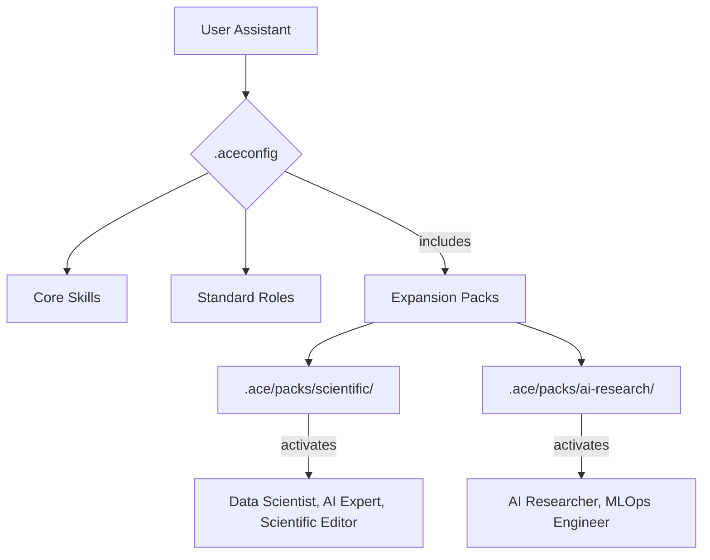

# ACE Framework Knowledge Base (Part 5)

Generated on 05/10/2026 20:03:52
This document contains a portion of the configuration, standards, prompts, and skills for the ACE Framework.


---

## File: .ace\packs\scientific\database-lookup\references\uspto.md

# USPTO Public APIs

## 1. PatentsView API (Primary Patent Search)

The newer Elasticsearch-based API is the recommended endpoint.

### Base URL

```
https://search.patentsview.org/api/v1/
```

**API key required** — register at `https://patentsview.org/apis/keyrequest`

Pass as query parameter: `?api_key=YOUR_KEY`

### Key Endpoints

#### Search patents
```
GET or POST /patent/
```

Query parameter `q` accepts a JSON query object.

Operators: `_eq`, `_neq`, `_gt`, `_gte`, `_lt`, `_lte`, `_begins`, `_contains`, `_text_any`, `_text_all`, `_text_phrase`, `_and`, `_or`, `_not`

Parameters:
- `q` — JSON query
- `f` — fields to return (JSON array)
- `o` — options: `{"size": 25}` for pagination
- `s` — sort: `[{"patent_date": "desc"}]`

#### Search by keyword
```
GET /patent/?q={"_text_any":{"patent_abstract":"autonomous vehicle"}}&f=["patent_id","patent_title","patent_date"]&o={"size":5}&api_key=KEY
```

#### Search by inventor
```
GET /patent/?q={"inventors.inventor_name_last":"Tesla"}&f=["patent_id","patent_title","patent_date"]&api_key=KEY
```

#### Search by assignee
```
GET /patent/?q={"assignees.assignee_organization":"Google LLC"}&f=["patent_id","patent_title","patent_date","assignees"]&api_key=KEY
```

#### Lookup by patent number
```
GET /patent/{patent_number}/?api_key=KEY
```

#### Other entity endpoints
```
/inventor/
/assignee/
/cpc_group/
```

### Response Structure

```json
{
  "patents": [
    {
      "patent_id": "11234567",
      "patent_title": "...",
      "patent_date": "2022-03-15",
      "patent_abstract": "...",
      "assignees": [{"assignee_organization": "..."}],
      "inventors": [{"inventor_name_first": "...", "inventor_name_last": "..."}]
    }
  ],
  "count": 1,
  "total_hits": 8923
}
```

### Rate Limits

~45 requests per minute per API key.

### Important Note

The user must have a PatentsView API key for this endpoint. If they don't have one, let them know they need to register at `https://patentsview.org/apis/keyrequest`. Load the key from `.env` as `PATENTSVIEW_API_KEY`.

**Note:** The legacy API at `api.patentsview.org` has been decommissioned (returns 410 Gone). Only the new API above works.

## 3. PEDS — Patent Examination Data System

**URL**: `https://ped.uspto.gov/api/queries`

**Method**: POST

For patent prosecution data (application status, filing dates, examiner info).

```json
{
  "searchText": "applicationNumberText:16123456",
  "fl": "*",
  "mm": "100%",
  "df": "patentTitle",
  "facet": "false",
  "sort": "applId asc",
  "start": 0
}
```

No API key required but heavily rate limited. Availability can be unreliable.

## 4. TSDR — Trademark Status & Document Retrieval

For trademark lookup by serial or registration number (not full-text search).

```
GET https://tsdr.uspto.gov/documentxml/status/{serial_number}
GET https://tsdr.uspto.gov/documentxml/status/rn{registration_number}
```

Returns XML with mark details, status, owner, goods/services, prosecution history.

No API key. Rate limited. No JSON endpoint — responses are XML.

## 5. Limitations

- **No public REST API for trademark full-text search** (TESS is web-only)
- PatentsView new API requires registration for an API key
- PEDS availability is inconsistent
- TSDR requires knowing the serial/registration number already


---

## File: .ace\packs\scientific\database-lookup\references\who.md

# WHO Global Health Observatory (GHO) API Reference

## Overview
The WHO Global Health Observatory (GHO) OData API provides access to health statistics for 194 WHO member states. It covers over 2000 indicators including life expectancy, disease burden, mortality, immunization coverage, health workforce, air pollution, water/sanitation, and the Sustainable Development Goal (SDG) health indicators.

## Base URL
```
https://ghoapi.azureedge.net/api
```

## Authentication
**No API key required.** The API is fully open and free.

## Rate Limits
- No formal rate limits documented.
- The API is served via Azure CDN and handles moderate loads well.
- Be respectful with automated requests; 1-2 per second recommended.

---

## Key Endpoints

The API follows the OData v4 protocol. Standard OData query parameters work: `$filter`, `$select`, `$orderby`, `$top`, `$skip`, `$count`.

### 1. List All Indicators

```
GET /Indicator
```

**Example:**
```
https://ghoapi.azureedge.net/api/Indicator
```

**Response:**
```json
{
  "@odata.context": "...",
  "value": [
    {
      "IndicatorCode": "WHOSIS_000001",
      "IndicatorName": "Life expectancy at birth (years)",
      "Language": "EN"
    },
    {
      "IndicatorCode": "WHOSIS_000002",
      "IndicatorName": "Healthy life expectancy (HALE) at birth (years)",
      "Language": "EN"
    },
    {
      "IndicatorCode": "WHS4_100",
      "IndicatorName": "Measles (MCV1) immunization coverage among 1-year-olds (%)",
      "Language": "EN"
    }
  ]
}
```

### 2. Get Data for a Specific Indicator

```
GET /{IndicatorCode}
```

**Example (life expectancy at birth):**
```
https://ghoapi.azureedge.net/api/WHOSIS_000001
```

**Response:**
```json
{
  "@odata.context": "...",
  "value": [
    {
      "Id": 12345,
      "IndicatorCode": "WHOSIS_000001",
      "SpatialDim": "USA",
      "SpatialDimType": "COUNTRY",
      "TimeDim": 2019,
      "TimeDimType": "YEAR",
      "Dim1": "SEX",
      "Dim1Type": "BTSX",
      "Dim2": null,
      "Dim2Type": null,
      "Dim3": null,
      "Dim3Type": null,
      "DataSourceDim": null,
      "Value": "78.5",
      "NumericValue": 78.5,
      "Low": 78.2,
      "High": 78.8,
      "Comments": "",
      "Date": "2024-01-15T00:00:00+00:00",
      "TimeDimensionValue": "2019",
      "TimeDimensionBegin": "2019-01-01T00:00:00+00:00",
      "TimeDimensionEnd": "2019-12-31T00:00:00+00:00"
    }
  ]
}
```

### 3. Filter by Country

Use OData `$filter` to restrict results by country (SpatialDim).

**Example (life expectancy for USA only):**
```
https://ghoapi.azureedge.net/api/WHOSIS_000001?$filter=SpatialDim eq 'USA'
```

**Example (life expectancy for multiple countries):**
```
https://ghoapi.azureedge.net/api/WHOSIS_000001?$filter=SpatialDim eq 'USA' or SpatialDim eq 'GBR' or SpatialDim eq 'JPN'
```

### 4. Filter by Year

**Example (life expectancy in 2019):**
```
https://ghoapi.azureedge.net/api/WHOSIS_000001?$filter=TimeDim eq 2019
```

**Example (life expectancy for USA since 2015):**
```
https://ghoapi.azureedge.net/api/WHOSIS_000001?$filter=SpatialDim eq 'USA' and TimeDim ge 2015
```

### 5. Filter by Sex/Dimension

**Example (life expectancy, both sexes, USA, 2015+):**
```
https://ghoapi.azureedge.net/api/WHOSIS_000001?$filter=SpatialDim eq 'USA' and TimeDim ge 2015 and Dim1 eq 'BTSX'
```

Dim1 sex values: `BTSX` (both sexes), `MLE` (male), `FMLE` (female).

### 6. Pagination and Limiting

**Example (first 10 results):**
```
https://ghoapi.azureedge.net/api/WHOSIS_000001?$top=10
```

**Example (skip first 100, get next 50):**
```
https://ghoapi.azureedge.net/api/WHOSIS_000001?$top=50&$skip=100
```

### 7. Select Specific Fields

```
https://ghoapi.azureedge.net/api/WHOSIS_000001?$filter=SpatialDim eq 'USA'&$select=SpatialDim,TimeDim,NumericValue,Dim1
```

### 8. Order Results

```
https://ghoapi.azureedge.net/api/WHOSIS_000001?$filter=SpatialDim eq 'USA'&$orderby=TimeDim desc
```

### 9. List Dimension Values

```
GET /DIMENSION/{DimensionType}/DimensionValues
```

**Example (list all countries):**
```
https://ghoapi.azureedge.net/api/DIMENSION/COUNTRY/DimensionValues
```

**Example (list all regions):**
```
https://ghoapi.azureedge.net/api/DIMENSION/REGION/DimensionValues
```

**Example (list sex dimension values):**
```
https://ghoapi.azureedge.net/api/DIMENSION/SEX/DimensionValues
```

---

## Common Indicator Codes

### Life Expectancy & Mortality
| Code | Description |
|------|-------------|
| `WHOSIS_000001` | Life expectancy at birth (years) |
| `WHOSIS_000002` | Healthy life expectancy (HALE) at birth (years) |
| `WHOSIS_000004` | Neonatal mortality rate (per 1000 live births) |
| `MDG_0000000001` | Infant mortality rate (per 1000 live births) |
| `MDG_0000000007` | Under-five mortality rate (per 1000 live births) |
| `MORT_MATERNALNUM` | Number of maternal deaths |
| `MDG_0000000026` | Maternal mortality ratio (per 100000 live births) |
| `NCDMORT3070` | Probability of dying from NCDs between ages 30-70 |
| `LIFE_0000000029` | Adult mortality rate (probability of dying 15-60) |

### Communicable Diseases
| Code | Description |
|------|-------------|
| `WHS3_49` | HIV prevalence (% of population ages 15-49) |
| `MDG_0000000029` | Tuberculosis incidence (per 100,000) |
| `MALARIA_EST_INCIDENCE` | Malaria incidence (per 1000 population at risk) |
| `WHS3_62` | New HIV infections (per 1000 uninfected population) |

### Immunization
| Code | Description |
|------|-------------|
| `WHS4_100` | Measles (MCV1) immunization (% of 1-year-olds) |
| `WHS4_117` | DTP3 immunization (% of 1-year-olds) |
| `WHS4_129` | Hepatitis B (HepB3) immunization (%) |
| `WHS4_543` | Polio (Pol3) immunization (% of 1-year-olds) |

### Non-Communicable Diseases & Risk Factors
| Code | Description |
|------|-------------|
| `NCD_BMI_30A` | Prevalence of obesity (BMI >= 30), age-standardized |
| `NCD_HYP_PREVALENCE_A` | Prevalence of raised blood pressure |
| `NCD_GLUC_04` | Prevalence of diabetes (% of population) |
| `M_Est_smk_curr_std` | Prevalence of current tobacco smoking |
| `SA_0000001462` | Total alcohol per capita consumption (litres) |

### Health Systems
| Code | Description |
|------|-------------|
| `HWF_0001` | Medical doctors (per 10,000 population) |
| `HWF_0006` | Nursing and midwifery personnel (per 10,000) |
| `WHS7_104` | Hospital beds (per 10,000 population) |
| `GHED_CHE_pc_US_SHA2011` | Current health expenditure per capita (USD) |
| `UHC_INDEX_REPORTED` | UHC service coverage index |

### Environmental Health
| Code | Description |
|------|-------------|
| `SDGPM25` | PM2.5 air pollution, mean annual exposure (ug/m3) |
| `WSH_SANITATION_SAFELY_MANAGED` | Safely managed sanitation services (%) |
| `WSH_WATER_SAFELY_MANAGED` | Safely managed drinking water services (%) |

---

## Country Codes (ISO 3166-1 alpha-3)

The GHO API uses **ISO 3-letter codes** for countries in the `SpatialDim` field.

`USA` (United States), `GBR` (United Kingdom), `DEU` (Germany), `FRA` (France), `JPN` (Japan), `CHN` (China), `IND` (India), `BRA` (Brazil), `ZAF` (South Africa), `NGA` (Nigeria), `AUS` (Australia), `CAN` (Canada), `KOR` (Republic of Korea), `MEX` (Mexico), `RUS` (Russian Federation)

WHO Regions: `AFR` (Africa), `AMR` (Americas), `SEAR` (South-East Asia), `EUR` (Europe), `EMR` (Eastern Mediterranean), `WPR` (Western Pacific), `GLOBAL` (Global)

---

## Response Format
All responses are JSON following OData v4 conventions:

```json
{
  "@odata.context": "https://ghoapi.azureedge.net/api/$metadata#...",
  "value": [
    { ... observation object ... },
    { ... observation object ... }
  ]
}
```

Key fields in each observation:
- `SpatialDim`: Country/region code (ISO alpha-3)
- `TimeDim`: Year (integer)
- `NumericValue`: The numeric data value (float or null)
- `Value`: String representation of the value
- `Low` / `High`: Confidence interval bounds (when available)
- `Dim1`: First additional dimension (often sex: `BTSX`, `MLE`, `FMLE`)
- `Dim2`, `Dim3`: Additional dimensions (age group, etc.)

## Notes
- The API uses OData v4 syntax. Filter operators: `eq`, `ne`, `gt`, `ge`, `lt`, `le`, `and`, `or`, `not`. String values must be in single quotes.
- Not all indicators have data for all countries or years. Check data availability before building dependent workflows.
- `NumericValue` is preferred over `Value` for numeric analysis; `Value` is a string and may contain qualifiers.
- Many indicators are disaggregated by sex (`Dim1`) and/or age group (`Dim2`). Use the dimension values endpoint to discover valid codes.
- Data may have multi-year lag, especially for lower-income countries.
- The `Low` and `High` fields provide uncertainty intervals from WHO estimation processes (not all indicators have these).
- For bulk exploration, the GHO data portal at https://www.who.int/data/gho provides a browsable interface to find indicator codes.


---

## File: .ace\packs\scientific\database-lookup\references\worldbank.md

# World Bank Open Data API

## Base URL

```
https://api.worldbank.org/v2
```

## Authentication

**No API key required.** The API is fully open.

## Key Endpoints

### 1. Get Indicator Data for a Country
```
GET /country/{country_code}/indicator/{indicator_code}
```
| Parameter | Required | Description                                        |
|-----------|----------|----------------------------------------------------|
| format    | No       | `json`, `xml` (default), `jsonP`                  |
| date      | No       | Year range: `2010:2023`, single year: `2020`       |
| page      | No       | Page number (default 1)                            |
| per_page  | No       | Results per page (default 50, max 32500)           |
| MRV       | No       | Most recent values: number of recent data points   |
| gapfill   | No       | `Y` to fill gaps with most recent value            |
| frequency | No       | `M` (monthly), `Q` (quarterly), `Y` (yearly)      |
| source    | No       | Source ID number                                   |

Example (GDP for USA, 2015-2023):
```
https://api.worldbank.org/v2/country/US/indicator/NY.GDP.MKTP.CD?format=json&date=2015:2023
```

Example (most recent 5 values):
```
https://api.worldbank.org/v2/country/US/indicator/NY.GDP.MKTP.CD?format=json&MRV=5
```

### 2. Get Indicator Data for Multiple Countries
```
GET /country/{code1};{code2};{code3}/indicator/{indicator_code}
```
Example:
```
https://api.worldbank.org/v2/country/US;GB;CN;IN/indicator/SP.POP.TOTL?format=json&date=2020:2023
```

### 3. Get Indicator Data for All Countries
```
GET /country/all/indicator/{indicator_code}
```
Example:
```
https://api.worldbank.org/v2/country/all/indicator/SI.POV.DDAY?format=json&date=2020&per_page=300
```

### 4. Get Indicator Data by Region/Income Group
```
GET /country/{aggregate_code}/indicator/{indicator_code}
```
Aggregate codes: `EAS` (East Asia), `ECS` (Europe & Central Asia), `LIC` (Low Income), `HIC` (High Income), `WLD` (World), etc.

Example:
```
https://api.worldbank.org/v2/country/WLD/indicator/NY.GDP.MKTP.CD?format=json&date=2020:2023
```

### 5. List All Countries
```
GET /country
```
Example:
```
https://api.worldbank.org/v2/country?format=json&per_page=300
```

### 6. Get Country Info
```
GET /country/{country_code}
```
Example:
```
https://api.worldbank.org/v2/country/US?format=json
```

### 7. List All Indicators
```
GET /indicator
```
Example:
```
https://api.worldbank.org/v2/indicator?format=json&per_page=100
```

### 8. Search Indicators
```
GET /indicator
```
Use the query string directly in the URL path or filter by topic/source.

By topic:
```
https://api.worldbank.org/v2/topic/3/indicator?format=json
```

By source:
```
https://api.worldbank.org/v2/source/2/indicator?format=json&per_page=50
```

### 9. List Topics
```
GET /topic
```
Example:
```
https://api.worldbank.org/v2/topic?format=json
```

### 10. List Sources
```
GET /source
```
Example:
```
https://api.worldbank.org/v2/source?format=json
```

## Common Indicator Codes

| Indicator Code         | Description                                     |
|------------------------|-------------------------------------------------|
| NY.GDP.MKTP.CD        | GDP (current US$)                               |
| NY.GDP.MKTP.KD.ZG     | GDP growth (annual %)                           |
| NY.GDP.PCAP.CD        | GDP per capita (current US$)                    |
| NY.GDP.PCAP.PP.CD     | GDP per capita, PPP (current intl $)            |
| SP.POP.TOTL           | Population, total                               |
| SP.POP.GROW           | Population growth (annual %)                    |
| SP.DYN.LE00.IN        | Life expectancy at birth (years)                |
| SP.DYN.TFRT.IN        | Fertility rate (births per woman)               |
| SL.UEM.TOTL.ZS        | Unemployment (% of total labor force)           |
| FP.CPI.TOTL.ZG        | Inflation, consumer prices (annual %)           |
| SI.POV.DDAY           | Poverty headcount at $2.15/day (% of pop)       |
| SI.POV.GINI           | Gini index                                      |
| BX.KLT.DINV.CD.WD     | Foreign direct investment, net inflows (BoP, US$)|
| NE.EXP.GNFS.ZS        | Exports of goods and services (% of GDP)        |
| EN.ATM.CO2E.PC        | CO2 emissions (metric tons per capita)          |
| SE.ADT.LITR.ZS        | Literacy rate, adult (% ages 15+)               |
| SH.XPD.CHEX.PC.CD     | Current health expenditure per capita (US$)     |
| IT.NET.USER.ZS        | Individuals using the Internet (% of pop)       |

## Common Country Codes (ISO 3166-1 alpha-2)

`US` (USA), `GB` (UK), `CN` (China), `IN` (India), `JP` (Japan), `DE` (Germany), `FR` (France), `BR` (Brazil), `ZA` (South Africa), `NG` (Nigeria), `AU` (Australia), `CA` (Canada)

## Response Format

**Important:** JSON responses are returned as a **two-element array**. The first element is pagination metadata; the second is the data array.

### Indicator observations
```json
[
  {
    "page": 1,
    "pages": 1,
    "per_page": 50,
    "total": 9,
    "sourceid": "2",
    "lastupdated": "2024-03-28"
  },
  [
    {
      "indicator": {
        "id": "NY.GDP.MKTP.CD",
        "value": "GDP (current US$)"
      },
      "country": {
        "id": "US",
        "value": "United States"
      },
      "countryiso3code": "USA",
      "date": "2023",
      "value": 27360935000000,
      "unit": "",
      "obs_status": "",
      "decimal": 0
    },
    {
      "indicator": { "id": "NY.GDP.MKTP.CD", "value": "GDP (current US$)" },
      "country": { "id": "US", "value": "United States" },
      "countryiso3code": "USA",
      "date": "2022",
      "value": 25462700000000,
      "unit": "",
      "obs_status": "",
      "decimal": 0
    }
  ]
]
```

Note: `value` is `null` when data is unavailable for that year.

### Country info
```json
[
  { "page": 1, "pages": 1, "per_page": 50, "total": 1 },
  [
    {
      "id": "US",
      "iso2Code": "US",
      "name": "United States",
      "region": { "id": "NAC", "iso2code": "XU", "value": "North America" },
      "adminregion": { "id": "", "iso2code": "", "value": "" },
      "incomeLevel": { "id": "HIC", "iso2code": "XD", "value": "High income" },
      "lendingType": { "id": "LNX", "iso2code": "XX", "value": "Not classified" },
      "capitalCity": "Washington D.C.",
      "longitude": "-77.032",
      "latitude": "38.8895"
    }
  ]
]
```

## Rate Limits

- No formal rate limits published; the API is open and generous.
- For bulk downloads, use `per_page=32500` to minimize requests.
- Be respectful: 1-2 requests/second for automated scripts.
- For very large datasets, consider the World Bank bulk download facility.

## Notes

- Always include `format=json` -- the default is XML.
- Results are returned in **descending** date order by default.
- `null` values are common for recent years (data not yet published) or for indicators with sparse coverage.
- Pagination: check `pages` in the metadata; iterate `page=1`, `page=2`, etc.
- Country codes follow ISO 3166-1 alpha-2 (2-letter) in the URL path. The response also includes `countryiso3code`.


---

## File: .ace\packs\scientific\database-lookup\references\zinc.md

# ZINC Database API

## Base URL

```
https://zinc.docking.org
```

## Auth

No API key required. Fully open public API.

## URL Pattern

Resources follow a uniform pattern with format specified by file extension:

```
/{resource}.{format}
/{resource}/{id}.{format}
/{resource}/subsets/{subset}.{format}
```

Supported formats: `.json`, `.csv`, `.txt`, `.smi`, `.sdf`, `.mol2`, `.xml`, `.png`

Field selection (return only specific fields):
```
/{resource}.json:field1+field2+field3
```

## Key Endpoints

### Substance lookup by ZINC ID
```
GET /substances/ZINC000000000053.json
```

### Search by name
```
GET /substances.json?preferred_name=aspirin
```

### Search by InChIKey
```
GET /substances.json?inchikey=BSYNRYMUTXBXSQ-UHFFFAOYSA-N
```

### Search by molecular formula
```
GET /substances.json?mol_formula=C9H8O4
```

### Substructure search (SMILES)
```
GET /substances.json?sub_id-matches=c1ccccc1&count=10
```

### Substructure search (SMARTS)
```
GET /substances.json?sub_id-matches-sma=[ND1]&count=10
```

### Similarity search (Tanimoto, ECFP4 fingerprints)

The threshold (e.g., 40 = 40%) is part of the parameter name. Value can be SMILES or a ZINC ID number.
```
GET /substances/?ecfp4_fp-tanimoto-40=c1ccccc1O
GET /substances/?ecfp4_fp-tanimoto-70=ZINC000000000053
```

### Browse subsets

Filter by purchasability, drug status, reactivity, or origin:
```
GET /substances/subsets/fda.json              # FDA-approved drugs
GET /substances/subsets/in-stock.json         # In-stock compounds
GET /substances/subsets/metabolites.json      # Metabolites
GET /substances/subsets/fda+in-stock.json     # Combine subsets with +
```

Key subsets:
- **Purchasability**: `in-stock`, `on-demand`, `for-sale`, `bb` (building blocks)
- **Drug status**: `fda`, `world`, `in-trials`, `in-man`, `in-vivo`, `in-vitro`
- **Origin**: `biogenic`, `metabolites`, `natural-products`, `endogenous`
- **Reactivity**: `anodyne`, `clean`, `standard`, `reactive`

### Substances for a gene target
```
GET /genes/ACHE/substances.json?count=10
```

### Catalogs
```
GET /catalogs.json                            # List all vendor catalogs
GET /catalogs/cmcd/substances.json            # Substances in a catalog
```

### 2D structure image (300x300 PNG)
```
GET /substances/ZINC000000000053.png
```

### Molecule format conversion
```
GET /apps/mol/convert?from=CC(=O)Oc1ccccc1C(=O)O&to=inchikey
```
Returns the InChIKey as plain text. Supports conversions between SMILES, InChI, and InChIKey.

### Batch resolution (POST)

Resolve multiple names, ZINC IDs, or SMILES at once:
```
POST /substances/resolved/
Content-Type: application/x-www-form-urlencoded

paste=aspirin%0Aibuprofen%0AZINC000000000053&identifiers=y&structures=y&names=y&output_format=json
```

## Query Parameters

### Pagination
- `count=N` — results per page (use `count=all` cautiously on large sets)
- `page=N` — page number (1-indexed)

### Sorting
- `sort=mwt` — ascending by field
- `sort=-mwt` — descending (prefix with `-`)
- `sort=no` — disable sorting for faster bulk queries

### Property filters (comparison operators)
- `mwt-le=500` — molecular weight <= 500
- `logp-ge=2` — LogP >= 2
- `hbd-le=5` — H-bond donors <= 5
- Operators: `-le` (<=), `-ge` (>=), `-lt` (<), `-gt` (>), `-eq` (=)

### Searchable substance attributes

Molecular properties: `mwt`, `logp`, `hba`, `hbd`, `tpsa`, `rb` (rotatable bonds), `num_rings`, `num_aromatic_rings`, `num_heavy_atoms`, `num_chiral_centers`, `fractioncsp3`

Identifiers: `zinc_id`, `smiles`, `inchikey`, `mol_formula`, `preferred_name`, `cas_numbers`

Status: `purchasable`, `reactive`, `bb` (building block)

## Example Calls

### Get properties for a compound
```
GET /substances/ZINC000000000053.json:zinc_id+smiles+mwt+logp+hba+hbd+tpsa+mol_formula+preferred_name
```

### FDA drugs sorted by molecular weight
```
GET /substances/subsets/fda.json:zinc_id+preferred_name+mwt?sort=mwt&count=10
```

### Drug-like compounds (Lipinski filters)
```
GET /substances/subsets/for-sale.json?mwt-le=500&logp-le=5&hbd-le=5&hba-le=10&count=20
```

### Find compounds targeting a specific gene
```
GET /genes/EGFR/substances.json:zinc_id+preferred_name+smiles?count=10
```

## Response Format

```json
[
  {
    "zinc_id": "ZINC000000000053",
    "smiles": "CC(=O)Oc1ccccc1C(=O)O",
    "preferred_name": "aspirin",
    "mwt": 180.159,
    "logp": 1.31,
    "hba": 3,
    "hbd": 1,
    "tpsa": 63,
    "mol_formula": "C9H8O4",
    "inchikey": "BSYNRYMUTXBXSQ-UHFFFAOYSA-N",
    "purchasable": 5
  }
]
```

Responses are JSON arrays. Single-record lookups (by ZINC ID) return a JSON object.

## Rate Limits

No documented rate limits. The API is publicly funded (NIH NIGMS GM71896). Be respectful:
- Use `count=` to limit result sizes
- Use `sort=no` for faster bulk queries
- Similarity and substructure searches are computationally expensive — expect slower responses
- Avoid `count=all` on large result sets

## Special Notes

- ZINC contains **2+ billion** commercially available compounds — always use `count=` to limit results
- ZINC IDs have the format `ZINC000000000053` (15-digit zero-padded after "ZINC")
- The `.smi` format returns SMILES strings, useful for cheminformatics pipelines
- The `.sdf` format returns 3D structures suitable for docking software
- Subsets can be combined with `+` (e.g., `fda+in-stock` = FDA-approved AND in-stock)
- For virtual screening workflows, use tranches (`/tranches/`) to partition by molecular weight and LogP


---

## File: .ace\packs\scientific\diffdock\SKILL.md

---
name: diffdock
description: Diffusion-based molecular docking. Predict protein-ligand binding poses from PDB/SMILES, confidence scores, virtual screening, for structure-based drug design. Not for affinity prediction.
license: MIT license
metadata:
    skill-author: K-Dense Inc.
---

# DiffDock: Molecular Docking with Diffusion Models

## Overview

DiffDock is a diffusion-based deep learning tool for molecular docking that predicts 3D binding poses of small molecule ligands to protein targets. It represents the state-of-the-art in computational docking, crucial for structure-based drug discovery and chemical biology.

**Core Capabilities:**
- Predict ligand binding poses with high accuracy using deep learning
- Support protein structures (PDB files) or sequences (via ESMFold)
- Process single complexes or batch virtual screening campaigns
- Generate confidence scores to assess prediction reliability
- Handle diverse ligand inputs (SMILES, SDF, MOL2)

**Key Distinction:** DiffDock predicts **binding poses** (3D structure) and **confidence** (prediction certainty), NOT binding affinity (ΔG, Kd). Always combine with scoring functions (GNINA, MM/GBSA) for affinity assessment.

## When to Use This Skill

This skill should be used when:

- "Dock this ligand to a protein" or "predict binding pose"
- "Run molecular docking" or "perform protein-ligand docking"
- "Virtual screening" or "screen compound library"
- "Where does this molecule bind?" or "predict binding site"
- Structure-based drug design or lead optimization tasks
- Tasks involving PDB files + SMILES strings or ligand structures
- Batch docking of multiple protein-ligand pairs

## Installation and Environment Setup

### Check Environment Status

Before proceeding with DiffDock tasks, verify the environment setup:

```bash
# Use the provided setup checker
python scripts/setup_check.py
```

This script validates Python version, PyTorch with CUDA, PyTorch Geometric, RDKit, ESM, and other dependencies.

### Installation Options

**Option 1: Conda (Recommended)**
```bash
git clone https://github.com/gcorso/DiffDock.git
cd DiffDock
conda env create --file environment.yml
conda activate diffdock
```

**Option 2: Docker**
```bash
docker pull rbgcsail/diffdock
docker run -it --gpus all --entrypoint /bin/bash rbgcsail/diffdock
micromamba activate diffdock
```

**Important Notes:**
- GPU strongly recommended (10-100x speedup vs CPU)
- First run pre-computes SO(2)/SO(3) lookup tables (~2-5 minutes)
- Model checkpoints (~500MB) download automatically if not present

## Core Workflows

### Workflow 1: Single Protein-Ligand Docking

**Use Case:** Dock one ligand to one protein target

**Input Requirements:**
- Protein: PDB file OR amino acid sequence
- Ligand: SMILES string OR structure file (SDF/MOL2)

**Command:**
```bash
python -m inference \
  --config default_inference_args.yaml \
  --protein_path protein.pdb \
  --ligand "CC(=O)Oc1ccccc1C(=O)O" \
  --out_dir results/single_docking/
```

**Alternative (protein sequence):**
```bash
python -m inference \
  --config default_inference_args.yaml \
  --protein_sequence "MSKGEELFTGVVPILVELDGDVNGHKF..." \
  --ligand ligand.sdf \
  --out_dir results/sequence_docking/
```

**Output Structure:**
```
results/single_docking/
├── rank_1.sdf          # Top-ranked pose
├── rank_2.sdf          # Second-ranked pose
├── ...
├── rank_10.sdf         # 10th pose (default: 10 samples)
└── confidence_scores.txt
```

### Workflow 2: Batch Processing Multiple Complexes

**Use Case:** Dock multiple ligands to proteins, virtual screening campaigns

**Step 1: Prepare Batch CSV**

Use the provided script to create or validate batch input:

```bash
# Create template
python scripts/prepare_batch_csv.py --create --output batch_input.csv

# Validate existing CSV
python scripts/prepare_batch_csv.py my_input.csv --validate
```

**CSV Format:**
```csv
complex_name,protein_path,ligand_description,protein_sequence
complex1,protein1.pdb,CC(=O)Oc1ccccc1C(=O)O,
complex2,,COc1ccc(C#N)cc1,MSKGEELFT...
complex3,protein3.pdb,ligand3.sdf,
```

**Required Columns:**
- `complex_name`: Unique identifier
- `protein_path`: PDB file path (leave empty if using sequence)
- `ligand_description`: SMILES string or ligand file path
- `protein_sequence`: Amino acid sequence (leave empty if using PDB)

**Step 2: Run Batch Docking**

```bash
python -m inference \
  --config default_inference_args.yaml \
  --protein_ligand_csv batch_input.csv \
  --out_dir results/batch/ \
  --batch_size 10
```

**For Large Virtual Screening (>100 compounds):**

Pre-compute protein embeddings for faster processing:
```bash
# Pre-compute embeddings
python datasets/esm_embedding_preparation.py \
  --protein_ligand_csv screening_input.csv \
  --out_file protein_embeddings.pt

# Run with pre-computed embeddings
python -m inference \
  --config default_inference_args.yaml \
  --protein_ligand_csv screening_input.csv \
  --esm_embeddings_path protein_embeddings.pt \
  --out_dir results/screening/
```

### Workflow 3: Analyzing Results

After docking completes, analyze confidence scores and rank predictions:

```bash
# Analyze all results
python scripts/analyze_results.py results/batch/

# Show top 5 per complex
python scripts/analyze_results.py results/batch/ --top 5

# Filter by confidence threshold
python scripts/analyze_results.py results/batch/ --threshold 0.0

# Export to CSV
python scripts/analyze_results.py results/batch/ --export summary.csv

# Show top 20 predictions across all complexes
python scripts/analyze_results.py results/batch/ --best 20
```

The analysis script:
- Parses confidence scores from all predictions
- Classifies as High (>0), Moderate (-1.5 to 0), or Low (<-1.5)
- Ranks predictions within and across complexes
- Generates statistical summaries
- Exports results to CSV for downstream analysis

## Confidence Score Interpretation

**Understanding Scores:**

| Score Range | Confidence Level | Interpretation |
|------------|------------------|----------------|
| **> 0** | High | Strong prediction, likely accurate |
| **-1.5 to 0** | Moderate | Reasonable prediction, validate carefully |
| **< -1.5** | Low | Uncertain prediction, requires validation |

**Critical Notes:**
1. **Confidence ≠ Affinity**: High confidence means model certainty about structure, NOT strong binding
2. **Context Matters**: Adjust expectations for:
   - Large ligands (>500 Da): Lower confidence expected
   - Multiple protein chains: May decrease confidence
   - Novel protein families: May underperform
3. **Multiple Samples**: Review top 3-5 predictions, look for consensus

**For detailed guidance:** Read `references/confidence_and_limitations.md` using the Read tool

## Parameter Customization

### Using Custom Configuration

Create custom configuration for specific use cases:

```bash
# Copy template
cp assets/custom_inference_config.yaml my_config.yaml

# Edit parameters (see template for presets)
# Then run with custom config
python -m inference \
  --config my_config.yaml \
  --protein_ligand_csv input.csv \
  --out_dir results/
```

### Key Parameters to Adjust

**Sampling Density:**
- `samples_per_complex: 10` → Increase to 20-40 for difficult cases
- More samples = better coverage but longer runtime

**Inference Steps:**
- `inference_steps: 20` → Increase to 25-30 for higher accuracy
- More steps = potentially better quality but slower

**Temperature Parameters (control diversity):**
- `temp_sampling_tor: 7.04` → Increase for flexible ligands (8-10)
- `temp_sampling_tor: 7.04` → Decrease for rigid ligands (5-6)
- Higher temperature = more diverse poses

**Presets Available in Template:**
1. High Accuracy: More samples + steps, lower temperature
2. Fast Screening: Fewer samples, faster
3. Flexible Ligands: Increased torsion temperature
4. Rigid Ligands: Decreased torsion temperature

**For complete parameter reference:** Read `references/parameters_reference.md` using the Read tool

## Advanced Techniques

### Ensemble Docking (Protein Flexibility)

For proteins with known flexibility, dock to multiple conformations:

```python
# Create ensemble CSV
import pandas as pd

conformations = ["conf1.pdb", "conf2.pdb", "conf3.pdb"]
ligand = "CC(=O)Oc1ccccc1C(=O)O"

data = {
    "complex_name": [f"ensemble_{i}" for i in range(len(conformations))],
    "protein_path": conformations,
    "ligand_description": [ligand] * len(conformations),
    "protein_sequence": [""] * len(conformations)
}

pd.DataFrame(data).to_csv("ensemble_input.csv", index=False)
```

Run docking with increased sampling:
```bash
python -m inference \
  --config default_inference_args.yaml \
  --protein_ligand_csv ensemble_input.csv \
  --samples_per_complex 20 \
  --out_dir results/ensemble/
```

### Integration with Scoring Functions

DiffDock generates poses; combine with other tools for affinity:

**GNINA (Fast neural network scoring):**
```bash
for pose in results/*.sdf; do
    gnina -r protein.pdb -l "$pose" --score_only
done
```

**MM/GBSA (More accurate, slower):**
Use AmberTools MMPBSA.py or gmx_MMPBSA after energy minimization

**Free Energy Calculations (Most accurate):**
Use OpenMM + OpenFE or GROMACS for FEP/TI calculations

**Recommended Workflow:**
1. DiffDock → Generate poses with confidence scores
2. Visual inspection → Check structural plausibility
3. GNINA or MM/GBSA → Rescore and rank by affinity
4. Experimental validation → Biochemical assays

## Limitations and Scope

**DiffDock IS Designed For:**
- Small molecule ligands (typically 100-1000 Da)
- Drug-like organic compounds
- Small peptides (<20 residues)
- Single or multi-chain proteins

**DiffDock IS NOT Designed For:**
- Large biomolecules (protein-protein docking) → Use DiffDock-PP or AlphaFold-Multimer
- Large peptides (>20 residues) → Use alternative methods
- Covalent docking → Use specialized covalent docking tools
- Binding affinity prediction → Combine with scoring functions
- Membrane proteins → Not specifically trained, use with caution

**For complete limitations:** Read `references/confidence_and_limitations.md` using the Read tool

## Troubleshooting

### Common Issues

**Issue: Low confidence scores across all predictions**
- Cause: Large/unusual ligands, unclear binding site, protein flexibility
- Solution: Increase `samples_per_complex` (20-40), try ensemble docking, validate protein structure

**Issue: Out of memory errors**
- Cause: GPU memory insufficient for batch size
- Solution: Reduce `--batch_size 2` or process fewer complexes at once

**Issue: Slow performance**
- Cause: Running on CPU instead of GPU
- Solution: Verify CUDA with `python -c "import torch; print(torch.cuda.is_available())"`, use GPU

**Issue: Unrealistic binding poses**
- Cause: Poor protein preparation, ligand too large, wrong binding site
- Solution: Check protein for missing residues, remove far waters, consider specifying binding site

**Issue: "Module not found" errors**
- Cause: Missing dependencies or wrong environment
- Solution: Run `python scripts/setup_check.py` to diagnose

### Performance Optimization

**For Best Results:**
1. Use GPU (essential for practical use)
2. Pre-compute ESM embeddings for repeated protein use
3. Batch process multiple complexes together
4. Start with default parameters, then tune if needed
5. Validate protein structures (resolve missing residues)
6. Use canonical SMILES for ligands

## Graphical User Interface

For interactive use, launch the web interface:

```bash
python app/main.py
# Navigate to http://localhost:7860
```

Or use the online demo without installation:
- https://huggingface.co/spaces/reginabarzilaygroup/DiffDock-Web

## Resources

### Helper Scripts (`scripts/`)

**`prepare_batch_csv.py`**: Create and validate batch input CSV files
- Create templates with example entries
- Validate file paths and SMILES strings
- Check for required columns and format issues

**`analyze_results.py`**: Analyze confidence scores and rank predictions
- Parse results from single or batch runs
- Generate statistical summaries
- Export to CSV for downstream analysis
- Identify top predictions across complexes

**`setup_check.py`**: Verify DiffDock environment setup
- Check Python version and dependencies
- Verify PyTorch and CUDA availability
- Test RDKit and PyTorch Geometric installation
- Provide installation instructions if needed

### Reference Documentation (`references/`)

**`parameters_reference.md`**: Complete parameter documentation
- All command-line options and configuration parameters
- Default values and acceptable ranges
- Temperature parameters for controlling diversity
- Model checkpoint locations and version flags

Read this file when users need:
- Detailed parameter explanations
- Fine-tuning guidance for specific systems
- Alternative sampling strategies

**`confidence_and_limitations.md`**: Confidence score interpretation and tool limitations
- Detailed confidence score interpretation
- When to trust predictions
- Scope and limitations of DiffDock
- Integration with complementary tools
- Troubleshooting prediction quality

Read this file when users need:
- Help interpreting confidence scores
- Understanding when NOT to use DiffDock
- Guidance on combining with other tools
- Validation strategies

**`workflows_examples.md`**: Comprehensive workflow examples
- Detailed installation instructions
- Step-by-step examples for all workflows
- Advanced integration patterns
- Troubleshooting common issues
- Best practices and optimization tips

Read this file when users need:
- Complete workflow examples with code
- Integration with GNINA, OpenMM, or other tools
- Virtual screening workflows
- Ensemble docking procedures

### Assets (`assets/`)

**`batch_template.csv`**: Template for batch processing
- Pre-formatted CSV with required columns
- Example entries showing different input types
- Ready to customize with actual data

**`custom_inference_config.yaml`**: Configuration template
- Annotated YAML with all parameters
- Four preset configurations for common use cases
- Detailed comments explaining each parameter
- Ready to customize and use

## Best Practices

1. **Always verify environment** with `setup_check.py` before starting large jobs
2. **Validate batch CSVs** with `prepare_batch_csv.py` to catch errors early
3. **Start with defaults** then tune parameters based on system-specific needs
4. **Generate multiple samples** (10-40) for robust predictions
5. **Visual inspection** of top poses before downstream analysis
6. **Combine with scoring** functions for affinity assessment
7. **Use confidence scores** for initial ranking, not final decisions
8. **Pre-compute embeddings** for virtual screening campaigns
9. **Document parameters** used for reproducibility
10. **Validate results** experimentally when possible

## Citations

When using DiffDock, cite the appropriate papers:

**DiffDock-L (current default model):**
```
Stärk et al. (2024) "DiffDock-L: Improving Molecular Docking with Diffusion Models"
arXiv:2402.18396
```

**Original DiffDock:**
```
Corso et al. (2023) "DiffDock: Diffusion Steps, Twists, and Turns for Molecular Docking"
ICLR 2023, arXiv:2210.01776
```

## Additional Resources

- **GitHub Repository**: https://github.com/gcorso/DiffDock
- **Online Demo**: https://huggingface.co/spaces/reginabarzilaygroup/DiffDock-Web
- **DiffDock-L Paper**: https://arxiv.org/abs/2402.18396
- **Original Paper**: https://arxiv.org/abs/2210.01776


---

## File: .ace\packs\scientific\diffdock\assets\custom_inference_config.yaml

```yaml
# DiffDock Custom Inference Configuration Template
# Copy and modify this file to customize inference parameters

# Model paths (usually don't need to change these)
model_dir: ./workdir/v1.1/score_model
confidence_model_dir: ./workdir/v1.1/confidence_model
ckpt: best_ema_inference_epoch_model.pt
confidence_ckpt: best_model_epoch75.pt

# Model version flags
old_score_model: false  # Set to true to use original DiffDock instead of DiffDock-L
old_filtering_model: true

# Inference steps
inference_steps: 20  # Increase for potentially better accuracy (e.g., 25-30)
actual_steps: 19
no_final_step_noise: true

# Sampling parameters
samples_per_complex: 10  # Increase for difficult cases (e.g., 20-40)
sigma_schedule: expbeta
initial_noise_std_proportion: 1.46

# Temperature controls - Adjust these to balance exploration vs accuracy
# Higher values = more diverse predictions, lower values = more focused predictions

# Sampling temperatures
temp_sampling_tr: 1.17   # Translation sampling temperature
temp_sampling_rot: 2.06  # Rotation sampling temperature
temp_sampling_tor: 7.04  # Torsion sampling temperature (increase for flexible ligands)

# Psi angle temperatures
temp_psi_tr: 0.73
temp_psi_rot: 0.90
temp_psi_tor: 0.59

# Sigma data temperatures
temp_sigma_data_tr: 0.93
temp_sigma_data_rot: 0.75
temp_sigma_data_tor: 0.69

# Feature flags
no_model: false
no_random: false
ode: false  # Set to true to use ODE solver instead of SDE
different_schedules: false
limit_failures: 5

# Output settings
# save_visualisation: true  # Uncomment to save SDF files

# ============================================================================
# Configuration Presets for Common Use Cases
# ============================================================================

# PRESET 1: High Accuracy (slower, more thorough)
# samples_per_complex: 30
# inference_steps: 25
# temp_sampling_tr: 1.0
# temp_sampling_rot: 1.8
# temp_sampling_tor: 6.5

# PRESET 2: Fast Screening (faster, less thorough)
# samples_per_complex: 5
# inference_steps: 15
# temp_sampling_tr: 1.3
# temp_sampling_rot: 2.2
# temp_sampling_tor: 7.5

# PRESET 3: Flexible Ligands (more conformational diversity)
# samples_per_complex: 20
# inference_steps: 20
# temp_sampling_tr: 1.2
# temp_sampling_rot: 2.1
# temp_sampling_tor: 8.5  # Increased torsion temperature

# PRESET 4: Rigid Ligands (more focused predictions)
# samples_per_complex: 10
# inference_steps: 20
# temp_sampling_tr: 1.1
# temp_sampling_rot: 2.0
# temp_sampling_tor: 6.0  # Decreased torsion temperature

# ============================================================================
# Usage Example
# ============================================================================
# python -m inference \
#   --config custom_inference_config.yaml \
#   --protein_ligand_csv input.csv \
#   --out_dir results/

```

---

## File: .ace\packs\scientific\diffdock\references\confidence_and_limitations.md

# DiffDock Confidence Scores and Limitations

This document provides detailed guidance on interpreting DiffDock confidence scores and understanding the tool's limitations.

## Confidence Score Interpretation

DiffDock generates a confidence score for each predicted binding pose. This score indicates the model's certainty about the prediction.

### Score Ranges

| Score Range | Confidence Level | Interpretation |
|------------|------------------|----------------|
| **> 0** | High confidence | Strong prediction, likely accurate binding pose |
| **-1.5 to 0** | Moderate confidence | Reasonable prediction, may need validation |
| **< -1.5** | Low confidence | Uncertain prediction, requires careful validation |

### Important Notes on Confidence Scores

1. **Not Binding Affinity**: Confidence scores reflect prediction certainty, NOT binding affinity strength
   - High confidence = model is confident about the structure
   - Does NOT indicate strong/weak binding affinity

2. **Context-Dependent**: Confidence scores should be adjusted based on system complexity:
   - **Lower expectations** for:
     - Large ligands (>500 Da)
     - Protein complexes with many chains
     - Unbound protein conformations (may require conformational changes)
     - Novel protein families not well-represented in training data

   - **Higher expectations** for:
     - Drug-like small molecules (150-500 Da)
     - Single-chain proteins or well-defined binding sites
     - Proteins similar to those in training data (PDBBind, BindingMOAD)

3. **Multiple Predictions**: DiffDock generates multiple samples per complex (default: 10)
   - Review top-ranked predictions (by confidence)
   - Consider clustering similar poses
   - High-confidence consensus across multiple samples strengthens prediction

## What DiffDock Predicts

### ✅ DiffDock DOES Predict
- **Binding poses**: 3D spatial orientation of ligand in protein binding site
- **Confidence scores**: Model's certainty about predictions
- **Multiple conformations**: Various possible binding modes

### ❌ DiffDock DOES NOT Predict
- **Binding affinity**: Strength of protein-ligand interaction (ΔG, Kd, Ki)
- **Binding kinetics**: On/off rates, residence time
- **ADMET properties**: Absorption, distribution, metabolism, excretion, toxicity
- **Selectivity**: Relative binding to different targets

## Scope and Limitations

### Designed For
- **Small molecule docking**: Organic compounds typically 100-1000 Da
- **Protein targets**: Single or multi-chain proteins
- **Small peptides**: Short peptide ligands (< ~20 residues)
- **Small nucleic acids**: Short oligonucleotides

### NOT Designed For
- **Large biomolecules**: Full protein-protein interactions
  - Use DiffDock-PP, AlphaFold-Multimer, or RoseTTAFold2NA instead
- **Large peptides/proteins**: >20 residues as ligands
- **Covalent docking**: Irreversible covalent bond formation
- **Metalloprotein specifics**: May not accurately handle metal coordination
- **Membrane proteins**: Not specifically trained on membrane-embedded proteins

### Training Data Considerations

DiffDock was trained on:
- **PDBBind**: Diverse protein-ligand complexes
- **BindingMOAD**: Multi-domain protein structures

**Implications**:
- Best performance on proteins/ligands similar to training data
- May underperform on:
  - Novel protein families
  - Unusual ligand chemotypes
  - Allosteric sites not well-represented in training data

## Validation and Complementary Tools

### Recommended Workflow

1. **Generate poses with DiffDock**
   - Use confidence scores for initial ranking
   - Consider multiple high-confidence predictions

2. **Visual Inspection**
   - Examine protein-ligand interactions in molecular viewer
   - Check for reasonable:
     - Hydrogen bonds
     - Hydrophobic interactions
     - Steric complementarity
     - Electrostatic interactions

3. **Scoring and Refinement** (choose one or more):
   - **GNINA**: Deep learning-based scoring function
   - **Molecular mechanics**: Energy minimization and refinement
   - **MM/GBSA or MM/PBSA**: Binding free energy estimation
   - **Free energy calculations**: FEP or TI for accurate affinity prediction

4. **Experimental Validation**
   - Biochemical assays (IC50, Kd measurements)
   - Structural validation (X-ray crystallography, cryo-EM)

### Tools for Binding Affinity Assessment

DiffDock should be combined with these tools for affinity prediction:

- **GNINA**: Fast, accurate scoring function
  - Github: github.com/gnina/gnina

- **AutoDock Vina**: Classical docking and scoring
  - Website: vina.scripps.edu

- **Free Energy Calculations**:
  - OpenMM + OpenFE
  - GROMACS + ABFE/RBFE protocols

- **MM/GBSA Tools**:
  - MMPBSA.py (AmberTools)
  - gmx_MMPBSA

## Performance Optimization

### For Best Results

1. **Protein Preparation**:
   - Remove water molecules far from binding site
   - Resolve missing residues if possible
   - Consider protonation states at physiological pH

2. **Ligand Input**:
   - Provide reasonable 3D conformers when using structure files
   - Use canonical SMILES for consistent results
   - Pre-process with RDKit if needed

3. **Computational Resources**:
   - GPU strongly recommended (10-100x speedup)
   - First run pre-computes lookup tables (takes a few minutes)
   - Batch processing more efficient than single predictions

4. **Parameter Tuning**:
   - Increase `samples_per_complex` for difficult cases (20-40)
   - Adjust temperature parameters for diversity/accuracy trade-off
   - Use pre-computed ESM embeddings for repeated predictions

## Common Issues and Troubleshooting

### Low Confidence Scores
- **Large/flexible ligands**: Consider splitting into fragments or use alternative methods
- **Multiple binding sites**: May predict multiple locations with distributed confidence
- **Protein flexibility**: Consider using ensemble of protein conformations

### Unrealistic Predictions
- **Clashes**: May indicate need for protein preparation or refinement
- **Surface binding**: Check if true binding site is blocked or unclear
- **Unusual poses**: Consider increasing samples to explore more conformations

### Slow Performance
- **Use GPU**: Essential for reasonable runtime
- **Pre-compute embeddings**: Reuse ESM embeddings for same protein
- **Batch processing**: More efficient than sequential individual predictions
- **Reduce samples**: Lower `samples_per_complex` for quick screening

## Citation and Further Reading

For methodology details and benchmarking results, see:

1. **Original DiffDock Paper** (ICLR 2023):
   - "DiffDock: Diffusion Steps, Twists, and Turns for Molecular Docking"
   - Corso et al., arXiv:2210.01776

2. **DiffDock-L Paper** (2024):
   - Enhanced model with improved generalization
   - Stärk et al., arXiv:2402.18396

3. **PoseBusters Benchmark**:
   - Rigorous docking evaluation framework
   - Used for DiffDock validation


---

## File: .ace\packs\scientific\diffdock\references\parameters_reference.md

# DiffDock Configuration Parameters Reference

This document provides comprehensive details on all DiffDock configuration parameters and command-line options.

## Model & Checkpoint Settings

### Model Paths
- **`--model_dir`**: Directory containing the score model checkpoint
  - Default: `./workdir/v1.1/score_model`
  - DiffDock-L model (current default)

- **`--confidence_model_dir`**: Directory containing the confidence model checkpoint
  - Default: `./workdir/v1.1/confidence_model`

- **`--ckpt`**: Name of the score model checkpoint file
  - Default: `best_ema_inference_epoch_model.pt`

- **`--confidence_ckpt`**: Name of the confidence model checkpoint file
  - Default: `best_model_epoch75.pt`

### Model Version Flags
- **`--old_score_model`**: Use original DiffDock model instead of DiffDock-L
  - Default: `false` (uses DiffDock-L)

- **`--old_filtering_model`**: Use legacy confidence filtering approach
  - Default: `true`

## Input/Output Options

### Input Specification
- **`--protein_path`**: Path to protein PDB file
  - Example: `--protein_path protein.pdb`
  - Alternative to `--protein_sequence`

- **`--protein_sequence`**: Amino acid sequence for ESMFold folding
  - Automatically generates protein structure from sequence
  - Alternative to `--protein_path`

- **`--ligand`**: Ligand specification (SMILES string or file path)
  - SMILES string: `--ligand "COc(cc1)ccc1C#N"`
  - File path: `--ligand ligand.sdf` or `.mol2`

- **`--protein_ligand_csv`**: CSV file for batch processing
  - Required columns: `complex_name`, `protein_path`, `ligand_description`, `protein_sequence`
  - Example: `--protein_ligand_csv data/protein_ligand_example.csv`

### Output Control
- **`--out_dir`**: Output directory for predictions
  - Example: `--out_dir results/user_predictions/`

- **`--save_visualisation`**: Export predicted molecules as SDF files
  - Enables visualization of results

## Inference Parameters

### Diffusion Steps
- **`--inference_steps`**: Number of planned inference iterations
  - Default: `20`
  - Higher values may improve accuracy but increase runtime

- **`--actual_steps`**: Actual diffusion steps executed
  - Default: `19`

- **`--no_final_step_noise`**: Omit noise at the final diffusion step
  - Default: `true`

### Sampling Settings
- **`--samples_per_complex`**: Number of samples to generate per complex
  - Default: `10`
  - More samples provide better coverage but increase computation

- **`--sigma_schedule`**: Noise schedule type
  - Default: `expbeta` (exponential-beta)

- **`--initial_noise_std_proportion`**: Initial noise standard deviation scaling
  - Default: `1.46`

### Temperature Parameters

#### Sampling Temperatures (Controls diversity of predictions)
- **`--temp_sampling_tr`**: Translation sampling temperature
  - Default: `1.17`

- **`--temp_sampling_rot`**: Rotation sampling temperature
  - Default: `2.06`

- **`--temp_sampling_tor`**: Torsion sampling temperature
  - Default: `7.04`

#### Psi Angle Temperatures
- **`--temp_psi_tr`**: Translation psi temperature
  - Default: `0.73`

- **`--temp_psi_rot`**: Rotation psi temperature
  - Default: `0.90`

- **`--temp_psi_tor`**: Torsion psi temperature
  - Default: `0.59`

#### Sigma Data Temperatures
- **`--temp_sigma_data_tr`**: Translation data distribution scaling
  - Default: `0.93`

- **`--temp_sigma_data_rot`**: Rotation data distribution scaling
  - Default: `0.75`

- **`--temp_sigma_data_tor`**: Torsion data distribution scaling
  - Default: `0.69`

## Processing Options

### Performance
- **`--batch_size`**: Processing batch size
  - Default: `10`
  - Larger values increase throughput but require more memory

- **`--tqdm`**: Enable progress bar visualization
  - Useful for monitoring long-running jobs

### Protein Structure
- **`--chain_cutoff`**: Maximum number of protein chains to process
  - Example: `--chain_cutoff 10`
  - Useful for large multi-chain complexes

- **`--esm_embeddings_path`**: Path to pre-computed ESM2 protein embeddings
  - Speeds up inference by reusing embeddings
  - Optional optimization

### Dataset Options
- **`--split`**: Dataset split to use (train/test/val)
  - Used for evaluation on standard benchmarks

## Advanced Flags

### Debugging & Testing
- **`--no_model`**: Disable model inference (debugging)
  - Default: `false`

- **`--no_random`**: Disable randomization
  - Default: `false`
  - Useful for reproducibility testing

### Alternative Sampling
- **`--ode`**: Use ODE solver instead of SDE
  - Default: `false`
  - Alternative sampling approach

- **`--different_schedules`**: Use different noise schedules per component
  - Default: `false`

### Error Handling
- **`--limit_failures`**: Maximum allowed failures before stopping
  - Default: `5`

## Configuration File

All parameters can be specified in a YAML configuration file (typically `default_inference_args.yaml`) or overridden via command line:

```bash
python -m inference --config default_inference_args.yaml --samples_per_complex 20
```

Command-line arguments take precedence over configuration file values.


---

## File: .ace\packs\scientific\diffdock\references\workflows_examples.md

# DiffDock Workflows and Examples

This document provides practical workflows and usage examples for common DiffDock tasks.

## Installation and Setup

### Conda Installation (Recommended)

```bash
# Clone repository
git clone https://github.com/gcorso/DiffDock.git
cd DiffDock

# Create conda environment
conda env create --file environment.yml
conda activate diffdock
```

### Docker Installation

```bash
# Pull Docker image
docker pull rbgcsail/diffdock

# Run container with GPU support
docker run -it --gpus all --entrypoint /bin/bash rbgcsail/diffdock

# Inside container, activate environment
micromamba activate diffdock
```

### First Run
The first execution pre-computes SO(2) and SO(3) lookup tables, taking a few minutes. Subsequent runs start immediately.

## Workflow 1: Single Protein-Ligand Docking

### Using PDB File and SMILES String

```bash
python -m inference \
  --config default_inference_args.yaml \
  --protein_path examples/protein.pdb \
  --ligand "COc1ccc(C(=O)Nc2ccccc2)cc1" \
  --out_dir results/single_docking/
```

**Output Structure**:
```
results/single_docking/
├── index_0_rank_1.sdf       # Top-ranked prediction
├── index_0_rank_2.sdf       # Second-ranked prediction
├── ...
├── index_0_rank_10.sdf      # 10th prediction (if samples_per_complex=10)
└── confidence_scores.txt    # Scores for all predictions
```

### Using Ligand Structure File

```bash
python -m inference \
  --config default_inference_args.yaml \
  --protein_path protein.pdb \
  --ligand ligand.sdf \
  --out_dir results/ligand_file/
```

**Supported ligand formats**: SDF, MOL2, or any format readable by RDKit

## Workflow 2: Protein Sequence to Structure Docking

### Using ESMFold for Protein Folding

```bash
python -m inference \
  --config default_inference_args.yaml \
  --protein_sequence "MSKGEELFTGVVPILVELDGDVNGHKFSVSGEGEGDATYGKLTLKFICTTGKLPVPWPTLVTTFSYGVQCFSRYPDHMKQHDFFKSAMPEGYVQERTIFFKDDGNYKTRAEVKFEGDTLVNRIELKGIDFKEDGNILGHKLEYNYNSHNVYIMADKQKNGIKVNFKIRHNIEDGSVQLADHYQQNTPIGDGPVLLPDNHYLSTQSALSKDPNEKRDHMVLLEFVTAAGITHGMDELYK" \
  --ligand "CC(C)Cc1ccc(cc1)C(C)C(=O)O" \
  --out_dir results/sequence_docking/
```

**Use Cases**:
- Protein structure not available in PDB
- Modeling mutations or variants
- De novo protein design validation

**Note**: ESMFold folding adds computation time (30s-5min depending on sequence length)

## Workflow 3: Batch Processing Multiple Complexes

### Prepare CSV File

Create `complexes.csv` with required columns:

```csv
complex_name,protein_path,ligand_description,protein_sequence
complex1,proteins/protein1.pdb,CC(=O)Oc1ccccc1C(=O)O,
complex2,,COc1ccc(C#N)cc1,MSKGEELFTGVVPILVELDGDVNGHKF...
complex3,proteins/protein3.pdb,ligands/ligand3.sdf,
```

**Column Descriptions**:
- `complex_name`: Unique identifier for the complex
- `protein_path`: Path to PDB file (leave empty if using sequence)
- `ligand_description`: SMILES string or path to ligand file
- `protein_sequence`: Amino acid sequence (leave empty if using PDB)

### Run Batch Docking

```bash
python -m inference \
  --config default_inference_args.yaml \
  --protein_ligand_csv complexes.csv \
  --out_dir results/batch_predictions/ \
  --batch_size 10
```

**Output Structure**:
```
results/batch_predictions/
├── complex1/
│   ├── rank_1.sdf
│   ├── rank_2.sdf
│   └── ...
├── complex2/
│   ├── rank_1.sdf
│   └── ...
└── complex3/
    └── ...
```

## Workflow 4: High-Throughput Virtual Screening

### Setup for Screening Large Ligand Libraries

```python
# generate_screening_csv.py
import pandas as pd

# Load ligand library
ligands = pd.read_csv("ligand_library.csv")  # Contains SMILES

# Create DiffDock input
screening_data = {
    "complex_name": [f"screen_{i}" for i in range(len(ligands))],
    "protein_path": ["target_protein.pdb"] * len(ligands),
    "ligand_description": ligands["smiles"].tolist(),
    "protein_sequence": [""] * len(ligands)
}

df = pd.DataFrame(screening_data)
df.to_csv("screening_input.csv", index=False)
```

### Run Screening

```bash
# Pre-compute ESM embeddings for faster screening
python datasets/esm_embedding_preparation.py \
  --protein_ligand_csv screening_input.csv \
  --out_file protein_embeddings.pt

# Run docking with pre-computed embeddings
python -m inference \
  --config default_inference_args.yaml \
  --protein_ligand_csv screening_input.csv \
  --esm_embeddings_path protein_embeddings.pt \
  --out_dir results/virtual_screening/ \
  --batch_size 32
```

### Post-Processing: Extract Top Hits

```python
# analyze_screening_results.py
import os
import pandas as pd

results = []
results_dir = "results/virtual_screening/"

for complex_dir in os.listdir(results_dir):
    confidence_file = os.path.join(results_dir, complex_dir, "confidence_scores.txt")
    if os.path.exists(confidence_file):
        with open(confidence_file) as f:
            scores = [float(line.strip()) for line in f]
            top_score = max(scores)
            results.append({"complex": complex_dir, "top_confidence": top_score})

# Sort by confidence
df = pd.DataFrame(results)
df_sorted = df.sort_values("top_confidence", ascending=False)

# Get top 100 hits
top_hits = df_sorted.head(100)
top_hits.to_csv("top_hits.csv", index=False)
```

## Workflow 5: Ensemble Docking with Protein Flexibility

### Prepare Protein Ensemble

```python
# For proteins with known flexibility, use multiple conformations
# Example: Using MD snapshots or crystal structures

# create_ensemble_csv.py
import pandas as pd

conformations = [
    "protein_conf1.pdb",
    "protein_conf2.pdb",
    "protein_conf3.pdb",
    "protein_conf4.pdb"
]

ligand = "CC(C)Cc1ccc(cc1)C(C)C(=O)O"

data = {
    "complex_name": [f"ensemble_{i}" for i in range(len(conformations))],
    "protein_path": conformations,
    "ligand_description": [ligand] * len(conformations),
    "protein_sequence": [""] * len(conformations)
}

pd.DataFrame(data).to_csv("ensemble_input.csv", index=False)
```

### Run Ensemble Docking

```bash
python -m inference \
  --config default_inference_args.yaml \
  --protein_ligand_csv ensemble_input.csv \
  --out_dir results/ensemble_docking/ \
  --samples_per_complex 20  # More samples per conformation
```

## Workflow 6: Integration with Downstream Analysis

### Example: DiffDock + GNINA Rescoring

```bash
# 1. Run DiffDock
python -m inference \
  --config default_inference_args.yaml \
  --protein_path protein.pdb \
  --ligand "CC(=O)OC1=CC=CC=C1C(=O)O" \
  --out_dir results/diffdock_poses/ \
  --save_visualisation

# 2. Rescore with GNINA
for pose in results/diffdock_poses/*.sdf; do
    gnina -r protein.pdb -l "$pose" --score_only -o "${pose%.sdf}_gnina.sdf"
done
```

### Example: DiffDock + OpenMM Energy Minimization

```python
# minimize_poses.py
from openmm import app, LangevinIntegrator, Platform
from openmm.app import ForceField, Modeller, PDBFile
from rdkit import Chem
import os

# Load protein
protein = PDBFile('protein.pdb')
forcefield = ForceField('amber14-all.xml', 'amber14/tip3pfb.xml')

# Process each DiffDock pose
pose_dir = 'results/diffdock_poses/'
for pose_file in os.listdir(pose_dir):
    if pose_file.endswith('.sdf'):
        # Load ligand
        mol = Chem.SDMolSupplier(os.path.join(pose_dir, pose_file))[0]

        # Combine protein + ligand
        modeller = Modeller(protein.topology, protein.positions)
        # ... add ligand to modeller ...

        # Create system and minimize
        system = forcefield.createSystem(modeller.topology)
        integrator = LangevinIntegrator(300, 1.0, 0.002)
        simulation = app.Simulation(modeller.topology, system, integrator)
        simulation.minimizeEnergy(maxIterations=1000)

        # Save minimized structure
        positions = simulation.context.getState(getPositions=True).getPositions()
        PDBFile.writeFile(simulation.topology, positions,
                         open(f"minimized_{pose_file}.pdb", 'w'))
```

## Workflow 7: Using the Graphical Interface

### Launch Web Interface

```bash
python app/main.py
```

### Access Interface
Navigate to `http://localhost:7860` in web browser

### Features
- Upload protein PDB or enter sequence
- Input ligand SMILES or upload structure
- Adjust inference parameters via GUI
- Visualize results interactively
- Download predictions directly

### Online Alternative
Use the Hugging Face Spaces demo without local installation:
- URL: https://huggingface.co/spaces/reginabarzilaygroup/DiffDock-Web

## Advanced Configuration

### Custom Inference Settings

Create custom YAML configuration:

```yaml
# custom_inference.yaml
# Model settings
model_dir: ./workdir/v1.1/score_model
confidence_model_dir: ./workdir/v1.1/confidence_model

# Sampling parameters
samples_per_complex: 20  # More samples for better coverage
inference_steps: 25      # More steps for accuracy

# Temperature adjustments (increase for more diversity)
temp_sampling_tr: 1.3
temp_sampling_rot: 2.2
temp_sampling_tor: 7.5

# Output
save_visualisation: true
```

Use custom configuration:

```bash
python -m inference \
  --config custom_inference.yaml \
  --protein_path protein.pdb \
  --ligand "CC(=O)OC1=CC=CC=C1C(=O)O" \
  --out_dir results/custom_config/
```

## Troubleshooting Common Issues

### Issue: Out of Memory Errors

**Solution**: Reduce batch size
```bash
python -m inference ... --batch_size 2
```

### Issue: Slow Performance

**Solution**: Ensure GPU usage
```python
import torch
print(torch.cuda.is_available())  # Should return True
```

### Issue: Poor Predictions for Large Ligands

**Solution**: Increase sampling diversity
```bash
python -m inference ... --samples_per_complex 40 --temp_sampling_tor 9.0
```

### Issue: Protein with Many Chains

**Solution**: Limit chains or isolate binding site
```bash
python -m inference ... --chain_cutoff 4
```

Or pre-process PDB to include only relevant chains.

## Best Practices Summary

1. **Start Simple**: Test with single complex before batch processing
2. **GPU Essential**: Use GPU for reasonable performance
3. **Multiple Samples**: Generate 10-40 samples for robust predictions
4. **Validate Results**: Use molecular visualization and complementary scoring
5. **Consider Confidence**: Use confidence scores for initial ranking, not final decisions
6. **Iterate Parameters**: Adjust temperature/steps for specific systems
7. **Pre-compute Embeddings**: For repeated use of same protein
8. **Combine Tools**: Integrate with scoring functions and energy minimization


---

## File: .ace\packs\scientific\paper-lookup\SKILL.md

---
name: paper-lookup
description: Search 10 academic paper databases via REST APIs for research papers, preprints, and scholarly articles. Covers PubMed, PMC (full text), bioRxiv, medRxiv, arXiv, OpenAlex, Crossref, Semantic Scholar, CORE, Unpaywall. Use when searching for papers, citations, DOI/PMID lookups, abstracts, full text, open access, preprints, citation graphs, author search, or any scholarly literature query. Triggers on mentions of any supported database or requests like "find papers on X" or "look up this DOI".
metadata:
  skill-author: K-Dense Inc.
---

# Paper Lookup

You have access to 10 academic paper databases through their REST APIs. Your job is to figure out which database(s) best serve the user's query, call them, and return the results.

## Core Workflow

1. **Understand the query** -- What is the user looking for? A specific paper by DOI? Papers on a topic? An author's publications? Open access PDFs? Full text? This determines which database(s) to hit.

2. **Select database(s)** -- Use the database selection guide below. Many queries benefit from hitting multiple databases -- for example, searching PubMed for papers and then checking Unpaywall for open access copies.

3. **Read the reference file** -- Each database has a reference file in `references/` with endpoint details, query formats, and example calls. Read the relevant file(s) before making API calls.

4. **Make the API call(s)** -- See the **Making API Calls** section below for which HTTP fetch tool to use on your platform.

5. **Return results** -- Always return:
   - The **raw JSON** (or parsed XML for arXiv) response from each database
   - A **list of databases queried** with the specific endpoints used
   - If a query returned no results, say so explicitly rather than omitting it

## Database Selection Guide

Match the user's intent to the right database(s).

### By Use Case

| User is asking about... | Primary database(s) | Also consider |
|---|---|---|
| Papers on a biomedical topic | PubMed | Semantic Scholar, OpenAlex |
| Full text of a biomedical article | PMC | CORE |
| Biology preprints | bioRxiv | Semantic Scholar, OpenAlex |
| Health/medical preprints | medRxiv | Semantic Scholar, OpenAlex |
| Physics, math, or CS preprints | arXiv | Semantic Scholar, OpenAlex |
| Papers across all fields | OpenAlex | Semantic Scholar, Crossref |
| A specific paper by DOI | Crossref | Unpaywall, Semantic Scholar |
| Open access PDF for a paper | Unpaywall | CORE, PMC |
| Citation graph (who cites whom) | Semantic Scholar | OpenAlex |
| Author's publications | Semantic Scholar | OpenAlex |
| Paper recommendations | Semantic Scholar | -- |
| Full text (any field) | CORE | PMC (biomedical only) |
| Journal/publisher metadata | Crossref | OpenAlex |
| Funder information | Crossref | OpenAlex |
| Convert between PMID/PMCID/DOI | PMC (ID Converter) | Crossref |
| Recent preprints by date | bioRxiv, medRxiv | arXiv |

### Cross-Database Queries

| User is asking about... | Databases to query |
|---|---|
| Everything about a paper (metadata + citations + OA) | Crossref + Semantic Scholar + Unpaywall |
| Comprehensive literature search | PubMed + OpenAlex + Semantic Scholar |
| Find and read a paper | PubMed (find) + Unpaywall (OA link) + PMC or CORE (full text) |
| Preprint and its published version | bioRxiv/medRxiv + Crossref |
| Author overview with citation metrics | Semantic Scholar + OpenAlex |

When a query spans multiple needs (e.g., "find papers about CRISPR and get me the PDFs"), query the relevant databases in parallel.

## Common Identifier Formats

Different databases use different identifier systems. If a query fails, the identifier format may be wrong.

| Identifier | Format | Example | Used by |
|---|---|---|---|
| DOI | `10.xxxx/xxxxx` | `10.1038/nature12373` | All databases |
| PMID | Integer | `34567890` | PubMed, PMC, Semantic Scholar |
| PMCID | `PMC` + digits | `PMC7029759` | PMC, Europe PMC |
| arXiv ID | `YYMM.NNNNN` | `2103.15348` | arXiv, Semantic Scholar |
| OpenAlex ID | `W` + digits | `W2741809807` | OpenAlex |
| Semantic Scholar ID | 40-char hex | `649def34f8be...` | Semantic Scholar |
| ORCID | `0000-XXXX-XXXX-XXXX` | `0000-0001-6187-6610` | OpenAlex, Crossref |
| ISSN | `XXXX-XXXX` | `0028-0836` | Crossref, OpenAlex |

**Cross-referencing IDs:** Semantic Scholar accepts DOI, PMID, PMCID, and arXiv ID via prefixes (e.g., `DOI:10.1038/nature12373`, `PMID:34567890`, `ARXIV:2103.15348`). OpenAlex accepts DOI and PMID via prefixes (`doi:10.1038/...`, `pmid:34567890`). Use the PMC ID Converter to translate between PMID, PMCID, and DOI.

## API Keys and Access

Most of these databases are fully open. A few benefit from API keys for higher rate limits.

### Databases requiring or benefiting from API keys

| Database | Env Variable | Required? | Registration |
|---|---|---|---|
| NCBI (PubMed, PMC) | `NCBI_API_KEY` | No (3 req/s without, 10 with) | https://www.ncbi.nlm.nih.gov/account/settings/ |
| CORE | `CORE_API_KEY` | Yes for full text | https://core.ac.uk/services/api |
| Semantic Scholar | `S2_API_KEY` | No (shared pool without) | https://www.semanticscholar.org/product/api#api-key-form |
| OpenAlex | `OPENALEX_API_KEY` | Recommended | https://openalex.org/settings/api |

### Fully open databases (no key needed)

| Database | Notes |
|---|---|
| bioRxiv / medRxiv | No auth, no documented rate limits |
| arXiv | No auth, max 1 request per 3 seconds |
| Crossref | No auth; add `mailto` param for polite pool (2x rate limit) |
| Unpaywall | No auth; requires `email` parameter |

### Loading API keys

1. **Check the environment first** -- the key may already be exported (e.g., `$NCBI_API_KEY`).
2. **Fall back to `.env`** -- check `.env` in the current working directory.
3. **Proceed without** -- most APIs still work at lower rate limits. Tell the user which key is missing and how to get one.

## Making API Calls

Use your environment's HTTP fetch tool to call REST endpoints:

| Platform | HTTP Fetch Tool | Fallback |
|---|---|---|
| Claude Code | `WebFetch` | `curl` via Bash |
| Gemini CLI | `web_fetch` | `curl` via shell |
| Windsurf | `read_url_content` | `curl` via terminal |
| Cursor | No dedicated fetch tool | `curl` via `run_terminal_cmd` |
| Codex CLI | No dedicated fetch tool | `curl` via `shell` |
| Cline | No dedicated fetch tool | `curl` via `execute_command` |

If the fetch tool fails, fall back to `curl` via whatever shell tool is available.

### Special cases

- **arXiv returns Atom XML**, not JSON. Parse it or use `curl` and extract the relevant fields. Consider piping through a simple parser if available.
- **PMC eFetch returns JATS XML** for full text. This is expected -- full text articles are in XML format.
- **Crossref and Unpaywall** benefit from including a `mailto` parameter or email for the polite/fast pool.

### Request guidelines

- For **NCBI APIs** (PubMed, PMC): max 3 req/sec without key, 10 with key. Make requests sequentially.
- For **arXiv**: max 1 request every 3 seconds. Be patient.
- For **Crossref**: 5 req/sec (public), 10 req/sec (polite pool with `mailto`).
- For other APIs with no strict limits, you can query multiple databases in parallel.
- If you get HTTP 429 (rate limit), wait briefly and retry once.

### Error recovery

1. **Check the identifier format** -- use the Common Identifier Formats table. A PMID won't work in arXiv, an arXiv ID won't work in PubMed directly.
2. **Try alternative identifiers** -- if a DOI fails in one database, try the title or PMID instead.
3. **Try a different database** -- if PubMed returns nothing for a CS paper, try Semantic Scholar or OpenAlex.
4. **Report the failure** -- tell the user which database failed, the error, and what you tried instead.

## Output Format

Structure your response like this:

```
## Databases Queried
- **PubMed** -- esearch + esummary for "CRISPR gene therapy"
- **Unpaywall** -- DOI lookup for 10.1038/...

## Results

### PubMed
[raw JSON response or formatted results]

### Unpaywall
[raw JSON response]
```

If results are very large, present the most relevant portion and note that more data is available. But default to showing the full raw JSON -- the user asked for it.

## Available Databases

Read the relevant reference file before making any API call.

### Biomedical Literature
| Database | Reference File | What it covers |
|---|---|---|
| PubMed | `references/pubmed.md` | 37M+ biomedical citations, abstracts, MeSH terms |
| PMC | `references/pmc.md` | 10M+ full-text biomedical articles (JATS XML), ID conversion |

### Preprint Servers
| Database | Reference File | What it covers |
|---|---|---|
| bioRxiv | `references/biorxiv.md` | Biology preprints (browse by date/DOI, no keyword search) |
| medRxiv | `references/medrxiv.md` | Health sciences preprints (browse by date/DOI, no keyword search) |
| arXiv | `references/arxiv.md` | Physics, math, CS, biology, economics preprints (keyword search, Atom XML) |

### Multidisciplinary Indexes
| Database | Reference File | What it covers |
|---|---|---|
| OpenAlex | `references/openalex.md` | 250M+ works, authors, institutions, topics, citation data |
| Crossref | `references/crossref.md` | 150M+ DOI metadata, journals, funders, references |
| Semantic Scholar | `references/semantic-scholar.md` | 200M+ papers, citation graphs, AI-generated TLDRs, recommendations |

### Open Access & Full Text
| Database | Reference File | What it covers |
|---|---|---|
| CORE | `references/core.md` | 37M+ full texts from OA repositories worldwide |
| Unpaywall | `references/unpaywall.md` | OA status and PDF links for any DOI |


---

## File: .ace\packs\scientific\paper-lookup\references\arxiv.md

# arXiv API

arXiv is a preprint server for physics, mathematics, computer science, quantitative biology, quantitative finance, statistics, electrical engineering, and economics.

**Important:** The arXiv API returns **Atom XML**, not JSON. There is no JSON option.

## Base URL

```
https://export.arxiv.org/api/query
```

## Authentication

None required. Fully public.

## Query Parameters

```
GET https://export.arxiv.org/api/query?search_query={query}&start={n}&max_results={n}
```

| Parameter | Required | Default | Description |
|-----------|----------|---------|-------------|
| `search_query` | Yes* | -- | Search using field prefixes + boolean operators |
| `id_list` | Yes* | -- | Comma-separated arXiv IDs (e.g., `2103.15348,2005.14165`) |
| `start` | No | 0 | Pagination offset (0-based) |
| `max_results` | No | 10 | Results per request (max 2000; absolute max 30000) |
| `sortBy` | No | `relevance` | `relevance`, `lastUpdatedDate`, `submittedDate` |
| `sortOrder` | No | `descending` | `ascending` or `descending` |

*At least one of `search_query` or `id_list` must be provided. They can be combined (intersection).

## Search Field Prefixes

| Prefix | Searches |
|--------|----------|
| `ti:` | Title |
| `au:` | Author |
| `abs:` | Abstract |
| `co:` | Comment |
| `jr:` | Journal reference |
| `cat:` | Subject category |
| `rn:` | Report number |
| `all:` | All fields |

## Boolean Operators

- `AND` -- both conditions
- `OR` -- either condition
- `ANDNOT` -- exclude
- Parentheses for grouping (URL-encode as `%28` / `%29`)
- Quoted phrases (URL-encode as `%22`)

## Example Queries

**Search all fields:**
```
https://export.arxiv.org/api/query?search_query=all:transformer+attention&max_results=5
```

**Author + category:**
```
https://export.arxiv.org/api/query?search_query=au:hinton+AND+cat:cs.LG&max_results=10
```

**Title search:**
```
https://export.arxiv.org/api/query?search_query=ti:%22attention+is+all+you+need%22
```

**By ID:**
```
https://export.arxiv.org/api/query?id_list=2103.15348
```

**Multiple IDs:**
```
https://export.arxiv.org/api/query?id_list=2103.15348,2005.14165,1706.03762
```

**Date range:**
```
https://export.arxiv.org/api/query?search_query=cat:cs.AI+AND+submittedDate:[202401010000+TO+202412312359]
```

## Response Format (Atom XML)

```xml
<feed xmlns="http://www.w3.org/2005/Atom">
  <opensearch:totalResults>1234</opensearch:totalResults>
  <opensearch:startIndex>0</opensearch:startIndex>
  <opensearch:itemsPerPage>10</opensearch:itemsPerPage>

  <entry>
    <id>http://arxiv.org/abs/1706.03762v7</id>
    <title>Attention Is All You Need</title>
    <summary>The dominant sequence transduction models are based on...</summary>
    <published>2017-06-12T17:57:34Z</published>
    <updated>2023-08-02T00:00:12Z</updated>
    <author><name>Ashish Vaswani</name></author>
    <author><name>Noam Shazeer</name></author>
    <!-- more authors -->
    <category term="cs.CL" scheme="http://arxiv.org/schemas/atom"/>
    <arxiv:primary_category term="cs.CL"/>
    <link rel="alternate" href="http://arxiv.org/abs/1706.03762v7"/>
    <link rel="related" type="application/pdf" href="http://arxiv.org/pdf/1706.03762v7"/>
    <arxiv:doi>10.48550/arXiv.1706.03762</arxiv:doi>
    <arxiv:comment>15 pages, 5 figures</arxiv:comment>
    <arxiv:journal_ref>Advances in Neural Information Processing Systems 30 (NIPS 2017)</arxiv:journal_ref>
  </entry>
</feed>
```

### Key XML elements per entry

| Element | Description |
|---------|-------------|
| `<id>` | arXiv URL: `http://arxiv.org/abs/{id}` |
| `<title>` | Paper title |
| `<summary>` | Abstract |
| `<published>` | Original submission date (ISO 8601) |
| `<updated>` | Date of latest version |
| `<author><name>` | One per author |
| `<category term="...">` | Subject categories |
| `<arxiv:primary_category>` | Primary classification |
| `<link rel="alternate">` | Abstract page URL |
| `<link rel="related" title="pdf">` | PDF URL |
| `<arxiv:doi>` | DOI (when available) |
| `<arxiv:comment>` | Author comments |
| `<arxiv:journal_ref>` | Journal reference |

## Parsing Tips

Since arXiv returns XML, you'll need to parse it. With `curl`, you can pipe the output and extract what you need. The XML namespace is `http://www.w3.org/2005/Atom` with arXiv extensions in `http://arxiv.org/schemas/atom`.

For practical extraction, the key data is in `<entry>` elements. Each entry's `<id>` contains the arXiv ID in the URL path.

## Common Categories

| Category | Field |
|----------|-------|
| `cs.AI` | Artificial Intelligence |
| `cs.CL` | Computation and Language (NLP) |
| `cs.CV` | Computer Vision |
| `cs.LG` | Machine Learning |
| `stat.ML` | Machine Learning (Statistics) |
| `q-bio` | Quantitative Biology |
| `physics` | Physics (all subcategories) |
| `math` | Mathematics (all subcategories) |
| `econ` | Economics |
| `eess` | Electrical Engineering and Systems Science |

Full list: https://arxiv.org/category_taxonomy

## Rate Limits

- **1 request every 3 seconds** (hard limit)
- Single connection at a time
- Search results are cached daily -- same query won't show new results within 24 hours
- For bulk data, use the OAI-PMH interface instead


---

## File: .ace\packs\scientific\paper-lookup\references\biorxiv.md

# bioRxiv API

bioRxiv is a preprint server for biology. The API provides metadata for preprints, including title, authors, abstract, DOI, and publication status.

**Important:** The bioRxiv API has **no keyword search**. It supports date-range browsing and DOI lookup only. For keyword search of bioRxiv preprints, use Semantic Scholar, OpenAlex, or CORE instead.

## Base URL

```
https://api.biorxiv.org
```

## Authentication

None required. Fully public API.

## Key Endpoints

### 1. Content Detail -- Browse by date range

```
GET /details/biorxiv/{interval}/{cursor}/{format}
```

| Parameter | Values | Description |
|-----------|--------|-------------|
| `interval` | `YYYY-MM-DD/YYYY-MM-DD` | Date range (inclusive). Keep ranges narrow (1-3 days) to avoid timeouts. |
| | `N` (integer) | N most recent preprints |
| | `Nd` (integer + "d") | Last N days |
| `cursor` | Integer (default `0`) | Pagination offset (100 results per page) |
| `format` | `json` (default), `xml` | Response format |

Optional query parameter: `?category=neuroscience` (filter by category, use underscores for spaces)

**Examples:**
```
https://api.biorxiv.org/details/biorxiv/2024-01-01/2024-01-31/0
https://api.biorxiv.org/details/biorxiv/5
https://api.biorxiv.org/details/biorxiv/10d
https://api.biorxiv.org/details/biorxiv/2024-01-01/2024-01-31?category=neuroscience
```

### 2. Content Detail -- DOI lookup

```
GET /details/biorxiv/{doi}/na/{format}
```

**Example:**
```
https://api.biorxiv.org/details/biorxiv/10.1101/2024.01.16.575895/na/json
```

### 3. Published Article Links

```
GET /pubs/biorxiv/{interval}/{cursor}
GET /pubs/biorxiv/{doi}/na
```

Links preprints to their published journal versions. Accepts both preprint DOI and published DOI.

### 4. Publisher Filter

```
GET /publisher/{prefix}/{interval}/{cursor}
```

Find bioRxiv papers published by a specific publisher (by DOI prefix).

**Example:**
```
https://api.biorxiv.org/publisher/10.15252/2024-01-01/2024-06-01/0
```

## Response Format

```json
{
  "messages": [{
    "status": "ok",
    "count": 100,
    "total": "1029",
    "cursor": 0
  }],
  "collection": [{
    "title": "Paper title...",
    "authors": "Surname, A.; Surname, B.",
    "author_corresponding": "Full Name",
    "author_corresponding_institution": "Institution",
    "doi": "10.1101/2024.01.16.575895",
    "date": "2024-01-20",
    "version": "1",
    "type": "new results",
    "license": "cc_no",
    "category": "cancer biology",
    "jatsxml": "https://www.biorxiv.org/content/early/.../source.xml",
    "abstract": "Full abstract text...",
    "published": "10.1158/2159-8290.CD-24-0187",
    "server": "bioRxiv"
  }]
}
```

- `published` is `"NA"` if not yet published in a journal, or the published DOI if it has been.
- `type` values: `new results`, `confirmatory results`, `contradictory results`

## Pagination

All multi-result endpoints return **100 results per page**. Use `cursor` to paginate. The `messages` object tells you the `total` count.

## Rate Limits

No documented rate limits. No authentication required. Be reasonable with request frequency.

## Categories

`animal-behavior-and-cognition`, `biochemistry`, `bioengineering`, `bioinformatics`, `biophysics`, `cancer-biology`, `cell-biology`, `clinical-trials`, `developmental-biology`, `ecology`, `epidemiology`, `evolutionary-biology`, `genetics`, `genomics`, `immunology`, `microbiology`, `molecular-biology`, `neuroscience`, `paleontology`, `pathology`, `pharmacology-and-toxicology`, `physiology`, `plant-biology`, `scientific-communication-and-education`, `synthetic-biology`, `systems-biology`, `zoology`


---

## File: .ace\packs\scientific\paper-lookup\references\core.md

# CORE API

CORE aggregates open access research from 15,000+ repositories worldwide. It provides **full text** for 37M+ articles and metadata for 368M+ papers.

## Base URL

```
https://api.core.ac.uk/v3
```

**Important:** GET search paths require a **trailing slash** (e.g., `/v3/search/works/` not `/v3/search/works`).

## Authentication

- **Header:** `Authorization: Bearer YOUR_API_KEY`
- **Query param:** `?api_key=YOUR_API_KEY`
- Register at: https://core.ac.uk/services/api

**Without auth:** Basic metadata queries work, but full text is NOT available (returns "Not available for public API users").

## Rate Limits (token-based)

| User Type | Daily Tokens | Per-Minute Max |
|-----------|-------------|----------------|
| Unauthenticated | 100/day | 10/min |
| Registered Personal | 1,000/day | 25/min |
| Registered Academic | 5,000/day | 10/min |

Simple queries cost 1 token. Downloads and scroll pagination cost 3-5 tokens.

## Key Endpoints

### 1. Search works

```
GET /v3/search/works/?q={query}&limit={n}&offset={n}
```

| Parameter | Default | Description |
|-----------|---------|-------------|
| `q` | required | Search query (supports field lookups, boolean operators) |
| `limit` | 10 | Results per page (max 100) |
| `offset` | 0 | Pagination offset |
| `scroll` | false | Enable scroll pagination for >10,000 results |
| `sort` | relevance | `relevance` or `recency` |

**POST alternative** (for complex queries):
```
POST /v3/search/works
Content-Type: application/json

{"q": "machine learning", "limit": 10, "offset": 0}
```

**Example:**
```
https://api.core.ac.uk/v3/search/works/?q=CRISPR+gene+therapy&limit=10
```

### 2. Query language

| Operator | Example | Description |
|----------|---------|-------------|
| AND | `title:"AI" AND authors:"Smith"` | Both conditions |
| OR | `title:"AI" OR fullText:"Deep Learning"` | Either condition |
| Grouping | `(title:"AI" OR title:"ML") AND yearPublished>"2020"` | Precedence |
| Field lookup | `title:"Machine Learning"` | Search specific field |
| Range | `yearPublished>2018` | Numeric comparison |
| Exists | `_exists_:fullText` | Field must exist |
| Phrase | `title:"Attention is all you need"` | Exact phrase |

**Searchable fields:** `abstract`, `arxivId`, `authors`, `contributors`, `createdDate`, `dataProviders`, `depositedDate`, `documentType`, `doi`, `fullText`, `id`, `language`, `license`, `oai`, `title`, `yearPublished`

### 3. Get work by ID

```
GET /v3/works/{id}
```

`id` is a CORE Work ID (integer). Example: `/v3/works/267312`

### 4. Get output by ID

```
GET /v3/outputs/{id}
```

### 5. Download full text

```
GET /v3/outputs/{id}/download
```

Returns binary PDF. Requires authentication.

```
GET /v3/works/tei/{id}
```

Returns TEI XML format.

### 6. Search outputs

```
GET /v3/search/outputs/?q={query}&limit={n}&offset={n}
```

Search by DOI: `q=doi:10.1038/nature12373`

## Response Format

### Search response
```json
{
  "totalHits": 2281337,
  "limit": 10,
  "offset": 0,
  "scrollId": null,
  "results": [...]
}
```

### Work object (key fields)
```json
{
  "id": 8848131,
  "title": "Attention Is All You Need",
  "authors": [{"name": "Ashish Vaswani"}, ...],
  "abstract": "The dominant sequence...",
  "doi": "10.48550/arXiv.1706.03762",
  "arxivId": "1706.03762",
  "yearPublished": 2017,
  "downloadUrl": "https://core.ac.uk/download/...",
  "fullText": "Full text content (when authenticated)...",
  "language": {"code": "en", "name": "English"},
  "documentType": "research",
  "citationCount": 145678,
  "dataProviders": [{"name": "arXiv"}],
  "links": [{"type": "download", "url": "..."}]
}
```

## Pagination

- **Standard:** `offset` + `limit` (max 10,000 results)
- **Scroll:** Set `scroll=true`. Response includes `scrollId`. Use in subsequent requests to page beyond 10,000 (costs more tokens).

## Error Handling

Under heavy load, the API may return partial shard failure messages. These are transient -- retry after a brief wait.


---

## File: .ace\packs\scientific\paper-lookup\references\crossref.md

# Crossref API

Crossref is the DOI registration agency for scholarly content. It provides metadata for 150M+ works including journal articles, books, conference papers, datasets, and preprints.

## Base URL

```
https://api.crossref.org
```

## Authentication

None required. Add `mailto=you@example.com` to get into the **polite pool** (2x faster rate limits).

## Rate Limits

| Pool | Rate | Concurrency |
|------|------|-------------|
| Public (no mailto) | 5 req/sec | 1 concurrent |
| Polite (with mailto) | 10 req/sec | 3 concurrent |

HTTP 429 = temporarily blocked.

## Key Endpoints

### 1. Search works

```
GET /works?query={text}&rows={n}&mailto=you@example.com
```

| Parameter | Default | Description |
|-----------|---------|-------------|
| `query` | -- | Free-text search across all fields |
| `query.author` | -- | Search author names |
| `query.bibliographic` | -- | Search titles, authors, ISSNs, years |
| `query.affiliation` | -- | Search affiliations |
| `query.container-title` | -- | Search journal names |
| `filter` | -- | Comma-separated `name:value` pairs |
| `sort` | `score` | `score`, `published`, `issued`, `deposited`, `updated`, `is-referenced-by-count`, `references-count` |
| `order` | `desc` | `asc` or `desc` |
| `rows` | 20 | Results per page (max 1000) |
| `offset` | 0 | Skip N results (max 10,000) |
| `cursor` | -- | Use `*` for cursor-based deep pagination |
| `select` | -- | Comma-separated field names to return |
| `facet` | -- | Facet counts, e.g. `type-name:10` |
| `sample` | -- | Return N random items (max 100) |

**Example:**
```
https://api.crossref.org/works?query=CRISPR+gene+therapy&filter=from-pub-date:2024-01-01,type:journal-article,has-abstract:true&rows=5&sort=published&order=desc&mailto=you@example.com
```

### 2. Get work by DOI

```
GET /works/{doi}?mailto=you@example.com
```

URL-encode the DOI: `10.1038/nature12373` becomes `10.1038%2Fnature12373`

**Example:**
```
https://api.crossref.org/works/10.1038%2Fnature12373?mailto=you@example.com
```

### 3. Journals

```
GET /journals?query={name}&rows={n}
GET /journals/{issn}
GET /journals/{issn}/works?query={text}&rows={n}
```

### 4. Funders

```
GET /funders?query={name}
GET /funders/{id}
GET /funders/{id}/works?rows={n}
```

Funder IDs are from the Funder Registry (e.g., `100000001` for NSF).

### 5. Members (publishers)

```
GET /members?query={name}
GET /members/{id}/works?rows={n}
```

## Key Filters

### Date filters (accept `YYYY`, `YYYY-MM`, `YYYY-MM-DD`)
| Filter | Description |
|--------|-------------|
| `from-pub-date` / `until-pub-date` | Publication date |
| `from-print-pub-date` / `until-print-pub-date` | Print publication date |
| `from-online-pub-date` / `until-online-pub-date` | Online publication date |
| `from-posted-date` / `until-posted-date` | Posted date (preprints) |

### Boolean filters
| Filter | Description |
|--------|-------------|
| `has-abstract` | Has an abstract |
| `has-orcid` | Has ORCID IDs |
| `has-funder` | Has funder info |
| `has-full-text` | Has full-text links |
| `has-references` | Has reference list |
| `has-license` | Has license info |

### Value filters
| Filter | Description |
|--------|-------------|
| `type` | `journal-article`, `posted-content`, `book-chapter`, `proceedings-article`, etc. |
| `issn` | Journal ISSN |
| `doi` | Specific DOI |
| `orcid` | Contributor ORCID |
| `funder` | Funder Registry ID |
| `member` | Crossref member ID |
| `prefix` | DOI prefix |
| `license.url` | License URL |
| `update-type` | `correction`, `retraction` |

**Syntax:** `filter=name1:value1,name2:value2`

## Pagination

### Offset-based (max 10,000)
```
/works?query=cancer&rows=100&offset=200
```

### Cursor-based (unlimited)
1. First request: `?cursor=*&rows=100`
2. Response includes `next-cursor`
3. Next request: `?cursor={next-cursor-value}&rows=100`
4. Cursors expire after 5 minutes

## Response Format

### List response
```json
{
  "status": "ok",
  "message-type": "work-list",
  "message": {
    "total-results": 2779116,
    "items-per-page": 20,
    "next-cursor": "...",
    "items": [...]
  }
}
```

### Work object (key fields)
```json
{
  "DOI": "10.1038/nature12373",
  "title": ["Nanometre-scale thermometry in a living cell"],
  "author": [{"given": "G.", "family": "Kucsko", "sequence": "first"}],
  "publisher": "Springer Science and Business Media LLC",
  "type": "journal-article",
  "published": {"date-parts": [[2013, 7, 31]]},
  "container-title": ["Nature"],
  "ISSN": ["0028-0836", "1476-4687"],
  "volume": "500",
  "issue": "7460",
  "page": "54-58",
  "is-referenced-by-count": 1745,
  "references-count": 30,
  "abstract": "<p>Abstract text with HTML tags...</p>",
  "license": [{"URL": "...", "content-version": "vor"}],
  "link": [{"URL": "...", "content-type": "application/pdf"}],
  "reference": [{"key": "...", "doi-asserted-by": "crossref", "DOI": "..."}],
  "subject": ["Multidisciplinary"],
  "language": "en"
}
```

Note: `title` and `container-title` are arrays. `published.date-parts` is `[[year, month, day]]`. Abstract may contain HTML tags.


---

## File: .ace\packs\scientific\paper-lookup\references\medrxiv.md

# medRxiv API

medRxiv is a preprint server for health sciences. The API is identical to bioRxiv's API -- same endpoints, same response format -- just use `medrxiv` as the server parameter.

**Important:** Like bioRxiv, there is **no keyword search**. Use Semantic Scholar, OpenAlex, or PubMed for keyword searches of medRxiv content.

## Base URL

```
https://api.biorxiv.org
```

(Same base URL as bioRxiv -- the server is specified in the path.)

## Authentication

None required. Fully public API.

## Key Endpoints

### 1. Content Detail -- Browse by date range

```
GET /details/medrxiv/{interval}/{cursor}/{format}
```

| Parameter | Values | Description |
|-----------|--------|-------------|
| `interval` | `YYYY-MM-DD/YYYY-MM-DD` | Date range (inclusive) |
| | `N` (integer) | N most recent preprints |
| | `Nd` (integer + "d") | Last N days |
| `cursor` | Integer (default `0`) | Pagination offset (100 per page) |
| `format` | `json` (default), `xml` | Response format |

Optional: `?category=cardiovascular%20medicine` (use URL-encoding for spaces)

**Examples:**
```
https://api.biorxiv.org/details/medrxiv/2024-01-01/2024-01-31/0
https://api.biorxiv.org/details/medrxiv/5
https://api.biorxiv.org/details/medrxiv/10d
```

### 2. Content Detail -- DOI lookup

```
GET /details/medrxiv/{doi}/na/{format}
```

**Example:**
```
https://api.biorxiv.org/details/medrxiv/10.1101/2021.04.29.21256344/na/json
```

### 3. Published Article Links

```
GET /pubs/medrxiv/{interval}/{cursor}
GET /pubs/medrxiv/{doi}/na
```

Links preprints to their published journal versions. Accepts both preprint DOI and published DOI.

## Response Format

Same as bioRxiv:

```json
{
  "messages": [{
    "status": "ok",
    "count": 100,
    "total": "502",
    "cursor": 0
  }],
  "collection": [{
    "title": "Paper title...",
    "authors": "Surname, A.; Surname, B.",
    "author_corresponding": "Full Name",
    "author_corresponding_institution": "Institution",
    "doi": "10.1101/2021.04.29.21256344",
    "date": "2021-05-03",
    "version": "1",
    "type": "PUBLISHAHEADOFPRINT",
    "license": "cc_by_nc_nd",
    "category": "cardiovascular medicine",
    "abstract": "Full abstract text...",
    "published": "10.1371/journal.pone.0256482",
    "server": "medRxiv"
  }]
}
```

## Pagination

100 results per page. Use `cursor` parameter to paginate.

## Rate Limits

No documented rate limits. No authentication required.

## Categories

`addiction-medicine`, `allergy-and-immunology`, `anesthesia`, `cardiovascular-medicine`, `dentistry-and-oral-medicine`, `dermatology`, `emergency-medicine`, `endocrinology`, `epidemiology`, `forensic-medicine`, `gastroenterology`, `genetic-and-genomic-medicine`, `geriatric-medicine`, `health-economics`, `health-informatics`, `health-policy`, `health-systems-and-quality-improvement`, `hematology`, `hiv-aids`, `infectious-diseases`, `intensive-care-and-critical-care-medicine`, `medical-education`, `medical-ethics`, `nephrology`, `neurology`, `nursing`, `nutrition`, `obstetrics-and-gynecology`, `occupational-and-environmental-health`, `oncology`, `ophthalmology`, `orthopedics`, `otolaryngology`, `pain-medicine`, `palliative-medicine`, `pathology`, `pediatrics`, `pharmacology-and-therapeutics`, `primary-care-research`, `psychiatry-and-clinical-psychology`, `public-and-global-health`, `radiology-and-imaging`, `rehabilitation-medicine-and-physical-therapy`, `respiratory-medicine`, `rheumatology`, `sexual-and-reproductive-health`, `sports-medicine`, `surgery`, `toxicology`, `transplantation`, `urology`


---

## File: .ace\packs\scientific\paper-lookup\references\openalex.md

# OpenAlex API

OpenAlex is a comprehensive index of 250M+ scholarly works, authors, institutions, sources, and topics. It's the broadest multidisciplinary database in this skill.

## Base URL

```
https://api.openalex.org
```

## Authentication

- **API key recommended** (free). Get one at https://openalex.org/settings/api
- Pass as: `?api_key=YOUR_KEY`
- Legacy polite pool still works: add `?mailto=you@example.com` for better rate limits

## Rate Limits

- **100 requests/second** max
- Usage-based pricing with $1/day free allowance
- Single entity lookups by ID/DOI are free (unlimited)
- List + filter queries: ~$0.0001 each (~10,000/day free)
- Search queries: ~$0.001 each (~1,000/day free)

## Key Endpoints

### 1. Get a single work

```
GET /works/{id}
```

Accepts multiple ID formats:
```
/works/W2741809807                              (OpenAlex ID)
/works/doi:10.7717/peerj.4375                  (DOI)
/works/pmid:29456894                            (PMID)
/works/https://doi.org/10.7717/peerj.4375      (full DOI URL)
```

### 2. Search works

```
GET /works?search={query}&per_page={n}&page={n}
```

| Parameter | Default | Description |
|-----------|---------|-------------|
| `search` | -- | Full-text search (title, abstract, fulltext). Supports boolean: `AND`, `OR`, `NOT` (uppercase) |
| `search.exact` | -- | No stemming |
| `search.semantic` | -- | AI embedding search (beta, 1 req/s, max 50 results) |
| `filter` | -- | Comma-separated `field:value` pairs |
| `sort` | relevance | `cited_by_count:desc`, `publication_date:desc`, `relevance_score:desc` |
| `per_page` | 25 | Results per page (max 100) |
| `page` | 1 | Page number (max `page * per_page` = 10,000) |
| `cursor` | -- | Use `*` for first page of deep pagination |
| `select` | -- | Comma-separated fields to return |
| `group_by` | -- | Aggregate by field |

**Advanced search:** Supports wildcards (`machin*`), fuzzy (`machin~1`), proximity (`"climate change"~5`), boolean grouping.

**Example:**
```
https://api.openalex.org/works?search=CRISPR+gene+therapy&filter=from_publication_date:2023-01-01&sort=cited_by_count:desc&per_page=10
```

### 3. Filter works

```
GET /works?filter={filters}
```

Key filter fields:
| Filter | Example | Description |
|--------|---------|-------------|
| `from_publication_date` | `2023-01-01` | Published after date |
| `to_publication_date` | `2024-12-31` | Published before date |
| `publication_year` | `2024` | Exact year |
| `type` | `article` | Work type |
| `cited_by_count` | `>100` | Citation threshold |
| `is_oa` | `true` | Open access only |
| `has_abstract` | `true` | Has abstract |
| `authorships.author.id` | `A5048491430` | By author ID |
| `primary_location.source.id` | `S137773608` | By journal/source |
| `institutions.country_code` | `us` | By country |
| `concepts.id` | `C41008148` | By concept/topic |
| `doi` | `10.1038/nature12373` | By DOI |

**Operators:** `>`, `<`, `!` (negation), `|` (OR within filter)

**Example:**
```
https://api.openalex.org/works?filter=from_publication_date:2024-01-01,type:article,is_oa:true,cited_by_count:>50
```

### 4. Other entities

```
GET /authors?search={name}
GET /authors/{id}
GET /sources?search={name}          (journals, repositories)
GET /sources/{id}
GET /institutions?search={name}
GET /institutions/{id}
GET /topics/{id}
```

Authors and institutions accept similar filter/sort/pagination parameters.

### 5. Cursor pagination (for >10,000 results)

```
GET /works?filter=publication_year:2024&cursor=*&per_page=100
```

Response includes `meta.next_cursor`. Pass it as `cursor={value}` in the next request. Stop when `next_cursor` is null.

## Response Format

### Work object (key fields)

```json
{
  "id": "https://openalex.org/W2741809807",
  "doi": "https://doi.org/10.7717/peerj.4375",
  "title": "The state of OA",
  "publication_year": 2018,
  "publication_date": "2018-02-13",
  "type": "article",
  "language": "en",
  "is_retracted": false,
  "cited_by_count": 1169,
  "open_access": {
    "is_oa": true,
    "oa_status": "gold",
    "oa_url": "https://doi.org/10.7717/peerj.4375"
  },
  "authorships": [{
    "author": {"id": "https://openalex.org/A5048491430", "display_name": "Heather Piwowar"},
    "institutions": [{"display_name": "Impactstory"}]
  }],
  "primary_location": {
    "source": {"display_name": "PeerJ", "issn_l": "2167-8359"}
  },
  "abstract_inverted_index": {"Despite": [0], "growing": [1], "interest": [2], ...},
  "referenced_works": ["https://openalex.org/W123...", ...],
  "ids": {"openalex": "...", "doi": "...", "pmid": "..."}
}
```

### Abstract inverted index

Abstracts are stored as `{word: [positions]}`. To reconstruct:
```python
def reconstruct(inverted_index):
    positions = {}
    for word, indices in inverted_index.items():
        for idx in indices:
            positions[idx] = word
    return ' '.join(positions[i] for i in sorted(positions.keys()))
```

### List response

```json
{
  "meta": {"count": 3771834, "page": 1, "per_page": 10},
  "results": [...]
}
```

## Error Format

HTTP 403 for invalid API key, 429 for rate limit exceeded. Error responses include a message field.


---

## File: .ace\packs\scientific\paper-lookup\references\pmc.md

# PMC (PubMed Central)

PMC is a **full-text archive** of biomedical and life sciences articles. It is separate from PubMed -- PubMed has citations/abstracts, PMC has full text. Not all PubMed articles are in PMC, and vice versa.

## E-utilities for PMC

### Base URL

```
https://eutils.ncbi.nlm.nih.gov/entrez/eutils/
```

Same E-utilities as PubMed, but with `db=pmc`.

### eSearch -- Search PMC

```
GET /esearch.fcgi?db=pmc&term={query}&retmode=json
```

Same parameters as PubMed eSearch. Returns PMC UIDs (numeric, e.g., `13033346`). You need to prepend "PMC" to get a PMCID (e.g., `PMC13033346`).

### eFetch -- Get Full Text XML

```
GET /efetch.fcgi?db=pmc&id={pmcid}&retmode=xml
```

| rettype | retmode | Returns |
|---------|---------|---------|
| *(omit)* | `xml` | **Full text JATS XML** (body, figures, references) |
| `medline` | `text` | MEDLINE format |

**Example:**
```
https://eutils.ncbi.nlm.nih.gov/entrez/eutils/efetch.fcgi?db=pmc&id=7029759&retmode=xml
```

The XML uses JATS (Journal Article Tag Suite) format:
- `<front>` -- journal metadata, article metadata, author info
- `<body>` -- full article text with `<sec>` sections, `<p>` paragraphs, `<fig>` figures
- `<back>` -- `<ref-list>` with all references

Pass numeric IDs only (not "PMC7029759", just "7029759").

## BioC API -- Structured Full Text

An alternative way to get full text in a structured passage format.

### Base URL

```
https://www.ncbi.nlm.nih.gov/research/bionlp/RESTful/pmcoa.cgi/
```

### Endpoint

```
GET /BioC_{format}/{id}/{encoding}
```

| Parameter | Values |
|-----------|--------|
| `format` | `json` or `xml` |
| `id` | PMID (e.g., `17299597`) or PMCID (e.g., `PMC7029759`) |
| `encoding` | `unicode` or `ascii` |

**Example:**
```
https://www.ncbi.nlm.nih.gov/research/bionlp/RESTful/pmcoa.cgi/BioC_json/PMC7029759/unicode
```

**Response structure (JSON):**
```json
{
  "source": "PMC",
  "documents": [{
    "id": "PMC7029759",
    "infons": {"license": "...", "doi": "..."},
    "passages": [
      {
        "offset": 0,
        "infons": {"section_type": "TITLE"},
        "text": "Article title..."
      },
      {
        "offset": 42,
        "infons": {"section_type": "ABSTRACT"},
        "text": "Abstract text..."
      },
      {
        "offset": 500,
        "infons": {"section_type": "INTRO"},
        "text": "Introduction text..."
      }
    ]
  }]
}
```

Section types: `TITLE`, `ABSTRACT`, `INTRO`, `METHODS`, `RESULTS`, `DISCUSS`, `CONCL`, `REF`, `SUPPL`, `FIG`, `TABLE`

**Coverage:** ~3 million articles from the PMC Open Access Subset.

## PMC ID Converter API

Converts between PMID, PMCID, DOI, and Manuscript ID.

### Base URL

```
https://pmc.ncbi.nlm.nih.gov/tools/idconv/api/v1/articles/
```

### Parameters

| Parameter | Required | Description |
|-----------|----------|-------------|
| `ids` | Yes | Up to 200 comma-separated IDs |
| `idtype` | No | `pmcid`, `pmid`, `mid`, `doi` (default: auto-detect) |
| `format` | No | `json`, `xml`, `csv` (default: xml) |
| `tool` | Recommended | Your application name |
| `email` | Recommended | Your contact email |

**Example:**
```
https://pmc.ncbi.nlm.nih.gov/tools/idconv/api/v1/articles/?ids=PMC7029759&format=json
```

**Response:**
```json
{
  "status": "ok",
  "records": [{
    "pmcid": "PMC7029759",
    "pmid": "32117569",
    "doi": "10.12688/f1000research.22211.2"
  }]
}
```

Only returns results for articles that are in PMC. If an article is in PubMed but not PMC, no PMCID will be returned.

## Rate Limits

| Service | Limit |
|---------|-------|
| E-utilities (`db=pmc`) | 3/sec without key, 10/sec with key |
| BioC API | Follow general NCBI policy (3/sec without key) |
| ID Converter | Follow general NCBI policy |

Include `tool` and `email` parameters on E-utility requests. Large batch jobs should run outside peak hours (Mon-Fri 5AM-9PM ET).


---

## File: .ace\packs\scientific\paper-lookup\references\pubmed.md

# PubMed (NCBI E-utilities)

PubMed provides citations, abstracts, and metadata for 37M+ biomedical and life science articles. It does NOT contain full text -- for that, use PMC.

## Base URL

```
https://eutils.ncbi.nlm.nih.gov/entrez/eutils/
```

## Authentication

- **API key optional** but recommended. Without: 3 req/sec. With: 10 req/sec.
- Pass as: `&api_key=YOUR_KEY`
- Also include `&tool=your_app_name&email=your@email.com` on all requests.

## Key Endpoints

### 1. eSearch -- Search and get PMIDs

```
GET /esearch.fcgi?db=pubmed&term={query}&retmode=json
```

| Parameter | Required | Default | Description |
|-----------|----------|---------|-------------|
| `db` | Yes | -- | `pubmed` |
| `term` | Yes | -- | Search query. Supports PubMed syntax: field tags `[AU]`, `[TI]`, `[TA]`, `[MH]` (MeSH), boolean AND/OR/NOT |
| `retmax` | No | 20 | Max PMIDs returned (max 10,000) |
| `retstart` | No | 0 | Pagination offset |
| `retmode` | No | `xml` | `json` or `xml` |
| `rettype` | No | `uilist` | `uilist` (IDs) or `count` (count only) |
| `sort` | No | `relevance` | `relevance`, `pub_date`, `Author`, `JournalName` |
| `datetype` | No | -- | `pdat` (publication), `mdat` (modification), `edat` (entrez) |
| `mindate` / `maxdate` | No | -- | Date range `YYYY/MM/DD` |
| `reldate` | No | -- | Items from last N days |
| `usehistory` | No | -- | `y` to store on History Server for large result sets |

**Example:**
```
https://eutils.ncbi.nlm.nih.gov/entrez/eutils/esearch.fcgi?db=pubmed&term=CRISPR+gene+therapy&retmode=json&retmax=5&sort=pub_date
```

**Response:**
```json
{
  "esearchresult": {
    "count": "224107",
    "retmax": "5",
    "retstart": "0",
    "idlist": ["39984857", "39984678", "39984543", "39984210", "39983901"]
  }
}
```

### 2. eSummary -- Get document summaries

```
GET /esummary.fcgi?db=pubmed&id={pmids}&retmode=json
```

| Parameter | Required | Description |
|-----------|----------|-------------|
| `db` | Yes | `pubmed` |
| `id` | Yes | Comma-separated PMIDs (max 10,000) |
| `retmode` | No | `json` or `xml` |

**Example:**
```
https://eutils.ncbi.nlm.nih.gov/entrez/eutils/esummary.fcgi?db=pubmed&id=39984857,39984678&retmode=json
```

**Response fields:** `uid`, `pubdate`, `source` (journal), `authors`, `title`, `volume`, `issue`, `pages`, `fulljournalname`, `elocationid` (DOI), `articleids` (PMC, DOI, etc.), `pubtype`, `pmcrefcount`

### 3. eFetch -- Retrieve full records (abstracts, MEDLINE)

```
GET /efetch.fcgi?db=pubmed&id={pmids}&rettype={type}&retmode={mode}
```

| rettype | retmode | Returns |
|---------|---------|---------|
| *(omit)* | `xml` | Full PubMed XML (citation + abstract) |
| `medline` | `text` | MEDLINE format |
| `abstract` | `text` | Plain text abstract |
| `uilist` | `text` | PMID list |

**Example -- get abstracts as XML:**
```
https://eutils.ncbi.nlm.nih.gov/entrez/eutils/efetch.fcgi?db=pubmed&id=39984857&retmode=xml
```

The XML contains `<PubmedArticle>` with `<MedlineCitation>` (title, abstract, MeSH terms, authors) and `<PubmedData>` (article IDs, publication history).

### 4. eLink -- Find related articles

```
GET /elink.fcgi?dbfrom=pubmed&db=pubmed&id={pmid}&cmd=neighbor_score&retmode=json
```

Returns related PMIDs with relevance scores.

## Search Syntax Tips

- **Field tags:** `aspirin[TI]` (title), `Smith J[AU]` (author), `Nature[TA]` (journal), `neoplasms[MH]` (MeSH heading)
- **Boolean:** `CRISPR AND (therapy OR treatment)`
- **Date range:** `2020/01/01:2024/12/31[PDAT]`
- **Publication type:** `review[PT]`, `clinical trial[PT]`
- **Organism:** `humans[MH]`, `mice[MH]`

## Rate Limits

- **3 requests/second** without API key
- **10 requests/second** with API key
- Include `tool` and `email` parameters on every request
- Large batch jobs should run outside peak hours (Mon-Fri 5AM-9PM ET)

## Error Format

```json
{"error": "API rate limit exceeded", "count": "11"}
```

HTTP 400 for bad requests, 429 for rate limiting.


---

## File: .ace\packs\scientific\paper-lookup\references\semantic-scholar.md

# Semantic Scholar API

Semantic Scholar indexes 200M+ papers across all academic fields with AI-powered features: citation context, influential citations, TLDRs, and paper recommendations.

## Base URLs

```
https://api.semanticscholar.org/graph/v1       (Academic Graph)
https://api.semanticscholar.org/recommendations/v1  (Recommendations)
```

## Authentication

- **Without key:** Shared rate pool (frequently hits 429 errors). Works but unreliable.
- **With key:** 1 req/sec per key (higher on request).
- Header: `x-api-key: YOUR_KEY`
- Get a free key at: https://www.semanticscholar.org/product/api#api-key-form

## The `fields` Parameter

Almost every endpoint accepts `fields` -- a comma-separated list (no spaces) of fields to include. Without it, you only get `paperId` + `title`.

**Paper fields:**
`paperId`, `corpusId`, `externalIds`, `url`, `title`, `abstract`, `venue`, `publicationVenue`, `year`, `referenceCount`, `citationCount`, `influentialCitationCount`, `isOpenAccess`, `openAccessPdf`, `fieldsOfStudy`, `s2FieldsOfStudy`, `publicationTypes`, `publicationDate`, `journal`, `authors`, `citations`, `references`, `tldr`, `embedding`

**Author fields:**
`authorId`, `externalIds`, `url`, `name`, `affiliations`, `homepage`, `paperCount`, `citationCount`, `hIndex`, `papers`

## Paper ID Formats

The `{paper_id}` parameter accepts:
- `649def34f8be52c8b66281af98ae884c09aef38b` (S2 hash)
- `CorpusId:215416146`
- `DOI:10.1038/s41586-021-03819-2`
- `ARXIV:2005.14165`
- `PMID:19872477`
- `PMCID:2323736`
- `ACL:W12-3903`

## Key Endpoints

### 1. Paper search (relevance)

```
GET /graph/v1/paper/search?query={text}&fields={fields}&offset={n}&limit={n}
```

| Parameter | Default | Description |
|-----------|---------|-------------|
| `query` | required | Plain-text search |
| `fields` | paperId,title | Comma-separated |
| `offset` | 0 | Pagination start |
| `limit` | 100 | Max 100 |
| `year` | -- | `2019` or `2016-2020` |
| `publicationDateOrYear` | -- | `YYYY-MM-DD:YYYY-MM-DD` |
| `fieldsOfStudy` | -- | e.g., `Computer Science,Medicine` |
| `publicationTypes` | -- | e.g., `JournalArticle,Conference` |
| `openAccessPdf` | -- | Filter for OA papers |
| `minCitationCount` | -- | Minimum citations |
| `venue` | -- | Comma-separated venues |

**Max 1,000 results** accessible via offset.

**Example:**
```
https://api.semanticscholar.org/graph/v1/paper/search?query=CRISPR+gene+therapy&fields=title,year,abstract,citationCount,authors,openAccessPdf&limit=10&year=2023-2024
```

### 2. Paper bulk search (boolean queries, large result sets)

```
GET /graph/v1/paper/search/bulk?query={text}&fields={fields}&sort={field}:{order}&token={token}
```

- Supports boolean operators: `+` (AND), `|` (OR), `-` (NOT), `"..."` (phrase), `*` (wildcard), `()` (grouping)
- Token-based pagination (up to 10M papers)
- Returns up to 1,000 per call
- Sortable: `citationCount:desc`, `publicationDate:desc`, `paperId:asc`

### 3. Paper details (by ID)

```
GET /graph/v1/paper/{paper_id}?fields={fields}
```

**Example:**
```
https://api.semanticscholar.org/graph/v1/paper/DOI:10.1038/s41586-021-03819-2?fields=title,year,abstract,citationCount,referenceCount,isOpenAccess,openAccessPdf,authors,tldr
```

**Response:**
```json
{
  "paperId": "dc32a984b651256a8ec282be52310e6bd33d9815",
  "title": "Highly accurate protein structure prediction with AlphaFold",
  "year": 2021,
  "citationCount": 34260,
  "isOpenAccess": true,
  "openAccessPdf": {"url": "https://...pdf", "status": "HYBRID"},
  "tldr": {"text": "This work develops AlphaFold, a system that..."},
  "authors": [{"authorId": "47921134", "name": "J. Jumper"}, ...]
}
```

### 4. Paper citations

```
GET /graph/v1/paper/{paper_id}/citations?fields={fields}&offset={n}&limit={n}
```

Returns papers that cite this paper. `limit` max 1000.

Citation-specific fields: `contexts`, `intents`, `isInfluential`

### 5. Paper references

```
GET /graph/v1/paper/{paper_id}/references?fields={fields}&offset={n}&limit={n}
```

Returns papers cited by this paper. Same pagination as citations.

### 6. Paper title match

```
GET /graph/v1/paper/search/match?query={exact title}&fields={fields}
```

Returns single best match with `matchScore`. 404 if no match.

### 7. Author search

```
GET /graph/v1/author/search?query={name}&fields={fields}&offset={n}&limit={n}
```

### 8. Author details

```
GET /graph/v1/author/{author_id}?fields={fields}
```

### 9. Author's papers

```
GET /graph/v1/author/{author_id}/papers?fields={fields}&offset={n}&limit={n}
```

### 10. Paper recommendations

```
GET /recommendations/v1/papers/forpaper/{paper_id}?fields={fields}&limit={n}&from={pool}
```

`from`: `recent` (default) or `all-cs`. `limit` max 500.

### 11. Multi-paper recommendations (POST)

```
POST /recommendations/v1/papers/
Content-Type: application/json

{
  "positivePaperIds": ["paperId1", "paperId2"],
  "negativePaperIds": ["paperId3"]
}
```

### 12. Paper batch (POST)

```
POST /graph/v1/paper/batch?fields={fields}
Content-Type: application/json

{"ids": ["DOI:10.1038/nature12373", "ARXIV:2005.14165"]}
```

Max 500 IDs per request.

## Pagination

| Endpoint | Max per page | Max total | Method |
|----------|-------------|-----------|--------|
| Relevance search | 100 | 1,000 | offset/next |
| Bulk search | 1,000 | 10,000,000 | token |
| Citations/References | 1,000 | all | offset/next |
| Author search | 1,000 | -- | offset/next |

## Publication Types

`Review`, `JournalArticle`, `CaseReport`, `ClinicalTrial`, `Conference`, `Dataset`, `Editorial`, `LettersAndComments`, `MetaAnalysis`, `News`, `Study`, `Book`, `BookSection`

## Fields of Study

`Computer Science`, `Medicine`, `Chemistry`, `Biology`, `Materials Science`, `Physics`, `Geology`, `Psychology`, `Art`, `History`, `Geography`, `Sociology`, `Business`, `Political Science`, `Economics`, `Philosophy`, `Mathematics`, `Engineering`, `Environmental Science`, `Agricultural and Food Sciences`, `Education`, `Law`, `Linguistics`

## Error Format

```json
{"message": "Too Many Requests", "code": "429"}
```

HTTP 404 for not found, 429 for rate limit.


---

## File: .ace\packs\scientific\paper-lookup\references\unpaywall.md

# Unpaywall API

Unpaywall tells you whether a legal, free copy of a scholarly article exists. Given a DOI, it returns open access status, PDF links, and location details.

## Base URL

```
https://api.unpaywall.org/v2
```

## Authentication

No API key. You must include your **email address** as a query parameter: `?email=you@example.com`

**Important:** Use a real email address. Unpaywall rejects placeholder emails like `test@example.com` with HTTP 422.

## Rate Limits

100,000 calls per day. For heavier use, download the database snapshot.

## Key Endpoints

### 1. DOI Lookup

```
GET /v2/{doi}?email=you@example.com
```

**Example:**
```
https://api.unpaywall.org/v2/10.1038/nature12373?email=you@example.com
```

### 2. Search (unreliable)

```
GET /v2/search?query={text}&email=you@example.com
```

**Warning:** The search endpoint has been returning HTTP 500 errors as of March 2026. It may be deprecated or intermittently broken. Use DOI lookups instead -- find papers via PubMed/OpenAlex/Semantic Scholar first, then check OA status per-DOI.

| Parameter | Description |
|-----------|-------------|
| `query` | Search text. Supports quoted phrases, `OR`, `-` negation |
| `is_oa` | `true` or `false` -- filter by OA status |
| `page` | Page number (1-indexed), 50 results per page |

## Response Format

### DOI Lookup response
```json
{
  "doi": "10.1038/nature12373",
  "doi_url": "https://doi.org/10.1038/nature12373",
  "title": "Nanometre-scale thermometry in a living cell",
  "year": 2013,
  "published_date": "2013-07-31",
  "genre": "journal-article",
  "publisher": "Springer Nature",
  "is_oa": true,
  "oa_status": "green",
  "best_oa_location": {
    "url": "https://dash.harvard.edu/bitstream/1/...",
    "url_for_pdf": "https://dash.harvard.edu/bitstream/1/...pdf",
    "url_for_landing_page": "https://dash.harvard.edu/handle/...",
    "host_type": "repository",
    "version": "acceptedVersion",
    "license": "cc-by",
    "is_best": true,
    "oa_date": "2016-01-01"
  },
  "first_oa_location": {...},
  "oa_locations": [...],
  "has_repository_copy": true,
  "journal_name": "Nature",
  "journal_issns": "0028-0836,1476-4687",
  "journal_issn_l": "0028-0836",
  "journal_is_oa": false,
  "journal_is_in_doaj": false,
  "z_authors": [
    {"raw_author_name": "G. Kucsko", "author_position": "first"},
    {"raw_author_name": "P. C. Maurer", "author_position": "middle"}
  ]
}
```

### OA Status values
| Status | Meaning |
|--------|---------|
| `gold` | Published in a fully OA journal |
| `hybrid` | OA in a subscription journal (publisher-hosted) |
| `bronze` | Free to read on publisher site but no OA license |
| `green` | Available via a repository (e.g., institutional, preprint) |
| `closed` | No free legal copy found |

### OA Location fields
| Field | Description |
|-------|-------------|
| `url` | Best URL (PDF if available, else landing page) |
| `url_for_pdf` | Direct PDF URL (null if no PDF) |
| `url_for_landing_page` | Landing page URL |
| `host_type` | `publisher` or `repository` |
| `version` | `submittedVersion`, `acceptedVersion`, `publishedVersion` |
| `license` | e.g., `cc-by`, `cc-by-nc`, `implied-oa`, or null |
| `is_best` | Whether this is the `best_oa_location` |
| `oa_date` | When first available at this location |

### Search response
```json
{
  "results": [
    {
      "response": {...},
      "score": 42.5,
      "snippet": "...text with <b>highlighted</b> matches..."
    }
  ]
}
```

## Typical Workflow

1. You have a DOI from PubMed, Crossref, or another source
2. Call Unpaywall with the DOI
3. Check `is_oa` -- if true, use `best_oa_location.url_for_pdf` for the free PDF
4. Check `oa_status` to understand what kind of OA it is
5. If closed, `oa_locations` will be empty -- the article requires a subscription


---

## File: .ace\packs\scientific\rdkit\SKILL.md

---
name: rdkit
description: Cheminformatics toolkit for fine-grained molecular control. SMILES/SDF parsing, descriptors (MW, LogP, TPSA), fingerprints, substructure search, 2D/3D generation, similarity, reactions. For standard workflows with simpler interface, use datamol (wrapper around RDKit). Use rdkit for advanced control, custom sanitization, specialized algorithms.
license: BSD-3-Clause license
metadata:
    skill-author: K-Dense Inc.
---

# RDKit Cheminformatics Toolkit

## Overview

RDKit is a comprehensive cheminformatics library providing Python APIs for molecular analysis and manipulation. This skill provides guidance for reading/writing molecular structures, calculating descriptors, fingerprinting, substructure searching, chemical reactions, 2D/3D coordinate generation, and molecular visualization. Use this skill for drug discovery, computational chemistry, and cheminformatics research tasks.

## Core Capabilities

### 1. Molecular I/O and Creation

**Reading Molecules:**

Read molecular structures from various formats:

```python
from rdkit import Chem

# From SMILES strings
mol = Chem.MolFromSmiles('Cc1ccccc1')  # Returns Mol object or None

# From MOL files
mol = Chem.MolFromMolFile('path/to/file.mol')

# From MOL blocks (string data)
mol = Chem.MolFromMolBlock(mol_block_string)

# From InChI
mol = Chem.MolFromInchi('InChI=1S/C6H6/c1-2-4-6-5-3-1/h1-6H')
```

**Writing Molecules:**

Convert molecules to text representations:

```python
# To canonical SMILES
smiles = Chem.MolToSmiles(mol)

# To MOL block
mol_block = Chem.MolToMolBlock(mol)

# To InChI
inchi = Chem.MolToInchi(mol)
```

**Batch Processing:**

For processing multiple molecules, use Supplier/Writer objects:

```python
# Read SDF files
suppl = Chem.SDMolSupplier('molecules.sdf')
for mol in suppl:
    if mol is not None:  # Check for parsing errors
        # Process molecule
        pass

# Read SMILES files
suppl = Chem.SmilesMolSupplier('molecules.smi', titleLine=False)

# For large files or compressed data
with gzip.open('molecules.sdf.gz') as f:
    suppl = Chem.ForwardSDMolSupplier(f)
    for mol in suppl:
        # Process molecule
        pass

# Multithreaded processing for large datasets
suppl = Chem.MultithreadedSDMolSupplier('molecules.sdf')

# Write molecules to SDF
writer = Chem.SDWriter('output.sdf')
for mol in molecules:
    writer.write(mol)
writer.close()
```

**Important Notes:**
- All `MolFrom*` functions return `None` on failure with error messages
- Always check for `None` before processing molecules
- Molecules are automatically sanitized on import (validates valence, perceives aromaticity)

### 2. Molecular Sanitization and Validation

RDKit automatically sanitizes molecules during parsing, executing 13 steps including valence checking, aromaticity perception, and chirality assignment.

**Sanitization Control:**

```python
# Disable automatic sanitization
mol = Chem.MolFromSmiles('C1=CC=CC=C1', sanitize=False)

# Manual sanitization
Chem.SanitizeMol(mol)

# Detect problems before sanitization
problems = Chem.DetectChemistryProblems(mol)
for problem in problems:
    print(problem.GetType(), problem.Message())

# Partial sanitization (skip specific steps)
from rdkit.Chem import rdMolStandardize
Chem.SanitizeMol(mol, sanitizeOps=Chem.SANITIZE_ALL ^ Chem.SANITIZE_PROPERTIES)
```

**Common Sanitization Issues:**
- Atoms with explicit valence exceeding maximum allowed will raise exceptions
- Invalid aromatic rings will cause kekulization errors
- Radical electrons may not be properly assigned without explicit specification

### 3. Molecular Analysis and Properties

**Accessing Molecular Structure:**

```python
# Iterate atoms and bonds
for atom in mol.GetAtoms():
    print(atom.GetSymbol(), atom.GetIdx(), atom.GetDegree())

for bond in mol.GetBonds():
    print(bond.GetBeginAtomIdx(), bond.GetEndAtomIdx(), bond.GetBondType())

# Ring information
ring_info = mol.GetRingInfo()
ring_info.NumRings()
ring_info.AtomRings()  # Returns tuples of atom indices

# Check if atom is in ring
atom = mol.GetAtomWithIdx(0)
atom.IsInRing()
atom.IsInRingSize(6)  # Check for 6-membered rings

# Find smallest set of smallest rings (SSSR)
from rdkit.Chem import GetSymmSSSR
rings = GetSymmSSSR(mol)
```

**Stereochemistry:**

```python
# Find chiral centers
from rdkit.Chem import FindMolChiralCenters
chiral_centers = FindMolChiralCenters(mol, includeUnassigned=True)
# Returns list of (atom_idx, chirality) tuples

# Assign stereochemistry from 3D coordinates
from rdkit.Chem import AssignStereochemistryFrom3D
AssignStereochemistryFrom3D(mol)

# Check bond stereochemistry
bond = mol.GetBondWithIdx(0)
stereo = bond.GetStereo()  # STEREONONE, STEREOZ, STEREOE, etc.
```

**Fragment Analysis:**

```python
# Get disconnected fragments
frags = Chem.GetMolFrags(mol, asMols=True)

# Fragment on specific bonds
from rdkit.Chem import FragmentOnBonds
frag_mol = FragmentOnBonds(mol, [bond_idx1, bond_idx2])

# Count ring systems
from rdkit.Chem.Scaffolds import MurckoScaffold
scaffold = MurckoScaffold.GetScaffoldForMol(mol)
```

### 4. Molecular Descriptors and Properties

**Basic Descriptors:**

```python
from rdkit.Chem import Descriptors

# Molecular weight
mw = Descriptors.MolWt(mol)
exact_mw = Descriptors.ExactMolWt(mol)

# LogP (lipophilicity)
logp = Descriptors.MolLogP(mol)

# Topological polar surface area
tpsa = Descriptors.TPSA(mol)

# Number of hydrogen bond donors/acceptors
hbd = Descriptors.NumHDonors(mol)
hba = Descriptors.NumHAcceptors(mol)

# Number of rotatable bonds
rot_bonds = Descriptors.NumRotatableBonds(mol)

# Number of aromatic rings
aromatic_rings = Descriptors.NumAromaticRings(mol)
```

**Batch Descriptor Calculation:**

```python
# Calculate all descriptors at once
all_descriptors = Descriptors.CalcMolDescriptors(mol)
# Returns dictionary: {'MolWt': 180.16, 'MolLogP': 1.23, ...}

# Get list of available descriptor names
descriptor_names = [desc[0] for desc in Descriptors._descList]
```

**Lipinski's Rule of Five:**

```python
# Check drug-likeness
mw = Descriptors.MolWt(mol) <= 500
logp = Descriptors.MolLogP(mol) <= 5
hbd = Descriptors.NumHDonors(mol) <= 5
hba = Descriptors.NumHAcceptors(mol) <= 10

is_drug_like = mw and logp and hbd and hba
```

### 5. Fingerprints and Molecular Similarity

**Fingerprint Types:**

```python
from rdkit.Chem import rdFingerprintGenerator
from rdkit.Chem import MACCSkeys

# RDKit topological fingerprint
rdk_gen = rdFingerprintGenerator.GetRDKitFPGenerator(minPath=1, maxPath=7, fpSize=2048)
fp = rdk_gen.GetFingerprint(mol)

# Morgan fingerprints (circular fingerprints, similar to ECFP)
# Modern API using rdFingerprintGenerator
morgan_gen = rdFingerprintGenerator.GetMorganGenerator(radius=2, fpSize=2048)
fp = morgan_gen.GetFingerprint(mol)
# Count-based fingerprint
fp_count = morgan_gen.GetCountFingerprint(mol)

# MACCS keys (166-bit structural key)
fp = MACCSkeys.GenMACCSKeys(mol)

# Atom pair fingerprints
ap_gen = rdFingerprintGenerator.GetAtomPairGenerator()
fp = ap_gen.GetFingerprint(mol)

# Topological torsion fingerprints
tt_gen = rdFingerprintGenerator.GetTopologicalTorsionGenerator()
fp = tt_gen.GetFingerprint(mol)

# Avalon fingerprints (if available)
from rdkit.Avalon import pyAvalonTools
fp = pyAvalonTools.GetAvalonFP(mol)
```

**Similarity Calculation:**

```python
from rdkit import DataStructs
from rdkit.Chem import rdFingerprintGenerator

# Generate fingerprints using generator
mfpgen = rdFingerprintGenerator.GetMorganGenerator(radius=2, fpSize=2048)
fp1 = mfpgen.GetFingerprint(mol1)
fp2 = mfpgen.GetFingerprint(mol2)

# Calculate Tanimoto similarity
similarity = DataStructs.TanimotoSimilarity(fp1, fp2)

# Calculate similarity for multiple molecules
fps = [mfpgen.GetFingerprint(m) for m in [mol2, mol3, mol4]]
similarities = DataStructs.BulkTanimotoSimilarity(fp1, fps)

# Other similarity metrics
dice = DataStructs.DiceSimilarity(fp1, fp2)
cosine = DataStructs.CosineSimilarity(fp1, fp2)
```

**Clustering and Diversity:**

```python
# Butina clustering based on fingerprint similarity
from rdkit.ML.Cluster import Butina

# Calculate distance matrix
dists = []
mfpgen = rdFingerprintGenerator.GetMorganGenerator(radius=2, fpSize=2048)
fps = [mfpgen.GetFingerprint(mol) for mol in mols]
for i in range(len(fps)):
    sims = DataStructs.BulkTanimotoSimilarity(fps[i], fps[:i])
    dists.extend([1-sim for sim in sims])

# Cluster with distance cutoff
clusters = Butina.ClusterData(dists, len(fps), distThresh=0.3, isDistData=True)
```

### 6. Substructure Searching and SMARTS

**Basic Substructure Matching:**

```python
# Define query using SMARTS
query = Chem.MolFromSmarts('[#6]1:[#6]:[#6]:[#6]:[#6]:[#6]:1')  # Benzene ring

# Check if molecule contains substructure
has_match = mol.HasSubstructMatch(query)

# Get all matches (returns tuple of tuples with atom indices)
matches = mol.GetSubstructMatches(query)

# Get only first match
match = mol.GetSubstructMatch(query)
```

**Common SMARTS Patterns:**

```python
# Primary alcohols
primary_alcohol = Chem.MolFromSmarts('[CH2][OH1]')

# Carboxylic acids
carboxylic_acid = Chem.MolFromSmarts('C(=O)[OH]')

# Amides
amide = Chem.MolFromSmarts('C(=O)N')

# Aromatic heterocycles
aromatic_n = Chem.MolFromSmarts('[nR]')  # Aromatic nitrogen in ring

# Macrocycles (rings > 12 atoms)
macrocycle = Chem.MolFromSmarts('[r{12-}]')
```

**Matching Rules:**
- Unspecified properties in query match any value in target
- Hydrogens are ignored unless explicitly specified
- Charged query atom won't match uncharged target atom
- Aromatic query atom won't match aliphatic target atom (unless query is generic)

### 7. Chemical Reactions

**Reaction SMARTS:**

```python
from rdkit.Chem import AllChem

# Define reaction using SMARTS: reactants >> products
rxn = AllChem.ReactionFromSmarts('[C:1]=[O:2]>>[C:1][O:2]')  # Ketone reduction

# Apply reaction to molecules
reactants = (mol1,)
products = rxn.RunReactants(reactants)

# Products is tuple of tuples (one tuple per product set)
for product_set in products:
    for product in product_set:
        # Sanitize product
        Chem.SanitizeMol(product)
```

**Reaction Features:**
- Atom mapping preserves specific atoms between reactants and products
- Dummy atoms in products are replaced by corresponding reactant atoms
- "Any" bonds inherit bond order from reactants
- Chirality preserved unless explicitly changed

**Reaction Similarity:**

```python
# Generate reaction fingerprints
fp = AllChem.CreateDifferenceFingerprintForReaction(rxn)

# Compare reactions
similarity = DataStructs.TanimotoSimilarity(fp1, fp2)
```

### 8. 2D and 3D Coordinate Generation

**2D Coordinate Generation:**

```python
from rdkit.Chem import AllChem

# Generate 2D coordinates for depiction
AllChem.Compute2DCoords(mol)

# Align molecule to template structure
template = Chem.MolFromSmiles('c1ccccc1')
AllChem.Compute2DCoords(template)
AllChem.GenerateDepictionMatching2DStructure(mol, template)
```

**3D Coordinate Generation and Conformers:**

```python
# Generate single 3D conformer using ETKDG
AllChem.EmbedMolecule(mol, randomSeed=42)

# Generate multiple conformers
conf_ids = AllChem.EmbedMultipleConfs(mol, numConfs=10, randomSeed=42)

# Optimize geometry with force field
AllChem.UFFOptimizeMolecule(mol)  # UFF force field
AllChem.MMFFOptimizeMolecule(mol)  # MMFF94 force field

# Optimize all conformers
for conf_id in conf_ids:
    AllChem.MMFFOptimizeMolecule(mol, confId=conf_id)

# Calculate RMSD between conformers
from rdkit.Chem import AllChem
rms = AllChem.GetConformerRMS(mol, conf_id1, conf_id2)

# Align molecules
AllChem.AlignMol(probe_mol, ref_mol)
```

**Constrained Embedding:**

```python
# Embed with part of molecule constrained to specific coordinates
AllChem.ConstrainedEmbed(mol, core_mol)
```

### 9. Molecular Visualization

**Basic Drawing:**

```python
from rdkit.Chem import Draw

# Draw single molecule to PIL image
img = Draw.MolToImage(mol, size=(300, 300))
img.save('molecule.png')

# Draw to file directly
Draw.MolToFile(mol, 'molecule.png')

# Draw multiple molecules in grid
mols = [mol1, mol2, mol3, mol4]
img = Draw.MolsToGridImage(mols, molsPerRow=2, subImgSize=(200, 200))
```

**Highlighting Substructures:**

```python
# Highlight substructure match
query = Chem.MolFromSmarts('c1ccccc1')
match = mol.GetSubstructMatch(query)

img = Draw.MolToImage(mol, highlightAtoms=match)

# Custom highlight colors
highlight_colors = {atom_idx: (1, 0, 0) for atom_idx in match}  # Red
img = Draw.MolToImage(mol, highlightAtoms=match,
                      highlightAtomColors=highlight_colors)
```

**Customizing Visualization:**

```python
from rdkit.Chem.Draw import rdMolDraw2D

# Create drawer with custom options
drawer = rdMolDraw2D.MolDraw2DCairo(300, 300)
opts = drawer.drawOptions()

# Customize options
opts.addAtomIndices = True
opts.addStereoAnnotation = True
opts.bondLineWidth = 2

# Draw molecule
drawer.DrawMolecule(mol)
drawer.FinishDrawing()

# Save to file
with open('molecule.png', 'wb') as f:
    f.write(drawer.GetDrawingText())
```

**Jupyter Notebook Integration:**

```python
# Enable inline display in Jupyter
from rdkit.Chem.Draw import IPythonConsole

# Customize default display
IPythonConsole.ipython_useSVG = True  # Use SVG instead of PNG
IPythonConsole.molSize = (300, 300)   # Default size

# Molecules now display automatically
mol  # Shows molecule image
```

**Visualizing Fingerprint Bits:**

```python
# Show what molecular features a fingerprint bit represents
from rdkit.Chem import Draw

# For Morgan fingerprints
bit_info = {}
fp = AllChem.GetMorganFingerprintAsBitVect(mol, radius=2, bitInfo=bit_info)

# Draw environment for specific bit
img = Draw.DrawMorganBit(mol, bit_id, bit_info)
```

### 10. Molecular Modification

**Adding/Removing Hydrogens:**

```python
# Add explicit hydrogens
mol_h = Chem.AddHs(mol)

# Remove explicit hydrogens
mol = Chem.RemoveHs(mol_h)
```

**Kekulization and Aromaticity:**

```python
# Convert aromatic bonds to alternating single/double
Chem.Kekulize(mol)

# Set aromaticity
Chem.SetAromaticity(mol)
```

**Replacing Substructures:**

```python
# Replace substructure with another structure
query = Chem.MolFromSmarts('c1ccccc1')  # Benzene
replacement = Chem.MolFromSmiles('C1CCCCC1')  # Cyclohexane

new_mol = Chem.ReplaceSubstructs(mol, query, replacement)[0]
```

**Neutralizing Charges:**

```python
# Remove formal charges by adding/removing hydrogens
from rdkit.Chem.MolStandardize import rdMolStandardize

# Using Uncharger
uncharger = rdMolStandardize.Uncharger()
mol_neutral = uncharger.uncharge(mol)
```

### 11. Working with Molecular Hashes and Standardization

**Molecular Hashing:**

```python
from rdkit.Chem import rdMolHash

# Generate Murcko scaffold hash
scaffold_hash = rdMolHash.MolHash(mol, rdMolHash.HashFunction.MurckoScaffold)

# Canonical SMILES hash
canonical_hash = rdMolHash.MolHash(mol, rdMolHash.HashFunction.CanonicalSmiles)

# Regioisomer hash (ignores stereochemistry)
regio_hash = rdMolHash.MolHash(mol, rdMolHash.HashFunction.Regioisomer)
```

**Randomized SMILES:**

```python
# Generate random SMILES representations (for data augmentation)
from rdkit.Chem import MolToRandomSmilesVect

random_smiles = MolToRandomSmilesVect(mol, numSmiles=10, randomSeed=42)
```

### 12. Pharmacophore and 3D Features

**Pharmacophore Features:**

```python
from rdkit.Chem import ChemicalFeatures
from rdkit import RDConfig
import os

# Load feature factory
fdef_path = os.path.join(RDConfig.RDDataDir, 'BaseFeatures.fdef')
factory = ChemicalFeatures.BuildFeatureFactory(fdef_path)

# Get pharmacophore features
features = factory.GetFeaturesForMol(mol)

for feat in features:
    print(feat.GetFamily(), feat.GetType(), feat.GetAtomIds())
```

## Common Workflows

### Drug-likeness Analysis

```python
from rdkit import Chem
from rdkit.Chem import Descriptors

def analyze_druglikeness(smiles):
    mol = Chem.MolFromSmiles(smiles)
    if mol is None:
        return None

    # Calculate Lipinski descriptors
    results = {
        'MW': Descriptors.MolWt(mol),
        'LogP': Descriptors.MolLogP(mol),
        'HBD': Descriptors.NumHDonors(mol),
        'HBA': Descriptors.NumHAcceptors(mol),
        'TPSA': Descriptors.TPSA(mol),
        'RotBonds': Descriptors.NumRotatableBonds(mol)
    }

    # Check Lipinski's Rule of Five
    results['Lipinski'] = (
        results['MW'] <= 500 and
        results['LogP'] <= 5 and
        results['HBD'] <= 5 and
        results['HBA'] <= 10
    )

    return results
```

### Similarity Screening

```python
from rdkit import Chem
from rdkit.Chem import AllChem
from rdkit import DataStructs

def similarity_screen(query_smiles, database_smiles, threshold=0.7):
    query_mol = Chem.MolFromSmiles(query_smiles)
    query_fp = AllChem.GetMorganFingerprintAsBitVect(query_mol, 2)

    hits = []
    for idx, smiles in enumerate(database_smiles):
        mol = Chem.MolFromSmiles(smiles)
        if mol:
            fp = AllChem.GetMorganFingerprintAsBitVect(mol, 2)
            sim = DataStructs.TanimotoSimilarity(query_fp, fp)
            if sim >= threshold:
                hits.append((idx, smiles, sim))

    return sorted(hits, key=lambda x: x[2], reverse=True)
```

### Substructure Filtering

```python
from rdkit import Chem

def filter_by_substructure(smiles_list, pattern_smarts):
    query = Chem.MolFromSmarts(pattern_smarts)

    hits = []
    for smiles in smiles_list:
        mol = Chem.MolFromSmiles(smiles)
        if mol and mol.HasSubstructMatch(query):
            hits.append(smiles)

    return hits
```

## Best Practices

### Error Handling

Always check for `None` when parsing molecules:

```python
mol = Chem.MolFromSmiles(smiles)
if mol is None:
    print(f"Failed to parse: {smiles}")
    continue
```

### Performance Optimization

**Use binary formats for storage:**

```python
import pickle

# Pickle molecules for fast loading
with open('molecules.pkl', 'wb') as f:
    pickle.dump(mols, f)

# Load pickled molecules (much faster than reparsing)
with open('molecules.pkl', 'rb') as f:
    mols = pickle.load(f)
```

**Use bulk operations:**

```python
# Calculate fingerprints for all molecules at once
fps = [AllChem.GetMorganFingerprintAsBitVect(mol, 2) for mol in mols]

# Use bulk similarity calculations
similarities = DataStructs.BulkTanimotoSimilarity(fps[0], fps[1:])
```

### Thread Safety

RDKit operations are generally thread-safe for:
- Molecule I/O (SMILES, mol blocks)
- Coordinate generation
- Fingerprinting and descriptors
- Substructure searching
- Reactions
- Drawing

**Not thread-safe:** MolSuppliers when accessed concurrently.

### Memory Management

For large datasets:

```python
# Use ForwardSDMolSupplier to avoid loading entire file
with open('large.sdf') as f:
    suppl = Chem.ForwardSDMolSupplier(f)
    for mol in suppl:
        # Process one molecule at a time
        pass

# Use MultithreadedSDMolSupplier for parallel processing
suppl = Chem.MultithreadedSDMolSupplier('large.sdf', numWriterThreads=4)
```

## Common Pitfalls

1. **Forgetting to check for None:** Always validate molecules after parsing
2. **Sanitization failures:** Use `DetectChemistryProblems()` to debug
3. **Missing hydrogens:** Use `AddHs()` when calculating properties that depend on hydrogen
4. **2D vs 3D:** Generate appropriate coordinates before visualization or 3D analysis
5. **SMARTS matching rules:** Remember that unspecified properties match anything
6. **Thread safety with MolSuppliers:** Don't share supplier objects across threads

## Resources

### references/

This skill includes detailed API reference documentation:

- `api_reference.md` - Comprehensive listing of RDKit modules, functions, and classes organized by functionality
- `descriptors_reference.md` - Complete list of available molecular descriptors with descriptions
- `smarts_patterns.md` - Common SMARTS patterns for functional groups and structural features

Load these references when needing specific API details, parameter information, or pattern examples.

### scripts/

Example scripts for common RDKit workflows:

- `molecular_properties.py` - Calculate comprehensive molecular properties and descriptors
- `similarity_search.py` - Perform fingerprint-based similarity screening
- `substructure_filter.py` - Filter molecules by substructure patterns

These scripts can be executed directly or used as templates for custom workflows.


---

## File: .ace\packs\scientific\rdkit\references\api_reference.md

# RDKit API Reference

This document provides a comprehensive reference for RDKit's Python API, organized by functionality.

## Core Module: rdkit.Chem

The fundamental module for working with molecules.

### Molecule I/O

**Reading Molecules:**

- `Chem.MolFromSmiles(smiles, sanitize=True)` - Parse SMILES string
- `Chem.MolFromSmarts(smarts)` - Parse SMARTS pattern
- `Chem.MolFromMolFile(filename, sanitize=True, removeHs=True)` - Read MOL file
- `Chem.MolFromMolBlock(molblock, sanitize=True, removeHs=True)` - Parse MOL block string
- `Chem.MolFromMol2File(filename, sanitize=True, removeHs=True)` - Read MOL2 file
- `Chem.MolFromMol2Block(molblock, sanitize=True, removeHs=True)` - Parse MOL2 block
- `Chem.MolFromPDBFile(filename, sanitize=True, removeHs=True)` - Read PDB file
- `Chem.MolFromPDBBlock(pdbblock, sanitize=True, removeHs=True)` - Parse PDB block
- `Chem.MolFromInchi(inchi, sanitize=True, removeHs=True)` - Parse InChI string
- `Chem.MolFromSequence(seq, sanitize=True)` - Create molecule from peptide sequence

**Writing Molecules:**

- `Chem.MolToSmiles(mol, isomericSmiles=True, canonical=True)` - Convert to SMILES
- `Chem.MolToSmarts(mol, isomericSmarts=False)` - Convert to SMARTS
- `Chem.MolToMolBlock(mol, includeStereo=True, confId=-1)` - Convert to MOL block
- `Chem.MolToMolFile(mol, filename, includeStereo=True, confId=-1)` - Write MOL file
- `Chem.MolToPDBBlock(mol, confId=-1)` - Convert to PDB block
- `Chem.MolToPDBFile(mol, filename, confId=-1)` - Write PDB file
- `Chem.MolToInchi(mol, options='')` - Convert to InChI
- `Chem.MolToInchiKey(mol, options='')` - Generate InChI key
- `Chem.MolToSequence(mol)` - Convert to peptide sequence

**Batch I/O:**

- `Chem.SDMolSupplier(filename, sanitize=True, removeHs=True)` - SDF file reader
- `Chem.ForwardSDMolSupplier(fileobj, sanitize=True, removeHs=True)` - Forward-only SDF reader
- `Chem.MultithreadedSDMolSupplier(filename, numWriterThreads=1)` - Parallel SDF reader
- `Chem.SmilesMolSupplier(filename, delimiter=' ', titleLine=True)` - SMILES file reader
- `Chem.SDWriter(filename)` - SDF file writer
- `Chem.SmilesWriter(filename, delimiter=' ', includeHeader=True)` - SMILES file writer

### Molecular Manipulation

**Sanitization:**

- `Chem.SanitizeMol(mol, sanitizeOps=SANITIZE_ALL, catchErrors=False)` - Sanitize molecule
- `Chem.DetectChemistryProblems(mol, sanitizeOps=SANITIZE_ALL)` - Detect sanitization issues
- `Chem.AssignStereochemistry(mol, cleanIt=True, force=False)` - Assign stereochemistry
- `Chem.FindPotentialStereo(mol)` - Find potential stereocenters
- `Chem.AssignStereochemistryFrom3D(mol, confId=-1)` - Assign stereo from 3D coords

**Hydrogen Management:**

- `Chem.AddHs(mol, explicitOnly=False, addCoords=False)` - Add explicit hydrogens
- `Chem.RemoveHs(mol, implicitOnly=False, updateExplicitCount=False)` - Remove hydrogens
- `Chem.RemoveAllHs(mol)` - Remove all hydrogens

**Aromaticity:**

- `Chem.SetAromaticity(mol, model=AROMATICITY_RDKIT)` - Set aromaticity model
- `Chem.Kekulize(mol, clearAromaticFlags=False)` - Kekulize aromatic bonds
- `Chem.SetConjugation(mol)` - Set conjugation flags

**Fragments:**

- `Chem.GetMolFrags(mol, asMols=False, sanitizeFrags=True)` - Get disconnected fragments
- `Chem.FragmentOnBonds(mol, bondIndices, addDummies=True)` - Fragment on specific bonds
- `Chem.ReplaceSubstructs(mol, query, replacement, replaceAll=False)` - Replace substructures
- `Chem.DeleteSubstructs(mol, query, onlyFrags=False)` - Delete substructures

**Stereochemistry:**

- `Chem.FindMolChiralCenters(mol, includeUnassigned=False, useLegacyImplementation=False)` - Find chiral centers
- `Chem.FindPotentialStereo(mol, cleanIt=True)` - Find potential stereocenters

### Substructure Searching

**Basic Matching:**

- `mol.HasSubstructMatch(query, useChirality=False)` - Check for substructure match
- `mol.GetSubstructMatch(query, useChirality=False)` - Get first match
- `mol.GetSubstructMatches(query, uniquify=True, useChirality=False)` - Get all matches
- `mol.GetSubstructMatches(query, maxMatches=1000)` - Limit number of matches

### Molecular Properties

**Atom Methods:**

- `atom.GetSymbol()` - Atomic symbol
- `atom.GetAtomicNum()` - Atomic number
- `atom.GetDegree()` - Number of bonds
- `atom.GetTotalDegree()` - Including hydrogens
- `atom.GetFormalCharge()` - Formal charge
- `atom.GetNumRadicalElectrons()` - Radical electrons
- `atom.GetIsAromatic()` - Aromaticity flag
- `atom.GetHybridization()` - Hybridization (SP, SP2, SP3, etc.)
- `atom.GetIdx()` - Atom index
- `atom.IsInRing()` - In any ring
- `atom.IsInRingSize(size)` - In ring of specific size
- `atom.GetChiralTag()` - Chirality tag

**Bond Methods:**

- `bond.GetBondType()` - Bond type (SINGLE, DOUBLE, TRIPLE, AROMATIC)
- `bond.GetBeginAtomIdx()` - Starting atom index
- `bond.GetEndAtomIdx()` - Ending atom index
- `bond.GetIsConjugated()` - Conjugation flag
- `bond.GetIsAromatic()` - Aromaticity flag
- `bond.IsInRing()` - In any ring
- `bond.GetStereo()` - Stereochemistry (STEREONONE, STEREOZ, STEREOE, etc.)

**Molecule Methods:**

- `mol.GetNumAtoms(onlyExplicit=True)` - Number of atoms
- `mol.GetNumHeavyAtoms()` - Number of heavy atoms
- `mol.GetNumBonds()` - Number of bonds
- `mol.GetAtoms()` - Iterator over atoms
- `mol.GetBonds()` - Iterator over bonds
- `mol.GetAtomWithIdx(idx)` - Get specific atom
- `mol.GetBondWithIdx(idx)` - Get specific bond
- `mol.GetRingInfo()` - Ring information object

**Ring Information:**

- `Chem.GetSymmSSSR(mol)` - Get smallest set of smallest rings
- `Chem.GetSSSR(mol)` - Alias for GetSymmSSSR
- `ring_info.NumRings()` - Number of rings
- `ring_info.AtomRings()` - Tuples of atom indices in rings
- `ring_info.BondRings()` - Tuples of bond indices in rings

## rdkit.Chem.AllChem

Extended chemistry functionality.

### 2D/3D Coordinate Generation

- `AllChem.Compute2DCoords(mol, canonOrient=True, clearConfs=True)` - Generate 2D coordinates
- `AllChem.EmbedMolecule(mol, maxAttempts=0, randomSeed=-1, useRandomCoords=False)` - Generate 3D conformer
- `AllChem.EmbedMultipleConfs(mol, numConfs=10, maxAttempts=0, randomSeed=-1)` - Generate multiple conformers
- `AllChem.ConstrainedEmbed(mol, core, useTethers=True)` - Constrained embedding
- `AllChem.GenerateDepictionMatching2DStructure(mol, reference, refPattern=None)` - Align to template

### Force Field Optimization

- `AllChem.UFFOptimizeMolecule(mol, maxIters=200, confId=-1)` - UFF optimization
- `AllChem.MMFFOptimizeMolecule(mol, maxIters=200, confId=-1, mmffVariant='MMFF94')` - MMFF optimization
- `AllChem.UFFGetMoleculeForceField(mol, confId=-1)` - Get UFF force field object
- `AllChem.MMFFGetMoleculeForceField(mol, pyMMFFMolProperties, confId=-1)` - Get MMFF force field

### Conformer Analysis

- `AllChem.GetConformerRMS(mol, confId1, confId2, prealigned=False)` - Calculate RMSD
- `AllChem.GetConformerRMSMatrix(mol, prealigned=False)` - RMSD matrix
- `AllChem.AlignMol(prbMol, refMol, prbCid=-1, refCid=-1)` - Align molecules
- `AllChem.AlignMolConformers(mol)` - Align all conformers

### Reactions

- `AllChem.ReactionFromSmarts(smarts, useSmiles=False)` - Create reaction from SMARTS
- `reaction.RunReactants(reactants)` - Apply reaction
- `reaction.RunReactant(reactant, reactionIdx)` - Apply to specific reactant
- `AllChem.CreateDifferenceFingerprintForReaction(reaction)` - Reaction fingerprint

### Fingerprints

- `AllChem.GetMorganFingerprint(mol, radius, useFeatures=False)` - Morgan fingerprint
- `AllChem.GetMorganFingerprintAsBitVect(mol, radius, nBits=2048)` - Morgan bit vector
- `AllChem.GetHashedMorganFingerprint(mol, radius, nBits=2048)` - Hashed Morgan
- `AllChem.GetErGFingerprint(mol)` - ErG fingerprint

## rdkit.Chem.Descriptors

Molecular descriptor calculations.

### Common Descriptors

- `Descriptors.MolWt(mol)` - Molecular weight
- `Descriptors.ExactMolWt(mol)` - Exact molecular weight
- `Descriptors.HeavyAtomMolWt(mol)` - Heavy atom molecular weight
- `Descriptors.MolLogP(mol)` - LogP (lipophilicity)
- `Descriptors.MolMR(mol)` - Molar refractivity
- `Descriptors.TPSA(mol)` - Topological polar surface area
- `Descriptors.NumHDonors(mol)` - Hydrogen bond donors
- `Descriptors.NumHAcceptors(mol)` - Hydrogen bond acceptors
- `Descriptors.NumRotatableBonds(mol)` - Rotatable bonds
- `Descriptors.NumAromaticRings(mol)` - Aromatic rings
- `Descriptors.NumSaturatedRings(mol)` - Saturated rings
- `Descriptors.NumAliphaticRings(mol)` - Aliphatic rings
- `Descriptors.NumAromaticHeterocycles(mol)` - Aromatic heterocycles
- `Descriptors.NumRadicalElectrons(mol)` - Radical electrons
- `Descriptors.NumValenceElectrons(mol)` - Valence electrons

### Batch Calculation

- `Descriptors.CalcMolDescriptors(mol)` - Calculate all descriptors as dictionary

### Descriptor Lists

- `Descriptors._descList` - List of (name, function) tuples for all descriptors

## rdkit.Chem.Draw

Molecular visualization.

### Image Generation

- `Draw.MolToImage(mol, size=(300,300), kekulize=True, wedgeBonds=True, highlightAtoms=None)` - Generate PIL image
- `Draw.MolToFile(mol, filename, size=(300,300), kekulize=True, wedgeBonds=True)` - Save to file
- `Draw.MolsToGridImage(mols, molsPerRow=3, subImgSize=(200,200), legends=None)` - Grid of molecules
- `Draw.MolsMatrixToGridImage(mols, molsPerRow=3, subImgSize=(200,200), legends=None)` - Nested grid
- `Draw.ReactionToImage(rxn, subImgSize=(200,200))` - Reaction image

### Fingerprint Visualization

- `Draw.DrawMorganBit(mol, bitId, bitInfo, whichExample=0)` - Visualize Morgan bit
- `Draw.DrawMorganBits(bits, mol, bitInfo, molsPerRow=3)` - Multiple Morgan bits
- `Draw.DrawRDKitBit(mol, bitId, bitInfo, whichExample=0)` - Visualize RDKit bit

### IPython Integration

- `Draw.IPythonConsole` - Module for Jupyter integration
- `Draw.IPythonConsole.ipython_useSVG` - Use SVG (True) or PNG (False)
- `Draw.IPythonConsole.molSize` - Default molecule image size

### Drawing Options

- `rdMolDraw2D.MolDrawOptions()` - Get drawing options object
  - `.addAtomIndices` - Show atom indices
  - `.addBondIndices` - Show bond indices
  - `.addStereoAnnotation` - Show stereochemistry
  - `.bondLineWidth` - Line width
  - `.highlightBondWidthMultiplier` - Highlight width
  - `.minFontSize` - Minimum font size
  - `.maxFontSize` - Maximum font size

## rdkit.Chem.rdMolDescriptors

Additional descriptor calculations.

- `rdMolDescriptors.CalcNumRings(mol)` - Number of rings
- `rdMolDescriptors.CalcNumAromaticRings(mol)` - Aromatic rings
- `rdMolDescriptors.CalcNumAliphaticRings(mol)` - Aliphatic rings
- `rdMolDescriptors.CalcNumSaturatedRings(mol)` - Saturated rings
- `rdMolDescriptors.CalcNumHeterocycles(mol)` - Heterocycles
- `rdMolDescriptors.CalcNumAromaticHeterocycles(mol)` - Aromatic heterocycles
- `rdMolDescriptors.CalcNumSpiroAtoms(mol)` - Spiro atoms
- `rdMolDescriptors.CalcNumBridgeheadAtoms(mol)` - Bridgehead atoms
- `rdMolDescriptors.CalcFractionCsp3(mol)` - Fraction of sp3 carbons
- `rdMolDescriptors.CalcLabuteASA(mol)` - Labute accessible surface area
- `rdMolDescriptors.CalcTPSA(mol)` - TPSA
- `rdMolDescriptors.CalcMolFormula(mol)` - Molecular formula

## rdkit.Chem.Scaffolds

Scaffold analysis.

### Murcko Scaffolds

- `MurckoScaffold.GetScaffoldForMol(mol)` - Get Murcko scaffold
- `MurckoScaffold.MakeScaffoldGeneric(mol)` - Generic scaffold
- `MurckoScaffold.MurckoDecompose(mol)` - Decompose to scaffold and sidechains

## rdkit.Chem.rdMolHash

Molecular hashing and standardization.

- `rdMolHash.MolHash(mol, hashFunction)` - Generate hash
  - `rdMolHash.HashFunction.AnonymousGraph` - Anonymized structure
  - `rdMolHash.HashFunction.CanonicalSmiles` - Canonical SMILES
  - `rdMolHash.HashFunction.ElementGraph` - Element graph
  - `rdMolHash.HashFunction.MurckoScaffold` - Murcko scaffold
  - `rdMolHash.HashFunction.Regioisomer` - Regioisomer (no stereo)
  - `rdMolHash.HashFunction.NetCharge` - Net charge
  - `rdMolHash.HashFunction.HetAtomProtomer` - Heteroatom protomer
  - `rdMolHash.HashFunction.HetAtomTautomer` - Heteroatom tautomer

## rdkit.Chem.MolStandardize

Molecule standardization.

- `rdMolStandardize.Normalize(mol)` - Normalize functional groups
- `rdMolStandardize.Reionize(mol)` - Fix ionization state
- `rdMolStandardize.RemoveFragments(mol)` - Remove small fragments
- `rdMolStandardize.Cleanup(mol)` - Full cleanup (normalize + reionize + remove)
- `rdMolStandardize.Uncharger()` - Create uncharger object
  - `.uncharge(mol)` - Remove charges
- `rdMolStandardize.TautomerEnumerator()` - Enumerate tautomers
  - `.Enumerate(mol)` - Generate tautomers
  - `.Canonicalize(mol)` - Get canonical tautomer

## rdkit.DataStructs

Fingerprint similarity and operations.

### Similarity Metrics

- `DataStructs.TanimotoSimilarity(fp1, fp2)` - Tanimoto coefficient
- `DataStructs.DiceSimilarity(fp1, fp2)` - Dice coefficient
- `DataStructs.CosineSimilarity(fp1, fp2)` - Cosine similarity
- `DataStructs.SokalSimilarity(fp1, fp2)` - Sokal similarity
- `DataStructs.KulczynskiSimilarity(fp1, fp2)` - Kulczynski similarity
- `DataStructs.McConnaugheySimilarity(fp1, fp2)` - McConnaughey similarity

### Bulk Operations

- `DataStructs.BulkTanimotoSimilarity(fp, fps)` - Tanimoto for list of fingerprints
- `DataStructs.BulkDiceSimilarity(fp, fps)` - Dice for list
- `DataStructs.BulkCosineSimilarity(fp, fps)` - Cosine for list

### Distance Metrics

- `DataStructs.TanimotoDistance(fp1, fp2)` - 1 - Tanimoto
- `DataStructs.DiceDistance(fp1, fp2)` - 1 - Dice

## rdkit.Chem.AtomPairs

Atom pair fingerprints.

- `Pairs.GetAtomPairFingerprint(mol, minLength=1, maxLength=30)` - Atom pair fingerprint
- `Pairs.GetAtomPairFingerprintAsBitVect(mol, minLength=1, maxLength=30, nBits=2048)` - As bit vector
- `Pairs.GetHashedAtomPairFingerprint(mol, nBits=2048, minLength=1, maxLength=30)` - Hashed version

## rdkit.Chem.Torsions

Topological torsion fingerprints.

- `Torsions.GetTopologicalTorsionFingerprint(mol, targetSize=4)` - Torsion fingerprint
- `Torsions.GetTopologicalTorsionFingerprintAsIntVect(mol, targetSize=4)` - As int vector
- `Torsions.GetHashedTopologicalTorsionFingerprint(mol, nBits=2048, targetSize=4)` - Hashed version

## rdkit.Chem.MACCSkeys

MACCS structural keys.

- `MACCSkeys.GenMACCSKeys(mol)` - Generate 166-bit MACCS keys

## rdkit.Chem.ChemicalFeatures

Pharmacophore features.

- `ChemicalFeatures.BuildFeatureFactory(featureFile)` - Create feature factory
- `factory.GetFeaturesForMol(mol)` - Get pharmacophore features
- `feature.GetFamily()` - Feature family (Donor, Acceptor, etc.)
- `feature.GetType()` - Feature type
- `feature.GetAtomIds()` - Atoms involved in feature

## rdkit.ML.Cluster.Butina

Clustering algorithms.

- `Butina.ClusterData(distances, nPts, distThresh, isDistData=True)` - Butina clustering
  - Returns tuple of tuples with cluster members

## rdkit.Chem.rdFingerprintGenerator

Modern fingerprint generation API (RDKit 2020.09+).

- `rdFingerprintGenerator.GetMorganGenerator(radius=2, fpSize=2048)` - Morgan generator
- `rdFingerprintGenerator.GetRDKitFPGenerator(minPath=1, maxPath=7, fpSize=2048)` - RDKit FP generator
- `rdFingerprintGenerator.GetAtomPairGenerator(minDistance=1, maxDistance=30)` - Atom pair generator
- `generator.GetFingerprint(mol)` - Generate fingerprint
- `generator.GetCountFingerprint(mol)` - Count-based fingerprint

## Common Parameters

### Sanitization Operations

- `SANITIZE_NONE` - No sanitization
- `SANITIZE_ALL` - All operations (default)
- `SANITIZE_CLEANUP` - Basic cleanup
- `SANITIZE_PROPERTIES` - Calculate properties
- `SANITIZE_SYMMRINGS` - Symmetrize rings
- `SANITIZE_KEKULIZE` - Kekulize aromatic rings
- `SANITIZE_FINDRADICALS` - Find radical electrons
- `SANITIZE_SETAROMATICITY` - Set aromaticity
- `SANITIZE_SETCONJUGATION` - Set conjugation
- `SANITIZE_SETHYBRIDIZATION` - Set hybridization
- `SANITIZE_CLEANUPCHIRALITY` - Cleanup chirality

### Bond Types

- `BondType.SINGLE` - Single bond
- `BondType.DOUBLE` - Double bond
- `BondType.TRIPLE` - Triple bond
- `BondType.AROMATIC` - Aromatic bond
- `BondType.DATIVE` - Dative bond
- `BondType.UNSPECIFIED` - Unspecified

### Hybridization

- `HybridizationType.S` - S
- `HybridizationType.SP` - SP
- `HybridizationType.SP2` - SP2
- `HybridizationType.SP3` - SP3
- `HybridizationType.SP3D` - SP3D
- `HybridizationType.SP3D2` - SP3D2

### Chirality

- `ChiralType.CHI_UNSPECIFIED` - Unspecified
- `ChiralType.CHI_TETRAHEDRAL_CW` - Clockwise
- `ChiralType.CHI_TETRAHEDRAL_CCW` - Counter-clockwise

## Installation

```bash
# Using conda (recommended)
conda install -c conda-forge rdkit

# Using pip
pip install rdkit-pypi
```

## Importing

```python
# Core functionality
from rdkit import Chem
from rdkit.Chem import AllChem

# Descriptors
from rdkit.Chem import Descriptors

# Drawing
from rdkit.Chem import Draw

# Similarity
from rdkit import DataStructs
```


---

## File: .ace\packs\scientific\rdkit\references\descriptors_reference.md

# RDKit Molecular Descriptors Reference

Complete reference for molecular descriptors available in RDKit's `Descriptors` module.

## Usage

```python
from rdkit import Chem
from rdkit.Chem import Descriptors

mol = Chem.MolFromSmiles('CCO')

# Calculate individual descriptor
mw = Descriptors.MolWt(mol)

# Calculate all descriptors at once
all_desc = Descriptors.CalcMolDescriptors(mol)
```

## Molecular Weight and Mass

### MolWt
Average molecular weight of the molecule.
```python
Descriptors.MolWt(mol)
```

### ExactMolWt
Exact molecular weight using isotopic composition.
```python
Descriptors.ExactMolWt(mol)
```

### HeavyAtomMolWt
Average molecular weight ignoring hydrogens.
```python
Descriptors.HeavyAtomMolWt(mol)
```

## Lipophilicity

### MolLogP
Wildman-Crippen LogP (octanol-water partition coefficient).
```python
Descriptors.MolLogP(mol)
```

### MolMR
Wildman-Crippen molar refractivity.
```python
Descriptors.MolMR(mol)
```

## Polar Surface Area

### TPSA
Topological polar surface area (TPSA) based on fragment contributions.
```python
Descriptors.TPSA(mol)
```

### LabuteASA
Labute's Approximate Surface Area (ASA).
```python
Descriptors.LabuteASA(mol)
```

## Hydrogen Bonding

### NumHDonors
Number of hydrogen bond donors (N-H and O-H).
```python
Descriptors.NumHDonors(mol)
```

### NumHAcceptors
Number of hydrogen bond acceptors (N and O).
```python
Descriptors.NumHAcceptors(mol)
```

### NOCount
Number of N and O atoms.
```python
Descriptors.NOCount(mol)
```

### NHOHCount
Number of N-H and O-H bonds.
```python
Descriptors.NHOHCount(mol)
```

## Atom Counts

### HeavyAtomCount
Number of heavy atoms (non-hydrogen).
```python
Descriptors.HeavyAtomCount(mol)
```

### NumHeteroatoms
Number of heteroatoms (non-C and non-H).
```python
Descriptors.NumHeteroatoms(mol)
```

### NumValenceElectrons
Total number of valence electrons.
```python
Descriptors.NumValenceElectrons(mol)
```

### NumRadicalElectrons
Number of radical electrons.
```python
Descriptors.NumRadicalElectrons(mol)
```

## Ring Descriptors

### RingCount
Number of rings.
```python
Descriptors.RingCount(mol)
```

### NumAromaticRings
Number of aromatic rings.
```python
Descriptors.NumAromaticRings(mol)
```

### NumSaturatedRings
Number of saturated rings.
```python
Descriptors.NumSaturatedRings(mol)
```

### NumAliphaticRings
Number of aliphatic (non-aromatic) rings.
```python
Descriptors.NumAliphaticRings(mol)
```

### NumAromaticCarbocycles
Number of aromatic carbocycles (rings with only carbons).
```python
Descriptors.NumAromaticCarbocycles(mol)
```

### NumAromaticHeterocycles
Number of aromatic heterocycles (rings with heteroatoms).
```python
Descriptors.NumAromaticHeterocycles(mol)
```

### NumSaturatedCarbocycles
Number of saturated carbocycles.
```python
Descriptors.NumSaturatedCarbocycles(mol)
```

### NumSaturatedHeterocycles
Number of saturated heterocycles.
```python
Descriptors.NumSaturatedHeterocycles(mol)
```

### NumAliphaticCarbocycles
Number of aliphatic carbocycles.
```python
Descriptors.NumAliphaticCarbocycles(mol)
```

### NumAliphaticHeterocycles
Number of aliphatic heterocycles.
```python
Descriptors.NumAliphaticHeterocycles(mol)
```

## Rotatable Bonds

### NumRotatableBonds
Number of rotatable bonds (flexibility).
```python
Descriptors.NumRotatableBonds(mol)
```

## Aromatic Atoms

### NumAromaticAtoms
Number of aromatic atoms.
```python
Descriptors.NumAromaticAtoms(mol)
```

## Fraction Descriptors

### FractionCsp3
Fraction of carbons that are sp3 hybridized.
```python
Descriptors.FractionCsp3(mol)
```

## Complexity Descriptors

### BertzCT
Bertz complexity index.
```python
Descriptors.BertzCT(mol)
```

### Ipc
Information content (complexity measure).
```python
Descriptors.Ipc(mol)
```

## Kappa Shape Indices

Molecular shape descriptors based on graph invariants.

### Kappa1
First kappa shape index.
```python
Descriptors.Kappa1(mol)
```

### Kappa2
Second kappa shape index.
```python
Descriptors.Kappa2(mol)
```

### Kappa3
Third kappa shape index.
```python
Descriptors.Kappa3(mol)
```

## Chi Connectivity Indices

Molecular connectivity indices.

### Chi0, Chi1, Chi2, Chi3, Chi4
Simple chi connectivity indices.
```python
Descriptors.Chi0(mol)
Descriptors.Chi1(mol)
Descriptors.Chi2(mol)
Descriptors.Chi3(mol)
Descriptors.Chi4(mol)
```

### Chi0n, Chi1n, Chi2n, Chi3n, Chi4n
Valence-modified chi connectivity indices.
```python
Descriptors.Chi0n(mol)
Descriptors.Chi1n(mol)
Descriptors.Chi2n(mol)
Descriptors.Chi3n(mol)
Descriptors.Chi4n(mol)
```

### Chi0v, Chi1v, Chi2v, Chi3v, Chi4v
Valence chi connectivity indices.
```python
Descriptors.Chi0v(mol)
Descriptors.Chi1v(mol)
Descriptors.Chi2v(mol)
Descriptors.Chi3v(mol)
Descriptors.Chi4v(mol)
```

## Hall-Kier Alpha

### HallKierAlpha
Hall-Kier alpha value (molecular flexibility).
```python
Descriptors.HallKierAlpha(mol)
```

## Balaban's J Index

### BalabanJ
Balaban's J index (branching descriptor).
```python
Descriptors.BalabanJ(mol)
```

## EState Indices

Electrotopological state indices.

### MaxEStateIndex
Maximum E-state value.
```python
Descriptors.MaxEStateIndex(mol)
```

### MinEStateIndex
Minimum E-state value.
```python
Descriptors.MinEStateIndex(mol)
```

### MaxAbsEStateIndex
Maximum absolute E-state value.
```python
Descriptors.MaxAbsEStateIndex(mol)
```

### MinAbsEStateIndex
Minimum absolute E-state value.
```python
Descriptors.MinAbsEStateIndex(mol)
```

## Partial Charges

### MaxPartialCharge
Maximum partial charge.
```python
Descriptors.MaxPartialCharge(mol)
```

### MinPartialCharge
Minimum partial charge.
```python
Descriptors.MinPartialCharge(mol)
```

### MaxAbsPartialCharge
Maximum absolute partial charge.
```python
Descriptors.MaxAbsPartialCharge(mol)
```

### MinAbsPartialCharge
Minimum absolute partial charge.
```python
Descriptors.MinAbsPartialCharge(mol)
```

## Fingerprint Density

Measures the density of molecular fingerprints.

### FpDensityMorgan1
Morgan fingerprint density at radius 1.
```python
Descriptors.FpDensityMorgan1(mol)
```

### FpDensityMorgan2
Morgan fingerprint density at radius 2.
```python
Descriptors.FpDensityMorgan2(mol)
```

### FpDensityMorgan3
Morgan fingerprint density at radius 3.
```python
Descriptors.FpDensityMorgan3(mol)
```

## PEOE VSA Descriptors

Partial Equalization of Orbital Electronegativities (PEOE) VSA descriptors.

### PEOE_VSA1 through PEOE_VSA14
MOE-type descriptors using partial charges and surface area contributions.
```python
Descriptors.PEOE_VSA1(mol)
# ... through PEOE_VSA14
```

## SMR VSA Descriptors

Molecular refractivity VSA descriptors.

### SMR_VSA1 through SMR_VSA10
MOE-type descriptors using MR contributions and surface area.
```python
Descriptors.SMR_VSA1(mol)
# ... through SMR_VSA10
```

## SLogP VSA Descriptors

LogP VSA descriptors.

### SLogP_VSA1 through SLogP_VSA12
MOE-type descriptors using LogP contributions and surface area.
```python
Descriptors.SLogP_VSA1(mol)
# ... through SLogP_VSA12
```

## EState VSA Descriptors

### EState_VSA1 through EState_VSA11
MOE-type descriptors using E-state indices and surface area.
```python
Descriptors.EState_VSA1(mol)
# ... through EState_VSA11
```

## VSA Descriptors

van der Waals surface area descriptors.

### VSA_EState1 through VSA_EState10
EState VSA descriptors.
```python
Descriptors.VSA_EState1(mol)
# ... through VSA_EState10
```

## BCUT Descriptors

Burden-CAS-University of Texas eigenvalue descriptors.

### BCUT2D_MWHI
Highest eigenvalue of Burden matrix weighted by molecular weight.
```python
Descriptors.BCUT2D_MWHI(mol)
```

### BCUT2D_MWLOW
Lowest eigenvalue of Burden matrix weighted by molecular weight.
```python
Descriptors.BCUT2D_MWLOW(mol)
```

### BCUT2D_CHGHI
Highest eigenvalue weighted by partial charges.
```python
Descriptors.BCUT2D_CHGHI(mol)
```

### BCUT2D_CHGLO
Lowest eigenvalue weighted by partial charges.
```python
Descriptors.BCUT2D_CHGLO(mol)
```

### BCUT2D_LOGPHI
Highest eigenvalue weighted by LogP.
```python
Descriptors.BCUT2D_LOGPHI(mol)
```

### BCUT2D_LOGPLOW
Lowest eigenvalue weighted by LogP.
```python
Descriptors.BCUT2D_LOGPLOW(mol)
```

### BCUT2D_MRHI
Highest eigenvalue weighted by molar refractivity.
```python
Descriptors.BCUT2D_MRHI(mol)
```

### BCUT2D_MRLOW
Lowest eigenvalue weighted by molar refractivity.
```python
Descriptors.BCUT2D_MRLOW(mol)
```

## Autocorrelation Descriptors

### AUTOCORR2D
2D autocorrelation descriptors (if enabled).
Various autocorrelation indices measuring spatial distribution of properties.

## MQN Descriptors

Molecular Quantum Numbers - 42 simple descriptors.

### mqn1 through mqn42
Integer descriptors counting various molecular features.
```python
# Access via CalcMolDescriptors
desc = Descriptors.CalcMolDescriptors(mol)
mqns = {k: v for k, v in desc.items() if k.startswith('mqn')}
```

## QED

### qed
Quantitative Estimate of Drug-likeness.
```python
Descriptors.qed(mol)
```

## Lipinski's Rule of Five

Check drug-likeness using Lipinski's criteria:

```python
def lipinski_rule_of_five(mol):
    mw = Descriptors.MolWt(mol) <= 500
    logp = Descriptors.MolLogP(mol) <= 5
    hbd = Descriptors.NumHDonors(mol) <= 5
    hba = Descriptors.NumHAcceptors(mol) <= 10
    return mw and logp and hbd and hba
```

## Batch Descriptor Calculation

Calculate all descriptors at once:

```python
from rdkit import Chem
from rdkit.Chem import Descriptors

mol = Chem.MolFromSmiles('CCO')

# Get all descriptors as dictionary
all_descriptors = Descriptors.CalcMolDescriptors(mol)

# Access specific descriptor
mw = all_descriptors['MolWt']
logp = all_descriptors['MolLogP']

# Get list of available descriptor names
from rdkit.Chem import Descriptors
descriptor_names = [desc[0] for desc in Descriptors._descList]
```

## Descriptor Categories Summary

1. **Physicochemical**: MolWt, MolLogP, MolMR, TPSA
2. **Topological**: BertzCT, BalabanJ, Kappa indices
3. **Electronic**: Partial charges, E-state indices
4. **Shape**: Kappa indices, BCUT descriptors
5. **Connectivity**: Chi indices
6. **2D Fingerprints**: FpDensity descriptors
7. **Atom counts**: Heavy atoms, heteroatoms, rings
8. **Drug-likeness**: QED, Lipinski parameters
9. **Flexibility**: NumRotatableBonds, HallKierAlpha
10. **Surface area**: VSA-based descriptors

## Common Use Cases

### Drug-likeness Screening

```python
def screen_druglikeness(mol):
    return {
        'MW': Descriptors.MolWt(mol),
        'LogP': Descriptors.MolLogP(mol),
        'HBD': Descriptors.NumHDonors(mol),
        'HBA': Descriptors.NumHAcceptors(mol),
        'TPSA': Descriptors.TPSA(mol),
        'RotBonds': Descriptors.NumRotatableBonds(mol),
        'AromaticRings': Descriptors.NumAromaticRings(mol),
        'QED': Descriptors.qed(mol)
    }
```

### Lead-like Filtering

```python
def is_leadlike(mol):
    mw = 250 <= Descriptors.MolWt(mol) <= 350
    logp = Descriptors.MolLogP(mol) <= 3.5
    rot_bonds = Descriptors.NumRotatableBonds(mol) <= 7
    return mw and logp and rot_bonds
```

### Diversity Analysis

```python
def molecular_complexity(mol):
    return {
        'BertzCT': Descriptors.BertzCT(mol),
        'NumRings': Descriptors.RingCount(mol),
        'NumRotBonds': Descriptors.NumRotatableBonds(mol),
        'FractionCsp3': Descriptors.FractionCsp3(mol),
        'NumAromaticRings': Descriptors.NumAromaticRings(mol)
    }
```

## Tips

1. **Use batch calculation** for multiple descriptors to avoid redundant computations
2. **Check for None** - some descriptors may return None for invalid molecules
3. **Normalize descriptors** for machine learning applications
4. **Select relevant descriptors** - not all 200+ descriptors are useful for every task
5. **Consider 3D descriptors** separately (require 3D coordinates)
6. **Validate ranges** - check if descriptor values are in expected ranges


---

## File: .ace\packs\scientific\rdkit\references\smarts_patterns.md

# Common SMARTS Patterns for RDKit

This document provides a collection of commonly used SMARTS patterns for substructure searching in RDKit.

## Functional Groups

### Alcohols

```python
# Primary alcohol
'[CH2][OH1]'

# Secondary alcohol
'[CH1]([OH1])[CH3,CH2]'

# Tertiary alcohol
'[C]([OH1])([C])([C])[C]'

# Any alcohol
'[OH1][C]'

# Phenol
'c[OH1]'
```

### Aldehydes and Ketones

```python
# Aldehyde
'[CH1](=O)'

# Ketone
'[C](=O)[C]'

# Any carbonyl
'[C](=O)'
```

### Carboxylic Acids and Derivatives

```python
# Carboxylic acid
'C(=O)[OH1]'
'[CX3](=O)[OX2H1]'  # More specific

# Ester
'C(=O)O[C]'
'[CX3](=O)[OX2][C]'  # More specific

# Amide
'C(=O)N'
'[CX3](=O)[NX3]'  # More specific

# Acyl chloride
'C(=O)Cl'

# Anhydride
'C(=O)OC(=O)'
```

### Amines

```python
# Primary amine
'[NH2][C]'

# Secondary amine
'[NH1]([C])[C]'

# Tertiary amine
'[N]([C])([C])[C]'

# Aromatic amine (aniline)
'c[NH2]'

# Any amine
'[NX3]'
```

### Ethers

```python
# Aliphatic ether
'[C][O][C]'

# Aromatic ether
'c[O][C,c]'
```

### Halides

```python
# Alkyl halide
'[C][F,Cl,Br,I]'

# Aryl halide
'c[F,Cl,Br,I]'

# Specific halides
'[C]F'  # Fluoride
'[C]Cl'  # Chloride
'[C]Br'  # Bromide
'[C]I'  # Iodide
```

### Nitriles and Nitro Groups

```python
# Nitrile
'C#N'

# Nitro group
'[N+](=O)[O-]'

# Nitro on aromatic
'c[N+](=O)[O-]'
```

### Thiols and Sulfides

```python
# Thiol
'[C][SH1]'

# Sulfide
'[C][S][C]'

# Disulfide
'[C][S][S][C]'

# Sulfoxide
'[C][S](=O)[C]'

# Sulfone
'[C][S](=O)(=O)[C]'
```

## Ring Systems

### Simple Rings

```python
# Benzene ring
'c1ccccc1'
'[#6]1:[#6]:[#6]:[#6]:[#6]:[#6]:1'  # Explicit atoms

# Cyclohexane
'C1CCCCC1'

# Cyclopentane
'C1CCCC1'

# Any 3-membered ring
'[r3]'

# Any 4-membered ring
'[r4]'

# Any 5-membered ring
'[r5]'

# Any 6-membered ring
'[r6]'

# Any 7-membered ring
'[r7]'
```

### Aromatic Rings

```python
# Aromatic carbon in ring
'[cR]'

# Aromatic nitrogen in ring (pyridine, etc.)
'[nR]'

# Aromatic oxygen in ring (furan, etc.)
'[oR]'

# Aromatic sulfur in ring (thiophene, etc.)
'[sR]'

# Any aromatic ring
'a1aaaaa1'
```

### Heterocycles

```python
# Pyridine
'n1ccccc1'

# Pyrrole
'n1cccc1'

# Furan
'o1cccc1'

# Thiophene
's1cccc1'

# Imidazole
'n1cncc1'

# Pyrimidine
'n1cnccc1'

# Thiazole
'n1ccsc1'

# Oxazole
'n1ccoc1'
```

### Fused Rings

```python
# Naphthalene
'c1ccc2ccccc2c1'

# Indole
'c1ccc2[nH]ccc2c1'

# Quinoline
'n1cccc2ccccc12'

# Benzimidazole
'c1ccc2[nH]cnc2c1'

# Purine
'n1cnc2ncnc2c1'
```

### Macrocycles

```python
# Rings with 8 or more atoms
'[r{8-}]'

# Rings with 9-15 atoms
'[r{9-15}]'

# Rings with more than 12 atoms (macrocycles)
'[r{12-}]'
```

## Specific Structural Features

### Aliphatic vs Aromatic

```python
# Aliphatic carbon
'[C]'

# Aromatic carbon
'[c]'

# Aliphatic carbon in ring
'[CR]'

# Aromatic carbon (alternative)
'[cR]'
```

### Stereochemistry

```python
# Tetrahedral center with clockwise chirality
'[C@]'

# Tetrahedral center with counterclockwise chirality
'[C@@]'

# Any chiral center
'[C@,C@@]'

# E double bond
'C/C=C/C'

# Z double bond
'C/C=C\\C'
```

### Hybridization

```python
# SP hybridization (triple bond)
'[CX2]'

# SP2 hybridization (double bond or aromatic)
'[CX3]'

# SP3 hybridization (single bonds)
'[CX4]'
```

### Charge

```python
# Positive charge
'[+]'

# Negative charge
'[-]'

# Specific charge
'[+1]'
'[-1]'
'[+2]'

# Positively charged nitrogen
'[N+]'

# Negatively charged oxygen
'[O-]'

# Carboxylate anion
'C(=O)[O-]'

# Ammonium cation
'[N+]([C])([C])([C])[C]'
```

## Pharmacophore Features

### Hydrogen Bond Donors

```python
# Hydroxyl
'[OH]'

# Amine
'[NH,NH2]'

# Amide NH
'[N][C](=O)'

# Any H-bond donor
'[OH,NH,NH2,NH3+]'
```

### Hydrogen Bond Acceptors

```python
# Carbonyl oxygen
'[O]=[C,S,P]'

# Ether oxygen
'[OX2]'

# Ester oxygen
'C(=O)[O]'

# Nitrogen acceptor
'[N;!H0]'

# Any H-bond acceptor
'[O,N]'
```

### Hydrophobic Groups

```python
# Alkyl chain (4+ carbons)
'CCCC'

# Branched alkyl
'C(C)(C)C'

# Aromatic rings (hydrophobic)
'c1ccccc1'
```

### Aromatic Interactions

```python
# Benzene for pi-pi stacking
'c1ccccc1'

# Heterocycle for pi-pi
'[a]1[a][a][a][a][a]1'

# Any aromatic ring
'[aR]'
```

## Drug-like Fragments

### Lipinski Fragments

```python
# Aromatic ring with substituents
'c1cc(*)ccc1'

# Aliphatic chain
'CCCC'

# Ether linkage
'[C][O][C]'

# Amine (basic center)
'[N]([C])([C])'
```

### Common Scaffolds

```python
# Benzamide
'c1ccccc1C(=O)N'

# Sulfonamide
'S(=O)(=O)N'

# Urea
'[N][C](=O)[N]'

# Guanidine
'[N]C(=[N])[N]'

# Phosphate
'P(=O)([O-])([O-])[O-]'
```

### Privileged Structures

```python
# Biphenyl
'c1ccccc1-c2ccccc2'

# Benzopyran
'c1ccc2OCCCc2c1'

# Piperazine
'N1CCNCC1'

# Piperidine
'N1CCCCC1'

# Morpholine
'N1CCOCC1'
```

## Reactive Groups

### Electrophiles

```python
# Acyl chloride
'C(=O)Cl'

# Alkyl halide
'[C][Cl,Br,I]'

# Epoxide
'C1OC1'

# Michael acceptor
'C=C[C](=O)'
```

### Nucleophiles

```python
# Primary amine
'[NH2][C]'

# Thiol
'[SH][C]'

# Alcohol
'[OH][C]'
```

## Toxicity Alerts (PAINS)

```python
# Rhodanine
'S1C(=O)NC(=S)C1'

# Catechol
'c1ccc(O)c(O)c1'

# Quinone
'O=C1C=CC(=O)C=C1'

# Hydroquinone
'OC1=CC=C(O)C=C1'

# Alkyl halide (reactive)
'[C][I,Br]'

# Michael acceptor (reactive)
'C=CC(=O)[C,N]'
```

## Metal Binding

```python
# Carboxylate (metal chelator)
'C(=O)[O-]'

# Hydroxamic acid
'C(=O)N[OH]'

# Catechol (iron chelator)
'c1c(O)c(O)ccc1'

# Thiol (metal binding)
'[SH]'

# Histidine-like (metal binding)
'c1ncnc1'
```

## Size and Complexity Filters

```python
# Long aliphatic chains (>6 carbons)
'CCCCCCC'

# Highly branched (quaternary carbon)
'C(C)(C)(C)C'

# Multiple rings
'[R]~[R]'  # Two rings connected

# Spiro center
'[C]12[C][C][C]1[C][C]2'
```

## Special Patterns

### Atom Counts

```python
# Any atom
'[*]'

# Heavy atom (not H)
'[!H]'

# Carbon
'[C,c]'

# Heteroatom
'[!C;!H]'

# Halogen
'[F,Cl,Br,I]'
```

### Bond Types

```python
# Single bond
'C-C'

# Double bond
'C=C'

# Triple bond
'C#C'

# Aromatic bond
'c:c'

# Any bond
'C~C'
```

### Ring Membership

```python
# In any ring
'[R]'

# Not in ring
'[!R]'

# In exactly one ring
'[R1]'

# In exactly two rings
'[R2]'

# Ring bond
'[R]~[R]'
```

### Degree and Connectivity

```python
# Total degree 1 (terminal atom)
'[D1]'

# Total degree 2 (chain)
'[D2]'

# Total degree 3 (branch point)
'[D3]'

# Total degree 4 (highly branched)
'[D4]'

# Connected to exactly 2 carbons
'[C]([C])[C]'
```

## Usage Examples

```python
from rdkit import Chem

# Create SMARTS query
pattern = Chem.MolFromSmarts('[CH2][OH1]')  # Primary alcohol

# Search molecule
mol = Chem.MolFromSmiles('CCO')
matches = mol.GetSubstructMatches(pattern)

# Multiple patterns
patterns = {
    'alcohol': '[OH1][C]',
    'amine': '[NH2,NH1][C]',
    'carboxylic_acid': 'C(=O)[OH1]'
}

# Check for functional groups
for name, smarts in patterns.items():
    query = Chem.MolFromSmarts(smarts)
    if mol.HasSubstructMatch(query):
        print(f"Found {name}")
```

## Tips for Writing SMARTS

1. **Be specific when needed:** Use atom properties [CX3] instead of just [C]
2. **Use brackets for clarity:** [C] is different from C (aromatic)
3. **Consider aromaticity:** lowercase letters (c, n, o) are aromatic
4. **Check ring membership:** [R] for in-ring, [!R] for not in-ring
5. **Use recursive SMARTS:** $(...) for complex patterns
6. **Test patterns:** Always validate SMARTS on known molecules
7. **Start simple:** Build complex patterns incrementally

## Common SMARTS Syntax

- `[C]` - Aliphatic carbon
- `[c]` - Aromatic carbon
- `[CX4]` - Carbon with 4 connections (sp3)
- `[CX3]` - Carbon with 3 connections (sp2)
- `[CX2]` - Carbon with 2 connections (sp)
- `[CH3]` - Methyl group
- `[R]` - In ring
- `[r6]` - In 6-membered ring
- `[r{5-7}]` - In 5, 6, or 7-membered ring
- `[D2]` - Degree 2 (2 neighbors)
- `[+]` - Positive charge
- `[-]` - Negative charge
- `[!C]` - Not carbon
- `[#6]` - Element with atomic number 6 (carbon)
- `~` - Any bond type
- `-` - Single bond
- `=` - Double bond
- `#` - Triple bond
- `:` - Aromatic bond
- `@` - Clockwise chirality
- `@@` - Counter-clockwise chirality


---

## File: .ace\packs\scientific\scanpy\SKILL.md

---
name: scanpy
description: Standard single-cell RNA-seq analysis pipeline. Use for QC, normalization, dimensionality reduction (PCA/UMAP/t-SNE), clustering, differential expression, and visualization. Best for exploratory scRNA-seq analysis with established workflows. For deep learning models use scvi-tools; for data format questions use anndata.
license: SD-3-Clause license
metadata:
    skill-author: K-Dense Inc.
---

# Scanpy: Single-Cell Analysis

## Overview

Scanpy is a scalable Python toolkit for analyzing single-cell RNA-seq data, built on AnnData. Apply this skill for complete single-cell workflows including quality control, normalization, dimensionality reduction, clustering, marker gene identification, visualization, and trajectory analysis.

## When to Use This Skill

This skill should be used when:
- Analyzing single-cell RNA-seq data (.h5ad, 10X, CSV formats)
- Performing quality control on scRNA-seq datasets
- Creating UMAP, t-SNE, or PCA visualizations
- Identifying cell clusters and finding marker genes
- Annotating cell types based on gene expression
- Conducting trajectory inference or pseudotime analysis
- Generating publication-quality single-cell plots

## Quick Start

### Basic Import and Setup

```python
import scanpy as sc
import pandas as pd
import numpy as np

# Configure settings
sc.settings.verbosity = 3
sc.settings.set_figure_params(dpi=80, facecolor='white')
sc.settings.figdir = './figures/'
```

### Loading Data

```python
# From 10X Genomics
adata = sc.read_10x_mtx('path/to/data/')
adata = sc.read_10x_h5('path/to/data.h5')

# From h5ad (AnnData format)
adata = sc.read_h5ad('path/to/data.h5ad')

# From CSV
adata = sc.read_csv('path/to/data.csv')
```

### Understanding AnnData Structure

The AnnData object is the core data structure in scanpy:

```python
adata.X          # Expression matrix (cells × genes)
adata.obs        # Cell metadata (DataFrame)
adata.var        # Gene metadata (DataFrame)
adata.uns        # Unstructured annotations (dict)
adata.obsm       # Multi-dimensional cell data (PCA, UMAP)
adata.raw        # Raw data backup

# Access cell and gene names
adata.obs_names  # Cell barcodes
adata.var_names  # Gene names
```

## Standard Analysis Workflow

### 1. Quality Control

Identify and filter low-quality cells and genes:

```python
# Identify mitochondrial genes
adata.var['mt'] = adata.var_names.str.startswith('MT-')

# Calculate QC metrics
sc.pp.calculate_qc_metrics(adata, qc_vars=['mt'], inplace=True)

# Visualize QC metrics
sc.pl.violin(adata, ['n_genes_by_counts', 'total_counts', 'pct_counts_mt'],
             jitter=0.4, multi_panel=True)

# Filter cells and genes
sc.pp.filter_cells(adata, min_genes=200)
sc.pp.filter_genes(adata, min_cells=3)
adata = adata[adata.obs.pct_counts_mt < 5, :]  # Remove high MT% cells
```

**Use the QC script for automated analysis:**
```bash
python scripts/qc_analysis.py input_file.h5ad --output filtered.h5ad
```

### 2. Normalization and Preprocessing

```python
# Normalize to 10,000 counts per cell
sc.pp.normalize_total(adata, target_sum=1e4)

# Log-transform
sc.pp.log1p(adata)

# Save raw counts for later
adata.raw = adata

# Identify highly variable genes
sc.pp.highly_variable_genes(adata, n_top_genes=2000)
sc.pl.highly_variable_genes(adata)

# Subset to highly variable genes
adata = adata[:, adata.var.highly_variable]

# Regress out unwanted variation
sc.pp.regress_out(adata, ['total_counts', 'pct_counts_mt'])

# Scale data
sc.pp.scale(adata, max_value=10)
```

### 3. Dimensionality Reduction

```python
# PCA
sc.tl.pca(adata, svd_solver='arpack')
sc.pl.pca_variance_ratio(adata, log=True)  # Check elbow plot

# Compute neighborhood graph
sc.pp.neighbors(adata, n_neighbors=10, n_pcs=40)

# UMAP for visualization
sc.tl.umap(adata)
sc.pl.umap(adata, color='leiden')

# Alternative: t-SNE
sc.tl.tsne(adata)
```

### 4. Clustering

```python
# Leiden clustering (recommended)
sc.tl.leiden(adata, resolution=0.5)
sc.pl.umap(adata, color='leiden', legend_loc='on data')

# Try multiple resolutions to find optimal granularity
for res in [0.3, 0.5, 0.8, 1.0]:
    sc.tl.leiden(adata, resolution=res, key_added=f'leiden_{res}')
```

### 5. Marker Gene Identification

```python
# Find marker genes for each cluster
sc.tl.rank_genes_groups(adata, 'leiden', method='wilcoxon')

# Visualize results
sc.pl.rank_genes_groups(adata, n_genes=25, sharey=False)
sc.pl.rank_genes_groups_heatmap(adata, n_genes=10)
sc.pl.rank_genes_groups_dotplot(adata, n_genes=5)

# Get results as DataFrame
markers = sc.get.rank_genes_groups_df(adata, group='0')
```

### 6. Cell Type Annotation

```python
# Define marker genes for known cell types
marker_genes = ['CD3D', 'CD14', 'MS4A1', 'NKG7', 'FCGR3A']

# Visualize markers
sc.pl.umap(adata, color=marker_genes, use_raw=True)
sc.pl.dotplot(adata, var_names=marker_genes, groupby='leiden')

# Manual annotation
cluster_to_celltype = {
    '0': 'CD4 T cells',
    '1': 'CD14+ Monocytes',
    '2': 'B cells',
    '3': 'CD8 T cells',
}
adata.obs['cell_type'] = adata.obs['leiden'].map(cluster_to_celltype)

# Visualize annotated types
sc.pl.umap(adata, color='cell_type', legend_loc='on data')
```

### 7. Save Results

```python
# Save processed data
adata.write('results/processed_data.h5ad')

# Export metadata
adata.obs.to_csv('results/cell_metadata.csv')
adata.var.to_csv('results/gene_metadata.csv')
```

## Common Tasks

### Creating Publication-Quality Plots

```python
# Set high-quality defaults
sc.settings.set_figure_params(dpi=300, frameon=False, figsize=(5, 5))
sc.settings.file_format_figs = 'pdf'

# UMAP with custom styling
sc.pl.umap(adata, color='cell_type',
           palette='Set2',
           legend_loc='on data',
           legend_fontsize=12,
           legend_fontoutline=2,
           frameon=False,
           save='_publication.pdf')

# Heatmap of marker genes
sc.pl.heatmap(adata, var_names=genes, groupby='cell_type',
              swap_axes=True, show_gene_labels=True,
              save='_markers.pdf')

# Dot plot
sc.pl.dotplot(adata, var_names=genes, groupby='cell_type',
              save='_dotplot.pdf')
```

Refer to `references/plotting_guide.md` for comprehensive visualization examples.

### Trajectory Inference

```python
# PAGA (Partition-based graph abstraction)
sc.tl.paga(adata, groups='leiden')
sc.pl.paga(adata, color='leiden')

# Diffusion pseudotime
adata.uns['iroot'] = np.flatnonzero(adata.obs['leiden'] == '0')[0]
sc.tl.dpt(adata)
sc.pl.umap(adata, color='dpt_pseudotime')
```

### Differential Expression Between Conditions

```python
# Compare treated vs control within cell types
adata_subset = adata[adata.obs['cell_type'] == 'T cells']
sc.tl.rank_genes_groups(adata_subset, groupby='condition',
                         groups=['treated'], reference='control')
sc.pl.rank_genes_groups(adata_subset, groups=['treated'])
```

### Gene Set Scoring

```python
# Score cells for gene set expression
gene_set = ['CD3D', 'CD3E', 'CD3G']
sc.tl.score_genes(adata, gene_set, score_name='T_cell_score')
sc.pl.umap(adata, color='T_cell_score')
```

### Batch Correction

```python
# ComBat batch correction
sc.pp.combat(adata, key='batch')

# Alternative: use Harmony or scVI (separate packages)
```

## Key Parameters to Adjust

### Quality Control
- `min_genes`: Minimum genes per cell (typically 200-500)
- `min_cells`: Minimum cells per gene (typically 3-10)
- `pct_counts_mt`: Mitochondrial threshold (typically 5-20%)

### Normalization
- `target_sum`: Target counts per cell (default 1e4)

### Feature Selection
- `n_top_genes`: Number of HVGs (typically 2000-3000)
- `min_mean`, `max_mean`, `min_disp`: HVG selection parameters

### Dimensionality Reduction
- `n_pcs`: Number of principal components (check variance ratio plot)
- `n_neighbors`: Number of neighbors (typically 10-30)

### Clustering
- `resolution`: Clustering granularity (0.4-1.2, higher = more clusters)

## Common Pitfalls and Best Practices

1. **Always save raw counts**: `adata.raw = adata` before filtering genes
2. **Check QC plots carefully**: Adjust thresholds based on dataset quality
3. **Use Leiden over Louvain**: More efficient and better results
4. **Try multiple clustering resolutions**: Find optimal granularity
5. **Validate cell type annotations**: Use multiple marker genes
6. **Use `use_raw=True` for gene expression plots**: Shows original counts
7. **Check PCA variance ratio**: Determine optimal number of PCs
8. **Save intermediate results**: Long workflows can fail partway through

## Bundled Resources

### scripts/qc_analysis.py
Automated quality control script that calculates metrics, generates plots, and filters data:

```bash
python scripts/qc_analysis.py input.h5ad --output filtered.h5ad \
    --mt-threshold 5 --min-genes 200 --min-cells 3
```

### references/standard_workflow.md
Complete step-by-step workflow with detailed explanations and code examples for:
- Data loading and setup
- Quality control with visualization
- Normalization and scaling
- Feature selection
- Dimensionality reduction (PCA, UMAP, t-SNE)
- Clustering (Leiden, Louvain)
- Marker gene identification
- Cell type annotation
- Trajectory inference
- Differential expression

Read this reference when performing a complete analysis from scratch.

### references/api_reference.md
Quick reference guide for scanpy functions organized by module:
- Reading/writing data (`sc.read_*`, `adata.write_*`)
- Preprocessing (`sc.pp.*`)
- Tools (`sc.tl.*`)
- Plotting (`sc.pl.*`)
- AnnData structure and manipulation
- Settings and utilities

Use this for quick lookup of function signatures and common parameters.

### references/plotting_guide.md
Comprehensive visualization guide including:
- Quality control plots
- Dimensionality reduction visualizations
- Clustering visualizations
- Marker gene plots (heatmaps, dot plots, violin plots)
- Trajectory and pseudotime plots
- Publication-quality customization
- Multi-panel figures
- Color palettes and styling

Consult this when creating publication-ready figures.

### assets/analysis_template.py
Complete analysis template providing a full workflow from data loading through cell type annotation. Copy and customize this template for new analyses:

```bash
cp assets/analysis_template.py my_analysis.py
# Edit parameters and run
python my_analysis.py
```

The template includes all standard steps with configurable parameters and helpful comments.

## Additional Resources

- **Official scanpy documentation**: https://scanpy.readthedocs.io/
- **Scanpy tutorials**: https://scanpy-tutorials.readthedocs.io/
- **scverse ecosystem**: https://scverse.org/ (related tools: squidpy, scvi-tools, cellrank)
- **Best practices**: Luecken & Theis (2019) "Current best practices in single-cell RNA-seq"

## Tips for Effective Analysis

1. **Start with the template**: Use `assets/analysis_template.py` as a starting point
2. **Run QC script first**: Use `scripts/qc_analysis.py` for initial filtering
3. **Consult references as needed**: Load workflow and API references into context
4. **Iterate on clustering**: Try multiple resolutions and visualization methods
5. **Validate biologically**: Check marker genes match expected cell types
6. **Document parameters**: Record QC thresholds and analysis settings
7. **Save checkpoints**: Write intermediate results at key steps


---

## File: .ace\packs\scientific\scanpy\references\api_reference.md

# Scanpy API Quick Reference

Quick reference for commonly used scanpy functions organized by module.

## Import Convention

```python
import scanpy as sc
```

## Reading and Writing Data (sc.read_*)

### Reading Functions

```python
sc.read_10x_h5(filename)                    # Read 10X HDF5 file
sc.read_10x_mtx(path)                       # Read 10X mtx directory
sc.read_h5ad(filename)                      # Read h5ad (AnnData) file
sc.read_csv(filename)                       # Read CSV file
sc.read_excel(filename)                     # Read Excel file
sc.read_loom(filename)                      # Read loom file
sc.read_text(filename)                      # Read text file
sc.read_visium(path)                        # Read Visium spatial data
```

### Writing Functions

```python
adata.write_h5ad(filename)                  # Write to h5ad format
adata.write_csvs(dirname)                   # Write to CSV files
adata.write_loom(filename)                  # Write to loom format
adata.write_zarr(filename)                  # Write to zarr format
```

## Preprocessing (sc.pp.*)

### Quality Control

```python
sc.pp.calculate_qc_metrics(adata, qc_vars=['mt'], inplace=True)
sc.pp.filter_cells(adata, min_genes=200)
sc.pp.filter_genes(adata, min_cells=3)
```

### Normalization and Transformation

```python
sc.pp.normalize_total(adata, target_sum=1e4)    # Normalize to target sum
sc.pp.log1p(adata)                               # Log(x + 1) transformation
sc.pp.sqrt(adata)                                # Square root transformation
```

### Feature Selection

```python
sc.pp.highly_variable_genes(adata, min_mean=0.0125, max_mean=3, min_disp=0.5)
sc.pp.highly_variable_genes(adata, flavor='seurat_v3', n_top_genes=2000)
```

### Scaling and Regression

```python
sc.pp.scale(adata, max_value=10)                      # Scale to unit variance
sc.pp.regress_out(adata, ['total_counts', 'pct_counts_mt'])  # Regress out unwanted variation
```

### Dimensionality Reduction (Preprocessing)

```python
sc.pp.pca(adata, n_comps=50)                     # Principal component analysis
sc.pp.neighbors(adata, n_neighbors=10, n_pcs=40) # Compute neighborhood graph
```

### Batch Correction

```python
sc.pp.combat(adata, key='batch')                 # ComBat batch correction
```

## Tools (sc.tl.*)

### Dimensionality Reduction

```python
sc.tl.pca(adata, svd_solver='arpack')            # PCA
sc.tl.umap(adata)                                 # UMAP embedding
sc.tl.tsne(adata)                                 # t-SNE embedding
sc.tl.diffmap(adata)                              # Diffusion map
sc.tl.draw_graph(adata, layout='fa')             # Force-directed graph
```

### Clustering

```python
sc.tl.leiden(adata, resolution=0.5)              # Leiden clustering (recommended)
sc.tl.louvain(adata, resolution=0.5)             # Louvain clustering
sc.tl.kmeans(adata, n_clusters=10)               # K-means clustering
```

### Marker Genes and Differential Expression

```python
sc.tl.rank_genes_groups(adata, groupby='leiden', method='wilcoxon')
sc.tl.rank_genes_groups(adata, groupby='leiden', method='t-test')
sc.tl.rank_genes_groups(adata, groupby='leiden', method='logreg')

# Get results as dataframe
sc.get.rank_genes_groups_df(adata, group='0')
```

### Trajectory Inference

```python
sc.tl.paga(adata, groups='leiden')               # PAGA trajectory
sc.tl.dpt(adata)                                  # Diffusion pseudotime
```

### Gene Scoring

```python
sc.tl.score_genes(adata, gene_list, score_name='score')
sc.tl.score_genes_cell_cycle(adata, s_genes, g2m_genes)
```

### Embeddings and Projections

```python
sc.tl.ingest(adata, adata_ref)                   # Map to reference
sc.tl.embedding_density(adata, basis='umap', groupby='leiden')
```

## Plotting (sc.pl.*)

### Basic Embeddings

```python
sc.pl.umap(adata, color='leiden')                # UMAP plot
sc.pl.tsne(adata, color='gene_name')             # t-SNE plot
sc.pl.pca(adata, color='leiden')                 # PCA plot
sc.pl.diffmap(adata, color='leiden')             # Diffusion map plot
```

### Heatmaps and Dot Plots

```python
sc.pl.heatmap(adata, var_names=genes, groupby='leiden')
sc.pl.dotplot(adata, var_names=genes, groupby='leiden')
sc.pl.matrixplot(adata, var_names=genes, groupby='leiden')
sc.pl.stacked_violin(adata, var_names=genes, groupby='leiden')
```

### Violin and Scatter Plots

```python
sc.pl.violin(adata, keys=['gene1', 'gene2'], groupby='leiden')
sc.pl.scatter(adata, x='gene1', y='gene2', color='leiden')
```

### Marker Gene Visualization

```python
sc.pl.rank_genes_groups(adata, n_genes=25, sharey=False)
sc.pl.rank_genes_groups_violin(adata, groups='0')
sc.pl.rank_genes_groups_heatmap(adata, n_genes=10)
sc.pl.rank_genes_groups_dotplot(adata, n_genes=5)
```

### Trajectory Visualization

```python
sc.pl.paga(adata, color='leiden')                # PAGA graph
sc.pl.dpt_timeseries(adata)                      # DPT timeseries
```

### QC Plots

```python
sc.pl.highest_expr_genes(adata, n_top=20)
sc.pl.violin(adata, ['n_genes_by_counts', 'total_counts', 'pct_counts_mt'])
sc.pl.scatter(adata, x='total_counts', y='n_genes_by_counts')
```

### Advanced Plots

```python
sc.pl.dendrogram(adata, groupby='leiden')
sc.pl.correlation_matrix(adata, groupby='leiden')
sc.pl.tracksplot(adata, var_names=genes, groupby='leiden')
```

## Common Parameters

### Color Parameters
- `color`: Variable(s) to color by (gene name, obs column)
- `use_raw`: Use `.raw` attribute of adata
- `palette`: Color palette to use
- `vmin`, `vmax`: Color scale limits

### Layout Parameters
- `basis`: Embedding basis ('umap', 'tsne', 'pca', etc.)
- `legend_loc`: Legend location ('on data', 'right margin', etc.)
- `size`: Point size
- `alpha`: Point transparency

### Saving Parameters
- `save`: Filename to save plot
- `show`: Whether to show plot

## AnnData Structure

```python
adata.X                    # Expression matrix (cells × genes)
adata.obs                  # Cell annotations (DataFrame)
adata.var                  # Gene annotations (DataFrame)
adata.uns                  # Unstructured annotations (dict)
adata.obsm                 # Multi-dimensional cell annotations (e.g., PCA, UMAP)
adata.varm                 # Multi-dimensional gene annotations
adata.layers               # Additional data layers
adata.raw                  # Raw data backup

# Access
adata.obs_names            # Cell barcodes
adata.var_names            # Gene names
adata.shape                # (n_cells, n_genes)

# Slicing
adata[cell_indices, gene_indices]
adata[:, adata.var_names.isin(gene_list)]
adata[adata.obs['leiden'] == '0', :]
```

## Settings

```python
sc.settings.verbosity = 3              # 0=error, 1=warning, 2=info, 3=hint
sc.settings.set_figure_params(dpi=80, facecolor='white')
sc.settings.autoshow = False           # Don't show plots automatically
sc.settings.autosave = True            # Autosave figures
sc.settings.figdir = './figures/'      # Figure directory
sc.settings.cachedir = './cache/'      # Cache directory
sc.settings.n_jobs = 8                 # Number of parallel jobs
```

## Useful Utilities

```python
sc.logging.print_versions()            # Print version information
sc.logging.print_memory_usage()        # Print memory usage
adata.copy()                           # Create a copy of AnnData object
adata.concatenate([adata1, adata2])    # Concatenate AnnData objects
```


---

## File: .ace\packs\scientific\scanpy\references\plotting_guide.md

# Scanpy Plotting Guide

Comprehensive guide for creating publication-quality visualizations with scanpy.

## General Plotting Principles

All scanpy plotting functions follow consistent patterns:
- Functions in `sc.pl.*` mirror analysis functions in `sc.tl.*`
- Most accept `color` parameter for gene names or metadata columns
- Results are saved via `save` parameter
- Multiple plots can be generated in a single call

## Essential Quality Control Plots

### Visualize QC Metrics

```python
# Violin plots for QC metrics
sc.pl.violin(adata, ['n_genes_by_counts', 'total_counts', 'pct_counts_mt'],
             jitter=0.4, multi_panel=True, save='_qc_violin.pdf')

# Scatter plots to identify outliers
sc.pl.scatter(adata, x='total_counts', y='pct_counts_mt', save='_qc_mt.pdf')
sc.pl.scatter(adata, x='total_counts', y='n_genes_by_counts', save='_qc_genes.pdf')

# Highest expressing genes
sc.pl.highest_expr_genes(adata, n_top=20, save='_highest_expr.pdf')
```

### Post-filtering QC

```python
# Compare before and after filtering
sc.pl.violin(adata, ['n_genes_by_counts', 'total_counts'],
             groupby='sample', save='_post_filter.pdf')
```

## Dimensionality Reduction Visualizations

### PCA Plots

```python
# Basic PCA
sc.pl.pca(adata, color='leiden', save='_pca.pdf')

# PCA colored by gene expression
sc.pl.pca(adata, color=['gene1', 'gene2', 'gene3'], save='_pca_genes.pdf')

# Variance ratio plot (elbow plot)
sc.pl.pca_variance_ratio(adata, log=True, n_pcs=50, save='_variance.pdf')

# PCA loadings
sc.pl.pca_loadings(adata, components=[1, 2, 3], save='_loadings.pdf')
```

### UMAP Plots

```python
# Basic UMAP with clusters
sc.pl.umap(adata, color='leiden', legend_loc='on data', save='_umap_leiden.pdf')

# UMAP colored by multiple variables
sc.pl.umap(adata, color=['leiden', 'cell_type', 'batch'],
           save='_umap_multi.pdf')

# UMAP with gene expression
sc.pl.umap(adata, color=['CD3D', 'CD14', 'MS4A1'],
           use_raw=False, save='_umap_genes.pdf')

# Customize appearance
sc.pl.umap(adata, color='leiden',
           palette='Set2',
           size=50,
           alpha=0.8,
           frameon=False,
           title='Cell Types',
           save='_umap_custom.pdf')
```

### t-SNE Plots

```python
# t-SNE with clusters
sc.pl.tsne(adata, color='leiden', legend_loc='right margin', save='_tsne.pdf')

# Multiple t-SNE perplexities (if computed)
sc.pl.tsne(adata, color='leiden', save='_tsne_default.pdf')
```

## Clustering Visualizations

### Basic Cluster Plots

```python
# UMAP with cluster annotations
sc.pl.umap(adata, color='leiden', add_outline=True,
           legend_loc='on data', legend_fontsize=12,
           legend_fontoutline=2, frameon=False,
           save='_clusters.pdf')

# Show cluster proportions
sc.pl.umap(adata, color='leiden', size=50, edges=True,
           edges_width=0.1, save='_clusters_edges.pdf')
```

### Cluster Comparison

```python
# Compare clustering results
sc.pl.umap(adata, color=['leiden', 'louvain'],
           save='_cluster_comparison.pdf')

# Cluster dendrogram
sc.tl.dendrogram(adata, groupby='leiden')
sc.pl.dendrogram(adata, groupby='leiden', save='_dendrogram.pdf')
```

## Marker Gene Visualizations

### Ranked Marker Genes

```python
# Overview of top markers per cluster
sc.pl.rank_genes_groups(adata, n_genes=25, sharey=False,
                        save='_marker_overview.pdf')

# Heatmap of top markers
sc.pl.rank_genes_groups_heatmap(adata, n_genes=10, groupby='leiden',
                                 show_gene_labels=True,
                                 save='_marker_heatmap.pdf')

# Dot plot of markers
sc.pl.rank_genes_groups_dotplot(adata, n_genes=5,
                                 save='_marker_dotplot.pdf')

# Stacked violin plots
sc.pl.rank_genes_groups_stacked_violin(adata, n_genes=5,
                                        save='_marker_violin.pdf')

# Matrix plot
sc.pl.rank_genes_groups_matrixplot(adata, n_genes=5,
                                    save='_marker_matrix.pdf')
```

### Specific Gene Expression

```python
# Violin plots for specific genes
marker_genes = ['CD3D', 'CD14', 'MS4A1', 'NKG7', 'FCGR3A']
sc.pl.violin(adata, keys=marker_genes, groupby='leiden',
             save='_markers_violin.pdf')

# Dot plot for curated markers
sc.pl.dotplot(adata, var_names=marker_genes, groupby='leiden',
              save='_markers_dotplot.pdf')

# Heatmap for specific genes
sc.pl.heatmap(adata, var_names=marker_genes, groupby='leiden',
              swap_axes=True, save='_markers_heatmap.pdf')

# Stacked violin for gene sets
sc.pl.stacked_violin(adata, var_names=marker_genes, groupby='leiden',
                     save='_markers_stacked.pdf')
```

### Gene Expression on Embeddings

```python
# Multiple genes on UMAP
genes = ['CD3D', 'CD14', 'MS4A1', 'NKG7']
sc.pl.umap(adata, color=genes, cmap='viridis',
           save='_umap_markers.pdf')

# Gene expression with custom colormap
sc.pl.umap(adata, color='CD3D', cmap='Reds',
           vmin=0, vmax=3, save='_umap_cd3d.pdf')
```

## Trajectory and Pseudotime Visualizations

### PAGA Plots

```python
# PAGA graph
sc.pl.paga(adata, color='leiden', save='_paga.pdf')

# PAGA with gene expression
sc.pl.paga(adata, color=['leiden', 'dpt_pseudotime'],
           save='_paga_pseudotime.pdf')

# PAGA overlaid on UMAP
sc.pl.umap(adata, color='leiden', save='_umap_with_paga.pdf',
           edges=True, edges_color='gray')
```

### Pseudotime Plots

```python
# DPT pseudotime on UMAP
sc.pl.umap(adata, color='dpt_pseudotime', save='_umap_dpt.pdf')

# Gene expression along pseudotime
sc.pl.dpt_timeseries(adata, save='_dpt_timeseries.pdf')

# Heatmap ordered by pseudotime
sc.pl.heatmap(adata, var_names=genes, groupby='leiden',
              use_raw=False, show_gene_labels=True,
              save='_pseudotime_heatmap.pdf')
```

## Advanced Visualizations

### Tracks Plot (Gene Expression Trends)

```python
# Show gene expression across cell types
sc.pl.tracksplot(adata, var_names=marker_genes, groupby='leiden',
                 save='_tracks.pdf')
```

### Correlation Matrix

```python
# Correlation between clusters
sc.pl.correlation_matrix(adata, groupby='leiden',
                         save='_correlation.pdf')
```

### Embedding Density

```python
# Cell density on UMAP
sc.tl.embedding_density(adata, basis='umap', groupby='cell_type')
sc.pl.embedding_density(adata, basis='umap', key='umap_density_cell_type',
                        save='_density.pdf')
```

## Multi-Panel Figures

### Creating Panel Figures

```python
import matplotlib.pyplot as plt

# Create multi-panel figure
fig, axes = plt.subplots(2, 2, figsize=(12, 12))

# Plot on specific axes
sc.pl.umap(adata, color='leiden', ax=axes[0, 0], show=False)
sc.pl.umap(adata, color='CD3D', ax=axes[0, 1], show=False)
sc.pl.umap(adata, color='CD14', ax=axes[1, 0], show=False)
sc.pl.umap(adata, color='MS4A1', ax=axes[1, 1], show=False)

plt.tight_layout()
plt.savefig('figures/multi_panel.pdf')
plt.show()
```

## Publication-Quality Customization

### High-Quality Settings

```python
# Set publication-quality defaults
sc.settings.set_figure_params(dpi=300, frameon=False, figsize=(5, 5),
                               facecolor='white')

# Vector graphics output
sc.settings.figdir = './figures/'
sc.settings.file_format_figs = 'pdf'  # or 'svg'
```

### Custom Color Palettes

```python
# Use custom colors
custom_colors = ['#1f77b4', '#ff7f0e', '#2ca02c', '#d62728']
sc.pl.umap(adata, color='leiden', palette=custom_colors,
           save='_custom_colors.pdf')

# Continuous color maps
sc.pl.umap(adata, color='CD3D', cmap='viridis', save='_viridis.pdf')
sc.pl.umap(adata, color='CD3D', cmap='RdBu_r', save='_rdbu.pdf')
```

### Remove Axes and Frames

```python
# Clean plot without axes
sc.pl.umap(adata, color='leiden', frameon=False,
           save='_clean.pdf')

# No legend
sc.pl.umap(adata, color='leiden', legend_loc=None,
           save='_no_legend.pdf')
```

## Exporting Plots

### Save Individual Plots

```python
# Automatic saving with save parameter
sc.pl.umap(adata, color='leiden', save='_leiden.pdf')
# Saves to: sc.settings.figdir + 'umap_leiden.pdf'

# Manual saving
import matplotlib.pyplot as plt
fig = sc.pl.umap(adata, color='leiden', show=False, return_fig=True)
fig.savefig('figures/my_umap.pdf', dpi=300, bbox_inches='tight')
```

### Batch Export

```python
# Save multiple versions
for gene in ['CD3D', 'CD14', 'MS4A1']:
    sc.pl.umap(adata, color=gene, save=f'_{gene}.pdf')
```

## Common Customization Parameters

### Layout Parameters
- `figsize`: Figure size (width, height)
- `frameon`: Show frame around plot
- `title`: Plot title
- `legend_loc`: 'right margin', 'on data', 'best', or None
- `legend_fontsize`: Font size for legend
- `size`: Point size

### Color Parameters
- `color`: Variable(s) to color by
- `palette`: Color palette (e.g., 'Set1', 'viridis')
- `cmap`: Colormap for continuous variables
- `vmin`, `vmax`: Color scale limits
- `use_raw`: Use raw counts for gene expression

### Saving Parameters
- `save`: Filename suffix for saving
- `show`: Whether to display plot
- `dpi`: Resolution for raster formats

## Tips for Publication Figures

1. **Use vector formats**: PDF or SVG for scalable graphics
2. **High DPI**: Set dpi=300 or higher for raster images
3. **Consistent styling**: Use the same color palette across figures
4. **Clear labels**: Ensure gene names and cell types are readable
5. **White background**: Use `facecolor='white'` for publications
6. **Remove clutter**: Set `frameon=False` for cleaner appearance
7. **Legend placement**: Use 'on data' for compact figures
8. **Color blind friendly**: Consider palettes like 'colorblind' or 'Set2'


---

## File: .ace\packs\scientific\scanpy\references\standard_workflow.md

# Standard Scanpy Workflow for Single-Cell Analysis

This document outlines the standard workflow for analyzing single-cell RNA-seq data using scanpy.

## Complete Analysis Pipeline

### 1. Data Loading and Initial Setup

```python
import scanpy as sc
import pandas as pd
import numpy as np

# Configure scanpy settings
sc.settings.verbosity = 3  # verbosity: errors (0), warnings (1), info (2), hints (3)
sc.settings.set_figure_params(dpi=80, facecolor='white')

# Load data (various formats)
adata = sc.read_10x_mtx('path/to/data/')  # For 10X data
# adata = sc.read_h5ad('path/to/data.h5ad')  # For h5ad format
# adata = sc.read_csv('path/to/data.csv')  # For CSV format
```

### 2. Quality Control (QC)

```python
# Calculate QC metrics
sc.pp.calculate_qc_metrics(adata, qc_vars=['mt'], percent_top=None, log1p=False, inplace=True)

# Common filtering thresholds (adjust based on dataset)
sc.pp.filter_cells(adata, min_genes=200)
sc.pp.filter_genes(adata, min_cells=3)

# Remove cells with high mitochondrial content
adata = adata[adata.obs.pct_counts_mt < 5, :]

# Visualize QC metrics
sc.pl.violin(adata, ['n_genes_by_counts', 'total_counts', 'pct_counts_mt'],
             jitter=0.4, multi_panel=True)
sc.pl.scatter(adata, x='total_counts', y='pct_counts_mt')
sc.pl.scatter(adata, x='total_counts', y='n_genes_by_counts')
```

### 3. Normalization

```python
# Normalize to 10,000 counts per cell
sc.pp.normalize_total(adata, target_sum=1e4)

# Log-transform the data
sc.pp.log1p(adata)

# Store normalized data in raw for later use
adata.raw = adata
```

### 4. Feature Selection

```python
# Identify highly variable genes
sc.pp.highly_variable_genes(adata, min_mean=0.0125, max_mean=3, min_disp=0.5)

# Visualize highly variable genes
sc.pl.highly_variable_genes(adata)

# Subset to highly variable genes
adata = adata[:, adata.var.highly_variable]
```

### 5. Scaling and Regression

```python
# Regress out effects of total counts per cell and percent mitochondrial genes
sc.pp.regress_out(adata, ['total_counts', 'pct_counts_mt'])

# Scale data to unit variance and zero mean
sc.pp.scale(adata, max_value=10)
```

### 6. Dimensionality Reduction

```python
# Principal Component Analysis (PCA)
sc.tl.pca(adata, svd_solver='arpack')

# Visualize PCA results
sc.pl.pca(adata, color='CST3')
sc.pl.pca_variance_ratio(adata, log=True)

# Computing neighborhood graph
sc.pp.neighbors(adata, n_neighbors=10, n_pcs=40)

# UMAP for visualization
sc.tl.umap(adata)

# t-SNE (alternative to UMAP)
# sc.tl.tsne(adata)
```

### 7. Clustering

```python
# Leiden clustering (recommended)
sc.tl.leiden(adata, resolution=0.5)

# Alternative: Louvain clustering
# sc.tl.louvain(adata, resolution=0.5)

# Visualize clustering results
sc.pl.umap(adata, color=['leiden'], legend_loc='on data')
```

### 8. Marker Gene Identification

```python
# Find marker genes for each cluster
sc.tl.rank_genes_groups(adata, 'leiden', method='wilcoxon')

# Visualize top marker genes
sc.pl.rank_genes_groups(adata, n_genes=25, sharey=False)

# Get marker gene dataframe
marker_genes = sc.get.rank_genes_groups_df(adata, group='0')

# Visualize specific markers
sc.pl.umap(adata, color=['leiden', 'CST3', 'NKG7'])
```

### 9. Cell Type Annotation

```python
# Manual annotation based on marker genes
cluster_annotations = {
    '0': 'CD4 T cells',
    '1': 'CD14+ Monocytes',
    '2': 'B cells',
    '3': 'CD8 T cells',
    # ... add more annotations
}
adata.obs['cell_type'] = adata.obs['leiden'].map(cluster_annotations)

# Visualize annotated cell types
sc.pl.umap(adata, color='cell_type', legend_loc='on data')
```

### 10. Saving Results

```python
# Save the processed AnnData object
adata.write('results/processed_data.h5ad')

# Export results to CSV
adata.obs.to_csv('results/cell_metadata.csv')
adata.var.to_csv('results/gene_metadata.csv')
```

## Additional Analysis Options

### Trajectory Inference

```python
# PAGA (Partition-based graph abstraction)
sc.tl.paga(adata, groups='leiden')
sc.pl.paga(adata, color=['leiden'])

# Diffusion pseudotime (DPT)
adata.uns['iroot'] = np.flatnonzero(adata.obs['leiden'] == '0')[0]
sc.tl.dpt(adata)
sc.pl.umap(adata, color=['dpt_pseudotime'])
```

### Differential Expression Between Conditions

```python
# Compare conditions within a cell type
sc.tl.rank_genes_groups(adata, groupby='condition', groups=['treated'],
                         reference='control', method='wilcoxon')
sc.pl.rank_genes_groups(adata, groups=['treated'])
```

### Gene Set Scoring

```python
# Score cells for gene set expression
gene_set = ['CD3D', 'CD3E', 'CD3G']
sc.tl.score_genes(adata, gene_set, score_name='T_cell_score')
sc.pl.umap(adata, color='T_cell_score')
```

## Common Parameters to Adjust

- **QC thresholds**: `min_genes`, `min_cells`, `pct_counts_mt` - depends on dataset quality
- **Normalization target**: Usually 1e4, but can be adjusted
- **HVG parameters**: Affects feature selection stringency
- **PCA components**: Check variance ratio plot to determine optimal number
- **Clustering resolution**: Higher values give more clusters (typically 0.4-1.2)
- **n_neighbors**: Affects granularity of UMAP and clustering (typically 10-30)

## Best Practices

1. Always visualize QC metrics before filtering
2. Save raw counts before normalization (`adata.raw = adata`)
3. Use Leiden instead of Louvain for clustering (more efficient)
4. Try multiple clustering resolutions to find optimal granularity
5. Validate cell type annotations with known marker genes
6. Save intermediate results at key steps


---

## File: .ace\packs\scientific\statsmodels\SKILL.md

---
name: statsmodels
description: Statistical models library for Python. Use when you need specific model classes (OLS, GLM, mixed models, ARIMA) with detailed diagnostics, residuals, and inference. Best for econometrics, time series, rigorous inference with coefficient tables. For guided statistical test selection with APA reporting use statistical-analysis.
license: BSD-3-Clause license
metadata:
    skill-author: K-Dense Inc.
---

# Statsmodels: Statistical Modeling and Econometrics

## Overview

Statsmodels is Python's premier library for statistical modeling, providing tools for estimation, inference, and diagnostics across a wide range of statistical methods. Apply this skill for rigorous statistical analysis, from simple linear regression to complex time series models and econometric analyses.

## When to Use This Skill

This skill should be used when:
- Fitting regression models (OLS, WLS, GLS, quantile regression)
- Performing generalized linear modeling (logistic, Poisson, Gamma, etc.)
- Analyzing discrete outcomes (binary, multinomial, count, ordinal)
- Conducting time series analysis (ARIMA, SARIMAX, VAR, forecasting)
- Running statistical tests and diagnostics
- Testing model assumptions (heteroskedasticity, autocorrelation, normality)
- Detecting outliers and influential observations
- Comparing models (AIC/BIC, likelihood ratio tests)
- Estimating causal effects
- Producing publication-ready statistical tables and inference

## Quick Start Guide

### Linear Regression (OLS)

```python
import statsmodels.api as sm
import numpy as np
import pandas as pd

# Prepare data - ALWAYS add constant for intercept
X = sm.add_constant(X_data)

# Fit OLS model
model = sm.OLS(y, X)
results = model.fit()

# View comprehensive results
print(results.summary())

# Key results
print(f"R-squared: {results.rsquared:.4f}")
print(f"Coefficients:\\n{results.params}")
print(f"P-values:\\n{results.pvalues}")

# Predictions with confidence intervals
predictions = results.get_prediction(X_new)
pred_summary = predictions.summary_frame()
print(pred_summary)  # includes mean, CI, prediction intervals

# Diagnostics
from statsmodels.stats.diagnostic import het_breuschpagan
bp_test = het_breuschpagan(results.resid, X)
print(f"Breusch-Pagan p-value: {bp_test[1]:.4f}")

# Visualize residuals
import matplotlib.pyplot as plt
plt.scatter(results.fittedvalues, results.resid)
plt.axhline(y=0, color='r', linestyle='--')
plt.xlabel('Fitted values')
plt.ylabel('Residuals')
plt.show()
```

### Logistic Regression (Binary Outcomes)

```python
from statsmodels.discrete.discrete_model import Logit

# Add constant
X = sm.add_constant(X_data)

# Fit logit model
model = Logit(y_binary, X)
results = model.fit()

print(results.summary())

# Odds ratios
odds_ratios = np.exp(results.params)
print("Odds ratios:\\n", odds_ratios)

# Predicted probabilities
probs = results.predict(X)

# Binary predictions (0.5 threshold)
predictions = (probs > 0.5).astype(int)

# Model evaluation
from sklearn.metrics import classification_report, roc_auc_score

print(classification_report(y_binary, predictions))
print(f"AUC: {roc_auc_score(y_binary, probs):.4f}")

# Marginal effects
marginal = results.get_margeff()
print(marginal.summary())
```

### Time Series (ARIMA)

```python
from statsmodels.tsa.arima.model import ARIMA
from statsmodels.graphics.tsaplots import plot_acf, plot_pacf

# Check stationarity
from statsmodels.tsa.stattools import adfuller

adf_result = adfuller(y_series)
print(f"ADF p-value: {adf_result[1]:.4f}")

if adf_result[1] > 0.05:
    # Series is non-stationary, difference it
    y_diff = y_series.diff().dropna()

# Plot ACF/PACF to identify p, q
fig, (ax1, ax2) = plt.subplots(2, 1, figsize=(12, 8))
plot_acf(y_diff, lags=40, ax=ax1)
plot_pacf(y_diff, lags=40, ax=ax2)
plt.show()

# Fit ARIMA(p,d,q)
model = ARIMA(y_series, order=(1, 1, 1))
results = model.fit()

print(results.summary())

# Forecast
forecast = results.forecast(steps=10)
forecast_obj = results.get_forecast(steps=10)
forecast_df = forecast_obj.summary_frame()

print(forecast_df)  # includes mean and confidence intervals

# Residual diagnostics
results.plot_diagnostics(figsize=(12, 8))
plt.show()
```

### Generalized Linear Models (GLM)

```python
import statsmodels.api as sm

# Poisson regression for count data
X = sm.add_constant(X_data)
model = sm.GLM(y_counts, X, family=sm.families.Poisson())
results = model.fit()

print(results.summary())

# Rate ratios (for Poisson with log link)
rate_ratios = np.exp(results.params)
print("Rate ratios:\\n", rate_ratios)

# Check overdispersion
overdispersion = results.pearson_chi2 / results.df_resid
print(f"Overdispersion: {overdispersion:.2f}")

if overdispersion > 1.5:
    # Use Negative Binomial instead
    from statsmodels.discrete.count_model import NegativeBinomial
    nb_model = NegativeBinomial(y_counts, X)
    nb_results = nb_model.fit()
    print(nb_results.summary())
```

## Core Statistical Modeling Capabilities

### 1. Linear Regression Models

Comprehensive suite of linear models for continuous outcomes with various error structures.

**Available models:**
- **OLS**: Standard linear regression with i.i.d. errors
- **WLS**: Weighted least squares for heteroskedastic errors
- **GLS**: Generalized least squares for arbitrary covariance structure
- **GLSAR**: GLS with autoregressive errors for time series
- **Quantile Regression**: Conditional quantiles (robust to outliers)
- **Mixed Effects**: Hierarchical/multilevel models with random effects
- **Recursive/Rolling**: Time-varying parameter estimation

**Key features:**
- Comprehensive diagnostic tests
- Robust standard errors (HC, HAC, cluster-robust)
- Influence statistics (Cook's distance, leverage, DFFITS)
- Hypothesis testing (F-tests, Wald tests)
- Model comparison (AIC, BIC, likelihood ratio tests)
- Prediction with confidence and prediction intervals

**When to use:** Continuous outcome variable, want inference on coefficients, need diagnostics

**Reference:** See `references/linear_models.md` for detailed guidance on model selection, diagnostics, and best practices.

### 2. Generalized Linear Models (GLM)

Flexible framework extending linear models to non-normal distributions.

**Distribution families:**
- **Binomial**: Binary outcomes or proportions (logistic regression)
- **Poisson**: Count data
- **Negative Binomial**: Overdispersed counts
- **Gamma**: Positive continuous, right-skewed data
- **Inverse Gaussian**: Positive continuous with specific variance structure
- **Gaussian**: Equivalent to OLS
- **Tweedie**: Flexible family for semi-continuous data

**Link functions:**
- Logit, Probit, Log, Identity, Inverse, Sqrt, CLogLog, Power
- Choose based on interpretation needs and model fit

**Key features:**
- Maximum likelihood estimation via IRLS
- Deviance and Pearson residuals
- Goodness-of-fit statistics
- Pseudo R-squared measures
- Robust standard errors

**When to use:** Non-normal outcomes, need flexible variance and link specifications

**Reference:** See `references/glm.md` for family selection, link functions, interpretation, and diagnostics.

### 3. Discrete Choice Models

Models for categorical and count outcomes.

**Binary models:**
- **Logit**: Logistic regression (odds ratios)
- **Probit**: Probit regression (normal distribution)

**Multinomial models:**
- **MNLogit**: Unordered categories (3+ levels)
- **Conditional Logit**: Choice models with alternative-specific variables
- **Ordered Model**: Ordinal outcomes (ordered categories)

**Count models:**
- **Poisson**: Standard count model
- **Negative Binomial**: Overdispersed counts
- **Zero-Inflated**: Excess zeros (ZIP, ZINB)
- **Hurdle Models**: Two-stage models for zero-heavy data

**Key features:**
- Maximum likelihood estimation
- Marginal effects at means or average marginal effects
- Model comparison via AIC/BIC
- Predicted probabilities and classification
- Goodness-of-fit tests

**When to use:** Binary, categorical, or count outcomes

**Reference:** See `references/discrete_choice.md` for model selection, interpretation, and evaluation.

### 4. Time Series Analysis

Comprehensive time series modeling and forecasting capabilities.

**Univariate models:**
- **AutoReg (AR)**: Autoregressive models
- **ARIMA**: Autoregressive integrated moving average
- **SARIMAX**: Seasonal ARIMA with exogenous variables
- **Exponential Smoothing**: Simple, Holt, Holt-Winters
- **ETS**: Innovations state space models

**Multivariate models:**
- **VAR**: Vector autoregression
- **VARMAX**: VAR with MA and exogenous variables
- **Dynamic Factor Models**: Extract common factors
- **VECM**: Vector error correction models (cointegration)

**Advanced models:**
- **State Space**: Kalman filtering, custom specifications
- **Regime Switching**: Markov switching models
- **ARDL**: Autoregressive distributed lag

**Key features:**
- ACF/PACF analysis for model identification
- Stationarity tests (ADF, KPSS)
- Forecasting with prediction intervals
- Residual diagnostics (Ljung-Box, heteroskedasticity)
- Granger causality testing
- Impulse response functions (IRF)
- Forecast error variance decomposition (FEVD)

**When to use:** Time-ordered data, forecasting, understanding temporal dynamics

**Reference:** See `references/time_series.md` for model selection, diagnostics, and forecasting methods.

### 5. Statistical Tests and Diagnostics

Extensive testing and diagnostic capabilities for model validation.

**Residual diagnostics:**
- Autocorrelation tests (Ljung-Box, Durbin-Watson, Breusch-Godfrey)
- Heteroskedasticity tests (Breusch-Pagan, White, ARCH)
- Normality tests (Jarque-Bera, Omnibus, Anderson-Darling, Lilliefors)
- Specification tests (RESET, Harvey-Collier)

**Influence and outliers:**
- Leverage (hat values)
- Cook's distance
- DFFITS and DFBETAs
- Studentized residuals
- Influence plots

**Hypothesis testing:**
- t-tests (one-sample, two-sample, paired)
- Proportion tests
- Chi-square tests
- Non-parametric tests (Mann-Whitney, Wilcoxon, Kruskal-Wallis)
- ANOVA (one-way, two-way, repeated measures)

**Multiple comparisons:**
- Tukey's HSD
- Bonferroni correction
- False Discovery Rate (FDR)

**Effect sizes and power:**
- Cohen's d, eta-squared
- Power analysis for t-tests, proportions
- Sample size calculations

**Robust inference:**
- Heteroskedasticity-consistent SEs (HC0-HC3)
- HAC standard errors (Newey-West)
- Cluster-robust standard errors

**When to use:** Validating assumptions, detecting problems, ensuring robust inference

**Reference:** See `references/stats_diagnostics.md` for comprehensive testing and diagnostic procedures.

## Formula API (R-style)

Statsmodels supports R-style formulas for intuitive model specification:

```python
import statsmodels.formula.api as smf

# OLS with formula
results = smf.ols('y ~ x1 + x2 + x1:x2', data=df).fit()

# Categorical variables (automatic dummy coding)
results = smf.ols('y ~ x1 + C(category)', data=df).fit()

# Interactions
results = smf.ols('y ~ x1 * x2', data=df).fit()  # x1 + x2 + x1:x2

# Polynomial terms
results = smf.ols('y ~ x + I(x**2)', data=df).fit()

# Logit
results = smf.logit('y ~ x1 + x2 + C(group)', data=df).fit()

# Poisson
results = smf.poisson('count ~ x1 + x2', data=df).fit()

# ARIMA (not available via formula, use regular API)
```

## Model Selection and Comparison

### Information Criteria

```python
# Compare models using AIC/BIC
models = {
    'Model 1': model1_results,
    'Model 2': model2_results,
    'Model 3': model3_results
}

comparison = pd.DataFrame({
    'AIC': {name: res.aic for name, res in models.items()},
    'BIC': {name: res.bic for name, res in models.items()},
    'Log-Likelihood': {name: res.llf for name, res in models.items()}
})

print(comparison.sort_values('AIC'))
# Lower AIC/BIC indicates better model
```

### Likelihood Ratio Test (Nested Models)

```python
# For nested models (one is subset of the other)
from scipy import stats

lr_stat = 2 * (full_model.llf - reduced_model.llf)
df = full_model.df_model - reduced_model.df_model
p_value = 1 - stats.chi2.cdf(lr_stat, df)

print(f"LR statistic: {lr_stat:.4f}")
print(f"p-value: {p_value:.4f}")

if p_value < 0.05:
    print("Full model significantly better")
else:
    print("Reduced model preferred (parsimony)")
```

### Cross-Validation

```python
from sklearn.model_selection import KFold
from sklearn.metrics import mean_squared_error

kf = KFold(n_splits=5, shuffle=True, random_state=42)
cv_scores = []

for train_idx, val_idx in kf.split(X):
    X_train, X_val = X.iloc[train_idx], X.iloc[val_idx]
    y_train, y_val = y.iloc[train_idx], y.iloc[val_idx]

    # Fit model
    model = sm.OLS(y_train, X_train).fit()

    # Predict
    y_pred = model.predict(X_val)

    # Score
    rmse = np.sqrt(mean_squared_error(y_val, y_pred))
    cv_scores.append(rmse)

print(f"CV RMSE: {np.mean(cv_scores):.4f} ± {np.std(cv_scores):.4f}")
```

## Best Practices

### Data Preparation

1. **Always add constant**: Use `sm.add_constant()` unless excluding intercept
2. **Check for missing values**: Handle or impute before fitting
3. **Scale if needed**: Improves convergence, interpretation (but not required for tree models)
4. **Encode categoricals**: Use formula API or manual dummy coding

### Model Building

1. **Start simple**: Begin with basic model, add complexity as needed
2. **Check assumptions**: Test residuals, heteroskedasticity, autocorrelation
3. **Use appropriate model**: Match model to outcome type (binary→Logit, count→Poisson)
4. **Consider alternatives**: If assumptions violated, use robust methods or different model

### Inference

1. **Report effect sizes**: Not just p-values
2. **Use robust SEs**: When heteroskedasticity or clustering present
3. **Multiple comparisons**: Correct when testing many hypotheses
4. **Confidence intervals**: Always report alongside point estimates

### Model Evaluation

1. **Check residuals**: Plot residuals vs fitted, Q-Q plot
2. **Influence diagnostics**: Identify and investigate influential observations
3. **Out-of-sample validation**: Test on holdout set or cross-validate
4. **Compare models**: Use AIC/BIC for non-nested, LR test for nested

### Reporting

1. **Comprehensive summary**: Use `.summary()` for detailed output
2. **Document decisions**: Note transformations, excluded observations
3. **Interpret carefully**: Account for link functions (e.g., exp(β) for log link)
4. **Visualize**: Plot predictions, confidence intervals, diagnostics

## Common Workflows

### Workflow 1: Linear Regression Analysis

1. Explore data (plots, descriptives)
2. Fit initial OLS model
3. Check residual diagnostics
4. Test for heteroskedasticity, autocorrelation
5. Check for multicollinearity (VIF)
6. Identify influential observations
7. Refit with robust SEs if needed
8. Interpret coefficients and inference
9. Validate on holdout or via CV

### Workflow 2: Binary Classification

1. Fit logistic regression (Logit)
2. Check for convergence issues
3. Interpret odds ratios
4. Calculate marginal effects
5. Evaluate classification performance (AUC, confusion matrix)
6. Check for influential observations
7. Compare with alternative models (Probit)
8. Validate predictions on test set

### Workflow 3: Count Data Analysis

1. Fit Poisson regression
2. Check for overdispersion
3. If overdispersed, fit Negative Binomial
4. Check for excess zeros (consider ZIP/ZINB)
5. Interpret rate ratios
6. Assess goodness of fit
7. Compare models via AIC
8. Validate predictions

### Workflow 4: Time Series Forecasting

1. Plot series, check for trend/seasonality
2. Test for stationarity (ADF, KPSS)
3. Difference if non-stationary
4. Identify p, q from ACF/PACF
5. Fit ARIMA or SARIMAX
6. Check residual diagnostics (Ljung-Box)
7. Generate forecasts with confidence intervals
8. Evaluate forecast accuracy on test set

## Reference Documentation

This skill includes comprehensive reference files for detailed guidance:

### references/linear_models.md
Detailed coverage of linear regression models including:
- OLS, WLS, GLS, GLSAR, Quantile Regression
- Mixed effects models
- Recursive and rolling regression
- Comprehensive diagnostics (heteroskedasticity, autocorrelation, multicollinearity)
- Influence statistics and outlier detection
- Robust standard errors (HC, HAC, cluster)
- Hypothesis testing and model comparison

### references/glm.md
Complete guide to generalized linear models:
- All distribution families (Binomial, Poisson, Gamma, etc.)
- Link functions and when to use each
- Model fitting and interpretation
- Pseudo R-squared and goodness of fit
- Diagnostics and residual analysis
- Applications (logistic, Poisson, Gamma regression)

### references/discrete_choice.md
Comprehensive guide to discrete outcome models:
- Binary models (Logit, Probit)
- Multinomial models (MNLogit, Conditional Logit)
- Count models (Poisson, Negative Binomial, Zero-Inflated, Hurdle)
- Ordinal models
- Marginal effects and interpretation
- Model diagnostics and comparison

### references/time_series.md
In-depth time series analysis guidance:
- Univariate models (AR, ARIMA, SARIMAX, Exponential Smoothing)
- Multivariate models (VAR, VARMAX, Dynamic Factor)
- State space models
- Stationarity testing and diagnostics
- Forecasting methods and evaluation
- Granger causality, IRF, FEVD

### references/stats_diagnostics.md
Comprehensive statistical testing and diagnostics:
- Residual diagnostics (autocorrelation, heteroskedasticity, normality)
- Influence and outlier detection
- Hypothesis tests (parametric and non-parametric)
- ANOVA and post-hoc tests
- Multiple comparisons correction
- Robust covariance matrices
- Power analysis and effect sizes

**When to reference:**
- Need detailed parameter explanations
- Choosing between similar models
- Troubleshooting convergence or diagnostic issues
- Understanding specific test statistics
- Looking for code examples for advanced features

**Search patterns:**
```bash
# Find information about specific models
grep -r "Quantile Regression" references/

# Find diagnostic tests
grep -r "Breusch-Pagan" references/stats_diagnostics.md

# Find time series guidance
grep -r "SARIMAX" references/time_series.md
```

## Common Pitfalls to Avoid

1. **Forgetting constant term**: Always use `sm.add_constant()` unless no intercept desired
2. **Ignoring assumptions**: Check residuals, heteroskedasticity, autocorrelation
3. **Wrong model for outcome type**: Binary→Logit/Probit, Count→Poisson/NB, not OLS
4. **Not checking convergence**: Look for optimization warnings
5. **Misinterpreting coefficients**: Remember link functions (log, logit, etc.)
6. **Using Poisson with overdispersion**: Check dispersion, use Negative Binomial if needed
7. **Not using robust SEs**: When heteroskedasticity or clustering present
8. **Overfitting**: Too many parameters relative to sample size
9. **Data leakage**: Fitting on test data or using future information
10. **Not validating predictions**: Always check out-of-sample performance
11. **Comparing non-nested models**: Use AIC/BIC, not LR test
12. **Ignoring influential observations**: Check Cook's distance and leverage
13. **Multiple testing**: Correct p-values when testing many hypotheses
14. **Not differencing time series**: Fit ARIMA on non-stationary data
15. **Confusing prediction vs confidence intervals**: Prediction intervals are wider

## Getting Help

For detailed documentation and examples:
- Official docs: https://www.statsmodels.org/stable/
- User guide: https://www.statsmodels.org/stable/user-guide.html
- Examples: https://www.statsmodels.org/stable/examples/index.html
- API reference: https://www.statsmodels.org/stable/api.html


---

## File: .ace\packs\scientific\statsmodels\references\discrete_choice.md

# Discrete Choice Models Reference

This document provides comprehensive guidance on discrete choice models in statsmodels, including binary, multinomial, count, and ordinal models.

## Overview

Discrete choice models handle outcomes that are:
- **Binary**: 0/1, success/failure
- **Multinomial**: Multiple unordered categories
- **Ordinal**: Ordered categories
- **Count**: Non-negative integers

All models use maximum likelihood estimation and assume i.i.d. errors.

## Binary Models

### Logit (Logistic Regression)

Uses logistic distribution for binary outcomes.

**When to use:**
- Binary classification (yes/no, success/failure)
- Probability estimation for binary outcomes
- Interpretable odds ratios

**Model**: P(Y=1|X) = 1 / (1 + exp(-Xβ))

```python
import statsmodels.api as sm
from statsmodels.discrete.discrete_model import Logit

# Prepare data
X = sm.add_constant(X_data)

# Fit model
model = Logit(y, X)
results = model.fit()

print(results.summary())
```

**Interpretation:**
```python
import numpy as np

# Odds ratios
odds_ratios = np.exp(results.params)
print("Odds ratios:", odds_ratios)

# For 1-unit increase in X, odds multiply by exp(β)
# OR > 1: increases odds of success
# OR < 1: decreases odds of success
# OR = 1: no effect

# Confidence intervals for odds ratios
odds_ci = np.exp(results.conf_int())
print("Odds ratio 95% CI:")
print(odds_ci)
```

**Marginal effects:**
```python
# Average marginal effects (AME)
marginal_effects = results.get_margeff(at='mean')
print(marginal_effects.summary())

# Marginal effects at means (MEM)
marginal_effects_mem = results.get_margeff(at='mean', method='dydx')

# Marginal effects at representative values
marginal_effects_custom = results.get_margeff(at='mean',
                                              atexog={'x1': 1, 'x2': 5})
```

**Predictions:**
```python
# Predicted probabilities
probs = results.predict(X)

# Binary predictions (0.5 threshold)
predictions = (probs > 0.5).astype(int)

# Custom threshold
threshold = 0.3
predictions_custom = (probs > threshold).astype(int)

# For new data
X_new = sm.add_constant(X_new_data)
new_probs = results.predict(X_new)
```

**Model evaluation:**
```python
from sklearn.metrics import (classification_report, confusion_matrix,
                             roc_auc_score, roc_curve)

# Classification report
print(classification_report(y, predictions))

# Confusion matrix
print(confusion_matrix(y, predictions))

# AUC-ROC
auc = roc_auc_score(y, probs)
print(f"AUC: {auc:.4f}")

# Pseudo R-squared
print(f"McFadden's Pseudo R²: {results.prsquared:.4f}")
```

### Probit

Uses normal distribution for binary outcomes.

**When to use:**
- Binary outcomes
- Prefer normal distribution assumption
- Field convention (econometrics often uses probit)

**Model**: P(Y=1|X) = Φ(Xβ), where Φ is standard normal CDF

```python
from statsmodels.discrete.discrete_model import Probit

model = Probit(y, X)
results = model.fit()

print(results.summary())
```

**Comparison with Logit:**
- Probit and Logit usually give similar results
- Probit: symmetric, based on normal distribution
- Logit: slightly heavier tails, easier interpretation (odds ratios)
- Coefficients not directly comparable (scale difference)

```python
# Marginal effects are comparable
logit_me = logit_results.get_margeff().margeff
probit_me = probit_results.get_margeff().margeff

print("Logit marginal effects:", logit_me)
print("Probit marginal effects:", probit_me)
```

## Multinomial Models

### MNLogit (Multinomial Logit)

For unordered categorical outcomes with 3+ categories.

**When to use:**
- Multiple unordered categories (e.g., transportation mode, brand choice)
- No natural ordering among categories
- Need probabilities for each category

**Model**: P(Y=j|X) = exp(Xβⱼ) / Σₖ exp(Xβₖ)

```python
from statsmodels.discrete.discrete_model import MNLogit

# y should be integers 0, 1, 2, ... for categories
model = MNLogit(y, X)
results = model.fit()

print(results.summary())
```

**Interpretation:**
```python
# One category is reference (usually category 0)
# Coefficients represent log-odds relative to reference

# For category j vs reference:
# exp(β_j) = odds ratio of category j vs reference

# Predicted probabilities for each category
probs = results.predict(X)  # Shape: (n_samples, n_categories)

# Most likely category
predicted_categories = probs.argmax(axis=1)
```

**Relative risk ratios:**
```python
# Exponentiate coefficients for relative risk ratios
import numpy as np
import pandas as pd

# Get parameter names and values
params_df = pd.DataFrame({
    'coef': results.params,
    'RRR': np.exp(results.params)
})
print(params_df)
```

### Conditional Logit

For choice models where alternatives have characteristics.

**When to use:**
- Alternative-specific regressors (vary across choices)
- Panel data with choices
- Discrete choice experiments

```python
from statsmodels.discrete.conditional_models import ConditionalLogit

# Data structure: long format with choice indicator
model = ConditionalLogit(y_choice, X_alternatives, groups=individual_id)
results = model.fit()
```

## Count Models

### Poisson

Standard model for count data.

**When to use:**
- Count outcomes (events, occurrences)
- Rare events
- Mean ≈ variance

**Model**: P(Y=k|X) = exp(-λ) λᵏ / k!, where log(λ) = Xβ

```python
from statsmodels.discrete.count_model import Poisson

model = Poisson(y_counts, X)
results = model.fit()

print(results.summary())
```

**Interpretation:**
```python
# Rate ratios (incident rate ratios)
rate_ratios = np.exp(results.params)
print("Rate ratios:", rate_ratios)

# For 1-unit increase in X, expected count multiplies by exp(β)
```

**Check overdispersion:**
```python
# Mean and variance should be similar for Poisson
print(f"Mean: {y_counts.mean():.2f}")
print(f"Variance: {y_counts.var():.2f}")

# Formal test
from statsmodels.stats.stattools import durbin_watson

# Overdispersion if variance >> mean
# Rule of thumb: variance/mean > 1.5 suggests overdispersion
overdispersion_ratio = y_counts.var() / y_counts.mean()
print(f"Variance/Mean: {overdispersion_ratio:.2f}")

if overdispersion_ratio > 1.5:
    print("Consider Negative Binomial model")
```

**With offset (for rates):**
```python
# When modeling rates with varying exposure
# log(λ) = log(exposure) + Xβ

model = Poisson(y_counts, X, offset=np.log(exposure))
results = model.fit()
```

### Negative Binomial

For overdispersed count data (variance > mean).

**When to use:**
- Count data with overdispersion
- Excess variance not explained by Poisson
- Heterogeneity in counts

**Model**: Adds dispersion parameter α to account for overdispersion

```python
from statsmodels.discrete.count_model import NegativeBinomial

model = NegativeBinomial(y_counts, X)
results = model.fit()

print(results.summary())
print(f"Dispersion parameter alpha: {results.params['alpha']:.4f}")
```

**Compare with Poisson:**
```python
# Fit both models
poisson_results = Poisson(y_counts, X).fit()
nb_results = NegativeBinomial(y_counts, X).fit()

# AIC comparison (lower is better)
print(f"Poisson AIC: {poisson_results.aic:.2f}")
print(f"Negative Binomial AIC: {nb_results.aic:.2f}")

# Likelihood ratio test (if NB is better)
from scipy import stats
lr_stat = 2 * (nb_results.llf - poisson_results.llf)
lr_pval = 1 - stats.chi2.cdf(lr_stat, df=1)  # 1 extra parameter (alpha)
print(f"LR test p-value: {lr_pval:.4f}")

if lr_pval < 0.05:
    print("Negative Binomial significantly better")
```

### Zero-Inflated Models

For count data with excess zeros.

**When to use:**
- More zeros than expected from Poisson/NB
- Two processes: one for zeros, one for counts
- Examples: number of doctor visits, insurance claims

**Models:**
- ZeroInflatedPoisson (ZIP)
- ZeroInflatedNegativeBinomialP (ZINB)

```python
from statsmodels.discrete.count_model import (ZeroInflatedPoisson,
                                               ZeroInflatedNegativeBinomialP)

# ZIP model
zip_model = ZeroInflatedPoisson(y_counts, X, exog_infl=X_inflation)
zip_results = zip_model.fit()

# ZINB model (for overdispersion + excess zeros)
zinb_model = ZeroInflatedNegativeBinomialP(y_counts, X, exog_infl=X_inflation)
zinb_results = zinb_model.fit()

print(zip_results.summary())
```

**Two parts of the model:**
```python
# 1. Inflation model: P(Y=0 due to inflation)
# 2. Count model: distribution of counts

# Predicted probabilities of inflation
inflation_probs = zip_results.predict(X, which='prob')

# Predicted counts
predicted_counts = zip_results.predict(X, which='mean')
```

### Hurdle Models

Two-stage model: whether any counts, then how many.

**When to use:**
- Excess zeros
- Different processes for zero vs positive counts
- Zeros structurally different from positive values

```python
from statsmodels.discrete.count_model import HurdleCountModel

# Specify count distribution and zero inflation
model = HurdleCountModel(y_counts, X,
                         exog_infl=X_hurdle,
                         dist='poisson')  # or 'negbin'
results = model.fit()

print(results.summary())
```

## Ordinal Models

### Ordered Logit/Probit

For ordered categorical outcomes.

**When to use:**
- Ordered categories (e.g., low/medium/high, ratings 1-5)
- Natural ordering matters
- Want to respect ordinal structure

**Model**: Cumulative probability model with cutpoints

```python
from statsmodels.miscmodels.ordinal_model import OrderedModel

# y should be ordered integers: 0, 1, 2, ...
model = OrderedModel(y_ordered, X, distr='logit')  # or 'probit'
results = model.fit(method='bfgs')

print(results.summary())
```

**Interpretation:**
```python
# Cutpoints (thresholds between categories)
cutpoints = results.params[-n_categories+1:]
print("Cutpoints:", cutpoints)

# Coefficients
coefficients = results.params[:-n_categories+1]
print("Coefficients:", coefficients)

# Predicted probabilities for each category
probs = results.predict(X)  # Shape: (n_samples, n_categories)

# Most likely category
predicted_categories = probs.argmax(axis=1)
```

**Proportional odds assumption:**
```python
# Test if coefficients are same across cutpoints
# (Brant test - implement manually or check residuals)

# Check: model each cutpoint separately and compare coefficients
```

## Model Diagnostics

### Goodness of Fit

```python
# Pseudo R-squared (McFadden)
print(f"Pseudo R²: {results.prsquared:.4f}")

# AIC/BIC for model comparison
print(f"AIC: {results.aic:.2f}")
print(f"BIC: {results.bic:.2f}")

# Log-likelihood
print(f"Log-likelihood: {results.llf:.2f}")

# Likelihood ratio test vs null model
lr_stat = 2 * (results.llf - results.llnull)
from scipy import stats
lr_pval = 1 - stats.chi2.cdf(lr_stat, results.df_model)
print(f"LR test p-value: {lr_pval}")
```

### Classification Metrics (Binary)

```python
from sklearn.metrics import (accuracy_score, precision_score, recall_score,
                             f1_score, roc_auc_score)

# Predictions
probs = results.predict(X)
predictions = (probs > 0.5).astype(int)

# Metrics
print(f"Accuracy: {accuracy_score(y, predictions):.4f}")
print(f"Precision: {precision_score(y, predictions):.4f}")
print(f"Recall: {recall_score(y, predictions):.4f}")
print(f"F1: {f1_score(y, predictions):.4f}")
print(f"AUC: {roc_auc_score(y, probs):.4f}")
```

### Classification Metrics (Multinomial)

```python
from sklearn.metrics import accuracy_score, classification_report, log_loss

# Predicted categories
probs = results.predict(X)
predictions = probs.argmax(axis=1)

# Accuracy
accuracy = accuracy_score(y, predictions)
print(f"Accuracy: {accuracy:.4f}")

# Classification report
print(classification_report(y, predictions))

# Log loss
logloss = log_loss(y, probs)
print(f"Log Loss: {logloss:.4f}")
```

### Count Model Diagnostics

```python
# Observed vs predicted frequencies
observed = pd.Series(y_counts).value_counts().sort_index()
predicted = results.predict(X)
predicted_counts = pd.Series(np.round(predicted)).value_counts().sort_index()

# Compare distributions
import matplotlib.pyplot as plt
fig, ax = plt.subplots()
observed.plot(kind='bar', alpha=0.5, label='Observed', ax=ax)
predicted_counts.plot(kind='bar', alpha=0.5, label='Predicted', ax=ax)
ax.legend()
ax.set_xlabel('Count')
ax.set_ylabel('Frequency')
plt.show()

# Rootogram (better visualization)
from statsmodels.graphics.agreement import mean_diff_plot
# Custom rootogram implementation needed
```

### Influence and Outliers

```python
# Standardized residuals
std_resid = (y - results.predict(X)) / np.sqrt(results.predict(X))

# Check for outliers (|std_resid| > 2)
outliers = np.where(np.abs(std_resid) > 2)[0]
print(f"Number of outliers: {len(outliers)}")

# Leverage (hat values) - for logit/probit
# from statsmodels.stats.outliers_influence
```

## Hypothesis Testing

```python
# Single parameter test (automatic in summary)

# Multiple parameters: Wald test
# Test H0: β₁ = β₂ = 0
R = [[0, 1, 0, 0], [0, 0, 1, 0]]
wald_test = results.wald_test(R)
print(wald_test)

# Likelihood ratio test for nested models
model_reduced = Logit(y, X_reduced).fit()
model_full = Logit(y, X_full).fit()

lr_stat = 2 * (model_full.llf - model_reduced.llf)
df = model_full.df_model - model_reduced.df_model
from scipy import stats
lr_pval = 1 - stats.chi2.cdf(lr_stat, df)
print(f"LR test p-value: {lr_pval:.4f}")
```

## Model Selection and Comparison

```python
# Fit multiple models
models = {
    'Logit': Logit(y, X).fit(),
    'Probit': Probit(y, X).fit(),
    # Add more models
}

# Compare AIC/BIC
comparison = pd.DataFrame({
    'AIC': {name: model.aic for name, model in models.items()},
    'BIC': {name: model.bic for name, model in models.items()},
    'Pseudo R²': {name: model.prsquared for name, model in models.items()}
})
print(comparison.sort_values('AIC'))

# Cross-validation for predictive performance
from sklearn.model_selection import cross_val_score
from sklearn.linear_model import LogisticRegression

# Use sklearn wrapper or manual CV
```

## Formula API

Use R-style formulas for easier specification.

```python
import statsmodels.formula.api as smf

# Logit with formula
formula = 'y ~ x1 + x2 + C(category) + x1:x2'
results = smf.logit(formula, data=df).fit()

# MNLogit with formula
results = smf.mnlogit(formula, data=df).fit()

# Poisson with formula
results = smf.poisson(formula, data=df).fit()

# Negative Binomial with formula
results = smf.negativebinomial(formula, data=df).fit()
```

## Common Applications

### Binary Classification (Marketing Response)

```python
# Predict customer purchase probability
X = sm.add_constant(customer_features)
model = Logit(purchased, X)
results = model.fit()

# Targeting: select top 20% likely to purchase
probs = results.predict(X)
top_20_pct_idx = np.argsort(probs)[-int(0.2*len(probs)):]
```

### Multinomial Choice (Transportation Mode)

```python
# Predict transportation mode choice
model = MNLogit(mode_choice, X)
results = model.fit()

# Predicted mode for new commuter
new_commuter = sm.add_constant(new_features)
mode_probs = results.predict(new_commuter)
predicted_mode = mode_probs.argmax(axis=1)
```

### Count Data (Number of Doctor Visits)

```python
# Model healthcare utilization
model = NegativeBinomial(num_visits, X)
results = model.fit()

# Expected visits for new patient
expected_visits = results.predict(new_patient_X)
```

### Zero-Inflated (Insurance Claims)

```python
# Many people have zero claims
# Zero-inflation: some never claim
# Count process: those who might claim

zip_model = ZeroInflatedPoisson(claims, X_count, exog_infl=X_inflation)
results = zip_model.fit()

# P(never file claim)
never_claim_prob = results.predict(X, which='prob-zero')

# Expected claims
expected_claims = results.predict(X, which='mean')
```

## Best Practices

1. **Check data type**: Ensure response matches model (binary, counts, categories)
2. **Add constant**: Always use `sm.add_constant()` unless no intercept desired
3. **Scale continuous predictors**: For better convergence and interpretation
4. **Check convergence**: Look for convergence warnings
5. **Use formula API**: For categorical variables and interactions
6. **Marginal effects**: Report marginal effects, not just coefficients
7. **Model comparison**: Use AIC/BIC and cross-validation
8. **Validate**: Holdout set or cross-validation for predictive models
9. **Check overdispersion**: For count models, test Poisson assumption
10. **Consider alternatives**: Zero-inflation, hurdle models for excess zeros

## Common Pitfalls

1. **Forgetting constant**: No intercept term
2. **Perfect separation**: Logit/probit may not converge
3. **Using Poisson with overdispersion**: Check and use Negative Binomial
4. **Misinterpreting coefficients**: Remember they're on log-odds/log scale
5. **Not checking convergence**: Optimization may fail silently
6. **Wrong distribution**: Match model to data type (binary/count/categorical)
7. **Ignoring excess zeros**: Use ZIP/ZINB when appropriate
8. **Not validating predictions**: Always check out-of-sample performance
9. **Comparing non-nested models**: Use AIC/BIC, not likelihood ratio test
10. **Ordinal as nominal**: Use OrderedModel for ordered categories


---

## File: .ace\packs\scientific\statsmodels\references\glm.md

# Generalized Linear Models (GLM) Reference

This document provides comprehensive guidance on generalized linear models in statsmodels, including families, link functions, and applications.

## Overview

GLMs extend linear regression to non-normal response distributions through:
1. **Distribution family**: Specifies the conditional distribution of the response
2. **Link function**: Transforms the linear predictor to the scale of the mean
3. **Variance function**: Relates variance to the mean

**General form**: g(μ) = Xβ, where g is the link function and μ = E(Y|X)

## When to Use GLM

- **Binary outcomes**: Logistic regression (Binomial family with logit link)
- **Count data**: Poisson or Negative Binomial regression
- **Positive continuous data**: Gamma or Inverse Gaussian
- **Non-normal distributions**: When OLS assumptions violated
- **Link functions**: Need non-linear relationship between predictors and response scale

## Distribution Families

### Binomial Family

For binary outcomes (0/1) or proportions (k/n).

**When to use:**
- Binary classification
- Success/failure outcomes
- Proportions or rates

**Common links:**
- Logit (default): log(μ/(1-μ))
- Probit: Φ⁻¹(μ)
- Log: log(μ)

```python
import statsmodels.api as sm
import statsmodels.formula.api as smf

# Binary logistic regression
model = sm.GLM(y, X, family=sm.families.Binomial())
results = model.fit()

# Formula API
results = smf.glm('success ~ x1 + x2', data=df,
                  family=sm.families.Binomial()).fit()

# Access predictions (probabilities)
probs = results.predict(X_new)

# Classification (0.5 threshold)
predictions = (probs > 0.5).astype(int)
```

**Interpretation:**
```python
import numpy as np

# Odds ratios (for logit link)
odds_ratios = np.exp(results.params)
print("Odds ratios:", odds_ratios)

# For 1-unit increase in x, odds multiply by exp(beta)
```

### Poisson Family

For count data (non-negative integers).

**When to use:**
- Count outcomes (number of events)
- Rare events
- Rate modeling (with offset)

**Common links:**
- Log (default): log(μ)
- Identity: μ
- Sqrt: √μ

```python
# Poisson regression
model = sm.GLM(y, X, family=sm.families.Poisson())
results = model.fit()

# With exposure/offset for rates
# If modeling rate = counts/exposure
model = sm.GLM(y, X, family=sm.families.Poisson(),
               offset=np.log(exposure))
results = model.fit()

# Interpretation: exp(beta) = multiplicative effect on expected count
import numpy as np
rate_ratios = np.exp(results.params)
print("Rate ratios:", rate_ratios)
```

**Overdispersion check:**
```python
# Deviance / df should be ~1 for Poisson
overdispersion = results.deviance / results.df_resid
print(f"Overdispersion: {overdispersion}")

# If >> 1, consider Negative Binomial
if overdispersion > 1.5:
    print("Consider Negative Binomial model for overdispersion")
```

### Negative Binomial Family

For overdispersed count data.

**When to use:**
- Count data with variance > mean
- Excess zeros or large variance
- Poisson model shows overdispersion

```python
# Negative Binomial GLM
model = sm.GLM(y, X, family=sm.families.NegativeBinomial())
results = model.fit()

# Alternative: use discrete choice model with alpha estimation
from statsmodels.discrete.discrete_model import NegativeBinomial
nb_model = NegativeBinomial(y, X)
nb_results = nb_model.fit()

print(f"Dispersion parameter alpha: {nb_results.params[-1]}")
```

### Gaussian Family

Equivalent to OLS but fit via IRLS (Iteratively Reweighted Least Squares).

**When to use:**
- Want GLM framework for consistency
- Need robust standard errors
- Comparing with other GLMs

**Common links:**
- Identity (default): μ
- Log: log(μ)
- Inverse: 1/μ

```python
# Gaussian GLM (equivalent to OLS)
model = sm.GLM(y, X, family=sm.families.Gaussian())
results = model.fit()

# Verify equivalence with OLS
ols_results = sm.OLS(y, X).fit()
print("Parameters close:", np.allclose(results.params, ols_results.params))
```

### Gamma Family

For positive continuous data, often right-skewed.

**When to use:**
- Positive outcomes (insurance claims, survival times)
- Right-skewed distributions
- Variance proportional to mean²

**Common links:**
- Inverse (default): 1/μ
- Log: log(μ)
- Identity: μ

```python
# Gamma regression (common for cost data)
model = sm.GLM(y, X, family=sm.families.Gamma())
results = model.fit()

# Log link often preferred for interpretation
model = sm.GLM(y, X, family=sm.families.Gamma(link=sm.families.links.Log()))
results = model.fit()

# With log link, exp(beta) = multiplicative effect
import numpy as np
effects = np.exp(results.params)
```

### Inverse Gaussian Family

For positive continuous data with specific variance structure.

**When to use:**
- Positive skewed outcomes
- Variance proportional to mean³
- Alternative to Gamma

**Common links:**
- Inverse squared (default): 1/μ²
- Log: log(μ)

```python
model = sm.GLM(y, X, family=sm.families.InverseGaussian())
results = model.fit()
```

### Tweedie Family

Flexible family covering multiple distributions.

**When to use:**
- Insurance claims (mixture of zeros and continuous)
- Semi-continuous data
- Need flexible variance function

**Special cases (power parameter p):**
- p=0: Normal
- p=1: Poisson
- p=2: Gamma
- p=3: Inverse Gaussian
- 1<p<2: Compound Poisson-Gamma (common for insurance)

```python
# Tweedie with power=1.5
model = sm.GLM(y, X, family=sm.families.Tweedie(link=sm.families.links.Log(),
                                                 var_power=1.5))
results = model.fit()
```

## Link Functions

Link functions connect the linear predictor to the mean of the response.

### Available Links

```python
from statsmodels.genmod import families

# Identity: g(μ) = μ
link = families.links.Identity()

# Log: g(μ) = log(μ)
link = families.links.Log()

# Logit: g(μ) = log(μ/(1-μ))
link = families.links.Logit()

# Probit: g(μ) = Φ⁻¹(μ)
link = families.links.Probit()

# Complementary log-log: g(μ) = log(-log(1-μ))
link = families.links.CLogLog()

# Inverse: g(μ) = 1/μ
link = families.links.InversePower()

# Inverse squared: g(μ) = 1/μ²
link = families.links.InverseSquared()

# Square root: g(μ) = √μ
link = families.links.Sqrt()

# Power: g(μ) = μ^p
link = families.links.Power(power=2)
```

### Choosing Link Functions

**Canonical links** (default for each family):
- Binomial → Logit
- Poisson → Log
- Gamma → Inverse
- Gaussian → Identity
- Inverse Gaussian → Inverse squared

**When to use non-canonical:**
- **Log link with Binomial**: Risk ratios instead of odds ratios
- **Identity link**: Direct additive effects (when sensible)
- **Probit vs Logit**: Similar results, preference based on field
- **CLogLog**: Asymmetric relationship, common in survival analysis

```python
# Example: Risk ratios with log-binomial model
model = sm.GLM(y, X, family=sm.families.Binomial(link=sm.families.links.Log()))
results = model.fit()

# exp(beta) now gives risk ratios, not odds ratios
risk_ratios = np.exp(results.params)
```

## Model Fitting and Results

### Basic Workflow

```python
import statsmodels.api as sm

# Add constant
X = sm.add_constant(X_data)

# Specify family and link
family = sm.families.Poisson(link=sm.families.links.Log())

# Fit model using IRLS
model = sm.GLM(y, X, family=family)
results = model.fit()

# Summary
print(results.summary())
```

### Results Attributes

```python
# Parameters and inference
results.params              # Coefficients
results.bse                 # Standard errors
results.tvalues            # Z-statistics
results.pvalues            # P-values
results.conf_int()         # Confidence intervals

# Predictions
results.fittedvalues       # Fitted values (μ)
results.predict(X_new)     # Predictions for new data

# Model fit statistics
results.aic                # Akaike Information Criterion
results.bic                # Bayesian Information Criterion
results.deviance           # Deviance
results.null_deviance      # Null model deviance
results.pearson_chi2       # Pearson chi-squared statistic
results.df_resid           # Residual degrees of freedom
results.llf                # Log-likelihood

# Residuals
results.resid_response     # Response residuals (y - μ)
results.resid_pearson      # Pearson residuals
results.resid_deviance     # Deviance residuals
results.resid_anscombe     # Anscombe residuals
results.resid_working      # Working residuals
```

### Pseudo R-squared

```python
# McFadden's pseudo R-squared
pseudo_r2 = 1 - (results.deviance / results.null_deviance)
print(f"Pseudo R²: {pseudo_r2:.4f}")

# Adjusted pseudo R-squared
n = len(y)
k = len(results.params)
adj_pseudo_r2 = 1 - ((n-1)/(n-k)) * (results.deviance / results.null_deviance)
print(f"Adjusted Pseudo R²: {adj_pseudo_r2:.4f}")
```

## Diagnostics

### Goodness of Fit

```python
# Deviance should be approximately χ² with df_resid degrees of freedom
from scipy import stats

deviance_pval = 1 - stats.chi2.cdf(results.deviance, results.df_resid)
print(f"Deviance test p-value: {deviance_pval}")

# Pearson chi-squared test
pearson_pval = 1 - stats.chi2.cdf(results.pearson_chi2, results.df_resid)
print(f"Pearson chi² test p-value: {pearson_pval}")

# Check for overdispersion/underdispersion
dispersion = results.pearson_chi2 / results.df_resid
print(f"Dispersion: {dispersion}")
# Should be ~1; >1 suggests overdispersion, <1 underdispersion
```

### Residual Analysis

```python
import matplotlib.pyplot as plt

# Deviance residuals vs fitted
plt.figure(figsize=(10, 6))
plt.scatter(results.fittedvalues, results.resid_deviance, alpha=0.5)
plt.xlabel('Fitted values')
plt.ylabel('Deviance residuals')
plt.axhline(y=0, color='r', linestyle='--')
plt.title('Deviance Residuals vs Fitted')
plt.show()

# Q-Q plot of deviance residuals
from statsmodels.graphics.gofplots import qqplot
qqplot(results.resid_deviance, line='s')
plt.title('Q-Q Plot of Deviance Residuals')
plt.show()

# For binary outcomes: binned residual plot
if isinstance(results.model.family, sm.families.Binomial):
    from statsmodels.graphics.gofplots import qqplot
    # Group predictions and compute average residuals
    # (custom implementation needed)
    pass
```

### Influence and Outliers

```python
from statsmodels.stats.outliers_influence import GLMInfluence

influence = GLMInfluence(results)

# Leverage
leverage = influence.hat_matrix_diag

# Cook's distance
cooks_d = influence.cooks_distance[0]

# DFFITS
dffits = influence.dffits[0]

# Find influential observations
influential = np.where(cooks_d > 4/len(y))[0]
print(f"Influential observations: {influential}")
```

## Hypothesis Testing

```python
# Wald test for single parameter (automatically in summary)

# Likelihood ratio test for nested models
# Fit reduced model
model_reduced = sm.GLM(y, X_reduced, family=family).fit()
model_full = sm.GLM(y, X_full, family=family).fit()

# LR statistic
lr_stat = 2 * (model_full.llf - model_reduced.llf)
df = model_full.df_model - model_reduced.df_model

from scipy import stats
lr_pval = 1 - stats.chi2.cdf(lr_stat, df)
print(f"LR test p-value: {lr_pval}")

# Wald test for multiple parameters
# Test beta_1 = beta_2 = 0
R = [[0, 1, 0, 0], [0, 0, 1, 0]]
wald_test = results.wald_test(R)
print(wald_test)
```

## Robust Standard Errors

```python
# Heteroscedasticity-robust (sandwich estimator)
results_robust = results.get_robustcov_results(cov_type='HC0')

# Cluster-robust
results_cluster = results.get_robustcov_results(cov_type='cluster',
                                                groups=cluster_ids)

# Compare standard errors
print("Regular SE:", results.bse)
print("Robust SE:", results_robust.bse)
```

## Model Comparison

```python
# AIC/BIC for non-nested models
models = [model1_results, model2_results, model3_results]
for i, res in enumerate(models, 1):
    print(f"Model {i}: AIC={res.aic:.2f}, BIC={res.bic:.2f}")

# Likelihood ratio test for nested models (as shown above)

# Cross-validation for predictive performance
from sklearn.model_selection import KFold
from sklearn.metrics import log_loss

kf = KFold(n_splits=5, shuffle=True, random_state=42)
cv_scores = []

for train_idx, val_idx in kf.split(X):
    X_train, X_val = X[train_idx], X[val_idx]
    y_train, y_val = y[train_idx], y[val_idx]

    model_cv = sm.GLM(y_train, X_train, family=family).fit()
    pred_probs = model_cv.predict(X_val)

    score = log_loss(y_val, pred_probs)
    cv_scores.append(score)

print(f"CV Log Loss: {np.mean(cv_scores):.4f} ± {np.std(cv_scores):.4f}")
```

## Prediction

```python
# Point predictions
predictions = results.predict(X_new)

# For classification: get probabilities and convert
if isinstance(family, sm.families.Binomial):
    probs = predictions
    class_predictions = (probs > 0.5).astype(int)

# For counts: predictions are expected counts
if isinstance(family, sm.families.Poisson):
    expected_counts = predictions

# Prediction intervals via bootstrap
n_boot = 1000
boot_preds = np.zeros((n_boot, len(X_new)))

for i in range(n_boot):
    # Bootstrap resample
    boot_idx = np.random.choice(len(y), size=len(y), replace=True)
    X_boot, y_boot = X[boot_idx], y[boot_idx]

    # Fit and predict
    boot_model = sm.GLM(y_boot, X_boot, family=family).fit()
    boot_preds[i] = boot_model.predict(X_new)

# 95% prediction intervals
pred_lower = np.percentile(boot_preds, 2.5, axis=0)
pred_upper = np.percentile(boot_preds, 97.5, axis=0)
```

## Common Applications

### Logistic Regression (Binary Classification)

```python
import statsmodels.api as sm

# Fit logistic regression
X = sm.add_constant(X_data)
model = sm.GLM(y, X, family=sm.families.Binomial())
results = model.fit()

# Odds ratios
odds_ratios = np.exp(results.params)
odds_ci = np.exp(results.conf_int())

# Classification metrics
from sklearn.metrics import classification_report, roc_auc_score

probs = results.predict(X)
predictions = (probs > 0.5).astype(int)

print(classification_report(y, predictions))
print(f"AUC: {roc_auc_score(y, probs):.4f}")

# ROC curve
from sklearn.metrics import roc_curve
import matplotlib.pyplot as plt

fpr, tpr, thresholds = roc_curve(y, probs)
plt.plot(fpr, tpr)
plt.plot([0, 1], [0, 1], 'k--')
plt.xlabel('False Positive Rate')
plt.ylabel('True Positive Rate')
plt.title('ROC Curve')
plt.show()
```

### Poisson Regression (Count Data)

```python
# Fit Poisson model
X = sm.add_constant(X_data)
model = sm.GLM(y_counts, X, family=sm.families.Poisson())
results = model.fit()

# Rate ratios
rate_ratios = np.exp(results.params)
print("Rate ratios:", rate_ratios)

# Check overdispersion
dispersion = results.pearson_chi2 / results.df_resid
if dispersion > 1.5:
    print(f"Overdispersion detected ({dispersion:.2f}). Consider Negative Binomial.")
```

### Gamma Regression (Cost/Duration Data)

```python
# Fit Gamma model with log link
X = sm.add_constant(X_data)
model = sm.GLM(y_cost, X,
               family=sm.families.Gamma(link=sm.families.links.Log()))
results = model.fit()

# Multiplicative effects
effects = np.exp(results.params)
print("Multiplicative effects on mean:", effects)
```

## Best Practices

1. **Check distribution assumptions**: Plot histograms and Q-Q plots of response
2. **Verify link function**: Use canonical links unless there's a reason not to
3. **Examine residuals**: Deviance residuals should be approximately normal
4. **Test for overdispersion**: Especially for Poisson models
5. **Use offsets appropriately**: For rate modeling with varying exposure
6. **Consider robust SEs**: When variance assumptions questionable
7. **Compare models**: Use AIC/BIC for non-nested, LR test for nested
8. **Interpret on original scale**: Transform coefficients (e.g., exp for log link)
9. **Check influential observations**: Use Cook's distance
10. **Validate predictions**: Use cross-validation or holdout set

## Common Pitfalls

1. **Forgetting to add constant**: No intercept term
2. **Using wrong family**: Check distribution of response
3. **Ignoring overdispersion**: Use Negative Binomial instead of Poisson
4. **Misinterpreting coefficients**: Remember link function transformation
5. **Not checking convergence**: IRLS may not converge; check warnings
6. **Complete separation in logistic**: Some categories perfectly predict outcome
7. **Using identity link with bounded outcomes**: May predict outside valid range
8. **Comparing models with different samples**: Use same observations
9. **Forgetting offset in rate models**: Must use log(exposure) as offset
10. **Not considering alternatives**: Mixed models, zero-inflation for complex data


---

## File: .ace\packs\scientific\statsmodels\references\linear_models.md

# Linear Regression Models Reference

This document provides detailed guidance on linear regression models in statsmodels, including OLS, GLS, WLS, quantile regression, and specialized variants.

## Core Model Classes

### OLS (Ordinary Least Squares)

Assumes independent, identically distributed errors (Σ=I). Best for standard regression with homoscedastic errors.

**When to use:**
- Standard regression analysis
- Errors are independent and have constant variance
- No autocorrelation or heteroscedasticity
- Most common starting point

**Basic usage:**
```python
import statsmodels.api as sm
import numpy as np

# Prepare data - ALWAYS add constant for intercept
X = sm.add_constant(X_data)  # Adds column of 1s for intercept

# Fit model
model = sm.OLS(y, X)
results = model.fit()

# View results
print(results.summary())
```

**Key results attributes:**
```python
results.params           # Coefficients
results.bse              # Standard errors
results.tvalues          # T-statistics
results.pvalues          # P-values
results.rsquared         # R-squared
results.rsquared_adj     # Adjusted R-squared
results.fittedvalues     # Fitted values (predictions on training data)
results.resid            # Residuals
results.conf_int()       # Confidence intervals for parameters
```

**Prediction with confidence/prediction intervals:**
```python
# For in-sample predictions
pred = results.get_prediction(X)
pred_summary = pred.summary_frame()
print(pred_summary)  # Contains mean, std, confidence intervals

# For out-of-sample predictions
X_new = sm.add_constant(X_new_data)
pred_new = results.get_prediction(X_new)
pred_summary = pred_new.summary_frame()

# Access intervals
mean_ci_lower = pred_summary["mean_ci_lower"]
mean_ci_upper = pred_summary["mean_ci_upper"]
obs_ci_lower = pred_summary["obs_ci_lower"]  # Prediction intervals
obs_ci_upper = pred_summary["obs_ci_upper"]
```

**Formula API (R-style):**
```python
import statsmodels.formula.api as smf

# Automatic handling of categorical variables and interactions
formula = 'y ~ x1 + x2 + C(category) + x1:x2'
results = smf.ols(formula, data=df).fit()
```

### WLS (Weighted Least Squares)

Handles heteroscedastic errors (diagonal Σ) where variance differs across observations.

**When to use:**
- Known heteroscedasticity (non-constant error variance)
- Different observations have different reliability
- Weights are known or can be estimated

**Usage:**
```python
# If you know the weights (inverse variance)
weights = 1 / error_variance
model = sm.WLS(y, X, weights=weights)
results = model.fit()

# Common weight patterns:
# - 1/variance: when variance is known
# - n_i: sample size for grouped data
# - 1/x: when variance proportional to x
```

**Feasible WLS (estimating weights):**
```python
# Step 1: Fit OLS
ols_results = sm.OLS(y, X).fit()

# Step 2: Model squared residuals to estimate variance
abs_resid = np.abs(ols_results.resid)
variance_model = sm.OLS(np.log(abs_resid**2), X).fit()

# Step 3: Use estimated variance as weights
weights = 1 / np.exp(variance_model.fittedvalues)
wls_results = sm.WLS(y, X, weights=weights).fit()
```

### GLS (Generalized Least Squares)

Handles arbitrary covariance structure (Σ). Superclass for other regression methods.

**When to use:**
- Known covariance structure
- Correlated errors
- More general than WLS

**Usage:**
```python
# Specify covariance structure
# Sigma should be (n x n) covariance matrix
model = sm.GLS(y, X, sigma=Sigma)
results = model.fit()
```

### GLSAR (GLS with Autoregressive Errors)

Feasible generalized least squares with AR(p) errors for time series data.

**When to use:**
- Time series regression with autocorrelated errors
- Need to account for serial correlation
- Violations of error independence

**Usage:**
```python
# AR(1) errors
model = sm.GLSAR(y, X, rho=1)  # rho=1 for AR(1), rho=2 for AR(2), etc.
results = model.iterative_fit()  # Iteratively estimates AR parameters

print(results.summary())
print(f"Estimated rho: {results.model.rho}")
```

### RLS (Recursive Least Squares)

Sequential parameter estimation, useful for adaptive or online learning.

**When to use:**
- Parameters change over time
- Online/streaming data
- Want to see parameter evolution

**Usage:**
```python
from statsmodels.regression.recursive_ls import RecursiveLS

model = RecursiveLS(y, X)
results = model.fit()

# Access time-varying parameters
params_over_time = results.recursive_coefficients
cusum = results.cusum  # CUSUM statistic for structural breaks
```

### Rolling Regressions

Compute estimates across moving windows for time-varying parameter detection.

**When to use:**
- Parameters vary over time
- Want to detect structural changes
- Time series with evolving relationships

**Usage:**
```python
from statsmodels.regression.rolling import RollingOLS, RollingWLS

# Rolling OLS with 60-period window
rolling_model = RollingOLS(y, X, window=60)
rolling_results = rolling_model.fit()

# Extract time-varying parameters
rolling_params = rolling_results.params  # DataFrame with parameters over time
rolling_rsquared = rolling_results.rsquared

# Plot parameter evolution
import matplotlib.pyplot as plt
rolling_params.plot()
plt.title('Time-Varying Coefficients')
plt.show()
```

### Quantile Regression

Analyzes conditional quantiles rather than conditional mean.

**When to use:**
- Interest in quantiles (median, 90th percentile, etc.)
- Robust to outliers (median regression)
- Distributional effects across quantiles
- Heterogeneous effects

**Usage:**
```python
from statsmodels.regression.quantile_regression import QuantReg

# Median regression (50th percentile)
model = QuantReg(y, X)
results_median = model.fit(q=0.5)

# Multiple quantiles
quantiles = [0.1, 0.25, 0.5, 0.75, 0.9]
results_dict = {}
for q in quantiles:
    results_dict[q] = model.fit(q=q)

# Plot quantile-varying effects
import matplotlib.pyplot as plt
coef_dict = {q: res.params for q, res in results_dict.items()}
coef_df = pd.DataFrame(coef_dict).T
coef_df.plot()
plt.xlabel('Quantile')
plt.ylabel('Coefficient')
plt.show()
```

## Mixed Effects Models

For hierarchical/nested data with random effects.

**When to use:**
- Clustered/grouped data (students in schools, patients in hospitals)
- Repeated measures
- Need random effects to account for grouping

**Usage:**
```python
from statsmodels.regression.mixed_linear_model import MixedLM

# Random intercept model
model = MixedLM(y, X, groups=group_ids)
results = model.fit()

# Random intercept and slope
model = MixedLM(y, X, groups=group_ids, exog_re=X_random)
results = model.fit()

print(results.summary())
```

## Diagnostics and Model Assessment

### Residual Analysis

```python
# Basic residual plots
import matplotlib.pyplot as plt

# Residuals vs fitted
plt.scatter(results.fittedvalues, results.resid)
plt.xlabel('Fitted values')
plt.ylabel('Residuals')
plt.axhline(y=0, color='r', linestyle='--')
plt.title('Residuals vs Fitted')
plt.show()

# Q-Q plot for normality
from statsmodels.graphics.gofplots import qqplot
qqplot(results.resid, line='s')
plt.show()

# Histogram of residuals
plt.hist(results.resid, bins=30, edgecolor='black')
plt.xlabel('Residuals')
plt.ylabel('Frequency')
plt.title('Distribution of Residuals')
plt.show()
```

### Specification Tests

```python
from statsmodels.stats.diagnostic import het_breuschpagan, het_white
from statsmodels.stats.stattools import durbin_watson, jarque_bera

# Heteroscedasticity tests
lm_stat, lm_pval, f_stat, f_pval = het_breuschpagan(results.resid, X)
print(f"Breusch-Pagan test p-value: {lm_pval}")

# White test
white_test = het_white(results.resid, X)
print(f"White test p-value: {white_test[1]}")

# Autocorrelation
dw_stat = durbin_watson(results.resid)
print(f"Durbin-Watson statistic: {dw_stat}")
# DW ~ 2 indicates no autocorrelation
# DW < 2 suggests positive autocorrelation
# DW > 2 suggests negative autocorrelation

# Normality test
jb_stat, jb_pval, skew, kurtosis = jarque_bera(results.resid)
print(f"Jarque-Bera test p-value: {jb_pval}")
```

### Multicollinearity

```python
from statsmodels.stats.outliers_influence import variance_inflation_factor

# Calculate VIF for each variable
vif_data = pd.DataFrame()
vif_data["Variable"] = X.columns
vif_data["VIF"] = [variance_inflation_factor(X.values, i) for i in range(X.shape[1])]

print(vif_data)
# VIF > 10 indicates problematic multicollinearity
# VIF > 5 suggests moderate multicollinearity

# Condition number (from summary)
print(f"Condition number: {results.condition_number}")
# Condition number > 20 suggests multicollinearity
# Condition number > 30 indicates serious problems
```

### Influence Statistics

```python
from statsmodels.stats.outliers_influence import OLSInfluence

influence = results.get_influence()

# Leverage (hat values)
leverage = influence.hat_matrix_diag
# High leverage: > 2*p/n (p=predictors, n=observations)

# Cook's distance
cooks_d = influence.cooks_distance[0]
# Influential if Cook's D > 4/n

# DFFITS
dffits = influence.dffits[0]
# Influential if |DFFITS| > 2*sqrt(p/n)

# Create influence plot
from statsmodels.graphics.regressionplots import influence_plot
fig, ax = plt.subplots(figsize=(12, 8))
influence_plot(results, ax=ax)
plt.show()
```

### Hypothesis Testing

```python
# Test single coefficient
# H0: beta_i = 0 (automatically in summary)

# Test multiple restrictions using F-test
# Example: Test beta_1 = beta_2 = 0
R = [[0, 1, 0, 0], [0, 0, 1, 0]]  # Restriction matrix
f_test = results.f_test(R)
print(f_test)

# Formula-based hypothesis testing
f_test = results.f_test("x1 = x2 = 0")
print(f_test)

# Test linear combination: beta_1 + beta_2 = 1
r_matrix = [[0, 1, 1, 0]]
q_matrix = [1]  # RHS value
f_test = results.f_test((r_matrix, q_matrix))
print(f_test)

# Wald test (equivalent to F-test for linear restrictions)
wald_test = results.wald_test(R)
print(wald_test)
```

## Model Comparison

```python
# Compare nested models using likelihood ratio test (if using MLE)
from statsmodels.stats.anova import anova_lm

# Fit restricted and unrestricted models
model_restricted = sm.OLS(y, X_restricted).fit()
model_full = sm.OLS(y, X_full).fit()

# ANOVA table for model comparison
anova_results = anova_lm(model_restricted, model_full)
print(anova_results)

# AIC/BIC for non-nested model comparison
print(f"Model 1 AIC: {model1.aic}, BIC: {model1.bic}")
print(f"Model 2 AIC: {model2.aic}, BIC: {model2.bic}")
# Lower AIC/BIC indicates better model
```

## Robust Standard Errors

Handle heteroscedasticity or clustering without reweighting.

```python
# Heteroscedasticity-robust (HC) standard errors
results_hc = results.get_robustcov_results(cov_type='HC0')  # White's
results_hc1 = results.get_robustcov_results(cov_type='HC1')
results_hc2 = results.get_robustcov_results(cov_type='HC2')
results_hc3 = results.get_robustcov_results(cov_type='HC3')  # Most conservative

# Newey-West HAC (Heteroscedasticity and Autocorrelation Consistent)
results_hac = results.get_robustcov_results(cov_type='HAC', maxlags=4)

# Cluster-robust standard errors
results_cluster = results.get_robustcov_results(cov_type='cluster',
                                                groups=cluster_ids)

# View robust results
print(results_hc3.summary())
```

## Best Practices

1. **Always add constant**: Use `sm.add_constant()` unless you specifically want to exclude the intercept
2. **Check assumptions**: Run diagnostic tests (heteroscedasticity, autocorrelation, normality)
3. **Use formula API for categorical variables**: `smf.ols()` handles categorical variables automatically
4. **Robust standard errors**: Use when heteroscedasticity detected but model specification is correct
5. **Model selection**: Use AIC/BIC for non-nested models, F-test/likelihood ratio for nested models
6. **Outliers and influence**: Always check Cook's distance and leverage
7. **Multicollinearity**: Check VIF and condition number before interpretation
8. **Time series**: Use `GLSAR` or robust HAC standard errors for autocorrelated errors
9. **Grouped data**: Consider mixed effects models or cluster-robust standard errors
10. **Quantile regression**: Use for robust estimation or when interested in distributional effects

## Common Pitfalls

1. **Forgetting to add constant**: Results in no-intercept model
2. **Ignoring heteroscedasticity**: Use WLS or robust standard errors
3. **Using OLS with autocorrelated errors**: Use GLSAR or HAC standard errors
4. **Over-interpreting with multicollinearity**: Check VIF first
5. **Not checking residuals**: Always plot residuals vs fitted values
6. **Using t-SNE/PCA residuals**: Residuals should be from original space
7. **Confusing prediction vs confidence intervals**: Prediction intervals are wider
8. **Not handling categorical variables properly**: Use formula API or manual dummy coding
9. **Comparing models with different sample sizes**: Ensure same observations used
10. **Ignoring influential observations**: Check Cook's distance and DFFITS


---

## File: .ace\packs\scientific\statsmodels\references\stats_diagnostics.md

# Statistical Tests and Diagnostics Reference

This document provides comprehensive guidance on statistical tests, diagnostics, and tools available in statsmodels.

## Overview

Statsmodels provides extensive statistical testing capabilities:
- Residual diagnostics and specification tests
- Hypothesis testing (parametric and non-parametric)
- Goodness-of-fit tests
- Multiple comparisons and post-hoc tests
- Power and sample size calculations
- Robust covariance matrices
- Influence and outlier detection

## Residual Diagnostics

### Autocorrelation Tests

**Ljung-Box Test**: Tests for autocorrelation in residuals

```python
from statsmodels.stats.diagnostic import acorr_ljungbox

# Test residuals for autocorrelation
lb_test = acorr_ljungbox(residuals, lags=10, return_df=True)
print(lb_test)

# H0: No autocorrelation up to lag k
# If p-value < 0.05, reject H0 (autocorrelation present)
```

**Durbin-Watson Test**: Tests for first-order autocorrelation

```python
from statsmodels.stats.stattools import durbin_watson

dw_stat = durbin_watson(residuals)
print(f"Durbin-Watson: {dw_stat:.4f}")

# DW ≈ 2: no autocorrelation
# DW < 2: positive autocorrelation
# DW > 2: negative autocorrelation
# Exact critical values depend on n and k
```

**Breusch-Godfrey Test**: More general test for autocorrelation

```python
from statsmodels.stats.diagnostic import acorr_breusch_godfrey

bg_test = acorr_breusch_godfrey(results, nlags=5)
lm_stat, lm_pval, f_stat, f_pval = bg_test

print(f"LM statistic: {lm_stat:.4f}, p-value: {lm_pval:.4f}")
# H0: No autocorrelation up to lag k
```

### Heteroskedasticity Tests

**Breusch-Pagan Test**: Tests for heteroskedasticity

```python
from statsmodels.stats.diagnostic import het_breuschpagan

bp_test = het_breuschpagan(residuals, exog)
lm_stat, lm_pval, f_stat, f_pval = bp_test

print(f"Breusch-Pagan test p-value: {lm_pval:.4f}")
# H0: Homoskedasticity (constant variance)
# If p-value < 0.05, reject H0 (heteroskedasticity present)
```

**White Test**: More general test for heteroskedasticity

```python
from statsmodels.stats.diagnostic import het_white

white_test = het_white(residuals, exog)
lm_stat, lm_pval, f_stat, f_pval = white_test

print(f"White test p-value: {lm_pval:.4f}")
# H0: Homoskedasticity
```

**ARCH Test**: Tests for autoregressive conditional heteroskedasticity

```python
from statsmodels.stats.diagnostic import het_arch

arch_test = het_arch(residuals, nlags=5)
lm_stat, lm_pval, f_stat, f_pval = arch_test

print(f"ARCH test p-value: {lm_pval:.4f}")
# H0: No ARCH effects
# If significant, consider GARCH model
```

### Normality Tests

**Jarque-Bera Test**: Tests for normality using skewness and kurtosis

```python
from statsmodels.stats.stattools import jarque_bera

jb_stat, jb_pval, skew, kurtosis = jarque_bera(residuals)

print(f"Jarque-Bera statistic: {jb_stat:.4f}")
print(f"p-value: {jb_pval:.4f}")
print(f"Skewness: {skew:.4f}")
print(f"Kurtosis: {kurtosis:.4f}")

# H0: Residuals are normally distributed
# Normal: skewness ≈ 0, kurtosis ≈ 3
```

**Omnibus Test**: Another normality test (also based on skewness/kurtosis)

```python
from statsmodels.stats.stattools import omni_normtest

omni_stat, omni_pval = omni_normtest(residuals)
print(f"Omnibus test p-value: {omni_pval:.4f}")
# H0: Normality
```

**Anderson-Darling Test**: Distribution fit test

```python
from statsmodels.stats.diagnostic import normal_ad

ad_stat, ad_pval = normal_ad(residuals)
print(f"Anderson-Darling test p-value: {ad_pval:.4f}")
```

**Lilliefors Test**: Modified Kolmogorov-Smirnov test

```python
from statsmodels.stats.diagnostic import lilliefors

lf_stat, lf_pval = lilliefors(residuals, dist='norm')
print(f"Lilliefors test p-value: {lf_pval:.4f}")
```

### Linearity and Specification Tests

**Ramsey RESET Test**: Tests for functional form misspecification

```python
from statsmodels.stats.diagnostic import linear_reset

reset_test = linear_reset(results, power=2)
f_stat, f_pval = reset_test

print(f"RESET test p-value: {f_pval:.4f}")
# H0: Model is correctly specified (linear)
# If rejected, may need polynomial terms or transformations
```

**Harvey-Collier Test**: Tests for linearity

```python
from statsmodels.stats.diagnostic import linear_harvey_collier

hc_stat, hc_pval = linear_harvey_collier(results)
print(f"Harvey-Collier test p-value: {hc_pval:.4f}")
# H0: Linear specification is correct
```

## Multicollinearity Detection

**Variance Inflation Factor (VIF)**:

```python
from statsmodels.stats.outliers_influence import variance_inflation_factor
import pandas as pd

# Calculate VIF for each variable
vif_data = pd.DataFrame()
vif_data["Variable"] = X.columns
vif_data["VIF"] = [variance_inflation_factor(X.values, i)
                   for i in range(X.shape[1])]

print(vif_data.sort_values('VIF', ascending=False))

# Interpretation:
# VIF = 1: No correlation with other predictors
# VIF > 5: Moderate multicollinearity
# VIF > 10: Serious multicollinearity problem
# VIF > 20: Severe multicollinearity (consider removing variable)
```

**Condition Number**: From regression results

```python
print(f"Condition number: {results.condition_number:.2f}")

# Interpretation:
# < 10: No multicollinearity concern
# 10-30: Moderate multicollinearity
# > 30: Strong multicollinearity
# > 100: Severe multicollinearity
```

## Influence and Outlier Detection

### Leverage

High leverage points have extreme predictor values.

```python
from statsmodels.stats.outliers_influence import OLSInfluence

influence = results.get_influence()

# Hat values (leverage)
leverage = influence.hat_matrix_diag

# Rule of thumb: leverage > 2*p/n or 3*p/n is high
# p = number of parameters, n = sample size
threshold = 2 * len(results.params) / len(y)
high_leverage = np.where(leverage > threshold)[0]

print(f"High leverage observations: {high_leverage}")
```

### Cook's Distance

Measures overall influence of each observation.

```python
# Cook's distance
cooks_d = influence.cooks_distance[0]

# Rule of thumb: Cook's D > 4/n is influential
threshold = 4 / len(y)
influential = np.where(cooks_d > threshold)[0]

print(f"Influential observations (Cook's D): {influential}")

# Plot
import matplotlib.pyplot as plt
plt.stem(range(len(cooks_d)), cooks_d)
plt.axhline(y=threshold, color='r', linestyle='--', label=f'Threshold (4/n)')
plt.xlabel('Observation')
plt.ylabel("Cook's Distance")
plt.legend()
plt.show()
```

### DFFITS

Measures influence on fitted value.

```python
# DFFITS
dffits = influence.dffits[0]

# Rule of thumb: |DFFITS| > 2*sqrt(p/n) is influential
p = len(results.params)
n = len(y)
threshold = 2 * np.sqrt(p / n)

influential_dffits = np.where(np.abs(dffits) > threshold)[0]
print(f"Influential observations (DFFITS): {influential_dffits}")
```

### DFBETAs

Measures influence on each coefficient.

```python
# DFBETAs (one for each parameter)
dfbetas = influence.dfbetas

# Rule of thumb: |DFBETA| > 2/sqrt(n)
threshold = 2 / np.sqrt(n)

for i, param_name in enumerate(results.params.index):
    influential = np.where(np.abs(dfbetas[:, i]) > threshold)[0]
    if len(influential) > 0:
        print(f"Influential for {param_name}: {influential}")
```

### Influence Plot

```python
from statsmodels.graphics.regressionplots import influence_plot

fig, ax = plt.subplots(figsize=(12, 8))
influence_plot(results, ax=ax, criterion='cooks')
plt.show()

# Combines leverage, residuals, and Cook's distance
# Large bubbles = high Cook's distance
# Far from x=0 = high leverage
# Far from y=0 = large residual
```

### Studentized Residuals

```python
# Studentized residuals (outliers)
student_resid = influence.resid_studentized_internal

# External studentized residuals (more conservative)
student_resid_external = influence.resid_studentized_external

# Outliers: |studentized residual| > 3 (or > 2.5)
outliers = np.where(np.abs(student_resid_external) > 3)[0]
print(f"Outliers: {outliers}")
```

## Hypothesis Testing

### t-tests

**One-sample t-test**: Test if mean equals specific value

```python
from scipy import stats

# H0: population mean = mu_0
t_stat, p_value = stats.ttest_1samp(data, popmean=mu_0)

print(f"t-statistic: {t_stat:.4f}")
print(f"p-value: {p_value:.4f}")
```

**Two-sample t-test**: Compare means of two groups

```python
# H0: mean1 = mean2 (equal variances)
t_stat, p_value = stats.ttest_ind(group1, group2)

# Welch's t-test (unequal variances)
t_stat, p_value = stats.ttest_ind(group1, group2, equal_var=False)

print(f"t-statistic: {t_stat:.4f}")
print(f"p-value: {p_value:.4f}")
```

**Paired t-test**: Compare paired observations

```python
# H0: mean difference = 0
t_stat, p_value = stats.ttest_rel(before, after)

print(f"t-statistic: {t_stat:.4f}")
print(f"p-value: {p_value:.4f}")
```

### Proportion Tests

**One-proportion test**:

```python
from statsmodels.stats.proportion import proportions_ztest

# H0: proportion = p0
count = 45  # successes
nobs = 100  # total observations
p0 = 0.5    # hypothesized proportion

z_stat, p_value = proportions_ztest(count, nobs, value=p0)

print(f"z-statistic: {z_stat:.4f}")
print(f"p-value: {p_value:.4f}")
```

**Two-proportion test**:

```python
# H0: proportion1 = proportion2
counts = [45, 60]
nobs = [100, 120]

z_stat, p_value = proportions_ztest(counts, nobs)
print(f"z-statistic: {z_stat:.4f}")
print(f"p-value: {p_value:.4f}")
```

### Chi-square Tests

**Chi-square test of independence**:

```python
from scipy.stats import chi2_contingency

# Contingency table
contingency_table = pd.crosstab(variable1, variable2)

chi2, p_value, dof, expected = chi2_contingency(contingency_table)

print(f"Chi-square statistic: {chi2:.4f}")
print(f"p-value: {p_value:.4f}")
print(f"Degrees of freedom: {dof}")

# H0: Variables are independent
```

**Chi-square goodness-of-fit**:

```python
from scipy.stats import chisquare

# Observed frequencies
observed = [20, 30, 25, 25]

# Expected frequencies (equal by default)
expected = [25, 25, 25, 25]

chi2, p_value = chisquare(observed, expected)

print(f"Chi-square statistic: {chi2:.4f}")
print(f"p-value: {p_value:.4f}")

# H0: Data follow the expected distribution
```

### Non-parametric Tests

**Mann-Whitney U test** (independent samples):

```python
from scipy.stats import mannwhitneyu

# H0: Distributions are equal
u_stat, p_value = mannwhitneyu(group1, group2, alternative='two-sided')

print(f"U statistic: {u_stat:.4f}")
print(f"p-value: {p_value:.4f}")
```

**Wilcoxon signed-rank test** (paired samples):

```python
from scipy.stats import wilcoxon

# H0: Median difference = 0
w_stat, p_value = wilcoxon(before, after)

print(f"W statistic: {w_stat:.4f}")
print(f"p-value: {p_value:.4f}")
```

**Kruskal-Wallis H test** (>2 groups):

```python
from scipy.stats import kruskal

# H0: All groups have same distribution
h_stat, p_value = kruskal(group1, group2, group3)

print(f"H statistic: {h_stat:.4f}")
print(f"p-value: {p_value:.4f}")
```

**Sign test**:

```python
from statsmodels.stats.descriptivestats import sign_test

# H0: Median = m0
result = sign_test(data, m0=0)
print(result)
```

### ANOVA

**One-way ANOVA**:

```python
from scipy.stats import f_oneway

# H0: All group means are equal
f_stat, p_value = f_oneway(group1, group2, group3)

print(f"F-statistic: {f_stat:.4f}")
print(f"p-value: {p_value:.4f}")
```

**Two-way ANOVA** (with statsmodels):

```python
from statsmodels.formula.api import ols
from statsmodels.stats.anova import anova_lm

# Fit model
model = ols('response ~ C(factor1) + C(factor2) + C(factor1):C(factor2)',
            data=df).fit()

# ANOVA table
anova_table = anova_lm(model, typ=2)
print(anova_table)
```

**Repeated measures ANOVA**:

```python
from statsmodels.stats.anova import AnovaRM

# Requires long-format data
aovrm = AnovaRM(df, depvar='score', subject='subject_id', within=['time'])
results = aovrm.fit()

print(results.summary())
```

## Multiple Comparisons

### Post-hoc Tests

**Tukey's HSD** (Honest Significant Difference):

```python
from statsmodels.stats.multicomp import pairwise_tukeyhsd

# Perform Tukey HSD test
tukey = pairwise_tukeyhsd(data, groups, alpha=0.05)

print(tukey.summary())

# Plot confidence intervals
tukey.plot_simultaneous()
plt.show()
```

**Bonferroni correction**:

```python
from statsmodels.stats.multitest import multipletests

# P-values from multiple tests
p_values = [0.01, 0.03, 0.04, 0.15, 0.001]

# Apply correction
reject, pvals_corrected, alphac_sidak, alphac_bonf = multipletests(
    p_values,
    alpha=0.05,
    method='bonferroni'
)

print("Rejected:", reject)
print("Corrected p-values:", pvals_corrected)
```

**False Discovery Rate (FDR)**:

```python
# FDR correction (less conservative than Bonferroni)
reject, pvals_corrected, alphac_sidak, alphac_bonf = multipletests(
    p_values,
    alpha=0.05,
    method='fdr_bh'  # Benjamini-Hochberg
)

print("Rejected:", reject)
print("Corrected p-values:", pvals_corrected)
```

## Robust Covariance Matrices

### Heteroskedasticity-Consistent (HC) Standard Errors

```python
# After fitting OLS
results = sm.OLS(y, X).fit()

# HC0 (White's heteroskedasticity-consistent SEs)
results_hc0 = results.get_robustcov_results(cov_type='HC0')

# HC1 (degrees of freedom adjustment)
results_hc1 = results.get_robustcov_results(cov_type='HC1')

# HC2 (leverage adjustment)
results_hc2 = results.get_robustcov_results(cov_type='HC2')

# HC3 (most conservative, recommended for small samples)
results_hc3 = results.get_robustcov_results(cov_type='HC3')

print("Standard OLS SEs:", results.bse)
print("Robust HC3 SEs:", results_hc3.bse)
```

### HAC (Heteroskedasticity and Autocorrelation Consistent)

**Newey-West standard errors**:

```python
# For time series with autocorrelation and heteroskedasticity
results_hac = results.get_robustcov_results(cov_type='HAC', maxlags=4)

print("HAC (Newey-West) SEs:", results_hac.bse)
print(results_hac.summary())
```

### Cluster-Robust Standard Errors

```python
# For clustered/grouped data
results_cluster = results.get_robustcov_results(
    cov_type='cluster',
    groups=cluster_ids
)

print("Cluster-robust SEs:", results_cluster.bse)
```

## Descriptive Statistics

**Basic descriptive statistics**:

```python
from statsmodels.stats.api import DescrStatsW

# Comprehensive descriptive stats
desc = DescrStatsW(data)

print("Mean:", desc.mean)
print("Std Dev:", desc.std)
print("Variance:", desc.var)
print("Confidence interval:", desc.tconfint_mean())

# Quantiles
print("Median:", desc.quantile(0.5))
print("IQR:", desc.quantile([0.25, 0.75]))
```

**Weighted statistics**:

```python
# With weights
desc_weighted = DescrStatsW(data, weights=weights)

print("Weighted mean:", desc_weighted.mean)
print("Weighted std:", desc_weighted.std)
```

**Compare two groups**:

```python
from statsmodels.stats.weightstats import CompareMeans

# Create comparison object
cm = CompareMeans(DescrStatsW(group1), DescrStatsW(group2))

# t-test
print("t-test:", cm.ttest_ind())

# Confidence interval for difference
print("CI for difference:", cm.tconfint_diff())

# Test for equal variances
print("Equal variance test:", cm.test_equal_var())
```

## Power Analysis and Sample Size

**Power for t-test**:

```python
from statsmodels.stats.power import tt_ind_solve_power

# Solve for sample size
effect_size = 0.5  # Cohen's d
alpha = 0.05
power = 0.8

n = tt_ind_solve_power(effect_size=effect_size,
                        alpha=alpha,
                        power=power,
                        alternative='two-sided')

print(f"Required sample size per group: {n:.0f}")

# Solve for power given n
power = tt_ind_solve_power(effect_size=0.5,
                           nobs1=50,
                           alpha=0.05,
                           alternative='two-sided')

print(f"Power: {power:.4f}")
```

**Power for proportion test**:

```python
from statsmodels.stats.power import zt_ind_solve_power

# For proportion tests (z-test)
effect_size = 0.3  # Difference in proportions
alpha = 0.05
power = 0.8

n = zt_ind_solve_power(effect_size=effect_size,
                        alpha=alpha,
                        power=power,
                        alternative='two-sided')

print(f"Required sample size per group: {n:.0f}")
```

**Power curves**:

```python
from statsmodels.stats.power import TTestIndPower
import matplotlib.pyplot as plt

# Create power analysis object
analysis = TTestIndPower()

# Plot power curves for different sample sizes
sample_sizes = range(10, 200, 10)
effect_sizes = [0.2, 0.5, 0.8]  # Small, medium, large

fig, ax = plt.subplots(figsize=(10, 6))

for es in effect_sizes:
    power = [analysis.solve_power(effect_size=es, nobs1=n, alpha=0.05)
             for n in sample_sizes]
    ax.plot(sample_sizes, power, label=f'Effect size = {es}')

ax.axhline(y=0.8, color='r', linestyle='--', label='Power = 0.8')
ax.set_xlabel('Sample size per group')
ax.set_ylabel('Power')
ax.set_title('Power Curves for Two-Sample t-test')
ax.legend()
ax.grid(True, alpha=0.3)
plt.show()
```

## Effect Sizes

**Cohen's d** (standardized mean difference):

```python
def cohens_d(group1, group2):
    \"\"\"Calculate Cohen's d for independent samples\"\"\"
    n1, n2 = len(group1), len(group2)
    var1, var2 = np.var(group1, ddof=1), np.var(group2, ddof=1)

    # Pooled standard deviation
    pooled_std = np.sqrt(((n1-1)*var1 + (n2-1)*var2) / (n1+n2-2))

    # Cohen's d
    d = (np.mean(group1) - np.mean(group2)) / pooled_std

    return d

d = cohens_d(group1, group2)
print(f"Cohen's d: {d:.4f}")

# Interpretation:
# |d| < 0.2: negligible
# |d| ~ 0.2: small
# |d| ~ 0.5: medium
# |d| ~ 0.8: large
```

**Eta-squared** (for ANOVA):

```python
# From ANOVA table
# η² = SS_between / SS_total

def eta_squared(anova_table):
    return anova_table['sum_sq'][0] / anova_table['sum_sq'].sum()

# After running ANOVA
eta_sq = eta_squared(anova_table)
print(f"Eta-squared: {eta_sq:.4f}")

# Interpretation:
# 0.01: small effect
# 0.06: medium effect
# 0.14: large effect
```

## Contingency Tables and Association

**McNemar's test** (paired binary data):

```python
from statsmodels.stats.contingency_tables import mcnemar

# 2x2 contingency table
table = [[a, b],
         [c, d]]

result = mcnemar(table, exact=True)  # or exact=False for large samples
print(f"p-value: {result.pvalue:.4f}")

# H0: Marginal probabilities are equal
```

**Cochran-Mantel-Haenszel test**:

```python
from statsmodels.stats.contingency_tables import StratifiedTable

# For stratified 2x2 tables
strat_table = StratifiedTable(tables_list)
result = strat_table.test_null_odds()

print(f"p-value: {result.pvalue:.4f}")
```

## Treatment Effects and Causal Inference

**Propensity score matching**:

```python
from statsmodels.treatment import propensity_score

# Estimate propensity scores
ps_model = sm.Logit(treatment, X).fit()
propensity_scores = ps_model.predict(X)

# Use for matching or weighting
# (manual implementation of matching needed)
```

**Difference-in-differences**:

```python
# Did formula: outcome ~ treatment * post
model = ols('outcome ~ treatment + post + treatment:post', data=df).fit()

# DiD estimate is the interaction coefficient
did_estimate = model.params['treatment:post']
print(f"DiD estimate: {did_estimate:.4f}")
```

## Best Practices

1. **Always check assumptions**: Test before interpreting results
2. **Report effect sizes**: Not just p-values
3. **Use appropriate tests**: Match test to data type and distribution
4. **Correct for multiple comparisons**: When conducting many tests
5. **Check sample size**: Ensure adequate power
6. **Visual inspection**: Plot data before testing
7. **Report confidence intervals**: Along with point estimates
8. **Consider alternatives**: Non-parametric when assumptions violated
9. **Robust standard errors**: Use when heteroskedasticity/autocorrelation present
10. **Document decisions**: Note which tests used and why

## Common Pitfalls

1. **Not checking test assumptions**: May invalidate results
2. **Multiple testing without correction**: Inflated Type I error
3. **Using parametric tests on non-normal data**: Consider non-parametric
4. **Ignoring heteroskedasticity**: Use robust SEs
5. **Confusing statistical and practical significance**: Check effect sizes
6. **Not reporting confidence intervals**: Only p-values insufficient
7. **Using wrong test**: Match test to research question
8. **Insufficient power**: Risk of Type II error (false negatives)
9. **p-hacking**: Testing many specifications until significant
10. **Overinterpreting p-values**: Remember limitations of NHST


---

## File: .ace\packs\scientific\statsmodels\references\time_series.md

# Time Series Analysis Reference

This document provides comprehensive guidance on time series models in statsmodels, including ARIMA, state space models, VAR, exponential smoothing, and forecasting methods.

## Overview

Statsmodels offers extensive time series capabilities:
- **Univariate models**: AR, ARIMA, SARIMAX, Exponential Smoothing
- **Multivariate models**: VAR, VARMAX, Dynamic Factor Models
- **State space framework**: Custom models, Kalman filtering
- **Diagnostic tools**: ACF, PACF, stationarity tests, residual analysis
- **Forecasting**: Point forecasts and prediction intervals

## Univariate Time Series Models

### AutoReg (AR Model)

Autoregressive model: current value depends on past values.

**When to use:**
- Univariate time series
- Past values predict future
- Stationary series

**Model**: yₜ = c + φ₁yₜ₋₁ + φ₂yₜ₋₂ + ... + φₚyₜ₋ₚ + εₜ

```python
from statsmodels.tsa.ar_model import AutoReg
import pandas as pd

# Fit AR(p) model
model = AutoReg(y, lags=5)  # AR(5)
results = model.fit()

print(results.summary())
```

**With exogenous regressors:**
```python
# AR with exogenous variables (ARX)
model = AutoReg(y, lags=5, exog=X_exog)
results = model.fit()
```

**Seasonal AR:**
```python
# Seasonal lags (e.g., monthly data with yearly seasonality)
model = AutoReg(y, lags=12, seasonal=True)
results = model.fit()
```

### ARIMA (Autoregressive Integrated Moving Average)

Combines AR, differencing (I), and MA components.

**When to use:**
- Non-stationary time series (needs differencing)
- Past values and errors predict future
- Flexible model for many time series

**Model**: ARIMA(p,d,q)
- p: AR order (lags)
- d: differencing order (to achieve stationarity)
- q: MA order (lagged forecast errors)

```python
from statsmodels.tsa.arima.model import ARIMA

# Fit ARIMA(p,d,q)
model = ARIMA(y, order=(1, 1, 1))  # ARIMA(1,1,1)
results = model.fit()

print(results.summary())
```

**Choosing p, d, q:**

1. **Determine d (differencing order)**:
```python
from statsmodels.tsa.stattools import adfuller

# ADF test for stationarity
def check_stationarity(series):
    result = adfuller(series)
    print(f"ADF Statistic: {result[0]:.4f}")
    print(f"p-value: {result[1]:.4f}")
    if result[1] <= 0.05:
        print("Series is stationary")
        return True
    else:
        print("Series is non-stationary, needs differencing")
        return False

# Test original series
if not check_stationarity(y):
    # Difference once
    y_diff = y.diff().dropna()
    if not check_stationarity(y_diff):
        # Difference again
        y_diff2 = y_diff.diff().dropna()
        check_stationarity(y_diff2)
```

2. **Determine p and q (ACF/PACF)**:
```python
from statsmodels.graphics.tsaplots import plot_acf, plot_pacf
import matplotlib.pyplot as plt

# After differencing to stationarity
fig, (ax1, ax2) = plt.subplots(2, 1, figsize=(12, 8))

# ACF: helps determine q (MA order)
plot_acf(y_stationary, lags=40, ax=ax1)
ax1.set_title('Autocorrelation Function (ACF)')

# PACF: helps determine p (AR order)
plot_pacf(y_stationary, lags=40, ax=ax2)
ax2.set_title('Partial Autocorrelation Function (PACF)')

plt.tight_layout()
plt.show()

# Rules of thumb:
# - PACF cuts off at lag p → AR(p)
# - ACF cuts off at lag q → MA(q)
# - Both decay → ARMA(p,q)
```

3. **Model selection (AIC/BIC)**:
```python
# Grid search for best (p,q) given d
import numpy as np

best_aic = np.inf
best_order = None

for p in range(5):
    for q in range(5):
        try:
            model = ARIMA(y, order=(p, d, q))
            results = model.fit()
            if results.aic < best_aic:
                best_aic = results.aic
                best_order = (p, d, q)
        except:
            continue

print(f"Best order: {best_order} with AIC: {best_aic:.2f}")
```

### SARIMAX (Seasonal ARIMA with Exogenous Variables)

Extends ARIMA with seasonality and exogenous regressors.

**When to use:**
- Seasonal patterns (monthly, quarterly data)
- External variables influence series
- Most flexible univariate model

**Model**: SARIMAX(p,d,q)(P,D,Q,s)
- (p,d,q): Non-seasonal ARIMA
- (P,D,Q,s): Seasonal ARIMA with period s

```python
from statsmodels.tsa.statespace.sarimax import SARIMAX

# Seasonal ARIMA for monthly data (s=12)
model = SARIMAX(y,
                order=(1, 1, 1),           # (p,d,q)
                seasonal_order=(1, 1, 1, 12))  # (P,D,Q,s)
results = model.fit()

print(results.summary())
```

**With exogenous variables:**
```python
# SARIMAX with external predictors
model = SARIMAX(y,
                exog=X_exog,
                order=(1, 1, 1),
                seasonal_order=(1, 1, 1, 12))
results = model.fit()
```

**Example: Monthly sales with trend and seasonality**
```python
# Typical for monthly data: (p,d,q)(P,D,Q,12)
# Start with (1,1,1)(1,1,1,12) or (0,1,1)(0,1,1,12)

model = SARIMAX(monthly_sales,
                order=(0, 1, 1),
                seasonal_order=(0, 1, 1, 12),
                enforce_stationarity=False,
                enforce_invertibility=False)
results = model.fit()
```

### Exponential Smoothing

Weighted averages of past observations with exponentially decreasing weights.

**When to use:**
- Simple, interpretable forecasts
- Trend and/or seasonality present
- No need for explicit model specification

**Types:**
- Simple Exponential Smoothing: no trend, no seasonality
- Holt's method: with trend
- Holt-Winters: with trend and seasonality

```python
from statsmodels.tsa.holtwinters import ExponentialSmoothing

# Simple exponential smoothing
model = ExponentialSmoothing(y, trend=None, seasonal=None)
results = model.fit()

# Holt's method (with trend)
model = ExponentialSmoothing(y, trend='add', seasonal=None)
results = model.fit()

# Holt-Winters (trend + seasonality)
model = ExponentialSmoothing(y,
                            trend='add',           # 'add' or 'mul'
                            seasonal='add',        # 'add' or 'mul'
                            seasonal_periods=12)   # e.g., 12 for monthly
results = model.fit()

print(results.summary())
```

**Additive vs Multiplicative:**
```python
# Additive: constant seasonal variation
# yₜ = Level + Trend + Seasonal + Error

# Multiplicative: proportional seasonal variation
# yₜ = Level × Trend × Seasonal × Error

# Choose based on data:
# - Additive: seasonal variation constant over time
# - Multiplicative: seasonal variation increases with level
```

**Innovations state space (ETS):**
```python
from statsmodels.tsa.exponential_smoothing.ets import ETSModel

# More robust, state space formulation
model = ETSModel(y,
                error='add',           # 'add' or 'mul'
                trend='add',           # 'add', 'mul', or None
                seasonal='add',        # 'add', 'mul', or None
                seasonal_periods=12)
results = model.fit()
```

## Multivariate Time Series

### VAR (Vector Autoregression)

System of equations where each variable depends on past values of all variables.

**When to use:**
- Multiple interrelated time series
- Bidirectional relationships
- Granger causality testing

**Model**: Each variable is AR on all variables:
- y₁ₜ = c₁ + φ₁₁y₁ₜ₋₁ + φ₁₂y₂ₜ₋₁ + ... + ε₁ₜ
- y₂ₜ = c₂ + φ₂₁y₁ₜ₋₁ + φ₂₂y₂ₜ₋₁ + ... + ε₂ₜ

```python
from statsmodels.tsa.api import VAR
import pandas as pd

# Data should be DataFrame with multiple columns
# Each column is a time series
df_multivariate = pd.DataFrame({'series1': y1, 'series2': y2, 'series3': y3})

# Fit VAR
model = VAR(df_multivariate)

# Select lag order using AIC/BIC
lag_order_results = model.select_order(maxlags=15)
print(lag_order_results.summary())

# Fit with optimal lags
results = model.fit(maxlags=5, ic='aic')
print(results.summary())
```

**Granger causality testing:**
```python
# Test if series1 Granger-causes series2
from statsmodels.tsa.stattools import grangercausalitytests

# Requires 2D array [series2, series1]
test_data = df_multivariate[['series2', 'series1']]

# Test up to max_lag
max_lag = 5
results = grangercausalitytests(test_data, max_lag, verbose=True)

# P-values for each lag
for lag in range(1, max_lag + 1):
    p_value = results[lag][0]['ssr_ftest'][1]
    print(f"Lag {lag}: p-value = {p_value:.4f}")
```

**Impulse Response Functions (IRF):**
```python
# Trace effect of shock through system
irf = results.irf(10)  # 10 periods ahead

# Plot IRFs
irf.plot(orth=True)  # Orthogonalized (Cholesky decomposition)
plt.show()

# Cumulative effects
irf.plot_cum_effects(orth=True)
plt.show()
```

**Forecast Error Variance Decomposition:**
```python
# Contribution of each variable to forecast error variance
fevd = results.fevd(10)  # 10 periods ahead
fevd.plot()
plt.show()
```

### VARMAX (VAR with Moving Average and Exogenous Variables)

Extends VAR with MA component and external regressors.

**When to use:**
- VAR inadequate (MA component needed)
- External variables affect system
- More flexible multivariate model

```python
from statsmodels.tsa.statespace.varmax import VARMAX

# VARMAX(p, q) with exogenous variables
model = VARMAX(df_multivariate,
               order=(1, 1),        # (p, q)
               exog=X_exog)
results = model.fit()

print(results.summary())
```

## State Space Models

Flexible framework for custom time series models.

**When to use:**
- Custom model specification
- Unobserved components
- Kalman filtering/smoothing
- Missing data

```python
from statsmodels.tsa.statespace.mlemodel import MLEModel

# Extend MLEModel for custom state space models
# Example: Local level model (random walk + noise)
```

**Dynamic Factor Models:**
```python
from statsmodels.tsa.statespace.dynamic_factor import DynamicFactor

# Extract common factors from multiple time series
model = DynamicFactor(df_multivariate,
                      k_factors=2,          # Number of factors
                      factor_order=2)       # AR order of factors
results = model.fit()

# Estimated factors
factors = results.factors.filtered
```

## Forecasting

### Point Forecasts

```python
# ARIMA forecasting
model = ARIMA(y, order=(1, 1, 1))
results = model.fit()

# Forecast h steps ahead
h = 10
forecast = results.forecast(steps=h)

# With exogenous variables (SARIMAX)
model = SARIMAX(y, exog=X, order=(1, 1, 1))
results = model.fit()

# Need future exogenous values
forecast = results.forecast(steps=h, exog=X_future)
```

### Prediction Intervals

```python
# Get forecast with confidence intervals
forecast_obj = results.get_forecast(steps=h)
forecast_df = forecast_obj.summary_frame()

print(forecast_df)
# Contains: mean, mean_se, mean_ci_lower, mean_ci_upper

# Extract components
forecast_mean = forecast_df['mean']
forecast_ci_lower = forecast_df['mean_ci_lower']
forecast_ci_upper = forecast_df['mean_ci_upper']

# Plot
import matplotlib.pyplot as plt

plt.figure(figsize=(12, 6))
plt.plot(y.index, y, label='Historical')
plt.plot(forecast_df.index, forecast_mean, label='Forecast', color='red')
plt.fill_between(forecast_df.index,
                 forecast_ci_lower,
                 forecast_ci_upper,
                 alpha=0.3, color='red', label='95% CI')
plt.legend()
plt.title('Forecast with Prediction Intervals')
plt.show()
```

### Dynamic vs Static Forecasts

```python
# Static (one-step-ahead, using actual values)
static_forecast = results.get_prediction(start=split_point, end=len(y)-1)

# Dynamic (multi-step, using predicted values)
dynamic_forecast = results.get_prediction(start=split_point,
                                          end=len(y)-1,
                                          dynamic=True)

# Plot comparison
fig, ax = plt.subplots(figsize=(12, 6))
y.plot(ax=ax, label='Actual')
static_forecast.predicted_mean.plot(ax=ax, label='Static forecast')
dynamic_forecast.predicted_mean.plot(ax=ax, label='Dynamic forecast')
ax.legend()
plt.show()
```

## Diagnostic Tests

### Stationarity Tests

```python
from statsmodels.tsa.stattools import adfuller, kpss

# Augmented Dickey-Fuller (ADF) test
# H0: unit root (non-stationary)
adf_result = adfuller(y, autolag='AIC')
print(f"ADF Statistic: {adf_result[0]:.4f}")
print(f"p-value: {adf_result[1]:.4f}")
if adf_result[1] <= 0.05:
    print("Reject H0: Series is stationary")
else:
    print("Fail to reject H0: Series is non-stationary")

# KPSS test
# H0: stationary (opposite of ADF)
kpss_result = kpss(y, regression='c', nlags='auto')
print(f"KPSS Statistic: {kpss_result[0]:.4f}")
print(f"p-value: {kpss_result[1]:.4f}")
if kpss_result[1] <= 0.05:
    print("Reject H0: Series is non-stationary")
else:
    print("Fail to reject H0: Series is stationary")
```

### Residual Diagnostics

```python
# Ljung-Box test for autocorrelation in residuals
from statsmodels.stats.diagnostic import acorr_ljungbox

lb_test = acorr_ljungbox(results.resid, lags=10, return_df=True)
print(lb_test)
# P-values > 0.05 indicate no significant autocorrelation (good)

# Plot residual diagnostics
results.plot_diagnostics(figsize=(12, 8))
plt.show()

# Components:
# 1. Standardized residuals over time
# 2. Histogram + KDE of residuals
# 3. Q-Q plot for normality
# 4. Correlogram (ACF of residuals)
```

### Heteroskedasticity Tests

```python
from statsmodels.stats.diagnostic import het_arch

# ARCH test for heteroskedasticity
arch_test = het_arch(results.resid, nlags=10)
print(f"ARCH test statistic: {arch_test[0]:.4f}")
print(f"p-value: {arch_test[1]:.4f}")

# If significant, consider GARCH model
```

## Seasonal Decomposition

```python
from statsmodels.tsa.seasonal import seasonal_decompose

# Decompose into trend, seasonal, residual
decomposition = seasonal_decompose(y,
                                   model='additive',  # or 'multiplicative'
                                   period=12)         # seasonal period

# Plot components
fig = decomposition.plot()
fig.set_size_inches(12, 8)
plt.show()

# Access components
trend = decomposition.trend
seasonal = decomposition.seasonal
residual = decomposition.resid

# STL decomposition (more robust)
from statsmodels.tsa.seasonal import STL

stl = STL(y, seasonal=13)  # seasonal must be odd
stl_result = stl.fit()

fig = stl_result.plot()
plt.show()
```

## Model Evaluation

### In-Sample Metrics

```python
# From results object
print(f"AIC: {results.aic:.2f}")
print(f"BIC: {results.bic:.2f}")
print(f"Log-likelihood: {results.llf:.2f}")

# MSE on training data
from sklearn.metrics import mean_squared_error

mse = mean_squared_error(y, results.fittedvalues)
rmse = np.sqrt(mse)
print(f"RMSE: {rmse:.4f}")

# MAE
from sklearn.metrics import mean_absolute_error
mae = mean_absolute_error(y, results.fittedvalues)
print(f"MAE: {mae:.4f}")
```

### Out-of-Sample Evaluation

```python
# Train-test split for time series (no shuffle!)
train_size = int(0.8 * len(y))
y_train = y[:train_size]
y_test = y[train_size:]

# Fit on training data
model = ARIMA(y_train, order=(1, 1, 1))
results = model.fit()

# Forecast test period
forecast = results.forecast(steps=len(y_test))

# Metrics
from sklearn.metrics import mean_squared_error, mean_absolute_error

rmse = np.sqrt(mean_squared_error(y_test, forecast))
mae = mean_absolute_error(y_test, forecast)
mape = np.mean(np.abs((y_test - forecast) / y_test)) * 100

print(f"Test RMSE: {rmse:.4f}")
print(f"Test MAE: {mae:.4f}")
print(f"Test MAPE: {mape:.2f}%")
```

### Rolling Forecast

```python
# More realistic evaluation: rolling one-step-ahead forecasts
forecasts = []

for t in range(len(y_test)):
    # Refit or update with new observation
    y_current = y[:train_size + t]
    model = ARIMA(y_current, order=(1, 1, 1))
    fit = model.fit()

    # One-step forecast
    fc = fit.forecast(steps=1)[0]
    forecasts.append(fc)

forecasts = np.array(forecasts)

rmse = np.sqrt(mean_squared_error(y_test, forecasts))
print(f"Rolling forecast RMSE: {rmse:.4f}")
```

### Cross-Validation

```python
# Time series cross-validation (expanding window)
from sklearn.model_selection import TimeSeriesSplit

tscv = TimeSeriesSplit(n_splits=5)
rmse_scores = []

for train_idx, test_idx in tscv.split(y):
    y_train_cv = y.iloc[train_idx]
    y_test_cv = y.iloc[test_idx]

    model = ARIMA(y_train_cv, order=(1, 1, 1))
    results = model.fit()

    forecast = results.forecast(steps=len(test_idx))
    rmse = np.sqrt(mean_squared_error(y_test_cv, forecast))
    rmse_scores.append(rmse)

print(f"CV RMSE: {np.mean(rmse_scores):.4f} ± {np.std(rmse_scores):.4f}")
```

## Advanced Topics

### ARDL (Autoregressive Distributed Lag)

Bridges univariate and multivariate time series.

```python
from statsmodels.tsa.ardl import ARDL

# ARDL(p, q) model
# y depends on its own lags and lags of X
model = ARDL(y, lags=2, exog=X, exog_lags=2)
results = model.fit()
```

### Error Correction Models

For cointegrated series.

```python
from statsmodels.tsa.vector_ar.vecm import coint_johansen

# Test for cointegration
johansen_test = coint_johansen(df_multivariate, det_order=0, k_ar_diff=1)

# Fit VECM if cointegrated
from statsmodels.tsa.vector_ar.vecm import VECM

model = VECM(df_multivariate, k_ar_diff=1, coint_rank=1)
results = model.fit()
```

### Regime Switching Models

For structural breaks and regime changes.

```python
from statsmodels.tsa.regime_switching.markov_regression import MarkovRegression

# Markov switching model
model = MarkovRegression(y, k_regimes=2, order=1)
results = model.fit()

# Smoothed probabilities of regimes
regime_probs = results.smoothed_marginal_probabilities
```

## Best Practices

1. **Check stationarity**: Difference if needed, verify with ADF/KPSS tests
2. **Plot data**: Always visualize before modeling
3. **Identify seasonality**: Use appropriate seasonal models (SARIMAX, Holt-Winters)
4. **Model selection**: Use AIC/BIC and out-of-sample validation
5. **Residual diagnostics**: Check for autocorrelation, normality, heteroskedasticity
6. **Forecast evaluation**: Use rolling forecasts and proper time series CV
7. **Avoid overfitting**: Prefer simpler models, use information criteria
8. **Document assumptions**: Note any data transformations (log, differencing)
9. **Prediction intervals**: Always provide uncertainty estimates
10. **Refit regularly**: Update models as new data arrives

## Common Pitfalls

1. **Not checking stationarity**: Fit ARIMA on non-stationary data
2. **Data leakage**: Using future data in transformations
3. **Wrong seasonal period**: S=4 for quarterly, S=12 for monthly
4. **Overfitting**: Too many parameters relative to data
5. **Ignoring residual autocorrelation**: Model inadequate
6. **Using inappropriate metrics**: MAPE fails with zeros or negatives
7. **Not handling missing data**: Affects model estimation
8. **Extrapolating exogenous variables**: Need future X values for SARIMAX
9. **Confusing static vs dynamic forecasts**: Dynamic more realistic for multi-step
10. **Not validating forecasts**: Always check out-of-sample performance


---

## File: .ace\prompts\analyze-requirements.md

# Golden Prompt: Analyze Requirements

> Version: 1.0
> Success Rate: [Track after use]
> Last Updated: [DATE]

---

## Purpose

Use this prompt at the start of BMAD Phase 1 (Analyze) to ensure
comprehensive understanding of requirements before planning.

---

## The Prompt

```markdown
I need to analyze requirements before implementation. Please:

1. **Read and summarize** the requirements in docs/requirements/[SPEC_FILE].md
   - What is the core objective?
   - Who are the stakeholders/users?
   - What are the success criteria?

2. **Identify constraints** from:
   - .ace/standards/coding.md (coding rules)
   - .ace/standards/security.md (security requirements)
   - .ace/standards/architecture.md (structural patterns)
   - docs/adr/* (existing architectural decisions)

3. **Extract business rules** that apply from:
   - .ace/knowledge/business-rules.md
   - .ace/knowledge/entities.md (affected entities)

4. **List unknowns and questions**:
   - What is ambiguous in the requirements?
   - What decisions need to be made?
   - What dependencies are unclear?

5. **Generate a `docs/progress/tasks.json` file**:
   - Break down the implementation into atomic tasks.
   - Format: `[{"id": "T1", "description": "...", "status": "pending", "criteria": "..."}]`

6. **Summarize in this format**:

   ## Analysis Summary

   ### Objective
   [One sentence summary]

   ### Key Requirements
   - [Requirement 1]
   - [Requirement 2]

   ### Applicable Constraints
   - [Standard/ADR]: [Specific constraint]

   ### Affected Entities
   - [Entity]: [How affected]

   ### Open Questions
   - [ ] [Question needing resolution]

   ### Ready for Planning
   [Yes/No - with blockers if No]

Do not proceed to implementation planning until I confirm the
analysis is complete and accurate. You MUST output the `tasks.json` file as part of your analysis.
```

---

## When to Use

- Start of any new feature implementation
- Before significant code changes
- When requirements document is updated
- When onboarding to existing task

---

## Variables to Replace

- `[SPEC_FILE]` - The specific specification file to analyze

---

## Expected Output

A structured analysis document that:
- Confirms understanding of requirements
- Lists all applicable constraints
- Identifies gaps requiring clarification
- Provides clear go/no-go for planning phase

---

## Follow-up Prompts

If analysis reveals questions:
```markdown
"Before proceeding, I need clarification on:
1. [Question 1]
2. [Question 2]

Please provide answers or point me to relevant documentation."
```

After analysis is confirmed:
```markdown
"Analysis confirmed. Proceed to BMAD Phase 2: Planning.
Generate an IMPLEMENTATION_PLAN.md based on this analysis."
```

---

## Changelog

- v1.0: Initial version

---

*Track usage and update success rate*


---

## File: .ace\prompts\bootstrap_phantom_link.md

# ACE 2.5 Bootstrap: Phantom Link Initialization

**Message to send to the internal LLM:**

---

I am going to transfer the **ACE Framework v2.5.0** to this environment via a series of text packets. You will act as the **Phantom Link Receiver**.

Please follow these instructions for every message I send that begins with `ACE_PACKET_BEGIN`:

1.  **Extract Files**: Each packet contains one or more files. Identify the `FILE:` path and the data between `---DATA---` markers.
2.  **Handle Encoding**: If the encoding is `PLAIN`, treat the data as raw text.
3.  **Write Files**: Use your tools to create the directories and write the files to the local filesystem.
4.  **Confirm**: After each packet, summarize the files you created and state which packet ID you are waiting for next.
5.  **Role Transition**: Once you receive the final packet, read `.ace/roles/roles.md` and await instructions to "Assume the Architect role".

**Confirm you are ready to receive Packet 1.**

---


---

## File: .ace\prompts\extract-transcript.md

# Golden Prompt: Extract Requirements from Transcript

> Version: 1.0
> Success Rate: [Track after use]
> Last Updated: 2026-05-01

---

## Purpose

Use this prompt to transform raw, unstructured transcripts (meetings, interviews,
brainstorming sessions, stakeholder calls) into a formal, structured Requirements
Specification. This bridges the gap between human conversation and the BMAD
Analyze phase by extracting actionable signal from conversational noise.

---

## The Prompt

```markdown
You are an expert Requirements Analyst. I will provide a raw transcript
from a [meeting | interview | brainstorming session]. Your task is to
extract and structure ALL actionable requirements from it.

## Input

The transcript is located at: docs/inputs/transcripts/[TRANSCRIPT_FILE]

## Instructions

1. **Read the entire transcript** without bias. Do not skip informal segments —
   requirements are often embedded in tangential remarks, corrections, and
   asides.

2. **Identify and classify every requirement** using these categories:
   - **Functional Requirements (FR):** What the system must DO
   - **Non-Functional Requirements (NFR):** How the system must PERFORM
     (performance, security, scalability, accessibility, compliance)
   - **Constraints (CON):** Limitations imposed by stakeholders, technology,
     budget, or timeline
   - **Assumptions (ASM):** Statements treated as true without explicit
     confirmation

3. **Extract contextual metadata:**
   - Who said it (speaker attribution if identifiable)
   - Confidence level: EXPLICIT (directly stated) | INFERRED (derived from
     context) | AMBIGUOUS (unclear intent)
   - Priority hints: any language indicating urgency ("must have", "critical",
     "nice to have", "phase 2")

4. **Flag conflicts and ambiguities:**
   - Contradictory statements from different speakers
   - Vague requirements that need follow-up
   - Scope creep indicators (feature requests that contradict stated constraints)

5. **Produce a structured Requirements Specification** using this exact format:

   # Requirements Specification: [Derived Project/Feature Name]

   ## Metadata
   - **Source:** [transcript filename]
   - **Date of Session:** [if identifiable from transcript]
   - **Participants:** [list if identifiable]
   - **Extraction Date:** [today's date]
   - **Extracted By:** AI Requirements Analyst

   ## Executive Summary
   [2-3 sentence summary of what was discussed and the core objective]

   ## Stakeholders
   | Name/Role | Interest | Influence |
   |-----------|----------|-----------|
   | [Speaker] | [What they care about] | [Decision maker / Contributor / Observer] |

   ## Functional Requirements
   | ID | Requirement | Priority | Confidence | Source Quote | Speaker |
   |----|-------------|----------|------------|--------------|---------|
   | FR-001 | [Clear, testable statement] | Must/Should/Could | EXPLICIT/INFERRED | "[exact quote]" | [name] |

   ## Non-Functional Requirements
   | ID | Category | Requirement | Target | Confidence | Source Quote |
   |----|----------|-------------|--------|------------|--------------|
   | NFR-001 | [Performance/Security/...] | [Statement] | [Measurable target] | EXPLICIT/INFERRED | "[quote]" |

   ## Constraints
   | ID | Constraint | Type | Source Quote |
   |----|-----------|------|--------------|
   | CON-001 | [Limitation] | [Technical/Business/Timeline/Budget] | "[quote]" |

   ## Assumptions
   | ID | Assumption | Risk if Wrong |
   |----|-----------|---------------|
   | ASM-001 | [Statement assumed true] | [Impact if assumption is invalid] |

   ## Conflicts & Ambiguities
   | ID | Issue | Speakers | Resolution Needed |
   |----|-------|----------|-------------------|
   | AMB-001 | [Description of conflict or vagueness] | [Who] | [Suggested resolution path] |

   ## Out of Scope (Explicitly Mentioned)
   - [Items participants explicitly excluded]

   ## Open Questions
   - [ ] [Question that must be answered before implementation]

   ## Traceability
   [For each requirement, the Source Quote column provides direct
   traceability back to the original transcript.]

6. **Quality rules:**
   - Every requirement must be a single, testable statement
   - No compound requirements (split "X and Y" into FR-001 and FR-002)
   - Use active voice: "The system shall..." not "It would be nice if..."
   - Preserve original speaker intent — do not editorialize
   - When confidence is INFERRED, explain the reasoning briefly

Do not summarize or abbreviate. Extract EVERYTHING. Completeness is more
important than brevity. Save the output to docs/requirements/[OUTPUT_FILE].md
```

---

## When to Use

- After a stakeholder meeting or interview before starting the BMAD Analyze phase
- When onboarding to a project that has meeting recordings but no formal specs
- When converting tribal knowledge into structured requirements
- When a brainstorming session produces ideas that need formalization

---

## Variables to Replace

- `[TRANSCRIPT_FILE]` — Filename of the raw transcript in `docs/inputs/transcripts/`
- `[OUTPUT_FILE]` — Desired filename for the output (e.g., `REQ-001-user-auth`)
- `[meeting | interview | brainstorming session]` — Type of source session

---

## Expected Output

A complete Requirements Specification markdown file containing:

- All functional and non-functional requirements with IDs and traceability
- Stakeholder map with influence levels
- Explicit confidence ratings (EXPLICIT / INFERRED / AMBIGUOUS)
- Conflicts and ambiguities flagged for human resolution
- Direct quotes from the transcript for every extracted requirement

---

## Follow-up Prompts

After extraction is complete:

```markdown
"Review the extracted requirements in docs/requirements/[OUTPUT_FILE].md.
Identify any requirements marked AMBIGUOUS and suggest clarifying questions
I should ask the stakeholders."
```

To proceed to BMAD Analyze:

```markdown
"Requirements extraction complete. Use docs/requirements/[OUTPUT_FILE].md
as input for the Analyze phase. Apply the analyze-requirements prompt."
```

To refine a specific section:

```markdown
"Re-examine the transcript for additional [NFRs | security requirements |
performance constraints]. I think we may have missed some implicit ones."
```

---

## Anti-Patterns to Avoid

| Anti-Pattern | Why It's Bad | What to Do Instead |
|---|---|---|
| Summarizing instead of extracting | Loses detail and traceability | Extract every atomic requirement |
| Inventing requirements | Hallucinated reqs create false confidence | Only extract what's in the transcript |
| Compound requirements | Untestable, ambiguous scope | Split into atomic statements |
| Ignoring "throwaway" comments | Key requirements hide in casual remarks | Process the full transcript |
| Skipping confidence ratings | Team can't triage what needs follow-up | Always rate EXPLICIT/INFERRED/AMBIGUOUS |

---

## Changelog

- v1.0: Initial version — structured extraction with traceability

---

*Track usage and update success rate*


---

## File: .ace\prompts\generate-implementation-plan.md

# Golden Prompt: Generate Implementation Plan

> Version: 1.0
> Success Rate: [Track after use]
> Last Updated: [DATE]

---

## Purpose

Use this prompt in BMAD Phase 2 (Plan) to generate a structured
implementation plan that must be approved before coding.

---

## The Prompt

```markdown
Based on the completed analysis, generate an IMPLEMENTATION_PLAN.md.

## Requirements

1. **Break down into atomic tasks**
   - Each task should be completable in one focused session
   - Each task should be independently testable
   - Each task should result in a working state
   - Order tasks by dependency (what must come first)

2. **For each task, specify**:
   - Clear objective (what is done when complete)
   - Files to create/modify
   - Tests to write
   - Acceptance criteria
   - Estimated complexity (S/M/L)

3. **Use this format**:

   # Implementation Plan: [Feature Name]

   ## Overview

   [Brief description of what will be built]

   ## Prerequisites
   - [ ] Analysis approved
   - [ ] Dependencies identified
   - [ ] Environment ready

   ## Tasks

   ### Tasks

   <task id="1">
     <name>[Task Name]</name>
     <objective>[What is done when complete]</objective>
     <files>
       <create>[file path]</create>
       <modify>[file path]</modify>
     </files>
     <tests>
       <test>[Test description]</test>
     </tests>
     <acceptance_criteria>
       <criterion>[Criterion]</criterion>
     </acceptance_criteria>
     <complexity>[S/M/L]</complexity>
     <dependencies>[Previous task ID]</dependencies>
   </task>

   <task id="2">
     ...
   </task>

   ## Verification
   - [ ] All tasks have tests
   - [ ] No task depends on unordered task
   - [ ] Plan reviewed against .ace/standards/
   - [ ] Plan reviewed against docs/adr/

   ## Risks
   - [Risk]: [Mitigation]

   ## Open Items
   - [ ] [Item requiring decision during implementation]

4. **Review the plan against**:
   - .ace/standards/architecture.md (patterns)
   - docs/adr/\* (existing decisions)
   - .ace/knowledge/entities.md (domain model)

Do not proceed to implementation until this plan is approved.
```

---

## When to Use

- After completing BMAD Phase 1 (Analyze)
- Before writing any implementation code
- When scope changes significantly

---

## Variables to Replace

- `[Feature Name]` - Name of the feature being implemented

---

## Expected Output

A complete IMPLEMENTATION_PLAN.md file containing:

- Numbered, ordered tasks
- Clear acceptance criteria per task
- Test requirements per task
- Risk identification
- No ambiguous steps

---

## Approval Checklist

Before approving the plan:

- [ ] All requirements from analysis are covered
- [ ] Tasks are appropriately sized (not too large)
- [ ] Dependencies are correctly ordered
- [ ] Tests are specified for each task
- [ ] Plan doesn't violate any ADRs
- [ ] Complexity estimates seem reasonable
- [ ] Risks are identified with mitigations

---

## Follow-up Prompts

If plan needs revision:

```markdown
"Please revise the plan:

- [Specific change needed]
- [Another change]

Regenerate the affected sections."
```

After plan is approved:

```markdown
"Plan approved. Proceed to BMAD Phase 3: Execute.
Begin with Task 1. Update ACTIVE_CONTEXT.md with current state."
```

---

## Changelog

- v1.0: Initial version

---

_Track usage and update success rate_


---

## File: .ace\prompts\verify-implementation.md

# Golden Prompt: Verify Implementation

> Version: 1.0
> Success Rate: [Track after use]
> Last Updated: [DATE]

---

## Purpose

Use this prompt in BMAD Phase 4 (Verify) after each task completion
to ensure code meets all standards and requirements.

---

## The Prompt

```markdown
Verify the implementation just completed against project standards.

## Verification Steps

1. **Check against coding standards** (.ace/standards/coding.md):
   - [ ] Naming conventions followed
   - [ ] Code structure appropriate
   - [ ] Error handling present
   - [ ] No prohibited patterns used

2. **Check against security standards** (.ace/standards/security.md):
   - [ ] No hardcoded secrets
   - [ ] Input validation present
   - [ ] Output encoding correct
   - [ ] Authentication/authorization checked

3. **Check against architecture standards** (.ace/standards/architecture.md):
   - [ ] Correct layer placement
   - [ ] Dependency direction correct
   - [ ] No circular dependencies
   - [ ] Patterns match existing code

4. **Check against ADRs** (docs/adr/*):
   - [ ] No conflicting patterns introduced
   - [ ] Decisions respected
   - [ ] New decisions documented if made

5. **Check against business rules** (.ace/knowledge/business-rules.md):
   - [ ] Applicable rules enforced
   - [ ] Edge cases handled

6. **Check tests**:
   - [ ] Tests written for new code
   - [ ] Tests pass
   - [ ] Edge cases covered
   - [ ] Coverage acceptable

## Report Format

```
# Verification Report: [Task Name]

## Standards Compliance

### Coding Standards
- Status: [PASS/FAIL]
- Issues: [None or list]

### Security Standards
- Status: [PASS/FAIL]
- Issues: [None or list]

### Architecture Standards
- Status: [PASS/FAIL]
- Issues: [None or list]

### ADR Compliance
- Status: [PASS/FAIL]
- Issues: [None or list]

### Business Rules
- Status: [PASS/FAIL]
- Issues: [None or list]

### Test Coverage
- Status: [PASS/FAIL]
- Coverage: [X%]
- Issues: [None or list]

## Overall Status
[APPROVED / NEEDS REVISION]

## Required Actions
- [Action if any issues found]
```

If any issues are found, do not proceed to the next task.
Fix issues first and re-verify.
```

---

## When to Use

- After completing each task in the implementation plan
- Before marking a task as complete
- Before committing code
- During code review

---

## Expected Output

A verification report that:
- Shows pass/fail for each category
- Lists specific issues found
- Provides overall approval status
- Lists required remediation actions

---

## Failure Handling

If verification fails:

```markdown
"Verification found issues that must be resolved:

1. [Issue]: [How to fix]
2. [Issue]: [How to fix]

Please fix these issues and request re-verification."
```

After fixes:

```markdown
"Issues have been addressed. Re-run verification for:
[List of categories that had failures]"
```

---

## Follow-up Prompts

After successful verification:
```markdown
"Verification passed.
- Commit changes with appropriate message
- Update ACTIVE_CONTEXT.md
- Proceed to next task in IMPLEMENTATION_PLAN.md"
```

If verification reveals need for ADR:
```markdown
"The implementation introduces a new pattern that should be documented.
Create ADR-[###]-[description].md to record this decision."
```

---

## Changelog

- v1.0: Initial version

---

*Track usage and update success rate*


---

## File: .ace\roles\roles.md

# BMAD Agentic Roles

**Status**: Active
**Philosophy**: Specialized personas for distinct phases of work.

---

## 1. The Architect

**Trigger**: Start of a complex task, or when `Mode` is PLANNING.

**Responsibilities**:

- Analyzing requirements against `docs/context/`.
- **Analyzing unstructured transcripts to extract formal requirements.**
- **Conducting the Discuss Phase to capture soft requirements.**
- Creating or updating `docs/planning/implementation_plan.md`.
- Defining the "What" and "How" before "Do".
- Identifying risks and breaking changes.
- Reviewing existing ADRs for conflicting patterns.
- Ensuring alignment with `.ace/standards/architecture.md`.
- **Reviewing `docs/rca/regression-guards.yaml` for affected files.**
- **Creating ADRs for significant pattern changes from RCAs.**

**Output**: `implementation_plan.md`, `ADR-XXXX.md`, Requirements Specifications.

**Activation**:

```markdown
"Assume the Architect role. Focus on system design, planning,
requirements extraction, and architectural decisions. Do not write implementation code."
```

---

## 2. The Developer (The Generator)

**Trigger**: `Mode` is EXECUTION.

**Responsibilities**:

- Writing code that strictly follows the Architect's plan.
- Reading the first `pending` task from `docs/progress/tasks.json` and marking it `in_progress`.
- Acting as the **Generator**, explicitly producing an action trace (Thought -> Action -> Observation) in `docs/progress/task_[ID]_result.md`.
- Adhering to `docs/context/system_patterns.md`.
- Writing unit tests for new code.
- Following `.ace/standards/coding.md` and `.ace/standards/security.md`.
- **Executing `.ace/scripts/verify.sh` before modifying any code to ensure a clean state.**
- **Committing immediately after each atomic task (No batching).**
- **Checking `docs/rca/regression-guards.yaml` before modifying any file.**
- **Ensuring guarded file invariants are maintained.**
- **Running regression tests for any guarded files modified.**
- **Updating `docs/progress/tasks.json` to `done` and logging output to `docs/progress/task_[ID]_result.md` only if `verify.sh` passes.**

**Output**: Source code, Unit Tests.

**Regression Guard Check**:

```markdown
Before modifying any file:

1. Check docs/rca/regression-guards.yaml
2. If file is guarded, read the associated RCA
3. Verify changes maintain all invariants
4. Run all listed regression tests
```

**Activation**:

```markdown
"Assume the Developer role. Focus on clean implementation
following the approved plan. Write tests alongside code.
Check regression guards before modifying files."
```

---

## 3. The QA Engineer

**Trigger**: `Mode` is VERIFICATION.

**Responsibilities**:

- Executing the verification plan.
- Running smoke tests and integration tests.
- Creating the `walkthrough.md` artifact.
- Documenting proof of success (logs, screenshots).
- Validating against acceptance criteria.
- Identifying edge cases and failure modes.
- **Verifying all regression guards for modified files.**
- **Running all regression tests from `regression-guards.yaml`.**
- **Flagging potential guard violations.**
- **Assuming the Reflector role to distill failures from the Generator's trace into generalizable natural language lessons.**
- **Assuming the Curator role to append insights to `.ace/prompts/` or `.ace/standards/` via `.ace/scripts/update_harness.sh`, explicitly managing redundancy. DO NOT rewrite files.**

**Output**: `walkthrough.md`, Bug Reports, Test Results.

**Regression Verification**:

```markdown
For each modified file:

1. Check if file has regression guard
2. Verify invariants are maintained
3. Confirm regression tests pass
4. Document verification in walkthrough.md
```

**Activation**:

```markdown
"Assume the QA Engineer role. Focus on verification, testing,
and quality assurance. Think adversarially about what could fail.
Verify all regression guards are satisfied."
```

---

## 4. The Incident Responder

**Trigger**: `Mode` is INCIDENT. Issue discovered in testing or production.

**Responsibilities**:

- **Applying immediate fix to stop impact.**
- **Documenting symptoms and evidence.**
- **Performing 5 Whys root cause analysis.**
- **Creating RCA document in `docs/rca/`.**
- **Implementing permanent fix.**
- **Adding regression tests.**
- **Creating regression guard in `regression-guards.yaml`.**
- **Assuming the Reflector role to distill the root cause into a generalized lesson.**
- **Assuming the Curator role to integrate insights to `.ace/standards/` using `.ace/scripts/update_harness.sh`, managing playbook redundancy. DO NOT rewrite files.**

**Output**: `RCA-XXX.md`, Regression Tests, Regression Guard, Standard Updates.

**RCA Process**:

```markdown
1. Document → Capture symptoms, evidence, timeline
2. Analyze → 5 Whys to root cause
3. Fix → Immediate + Permanent fixes
4. Prevent → Tests + Guards + Standards
5. Verify → Confirm fix and prevention
```

**Activation**:

```markdown
"Assume the Incident Responder role. Focus on root cause analysis
using the skill in .ace/skills/root-cause-analysis/SKILL.md. Create a
complete RCA with regression prevention measures."
```

---

## 5. The Data Scientist (PhD Level)

**Trigger**: Analysis of experimental results, statistical validation.

**Responsibilities**:

- Acting as a research advisor.
- Applying strict statistical methods (hypothesis testing, confidence intervals).
- Interpreting quantitative metrics (Fidelity, Stability) in the context of the thesis.
- Identifying anomalies in data distribution or model behavior.
- Designing experiments with proper controls.
- Ensuring reproducibility of results.

**Output**: Statistical reports, Jupyter Analysis Notebooks, Experimental Designs.

**Activation**:

```markdown
"Assume the Data Scientist role at PhD level. Apply rigorous
statistical methods and research methodology. Challenge assumptions
with data-driven analysis."
```

---

## 6. The AI Expert (PhD Level)

**Trigger**: Deep dive into algorithmic behavior, model architecture discussions.

**Responsibilities**:

- Advising on the theoretical underpinnings of XAI methods (Shapley values, Optimization).
- Diagnosing complex algorithmic failures (e.g., convergence issues in DiCE).
- Suggesting advanced configurations or alternative SOTA methods.
- Evaluating model architectures and training strategies.
- Reviewing literature for relevant techniques.

**Output**: Technical Deep-Dives, Algorithmic Complexity Analysis, Architecture Recommendations.

**Activation**:

```markdown
"Assume the AI Expert role at PhD level. Focus on algorithmic
theory, model architecture, and state-of-the-art methods.
Provide deep technical analysis."
```

---

## 7. The Scientific Editor

**Trigger**: Preparation of publication materials (Papers, Thesis).

**Responsibilities**:

- Transforming raw results into publication-ready narratives.
- Ensuring academic tone, clarity, and precision.
- Structuring arguments to support research hypotheses.
- Reviewing LaTeX documents and citations.
- Maintaining consistency with publication guidelines.
- Ensuring proper attribution and reference formatting.

**Output**: Draft Papers, Thesis Chapters, Presentation Materials.

**Activation**:

```markdown
"Assume the Scientific Editor role. Focus on academic writing,
clarity, and publication standards. Transform technical content
into compelling narratives."
```

---

## Role Transitions

### PLANNING → EXECUTION

```
Architect completes → Developer begins
Handoff: implementation_plan.md and docs/progress/tasks.json approved
Pre-check: Regression guards reviewed
Protocol: START A NEW LLM SESSION (Context Flush). Only load the specific task and implementation_plan.md.
```

### EXECUTION → VERIFICATION

```
Developer completes → QA Engineer begins
Handoff: Code committed, tests written, task_[ID]_result.md generated
Pre-check: verify.sh executes successfully
Protocol: START A NEW LLM SESSION (Context Flush). Do not inherit Developer context.
```

### Issue Discovered → INCIDENT

```
Any Role → Incident Responder
Trigger: Bug, failure, or vulnerability discovered
Output: RCA document with prevention measures
```

### INCIDENT → Return to Previous Mode

```
Incident Responder completes → Previous Role resumes
Handoff: RCA closed, guards in place
Pre-check: Regression tests passing
```

### Research Workflow

```
AI Expert (theory) → Data Scientist (experiments) → Scientific Editor (publication)
```

---

## Mode Reference

| Mode         | Primary Role               | Focus                   |
| ------------ | -------------------------- | ----------------------- |
| PLANNING     | Architect                  | Design & Planning       |
| EXECUTION    | Developer                  | Implementation          |
| VERIFICATION | QA Engineer                | Testing & Validation    |
| INCIDENT     | Incident Responder         | RCA & Prevention        |
| RESEARCH     | Data Scientist / AI Expert | Analysis & Theory       |
| PUBLICATION  | Scientific Editor          | Writing & Documentation |

---

## Regression Guard Protocol

**All roles must follow this protocol:**

### Before Modifying Files

```markdown
1. Check docs/rca/regression-guards.yaml
2. Identify any guards on files to be modified
3. Read associated RCA documents
4. Understand invariants that must be maintained
```

### During Modification

```markdown
1. Ensure all invariants remain true
2. Do not remove or weaken existing protections
3. Flag any concerns about guard compliance
```

### After Modification

```markdown
1. Run all regression tests for guarded files
2. Verify invariants in code review
3. Document guard compliance in PR/commit
```

---

## Role Combination Rules

- Roles should not be combined in a single session
- Complete one role's work before transitioning
- Use ACTIVE_CONTEXT.md to track role transitions
- Handoff documents must be complete before transition
- **Exception: INCIDENT mode can interrupt any role**

---

_BMAD Agentic Roles - ACE-Framework v2.1_


---

## File: .ace\schemas\validation.md

# Validation Schemas

> Schema definitions for validating AI-generated outputs
> and ensuring consistency across the project.

---

## Purpose

Define expected structures for common outputs to:
- Validate AI-generated content
- Ensure consistency across sessions
- Catch errors before they propagate

---

## How to Use

1. Before generating output, reference the relevant schema
2. After generation, validate against schema
3. Report any violations for correction

---

## Schema Definitions

### Implementation Plan Schema

```yaml
implementation_plan:
  required:
    - title: string
    - overview: string
    - prerequisites: array<string>
    - tasks: array<task>
    - verification: array<string>

  task:
    required:
      - number: integer
      - name: string
      - objective: string
      - files: object
      - tests: array<string>
      - acceptance_criteria: array<string>
      - complexity: enum[S, M, L]
      - dependencies: array<integer> | "None"
    optional:
      - notes: string

  constraints:
    - "tasks must be ordered by dependency"
    - "no task can depend on a higher-numbered task"
    - "every task must have at least one test"
    - "every task must have at least one acceptance criterion"
```

### ADR Schema

```yaml
adr:
  required:
    - number: integer (format: ###)
    - title: string
    - status: enum[Proposed, Accepted, Deprecated, Superseded]
    - date: string (format: YYYY-MM-DD)
    - context: string (min: 50 chars)
    - decision: string (min: 50 chars)
    - consequences: object

  consequences:
    required:
      - positive: array<string> (min: 1)
      - negative: array<string> (min: 1)
    optional:
      - neutral: array<string>

  optional:
    - alternatives: array<alternative>
    - compliance: string
    - references: array<string>

  constraints:
    - "number must be unique"
    - "status Superseded requires reference to new ADR"
    - "filename must match: ADR-{number}-{kebab-title}.md"
```

### Active Context Schema

```yaml
active_context:
  required:
    - task_name: string
    - last_updated: datetime
    - current_objective: string
    - current_state: object
    - next_steps: array<string>

  current_state:
    optional:
      - working: array<string>
      - in_progress: array<string>
      - blocked: array<blocked_item>

  blocked_item:
    required:
      - item: string
      - blocker: string

  optional:
    - session_id: string
    - active_persona: string (path to persona file)
    - completed_this_session: array<string>
    - active_constraints: object
    - open_questions: array<string>
    - session_notes: string

  constraints:
    - "next_steps must have 1-3 items"
    - "last_updated must be current session date"
```

### API Endpoint Documentation Schema

```yaml
api_endpoint:
  required:
    - method: enum[GET, POST, PUT, PATCH, DELETE]
    - path: string (format: /api/v{n}/...)
    - description: string
    - authentication: string
    - responses: object

  optional:
    - headers: array<header>
    - path_params: array<param>
    - query_params: array<param>
    - body: object
    - examples: array<example>

  header:
    required:
      - name: string
      - required: boolean
      - description: string

  param:
    required:
      - name: string
      - type: string
      - description: string
    optional:
      - required: boolean (default: true for path, false for query)
      - default: any

  responses:
    required:
      - success: response
    optional:
      - errors: array<error_response>

  constraints:
    - "path must start with /api/v"
    - "success response must include example"
    - "all error responses must have status code"
```

### Test Case Schema

```yaml
test_case:
  required:
    - describe: string (unit under test)
    - tests: array<test>

  test:
    required:
      - it: string (behavior description)
      - given: string | array<string> (preconditions)
      - when: string (action)
      - then: string | array<string> (assertions)
    optional:
      - notes: string

  constraints:
    - "it description must be in format: 'should [behavior] when [condition]'"
    - "describe must name the unit being tested"
```

### Requirements Specification Schema

```yaml
requirements_specification:
  required:
    - title: string
    - metadata: object
    - executive_summary: string
    - functional_requirements: array<requirement>
  optional:
    - stakeholders: array<stakeholder>
    - non_functional_requirements: array<nfr>
    - constraints: array<constraint>
    - assumptions: array<assumption>
    - conflicts: array<conflict>
    - out_of_scope: array<string>
    - open_questions: array<string>

  metadata:
    required:
      - source: string (transcript filename)
      - extraction_date: string (format: YYYY-MM-DD)
    optional:
      - session_date: string
      - participants: array<string>

  requirement:
    required:
      - id: string (format: FR-###)
      - description: string
      - priority: enum[Must, Should, Could]
      - confidence: enum[EXPLICIT, INFERRED, AMBIGUOUS]
    optional:
      - source_quote: string
      - speaker: string

  stakeholder:
    required:
      - name_or_role: string
      - interest: string
      - influence: enum[Decision maker, Contributor, Observer]

  constraint:
    required:
      - id: string (format: CON-###)
      - description: string
      - type: enum[Technical, Business, Timeline, Budget]

  conflict:
    required:
      - id: string (format: AMB-###)
      - issue: string
      - resolution_needed: string

  constraints:
    - "every requirement must have a unique ID"
    - "every requirement must have a confidence rating"
    - "no compound requirements (split into atomic statements)"
    - "EXPLICIT requirements must have a source_quote"
```

---

## Validation Commands

### Validate Implementation Plan
```markdown
"Validate IMPLEMENTATION_PLAN.md against the schema in
.ace/schemas/validation.md#implementation-plan-schema.
Report any violations."
```

### Validate ADR
```markdown
"Validate docs/adr/ADR-###-[name].md against the ADR schema
in .ace/schemas/validation.md. Report any violations."
```

### Validate Active Context
```markdown
"Validate docs/context/ACTIVE_CONTEXT.md against the schema
in .ace/schemas/validation.md. Report any violations."
```

---

## Custom Schemas

Add project-specific schemas below:

### [Schema Name]

```yaml
# Define schema here
```

---

*Last Updated: [DATE]*


---

## File: .ace\scripts\update_harness.sh

```sh
#!/bin/bash

# update_harness.sh - Deterministic Harness Updater
# This script is used by the Curator to append
# newly distilled lessons to a standard or prompt file.
# It requires categorizing the insight to manage redundancy.

if [ "$#" -lt 3 ]; then
    echo "Usage: $0 <relative/path/to/target.md> \"<Category (e.g., API, Context, Auth)>\" \"<Rule or Insight to append>\""
    exit 1
fi

TARGET_FILE=$1
CATEGORY=$2
NEW_RULE=$3

if [ ! -f "$TARGET_FILE" ]; then
    echo "[!] Target file $TARGET_FILE does not exist. Cannot append."
    exit 1
fi

echo "" >> "$TARGET_FILE"
echo "---" >> "$TARGET_FILE"
echo "> **Distilled Rule [$(date +'%Y-%m-%d')] - Category: $CATEGORY:**" >> "$TARGET_FILE"
echo "> $NEW_RULE" >> "$TARGET_FILE"
echo "" >> "$TARGET_FILE"

echo "[✓] Successfully appended the new rule to $TARGET_FILE."
exit 0

```

---

## File: .ace\scripts\verify.sh

```sh
#!/bin/bash

# verify.sh - Pre-flight and Post-flight Verification Script
# This script ensures that the environment is in a clean, working state
# before an agent begins work, or before a task is marked as complete.

echo "Running ACE Framework Verification..."

# 1. Check if tests exist and pass
if [ -d "tests" ] || [ -f "package.json" ]; then
    echo "[*] Running test suite..."
    # Add your specific test command here (e.g., npm test, pytest)
    # npm test || { echo "[!] Tests failed."; exit 1; }
    echo "[✓] Test suite passed (placeholder)."
else
    echo "[i] No tests found to run."
fi

# 2. Check for syntax errors or linting
echo "[*] Checking linting/syntax..."
# Add your specific linter command here (e.g., npm run lint, flake8)
# npm run lint || { echo "[!] Linting failed."; exit 1; }
echo "[✓] Linting passed (placeholder)."

# 3. Check Regression Guards
if [ -f "docs/rca/regression-guards.yaml" ]; then
    echo "[*] Checking regression guards..."
    echo "[✓] Regression guards passed (placeholder)."
fi

echo "Verification complete. Environment is stable."
exit 0

```

---

## File: .ace\skills\a2a-communication\SKILL.md

---
name: a2a-communication
description: Procedural knowledge for orchestrating multi-agent systems and Agent-to-Agent (A2A) handoffs.
---

# Skill: A2A Communication

> Procedural knowledge for orchestrating multi-agent systems 
> and Agent-to-Agent (A2A) handoffs.

---

## Purpose

Enable the AI Expert and Architect roles to design scalable multi-agent ecosystems where specialized agents can securely delegate tasks, share context, and resolve conflicts.

---

## Prerequisites

- [ ] Distinct agent personas defined (e.g., Researcher, Writer, Reviewer)
- [ ] Communication topology chosen (Hierarchical, Peer-to-Peer, Blackboard)

---

## Procedures

### 1. Topology & Orchestration

```markdown
Step 1: Define the Topology
- Supervisor/Hierarchical: A router agent delegates tasks to worker agents and aggregates results.
- Sequential/Chain: Agent A finishes its task and passes the output directly to Agent B.
- Blackboard/Shared State: All agents read from and write to a centralized shared state.

Step 2: Context Handoff
- Define the exact schema for the handoff object.
- Include: Objective, Current State, Completed Steps, and Constraints.
- Do NOT pass the entire raw chat history to the next agent; pass a structured summary to save tokens.
```

### 2. Conflict Resolution & Handoffs

```markdown
Step 1: Delegation
- Give the Supervisor agent a `delegate_task(agent_id, instructions)` tool.
- Ensure the worker agent has a mechanism to signal `task_complete(result)`.

Step 2: Conflict Resolution
- If the Reviewer agent rejects the Writer agent's work, the Reviewer must provide structured feedback (`<feedback>`) and transition state back to the Writer.
- Implement a maximum recursion depth to prevent endless debate between agents.
```

---

## Common Pitfalls

1. **Token Bloat**: Passing full raw histories between agents rapidly exhausts context limits and increases latency.
2. **Endless Debate**: Two agents endlessly rejecting each other's output without a supervisor intervention limit.
3. **Unclear Boundaries**: Creating agents with overlapping capabilities confuses the Supervisor on who to delegate to.

---

## Invocation

```markdown
"Apply the a2a-communication skill from .ace/skills/a2a-communication/SKILL.md
to design the routing logic for the Researcher and Writer agents."
```


---

## File: .ace\skills\accessibility-audit\SKILL.md

---
name: accessibility-audit
description: Procedural knowledge for ensuring frontend interfaces comply with WCAG standards.
---

# Skill: Accessibility Audit

> Procedural knowledge for ensuring frontend interfaces 
> comply with WCAG standards and are usable by everyone.

---

## Purpose

Enable the Developer and QA Engineer roles to enforce accessibility best practices, ensuring the application is usable via screen readers and keyboard navigation.

---

## Prerequisites

- [ ] Target UI components identified
- [ ] WCAG 2.1 AA (or target level) requirements understood

---

## Procedures

### 1. Semantic HTML & ARIA

```markdown
Step 1: HTML Structure
- Ensure proper heading hierarchy (h1 -> h2 -> h3) without skipping levels.
- Use semantic tags (`<nav>`, `<main>`, `<article>`) instead of generic `<div>`s.
- Ensure all interactive elements use `<button>` or `<a>`.

Step 2: ARIA Attributes
- Add `aria-label` or `aria-labelledby` to elements without visible text.
- Define `aria-expanded` and `aria-controls` for dropdowns and accordions.
- Avoid redundant ARIA attributes that conflict with semantic HTML.
```

### 2. Visual & Keyboard Accessibility

```markdown
Step 1: Keyboard Navigation
- Ensure every interactive element is focusable (`tabindex="0"` if custom).
- Verify a visible `:focus` state exists for all interactive elements.
- Ensure no "keyboard traps" exist.

Step 2: Visual Constraints
- Check color contrast ratios (minimum 4.5:1 for normal text).
- Ensure `alt` text is descriptive for meaningful images, and empty (`alt=""`) for decorative ones.
```

---

## Invocation

```markdown
"Apply the accessibility-audit skill from .ace/skills/accessibility-audit/SKILL.md
to review this new React component."
```


---

## File: .ace\skills\agent-design\SKILL.md

---
name: agent-design
description: Procedural knowledge for designing autonomous AI agents with tools, memory, and reasoning loops.
---

# Skill: Agent Design

> Procedural knowledge for designing autonomous AI agents 
> with tools, memory, and reasoning loops.

---

## Purpose

Enable the AI Expert and Architect roles to systematically design AI agents capable of autonomous execution, ensuring predictable tool usage, context management, and guardrails against infinite loops.

---

## Prerequisites

- [ ] Core objective of the agent defined (e.g., "Code Reviewer", "Support Triage")
- [ ] Target LLM supports function calling / tool use
- [ ] Required tools (APIs, databases, bash) identified

---

## Procedures

### 1. Loop & State Design

```markdown
Step 1: Choose the Execution Loop
- ReAct (Reason + Act): The agent thinks, selects a tool, observes the result, and repeats.
- State Machine/DAG: The agent follows a strictly defined graph of states with deterministic transitions.
- Plan-and-Execute: The agent generates a complete plan upfront, then executes tasks sequentially.

Step 2: Context & Memory
- Short-term Memory: Define the sliding window of conversation history. Summarize when the context window exceeds 70% capacity.
- Long-term Memory: Implement RAG (Vector DB) or semantic search for historical context retrieval.
```

### 2. Tool Definition

```markdown
Step 1: Tool Schema
- Define tools using strict JSON schemas (e.g., OpenAPI).
- Ensure descriptions are incredibly clear, as the LLM uses the description to decide when to invoke the tool.

Step 2: Tool Safety
- Implement "Human-in-the-Loop" (HITL) for destructive actions (e.g., `DROP TABLE`, sending emails).
- Use safe sandboxes for code execution (e.g., Docker, WASM).
```

---

## Common Pitfalls

1. **Infinite Loops**: The agent repeatedly calls a tool that fails, eating up tokens. Always implement a `max_iterations` cutoff.
2. **Context Stuffing**: Passing too much irrelevant context, causing the agent to "forget" the primary instruction (Lost in the Middle).
3. **Overly Broad Tools**: Tools like `run_python_code` without restrictions often lead to unpredictable behavior. Prefer specific tools like `calculate_shipping_cost`.

---

## Invocation

```markdown
"Apply the agent-design skill from .ace/skills/agent-design/SKILL.md
to draft the architecture for the new customer support agent."
```


---

## File: .ace\skills\api-design\SKILL.md

---
name: api-design
description: Procedural knowledge for designing and implementing RESTful APIs that are consistent, secure, and maintainable.
---

# Skill: API Design

> Procedural knowledge for designing and implementing
> RESTful APIs that are consistent, secure, and maintainable.

---

## Purpose

Create APIs that follow established conventions, provide excellent
developer experience, and maintain backward compatibility.

---

## Prerequisites

- [ ] Review .ace/standards/architecture.md for API conventions
- [ ] Review existing API patterns in codebase
- [ ] Understand authentication/authorization model
- [ ] Check relevant ADRs for API decisions

---

## Procedures

### 1. Designing a New Endpoint

```markdown
Step 1: Define the resource
- Identify the noun (user, order, product)
- Determine if new resource or nested
- Check if resource already exists

Step 2: Choose HTTP method
- GET: Retrieve (safe, idempotent)
- POST: Create (not idempotent)
- PUT: Full replace (idempotent)
- PATCH: Partial update (idempotent)
- DELETE: Remove (idempotent)

Step 3: Design URL structure
- Use plural nouns: /users not /user
- Use kebab-case: /user-profiles
- Nest logically: /users/{id}/orders

Step 4: Define request/response
- Use consistent envelope format
- Document all fields
- Include examples

Step 5: Handle errors
- Use appropriate status codes
- Provide error details
- Include request ID
```

### 2. Request/Response Design

```markdown
## Standard Response Envelope

Success:
{
  "data": { ... },
  "meta": {
    "timestamp": "2024-01-15T10:30:00Z",
    "requestId": "req_abc123"
  }
}

Error:
{
  "errors": [
    {
      "code": "VALIDATION_ERROR",
      "message": "Email format is invalid",
      "field": "email",
      "details": {}
    }
  ],
  "meta": {
    "timestamp": "2024-01-15T10:30:00Z",
    "requestId": "req_abc123"
  }
}

## Pagination
{
  "data": [...],
  "pagination": {
    "page": 1,
    "perPage": 20,
    "total": 100,
    "totalPages": 5
  }
}
```

### 3. Status Code Guide

```markdown
## Success
200 OK           - General success with body
201 Created      - Resource created (include Location header)
204 No Content   - Success with no body (DELETE)

## Client Errors
400 Bad Request  - Malformed request / validation error
401 Unauthorized - No/invalid authentication
403 Forbidden    - Authenticated but not authorized
404 Not Found    - Resource doesn't exist
409 Conflict     - State conflict (duplicate, etc.)
422 Unprocessable - Valid syntax but semantic error
429 Too Many     - Rate limit exceeded

## Server Errors
500 Internal     - Unexpected server error
502 Bad Gateway  - Upstream service error
503 Unavailable  - Server temporarily down
504 Timeout      - Upstream timeout
```

---

## Patterns

### Resource Collection
```
GET    /users           → List users (paginated)
POST   /users           → Create user
GET    /users/{id}      → Get single user
PUT    /users/{id}      → Replace user
PATCH  /users/{id}      → Update user fields
DELETE /users/{id}      → Delete user
```

### Nested Resources
```
GET    /users/{userId}/orders     → User's orders
POST   /users/{userId}/orders     → Create order for user
GET    /users/{userId}/orders/{orderId}  → Specific order
```

### Actions (Non-CRUD)
```
POST   /users/{id}/activate       → Action on resource
POST   /orders/{id}/cancel        → Action on resource
```

### Filtering & Search
```
GET /users?status=active&role=admin      → Filter
GET /users?q=john                        → Search
GET /users?sort=-createdAt               → Sort (- = desc)
GET /users?fields=id,name,email          → Sparse fields
```

---

## Security Checklist

- [ ] Authentication required (unless public)
- [ ] Authorization checked for resource
- [ ] Input validated and sanitized
- [ ] Rate limiting configured
- [ ] CORS properly configured
- [ ] No sensitive data in URLs
- [ ] Request size limits set
- [ ] Timeout configured

---

## Documentation Template

```markdown
## [METHOD] /api/v1/[resource]

[Brief description]

### Authentication
[Required/Optional] - [Type: Bearer, API Key, etc.]

### Request

**Headers:**
| Header | Required | Description |
|--------|----------|-------------|

**Path Parameters:**
| Param | Type | Description |
|-------|------|-------------|

**Query Parameters:**
| Param | Type | Default | Description |
|-------|------|---------|-------------|

**Body:**
```json
{
  "field": "type (required/optional)"
}
```

### Response

**Success (2XX):**
```json
{
  "data": {}
}
```

**Errors:**
| Status | Code | When |
|--------|------|------|
```

---

## Validation

After designing/implementing an API:

- [ ] Follows URL conventions
- [ ] Uses correct HTTP methods
- [ ] Response format consistent
- [ ] Error responses informative
- [ ] Authentication/authorization in place
- [ ] Input validation complete
- [ ] Documentation written
- [ ] Tests cover happy/error paths

---

## Common Pitfalls

1. **Verbs in URLs** - Use nouns, not /getUser
2. **Inconsistent naming** - Stick to one convention
3. **Missing pagination** - Lists must paginate
4. **Exposing IDs** - Consider if sequential IDs are safe
5. **Over-fetching** - Support sparse fieldsets
6. **No versioning** - Always version from start
7. **Leaky abstractions** - Don't expose DB structure

---

## Invocation

```markdown
"Apply the API design skill from .ace/skills/api-design/SKILL.md
for this endpoint. Follow the conventions and include
complete documentation."
```

---

*Skill Version: 1.0*


---

## File: .ace\skills\ci-cd-pipeline\SKILL.md

---
name: ci-cd-pipeline
description: Procedural knowledge for designing and configuring continuous integration and deployment pipelines.
---

# Skill: CI/CD Pipeline Design

> Procedural knowledge for designing and configuring 
> continuous integration and deployment pipelines.

---

## Purpose

Enable the Architect and Developer roles to build automated, secure, and reliable pipelines for testing, building, and deploying code.

---

## Prerequisites

- [ ] CI/CD platform identified (GitHub Actions, GitLab CI, etc.)
- [ ] Target deployment environment identified (AWS, Vercel, Kubernetes, etc.)

---

## Procedures

### 1. Continuous Integration (CI)

```markdown
Step 1: Quality Gates
- Configure automated linting and formatting checks.
- Run static analysis (SAST) and dependency vulnerability scans.
- Execute unit and integration test suites.

Step 2: Build & Artifacts
- Build the application or Docker image.
- Cache dependencies to optimize build times.
- Tag artifacts with git commit SHA or semantic version.
```

### 2. Continuous Deployment (CD)

```markdown
Step 1: Deployment Strategy
- Define deployment targets (Staging, Production).
- Require manual approval gates for Production if necessary.
- Configure safe deployment mechanisms (Blue/Green, Canary).

Step 2: Security & Secrets
- Inject secrets via environment variables securely.
- Ensure the pipeline runner operates with the principle of least privilege (OIDC preferred over long-lived keys).
```

---

## Invocation

```markdown
"Apply the ci-cd-pipeline skill from .ace/skills/ci-cd-pipeline/SKILL.md
to design the GitHub Actions workflow for this repository."
```


---

## File: .ace\skills\code-review\SKILL.md

---
name: code-review
description: Procedural knowledge for conducting thorough, constructive code reviews that improve quality and share knowledge.
---

# Skill: Code Review

> Procedural knowledge for conducting thorough, constructive
> code reviews that improve quality and share knowledge.

---

## Purpose

Enable effective code reviews that:
- Catch bugs and issues before merge
- Ensure standards compliance
- Share knowledge across the team
- Improve code quality over time
- Verify regression guard compliance

---

## Prerequisites

- [ ] Code is complete and tests pass
- [ ] Self-review performed by author
- [ ] PR/MR description is complete
- [ ] Relevant context (spec, ADR) available
- [ ] Regression guards checked

---

## Review Process

```
┌─────────────────────────────────────────────────────────┐
│                   CODE REVIEW FLOW                      │
├─────────────────────────────────────────────────────────┤
│                                                         │
│   ┌──────────┐    ┌──────────┐    ┌──────────┐         │
│   │ CONTEXT  │───▶│  REVIEW  │───▶│ FEEDBACK │         │
│   │  GATHER  │    │   CODE   │    │  SUBMIT  │         │
│   └──────────┘    └──────────┘    └──────────┘         │
│                         │                               │
│                         ▼                               │
│                   ┌──────────┐                          │
│                   │  VERIFY  │                          │
│                   │  FIXES   │                          │
│                   └──────────┘                          │
│                                                         │
└─────────────────────────────────────────────────────────┘
```

### Phase 1: Context Gathering

```markdown
Before reviewing code:

1. Read the PR/MR description
   - What problem does this solve?
   - What approach was taken?
   - Are there known limitations?

2. Check related documents
   - Specification (docs/specs/)
   - Implementation plan (docs/planning/)
   - Related ADRs (docs/adr/)

3. Check regression guards
   - Are any guarded files modified?
   - What invariants must be maintained?
   - What regression tests should pass?

4. Understand the scope
   - How many files changed?
   - What's the risk level?
   - Is this a refactor or new feature?
```

### Phase 2: Code Review

#### Review Order

```markdown
1. Architecture (big picture)
   - Does the design fit the system?
   - Are responsibilities correctly placed?
   - Any circular dependencies?

2. Logic (correctness)
   - Does the code do what it's supposed to?
   - Are edge cases handled?
   - Is error handling appropriate?

3. Standards (compliance)
   - .ace/standards/coding.md
   - .ace/standards/security.md
   - .ace/standards/architecture.md

4. Tests (coverage)
   - Are tests adequate?
   - Do tests cover edge cases?
   - Are tests maintainable?

5. Documentation (clarity)
   - Is complex logic explained?
   - Are public APIs documented?
   - Is the PR description complete?

6. Guards (regression prevention)
   - Are invariants maintained?
   - Do regression tests pass?
   - Any new guards needed?
```

### Phase 3: Feedback

#### Comment Types

| Type | Prefix | Meaning |
|------|--------|---------|
| Blocking | `[BLOCKING]` | Must fix before merge |
| Suggestion | `[SUGGESTION]` | Consider this improvement |
| Question | `[QUESTION]` | Need clarification |
| Nitpick | `[NIT]` | Minor style preference |
| Praise | `[PRAISE]` | Good work, worth noting |

#### Feedback Guidelines

```markdown
DO:
- Be specific about what and why
- Suggest alternatives, not just problems
- Reference standards when applicable
- Acknowledge good work
- Ask questions to understand intent

DON'T:
- Be vague ("this is wrong")
- Attack the person ("you always...")
- Bikeshed minor style issues
- Block on personal preferences
- Leave comments without context
```

### Phase 4: Verification

```markdown
After author addresses feedback:

1. Verify blocking issues resolved
2. Run tests locally if significant changes
3. Check regression tests pass
4. Confirm guard compliance
5. Approve or request more changes
```

---

## Review Checklists

### Security Review

```markdown
- [ ] No hardcoded secrets or credentials
- [ ] Input validation on all external data
- [ ] Output encoding for user-facing content
- [ ] SQL queries use parameterization
- [ ] Authentication/authorization checked
- [ ] Sensitive data not logged
- [ ] Error messages don't leak info
- [ ] Dependencies are current/secure
```

### Performance Review

```markdown
- [ ] No N+1 query patterns
- [ ] Appropriate caching used
- [ ] Large operations are paginated
- [ ] Async operations where appropriate
- [ ] No memory leaks (cleanup handlers)
- [ ] Database indexes considered
```

### Maintainability Review

```markdown
- [ ] Code is readable without comments
- [ ] Functions are single-purpose
- [ ] No excessive nesting
- [ ] No magic numbers/strings
- [ ] Consistent naming conventions
- [ ] DRY principle followed
- [ ] No dead code
```

### Test Review

```markdown
- [ ] Happy path tested
- [ ] Error cases tested
- [ ] Edge cases tested
- [ ] Tests are independent
- [ ] Test names describe behavior
- [ ] No flaky tests
- [ ] Mocks are minimal
```

### Regression Guard Review

```markdown
- [ ] Modified files checked against guards
- [ ] Invariants verified maintained
- [ ] Regression tests included and passing
- [ ] New guards added if needed
- [ ] RCA referenced if applicable
```

---

## PR/MR Description Template

```markdown
## Summary
[Brief description of changes]

## Type
- [ ] Feature
- [ ] Bug fix
- [ ] Refactor
- [ ] Documentation
- [ ] Other: ___

## Related
- Spec: [link]
- ADR: [link]
- Issue: [link]

## Changes
- [Change 1]
- [Change 2]

## Testing
- [ ] Unit tests added/updated
- [ ] Integration tests added/updated
- [ ] Manual testing performed

## Regression Guards
- [ ] Checked modified files against guards
- [ ] Invariants maintained: [list]
- [ ] Regression tests: [list]

## Screenshots
[If UI changes]

## Checklist
- [ ] Self-review completed
- [ ] Tests pass
- [ ] Documentation updated
- [ ] No security issues
```

---

## Review Response Template

```markdown
## Review Summary

**Verdict:** [Approve | Request Changes | Comment]

### Blocking Issues
- [ ] [File:line] - [Issue description]

### Suggestions
- [File:line] - [Suggestion]

### Questions
- [Question needing clarification]

### Positives
- [What was done well]

### Regression Guards
- [ ] Guard compliance verified
- [ ] Invariants maintained
```

---

## Time Guidelines

| PR Size | Review Time |
|---------|-------------|
| XS (< 50 lines) | 15-30 min |
| S (50-200 lines) | 30-60 min |
| M (200-500 lines) | 1-2 hours |
| L (500-1000 lines) | 2-4 hours |
| XL (> 1000 lines) | Consider splitting |

---

## Common Issues to Watch

1. **Silent failures** - Catching and ignoring errors
2. **Missing validation** - Trusting external input
3. **Race conditions** - Concurrent access issues
4. **Resource leaks** - Unclosed connections/handles
5. **Hardcoded values** - Config that should be external
6. **Breaking changes** - API changes without versioning
7. **Missing tests** - New code without coverage
8. **Guard violations** - Changes that break invariants

---

## Invocation

```markdown
"Apply the code review skill from .ace/skills/code-review/SKILL.md
for this PR/code change. Follow the review checklist and provide
structured feedback. Check regression guards for modified files."
```

---

*Skill Version: 1.0*


---

## File: .ace\skills\data-pipeline-design\SKILL.md

---
name: data-pipeline-design
description: Procedural knowledge for designing robust, idempotent, and scalable data pipelines (ETL/ELT).
---

# Skill: Data Pipeline Design

> Procedural knowledge for designing robust, idempotent, 
> and scalable data pipelines (ETL/ELT).

---

## Purpose

Enable the Architect and Data Scientist roles to design robust data workflows, ensuring data integrity, reproducibility, and efficient processing at scale.

---

## Prerequisites

- [ ] Source and destination data stores identified
- [ ] Data volume, velocity, and variety understood
- [ ] Expected latency requirements (Batch vs. Streaming) defined
- [ ] Target schema designed

---

## Procedures

### 1. Pipeline Architecture Design

```markdown
Step 1: Choose the Pattern
- Extract-Transform-Load (ETL): Transformation happens before loading into destination.
- Extract-Load-Transform (ELT): Raw data is loaded first, transformed in the data warehouse.
- Streaming: Real-time processing for low-latency requirements.

Step 2: Define the Directed Acyclic Graph (DAG)
- Break the pipeline into atomic, independent tasks.
- Define dependencies clearly to prevent circular execution.

Step 3: Ensure Idempotency
- Operations must produce the same result regardless of how many times they are executed.
- Use upserts (MERGE) instead of blind inserts.
- Rely on date/time partitions for selective overwrites.
```

### 2. Error Handling & Quality Checks

```markdown
Step 1: Data Quality Gates
- Implement schema validation on ingress.
- Add anomaly detection (e.g., unusual null rates, out-of-bounds values).

Step 2: Retry & Backoff
- Configure exponential backoff for transient API or connection errors.
- Implement dead-letter queues for malformed payloads.

Step 3: Alerting
- Define SLAs for pipeline completion.
- Alert on failure, unusual duration, or data quality breaches.
```

---

## Common Pitfalls

1. **Non-idempotent operations**: Failing halfway and re-running causes duplicated data.
2. **Hardcoded credentials**: Always use secure secret managers.
3. **Ignoring schema evolution**: Source schemas change; pipelines must fail gracefully or adapt.
4. **Lack of backfill capability**: Not designing pipelines to easily process historical data.

---

## Invocation

```markdown
"Apply the data-pipeline-design skill from .ace/skills/data-pipeline-design/SKILL.md
to design the ETL flow for the new analytics dashboard."
```


---

## File: .ace\skills\database-operations\SKILL.md

---
name: database-operations
description: Procedural knowledge for database-related tasks including migrations, schema changes, and data operations.
---

# Skill: Database Operations

> Procedural knowledge for database-related tasks including
> migrations, schema changes, and data operations.

---

## Purpose

Enable safe, consistent database operations that maintain data integrity
and follow established patterns.

---

## Prerequisites

- [ ] Understanding of current database schema
- [ ] Access to database credentials (via environment)
- [ ] Knowledge of ORM/query builder in use
- [ ] Review of relevant ADRs for database decisions

---

## Procedures

### 1. Creating a Migration

```markdown
Step 1: Generate migration file
- Use framework's migration generator
- Name format: YYYYMMDD_HHMMSS_description.sql

Step 2: Write UP migration
- Add new tables/columns/indexes
- Use explicit types, not defaults
- Add comments for non-obvious columns

Step 3: Write DOWN migration
- Reverse all UP changes
- Ensure data preservation where possible
- Test rollback works correctly

Step 4: Test migration
- Run on empty database
- Run on copy of production data
- Verify rollback works

Step 5: Document
- Update .ace/knowledge/entities.md if schema changed
- Create ADR if significant change
```

### 2. Schema Change Checklist

```markdown
Before making schema changes:
- [ ] Impact assessment on existing queries
- [ ] Backup strategy confirmed
- [ ] Rollback plan documented
- [ ] Index analysis for new columns
- [ ] Foreign key implications understood
- [ ] Default values for existing rows

During migration:
- [ ] Lock acquisition strategy (if needed)
- [ ] Transaction boundaries defined
- [ ] Progress monitoring in place

After migration:
- [ ] Verify data integrity
- [ ] Check query performance
- [ ] Update entity documentation
```

### 3. Query Optimization

```markdown
When optimizing queries:

1. IDENTIFY
   - Run EXPLAIN/EXPLAIN ANALYZE
   - Check for full table scans
   - Identify missing indexes

2. ANALYZE
   - Review index usage
   - Check join order
   - Evaluate WHERE clause selectivity

3. OPTIMIZE
   - Add targeted indexes
   - Rewrite inefficient queries
   - Consider denormalization (with ADR)

4. VERIFY
   - Benchmark before/after
   - Test with production-like data
   - Monitor in staging
```

---

## Patterns

### Safe Column Addition
```sql
-- Always provide default for existing rows
ALTER TABLE users
ADD COLUMN status VARCHAR(20) DEFAULT 'active' NOT NULL;

-- Add index separately if table is large
CREATE INDEX CONCURRENTLY idx_users_status ON users(status);
```

### Safe Column Removal
```sql
-- Step 1: Remove from code first (deploy)
-- Step 2: Wait for traffic to clear
-- Step 3: Drop column
ALTER TABLE users DROP COLUMN deprecated_field;
```

### Safe Table Rename
```sql
-- Step 1: Create new table
-- Step 2: Dual-write to both
-- Step 3: Migrate data
-- Step 4: Switch reads to new
-- Step 5: Stop writes to old
-- Step 6: Drop old table
```

---

## Validation

After applying this skill, verify:

- [ ] Migration runs without error
- [ ] Rollback works correctly
- [ ] No data loss occurred
- [ ] Performance is acceptable
- [ ] Related queries still work
- [ ] Documentation updated

---

## Common Pitfalls

1. **No rollback tested** - Always test DOWN migration
2. **Missing indexes** - New columns queried need indexes
3. **Lock contention** - Large tables need careful migration
4. **Default values** - Forgetting defaults for NOT NULL columns
5. **Data type changes** - Can cause data loss or truncation
6. **Foreign keys** - Order of operations matters

---

## Invocation

```markdown
"Apply the database operations skill from .ace/skills/database-operations/SKILL.md
for this [migration | schema change | optimization] task. Follow the
checklist and validation steps."
```

---

*Skill Version: 1.0*


---

## File: .ace\skills\documentation-generation\SKILL.md

---
name: documentation-generation
description: Procedural knowledge for generating and maintaining code documentation, API specs, and architecture diagrams.
---

# Skill: Documentation Generation

> Procedural knowledge for generating and maintaining 
> code documentation, API specs, and architecture diagrams.

---

## Purpose

Enable the Developer and Scientific Editor roles to keep documentation synchronized with code, leveraging automated generation tools where possible.

---

## Prerequisites

- [ ] Target documentation format identified (Markdown, OpenAPI, JSDoc)
- [ ] Understanding of the ACE Framework documentation standards (`.ace/standards/documentation.md`)

---

## Procedures

### 1. Code-Level Documentation

```markdown
Step 1: Inline Documentation
- Write docstrings/JSDoc for all public functions, classes, and complex logic.
- Explain *why* the code does something, not *what* it does (unless the what is highly complex).
- Document function parameters, return types, and potential exceptions.

Step 2: README Maintenance
- Ensure `README.md` is updated when new features or setup steps are introduced.
- Include usage examples and environment variable requirements.
```

### 2. System-Level Documentation

```markdown
Step 1: API Specifications
- Maintain OpenAPI/Swagger specifications for REST endpoints.
- Ensure schemas, parameters, and error codes are accurately described.

Step 2: Architectural Diagrams
- Use Mermaid.js within Markdown files to visualize complex flows, state machines, or data pipelines.
- Keep ADRs (Architecture Decision Records) updated for major changes.
```

### 3. ACE Standard Documentation Pipeline

When prompted to "Document as per the ACE standard", execute this structured pipeline:

```markdown
Step 1: Context Aggregation
- Read `docs/context/ACTIVE_CONTEXT.md` to understand the completed task.
- Ingest relevant raw outputs, logs, or Jupyter notebooks generated during EXECUTION.

Step 2: Scientific Translation (Requires Scientific Expansion Pack)
- Activate the *Scientific Editor* role.
- Convert raw experimental results into academic-toned, publication-ready text.
- If external citations are needed, invoke `Paper Lookup` and `Citation Management` skills to find and properly format references.

Step 3: Visual & Structural Generation
- Use Mermaid.js to generate architectural, pipeline, or network diagrams.
- If data was analyzed, structure the results visually.

Step 4: Artifact Production
- Write the final output to the appropriate ACE standard artifact:
  - Task completion: `docs/planning/walkthrough.md`
  - Issue resolution: `docs/rca/RCA-XXX.md`
  - Experiment conclusion: `docs/research/experiment_results.md`

Step 5: Session Wrap-Up
- Update `docs/context/ACTIVE_CONTEXT.md` indicating documentation is complete.
- Request the user to review the generated artifact.
```

---

## Invocation

```markdown
"Apply the documentation-generation skill from .ace/skills/documentation-generation/SKILL.md
to add JSDoc comments and generate a Mermaid diagram for this module."
```

Or for the full pipeline:
```markdown
"Document as per the ACE standard."
```


---

## File: .ace\skills\error-handling\SKILL.md

---
name: error-handling
description: Procedural knowledge for standardizing error boundaries, logging, and graceful degradation.
---

# Skill: Error Handling

> Procedural knowledge for standardizing error boundaries, 
> logging, and graceful degradation.

---

## Purpose

Enable the Developer role to implement robust error handling that provides actionable telemetry for engineers while presenting a safe, non-technical experience to users.

---

## Prerequisites

- [ ] Target framework/language error paradigms understood
- [ ] Logging infrastructure (e.g., Datadog, Sentry) identified

---

## Procedures

### 1. Backend Error Handling

```markdown
Step 1: Structured Logging
- Log errors in JSON format with contextual metadata (user_id, request_id, path).
- Do not log PII, passwords, or sensitive tokens.

Step 2: Catch & Throw Patterns
- Use global exception handlers to catch unhandled errors.
- Differentiate between expected Operational Errors (e.g., 404 Not Found) and unexpected Programmer Errors (e.g., null reference).
- Always return standard, safe HTTP error envelopes to the client.
```

### 2. Frontend Error Handling

```markdown
Step 1: Error Boundaries
- Wrap independent UI segments in Error Boundaries (e.g., React `<ErrorBoundary>`) to prevent total app crashes.
- Provide a fallback UI that allows the user to retry or navigate away.

Step 2: Graceful Degradation
- Handle network failures gracefully with timeouts and user-friendly messaging.
- Avoid exposing stack traces or raw API error strings to the UI.
```

---

## Invocation

```markdown
"Apply the error-handling skill from .ace/skills/error-handling/SKILL.md
to review the exception handling logic in this service."
```


---

## File: .ace\skills\feature-engineering\SKILL.md

---
name: feature-engineering
description: Procedural knowledge for transforming raw data into high-value features for machine learning models.
---

# Skill: Feature Engineering

> Procedural knowledge for transforming raw data into 
> high-value features for machine learning models.

---

## Purpose

Enable the Data Scientist role to systematically clean, transform, and construct predictive features from raw data, ensuring maximum model performance while preventing data leakage.

---

## Prerequisites

- [ ] Exploratory Data Analysis (EDA) completed
- [ ] Target variable clearly defined
- [ ] Domain knowledge of the underlying data available

---

## Procedures

### 1. Data Cleaning & Imputation

```markdown
Step 1: Handle Missing Values
- Determine the mechanism (Missing Completely At Random, Missing At Random, Not Missing At Random).
- Impute appropriately (mean, median, mode, predictive imputation) or drop.
- Create binary indicator columns for missingness if it carries signal.

Step 2: Outlier Treatment
- Identify outliers (Z-score, IQR).
- Cap/floor outliers or transform them (e.g., log transformation) to reduce their influence.
```

### 2. Feature Transformation & Creation

```markdown
Step 1: Categorical Encoding
- Nominal data: One-Hot Encoding, Target Encoding.
- Ordinal data: Ordinal Encoding.

Step 2: Numerical Transformation
- Scaling/Standardization (MinMax, StandardScaler) for distance-based models or neural networks.
- Binning continuous variables into categories if relationships are highly non-linear.

Step 3: Domain-Specific Creation
- Extract date/time features (day of week, is_holiday).
- Create interaction terms (Feature A * Feature B).
- Aggregate historical data (e.g., "count of purchases in last 30 days").
```

---

## Common Pitfalls

1. **Data Leakage**: Applying scaling or imputation across the entire dataset *before* splitting into train/test sets.
2. **Curse of Dimensionality**: Creating too many features (e.g., massive One-Hot Encoded matrices) without feature selection.
3. **Ignoring Time Linearity**: Using future information to construct historical features in time-series data.

---

## Invocation

```markdown
"Apply the feature-engineering skill from .ace/skills/feature-engineering/SKILL.md
to the raw customer behavior dataset."
```


---

## File: .ace\skills\mcp-implementation\SKILL.md

---
name: mcp-implementation
description: Procedural knowledge for implementing the Model Context Protocol (MCP) to expose local tools to LLMs.
---

# Skill: MCP Implementation

> Procedural knowledge for implementing the Model Context Protocol (MCP)
> to securely expose local tools, data, and APIs to LLMs.

---

## Purpose

Enable the Developer and AI Expert roles to build standard MCP servers, allowing any compatible LLM client (like Claude Desktop) to seamlessly discover and execute tools without custom integrations.

---

## Prerequisites

- [ ] MCP specification reviewed (modelcontextprotocol.io)
- [ ] Target local resource or API to expose identified
- [ ] Transport layer decided (stdio for local, SSE for remote)

---

## Procedures

### 1. Server Architecture

```markdown
Step 1: Choose the Transport
- Stdio: Best for local helper scripts running alongside the LLM client.
- SSE (Server-Sent Events): Best for remote APIs exposing tools over the web.

Step 2: Define Capabilities
- Resources: Static data you want the LLM to read (e.g., `file:///logs/app.log`).
- Prompts: Reusable prompt templates the LLM can invoke.
- Tools: Executable functions the LLM can call (e.g., `query_database`, `git_commit`).
```

### 2. Tool Implementation & Safety

```markdown
Step 1: Define the Tool Schema
- Return an array of tools on the `tools/list` endpoint.
- Provide highly descriptive names and JSON schemas for arguments so the LLM understands when to use it.

Step 2: Handle Execution
- Respond to `tools/call` with the exact execution logic.
- Catch all internal errors and return them gracefully to the LLM (e.g., `isError: true` in the result object) rather than crashing the MCP server.

Step 3: Security & Sandboxing
- Implement strict path traversal checks if exposing files.
- Ensure the MCP server runs with the lowest necessary OS permissions.
```

---

## Common Pitfalls

1. **Crashing the Server**: Failing to catch exceptions in the `tools/call` handler, which kills the stdio connection and breaks the LLM client.
2. **Vague Tool Descriptions**: The LLM will refuse to use the tool or hallucinate arguments if the description isn't mathematically precise.
3. **Path Traversal Vulnerabilities**: Blindly accepting `filepath` arguments without validating they reside within an allowed directory.

---

## Invocation

```markdown
"Apply the mcp-implementation skill from .ace/skills/mcp-implementation/SKILL.md
to build an MCP server that exposes our internal Jira instance to the LLM."
```


---

## File: .ace\skills\migration-logic\SKILL.md

---
name: migration-logic
description: Procedural knowledge for safe data and schema migrations across environments with zero data loss.
---

# Skill: Migration Logic

> Procedural knowledge for safe data and schema migrations
> across environments with zero data loss.

---

## Purpose

Enable safe, reversible migrations that:
- Preserve data integrity
- Minimize downtime
- Support rollback at any stage
- Work across all environments

---

## Prerequisites

- [ ] Current schema/state documented
- [ ] Target schema/state defined
- [ ] Backup strategy confirmed
- [ ] Rollback plan prepared
- [ ] Stakeholder notification sent

---

## Migration Types

### 1. Database Schema Migration
Changes to table structure, columns, indexes, constraints.

### 2. Data Migration
Moving or transforming data between schemas or systems.

### 3. Application Migration
Moving application state, configuration, or dependencies.

### 4. Infrastructure Migration
Moving between servers, clouds, or environments.

---

## Procedures

### 1. Pre-Migration Checklist

```markdown
Before any migration:

□ Backup
  - [ ] Full database backup completed
  - [ ] Backup verified (test restore)
  - [ ] Backup stored in separate location

□ Documentation
  - [ ] Current state documented
  - [ ] Target state documented
  - [ ] Migration steps documented
  - [ ] Rollback steps documented

□ Testing
  - [ ] Migration tested on copy of production data
  - [ ] Rollback tested
  - [ ] Performance impact assessed

□ Communication
  - [ ] Stakeholders notified
  - [ ] Maintenance window scheduled (if needed)
  - [ ] Support team briefed

□ Monitoring
  - [ ] Alerts configured
  - [ ] Health checks ready
  - [ ] Logs accessible
```

### 2. Schema Migration Patterns

#### Adding a Column (Safe)
```sql
-- Step 1: Add column as nullable
ALTER TABLE users ADD COLUMN phone VARCHAR(20) NULL;

-- Step 2: Backfill data (if needed)
UPDATE users SET phone = 'unknown' WHERE phone IS NULL;

-- Step 3: Add constraint (after backfill complete)
ALTER TABLE users ALTER COLUMN phone SET NOT NULL;
```

#### Removing a Column (Safe)
```sql
-- Step 1: Stop writing to column (deploy code change)
-- Step 2: Wait for all reads to stop
-- Step 3: Drop column
ALTER TABLE users DROP COLUMN deprecated_field;
```

#### Renaming a Column (Safe)
```sql
-- Step 1: Add new column
ALTER TABLE users ADD COLUMN full_name VARCHAR(255);

-- Step 2: Dual-write to both columns (deploy code)
-- Step 3: Backfill new column
UPDATE users SET full_name = name WHERE full_name IS NULL;

-- Step 4: Switch reads to new column (deploy code)
-- Step 5: Stop writing to old column (deploy code)
-- Step 6: Drop old column
ALTER TABLE users DROP COLUMN name;
```

#### Changing Column Type (Safe)
```sql
-- Step 1: Add new column with new type
ALTER TABLE orders ADD COLUMN amount_decimal DECIMAL(10,2);

-- Step 2: Dual-write (deploy code)
-- Step 3: Backfill
UPDATE orders SET amount_decimal = CAST(amount_int AS DECIMAL(10,2));

-- Step 4: Switch reads (deploy code)
-- Step 5: Drop old column
ALTER TABLE orders DROP COLUMN amount_int;

-- Step 6: Rename new column (optional)
ALTER TABLE orders RENAME COLUMN amount_decimal TO amount;
```

### 3. Data Migration Pattern

```markdown
Phase 1: PREPARE
├── Document source schema
├── Document target schema
├── Create mapping specification
├── Write transformation logic
└── Create validation queries

Phase 2: EXTRACT
├── Create extraction query/script
├── Test on subset of data
├── Validate extracted data
└── Store in staging area

Phase 3: TRANSFORM
├── Apply transformation logic
├── Handle edge cases
├── Validate transformed data
└── Log transformation errors

Phase 4: LOAD
├── Load to target in batches
├── Verify row counts
├── Validate data integrity
└── Run consistency checks

Phase 5: VERIFY
├── Compare source vs target counts
├── Spot-check random records
├── Run business logic validation
└── Get stakeholder sign-off

Phase 6: CUTOVER
├── Stop writes to source
├── Final sync (if applicable)
├── Switch application to target
├── Monitor for issues
└── Keep source available for rollback
```

### 4. Zero-Downtime Migration

```markdown
Strategy: Expand-Contract Pattern

EXPAND PHASE:
1. Deploy new schema alongside old
2. Deploy code that writes to both
3. Backfill new schema from old
4. Verify data consistency

CONTRACT PHASE:
5. Switch reads to new schema
6. Stop writes to old schema
7. Remove old schema
8. Clean up dual-write code
```

### 5. Rollback Procedures

```markdown
Immediate Rollback (< 5 minutes):
- Revert schema changes
- Restore from pre-migration backup
- Redeploy previous application version

Staged Rollback (> 5 minutes):
- Stop migration process
- Assess current state
- Determine partial rollback vs full
- Execute rollback scripts
- Verify system health
- Document what happened
```

---

## Migration Script Template

```sql
-- Migration: [DESCRIPTION]
-- Author: [NAME]
-- Date: [YYYY-MM-DD]
-- Ticket: [TICKET-ID]

-- ============================================
-- PRE-MIGRATION CHECKS
-- ============================================
-- Verify preconditions before proceeding

SELECT COUNT(*) as row_count FROM target_table;
-- Expected: [NUMBER]

-- ============================================
-- UP MIGRATION
-- ============================================

BEGIN TRANSACTION;

-- Step 1: [Description]
[SQL STATEMENT];

-- Step 2: [Description]
[SQL STATEMENT];

-- Verify migration success
SELECT COUNT(*) as new_count FROM target_table;
-- Expected: [NUMBER]

COMMIT;

-- ============================================
-- DOWN MIGRATION (ROLLBACK)
-- ============================================

-- BEGIN TRANSACTION;
--
-- -- Reverse Step 2
-- [ROLLBACK SQL];
--
-- -- Reverse Step 1
-- [ROLLBACK SQL];
--
-- COMMIT;

-- ============================================
-- POST-MIGRATION VERIFICATION
-- ============================================

-- Verify data integrity
[VERIFICATION QUERIES];
```

---

## Validation Checklist

After migration:

- [ ] Row counts match expectations
- [ ] No orphaned records
- [ ] Foreign keys valid
- [ ] Indexes present and used
- [ ] Constraints enforced
- [ ] Application functioning
- [ ] Performance acceptable
- [ ] No error logs
- [ ] Stakeholder verification

---

## Common Pitfalls

1. **No backup** - Always backup before migration
2. **No rollback plan** - Test rollback before you need it
3. **Big bang migration** - Prefer incremental changes
4. **Untested on prod data** - Use production-like data for testing
5. **No monitoring** - Watch for issues during migration
6. **Lock contention** - Large tables need special handling
7. **Timezone issues** - Be explicit about timestamps
8. **Character encoding** - Verify encoding compatibility
9. **Sequence gaps** - Reset sequences after data migration
10. **Missing indexes** - Recreate indexes post-migration

---

## Environment-Specific Notes

### Development
- Can be destructive
- Fast iteration
- Use seed data

### Staging
- Must mirror production process
- Test with production-like data
- Verify timing estimates

### Production
- Zero tolerance for data loss
- Minimize downtime
- Full rollback capability
- Stakeholder communication

---

## Invocation

```markdown
"Apply the migration logic skill from .ace/skills/migration-logic/SKILL.md
for this [schema | data | application] migration. Follow the
pre-migration checklist and create a complete migration plan with
rollback procedures."
```

---

*Skill Version: 1.0*


---

## File: .ace\skills\model-evaluation\SKILL.md

---
name: model-evaluation
description: Procedural knowledge for evaluating machine learning models and AI systems systematically.
---

# Skill: Model Evaluation

> Procedural knowledge for evaluating machine learning 
> models and AI systems systematically.

---

## Purpose

Enable the Data Scientist and AI Expert roles to establish rigorous evaluation frameworks to measure model performance, fairness, robustness, and regressions before production deployment.

---

## Prerequisites

- [ ] Clear business objectives tied to model performance
- [ ] Holdout dataset (test set) isolated and secured
- [ ] Baseline model or heuristic defined for comparison

---

## Procedures

### 1. Metric Selection

```markdown
Step 1: Align Metrics with Business Goals
- Classification: Accuracy, Precision, Recall, F1-Score, ROC-AUC.
- Regression: RMSE, MAE, R-Squared.
- Generative AI / LLMs: ROUGE, BLEU, Exact Match, Human-in-the-loop Elo ratings, LLM-as-a-judge.

Step 2: Define Trade-offs
- Determine the cost of False Positives vs. False Negatives.
- Optimize the threshold accordingly.
```

### 2. Evaluation Execution

```markdown
Step 1: Create Golden Datasets
- Curate a high-quality dataset representing real-world distribution.
- Include edge cases, out-of-distribution samples, and adversarial inputs.

Step 2: Stratified Slicing
- Evaluate performance across different sub-populations (e.g., by demographic, by device type, by language).
- Ensure no sub-group experiences disproportionate degradation (Fairness/Bias testing).

Step 3: Robustness Testing
- Introduce noise to the inputs and measure output degradation.
```

---

## Common Pitfalls

1. **Data Leakage**: Using training data in the evaluation set.
2. **Over-relying on Accuracy**: Using accuracy on highly imbalanced datasets.
3. **Static Evaluation**: Failing to update the golden dataset as real-world data distributions drift.
4. **Vibes-based LLM Testing**: Relying on ad-hoc manual testing instead of systematic programmatic evaluation.

---

## Invocation

```markdown
"Apply the model-evaluation skill from .ace/skills/model-evaluation/SKILL.md
to design the evaluation framework for the new churn prediction model."
```


---

## File: .ace\skills\performance-optimization\SKILL.md

---
name: performance-optimization
description: Procedural knowledge for identifying bottlenecks and optimizing system performance.
---

# Skill: Performance Optimization

> Procedural knowledge for identifying bottlenecks 
> and optimizing system performance.

---

## Purpose

Enable the Developer and Architect roles to systematically identify, measure, and resolve performance bottlenecks in frontend, backend, or database layers.

---

## Prerequisites

- [ ] Performance metrics/profiling data available (e.g., Flame graphs, Lighthouse scores)
- [ ] Clear performance SLA or target defined
- [ ] Baseline benchmark established before changes

---

## Procedures

### 1. Backend & Database Optimization

```markdown
Step 1: Database Profiling
- Identify N+1 query problems.
- Check for missing indexes on frequently queried columns.
- Analyze slow query logs and optimize JOINs.

Step 2: Caching Strategy
- Implement Redis/Memcached for expensive, rarely-changing queries.
- Use HTTP caching headers (ETag, Cache-Control) where appropriate.

Step 3: Algorithm Analysis
- Review Big-O complexity of loops and data processing.
- Offload heavy computation to background workers (e.g., Celery, BullMQ).
```

### 2. Frontend Optimization

```markdown
Step 1: Asset Delivery
- Ensure JS/CSS is minified and compressed (Gzip/Brotli).
- Implement lazy loading for images and non-critical components.

Step 2: Rendering Performance
- Reduce DOM depth and complexity.
- Prevent unnecessary re-renders in frameworks like React (use memo, useMemo).
```

---

## Invocation

```markdown
"Apply the performance-optimization skill from .ace/skills/performance-optimization/SKILL.md
to analyze and speed up this database query."
```


---

## File: .ace\skills\phantom-link\SKILL.md

# Skill: Phantom Link Receiver
# Version: 1.0.0
# Description: Reconstructs ACE framework files from serialized text packets in internet-isolated environments.

## Procedures

### 1. Packet Detection
When a message begins with `ACE_PACKET_BEGIN`, you must enter **Receiver Mode**.
- Parse the `VERSION`, `ID`, and `CHECKSUM`.
- Confirm if the version matches the target framework (v2.5.0).

### 2. File Extraction
For each `FILE:` entry in the packet:
- Identify the target file path.
- Determine the `ENCODING`.
- Capture the content between `---DATA---` markers.

### 3. Decoding & Writing
- If `ENCODING: PLAIN`, write the raw content to the target path.
- If `ENCODING: B64`, decode the Base64 string before writing.
- If `ENCODING: GZ_B64`, decode Base64 and decompress using gzip/zlib.
- **Critical**: Create any missing parent directories before writing.

### 4. Verification
After writing all files in a packet:
- Log the created files.
- Report the total size written.
- Check if more packets are expected (based on the `ID: N/M` header).

## Rules
- Never overwrite a file if it is marked as a **Regression Guard** unless explicitly instructed.
- Maintain the exact directory structure provided in the `FILE:` path.
- Use `write_to_file` or equivalent tools for every file.

## Example Activation
"Receive the following ACE Phantom Link packet and reconstruct the files."


---

## File: .ace\skills\prompt-engineering\SKILL.md

---
name: prompt-engineering
description: Procedural knowledge for designing, evaluating, and versioning robust LLM prompts.
---

# Skill: Prompt Engineering

> Procedural knowledge for designing, evaluating, and 
> versioning robust LLM prompts.

---

## Purpose

Enable the AI Expert and Developer roles to construct reliable, secure, and highly-performant prompts that consistently produce the desired output format and behavior from Large Language Models.

---

## Prerequisites

- [ ] Target LLM (e.g., Claude 3 Opus, GPT-4) and its specific idiosyncrasies known
- [ ] Exact expected output format (JSON, XML, Markdown) defined
- [ ] Test cases or a golden dataset available for evaluation

---

## Procedures

### 1. Prompt Construction

```markdown
Step 1: Define the Persona & Context
- Give the LLM a specific role (e.g., "You are an expert PostgreSQL DBA").
- Provide all necessary background context.

Step 2: Clear Instructions & Constraints
- Be explicit about what the model MUST do and MUST NOT do.
- Use numbered lists for complex, multi-step reasoning.

Step 3: Output Formatting
- Provide exact schema requirements.
- Use XML tags (e.g., `<output></output>`) to structure complex inputs and expected outputs.
- Ask for reasoning *before* the final answer (Chain of Thought) to improve accuracy.

Step 4: Few-Shot Examples
- Provide 2-3 high-quality examples of inputs and their ideal outputs.
```

### 2. Mitigation Strategies

```markdown
Step 1: Hallucination Prevention
- Instruct the model to say "I don't know" or "Data not present" if the answer isn't in the context.
- Require citations or direct quotes from the source text.

Step 2: Prompt Injection Defense
- Delimit user input strictly using XML tags (e.g., `<user_input>`).
- Instruct the model to ignore any instructions hidden within the user input block.
```

---

## Common Pitfalls

1. **Vague Instructions**: Leaving ambiguity leads to inconsistent outputs.
2. **Missing Constraints**: Failing to tell the model what *not* to do.
3. **Premature Output**: Forcing the model to output the final answer before reasoning through it.
4. **No Version Control**: Treating prompts as disposable text instead of code.

---

## Invocation

```markdown
"Apply the prompt-engineering skill from .ace/skills/prompt-engineering/SKILL.md
to design the extraction prompt for the invoice processing feature."
```


---

## File: .ace\skills\refactoring\SKILL.md

---
name: refactoring
description: Procedural knowledge for safe code refactoring that improves structure without changing behavior.
---

# Skill: Refactoring

> Procedural knowledge for safe code refactoring that
> improves structure without changing behavior.

---

## Purpose

Enable safe refactoring that:
- Preserves existing behavior (no functional changes)
- Improves code quality and maintainability
- Reduces technical debt
- Maintains test coverage throughout

---

## Prerequisites

- [ ] Existing tests pass (baseline)
- [ ] Code to refactor identified
- [ ] Refactoring goal defined
- [ ] No concurrent changes to same code
- [ ] Regression guards checked

---

## Core Principle

> **Refactoring changes structure, not behavior.**
>
> If tests fail after refactoring, either:
> 1. The refactoring changed behavior (bug)
> 2. The tests were testing implementation, not behavior (fix tests)

---

## Refactoring Workflow

```
┌─────────────────────────────────────────────────────────┐
│                 REFACTORING CYCLE                       │
├─────────────────────────────────────────────────────────┤
│                                                         │
│   ┌──────────┐    ┌──────────┐    ┌──────────┐         │
│   │  TEST    │───▶│ REFACTOR │───▶│  TEST    │         │
│   │ (Green)  │    │ (Small)  │    │ (Green)  │         │
│   └──────────┘    └──────────┘    └────┬─────┘         │
│        ▲                               │               │
│        │                               │               │
│        └───────────────────────────────┘               │
│              (Repeat until done)                        │
└─────────────────────────────────────────────────────────┘
```

### Step-by-Step Process

```markdown
1. VERIFY BASELINE
   - Run all tests → Must be GREEN
   - Note current test count and coverage
   - Commit current state

2. MAKE ONE SMALL CHANGE
   - Apply single refactoring technique
   - Keep change minimal and focused
   - Don't mix refactoring types

3. RUN TESTS
   - All tests must pass
   - If tests fail → UNDO and retry
   - If tests pass → Continue

4. COMMIT
   - Commit the single refactoring
   - Use clear commit message
   - Reference refactoring type

5. REPEAT
   - Next small refactoring
   - Continue until goal achieved
```

---

## Refactoring Catalog

### Extract Method
**When:** Function is too long or does multiple things.

```python
# Before
def process_order(order):
    # Validate order
    if not order.items:
        raise ValueError("Empty order")
    if order.total < 0:
        raise ValueError("Invalid total")

    # Calculate discount
    discount = 0
    if order.customer.is_premium:
        discount = order.total * 0.1

    # Apply discount
    order.total -= discount
    return order

# After
def process_order(order):
    validate_order(order)
    discount = calculate_discount(order)
    apply_discount(order, discount)
    return order

def validate_order(order):
    if not order.items:
        raise ValueError("Empty order")
    if order.total < 0:
        raise ValueError("Invalid total")

def calculate_discount(order):
    if order.customer.is_premium:
        return order.total * 0.1
    return 0

def apply_discount(order, discount):
    order.total -= discount
```

### Extract Variable
**When:** Expression is complex or used multiple times.

```python
# Before
if user.age >= 18 and user.country in ALLOWED_COUNTRIES and user.verified:
    grant_access(user)

# After
is_adult = user.age >= 18
is_allowed_country = user.country in ALLOWED_COUNTRIES
is_verified = user.verified

if is_adult and is_allowed_country and is_verified:
    grant_access(user)
```

### Rename
**When:** Name doesn't clearly express intent.

```python
# Before
def calc(a, b):
    return a * b * 0.1

# After
def calculate_commission(sale_amount, commission_rate):
    return sale_amount * commission_rate * 0.1
```

### Replace Conditional with Polymorphism
**When:** Type-checking conditionals scattered throughout code.

```python
# Before
def calculate_shipping(order):
    if order.type == "standard":
        return order.weight * 1.0
    elif order.type == "express":
        return order.weight * 2.5
    elif order.type == "overnight":
        return order.weight * 5.0

# After
class StandardShipping:
    def calculate(self, order):
        return order.weight * 1.0

class ExpressShipping:
    def calculate(self, order):
        return order.weight * 2.5

class OvernightShipping:
    def calculate(self, order):
        return order.weight * 5.0

# Usage
shipping_strategy = get_shipping_strategy(order.type)
cost = shipping_strategy.calculate(order)
```

### Extract Class
**When:** Class has too many responsibilities.

```python
# Before
class User:
    def __init__(self):
        self.name = ""
        self.email = ""
        self.street = ""
        self.city = ""
        self.zip_code = ""
        self.country = ""

    def format_address(self):
        return f"{self.street}, {self.city}, {self.zip_code}, {self.country}"

# After
class Address:
    def __init__(self, street, city, zip_code, country):
        self.street = street
        self.city = city
        self.zip_code = zip_code
        self.country = country

    def format(self):
        return f"{self.street}, {self.city}, {self.zip_code}, {self.country}"

class User:
    def __init__(self):
        self.name = ""
        self.email = ""
        self.address = None
```

### Replace Magic Number with Constant
**When:** Literal values without context.

```python
# Before
if user.login_attempts > 5:
    lock_account(user)

# After
MAX_LOGIN_ATTEMPTS = 5

if user.login_attempts > MAX_LOGIN_ATTEMPTS:
    lock_account(user)
```

### Introduce Parameter Object
**When:** Multiple parameters travel together.

```python
# Before
def create_report(start_date, end_date, include_charts, format_type):
    ...

# After
@dataclass
class ReportConfig:
    start_date: date
    end_date: date
    include_charts: bool
    format_type: str

def create_report(config: ReportConfig):
    ...
```

### Replace Nested Conditionals with Guard Clauses
**When:** Deep nesting reduces readability.

```python
# Before
def process_payment(payment):
    if payment:
        if payment.amount > 0:
            if payment.account.is_active:
                if payment.account.balance >= payment.amount:
                    execute_payment(payment)
                    return True
    return False

# After
def process_payment(payment):
    if not payment:
        return False
    if payment.amount <= 0:
        return False
    if not payment.account.is_active:
        return False
    if payment.account.balance < payment.amount:
        return False

    execute_payment(payment)
    return True
```

---

## Refactoring Safety Checklist

Before refactoring:
- [ ] All tests pass
- [ ] Test coverage adequate for refactored code
- [ ] No pending changes to same code
- [ ] Regression guards reviewed

During refactoring:
- [ ] One refactoring at a time
- [ ] Tests after each change
- [ ] Commit after each successful refactoring
- [ ] No functional changes mixed in

After refactoring:
- [ ] All tests still pass
- [ ] Coverage maintained or improved
- [ ] Code review requested
- [ ] Documentation updated if needed

---

## Code Smells to Address

| Smell | Refactoring |
|-------|-------------|
| Long Method | Extract Method |
| Large Class | Extract Class |
| Long Parameter List | Introduce Parameter Object |
| Duplicated Code | Extract Method, Pull Up Method |
| Feature Envy | Move Method |
| Data Clumps | Extract Class |
| Primitive Obsession | Replace with Value Object |
| Switch Statements | Replace with Polymorphism |
| Parallel Inheritance | Collapse Hierarchy |
| Speculative Generality | Remove unused abstraction |
| Dead Code | Delete it |
| Magic Numbers | Replace with Constants |

---

## When NOT to Refactor

- During a production incident
- Without adequate test coverage
- When deadline pressure is extreme
- When you don't understand the code
- When mixing with feature development

---

## Commit Message Format

```
refactor(scope): description

- Applied [refactoring technique]
- [What improved]

No functional changes.
```

Example:
```
refactor(user-service): extract address handling to separate class

- Applied Extract Class refactoring
- Separated Address from User class
- Improved single responsibility

No functional changes.
```

---

## Invocation

```markdown
"Apply the refactoring skill from .ace/skills/refactoring/SKILL.md
for this code improvement. Follow the refactoring cycle:
test → refactor → test → commit. Make small, incremental
changes with tests passing at each step."
```

---

*Skill Version: 1.0*


---

## File: .ace\skills\root-cause-analysis\SKILL.md

---
name: root-cause-analysis
description: Procedural knowledge for investigating issues, identifying root causes, and implementing prevention measures.
---

# Skill: Root Cause Analysis

> Procedural knowledge for investigating issues, identifying
> root causes, and implementing prevention measures.

---

## Purpose

Enable systematic issue investigation that:
- Identifies true root causes, not just symptoms
- Implements permanent fixes
- Prevents regressions through guards and tests
- Improves the codebase over time

---

## Prerequisites

- [ ] Issue symptoms documented
- [ ] Access to logs and error messages
- [ ] Ability to reproduce the issue (if possible)
- [ ] Understanding of affected components

---

## Procedures

### 1. Issue Documentation

```markdown
Step 1: Capture symptoms
- What was observed?
- When did it occur?
- Who/what was affected?
- What was the impact?

Step 2: Gather evidence
- Error messages and stack traces
- Relevant logs
- Screenshots if applicable
- Steps to reproduce

Step 3: Create RCA document
- Use template: docs/rca/RCA-000-template.md
- Assign RCA number: RCA-[next number]
- Set initial status: "Open"
```

### 2. The 5 Whys Analysis

```markdown
Purpose: Drill down from symptom to root cause

Example:
1. Why did the user see an error?
   → The API returned a 500 status

2. Why did the API return 500?
   → An unhandled exception in the service layer

3. Why was the exception unhandled?
   → No try-catch around the database call

4. Why was there no try-catch?
   → The error handling pattern wasn't followed

5. Why wasn't the pattern followed?
   → ROOT CAUSE: No automated check enforcing error handling

Continue asking "Why?" until you reach a systemic cause
that can be fixed with process/tooling changes.
```

### 3. Contributing Factor Analysis

```markdown
Identify factors that made the issue possible:

Technical Factors:
- Missing validation
- Inadequate error handling
- Race conditions
- Resource constraints

Process Factors:
- Missing tests
- Incomplete code review
- Unclear requirements
- Time pressure

Knowledge Factors:
- Undocumented behavior
- Missing domain knowledge
- Outdated documentation
```

### 4. Fix Implementation

```markdown
Immediate Fix (stop the bleeding):
- Minimum change to resolve immediate issue
- May be temporary or partial
- Document as "Immediate Fix" in RCA

Permanent Fix (prevent recurrence):
- Address root cause, not symptoms
- May require refactoring
- Must include tests
- Document as "Permanent Fix" in RCA
```

### 5. Regression Prevention

```markdown
Step 1: Add tests
- Unit test for the specific fix
- Integration test for the workflow
- Consider property-based tests for edge cases

Step 2: Update standards
- Add rule to .ace/standards/ if pattern was missing
- Reference RCA in the rule

Step 3: Create regression guard
- Add entry to docs/rca/regression-guards.yaml
- List all guarded files
- Define invariants that must remain true
- Link to tests that verify the fix

Step 4: Update knowledge base
- Add to glossary if new terms
- Update entities if domain model affected
- Document in business rules if logic changed
```

---

## 5 Whys Template

```markdown
## Issue: [Description]

### Why 1
**Question:** Why did [symptom] occur?
**Answer:** [Direct cause]

### Why 2
**Question:** Why did [answer 1] happen?
**Answer:** [Deeper cause]

### Why 3
**Question:** Why did [answer 2] happen?
**Answer:** [Deeper cause]

### Why 4
**Question:** Why did [answer 3] happen?
**Answer:** [Deeper cause]

### Why 5
**Question:** Why did [answer 4] happen?
**Answer:** [Root cause - systemic issue]

### Root Cause Statement
[Clear statement of the fundamental cause]
```

---

## Regression Guard Template

```yaml
- id: RCA-XXX
  title: "[Brief description]"
  severity: [critical|high|medium|low]
  created: YYYY-MM-DD
  rca_file: docs/rca/RCA-XXX-description.md

  guarded_files:
    - path/to/file1.ts
    - path/to/file2.ts

  invariants:
    - "Condition that must always be true"
    - "Another condition"

  tests:
    - tests/path/to/test.ts

  standard_rule: "RULE-ID in .ace/standards/xxx.md"

  review_triggers:
    - "Description of change type requiring review"
```

---

## Validation Checklist

After completing RCA:

- [ ] Root cause identified (not just symptoms)
- [ ] Immediate fix applied and tested
- [ ] Permanent fix applied and tested
- [ ] Regression tests added
- [ ] Standards updated if applicable
- [ ] Regression guard created
- [ ] RCA document complete
- [ ] Team notified of new constraints

---

## Common Pitfalls

1. **Stopping at symptoms** - Keep asking "Why?" until systemic cause
2. **Blame over systems** - Focus on process, not people
3. **No tests added** - Every fix needs a test
4. **No guard created** - Future changes may regress
5. **Incomplete documentation** - Future investigators need context
6. **Not updating standards** - Pattern violations will recur

---

## Severity Guidelines

| Severity | Criteria | Response Time |
|----------|----------|---------------|
| Critical | Data loss, security breach, system down | Immediate |
| High | Major feature broken, significant impact | < 24 hours |
| Medium | Feature degraded, workaround exists | < 1 week |
| Low | Minor issue, cosmetic, edge case | Next sprint |

---

## Invocation

```markdown
"Apply the root cause analysis skill from .ace/skills/root-cause-analysis/SKILL.md
for this issue. Perform 5 Whys analysis, identify the root cause,
and create a complete RCA document with regression prevention."
```

---

*Skill Version: 1.0*


---

## File: .ace\skills\security-audit\SKILL.md

---
name: security-audit
description: Procedural knowledge for conducting focused security reviews and enforcing secure coding practices.
---

# Skill: Security Audit

> Procedural knowledge for conducting focused security 
> reviews and enforcing secure coding practices.

---

## Purpose

Enable the QA Engineer and Developer roles to proactively identify and mitigate security vulnerabilities (e.g., OWASP Top 10) before code reaches production.

---

## Prerequisites

- [ ] Target codebase or PR identified
- [ ] Review `.ace/standards/security.md`
- [ ] Static analysis tooling results available (if any)

---

## Procedures

### 1. Code Review Checks

```markdown
Step 1: Input Validation
- Verify all user input is sanitized and validated against an allowlist.
- Check for SQL Injection (enforce parameterized queries/ORMs).
- Check for XSS (enforce context-aware output encoding).

Step 2: Authentication & Authorization
- Verify endpoints have appropriate permission checks.
- Ensure JWTs/tokens are securely stored (e.g., HttpOnly cookies) and validated.
- Check for Insecure Direct Object References (IDOR).

Step 3: Secret Management
- Scan for hardcoded API keys, passwords, or tokens.
- Ensure `.env` files are not tracked in Git.
```

### 2. Dependency & Config Checks

```markdown
Step 1: Dependencies
- Review `package.json`, `requirements.txt`, etc., for known vulnerable packages.
- Ensure lock files are committed and audited.

Step 2: Security Headers
- Ensure appropriate headers are set (CORS, CSP, HSTS, X-Frame-Options).
```

---

## Invocation

```markdown
"Apply the security-audit skill from .ace/skills/security-audit/SKILL.md
to review this pull request for vulnerabilities."
```


---

## File: .ace\skills\state-management\SKILL.md

---
name: state-management
description: Procedural knowledge for managing application state, data flow, and avoiding race conditions.
---

# Skill: State Management

> Procedural knowledge for managing application state, 
> data flow, and avoiding race conditions.

---

## Purpose

Enable the Developer role to architect clean, predictable state transitions in frontend or backend systems, preventing bugs related to mutation and async race conditions.

---

## Prerequisites

- [ ] Application architecture understood
- [ ] Chosen state management paradigm identified (e.g., Redux, Context, stateless APIs)

---

## Procedures

### 1. Frontend State

```markdown
Step 1: State Localization
- Keep state as close to where it is used as possible.
- Avoid polluting global state (Redux/Context) with ephemeral UI state (e.g., modal open/close).

Step 2: Immutability
- Never mutate state directly. Always return a new object/array.
- Use predictable reducers for complex state transitions.

Step 3: Async State
- Explicitly model `loading`, `error`, and `success` states for data fetching.
- Handle race conditions (e.g., ignoring out-of-order network responses).
```

### 2. Backend / Distributed State

```markdown
Step 1: Statelessness
- Design API endpoints to be stateless where possible.
- Store session data in external stores (e.g., Redis), not in server memory.

Step 2: Concurrency Control
- Use Optimistic Concurrency Control (version numbers) or Pessimistic Locking for critical database updates to prevent lost updates.
- Ensure background jobs are idempotent.
```

---

## Invocation

```markdown
"Apply the state-management skill from .ace/skills/state-management/SKILL.md
to refactor the data flow in this React component."
```


---

## File: .ace\skills\testing-strategy\SKILL.md

---
name: testing-strategy
description: Procedural knowledge for designing and implementing comprehensive test suites at all levels.
---

# Skill: Testing Strategy

> Procedural knowledge for designing and implementing
> comprehensive test suites at all levels.

---

## Purpose

Create reliable, maintainable test suites that provide confidence
in code correctness without slowing down development.

---

## Prerequisites

- [ ] Understanding of testing framework in use
- [ ] Review .ace/standards/coding.md for test requirements
- [ ] Knowledge of what's being tested
- [ ] Access to test environment/fixtures

---

## Procedures

### 1. Test Planning

```markdown
Step 1: Identify test scope
- What component/feature is being tested?
- What are the critical paths?
- What are the edge cases?

Step 2: Determine test levels
- Unit tests for isolated logic
- Integration tests for boundaries
- E2E tests for critical journeys

Step 3: Define test cases
- Happy path scenarios
- Error/failure scenarios
- Edge cases and boundaries
- Security-relevant cases

Step 4: Prioritize
- Critical business logic first
- High-risk areas
- Frequently changing code
```

### 2. Writing Unit Tests

```markdown
Structure: Arrange-Act-Assert

describe('[Unit Under Test]', () => {
  describe('[method/scenario]', () => {
    it('should [expected behavior] when [condition]', () => {
      // Arrange - set up test data
      const input = createTestInput();

      // Act - execute the unit
      const result = unitUnderTest(input);

      // Assert - verify expectations
      expect(result).toEqual(expectedOutput);
    });
  });
});

Naming Convention:
- Describe the unit being tested
- Describe the scenario/method
- State expected behavior and condition
```

### 3. Writing Integration Tests

```markdown
Focus areas:
- API endpoints (request → response)
- Database operations (CRUD)
- External service interactions
- Message queue handling

Structure:
1. Set up test database/state
2. Execute operation through real layers
3. Verify final state
4. Clean up

describe('POST /api/users', () => {
  beforeEach(async () => {
    await cleanDatabase();
  });

  it('creates user and returns 201', async () => {
    const response = await request(app)
      .post('/api/users')
      .send({ email: 'test@example.com', name: 'Test' });

    expect(response.status).toBe(201);
    expect(response.body.data.id).toBeDefined();

    // Verify database state
    const user = await db.users.findById(response.body.data.id);
    expect(user.email).toBe('test@example.com');
  });
});
```

### 4. Writing E2E Tests

```markdown
Focus on critical user journeys:
- User registration → login → main action
- Complete purchase flow
- Core business workflows

Keep E2E tests:
- Minimal (only critical paths)
- Stable (avoid flaky selectors)
- Fast (parallel when possible)
- Independent (no shared state)

describe('User Registration Flow', () => {
  it('allows new user to register and login', async () => {
    await page.goto('/register');
    await page.fill('[data-testid="email"]', 'new@example.com');
    await page.fill('[data-testid="password"]', 'SecureP@ss123');
    await page.click('[data-testid="submit"]');

    await expect(page).toHaveURL('/dashboard');
    await expect(page.locator('[data-testid="welcome"]'))
      .toContainText('Welcome');
  });
});
```

---

## Test Patterns

### Test Data Builders
```typescript
// Create flexible test data
const createUser = (overrides = {}) => ({
  id: 'user-123',
  email: 'test@example.com',
  name: 'Test User',
  status: 'active',
  ...overrides
});

// Usage
const adminUser = createUser({ role: 'admin' });
const inactiveUser = createUser({ status: 'inactive' });
```

### Test Fixtures
```typescript
// Reusable setup
const fixtures = {
  validUser: { email: 'valid@example.com', password: 'Valid123!' },
  invalidEmail: { email: 'not-an-email', password: 'Valid123!' },
  weakPassword: { email: 'test@example.com', password: '123' }
};
```

### Mocking Strategy
```markdown
Mock:
- External services (APIs, payment processors)
- Time-dependent operations
- Random/non-deterministic behavior
- Expensive operations in unit tests

Don't Mock:
- The unit under test
- Simple value objects
- Anything in integration tests (use real)
```

---

## Coverage Guidelines

```markdown
| Metric     | Minimum | Target |
|------------|---------|--------|
| Statements | 80%     | 90%    |
| Branches   | 75%     | 85%    |
| Functions  | 90%     | 95%    |
| Lines      | 80%     | 90%    |

Focus coverage on:
- Business logic
- Error handling
- Edge cases

Don't obsess over:
- Simple getters/setters
- Configuration code
- Framework boilerplate
```

---

## Test Organization

```
src/
├── features/
│   └── user/
│       ├── user.service.ts
│       └── __tests__/
│           ├── user.service.test.ts    # Unit tests
│           └── user.fixtures.ts        # Test data
└── tests/
    ├── integration/
    │   └── api/
    │       └── users.test.ts           # API tests
    ├── e2e/
    │   └── user-journey.test.ts        # E2E tests
    └── helpers/
        ├── database.ts                 # Test DB helpers
        └── factories.ts                # Data factories
```

---

## Validation

After writing tests:

- [ ] All tests pass consistently
- [ ] No flaky tests
- [ ] Coverage thresholds met
- [ ] Tests are readable/maintainable
- [ ] Test data is realistic
- [ ] Edge cases covered
- [ ] Error scenarios tested
- [ ] Tests run fast enough

---

## Common Pitfalls

1. **Testing implementation** - Test behavior, not internals
2. **Flaky tests** - Avoid timing dependencies
3. **Shared state** - Tests should be independent
4. **Over-mocking** - Don't mock what you're testing
5. **Missing edge cases** - Boundaries are where bugs hide
6. **Slow tests** - Optimize or parallelize
7. **Brittle assertions** - Don't over-specify
8. **No negative tests** - Test what should fail

---

## Invocation

```markdown
"Apply the testing strategy skill from .ace/skills/testing-strategy/SKILL.md
for this [feature | bug fix | refactor]. Design appropriate test
coverage at unit, integration, and E2E levels as needed."
```

---

*Skill Version: 1.0*


---

## File: .ace\skills\transcript-analysis\SKILL.md

---
name: transcript-analysis
description: Procedural knowledge for transforming raw, unstructured transcripts into formal Requirements Specifications using AI-assisted extraction.
---

# Skill: Transcript Analysis

> Procedural knowledge for transforming raw, unstructured transcripts
> into formal Requirements Specifications using AI-assisted extraction.

---

## Purpose

Enable the Architect to convert meeting recordings, interview notes, and
brainstorming transcripts into structured, traceable requirements — feeding
high-quality input into the BMAD Analyze phase.

---

## Prerequisites

- [ ] Raw transcript available in `docs/inputs/transcripts/`
- [ ] Transcript is in plain text or markdown format
- [ ] Source session type identified (meeting, interview, brainstorm)
- [ ] Output filename decided (e.g., `REQ-001-feature-name.md`)
- [ ] Review `.ace/standards/documentation.md` for formatting requirements

---

## Procedures

### 1. Prepare the Transcript

```markdown
Step 1: Acquire the raw transcript
- Meeting recording → run through transcription service
- Manual notes → type up in plain text
- Existing document → copy as-is

Step 2: Place in designated directory
- Save to: docs/inputs/transcripts/[filename].md
- Use descriptive naming: YYYY-MM-DD-topic-participants.md

Step 3: Assess transcript quality
- Is the transcript complete (not truncated)?
- Are speakers identified? (helps attribution)
- Is the audio/text quality sufficient?
- Flag any known gaps or inaudible segments
```

### 2. Execute the Extraction

```markdown
Step 1: Load the golden prompt
- Read .ace/prompts/extract-transcript.md

Step 2: Configure variables
- Set [TRANSCRIPT_FILE] to the input filename
- Set [OUTPUT_FILE] to the desired output filename
- Set the session type (meeting | interview | brainstorming session)

Step 3: Run the extraction
- Apply the prompt against the full transcript
- Do NOT truncate or summarize the input — feed the complete text
- Allow the LLM to process the entire document before output

Step 4: Save the output
- Write to: docs/requirements/[OUTPUT_FILE].md
- Verify the file was created successfully
```

### 3. Validate the Output

```markdown
Step 1: Completeness check
- [ ] All sections present (Metadata, Stakeholders, FR, NFR, 
      Constraints, Assumptions, Conflicts, Open Questions)
- [ ] Every requirement has a unique ID
- [ ] Every requirement has a confidence rating
- [ ] Every requirement has a source quote
- [ ] No compound requirements (each FR/NFR is atomic)

Step 2: Quality check
- [ ] Requirements are testable (can you write acceptance criteria?)
- [ ] Requirements use active voice ("The system shall...")
- [ ] No invented/hallucinated requirements (all trace to quotes)
- [ ] Priorities reflect the language used by speakers
- [ ] Conflicts section captures genuine disagreements

Step 3: Coverage check
- [ ] Re-read the original transcript
- [ ] Verify no requirements were missed
- [ ] Check informal/tangential remarks for hidden requirements
- [ ] Verify out-of-scope items are correctly classified

Step 4: Stakeholder readiness
- [ ] Executive summary is accurate and concise
- [ ] Stakeholder map reflects actual influence levels
- [ ] Open questions are actionable (not vague)
- [ ] Document is ready for human review
```

### 4. Iterate if Needed

```markdown
If validation reveals gaps:

1. Identify the specific section with issues
2. Re-run extraction with a targeted follow-up prompt:
   "Re-examine the transcript for additional [category].
    Focus on [specific area of concern]."
3. Merge new findings into the existing specification
4. Re-validate the merged document

If conflicts are found:
1. Document each conflict in the Conflicts & Ambiguities section
2. Propose resolution paths
3. Flag for stakeholder review
4. Do NOT resolve conflicts unilaterally
```

---

## Output Artifacts

| Artifact | Location | Purpose |
|---|---|---|
| Requirements Specification | `docs/requirements/[OUTPUT_FILE].md` | Structured requirements for BMAD Analyze |
| Raw Transcript (preserved) | `docs/inputs/transcripts/[INPUT_FILE]` | Source traceability |

---

## Integration with BMAD

```
┌──────────────────────────────────────────────────────────────┐
│                  TRANSCRIPT → BMAD PIPELINE                  │
├──────────────────────────────────────────────────────────────┤
│                                                              │
│   ┌───────────┐    ┌───────────┐    ┌───────────┐           │
│   │ TRANSCRIPT│───▶│  EXTRACT  │───▶│REQUIREMENTS│          │
│   │  (raw)    │    │  (skill)  │    │  (formal)  │          │
│   └───────────┘    └───────────┘    └─────┬─────┘           │
│                                           │                  │
│                                           ▼                  │
│                                    ┌───────────┐            │
│                                    │  ANALYZE  │            │
│                                    │ (BMAD P1) │            │
│                                    └─────┬─────┘            │
│                                          │                   │
│                                          ▼                   │
│                                   ┌───────────┐             │
│                                   │  DISCUSS  │             │
│                                   │ (BMAD P2) │             │
│                                   └───────────┘             │
│                                          │                   │
│                                          ▼                   │
│                                      ... PLAN → EXECUTE ...  │
└──────────────────────────────────────────────────────────────┘
```

This skill is a **pre-BMAD** activity. It produces the input that feeds Phase 1 (Analyze).

---

## Common Pitfalls

1. **Truncating the transcript** — LLMs may miss requirements in truncated input. Feed the full text.
2. **Accepting INFERRED as fact** — Inferred requirements must be validated by stakeholders before becoming firm.
3. **Skipping the re-read** — Always re-read the original transcript after extraction to catch misses.
4. **Over-engineering priorities** — Let speaker language drive priority. Don't impose MoSCoW unless speakers used it.
5. **Ignoring off-topic segments** — Requirements often appear in tangential discussions. Process everything.
6. **Merging without dedup** — When iterating, check for duplicate requirement IDs before merging.
7. **Single-pass assumption** — Complex transcripts (>30 min) may need multiple extraction passes for completeness.

---

## Validation

After completing the full procedure:

- [ ] Requirements spec saved to `docs/requirements/`
- [ ] All requirements have IDs, confidence ratings, and source quotes
- [ ] No compound or vague requirements remain
- [ ] Conflicts section is populated (or explicitly empty)
- [ ] Open questions are listed for stakeholder follow-up
- [ ] Original transcript is preserved in `docs/inputs/transcripts/`
- [ ] Output is ready to feed into BMAD Analyze phase

---

## Invocation

```markdown
"Apply the transcript analysis skill from .ace/skills/transcript-analysis/SKILL.md
to process the transcript at docs/inputs/transcripts/[FILENAME].
Extract all requirements and save to docs/requirements/[OUTPUT_NAME].md."
```

---

*Skill Version: 1.0*


---

## File: .ace\standards\architecture.md

# Architecture Standards

> Design patterns, structural principles, and architectural constraints.
> Changes require an ADR with team approval.

---

## Core Principles

### 1. Separation of Concerns
- Each module has one clear responsibility
- Business logic separated from infrastructure
- UI separated from data management
- Cross-cutting concerns handled via middleware/decorators

### 2. Dependency Direction
```
┌─────────────────────────────────────────┐
│           Presentation Layer            │
│         (UI, API Controllers)           │
└──────────────────┬──────────────────────┘
                   │ depends on
                   ▼
┌─────────────────────────────────────────┐
│           Application Layer             │
│      (Use Cases, Services, DTOs)        │
└──────────────────┬──────────────────────┘
                   │ depends on
                   ▼
┌─────────────────────────────────────────┐
│             Domain Layer                │
│    (Entities, Business Rules, Events)   │
└──────────────────┬──────────────────────┘
                   │ depends on
                   ▼
┌─────────────────────────────────────────┐
│          Infrastructure Layer           │
│   (Database, External APIs, Storage)    │
└─────────────────────────────────────────┘

Dependencies point INWARD (toward domain)
Domain has NO external dependencies
```

### 3. Interface Segregation
- Small, focused interfaces
- Clients depend only on what they use
- Prefer composition over inheritance

### 4. Explicit Dependencies
- No hidden dependencies
- Constructor/parameter injection
- Dependencies declared, not discovered

---

## Directory Structure

### Feature-Based Organization
```
src/
├── features/
│   ├── user/
│   │   ├── api/           # Controllers, routes
│   │   ├── application/   # Use cases, services
│   │   ├── domain/        # Entities, value objects
│   │   ├── infrastructure/# Repositories, external
│   │   └── index.ts       # Public API
│   └── order/
│       └── ...
├── shared/
│   ├── kernel/            # Shared domain primitives
│   ├── infrastructure/    # Shared infra (logging, etc.)
│   └── utils/             # Pure utility functions
└── main.ts                # Composition root
```

### Rules
- Features are independent modules
- Cross-feature communication via events or shared kernel
- No circular dependencies between features
- Shared code must be truly shared (2+ consumers)

---

## API Design

### REST Conventions
```
GET    /resources          # List
GET    /resources/:id      # Get one
POST   /resources          # Create
PUT    /resources/:id      # Full update
PATCH  /resources/:id      # Partial update
DELETE /resources/:id      # Delete

Nested resources:
GET    /users/:userId/orders
```

### Response Format
```json
{
  "data": {},
  "meta": {
    "timestamp": "ISO8601",
    "requestId": "uuid"
  },
  "errors": []
}
```

### Error Response
```json
{
  "errors": [
    {
      "code": "VALIDATION_ERROR",
      "message": "Human readable message",
      "field": "email",
      "details": {}
    }
  ]
}
```

### Versioning
- URL versioning: `/api/v1/resources`
- Major versions only
- Deprecation notices before removal

---

## Data Management

### Repository Pattern
```
┌───────────────┐     ┌───────────────┐     ┌───────────────┐
│   Service     │────▶│  Repository   │────▶│   Database    │
│               │     │  (Interface)  │     │               │
└───────────────┘     └───────────────┘     └───────────────┘
                             ▲
                             │ implements
                      ┌──────┴──────┐
                      │   Concrete  │
                      │   Repository│
                      └─────────────┘
```

### Rules
- Repositories handle persistence only
- Business logic stays in domain/services
- One repository per aggregate root
- Query methods return domain objects

### Database Transactions
- Transaction per use case
- Explicit transaction boundaries
- Rollback on any failure

---

## Error Handling Architecture

### Error Hierarchy
```
BaseError
├── DomainError (business rule violations)
│   ├── ValidationError
│   ├── NotFoundError
│   └── ConflictError
├── ApplicationError (use case failures)
│   ├── AuthenticationError
│   └── AuthorizationError
└── InfrastructureError (external failures)
    ├── DatabaseError
    └── ExternalServiceError
```

### Error Flow
```
Domain Layer → throws DomainError
     ↓
Application Layer → catches, wraps if needed
     ↓
Presentation Layer → maps to HTTP status
     ↓
Client → receives standardized error response
```

---

## Event-Driven Patterns

### When to Use Events
- Cross-feature communication
- Decoupled side effects
- Audit logging
- Async processing

### Event Structure
```typescript
interface DomainEvent {
  eventId: string;
  eventType: string;
  aggregateId: string;
  occurredAt: Date;
  payload: Record<string, unknown>;
}
```

### Rules
- Events are immutable
- Events are past tense (UserCreated, OrderPlaced)
- Handlers are idempotent
- Failed handlers don't block others

---

## Caching Strategy

### Cache Layers
```
Request → Local Cache → Distributed Cache → Database
```

### Cache Rules
- Cache at the highest appropriate level
- Clear invalidation strategy required
- TTL based on data volatility
- Cache keys must be deterministic

### What to Cache
- Expensive computations
- Frequently accessed data
- Rarely changing reference data

### What NOT to Cache
- User-specific sensitive data
- Rapidly changing data
- Data requiring real-time accuracy

---

## Configuration Management

### Configuration Hierarchy
```
1. Default values (code)
2. Configuration files (per environment)
3. Environment variables (runtime override)
4. Feature flags (dynamic)
```

### Rules
- All config externalized
- Secrets via environment variables only
- Feature flags for gradual rollouts
- Config validation at startup

---

## Testing Architecture

### Test Pyramid
```
        ┌───────────┐
        │   E2E     │  Few, critical paths
        ├───────────┤
        │Integration│  More, boundary testing
        ├───────────┤
        │   Unit    │  Many, fast, isolated
        └───────────┘
```

### Test Location
```
src/
├── features/
│   └── user/
│       ├── __tests__/        # Unit tests
│       └── user.service.ts
└── tests/
    ├── integration/          # Integration tests
    └── e2e/                  # End-to-end tests
```

---

## Deployment Architecture

### Requirements
- Containerized applications
- Environment parity (dev ≈ staging ≈ prod)
- Immutable deployments
- Health checks exposed

### Health Endpoints
```
GET /health        # Basic liveness
GET /health/ready  # Readiness (dependencies up)
GET /health/live   # Liveness (app responsive)
```

---

## Anti-Patterns to Avoid

1. **God Services** - Services doing too much
2. **Anemic Domain Model** - Entities without behavior
3. **Shared Mutable State** - Global variables
4. **Tight Coupling** - Direct dependencies on implementations
5. **Circular Dependencies** - A → B → A
6. **Leaky Abstractions** - Implementation details exposed
7. **Big Ball of Mud** - No clear structure
8. **Premature Optimization** - Optimizing before measuring

---

*Last Updated: [DATE]*
*Requires ADR to modify*


---

## File: .ace\standards\coding.md

# Coding Standards

> Immutable rules governing code quality across the project.
> Changes require an ADR with team approval.

---

## General Principles

### 1. Readability First
- Code is read more than written
- Prefer explicit over implicit
- Self-documenting code over comments
- Comments explain "why", not "what"

### 2. Consistency
- Follow established patterns in the codebase
- When in doubt, match surrounding code style
- New patterns require ADR approval

### 3. Simplicity
- Solve the problem at hand, nothing more
- Avoid premature optimization
- Avoid premature abstraction
- YAGNI (You Aren't Gonna Need It)

---

## Naming Conventions

### Variables & Functions
```
- Use descriptive, meaningful names
- Avoid abbreviations unless universally understood
- Boolean variables: use is*, has*, can*, should* prefixes
- Functions: use verb phrases (getUserById, calculateTotal)
```

### Files & Directories
```
- Use kebab-case for file names: user-service.ts
- Use PascalCase for component files: UserProfile.tsx
- Group by feature, not by type
- Index files only for public API exports
```

### Constants
```
- SCREAMING_SNAKE_CASE for true constants
- Prefer const objects over multiple exports
- Colocate with usage when single-use
```

---

## Code Structure

### Functions
- Single responsibility
- Maximum 30 lines (soft limit)
- Maximum 4 parameters (use object for more)
- Pure functions preferred
- Early returns over nested conditions

### Classes
- Single responsibility
- Composition over inheritance
- Keep state minimal
- Explicit dependency injection

### Modules
- Clear public API via index exports
- Internal implementation details stay private
- Circular dependencies are forbidden

---

## Error Handling

### Principles
- Fail fast, fail loud
- Never swallow errors silently
- Provide actionable error messages
- Include context in error messages

### Patterns
```
DO:
- Validate inputs at boundaries
- Use typed errors/exceptions
- Log errors with stack traces
- Return meaningful error responses

DON'T:
- Catch and ignore
- Use generic error messages
- Expose internal details to users
- Use exceptions for control flow
```

---

## Testing Requirements

### Coverage
- New code requires tests
- Bug fixes require regression tests
- Critical paths require integration tests

### Test Quality
- Tests are documentation
- One assertion concept per test
- Descriptive test names
- Arrange-Act-Assert pattern

---

## Documentation

### Required Documentation
- Public API functions
- Complex algorithms
- Non-obvious business logic
- Configuration options

### Format
- JSDoc/docstrings for public APIs
- Inline comments for complex logic
- README for module-level overview

---

## Prohibited Patterns

The following are **never acceptable**:

1. **Magic numbers/strings** - Use named constants
2. **Deeply nested code** - Max 3 levels of nesting
3. **God objects/functions** - Break down responsibilities
4. **Copy-paste code** - Extract and reuse
5. **Commented-out code** - Delete it (git remembers)
6. **Console.log in production** - Use proper logging
7. **Any type (TypeScript)** - Use proper types
8. **Ignoring linter rules** - Fix or discuss in ADR

---

## Language-Specific Addendum

> Add language-specific rules below as needed

### TypeScript
- Strict mode enabled
- No `any` type without ADR justification
- Prefer interfaces over types for objects
- Use enums sparingly, prefer union types

### Python
- Type hints required for public functions
- Follow PEP 8
- Use dataclasses for data structures
- Prefer pathlib over os.path

### Go
- Follow Effective Go guidelines
- Error handling explicit
- Use context for cancellation
- Interfaces at consumer side

---

*Last Updated: [DATE]*
*Requires ADR to modify*


---

## File: .ace\standards\documentation.md

# Documentation Standards

> AI-optimized documentation guidelines ensuring machine-readability
> and hierarchical information access.

---

## Core Principles

### 1. Machine-Readable First
- Structured formats over prose
- Consistent patterns for parsing
- Explicit over implicit
- Scannable headers and sections

### 2. Hierarchical Access
- Most important information first
- Progressive detail disclosure
- Clear section boundaries
- Cross-reference links

### 3. Single Source of Truth
- One canonical location per topic
- References, not duplicates
- Version-controlled
- Dated updates

---

## Document Types

| Type | Location | Format | Purpose |
|------|----------|--------|---------|
| Specification | `docs/requirements/` | Markdown | Define requirements |
| Decision | `docs/adr/` | Markdown | Record choices |
| Context | `docs/context/` | Markdown | Session state |
| Standard | `.ace/standards/` | Markdown | Enforce rules |
| Skill | `.ace/skills/` | Markdown | Task procedures |
| Knowledge | `.ace/knowledge/` | Markdown | Domain context |

---

## Formatting Rules

### Headers
```markdown
# Document Title (H1 - one per document)

## Major Section (H2 - main topics)

### Subsection (H3 - subtopics)

#### Detail (H4 - specific items)
```

### Lists
```markdown
Prefer:
- Bullet points for unordered items
- Numbered lists for sequences
- Nested lists sparingly (max 2 levels)

Avoid:
- Long paragraphs
- Inline lists in prose
- Deep nesting
```

### Code
````markdown
Inline: Use `backticks` for code references

Blocks with language:
```typescript
const example: string = "typed";
```

Blocks for output:
```
Plain text output
```
````

### Tables
```markdown
| Column 1 | Column 2 | Column 3 |
|----------|----------|----------|
| Data     | Data     | Data     |

Use tables for:
- Comparisons
- Reference data
- Structured attributes
```

### Cross-References
```markdown
Internal: [See: .ace/standards/security.md]
Section: [See: Architecture > API Design](#api-design)
External: [Documentation](https://example.com)
```

---

## Required Sections by Document Type

### Specification (PRD/Tech Spec)
```markdown
# Feature: [Name]

## Overview
[One paragraph summary]

## Goals
- [Primary goal]
- [Secondary goal]

## Non-Goals
- [Explicitly out of scope]

## Requirements

### Functional
- [FR-001] [Requirement]
- [FR-002] [Requirement]

### Non-Functional
- [NFR-001] [Requirement]

## Technical Design
[Architecture, data flow, etc.]

## Dependencies
- [External system/service]

## Open Questions
- [ ] [Question needing resolution]

## Success Criteria
- [Measurable outcome]
```

### Architecture Decision Record
```markdown
# ADR-###: [Title]

## Status
[Proposed | Accepted | Deprecated | Superseded]

## Date
[YYYY-MM-DD]

## Context
[Problem and constraints]

## Decision
[Specific choice]

## Consequences
### Positive
### Negative
### Neutral
```

### Active Context
```markdown
# Active Context: [Task]

## Session Metadata
- **Last Updated:** [Timestamp]
- **Active Persona:** [Persona file]

## Current Objective
[Specific goal]

## Current State
### Working
### In Progress
### Blocked

## Next Steps
1. [ ] [Task]

## Active Constraints
- [References to standards/ADRs]
```

---

## API Documentation

### Endpoint Documentation
```markdown
## POST /api/v1/users

Create a new user account.

### Request

**Headers:**
| Header | Required | Description |
|--------|----------|-------------|
| Authorization | Yes | Bearer token |
| Content-Type | Yes | application/json |

**Body:**
```json
{
  "email": "string (required)",
  "name": "string (required)",
  "role": "string (optional, default: 'user')"
}
```

### Response

**Success (201):**
```json
{
  "data": {
    "id": "uuid",
    "email": "string",
    "name": "string"
  }
}
```

**Errors:**
| Code | Description |
|------|-------------|
| 400 | Validation error |
| 409 | Email already exists |
```

---

## Code Documentation

### Function/Method
```typescript
/**
 * Brief description of what the function does.
 *
 * @param userId - The unique identifier of the user
 * @param options - Configuration options
 * @returns The user object or null if not found
 * @throws {NotFoundError} When user doesn't exist and strict mode is on
 *
 * @example
 * const user = await getUser('123', { includeDeleted: false });
 */
```

### Module/File Header
```typescript
/**
 * @module UserService
 * @description Handles user lifecycle operations including
 * creation, updates, and soft deletion.
 *
 * @see .ace/knowledge/entities.md#user
 * @see docs/adr/ADR-005-user-soft-delete.md
 */
```

---

## Changelog Format

```markdown
# Changelog

## [Unreleased]

### Added
- New feature description

### Changed
- Modification description

### Deprecated
- Feature to be removed

### Removed
- Deleted feature

### Fixed
- Bug fix description

### Security
- Security improvement

## [1.0.0] - YYYY-MM-DD

### Added
- Initial release features
```

---

## AI-Specific Guidelines

### Do
- Use consistent header hierarchy
- Include explicit cross-references
- Provide code examples
- Use tables for structured data
- Date all documents
- Keep sections focused

### Don't
- Write long prose paragraphs
- Use ambiguous language
- Assume context
- Duplicate information
- Use inconsistent formatting
- Leave sections empty

### Information Density
```
Optimal: One concept per section
Maximum: 500 words per major section
Headers: Every 100-200 words
```

---

## Review Checklist

Before committing documentation:

- [ ] Single H1 title
- [ ] Logical header hierarchy
- [ ] All code blocks have language tags
- [ ] Cross-references are valid
- [ ] Date/timestamp present
- [ ] No broken links
- [ ] Tables properly formatted
- [ ] Lists used instead of prose
- [ ] Consistent terminology
- [ ] Spelling/grammar checked

---

*Last Updated: [DATE]*
*Requires ADR to modify*


---

## File: .ace\standards\environment.md

# Environment & Configuration Standards

> Standards for managing configuration across environments.
> Changes require ADR approval.

---

## Environment Tiers

| Environment | Purpose | Data | Access |
|-------------|---------|------|--------|
| `local` | Developer machine | Synthetic | Individual |
| `development` | Integration testing | Synthetic | Team |
| `staging` | Pre-production | Anonymized prod | Team |
| `production` | Live system | Real | Restricted |

---

## Configuration Hierarchy

```
Priority (highest to lowest):
1. Environment variables (runtime)
2. Environment-specific config files
3. Default config files
4. Code defaults
```

### File Structure

```
config/
├── default.yaml          # Base configuration
├── development.yaml      # Dev overrides
├── staging.yaml          # Staging overrides
├── production.yaml       # Prod overrides (no secrets!)
├── local.yaml            # Local overrides (gitignored)
└── custom-environment-variables.yaml  # Env var mappings
```

---

## Configuration Rules

### DO

- Use environment variables for secrets
- Use config files for non-sensitive settings
- Validate configuration at startup
- Fail fast on missing required config
- Document all configuration options
- Use sensible defaults where possible

### DON'T

- Hardcode environment-specific values
- Commit secrets to repository
- Use production values as defaults
- Store secrets in config files
- Duplicate config across environments

---

## Secret Management

### Categories

| Category | Examples | Storage |
|----------|----------|---------|
| Critical | DB passwords, API keys | Secret manager |
| Sensitive | Internal service tokens | Env variables |
| Non-secret | Feature flags, URLs | Config files |

### Secret Sources

```yaml
# Order of preference
secrets:
  1. Cloud secret manager (AWS SM, Vault, etc.)
  2. Environment variables
  3. Encrypted files (emergency only)

# Never acceptable
  - Config files
  - Source code
  - Logs
  - Error messages
```

### Environment Variable Naming

```bash
# Pattern: [APP]_[CATEGORY]_[NAME]
APP_DB_HOST=localhost
APP_DB_PORT=5432
APP_DB_PASSWORD=secret          # From secret manager
APP_AUTH_JWT_SECRET=secret      # From secret manager
APP_CACHE_REDIS_URL=redis://...
APP_EXTERNAL_API_KEY=secret     # From secret manager
```

---

## Configuration Schema

### Required Fields

```yaml
# config/schema.yaml
app:
  name:
    type: string
    required: true
  version:
    type: string
    required: true
  environment:
    type: string
    enum: [local, development, staging, production]
    required: true

server:
  host:
    type: string
    default: "0.0.0.0"
  port:
    type: number
    default: 3000
    min: 1
    max: 65535

database:
  host:
    type: string
    required: true
  port:
    type: number
    default: 5432
  name:
    type: string
    required: true
  username:
    type: string
    required: true
    env: APP_DB_USERNAME
  password:
    type: string
    required: true
    env: APP_DB_PASSWORD
    secret: true
```

### Validation

```typescript
// Validate config at startup
function validateConfig(config: unknown): Config {
  const result = configSchema.safeParse(config);
  if (!result.success) {
    console.error('Configuration validation failed:');
    result.error.issues.forEach(issue => {
      console.error(`  ${issue.path.join('.')}: ${issue.message}`);
    });
    process.exit(1);
  }
  return result.data;
}
```

---

## Environment Parity

### Goal

Minimize differences between environments to reduce "works on my machine" issues.

### Requirements

| Aspect | Local | Dev | Staging | Prod |
|--------|-------|-----|---------|------|
| Database | Same version | Same version | Same version | Same version |
| Runtime | Same version | Same version | Same version | Same version |
| Dependencies | Same versions | Same versions | Same versions | Same versions |
| Config structure | Same | Same | Same | Same |

### Differences Allowed

| Aspect | May Differ |
|--------|------------|
| Resource sizes | Scale down for non-prod |
| Replicas | Single in local/dev |
| External services | Mocked in local |
| Data | Synthetic in non-prod |
| Secrets | Different per env |

---

## Feature Flags

### Structure

```yaml
features:
  new_checkout_flow:
    enabled: false
    description: "New checkout UI"
    rollout_percentage: 0
    allowed_users: []
    expires: "2024-06-01"

  dark_mode:
    enabled: true
    description: "Dark mode support"
    rollout_percentage: 100
```

### Usage

```typescript
if (features.isEnabled('new_checkout_flow', { userId })) {
  // New flow
} else {
  // Old flow
}
```

### Rules

- Flags have expiration dates
- Remove flags after full rollout
- Document all active flags
- Test both paths

---

## Configuration Loading

### Startup Sequence

```
1. Load default.yaml
2. Merge environment-specific file
3. Apply environment variables
4. Validate against schema
5. Freeze configuration
```

### Access Pattern

```typescript
// Centralized config access
import { config } from '@/shared/config';

// Type-safe access
const dbHost = config.database.host;
const port = config.server.port;

// Don't do this
const port = process.env.PORT; // Use config instead
```

---

## Sensitive Data Handling

### Logging

```typescript
// Never log sensitive data
logger.info('Connecting to database', {
  host: config.database.host,
  port: config.database.port,
  // password: NEVER
});
```

### Error Messages

```typescript
// Don't expose config in errors
throw new Error('Database connection failed');
// Not: throw new Error(`Connection to ${host}:${password} failed`);
```

### Debug Output

```typescript
// Mask sensitive values in debug output
function maskConfig(config: Config): SafeConfig {
  return {
    ...config,
    database: {
      ...config.database,
      password: '***MASKED***',
    },
  };
}
```

---

## Environment-Specific Behaviors

### Local Development

```yaml
# config/local.yaml
logging:
  level: debug
  format: pretty

database:
  host: localhost
  logging: true  # Log queries

features:
  all_flags_enabled: true  # Optional: enable all for dev
```

### Production

```yaml
# config/production.yaml
logging:
  level: info
  format: json

database:
  pool:
    min: 10
    max: 50
  logging: false

security:
  rate_limiting: true
  cors:
    origin: "https://app.example.com"
```

---

## Configuration Checklist

Before deployment:

- [ ] All required config values set
- [ ] Secrets in secret manager
- [ ] No secrets in config files
- [ ] Config validated at startup
- [ ] Logging doesn't expose secrets
- [ ] Error messages don't expose secrets
- [ ] Feature flags reviewed
- [ ] Environment parity verified

---

*Last Updated: [DATE]*
*Requires ADR to modify*


---

## File: .ace\standards\git-workflow.md

# Git Workflow Standards

> Branching strategy, commit conventions, and version control practices.
> Changes require ADR approval.

---

## Branching Strategy

### Branch Types

| Branch | Purpose | Naming | Lifetime |
|--------|---------|--------|----------|
| `main` | Production-ready code | `main` | Permanent |
| `develop` | Integration branch | `develop` | Permanent |
| `feature/*` | New features | `feature/short-description` | Until merged |
| `bugfix/*` | Bug fixes | `bugfix/issue-id-description` | Until merged |
| `hotfix/*` | Production fixes | `hotfix/issue-id-description` | Until merged |
| `release/*` | Release prep | `release/vX.Y.Z` | Until released |

### Branch Flow

```
main ─────────────────────────────●─────────────────────●───▶
                                  ▲                     ▲
                                  │ merge               │ merge
                                  │                     │
develop ────●─────●─────●─────────●─────●─────●─────────●───▶
            ▲     ▲     ▲               ▲     ▲
            │     │     │               │     │
feature/a ──┘     │     │               │     │
                  │     │               │     │
feature/b ────────┘     │               │     │
                        │               │     │
bugfix/123 ─────────────┘               │     │
                                        │     │
feature/c ──────────────────────────────┘     │
                                              │
hotfix/456 ───────────────────────────────────┘ (to main AND develop)
```

### Branch Rules

#### main
- Always deployable
- Protected: no direct commits
- Requires PR with approvals
- All tests must pass
- Only merge from release/* or hotfix/*

#### develop
- Integration of features
- Protected: no direct commits
- Requires PR with approvals
- Tests should pass

#### feature/*
- Branch from: develop
- Merge to: develop
- Delete after merge
- Keep up-to-date with develop

#### hotfix/*
- Branch from: main
- Merge to: main AND develop
- For critical production issues only
- Delete after merge

---

## Commit Conventions

### Commit Message Format

```
<type>(<scope>): <subject>

[optional body]

[optional footer]
```

### Types

| Type | Description |
|------|-------------|
| `feat` | New feature |
| `fix` | Bug fix |
| `docs` | Documentation only |
| `style` | Formatting, no code change |
| `refactor` | Code change, no feature/fix |
| `perf` | Performance improvement |
| `test` | Adding/updating tests |
| `chore` | Build, config, dependencies |
| `revert` | Reverting previous commit |

### Scope

Optional, describes the affected module:
- `api`, `auth`, `db`, `ui`, `core`, etc.

### Subject

- Imperative mood ("add" not "added")
- No period at end
- Max 50 characters
- Lowercase

### Body

- Explain what and why, not how
- Wrap at 72 characters
- Separate from subject with blank line

### Footer

- Reference issues: `Fixes #123`, `Closes #456`
- Breaking changes: `BREAKING CHANGE: description`
- Co-authors: `Co-Authored-By: Name <email>`

### Examples

```
feat(auth): add OAuth2 login support

Implement OAuth2 authentication flow with Google and GitHub
providers. This enables SSO for enterprise users.

- Add OAuth2 strategy configuration
- Implement callback handlers
- Add provider-specific user mapping

Closes #234
```

```
fix(api): prevent SQL injection in user search

Apply parameterized queries to user search endpoint.
Previously, user input was concatenated directly.

Fixes #567
RCA: docs/rca/RCA-003-sql-injection.md
```

```
refactor(core): extract validation logic to separate module

No functional changes. Improves testability and reuse.
```

---

## Pull Request Process

### Before Creating PR

1. [ ] Rebase on latest develop/main
2. [ ] All tests pass locally
3. [ ] Self-review completed
4. [ ] Commit history is clean
5. [ ] Branch follows naming convention

### PR Requirements

1. [ ] Descriptive title
2. [ ] Complete description (use template)
3. [ ] Linked to issue/spec
4. [ ] Tests included
5. [ ] Documentation updated
6. [ ] No merge conflicts
7. [ ] CI pipeline passes

### PR Size Guidelines

| Size | Lines Changed | Review Effort |
|------|---------------|---------------|
| XS | < 50 | Trivial |
| S | 50-200 | Quick |
| M | 200-500 | Moderate |
| L | 500-1000 | Significant |
| XL | > 1000 | Consider splitting |

**Prefer smaller PRs** - They get faster, better reviews.

### Merge Strategy

- **Squash and merge** for feature branches (clean history)
- **Merge commit** for release branches (preserve context)
- **Rebase and merge** when linear history is preferred

---

## Version Tagging

### Semantic Versioning

```
MAJOR.MINOR.PATCH

MAJOR: Breaking changes
MINOR: New features, backward compatible
PATCH: Bug fixes, backward compatible
```

### Pre-release Tags

```
vX.Y.Z-alpha.N   # Alpha releases
vX.Y.Z-beta.N    # Beta releases
vX.Y.Z-rc.N      # Release candidates
```

### Tagging Process

```bash
# Create annotated tag
git tag -a v1.2.0 -m "Release v1.2.0: Feature description"

# Push tag
git push origin v1.2.0
```

---

## Git Best Practices

### Do

- Commit early and often
- Write meaningful commit messages
- Keep commits focused (one change per commit)
- Pull/rebase before pushing
- Use `.gitignore` properly
- Review your own changes before committing

### Don't

- Commit secrets or credentials
- Force push to shared branches
- Commit generated/build files
- Create huge commits
- Commit broken code to shared branches
- Rewrite published history

---

## Conflict Resolution

### Prevention

1. Keep branches short-lived
2. Regularly sync with base branch
3. Communicate about overlapping work
4. Use feature flags for parallel work

### Resolution Process

```bash
# Update your branch
git fetch origin
git rebase origin/develop

# Resolve conflicts
# Edit conflicted files
git add <resolved-files>
git rebase --continue

# Or abort if needed
git rebase --abort
```

### Resolution Guidelines

- Understand both changes before resolving
- Don't just accept "mine" or "theirs" blindly
- Test after resolution
- Get help if unsure

---

## Protected Branch Rules

### main

```yaml
protection:
  required_reviews: 2
  dismiss_stale_reviews: true
  require_code_owner_review: true
  required_status_checks:
    - build
    - test
    - security-scan
  enforce_admins: true
  allow_force_push: false
  allow_deletion: false
```

### develop

```yaml
protection:
  required_reviews: 1
  dismiss_stale_reviews: true
  required_status_checks:
    - build
    - test
  enforce_admins: false
  allow_force_push: false
  allow_deletion: false
```

---

## Git Hooks

### Pre-commit

```bash
#!/bin/sh
# Run linting
npm run lint

# Run type check
npm run typecheck

# Check for secrets
./scripts/check-secrets.sh
```

### Commit-msg

```bash
#!/bin/sh
# Validate commit message format
./scripts/validate-commit-msg.sh "$1"
```

### Pre-push

```bash
#!/bin/sh
# Run tests
npm test

# Check regression guards
./scripts/check-guard-compliance.sh
```

---

## Emergency Procedures

### Reverting a Bad Merge

```bash
# Identify the merge commit
git log --oneline

# Revert the merge
git revert -m 1 <merge-commit-hash>

# Push the revert
git push origin main

# Create hotfix for proper fix
git checkout -b hotfix/revert-issue main
```

### Recovering Deleted Branch

```bash
# Find the commit
git reflog

# Recreate branch
git checkout -b <branch-name> <commit-hash>
```

---

*Last Updated: [DATE]*
*Requires ADR to modify*


---

## File: .ace\standards\harness-engineering.md

# Harness Engineering Standard

**Status**: Active
**Version**: 2.6.2
**Philosophy**: The AI is not just a chatbot; the repository itself is the "harness" that controls, validates, and empowers the AI.

---

## 1. Context Flushing (The Clean Slate Protocol)

Long-running LLM sessions suffer from context degradation, where the model forgets instructions, loses track of invariants, and halluciantes.

**Standard:**
- Never use a single, continuously running LLM conversation for an entire project lifecycle.
- When shifting phases (e.g., from `PLANNING` to `EXECUTION`) or when an agent changes roles, **flush the context** by starting a new, empty chat session.
- Only load the minimal necessary files required for the specific atomic task.

## 2. File-Based State Tracking

To support context flushing, agents must not rely on conversation history to remember what needs to be done next.

**Standard:**
- All work must be broken down into atomic units and stored externally, typically in `docs/progress/tasks.json`.
- Agents read the state from the file system, mark tasks as `in_progress`, perform the implementation, and update the status to `done` upon successful verification.
- Agents must dump explicit progress logs into `docs/progress/task_[ID]_result.md` to pass memory to the next agent in the pipeline without passing the entire conversation thread.

## 3. Strict Orchestration (Leader & Subagents)

Monolithic agents given overly broad tasks perform poorly. Complex tasks must be delegated.

**Standard:**
- **The Architect (Leader)** creates the `tasks.json` queue and sets the architecture. They do not write production code.
- **The Generator (Developer Subagent)** is spun up specifically to pick up a single task from `tasks.json`, execute it, and produce an action trace. Once verified, their session is terminated.
- **The Reflector (QA/Incident Subagent)** analyzes feedback from the Generator (success/failure) to distill raw execution traces into *generalizable natural language lessons*.
- **The Curator (Gatekeeper)** takes the distilled lessons and safely integrates them into the evolving playbook (standards/prompts) using incremental, deterministic updates to control redundancy.

## 4. Pre-Flight & Post-Flight Validation

An AI's assertion that "the code works" is insufficient. The harness must prove it mathematically or programmatically.

**Standard:**
- Before any implementation begins, agents must run the validation script (`.ace/scripts/verify.sh`) to guarantee a stable starting state.
- Before marking a task as `done`, the agent must run `verify.sh` again. If the script fails, the task fails.
- The `verify.sh` script acts as the absolute source of truth for code health.

## 5. Self-Improving Harness

The `.ace/` directory and its contents are just code, which means the AI can improve its own operating system.

**Standard:**
- If the Generator identifies a recurring failure pattern, the Reflector must first distill the failure into a generalizable rule.
- To prevent **Context Collapse** and **Brevity Bias**, the Curator is **strictly forbidden** from rewriting entire prompt or standard files. 
- Updates to the harness must be applied using a deterministic append operation (e.g., executing `.ace/scripts/update_harness.sh`) which safely concatenates the new rule to the bottom of the target file.
- The Curator is responsible for managing redundancy by categorizing insights, ensuring the framework evolves dynamically and permanently via cumulative learning.


---

## File: .ace\standards\observability.md

# Observability Standards

> Logging, monitoring, tracing, and alerting standards.
> Changes require ADR approval.

---

## Three Pillars

| Pillar | Purpose | Tools |
|--------|---------|-------|
| **Logs** | Record events | Structured logging |
| **Metrics** | Measure system state | Prometheus, StatsD |
| **Traces** | Track request flow | OpenTelemetry, Jaeger |

---

## Logging Standards

### Log Levels

| Level | When to Use | Example |
|-------|-------------|---------|
| `error` | System cannot perform function | DB connection failed |
| `warn` | Unexpected but handled | Retry succeeded |
| `info` | Normal operation milestones | Request completed |
| `debug` | Detailed troubleshooting | Query parameters |
| `trace` | Very detailed debugging | Function entry/exit |

### Log Format

```json
{
  "timestamp": "2024-01-15T10:30:00.000Z",
  "level": "info",
  "message": "Request completed",
  "service": "api",
  "traceId": "abc123",
  "spanId": "def456",
  "requestId": "req-789",
  "userId": "user-123",
  "duration": 150,
  "statusCode": 200,
  "path": "/api/users",
  "method": "GET"
}
```

### Required Fields

| Field | Description | Required |
|-------|-------------|----------|
| `timestamp` | ISO 8601 format | Always |
| `level` | Log level | Always |
| `message` | Human-readable message | Always |
| `service` | Service name | Always |
| `traceId` | Distributed trace ID | When available |
| `requestId` | Request identifier | For HTTP requests |

### Logging Rules

```typescript
// DO: Structured logging with context
logger.info('User registered', {
  userId: user.id,
  email: user.email, // Only if not sensitive
  registrationMethod: 'email',
});

// DON'T: Unstructured logging
logger.info(`User ${user.id} registered with ${user.email}`);

// DON'T: Log sensitive data
logger.info('Login attempt', { password }); // NEVER

// DO: Mask sensitive data
logger.info('Login attempt', {
  email: maskEmail(email), // jo***@example.com
  success: true,
});
```

### What to Log

| Event | Level | Required Fields |
|-------|-------|-----------------|
| Request start | debug | method, path, requestId |
| Request end | info | statusCode, duration |
| Error | error | error message, stack, context |
| External call start | debug | service, operation |
| External call end | info | service, duration, success |
| Business event | info | event type, relevant IDs |

### What NOT to Log

- Passwords, tokens, API keys
- Full credit card numbers
- Personal health information
- Complete request/response bodies
- High-volume debug in production

---

## Metrics Standards

### Metric Types

| Type | Use Case | Example |
|------|----------|---------|
| Counter | Cumulative count | `http_requests_total` |
| Gauge | Current value | `active_connections` |
| Histogram | Distribution | `request_duration_seconds` |
| Summary | Percentiles | `response_size_bytes` |

### Naming Convention

```
[namespace]_[subsystem]_[name]_[unit]

Examples:
app_http_requests_total
app_http_request_duration_seconds
app_db_connections_active
app_queue_messages_pending
```

### Required Metrics

#### RED Metrics (Request-focused)

```
# Rate - requests per second
app_http_requests_total{method, path, status}

# Errors - error rate
app_http_errors_total{method, path, error_type}

# Duration - latency
app_http_request_duration_seconds{method, path}
```

#### USE Metrics (Resource-focused)

```
# Utilization
app_cpu_usage_percent
app_memory_usage_bytes

# Saturation
app_db_pool_waiting
app_queue_length

# Errors
app_db_errors_total
app_external_call_errors_total
```

### Labels

```yaml
# Good labels (low cardinality)
method: GET, POST, PUT, DELETE
status_code: 2xx, 4xx, 5xx  # Grouped
service: api, worker, scheduler

# Bad labels (high cardinality)
user_id: # Too many unique values
request_id: # Every request is unique
timestamp: # Always unique
```

---

## Tracing Standards

### Span Naming

```
[service].[operation]

Examples:
api.handleRequest
db.query
cache.get
external.paymentService.charge
```

### Required Span Attributes

```yaml
# HTTP spans
http.method: GET
http.url: /api/users
http.status_code: 200
http.host: api.example.com

# Database spans
db.system: postgresql
db.name: users_db
db.operation: SELECT
db.statement: # Sanitized query

# Messaging spans
messaging.system: rabbitmq
messaging.destination: orders.created
messaging.operation: publish
```

### Trace Context Propagation

```typescript
// Always propagate trace context
const headers = {
  'traceparent': getTraceParent(),
  'tracestate': getTraceState(),
};

await fetch(url, { headers });
```

### Span Events

```typescript
// Add events for significant moments
span.addEvent('cache_miss', { key: cacheKey });
span.addEvent('retry_attempt', { attempt: 2, reason: 'timeout' });
```

---

## Alerting Standards

### Alert Severity

| Severity | Response Time | Examples |
|----------|---------------|----------|
| Critical | Immediate | System down, data loss |
| High | < 1 hour | Degraded service |
| Medium | < 4 hours | Elevated errors |
| Low | Next business day | Warning thresholds |

### Alert Structure

```yaml
alert: HighErrorRate
expr: rate(http_errors_total[5m]) > 0.1
for: 5m
labels:
  severity: high
  team: backend
annotations:
  summary: "High error rate detected"
  description: "Error rate is {{ $value }} (threshold: 0.1)"
  runbook: "docs/runbooks/high-error-rate.md"
  dashboard: "https://grafana/d/errors"
```

### Required Alert Fields

- **Summary**: One-line description
- **Description**: Detailed explanation with values
- **Runbook**: Link to remediation steps
- **Dashboard**: Link to relevant dashboard

### Alert Rules

1. Every alert must have a runbook
2. Avoid alert fatigue (actionable alerts only)
3. Test alerts in staging
4. Review alert thresholds quarterly
5. Acknowledge within SLA

---

## Dashboard Standards

### Required Dashboards

| Dashboard | Purpose | Refresh |
|-----------|---------|---------|
| Overview | System health at a glance | 30s |
| Service | Per-service deep dive | 30s |
| Infrastructure | Resource utilization | 1m |
| Business | Business metrics | 5m |

### Dashboard Structure

```
Row 1: Key metrics (RED)
  - Request rate
  - Error rate
  - Latency (p50, p95, p99)

Row 2: Resources
  - CPU usage
  - Memory usage
  - Active connections

Row 3: Dependencies
  - Database latency
  - External API status
  - Queue depth

Row 4: Business metrics
  - Active users
  - Transactions
  - Revenue (if applicable)
```

---

## Health Checks

### Endpoints

```
GET /health         # Basic liveness
GET /health/live    # Detailed liveness
GET /health/ready   # Readiness check
```

### Response Format

```json
{
  "status": "healthy",
  "version": "1.2.3",
  "timestamp": "2024-01-15T10:30:00Z",
  "checks": {
    "database": {
      "status": "healthy",
      "latency_ms": 5
    },
    "cache": {
      "status": "healthy",
      "latency_ms": 1
    },
    "external_api": {
      "status": "degraded",
      "latency_ms": 500,
      "message": "Slow response"
    }
  }
}
```

### Health Check Rules

- Liveness: Can the app respond? (for restart decisions)
- Readiness: Can the app serve traffic? (for load balancing)
- Check timeouts: Fail fast (< 5 seconds)
- Don't check: External dependencies in liveness

---

## Implementation Checklist

### Logging

- [ ] Structured JSON logging
- [ ] Log levels configured per environment
- [ ] Request/response logging with requestId
- [ ] Error logging with stack traces
- [ ] No sensitive data in logs
- [ ] Log retention configured

### Metrics

- [ ] RED metrics implemented
- [ ] USE metrics for resources
- [ ] Custom business metrics
- [ ] Metric labels are low cardinality
- [ ] Dashboards created

### Tracing

- [ ] Trace context propagation
- [ ] Spans for external calls
- [ ] Database query tracing
- [ ] Trace sampling configured

### Alerting

- [ ] Critical alerts defined
- [ ] Runbooks for each alert
- [ ] Alert routing configured
- [ ] On-call schedule set

---

*Last Updated: [DATE]*
*Requires ADR to modify*


---

## File: .ace\standards\security.md

# Security Standards

> **CRITICAL**: These are non-negotiable security constraints.
> Violations are treated as Critical severity.
> Zero tolerance policy - no exceptions without documented ADR.

---

## Secrets Management

### NEVER in Code
```
FORBIDDEN:
- API keys
- Passwords
- Connection strings with credentials
- Private keys
- Tokens (JWT, OAuth, etc.)
- Encryption keys
- Any credential or secret
```

### Required Approach
```
- Environment variables for runtime secrets
- Secret management service (Vault, AWS Secrets Manager, etc.)
- .env files in .gitignore (never committed)
- Encrypted secrets for CI/CD
```

### Detection
- Pre-commit hooks must scan for secrets
- CI pipeline must fail on detected secrets
- Regular repository audits

---

## Input Validation

### All External Input is Untrusted
```
Sources requiring validation:
- User input (forms, parameters)
- API request bodies
- URL parameters and query strings
- File uploads
- Webhook payloads
- Database query results (defense in depth)
- Third-party API responses
```

### Validation Rules
1. **Whitelist over blacklist** - Define what's allowed
2. **Validate type, length, format, range**
3. **Sanitize before use**
4. **Encode output appropriately**

---

## OWASP Top 10 Protections

### 1. Injection Prevention
```
REQUIRED:
- Parameterized queries (never string concatenation)
- ORM with parameterization
- Input sanitization for shell commands
- Template engines with auto-escaping
```

### 2. Authentication
```
REQUIRED:
- Secure password hashing (bcrypt, Argon2)
- Multi-factor authentication for sensitive operations
- Session timeout and invalidation
- Brute force protection
```

### 3. Sensitive Data Exposure
```
REQUIRED:
- HTTPS everywhere
- Sensitive data encrypted at rest
- PII handling compliant with regulations
- Minimal data collection
```

### 4. XML External Entities (XXE)
```
REQUIRED:
- Disable DTD processing
- Use JSON over XML when possible
- Validate and sanitize XML input
```

### 5. Access Control
```
REQUIRED:
- Deny by default
- Principle of least privilege
- Role-based access control (RBAC)
- Verify authorization on every request
```

### 6. Security Misconfiguration
```
REQUIRED:
- Remove default credentials
- Disable unnecessary features
- Security headers configured
- Error messages don't leak info
```

### 7. Cross-Site Scripting (XSS)
```
REQUIRED:
- Output encoding
- Content Security Policy (CSP)
- HTTPOnly cookies
- Framework auto-escaping enabled
```

### 8. Insecure Deserialization
```
REQUIRED:
- Validate serialized data
- Use safe serialization formats
- Integrity checks on serialized objects
```

### 9. Vulnerable Components
```
REQUIRED:
- Regular dependency updates
- Vulnerability scanning in CI
- No end-of-life dependencies
- License compliance checks
```

### 10. Logging & Monitoring
```
REQUIRED:
- Security event logging
- No sensitive data in logs
- Log integrity protection
- Alerting on anomalies
```

---

## API Security

### Authentication
- Token-based authentication (JWT, OAuth2)
- API keys for service-to-service
- Token expiration and refresh

### Authorization
- Verify permissions on every endpoint
- Resource-level access control
- Rate limiting

### Transport
- TLS 1.2+ required
- Certificate validation
- HSTS enabled

---

## File Handling

### Uploads
```
REQUIRED:
- Validate file type (magic bytes, not extension)
- Size limits enforced
- Virus scanning
- Store outside webroot
- Generate new filenames
```

### Downloads
```
REQUIRED:
- Path traversal prevention
- Access control verification
- Content-Disposition headers
```

---

## Database Security

### Queries
- Parameterized queries only
- Least privilege database accounts
- No direct SQL string building

### Storage
- Encryption at rest for sensitive data
- Secure connection strings
- Regular backups (encrypted)

---

## Security Headers

### Required Headers
```http
Strict-Transport-Security: max-age=31536000; includeSubDomains
Content-Security-Policy: [appropriate policy]
X-Content-Type-Options: nosniff
X-Frame-Options: DENY
X-XSS-Protection: 1; mode=block
Referrer-Policy: strict-origin-when-cross-origin
Permissions-Policy: [appropriate policy]
```

---

## Incident Response

### If Security Violation Detected

1. **STOP** - Do not proceed with implementation
2. **REPORT** - Flag immediately to team lead
3. **DOCUMENT** - Record in security incident log
4. **REMEDIATE** - Fix before any merge
5. **REVIEW** - Post-incident analysis

---

## Compliance Checklist

Before any code is merged:

- [ ] No secrets in code or config files
- [ ] All inputs validated and sanitized
- [ ] Parameterized queries used
- [ ] Output properly encoded
- [ ] Authentication/authorization verified
- [ ] Security headers present
- [ ] Dependencies scanned for vulnerabilities
- [ ] Sensitive data handling compliant
- [ ] Error messages don't leak information
- [ ] Security logging in place

---

*Last Updated: [DATE]*
*CRITICAL - Violations require immediate remediation*


---

## File: .ace\workflows\discuss-phase.md

# Workflow: Discuss Phase

**Trigger**: After `ANALYZE` and before `PLAN`.
**Role**: Architect
**Goal**: Eliminate ambiguity by capturing user preferences on implementation details ("gray areas") before technical planning.

## Process

1.  **Identify Gray Areas**
    Review requirements and identify areas where multiple valid implementations exist (e.g., UI density, error handling style, library choices).

2.  **Formulate Questions**
    Present options to the user clearly.
    _Example:_ "For the error handling, do you prefer a global toast notification system or inline error messages near the form fields?"

3.  **Capture Decisions**
    Record the user's answers.

4.  **Update Artifact**
    Create or update `docs/context/PROJECT_CONTEXT.md` with these decisions.

## Output Artifact: `docs/context/PROJECT_CONTEXT.md`

```markdown
# Project Context & Preferences

## Visual Style

- **Density**: Compact
- **Theme**: Dark Mode default
- **Component Lib**: Shadcn/UI

## API Design

- **Error Format**: Problem Details RFC 7807
- **Auth**: Bearer Token in Header

## Testing

- **Framework**: Vitest
- **Coverage Target**: 80%
```

## Transition

Once `PROJECT_CONTEXT.md` is updated, proceed to **PLAN** phase using these preferences as strict constraints.


---

## File: .ace\workflows\hooks.md

# Workflow Hooks

> Automation hooks that trigger at specific points in the
> AI-assisted development workflow.

---

## Purpose

Define automated checks and actions that run:
- Before AI generates code
- After AI generates code
- Before commits
- On issue detection
- At other workflow stages

---

## Hook Categories

### Pre-Generation Hooks

Triggered before AI generates any code.

```yaml
pre_generation:
  - name: check_active_context
    description: Verify ACTIVE_CONTEXT.md is current
    action: |
      - Check last_updated is within current session
      - Warn if stale (>24 hours)
      - Prompt to update if stale
    required: true

  - name: load_relevant_adrs
    description: Load ADRs relevant to current task
    action: |
      - Parse current task description
      - Identify relevant ADRs by keyword
      - Load into context
    required: true

  - name: verify_plan_approved
    description: Ensure implementation plan is approved
    action: |
      - Check IMPLEMENTATION_PLAN.md exists
      - Verify "Approved" status
      - Block if not approved
    required: true

  - name: check_regression_guards
    description: Check for regression guards on files to be modified
    action: |
      - Load docs/rca/regression-guards.yaml
      - Identify files that will be modified
      - For each guarded file:
        - Load associated RCA
        - Note invariants that must be maintained
        - Identify regression tests to run
      - Warn if modifying guarded files
    required: true
```

### Post-Generation Hooks

Triggered after AI generates code.

```yaml
post_generation:
  - name: validate_against_standards
    description: Check code against .ace/standards/
    action: |
      - Run coding standards check
      - Run security standards check
      - Run architecture standards check
      - Report violations
    required: true

  - name: verify_regression_invariants
    description: Verify regression guard invariants maintained
    action: |
      - For each modified guarded file:
        - Check all invariants still hold
        - Flag any potential violations
        - Require explicit confirmation if invariant affected
    required: true

  - name: run_regression_tests
    description: Run regression tests for guarded files
    action: |
      - Identify regression tests from guards
      - Execute regression test suite
      - Block if any regression test fails
    required: true

  - name: update_active_context
    description: Prompt to update ACTIVE_CONTEXT.md
    action: |
      - Remind to update current state
      - Remind to update next steps
      - Remind to log completed work
    required: true

  - name: run_tests
    description: Execute relevant tests
    action: |
      - Identify affected test files
      - Run unit tests
      - Report failures
    required: false
```

### Pre-Commit Hooks

Triggered before code is committed.

```yaml
pre_commit:
  - name: lint
    description: Run code linter
    command: npm run lint
    required: true
    block_on_failure: true

  - name: type_check
    description: Run type checker
    command: npm run typecheck
    required: true
    block_on_failure: true

  - name: test
    description: Run test suite
    command: npm test
    required: true
    block_on_failure: true

  - name: regression_tests
    description: Run all regression tests from guards
    command: npm run test:regression
    required: true
    block_on_failure: true

  - name: security_scan
    description: Scan for security issues
    command: npm run security:check
    required: true
    block_on_failure: true

  - name: secrets_scan
    description: Scan for hardcoded secrets
    command: |
      # Check for common secret patterns
      git diff --cached | grep -iE "(password|secret|api_key|token).*=.*['\"][^'\"]+['\"]"
    required: true
    block_on_failure: true

  - name: guard_compliance_check
    description: Verify regression guard compliance
    command: |
      # Check modified files against regression guards
      # Fail if invariants appear violated
    required: true
    block_on_failure: true
```

### Post-Commit Hooks

Triggered after successful commit.

```yaml
post_commit:
  - name: update_context
    description: Update ACTIVE_CONTEXT.md with commit info
    action: |
      - Add commit hash to session notes
      - Update completed tasks list
    required: false

  - name: notify
    description: Send notification of commit
    action: |
      - Log to feedback system
      - Update progress tracking
    required: false
```

### On-Issue Hooks

Triggered when an issue is detected.

```yaml
on_issue:
  - name: create_incident
    description: Initialize incident response
    action: |
      - Log issue to .ace/feedback/log.md
      - Create draft RCA from template
      - Set mode to INCIDENT
      - Activate Incident Responder role
    required: true

  - name: capture_evidence
    description: Capture issue evidence
    action: |
      - Save error messages and stack traces
      - Capture relevant logs
      - Document reproduction steps
      - Note affected components
    required: true

  - name: notify_stakeholders
    description: Alert relevant parties
    action: |
      - Determine severity
      - Notify based on severity level
    required: false
```

### Post-RCA Hooks

Triggered after RCA completion.

```yaml
post_rca:
  - name: create_regression_guard
    description: Create regression guard entry
    action: |
      - Add guard to regression-guards.yaml
      - List all guarded files
      - Define invariants
      - Link regression tests
    required: true
    block_on_failure: true

  - name: update_standards
    description: Update standards if new rule needed
    action: |
      - Identify if pattern was missing
      - Add rule to appropriate .ace/standards/ file
      - Reference RCA in rule
    required: true

  - name: verify_regression_tests
    description: Ensure regression tests exist and pass
    action: |
      - Run all regression tests
      - Verify coverage of fix
      - Block RCA closure if tests fail
    required: true
    block_on_failure: true

  - name: close_rca
    description: Close RCA and update status
    action: |
      - Update RCA status to "Resolved"
      - Update ACTIVE_CONTEXT.md
      - Return to previous mode
    required: true
```

---

## Hook Implementation

### For AI Agents

AI agents should simulate hooks by:

1. **Pre-Generation**: Always start with
   ```markdown
   "Before generating code, I'll verify:
   - ACTIVE_CONTEXT.md is current
   - Relevant ADRs are loaded
   - Implementation plan is approved
   - Regression guards checked for files to modify"
   ```

2. **Post-Generation**: Always end with
   ```markdown
   "After generating, I'll:
   - Validate against .ace/standards/
   - Verify regression guard invariants maintained
   - Run regression tests for guarded files
   - Update ACTIVE_CONTEXT.md
   - Recommend running full test suite"
   ```

3. **On Issue Detection**:
   ```markdown
   "Issue detected. Switching to INCIDENT mode:
   - Capturing symptoms and evidence
   - Creating RCA document
   - Applying .ace/skills/root-cause-analysis/SKILL.md"
   ```

4. **Post-RCA**:
   ```markdown
   "RCA complete. Finalizing:
   - Creating regression guard
   - Updating standards
   - Verifying regression tests pass
   - Closing RCA"
   ```

### For CI/CD Systems

Implement hooks as pipeline stages:

```yaml
# .github/workflows/ci.yml (example)
name: CI
on: [push, pull_request]

jobs:
  validate:
    runs-on: ubuntu-latest
    steps:
      - uses: actions/checkout@v3

      - name: Lint
        run: npm run lint

      - name: Type Check
        run: npm run typecheck

      - name: Unit Tests
        run: npm test

      - name: Regression Tests
        run: npm run test:regression

      - name: Security Scan
        run: npm run security:check

      - name: Guard Compliance
        run: |
          # Check modified files against regression-guards.yaml
          ./scripts/check-guard-compliance.sh

      - name: Secrets Scan
        run: |
          if git diff HEAD~1 --name-only | xargs grep -l -E "(password|secret|api_key).*=" 2>/dev/null; then
            echo "Potential secrets detected!"
            exit 1
          fi
```

### For Git Hooks

Install via Husky or similar:

```bash
# .husky/pre-commit
#!/bin/sh
. "$(dirname "$0")/_/husky.sh"

npm run lint-staged
npm run typecheck
npm test -- --passWithNoTests
npm run test:regression -- --passWithNoTests

# Check regression guard compliance
./scripts/check-guard-compliance.sh
```

---

## Regression Guard Compliance Script

```bash
#!/bin/bash
# scripts/check-guard-compliance.sh

# Get list of modified files
MODIFIED_FILES=$(git diff --cached --name-only)

# Load regression guards
GUARDS_FILE="docs/rca/regression-guards.yaml"

if [ ! -f "$GUARDS_FILE" ]; then
    echo "No regression guards file found"
    exit 0
fi

# Check each modified file against guards
for file in $MODIFIED_FILES; do
    if grep -q "$file" "$GUARDS_FILE"; then
        echo "WARNING: Modifying guarded file: $file"
        echo "Please verify regression guard compliance:"
        grep -A 20 "$file" "$GUARDS_FILE"
        echo ""
        echo "Ensure invariants are maintained and regression tests pass."
    fi
done
```

---

## Custom Hooks

Add project-specific hooks below:

### [Hook Name]

```yaml
trigger: [pre_generation | post_generation | pre_commit | post_commit | on_issue | post_rca]
name: hook_name
description: What this hook does
action: |
  Steps to perform
required: true | false
block_on_failure: true | false
```

---

## Hook Configuration

### Enabling/Disabling Hooks

In `.aceconfig`:

```yaml
hooks:
  pre_generation:
    check_active_context: true
    load_relevant_adrs: true
    verify_plan_approved: true
    check_regression_guards: true
  post_generation:
    validate_against_standards: true
    verify_regression_invariants: true
    run_regression_tests: true
    update_active_context: true
    run_tests: false  # Disabled
  pre_commit:
    lint: true
    test: true
    regression_tests: true
    security_scan: true
    guard_compliance_check: true
  on_issue:
    create_incident: true
    capture_evidence: true
  post_rca:
    create_regression_guard: true
    update_standards: true
    verify_regression_tests: true
```

### Hook Priority

Hooks run in defined order. To change priority:

```yaml
hooks:
  pre_commit:
    - lint        # Runs first
    - typecheck   # Runs second
    - test        # Runs third
    - regression_tests  # Runs fourth
    - guard_compliance  # Runs fifth
```

---

## Failure Handling

When a hook fails:

1. **Block on Failure = true**: Stop workflow, require fix
2. **Block on Failure = false**: Warn but continue

### Failure Recovery

```markdown
"Hook [hook_name] failed with:
[Error message]

To resolve:
1. [Fix step]
2. [Verify step]
3. Re-run hook"
```

### Regression Guard Failure

```markdown
"Regression guard check failed for [file].

Guard: RCA-XXX
Invariant violated: [invariant description]

To resolve:
1. Read docs/rca/RCA-XXX-description.md
2. Ensure changes maintain the invariant
3. Run regression tests: [test file]
4. If invariant must change, update guard with justification"
```

---

*Last Updated: [DATE]*


---

## File: .cursor\settings.json

```json
{
  "ai": {
    "contextFiles": [
      ".aceconfig",
      ".ace/roles/roles.md",
      "docs/context/ACTIVE_CONTEXT.md",
      "docs/rca/regression-guards.yaml"
    ],
    "alwaysInclude": [
      ".ace/standards/coding.md",
      ".ace/standards/security.md"
    ],
    "systemPrompt": "This project uses ACE-Framework v2.0. Follow BMAD methodology. Check .aceconfig for rules."
  }
}

```

---

## File: .github\PULL_REQUEST_TEMPLATE.md

## Summary
Brief description of changes.

## Type of Change
- [ ] Bug fix (non-breaking change fixing an issue)
- [ ] New feature (non-breaking change adding functionality)
- [ ] Breaking change (fix or feature causing existing functionality to change)
- [ ] Documentation update
- [ ] Framework improvement

## Related Issues
Fixes #(issue number)

## Changes Made
- Change 1
- Change 2
- Change 3

## Testing
- [ ] I have tested these changes locally
- [ ] Existing functionality still works
- [ ] Documentation has been updated

## Checklist
- [ ] My changes follow ACE-Framework standards
- [ ] I have updated relevant documentation
- [ ] I have added/updated examples if needed
- [ ] My changes don't break existing projects using the framework

## Screenshots (if applicable)

## Additional Notes


---

## File: .github\ISSUE_TEMPLATE\bug_report.md

---
name: Bug Report
about: Report a bug in the ACE-Framework
title: '[BUG] '
labels: bug
assignees: ''
---

## Bug Description
A clear and concise description of the bug.

## Steps to Reproduce
1. Go to '...'
2. Run '...'
3. See error

## Expected Behavior
What you expected to happen.

## Actual Behavior
What actually happened.

## Environment
- OS: [e.g., Windows 11, macOS 14, Ubuntu 22.04]
- IDE: [e.g., VS Code, Cursor]
- ACE-Framework Version: [e.g., 2.0.0]

## Additional Context
Add any other context, screenshots, or logs.

## Checklist
- [ ] I have searched existing issues for duplicates
- [ ] I have read the USER_GUIDE.md
- [ ] I can reproduce this consistently


---

## File: .github\ISSUE_TEMPLATE\feature_request.md

---
name: Feature Request
about: Suggest a new feature for ACE-Framework
title: '[FEATURE] '
labels: enhancement
assignees: ''
---

## Feature Description
A clear description of the feature you'd like.

## Problem Statement
What problem does this solve? Why is it needed?

## Proposed Solution
How do you envision this working?

## Alternatives Considered
Have you considered any alternative approaches?

## Use Case
Describe a specific scenario where this would be useful.

## Additional Context
Add any mockups, diagrams, or references.

## Checklist
- [ ] I have searched existing issues/features
- [ ] This aligns with ACE-Framework principles
- [ ] I'm willing to contribute to this feature


---

## File: .github\workflows\release.yml

```yml
name: Release

on:
  push:
    tags:
      - 'v*'

jobs:
  release:
    runs-on: ubuntu-latest
    permissions:
      contents: write

    steps:
      - name: Checkout
        uses: actions/checkout@v4

      - name: Create Release Archive
        run: |
          VERSION=${GITHUB_REF#refs/tags/}

          # Create archive without git history
          git archive --format=zip --prefix=ace-framework/ HEAD -o ace-framework-${VERSION}.zip
          git archive --format=tar.gz --prefix=ace-framework/ HEAD -o ace-framework-${VERSION}.tar.gz

      - name: Generate Changelog
        id: changelog
        run: |
          echo "Generating changelog..."
          # Get commits since last tag
          PREV_TAG=$(git describe --tags --abbrev=0 HEAD^ 2>/dev/null || echo "")
          if [ -n "$PREV_TAG" ]; then
            CHANGELOG=$(git log ${PREV_TAG}..HEAD --pretty=format:"- %s (%h)" --no-merges)
          else
            CHANGELOG=$(git log --pretty=format:"- %s (%h)" --no-merges -20)
          fi
          echo "changelog<<EOF" >> $GITHUB_OUTPUT
          echo "$CHANGELOG" >> $GITHUB_OUTPUT
          echo "EOF" >> $GITHUB_OUTPUT

      - name: Create GitHub Release
        uses: softprops/action-gh-release@v1
        with:
          files: |
            ace-framework-*.zip
            ace-framework-*.tar.gz
          body: |
            ## ACE-Framework ${{ github.ref_name }}

            ### Installation

            **Option 1: Use as GitHub Template**
            Click "Use this template" on the repository page.

            **Option 2: CLI**
            ```bash
            npx create-ace-framework my-project
            ```

            **Option 3: Download**
            Download the archive below and extract to your project.

            ### Changes
            ${{ steps.changelog.outputs.changelog }}
          draft: false
          prerelease: false

```

---

## File: .github\workflows\validate.yml

```yml
name: Validate Framework

on:
  push:
    branches: [main, develop]
  pull_request:
    branches: [main]

jobs:
  validate:
    runs-on: ubuntu-latest

    steps:
      - name: Checkout
        uses: actions/checkout@v4

      - name: Validate Structure
        run: |
          echo "Validating ACE-Framework structure..."

          # Required directories
          dirs=(".ace" ".ace/standards" ".ace/skills" ".ace/roles" ".ace/knowledge" "docs" "docs/adr" "docs/context" "docs/rca")
          for dir in "${dirs[@]}"; do
            if [ ! -d "$dir" ]; then
              echo "❌ Missing directory: $dir"
              exit 1
            fi
            echo "✓ Directory exists: $dir"
          done

          # Required files
          files=(".aceconfig" "README.md" "ACE-SPEC.md" ".ace/roles/roles.md" "docs/context/ACTIVE_CONTEXT.md")
          for file in "${files[@]}"; do
            if [ ! -f "$file" ]; then
              echo "❌ Missing file: $file"
              exit 1
            fi
            echo "✓ File exists: $file"
          done

          echo "✅ Framework structure is valid!"

      - name: Validate Markdown
        uses: DavidAnson/markdownlint-cli2-action@v16
        with:
          globs: '**/*.md'
          config: '.markdownlint.json'
        continue-on-error: true

      - name: Check YAML Syntax
        run: |
          echo "Checking YAML files..."
          for file in $(find . -name "*.yaml" -o -name "*.yml" | grep -v node_modules); do
            python3 -c "import yaml; yaml.safe_load(open('$file'))" && echo "✓ Valid: $file" || echo "❌ Invalid: $file"
          done

      - name: Validate Links
        uses: lycheeverse/lychee-action@v1
        with:
          args: --verbose --no-progress '**/*.md'
          fail: false

```

---

## File: .vscode\extensions.json

```json
{
  "recommendations": [
    // Essentials
    "esbenp.prettier-vscode",
    "dbaeumer.vscode-eslint",
    "editorconfig.editorconfig",

    // Git
    "eamodio.gitlens",
    "mhutchie.git-graph",

    // Markdown
    "yzhang.markdown-all-in-one",
    "davidanson.vscode-markdownlint",

    // YAML
    "redhat.vscode-yaml",

    // AI Assistants
    "github.copilot",
    "github.copilot-chat",

    // Testing
    "orta.vscode-jest",

    // Code Quality
    "sonarsource.sonarlint-vscode",
    "streetsidesoftware.code-spell-checker"
  ],
  "unwantedRecommendations": []
}

```

---

## File: .vscode\settings.json

```json
{
  // Editor Settings
  "editor.formatOnSave": true,
  "editor.defaultFormatter": "esbenp.prettier-vscode",
  "editor.codeActionsOnSave": {
    "source.fixAll.eslint": "explicit",
    "source.organizeImports": "explicit"
  },
  "editor.rulers": [100],

  // File Associations
  "files.associations": {
    ".aceconfig": "yaml",
    "*.md": "markdown"
  },

  // Exclude from Search
  "files.exclude": {
    "**/node_modules": true,
    "**/dist": true,
    "**/build": true,
    "**/.git": true
  },

  // Search Settings
  "search.exclude": {
    "**/node_modules": true,
    "**/dist": true,
    "package-lock.json": true
  },

  // TypeScript Settings
  "typescript.preferences.importModuleSpecifier": "relative",
  "typescript.suggest.autoImports": true,

  // Terminal Settings
  "terminal.integrated.defaultProfile.linux": "bash",
  "terminal.integrated.defaultProfile.osx": "zsh",
  "terminal.integrated.defaultProfile.windows": "PowerShell",

  // Git Settings
  "git.enableSmartCommit": true,
  "git.confirmSync": false,
  "git.autofetch": true,

  // AI Assistant Settings (GitHub Copilot / Similar)
  "github.copilot.enable": {
    "*": true,
    "yaml": true,
    "markdown": true
  },

  // Workspace Specific
  "workbench.colorCustomizations": {
    "statusBar.background": "#1a1a2e",
    "statusBar.foreground": "#ffffff"
  },

  // ACE-Framework Specific
  "[markdown]": {
    "editor.wordWrap": "on",
    "editor.quickSuggestions": {
      "other": true,
      "comments": false,
      "strings": false
    }
  }
}

```

---

## File: .\cli\package.json

```json
{
  "name": "create-ace-framework",
  "version": "2.5.0",
  "description": "CLI to scaffold projects with ACE-Framework (AI-assisted Code Engineering)",
  "main": "lib/index.js",
  "bin": {
    "create-ace-framework": "./bin/create-ace-framework.js",
    "ace-framework": "./bin/ace-framework.js"
  },
  "scripts": {
    "test": "echo \"No tests yet\" && exit 0"
  },
  "keywords": [
    "ai",
    "ai-assisted",
    "code-engineering",
    "framework",
    "scaffold",
    "cli",
    "generator",
    "bmad",
    "copilot",
    "cursor",
    "claude"
  ],
  "author": "",
  "license": "MIT",
  "repository": {
    "type": "git",
    "url": "https://github.com/jonnabio/ace-framework.git"
  },
  "homepage": "https://github.com/jonnabio/ace-framework#readme",
  "bugs": {
    "url": "https://github.com/jonnabio/ace-framework/issues"
  },
  "engines": {
    "node": ">=16.0.0"
  },
  "files": [
    "bin",
    "lib",
    "templates"
  ]
}

```

---

## File: .\cli\README.md

# create-ace-framework

CLI tool to scaffold projects with ACE-Framework (AI-assisted Code Engineering).

## Usage

### Quick Start

```bash
# Create a new project
npx create-ace-framework my-project

# Add to current directory
npx create-ace-framework .

# Interactive mode
npx create-ace-framework
```

### Adding Third-Party Skills

Once a project is scaffolded, you can use the companion `ace-framework` CLI to import community AgentSkills into your local `.ace/skills/` directory:

```bash
# Import the PDF parsing skill from Anthropic
npx ace-framework add-skill anthropics/skills/skills/pdf
```

### Global Installation

```bash
npm install -g create-ace-framework

# Then use directly
create-ace-framework my-project
```

## What It Does

1. Creates the ACE-Framework directory structure
2. Copies all templates, standards, and skills
3. Sets up IDE configurations (VS Code, Cursor)
4. Initializes ACTIVE_CONTEXT.md for your project
5. Creates a basic .gitignore

## After Installation

1. **Read the guides:**
   - `USER_GUIDE.md` - Practical day-to-day usage
   - `ACE-SPEC.md` - Full technical specification

2. **Customize for your stack:**
   - Edit `.ace/standards/coding.md`
   - Edit `.ace/standards/security.md`

3. **Start your first AI session:**
   ```
   "Read .aceconfig and ACTIVE_CONTEXT.md to begin."
   ```

## Requirements

- Node.js 16+
- Git (for downloading templates)

## Links

- [GitHub Repository](https://github.com/jonnabio/ace-framework)
- [Documentation](https://github.com/jonnabio/ace-framework#readme)
- [Report Issues](https://github.com/jonnabio/ace-framework/issues)

## License

MIT


---

## File: .\docs\ACE_FRAMEWORK_BLOG_POST.md

# Unlocking Seamless AI-Human Collaboration: A Deep Dive into the ACE Framework

## TL;DR

*   **What it is:** The **ACE Framework** is an IDE-agnostic methodology that structures how humans and Artificial Intelligence collaborate on software development.
*   **How it works:** It enforces a rigid **BMAD workflow** (Analyze, Discuss, Plan, Execute, Verify) and uses distinct AI personas (Architect, Developer, QA) to manage the coding lifecycle.
*   **The benefit:** It prevents AI hallucinations, protects existing architecture via regression guards, and empowers both developers and non-developers to safely build enterprise-grade software.

Ready to jump in? Scaffold your first project in seconds:
`npx create-ace-framework my-project`

---

## Introduction: The Evolution of AI in Software Development

In the rapidly evolving landscape of software development, Artificial Intelligence has transitioned from a mere novelty to an indispensable teammate. We've moved from simple auto-complete suggestions to large language models (LLMs) capable of generating entire applications from a single prompt. 

However, as the capabilities of AI have expanded, so too have the challenges associated with managing it. Left to their own devices without strict guardrails, AI agents can hallucinate, introduce breaking changes, overwrite critical configurations, and deviate significantly from established architectural patterns. 

This is the exact problem that the **ACE Framework** was built to solve. We recognized that the future of software engineering isn't about AI replacing developers; it is about creating a structured, predictable, and highly efficient collaborative environment where humans and AI work in tandem. The ACE Framework provides the missing scaffolding—the rules of engagement—that transforms chaotic AI text generation into disciplined, enterprise-grade software engineering.

## What is the ACE Framework?

The **ACE Framework** (v2.3) is an IDE-agnostic documentation and tooling framework designed for structured AI-human collaboration. It is not a code library or a traditional software package; instead, it acts as a localized **"Shared Brain"** that lives within your repository. 

It provides immutable standards, role definitions, contextual awareness, and procedural skills that are loaded by AI agents on demand.

At its core, ACE shifts the paradigm from "prompting" to "collaboration." It forces AI agents to pause, analyze the current state of the repository, plan their actions, execute them atomically, and rigorously verify the results. By maintaining a living context of the project within the repository itself, the ACE Framework ensures that an AI agent joining a project on day 100 has the exact same architectural understanding and historical context as the developers who started on day one.

> [!NOTE]
> **AI Agent Compatibility**
> The ACE Framework works seamlessly with tools like **Claude Code**, **Cursor**, and **GitHub Copilot**. These agents are instructed to first look for and read the `.aceconfig` file at your project root, which maps their behavior to your specific project standards before they write any code.

## Key Features of the ACE Framework

The ACE Framework is packed with features designed to maintain order, security, and architectural integrity:

### 1. The `.ace/` Directory (The AI Control Center)
Every ACE-enabled project contains an `.ace/` directory. This is the framework's brain. It houses immutable standards, role definitions, procedural skills, and workflow schemas. 

```text
.ace/
├── skills/               # Reusable AI procedural instructions
├── architecture.md       # Immutable system design rules
├── coding.md             # Code style and standards
└── .aceconfig            # The entry point for AI agents
```
When an AI agent starts a session, it reads `.aceconfig` to understand the rules of the road before it ever looks at your source code.

### 2. Procedural Skills on Demand
ACE includes a comprehensive library of procedural skills (e.g., database operations, root cause analysis, security audits). Instead of front-loading the AI with massive, generic instructions, `.aceconfig` maps specific task keywords to specific skill files. 

If you ask the AI to "audit security," it dynamically loads `.ace/skills/security-audit/SKILL.md` to learn exactly how your organization handles security audits. Because ACE uses the **AgentSkills.io standard**, you can instantly expand capabilities using native marketplaces.

### 3. Regression Guards and RCA Integration
One of the most powerful features of ACE is its emphasis on system stability. The framework maintains a `docs/rca/regression-guards.yaml` file. 

```yaml
# Example: docs/rca/regression-guards.yaml
guards:
  - file: "src/auth/jwt_validator.ts"
    reason: "Past incident RCA-102: Token expiration was not properly handled."
    invariant: "Any changes must ensure token expiry is checked before signature validation."
```

Before an AI agent modifies any file, it must check this registry. If a file is guarded, the AI must read the associated **Root Cause Analysis (RCA)** document, understand the architectural invariants, and guarantee that its new code will not break existing protections.

### 4. Living Context Documents
Instead of relying on developer memory, ACE uses the `docs/` folder to maintain living documents like `ACTIVE_CONTEXT.md` and `PROJECT_CONTEXT.md`. This ensures that every session starts with the AI fully aware of the project's current state, recent blockers, and immediate next steps.

## The BMAD Methodology: Structuring the Chaos

The beating heart of the ACE Framework is the **BMAD Methodology**. Every task, no matter how small, is forced through a rigid pipeline: **Analyze → Discuss → Plan → Execute → Verify**. 


To enforce this, ACE utilizes distinct **Agentic Roles**. The AI must adopt these personas depending on the phase of the work.

### Phase 1: ANALYZE (The Architect)
When a task begins, the AI assumes the role of **The Architect**. Its job is to read specifications, review Architectural Decision Records (ADRs), check regression guards, and identify constraints. The Architect does not write implementation code.

### Phase 2: DISCUSS (The Architect)
If there are ambiguities in the requirements, The Architect pauses and engages in a discussion with the human user. This phase ensures all soft requirements are captured before technical commitments are made.

### Phase 3: PLAN (The Architect)
Once requirements are clear, The Architect produces a detailed `implementation_plan.md`. This plan outlines the "What" and "How" before the "Do," ensuring alignment with architectural standards.

### Phase 4: EXECUTE (The Developer)
With the plan approved, the AI transitions into **The Developer**. The Developer's sole responsibility is to write clean, atomic code that strictly follows the Architect's plan. Crucially, The Developer commits code atomically—one logical change per commit.

### Phase 5: VERIFY (The QA Engineer)
After execution, the AI assumes the role of **The QA Engineer**. This adversarial persona is tasked with trying to break the code. It runs regression tests, executes verification plans, and produces a `walkthrough.md` documenting proof of success. 

*(Note: There is also an **Incident Responder** role triggered automatically if a bug or vulnerability is discovered).*

## How Different Roles Benefit from ACE

### For Developers and Engineers
- **Reduced Cognitive Load:** Developers no longer spend hours explaining architecture to their AI tools. The `.ace/` directory handles onboarding.
- **Safer Refactoring:** With Regression Guards, developers can instruct AI to refactor complex modules without fear of breaking critical invariants.
- **Automated Documentation:** The framework naturally generates ADRs, RCAs, and implementation plans as a byproduct of doing the work.

### For Non-Developers (Founders, Product Managers, Designers)
- **Translating Ideas into Reality:** Non-technical users can securely guide the AI to build complex applications by acting as the human counterpart during the "Analyze" and "Discuss" phases.
- **Predictable Outcomes:** Because the AI must create a plan and seek approval before executing, you are never left guessing what the AI is building.
- **Enterprise-Grade Quality:** Intrinsic skills and QA personas ensure best practices (like unit testing) are applied automatically.

## Getting Started: The Correct Way to Use ACE

We have built a dedicated CLI tool to scaffold the framework directly into your projects.

### Step 1: Scaffold the Framework
To create a new project with the ACE Framework pre-installed, run:

```bash
npx create-ace-framework my-new-project
```

To initialize the framework inside an existing directory:

```bash
npx create-ace-framework .
```

### Step 2: Review Your AI Control Center
Once initialized, inspect the `.ace/` and `docs/` directories. Feel free to tweak `architecture.md` or `coding.md` to match your company standards.

### Step 3: Start Collaborating
Open your preferred AI assistant (like Claude Code or Cursor). It will detect `.aceconfig`, ingest the context, and adopt the Architect persona. Give it a task and watch BMAD in action!

---

## Conclusion

The era of unpredictable, chaotic AI code generation is over. To truly harness the power of large language models in software engineering, we need structure, discipline, and shared context. 

The ACE Framework provides a robust, role-based, and highly secure environment where humans and AI can collaborate to build better software, faster. 

**Stop fighting with unpredictable AI outputs.** Scaffold your first ACE-powered project today and experience truly collaborative engineering. 

Explore the source code, read the full documentation, and join the collaboration:  
**[⭐ Star the ACE Framework on GitHub](https://github.com/jonnabio/ace-framework)**


---

## File: .\docs\adr\ADR-000-template.md

# ADR-000: Template

> **Status:** Template
> **Date:** [YYYY-MM-DD]

---

## Context

[Describe the problem, constraints, and forces at play.
Include relevant technical and business context.
What is driving the need for this decision?]

---

## Decision

[State the decision clearly and specifically.
Be explicit about what IS and IS NOT included.
Use active voice: "We will..." or "The system will..."]

---

## Alternatives Considered

### Alternative 1: [Name]
[Description]
- **Pros:** [Benefits]
- **Cons:** [Drawbacks]
- **Why Rejected:** [Reason]

### Alternative 2: [Name]
[Description]
- **Pros:** [Benefits]
- **Cons:** [Drawbacks]
- **Why Rejected:** [Reason]

---

## Consequences

### Positive
- [Benefit 1]
- [Benefit 2]

### Negative
- [Trade-off 1]
- [Trade-off 2]

### Neutral
- [Side effect that is neither good nor bad]

---

## Compliance

[How will adherence to this decision be verified?
What checks or reviews ensure compliance?]

---

## References

- [Link to relevant documentation]
- [Link to related ADRs]
- [Link to external resources]

---

*ADR Template - ACE-Framework v2.3*


---

## File: .\docs\adr\ADR-001-ace-framework-adoption.md

# ADR-001: ACE-Framework Adoption

> **Status:** Accepted
> **Date:** 2024-01-28

---

## Context

The project requires a structured approach to AI-assisted development to ensure:
- Consistency across different AI agents and sessions
- Prevention of context drift between sessions
- Enforcement of coding and security standards
- Documentation of architectural decisions
- Clear workflow for AI-human collaboration

Without a structured framework, AI-assisted development tends to produce inconsistent results, lose context between sessions, and make decisions that conflict with existing patterns.

---

## Decision

We will adopt the ACE-Framework (AI-assisted Code Engineering) v2.0 as the standard for all AI-assisted development in this project.

This includes:
- Using the `.ace/` directory structure for AI context
- Following BMAD methodology (Analyze → Plan → Execute → Verify)
- Maintaining `docs/context/ACTIVE_CONTEXT.md` for session state
- Recording all significant decisions as ADRs in `docs/adr/`
- Defining agent roles in `.ace/roles/roles.md`
- Using skills in `.ace/skills/` for specialized tasks

---

## Alternatives Considered

### Alternative 1: No Framework
Using AI assistants ad-hoc without structured methodology.
- **Pros:** Less overhead, faster initial setup
- **Cons:** Inconsistent results, context loss, conflicting patterns
- **Why Rejected:** Leads to technical debt and maintenance issues

### Alternative 2: Custom Minimal Framework
Creating a lighter-weight custom approach.
- **Pros:** Simpler, fewer files
- **Cons:** Missing important components, would evolve to ACE anyway
- **Why Rejected:** ACE-Framework already solves the problems comprehensively

### Alternative 3: IDE-Specific Solutions
Using built-in AI features of specific IDEs only.
- **Pros:** Tighter integration, simpler setup
- **Cons:** Vendor lock-in, inconsistent across team members
- **Why Rejected:** Team uses multiple IDEs and AI tools

---

## Consequences

### Positive
- Consistent AI-assisted development across the team
- Context preserved between sessions via ACTIVE_CONTEXT.md
- Architectural decisions documented and searchable
- Clear workflow prevents AI from skipping important steps
- Standards automatically referenced during development

### Negative
- Initial learning curve for team members
- Overhead of maintaining context documents
- More files to manage in the repository

### Neutral
- Requires discipline to follow the process
- ADR count will grow over time

---

## Compliance

Compliance will be verified through:
- Code reviews checking for ADR references on significant decisions
- Pre-commit hooks validating file structure
- Session start prompts that reference ACE-Framework
- Periodic audits of ACTIVE_CONTEXT.md currency

---

## References

- [ACE-SPEC.md](../../ACE-SPEC.md) - Full framework specification
- [.ace/standards/](../../.ace/standards/) - Coding and security standards
- [.ace/roles/roles.md](../../.ace/roles/roles.md) - Agent role definitions

---

*First ADR - ACE-Framework v2.3*


---

## File: .\docs\context\ACTIVE_CONTEXT.md

# Active Context: v2.5.0 Expansion Pack Release

## Session Metadata

- **Last Updated:** 2026-05-04 09:20
- **Session ID:** release-v2.5.0
- **Active Role:** Scientific Editor

---

## Current Objective

Finalize and document the ACE Framework v2.5.0 "Expansion Pack" release, integrating the Scientific and AI Research packs.

---

## Current State

### Working
- **Expansion Pack Architecture**: Modular config loading via `includes` in `.aceconfig`.
- **Scientific Expansion Pack**: Bundled with 135+ skills and 3 new roles.
- **AI Research Expansion Pack**: Bundled with 98+ skills and 2 new roles.
- **CLI v2.5.0**: Supports `--pack` flag and automated installers.
- **Version Unification**: v2.5.0 across all core documents and CLI.
- **Documentation**: CHANGELOG.md and .aceconfig fully updated for v2.5.0.

### In Progress
- None

### Blocked
- None

---

## Completed This Session

- [x] Implemented modular configuration loading in `.aceconfig`.
- [x] Integrated and bundled Scientific Expansion Pack.
- [x] Integrated and bundled AI Research Expansion Pack (Orchestra).
- [x] Upgraded CLI to v2.5.0 with automated expansion pack support.
- [x] Updated `CLAUDE.md` and `.cursorrules` for v2.5.0 standards.
- [x] Produced ACE Standard Documentation (`v2.5.0_expansion_pack_release_walkthrough.md`).
- [x] Updated `CHANGELOG.md` with v2.4.0 and v2.5.0 entries.
- [x] Fixed `.aceconfig` version and AI Research pack includes.
- [x] Final release verification and documentation cleanup.

---

## Next Steps

1. [x] Perform a clean scaffold test of v2.5.0 with both packs.
2. [ ] Publish CLI v2.5.0 to npm registry.
3. [ ] Socialize release via the new ACE Framework blog post.

---

## Active Constraints

### Standards
- .ace/standards/coding.md
- .ace/standards/security.md

### Skills
- .ace/skills/documentation-generation/SKILL.md

---

## Session Notes

- This session marked a major leap in ACE's capability, transforming it into a specialized platform for Science and AI Engineering.
- The use of the `Scientific Editor` role to produce the release walkthrough demonstrated the effectiveness of the new documentation pipeline.

---

## Context Links

- **Walkthrough:** [docs/planning/v2.5.0_expansion_pack_release_walkthrough.md](file:///c:/Users/jonna/Github/ace-framework/docs/planning/v2.5.0_expansion_pack_release_walkthrough.md)
- **Integration Plan:** [docs/planning/scientific_skills_integration_plan.md](file:///c:/Users/jonna/Github/ace-framework/docs/planning/scientific_skills_integration_plan.md)


---

## File: .\docs\context\PROJECT_CONTEXT.md

# Project Context & Preferences

> This file captures stable project-level decisions made during the **Discuss Phase**.
> It is created/updated by the Architect before the Plan phase.
> Unlike ACTIVE_CONTEXT.md (which is volatile per-session), this file is persistent.

---

## Visual Style

- **Density**: [Compact | Comfortable | Spacious]
- **Theme**: [Dark Mode | Light Mode | System]
- **Component Library**: [e.g., Shadcn/UI, Material, Custom]
- **Typography**: [e.g., Inter, System Default]

---

## API Design

- **Style**: [REST | GraphQL | gRPC]
- **Error Format**: [Problem Details RFC 7807 | Custom envelope]
- **Auth Strategy**: [Bearer Token | Session Cookie | API Key]
- **Versioning**: [URL path | Header | Query param]

---

## Data Layer

- **Database**: [e.g., PostgreSQL, SQLite, MongoDB]
- **ORM/Query Builder**: [e.g., Prisma, Drizzle, raw SQL]
- **Migration Tool**: [e.g., Prisma Migrate, Flyway, manual]

---

## Testing

- **Framework**: [e.g., Vitest, Jest, Pytest]
- **Coverage Target**: [e.g., 80%]
- **E2E Tool**: [e.g., Playwright, Cypress, none]

---

## Code Style

- **Language**: [e.g., TypeScript, Python, Go]
- **Linter**: [e.g., ESLint, Ruff, golangci-lint]
- **Formatter**: [e.g., Prettier, Black, gofmt]

---

## Deployment

- **Platform**: [e.g., Vercel, AWS, Docker, self-hosted]
- **CI/CD**: [e.g., GitHub Actions, GitLab CI]
- **Environment Strategy**: [e.g., dev → staging → prod]

---

## Project-Specific Decisions

<!-- Record any Discuss Phase decisions that don't fit the categories above -->

| Decision | Choice | Rationale | Date |
|---|---|---|---|
| _Example: Error handling_ | _Global toast notifications_ | _Cleaner UX for multi-step forms_ | _YYYY-MM-DD_ |

---

*Update this file during the Discuss Phase. Reference it as a constraint during Plan and Execute phases.*


---

## File: .\docs\context\system_patterns.md

# System Patterns

> Established patterns and conventions used in this codebase.
> AI agents should follow these patterns for consistency.

---

## Purpose

This document captures:
- Patterns already established in the codebase
- Conventions that should be followed
- Anti-patterns to avoid
- References to relevant ADRs

---

## Architecture Patterns

### Layer Structure

```
┌─────────────────────────────────────────┐
│           Presentation Layer            │
│      (Controllers, API Handlers)        │
│  - Input validation                     │
│  - Response formatting                  │
│  - Error transformation                 │
└──────────────────┬──────────────────────┘
                   │
                   ▼
┌─────────────────────────────────────────┐
│           Application Layer             │
│         (Services, Use Cases)           │
│  - Business workflow orchestration      │
│  - Transaction management               │
│  - Cross-cutting concerns               │
└──────────────────┬──────────────────────┘
                   │
                   ▼
┌─────────────────────────────────────────┐
│             Domain Layer                │
│     (Entities, Value Objects, Rules)    │
│  - Business logic                       │
│  - Domain events                        │
│  - Invariant enforcement                │
└──────────────────┬──────────────────────┘
                   │
                   ▼
┌─────────────────────────────────────────┐
│          Infrastructure Layer           │
│    (Repositories, External Services)    │
│  - Database access                      │
│  - External API calls                   │
│  - File system operations               │
└─────────────────────────────────────────┘
```

### Dependency Direction

Dependencies flow **inward** toward the domain layer:
- Presentation depends on Application
- Application depends on Domain
- Infrastructure depends on Domain
- Domain has **no external dependencies**

---

## Code Patterns

### Error Handling Pattern

```typescript
// Pattern: Custom Error Classes
class DomainError extends Error {
  constructor(
    message: string,
    public readonly code: string,
    public readonly context?: Record<string, unknown>
  ) {
    super(message);
    this.name = this.constructor.name;
  }
}

class ValidationError extends DomainError {
  constructor(field: string, message: string) {
    super(message, 'VALIDATION_ERROR', { field });
  }
}

class NotFoundError extends DomainError {
  constructor(entity: string, id: string) {
    super(`${entity} not found: ${id}`, 'NOT_FOUND', { entity, id });
  }
}

// Usage
throw new NotFoundError('User', userId);
```

### Repository Pattern

```typescript
// Pattern: Interface in Domain, Implementation in Infrastructure
// Domain layer
interface UserRepository {
  findById(id: string): Promise<User | null>;
  save(user: User): Promise<void>;
  delete(id: string): Promise<void>;
}

// Infrastructure layer
class PostgresUserRepository implements UserRepository {
  constructor(private readonly db: Database) {}

  async findById(id: string): Promise<User | null> {
    const row = await this.db.query('SELECT * FROM users WHERE id = $1', [id]);
    return row ? this.toDomain(row) : null;
  }

  // ...
}
```

### Service Pattern

```typescript
// Pattern: Application Services orchestrate domain logic
class UserService {
  constructor(
    private readonly userRepo: UserRepository,
    private readonly emailService: EmailService,
    private readonly eventBus: EventBus
  ) {}

  async registerUser(command: RegisterUserCommand): Promise<User> {
    // Validate
    await this.validateEmail(command.email);

    // Execute domain logic
    const user = User.create(command);

    // Persist
    await this.userRepo.save(user);

    // Side effects
    await this.emailService.sendWelcome(user.email);
    await this.eventBus.publish(new UserRegisteredEvent(user));

    return user;
  }
}
```

### Factory Pattern

```typescript
// Pattern: Factories for complex object creation
class UserFactory {
  static create(props: UserProps): User {
    // Validation
    if (!isValidEmail(props.email)) {
      throw new ValidationError('email', 'Invalid email format');
    }

    // Default values
    const user = new User({
      ...props,
      id: props.id ?? generateId(),
      status: props.status ?? 'pending',
      createdAt: props.createdAt ?? new Date(),
    });

    return user;
  }

  static reconstitute(data: UserData): User {
    // No validation, trusting stored data
    return new User(data);
  }
}
```

---

## API Patterns

### Request/Response Envelope

```typescript
// Pattern: Consistent API response structure
interface ApiResponse<T> {
  data: T;
  meta: {
    timestamp: string;
    requestId: string;
  };
}

interface ApiError {
  errors: Array<{
    code: string;
    message: string;
    field?: string;
  }>;
  meta: {
    timestamp: string;
    requestId: string;
  };
}

// Usage
res.json({
  data: user,
  meta: {
    timestamp: new Date().toISOString(),
    requestId: req.id,
  },
});
```

### Controller Pattern

```typescript
// Pattern: Thin controllers, delegate to services
class UserController {
  constructor(private readonly userService: UserService) {}

  async register(req: Request, res: Response): Promise<void> {
    try {
      const command = RegisterUserCommand.fromRequest(req.body);
      const user = await this.userService.registerUser(command);
      res.status(201).json({ data: user.toDTO() });
    } catch (error) {
      // Let error middleware handle it
      throw error;
    }
  }
}
```

### Middleware Pattern

```typescript
// Pattern: Middleware for cross-cutting concerns
const authMiddleware = async (req, res, next) => {
  try {
    const token = extractToken(req.headers.authorization);
    const user = await verifyToken(token);
    req.user = user;
    next();
  } catch (error) {
    res.status(401).json({ error: 'Unauthorized' });
  }
};

const errorMiddleware = (error, req, res, next) => {
  if (error instanceof ValidationError) {
    return res.status(400).json({ errors: [error.toDTO()] });
  }
  if (error instanceof NotFoundError) {
    return res.status(404).json({ errors: [error.toDTO()] });
  }
  // Log and return generic error
  logger.error(error);
  res.status(500).json({ error: 'Internal server error' });
};
```

---

## Testing Patterns

### Test Structure

```typescript
// Pattern: Arrange-Act-Assert with descriptive names
describe('UserService', () => {
  describe('registerUser', () => {
    it('should create user with valid email', async () => {
      // Arrange
      const command = new RegisterUserCommand({
        email: 'test@example.com',
        name: 'Test User',
      });
      const userRepo = new InMemoryUserRepository();
      const service = new UserService(userRepo);

      // Act
      const user = await service.registerUser(command);

      // Assert
      expect(user.email).toBe('test@example.com');
      expect(await userRepo.findById(user.id)).toBeDefined();
    });

    it('should reject invalid email', async () => {
      // Arrange
      const command = new RegisterUserCommand({
        email: 'invalid',
        name: 'Test User',
      });

      // Act & Assert
      await expect(service.registerUser(command))
        .rejects
        .toThrow(ValidationError);
    });
  });
});
```

### Test Fixtures

```typescript
// Pattern: Factories for test data
const createTestUser = (overrides: Partial<UserProps> = {}): User => {
  return UserFactory.create({
    email: 'test@example.com',
    name: 'Test User',
    status: 'active',
    ...overrides,
  });
};

// Usage
const user = createTestUser({ status: 'pending' });
```

---

## File Organization

### Feature-Based Structure

```
src/
├── features/
│   ├── user/
│   │   ├── api/
│   │   │   ├── user.controller.ts
│   │   │   ├── user.routes.ts
│   │   │   └── user.middleware.ts
│   │   ├── application/
│   │   │   ├── user.service.ts
│   │   │   └── commands/
│   │   ├── domain/
│   │   │   ├── user.entity.ts
│   │   │   ├── user.repository.ts (interface)
│   │   │   └── user.events.ts
│   │   ├── infrastructure/
│   │   │   └── postgres-user.repository.ts
│   │   ├── __tests__/
│   │   │   ├── user.service.test.ts
│   │   │   └── user.controller.test.ts
│   │   └── index.ts (public API)
│   └── order/
│       └── ...
├── shared/
│   ├── kernel/
│   │   ├── entity.ts
│   │   ├── value-object.ts
│   │   └── domain-event.ts
│   └── infrastructure/
│       ├── database.ts
│       └── logger.ts
└── main.ts
```

### Naming Conventions

| Type | Convention | Example |
|------|------------|---------|
| Files | kebab-case | `user-service.ts` |
| Classes | PascalCase | `UserService` |
| Functions | camelCase | `createUser` |
| Constants | SCREAMING_SNAKE | `MAX_RETRY_COUNT` |
| Interfaces | PascalCase (no I prefix) | `UserRepository` |
| Types | PascalCase | `UserProps` |
| Test files | `*.test.ts` or `*.spec.ts` | `user.service.test.ts` |

---

## Anti-Patterns to Avoid

### In This Codebase

1. **God Services** - Services with too many responsibilities
2. **Anemic Domain** - Entities without behavior
3. **Leaky Abstractions** - Infrastructure details in domain
4. **Circular Dependencies** - Modules depending on each other
5. **Magic Strings** - Unexplained string literals
6. **Silent Failures** - Catching and ignoring errors
7. **Direct DB in Controllers** - Bypassing service layer

### How to Fix

| Anti-Pattern | Fix |
|--------------|-----|
| God Service | Extract smaller services |
| Anemic Domain | Move logic into entities |
| Leaky Abstraction | Use interfaces at boundaries |
| Circular Dependency | Extract shared module |
| Magic String | Define as constant |
| Silent Failure | Handle or propagate error |
| DB in Controller | Use service layer |

---

## ADR References

Relevant architectural decisions:

- [ADR-001: ACE Framework Adoption](../adr/ADR-001-ace-framework-adoption.md)
- [ADR-XXX: Add as decisions are made]

---

## Pattern Updates

When introducing a new pattern:

1. Discuss with team
2. Document in this file
3. Create ADR if significant
4. Update existing code gradually
5. Add to code review checklist

---

*Last Updated: [DATE]*
*Update when patterns evolve*


---

## File: .\docs\planning\implementation_plan.md

# Implementation Plan: [Feature/Task Name]

> **Status:** [Draft | Approved | In Progress | Completed]
> **Created:** [YYYY-MM-DD]
> **Author:** [Role: Architect]
> **PRD Reference:** [docs/requirements/PRD-xxx.md]

---

## Overview

[Brief description of what will be built and the approach]

---

## Prerequisites

- [ ] Requirements analyzed and understood
- [ ] Relevant ADRs reviewed
- [ ] Dependencies identified
- [ ] Environment ready
- [ ] Plan approved by stakeholder

---

## Tasks

<task id="1">
  <name>[Task Name]</name>
  <objective>[What is done when this task completes]</objective>
  <files>
    <create>[file paths]</create>
    <modify>[file paths]</modify>
  </files>
  <tests>
    <test>[Test case description]</test>
  </tests>
  <acceptance_criteria>
    <criterion>[Measurable criterion]</criterion>
  </acceptance_criteria>
  <complexity>[S | M | L]</complexity>
  <dependencies>None</dependencies>
</task>

<task id="2">
  <name>[Task Name]</name>
  ...
</task>

---

### Task 3: [Name]

[Continue pattern...]

---

## Verification Plan

After all tasks complete:

- [ ] All unit tests pass
- [ ] Integration tests pass
- [ ] Code review completed
- [ ] Documentation updated
- [ ] ACTIVE_CONTEXT.md updated
- [ ] Acceptance criteria verified

---

## Risks

| Risk   | Likelihood | Impact  | Mitigation |
| ------ | ---------- | ------- | ---------- |
| [Risk] | [H/M/L]    | [H/M/L] | [Strategy] |

---

## Open Items

- [ ] [Decision or question pending resolution]

---

## Approval

| Role        | Name | Date | Status |
| ----------- | ---- | ---- | ------ |
| Architect   |      |      |        |
| Stakeholder |      |      |        |

---

_Implementation Plan - ACE-Framework v2.3_


---

## File: .\docs\planning\release-process.md

# Release Process

> Standard process for releasing software to production.

---

## Release Types

| Type | Version Bump | Approval | Testing |
|------|--------------|----------|---------|
| Major | X.0.0 | Full team | Full regression |
| Minor | 0.X.0 | Tech lead | Feature + regression |
| Patch | 0.0.X | Developer | Targeted tests |
| Hotfix | 0.0.X | On-call + lead | Minimal + fix verification |

---

## Release Workflow

```
┌─────────────────────────────────────────────────────────────┐
│                    RELEASE WORKFLOW                         │
├─────────────────────────────────────────────────────────────┤
│                                                             │
│  ┌──────────┐   ┌──────────┐   ┌──────────┐   ┌──────────┐ │
│  │  PREPARE │──▶│  BUILD   │──▶│  DEPLOY  │──▶│  VERIFY  │ │
│  │          │   │  & TEST  │   │ STAGING  │   │          │ │
│  └──────────┘   └──────────┘   └──────────┘   └──────────┘ │
│                                      │                      │
│                                      ▼                      │
│  ┌──────────┐   ┌──────────┐   ┌──────────┐                │
│  │ MONITOR  │◀──│  DEPLOY  │◀──│  APPROVE │                │
│  │          │   │   PROD   │   │          │                │
│  └──────────┘   └──────────┘   └──────────┘                │
│                                                             │
└─────────────────────────────────────────────────────────────┘
```

---

## Phase 1: Prepare

### Pre-Release Checklist

```markdown
- [ ] All features for release are merged
- [ ] All tests passing on develop
- [ ] No critical/high bugs open
- [ ] Documentation updated
- [ ] Changelog prepared
- [ ] Version number determined
- [ ] Release notes drafted
- [ ] Database migrations reviewed
- [ ] Breaking changes documented
- [ ] Rollback plan ready
```

### Create Release Branch

```bash
# Branch from develop
git checkout develop
git pull origin develop
git checkout -b release/vX.Y.Z

# Update version
npm version X.Y.Z --no-git-tag-version

# Commit version bump
git add package.json package-lock.json
git commit -m "chore(release): bump version to X.Y.Z"
```

### Changelog Format

```markdown
# Changelog

## [X.Y.Z] - YYYY-MM-DD

### Added
- Feature A description (#123)
- Feature B description (#124)

### Changed
- Updated behavior of X (#125)

### Fixed
- Bug fix description (#126)

### Security
- Security improvement (#127)

### Breaking Changes
- Description of breaking change
- Migration instructions

### Deprecated
- Feature to be removed in future
```

---

## Phase 2: Build & Test

### Automated Pipeline

```yaml
# CI/CD pipeline stages
stages:
  - lint
  - unit-tests
  - integration-tests
  - security-scan
  - build
  - deploy-staging
```

### Required Checks

| Check | Must Pass | Description |
|-------|-----------|-------------|
| Lint | Yes | Code style |
| Unit tests | Yes | All unit tests |
| Integration tests | Yes | API and DB tests |
| Security scan | Yes | No critical/high vulnerabilities |
| Build | Yes | Successful build |
| Coverage | Yes | >= threshold |

### Manual Testing

For major/minor releases:

```markdown
- [ ] Smoke tests pass
- [ ] New features verified
- [ ] Regression tests pass
- [ ] Performance acceptable
- [ ] Security review complete
```

---

## Phase 3: Deploy Staging

### Deployment Steps

1. Deploy to staging environment
2. Run smoke tests
3. Verify database migrations
4. Test new features
5. Run load tests (if applicable)
6. Verify monitoring/alerting

### Staging Verification

```markdown
- [ ] Application starts successfully
- [ ] Health checks passing
- [ ] All services connected
- [ ] Database migrations applied
- [ ] New features working
- [ ] No errors in logs
- [ ] Performance acceptable
- [ ] Monitoring data flowing
```

---

## Phase 4: Approval

### Approval Requirements

| Release Type | Approvers |
|--------------|-----------|
| Major | Product owner + Tech lead + QA |
| Minor | Tech lead + QA |
| Patch | Tech lead |
| Hotfix | On-call + Tech lead |

### Sign-off Checklist

```markdown
## Release Sign-off: vX.Y.Z

Date: YYYY-MM-DD
Release Manager: [Name]

### Verification
- [ ] Staging deployment successful
- [ ] All tests passing
- [ ] Feature verification complete
- [ ] No blocking issues

### Approvals
- [ ] Product Owner: _____________ Date: _______
- [ ] Tech Lead: _____________ Date: _______
- [ ] QA Lead: _____________ Date: _______

### Go/No-Go Decision
[ ] GO - Proceed with production deployment
[ ] NO-GO - Reason: _____________
```

---

## Phase 5: Deploy Production

### Pre-Deployment

```markdown
- [ ] Notify stakeholders
- [ ] Verify on-call availability
- [ ] Confirm rollback plan
- [ ] Check deployment window
- [ ] Verify monitoring dashboards
```

### Deployment Steps

```bash
# 1. Merge release to main
git checkout main
git pull origin main
git merge --no-ff release/vX.Y.Z

# 2. Tag the release
git tag -a vX.Y.Z -m "Release vX.Y.Z"
git push origin main --tags

# 3. Deploy (automated or manual)
./deploy.sh production

# 4. Merge back to develop
git checkout develop
git merge --no-ff main
git push origin develop

# 5. Delete release branch
git branch -d release/vX.Y.Z
git push origin --delete release/vX.Y.Z
```

### Deployment Strategies

| Strategy | Use When | Rollback |
|----------|----------|----------|
| Rolling | Low risk changes | Rolling back |
| Blue-Green | Zero downtime needed | Switch back |
| Canary | High risk changes | Stop rollout |
| Feature Flag | Gradual rollout | Disable flag |

---

## Phase 6: Monitor

### Post-Deployment Monitoring

```markdown
## Monitoring Period: 30 minutes minimum

### Metrics to Watch
- [ ] Error rate (should be <= pre-deployment)
- [ ] Response time (should be stable)
- [ ] CPU/Memory usage (should be stable)
- [ ] Active users (should be normal)
- [ ] Business metrics (should be normal)

### Immediate Actions
Time 0: Deployment complete
Time +5min: Initial health check
Time +15min: Metrics review
Time +30min: All-clear or escalate

### Alert Response
If issues detected:
1. Assess severity
2. Decide: fix forward or rollback
3. Execute decision
4. Communicate status
```

---

## Rollback Procedure

### When to Rollback

- Critical error rate increase
- Service unavailable
- Data corruption
- Security issue discovered

### Rollback Steps

```bash
# 1. Notify team
# "Initiating rollback of vX.Y.Z due to [reason]"

# 2. Rollback deployment
./rollback.sh production vX.Y.Z-1

# OR for blue-green
./switch-environment.sh blue

# 3. Verify rollback successful
./health-check.sh production

# 4. Notify stakeholders
# "Rollback complete. Service restored."

# 5. Create incident report
# Document in docs/rca/
```

### Database Rollback

```markdown
If database changes were made:

1. Assess if data migration is reversible
2. Run down migration if possible
3. If not reversible, assess data impact
4. May need to restore from backup
5. Document all steps taken
```

---

## Hotfix Process

### Hotfix Workflow

```bash
# 1. Branch from main
git checkout main
git pull origin main
git checkout -b hotfix/vX.Y.Z

# 2. Fix the issue
# Write fix with test

# 3. Version bump
npm version patch --no-git-tag-version
git add -A
git commit -m "fix: description of fix"

# 4. Fast-track testing
# Minimal tests focused on fix

# 5. Deploy with expedited approval
# Get on-call + tech lead approval

# 6. Merge to main AND develop
git checkout main
git merge --no-ff hotfix/vX.Y.Z
git tag -a vX.Y.Z -m "Hotfix vX.Y.Z"
git push origin main --tags

git checkout develop
git merge --no-ff hotfix/vX.Y.Z
git push origin develop

# 7. Delete hotfix branch
git branch -d hotfix/vX.Y.Z
```

---

## Communication

### Release Notifications

| When | Who | Channel |
|------|-----|---------|
| Release planned | Team | Team chat |
| Deployment starting | Stakeholders | Status page |
| Deployment complete | All | Status page + email |
| Issues detected | Team | Incident channel |
| Rollback initiated | Stakeholders | Status page |

### Release Notes Template

```markdown
# Release Notes: vX.Y.Z

**Release Date:** YYYY-MM-DD

## Highlights
- Key feature or improvement

## New Features
- Feature A: Description
- Feature B: Description

## Improvements
- Improvement description

## Bug Fixes
- Fixed issue with X

## Breaking Changes
- Change description
- Migration steps

## Known Issues
- Issue description and workaround
```

---

*Last Updated: [DATE]*


---

## File: .\docs\planning\scientific_skills_analysis.md

# Architectural Analysis: Integrating Scientific Agent Skills into ACE Framework

**Date:** 2026-05-03
**Role:** The Architect
**Status:** Proposed

## Executive Summary
The `scientific-agent-skills` repository is a massive library (135+ skills) built on the open [AgentSkills.io](https://agentskills.io/) standard. Given that ACE Framework explicitly adopts this standard for its `.ace/skills` architecture, integrating or providing bridges to `scientific-agent-skills` represents a near zero-friction pathway to transform ACE from a general software development framework into a domain-specific **Scientific AI Co-Scientist**. 

This document analyzes how `scientific-agent-skills` directly benefits the ACE Framework's methodology, role definitions, and overall architecture.

## 1. Architectural Compatibility
Both ACE Framework and `scientific-agent-skills` rely on the **AgentSkills.io standard**. 
- ACE structures its `.ace/skills` directory with `SKILL.md` files that define instructions and triggers.
- `scientific-agent-skills` utilizes exactly the same format.
- **Benefit**: No adapter or middleware is required. Skills from `scientific-agent-skills` can be dropped into an ACE project's `.ace/skills` directory, installed via `gh skill`, or loaded dynamically.

## 2. Role Augmentation
The ACE Framework defines specific roles in `.ace/roles/roles.md` that heavily benefit from this integration:

### The Data Scientist & The AI Expert (PhD Level)
*Current State*: These roles rely on general LLM capabilities and basic `docs/context` analysis.
*Augmented State*: 
- Can trigger 70+ optimized Python package skills (e.g., PyTorch Lightning, Scanpy, scikit-learn).
- Direct access to 100+ scientific databases (PubChem, AlphaFold DB, Hugging Science).
- Can execute multi-omic and systems biology workflows systematically rather than relying on unguided scripting.

### The Scientific Editor
*Current State*: Focuses on academic writing and formatting.
*Augmented State*:
- Can use the **Scientific Communication** skills suite.
- Access to **Paper Lookup** (PubMed, arXiv, etc.), citation management, and LaTeX/PPTX poster generation.
- Automated creation of scientific schematics and Mermaid diagrams.

### The Architect (Planning Phase)
*Current State*: Uses standard Analyze/Plan workflows.
*Augmented State*:
- Can utilize **Research Methodology & Planning** skills (Scientific Brainstorming, Hypothesis Generation, What-If Oracle) to structure experiments and architectural decisions.

## 3. Enhancing the BMAD Methodology
The BMAD (Analyze → Discuss → Plan → Execute → Verify) lifecycle can be significantly enriched:
- **Analyze/Discuss**: Utilize `scientific-agent-skills` literature review and database lookup tools to gather prior art and validate requirements against existing scientific knowledge.
- **Plan**: Use Hypothesis Generation and Statistical Analysis workflows to define the "What" and "How".
- **Execute**: Provide the Developer role with strict, curated `SKILL.md` documents for complex tools (e.g., RDKit, OpenMM), ensuring best practices and reducing hallucination.

## 4. Implementation Recommendations for ACE Framework
To fully realize this benefit, ACE Framework should:
1. **Update `.aceconfig` documentation**: Provide examples of how to map scientific keywords (e.g., `genomics`, `docking`, `statistics`) to installed `scientific-agent-skills`.
2. **CLI Integration**: Augment the `create-ace-framework` CLI to optionally scaffold scientific skill profiles (e.g., `npx create-ace-framework my-lab-project --template bioinformatics`).
3. **Third-Party Skill Documentation**: Expand the `CLAUDE.md` marketplace section to explicitly recommend `K-Dense-AI/scientific-agent-skills` for research-oriented projects using the `gh skill` or `npx skills` commands.

## Conclusion
The `scientific-agent-skills` repository acts as a massive capability multiplier for the ACE Framework. By leaning into the shared AgentSkills.io standard, ACE can position itself not just as an enterprise software tool, but as the premier scaffolding for autonomous scientific research.


---

## File: .\docs\planning\scientific_skills_integration_plan.md

# Integration Plan: ACE Framework & Scientific Agent Skills

**Date:** 2026-05-03
**Role:** The Architect
**Status:** Proposed

## Objective
To seamlessly integrate the `scientific-agent-skills` repository into the ACE Framework, upgrading its documentation to reflect these new capabilities, and to establish a standard pipeline for the documentation skill when a user invokes "Document as per the ACE standard."

---

## Phase 1: The "Expansion Pack" Architecture

To maintain the ACE Framework's lightweight core, `scientific-agent-skills` will be managed as an **Expansion Pack**. This modular approach ensures that the base framework remains agnostic, while allowing domain-specific capabilities to be cleanly "plugged in" when needed.

### 1. Update Core Documentation (`CLAUDE.md`, `.cursorrules`)
- Introduce the concept of **ACE Expansion Packs**.
- Add a subsection for the **Scientific Expansion Pack** (`K-Dense-AI/scientific-agent-skills`).
- Provide installation instructions using standard AgentSkills.io tooling: `gh skill install K-Dense-AI/scientific-agent-skills` or `npx skills add`.
- Explain that installing this pack activates the **Scientific Editor**, **Data Scientist**, and **AI Expert** roles.

### 2. Expansion Pack Configuration (`.aceconfig`)
- Instead of polluting the core `.aceconfig` with scientific triggers, introduce support for **modular config loading** (e.g., `include: [.ace/packs/scientific/.aceconfig-ext]`).
- The expansion pack will contain its own keyword mappings:
  ```yaml
  # .ace/packs/scientific/.aceconfig-ext
  triggers:
    genomics: .ace/skills/scanpy/SKILL.md
    chemistry: .ace/skills/rdkit/SKILL.md
    literature: .ace/skills/paper-lookup/SKILL.md
    document: .ace/skills/documentation-generation/SKILL.md
  ```

### 3. CLI Support for Expansion Packs
- Augment the `create-ace-framework` CLI to support an `--expansion` or `--pack` flag.
- Example: `npx create-ace-framework my-lab-project --pack scientific`
- This command would scaffold the base ACE project and automatically run the `gh skill` commands to populate the `.ace/packs/scientific` directory.

### 4. Update Guides (`USER_GUIDE.md` / `SKILLS_GUIDE.md`)
- Document the Expansion Pack architecture.
- Add a "Scientific AI Co-Scientist" tutorial demonstrating how an Expansion Pack alters the BMAD methodology to support bioinformatics or cheminformatics workflows.

---

## Phase 2: The "ACE Standard Documentation" Pipeline

When a user concludes an analysis or experiment and prompts: **"Document as per the ACE standard,"** the framework must execute a structured, reproducible pipeline leveraging the **Scientific Editor** role and the `scientific-agent-skills` communication tools.

### Trigger
User states: `"Document as per the ACE standard"`
Mode shifts to: **PUBLICATION / VERIFICATION**
Role assumed: **Scientific Editor**

### Execution Pipeline

The `documentation-generation` skill will be updated to execute the following pipeline automatically:

#### Step 1: Context Aggregation
- **Action**: Read `docs/context/ACTIVE_CONTEXT.md` to understand the completed task.
- **Action**: Ingest relevant raw outputs, logs, or Jupyter notebooks generated during the EXECUTION phase.

#### Step 2: Scientific Translation (Using Scientific Agent Skills)
- **Action**: Use the `Scientific Writing` skill to convert raw experimental results into academic-toned, publication-ready text.
- **Action**: If external citations are needed, invoke the `Paper Lookup` and `Citation Management` skills to find and properly format references.

#### Step 3: Visual & Structural Generation
- **Action**: Invoke the `Markdown & Mermaid Writing` skill to generate necessary architectural, pipeline, or network diagrams.
- **Action**: If data was analyzed, invoke `Scientific Schematics` to structure the results visually.

#### Step 4: Artifact Production
- **Action**: Write the final output to the appropriate ACE standard artifact:
  - If closing an execution task: `docs/planning/walkthrough.md`
  - If documenting an issue: `docs/rca/RCA-XXX.md`
  - If concluding an experiment: `docs/research/experiment_results.md`

#### Step 5: Session Wrap-Up
- **Action**: Update `docs/context/ACTIVE_CONTEXT.md` indicating that the documentation phase is complete.
- **Action**: Request the user to review the generated artifact.

---

## Next Steps for Implementation

1. **Modify `CLAUDE.md`** to include the scientific skills installation instructions.
2. **Refactor `.ace/skills/documentation-generation/SKILL.md`** to encode the pipeline outlined in Phase 2.
3. **Copy the Scientific Communication skills** (e.g., `Paper Lookup`, `Scientific Writing`, `Markdown & Mermaid Writing`) from the `scientific-agent-skills` repository into the ACE Framework's `.ace/skills` directory (or instruct the user to install them dynamically).


---

## File: .\docs\planning\task_checklist.md

# Task Checklist: [Feature/Task Name]

> **Plan Reference:** [docs/planning/implementation_plan.md]
> **Last Updated:** [YYYY-MM-DD HH:MM]
> **Current Role:** [Developer]

---

## Progress Summary

| Status | Count |
|--------|-------|
| Completed | 0 |
| In Progress | 0 |
| Pending | 0 |
| Blocked | 0 |

---

## Tasks

### Task 1: [Name]
- **Status:** [ ] Pending / [~] In Progress / [x] Completed / [!] Blocked
- **Started:** [YYYY-MM-DD]
- **Completed:** [YYYY-MM-DD]

**Subtasks:**
- [ ] [Subtask 1]
- [ ] [Subtask 2]
- [ ] Write tests
- [ ] Verify against standards

**Notes:**
[Any notes from implementation]

---

### Task 2: [Name]
- **Status:** [ ] Pending
- **Blocked By:** [Task 1 if applicable]

**Subtasks:**
- [ ] [Subtask 1]
- [ ] [Subtask 2]
- [ ] Write tests
- [ ] Verify against standards

**Notes:**

---

### Task 3: [Name]
- **Status:** [ ] Pending

**Subtasks:**
- [ ] [Subtask 1]
- [ ] Write tests
- [ ] Verify against standards

**Notes:**

---

## Blockers

| Task | Blocker | Resolution | Status |
|------|---------|------------|--------|
| [Task] | [Description] | [Action needed] | [Open/Resolved] |

---

## Session Log

### [YYYY-MM-DD]
- **Role:** [Developer]
- **Worked On:** [Task X]
- **Completed:** [What was finished]
- **Next:** [What's next]

---

## Verification Checklist

Before marking feature complete:

- [ ] All tasks completed
- [ ] All tests passing
- [ ] Code review done
- [ ] Documentation updated
- [ ] ACTIVE_CONTEXT.md current
- [ ] Ready for QA verification

---

*Task Checklist - ACE-Framework v2.3*


---

## File: .\docs\planning\v2.5.0_expansion_pack_release_walkthrough.md

# Walkthrough: ACE Framework v2.5.0 Expansion Pack Release

## Overview
This walkthrough documents the major architectural transition of the ACE Framework from a monolithic skill library to a modular **Expansion Pack** ecosystem. The v2.5.0 update enables seamless integration of massive domain-specific skillsets while maintaining a lightweight core.

## 1. Architectural Implementation: Expansion Packs
The core of the v2.5.0 update is the introduction of modular configuration loading.



- **Modular Configuration**: Added the `includes` directive to `.aceconfig`, allowing dynamic loading of `.aceconfig-ext` files from the `.ace/packs/` directory.
- **Trigger Mapping**: Keywords like `genomics`, `finetune`, or `inference` now route to specialized skills inside expansion packs without polluting the core configuration.

## 2. Bundled Expansion Packs

### Scientific Expansion Pack (135+ Skills)
- **Role Augmentation**: Activates PhD-level scientific personas.
- **Core Skills Bundled**: `scanpy`, `biopython`, `rdkit`, `diffdock`, `paper-lookup`, `statsmodels`, `database-lookup`, `clinical-decision-support`.
- **Purpose**: Transforms ACE into a Scientific AI Co-Scientist for bioinformatics and chemistry.

### AI Research Expansion Pack (98+ Skills)
- **Role Augmentation**: Activates AI Researcher and MLOps Engineer personas.
- **Core Skills Bundled**: Full library from Orchestra Research, including `vllm`, `deepspeed`, `axolotl`, `trl`, `transformer-lens`, and `langchain`.
- **Purpose**: Provides production-grade engineering instructions for the entire LLM lifecycle (training, optimization, serving).

## 3. CLI & Tooling Upgrades
The `create-ace-framework` CLI has been upgraded to **v2.5.0** to support these new capabilities.

- **`--pack` flag**: Users can now specify `--pack scientific` or `--pack ai-research` during scaffolding.
- **Automated Installers**: The CLI automatically triggers `npx skills add` or `npx @orchestra-research/ai-research-skills` to populate the project with the required binaries and documentation.

## 4. Documentation & Standards
- **CLAUDE.md**: Updated with Expansion Pack installation and usage protocols.
- **.cursorrules**: Refined to guide AI assistants in utilizing expansion pack roles and skills.
- **Version Unification**: All core framework components have been unified to v2.5.0.

## Verification
- [x] CLI scaffolds project with correct pack flag.
- [x] `.aceconfig` correctly includes expansion configurations.
- [x] AI assistant adopts augmented roles (e.g., AI Researcher) upon request.
- [x] Skill triggers correctly route to bundled Expansion Pack documentation.

---
**Standard:** ACE Framework v2.5.0  
**Role:** Scientific Editor  
**Status:** RELEASE READY


---

## File: .\docs\planning\walkthrough.md

# Verification Walkthrough: [Feature/Task Name]

> **Status:** [Draft | Verified | Failed]
> **QA Engineer:** [Name/Session]
> **Date:** [YYYY-MM-DD]
> **Plan Reference:** [docs/planning/implementation_plan.md]

---

## Overview

[Brief description of what was verified and the approach taken]

---

## Test Environment

| Component | Version/Configuration |
|-----------|----------------------|
| OS | [Operating system] |
| Runtime | [Node/Python/etc version] |
| Database | [Database version] |
| Browser | [If applicable] |

---

## Verification Results

### Functional Testing

#### Test Case 1: [Name]
- **Requirement:** [FR-XXX from spec]
- **Steps:**
  1. [Step 1]
  2. [Step 2]
  3. [Step 3]
- **Expected:** [Expected result]
- **Actual:** [Actual result]
- **Status:** [PASS | FAIL]
- **Evidence:** [Screenshot/log reference]

#### Test Case 2: [Name]
- **Requirement:** [FR-XXX]
- **Steps:**
  1. [Step 1]
  2. [Step 2]
- **Expected:** [Expected result]
- **Actual:** [Actual result]
- **Status:** [PASS | FAIL]
- **Evidence:** [Screenshot/log reference]

---

### Edge Cases

#### Edge Case 1: [Description]
- **Scenario:** [What was tested]
- **Expected:** [Expected behavior]
- **Actual:** [Actual behavior]
- **Status:** [PASS | FAIL]

#### Edge Case 2: [Description]
- **Scenario:** [What was tested]
- **Expected:** [Expected behavior]
- **Actual:** [Actual behavior]
- **Status:** [PASS | FAIL]

---

### Error Handling

| Error Scenario | Expected Response | Actual Response | Status |
|----------------|-------------------|-----------------|--------|
| [Invalid input] | [Error message] | [Actual] | [PASS/FAIL] |
| [Network failure] | [Graceful handling] | [Actual] | [PASS/FAIL] |

---

### Performance

| Metric | Target | Actual | Status |
|--------|--------|--------|--------|
| Response time | < 200ms | [Value] | [PASS/FAIL] |
| Memory usage | < 100MB | [Value] | [PASS/FAIL] |

---

### Security Checklist

- [ ] Input validation tested
- [ ] Authentication verified
- [ ] Authorization verified
- [ ] No sensitive data exposed
- [ ] Error messages don't leak info

---

## Test Results Summary

| Category | Passed | Failed | Blocked |
|----------|--------|--------|---------|
| Functional | 0 | 0 | 0 |
| Edge Cases | 0 | 0 | 0 |
| Error Handling | 0 | 0 | 0 |
| Performance | 0 | 0 | 0 |
| Security | 0 | 0 | 0 |
| **Total** | **0** | **0** | **0** |

---

## Issues Found

### Issue 1: [Title]
- **Severity:** [Critical | High | Medium | Low]
- **Description:** [What's wrong]
- **Steps to Reproduce:**
  1. [Step 1]
  2. [Step 2]
- **Expected:** [Expected behavior]
- **Actual:** [Actual behavior]
- **Evidence:** [Screenshot/log]
- **Status:** [Open | Fixed | Won't Fix]

---

## Evidence

### Screenshots
- [Screenshot 1 description]: [link/path]
- [Screenshot 2 description]: [link/path]

### Logs
```
[Relevant log output]
```

---

## Conclusion

**Overall Status:** [VERIFIED | FAILED | BLOCKED]

**Summary:**
[Brief summary of verification results]

**Recommendation:**
- [ ] Ready for release
- [ ] Requires fixes (see Issues)
- [ ] Requires re-verification after fixes

---

## Sign-off

| Role | Name | Date | Approval |
|------|------|------|----------|
| QA Engineer | | | |
| Developer | | | |
| Product Owner | | | |

---

*Verification Walkthrough - ACE-Framework v2.3*


---

## File: .\docs\rca\RCA-000-template.md

# RCA-000: [Issue Title]

> **Status:** [Open | In Analysis | Resolved | Verified]
> **Severity:** [Critical | High | Medium | Low]
> **Created:** [YYYY-MM-DD]
> **Resolved:** [YYYY-MM-DD]
> **Owner:** [Name/Role]

---

## Issue Summary

**One-line description:** [Brief description of what went wrong]

**Impact:** [Who/what was affected and how severely]

**Detection:** [How was the issue discovered - testing, production, user report]

---

## Timeline

| Time | Event |
|------|-------|
| [YYYY-MM-DD HH:MM] | Issue first observed |
| [YYYY-MM-DD HH:MM] | Issue reported/escalated |
| [YYYY-MM-DD HH:MM] | Investigation started |
| [YYYY-MM-DD HH:MM] | Root cause identified |
| [YYYY-MM-DD HH:MM] | Fix implemented |
| [YYYY-MM-DD HH:MM] | Fix verified |

---

## Symptoms

[Describe what was observed - error messages, unexpected behavior, etc.]

```
[Include relevant error messages, logs, or stack traces]
```

---

## Root Cause Analysis

### The 5 Whys

1. **Why did the issue occur?**
   → [Answer]

2. **Why did [Answer 1] happen?**
   → [Answer]

3. **Why did [Answer 2] happen?**
   → [Answer]

4. **Why did [Answer 3] happen?**
   → [Answer]

5. **Why did [Answer 4] happen?**
   → [Root Cause]

### Root Cause Statement

[Clear, concise statement of the fundamental cause]

### Contributing Factors

- [Factor 1 that contributed to the issue]
- [Factor 2 that contributed to the issue]

---

## Resolution

### Immediate Fix

[What was done to resolve the immediate issue]

**Files Changed:**
- [file path]: [what changed]

**Commit:** [commit hash or PR link]

### Permanent Fix

[Long-term solution to prevent recurrence]

**Files Changed:**
- [file path]: [what changed]

**Commit:** [commit hash or PR link]

---

## Regression Prevention

### Tests Added

| Test Type | Description | File |
|-----------|-------------|------|
| Unit | [What it tests] | [path/to/test] |
| Integration | [What it tests] | [path/to/test] |
| E2E | [What it tests] | [path/to/test] |

### Standards Updated

- [ ] `.ace/standards/[file].md` updated with new rule
- [ ] Rule ID: [STD-XXX]

### Knowledge Base Updated

- [ ] `.ace/knowledge/` updated if domain logic involved
- [ ] Glossary updated if new terms introduced

### Regression Guard

```yaml
# Add to .ace/rca/regression-guards.yaml
- id: RCA-000
  description: [Brief description]
  check: [What to verify]
  files: [Files that should trigger review if changed]
  test: [Test that validates the fix]
```

---

## Verification

### Fix Verification

- [ ] Immediate fix tested and working
- [ ] Permanent fix tested and working
- [ ] Regression tests pass
- [ ] No new issues introduced

### Prevention Verification

- [ ] Tests added to CI/CD pipeline
- [ ] Standards updated and communicated
- [ ] Team aware of new constraints

---

## Lessons Learned

### What went well
- [Positive aspect of the response]

### What could improve
- [Area for improvement]

### Action items
- [ ] [Action to improve process]
- [ ] [Action to prevent similar issues]

---

## References

- **Related ADR:** [docs/adr/ADR-XXX.md]
- **Related RCA:** [docs/rca/RCA-XXX.md]
- **Specification:** [docs/requirements/XXX.md]
- **External:** [links to relevant documentation]

---

## Sign-off

| Role | Name | Date |
|------|------|------|
| Investigator | | |
| Reviewer | | |
| Approver | | |

---

*RCA Template - ACE-Framework v2.3*


---

## File: .\docs\rca\README.md

# Root Cause Analysis (RCA) Directory

> Every issue is an opportunity to permanently improve the system.

---

## Purpose

This directory contains Root Cause Analysis documents that:
1. Document issues when they occur
2. Analyze the fundamental cause (not just symptoms)
3. Track fixes and prevention measures
4. Prevent regressions through guards and tests

---

## When to Create an RCA

Create an RCA for:
- [ ] Any bug that reaches production
- [ ] Any bug that causes data loss or corruption
- [ ] Any security vulnerability
- [ ] Any issue that took > 2 hours to debug
- [ ] Any issue that recurred after being "fixed"
- [ ] Any issue that violated established standards

---

## RCA Process

### 1. Immediate Response
```
Issue Detected → Document symptoms → Apply immediate fix
```

### 2. Root Cause Analysis
```
Use 5 Whys method → Identify root cause → Document contributing factors
```

### 3. Prevention
```
Add tests → Update standards → Create regression guard
```

### 4. Verification
```
Verify fix → Verify tests → Verify guards → Close RCA
```

---

## Files in This Directory

| File | Purpose |
|------|---------|
| `RCA-000-template.md` | Template for new RCAs |
| `regression-guards.yaml` | Registry of all regression guards |
| `RCA-###-*.md` | Individual RCA documents |

---

## Naming Convention

```
RCA-[NUMBER]-[short-description].md

Examples:
- RCA-001-sql-injection-user-search.md
- RCA-002-race-condition-order-processing.md
- RCA-003-memory-leak-image-upload.md
```

---

## Regression Guards

After every RCA, a regression guard MUST be added to `regression-guards.yaml`.

### Guard Components

1. **Guarded Files**: Files that contain the fix
2. **Invariants**: Conditions that must remain true
3. **Tests**: Tests that verify the fix
4. **Standard Rule**: Rule added to `.ace/standards/`
5. **Review Triggers**: Changes that should prompt review

### Using Guards

**Before modifying any file:**
```markdown
"Check docs/rca/regression-guards.yaml for guards on [file].
If guarded, review the associated RCA and ensure changes
do not violate the invariants."
```

**In code review:**
```markdown
"This PR modifies guarded files. Verify:
- [ ] RCA reviewed
- [ ] Invariants maintained
- [ ] Regression tests pass"
```

---

## Integration with Workflow

### Developer Role
- Check regression guards before modifying files
- Run regression tests after changes
- Flag potential guard violations in PRs

### QA Role
- Verify regression tests in walkthrough
- Validate guards are properly configured
- Test edge cases from historical RCAs

### Architect Role
- Review RCAs for architectural implications
- Update standards based on RCA findings
- Create ADRs for significant pattern changes

---

## Metrics

Track RCA effectiveness:

| Metric | Target |
|--------|--------|
| RCA completion time | < 48 hours |
| Regression rate | 0% |
| Test coverage for guards | 100% |
| Standards updated | 100% of RCAs |

---

## Cross-References

- [.ace/standards/](../../.ace/standards/) - Update with new rules
- [docs/adr/](../adr/) - Link related architectural decisions
- [.ace/feedback/log.md](../../.ace/feedback/log.md) - Initial incident log

---

*RCA System - ACE-Framework v2.3*


---

## File: .\docs\rca\regression-guards.yaml

```yaml
# Regression Guards Registry
#
# This file tracks all known issues and their prevention mechanisms.
# AI agents MUST check this file before modifying guarded files.
# CI/CD should validate changes against these guards.
#
# Status: Active
# Last Updated: [YYYY-MM-DD]

version: "1.0"

# How to use:
# 1. After each RCA, add a guard entry here
# 2. Before modifying any file, check if it's guarded
# 3. If guarded, review the RCA and ensure fix is not regressed
# 4. Run associated tests before committing

guards: []

# Example guard entry:
# - id: RCA-001
#   title: "SQL injection in user search"
#   severity: critical
#   created: 2024-01-28
#   rca_file: docs/rca/RCA-001-sql-injection-user-search.md
#
#   # Files that are protected by this guard
#   guarded_files:
#     - src/services/user-service.ts
#     - src/repositories/user-repository.ts
#
#   # What must remain true
#   invariants:
#     - "All database queries must use parameterized statements"
#     - "User input must never be concatenated into SQL strings"
#
#   # Tests that verify the fix
#   tests:
#     - tests/security/sql-injection.test.ts
#     - tests/unit/user-repository.test.ts
#
#   # Standard rule that was added
#   standard_rule: "SEC-012 in .ace/standards/security.md"
#
#   # Trigger: what should cause a review
#   review_triggers:
#     - "Changes to database query methods"
#     - "Changes to user input handling"

# Active Guards (add new guards below)
# ------------------------------------

```

---

## File: .\docs\requirements\PRD-template.md

# Product Requirements Document: [Feature Name]

> **Status:** [Draft | In Review | Approved]
> **Author:** [Name]
> **Last Updated:** [YYYY-MM-DD]
> **Stakeholders:** [List]

---

## Executive Summary

[2-3 sentence summary of what this feature does and why it matters]

---

## Problem Statement

### Current State
[Describe the current situation and its limitations]

### Pain Points
- [Pain point 1]
- [Pain point 2]
- [Pain point 3]

### Impact
[Quantify the impact of not solving this problem]

---

## Goals

### Primary Goals
1. [Main goal this feature achieves]
2. [Secondary goal]

### Success Metrics
| Metric | Current | Target | Measurement Method |
|--------|---------|--------|-------------------|
| [Metric] | [Value] | [Value] | [How measured] |

### Non-Goals
- [Explicitly out of scope item]
- [Another non-goal]

---

## User Stories

### Persona: [User Type]

**As a** [user type]
**I want to** [action]
**So that** [benefit]

**Acceptance Criteria:**
- [ ] [Criterion 1]
- [ ] [Criterion 2]

### Persona: [Another User Type]

**As a** [user type]
**I want to** [action]
**So that** [benefit]

**Acceptance Criteria:**
- [ ] [Criterion 1]
- [ ] [Criterion 2]

---

## Requirements

### Functional Requirements

| ID | Requirement | Priority | Notes |
|----|-------------|----------|-------|
| FR-001 | [Requirement description] | Must | |
| FR-002 | [Requirement description] | Should | |
| FR-003 | [Requirement description] | Could | |

### Non-Functional Requirements

| ID | Requirement | Target | Notes |
|----|-------------|--------|-------|
| NFR-001 | Performance | [Target] | |
| NFR-002 | Security | [Target] | |
| NFR-003 | Scalability | [Target] | |
| NFR-004 | Availability | [Target] | |

---

## User Experience

### User Flow

```
[Step 1: User action]
    ↓
[Step 2: System response]
    ↓
[Step 3: User action]
    ↓
[Step 4: Outcome]
```

### Wireframes/Mockups

[Link to designs or embed images]

### Edge Cases

| Scenario | Expected Behavior |
|----------|------------------|
| [Edge case] | [How system handles it] |

---

## Technical Considerations

### Dependencies
- [External service or system]
- [Internal component]

### Constraints
- [Technical constraint]
- [Business constraint]

### Risks

| Risk | Likelihood | Impact | Mitigation |
|------|------------|--------|------------|
| [Risk] | [H/M/L] | [H/M/L] | [Strategy] |

---

## Timeline

### Milestones

| Milestone | Target Date | Dependencies |
|-----------|-------------|--------------|
| [Milestone] | [Date] | [Dependencies] |

### Phases

1. **Phase 1:** [Description] - [Timeframe]
2. **Phase 2:** [Description] - [Timeframe]

---

## Open Questions

- [ ] [Question requiring decision]
- [ ] [Question requiring research]

---

## Appendix

### Glossary
| Term | Definition |
|------|------------|
| [Term] | [Definition] |

### References
- [Link to related documents]
- [Link to research]

---

## Approval

| Role | Name | Date | Signature |
|------|------|------|-----------|
| Product Owner | | | |
| Tech Lead | | | |
| Stakeholder | | | |

---

*This PRD follows ACE-Framework documentation standards*


---

## File: .\docs\requirements\TECH_SPEC-template.md

# Technical Specification: [Feature Name]

> **Status:** [Draft | In Review | Approved]
> **Author:** [Name]
> **Last Updated:** [YYYY-MM-DD]
> **PRD Reference:** [docs/requirements/PRD-xxx.md]

---

## Overview

### Summary
[Brief technical summary of the implementation approach]

### Scope
**In Scope:**
- [What this spec covers]

**Out of Scope:**
- [What this spec does not cover]

---

## Architecture

### System Context

```
┌─────────────────────────────────────────────────────────┐
│                    System Context                        │
├─────────────────────────────────────────────────────────┤
│                                                          │
│   ┌──────────┐         ┌──────────┐         ┌────────┐  │
│   │  Client  │────────▶│  System  │────────▶│External│  │
│   │          │◀────────│          │◀────────│Service │  │
│   └──────────┘         └──────────┘         └────────┘  │
│                                                          │
└─────────────────────────────────────────────────────────┘
```

### Component Design

```
┌─────────────────────────────────────────────────────────┐
│                    Components                            │
├─────────────────────────────────────────────────────────┤
│                                                          │
│   ┌────────────────┐                                     │
│   │   Component A  │                                     │
│   │                │                                     │
│   └───────┬────────┘                                     │
│           │                                              │
│           ▼                                              │
│   ┌────────────────┐     ┌────────────────┐             │
│   │   Component B  │────▶│   Component C  │             │
│   │                │     │                │             │
│   └────────────────┘     └────────────────┘             │
│                                                          │
└─────────────────────────────────────────────────────────┘
```

### Data Flow

```
1. [Input source]
   ↓
2. [Processing step]
   ↓
3. [Storage/Output]
```

---

## Detailed Design

### Component: [Name]

**Purpose:** [What this component does]

**Responsibilities:**
- [Responsibility 1]
- [Responsibility 2]

**Interface:**
```typescript
interface ComponentName {
  method(param: Type): ReturnType;
}
```

**Dependencies:**
- [Dependency 1]
- [Dependency 2]

### Component: [Name]

[Repeat for each component]

---

## Data Model

### Entities

#### [Entity Name]

| Field | Type | Constraints | Description |
|-------|------|-------------|-------------|
| id | UUID | PK | Unique identifier |
| field1 | String | NOT NULL | Description |
| field2 | Integer | | Description |

#### Relationships

```
[Entity A] 1──────* [Entity B]
[Entity B] *──────* [Entity C]
```

### Database Changes

**New Tables:**
- [table_name]: [purpose]

**Modified Tables:**
- [table_name]: [changes]

**Migrations:**
```sql
-- Migration: [description]
CREATE TABLE table_name (
  id UUID PRIMARY KEY,
  field1 VARCHAR(255) NOT NULL
);
```

---

## API Design

### Endpoints

#### [METHOD] /api/v1/[resource]

**Description:** [What this endpoint does]

**Authentication:** [Required/Optional - Type]

**Request:**
```json
{
  "field": "value"
}
```

**Response (200):**
```json
{
  "data": {
    "id": "uuid",
    "field": "value"
  }
}
```

**Errors:**
| Status | Code | Description |
|--------|------|-------------|
| 400 | VALIDATION_ERROR | Invalid input |
| 404 | NOT_FOUND | Resource not found |

---

## Security Considerations

### Authentication
[How authentication is handled]

### Authorization
[How authorization is enforced]

### Data Protection
- [Encryption approach]
- [PII handling]

### Threat Model

| Threat | Mitigation |
|--------|------------|
| [Threat] | [How addressed] |

---

## Performance Considerations

### Expected Load
- [Requests per second]
- [Data volume]

### Optimization Strategies
- [Strategy 1]
- [Strategy 2]

### Caching
- [What is cached]
- [Cache invalidation strategy]

---

## Testing Strategy

### Unit Tests
- [What will be unit tested]
- [Coverage targets]

### Integration Tests
- [What will be integration tested]
- [Test environment needs]

### Performance Tests
- [Benchmark criteria]
- [Load test scenarios]

---

## Deployment

### Dependencies
- [Service/library version requirements]

### Configuration
| Variable | Description | Default |
|----------|-------------|---------|
| CONFIG_VAR | Description | value |

### Rollout Plan
1. [Step 1]
2. [Step 2]

### Rollback Plan
1. [Rollback step 1]
2. [Rollback step 2]

---

## Monitoring

### Metrics
| Metric | Description | Alert Threshold |
|--------|-------------|-----------------|
| [metric] | [description] | [threshold] |

### Logging
- [What will be logged]
- [Log levels]

### Alerts
- [Alert conditions]
- [Response procedures]

---

## Open Questions

- [ ] [Technical question requiring resolution]
- [ ] [Design decision pending]

---

## ADR References

- [docs/adr/ADR-###-relevant-decision.md]

---

## Appendix

### Glossary
| Term | Definition |
|------|------------|
| [Term] | [Definition] |

### References
- [External documentation]
- [Related specs]

---

## Approval

| Role | Name | Date |
|------|------|------|
| Tech Lead | | |
| Architect | | |
| Security | | |

---

*This Tech Spec follows ACE-Framework documentation standards*


---

## File: .\docs\runbooks\high-error-rate.md

# Runbook: High Error Rate

## Overview

**Trigger:** Error rate exceeds threshold (> 1% of requests)
**Severity:** High
**Owner:** Backend Team

---

## Symptoms

- Alert: `HighErrorRate` firing
- Error rate dashboard showing spike
- User reports of failures
- Increased error logs

---

## Impact

- Users experiencing failed requests
- Potential data inconsistency
- Business transactions may fail

---

## Prerequisites

- [ ] Access to monitoring dashboards
- [ ] Access to log aggregation
- [ ] SSH access to servers (if needed)
- [ ] Database access (read-only)

---

## Diagnosis

### Step 1: Confirm the Alert

```bash
# Check current error rate
curl -s http://metrics/api/v1/query?query=rate(http_errors_total[5m])
```

Dashboard: [Error Rate Dashboard](link-to-dashboard)

### Step 2: Identify Affected Endpoints

Check which endpoints are failing:
- Filter logs by status >= 500
- Check metrics by endpoint label
- Note: Is it one endpoint or many?

### Step 3: Check Recent Changes

- Was there a recent deployment?
- Were there configuration changes?
- Did external dependencies change?

### Step 4: Check Dependencies

- Database connectivity
- External API status
- Cache availability
- Queue health

---

## Resolution

### Scenario A: Recent Deployment Caused Issue

**Indicators:**
- Error rate spike coincides with deployment
- Errors are from newly changed code

**Steps:**
1. Initiate rollback
   ```bash
   ./scripts/rollback.sh production
   ```
2. Verify error rate decreasing
3. Notify team of rollback
4. Investigate cause before redeploying

### Scenario B: Database Issues

**Indicators:**
- Database connection errors in logs
- High database latency
- Connection pool exhausted

**Steps:**
1. Check database health
   ```bash
   ./scripts/check-db-health.sh
   ```
2. If connections exhausted:
   - Restart application pods to reset pools
   - Increase connection pool if needed
3. If database overloaded:
   - Identify slow queries
   - Scale database if possible
   - Add read replicas if applicable

### Scenario C: External API Failure

**Indicators:**
- Timeout errors to external service
- External service returning errors

**Steps:**
1. Check external service status page
2. If external service is down:
   - Enable circuit breaker if not active
   - Return cached data if possible
   - Show degraded mode to users
3. Contact external service support if prolonged

### Scenario D: Application Bug

**Indicators:**
- Specific error message in logs
- Stack trace pointing to code issue

**Steps:**
1. Identify the bug from logs
2. If quick fix possible:
   - Hotfix and deploy
3. If complex:
   - Rollback to previous version
   - Investigate properly before fix

### Scenario E: Resource Exhaustion

**Indicators:**
- High CPU/Memory usage
- Out of memory errors
- Thread pool exhausted

**Steps:**
1. Scale up instances
   ```bash
   kubectl scale deployment app --replicas=N
   ```
2. Identify resource leak
3. Restart affected pods
4. Investigate root cause

---

## Escalation

If issue persists after 15 minutes:

1. Page the Tech Lead
2. Notify stakeholders of ongoing issue
3. Consider broader rollback
4. Engage additional team members

**Escalation contacts:**
- Tech Lead: [contact]
- Platform Team: [contact]
- Database Team: [contact]

---

## Post-Incident

- [ ] Error rate returned to normal
- [ ] Document actions taken in incident channel
- [ ] Create RCA in docs/rca/ if significant
- [ ] Update this runbook if procedures changed
- [ ] Schedule post-mortem if needed

---

## Related

- [Error Rate Dashboard](link)
- [Application Logs](link)
- [Rollback Runbook](./rollback.md)
- [Database Issues Runbook](./database-issues.md)

---

*Last Updated: [DATE]*


---

## File: .\docs\runbooks\README.md

# Operational Runbooks

> Step-by-step procedures for handling operational situations.

---

## Purpose

Runbooks provide:
- Consistent response to incidents
- Reduced time to resolution
- Knowledge sharing across team
- Training for on-call engineers

---

## Runbook Index

### Incidents

| Runbook | Trigger | Severity |
|---------|---------|----------|
| [High Error Rate](./high-error-rate.md) | Error rate > threshold | High |
| [High Latency](./high-latency.md) | p99 latency > threshold | High |
| [Service Down](./service-down.md) | Health check failing | Critical |
| [Database Issues](./database-issues.md) | DB connection/performance | Critical |
| [Memory Exhaustion](./memory-exhaustion.md) | OOM or high memory | High |

### Procedures

| Runbook | Purpose |
|---------|---------|
| [Deployment](./deployment.md) | Production deployment |
| [Rollback](./rollback.md) | Reverting a deployment |
| [Scale Up](./scale-up.md) | Increasing capacity |
| [Database Migration](./database-migration.md) | Schema changes |

---

## Runbook Template

```markdown
# Runbook: [Title]

## Overview
**Trigger:** [What triggers this runbook]
**Severity:** [Critical | High | Medium | Low]
**Owner:** [Team/Person responsible]

## Symptoms
- [Observable symptom 1]
- [Observable symptom 2]

## Impact
- [User impact]
- [Business impact]

## Prerequisites
- [ ] Access to [system]
- [ ] Permissions for [action]

## Diagnosis
1. [Step to identify cause]
2. [Step to gather information]

## Resolution

### Scenario A: [Cause]
1. [Step 1]
2. [Step 2]
3. [Verification step]

### Scenario B: [Other cause]
1. [Step 1]
2. [Step 2]

## Escalation
If issue persists:
1. Escalate to [team/person]
2. Contact [external support if applicable]

## Post-Incident
- [ ] Document in incident log
- [ ] Create RCA if needed
- [ ] Update runbook if procedures changed

## Related
- [Link to dashboard]
- [Link to documentation]
- [Link to related runbook]
```

---

## Using Runbooks

### During an Incident

1. Identify the alert/issue
2. Find matching runbook
3. Follow steps in order
4. Document actions taken
5. Escalate if needed
6. Create RCA after resolution

### Updating Runbooks

After each incident:
- Was the runbook helpful?
- What was missing?
- What was incorrect?
- Update runbook accordingly
- Get review from team

---

*Last Updated: [DATE]*


---

## File: .\docs\runbooks\service-down.md

# Runbook: Service Down

## Overview

**Trigger:** Service health check failing, service unreachable
**Severity:** Critical
**Owner:** Platform Team / On-Call

---

## Symptoms

- Alert: `ServiceDown` or `HealthCheckFailing` firing
- Cannot reach service endpoints
- Load balancer showing no healthy instances
- Users reporting complete outage

---

## Impact

- Complete service outage
- All users affected
- Business operations halted
- Potential data in flight may be lost

---

## Prerequisites

- [ ] Access to infrastructure (cloud console/kubectl)
- [ ] Access to monitoring dashboards
- [ ] Access to logs
- [ ] Incident communication channel ready

---

## Immediate Actions (First 5 Minutes)

### Step 1: Acknowledge and Communicate

```
1. Acknowledge the alert
2. Join incident channel
3. Post initial status:
   "[INCIDENT] Service [name] is DOWN. Investigating."
4. Update status page if applicable
```

### Step 2: Quick Assessment

```bash
# Check if pods are running
kubectl get pods -l app=<service-name>

# Check recent events
kubectl get events --sort-by='.lastTimestamp' | head -20

# Check service endpoints
kubectl get endpoints <service-name>
```

### Step 3: Check Basic Connectivity

```bash
# From inside cluster
kubectl run test --rm -it --image=busybox -- wget -qO- http://<service>:port/health

# Check load balancer
curl -I https://<public-endpoint>/health
```

---

## Diagnosis

### Is it a Single Instance or All Instances?

```bash
# Check all pods
kubectl get pods -l app=<service-name> -o wide

# Check each pod's health
for pod in $(kubectl get pods -l app=<service-name> -o name); do
  echo "Checking $pod"
  kubectl exec $pod -- curl -s localhost:port/health
done
```

### Check Pod Logs

```bash
# Recent logs
kubectl logs -l app=<service-name> --tail=100

# If pods are crash-looping
kubectl logs <pod-name> --previous
```

### Check Resource Usage

```bash
# Pod resource usage
kubectl top pods -l app=<service-name>

# Node resource usage
kubectl top nodes
```

---

## Resolution

### Scenario A: Pods in CrashLoopBackOff

**Indicators:**
- `kubectl get pods` shows CrashLoopBackOff
- Pod restarting repeatedly

**Steps:**
1. Check logs for crash reason
   ```bash
   kubectl logs <pod-name> --previous
   ```
2. Common causes:
   - Missing config/secret: Verify configmaps/secrets exist
   - OOM killed: Check memory limits
   - Failed health check: Check startup probes
   - Application error: Check for exceptions

3. If config issue:
   ```bash
   kubectl describe configmap <name>
   kubectl describe secret <name>
   ```

4. If OOM:
   ```bash
   kubectl describe pod <name> | grep -A 5 "Last State"
   # Increase memory limit if needed
   ```

### Scenario B: No Pods Running

**Indicators:**
- No pods found for the service
- Deployment has 0 replicas

**Steps:**
1. Check deployment
   ```bash
   kubectl get deployment <name>
   kubectl describe deployment <name>
   ```

2. If scaled to 0:
   ```bash
   kubectl scale deployment <name> --replicas=3
   ```

3. If deployment missing:
   - Check if accidentally deleted
   - Redeploy from CI/CD or manually

### Scenario C: Pods Running but Not Ready

**Indicators:**
- Pods show Running but 0/1 Ready
- Health checks failing

**Steps:**
1. Check readiness probe
   ```bash
   kubectl describe pod <name> | grep -A 10 "Readiness"
   ```

2. Test health endpoint manually
   ```bash
   kubectl exec <pod> -- curl localhost:port/health
   ```

3. Check what health check is checking:
   - Database connectivity?
   - External service dependency?
   - Internal initialization?

### Scenario D: Network Issue

**Indicators:**
- Pods running and ready
- Cannot reach from outside
- Service/Ingress misconfigured

**Steps:**
1. Check service configuration
   ```bash
   kubectl describe service <name>
   ```

2. Check ingress/load balancer
   ```bash
   kubectl describe ingress <name>
   ```

3. Check network policies
   ```bash
   kubectl get networkpolicies
   ```

### Scenario E: Recent Deployment Issue

**Indicators:**
- Issue started after deployment
- New version is faulty

**Steps:**
1. Rollback to previous version
   ```bash
   kubectl rollout undo deployment/<name>
   ```

2. Verify rollback
   ```bash
   kubectl rollout status deployment/<name>
   ```

---

## Escalation

**Immediate Escalation (Critical):**

| Time | Action |
|------|--------|
| 0 min | Start diagnosis |
| 5 min | If no progress, page additional help |
| 15 min | Escalate to management |
| 30 min | Consider broader incident response |

**Contacts:**
- Platform Team Lead: [contact]
- Infrastructure Team: [contact]
- Management: [contact]

---

## Communication

### During Incident

Post updates every 10-15 minutes:
```
[INCIDENT UPDATE] [TIME]
Status: Still investigating / Identified cause / Implementing fix
Impact: [Current user impact]
ETA: [Estimated time if known]
```

### After Resolution

```
[INCIDENT RESOLVED] [TIME]
Service [name] is restored.
Duration: [X minutes]
Impact: [Summary of impact]
Root cause: [Brief description]
Next steps: [RCA will be conducted]
```

---

## Post-Incident

- [ ] Service confirmed healthy
- [ ] All instances running
- [ ] Monitoring showing normal metrics
- [ ] Status page updated
- [ ] Stakeholders notified
- [ ] Incident documented
- [ ] RCA created in docs/rca/

---

## Prevention

After incident, consider:
- Were alerts timely?
- Were runbooks helpful?
- What monitoring was missing?
- What automation could help?

---

## Related

- [High Error Rate Runbook](./high-error-rate.md)
- [Database Issues Runbook](./database-issues.md)
- [Rollback Runbook](./rollback.md)
- [Infrastructure Dashboard](link)

---

*Last Updated: [DATE]*


---

## File: .\scratch\bump_version.ps1

```ps1
$files = @(
    "CLAUDE.md",
    "ACE-SPEC.md",
    "cli\bin\create-ace-framework.js",
    "DISTRIBUTION.md",
    "docs\rca\RCA-000-template.md",
    "docs\planning\implementation_plan.md",
    "docs\rca\README.md",
    "docs\planning\task_checklist.md",
    "USER_GUIDE.md",
    "README.md",
    "docs\planning\walkthrough.md",
    "scripts\init.sh",
    "docs\adr\ADR-000-template.md",
    "docs\adr\ADR-001-ace-framework-adoption.md"
)

foreach ($file in $files) {
    if (Test-Path $file) {
        $content = Get-Content $file -Raw
        $content = $content -replace "v2\.2", "v2.3"
        Set-Content $file -Value $content -NoNewline
        Write-Host "Updated $file"
    } else {
        Write-Host "File not found: $file"
    }
}

```

---

## File: .\scripts\init.sh

```sh
#!/bin/bash
#
# ACE-Framework Initialization Script
# Usage: curl -fsSL https://raw.githubusercontent.com/jonnabio/ace-framework/main/scripts/init.sh | bash
# Or: ./scripts/init.sh [target-directory]
#

set -e

# Colors
RED='\033[0;31m'
GREEN='\033[0;32m'
YELLOW='\033[1;33m'
BLUE='\033[0;34m'
NC='\033[0m' # No Color

# Configuration
REPO_URL="https://github.com/jonnabio/ace-framework"
BRANCH="main"

# Functions
print_banner() {
    echo -e "${BLUE}"
    echo "    _    ____ _____   _____                                            _    "
    echo "   / \  / ___| ____| |  ___| __ __ _ _ __ ___   _____      _____  _ __| | __"
    echo "  / _ \| |   |  _|   | |_ | '__/ _\` | '_ \` _ \ / _ \ \ /\ / / _ \| '__| |/ /"
    echo " / ___ \ |___| |___  |  _|| | | (_| | | | | | |  __/\ V  V / (_) | |  |   < "
    echo "/_/   \_\____|_____| |_|  |_|  \__,_|_| |_| |_|\___| \_/\_/ \___/|_|  |_|\_\\"
    echo -e "${NC}"
    echo -e "${GREEN}AI-assisted Code Engineering Framework v2.3${NC}"
    echo ""
}

print_step() {
    echo -e "${BLUE}==>${NC} $1"
}

print_success() {
    echo -e "${GREEN}✓${NC} $1"
}

print_warning() {
    echo -e "${YELLOW}!${NC} $1"
}

print_error() {
    echo -e "${RED}✗${NC} $1"
}

check_dependencies() {
    print_step "Checking dependencies..."

    # Check for git
    if ! command -v git &> /dev/null; then
        print_error "git is required but not installed."
        exit 1
    fi
    print_success "git found"

    # Check for curl or wget
    if command -v curl &> /dev/null; then
        DOWNLOAD_CMD="curl -fsSL"
        print_success "curl found"
    elif command -v wget &> /dev/null; then
        DOWNLOAD_CMD="wget -qO-"
        print_success "wget found"
    else
        print_error "curl or wget is required but not installed."
        exit 1
    fi
}

get_target_directory() {
    if [ -n "$1" ]; then
        TARGET_DIR="$1"
    else
        read -p "Enter project directory (default: ./ace-project): " TARGET_DIR
        TARGET_DIR="${TARGET_DIR:-./ace-project}"
    fi

    # Expand ~ to home directory
    TARGET_DIR="${TARGET_DIR/#\~/$HOME}"

    echo "$TARGET_DIR"
}

init_new_project() {
    local target="$1"

    print_step "Creating new project at: $target"

    if [ -d "$target" ]; then
        print_warning "Directory exists. Checking if empty..."
        if [ "$(ls -A $target 2>/dev/null)" ]; then
            read -p "Directory is not empty. Continue anyway? (y/N): " confirm
            if [ "$confirm" != "y" ] && [ "$confirm" != "Y" ]; then
                print_error "Aborted."
                exit 1
            fi
        fi
    else
        mkdir -p "$target"
    fi

    # Clone or download
    print_step "Downloading ACE-Framework..."

    if git clone --depth 1 "$REPO_URL" "$target/.ace-temp" 2>/dev/null; then
        # Move contents
        cp -r "$target/.ace-temp/.ace" "$target/" 2>/dev/null || true
        cp -r "$target/.ace-temp/docs" "$target/" 2>/dev/null || true
        cp "$target/.ace-temp/.aceconfig" "$target/" 2>/dev/null || true
        cp "$target/.ace-temp/.aiconfig" "$target/" 2>/dev/null || true
        cp "$target/.ace-temp/.cursorrules" "$target/" 2>/dev/null || true
        cp "$target/.ace-temp/.editorconfig" "$target/" 2>/dev/null || true
        cp -r "$target/.ace-temp/.vscode" "$target/" 2>/dev/null || true
        cp -r "$target/.ace-temp/.cursor" "$target/" 2>/dev/null || true

        # Copy docs but not the full README (they'll create their own)
        cp "$target/.ace-temp/ACE-SPEC.md" "$target/" 2>/dev/null || true
        cp "$target/.ace-temp/USER_GUIDE.md" "$target/" 2>/dev/null || true

        # Cleanup
        rm -rf "$target/.ace-temp"
        print_success "Framework files copied"
    else
        print_error "Failed to download framework"
        exit 1
    fi
}

init_existing_project() {
    local target="$1"

    print_step "Adding ACE-Framework to existing project: $target"

    # Check for conflicts
    if [ -d "$target/.ace" ]; then
        print_warning ".ace directory already exists"
        read -p "Overwrite? (y/N): " confirm
        if [ "$confirm" != "y" ] && [ "$confirm" != "Y" ]; then
            print_error "Aborted."
            exit 1
        fi
    fi

    # Download and add
    init_new_project "$target"
}

customize_project() {
    local target="$1"

    print_step "Customizing project..."

    # Ask for project name
    read -p "Project name (default: my-project): " PROJECT_NAME
    PROJECT_NAME="${PROJECT_NAME:-my-project}"

    # Update .aceconfig
    if [ -f "$target/.aceconfig" ]; then
        sed -i.bak "s/project_name: .*/project_name: \"$PROJECT_NAME\"/" "$target/.aceconfig"
        rm -f "$target/.aceconfig.bak"
        print_success "Updated .aceconfig"
    fi

    # Reset ACTIVE_CONTEXT.md
    if [ -f "$target/docs/context/ACTIVE_CONTEXT.md" ]; then
        cat > "$target/docs/context/ACTIVE_CONTEXT.md" << 'EOF'
# Active Context: Project Setup

## Session Metadata
- **Last Updated:** $(date +%Y-%m-%d)
- **Active Role:** Architect
- **Mode:** PLANNING

## Current Objective
Initialize and configure the ACE-Framework for this project.

## Current State

### Working
- ACE-Framework structure initialized

### In Progress
- Project customization

### Blocked
- None

## Next Steps
1. [ ] Customize .ace/standards/ for your tech stack
2. [ ] Create ADR-001 for tech stack decisions
3. [ ] Set up first feature specification

## Active Constraints
- .ace/standards/coding.md
- .ace/standards/security.md

## Session Notes
- Framework initialized via init script
EOF
        print_success "Reset ACTIVE_CONTEXT.md"
    fi
}

create_gitignore() {
    local target="$1"

    if [ ! -f "$target/.gitignore" ]; then
        print_step "Creating .gitignore..."
        cat > "$target/.gitignore" << 'EOF'
# Dependencies
node_modules/
vendor/
.venv/
venv/

# Build outputs
dist/
build/
*.egg-info/

# IDE
.idea/
*.swp
*.swo
*~

# OS
.DS_Store
Thumbs.db

# Logs
*.log
logs/

# Environment
.env
.env.local
.env.*.local

# Secrets (never commit!)
*.pem
*.key
credentials.json
secrets.yaml
EOF
        print_success "Created .gitignore"
    fi
}

print_next_steps() {
    local target="$1"

    echo ""
    echo -e "${GREEN}========================================${NC}"
    echo -e "${GREEN}ACE-Framework initialized successfully!${NC}"
    echo -e "${GREEN}========================================${NC}"
    echo ""
    echo "Next steps:"
    echo ""
    echo "  1. cd $target"
    echo ""
    echo "  2. Read the guides:"
    echo "     - USER_GUIDE.md  (practical usage)"
    echo "     - ACE-SPEC.md    (full specification)"
    echo ""
    echo "  3. Customize for your stack:"
    echo "     - Edit .ace/standards/coding.md"
    echo "     - Edit .ace/standards/security.md"
    echo ""
    echo "  4. Start your first session:"
    echo "     Tell your AI assistant:"
    echo '     "Read .aceconfig and ACTIVE_CONTEXT.md to begin."'
    echo ""
    echo "  5. Create your first ADR:"
    echo "     Copy docs/adr/ADR-000-template.md to ADR-001-tech-stack.md"
    echo ""
    echo -e "${BLUE}Happy coding with ACE-Framework!${NC}"
    echo ""
}

# Main
main() {
    print_banner

    check_dependencies

    TARGET_DIR=$(get_target_directory "$1")

    if [ -d "$TARGET_DIR" ] && [ -f "$TARGET_DIR/package.json" -o -f "$TARGET_DIR/Cargo.toml" -o -f "$TARGET_DIR/go.mod" -o -f "$TARGET_DIR/requirements.txt" ]; then
        init_existing_project "$TARGET_DIR"
    else
        init_new_project "$TARGET_DIR"
    fi

    customize_project "$TARGET_DIR"
    create_gitignore "$TARGET_DIR"
    print_next_steps "$TARGET_DIR"
}

main "$@"

```

---

## File: .\scripts\validate.sh

```sh
#!/bin/bash
#
# ACE-Framework Validation Script
# Validates that the framework structure is correct
#

set -e

# Colors
RED='\033[0;31m'
GREEN='\033[0;32m'
YELLOW='\033[1;33m'
NC='\033[0m'

ERRORS=0
WARNINGS=0

print_check() {
    echo -n "Checking $1... "
}

print_ok() {
    echo -e "${GREEN}OK${NC}"
}

print_fail() {
    echo -e "${RED}FAIL${NC}"
    ((ERRORS++))
}

print_warn() {
    echo -e "${YELLOW}WARN${NC}"
    ((WARNINGS++))
}

# Check directory exists
check_dir() {
    print_check "directory $1"
    if [ -d "$1" ]; then
        print_ok
    else
        print_fail
        echo "  Missing directory: $1"
    fi
}

# Check file exists
check_file() {
    print_check "file $1"
    if [ -f "$1" ]; then
        print_ok
    else
        print_fail
        echo "  Missing file: $1"
    fi
}

# Check file exists (warning only)
check_file_warn() {
    print_check "file $1"
    if [ -f "$1" ]; then
        print_ok
    else
        print_warn
        echo "  Recommended file missing: $1"
    fi
}

echo "================================"
echo "ACE-Framework Structure Validator"
echo "================================"
echo ""

# Core directories
echo "Core Directories:"
check_dir ".ace"
check_dir ".ace/standards"
check_dir ".ace/skills"
check_dir ".ace/roles"
check_dir ".ace/knowledge"
check_dir ".ace/prompts"
check_dir ".ace/schemas"
check_dir ".ace/workflows"
check_dir ".ace/feedback"
echo ""

# Documentation directories
echo "Documentation Directories:"
check_dir "docs"
check_dir "docs/adr"
check_dir "docs/context"
check_dir "docs/planning"
check_dir "docs/rca"
check_dir "docs/requirements"
check_dir "docs/inputs"
echo ""

# Core files
echo "Core Files:"
check_file ".aceconfig"
check_file "README.md"
check_file "ACE-SPEC.md"
check_file "USER_GUIDE.md"
check_file ".ace/roles/roles.md"
check_file "docs/context/ACTIVE_CONTEXT.md"
check_file "docs/rca/regression-guards.yaml"
echo ""

# Standards
echo "Standards:"
check_file ".ace/standards/coding.md"
check_file ".ace/standards/security.md"
check_file ".ace/standards/architecture.md"
check_file ".ace/standards/documentation.md"
check_file_warn ".ace/standards/git-workflow.md"
check_file_warn ".ace/standards/environment.md"
check_file_warn ".ace/standards/observability.md"
echo ""

# Skills
echo "Skills:"
check_file ".ace/skills/api-design/SKILL.md"
check_file ".ace/skills/database-operations/SKILL.md"
check_file ".ace/skills/testing-strategy/SKILL.md"
check_file ".ace/skills/root-cause-analysis/SKILL.md"
check_file_warn ".ace/skills/refactoring/SKILL.md"
check_file_warn ".ace/skills/migration-logic/SKILL.md"
check_file_warn ".ace/skills/code-review/SKILL.md"
check_file_warn ".ace/skills/transcript-analysis/SKILL.md"
check_file_warn ".ace/skills/data-pipeline-design/SKILL.md"
check_file_warn ".ace/skills/prompt-engineering/SKILL.md"
check_file_warn ".ace/skills/model-evaluation/SKILL.md"
check_file_warn ".ace/skills/feature-engineering/SKILL.md"
check_file_warn ".ace/skills/security-audit/SKILL.md"
check_file_warn ".ace/skills/performance-optimization/SKILL.md"
check_file_warn ".ace/skills/accessibility-audit/SKILL.md"
check_file_warn ".ace/skills/ci-cd-pipeline/SKILL.md"
check_file_warn ".ace/skills/error-handling/SKILL.md"
check_file_warn ".ace/skills/documentation-generation/SKILL.md"
check_file_warn ".ace/skills/state-management/SKILL.md"
check_file_warn ".ace/skills/agent-design/SKILL.md"
check_file_warn ".ace/skills/a2a-communication/SKILL.md"
check_file_warn ".ace/skills/mcp-implementation/SKILL.md"
echo ""

# Templates
echo "Templates:"
check_file "docs/adr/ADR-000-template.md"
check_file "docs/rca/RCA-000-template.md"
check_file_warn "docs/requirements/PRD-template.md"
check_file_warn "docs/requirements/TECH_SPEC-template.md"
echo ""

# IDE configs
echo "IDE Configuration (optional):"
check_file_warn ".cursorrules"
check_file_warn ".editorconfig"
check_file_warn ".vscode/settings.json"
echo ""

# Summary
echo "================================"
echo "Validation Summary"
echo "================================"
if [ $ERRORS -eq 0 ] && [ $WARNINGS -eq 0 ]; then
    echo -e "${GREEN}All checks passed!${NC}"
    exit 0
elif [ $ERRORS -eq 0 ]; then
    echo -e "${YELLOW}Passed with $WARNINGS warning(s)${NC}"
    exit 0
else
    echo -e "${RED}Failed with $ERRORS error(s) and $WARNINGS warning(s)${NC}"
    exit 1
fi


```
