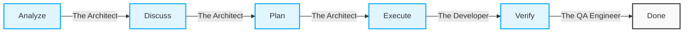

# Unlocking Seamless AI-Human Collaboration: A Deep Dive into the ACE Framework

## TL;DR

*   **What it is:** The **ACE Framework** is an IDE-agnostic methodology that structures how humans and Artificial Intelligence collaborate on software development.
*   **How it works:** It enforces a rigid **BMAD workflow** (Analyze, Discuss, Plan, Execute, Verify) and uses distinct AI personas (Architect, Developer, QA) to manage the coding lifecycle.
*   **The benefit:** It prevents AI hallucinations, protects existing architecture via regression guards, and empowers both developers and non-developers to safely build enterprise-grade software.

Ready to jump in? Scaffold your first project in seconds:
`npx create-ace-framework my-project`

---

## Introduction: The Evolution of AI in Software Development

In the rapidly evolving landscape of software development, Artificial Intelligence has transitioned from a mere novelty to an indispensable teammate. We've moved from simple auto-complete suggestions to large language models (LLMs) capable of generating entire applications from a single prompt. 

However, as the capabilities of AI have expanded, so too have the challenges associated with managing it. Left to their own devices without strict guardrails, AI agents can hallucinate, introduce breaking changes, overwrite critical configurations, and deviate significantly from established architectural patterns. 

This is the exact problem that the **ACE Framework** was built to solve. We recognized that the future of software engineering isn't about AI replacing developers; it is about creating a structured, predictable, and highly efficient collaborative environment where humans and AI work in tandem. The ACE Framework provides the missing scaffolding—the rules of engagement—that transforms chaotic AI text generation into disciplined, enterprise-grade software engineering.

## What is the ACE Framework?

The **ACE Framework** (v2.3) is an IDE-agnostic documentation and tooling framework designed for structured AI-human collaboration. It is not a code library or a traditional software package; instead, it acts as a localized **"Shared Brain"** that lives within your repository. 

It provides immutable standards, role definitions, contextual awareness, and procedural skills that are loaded by AI agents on demand.

At its core, ACE shifts the paradigm from "prompting" to "collaboration." It forces AI agents to pause, analyze the current state of the repository, plan their actions, execute them atomically, and rigorously verify the results. By maintaining a living context of the project within the repository itself, the ACE Framework ensures that an AI agent joining a project on day 100 has the exact same architectural understanding and historical context as the developers who started on day one.

> [!NOTE]
> **AI Agent Compatibility**
> The ACE Framework works seamlessly with tools like **Claude Code**, **Cursor**, and **GitHub Copilot**. These agents are instructed to first look for and read the `.aceconfig` file at your project root, which maps their behavior to your specific project standards before they write any code.

## Key Features of the ACE Framework

The ACE Framework is packed with features designed to maintain order, security, and architectural integrity:

### 1. The `.ace/` Directory (The AI Control Center)
Every ACE-enabled project contains an `.ace/` directory. This is the framework's brain. It houses immutable standards, role definitions, procedural skills, and workflow schemas. 

```text
.ace/
├── skills/               # Reusable AI procedural instructions
├── architecture.md       # Immutable system design rules
├── coding.md             # Code style and standards
└── .aceconfig            # The entry point for AI agents
```
When an AI agent starts a session, it reads `.aceconfig` to understand the rules of the road before it ever looks at your source code.

### 2. Procedural Skills on Demand
ACE includes a comprehensive library of procedural skills (e.g., database operations, root cause analysis, security audits). Instead of front-loading the AI with massive, generic instructions, `.aceconfig` maps specific task keywords to specific skill files. 

If you ask the AI to "audit security," it dynamically loads `.ace/skills/security-audit/SKILL.md` to learn exactly how your organization handles security audits. Because ACE uses the **AgentSkills.io standard**, you can instantly expand capabilities using native marketplaces.

### 3. Regression Guards and RCA Integration
One of the most powerful features of ACE is its emphasis on system stability. The framework maintains a `docs/rca/regression-guards.yaml` file. 

```yaml
# Example: docs/rca/regression-guards.yaml
guards:
  - file: "src/auth/jwt_validator.ts"
    reason: "Past incident RCA-102: Token expiration was not properly handled."
    invariant: "Any changes must ensure token expiry is checked before signature validation."
```

Before an AI agent modifies any file, it must check this registry. If a file is guarded, the AI must read the associated **Root Cause Analysis (RCA)** document, understand the architectural invariants, and guarantee that its new code will not break existing protections.

### 4. Living Context Documents
Instead of relying on developer memory, ACE uses the `docs/` folder to maintain living documents like `ACTIVE_CONTEXT.md` and `PROJECT_CONTEXT.md`. This ensures that every session starts with the AI fully aware of the project's current state, recent blockers, and immediate next steps.

## The BMAD Methodology: Structuring the Chaos

The beating heart of the ACE Framework is the **BMAD Methodology**. Every task, no matter how small, is forced through a rigid pipeline: **Analyze → Discuss → Plan → Execute → Verify**. 



To enforce this, ACE utilizes distinct **Agentic Roles**. The AI must adopt these personas depending on the phase of the work.

### Phase 1: ANALYZE (The Architect)
When a task begins, the AI assumes the role of **The Architect**. Its job is to read specifications, review Architectural Decision Records (ADRs), check regression guards, and identify constraints. The Architect does not write implementation code.

### Phase 2: DISCUSS (The Architect)
If there are ambiguities in the requirements, The Architect pauses and engages in a discussion with the human user. This phase ensures all soft requirements are captured before technical commitments are made.

### Phase 3: PLAN (The Architect)
Once requirements are clear, The Architect produces a detailed `implementation_plan.md`. This plan outlines the "What" and "How" before the "Do," ensuring alignment with architectural standards.

### Phase 4: EXECUTE (The Developer)
With the plan approved, the AI transitions into **The Developer**. The Developer's sole responsibility is to write clean, atomic code that strictly follows the Architect's plan. Crucially, The Developer commits code atomically—one logical change per commit.

### Phase 5: VERIFY (The QA Engineer)
After execution, the AI assumes the role of **The QA Engineer**. This adversarial persona is tasked with trying to break the code. It runs regression tests, executes verification plans, and produces a `walkthrough.md` documenting proof of success. 

*(Note: There is also an **Incident Responder** role triggered automatically if a bug or vulnerability is discovered).*

## How Different Roles Benefit from ACE

### For Developers and Engineers
- **Reduced Cognitive Load:** Developers no longer spend hours explaining architecture to their AI tools. The `.ace/` directory handles onboarding.
- **Safer Refactoring:** With Regression Guards, developers can instruct AI to refactor complex modules without fear of breaking critical invariants.
- **Automated Documentation:** The framework naturally generates ADRs, RCAs, and implementation plans as a byproduct of doing the work.

### For Non-Developers (Founders, Product Managers, Designers)
- **Translating Ideas into Reality:** Non-technical users can securely guide the AI to build complex applications by acting as the human counterpart during the "Analyze" and "Discuss" phases.
- **Predictable Outcomes:** Because the AI must create a plan and seek approval before executing, you are never left guessing what the AI is building.
- **Enterprise-Grade Quality:** Intrinsic skills and QA personas ensure best practices (like unit testing) are applied automatically.

## Getting Started: The Correct Way to Use ACE

We have built a dedicated CLI tool to scaffold the framework directly into your projects.

### Step 1: Scaffold the Framework
To create a new project with the ACE Framework pre-installed, run:

```bash
npx create-ace-framework my-new-project
```

To initialize the framework inside an existing directory:

```bash
npx create-ace-framework .
```

### Step 2: Review Your AI Control Center
Once initialized, inspect the `.ace/` and `docs/` directories. Feel free to tweak `architecture.md` or `coding.md` to match your company standards.

### Step 3: Start Collaborating
Open your preferred AI assistant (like Claude Code or Cursor). It will detect `.aceconfig`, ingest the context, and adopt the Architect persona. Give it a task and watch BMAD in action!

---

## Conclusion

The era of unpredictable, chaotic AI code generation is over. To truly harness the power of large language models in software engineering, we need structure, discipline, and shared context. 

The ACE Framework provides a robust, role-based, and highly secure environment where humans and AI can collaborate to build better software, faster. 

**Stop fighting with unpredictable AI outputs.** Scaffold your first ACE-powered project today and experience truly collaborative engineering. 

Explore the source code, read the full documentation, and join the collaboration:  
**[⭐ Star the ACE Framework on GitHub](https://github.com/jonnabio/ace-framework)**
