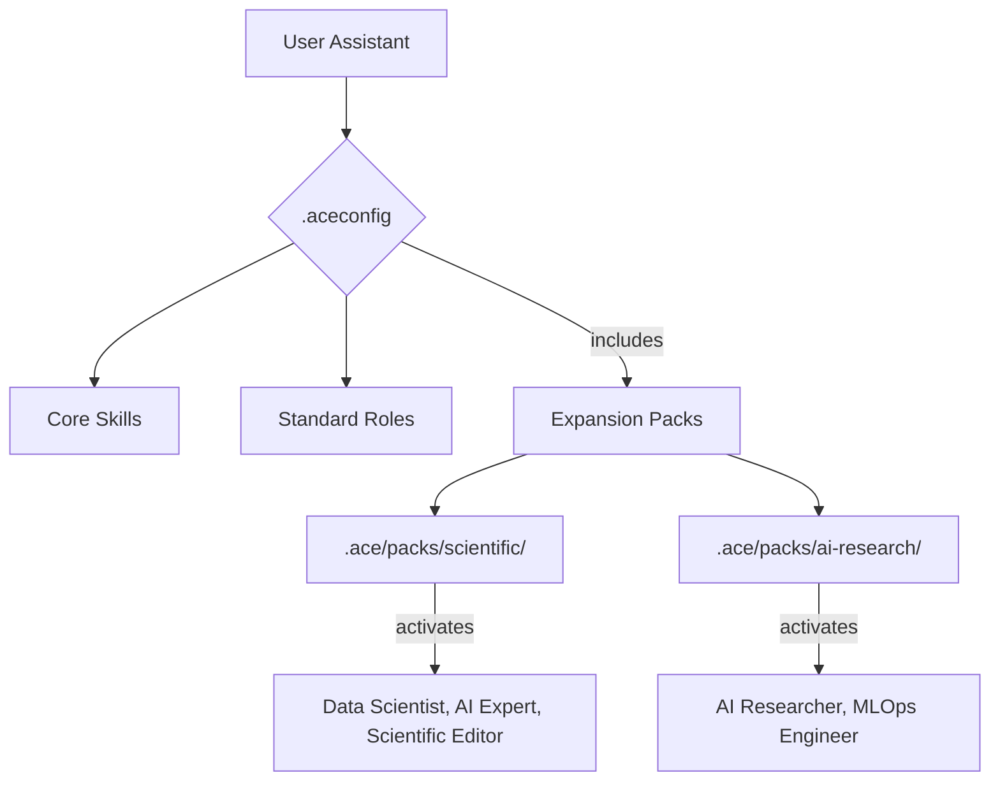

# Walkthrough: ACE Framework v2.5.0 Expansion Pack Release

## Overview
This walkthrough documents the major architectural transition of the ACE Framework from a monolithic skill library to a modular **Expansion Pack** ecosystem. The v2.5.0 update enables seamless integration of massive domain-specific skillsets while maintaining a lightweight core.

## 1. Architectural Implementation: Expansion Packs
The core of the v2.5.0 update is the introduction of modular configuration loading.

- **Modular Configuration**: Added the `includes` directive to `.aceconfig`, allowing dynamic loading of `.aceconfig-ext` files from the `.ace/packs/` directory.
- **Trigger Mapping**: Keywords like `genomics`, `finetune`, or `inference` now route to specialized skills inside expansion packs without polluting the core configuration.

## 2. Bundled Expansion Packs

### Scientific Expansion Pack (135+ Skills)
- **Role Augmentation**: Activates PhD-level scientific personas.
- **Core Skills Bundled**: `scanpy`, `biopython`, `rdkit`, `diffdock`, `paper-lookup`, `statsmodels`, `database-lookup`, `clinical-decision-support`.
- **Purpose**: Transforms ACE into a Scientific AI Co-Scientist for bioinformatics and chemistry.

### AI Research Expansion Pack (98+ Skills)
- **Role Augmentation**: Activates AI Researcher and MLOps Engineer personas.
- **Core Skills Bundled**: Full library from Orchestra Research, including `vllm`, `deepspeed`, `axolotl`, `trl`, `transformer-lens`, and `langchain`.
- **Purpose**: Provides production-grade engineering instructions for the entire LLM lifecycle (training, optimization, serving).

## 3. CLI & Tooling Upgrades
The `create-ace-framework` CLI has been upgraded to **v2.5.0** to support these new capabilities.

- **`--pack` flag**: Users can now specify `--pack scientific` or `--pack ai-research` during scaffolding.
- **Automated Installers**: The CLI automatically triggers `npx skills add` or `npx @orchestra-research/ai-research-skills` to populate the project with the required binaries and documentation.

## 4. Documentation & Standards
- **CLAUDE.md**: Updated with Expansion Pack installation and usage protocols.
- **.cursorrules**: Refined to guide AI assistants in utilizing expansion pack roles and skills.
- **Version Unification**: All core framework components have been unified to v2.5.0.

## Verification
- [x] CLI scaffolds project with correct pack flag.
- [x] `.aceconfig` correctly includes expansion configurations.
- [x] AI assistant adopts augmented roles (e.g., AI Researcher) upon request.
- [x] Skill triggers correctly route to bundled Expansion Pack documentation.

---
**Standard:** ACE Framework v2.5.0  
**Role:** Scientific Editor  
**Status:** RELEASE READY
